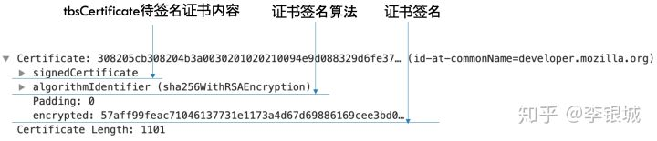
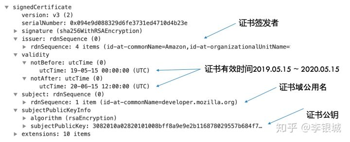
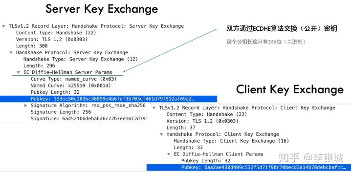

# HTTPS

https://zhuanlan.zhihu.com/p/75461564

https://www.jianshu.com/p/6bf2f9a37feb

## SSL建立过程


1.客户端发送 Client Hello（包含支持的协议版本、支持的加密算法名称，要访问域名和 **随机数A (Client random)**）到服务端，提前告知服务器想要访问的域名以便服务器发送相应的域名的证书过来。

2.服务端返回 Server Hello：包被选中的加密套餐名称，证书链，**随机数B (Server random)** 到客户端

加密套装比如TLS_ECDHE_RSA_WITH_AES_128_GCM_SHA256表示：

（1）密钥交换使用ECDHE

（2）证书签名算法RSA

（3）数据加密使用AES 128 GCM

（4）签名校验使用SHA256

3.客户端使用CA证书验证返回证书无误后。生成 **随机数C (Premaster secret)**，用公钥对其加密，发送到服务端

通过一系列证书包含根证书，确认证书真实。

4服务端用 **私钥** 解密得到 **随机数C (Premaster secret)**，随后根据已经得到的 **随机数ABC生成对称密钥（hello的时候确定的加密算法）**，并对需要发送的数据进行对称加密发送

5.客户端使用对称密钥（客户端也用随机数ABC生成对称密钥）对数据进行解密。

6.双方手持对称密钥 **使用对称加密算法通讯**


本篇将讨论HTTPS的加解密原理，很多人都知道RSA，以为HTTPS  =  RSA，使用RSA加解密数据，实际上这是不对的。HTTPS是使用RSA进行身份验证和交换密钥，然后再使用交换的密钥进行加解密数据。身份验证是使用RSA的非对称加密，而数据传输是双方使用相同的密钥进行的对称加密。那么，什么是对称加密和非对称加密？

## 1. 对称加密和非对称加密

假设隔壁小王想要约小红出来，但是他不想让小明知道，于是他想用对称加密给小红传了个小纸条，如下图所示：


他想发送的数据的数据是"Meet  at 5:00  PM"（5点见面，如果是中文的话可以使用UTF-8编码），加密方式是直接在ASCII表进行左移或右移，他的密钥是3，表示在ASCII表往后移3位，就会变成"Phhw#dw#8=33#SP"，这样一般人如果截获了不知道是什么意思的。但是我们可以想一下，如果既然他可以载获你的数据，自然也可以截获你的密钥，进而进行解密，如下图所示：


所以小王打算用非对称加密，非对称加密的特点是双方都有自己的公钥和私钥对，其中公钥发给对方，密钥不交换自己保管不泄漏，如下图所示：


其中小红的公钥为：

public_key = (N, e) = (3233, 17)

她把公钥发给了小明，她自己的私钥为：

private_key = (N, e) = (3233, 2753)

这里注意公钥和私钥都是两个数，N通常是一个大整数，e表示一个幂指数。现在小王想给小红发消息，于是他用小红的公钥进行加密，怎么加密呢？他要发送的第一个字母为t = “M”，“M”的ASCII编码为77，77的加密过程如下计算：

T = 77 ^ e  % N = 77 ^ 17 % 3233 = 3123

把77做e次幂然后模以N，便得到了T = 3123，然后把这个数发给小红（其它字母按同样方式处理）。小红收到T之后便用她的私钥进行解密，计算如下：

t = T ^ e % N = 3123 ^ 2753 % 3233 = 77

计算方法是一样的，这样便把T还原成了t，只要公私钥配对，便可通过一些数学公式证书上面的推算是成立的。这个就是RSA的加解密原理，如果无法知道私钥便无法进行正确解密。反过来，使用私钥进行加密，公钥进行解密也是可行的。

那么HTTPS是怎么利用RSA进行加解密的呢，我们从HTTPS连接建立过程说起。

## 2. HTTPS连接建立过程

HTTPS主要有以下作用：

- \1. 验证服务方身份，如我访问[http://google.com](https://link.zhihu.com/?target=http%3A//google.com)的时候连的确实就是谷歌服务器
- \2. 防止数据被劫持，例如有些运营商会给http的页面插入广告
- \3. 防止敏感数据被窃取篡改等

正如openssl的注释所说这是防止中间人攻击的唯一方法：


我们以MDN（[https://developer.mozilla.org](https://link.zhihu.com/?target=https%3A//developer.mozilla.org)）的网站为例，然后用wireshark抓包，观察HTTPS连接建立的过程，如下图所示：


首先是TCP三次握手，然后客户端（浏览器）发起一个HTTPS连接建立请求，客户端先发一个Client Hello的包，然后服务端响应一个Server Hello，接着再给客户端发送它的证书，然后双方经过密钥交换，最后使用交换的密钥加行加解密数据。

在Client Hello里面客户端会告知服务端自己当前的一些信息，如下图所示：


包括客户端要使用的TLS版本，支持的加密套装，要访问的域名，给服务端生成的一个随机数（Nonce）等。需要提前告知服务器想要访问的域名以便服务器发送相应的域名的证书过来，因为此时还没有发生HTTP请求。

服务端在Server Hello里面会做一些响应：


服务端选中的加密套装叫TLS_ECDHE_RSA_WITH_AES_128_GCM_SHA256，这一串的意思是：

（1）密钥交换使用ECDHE

（2）证书签名算法RSA

（3）数据加密使用AES 128 GCM

（4）签名校验使用SHA256

接着服务给客户端发来了4个证书：


第一个证书的公用名（common name）就是我们当前访问的域名[http://developer.mozilla.org](https://link.zhihu.com/?target=http%3A//developer.mozilla.org)，如果公用名是*.[http://mozilla.org](https://link.zhihu.com/?target=http%3A//mozilla.org)的话那么这个证书便能给[http://mozilla.org](https://link.zhihu.com/?target=http%3A//mozilla.org)的所有二级子域名使用。第二个证书是第一个证书的签发机构（CA）的证书，它是Amazon，也就是说Amazon会用它的私钥给[http://developer.mozilla.org](https://link.zhihu.com/?target=http%3A//developer.mozilla.org)进行签名。依此类推，第三个证书会给第二个证书签名，第四个证书会给第三个证书签名，并且我们可以看到第四个证书是一个根（Root）证书。

一个证书里面会有什么东西呢，我们可以展开第一个证书看一下，如下图所示：





证书包含三部分内容：tbsCertificate（to  be signed  certificate）待签名证书内容、证书签名算法和CA给的签名。也就是说CA会用它的私钥对tbsCertificate进行签名，并放在签名部分。为什么证书要签名呢？签名是为了验证身份。

## 3. 身份验证

### 证书签名算法

ca使用的签名算法

### 签名

ca使用私钥对tbsCertificate进行签名

### 待签名证书内容

我们先来看一下tbsCertificate里面有什么内容，如下图所示：





它里面包括了证书的公钥、证书的适用公用名、证书的有效期还有它的签发者等信息。Amazon的证书也具备上述结构，我们可以把Amazon证书的公钥拷出来，如下图所示：


中间有一些填充的数字，用灰色字表示。可以看到N通常是一个很大的整数（二进制2048位），而e通常为65537.

然后我们用这个CA的公钥对[http://mozilla.org](https://link.zhihu.com/?target=http%3A//mozilla.org)的证书签名进行解密，方法和上面的类似：


取解密后的数字decrypted的十六进制的末64位，即为二进制256位的SHA哈希签名。接下来我们手动计算一下tbsCertificate的SHA256哈希值，方法是在wireshark里面把tbsCertificate导出一个原始二进制文件：


然后再使用openssl计算它的哈希值，如下所示：

liyinchengs-MBP:https liyincheng$ openssl dgst -sha256 ~/tbsCertificate.bin
SHA256(/Users/liyincheng/tbsCertificate.bin)= 5e300091593a10b944051512d39114d56909dc9a504e55cfa2e2984a883a827d

我们发现**手动计算的哈希值和加密后的证书里的哈希值一致**！说明只有知道了Amazon私钥的人才能正确地对[http://mozilla.org](https://link.zhihu.com/?target=http%3A//mozilla.org)的证书签名，因为公私钥是唯一匹配的。因此我们验证了第一个证书[http://mozilla.org](https://link.zhihu.com/?target=http%3A//mozilla.org)确实是由第二个证书Amazon签发的，使用同样的方式，我们可以验证Amazon是由第三个签发的，第三个是由第四个根证书签发。并且第四个证书是根证书，它是内置于操作系统的（通过Mac的keychain工具可以查看）：


假如Hacker通过DNS欺骗之类的方式把你访问的域名指向了他的机器，然后他再伪造一个证书。但是由于根证书都是内置于操作系统的，所以它改不了签名的公钥，并且它没有正确的私钥，只能用自己的私钥，由于公私钥不配对，很难保证加解密后的信息一致。或者直接把浏览器拿到的证书搬到他自己的服务器？这样再给浏览器发的证书便是一模一样，但是由于他不知道证书的私钥，所以无法进行后续的操作，因此这样是没有意义的。

**这个就是HTTPS能够验证身份的原理。**

另外一个例子是SSH，需要手动验证签名是否正确，例如通过打电话或者发邮件等方式告知服务器的签名，与自己算的证书的签名是否一致，如果一致说明证书没有被篡改过（如证书的公钥没有被改为Hacker的公钥）：


上面展示的便是自己手动计算的值，拿这个值和之前的值进行比较是否相等便可知发过来的证书是否没被修改过。

那么，为什么不直接使用RSA的密钥对进行加密数据？因为RSA的密钥对数值太大，不太合适频繁地加解密数据，所以需要更小的密钥，另一个原因是服务端没有浏览器或者客户端的密钥，无法向浏览器发送加密的数据（不能用自己的私钥加密，因为公钥是公开的）。所以需要进行密钥交换。

## 4. 密钥交换

密钥交换的方式有两种RSA和ECDHE，RSA的方式比较简单，浏览器生成一把密钥，然后使用证书RSA的公钥进行加密发给服务端，服务再使用它的密钥进行解密得到密钥，这样就能够共享密钥了，它的缺点是攻击者虽然在发送的过程中无法破解，但是如果它保存了所有加密的数据，等到证书到期没有被维护之类的原因导致私钥泄露，那么它就可以使用这把私钥去解密之前传送过的所有数据。而使用ECDHE是一种更安全的密钥交换算法。如下图所示，双方通过ECDHE进行密钥交换：





ECDHE的全称是Elliptic Curve Diffie–Hellman key Exchange椭圆曲线迪非-赫尔曼密钥交换，它是对迪非-赫尔曼密钥交换算法的改进，这个算法的思想如下图所示：


为了得到共享秘钥K，甲用它的私钥计算一个数g ^ a，发送给乙，乙的私钥为b，乙便得到K = g ^ a ^ b，同时发送g ^ b给甲，甲也得到了K = g ^ b ^ a。这个应该比较好理解，而引入椭圆曲线加密能够提高破解难度。

## 5. 椭圆曲线加密

现在的证书的签名算法有两种，RSA和新起的EC，如下图所示，[http://google.com](https://link.zhihu.com/?target=http%3A//google.com)便是使用的ECC证书：


我们上面讨论的便是RSA，破解RSA的难点在于无法对公钥的N进行质数分解，如果你能对证书的N拆成两个质数相乘，便可推算出证书的私钥，但是在当前的计算能力下是不可能的。而ECC的破解难点在于找到指定点的系数。

如下图所示，有一条椭圆曲线方程：y ^ 3 = x ^ 2 + ax + b:


给定一个起点G(x, y)，现在要计算点P = 2G的坐标，其过程是在G点上做一条线与曲线相切于-2G，做-2G相对于x轴的反射便得到2G点。为了计算3G的坐标，如下图所示：


连接2G与G与曲线相郊于-3G，再做反射得到3G，同理计算4G便是连接G与3G再做反射。如果最后一个点和起点的连线垂直于x轴，说明所有的点已用完。

EC的难点在于给定起点G和点K：

K = kG

想要得到k（k足够大）是一件很困难的事情。这个k便是私钥，而K = kG便是公钥。ECC是怎么加解密数据的呢？

假设要加密的数据为m，把这个点当作x坐标得到在曲线上的一个点M，取定一个随机数r，计算点C1 = rG，C2 = M + rK，把这两个点便是加密后的数据，发给对方，对方收到后使用私钥k进行解密，过程如下：

M = C2 - rK = C2 - rkG = C2 - rkG = C2 - kC1

通过上面的计算便能还原得到M. 而不知道私钥k的人是无法解密的。更多细节可见medium的这篇文章《[ECC elliptic curve encryption](https://link.zhihu.com/?target=https%3A//medium.com/neweconolab/ecc-elliptic-curve-encryption-feb48340f31f)》。

这样我们便理解了ECC的原理，那么怎么利用ECC进行密钥交换呢？

## 6. ECC密钥交换

原理很简单，如下图所示：


之前交换的是两个幂次方的数，现在变成交换两个曲线上的点。

而曲线方程是规定好的，例如Curve X25519使用的曲线方程为：y^2 = x^3 + 486662x^2 + x，在密钥交换里面会指定所使用的曲线方程，如下图所示：


[http://mozilla.org](https://link.zhihu.com/?target=http%3A//mozilla.org)所使用的曲线方程为secp256r1，这个也是比较流行的一个，它的参数比Curve X25519大很多。密钥交换也使用了证书的私钥进行签名保证交换的密钥不会被人篡改，只是这里的私钥是mozilla自已的私钥。

也就是说从连接建立到现在都是明文传输的。接下来双方发送Change Cipher Spec的包通知接下来的包都按照之前约定好的方式进行加密。至此整个安全连接建立完毕。

## 7. HTTPS证书的应用

那么是谁在做HTTPS加密呢？服务端通常是Nginx、Apache这些反向代理服务器做的，而具体的业务服务器不需要处理，客户端通常是浏览器等做的加解密，Chrome是使用boringSSL这个库，fork自openssl。

我们可以通过let’s encrypt可以申请免费的TLS证书，每3个月需要手动续，证书分为3种：DV、OV、EV，DV适用于个人，OV和EV需要身份审核，EV最高端。EV证书会在浏览器的地址栏显示证书的企业名称：


但是新版的Chrome似乎把这个去掉了，所以我们打开medium的控制台可以看到一个提示：

> As  part of an experiment, Chrome temporarily shows only the lock icon in  the address bar. Your SSL certificate with Extended Validation is still  valid.

另外我们可以用用openssl生成一个自签名证书，执行以下命令：

openssl req -x509 -nodes -sha256 -days 365 -newkey rsa:2048 -keyout test.com.key -out test.com.crt

便会得到两个文件，test.com.crt是证书，test.com.key是证书的私钥，如下图所示：


然后把这两个文件给nginx使用便能使用https访问，如下代码所示：

```nginx
    server {
        listen       443;
        server_name  test.com;
        ssl on;
        ssl_certificate    test.com.crt;
        ssl_certificate_key    test.com.key;
     }
```

可以把这个证书添加到系统证书里面，这样浏览器等便能信任，或者直接使用mkcert工具一步到位。

## 8. 客户端证书

还有一种证书叫客户端证书，同样需要向CA机构申请一个客户端证书，和服务端TLS证书不一样的地方是，服务端证书通常是和域名绑定的，而客户端证书可以给本地的任意可执行文件进行签名。签名验证算法和上文讨论  的TLS证书一致。为什么可执行文件需要签名呢，因为如果不签名的话，系统会拦截安装或者运行，如Mac双击一个未签名的dmg包的提示：


直接不让你运行了，而windows也有类似的提示：

而windows是会给一个警告：


而当我们运行一个已签名的exe文件将会是正常的提示，如Chrome的提示：


综上本文主要讨论了对称加密和非对称加密的原理，并介绍了如何利用RSA对证书签名的检验以验证连接服务器的身份，怎么利用ECC进行数据加密和密钥交换，介绍了下怎么生成和使用HTTPS证书，并介绍了下客户端证书。相信看完本篇会对HTTPS的加解密有一个较为全面的了解，之前也写过一篇介绍HTTPS的，本篇补充了更多的细节内容。


## 根证书

### 证书

> 证书用来证明公钥拥有者身份的凭证

首先我们需要知道 证书是怎么来的。

数字证书一般由数字证书认证机构签发，需要

- 申请者通过**非对称加密算法（RSA）** 生成一对**公钥**和**密钥**，然后把需要的申请信息（国家，域名等）连同公钥发送给 **证书认证机构（CA）** 
- CA构确认无误后通过**消息摘要算法**（MD5，SHA) 生成整个申请信息的摘要签名M， 然后 把 **签名M和使用的摘要算法** 用 **CA自己的私钥** 进行加密

证书包含了

- 公钥
- 证书拥有者身份信息
- 数字证书认证机构（发行者）信息
- 发行者对这份文件的数字签名及使用的算法
- 有效期

证书的格式和验证方法普遍遵循[X.509](https://links.jianshu.com/go?to=https%3A%2F%2Fwww.wikiwand.com%2Fzh-hans%2FX.509) 国际标准。


image

### 证书认证机构（CA）

> 数字证书认证机构（英语：Certificate Authority，缩写为CA），也称为电子商务认证中心、电子商务认证授权机构，是负责发放和管理数字证书的权威机构，并作为电子商务交易中受信任的第三方，承担公钥体系中公钥的合法性检验的责任。

其实任何个体/组织都可以成为CA（自签证书），但是你发发布的证书客户端是不信任的，也是就前文提及的需要权威。比如 **Symantec、Comodo、Godaddy、Digicert**。

客户端信任这些CA，就会在其本地保持这些CA的 **根证书**（**root certificate**），**根证书是CA自己的证书**，是证书验证链的开头。
 根证书没有机构（已经是权威了）再为其做数字签名，所以都是自签证书。

CA会通过 **中介证书（intermediate-certificate）** 替代根证书的去做服务器端的证书签名，确保根证书密钥绝对不可访问。

Godaddy 给出了解释
 [What is an intermediate certificate?](https://links.jianshu.com/go?to=https%3A%2F%2Fsg.godaddy.com%2Fhelp%2Fwhat-is-an-intermediate-certificate-868)

### 证书信任链

前文提到，在向CA 申请证书时是需要 **CA的私钥** 去对整个证书的签名摘要做非对称加密的，也就是证书是可以通过 **CA的公钥** 去解密得到**证书的签名摘要**的。
 当我们再次用 **相同的摘要算法**（证书里面有保存所使用的算法）对整个证书做签名，如果得到的签名和证书上的签名是一致的，说明这个证书是可信任的。

同理，中介证书 也是可以被这样的方式证明其可信任。这样的一整个流程称为 **信任链**（Chain of trust）。

就是我**绝对**相信你（A>B）；你**绝对**相信他（B>C）；等于我**绝对**相信他（A>C）。

以下是整个流程：


信任链.gif

1. 客户端得到服务端返回的证书，通过读取得到 **服务端证书的发布机构（Issuer）** 
2. 客户端去操作系统查找这个发布机构的的证书，如果是不是根证书就继续递归下去 **直到拿到根证书**。
3. 用 **根证书的公钥** 去 **解密验证** 上一层证书的**合法性**，再拿上一层证书的公钥去验证更上层证书的合法性；递归回溯。
4. 最后验证服务器端的证书是 **可信任** 的。


## 9.https注意


### 不要随意下载证书


