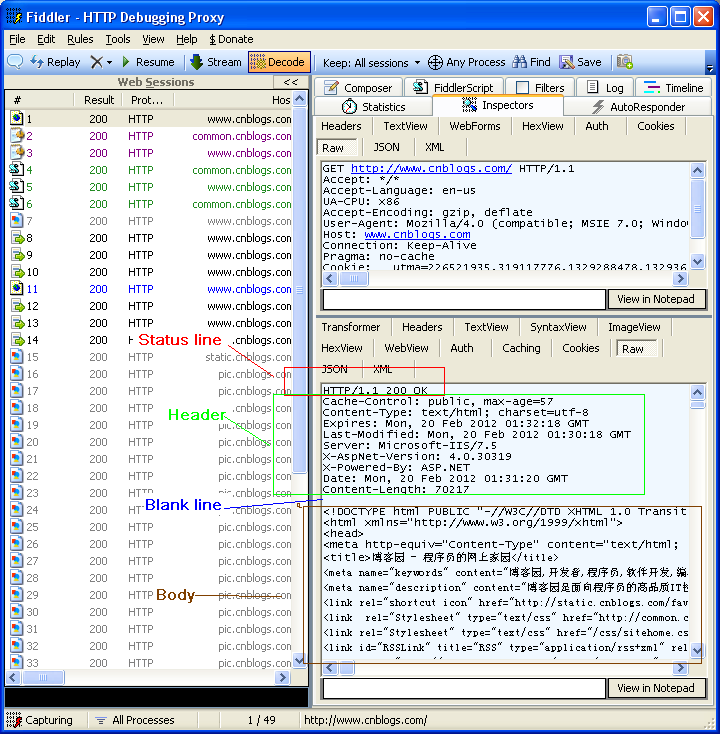
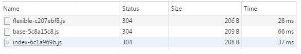
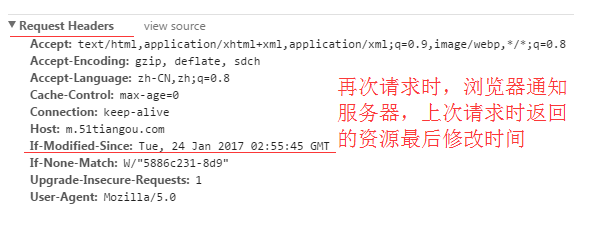

# HTTP协议

​	早在 HTTP 建立之初，主要就是为了将超文本标记语言(HTML)文档从Web服务器传送到客户端的浏览器。也是说对于前端来说，我们所写的HTML页面将要放在我们的 web 服务器上，用户端通过浏览器访问url地址来获取网页的显示内容，但是到了 WEB2.0 以来，我们的页面变得复杂，不仅仅单纯的是一些简单的文字和图片，同时我们的 HTML 页面有了 CSS，Javascript，来丰富我们的页面展示，当 ajax 的出现，我们又多了一种向服务器端获取数据的方法，这些其实都是基于 HTTP 协议的。同样到了移动互联网时代，我们页面可以跑在手机端浏览器里面，但是和 PC 相比，手机端的网络情况更加复杂，这使得我们开始了不得不对 HTTP 进行深入理解并不断优化过程中。


[HTTP1.0、HTTP1.1和HTTP2.0的区别](https://www.jianshu.com/p/be29d679cbff)

# HTTP1.0

1. 默认不支持长连接，需要设置keep-alive参数指定
2. 强缓存expired、对比缓存last-modified\if-modified-since 有一定的缺陷，因为使用last-modified只能精确到1s。


# HTTP1.1

1. 默认长连接(keep-alive)，http请求可以复用Tcp连接，但是同一时间只能对应一个http请求(http请求在一个Tcp中是串行的)
2. 增加了强缓存cache-control、对比缓存etag\if-none-match 是对http/1 缓存的优化


# HTTP2

1. 多路复用，一个Tcp中多个http请求是并行的 (雪碧图、多域名散列等优化手段http/2中将变得多余)
2. 二进制格式编码传输
3. header压缩
4. 服务端推送


[HTTP/2: the Future of the Internet](https://links.jianshu.com/go?to=https%3A%2F%2Flink.zhihu.com%2F%3Ftarget%3Dhttps%3A%2F%2Fhttp2.akamai.com%2Fdemo) 是 Akamai 公司建立的一个官方的演示，用以说明 HTTP/2 相比于之前的 HTTP/1.1 在性能上的大幅度提升。 同时请求 379 张图片，从Load time 的对比可以看出 HTTP/2 在速度上的优势。


## 二进制编码

与Http1.x（文本协议）不同，Http2是一个二进制协议，所有的消息被http2拆分封装成更小的消息单元帧，并进行二进制编码。其中http1.x的首部信息被封装成HEADER帧和CONTINUATION帧，请求体被封装到DATA帧，如下图所示：
　　　

### 为什么使用二进制？

性能。二进制协议的解析效率超高，几乎没有解析代价；
带宽。二进制协议没有冗余字段，占用带宽少；
压缩及Https技术弱化了文本协议的价值；

**二进制协议**

二进制协议一般消息头固定和消息体变长 ，每个字段固定了含义 ，其特点如下：

可读性差，难于调试（缺点）；
扩展性不好 ，如果要扩展字段，旧版协议就不兼容了（缺点）；
解析效率超高，几乎没有解析代价（优点）；
没有冗余字段，体积小（优点）；

**文本协议**

可读性好，便于调试；
扩展性也好，方便兼容旧协议；
解析效率一般，需要进行字符串比对；
存在冗余字段，体积大；


## 头部压缩

假定一个页面有100个资源需要加载（这个数量对于今天的Web而言还是挺保守的）, 而每一次请求都有1kb的消息头（这同样也并不少见，因为Cookie和引用等东西的存在）, 则至少需要多消耗100kb来获取这些消息头。HTTP2.0可以维护一个字典，差量更新HTTP头部，大大降低因头部传输产生的流量。

[HTTP/2 头部压缩技术介绍](https://imququ.com/post/header-compression-in-http2.html)


- 维护一份相同的静态字典（Static Table），包含常见的头部名称，以及特别常见的头部名称与值的组合；
- 维护一份相同的动态字典（Dynamic Table），可以动态地添加内容；
- 支持基于静态哈夫曼码表的哈夫曼编码（Huffman Coding）；

## 多路复用和长连接？

- HTTP/1.0 一次请求-响应，建立一个连接，用完关闭；每一个请求都要建立一个连接；

- HTTP/1.1 Pipeling解决方式为，若干个请求排队串行化单线程处理，后面的请求等待前面请求的返回才能获得执行机会，一旦有某请求超时等，后续请求只能被阻塞，毫无办法，也就是人们常说的线头阻塞；

- HTTP/2多个请求可同时在一个连接上并行执行。某个请求任务耗时严重，不会影响到其它连接的正常执行；
   具体如图：

  

  

HTTP 性能优化的关键并不在于高带宽，而是低延迟。TCP 连接会随着时间进行自我「调谐」，起初会限制连接的最大速度，如果数据成功传输，会随着时间的推移提高传输的速度。这种调谐则被称为 TCP 慢启动。由于这种原因，让原本就具有突发性和短时性的 HTTP 连接变的十分低效。
 HTTP/2 通过让所有数据流共用同一个连接，可以更有效地使用 TCP 连接，让高带宽也能真正的服务于 HTTP 的性能提升。

### TCP拥塞控制

拥塞窗口cwnd（congestion window）

慢开始门限ssthresh


1）慢开始

慢开始算法的思路就是，不要一开始就发送大量的数据，先探测一下网络的拥塞程度，也就是说由小到大逐渐增加拥塞窗口的大小。

没经过一个传输轮次，拥塞窗口cwnd加倍，直到到慢开始门限ssthresh。

2）拥塞避免

到慢开始门限ssthresh后，为了避免拥塞，每经过一个传输轮次，拥塞窗口cwnd只+1.

发生网络拥塞时，设置新慢开始门限ssthresh，为当前拥塞窗口cwnd的1/2，重新执行满开始算法。

3）快重传

快重传要求接收方在收到一个失序的报文段后就立即发出重复确认（为的是使发送方及早知道有报文段没有到达对方，可提高网络吞吐量约20%）而不要等到自己发送数据时捎带确认。快重传算法规定，发送方只要一连收到三个重复确认就应当立即重传对方尚未收到的报文段，而不必继续等待设置的重传计时器时间到期。如下图：


4）快恢复

当发送方连续收到三个重复确认时，就执行“乘法减小”算法，把ssthresh门限减半（为了预防网络发生拥塞）。但是接下去并不执行慢开始算法
考虑到如果网络出现拥塞的话就不会收到好几个重复的确认，所以发送方现在认为网络可能没有出现拥塞。所以此时不执行慢开始算法，而是将cwnd设置为ssthresh减半后的值，然后执行拥塞避免算法，使cwnd缓慢增大。如下图：TCP Reno版本是目前使用最广泛的版本。


## 服务端推送

服务器推送（server push）是 HTTP/2 协议里面唯一一个需要开发者自己配置的功能。其他功能都是服务器和浏览器自动实现，不需要开发者关心。

HTTP/2的服务器推送技术（server push）指的是，还没有收到浏览器的请求，服务器就把各种资源推送给浏览器。

比如：浏览器只请求了index.html，但是服务器把index.html、style.css、example.png全部发送给浏览器。这样的话，只需要一轮 HTTP 通信，浏览器就得到了全部资源，提高了性能。

[快速理解HTTP/2的服务器推送(Server Push)](https://www.cnblogs.com/imstudy/p/9336498.html)

服务器推送可以提高性能。网上[测评的结果](https://www.smashingmagazine.com/2017/04/guide-http2-server-push/#measuring-server-push-performance)是，打开这项功能，比不打开时的 HTTP/2 快了8%，比将资源都嵌入网页的 HTTP/1 快了5%。

可以看到，提升程度也不是特别多，大概是几百毫秒。而且，也不建议一次推送太多资源，这样反而会拖累性能，因为浏览器不得不处理所有推送过来的资源。只推送 CSS 样式表可能是一个比较好的选择。

# HTTPS


## 强制用户使用https

有的网站开启了https，但为了照顾用户的使用体验（因为用户总是很赖的，一般不会主动键入https，而是直接输入域名,  直接输入域名访问，默认就是http访问）同时也支持http访问，当用户http访问的时候，就会返回给用户一个302重定向，重定向到https的地址，然后后续的访问都使用https传输,这种通信模式看起来貌似没有问题，但细致分析，就会发现种通信模式也存在一个风险，那就是这个302重定向可能会被劫持篡改，如果被改成一个恶意的或者钓鱼的https站点，然后，你懂得，一旦落入钓鱼站点，数据还有安全可言吗？

对于篡改302的攻击，建议服务器开启HTTP Strict Transport Security功能，这个功能的含义是：

当用户已经安全的登录开启过htst功能的网站  (支持hsts功能的站点会在响应头中插入：Strict-Transport-Security) 之后，支持htst的浏览器(比如chrome.  firefox)会自动将这个域名加入到HSTS列表，下次即使用户使用http访问这个网站，支持htst功能的浏览器就会自动发送https请求（前提是用户没有清空缓存，如果清空了缓存第一次访问还是明文，后续浏览器接收到服务器响应头中的Strict-Transport-Security，就会把域名加入到hsts缓存中，然后才会在发送请求前将http内部转换成https），而不是先发送http，然后重定向到https，这样就能避免中途的302重定向URL被篡改。进一步提高通信的安全性。

[为什么我们要使用HTTP Strict Transport Security？](https://www.freebuf.com/articles/web/66827.html)  

[HSTS详解](https://www.jianshu.com/p/caa80c7ad45c)    


# HTTP消息的结构

## Request

先看Request 消息的结构,   Request 消息分为3部分，

第一部分叫Request line, 

第二部分叫Request header, 

header和body之间有个空行

第三部分是body


第一行中的Method表示请求方法,比如"POST","GET",  Path-to-resoure表示请求的资源， Http/version-number 表示HTTP协议的版本号

当使用的是"GET" 方法的时候， body是为空的

比如我们打开博客园首页的request 如下

```
GET http://www.cnblogs.com/ HTTP/1.1
Host: www.cnblogs.com
```

抽象的东西，难以理解，老感觉是虚的， 所谓眼见为实, 实际见到的东西，我们才能理解和记忆。 我们今天用Fiddler，实际的看看Request和Response.

下面我们打开Fiddler 捕捉一个博客园登录的Request 然后分析下它的结构, 在Inspectors tab下以Raw的方式可以看到完整的Request的消息，   如下图


 

## Response

我们再看Response消息的结构, 和Request消息的结构基本一样。 同样也分为三部分

第一部分叫Response line

第二部分叫Response header

header和body之间也有个空行

第三部分是body


HTTP/version-number表示HTTP协议的版本号，  status-code 和message状态码和状态信息

我们用Fiddler 捕捉一个博客园首页的Response然后分析下它的结构, 在Inspectors tab下以Raw的方式可以看到完整的Response的消息，   如下图



 

# 状态码

[HTTP 响应代码](<https://developer.mozilla.org/zh-CN/docs/Web/HTTP/Status>)

状态码

Response 消息中的第一行叫做状态行，由HTTP协议版本号， 状态码， 状态消息 三部分组成。

状态码用来告诉HTTP客户端,HTTP服务器是否产生了预期的Response.

HTTP/1.1中定义了5类状态码， 状态码由三位数字组成，第一个数字定义了响应的类别

1XX  **提示信息** - 表示请求已被成功接收，继续处理

2XX  **成功** - 表示请求已被成功接收，理解，接受

3XX  **重定向** - 要完成请求必须进行更进一步的处理

4XX  **客户端错误** -  请求有语法错误或请求无法实现

5XX  **服务器端错误** -   服务器未能实现合法的请求

 

看看一些常见的状态码

**200 OK** 最常见的就是成功响应状态码200了， 这表明该请求被成功地完成，所请求的资源发送回客户端

 

**302 Found**

重定向，新的URL会在response 中的Location中返回，浏览器将会自动使用新的URL发出新的Request

例如在IE中输入， http://www.google.com. HTTP服务器会返回302， IE取到Response中Location header的新URL, 又重新发送了一个Request.

 

**304 Not Modified**

代表上次的文档已经被缓存了， 还可以继续使用，

例如打开博客园首页, 发现很多Response 的status code 都是304

提示：　如果你不想使用本地缓存可以用Ctrl+F5 强制刷新页面

 

**400 Bad Request**  客户端请求与语法错误，不能被服务器所理解

**403 Forbidden** 服务器收到请求，但是拒绝提供服务

**404 Not Found**

请求资源不存在（输错了URL）

比如在IE中输入一个错误的URL， http://www.cnblogs.com/tesdf.aspx

 

**500 Internal Server Error** 服务器发生了不可预期的错误

**503 Server Unavailable** 服务器当前不能处理客户端的请求，一段时间后可能恢复正常


# Get和Post

Http协议定义了很多与服务器交互的方法，最基本的有4种，分别是GET,POST,PUT,DELETE.  一个URL地址用于描述一个网络上的资源，而HTTP中的GET, POST, PUT, DELETE就对应着对这个资源的查，改，增，删4个操作。  我们最常见的就是GET和POST了。

GET一般用于获取/查询资源信息，

而POST一般用于更新资源信息。

1. GET提交的数据会放在URL之后，以?分割URL和传输数据，参数之间以&相连，如EditPosts.aspx?name=test1&id=123456.  POST方法是把提交的数据放在HTTP包的Body中.

2. GET提交的数据大小有限制（因为浏览器对URL的长度有限制），而POST方法提交的数据没有限制.

3. GET方式提交数据，会带来安全问题，比如一个登录页面，通过GET方式提交数据时，用户名和密码将出现在URL上，如果页面可以被缓存或者其他人可以访问这台机器，就可以从历史记录获得该用户的账号和密码.

纯粹的明文请求被拦截了，get和post都是一样的不安全，应该使用https进行加密。


# 缓存机制

[HTTP缓存控制小结](<https://imweb.io/topic/5795dcb6fb312541492eda8c>)

   虽然 HTTP 缓存不是必须的，但重用缓存的资源通常是必要的。然而常见的 HTTP 缓存只能存储 [`GET`](https://developer.mozilla.org/zh-CN/docs/Web/HTTP/Methods/GET) 响应，对于其他类型的响应则无能为力。缓存的关键主要包括request method和目标URI（一般只有GET请求才会被缓存）。 

比如百度的post请求使用一个过去的时间。

```html
Expires: Thu, 19 Nov 1981 08:52:00 GMT      
Pragma: no-cache
```
对缓存机制不太了解的同学可能会问，基于对比缓存的流程下，不管是否使用缓存，都需要向服务器发送请求，那么还用缓存干什么？
 这个问题，我们暂且放下，后文在详细介绍每种缓存规则的时候，会带给大家答案。

我们可以看到两类缓存规则的不同，强制缓存如果生效，不需要再和服务器发生交互，而对比缓存不管是否生效，都需要与服务端发生交互。
 两类缓存规则可以同时存在，强制缓存优先级高于对比缓存，也就是说，**当执行强制缓存的规则时，如果缓存生效，直接使用缓存，不再执行对比缓存规则**。

## 强制缓存

强制缓存，在缓存数据未失效的情况下，可以直接使用缓存数据，那么浏览器是如何判断缓存数据是否失效呢？
 我们知道，在没有缓存数据的时候，浏览器向服务器请求数据时，服务器会将数据和缓存规则一并返回，缓存规则信息包含在响应header中。

对于强制缓存来说，响应header中会有两个字段来标明失效规则（Expires/Cache-Control）
 使用chrome的开发者工具，可以很明显的看到对于强制缓存生效时，网络请求的情况
 

### Expires

 　　Expires的值为服务端返回的到期时间，即下一次请求时，请求时间小于服务端返回的到期时间，直接使用缓存数据。
 不过Expires 是**HTTP 1.0**的东西，现在默认浏览器均默认使用HTTP 1.1。
 另一个问题是，到期时间是由服务端生成的，但是客户端时间可能跟服务端时间有误差，这就会导致缓存命中的误差。

### Cache-Control

所以**HTTP 1.1** 的版本，使用Cache-Control替代。

Cache-Control 是最重要的规则。常见的取值有private、public、no-cache、max-age，no-store，默认为private。
 **private**:             客户端可以缓存，表示该响应是专用于某单个用户的，中间人不能缓存此响应，该响应只能应用于浏览器私有缓存中。
 **public**:              客户端和代理服务器都可缓存（前端的同学，可以认为public和private是一样的）表示该响应可以被任何中间人（译者注：比如中间代理、CDN等）缓存。若指定了"public"，则一些通常不被中间人缓存的页面（译者注：因为默认是private）（比如 带有HTTP验证信息（帐号密码）的页面 或 某些特定状态码的页面），将会被其缓存。
 **max-age=xxx**:   缓存的内容将在 xxx **秒**后失效
 **no-cache**:          **需要使用对比缓存**来验证缓存数据（后面介绍）
 **no-store**:           所有内容都不会缓存，**强制缓存，对比缓存都不会触发**（对于前端开发来说，缓存越多越好，so...基本上和它说886）

 举个例子

 图中Cache-Control仅指定了max-age，所以默认为private，缓存时间为31536000秒（365天）
 也就是说，在365天内再次请求这条数据，都会直接获取缓存数据库中的数据，直接使用。


### 为什么要同时出现？

因为 `Expires` 是 `HTTP 1.0` 定义的字段，而 `Cache-Control` 是 `HTTP 1.1` 的字段，万一客户端只支持 `HTTP 1.0`，那么 `Cache-Control` 有可能就会不工作，所以一般为了兼容会都写上。


## 对比缓存

 

对比缓存，顾名思义，需要进行比较判断是否可以使用缓存。
 浏览器第一次请求数据时，服务器会将缓存标识与数据一起返回给客户端，客户端将二者备份至缓存数据库中。
 再次请求数据时，客户端将备份的缓存标识发送给服务器，服务器根据缓存标识进行判断，判断成功后，返回304状态码，通知客户端比较成功，可以使用缓存数据。


 **第一次访问：**
 
 **再次访问：**
 

通过两图的对比，我们可以很清楚的发现，在对比缓存生效时，状态码为304，并且报文大小和请求时间大大减少。
 原因是，服务端在进行标识比较后，只返回header部分，通过状态码通知客户端使用缓存，不再需要将报文主体部分返回给客户端。

对于对比缓存来说，缓存标识的传递是我们着重需要理解的，它在请求header和响应header间进行传递，
 一共分为两种标识传递，接下来，我们分开介绍。

##  

### 弱校验器 Last-Modified  /  If-Modified-Since

http1.0

 **Last-Modified：**
 服务器在响应请求时，告诉浏览器资源的最后修改时间。
 
**If-Modified-Since：**
 再次请求服务器时，通过此字段通知服务器上次请求时，服务器返回的资源最后修改时间。
 服务器收到请求后发现有头If-Modified-Since 则与被请求资源的最后修改时间进行比对。
 若资源的最后修改时间大于If-Modified-Since，说明资源又被改动过，则响应整片资源内容，返回状态码200；
 若资源的最后修改时间小于或等于If-Modified-Since，说明资源无新修改，则响应HTTP 304，告知浏览器继续使用所保存的cache。

 


### 强校验器 Etag  /  If-None-Match

http1.1新增

需要注意的是 如果同时有 `etag` 和 `last-modified` 存在，在发送请求的时候会一次性的发送给服务器，没有优先级，服务器会比较这两个信息（在具体实现上，大多数做法针对这种情况只会比对 `etag`）。服务器在输出上，如果输出了 `etag` 就没有必要再输出 `last-modified`（实际上大多数情况会都输出）。

[`Last-Modified`](https://developer.mozilla.org/zh-CN/docs/Web/HTTP/Headers/Last-Modified) 响应头可以作为一种弱校验器。说它弱是因为它只能精确到一秒。如果响应头里含有这个信息，客户端可以在后续的请求中带上 [`If-Modified-Since`](https://developer.mozilla.org/zh-CN/docs/Web/HTTP/Headers/If-Modified-Since) 来验证缓存。

当向服务端发起缓存校验的请求时，服务端会返回 [`200`](https://developer.mozilla.org/zh-CN/docs/Web/HTTP/Status/200) ok表示返回正常的结果或者 [`304`](https://developer.mozilla.org/zh-CN/docs/Web/HTTP/Status/304) Not Modified(不返回body)表示浏览器可以使用本地缓存文件。304的响应头也可以同时更新缓存文档的过期时间。

 **Etag：**
 服务器响应请求时，告诉浏览器当前资源在服务器的唯一标识（生成规则由服务器决定）。

 
 **If-None-Match：**
 再次请求服务器时，通过此字段通知服务器客户段缓存数据的唯一标识。
 服务器收到请求后发现有头If-None-Match 则与被请求资源的唯一标识进行比对，
 不同，说明资源又被改动过，则响应整片资源内容，返回状态码200；
 相同，说明资源无新修改，则响应HTTP 304，告知浏览器继续使用所保存的cache。

 
 总结
 **对于强制缓存，服务器通知浏览器一个缓存时间，在缓存时间内，下次请求，直接用缓存，不在时间内，执行比较缓存策略。 对于比较缓存，将缓存信息中的Etag和Last-Modified通过请求发送给服务器，由服务器校验，返回304状态码时，浏览器直接使用缓存。**


| 头部          | 优势和特点                                                   | 劣势和问题                                                   |
| :------------ | :----------------------------------------------------------- | :----------------------------------------------------------- |
| Expires       | 1、HTTP 1.0 产物，可以在HTTP 1.0和1.1中使用，简单易用。 2、以时刻标识失效时间。 | 1、时间是由服务器发送的(UTC)，如果服务器时间和客户端时间存在不一致，可能会出现问题。 2、存在版本问题，到期之前的修改客户端是不可知的。 |
| Cache-Control | 1、HTTP 1.1 产物，以时间间隔标识失效时间，解决了Expires服务器和客户端相对时间的问题。 2、比Expires多了很多选项设置。 | 1、HTTP 1.1 才有的内容，不适用于HTTP 1.0 。 2、存在版本问题，到期之前的修改客户端是不可知的。 |
| Last-Modified | 1、不存在版本问题，每次请求都会去服务器进行校验。服务器对比最后修改时间如果相同则返回304，不同返回200以及资源内容。 | 1、只要资源修改，无论内容是否发生实质性的变化，都会将该资源返回客户端。例如周期性重写，这种情况下该资源包含的数据实际上一样的。 2、以时刻作为标识，无法识别一秒内进行多次修改的情况。 3、某些服务器不能精确的得到文件的最后修改时间。 |
| ETag          | 1、可以更加精确的判断资源是否被修改，可以识别一秒内多次修改的情况。 2、不存在版本问题，每次请求都回去服务器进行校验。 | 1、计算ETag值需要性能损耗。 2、分布式服务器存储的情况下，计算ETag的算法如果不一样，会导致浏览器从一台服务器上获得页面内容后到另外一台服务器上进行验证时发现ETag不匹配的情况。 |


