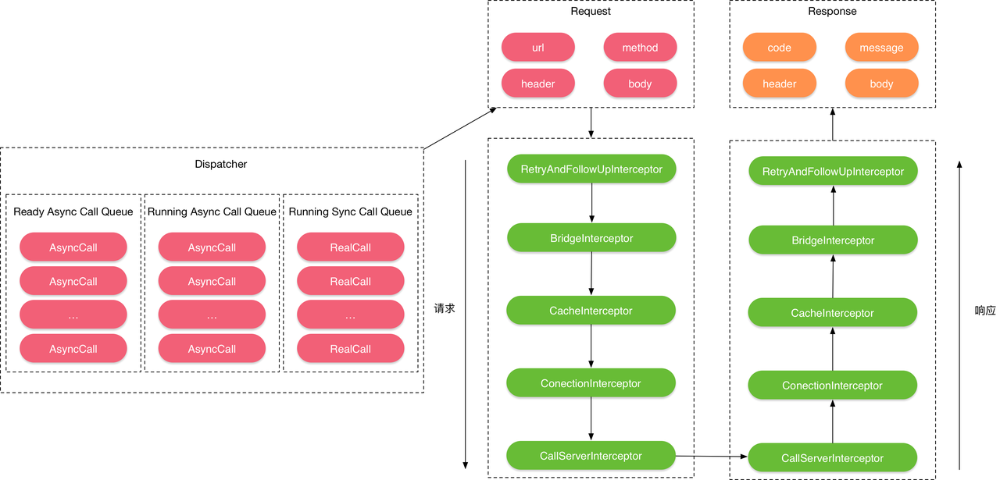
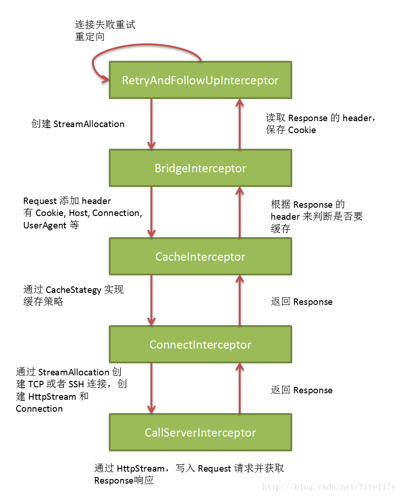
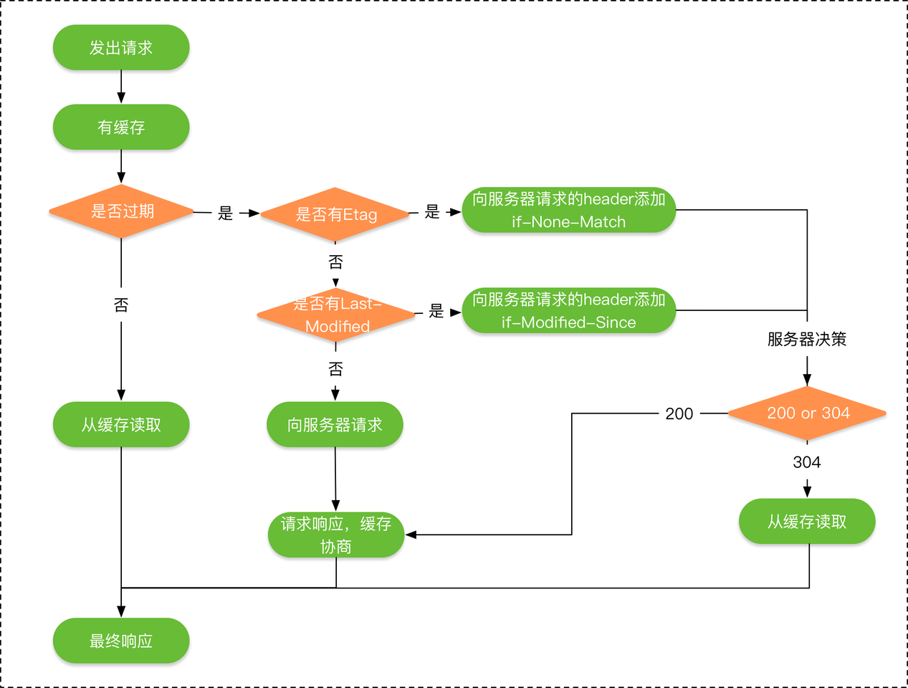
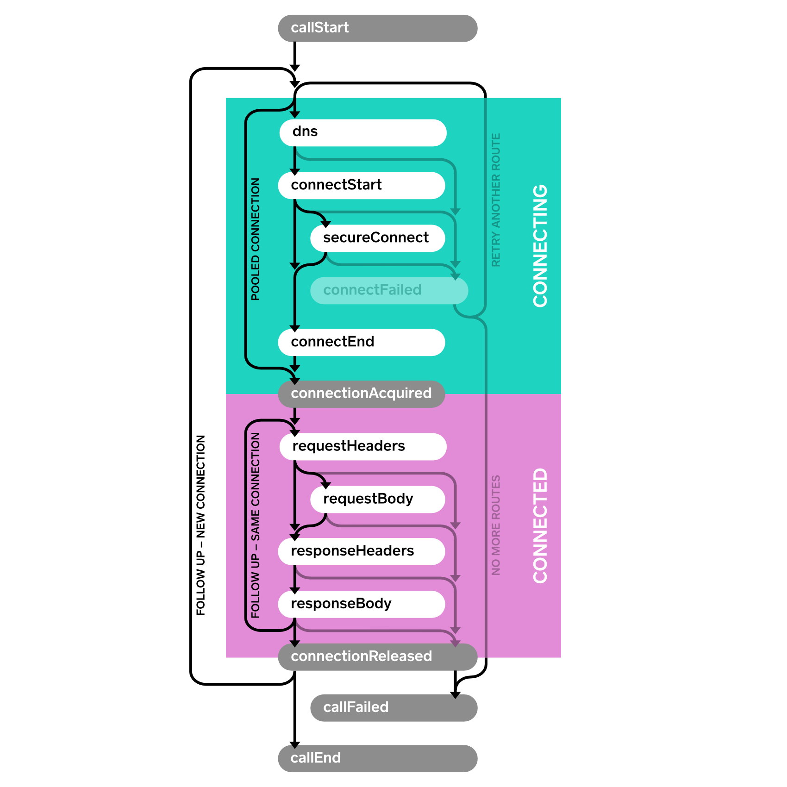

# OkHttpClient

# 为什么使用okhttp

连接池，http1.1keep-alive，http2多路复用，高性能。

支持https和http2

支持异步请求，异步请求使用线程池，默认限制最大请求64，每个host最大请求5

使用http连接池，连接复用，高性能

支持缓存

支持请求重试，同一个域名下可能有多个ip，dns解析出来，ok请求失败，会尝试多个ip

弱连接，判断空闲连接，防止内存泄漏导致oom

# 1.基本使用

maven依赖

```xml
<!-- okhttp -->
<dependency>
    <groupId>com.squareup.okhttp3</groupId>
    <artifactId>okhttp</artifactId>
    <version>3.2.0</version>
</dependency>
```

## 1.1 异步get

```java
String url = "http://wwww.baidu.com";
OkHttpClient okHttpClient = new OkHttpClient();
//构建Request
final Request request = new Request.Builder()
        .url(url)
        .get()//默认就是GET请求，可以不写
        .build();
Call call = okHttpClient.newCall(request);
//异步执行
call.enqueue(new Callback() {
    //失败回调
    @Override
    public void onFailure(Call call, IOException e) {
        Log.d(TAG, "onFailure: ");
    }

    //响应回调
    @Override
    public void onResponse(Call call, Response response) throws IOException {
        Log.d(TAG, "onResponse: " + response.body().string());
    }
});
```

## 1.2 同步get

```java
String url = "http://wwww.baidu.com";
OkHttpClient okHttpClient = new OkHttpClient();
final Request request = new Request.Builder()
        .url(url)
        .build();
final Call call = okHttpClient.newCall(request);
//同步执行
Response response = call.execute();
```

## 1.3 post提交string

```java
//构建MediaType
MediaType mediaType = MediaType.parse("text/x-markdown; charset=utf-8");
String requestBody = "I am Jdqm.";
//构建request
Request request = new Request.Builder()
        .url("https://api.github.com/markdown/raw")
        .post(RequestBody.create(mediaType, requestBody))
        .build();
//okHttp客户端
OkHttpClient okHttpClient = new OkHttpClient();
//异步执行
okHttpClient.newCall(request).enqueue(new Callback() {
    @Override
    public void onFailure(Call call, IOException e) {
        Log.d(TAG, "onFailure: " + e.getMessage());
    }

    @Override
    public void onResponse(Call call, Response response) throws IOException {
        Log.d(TAG, response.protocol() + " " +response.code() + " " + response.message());
        Headers headers = response.headers();
        for (int i = 0; i < headers.size(); i++) {
            Log.d(TAG, headers.name(i) + ":" + headers.value(i));
        }
        Log.d(TAG, "onResponse: " + response.body().string());
    }
});
```

## 1.4 post提交流

```java
RequestBody requestBody = new RequestBody() {
    @Nullable
    @Override
    public MediaType contentType() {
        return MediaType.parse("text/x-markdown; charset=utf-8");
    }

    @Override
    public void writeTo(BufferedSink sink) throws IOException {
        sink.writeUtf8("I am Jdqm.");
    }
};

Request request = new Request.Builder()
        .url("https://api.github.com/markdown/raw")
        .post(requestBody)
        .build();
OkHttpClient okHttpClient = new OkHttpClient();
okHttpClient.newCall(request).enqueue(new Callback() {
    @Override
    public void onFailure(Call call, IOException e) {
        Log.d(TAG, "onFailure: " + e.getMessage());
    }

    @Override
    public void onResponse(Call call, Response response) throws IOException {
        Log.d(TAG, response.protocol() + " " +response.code() + " " + response.message());
        Headers headers = response.headers();
        for (int i = 0; i < headers.size(); i++) {
            Log.d(TAG, headers.name(i) + ":" + headers.value(i));
        }
        Log.d(TAG, "onResponse: " + response.body().string());
    }
});
```

## 1.5 post提交文件

```java
MediaType mediaType = MediaType.parse("text/x-markdown; charset=utf-8");
OkHttpClient okHttpClient = new OkHttpClient();
File file = new File("test.md");
Request request = new Request.Builder()
        .url("https://api.github.com/markdown/raw")
        .post(RequestBody.create(mediaType, file))
        .build();
okHttpClient.newCall(request).enqueue(new Callback() {
    @Override
    public void onFailure(Call call, IOException e) {
        Log.d(TAG, "onFailure: " + e.getMessage());
    }

    @Override
    public void onResponse(Call call, Response response) throws IOException {
        Log.d(TAG, response.protocol() + " " +response.code() + " " + response.message());
        Headers headers = response.headers();
        for (int i = 0; i < headers.size(); i++) {
            Log.d(TAG, headers.name(i) + ":" + headers.value(i));
        }
        Log.d(TAG, "onResponse: " + response.body().string());
    }
});
```

## 1.6 post提交表单

```java
OkHttpClient okHttpClient = new OkHttpClient();
RequestBody requestBody = new FormBody.Builder()
        .add("search", "Jurassic Park")
        .build();
Request request = new Request.Builder()
        .url("https://en.wikipedia.org/w/index.php")
        .post(requestBody)
        .build();

okHttpClient.newCall(request).enqueue(new Callback() {
    @Override
    public void onFailure(Call call, IOException e) {
        Log.d(TAG, "onFailure: " + e.getMessage());
    }

    @Override
    public void onResponse(Call call, Response response) throws IOException {
        Log.d(TAG, response.protocol() + " " +response.code() + " " + response.message());
        Headers headers = response.headers();
        for (int i = 0; i < headers.size(); i++) {
            Log.d(TAG, headers.name(i) + ":" + headers.value(i));
        }
        Log.d(TAG, "onResponse: " + response.body().string());
    }
});
```

# 2.流程分析

Okhttp的整个请求与响应的流程就是Dispatcher不断从Request Queue里取出请求（Call），根据是否已经存存缓存，从内存缓存或者服务器获取请求的数据，请求分为同步和异步两种，同步请求通过 调用Call.exectute()方法直接返回当前请求的Response，异步请求调用Call.enqueue()方法将请求（AsyncCall）添加到请求队列中去，并通过回调（Callback）获取服务器返回的结果。





```java
//OKHttpClient.class
@Override 
public Call newCall(Request request) {
  return RealCall.newRealCall(this, request, false /* for web socket */);
}


//RealCall.class
  static RealCall newRealCall(OkHttpClient client, Request originalRequest, boolean forWebSocket) {
    // Safely publish the Call instance to the EventListener.
    RealCall call = new RealCall(client, originalRequest, forWebSocket);
      /**
       * 事件监听器,实现相应接口，用于监听：    
       * 1.应用程序发出的HTTP请求的大小和频率。
       * 2.这些网络请求在底层网络上的性能。
      **/
    call.eventListener = client.eventListenerFactory().create(call);
    return call;
  }

```


## 2.1 请求的封装

请求是由Okhttp发出，真正的请求都被封装了在了接口Call的实现类RealCall中，如下所示：

Call接口如下所示：

```java
public interface Call extends Cloneable {
    
  //返回当前请求
  Request request();

  //同步请求方法，此方法会阻塞当前线程知道请求结果放回
  Response execute() throws IOException;

  //异步请求方法，此方法会将请求添加到队列中，然后等待请求返回
  void enqueue(Callback responseCallback);

  //取消请求
  void cancel();

  //请求是否在执行，当execute()或者enqueue(Callback responseCallback)执行后该方法返回true
  boolean isExecuted();

  //请求是否被取消
  boolean isCanceled();

  //创建一个新的一模一样的请求
  Call clone();

  interface Factory {
    Call newCall(Request request);
  }
}
```

RealCall的构造方法如下所示：

```java
final class RealCall implements Call {
    
  private RealCall(OkHttpClient client, Request originalRequest, boolean forWebSocket) {
    //我们构建的OkHttpClient，用来传递参数
    this.client = client;
    //封装好的request
    this.originalRequest = originalRequest;
    //是不是WebSocket请求，WebSocket是用来建立长连接的，后面我们会说。
    this.forWebSocket = forWebSocket;
    //构建RetryAndFollowUpInterceptor拦截器
    this.retryAndFollowUpInterceptor = new RetryAndFollowUpInterceptor(client, forWebSocket);
  }
}
```

RealCall实现了Call接口，它封装了请求的调用，这个构造函数的逻辑也很简单：赋值外部传入的OkHttpClient、Request与forWebSocket，并 创建了重试与重定向拦截器RetryAndFollowUpInterceptor。

## 2.2 请求的发送

RealCall将请求分为两种：

- 同步请求
- 异步请求

异步请求只是比同步请求多了个Callback，分别调用的方法如下所示：

### 异步请求

```java
final class RealCall implements Call {
    
      @Override public void enqueue(Callback responseCallback) {
        synchronized (this) {
          if (executed) throw new IllegalStateException("Already Executed");
          executed = true;
        }
        captureCallStackTrace();
        client.dispatcher().enqueue(new AsyncCall(responseCallback));
      }
}
```

### 同步请求

```java
final class RealCall implements Call {
    @Override public Response execute() throws IOException {
      synchronized (this) {
        if (executed) throw new IllegalStateException("Already Executed");
        executed = true;
      }
      captureCallStackTrace();
      try {
          //加入runningSyncCalls，便于全部取消这类任务
        client.dispatcher().executed(this);
          //直接执行任务链，没有最大请求数量的限制
        Response result = getResponseWithInterceptorChain();
        if (result == null) throw new IOException("Canceled");
        return result;
      } finally {
        client.dispatcher().finished(this);
      }
    }
}
```

从上面实现可以看出，不管是同步请求还是异步请求都是Dispatcher在处理：

- 同步请求：直接执行，并返回请求结果
- 异步请求：构造一个AsyncCall，并将自己加入处理队列中。

AsyncCall本质上是一个**Runable**，Dispatcher会调度ExecutorService来执行这些Runable。

```java
final class AsyncCall extends NamedRunnable {
    private final Callback responseCallback;

    AsyncCall(Callback responseCallback) {
      super("OkHttp %s", redactedUrl());
      this.responseCallback = responseCallback;
    }

    String host() {
      return originalRequest.url().host();
    }

    Request request() {
      return originalRequest;
    }

    RealCall get() {
      return RealCall.this;
    }

    @Override protected void execute() {
      boolean signalledCallback = false;
      try {
        Response response = getResponseWithInterceptorChain();
        if (retryAndFollowUpInterceptor.isCanceled()) {
          signalledCallback = true;
          responseCallback.onFailure(RealCall.this, new IOException("Canceled"));
        } else {
          signalledCallback = true;
          responseCallback.onResponse(RealCall.this, response);
        }
      } catch (IOException e) {
        if (signalledCallback) {
          // Do not signal the callback twice!
          Platform.get().log(INFO, "Callback failure for " + toLoggableString(), e);
        } else {
          responseCallback.onFailure(RealCall.this, e);
        }
      } finally {
        client.dispatcher().finished(this);
      }
    }
  }
```

从上面代码可以看出，不管是同步请求还是异步请求最后都会通过getResponseWithInterceptorChain()获取Response，只不过异步请求多了个线程调度，异步 执行的过程。

我们先来来看看Dispatcher里的实现。

## 2.3 请求的调度

```java
public final class Dispatcher {
    //最大异步请求数量
    private int maxRequests = 64;
    //host是域名/ip，如www.baidu.com和127.0.0.1(不包含端口号)
    //每个host最大异步请求数量
    private int maxRequestsPerHost = 5;
    //异步请求处理线程池，懒加载
    private @Nullable ExecutorService executorService;

    //等待的异步请求链表
    private final Deque<AsyncCall> readyAsyncCalls = new ArrayDeque<>();
    //正在执行的异步请求链表
    private final Deque<AsyncCall> runningAsyncCalls = new ArrayDeque<>();
    //正在执行的同步请求链表
    private final Deque<RealCall> runningSyncCalls = new ArrayDeque<>();

  
    public synchronized ExecutorService executorService() {
     if (executorService == null) {
      executorService = new ThreadPoolExecutor(0, Integer.MAX_VALUE, 60, TimeUnit.SECONDS,
          new SynchronousQueue<Runnable>(), Util.threadFactory("OkHttp Dispatcher", false));
    }
    return executorService;
  }      
}
```

### 异步请求

异步请求是构造一个AsyncCall，然后传给Dispatcher，进行调度，AsyncCall实际上是一个Runnable，最终将这个Runnable交给Dispatcher内的executorService执行。

```java
//RealCall.java
@Override public void enqueue(Callback responseCallback) {
  synchronized (this) {
    if (executed) throw new IllegalStateException("Already Executed");
    executed = true;
  }
  captureCallStackTrace();
  eventListener.callStart(this);
  client.dispatcher().enqueue(new AsyncCall(responseCallback));
}

  final class AsyncCall extends NamedRunnable {
    private final Callback responseCallback;

    AsyncCall(Callback responseCallback) {
      super("OkHttp %s", redactedUrl());
      this.responseCallback = responseCallback;
    }

    @Override protected void execute() {
      boolean signalledCallback = false;
      try {
        Response response = getResponseWithInterceptorChain();
        if (retryAndFollowUpInterceptor.isCanceled()) {
          signalledCallback = true;
          responseCallback.onFailure(RealCall.this, new IOException("Canceled"));
        } else {
          signalledCallback = true;
          responseCallback.onResponse(RealCall.this, response);
        }
      } catch (IOException e) {
        if (signalledCallback) {
          // Do not signal the callback twice!
          Platform.get().log(INFO, "Callback failure for " + toLoggableString(), e);
        } else {
          eventListener.callFailed(RealCall.this, e);
          responseCallback.onFailure(RealCall.this, e);
        }
      } finally {
        client.dispatcher().finished(this);
      }
    }
  }
```

```java
//Dispatcher.java  
synchronized void enqueue(AsyncCall call) {
  //正在运行的异步请求不得超过maxRequests，同一个host下的异步请求不得超过maxRequestsPerHost
  if (runningAsyncCalls.size() < maxRequests && runningCallsForHost(call) < maxRequestsPerHost) {
    runningAsyncCalls.add(call);
    executorService().execute(call);
  } else {
    //超过最大数量的异步请求放入准备队列，每个异步请求调用结束finish会调用promoteCalls()入队
    readyAsyncCalls.add(call);
  }
  
  //执行完一个请求
  private <T> void finished(Deque<T> calls, T call, boolean promoteCalls) {
    int runningCallsCount;
    Runnable idleCallback;
    //加锁，同一时间只能有一个线程在调度Dispatcher
    synchronized (this) {
      if (!calls.remove(call)) throw new AssertionError("Call wasn't in-flight!");
      //调度等待队列
      if (promoteCalls) promoteCalls();
      runningCallsCount = runningCallsCount();
      idleCallback = this.idleCallback;
    }

    if (runningCallsCount == 0 && idleCallback != null) {
      idleCallback.run();
    }
  }
    
  private void promoteCalls() {
    if (runningAsyncCalls.size() >= maxRequests) return; // Already running max capacity.
    if (readyAsyncCalls.isEmpty()) return; // No ready calls to promote.
    //遍历等待队列
    for (Iterator<AsyncCall> i = readyAsyncCalls.iterator(); i.hasNext(); ) {
      AsyncCall call = i.next();
      //如果小于maxRequestsPerHost，执行该Runnable
      if (runningCallsForHost(call) < maxRequestsPerHost) {
        i.remove();
        runningAsyncCalls.add(call);
        executorService().execute(call);
      }
      //如果>= maxRequests，结束遍历
      if (runningAsyncCalls.size() >= maxRequests) return; // Reached max capacity.
    }
  }
```


### 同步请求

同步请求其实就是在当前线程执行任务链了。

```java
//RealCall.java
@Override public Response execute() throws IOException {
  synchronized (this) {
    if (executed) throw new IllegalStateException("Already Executed");
    executed = true;
  }
  captureCallStackTrace();
  eventListener.callStart(this);
  try {
    client.dispatcher().executed(this);
    Response result = getResponseWithInterceptorChain();
    if (result == null) throw new IOException("Canceled");
    return result;
  } catch (IOException e) {
    eventListener.callFailed(this, e);
    throw e;
  } finally {
    client.dispatcher().finished(this);
  }
}
```


```java
 //Dispatcher.java   
 synchronized void executed(RealCall call) {
    runningSyncCalls.add(call);
  }
```
## 2.4 请求的处理

```java
final class RealCall implements Call {
      Response getResponseWithInterceptorChain() throws IOException {
        // Build a full stack of interceptors.
        List<Interceptor> interceptors = new ArrayList<>();
        //这里可以看出，我们自定义的Interceptor会被优先执行
        interceptors.addAll(client.interceptors());
        //添加拦截重试和重定向拦截器
        interceptors.add(retryAndFollowUpInterceptor);
        interceptors.add(new BridgeInterceptor(client.cookieJar()));
        interceptors.add(new CacheInterceptor(client.internalCache()));
        interceptors.add(new ConnectInterceptor(client));
        if (!forWebSocket) {
          interceptors.addAll(client.networkInterceptors());
        }
        interceptors.add(new CallServerInterceptor(forWebSocket));
    
        Interceptor.Chain chain = new RealInterceptorChain(
            interceptors, null, null, null, 0, originalRequest);
        return chain.proceed(originalRequest);
      }
}

```

短短几行代码，完成了对请求的所有处理过程，Interceptor将网络请求、缓存、透明压缩等功能统一了起来，它的实现采用**责任链模式**，各司其职， 每个功能都是一个Interceptor，上一级处理完成以后传递给下一级，它们最后连接成了一个Interceptor.Chain。它们的功能如下：

- RetryAndFollowUpInterceptor：负责重定向。
- BridgeInterceptor：负责把用户构造的请求转换为发送给服务器的请求，把服务器返回的响应转换为对用户友好的响应。
- CacheInterceptor：负责读取缓存以及更新缓存。
- ConnectInterceptor：负责与服务器建立连接。
- CallServerInterceptor：负责从服务器读取响应的数据。

位置决定功能，位置靠前的先执行，最后一个则复制与服务器通讯，请求从RetryAndFollowUpInterceptor开始层层传递到CallServerInterceptor，每一层 都对请求做相应的处理，处理的结构再从CallServerInterceptor层层返回给RetryAndFollowUpInterceptor，最红请求的发起者获得了服务器返回的结果。

以上便是Okhttp整个请求与响应的具体流程，可以发现拦截器才是Okhttp核心功能所在，我们来逐一分析每个拦截器的实现。

# 3.拦截器

okhttp的拦截器是责任链模式

```java
//RealInterceptorChain implements Interceptor.Chain
public Response proceed(Request request, StreamAllocation streamAllocation, HttpCodec httpCodec,
    RealConnection connection) throws IOException {
  if (index >= interceptors.size()) throw new AssertionError();

  calls++;
 ......

  // Call the next interceptor in the chain.
  RealInterceptorChain next = new RealInterceptorChain(interceptors, streamAllocation, httpCodec,
      connection, index + 1, request, call, eventListener, connectTimeout, readTimeout,
      writeTimeout);
  Interceptor interceptor = interceptors.get(index);
  Response response = interceptor.intercept(next);

......

  return response;
}

//
public Response intercept(Chain chain) throws IOException {
    response = realChain.proceed(request, streamAllocation, null, null);
}
```


## 3.1RetryAndFollowUpInterceptor

负责失败重试和重定向

[浅析 OkHttp 拦截器之 RetryAndFollowUpInterceptor](https://blog.csdn.net/firefile/article/details/75346937)

```
MAX_FOLLOW_UPS
这个参数是用来限制重定向的，与重连机制无关
okhttp的重试其实是不同route的重试，如果一个host只有一个ip，也就没有重试了
应用层面的重试机制需要自己实现拦截器。
```


## 3.2BridgeInterceptor

BridgeInterceptor就跟它的名字那样，它是一个连接桥，其实就是将用户构造的请求格式化一下，核心就是增加一些请求的header。

```java
public final class BridgeInterceptor implements Interceptor {
    @Override public Response intercept(Chain chain) throws IOException {
        Request userRequest = chain.request();
        Request.Builder requestBuilder = userRequest.newBuilder();
    
        RequestBody body = userRequest.body();
        if (body != null) {
          //1 进行Header的包装
          MediaType contentType = body.contentType();
          if (contentType != null) {
            requestBuilder.header("Content-Type", contentType.toString());
          }
    
          long contentLength = body.contentLength();
          if (contentLength != -1) {
            requestBuilder.header("Content-Length", Long.toString(contentLength));
            requestBuilder.removeHeader("Transfer-Encoding");
          } else {
            requestBuilder.header("Transfer-Encoding", "chunked");
            requestBuilder.removeHeader("Content-Length");
          }
        }
    
        if (userRequest.header("Host") == null) {
          requestBuilder.header("Host", hostHeader(userRequest.url(), false));
        }
    
        if (userRequest.header("Connection") == null) {
          requestBuilder.header("Connection", "Keep-Alive");
        }
    
        //这里有个坑：如果你在请求的时候主动添加了"Accept-Encoding: gzip" ，transparentGzip=false，那你就要自己解压，如果
        // 你没有吹解压，或导致response.string()乱码。
        // If we add an "Accept-Encoding: gzip" header field we're responsible for also decompressing
        // the transfer stream.
        boolean transparentGzip = false;
        if (userRequest.header("Accept-Encoding") == null && userRequest.header("Range") == null) {
          transparentGzip = true;
          requestBuilder.header("Accept-Encoding", "gzip");
        }
    
        //创建OkhttpClient配置的cookieJar
        List<Cookie> cookies = cookieJar.loadForRequest(userRequest.url());
        if (!cookies.isEmpty()) {
          requestBuilder.header("Cookie", cookieHeader(cookies));
        }
    
        if (userRequest.header("User-Agent") == null) {
          requestBuilder.header("User-Agent", Version.userAgent());
        }
    
        Response networkResponse = chain.proceed(requestBuilder.build());
    
        //解析服务器返回的Header，如果没有这事cookie，则不进行解析
        HttpHeaders.receiveHeaders(cookieJar, userRequest.url(), networkResponse.headers());
    
        Response.Builder responseBuilder = networkResponse.newBuilder()
            .request(userRequest);
    
        //判断服务器是否支持gzip压缩，如果支持，则将压缩提交给Okio库来处理
        if (transparentGzip
            && "gzip".equalsIgnoreCase(networkResponse.header("Content-Encoding"))
            && HttpHeaders.hasBody(networkResponse)) {
          GzipSource responseBody = new GzipSource(networkResponse.body().source());
          Headers strippedHeaders = networkResponse.headers().newBuilder()
              .removeAll("Content-Encoding")
              .removeAll("Content-Length")
              .build();
          responseBuilder.headers(strippedHeaders);
          responseBuilder.body(new RealResponseBody(strippedHeaders, Okio.buffer(responseBody)));
        }
    
        return responseBuilder.build();
      }
}
```


## 3.3CacheInterceptor

我们知道为了节省流量和提高响应速度，Okhttp是有自己的一套缓存机制的，CacheInterceptor就是用来负责读取缓存以及更新缓存的。

```java
public final class CacheInterceptor implements Interceptor {
    
     @Override public Response intercept(Chain chain) throws IOException {
         
        //1. 读取候选缓存，具体如何读取的我们下面会讲。
        Response cacheCandidate = cache != null
            ? cache.get(chain.request())
            : null;
    
        long now = System.currentTimeMillis();
    
        //2. 创建缓存策略，强制缓存、对比缓存等，关于缓存策略我们下面也会讲。
        CacheStrategy strategy = new CacheStrategy.Factory(now, chain.request(), cacheCandidate).get();
        Request networkRequest = strategy.networkRequest;
        Response cacheResponse = strategy.cacheResponse;
    
        if (cache != null) {
          cache.trackResponse(strategy);
        }
    
        if (cacheCandidate != null && cacheResponse == null) {
          closeQuietly(cacheCandidate.body());
        }
    
        //3. 根据策略，不使用网络，又没有缓存的直接报错，并返回错误码504。
        if (networkRequest == null && cacheResponse == null) {
          return new Response.Builder()
              .request(chain.request())
              .protocol(Protocol.HTTP_1_1)
              .code(504)
              .message("Unsatisfiable Request (only-if-cached)")
              .body(Util.EMPTY_RESPONSE)
              .sentRequestAtMillis(-1L)
              .receivedResponseAtMillis(System.currentTimeMillis())
              .build();
        }
    
        //4. 根据策略，不使用网络，有缓存的直接返回。
        if (networkRequest == null) {
          return cacheResponse.newBuilder()
              .cacheResponse(stripBody(cacheResponse))
              .build();
        }
    
        Response networkResponse = null;
        try {
          //5. 前面两个都没有返回，继续执行下一个Interceptor，即ConnectInterceptor。
          networkResponse = chain.proceed(networkRequest);
        } finally {
          //如果发生IO异常，则释放掉缓存
          if (networkResponse == null && cacheCandidate != null) {
            closeQuietly(cacheCandidate.body());
          }
        }
    
        //6. 接收到网络结果，如果响应code式304，则使用缓存，返回缓存结果。
        if (cacheResponse != null) {
          if (networkResponse.code() == HTTP_NOT_MODIFIED) {
            Response response = cacheResponse.newBuilder()
                .headers(combine(cacheResponse.headers(), networkResponse.headers()))
                .sentRequestAtMillis(networkResponse.sentRequestAtMillis())
                .receivedResponseAtMillis(networkResponse.receivedResponseAtMillis())
                .cacheResponse(stripBody(cacheResponse))
                .networkResponse(stripBody(networkResponse))
                .build();
            networkResponse.body().close();
    
            cache.trackConditionalCacheHit();
            cache.update(cacheResponse, response);
            return response;
          } else {
            closeQuietly(cacheResponse.body());
          }
        }
    
        //7. 读取网络结果。
        Response response = networkResponse.newBuilder()
            .cacheResponse(stripBody(cacheResponse))
            .networkResponse(stripBody(networkResponse))
            .build();
    
        //8. 对数据进行缓存。
        if (cache != null) {
          if (HttpHeaders.hasBody(response) && CacheStrategy.isCacheable(response, networkRequest)) {
            // Offer this request to the cache.
            CacheRequest cacheRequest = cache.put(response);
            return cacheWritingResponse(cacheRequest, response);
          }
    
          if (HttpMethod.invalidatesCache(networkRequest.method())) {
            try {
              cache.remove(networkRequest);
            } catch (IOException ignored) {
              // The cache cannot be written.
            }
          }
        }
    
        //9. 返回网络读取的结果。
        return response;
      }
}
```

整个方法的流程如下所示：

1. 读取候选缓存，具体如何读取的我们下面会讲。
2. 创建缓存策略，强制缓存、对比缓存等，关于缓存策略我们下面也会讲。
3. 根据策略，不使用网络，又没有缓存的直接报错，并返回错误码504。
4. 根据策略，不使用网络，有缓存的直接返回。
5. 前面两个都没有返回，继续执行下一个Interceptor，即ConnectInterceptor。
6. 接收到网络结果，如果响应code式304，则使用缓存，返回缓存结果。
7. 读取网络结果。
8. 对数据进行缓存。
9. 返回网络读取的结果。

### 3.3.1 缓存策略

在分析Okhttp的缓存机制之前，我们先来回顾一下HTTP与缓存相关的理论知识，这是实现Okhttp机制的基础。

HTTP的缓存机制也是依赖于请求和响应header里的参数类实现的，最终响应式从缓存中去，还是从服务端重新拉取，HTTP的缓存机制的流程如下所示：




HTTP的缓存可以分为两种：

- 强制缓存：需要服务端参与判断是否继续使用缓存，当客户端第一次请求数据是，服务端返回了缓存的过期时间（Expires与Cache-Control），没有过期就可以继续使用缓存，否则则不适用，无需再向服务端询问。
- 对比缓存：需要服务端参与判断是否继续使用缓存，当客户端第一次请求数据时，服务端会将缓存标识（Last-Modified/If-Modified-Since与Etag/If-None-Match）与数据一起返回给客户端，客户端将两者都备份到缓存中 ，再次请求数据时，客户端将上次备份的缓存 标识发送给服务端，服务端根据缓存标识进行判断，如果返回304，则表示通知客户端可以继续使用缓存。

#### 强制缓存

强制缓存优先于对比缓存。

上面提到强制缓存使用的的两个标识：

- Expires：Expires的值为服务端返回的到期时间，即下一次请求时，请求时间小于服务端返回的到期时间，直接使用缓存数据。到期时间是服务端生成的，客户端和服务端的时间可能有误差。
- Cache-Control：Expires有个时间校验的问题，所有**HTTP1.1**采用**Cache-Control**替代Expires。

Cache-Control的取值有以下几种：

- private:             客户端可以缓存。
- public:              客户端和代理服务器都可缓存。
- max-age=xxx:   缓存的内容将在 xxx 秒后失效
- no-cache:          需要使用对比缓存来验证缓存数据。
- no-store:           所有内容都不会缓存，强制缓存，对比缓存都不会触发。

#### 对比缓存

我们再来看看对比缓存的两个标识：

##### 时间戳标识

Last-Modified/If-Modified-Since

Last-Modified 表示资源上次修改的时间。

当客户端发送第一次请求时，服务端返回资源上次修改的时间Last-Modified：

```
Last-Modified: Tue, 12 Jan 2016 09:31:27 GMT
```

客户端再次发送，会在header里携带If-Modified-Since。将上次服务端返回的资源时间上传给服务端。

```
If-Modified-Since: Tue, 12 Jan 2016 09:31:27 GMT 
```

服务端接收到客户端发来的资源修改时间，与自己当前的资源修改时间进行对比，如果自己的资源修改时间大于客户端发来的资源修改时间，则说明资源做过修改， 则返回**200表示需要重新请求资源**，否则返回**304表示资源没有被修改，可以继续使用缓存**。

##### 资源标识码

Etag/If-None-Match

上面是一种时间戳标记资源是否修改的方法，还有一种资源标识码ETag的方式来标记是否修改，如果标识码发生改变，则说明资源已经被修改，**ETag优先级高于Last-Modified**。

ETag是资源文件的一种标识码，当客户端发送第一次请求时，服务端会返回当前资源的标识码：

```
ETag: "5694c7ef-24dc"
```

客户端再次发送，会在header里携带上次服务端返回的资源标识码：

```
If-None-Match:"5694c7ef-24dc"
```

服务端接收到客户端发来的资源标识码，则会与自己当前的资源吗进行比较，如果不同，则说明资源已经被修改，则返回200，如果相同则说明资源没有被修改，返回 304，客户端可以继续使用缓存。

以上便是HTTP缓存策略的相关理论知识，我们来看看具体实现。

Okhttp的缓存策略就是根据上述流程图实现的，具体的实现类是CacheStrategy，CacheStrategy的构造函数里有两个参数：

```java
CacheStrategy(Request networkRequest, Response cacheResponse) {
this.networkRequest = networkRequest;
this.cacheResponse = cacheResponse;
}
```

这两个参数参数的含义如下：

- networkRequest：网络请求。
- cacheResponse：缓存响应，基于DiskLruCache实现的文件缓存，可以是请求中url的md5，value是文件中查询到的缓存，这个我们下面会说。

CacheStrategy就是利用这两个参数生成最终的策略，有点像map操作，将networkRequest与cacheResponse这两个值输入，处理之后再将这两个值输出，们的组合结果如下所示：

- 如果networkRequest为null，cacheResponse为null：only-if-cached(表明不进行网络请求，且缓存不存在或者过期，一定会返回503错误)。
- 如果networkRequest为null，cacheResponse为non-null：不进行网络请求，而且缓存可以使用，直接返回缓存，不用请求网络。
- 如果networkRequest为non-null，cacheResponse为null：需要进行网络请求，而且缓存不存在或者过期，直接访问网络。
- 如果networkRequest为non-null，cacheResponse为non-null：Header中含有ETag/Last-Modified标签，需要在条件请求下使用，还是需要访问网络。

那么这四种情况是如何判定的，我们来看一下。

CacheStrategy是利用Factory模式进行构造的，CacheStrategy.Factory对象构建以后，调用它的get()方法即可获得具体的CacheStrategy，CacheStrategy.Factory.get()方法内部 调用的是CacheStrategy.Factory.getCandidate()方法，它是核心的实现。

如下所示：

```java
public static class Factory {
    
        private CacheStrategy getCandidate() {
          //1. 如果缓存没有命中，就直接进行网络请求。
          if (cacheResponse == null) {
            return new CacheStrategy(request, null);
          }
    
          //2. 如果TLS握手信息丢失，则返回直接进行连接。
          if (request.isHttps() && cacheResponse.handshake() == null) {
            return new CacheStrategy(request, null);
          }

          //3. 根据response状态码，Expired时间和是否有no-cache标签就行判断是否进行直接访问。
          if (!isCacheable(cacheResponse, request)) {
            return new CacheStrategy(request, null);
          }
    
          //4. 如果请求header里有"no-cache"或者右条件GET请求（header里带有ETag/Since标签），则直接连接。
          CacheControl requestCaching = request.cacheControl();
          if (requestCaching.noCache() || hasConditions(request)) {
            return new CacheStrategy(request, null);
          }
    
          CacheControl responseCaching = cacheResponse.cacheControl();
          if (responseCaching.immutable()) {
            return new CacheStrategy(null, cacheResponse);
          }
    
          //计算当前age的时间戳：now - sent + age
          long ageMillis = cacheResponseAge();
          //刷新时间，一般服务器设置为max-age
          long freshMillis = computeFreshnessLifetime();
    
          if (requestCaching.maxAgeSeconds() != -1) {
            //一般取max-age
            freshMillis = Math.min(freshMillis, SECONDS.toMillis(requestCaching.maxAgeSeconds()));
          }
    
          long minFreshMillis = 0;
          if (requestCaching.minFreshSeconds() != -1) {
            //一般取0
            minFreshMillis = SECONDS.toMillis(requestCaching.minFreshSeconds());
          }
    
          long maxStaleMillis = 0;
          if (!responseCaching.mustRevalidate() && requestCaching.maxStaleSeconds() != -1) {
            maxStaleMillis = SECONDS.toMillis(requestCaching.maxStaleSeconds());
          }
    
          //5. 如果缓存在过期时间内则可以直接使用，则直接返回上次缓存。
          if (!responseCaching.noCache() && ageMillis + minFreshMillis < freshMillis + maxStaleMillis) {
            Response.Builder builder = cacheResponse.newBuilder();
            if (ageMillis + minFreshMillis >= freshMillis) {
              builder.addHeader("Warning", "110 HttpURLConnection \"Response is stale\"");
            }
            long oneDayMillis = 24 * 60 * 60 * 1000L;
            if (ageMillis > oneDayMillis && isFreshnessLifetimeHeuristic()) {
              builder.addHeader("Warning", "113 HttpURLConnection \"Heuristic expiration\"");
            }
            return new CacheStrategy(null, builder.build());
          }
    
          //6. 如果缓存过期，且有ETag等信息，则发送If-None-Match、If-Modified-Since、If-Modified-Since等条件请求
          //交给服务端判断处理
          String conditionName;
          String conditionValue;
          if (etag != null) {
            conditionName = "If-None-Match";
            conditionValue = etag;
          } else if (lastModified != null) {
            conditionName = "If-Modified-Since";
            conditionValue = lastModifiedString;
          } else if (servedDate != null) {
            conditionName = "If-Modified-Since";
            conditionValue = servedDateString;
          } else {
            return new CacheStrategy(request, null); // No condition! Make a regular request.
          }
    
          Headers.Builder conditionalRequestHeaders = request.headers().newBuilder();
          Internal.instance.addLenient(conditionalRequestHeaders, conditionName, conditionValue);
    
          Request conditionalRequest = request.newBuilder()
              .headers(conditionalRequestHeaders.build())
              .build();
          return new CacheStrategy(conditionalRequest, cacheResponse);
        }
}
```

整个函数的逻辑就是按照上面那个HTTP缓存判定流程图来实现，具体流程如下所示：

1. 如果缓存没有命中，就直接进行网络请求。
2. 如果TLS握手信息丢失，则返回直接进行连接。
3. 根据response状态码，Expired时间和是否有no-cache标签就行判断是否进行直接访问。
4. 如果请求header里有"no-cache"或者右条件GET请求（header里带有ETag/Since标签），则直接连接。
5. 如果缓存在过期时间内则可以直接使用，则直接返回上次缓存。
6. 如果缓存过期，且有ETag等信息，则发送If-None-Match、If-Modified-Since、If-Modified-Since等条件请求交给服务端判断处理

整个流程就是这样，另外说一点，Okhttp的缓存是根据服务器header自动的完成的，整个流程也是根据RFC文档写死的，客户端不必要进行手动控制。

理解了缓存策略，我们来看看缓存在磁盘上是如何被管理的。

### 3.3.2 缓存管理

这篇文章我们来分析Okhttp的缓存机制，缓存机制是基于DiskLruCache做的。Cache类封装了缓存的实现，实现了InternalCache接口。

InternalCache接口如下所示：

**InternalCache**

```java
public interface InternalCache {
  //获取缓存
  Response get(Request request) throws IOException;
  //存入缓存
  CacheRequest put(Response response) throws IOException;
  //移除缓存
  void remove(Request request) throws IOException;
  //更新缓存
  void update(Response cached, Response network);
  //跟踪一个满足缓存条件的GET请求
  void trackConditionalCacheHit();
  //跟踪满足缓存策略CacheStrategy的响应
  void trackResponse(CacheStrategy cacheStrategy);
}
```

我们接着来看看它的实现类。

Cache没有直接实现InternalCache这个接口，而是在其内部实现了InternalCache的匿名内部类，内部类的方法调用Cache对应的方法，如下所示：

```java
final InternalCache internalCache = new InternalCache() {
@Override public Response get(Request request) throws IOException {
  return Cache.this.get(request);
}

@Override public CacheRequest put(Response response) throws IOException {
  return Cache.this.put(response);
}

@Override public void remove(Request request) throws IOException {
  Cache.this.remove(request);
}

@Override public void update(Response cached, Response network) {
  Cache.this.update(cached, network);
}

@Override public void trackConditionalCacheHit() {
  Cache.this.trackConditionalCacheHit();
}

@Override public void trackResponse(CacheStrategy cacheStrategy) {
  Cache.this.trackResponse(cacheStrategy);
}
};

InternalCache internalCache() {
return cache != null ? cache.internalCache : internalCache;
}
```

在Cache类里还定义一些内部类，这些类封装了请求与响应信息。

- Cache.Entry：封装了请求与响应等信息，包括url、varyHeaders、protocol、code、message、responseHeaders、handshake、sentRequestMillis与receivedResponseMillis。
- Cache.CacheResponseBody：继承于ResponseBody，封装了缓存快照snapshot，响应体bodySource，内容类型contentType，内容长度contentLength。

除了两个类以外，Okhttp还封装了一个文件系统类FileSystem类，这个类利用Okio这个库对Java的FIle操作进行了一层封装，简化了IO操作。理解了这些剩下的就是DiskLruCahe里的插入缓存 、获取缓存和删除缓存的操作。


## 3.4ConnectInterceptor

在RetryAndFollowUpInterceptor里初始化了一个StreamAllocation对象，我们说在这个StreamAllocation对象里初始化了一个Socket对象用来做连接，但是并没有 真正的连接，等到处理完hader和缓存信息之后，才调用ConnectInterceptor来进行真正的连接

```java
public final class ConnectInterceptor implements Interceptor {
    
      @Override public Response intercept(Chain chain) throws IOException {
        RealInterceptorChain realChain = (RealInterceptorChain) chain;
        Request request = realChain.request();
        StreamAllocation streamAllocation = realChain.streamAllocation();
    
        boolean doExtensiveHealthChecks = !request.method().equals("GET");
        //创建输出流
        HttpCodec httpCodec = streamAllocation.newStream(client, doExtensiveHealthChecks);
        //建立连接
        RealConnection connection = streamAllocation.connection();
    
        return realChain.proceed(request, streamAllocation, httpCodec, connection);
      }
}
```

ConnectInterceptor在Request阶段建立连接，处理方式也很简单，创建了两个对象：

- HttpCodec：用来编码HTTP requests和解码HTTP responses
- RealConnection：连接对象，负责发起与服务器的连接。

## 3.5CallServerInterceptor

CallServerInterceptor负责从服务器读取响应的数据。

```java
public final class CallServerInterceptor implements Interceptor {
    
    @Override public Response intercept(Chain chain) throws IOException {
        
        //这些对象在前面的Interceptor都已经创建完毕
        RealInterceptorChain realChain = (RealInterceptorChain) chain;
        HttpCodec httpCodec = realChain.httpStream();
        StreamAllocation streamAllocation = realChain.streamAllocation();
        RealConnection connection = (RealConnection) realChain.connection();
        Request request = realChain.request();
    
        long sentRequestMillis = System.currentTimeMillis();
        //1. 写入请求头 
        httpCodec.writeRequestHeaders(request);
    
        Response.Builder responseBuilder = null;
        if (HttpMethod.permitsRequestBody(request.method()) && request.body() != null) {
          // If there's a "Expect: 100-continue" header on the request, wait for a "HTTP/1.1 100
          // Continue" response before transmitting the request body. If we don't get that, return what
          // we did get (such as a 4xx response) without ever transmitting the request body.
          if ("100-continue".equalsIgnoreCase(request.header("Expect"))) {
            httpCodec.flushRequest();
            responseBuilder = httpCodec.readResponseHeaders(true);
          }
    
          //2 写入请求体
          if (responseBuilder == null) {
            // Write the request body if the "Expect: 100-continue" expectation was met.
            Sink requestBodyOut = httpCodec.createRequestBody(request, request.body().contentLength());
            BufferedSink bufferedRequestBody = Okio.buffer(requestBodyOut);
            request.body().writeTo(bufferedRequestBody);
            bufferedRequestBody.close();
          } else if (!connection.isMultiplexed()) {
            // If the "Expect: 100-continue" expectation wasn't met, prevent the HTTP/1 connection from
            // being reused. Otherwise we're still obligated to transmit the request body to leave the
            // connection in a consistent state.
            streamAllocation.noNewStreams();
          }
        }
    
        httpCodec.finishRequest();
    
        //3 读取响应头
        if (responseBuilder == null) {
          responseBuilder = httpCodec.readResponseHeaders(false);
        }
    
        Response response = responseBuilder
            .request(request)
            .handshake(streamAllocation.connection().handshake())
            .sentRequestAtMillis(sentRequestMillis)
            .receivedResponseAtMillis(System.currentTimeMillis())
            .build();
    
        //4 读取响应体
        int code = response.code();
        if (forWebSocket && code == 101) {
          // Connection is upgrading, but we need to ensure interceptors see a non-null response body.
          response = response.newBuilder()
              .body(Util.EMPTY_RESPONSE)
              .build();
        } else {
          response = response.newBuilder()
              .body(httpCodec.openResponseBody(response))
              .build();
        }
    
        if ("close".equalsIgnoreCase(response.request().header("Connection"))
            || "close".equalsIgnoreCase(response.header("Connection"))) {
          streamAllocation.noNewStreams();
        }
    
        if ((code == 204 || code == 205) && response.body().contentLength() > 0) {
          throw new ProtocolException(
              "HTTP " + code + " had non-zero Content-Length: " + response.body().contentLength());
        }
    
        return response;
      }
}
```

我们通过ConnectInterceptor已经连接到服务器了，接下来我们就是写入请求数据以及读出返回数据了。整个流程：

1. 写入请求头
2. 写入请求体
3. 读取响应头
4. 读取响应体


# 4.连接池

okhttp内部实现了连接池，所有使用单例会更加合适。

我们知道在负责的网络环境下，频繁的进行建立Sokcet连接（TCP三次握手）和断开Socket（TCP四次分手）是非常消耗网络资源和浪费时间的，HTTP中的keepalive连接对于 降低延迟和提升速度有非常重要的作用。

复用连接就需要对连接进行管理，这里就引入了连接池的概念。

okhttp使用了jdk原生的socket，而jdk9以上版本才支持http2，jdk8不支持。

http1.1每个连接同时只能有一个流，http2每个连接可以并发多个流。http2效率远高于http1.

连接是否空闲是通过引用计数判断，使用了弱引用，如果引用计数为0，代表连接空闲。

```java
public final class ConnectionPool {
  //连接池清理线程，最多只有一个线程
  private static final Executor executor = new ThreadPoolExecutor(0 /* corePoolSize */,
      Integer.MAX_VALUE /* maximumPoolSize */, 60L /* keepAliveTime */, TimeUnit.SECONDS,
      new SynchronousQueue<Runnable>(), Util.threadFactory("OkHttp ConnectionPool", true));

  //默认最大空闲连接5
  private final int maxIdleConnections;
  //默认空闲连接存活时间5分钟
  private final long keepAliveDurationNs;
  //空闲连接清理线程
  private final Runnable cleanupRunnable = new Runnable() {
    @Override public void run() {
      while (true) {
        //执行空闲连接清理，并返回下次清理等待时间
        long waitNanos = cleanup(System.nanoTime());
        if (waitNanos == -1) return;
        if (waitNanos > 0) {
          long waitMillis = waitNanos / 1000000L;
          waitNanos -= (waitMillis * 1000000L);
          synchronized (ConnectionPool.this) {
            try {
              //阻塞等待下次清理时间
              ConnectionPool.this.wait(waitMillis, (int) waitNanos);
            } catch (InterruptedException ignored) {
            }
          }
        }
      }
    }
  };

  private final Deque<RealConnection> connections = new ArrayDeque<>();
  final RouteDatabase routeDatabase = new RouteDatabase();
  boolean cleanupRunning;

  //默认构造函数：最大空闲连接5，空闲连接存活时间5分钟
  public ConnectionPool() {
    this(5, 5, TimeUnit.MINUTES);
  }
  //可以自定义最大连接空闲数量和连接空闲时间
  public ConnectionPool(int maxIdleConnections, long keepAliveDuration, TimeUnit timeUnit) {
    this.maxIdleConnections = maxIdleConnections;
    this.keepAliveDurationNs = timeUnit.toNanos(keepAliveDuration);

    // Put a floor on the keep alive duration, otherwise cleanup will spin loop.
    if (keepAliveDuration <= 0) {
      throw new IllegalArgumentException("keepAliveDuration <= 0: " + keepAliveDuration);
    }
  }  
}
```


## 清理空闲连接

```java
void put(RealConnection connection) {
    assert (Thread.holdsLock(this));
    //如果空闲连接清理线程未开启，则开启空闲连接清理线程
    if (!cleanupRunning) {
        cleanupRunning = true;
        executor.execute(cleanupRunnable);
    }
    connections.add(connection);
}

long cleanup(long now) {
  int inUseConnectionCount = 0;
  int idleConnectionCount = 0;
  RealConnection longestIdleConnection = null;
  long longestIdleDurationNs = Long.MIN_VALUE;

  synchronized (this) {
    //遍历连接池，找到空闲时间最长的连接
    for (Iterator<RealConnection> i = connections.iterator(); i.hasNext(); ) {
      RealConnection connection = i.next();

      // 如果连接正在使用，检查下个连接
      if (pruneAndGetAllocationCount(connection, now) > 0) {
        inUseConnectionCount++;
        continue;
      }

      idleConnectionCount++;

      // 计算当前空闲连接空闲持续时间
      long idleDurationNs = now - connection.idleAtNanos;
      // 如果空闲持续时间大于最大空闲时间，则将改连接设置为空闲时间最长连接
      if (idleDurationNs > longestIdleDurationNs) {
        longestIdleDurationNs = idleDurationNs;
        longestIdleConnection = connection;
      }
    }

    //如果空闲时间最长连接大于最大空闲时间或者空闲连接数大于最大空闲连接数，清除该空闲连接
    if (longestIdleDurationNs >= this.keepAliveDurationNs
        || idleConnectionCount > this.maxIdleConnections) {
      connections.remove(longestIdleConnection);
    } else if (idleConnectionCount > 0) {
      // 如果有空闲连接，则设置下次清理时间为 最大空闲时间-该连接空闲持续时间
      return keepAliveDurationNs - longestIdleDurationNs;
    } else if (inUseConnectionCount > 0) {
      // 如果没有空闲连接，则设置下次清理时间为 最大空闲时间
      return keepAliveDurationNs;
    } else {
      // 没有连接在使用，关闭空闲连接清理线程
      cleanupRunning = false;
      return -1;
    }
  }
  //关闭该空闲连接
  closeQuietly(longestIdleConnection.socket());

  // 立刻再次清理
  return 0;
}
```


# 5.监听器使用

监听器使用案列：[OkHttp 之 网络请求耗时统计](https://blog.csdn.net/joye123/article/details/82115562)

事件允许您捕获应用程序的HTTP请求的指标。并可以使用事件来监控:

- **应用程序发出的HTTP请求的大小和频率**。如果你的应用做了很多请求，或者你的Http请求很大，你应该知晓!
- **这些网络请求在底层网络上的性能**。如果网络的性能不够好，您需要改进网络或者减少使用网络。

## EventListener

```java
//OkHttpClient构造时默认使用一个空的匿名监听器
//eventListenerFactory = EventListener.factory(EventListener.NONE);

public abstract class EventListener {
    //抽象类本身不可实例化，这里实例化的是一个匿名类
    public static final EventListener NONE = new EventListener() {
    };

    public EventListener() {
    }

    static EventListener.Factory factory(final EventListener listener) {
        return new EventListener.Factory() {
            public EventListener create(Call call) {
                return listener;
            }
        };
    }
    ......
} 
```

您感兴趣的事件的子类[EventListener](https://square.github.io/okhttp/3.x/okhttp/okhttp3/EventListener.html)和覆盖方法。在没有重定向或重试的成功HTTP请求中，事件序列在下图中展示：


下面的例子打印了事件和时间戳。

```java
    import java.io.IOException;
    import java.net.InetAddress;
    import java.net.InetSocketAddress;
    import java.net.Proxy;
    import java.util.List;
    import okhttp3.Call;
    import okhttp3.Connection;
    import okhttp3.EventListener;
    import okhttp3.Handshake;
    import okhttp3.OkHttpClient;
    import okhttp3.Protocol;
    import okhttp3.Request;
    import okhttp3.Response;
     
    /**
     * This prints events for a single in-flight call. It won't work for multiple concurrent calls
     * because we don't know what callStartNanos refers to.
     */
    public final class PrintEventsNonConcurrent {
      private final OkHttpClient client = new OkHttpClient.Builder()
          .eventListener(new PrintingEventListener())
          .build();
     
      public void run() throws Exception {
        Request request = new Request.Builder()
            .url("https://publicobject.com/helloworld.txt")
            .build();
     
        System.out.println("REQUEST 1 (new connection)");
        try (Response response = client.newCall(request).execute()) {
          // Consume and discard the response body.
          response.body().source().readByteString();
        }
     
        System.out.println("REQUEST 2 (pooled connection)");
        try (Response response = client.newCall(request).execute()) {
          // Consume and discard the response body.
          response.body().source().readByteString();
        }
      }
     
      public static void main(String... args) throws Exception {
        new PrintEventsNonConcurrent().run();
      }
     
      private static final class PrintingEventListener extends EventListener {
        long callStartNanos;
     
        private void printEvent(String name) {
          long nowNanos = System.nanoTime();
          if (name.equals("callStart")) {
            callStartNanos = nowNanos;
          }
          long elapsedNanos = nowNanos - callStartNanos;
          System.out.printf("%.3f %s%n", elapsedNanos / 1000000000d, name);
        }
     
        @Override public void callStart(Call call) {
          printEvent("callStart");
        }
     
        @Override public void dnsStart(Call call, String domainName) {
          printEvent("dnsStart");
        }
     
        @Override public void dnsEnd(Call call, String domainName, List<InetAddress> inetAddressList) {
          printEvent("dnsEnd");
        }
     
        @Override public void connectStart(
            Call call, InetSocketAddress inetSocketAddress, Proxy proxy) {
          printEvent("connectStart");
        }
     
        @Override public void secureConnectStart(Call call) {
          printEvent("secureConnectStart");
        }
     
        @Override public void secureConnectEnd(Call call, Handshake handshake) {
          printEvent("secureConnectEnd");
        }
     
        @Override public void connectEnd(
            Call call, InetSocketAddress inetSocketAddress, Proxy proxy, Protocol protocol) {
          printEvent("connectEnd");
        }
     
        @Override public void connectFailed(Call call, InetSocketAddress inetSocketAddress, Proxy proxy,
            Protocol protocol, IOException ioe) {
          printEvent("connectFailed");
        }
     
        @Override public void connectionAcquired(Call call, Connection connection) {
          printEvent("connectionAcquired");
        }
     
        @Override public void connectionReleased(Call call, Connection connection) {
          printEvent("connectionReleased");
        }
     
        @Override public void requestHeadersStart(Call call) {
          printEvent("requestHeadersStart");
        }
     
        @Override public void requestHeadersEnd(Call call, Request request) {
          printEvent("requestHeadersEnd");
        }
     
        @Override public void requestBodyStart(Call call) {
          printEvent("requestBodyStart");
        }
     
        @Override public void requestBodyEnd(Call call, long byteCount) {
          printEvent("requestBodyEnd");
        }
     
        @Override public void responseHeadersStart(Call call) {
          printEvent("responseHeadersStart");
        }
     
        @Override public void responseHeadersEnd(Call call, Response response) {
          printEvent("responseHeadersEnd");
        }
     
        @Override public void responseBodyStart(Call call) {
          printEvent("responseBodyStart");
        }
     
        @Override public void responseBodyEnd(Call call, long byteCount) {
          printEvent("responseBodyEnd");
        }
     
        @Override public void callEnd(Call call) {
          printEvent("callEnd");
        }
     
        @Override public void callFailed(Call call, IOException ioe) {
          printEvent("callFailed");
        }
      }
    }
```

执行结果如下：
```
    REQUEST 1 (new connection)
    0.000 callStart
    0.010 dnsStart
    0.017 dnsEnd
    0.025 connectStart
    0.117 secureConnectStart
    0.586 secureConnectEnd
    0.586 connectEnd
    0.587 connectionAcquired
    0.588 requestHeadersStart
    0.590 requestHeadersEnd
    0.591 responseHeadersStart
    0.675 responseHeadersEnd
    0.676 responseBodyStart
    0.679 responseBodyEnd
    0.679 connectionReleased
    0.680 callEnd
    REQUEST 2 (pooled connection)
    0.000 callStart
    0.001 connectionAcquired
    0.001 requestHeadersStart
    0.001 requestHeadersEnd
    0.002 responseHeadersStart
    0.082 responseHeadersEnd
    0.082 responseBodyStart
    0.082 responseBodyEnd
    0.083 connectionReleased
    0.083 callEnd
```

请注意，没有为第二个请求触发连接事件。为了显著提高性能，它重用了第一个请求的。

EventListener.Factory

在前面的示例中，我们使用callStartNanos字段来跟踪每个事件的运行时间。这很方便，但如果多个请求同时执行，就无法工作。为了适应这一点，使用工厂为每个请求创建一个新的EventListener实例。这允许每个侦听器保持特定的请求状态。

这个示例工厂为每个请求创建一个惟一的ID，并使用该ID区分日志消息中的请求。

```java
    import java.io.IOException;
    import java.net.InetAddress;
    import java.net.InetSocketAddress;
    import java.net.Proxy;
    import java.util.List;
    import java.util.concurrent.atomic.AtomicLong;
    import okhttp3.Call;
    import okhttp3.Callback;
    import okhttp3.Connection;
    import okhttp3.EventListener;
    import okhttp3.Handshake;
    import okhttp3.OkHttpClient;
    import okhttp3.Protocol;
    import okhttp3.Request;
    import okhttp3.Response;
    import okhttp3.ResponseBody;
     
    public final class PrintEvents {
      private final OkHttpClient client = new OkHttpClient.Builder()
          .eventListenerFactory(PrintingEventListener.FACTORY)
          .build();
     
      public void run() throws Exception {
        Request washingtonPostRequest = new Request.Builder()
            .url("https://www.washingtonpost.com/")
            .build();
        client.newCall(washingtonPostRequest).enqueue(new Callback() {
          @Override public void onFailure(Call call, IOException e) {
          }
     
          @Override public void onResponse(Call call, Response response) throws IOException {
            try (ResponseBody body = response.body()) {
              // Consume and discard the response body.
              body.source().readByteString();
            }
          }
        });
     
        Request newYorkTimesRequest = new Request.Builder()
            .url("https://www.nytimes.com/")
            .build();
        client.newCall(newYorkTimesRequest).enqueue(new Callback() {
          @Override public void onFailure(Call call, IOException e) {
          }
     
          @Override public void onResponse(Call call, Response response) throws IOException {
            try (ResponseBody body = response.body()) {
              // Consume and discard the response body.
              body.source().readByteString();
            }
          }
        });
      }
     
      public static void main(String... args) throws Exception {
        new PrintEvents().run();
      }
     
      private static final class PrintingEventListener extends EventListener {
        private static final Factory FACTORY = new Factory() {
          final AtomicLong nextCallId = new AtomicLong(1L);
     
          @Override public EventListener create(Call call) {
            long callId = nextCallId.getAndIncrement();
            System.out.printf("%04d %s%n", callId, call.request().url());
            return new PrintingEventListener(callId, System.nanoTime());
          }
        };
     
        final long callId;
        final long callStartNanos;
     
        PrintingEventListener(long callId, long callStartNanos) {
          this.callId = callId;
          this.callStartNanos = callStartNanos;
        }
     
        private void printEvent(String name) {
          long elapsedNanos = System.nanoTime() - callStartNanos;
          System.out.printf("%04d %.3f %s%n", callId, elapsedNanos / 1000000000d, name);
        }
     
        @Override public void callStart(Call call) {
          printEvent("callStart");
        }
     
        @Override public void dnsStart(Call call, String domainName) {
          printEvent("dnsStart");
        }
     
        @Override public void dnsEnd(Call call, String domainName, List<InetAddress> inetAddressList) {
          printEvent("dnsEnd");
        }
     
        @Override public void connectStart(
            Call call, InetSocketAddress inetSocketAddress, Proxy proxy) {
          printEvent("connectStart");
        }
     
        @Override public void secureConnectStart(Call call) {
          printEvent("secureConnectStart");
        }
     
        @Override public void secureConnectEnd(Call call, Handshake handshake) {
          printEvent("secureConnectEnd");
        }
     
        @Override public void connectEnd(
            Call call, InetSocketAddress inetSocketAddress, Proxy proxy, Protocol protocol) {
          printEvent("connectEnd");
        }
     
        @Override public void connectFailed(Call call, InetSocketAddress inetSocketAddress, Proxy proxy,
            Protocol protocol, IOException ioe) {
          printEvent("connectFailed");
        }
     
        @Override public void connectionAcquired(Call call, Connection connection) {
          printEvent("connectionAcquired");
        }
     
        @Override public void connectionReleased(Call call, Connection connection) {
          printEvent("connectionReleased");
        }
     
        @Override public void requestHeadersStart(Call call) {
          printEvent("requestHeadersStart");
        }
     
        @Override public void requestHeadersEnd(Call call, Request request) {
          printEvent("requestHeadersEnd");
        }
     
        @Override public void requestBodyStart(Call call) {
          printEvent("requestBodyStart");
        }
     
        @Override public void requestBodyEnd(Call call, long byteCount) {
          printEvent("requestBodyEnd");
        }
     
        @Override public void responseHeadersStart(Call call) {
          printEvent("responseHeadersStart");
        }
     
        @Override public void responseHeadersEnd(Call call, Response response) {
          printEvent("responseHeadersEnd");
        }
     
        @Override public void responseBodyStart(Call call) {
          printEvent("responseBodyStart");
        }
     
        @Override public void responseBodyEnd(Call call, long byteCount) {
          printEvent("responseBodyEnd");
        }
     
        @Override public void callEnd(Call call) {
          printEvent("callEnd");
        }
     
        @Override public void callFailed(Call call, IOException ioe) {
          printEvent("callFailed");
        }
      }
    }
```

执行结果如下：

```
    0001 https://www.washingtonpost.com/
    0001 0.000 callStart
    0002 https://www.nytimes.com/
    0002 0.000 callStart
    0002 0.010 dnsStart
    0001 0.013 dnsStart
    0001 0.022 dnsEnd
    0002 0.019 dnsEnd
    0001 0.028 connectStart
    0002 0.025 connectStart
    0002 0.072 secureConnectStart
    0001 0.075 secureConnectStart
    0001 0.386 secureConnectEnd
    0002 0.390 secureConnectEnd
    0002 0.400 connectEnd
    0001 0.403 connectEnd
    0002 0.401 connectionAcquired
    0001 0.404 connectionAcquired
    0001 0.406 requestHeadersStart
    0002 0.403 requestHeadersStart
    0001 0.414 requestHeadersEnd
    0002 0.411 requestHeadersEnd
    0002 0.412 responseHeadersStart
    0001 0.415 responseHeadersStart
    0002 0.474 responseHeadersEnd
    0002 0.475 responseBodyStart
    0001 0.554 responseHeadersEnd
    0001 0.555 responseBodyStart
    0002 0.554 responseBodyEnd
    0002 0.554 connectionReleased
    0002 0.554 callEnd
    0001 0.624 responseBodyEnd
    0001 0.624 connectionReleased
    0001 0.624 callEnd
```

EventListener.Factory还可以将权值限制为请求的子集。这是一个随机的10%的权值:

```java
    class MetricsEventListener extends EventListener {
      private static final Factory FACTORY = new Factory() {
        @Override public EventListener create(Call call) {
          if (Math.random() < 0.10) {
            return new MetricsEventListener(call);
          } else {
            return EventListener.NONE;
          }
        }
      };
     
      ...
    }
```

## 请求失败事件

当操作失败时，将调用失败方法。当建立到服务器的连接失败时，调用connectFailed()，当HTTP请求永久失败时，将调用callFailed()。当失败发生时，开始事件可能没有相应的结束事件。


## 事件重试和跟进

OkHttp具有快速恢复性，可以从一些连接失败中自动恢复。在本例中，connectFailed()事件不是最后事件，后面没有callFailed()。当尝试重试时，事件侦听器将接收多个相同类型的事件。

单个HTTP请求可能需要后续请求来处理身份验证授权、重定向和HTTP层次的超时。在这种情况下，可能会尝试多个连接、请求和响应。后续跟进是单个调用可能触发同一类型的多个事件的另一个原因。



## 可用性

事件在OkHttp 3.11中作为公共API可用使用。未来的版本可能会引入新的事件类型；您需要重写相应的方法来处理它们。


# 6.注意点


## 不处理响应导致无限创建连接


```java
public static String postExecute(String mediaType, String url, String content, Map<String,String> headers) throws IOException {
    //用封装好的request构造出一个Call->RealCall,创建一个事件监听器放入call
    Response response = getInstance().newCall(buildRequest(mediaType,url,content,headers)).execute();
    OkHttpClient instance = getInstance();
    //String result=response.body().string();
    return "{\"error\":\"test\"}";
}
```


```java
//StreamAllocation.class
private void release(RealConnection connection) {
  for (int i = 0, size = connection.allocations.size(); i < size; i++) {
    Reference<StreamAllocation> reference = connection.allocations.get(i);
    if (reference.get() == this) {
      connection.allocations.remove(i);
      return;
    }
  }
  throw new IllegalStateException();
}
```

不处理Response的body，会导致无限制创建连接，因为连接的释放是在读取响应的body之后，如果不处理，连接会一直处于活跃状态，无法服用，无法回收。


## 连接池最大请求参数只对异步请求有效

```java
  private int maxRequests = 64;
  //host是域名/ip，如www.baidu.com和127.0.0.1(不包含端口号)
  private int maxRequestsPerHost = 5;
```


- readyAsyncCalls：**准备运行**的**异步**请求
- runningAsyncCalls：**正在运行**的**异步**请求
- runningSyncCalls：正在运行的**同步**请求

同步请求，把call放入runningSyncCalls后，直接执行任务链，**不受最大请求参数限制**。

异步请求，如果正在运行的异步请求不超过64，而且同一个host下的异步请求不得超过5个则将请求添加到正在运行的同步请求队列中runningAsyncCalls并开始执行任务链，否则就添加到readyAsyncCalls继续等待。


## 框架自带的重试机制和应用层面的重试无关

### 7.1重定向

```java
  /**
   * 最大重定向次数
   * How many redirects and auth challenges should we attempt? Chrome follows 21 redirects; Firefox,
   * curl, and wget follow 20; Safari follows 16; and HTTP/1.0 recommends 5.
   */
  private static final int MAX_FOLLOW_UPS = 20;
```

这个参数是用来限制重定向的，与重连机制无关

目的是，怀疑某些路径会引起不断重试。最终内存泄漏

由于出现异常，进行重试是在一个死循环中，而且处理后不是 continue 就是 throw 出异常，所以必定不受继续请求的最大次数 MAX_FOLLOW_UPS 限制。于是，如果出现某个路径，导致 recover 的判断每次都可以通过，那么就死循环了，该连接就无法释放，积累起来最后触发 OOM


### 7.2 代理IP重试

```java
OkHttpClient okHttpClient = new OkHttpClient.Builder()
       ...
        //开启重试机制，默认是开启的
       .retryOnConnectionFailure(true)
       ...
       .build();
```

okhttp的重试其实是不同route的重试，如果一个host只有一个ip，也就没有重试了。

比如 DNS 对域名解析后会返回多个 IP。比如有三个 IP，IP1，IP2 和 IP3，第一个连接超时了，会换成第二个；第二个又超时了，换成第三个；第三个还是不给力，那么请求就结束了

应用层面的重试机制需要自己实现拦截器。


# 8.疑惑


## 为什么要使用弱引用作为引用计数？

目的应该为了防止oom，因为这样一个请求执行完毕，但是没有关闭response body，导致连接无法释放，但是使用弱引用，这些未关闭的流StreamAllocation就可以被垃圾回收，防止了oom的出现，只是会有一个弱引用仍然存在于RealConnection，当连接池清理空闲连接时，会发现这些泄漏的连接。

```java
  private int pruneAndGetAllocationCount(RealConnection connection, long now) {
    List<Reference<StreamAllocation>> references = connection.allocations;
     //遍历弱引用列表
    for (int i = 0; i < references.size(); ) {
      Reference<StreamAllocation> reference = references.get(i);
       //若StreamAllocation被使用则接着循环
      if (reference.get() != null) {
        i++;
        continue;
      }

      // We've discovered a leaked allocation. This is an application bug.
      StreamAllocation.StreamAllocationReference streamAllocRef =
          (StreamAllocation.StreamAllocationReference) reference;
      String message = "A connection to " + connection.route().address().url()
          + " was leaked. Did you forget to close a response body?";
      Platform.get().logCloseableLeak(message, streamAllocRef.callStackTrace);
       //若StreamAllocation未被使用则移除引用，这边注释为泄露
      references.remove(i);
      connection.noNewStreams = true;

      //如果列表为空则说明此连接没有被引用了，则返回0，表示此连接是空闲连接
      if (references.isEmpty()) {
        connection.idleAtNanos = now - keepAliveDurationNs;
        return 0;
      }
    }
    return references.size();
  }
```


使用okhttp持续同步发起请求，不关闭response body，使用jmap获取存活对象内存信息，StreamAllocation总是为1，无法释放连接，导致连接池无限增长，但是因为使用的弱引用，不影响StreamAllocation垃圾回收，RealConnection和StreamAllocationReference则是随着请求的增多而增多，因为没有关闭response body，导致连接无法释放，但是当连接池进行空闲连接回收的时候，会发现弱引用指向的对象为空，发生了内存泄漏，因为没有关闭response body。

```

C:\Users\mcmc>jmap -histo:live 765468|findstr okhttp3.internal.connection
 352:             1             72  okhttp3.internal.connection.RealConnection
 372:             1             64  okhttp3.internal.connection.StreamAllocation
 422:             1             48  okhttp3.internal.connection.RouteSelector
 498:             1             32  okhttp3.internal.connection.StreamAllocation$StreamAllocationReference
 569:             1             24  okhttp3.internal.connection.RouteSelector$Selection
 670:             1             16  okhttp3.internal.connection.RouteDatabase

C:\Users\mcmc>jmap -histo:live 765468|findstr okhttp3.internal.connection
 219:             3            216  okhttp3.internal.connection.RealConnection
 313:             3             96  okhttp3.internal.connection.StreamAllocation$StreamAllocationReference
 376:             1             64  okhttp3.internal.connection.StreamAllocation
 422:             1             48  okhttp3.internal.connection.RouteSelector
 567:             1             24  okhttp3.internal.connection.RouteSelector$Selection
 667:             1             16  okhttp3.internal.connection.RouteDatabase

C:\Users\mcmc>jmap -histo:live 765468|findstr okhttp3.internal.connection
  27:           264          19008  okhttp3.internal.connection.RealConnection
  55:           264           8448  okhttp3.internal.connection.StreamAllocation$StreamAllocationReference
 379:             1             64  okhttp3.internal.connection.StreamAllocation
 422:             1             48  okhttp3.internal.connection.RouteSelector
 568:             1             24  okhttp3.internal.connection.RouteSelector$Selection
 669:             1             16  okhttp3.internal.connection.ConnectInterceptor
 670:             1             16  okhttp3.internal.connection.RouteDatabase

C:\Users\mcmc>jmap -histo:live 765468|findstr okhttp3.internal.connection
  80:            61           4392  okhttp3.internal.connection.RealConnection
 113:            61           1952  okhttp3.internal.connection.StreamAllocation$StreamAllocationReference
 427:             1             64  okhttp3.internal.connection.StreamAllocation
 477:             1             48  okhttp3.internal.connection.RouteSelector
 637:             1             24  okhttp3.internal.connection.RouteSelector$Selection
 740:             1             16  okhttp3.internal.connection.ConnectInterceptor
 741:             1             16  okhttp3.internal.connection.RouteDatabase

C:\Users\mcmc>jmap -histo:live 765468|findstr okhttp3.internal.connection
  31:           209          15048  okhttp3.internal.connection.RealConnection
  67:           209           6688  okhttp3.internal.connection.StreamAllocation$StreamAllocationReference
 423:             1             64  okhttp3.internal.connection.StreamAllocation
 473:             1             48  okhttp3.internal.connection.RouteSelector
 634:             1             24  okhttp3.internal.connection.RouteSelector$Selection
 737:             1             16  okhttp3.internal.connection.ConnectInterceptor
 738:             1             16  okhttp3.internal.connection.RouteDatabase

C:\Users\mcmc>jmap -histo:live 765468|findstr okhttp3.internal.connection
  17:           700          50400  okhttp3.internal.connection.RealConnection
  33:           700          22400  okhttp3.internal.connection.StreamAllocation$StreamAllocationReference
 417:             1             64  okhttp3.internal.connection.StreamAllocation
 470:             1             48  okhttp3.internal.connection.RouteSelector
 625:             1             24  okhttp3.internal.connection.ConnectionSpecSelector
 626:             1             24  okhttp3.internal.connection.RouteSelector$Selection
 731:             1             16  okhttp3.internal.connection.ConnectInterceptor
 732:             1             16  okhttp3.internal.connection.RouteDatabase

C:\Users\mcmc>jmap -histo:live 765468|findstr okhttp3.internal.connection
  16:           927          66744  okhttp3.internal.connection.RealConnection
  29:           927          29664  okhttp3.internal.connection.StreamAllocation$StreamAllocationReference
 416:             1             64  okhttp3.internal.connection.StreamAllocation
 465:             1             48  okhttp3.internal.connection.RouteSelector
 618:             1             24  okhttp3.internal.connection.ConnectionSpecSelector
 619:             1             24  okhttp3.internal.connection.RouteSelector$Selection
 723:             1             16  okhttp3.internal.connection.ConnectInterceptor
 724:             1             16  okhttp3.internal.connection.RouteDatabase

C:\Users\mcmc>jmap -histo:live 765468|findstr okhttp3.internal.connection
  23:           431          31032  okhttp3.internal.connection.RealConnection
 151:            27            864  okhttp3.internal.connection.StreamAllocation$StreamAllocationReference
 421:             1             64  okhttp3.internal.connection.StreamAllocation
 471:             1             48  okhttp3.internal.connection.RouteSelector
 629:             1             24  okhttp3.internal.connection.ConnectionSpecSelector
 630:             1             24  okhttp3.internal.connection.RouteSelector$Selection
 735:             1             16  okhttp3.internal.connection.ConnectInterceptor
 736:             1             16  okhttp3.internal.connection.RouteDatabase

C:\Users\mcmc>jmap -histo:live 765468|findstr okhttp3.internal.connection
  85:            43           3096  okhttp3.internal.connection.RealConnection
 126:            43           1376  okhttp3.internal.connection.StreamAllocation$StreamAllocationReference
 421:             1             64  okhttp3.internal.connection.StreamAllocation
 471:             1             48  okhttp3.internal.connection.RouteSelector
 627:             1             24  okhttp3.internal.connection.ConnectionSpecSelector
 628:             1             24  okhttp3.internal.connection.RouteSelector$Selection
 733:             1             16  okhttp3.internal.connection.ConnectInterceptor
 734:             1             16  okhttp3.internal.connection.RouteDatabase
```