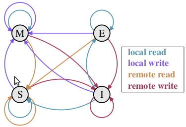

# CPU缓存

[从Java视角理解CPU缓存](https://www.iteye.com/blog/coderplay-1485760)

众所周知, CPU是计算机的大脑, 它负责执行程序的指令; 内存负责存数据, 包括程序自身数据. 同样大家都知道, 内存比CPU慢很多.  其实在30年前, CPU的频率和内存总线的频率在同一个级别, 访问内存只比访问CPU寄存器慢一点儿. 由于内存的发展都到技术及成本的限制,  现在获取内存中的一条数据大概需要200多个CPU周期(CPU cycles), 而CPU寄存器一般情况下1个CPU周期就够了.  

## CPU缓存

网页浏览器为了加快速度,会在本机存缓存以前浏览过的数据; 传统数据库或NoSQL数据库为了加速查询, 常在内存设置一个缓存,  减少对磁盘(慢)的IO. 同样内存与CPU的速度相差太远, 于是CPU设计者们就给CPU加上了缓存(CPU Cache).  如果你需要对同一批数据操作很多次, 那么把数据放至离CPU更近的缓存, 会给程序带来很大的速度提升. 例如, 做一个循环计数,  把计数变量放到缓存里,就不用每次循环都往内存存取数据了. 下面是CPU Cache的简单示意图.   


随着多核的发展, CPU Cache分成了三个级别: L1, L2, L3. 级别越小越接近CPU, 所以速度也更快,  同时也代表着容量越小。

L1是最接近CPU的, 它容量最小, 例如32K, 速度最快,每个核上都有一个L1  Cache(准确地说每个核上有两个L1 Cache, 一个存数据 L1d Cache, 一个存指令 L1i Cache). 

L2 Cache  更大一些,例如256K, 速度要慢一些, 一般情况下每个核上都有一个独立的L2 Cache; 

L3  Cache是三级缓存中最大的一级,例如12MB,同时也是最慢的一级, 在同一个CPU插槽之间的核共享一个L3 Cache.  

| 从CPU到  | 大约需要的CPU周期 | 大约需要的时间(单位ns) |
| -------- | ----------------- | ---------------------- |
| 寄存器   | 1 cycle           |                        |
| L1 Cache | ~3-4 cycles       | ~0.5-1 ns              |
| L2 Cache | ~10-20 cycles     | ~3-7 ns                |
| L3 Cache | ~40-45 cycles     | ~15 ns                 |
| 跨槽传输 |                   | ~20 ns                 |
| 内存     | ~120-240 cycles   | ~60-120ns              |

感兴趣的同学可以在Linux下面用cat /proc/cpuinfo, 或Ubuntu下lscpu看看自己机器的缓存情况, 更细的可以通过以下命令看看: 

1. $ cat /sys/devices/system/cpu/cpu0/cache/index0/size  
2. 32K  
3. $ cat /sys/devices/system/cpu/cpu0/cache/index0/type  
4. Data  
5. $ cat /sys/devices/system/cpu/cpu0/cache/index0/level   
6. 1  
7. $ cat /sys/devices/system/cpu/cpu3/cache/index3/level     
8. 3  

就像数据库cache一样, 获取数据时首先会在最快的cache中找数据, 如果没有命中(Cache miss) 则往下一级找, 直到三层Cache都找不到,那只要向内存要数据了. 一次次地未命中,代表取数据消耗的时间越长.  

## 缓存行(Cache line)

为了高效地存取缓存, 不是简单随意地将单条数据写入缓存的.  缓存是由缓存行组成的, 典型的一行是64字节. 读者可以通过下面的shell命令,查看cherency_line_size就知道知道机器的缓存行是多大. 

1. $ cat /sys/devices/system/cpu/cpu0/cache/index0/coherency_line_size   
2. 64  

CPU存取缓存都是按行为最小单位操作的. 在这儿我将不提及缓存的associativity问题, 将问题简化一些. 一个Java 
long型占8字节, 所以从一条缓存行上你可以获取到8个long型变量. 所以如果你访问一个long型数组, 
当有一个long被加载到cache中, 你将无消耗地加载了另外7个. 所以你可以非常快地遍历数组. 

## 实验

```java
    public class L1CacheMiss {  
        private static final int RUNS = 10;  
        private static final int DIMENSION_1 = 1024 * 1024;  
        private static final int DIMENSION_2 = 62;  
      
        private static long[][] longs;  
      
        public static void main(String[] args) throws Exception {  
            Thread.sleep(10000);  
            longs = new long[DIMENSION_1][];  
            for (int i = 0; i < DIMENSION_1; i++) {  
                longs[i] = new long[DIMENSION_2];  
                for (int j = 0; j < DIMENSION_2; j++) {  
                    longs[i][j] = 0L;  
                }  
            }  
            System.out.println("starting....");  
      
            final long start = System.nanoTime();  
            long sum = 0L;  
            for (int r = 0; r < RUNS; r++) {  
    //          for (int j = 0; j < DIMENSION_2; j++) {  
    //              for (int i = 0; i < DIMENSION_1; i++) {  
    //                  sum += longs[i][j];  
    //              }  
    //          }  
      
                for (int i = 0; i < DIMENSION_1; i++) {  
                    for (int j = 0; j < DIMENSION_2; j++) {  
                        sum += longs[i][j];  
                    }  
                }  
            }  
            System.out.println("duration = " + (System.nanoTime() - start));  
        }  
    }  
```

1.

starting....  

duration = 1460583903 

2.取消注释，注释下面一个循环

starting....  

duration = 22332686898  

前面只花了1.4秒的程序, 只做一行的对调要运行22秒. 从上节我们可以知道在加载longs\[i][j]时, 
longs\[i][j+1]很可能也会被加载至cache中, 所以立即访问longs\[i][j+1]将会命中L1 Cache, 
而如果你访问longs\[i+1][j]情况就不一样了, 这时候很可能会产生 cache miss导致效率低下. 

# 伪共享

[从Java视角理解伪共享(False Sharing)](http://coderplay.iteye.com/blog/1486649)

[伪共享（false sharing），并发编程无声的性能杀手](https://www.cnblogs.com/cyfonly/p/5800758.html)

下面我们讨论更为复杂, 而且更符合现实情况的多核编程时将会碰到的问题. 这些问题更容易犯, 连j.u.c包作者Doug Lea大师的JDK代码里也存在这些问题.  

## MESI协议及RFO请求

我们知道, 典型的CPU微架构有3级缓存, 每个核都有自己私有的L1, L2缓存. 那么多线程编程时, 另外一个核的线程想要访问当前核内L1, L2 缓存行的数据, 该怎么办呢?  

有人说可以通过第2个核直接访问第1个核的缓存行. 这是可行的, 但这种方法不够快. 跨核访问需要通过Memory  Controller(见上一篇的示意图), 典型的情况是第2个核经常访问第1个核的这条数据, 那么每次都有跨核的消耗. 更糟的情况是,  有可能第2个核与第1个核不在一个插槽内.况且Memory Controller的总线带宽是有限的, 扛不住这么多数据传输. 所以,  CPU设计者们更偏向于另一种办法: **如果第2个核需要这份数据, 由第1个核直接把数据内容发过去, 数据只需要传一次**. 

那么什么时候会发生缓存行的传输呢? 答案很简单: 当一个核需要读取另外一个核的脏缓存行时发生. 但是前者怎么判断后者的缓存行已经被弄脏(写)了呢?  

下面将详细地解答以上问题. 首先我们需要谈到一个协议--MESI协议. 现在主流的处理器都是用它来保证缓存的相干性和内存的相干性. M,E,S和I代表使用MESI协议时缓存行所处的四个状态:  

-  M(修改, Modified): 本地处理器已经修改缓存行, 即是脏行, 它的内容与内存中的内容不一样. 并且此cache只有本地一个拷贝(专有). 
-  E(专有, Exclusive): 缓存行内容和内存中的一样, 而且其它处理器都没有这行数据 
-  S(共享, Shared): 缓存行内容和内存中的一样, 有可能其它处理器也存在此缓存行的拷贝 
-  I(无效, Invalid): 缓存行失效, 不能使用



**初始** 一开始时, 缓存行没有加载任何数据, 所以它处于I状态.
**本地写(Local Write)**如果本地处理器写数据至处于I状态的缓存行, 则缓存行的状态变成M. 
**本地读(Local Read)** 如果本地处理器读取处于I状态的缓存行, 很明显此缓存没有数据给它. 
此时分两种情况: (1)其它处理器的缓存里也没有此行数据, 则从内存加载数据到此缓存行后, 再将它设成E状态, 表示只有我一家有这条数据, 
其它处理器都没有 (2)其它处理器的缓存有此行数据, 则将此缓存行的状态设为S状态. 
P.S.如果处于M状态的缓存行, 再由本地处理器写入/读出, 状态是不会改变的. 
**远程读(Remote Read)** 假设我们有两个处理器c1和c2. 
如果c2需要读另外一个处理器c1的缓存行内容, c1需要把它缓存行的内容通过内存控制器(Memory Controller)发送给c2, 
c2接到后将相应的缓存行状态设为S. 在设置之前, 内存也得从总线上得到这份数据并保存. 
**远程写(Remote Write)** 其实确切地说不是远程写, 而是c2得到c1的数据后, 不是为了读,
而是为了写. 也算是本地写, 只是c1也拥有这份数据的拷贝, 这该怎么办呢? c2将发出一个RFO(Request For Owner)请求,
它需要拥有这行数据的权限, 其它处理器的相应缓存行设为I, 除了它自已, 谁不能动这行数据. 这保证了数据的安全, 
同时处理RFO请求以及设置I的过程将给写操作带来很大的性能消耗. 
以上只是列举了一些状态转换, 为下文做铺垫. 如果全部描述,需要非常大量的文字, 大家参考[这张图](http://upload.wikimedia.org/wikipedia/commons/9/99/MESI_protocol_activity_diagram.png)就知道原因了, 可以通过此图了解MESI协议更详细的信息. 

## 伪共享

我们从上节知道, 写操作的代价很高, 特别当需要发送RFO消息时. 我们编写程序时, 什么时候会发生RFO请求呢? 有以下两种: 

1. 线程的工作从一个处理器移到另一个处理器, 它操作的所有缓存行都需要移到新的处理器上. 此后如果再写缓存行, 则此缓存行在不同核上有多个拷贝, 需要发送RFO请求了. 
2. 两个不同的处理器确实都需要操作相同的缓存行
    由上一篇我们知道, 在Java程序中,数组的成员在缓存中也是连续的. 其实从Java对象的相邻成员变量也会加载到同一缓存行中. 如果多个线程操作不同的成员变量, 但是相同的缓存行, 伪共享(False Sharing)问题就发生了. 下面引用[Disruptor](http://code.google.com/p/disruptor/)项目Lead的[博文](http://mechanical-sympathy.blogspot.com/2011/07/false-sharing.html)中的示例图和实验例子(偷会懒,但会加上更详细的profile方法). 
    
    一个运行在处理器core 1上的线程想要更新变量X的值, 同时另外一个运行在处理器core 2上的线程想要更新变量Y的值. 但是, 
    这两个频繁改动的变量都处于同一条缓存行. 两个线程就会轮番发送RFO消息, 占得此缓存行的拥有权. 当core 1取得了拥有权开始更新X, 
    则core 2对应的缓存行需要设为I状态. 当core 2取得了拥有权开始更新Y, 则core 1对应的缓存行需要设为I状态(失效态). 
    轮番夺取拥有权不但带来大量的RFO消息, 而且如果某个线程需要读此行数据时, L1和L2缓存上都是失效数据, 只有L3缓存上是同步好的数据.从[前一篇](http://coderplay.iteye.com/blog/1485760)我们知道, 读L3的数据非常影响性能. 更坏的情况是跨槽读取, L3都要miss,只能从内存上加载. 
    表面上X和Y都是被独立线程操作的, 而且两操作之间也没有任何关系.只不过它们共享了一个缓存行, 但所有竞争冲突都是来源于共享. 

```java
    public final class FalseSharing implements Runnable {  
        public static int NUM_THREADS = 4; // change  
        public final static long ITERATIONS = 500L * 1000L * 1000L;  
        private final int arrayIndex;  
        private static VolatileLong[] longs;  
      
        public FalseSharing(final int arrayIndex) {  
            this.arrayIndex = arrayIndex;  
        }  
      
        public static void main(final String[] args) throws Exception {  
            Thread.sleep(10000);  
            System.out.println("starting....");  
            if (args.length == 1) {  
                NUM_THREADS = Integer.parseInt(args[0]);  
            }  
      
            longs = new VolatileLong[NUM_THREADS];  
            for (int i = 0; i < longs.length; i++) {  
                longs[i] = new VolatileLong();  
            }  
            final long start = System.nanoTime();  
            runTest();  
            System.out.println("duration = " + (System.nanoTime() - start));  
        }  
      
        private static void runTest() throws InterruptedException {  
            Thread[] threads = new Thread[NUM_THREADS];  
            for (int i = 0; i < threads.length; i++) {  
                threads[i] = new Thread(new FalseSharing(i));  
            }  
            for (Thread t : threads) {  
                t.start();  
            }  
            for (Thread t : threads) {  
                t.join();  
            }  
        }  
      
        public void run() {  
            long i = ITERATIONS + 1;  
            while (0 != --i) {  
                longs[arrayIndex].value = i;  
            }  
        }  
      
        public final static class VolatileLong {  
            public volatile long value = 0L;  
            public long p1, p2, p3, p4, p5, p6; // 注释  
        }  
    }  
```

代码的逻辑是默认4个线程修改一数组不同元素的内容.  元素的类型是VolatileLong, 只有一个长整型成员value和6个没用到的长整型成员. value设为volatile是为了让value的修改所有线程都可见.

两个逻辑一模一样的程序, 前者只需要9秒, 后者跑了将近一分钟, 这太不可思议了! 我们用伪共享(False Sharing)的理论来分析一下.
后面的那个程序longs数组的4个元素,由于VolatileLong只有1个长整型成员, 所以整个数组都将被加载至同一缓存行, 
但有4个线程同时操作这条缓存行, 于是伪共享就悄悄地发生了. 读者可以测试一下2,4,8, 16个线程分别操作时分别是什么效果, 什么样的趋势.

那么怎么避免伪共享呢? 我们未注释的代码就告诉了我们方法. 我们知道一条缓存行有64字节, 而Java程序的对象头固定占8字节(32位系统)或12字节(64位系统默认开启压缩, 不开压缩为16字节), 详情见 [链接](http://www.ibm.com/developerworks/java/library/j-codetoheap/index.html). 我们只需要填6个无用的长整型补上6*8=48字节, 让不同的VolatileLong对象处于不同的缓存行, 就可以避免伪共享了(64位系统超过缓存行的64字节也无所谓,只要保证不同线程不要操作同一缓存行就可以). 这个办法叫做补齐(Padding). 

## Java 8 中的解决方案

Java 8 中已经提供了官方的解决方案，Java 8 中新增了一个注解：`@sun.misc.Contended`。加上这个注解的类会自动补齐缓存行，需要注意的是此注解默认是无效的，需要在 jvm 启动时设置 `-XX:-RestrictContended` 才会生效。

```java
@sun.misc.Contended
public final static class VolatileLong {
    public volatile long value = 0L;
    //public long p1, p2, p3, p4, p5, p6;
}
```