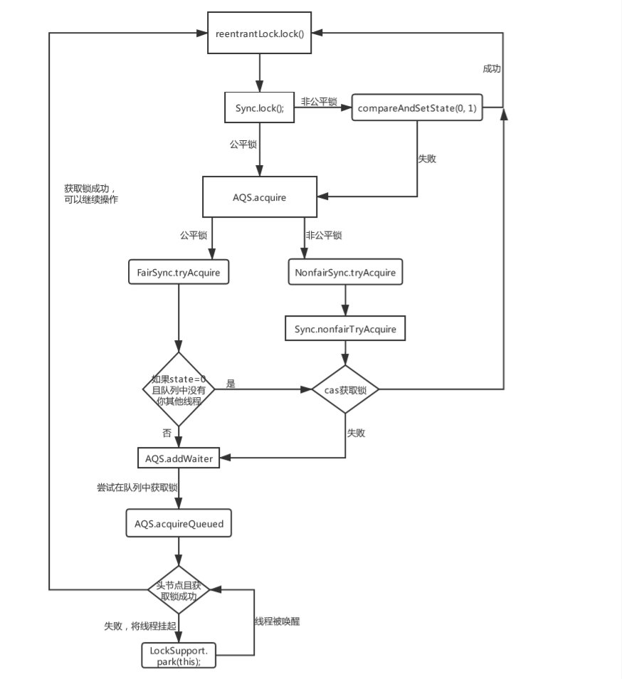
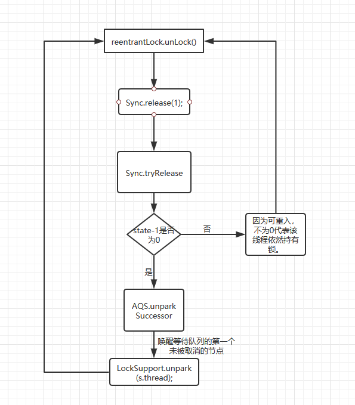
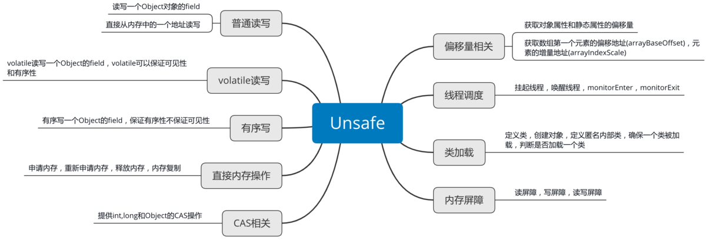

# 显示锁

## 显示条件

```java
public interface Condition {
  void await() throws InterruptedException;
  void awaitUninterruptibly();
  long awaitNanos(long nanosTimeout) throws InterruptedException;
  boolean await(long time, TimeUnit unit) throws InterruptedException;
  boolean awaitUntil(Date deadline) throws InterruptedException;
  void signal();
  void signalAll();
}
```

它与显式锁配合使用，与wait/notify相比，可以**支持多个条件队列**，代码更为易读，效率更高。


## 可重入锁ReentrantLock

相比synchronized，显式锁支持以非阻塞方式获取锁、可以响应中断、可以限时，这使得它灵活的多。

```java
public interface Lock {  
    //就是普通的获取锁和释放锁方法，lock()会阻塞直到成功。
    void lock();
    void unlock();
    //与lock()的不同是，它可以响应中断，如果被其他线程中断了，抛出InterruptedException。
    void lockInterruptibly() throws InterruptedException;
    //只是尝试获取锁，立即返回，不阻塞，如果获取成功，返回true，否则返回false。
    boolean tryLock();
    //先尝试获取锁，如果能成功则立即返回true，否则阻塞等待，但等待的最长时间为指定的参数，在等待的同时响应中断，如果发生了中断，抛出InterruptedException，如果在等待的时间内获得了锁，返回true，否则返回false。
    boolean tryLock(long time, TimeUnit unit) throws InterruptedException;
    //新建一个条件，一个Lock可以关联多个条件
    Condition newCondition();   
}
```

实现原理大致就是lock()时，cas方式去设置状态位state，成功获取锁，失败进入队列，LockSupport.park将线程挂起。

公平锁和非公平锁的区别就在于，公平锁总是等待队列的头节点先获取锁，非公平锁则是所有同时cas去获取锁，不管等待队列的进入顺序。公平锁因为要维护队列顺序，总是让头节点获取锁，会有更多的上下文切换，性能更差。

这样保证公平不是很好吗？为什么默认不保证公平呢？保证公平整体性能比较低，**低的原因不是这个检查慢，而是会让活跃线程得不到锁，进入等待状态，引起上下文切换，降低了整体的效率**，通常情况下，谁先运行关系不大，而且长时间运行，从统计角度而言，虽然不保证公平，也基本是公平的。

可重入也是通过cas状态位state实现的，同一个线程多次lock，让state+1，释放时state-1，当state=0时，唤醒其他锁。

### 获取锁原理



### 释放锁原理

释放锁相对简单，公平锁和非公平锁都是统一的实现，都是将等待



### 构造方法-非公平锁？

```java
public ReentrantLock()
public ReentrantLock(boolean fair) 
```

参数fair表示是否保证公平，不指定的情况下，默认为false，表示不保证公平。所谓公平是指，等待时间最长的线程优先获得锁。**保证公平会影响性能，一般也不需要，所以默认不保证，synchronized锁也是不保证公平的**，待会我们还会再分析实现细节。

### trylock的作用？

防止死锁。比如两个账号a和b，线程1申请锁a成功，线程2申请锁b成功，线程1继续申请锁b，线程2申请锁a，这时两个线程都发生了阻塞，形成死锁。但是使用trylock就可以避免这种情况，trylock会尝试获取锁，获取失败也不会阻塞，会返回一个false。可以用一个类似于自旋锁的方式自旋，具体可以调整。


## 实现原理


### AQS

```java
public abstract class AbstractQueuedSynchronizer
    extends AbstractOwnableSynchronizer
    implements java.io.Serializable {
    //双向链表
    static final class Node {
        static final Node SHARED = new Node();

        static final Node EXCLUSIVE = null;

        static final int CANCELLED =  1;

        static final int SIGNAL    = -1;

        static final int CONDITION = -2;

        static final int PROPAGATE = -3;

        volatile int waitStatus;

        volatile Node prev;

        volatile Node next;

        volatile Thread thread;

        Node nextWaiter;
        }
    //头节点    
    private transient volatile Node head;
    //尾节点
    private transient volatile Node tail;
    //cas状态位，0代表没有线程占用，可重入也是通过这个state+1
    private volatile int state;
}
```

[深度解析 Java 8：JDK1.8 AbstractQueuedSynchronizer 的实现分析（上）](https://www.infoq.cn/article/jdk1.8-abstractqueuedsynchronizer)

[深度解析 Java 8：AbstractQueuedSynchronizer 的实现分析（下）](https://www.infoq.cn/article/java8-abstractqueuedsynchronizer)

在深入分析 AQS 之前，我想先从 AQS 的功能上说明下 AQS，站在使用者的角度，AQS 的功能可以分为两类：**独占**功能和**共享**功能，它的所有子类中，要么实现并使用了它独占功能的 API，要么使用了共享锁的功能，而不会同时使用两套 API。


#### 独占锁

```java
reentrantLock.lock()
        //do something
        reentrantLock.unlock()
```

ReentrantLock 会保证 do something 在同一时间只有一个线程在执行这段代码，或者说，同一时刻只有一个线程的  lock 方法会返回。其余线程会被挂起，直到获取锁。从这里可以看出，其实 ReentrantLock  实现的就是一个独占锁的功能：有且只有一个线程获取到锁，其余线程全部挂起，直到该拥有锁的线程释放锁，被挂起的线程被唤醒重新开始竞争锁。没错，ReentrantLock  使用的就是 AQS 的独占 API 实现的。

```java
public void lock() {
    sync.lock();
}

public void unlock() {
	sync.release(1);
}
```

ReentrantLock 内部只有两个 sync 的实现：

##### Sync

```java
abstract static class Sync extends AbstractQueuedSynchronizer {
    private static final long serialVersionUID = -5179523762034025860L;

    abstract void lock();

    final boolean nonfairTryAcquire(int acquires) {
        final Thread current = Thread.currentThread();
        int c = getState();
        if (c == 0) {
            if (compareAndSetState(0, acquires)) {
                setExclusiveOwnerThread(current);
                return true;
            }
        }
        else if (current == getExclusiveOwnerThread()) {
            int nextc = c + acquires;
            if (nextc < 0) // overflow
                throw new Error("Maximum lock count exceeded");
            setState(nextc);
            return true;
        }
        return false;
    }

    protected final boolean tryRelease(int releases) {
        int c = getState() - releases;
        if (Thread.currentThread() != getExclusiveOwnerThread())
            throw new IllegalMonitorStateException();
        boolean free = false;
        if (c == 0) {
            free = true;
            setExclusiveOwnerThread(null);
        }
        setState(c);
        return free;
    }

    protected final boolean isHeldExclusively() {
        // While we must in general read state before owner,
        // we don't need to do so to check if current thread is owner
        return getExclusiveOwnerThread() == Thread.currentThread();
    }

    final ConditionObject newCondition() {
        return new ConditionObject();
    }

}
```

##### 公平锁
```java
/**
 * Sync object for fair locks 公平锁
 * 每个线程抢占锁的顺序不定，谁运气好，谁就获取到锁，和调用 lock 方法的先后顺序无关，类似于堵车时，加塞的那些 XXXX。
 */
    static final class FairSync extends Sync {
        private static final long serialVersionUID = -3000897897090466540L;

        final void lock() {
            //调用到了 AQS 的 acquire 方法
            acquire(1);
        }

        /**
         * Fair version of tryAcquire.  Don't grant access unless
         * recursive call or no waiters or is first.
         */
        protected final boolean tryAcquire(int acquires) {
            //获取当前线程
            final Thread current = Thread.currentThread();
            //获取父类aqs的状态标志位
            int c = getState();
            //如果为0代表锁未被获取
            if (c == 0) {
                // 如果队列中没有其他线程  说明没有线程正在占有锁！
                // 修改一下状态位，注意：这里的 acquires 是在 lock 的时候传递来的，从上面的图中可以知道，这个值是写死的 1
                if (!hasQueuedPredecessors() &&
                    compareAndSetState(0, acquires)) {
                    //如果通过 CAS 操作将状态为更新成功则代表当前线程获取锁，因此，将当前线程设置到 AQS 的一个变量中，说明这个线程拿走了锁。
                    setExclusiveOwnerThread(current);
                    return true;
                }
            }
            else if (current == getExclusiveOwnerThread()) {
                //因为是可重入锁，如果是当前线程获取了锁，也会返回true
                int nextc = c + acquires;
                if (nextc < 0)
                    throw new Error("Maximum lock count exceeded");
                setState(nextc);
                return true;
            }
            return false;
        }
    }
```

```java
//AbstractQueuedSynchronizer.java
public final void acquire(int arg) {
    //尝试获取锁，获取不到则创建一个 waiter（当前线程）后放到队列中，将当前线程挂起
    if (!tryAcquire(arg) &&
        acquireQueued(addWaiter(Node.EXCLUSIVE), arg))
        selfInterrupt();
}

//用当前线程去构造一个 Node 对象，mode 是一个表示 Node 类型的字段，仅仅表示这个节点是独占的，还是共享的
//创建好节点后，将节点加入到队列尾部
private Node addWaiter(Node mode) {
    Node node = new Node(Thread.currentThread(), mode);
    // Try the fast path of enq; backup to full enq on failure
    Node pred = tail;
    if (pred != null) {
        node.prev = pred;
        if (compareAndSetTail(pred, node)) {
            //cas成功将节点放入队列尾部
            pred.next = node;
            return node;
        }
    }
    //失败代表有并发，无条件的for循环cas，自旋
    enq(node);
    return node;
}

//将当前线程挂起
final boolean acquireQueued(final Node node, int arg) {
    boolean failed = true;
    try {
        boolean interrupted = false;
        for (;;) {
            final Node p = node.predecessor();
            if (p == head && tryAcquire(arg)) {
                setHead(node);
                p.next = null; // help GC
                failed = false;
                return interrupted;
            }
            if (shouldParkAfterFailedAcquire(p, node) &&
                parkAndCheckInterrupt())
                interrupted = true;
        }
    } finally {
        if (failed)
            cancelAcquire(node);
    }
}

//释放锁
public final boolean release(int arg) {
    if (tryRelease(arg)) {
        Node h = head;
        if (h != null && h.waitStatus != 0)
            unparkSuccessor(h);
        return true;
    }
    return false;
}
```


##### 非公平锁

```java
/**
 * Sync object for non-fair locks 非公平锁
 * 每个线程抢占锁的顺序为先后调用 lock 方法的顺序依次获取锁，类似于排队吃饭。
 */
    static final class NonfairSync extends Sync {
        private static final long serialVersionUID = 7316153563782823691L;

        /**
         * Performs lock.  Try immediate barge, backing up to normal
         * acquire on failure.
         */
        final void lock() {
            //非公平锁的 lock 方法的处理方式是: 在 lock 的时候先直接 cas 修改一次 state 变量（尝试获取锁），成功就返回，不成功再排队，从而达到不排队直接抢占的目的。
            if (compareAndSetState(0, 1))
                setExclusiveOwnerThread(Thread.currentThread());
            else
                acquire(1);
        }

        protected final boolean tryAcquire(int acquires) {
            return nonfairTryAcquire(acquires);
        }
    }


```


#### 共享锁

CountDownLatch


### 乐观锁cas

基于CAS，除了可以实现乐观非阻塞算法，它也可以用来实现悲观阻塞式算法，比如锁，实际上，**Java并发包中的所有阻塞式工具、容器、算法也都是基于CAS的** (不过，也需要一些别的支持)。

```java
//AbstractQueuedSynchronizer.java
private static final Unsafe unsafe = Unsafe.getUnsafe();
private static final long stateOffset;
private static final long headOffset;
private static final long tailOffset;
private static final long waitStatusOffset;
private static final long nextOffset;

static {
    try {
        //获取字段相对对象的偏移量
        stateOffset = unsafe.objectFieldOffset
            (AbstractQueuedSynchronizer.class.getDeclaredField("state"));
        headOffset = unsafe.objectFieldOffset
            (AbstractQueuedSynchronizer.class.getDeclaredField("head"));
        tailOffset = unsafe.objectFieldOffset
            (AbstractQueuedSynchronizer.class.getDeclaredField("tail"));
        waitStatusOffset = unsafe.objectFieldOffset
            (Node.class.getDeclaredField("waitStatus"));
        nextOffset = unsafe.objectFieldOffset
            (Node.class.getDeclaredField("next"));

    } catch (Exception ex) { throw new Error(ex); }
}

protected final boolean compareAndSetState(int expect, int update) {
    // 比较对象偏移量位置数字是否和期待数字相同，相同则修改返回true，否则返回false
    return unsafe.compareAndSwapInt(this, stateOffset, expect, update);
}
```


```java
//sun.misc.Unsafe
public final native boolean compareAndSwapObject(Object var1, long var2, Object var4, Object var5);
public final native boolean compareAndSwapInt(Object var1, long var2, int var4, int var5);
public final native boolean compareAndSwapLong(Object var1, long var2, long var4, long var6);

public native long objectFieldOffset(Field var1);
```


#### ABA问题

使用CAS方式更新有一个ABA问题，该问题是指，一个线程开始看到的值是A，随后使用CAS进行更新，它的实际期望是没有其他线程修改过才更新，但普通的CAS做不到，因为可能在这个过程中，已经有其他线程修改过了，比如先改为了B，然后又改回为了A。

ABA问题大部分情况下都不是一个问题，但是如果这是一个问题，可以增加一个版本号，比如AtomicStampedReference，原理其实就是把版本号和值合并为一个对象，cas的时候使用UNSAFE.compareAndSwapObject来进行比较。

```java
public boolean compareAndSet(V   expectedReference,
                             V   newReference,
                             int expectedStamp,
                             int newStamp) {
    Pair<V> current = pair;
    return
        expectedReference == current.reference &&
        expectedStamp == current.stamp &&
        ((newReference == current.reference &&
          newStamp == current.stamp) ||
         casPair(current, Pair.of(newReference, newStamp)));
}

private boolean casPair(Pair<V> cmp, Pair<V> val) {
    return UNSAFE.compareAndSwapObject(this, pairOffset, cmp, val);
}
```

- 通过我们传入的字段在对象中的偏移量来获取到字段的地址（对象首地址 + 字段在对象中的偏移量）；
- 然后调用 **CompareAndSwap** 方法比较字段的地址是否与我们期望的地址相等，如果相等则使用我们传入的新地址更新字段的地址；

所以最后我们可以得出结论：**compareAndSwapObject** 方法其实比较的就是两个 Java Object 的地址，如果相等则将新的地址（Java Object）赋给该字段。

### LockSupport


```java
//放弃cpu，进入waiting
public static void park()
//可以指定等待的最长时间，参数是相对于当前时间的纳秒数。
public static void parkNanos(long nanos)
//可以指定最长等到什么时候，参数是绝对时间，是相对于纪元时的毫秒数。 
public static void parkUntil(long deadline)
//恢复可运行状态
public static void unpark(Thread thread)
```

​	这些park/unpark方法是怎么实现的呢？与CAS方法一样，**它们也调用了Unsafe类中的对应方法，Unsafe类最终调用了操作系统的API**，从程序员的角度，我们可以认为LockSupport中的这些方法就是基本操作。


```java
//LockSupport.java
public static void park() {
		UNSAFE.park(false, 0L);
}

public static void unpark(Thread thread) {
    if (thread != null)
        UNSAFE.unpark(thread);
}
```


Java和C++语言的一个重要区别就是Java中我们无法直接操作一块内存区域，不能像C++中那样可以自己申请内存和释放内存。Java中的Unsafe类为我们提供了类似C++手动管理内存的能力。
 Unsafe类，全限定名是`sun.misc.Unsafe`，从名字中我们可以看出来这个类对普通程序员来说是“危险”的，一般应用开发者不会用到这个类。

[Java中的Unsafe](https://www.jianshu.com/p/db8dce09232d)




# 原子变量

对于count++这种操作来说，使用synchronzied成本太高了，需要先获取锁，最后还要释放锁，获取不到锁的情况下还要等待，还会有线程的上下文切换，这些都需要成本。

对于这种情况，完全可以使用原子变量代替，Java并发包中的基本原子变量类型有：

- AtomicBoolean：原子Boolean类型
- AtomicInteger：原子Integer类型
- AtomicLong：原子Long类型
- AtomicReference：原子引用类型

这是我们主要介绍的类，除了这四个类，还有一些其他的类，我们也会进行简要介绍。

针对Integer, Long和Reference类型，还有对应的数组类型：

- AtomicIntegerArray
- AtomicLongArray
- AtomicReferenceArray

为了便于以原子方式更新对象中的字段，还有如下的类：

- AtomicIntegerFieldUpdater
- AtomicLongFieldUpdater
- AtomicReferenceFieldUpdater

AtomicReference还有两个类似的类，在某些情况下更为易用：

- AtomicMarkableReference
- AtomicStampedReference

你可能会发现，怎么没有针对char, short, float,  double类型的原子变量呢？大概是用的比较少吧，如果需要，可以转换为int/long，然后使用AtomicInteger或AtomicLong。比如，对于float，可以使用如下方法和int相互转换：

```java
public static int floatToIntBits(float value)
public static float intBitsToFloat(int bits);
```


## AtomicInteger


**基本用法**


```java
//给定一个初始值
public AtomicInteger(int initialValue)
//初始值为0
public AtomicInteger()
    
//以原子方式获取旧值并设置新值
public final int getAndSet(int newValue)
//以原子方式获取旧值并给当前值加1
public final int getAndIncrement()
//以原子方式获取旧值并给当前值减1
public final int getAndDecrement()
//以原子方式获取旧值并给当前值加delta
public final int getAndAdd(int delta)
//以原子方式给当前值加1并获取新值
public final int incrementAndGet()
//以原子方式给当前值减1并获取新值
public final int decrementAndGet()
//以原子方式给当前值加delta并获取新值
public final int addAndGet(int delta)
```


原理

```java
private static final Unsafe unsafe = Unsafe.getUnsafe();
//获取value相对Java对象的“起始地址”的偏移量
private static final long valueOffset;
static {    
         try {        
                valueOffset = unsafe.objectFieldOffset (AtomicInteger.class.getDeclaredField("value"));   
        } catch (Exception ex) { 
               throw new Error(ex); 
        }
    }
private volatile int value;


public final int getAndAdd(int delta) {
    //this对象valueOffset偏移量执行原子add
    return unsafe.getAndAddInt(this, valueOffset, delta);
}
```


## volatile


### 保证可见性

`volatile`修饰的属性保证每次读取都能读到最新的值。

线程A在工作内存中修改的**共享属性值会立即刷新到主存**，线程B/C/D每次通过读写栅栏来达到类似于直接从主存中读取属性值。

### 保证有序性

- 具体描述
  当对volatile修饰的属性进行读/写操作时，其前面的代码必须已执行完成 & 结果对后续的操作可见
- 原理
  重排序时，以`volatile`修饰属性的读/写操作代码行为**分界线**，读/写操作前面的代码不许排序到后面，后面同理不许排序到前面。由此保证有序性

### 不保证原子性

volatile修饰的属性若在修改前已读取了值，那么修改后，无法改变已经复制到工作内存的值
即无法阻止并发的情况

```java
// 变量a 被volatile修饰 
volatile static int a=0;
a++;
// 包含了2步操作：1 = 读取a、2= 执行a+1 & 将a+1结果赋值给a
// 设：线程A、B同时执行以下语句，线程A执行完第1步后被挂起、线程B执行了a++，那么主存中a的值为1
// 但线程A的工作内存中还是0，由于线程A之前已读取了a的值 = 0，执行a++后再次将a的值刷新到主存 = 1
// 即 a++执行了2次，但2次都是从0变为1，故a的值最终为1
```


# Synchronized和ReentrantLock？

## 二者共性？

- 都是可重入的，一个线程在持有一个锁的前提下，可以继续获得该锁
- 可以解决竞态条件问题
- 可以保证内存可见性

## 使用上的区别？

1.Synchronized编写更加方便，ReentrantLock需要手动加锁和释放锁应该配合try/finally使用。

2.Synchronized使用object中的wait/notify来阻塞唤醒线程，只支持一种条件。而ReentrantLock的condition支持多个调整，使用await/signal来阻塞唤醒线程。

3.ReentrantLock响应中断。

4.ReentrantLock提供tryLock()，可以避免死锁。

5.ReentrantLock默认是非公平锁，但是支持公平锁，而synchronized是不保证公平的。

## 原理上的区别？

​	ReentrantLock主要是基于AQS实现，内部维持一个等待队列，cas修改state，非阻塞的获取锁，获取锁失败，使用LockSupport挂起唤醒线程。

​	Synchronized主要使用对象头来实现，对象头会保存锁的状态，自适应自旋锁、偏向锁、轻量级锁，锁升级，只有多个线程并发获取才会升级成重量级锁，重量级锁使用monitor实现，需要用户态和内核态的切换，性能会很差。

## 性能上的区别？

​	jdk1.6之前Synchronized都是重量级锁，性能相对ReentrantLock差很多。但是jdk1.6以后Synchronized进行了优化，自适应自旋锁，偏向锁、轻量级锁、锁粗化，两种性能已经差不多了。

​	在Synchronized优化以前，synchronized的性能是比ReenTrantLock差很多的，但是自从Synchronized引入了偏向锁，轻量级锁（自旋锁）后，两者的性能就差不多了，在两种方法都可用的情况下，官方甚至建议使用synchronized，其实synchronized的优化我感觉就借鉴了ReenTrantLock中的CAS技术。都是试图在用户态就把加锁问题解决，避免进入内核态的线程阻塞。


