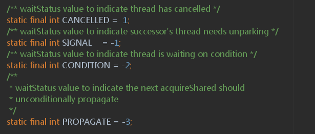

# 显示锁

## 显示条件

```java
public interface Condition {
  void await() throws InterruptedException;
  void awaitUninterruptibly();
  long awaitNanos(long nanosTimeout) throws InterruptedException;
  boolean await(long time, TimeUnit unit) throws InterruptedException;
  boolean awaitUntil(Date deadline) throws InterruptedException;
  void signal();
  void signalAll();
}
```

它与显式锁配合使用，与wait/notify相比，可以**支持多个条件队列**，代码更为易读，效率更高。


## 可重入锁ReentrantLock

相比synchronized，显式锁支持以非阻塞方式获取锁、可以响应中断、可以限时，这使得它灵活的多。

```java
public interface Lock {  
    //就是普通的获取锁和释放锁方法，lock()会阻塞直到成功。
    void lock();
    void unlock();
    //与lock()的不同是，它可以响应中断，如果被其他线程中断了，抛出InterruptedException。
    void lockInterruptibly() throws InterruptedException;
    //只是尝试获取锁，立即返回，不阻塞，如果获取成功，返回true，否则返回false。
    boolean tryLock();
    //先尝试获取锁，如果能成功则立即返回true，否则阻塞等待，但等待的最长时间为指定的参数，在等待的同时响应中断，如果发生了中断，抛出InterruptedException，如果在等待的时间内获得了锁，返回true，否则返回false。
    boolean tryLock(long time, TimeUnit unit) throws InterruptedException;
    //新建一个条件，一个Lock可以关联多个条件
    Condition newCondition();   
}
```

实现原理大致就是lock()时，cas方式去设置状态位state，成功获取锁，失败进入队列，LockSupport.park将线程挂起。

公平锁和非公平锁的区别就在于，公平锁总是等待队列的头节点先获取锁，非公平锁则是所有同时cas去获取锁，不管等待队列的进入顺序。公平锁因为要维护队列顺序，总是让头节点获取锁，会有更多的上下文切换，性能更差。

这样保证公平不是很好吗？为什么默认不保证公平呢？保证公平整体性能比较低，**低的原因不是这个检查慢，而是会让活跃线程得不到锁，进入等待状态，引起上下文切换，降低了整体的效率**，比如线程A一直在执行，然后需要锁资源，刚好线程B释放了锁，线程A就能马上获取锁，而不是去排队，进入等待状态，通常情况下，谁先运行关系不大，而且长时间运行，从统计角度而言，虽然不保证公平，也基本是公平的。

可重入也是通过cas状态位state实现的，同一个线程多次lock，让state+1，释放时state-1，当state=0时，唤醒其他锁。

### 获取锁原理


### 释放锁原理

释放锁相对简单，公平锁和非公平锁都是统一的实现，都是将等待队列的第一个节点唤醒。


### 构造方法-非公平锁？

```java
public ReentrantLock()
public ReentrantLock(boolean fair) 
```

参数fair表示是否保证公平，不指定的情况下，默认为false，表示不保证公平。所谓公平是指，等待时间最长的线程优先获得锁。**保证公平会影响性能，一般也不需要，所以默认不保证，synchronized锁也是不保证公平的**，待会我们还会再分析实现细节。

### trylock的作用？

使用tryLock()，可以避免死锁。在持有一个锁，获取另一个锁，获取不到的时候，可以释放已持有的锁，给其他线程机会获取锁，然后再重试获取所有锁。

防止死锁。比如两个账号a和b，线程1申请锁a成功，线程2申请锁b成功，线程1继续申请锁b，线程2申请锁a，这时两个线程都发生了阻塞，形成死锁。但是使用trylock就可以避免这种情况，线程1trylock尝试获取锁b，获取失败也不会阻塞，会返回一个false，然后线程1放弃拥有的锁a，线程2就能获取到锁a，防止了死锁的出现。可以用一个类似于自旋锁的方式自旋，具体可以调整。


# AQS

[深度解析 Java 8：JDK1.8 AbstractQueuedSynchronizer 的实现分析（上）](https://www.infoq.cn/article/jdk1.8-abstractqueuedsynchronizer)

[深度解析 Java 8：AbstractQueuedSynchronizer 的实现分析（下）](https://www.infoq.cn/article/java8-abstractqueuedsynchronizer)

[我画了35张图就是为了让你深入 AQS](https://cloud.tencent.com/developer/article/1624354)

在深入分析 AQS 之前，我想先从 AQS 的功能上说明下 AQS，站在使用者的角度，AQS 的功能可以分为两类：**独占**功能和**共享**功能，它的所有子类中，要么实现并使用了它独占功能的 API，要么使用了共享锁的功能，而不会同时使用两套 API。

```java
public abstract class AbstractQueuedSynchronizer extends AbstractOwnableSynchronizer
    implements java.io.Serializable {
    //头节点 直接把它当做,当前持有锁的线程     
    private transient volatile Node head;
    //尾节点 每个新的节点进来，都插入到最后，也就形成了一个链表
    private transient volatile Node tail;
    //cas状态位，0代表没有线程占用，可重入也是通过这个state+1
    private volatile int state;
    
    // 代表当前持有独占锁的线程，举个最重要的使用例子，因为锁可以重入
    // reentrantLock.lock()可以嵌套调用多次，所以每次用这个来判断当前线程是否已经拥有了锁
    // if (currentThread == getExclusiveOwnerThread()) {state++}
    private transient Thread exclusiveOwnerThread; //继承自父类AbstractOwnableSynchronizer
}
```

## 双向链表-Node

Node 的数据结构其实也挺简单的，就是 thread + waitStatus + pre + next 四个属性而已

```java
static final class Node {

    //当前节点处于共享模式的标记
    static final Node SHARED = new Node();
    //当前节点处于独占模式的标记
    static final Node EXCLUSIVE = null;
    
	//线程取消
    static final int CANCELLED =  1;
	//线程等待触发，其表示当前node的后继节点对应的线程需要被唤醒
    static final int SIGNAL    = -1;
	//线程等待condition条件	
    static final int CONDITION = -2;
    //工作于共享锁状态，需要向后传播，
    //比如根据资源是否剩余，唤醒后继节点
    static final int PROPAGATE = -3;
    //等待状态，有1,0,-1,-2,-3五个值。分别对应上面的值
    volatile int waitStatus;

    volatile Node prev;

    volatile Node next;

    //节点代表的线程
    volatile Thread thread;

    //等待条件的下一个节点，ConditonObject中用到
    Node nextWaiter;
}
```
## 独占模式

1）tryAcquire()尝试获取资源。

2）如果获取失败，则通过addWaiter(Node.EXCLUSIVE), arg)方法把当前线程添加到等待队列队尾，并标记为独占模式。

3）插入等待队列后，并没有放弃获取资源，acquireQueued()自旋尝试获取资源。根据前置节点状态状态判断是否应该继续获取资源。如果前驱是头结点，继续尝试获取资源；

4）在每一次自旋获取资源过程中，失败后调用shouldParkAfterFailedAcquire(Node,   Node)检测当前节点是否应该park()。若返回true，则调用parkAndCheckInterrupt()中断当前节点中的线程。若返回false，则接着自旋获取资源。当acquireQueued(Node,int)返回true，则将当前线程中断；false则说明拿到资源了。

5）在进行是否需要挂起的判断中，如果前置节点是SIGNAL状态，就挂起，返回true。如果前置节点状态为CANCELLED，就一直往前找，直到找到最近的一个处于正常等待状态的节点，并排在它后面，返回false，acquireQueed()接着自旋尝试，回到3）。

6）前置节点处于其他状态，利用CAS将前置节点状态置为SIGNAL。当前置节点刚释放资源，状态就不是SIGNAL了，导致失败，返回false。但凡返回false，就导致acquireQueed()接着自旋尝试。

7）最终当tryAcquire(int)返回false，acquireQueued(Node,int)返回true，调用selfInterrupt()，中断当前线程。

### acquire

```java
//尝试加锁，失败进入等待队列,挂起线程
public final void acquire(int arg) {
    if (!tryAcquire(arg) &&
        acquireQueued(addWaiter(Node.EXCLUSIVE), arg))
        selfInterrupt();
}
```

#### tryAcquire
```java
//尝试加锁，交给子类实现 模板方法设计模式
protected boolean tryAcquire(int arg) {
    throw new UnsupportedOperationException();
}
```
### addWaiter

```java
//用当前线程去构造一个 Node 对象，mode 是一个表示 Node 类型的字段，仅仅表示这个节点是独占的，还是共享的
//创建好节点后，将节点加入到队列尾部
private Node addWaiter(Node mode) {
    Node node = new Node(Thread.currentThread(), mode);
    // Try the fast path of enq; backup to full enq on failure
    Node pred = tail;
    if (pred != null) {
        node.prev = pred;
        if (compareAndSetTail(pred, node)) {
            //cas成功将节点放入队列尾部
            pred.next = node;
            return node;
        }
    }
    //失败代表有并发，无条件的for循环cas，自旋
    enq(node);
    return node;
}
```


### acquireQueued

```java
//自旋方式获取资源并判断是否需要被挂起
final boolean acquireQueued(final Node node, int arg) {
    boolean failed = true;
    try {
        boolean interrupted = false;
        for (;;) {
            final Node p = node.predecessor();
            //如果前继节点是 head，，说明这是等待队列的第一个，尝试获取锁，tryAcquire由子类实现
            if (p == head && tryAcquire(arg)) {
                setHead(node);
                p.next = null; // help GC
                failed = false;
                return interrupted;
            }
            //检查前一个节点的状态为SIGNAL，看当前获取锁失败的线程是否需要挂起。
            if (shouldParkAfterFailedAcquire(p, node) &&
                parkAndCheckInterrupt())
                interrupted = true;
        }
    } finally {
        //如果有异常，取消请求，对应到队列操作，就是将当前节点从队列中移除。
        if (failed)
            cancelAcquire(node);
    }
}
```

#### waitStatus

```java
    private static boolean shouldParkAfterFailedAcquire(Node pred, Node node) {
        int ws = pred.waitStatus;
        if (ws == Node.SIGNAL)
            //前驱节点的状态是SIGNAL，说明前驱节点释放资源后会通知自己
            //此时当前节点可以安全的park()，因此返回true
            return true;
        if (ws > 0) {
            //前驱节点的状态是CANCLLED，说明前置节点已经放弃获取资源了
            //此时一直往前找，直到找到最近的一个处于正常等待状态的节点
            //并排在它后面，返回false
            do {
                node.prev = pred = pred.prev;
            } while (pred.waitStatus > 0);
            pred.next = node;
        } else {
            //前驱节点的状态是CONDITION或PROPGATE，则利用CAS将前置节点的为SIGNAL，让它释放资源后通知自己
            //如果前置节点刚释放资源，状态就不是SIGNAL了，这时就会失败返回false
            compareAndSetWaitStatus(pred, ws, Node.SIGNAL);
        }
        return false;
    }
```

Node 节点中，除了存储当前线程，节点类型，队列中前后元素的变量，还有一个叫 waitStatus 的变量，改变量用于描述节点的状态，为什么需要这个状态呢？

原因是：AQS 的队列中，在有并发时，肯定会存取一定数量的节点，每个节点[ [G4\] ](https://www.infoq.cn/article/%24-0)  代表了一个线程的状态，有的线程可能“等不及”获取锁了，需要放弃竞争，退出队列，有的线程在等待一些条件满足，满足后才恢复执行（这里的描述很像某个  J.U.C 包下的工具类，ReentrankLock 的 Condition，事实上，Condition 同样也是 AQS  的子类）等等，总之，各个线程有各个线程的状态，但总需要一个变量来描述它，这个变量就叫 waitStatus, 它有四种状态：



分别表示：

1. 节点取消
2. 节点等待触发
3. 节点等待条件
4. 节点状态需要向后传播。

只有当前节点的前一个节点为 SIGNAL 时，才能当前节点才能被挂起。

### release

```java
//释放锁
public final boolean release(int arg) {
    if (tryRelease(arg)) {
        Node h = head;
        if (h != null && h.waitStatus != 0)
            unparkSuccessor(h);
        return true;
    }
    return false;
}
```

## 共享模式

acquireShared()：以共享模式获取对象，忽略中断。先是tryAcquireShared(int)尝试直接去获取资源，如果成功，acquireShared(int)就结束了；否则，调用doAcquireShared(Node)将线程加入等待队列，直到获取到资源为止。

### acquireShared

```java
    public final void acquireShared(int arg) {
        //模板方法模式，tryAcquireShared由子类实现
        //想看的话推荐读写锁的源码，这里就不细述了
        if (tryAcquireShared(arg) < 0)
            doAcquireShared(arg);
    }
```

#### doAcquireShared

```java
    private void doAcquireShared(int arg) {
        //将线程加入等待队列，设置为共享模式
        final Node node = addWaiter(Node.SHARED);
        boolean failed = true;
        try {
            boolean interrupted = false;
            //自旋尝试获取资源
            for (;;) {
                final Node p = node.predecessor();
                if (p == head) {
                    int r = tryAcquireShared(arg);
                    if (r >= 0) {
                        //设置头节点，且如果还有剩余资源，唤醒后继节点获取资源
                        setHeadAndPropagate(node, r);
                        p.next = null; // help GC
                        if (interrupted)
                            selfInterrupt();
                        failed = false;
                        return;
                    }
                }
                //是否需要被挂起
                if (shouldParkAfterFailedAcquire(p, node) &&
                    parkAndCheckInterrupt())
                    interrupted = true;
            }
        } finally {
            if (failed)
                cancelAcquire(node);
        }
    }
```

### releaseShared

在释放一部分资源后就可以通知其他线程获取资源。

```java
    public final boolean releaseShared(int arg) {
        if (tryReleaseShared(arg)) {
            doReleaseShared();
            return true;
        }
        return false;
    }
```

#### doReleaseShared

把当前结点的状态由SIGNAL设置为PROPAGATE状态。

```java
    private void doReleaseShared() {
        for (;;) {
            Node h = head;
            if (h != null && h != tail) {
                int ws = h.waitStatus;
                if (ws == Node.SIGNAL) {
                    if (!compareAndSetWaitStatus(h, Node.SIGNAL, 0))
                        //将自旋尝试修改等待状态为0
                        continue;
                    //唤醒下一个被阻塞的节点
                    unparkSuccessor(h);
                }
                else if (ws == 0 &&
                         !compareAndSetWaitStatus(h, 0, Node.PROPAGATE))
                    //设置为PROPAGATE状态
                    continue;               
            }
            //上面代码块执行过程中如果head变更了，就接着循环尝试
            if (h == head)
                break;
        }
    }
```

## Condition

```java
class BoundedBuffer {
    final Lock lock = new ReentrantLock();
    // condition 依赖于 lock 来产生
    final Condition notFull = lock.newCondition();
    final Condition notEmpty = lock.newCondition();

    final Object[] items = new Object[100];
    int putptr, takeptr, count;

    // 生产
    public void put(Object x) throws InterruptedException {
        lock.lock();
        try {
            while (count == items.length)
                notFull.await();  // 队列已满，等待，直到 not full 才能继续生产
            items[putptr] = x;
            if (++putptr == items.length) putptr = 0;
            ++count;
            notEmpty.signal(); // 生产成功，队列已经 not empty 了，发个通知出去
        } finally {
            lock.unlock();
        }
    }

    // 消费
    public Object take() throws InterruptedException {
        lock.lock();
        try {
            while (count == 0)
                notEmpty.await(); // 队列为空，等待，直到队列 not empty，才能继续消费
            Object x = items[takeptr];
            if (++takeptr == items.length) takeptr = 0;
            --count;
            notFull.signal(); // 被我消费掉一个，队列 not full 了，发个通知出去
            return x;
        } finally {
            lock.unlock();
        }
    }
}
```

每个 ReentrantLock  实例可以通过调用多次 newCondition 产生多个 ConditionObject 的实例：

```java
final ConditionObject newCondition() {
    // 实例化一个 ConditionObject
    return new ConditionObject();
}
```

### ConditionObject

```java
public class ConditionObject implements Condition, java.io.Serializable {
        private static final long serialVersionUID = 1173984872572414699L;
        // 条件队列的第一个节点
        private transient Node firstWaiter;
        // 条件队列的最后一个节点
        private transient Node lastWaiter;
}
```

### await

1.await将线程加入条件队列。

2.完全释放锁

3.挂起线程

4.signal唤醒后，加入阻塞队列

```java
// 首先，这个方法是可被中断的，不可被中断的是另一个方法 awaitUninterruptibly()
// 这个方法会阻塞，直到调用 signal 方法（指 signal() 和 signalAll()，下同），或被中断
public final void await() throws InterruptedException {
    // 老规矩，既然该方法要响应中断，那么在最开始就判断中断状态
    if (Thread.interrupted())
        throw new InterruptedException();

    // 添加到 condition 的条件队列中
    Node node = addConditionWaiter();

    // 释放锁，返回值是释放锁之前的 state 值
    // await() 之前，当前线程是必须持有锁的，这里肯定要释放掉
    int savedState = fullyRelease(node);

    int interruptMode = 0;
    // 这里退出循环有两种情况，之后再仔细分析
    // 1. isOnSyncQueue(node) 返回 true，即当前 node 已经转移到阻塞队列了
    // 2. checkInterruptWhileWaiting(node) != 0 会到 break，然后退出循环，代表的是线程中断
    while (!isOnSyncQueue(node)) {
        LockSupport.park(this);
        if ((interruptMode = checkInterruptWhileWaiting(node)) != 0)
            break;
    }
    // 被唤醒后，将进入阻塞队列，等待获取锁
    if (acquireQueued(node, savedState) && interruptMode != THROW_IE)
        interruptMode = REINTERRUPT;
    if (node.nextWaiter != null) // clean up if cancelled
        unlinkCancelledWaiters();
    if (interruptMode != 0)
        reportInterruptAfterWait(interruptMode);
}
```
#### addConditionWaiter

```java
// 将当前线程对应的节点入队，插入队尾
private Node addConditionWaiter() {
    Node t = lastWaiter;
    // 如果条件队列的最后一个节点取消了，将其清除出去
    // 为什么这里把 waitStatus 不等于 Node.CONDITION，就判定为该节点发生了取消排队？
    if (t != null && t.waitStatus != Node.CONDITION) {
        // 这个方法会遍历整个条件队列，然后会将已取消的所有节点清除出队列
        unlinkCancelledWaiters();
        t = lastWaiter;
    }
    // node 在初始化的时候，指定 waitStatus 为 Node.CONDITION
    Node node = new Node(Thread.currentThread(), Node.CONDITION);

    // t 此时是 lastWaiter，队尾
    // 如果队列为空
    if (t == null)
        firstWaiter = node;
    else
        t.nextWaiter = node;
    lastWaiter = node;
    return node;
}
```

#### fullyRelease

```java
// 首先，我们要先观察到返回值 savedState 代表 release 之前的 state 值
// 对于最简单的操作：先 lock.lock()，然后 condition1.await()。
//         那么 state 经过这个方法由 1 变为 0，锁释放，此方法返回 1
//         相应的，如果 lock 重入了 n 次，savedState == n
// 如果这个方法失败，会将节点设置为"取消"状态，并抛出异常 IllegalMonitorStateException
final int fullyRelease(Node node) {
    boolean failed = true;
    try {
        int savedState = getState();
        // 这里使用了当前的 state 作为 release 的参数，也就是完全释放掉锁，将 state 置为 0
        if (release(savedState)) {
            failed = false;
            return savedState;
        } else {
            throw new IllegalMonitorStateException();
        }
    } finally {
        if (failed)
            node.waitStatus = Node.CANCELLED;
    }
}
```

### signal

```java
// 唤醒等待了最久的线程
// 其实就是，将这个线程对应的 node 从条件队列转移到阻塞队列
public final void signal() {
    // 调用 signal 方法的线程必须持有当前的独占锁
    if (!isHeldExclusively())
        throw new IllegalMonitorStateException();
    Node first = firstWaiter;
    if (first != null)
        doSignal(first);
}


```

#### doSignal

从条件队列队头往后遍历，找出第一个需要转移的 node

```java
// 因为前面我们说过，有些线程会取消排队，但是可能还在队列中
private void doSignal(Node first) {
    do {
          // 将 firstWaiter 指向 first 节点后面的第一个，因为 first 节点马上要离开了
        // 如果将 first 移除后，后面没有节点在等待了，那么需要将 lastWaiter 置为 null
        if ( (firstWaiter = first.nextWaiter) == null)
            lastWaiter = null;
        // 因为 first 马上要被移到阻塞队列了，和条件队列的链接关系在这里断掉
        first.nextWaiter = null;
    } while (!transferForSignal(first) &&
             (first = firstWaiter) != null);
      // 这里 while 循环，如果 first 转移不成功，那么选择 first 后面的第一个节点进行转移，依此类推
}
```

#### transferForSignal

将节点从条件队列转移到阻塞队列

```java
// true 代表成功转移, false 代表在 signal 之前，节点已经取消了
final boolean transferForSignal(Node node) {

    // CAS 如果失败，说明此 node 的 waitStatus 已不是 Node.CONDITION，说明节点已经取消，
    // 既然已经取消，也就不需要转移了，方法返回，转移后面一个节点
    // 否则，将 waitStatus 置为 0
    if (!compareAndSetWaitStatus(node, Node.CONDITION, 0))
        return false;

    // enq(node): 自旋进入阻塞队列的队尾
    // 注意，这里的返回值 p 是 node 在阻塞队列的前驱节点
    Node p = enq(node);
    int ws = p.waitStatus;
    // ws > 0 说明 node 在阻塞队列中的前驱节点取消了等待锁，直接唤醒 node 对应的线程。唤醒之后会怎么样，后面再解释
    // 如果 ws <= 0, 那么 compareAndSetWaitStatus 将会被调用，上篇介绍的时候说过，节点入队后，需要把前驱节点的状态设为 Node.SIGNAL(-1)
    if (ws > 0 || !compareAndSetWaitStatus(p, ws, Node.SIGNAL))
        // 如果前驱节点取消或者 CAS 失败，会进到这里唤醒线程，之后的操作看下一节
        LockSupport.unpark(node.thread);
    return true;
}
```

# 独占锁

## ReentrantLock

```java
reentrantLock.lock()
//do something
reentrantLock.unlock()
```

ReentrantLock 会保证 do something 在同一时间只有一个线程在执行这段代码，或者说，同一时刻只有一个线程的  lock 方法会返回。其余线程会被挂起，直到获取锁。从这里可以看出，其实 ReentrantLock  实现的就是一个独占锁的功能：有且只有一个线程获取到锁，其余线程全部挂起，直到该拥有锁的线程释放锁，被挂起的线程被唤醒重新开始竞争锁。没错，ReentrantLock  使用的就是 AQS 的独占 API 实现的。

```java
public void lock() {
    sync.lock();
}

public void unlock() {
	sync.release(1);
}
```

ReentrantLock 内部只有两个 sync 的实现：

### 抽象基类-Sync

```java
abstract static class Sync extends AbstractQueuedSynchronizer {
    private static final long serialVersionUID = -5179523762034025860L;

    abstract void lock();

    protected final boolean isHeldExclusively() {
        // While we must in general read state before owner,
        // we don't need to do so to check if current thread is owner
        return getExclusiveOwnerThread() == Thread.currentThread();
    }

    final ConditionObject newCondition() {
        return new ConditionObject();
    }

}
```

#### nonfairTryAcquire

```java
final boolean nonfairTryAcquire(int acquires) {
    final Thread current = Thread.currentThread();
    int c = getState();
    if (c == 0) {
        if (compareAndSetState(0, acquires)) {
            setExclusiveOwnerThread(current);
            return true;
        }
    }
    else if (current == getExclusiveOwnerThread()) {
        int nextc = c + acquires;
        if (nextc < 0) // overflow
            throw new Error("Maximum lock count exceeded");
        setState(nextc);
        return true;
    }
    return false;
}
```
#### tryRelease

```java
protected final boolean tryRelease(int releases) {
    int c = getState() - releases;
    if (Thread.currentThread() != getExclusiveOwnerThread())
        throw new IllegalMonitorStateException();
    boolean free = false;
    if (c == 0) {
        free = true;
        setExclusiveOwnerThread(null);
    }
    setState(c);
    return free;
}
```
### 公平锁-FairSync

```java
/**
 * Sync object for fair locks 公平锁
 * 每个线程抢占锁的顺序为先后调用 lock 方法的顺序依次获取锁，类似于排队吃饭。
 */
static final class FairSync extends Sync {
    private static final long serialVersionUID = -3000897897090466540L;

    final void lock() {
        //调用到了 AQS 的 acquire 方法
        acquire(1);
    }
}
```

#### tryAcquire

```java
    /**
     * Fair version of tryAcquire.  Don't grant access unless
     * recursive call or no waiters or is first.
     */
    protected final boolean tryAcquire(int acquires) {
        //获取当前线程
        final Thread current = Thread.currentThread();
        //获取父类aqs的状态标志位
        int c = getState();
        //如果为0代表锁未被获取
        if (c == 0) {
            // 如果队列中没有其他线程  说明没有线程正在占有锁！
            // 修改一下状态位，注意：这里的 acquires 是在 lock 的时候传递来的
            if (!hasQueuedPredecessors() &&
                compareAndSetState(0, acquires)) {
                //如果通过 CAS 操作将状态为更新成功则代表当前线程获取锁，因此，将当前线程设置到 AQS 的一个变量中，说明这个线程拿走了锁。
                setExclusiveOwnerThread(current);
                return true;
            }
        }
        else if (current == getExclusiveOwnerThread()) {
            //因为是可重入锁，如果是当前线程获取了锁，也会返回true
            int nextc = c + acquires;
            if (nextc < 0)
                throw new Error("Maximum lock count exceeded");
            setState(nextc);
            return true;
        }
        return false;
    }

```

##### hasQueuedPredecessors

非公平锁是没有这个判断的。

```java
    public final boolean hasQueuedPredecessors() {
        //判断当前节点在等待队列中是否为头节点的后继节点（头节点不存储数据），
        //如果不是，则说明有线程比当前线程更早的请求资源，
        //根据公平性，当前线程请求资源失败。
        //如果当前节点没有前驱节点的话，才有做后面的逻辑判断的必要性
        Node t = tail; // Read fields in reverse initialization order
        Node h = head;
        Node s;
        return h != t &&
            ((s = h.next) == null || s.thread != Thread.currentThread());
    }
```

### 非公平锁-NonfairSync

```java
/**
 * Sync object for non-fair locks 非公平锁
 * 每个线程抢占锁的顺序不定，谁运气好，谁就获取到锁，和调用 lock 方法的先后顺序无关，类似于堵车时，加塞的那些 XXXX。
 */
    static final class NonfairSync extends Sync {
        private static final long serialVersionUID = 7316153563782823691L;

        /**
         * Performs lock.  Try immediate barge, backing up to normal
         * acquire on failure.
         */
        final void lock() {
            //非公平锁的 lock 方法的处理方式是: 在 lock 的时候先直接 cas 修改一次 state 变量（尝试获取锁），成功就返回，不成功再排队，从而达到不排队直接抢占的目的。
            if (compareAndSetState(0, 1))
                setExclusiveOwnerThread(Thread.currentThread());
            else
                acquire(1);
        }

        protected final boolean tryAcquire(int acquires) {
            return nonfairTryAcquire(acquires);
        }
    }


```


### 带时间的tryLock

```java
	public boolean tryLock(long timeout, TimeUnit unit)
            throws InterruptedException {
        return sync.tryAcquireNanos(1, unit.toNanos(timeout));
    }
    public final boolean tryAcquireNanos(int arg, long nanosTimeout)
            throws InterruptedException {
        //中断异常
        if (Thread.interrupted())
            throw new InterruptedException();
        //尝试获取锁，失败在规定时间内获取锁，失败返回false
        return tryAcquire(arg) ||
            doAcquireNanos(arg, nanosTimeout);
    }

```

#### doAcquireNanos

```java
private boolean doAcquireNanos(int arg, long nanosTimeout)
        throws InterruptedException {
    if (nanosTimeout <= 0L)
        return false;
    //计算截止时间
    final long deadline = System.nanoTime() + nanosTimeout;
    //加入等待队列
    final Node node = addWaiter(Node.EXCLUSIVE);
    boolean failed = true;
    try {
        //自旋
        for (;;) {
            final Node p = node.predecessor();
            //获取锁成功，出队
            if (p == head && tryAcquire(arg)) {
                setHead(node);
                p.next = null; // help GC
                failed = false;
                return true;
            }
            nanosTimeout = deadline - System.nanoTime();
            //超时返回false
            if (nanosTimeout <= 0L)
                return false;
            //到期时间大于1000ns，挂起线程一段时间
            if (shouldParkAfterFailedAcquire(p, node) &&
                nanosTimeout > spinForTimeoutThreshold)
                LockSupport.parkNanos(this, nanosTimeout);
            if (Thread.interrupted())
                throw new InterruptedException();
        }
    } finally {
        if (failed)
            cancelAcquire(node);
    }
}
```
# 共享锁

## CountDownLatch

CountDownLatch 为 java.util.concurrent 包下的计数器工具类，常被用在多线程环境下，它在初始时需要指定一个计数器的大小，然后可被多个线程并发的实现减 1 操作，并在计数器为 0 后调用 await 方法的线程被唤醒，从而实现多线程间的协作。

### 例一 多线程完成任务

假设我们有 N ( N > 0 ) 个任务，那么我们会用 N 来初始化一个 CountDownLatch，然后将这个 latch 的引用传递到各个线程中，在每个线程完成了任务后，调用 latch.countDown() 代表完成了一个任务。

调用 latch.await() 的方法的线程会阻塞，直到所有的任务完成。

```java
class Driver2 { // ...
    void main() throws InterruptedException {
        CountDownLatch doneSignal = new CountDownLatch(N);
        Executor e = Executors.newFixedThreadPool(8);

        // 创建 N 个任务，提交给线程池来执行
        for (int i = 0; i < N; ++i) // create and start threads
            e.execute(new WorkerRunnable(doneSignal, i));

        // 等待所有的任务完成，这个方法才会返回
        doneSignal.await();           // wait for all to finish
    }
}

class WorkerRunnable implements Runnable {
    private final CountDownLatch doneSignal;
    private final int i;

    WorkerRunnable(CountDownLatch doneSignal, int i) {
        this.doneSignal = doneSignal;
        this.i = i;
    }

    public void run() {
        try {
            doWork(i);
            // 这个线程的任务完成了，调用 countDown 方法
            doneSignal.countDown();
        } catch (InterruptedException ex) {
        } // return;
    }

    void doWork() { ...}
}
```

### 例二 多线程同时开始

```java
class Driver { // ...
    void main() throws InterruptedException {
        CountDownLatch startSignal = new CountDownLatch(1);
        CountDownLatch doneSignal = new CountDownLatch(N);

        for (int i = 0; i < N; ++i) // create and start threads
            new Thread(new Worker(startSignal, doneSignal)).start();

        // 这边插入一些代码，确保上面的每个线程先启动起来，才执行下面的代码。
        doSomethingElse();            // don't let run yet
        // 因为这里 N == 1，所以，只要调用一次，那么所有的 await 方法都可以通过
        startSignal.countDown();      // let all threads proceed
        doSomethingElse();
        // 等待所有任务结束
        doneSignal.await();           // wait for all to finish
    }
}

class Worker implements Runnable {
    private final CountDownLatch startSignal;
    private final CountDownLatch doneSignal;

    Worker(CountDownLatch startSignal, CountDownLatch doneSignal) {
        this.startSignal = startSignal;
        this.doneSignal = doneSignal;
    }

    public void run() {
        try {
            // 为了让所有线程同时开始任务，我们让所有线程先阻塞在这里
            // 等大家都准备好了，再打开这个门栓
            startSignal.await();
            doWork();
            doneSignal.countDown();
        } catch (InterruptedException ex) {
        } // return;
    }

    void doWork() { ...}
}
```

### 构造函数

AQS 里面的 state 是一个整数值，这边用一个 int count 参数其实初始化就是设置了这个值，所有调用了 await 方法的等待线程会挂起，然后有其他一些线程会做 state = state - 1 操作，当 state 减到 0 的同时，那个将 state 减为 0 的线程会负责唤醒 所有调用了 await 方法的线程。都是套路啊，只是 Doug Lea 的套路很深，代码很巧妙，不然我们也没有要分析源码的必要。

```java
public CountDownLatch(int count) {
    if (count < 0) throw new IllegalArgumentException("count < 0");
    this.sync = new Sync(count);
}
// 老套路了，内部封装一个 Sync 类继承自 AQS
private static final class Sync extends AbstractQueuedSynchronizer {
    Sync(int count) {
        // 这样就 state == count 了
        setState(count);
    }
    ...
}
```
### await

```java
public void await() throws InterruptedException {
    sync.acquireSharedInterruptibly(1);
}

public final void acquireSharedInterruptibly(int arg)
        throws InterruptedException {
    
    if (Thread.interrupted()) throw new InterruptedException();

    if (tryAcquireShared(arg) < 0)
        doAcquireSharedInterruptibly(arg);
}

// 只有当 state == 0 的时候，返回 1 表示成功，-1表示失败
protected int tryAcquireShared(int acquires) {
    return (getState() == 0) ? 1 : -1;
}
```

#### doAcquireSharedInterruptibly

```java
    private void doAcquireSharedInterruptibly(int arg)
        throws InterruptedException {
        //加入等待队列
        final Node node = addWaiter(Node.SHARED);
        boolean failed = true;
        try {
            for (;;) {
                final Node p = node.predecessor();
                //前驱是head，说明是等待队列的第一个节点，尝试获取锁
                if (p == head) {
                    int r = tryAcquireShared(arg);
                    if (r >= 0) {
                        setHeadAndPropagate(node, r);
                        p.next = null; // help GC
                        failed = false;
                        return;
                    }
                }
                if (shouldParkAfterFailedAcquire(p, node) &&
                    parkAndCheckInterrupt())
                    throw new InterruptedException();
            }
        } finally {
            if (failed)
                cancelAcquire(node);
        }
    }
```

#### setHeadAndPropagate

首先，使用了 CAS 更换了头节点，然后，将当前节点的下一个节点取出来，如果同样是“shared”类型的，再做一个"releaseShared"操作。

```java
private void setHeadAndPropagate(Node node, int propagate) {
    Node h = head; // Record old head for check below
    setHead(node);
    if (propagate > 0 || h == null || h.waitStatus < 0 ||
        (h = head) == null || h.waitStatus < 0) {
        Node s = node.next;
        if (s == null || s.isShared())
            doReleaseShared();
    }
}
```
#### doReleaseShared

```java
private void doReleaseShared() {
    for (;;) {
        Node h = head;
        if (h != null && h != tail) {
            int ws = h.waitStatus;
            if (ws == Node.SIGNAL) {
// 如果当前节点是 SIGNAL 意味着，它正在等待一个信号，  
// 或者说，它在等待被唤醒，因此做两件事，1 是重置 waitStatus 标志位，2 是重置成功后, 唤醒下一个节点。
                if (!compareAndSetWaitStatus(h, Node.SIGNAL, 0))
                    continue;            // loop to recheck cases
                unparkSuccessor(h);
            }else if (ws == 0 &&
                     !compareAndSetWaitStatus(h, 0, Node.PROPAGATE))
// 如果本身头节点的 waitStatus 是出于重置状态（waitStatus==0）的，将其设置为“传播”状态。
// 意味着需要将状态向后一个节点传播。
                continue;                // loop on failed CAS
        }
        if (h == head)                   // loop if head changed
            break;
    }
}
```

### countDown

```java
public void countDown() {
    sync.releaseShared(1);
}

public final boolean releaseShared(int arg) {  
    if (tryReleaseShared(arg)) {
        // 唤醒 await 的线程
        doReleaseShared();
        return true;
    }
    return false;
}

// 这个方法很简单，用自旋的方法实现 state 减 1
protected boolean tryReleaseShared(int releases) {
    for (;;) {
        int c = getState();
        if (c == 0)
            return false;
        int nextc = c-1;
        if (compareAndSetState(c, nextc))
            // 只有当 state 减为 0 的时候，tryReleaseShared 才返回 true
            return nextc == 0;
    }
}
```

#### doReleaseShared

```java
private void doReleaseShared() {
    for (;;) {
        Node h = head;
        if (h != null && h != tail) {
            int ws = h.waitStatus;
            // t3 入队的时候，已经将头节点的 waitStatus 设置为 Node.SIGNAL（-1） 了
            if (ws == Node.SIGNAL) {
                // 将 head 的 waitStatue 设置为 0
                if (!compareAndSetWaitStatus(h, Node.SIGNAL, 0))
                    continue;            // loop to recheck cases
                // 就是这里，唤醒 head 的后继节点，也就是阻塞队列中的第一个节点
                // 在这里，也就是唤醒 t3
                unparkSuccessor(h);
            }
            else if (ws == 0 &&
                     !compareAndSetWaitStatus(h, 0, Node.PROPAGATE)) // todo
                continue;                // loop on failed CAS
        }
        if (h == head)                   // loop if head changed
            break;
    }
}
```


## LimitLatch

tomcat使用LimitLatch来控制最大连接数。

使用一个原子变量limit，cas的方式去增减，小于limit，允许共享，否则获取锁失败。
```java
public class LimitLatch {

    private final Sync sync;
    //原子变量，已共享数
    private final AtomicLong count;
    //最大共享数
    private volatile long limit;
    private volatile boolean released = false;
    
    private class Sync extends AbstractQueuedSynchronizer {
        private static final long serialVersionUID = 1L;
    
        public Sync() {
        }
        //原子的+1，看看是否大于limit，是则失败，否则成功
        @Override
        protected int tryAcquireShared(int ignored) {
            long newCount = count.incrementAndGet();
            if (!released && newCount > limit) {
                // Limit exceeded
                count.decrementAndGet();
                return -1;
            } else {
                return 1;
            }
        }
    
        @Override
        protected boolean tryReleaseShared(int arg) {
            count.decrementAndGet();
            return true;
        }
    }
}
```
# 乐观锁cas

以**原子**方式实现了如下功能：如果当前值等于expect，则更新为update，否则不更新，如果更新成功，返回true，否则返回false。

基于CAS，除了可以实现乐观非阻塞算法，它也可以用来实现悲观阻塞式算法，比如锁，实际上，**Java并发包中的所有阻塞式工具、容器、算法也都是基于CAS的** (不过，也需要一些别的支持)。

```java
//AbstractQueuedSynchronizer.java
private static final Unsafe unsafe = Unsafe.getUnsafe();
private static final long stateOffset;
private static final long headOffset;
private static final long tailOffset;
private static final long waitStatusOffset;
private static final long nextOffset;

static {
    try {
        //获取字段相对对象的偏移量
        stateOffset = unsafe.objectFieldOffset
            (AbstractQueuedSynchronizer.class.getDeclaredField("state"));
        headOffset = unsafe.objectFieldOffset
            (AbstractQueuedSynchronizer.class.getDeclaredField("head"));
        tailOffset = unsafe.objectFieldOffset
            (AbstractQueuedSynchronizer.class.getDeclaredField("tail"));
        waitStatusOffset = unsafe.objectFieldOffset
            (Node.class.getDeclaredField("waitStatus"));
        nextOffset = unsafe.objectFieldOffset
            (Node.class.getDeclaredField("next"));

    } catch (Exception ex) { throw new Error(ex); }
}

protected final boolean compareAndSetState(int expect, int update) {
    // 比较对象偏移量位置数字是否和期待数字相同，相同则修改返回true，否则返回false
    return unsafe.compareAndSwapInt(this, stateOffset, expect, update);
}
```


```java
//sun.misc.Unsafe
public final native boolean compareAndSwapObject(Object var1, long var2, Object var4, Object var5);
public final native boolean compareAndSwapInt(Object var1, long var2, int var4, int var5);
public final native boolean compareAndSwapLong(Object var1, long var2, long var4, long var6);

public native long objectFieldOffset(Field var1);
```


## ABA问题

使用CAS方式更新有一个ABA问题，该问题是指，一个线程开始看到的值是A，随后使用CAS进行更新，它的实际期望是没有其他线程修改过才更新，但普通的CAS做不到，因为可能在这个过程中，已经有其他线程修改过了，比如先改为了B，然后又改回为了A。

ABA问题大部分情况下都不是一个问题，但是如果这是一个问题，可以增加一个版本号，比如AtomicStampedReference，原理其实就是把版本号和值合并为一个对象，cas的时候使用UNSAFE.compareAndSwapObject来进行比较。

```java
public boolean compareAndSet(V   expectedReference,
                             V   newReference,
                             int expectedStamp,
                             int newStamp) {
    Pair<V> current = pair;
    return
        expectedReference == current.reference &&
        expectedStamp == current.stamp &&
        ((newReference == current.reference &&
          newStamp == current.stamp) ||
         casPair(current, Pair.of(newReference, newStamp)));
}

private boolean casPair(Pair<V> cmp, Pair<V> val) {
    return UNSAFE.compareAndSwapObject(this, pairOffset, cmp, val);
}
```

- 通过我们传入的字段在对象中的偏移量来获取到字段的地址（对象首地址 + 字段在对象中的偏移量）；
- 然后调用 **CompareAndSwap** 方法比较字段的地址是否与我们期望的地址相等，如果相等则使用我们传入的新地址更新字段的地址；

所以最后我们可以得出结论：**compareAndSwapObject** 方法其实比较的就是两个 Java Object 的地址，如果相等则将新的地址（Java Object）赋给该字段。

# LockSupport


```java
//放弃cpu，进入waiting
public static void park()
//可以指定等待的最长时间，参数是相对于当前时间的纳秒数。
public static void parkNanos(long nanos)
//可以指定最长等到什么时候，参数是绝对时间，是相对于纪元时的毫秒数。 
public static void parkUntil(long deadline)
//恢复可运行状态
public static void unpark(Thread thread)
```

​	这些park/unpark方法是怎么实现的呢？与CAS方法一样，**它们也调用了Unsafe类中的对应方法，Unsafe类最终调用了操作系统的API**，从程序员的角度，我们可以认为LockSupport中的这些方法就是基本操作。


```java
//LockSupport.java
public static void park() {
		UNSAFE.park(false, 0L);
}

public static void unpark(Thread thread) {
    if (thread != null)
        UNSAFE.unpark(thread);
}
```


Java和C++语言的一个重要区别就是Java中我们无法直接操作一块内存区域，不能像C++中那样可以自己申请内存和释放内存。Java中的Unsafe类为我们提供了类似C++手动管理内存的能力。
 Unsafe类，全限定名是`sun.misc.Unsafe`，从名字中我们可以看出来这个类对普通程序员来说是“危险”的，一般应用开发者不会用到这个类。

[Java中的Unsafe](https://www.jianshu.com/p/db8dce09232d)


# 原子变量

对于count++这种操作来说，使用synchronzied成本太高了，需要先获取锁，最后还要释放锁，获取不到锁的情况下还要等待，还会有线程的上下文切换，这些都需要成本。

对于这种情况，完全可以使用原子变量代替，Java并发包中的基本原子变量类型有：

- AtomicBoolean：原子Boolean类型
- AtomicInteger：原子Integer类型
- AtomicLong：原子Long类型
- AtomicReference：原子引用类型

这是我们主要介绍的类，除了这四个类，还有一些其他的类，我们也会进行简要介绍。

针对Integer, Long和Reference类型，还有对应的数组类型：

- AtomicIntegerArray
- AtomicLongArray
- AtomicReferenceArray

为了便于以原子方式更新对象中的字段，还有如下的类：

- AtomicIntegerFieldUpdater
- AtomicLongFieldUpdater
- AtomicReferenceFieldUpdater

AtomicReference还有两个类似的类，在某些情况下更为易用：

- AtomicMarkableReference
- AtomicStampedReference

你可能会发现，怎么没有针对char, short, float,  double类型的原子变量呢？大概是用的比较少吧，如果需要，可以转换为int/long，然后使用AtomicInteger或AtomicLong。比如，对于float，可以使用如下方法和int相互转换：

```java
public static int floatToIntBits(float value)
public static float intBitsToFloat(int bits);
```


## AtomicInteger


**基本用法**


```java
//给定一个初始值
public AtomicInteger(int initialValue)
//初始值为0
public AtomicInteger()
    
//以原子方式获取旧值并设置新值
public final int getAndSet(int newValue)
//以原子方式获取旧值并给当前值加1
public final int getAndIncrement()
//以原子方式获取旧值并给当前值减1
public final int getAndDecrement()
//以原子方式获取旧值并给当前值加delta
public final int getAndAdd(int delta)
//以原子方式给当前值加1并获取新值
public final int incrementAndGet()
//以原子方式给当前值减1并获取新值
public final int decrementAndGet()
//以原子方式给当前值加delta并获取新值
public final int addAndGet(int delta)
```


原理

```java
private static final Unsafe unsafe = Unsafe.getUnsafe();
//获取value相对Java对象的“起始地址”的偏移量
private static final long valueOffset;
static {    
         try {        
                valueOffset = unsafe.objectFieldOffset (AtomicInteger.class.getDeclaredField("value"));   
        } catch (Exception ex) { 
               throw new Error(ex); 
        }
    }
private volatile int value;


public final int getAndAdd(int delta) {
    //this对象valueOffset偏移量执行原子add
    return unsafe.getAndAddInt(this, valueOffset, delta);
}
```


## volatile


### 保证可见性

`volatile`修饰的属性保证每次读取都能读到最新的值。

线程A在工作内存中修改的**共享属性值会立即刷新到主存**，线程B/C/D每次通过读写栅栏来达到类似于直接从主存中读取属性值。

### 保证有序性

- 具体描述
  当对volatile修饰的属性进行读/写操作时，其前面的代码必须已执行完成 & 结果对后续的操作可见
- 原理
  重排序时，以`volatile`修饰属性的读/写操作代码行为**分界线**，读/写操作前面的代码不许排序到后面，后面同理不许排序到前面。由此保证有序性

### 不保证原子性

volatile修饰的属性若在修改前已读取了值，那么修改后，无法改变已经复制到工作内存的值
即无法阻止并发的情况

```java
// 变量a 被volatile修饰 
volatile static int a=0;
a++;
// 包含了2步操作：1 = 读取a、2= 执行a+1 & 将a+1结果赋值给a
// 设：线程A、B同时执行以下语句，线程A执行完第1步后被挂起、线程B执行了a++，那么主存中a的值为1
// 但线程A的工作内存中还是0，由于线程A之前已读取了a的值 = 0，执行a++后再次将a的值刷新到主存 = 1
// 即 a++执行了2次，但2次都是从0变为1，故a的值最终为1
```


# Synchronized和ReentrantLock？

## 二者共性？

- 都是可重入的，一个线程在持有一个锁的前提下，可以继续获得该锁
- 可以解决竞态条件问题
- 可以保证内存可见性

## 使用上的区别？

1.Synchronized编写更加方便，ReentrantLock需要手动加锁和释放锁应该配合try/finally使用。

2.Synchronized使用object中的wait/notify来阻塞唤醒线程，只支持一种条件。而ReentrantLock的condition支持多个条件，使用await/signal来阻塞唤醒线程。

3.ReentrantLock响应中断。

4.ReentrantLock提供tryLock()，可以避免死锁。

5.ReentrantLock默认是非公平锁，但是支持公平锁，而synchronized是不保证公平的。

## 原理上的区别？

​	ReentrantLock主要是基于AQS实现，内部维持一个等待队列，cas修改state，非阻塞的获取锁，获取锁失败，使用LockSupport挂起线程。

​	Synchronized主要使用对象头来实现，对象头会保存锁的状态，自适应自旋锁、偏向锁、轻量级锁，锁升级，只有多个线程并发获取才会升级成重量级锁，重量级锁使用monitor实现，需要用户态和内核态的切换，性能会很差。

## 性能上的区别？

​	jdk1.6之前Synchronized都是重量级锁，性能相对ReentrantLock差很多。但是jdk1.6以后Synchronized进行了优化，自适应自旋锁，偏向锁、轻量级锁、锁粗化，两种性能已经差不多了。

​	在Synchronized优化以前，synchronized的性能是比ReenTrantLock差很多的，但是自从Synchronized引入了偏向锁，轻量级锁（自旋锁）后，两者的性能就差不多了，在两种方法都可用的情况下，官方甚至建议使用synchronized，其实synchronized的优化我感觉就借鉴了ReenTrantLock中的CAS技术。都是试图在用户态就把加锁问题解决，避免进入内核态的线程阻塞。


# 防止死锁

1.一次性获取所有锁资源。

2.不同线程约定按顺序获取锁，比如按顺序获取锁A-B-C，但有时业务不允许。

3.ReentrantLock可以使用trylock，来避免死锁。

4.如果还是出现了死锁，怎么办呢？Java不会主动处理，不过，借助一些工具，我们可以发现运行中的死锁，比如，Java自带的jstack命令会报告发现的死锁：


死锁检测：

```cmd
C:\Users\mcmc>jps
128
16688 KotlinCompileDaemon
10484 Launcher
20292 DeadlockTest
21652 Jps
11064 Launcher
11228 Launcher

C:\Users\mcmc>jstack -l 20292
2020-03-20 10:34:37
Full thread dump Java HotSpot(TM) 64-Bit Server VM (25.201-b09 mixed mode):

Found one Java-level deadlock:
=============================
"Thread-1":
  waiting to lock monitor 0x000000001d223448 (object 0x000000076b532df0, a java.lang.Object),
  which is held by "Thread-0"
"Thread-0":
  waiting to lock monitor 0x000000001d220a58 (object 0x000000076b532e00, a java.lang.Object),
  which is held by "Thread-1"

Java stack information for the threads listed above:
===================================================
"Thread-1":
        at com.lcm.learn.lcmcode.lock.DeadlockTest.getLockA(DeadlockTest.java:36)
        - waiting to lock <0x000000076b532df0> (a java.lang.Object)
        at com.lcm.learn.lcmcode.lock.DeadlockTest.getLockB(DeadlockTest.java:54)
        - locked <0x000000076b532e00> (a java.lang.Object)
        at com.lcm.learn.lcmcode.lock.DeadlockTest$2.run(DeadlockTest.java:26)
        at java.lang.Thread.run(Thread.java:748)
"Thread-0":
        at com.lcm.learn.lcmcode.lock.DeadlockTest.getLockB(DeadlockTest.java:48)
        - waiting to lock <0x000000076b532e00> (a java.lang.Object)
        at com.lcm.learn.lcmcode.lock.DeadlockTest.getLockA(DeadlockTest.java:42)
        - locked <0x000000076b532df0> (a java.lang.Object)
        at com.lcm.learn.lcmcode.lock.DeadlockTest$1.run(DeadlockTest.java:19)
        at java.lang.Thread.run(Thread.java:748)

Found 1 deadlock.
```