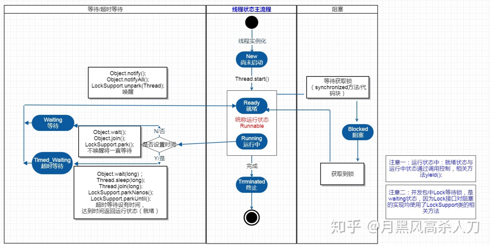
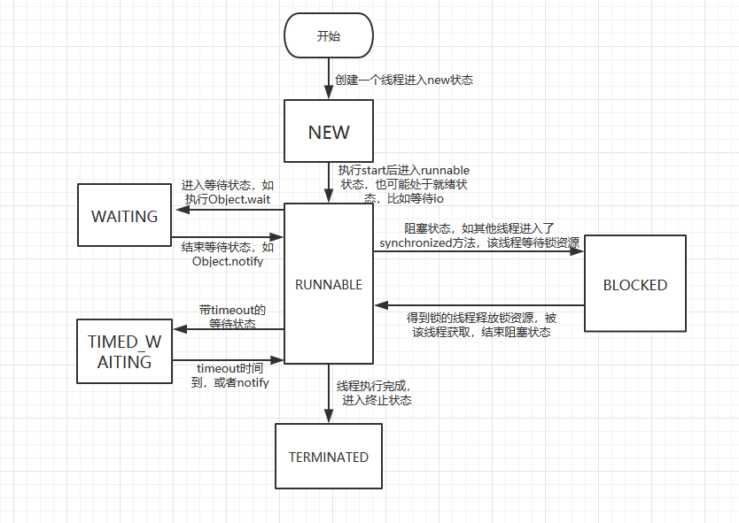
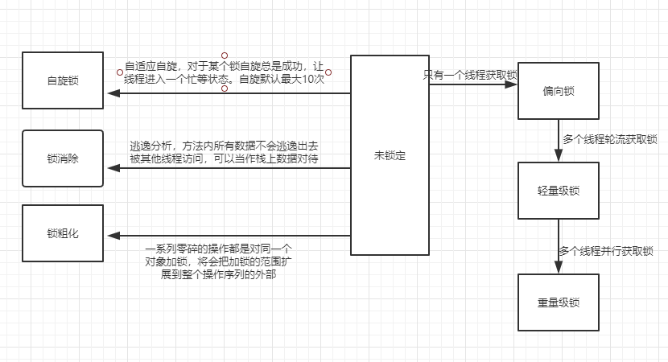
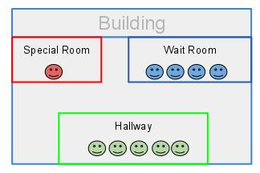
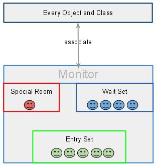
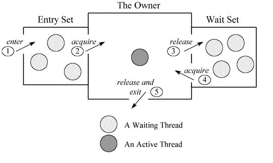

# 多线程

## 线程的基本属性和方法

### **id和name**

前面我们提到，每个线程都有一个id和name，id是一个递增的整数，每创建一个线程就加一，name的默认值是"Thread-"后跟一个编号，name可以在Thread的构造方法中进行指定，也可以通过setName方法进行设置，给Thread设置一个友好的名字，可以方便调试。

### **优先级**

线程有一个优先级的概念，在Java中，优先级从1到10，默认为5，相关方法是：

```java
public final void setPriority(int newPriority)
public final int getPriority()
```

这个优先级会被映射到操作系统中线程的优先级，不过，因为操作系统各不相同，不一定都是10个优先级，Java中不同的优先级可能会被映射到操作系统中相同的优先级，另外，优先级对操作系统而言更多的是一种建议和提示，而非强制，简单的说，在编程中，不要过于依赖优先级。

### **守护线程**

比如说jvm的GC

Thread有一个是否daemo线程的属性，相关方法是：

```java
public final void setDaemon(boolean on)
public final boolean isDaemon()
```

前面我们提到，启动线程会启动一条单独的执行流，整个程序只有在所有线程都结束的时候才退出，但daemo线程是例外，当整个程序中剩下的都是daemo线程的时候，程序就会退出。

daemo线程有什么用呢？它一般是其他线程的辅助线程，在它辅助的主线程退出的时候，它就没有存在的意义了。在我们运行一个即使最简单的"hello   world"类型的程序时，实际上，Java也会创建多个线程，除了main线程外，至少还有一个负责垃圾回收的线程，这个线程就是daemo线程，在main线程结束的时候，垃圾回收线程也会退出。

### **sleep方法**

Thread有一个静态的sleep方法，调用该方法会让当前线程睡眠指定的时间，单位是毫秒：

```java
public static native void sleep(long millis) throws InterruptedException;
```

睡眠期间，该线程会让出CPU，但睡眠的时间不一定是确切的给定毫秒数，可能有一定的偏差，偏差与系统定时器和操作系统调度器的准确度和精度有关。

睡眠期间，线程可以被中断，如果被中断，sleep会抛出InterruptedException，关于中断以及中断处理，我们后续章节再介绍。

当线程处于上锁时，sleep()方法不会释放对象锁，即睡眠时也持有对象锁。只会让出CPU执行时间片，并**不会释放同步资源锁。**

### **yield方法**

Thread还有一个让出CPU的方法：

```java
public static native void yield();
```

这也是一个静态方法，调用该方法，是告诉操作系统的调度器，我现在不着急占用CPU，你可以先让其他线程运行。不过，这对调度器也仅仅是建议，调度器如何处理是不一定的，它可能完全忽略该调用。

### **join方法**

在前面HelloThread的例子中，HelloThread没执行完，main线程可能就执行完了，Thread有一个join方法，可以让调用join的线程等待该线程结束，join方法的声明为：

```java
 public final void join() throws InterruptedException
```

在等待线程结束的过程中，这个等待可能被中断，如果被中断，会抛出InterruptedException。

join方法还有一个变体，可以限定等待的最长时间，单位为毫秒，如果为0，表示无期限等待：

```java
public final synchronized void join(long millis) throws InterruptedException
```

在前面的HelloThread示例中，如果希望main线程在子线程结束后再退出，main方法可以改为：

```java
public static void main(String[] args) throws InterruptedException {
    Thread thread = new HelloThread();
    thread.start();
    thread.join();
}     
```

### **内存可见性**

多个线程可以共享访问和操作相同的变量，但一个线程对一个共享变量的修改，另一个线程不一定马上就能看到，甚至永远也看不到。

```java
public class VisibilityDemo {
    private static boolean shutdown = false;
    
    static class HelloThread extends Thread {
        @Override
        public void run() {
            while(!shutdown){
                // do nothing
            }
            System.out.println("exit hello");
        }
    }

    public static void main(String[] args) throws InterruptedException {
        new HelloThread().start();
        Thread.sleep(1000);
        shutdown = true;
        System.out.println("exit main");
    }
}
```

这是怎么回事呢？这就是内存可见性问题。在计算机系统中，除了内存，数据还会被缓存在CPU的寄存器以及各级缓存中，当访问一个变量时，可能直接从寄存器或CPU缓存中获取，而不一定到内存中去取，当修改一个变量时，也可能是先写到缓存中，而稍后才会同步更新到内存中。在单线程的程序中，这一般不是个问题，但在多线程的程序中，尤其是在有多CPU的情况下，这就是个严重的问题。一个线程对内存的修改，另一个线程看不到，一是修改没有及时同步到内存，二是另一个线程根本就没从内存读。

怎么解决这个问题呢？有多种方法：

- 使用volatile关键字
- 使用synchronized关键字或显式锁同步 


### **线程的优点及成本**

**优点**

为什么要创建单独的执行流？或者说线程有什么优点呢？至少有以下几点：

- 充分利用多CPU的计算能力，单线程只能利用一个CPU，使用多线程可以利用多CPU的计算能力。
- 充分利用硬件资源，CPU和硬盘、网络是可以同时工作的，一个线程在等待网络IO的同时，另一个线程完全可以利用CPU，对于多个独立的网络请求，完全可以使用多个线程同时请求。
- 在用户界面(GUI)应用程序中，保持程序的响应性，界面和后台任务通常是不同的线程，否则，如果所有事情都是一个线程来执行，当执行一个很慢的任务时，整个界面将停止响应，也无法取消该任务。
- 简化建模及IO处理，比如，在服务器应用程序中，对每个用户请求使用一个单独的线程进行处理，相比使用一个线程，处理来自各种用户的各种请求，以及各种网络和文件IO事件，建模和编写程序要容易的多。

**成本**

关于线程，我们需要知道，它是有成本的。创建线程需要消耗操作系统的资源，操作系统会为每个线程创建必要的数据结构、栈、程序计数器等，创建也需要一定的时间。

此外，线程调度和切换也是有成本的，当有当量可运行线程的时候，操作系统会忙于调度，为一个线程分配一段时间，执行完后，再让另一个线程执行，一个线程被切换出去后，操作系统需要保存它的当前上下文状态到内存，上下文状态包括当前CPU寄存器的值、程序计数器的值等，而一个线程被切换回来后，操作系统需要恢复它原来的上下文状态，整个过程被称为上下文切换，这个切换不仅耗时，而且使CPU中的很多缓存失效，是有成本的。

当然，这些成本是相对而言的，如果线程中实际执行的事情比较多，这些成本是可以接受的，但如果只是执行本节示例中的counter++，那相对成本就太高了。

另外，如果执行的任务都是CPU密集型的，即主要消耗的都是CPU，那创建超过CPU数量的线程就是没有必要的，并不会加快程序的执行。


## 线程状态



 

1. NEW: 线程创建之后，但是还没有启动(not yet started)。这时候它的状态就是NEW

2. RUNNABLE: 正在Java虚拟机下跑任务的线程的状态。在RUNNABLE状态下的线程可能会处于就绪状态， 因为它正在等待一些系统资源的释放，比如IO

3. BLOCKED: 阻塞状态，等待锁的释放，比如线程A进入了一个synchronized方法，线程B也想进入这个方法，但是这个方法的锁已经被线程A获取了，这个时候线程B就处于BLOCKED状态

4. WAITING: 等待状态，处于等待状态的线程是由于执行了3个方法中的任意方法。 

   1. Object的wait方法，并且没有使用timeout参数;
   2. Thread的join方法，没有使用timeout参数 
   3. LockSupport的park方法。 
   处于waiting状态的线程会等待另外一个线程处理特殊的行为。  再举个例子，如果一个线程调用了一个对象的wait方法，那么这个线程就会处于waiting状态直到另外一个线程调用这个对象的notify或者notifyAll方法后才会解除这个状态

5. TIMED_WAITING: 有等待时间的等待状态，比如调用了以下几个方法中的任意方法，并且指定了等待时间，线程就会处于这个状态。 
	1.  Thread.sleep方法 
	2. Object的wait方法，带有时间 
	3. Thread.join方法，带有时间 
	4.  LockSupport的parkNanos方法，带有时间 
	5. LockSupport的parkUntil方法，带有时间

6. TERMINATED: 线程中止的状态，这个线程已经完整地执行了它的任务


## 锁

美团技术文章：[不可不说的Java“锁”事](https://tech.meituan.com/2018/11/15/java-lock.html)


### synchronized


### 显示锁


### 锁优化

这些技术都是为了在线程之间更高效的共享数据，以及解决竞争问题。



#### 自旋锁和自适应自旋锁

同步阻塞的时候，挂起线程和恢复线程的操作需要转入**内核态**中完成，这些操作给系统的并发性能带来很大的压力。

很多应用共享数据的锁定，只会持续很短一段时间，为此挂起和恢复线程并不值得。如果有多个处理器，可让后面请求锁的那个线程稍等，但是不放弃cpu时间，看是否持有锁的线程很快会释放锁。

**为了让线程等待，只需要让线程执行一个忙循环，也就是自旋锁。**

jdk1.4引入，默认关闭，使用`-XX：+UseSpinning` 开启；jdk1.6默认开启。自旋次数默认10次，参数`-XX：PreBlockSpin` 更改自旋次数。

jdk1.6引入**自适应自旋锁**，如果一个锁对象，自旋等待刚刚成功获得锁，并且持有锁的线程正在运行中，那么虚拟机就会认为这次自选也会很快成功，允许自旋等待更长的时间，比如100个循环；如果某个锁，自旋很少成功获得锁，以后便会将这个锁省略掉自旋。

JDK1.7后，去掉此参数，由jvm控制；

##### 用户态和内核态

Linux的架构中，很重要的一个能力就是操纵系统资源的能力。但是，系统资源是有限的，如果不加限制的允许任何程序以任何方式去操纵系统资源，必然会造成资源的浪费，发生资源不足等情况。为了减少这种情况的发生，Linux制定了一个等级制定，即特权。Linux将特权分成两个层次，以0和3标识。0的特权级要高于3。换句话说，0特权级在操纵系统资源上是没有任何限制的，可以执行任何操作，而3，则会受到极大的限制。我们把特权级0称之为内核态，特权级3称之为用户态。

一个应用程序，在执行的过程中，会在用户态和内核态之间根据需要不断切换的。因为，如果只有用户态，那么必然有某些操纵系统资源的操作很难完成或不能完成，而如果一直都在内核态，那事实上，导致特权的分层失去了意义。大家全是最高权限，和大家都没有限制，没有什么区别。

所以，应用程序一般会运行于用户态，会在需要的时候，切换成内核态，完成相关任务后，会再切换加用户态。需要注意的是，一种切换是有一定系统开销的。

应用程序一般会在以下几种情况下切换到内核态：

1． 系统调用。

2． 异常事件。当发生某些预先不可知的异常时，就会切换到内核态，以执行相关的异常事件。

3． 设备中断。在使用外围设备时，如外围设备完成了用户请求，就会向CPU发送一个中断信号，此时，CPU就会暂停执行原本的下一条指令，转去处理中断事件。此时，如果原来在用户态，则自然就会切换到内核态。

要阻塞或唤醒一个线程，就会消耗较多的系统资源，因为这种操作是需要操作系统介入的，自然就会发生用户态和核心态之间的切换，就会消耗大量系统资源。当这种操作高频发生时，就会消耗大量的CPU处理时间。

#### 锁消除

锁消除是指虚拟机即时编译器在运行时，对一些代码要求同步，但是检测到不可能存在共享数据竞争的锁进行消除。锁消除的主要判定依据来自于**逃逸分析**的数据支持。

```java
public String concatString（String s1，String s2，String s3）{
StringBuffer sb=new StringBuffer（）；
sb.append（s1）；
sb.append（s2）；
sb.append（s3）；
return sb.toString（）；
}
```

##### 逃逸分析

我们了解了 Java 中的逃逸分析技术，再来了解下一个对象的逃逸状态。

###### 1、全局逃逸

（GlobalEscape）

即一个对象的作用范围逃出了当前方法或者当前线程，有以下几种场景：

- 对象是一个静态变量
- 对象是一个已经发生逃逸的对象
- 对象作为当前方法的返回值

###### 2、参数逃逸

（ArgEscape）

即一个对象被作为方法参数传递或者被参数引用，但在调用过程中不会发生全局逃逸，这个状态是通过被调方法的字节码确定的。

###### 3、没有逃逸

即方法中的对象没有发生逃逸。

###### **1) 锁消除**

我们知道线程同步锁是非常牺牲性能的，当编译器确定当前对象只有当前线程使用，那么就会移除该对象的同步锁。

例如，StringBuffer 和 Vector 都是用 synchronized 修饰线程安全的，但大部分情况下，它们都只是在当前线程中用到，这样编译器就会优化移除掉这些锁操作。

锁消除的 JVM 参数如下：

- 开启锁消除：-XX:+EliminateLocks
- 关闭锁消除：-XX:-EliminateLocks

锁消除在 JDK8 中都是默认开启的，并且锁消除都要建立在逃逸分析的基础上。

###### **2) 标量替换**

首先要明白标量和聚合量，基础类型和对象的引用可以理解为标量，它们不能被进一步分解。而能被进一步分解的量就是聚合量，比如：对象。

对象是聚合量，它又可以被进一步分解成标量，将其成员变量分解为分散的变量，这就叫做标量替换。

这样，如果一个对象没有发生逃逸，那压根就不用创建它，只会在栈或者寄存器上创建它用到的成员标量，节省了内存空间，也提升了应用程序性能。

标量替换的 JVM 参数如下：

- 开启标量替换：-XX:+EliminateAllocations
- 关闭标量替换：-XX:-EliminateAllocations
- 显示标量替换详情：-XX:+PrintEliminateAllocations

标量替换同样在 JDK8 中都是默认开启的，并且都要建立在逃逸分析的基础上。

###### **3) 栈上分配**

当对象没有发生逃逸时，该对象就可以通过标量替换分解成成员标量分配在栈内存中，和方法的生命周期一致，随着栈帧出栈时销毁，减少了 GC 压力，提高了应用程序性能。


#### 锁粗化

一般来说，同步块的作用范围应该尽可能小，这样可用让等待锁的线程尽快的获取锁。但是如果一系列连续的操作都对同一个兑现反复加锁解锁，这样即使没有线程竞争，频繁的进行互斥同步操作也会导致不必要的性能损耗。

比如上面连续的append()，**如果jvm探测到这样异常零碎的操作都是对同一个对象加锁，将会把加锁的范围粗话到整个操作序列的外部。**


#### 轻量级锁

jdk1.6增加的新型锁机制。**在没有多线程竞争的前提下，减少传统的重量级锁使用操作系统互斥变量产生的性能消耗。**

**代码进入同步块，如果对象没有被锁定，进行轻量级锁定，如果有两个或者以上的线程争用同一个锁，则膨胀为重量级锁。**

对象头中的**Mark Word**（标记字）主要用来表示对象的线程锁状态，另外还可以用来配合GC、存放该对象的hashCode；


#### 偏向锁

jdk1.6引入的一项锁优化，目的是消除数据在无竞争情况的下的同步原语，进一步提高程序的运行性能。

**偏向锁会偏向于第一个获得它的线程，如果在接下来的执行过程中，改锁没有被其他线程获取，则持有偏向锁的线程将永远不需要在进行同步。**

启用参数`-XX：+UseBiasedLocking` ，jdk1.6默认开启。


#### 对象头与锁升级

##### java对象内存布局

JVM对于普通对象和数组对象的大小计算方式有所不同，我画了一张图说明：


解释一下其中每个部分：

1. Mark Word：存储对象运行时记录信息，占用内存大小与机器位数一样，即**32位机占4字节，64位机占8字节**
2. 元数据指针：指向描述类型的Klass对象（Java类的C++对等体）的指针，Klass对象包含了实例对象所属类型的元数据，因此该字段被称为元数据指针，JVM在运行时将频繁使用这个指针定位到位于方法区内的类型信息。这个数据的大小稍后说
3. 数组长度：数组对象特有，一个指向int型的引用类型，用于描述数组长度，这个数据的大小和元数据指针大小相同，同样稍后说
4. 实例数据：实例数据就是8大基本数据类型byte、short、int、long、float、double、char、boolean（对象类型也是由这8大基本数据类型复合而成），每种数据类型占多少字节就不一一例举了
5. 填充：不定，**HotSpot的对齐方式为8字节对齐，即一个对象必须为8字节的整数倍**，因此如果最后前面的数据大小为17则填充7，前面的数据大小为18则填充6，以此类推

##### Mark Word

由于对象需要存储的运行时数据很多，其实已经超出了32位、64位Bitmap结构所能记录的限度，但是对象头是与对象自身定义的数据无关的额外存储成本，考虑到虚拟机的空间效率，Mark Word被设计成一个**非固定的数据结构**以便在极小的空间内存储尽量多的信息。

​                                                HotSpot虚拟机64位对象头Mark Word

| 偏向锁标识位 | 锁标识位 | 锁状态   | 存储内容                         |
| ------------ | -------- | -------- | -------------------------------- |
| 0            | 01       | 未锁定   | hash code(31),年龄(4)            |
| 1            | 01       | 偏向锁   | 偏向线程ID(54),时间戳(2),年龄(4) |
| 无           | 00       | 轻量级锁 | 栈中锁记录的指针(64)             |
| 无           | 10       | 重量级锁 | monitor的指针(64)                |
| 无           | 11       | GC标记   | 空，不需要记录信息               |

```ruby
|-------------------------------------------------------|--------------------|
|                  Mark Word (32 bits)                  |       State        |
|-------------------------------------------------------|--------------------|
| identity_hashcode:25 | age:4 | biased_lock:1 | lock:2 |       Normal       |
|-------------------------------------------------------|--------------------|
|  thread:23 | epoch:2 | age:4 | biased_lock:1 | lock:2 |       Biased       |
|-------------------------------------------------------|--------------------|
|               ptr_to_lock_record:30          | lock:2 | Lightweight Locked |
|-------------------------------------------------------|--------------------|
|               ptr_to_heavyweight_monitor:30  | lock:2 | Heavyweight Locked |
|-------------------------------------------------------|--------------------|
|                                              | lock:2 |    Marked for GC   |
|-------------------------------------------------------|--------------------|
```

**lock**: 锁状态标记位，2位，由于希望用尽可能少的二进制位表示尽可能多的信息，所以设置了lock标记。该标记的值不同，整个mark word表示的含义不同。

**biased_lock**：对象是否启用偏向锁标记，1位。为1时表示对象启用偏向锁，为0时表示对象没有偏向锁。
**age**：4位的Java对象年龄。在GC中，如果对象在Survivor区复制一次，年龄增加1。当对象达到设定的阈值时，将会晋升到老年代。默认情况下，并行GC的年龄阈值为15，并发GC的年龄阈值为6。由于age只有4位，所以最大值为15，这就是`-XX:MaxTenuringThreshold`选项最大值为15的原因。
**identity_hashcode**：25位的对象标识Hash码，采用延迟加载技术。调用方法`System.identityHashCode()`计算，并会将结果写到该对象头中。当对象被锁定时，该值会移动到管程Monitor中。
**thread**：持有偏向锁的线程ID。
**epoch**：偏向时间戳。
**ptr_to_lock_record**：指向栈中锁记录的指针。
**ptr_to_heavyweight_monitor**：指向管程Monitor的指针。


首先简单说下先偏向锁、轻量级锁、重量级锁三者各自的应用场景：

- 偏向锁：只有一个线程进入临界区；
- 轻量级锁：多个线程交替进入临界区**；**
- 重量级锁：多个线程同时进入临界区。

还要明确的是，偏向锁、轻量级锁都是JVM引入的锁优化手段，目的是降低线程同步的开销。比如以下的同步代码块：

```java
synchronized (lockObject) {
    // do something
}
```

上述同步代码块中存在一个临界区，假设当前存在Thread#1和Thread#2这两个用户线程，分三种情况来讨论：

- 情况一：只有Thread#1会进入临界区；
- 情况二：Thread#1和Thread#2交替进入临界区；
- 情况三：Thread#1和Thread#2同时进入临界区。

上述的情况一是偏向锁的适用场景，此时当Thread#1进入临界区时，JVM会将lockObject的对象头Mark Word的锁标志位设为“01”，同时会用CAS操作把Thread#1的线程ID记录到Mark Word中，此时进入偏向模式。所谓“偏向”，指的是这个锁会偏向于Thread#1，若接下来没有其他线程进入临界区，则Thread#1再出入临界区无需再执行任何同步操作。也就是说，若只有Thread#1会进入临界区，实际上只有Thread#1初次进入临界区时需要执行CAS操作，以后再出入临界区都不会有同步操作带来的开销。

然而情况一是一个比较理想的情况，更多时候Thread#2也会尝试进入临界区。若Thread#2尝试进入时Thread#1已退出临界区，即此时lockObject处于未锁定状态，这时说明偏向锁上发生了竞争（对应情况二），此时会撤销偏向，Mark Word中不再存放偏向线程ID，而是存放hashCode和GC分代年龄，同时锁标识位变为“01”（表示未锁定），这时Thread#2会获取lockObject的轻量级锁。因为此时Thread#1和Thread#2交替进入临界区，所以偏向锁无法满足需求，需要膨胀到轻量级锁。

再说轻量级锁什么时候会膨胀到重量级锁。若一直是Thread#1和Thread#2交替进入临界区，那么没有问题，轻量锁hold住。一旦在轻量级锁上发生竞争，即出现“Thread#1和Thread#2同时进入临界区”的情况，轻量级锁就hold不住了。 （根本原因是轻量级锁没有足够的空间存储额外状态，此时若不膨胀为重量级锁，则所有等待轻量锁的线程只能自旋，可能会损失很多CPU时间）


##### hash code

- 当一个对象已经计算过identity hash code，它就无法进入偏向锁状态；
- 当一个对象当前正处于偏向锁状态，并且需要计算其identity hash code的话，则它的偏向锁会被撤销，并且锁会膨胀为重量锁；
- 重量锁的实现中，ObjectMonitor类里有字段可以记录非加锁状态下的mark word，其中可以存储identity hash code的值。或者简单说就是重量锁可以存下identity hash code。

请一定要注意，这里讨论的hash code都只针对identity hash code。用户自定义的hashCode()方法所返回的值跟这里讨论的不是一回事。

Identity hash code是未被覆写的 java.lang.Object.hashCode() 或者 java.lang.System.identityHashCode(Object) 所返回的值。


当一个对象已经计算过identity hash code，它就无法进入偏向锁状态； 为什么？

因为mark word里没地方同时放bias信息和identity hash code。
HotSpot VM是假定“实际上只有很少对象会计算identity hash code”来做优化的；换句话说如果实际上有很多对象都计算了identity hash code的话，HotSpot VM会被迫使用比较不优化的模式。


#### 管程

[深入理解多线程（四）—— Moniter的实现原理](https://www.hollischuang.com/archives/2030)

##### 操作系统中的管程

如果你在大学学习过操作系统，你可能还记得管程（monitors）在操作系统中是很重要的概念。同样Monitor在java同步机制中也有使用。

> 管程 (英语：Monitors，也称为监视器) 是一种程序结构，结构内的多个子程序（对象或模块）形成的多个工作线程互斥访问共享资源。这些共享资源一般是硬件设备或一群变量。管程实现了在一个时间点，最多只有一个线程在执行管程的某个子程序。与那些通过修改数据结构实现互斥访问的并发程序设计相比，管程实现很大程度上简化了程序设计。 管程提供了一种机制，线程可以临时放弃互斥访问，等待某些条件得到满足后，重新获得执行权恢复它的互斥访问。

##### Java线程同步相关的Moniter

在多线程访问共享资源的时候，经常会带来可见性和原子性的安全问题。为了解决这类线程安全的问题，Java提供了同步机制、互斥锁机制，这个机制保证了在同一时刻只有一个线程能访问共享资源。这个机制的保障来源于监视锁Monitor，每个对象都拥有自己的监视锁Monitor。

先来举个例子，然后我们在上源码。我们可以把监视器理解为包含一个特殊的房间的建筑物，这个特殊房间同一时刻只能有一个客人（线程）。这个房间中包含了一些数据和代码。

[](http://www.hollischuang.com/wp-content/uploads/2017/12/Java-Monitor.jpg)

如果一个顾客想要进入这个特殊的房间，他首先需要在走廊（Entry Set）排队等待。调度器将基于某个标准（比如 FIFO）来选择排队的客户进入房间。如果，因为某些原因，该客户客户暂时因为其他事情无法脱身（线程被挂起），那么他将被送到另外一间专门用来等待的房间（Wait Set），这个房间的可以可以在稍后再次进入那件特殊的房间。如上面所说，这个建筑屋中一共有三个场所。

[](http://www.hollischuang.com/wp-content/uploads/2017/12/java-monitor-associate-with-object.jpg)

总之，监视器是一个用来监视这些线程进入特殊的房间的。他的义务是保证（同一时间）只有一个线程可以访问被保护的数据和代码。

Monitor其实是一种同步工具，也可以说是一种同步机制，它通常被描述为一个对象，主要特点是：

> 对象的所有方法都被“互斥”的执行。好比一个Monitor只有一个运行“许可”，任一个线程进入任何一个方法都需要获得这个“许可”，离开时把许可归还。
>
> 通常提供singal机制：允许正持有“许可”的线程暂时放弃“许可”，等待某个谓词成真（条件变量），而条件成立后，当前进程可以“通知”正在等待这个条件变量的线程，让他可以重新去获得运行许可。

##### 监视器的实现

在Java虚拟机(HotSpot)中，Monitor是基于C++实现的，由[ObjectMonitor](https://github.com/openjdk-mirror/jdk7u-hotspot/blob/50bdefc3afe944ca74c3093e7448d6b889cd20d1/src/share/vm/runtime/objectMonitor.cpp)实现的，其主要数据结构如下：

```cpp
  ObjectMonitor() {
    _header       = NULL;
    _count        = 0;
    _waiters      = 0,
    _recursions   = 0;
    _object       = NULL;
    _owner        = NULL;
    _WaitSet      = NULL;
    _WaitSetLock  = 0 ;
    _Responsible  = NULL ;
    _succ         = NULL ;
    _cxq          = NULL ;
    FreeNext      = NULL ;
    _EntryList    = NULL ;
    _SpinFreq     = 0 ;
    _SpinClock    = 0 ;
    OwnerIsThread = 0 ;
  }
```

源码地址：[objectMonitor.hpp](https://github.com/openjdk-mirror/jdk7u-hotspot/blob/50bdefc3afe944ca74c3093e7448d6b889cd20d1/src/share/vm/runtime/objectMonitor.hpp#L193)

ObjectMonitor中有几个关键属性：

> _owner：指向持有ObjectMonitor对象的线程
>
> _WaitSet：存放处于wait状态的线程队列
>
> _EntryList：存放处于等待锁block状态的线程队列
>
> _recursions：锁的重入次数
>
> _count：用来记录该线程获取锁的次数

当多个线程同时访问一段同步代码时，首先会进入`_EntryList`队列中，当某个线程获取到对象的monitor后进入`_Owner`区域并把monitor中的`_owner`变量设置为当前线程，同时monitor中的计数器`_count`加1。即获得对象锁。

若持有monitor的线程调用`wait()`方法，将释放当前持有的monitor，`_owner`变量恢复为`null`，`_count`自减1，同时该线程进入`_WaitSet`集合中等待被唤醒。若当前线程执行完毕也将释放monitor(锁)并复位变量的值，以便其他线程进入获取monitor(锁)。如下图所示

[](http://www.hollischuang.com/wp-content/uploads/2017/12/monitor.png)