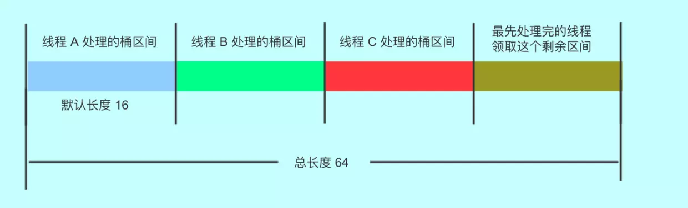

# 并发容器


# ConcurrentHashMap

[ConcurrentHashMap的helpTransfer() 分析](<https://blog.csdn.net/weixin_38426554/article/details/96482064>)

- 并发安全
- 直接支持一些原子复合操作
- 支持高并发、get操作完全并行、put操作支持一定程度的并行
- 与同步容器Collections.synchronizedMap相比，迭代不用加锁，不会抛出ConcurrentModificationException
- 弱一致性


```java
//concurrencyLevel表示估计的并行更新的线程个数，ConcurrentHashMap会将该数转换为2的整数次幂，比如14转换为16，25转换为32
//jdk1.8中concurrencyLevel已经没用了，设置也不进行任何操作，只是为了以前的代码而已
public ConcurrentHashMap(int initialCapacity, float loadFactor, int concurrencyLevel)
```

## jdk1.7

ConcurrentHashMap采用分段锁技术，将数据分为多个段，而每个段有一个独立的锁，每一个段相当于一个独立的哈希表，分段的依据也是哈希值，无论是保存键值对还是根据键查找，都先根据键的哈希值映射到段，再在段对应的哈希表上进行操作。

采用分段锁，可以大大提高并发度，多个段之间可以并行读写。默认情况下，段是16个，不过，这个数字可以通过构造方法进行设置，如下所示：

```java
public ConcurrentHashMap(int initialCapacity, float loadFactor, int concurrencyLevel)
```

concurrencyLevel表示估计的并行更新的线程个数，ConcurrentHashMap会将该数转换为2的整数次幂，比如14转换为16，25转换为32。

## jdk1.8源码分析

jdk1.8中的ConcurrentHashMap使用了cas和synchronized相结合的方式。

尽可能的使用非阻塞的方式

### 高并发的put和remove

put的时候，如果数组节点为空，尝试用cas方式非阻塞的将元素放入容器中，当cas失败时，循环，也就是自旋。

不为空使用synchronized加锁，但是只锁数组节点对象，而不是锁整个容器对象，增加了并发性。

而且synchronized经过了优化，偏向锁、轻量级锁，只有在真正发生锁竞争的情况下，才会使用重量级锁定，所有效率极高。

```java
public V put(K key, V value) {
    return putVal(key, value, false);
}

    /** Implementation for put and putIfAbsent */
final V putVal(K key, V value, boolean onlyIfAbsent) {
    //ConcurrentHashMap 不允许插入null键，HashMap允许插入一个null键
    if (key == null || value == null) throw new NullPointerException();
    int hash = spread(key.hashCode());
    int binCount = 0;
    //for循环的作用：因为更新元素是使用CAS机制更新，需要不断的失败重试，直到成功为止。
    for (Node<K,V>[] tab = table;;) {
        // f：链表或红黑二叉树头结点，向链表中添加元素时，需要synchronized获取f的锁。
        Node<K,V> f; int n, i, fh;
        //判断Node[]数组是否初始化，没有则进行初始化操作
        if (tab == null || (n = tab.length) == 0)
            tab = initTable();
        //通过hash定位Node[]数组的节点，如果null则使用CAS进行添加，成功break跳出循环，失败继续循环。
        else if ((f = tabAt(tab, i = (n - 1) & hash)) == null) {
            if (casTabAt(tab, i, null,
                         new Node<K,V>(hash, key, value, null)))
                break;                   // no lock when adding to empty bin
        }
        //检查到内部正在移动元素（Node[] 数组扩容）
        else if ((fh = f.hash) == MOVED)
            //帮助它扩容
            tab = helpTransfer(tab, f);
        else {
            V oldVal = null;
            //锁住链表或红黑二叉树的头结点
            synchronized (f) {
                //判断f是否是头结点，不是代表发生扩容了，需要重试
                if (tabAt(tab, i) == f) {
                    //如果fh>=0 是链表节点
                    if (fh >= 0) {
                        binCount = 1;
                        //遍历链表所有节点
                        for (Node<K,V> e = f;; ++binCount) {
                            K ek;
                            //如果节点存在，则更新value
                            if (e.hash == hash &&
                                ((ek = e.key) == key ||
                                 (ek != null && key.equals(ek)))) {
                                oldVal = e.val;
                                if (!onlyIfAbsent)
                                    e.val = value;
                                break;
                            }
                            //不存在则在链表尾部添加新节点。
                            Node<K,V> pred = e;
                            if ((e = e.next) == null) {
                                pred.next = new Node<K,V>(hash, key,
                                                          value, null);
                                break;
                            }
                        }
                    }
                    //TreeBin是红黑二叉树节点
                    else if (f instanceof TreeBin) {
                        Node<K,V> p;
                        binCount = 2;
                        //添加树节点
                        if ((p = ((TreeBin<K,V>)f).putTreeVal(hash, key,
                                                      value)) != null) {
                            oldVal = p.val;
                            if (!onlyIfAbsent)
                                p.val = value;
                        }
                    }
                }
            }
            
            if (binCount != 0) {
                //如果链表长度已经达到临界值8 就需要把链表转换为树结构
                if (binCount >= TREEIFY_THRESHOLD)
                    treeifyBin(tab, i);
                if (oldVal != null)
                    return oldVal;
                break;
            }
        }
    }
    //将当前ConcurrentHashMap的size数量+1，扩容
    addCount(1L, binCount);
    return null;
}
```


#### cas

```java
static final <K,V> boolean casTabAt(Node<K,V>[] tab, int i,
                                    Node<K,V> c, Node<K,V> v) {
    return U.compareAndSwapObject(tab, ((long)i << ASHIFT) + ABASE, c, v);
}
```


### 双重检查初始化表

```java
private final Node<K,V>[] initTable() {
    Node<K,V>[] tab; int sc;
    //双重检查cas，保证不会重复初始化
    while ((tab = table) == null || tab.length == 0) {
        if ((sc = sizeCtl) < 0)
            Thread.yield(); // lost initialization race; just spin
        else if (U.compareAndSwapInt(this, SIZECTL, sc, -1)) {
            try {
                if ((tab = table) == null || tab.length == 0) {
                    int n = (sc > 0) ? sc : DEFAULT_CAPACITY;
                    @SuppressWarnings("unchecked")
                    Node<K,V>[] nt = (Node<K,V>[])new Node<?,?>[n];
                    table = tab = nt;
                    sc = n - (n >>> 2);
                }
            } finally {
                sizeCtl = sc;
            }
            break;
        }
    }
    return tab;
}
```


### 完全并行的get

[为什么ConcurrentHashMap的读操作不需要加锁？](https://www.cnblogs.com/keeya/p/9632958.html)

ConcurrentHashMap的get没用任何同步方法，是并发的get，但是因为node是volatile的，所有不会出现线程可见性问题。volatile保证内存可见性。

```java
/**
 * The array of bins. Lazily initialized upon first insertion.
 * Size is always a power of two. Accessed directly by iterators.
 */
transient volatile Node<K,V>[] table;

/**
 * The next table to use; non-null only while resizing.
 */
private transient volatile Node<K,V>[] nextTable;

static class Node<K,V> implements Map.Entry<K,V> {
    final int hash;
    final K key;
    volatile V val;
    volatile Node<K,V> next;
}

public V get(Object key) {
    Node<K,V>[] tab; Node<K,V> e, p; int n, eh; K ek;
    int h = spread(key.hashCode());
    if ((tab = table) != null && (n = tab.length) > 0 &&
        (e = tabAt(tab, (n - 1) & h)) != null) {
        if ((eh = e.hash) == h) {
            if ((ek = e.key) == key || (ek != null && key.equals(ek)))
                return e.val;
        }
        else if (eh < 0)
            return (p = e.find(h, key)) != null ? p.val : null;
        while ((e = e.next) != null) {
            if (e.hash == h &&
                ((ek = e.key) == key || (ek != null && key.equals(ek))))
                return e.val;
        }
    }
    return null;
}
//获取数组下标对应元素，确保是最新的
static final <K,V> Node<K,V> tabAt(Node<K,V>[] tab, int i) {
    return (Node<K,V>)U.getObjectVolatile(tab, ((long)i << ASHIFT) + ABASE);
}
```


### 多线程帮助扩容



```java
/**
 * sizeCtl=-1,初始化
 * sizeCtl<0,扩容，-(1+扩容线程数)
 */
private transient volatile int sizeCtl;

private final void addCount(long x, int check) {
    CounterCell[] as; long b, s;
    if ((as = counterCells) != null ||
        //如果 counterCells == null, 则对 baseCount 做 CAS 自增操作
        !U.compareAndSwapLong(this, BASECOUNT, b = baseCount, s = b + x)) {
        CounterCell a; long v; int m;
        boolean uncontended = true;
        //CAS失败，使用 counterCells
        if (as == null || (m = as.length - 1) < 0 ||
            (a = as[ThreadLocalRandom.getProbe() & m]) == null ||
            !(uncontended =
              U.compareAndSwapLong(a, CELLVALUE, v = a.value, v + x))) {
            fullAddCount(x, uncontended);
            return;
        }
        if (check <= 1)
            return;
        s = sumCount();
    }
    if (check >= 0) {
        Node<K,V>[] tab, nt; int n, sc;
        while (s >= (long)(sc = sizeCtl) && (tab = table) != null &&
               (n = tab.length) < MAXIMUM_CAPACITY) {
            int rs = resizeStamp(n);
            if (sc < 0) {
                if ((sc >>> RESIZE_STAMP_SHIFT) != rs || sc == rs + 1 ||
                    sc == rs + MAX_RESIZERS || (nt = nextTable) == null ||
                    transferIndex <= 0)
                    break;
                //sizeCtl+1，增加扩容帮助线程
                if (U.compareAndSwapInt(this, SIZECTL, sc, sc + 1))
                    transfer(tab, nt);
            }
            //低16位+2代表1(1+1)，表示有一个线程在处理扩容
            else if (U.compareAndSwapInt(this, SIZECTL, sc,
                                         (rs << RESIZE_STAMP_SHIFT) + 2))
                transfer(tab, null);
            s = sumCount();
        }
    }
}


/**
 * Helps transfer if a resize is in progress.
 */
final Node<K,V>[] helpTransfer(Node<K,V>[] tab, Node<K,V> f) {
    Node<K,V>[] nextTab; int sc;
    // 如果 table 不是空 且 node 节点是转移类型，数据检验
    // 且 node 节点的 nextTable（新 table） 不是空，同样也是数据校验
    // 尝试帮助扩容
    if (tab != null && (f instanceof ForwardingNode) &&
        (nextTab = ((ForwardingNode<K,V>)f).nextTable) != null) {
        // 根据 length 得到一个标识符号
        int rs = resizeStamp(tab.length);
        // 如果 nextTab 没有被并发修改 且 tab 也没有被并发修改
        // 且 sizeCtl  < 0 （说明还在扩容）
        while (nextTab == nextTable && table == tab &&
               (sc = sizeCtl) < 0) {
            // 如果 sizeCtl 无符号右移  16 不等于 rs （ sc前 16 位如果不等于标识符，则标识符变化了）
            // 或者 sizeCtl == rs + 1  （扩容结束了，不再有线程进行扩容）（默认第一个线程设置 sc ==rs 左移 16 位 + 2，当第一个线程结束扩容了，就会将 sc 减一。这个时候，sc 就等于 rs + 1）
            // 或者 sizeCtl == rs + 65535  （如果达到最大帮助线程的数量，即 65535）
            // transferIndex <= 0，没有可被线程处理的桶空间了
            // 结束循环，返回 table
            if ((sc >>> RESIZE_STAMP_SHIFT) != rs || sc == rs + 1 ||
                sc == rs + MAX_RESIZERS || transferIndex <= 0)
                break;
            // 如果以上都不是, 将 sizeCtl + 1, （表示增加了一个线程帮助其扩容）
            if (U.compareAndSwapInt(this, SIZECTL, sc, sc + 1)) {
                // 进行扩容转移
                transfer(tab, nextTab);
                // 结束循环
                break;
            }
        }
        return nextTab;
    }
    return table;


/**
 * transferIndex 表示转移时的下标，初始为扩容前的 length。
 * 我们假设长度是 32
 */
private final void transfer(Node<K,V>[] tab, Node<K,V>[] nextTab) {
    int n = tab.length, stride;
    // 将 length / 8 然后除以 CPU核心数。如果得到的结果小于 16，那么就使用 16。
    // 这里的目的是让每个 CPU 处理的桶一样多，避免出现转移任务不均匀的现象，如果桶较少的话，默认一个 CPU（一个线程）处理 16 个桶
    if ((stride = (NCPU > 1) ? (n >>> 3) / NCPU : n) < MIN_TRANSFER_STRIDE)
        stride = MIN_TRANSFER_STRIDE; // subdivide range 细分范围 stridea：TODO
    // 新的 table 尚未初始化
    if (nextTab == null) {            // initiating
        try {
            // 扩容  2 倍
            Node<K,V>[] nt = (Node<K,V>[])new Node<?,?>[n << 1];
            // 更新
            nextTab = nt;
        } catch (Throwable ex) {      // try to cope with OOME
            // 扩容失败， sizeCtl 使用 int 最大值。
            sizeCtl = Integer.MAX_VALUE;
            return;// 结束
        }
        // 更新成员变量
        nextTable = nextTab;
        // 更新转移下标，就是 老的 tab 的 length
        transferIndex = n;
    }
    // 新 tab 的 length
    int nextn = nextTab.length;
    // 创建一个 fwd 节点，用于占位。当别的线程发现这个槽位中是 fwd 类型的节点，则跳过这个节点。
    ForwardingNode<K,V> fwd = new ForwardingNode<K,V>(nextTab);
    // 首次推进为 true，如果等于 true，说明需要再次推进一个下标（i--），反之，如果是 false，那么就不能推进下标，需要将当前的下标处理完毕才能继续推进
    boolean advance = true;
    // 完成状态，如果是 true，就结束此方法。
    boolean finishing = false; // to ensure sweep before committing nextTab
    // 死循环,i 表示下标，bound 表示当前线程可以处理的当前桶区间最小下标
    for (int i = 0, bound = 0;;) {
        Node<K,V> f; int fh;
        // 如果当前线程可以向后推进；这个循环就是控制 i 递减。同时，每个线程都会进入这里取得自己需要转移的桶的区间
        while (advance) {
            int nextIndex, nextBound;
            // 对 i 减一，判断是否大于等于 bound （正常情况下，如果大于 bound 不成立，说明该线程上次领取的任务已经完成了。那么，需要在下面继续领取任务）
            // 如果对 i 减一大于等于 bound（还需要继续做任务），或者完成了，修改推进状态为 false，不能推进了。任务成功后修改推进状态为 true。
            // 通常，第一次进入循环，i-- 这个判断会无法通过，从而走下面的 nextIndex 赋值操作（获取最新的转移下标）。其余情况都是：如果可以推进，将 i 减一，然后修改成不可推进。如果 i 对应的桶处理成功了，改成可以推进。
            if (--i >= bound || finishing)
                advance = false;// 这里设置 false，是为了防止在没有成功处理一个桶的情况下却进行了推进
            // 这里的目的是：1. 当一个线程进入时，会选取最新的转移下标。2. 当一个线程处理完自己的区间时，如果还有剩余区间的没有别的线程处理。再次获取区间。
            else if ((nextIndex = transferIndex) <= 0) {
                // 如果小于等于0，说明没有区间了 ，i 改成 -1，推进状态变成 false，不再推进，表示，扩容结束了，当前线程可以退出了
                // 这个 -1 会在下面的 if 块里判断，从而进入完成状态判断
                i = -1;
                advance = false;// 这里设置 false，是为了防止在没有成功处理一个桶的情况下却进行了推进
            }// CAS 修改 transferIndex，即 length - 区间值，留下剩余的区间值供后面的线程使用
            else if (U.compareAndSwapInt
                     (this, TRANSFERINDEX, nextIndex,
                      nextBound = (nextIndex > stride ?
                                   nextIndex - stride : 0))) {
                bound = nextBound;// 这个值就是当前线程可以处理的最小当前区间最小下标
                i = nextIndex - 1; // 初次对i 赋值，这个就是当前线程可以处理的当前区间的最大下标
                advance = false; // 这里设置 false，是为了防止在没有成功处理一个桶的情况下却进行了推进，这样对导致漏掉某个桶。下面的 if (tabAt(tab, i) == f) 判断会出现这样的情况。
            }
        }// 如果 i 小于0 （不在 tab 下标内，按照上面的判断，领取最后一段区间的线程扩容结束）
        //  如果 i >= tab.length(不知道为什么这么判断)
        //  如果 i + tab.length >= nextTable.length  （不知道为什么这么判断）
        if (i < 0 || i >= n || i + n >= nextn) {
            int sc;
            if (finishing) { // 如果完成了扩容
                nextTable = null;// 删除成员变量
                table = nextTab;// 更新 table
                sizeCtl = (n << 1) - (n >>> 1); // 更新阈值
                return;// 结束方法。
            }// 如果没完成
            if (U.compareAndSwapInt(this, SIZECTL, sc = sizeCtl, sc - 1)) {// 尝试将 sc -1. 表示这个线程结束帮助扩容了，将 sc 的低 16 位减一。
                if ((sc - 2) != resizeStamp(n) << RESIZE_STAMP_SHIFT)// 如果 sc - 2 不等于标识符左移 16 位。如果他们相等了，说明没有线程在帮助他们扩容了。也就是说，扩容结束了。
                    return;// 不相等，说明没结束，当前线程结束方法。
                finishing = advance = true;// 如果相等，扩容结束了，更新 finising 变量
                i = n; // 再次循环检查一下整张表
            }
        }
        else if ((f = tabAt(tab, i)) == null) // 获取老 tab i 下标位置的变量，如果是 null，就使用 fwd 占位。
            advance = casTabAt(tab, i, null, fwd);// 如果成功写入 fwd 占位，再次推进一个下标
        else if ((fh = f.hash) == MOVED)// 如果不是 null 且 hash 值是 MOVED。
            advance = true; // already processed // 说明别的线程已经处理过了，再次推进一个下标
        else {// 到这里，说明这个位置有实际值了，且不是占位符。对这个节点上锁。为什么上锁，防止 putVal 的时候向链表插入数据
            synchronized (f) {
                // 判断 i 下标处的桶节点是否和 f 相同
                if (tabAt(tab, i) == f) {
                    Node<K,V> ln, hn;// low, height 高位桶，低位桶
                    // 如果 f 的 hash 值大于 0 。TreeBin 的 hash 是 -2
                    if (fh >= 0) {
                        // 对老长度进行与运算（第一个操作数的的第n位于第二个操作数的第n位如果都是1，那么结果的第n为也为1，否则为0）
                        // 由于 Map 的长度都是 2 的次方（000001000 这类的数字），那么取于 length 只有 2 种结果，一种是 0，一种是1
                        //  如果是结果是0 ，Doug Lea 将其放在低位，反之放在高位，目的是将链表重新 hash，放到对应的位置上，让新的取于算法能够击中他。
                        int runBit = fh & n;
                        Node<K,V> lastRun = f; // 尾节点，且和头节点的 hash 值取于不相等
                        // 遍历这个桶
                        for (Node<K,V> p = f.next; p != null; p = p.next) {
                            // 取于桶中每个节点的 hash 值
                            int b = p.hash & n;
                            // 如果节点的 hash 值和首节点的 hash 值取于结果不同
                            if (b != runBit) {
                                runBit = b; // 更新 runBit，用于下面判断 lastRun 该赋值给 ln 还是 hn。
                                lastRun = p; // 这个 lastRun 保证后面的节点与自己的取于值相同，避免后面没有必要的循环
                            }
                        }
                        if (runBit == 0) {// 如果最后更新的 runBit 是 0 ，设置低位节点
                            ln = lastRun;
                            hn = null;
                        }
                        else {
                            hn = lastRun; // 如果最后更新的 runBit 是 1， 设置高位节点
                            ln = null;
                        }// 再次循环，生成两个链表，lastRun 作为停止条件，这样就是避免无谓的循环（lastRun 后面都是相同的取于结果）
                        for (Node<K,V> p = f; p != lastRun; p = p.next) {
                            int ph = p.hash; K pk = p.key; V pv = p.val;
                            // 如果与运算结果是 0，那么就还在低位
                            if ((ph & n) == 0) // 如果是0 ，那么创建低位节点
                                ln = new Node<K,V>(ph, pk, pv, ln);
                            else // 1 则创建高位
                                hn = new Node<K,V>(ph, pk, pv, hn);
                        }
                        // 其实这里类似 hashMap 
                        // 设置低位链表放在新链表的 i
                        setTabAt(nextTab, i, ln);
                        // 设置高位链表，在原有长度上加 n
                        setTabAt(nextTab, i + n, hn);
                        // 将旧的链表设置成占位符
                        setTabAt(tab, i, fwd);
                        // 继续向后推进
                        advance = true;
                    }// 如果是红黑树
                    else if (f instanceof TreeBin) {
                        TreeBin<K,V> t = (TreeBin<K,V>)f;
                        TreeNode<K,V> lo = null, loTail = null;
                        TreeNode<K,V> hi = null, hiTail = null;
                        int lc = 0, hc = 0;
                        // 遍历
                        for (Node<K,V> e = t.first; e != null; e = e.next) {
                            int h = e.hash;
                            TreeNode<K,V> p = new TreeNode<K,V>
                                (h, e.key, e.val, null, null);
                            // 和链表相同的判断，与运算 == 0 的放在低位
                            if ((h & n) == 0) {
                                if ((p.prev = loTail) == null)
                                    lo = p;
                                else
                                    loTail.next = p;
                                loTail = p;
                                ++lc;
                            } // 不是 0 的放在高位
                            else {
                                if ((p.prev = hiTail) == null)
                                    hi = p;
                                else
                                    hiTail.next = p;
                                hiTail = p;
                                ++hc;
                            }
                        }
                        // 如果树的节点数小于等于 6，那么转成链表，反之，创建一个新的树
                        ln = (lc <= UNTREEIFY_THRESHOLD) ? untreeify(lo) :
                            (hc != 0) ? new TreeBin<K,V>(lo) : t;
                        hn = (hc <= UNTREEIFY_THRESHOLD) ? untreeify(hi) :
                            (lc != 0) ? new TreeBin<K,V>(hi) : t;
                        // 低位树
                        setTabAt(nextTab, i, ln);
                        // 高位数
                        setTabAt(nextTab, i + n, hn);
                        // 旧的设置成占位符
                        setTabAt(tab, i, fwd);
                        // 继续向后推进
                        advance = true;
                    }
                }
            }
        }
    }
}
```


### 不准确的size()

JDK 8 推荐使用mappingCount 方法，因为这个方法的返回值是 long 类型，不会因为 size 方法是 int 类型限制最大值（size 方法是接口定义的，不能修改）。

在没有并发的情况下，使用一个 baseCount volatile 变量就足够了，当并发的时候，CAS 修改 baseCount  失败后，就会使用 CounterCell 类了，会创建一个这个对象，通常对象的 volatile value 属性是 1。在计算 size  的时候，会将 baseCount 和 CounterCell 数组中的元素的 value 累加，得到总的大小，但这个数字仍旧可能是不准确的。

还有一个需要注意的地方就是，这个 CounterCell 类使用了 @sun.misc.Contended  注解标识，这个注解是防止伪共享的。是 1.8 新增的。使用时，需要加上 ` -XX:-RestrictContended` 参数。

```java
//基础计数器值，主要在没有争用时使用，还用作表初始化期间的回退*争用。通过CAS更新
private transient volatile long baseCount;

//高并发下计数数组，counterCells数组非空时大小是2的n次幂
private transient volatile CounterCell[] counterCells;


//如果size大于int最大值，就只会返回Integer.MAX_VALUE。
public int size() {
    long n = sumCount();
    return ((n < 0L) ? 0 :
           (n > (long)Integer.MAX_VALUE) ? Integer.MAX_VALUE : (int)n);
}

//推荐使用，long类型比int类型容量大
public long mappingCount() {
    long n = sumCount();
    return (n < 0L) ? 0L : n; // ignore transient negative values
}

//baseCount累加counterCells数组
final long sumCount() {
    CounterCell[] as = counterCells; CounterCell a;
    long sum = baseCount;
    if (as != null) {
       for (int i = 0; i < as.length; ++i) {
           if ((a = as[i]) != null)
               sum += a.value;
           }
       }
    return sum;
}
```

#### CounterCell 

```java
private final void fullAddCount(long x, boolean wasUncontended) {
    int h;
    if ((h = ThreadLocalRandom.getProbe()) == 0) {
        ThreadLocalRandom.localInit();      // force initialization
        h = ThreadLocalRandom.getProbe();
        wasUncontended = true;
    }
    boolean collide = false;                // True if last slot nonempty
    for (;;) {
        CounterCell[] as; CounterCell a; int n; long v;
        if ((as = counterCells) != null && (n = as.length) > 0) {
            if ((a = as[(n - 1) & h]) == null) {
                if (cellsBusy == 0) {            // Try to attach new Cell
                    CounterCell r = new CounterCell(x); // Optimistic create
                    if (cellsBusy == 0 &&
                        U.compareAndSwapInt(this, CELLSBUSY, 0, 1)) {
                        boolean created = false;
                        try {               // Recheck under lock
                            CounterCell[] rs; int m, j;
                            if ((rs = counterCells) != null &&
                                (m = rs.length) > 0 &&
                                rs[j = (m - 1) & h] == null) {
                                rs[j] = r;
                                created = true;
                            }
                        } finally {
                            cellsBusy = 0;
                        }
                        if (created)
                            break;
                        continue;           // Slot is now non-empty
                    }
                }
                collide = false;
            }
            else if (!wasUncontended)       // CAS already known to fail
                wasUncontended = true;      // Continue after rehash
            else if (U.compareAndSwapLong(a, CELLVALUE, v = a.value, v + x))
                break;
            else if (counterCells != as || n >= NCPU)
                collide = false;            // At max size or stale
            else if (!collide)
                collide = true;
            else if (cellsBusy == 0 &&
                     U.compareAndSwapInt(this, CELLSBUSY, 0, 1)) {
                try {
                    if (counterCells == as) {// Expand table unless stale
                        CounterCell[] rs = new CounterCell[n << 1];
                        for (int i = 0; i < n; ++i)
                            rs[i] = as[i];
                        counterCells = rs;
                    }
                } finally {
                    cellsBusy = 0;
                }
                collide = false;
                continue;                   // Retry with expanded table
            }
            h = ThreadLocalRandom.advanceProbe(h);
        }
        else if (cellsBusy == 0 && counterCells == as &&
                 U.compareAndSwapInt(this, CELLSBUSY, 0, 1)) {
            boolean init = false;
            try {                           // Initialize table
                if (counterCells == as) {
                    CounterCell[] rs = new CounterCell[2];
                    rs[h & 1] = new CounterCell(x);
                    counterCells = rs;
                    init = true;
                }
            } finally {
                cellsBusy = 0;
            }
            if (init)
                break;
        }
        else if (U.compareAndSwapLong(this, BASECOUNT, v = baseCount, v + x))
            break;                          // Fall back on using base
    }
}
```

初始化时`counterCells`为空，在并发量很高时，如果存在两个线程同时执行`CAS`修改`baseCount`值，则失败的线程会继续执行方法体中的逻辑，使用`CounterCell`记录元素个数的变化。

```java
//一种用于分配计数的填充单元。改编自LongAdder和Striped64。请查看他们的内部文档进行解释。
@sun.misc.Contended static final class CounterCell {
    volatile long value;
    CounterCell(long x) { value = x; }
}
```

使用了 @sun.misc.Contended  标记的类，内部一个 volatile 变量。注释说，改编自LongAdder和Striped64,关于这两个类，请看 [Java8 Striped64 和 LongAdder](http://ifeve.com/java8-striped64-and-longadder/)。

而关于这个注解，有必要解释一下。这个注解标识着这个类防止需要防止 "伪共享".

说说伪共享。引用 一下别人的说法：

> 避免伪共享(false sharing)。
>  先引用个伪共享的解释：
>  缓存系统中是以缓存行（cache line）为单位存储的。缓存行是2的整数幂个连续字节，
>  一般为32-256个字节。最常见的缓存行大小是64个字节。当多线程修改互相独立的变量时，
>  如果这些变量共享同一个缓存行，就会无意中影响彼此的性能，这就是伪共享。

所以伪共享对性能危害极大。

JDK 8 版本之前没有这个注解，Doug Lea 使用拼接来解决这个问题，把缓存行加满，让缓存之间的修改互不影响。

在我的机器上测试，加和不加这个注解的性能差距达到了 5 倍。

#### 伪共享

#### addcount()

```java
private final void addCount(long x, int check) {
    CounterCell[] as; long b, s;
    if ((as = counterCells) != null ||
        //1.如果 counterCells == null, 则对 baseCount 做 CAS 自增操作
        !U.compareAndSwapLong(this, BASECOUNT, b = baseCount, s = b + x)) {
        CounterCell a; long v; int m;
        boolean uncontended = true;
        if (as == null || (m = as.length - 1) < 0 ||
            (a = as[ThreadLocalRandom.getProbe() & m]) == null ||
            !(uncontended =
              U.compareAndSwapLong(a, CELLVALUE, v = a.value, v + x))) {
            fullAddCount(x, uncontended);
            return;
        }
        if (check <= 1)
            return;
        s = sumCount();
    }
    if (check >= 0) {
        Node<K,V>[] tab, nt; int n, sc;
        while (s >= (long)(sc = sizeCtl) && (tab = table) != null &&
               (n = tab.length) < MAXIMUM_CAPACITY) {
            int rs = resizeStamp(n);
            if (sc < 0) {
                if ((sc >>> RESIZE_STAMP_SHIFT) != rs || sc == rs + 1 ||
                    sc == rs + MAX_RESIZERS || (nt = nextTable) == null ||
                    transferIndex <= 0)
                    break;
                if (U.compareAndSwapInt(this, SIZECTL, sc, sc + 1))
                    transfer(tab, nt);
            }
            else if (U.compareAndSwapInt(this, SIZECTL, sc,
                                         (rs << RESIZE_STAMP_SHIFT) + 2))
                transfer(tab, null);
            s = sumCount();
        }
    }
}
```


## HashMap线程不安全？

[深入解读HashMap线程安全性问题](<https://juejin.im/post/5c8910286fb9a049ad77e9a3>)


1.多线程的put可能导致元素的丢失

新建节点并追加到链表，多线程同时put，且hash值相同，并发拿到链表最后一个节点，同时将元素设为next节点，就会导致两个节点中的一个丢失。

2.put和get并发时，可能导致get为null

线程1执行put时，因为元素个数超出threshold而导致rehash，线程2此时执行get，因为rehash还未完成，有可能导致get出一个null。

3.JDK7中HashMap并发put会造成循环链表，导致get时出现死循环

jdk1.7之所以会发生这个问题是因为使用了头插法，链表原顺序和rehash以后的顺序相反，但是这并不是一个问题，因为HashMap本来就不是一个线程安全的对象，jdk8解决了这个问题，使用了**尾插法**。


**ConcurrentHashMap和Hashtable和Collections.synchronizedMap区别？**

Hashtable是继承了Dictionary的线程安全的哈希表，但是Dictionary已经被jdk遗弃，实现上主要是给方法加上synchronized关键字，而Collections.synchronizedMap主要是将线程不安全的hashmap包装成一个线程安全的SynchronizedMap，性能上二者相差不大。

ConcurrentHashMap支持高并发、读操作完全并行、写操作支持一定程度的并行，弱一致性。

```java
final Object      mutex;

public static <K,V> Map<K,V> synchronizedMap(Map<K,V> m) {
    return new SynchronizedMap<>(m);
}

public V put(K key, V value) {
            synchronized (mutex) {return m.put(key, value);}
}
```


# LongAdder

[从 LongAdder 中窥见并发组件的设计思路](https://xilidou.com/2018/11/27/LongAdder/)

[深入剖析Java LongAdder是咋干活的](https://zhuanlan.zhihu.com/p/84820529)

[面试必备：Java JUC LongAdder 详解精品长文][](https://juejin.im/post/5d4bde1e5188250541791e45)

基于JDK 7，我们如何实现一个多线程计数器？一般做法是定义一个volatile long或定义一个AtomicLong（底层也是volatile long），然后在每个线程中用CAS操作对它进行add操作。这两种做法都是没问题的，功能是正确的、性能也还好，我们继续按照原来的方式使用即可。不过，如果你的项目升级到了JDK8，还可以进一步提高多线程计数器的性能，让它比传统的volatile long方式更高效。

JDK 8新增的LongAdder类（父类是Striped64，包含一些公用方法）就是用来完成这个目的的，使用方法就像下面这样的。

## 1.消除热点：把一个变量拆成多个变量

AtomicLong之所以有性能瓶颈，是因为当有非常多的线程并发地对其执行CAS操作时，会产生大量竞争（竞争的含义：多个线程**同时**写入某个变量的时候，只有一个能成功）。那些竞争失败的线程需要重新读出volatile   long的最新值，然后把自己的增量加上去，再用CAS操作与其他线程竞争。所有线程都需要通过这个AtomicLong，在经过这个AtomicLong的时候是串行执行的。虽然写入一个变量的代价很低，但是终归是瓶颈。


多个线程都去读写同一个volatile   long，让这个long成为了性能瓶颈。因此，LongAdder把这个中心化的long拆成多个long从而减少竞争。需要总和的时候，再把这些被拆开的long求和加起来。这样导致增加了内存空间的占用量，相当于是在用空间换取时间，如图所示。


## **2. 动态扩容：根据负载情况增加拆分变量**

但是应该怎么拆分以及拆成多少个呢？显然，不应该拆成固定个数的long，因为这样比较死板，而是应该根据访问LongAdder的线程的竞争情况，拆分成特定个数的long，即动态拆分策略。当线程竞争不激烈的时候，让LongAdder中只存在一个volatile  long；当竞争变激烈后，让LongAdder中多增加一些volatile long；但是并非volatile  long越多越好，当数量增加到CPU个数之后，再增加拆分变量已没有多大意义（因为此时不存在两个线程**同时**写一个volatile long的情况）。


以上思路对应到LongAdder的具体实现（在其父类Striped64中）就是原来的volatile long被拆成一个volatile long base 和一个Cell cells[]，如下图所示。


Cell本质上就是一个volatile long，只不过它的定义增加了一个@sun.misc.Contended注解。这个注解的作用是减少，原子变量因为存放在相邻的位置，容易导致CPU的cache line冲突而削弱性能的问题（**所以，如果需要使用原子变量数组，记得仿照Striped64的Cell类，否则性能将很差**）。其中，cells是一个长度为2的n次幂的数组，每次扩容都变为原来大小的2倍，当大小超过CPU个数时不再增长（长度超过cpu个数后已经没有意义了，因为同一时刻最多只有N=cpu个数的线程**同时**运行）。

## 3. 将线程hash到cells数组slot

把一个long拆成一个base和多个cell后，add操作如何计数？首先尝试写入base，如果写入操作一直没有遇到竞争（即用CAS操作修改base全都成功），那么修改的都是base，cells为null；当遇到第一次竞争时（CAS操作修改base失败），cells被初始化为一个长度等于2的cells数组，并且把当前线程映射到cells数组的一个slot，然后再在这个位于这个slot的Cell上执行CAS操作；如果在Cell上的CAS操作也失败了，则把当前线程的probe值向前调整（probe得作用相当于线程的hash值），再次尝试映射并且执行CAS；如果这里的CAS失败了，那么视为hash冲突并且执行扩容，然后再回头重试。这里的具体执行逻辑比较繁琐，如果不是特别感兴趣建议不必深究。

这里根据线程的probe值（作用相当于hashcode）找到Cells[]数组某个slot的思想跟HashMap/ConcurrentHashMap完全一样，即：

1. 保证数组长度length等于2的n次方（例如8，二进制是10000000）
2. 然后有一个掩码mask=length-1（二进制01111111），
3. 用mask与hash码执行index = mask & hash，结果刚好是数组下标。

这样就找到了slot。这里管理cells[]和映射线程的功能正是Striped64所提供的功能，这个类的名字“Striped64”曾经困扰我。现在明白了其含义了：JDK源码术语**dynamic striping**指把一个变量拆成多个，放在一个可扩展的数组中管理，Striped64指的是数组中的变量是64位。

通过以上优化手段，LongAdder在并发访问量非常高的情况下，性能显著优于AtomicLong。虽然LongAdder的并发写入性能高，但它的读操作并**不是原子操作**，无法得到某个时刻的精确值。例如，在调用sum()的时候，如果还有线程正在写入，那么sum()返回的就不是当时的精确值，使用的时候需要留意。

## Cell

```java
@sun.misc.Contended static final class Cell {
    volatile long value;
    Cell(long x) { value = x; }
    final boolean cas(long cmp, long val) {
        return UNSAFE.compareAndSwapLong(this, valueOffset, cmp, val);
    }

    // unsafe 机制
    // Unsafe mechanics
    private static final sun.misc.Unsafe UNSAFE;
    private static final long valueOffset;
    static {
        try {
            UNSAFE = sun.misc.Unsafe.getUnsafe();
            Class<?> ak = Cell.class;
            valueOffset = UNSAFE.objectFieldOffset
                (ak.getDeclaredField("value"));
        } catch (Exception e) {
            throw new Error(e);
        }
    }
}
```

 Cell 被 @sun.misc.Contended 修饰。意思是让Java编译器和JRE运行时来决定如何填充。防止伪共享。

## add

```java
public void add(long x) {
    Cell[] as; long b, v; int m; Cell a;
    if ((as = cells) != null || !casBase(b = base, b + x)) {
        boolean uncontended = true;
        if (as == null || (m = as.length - 1) < 0 ||
            (a = as[getProbe() & m]) == null ||
            !(uncontended = a.cas(v = a.value, v + x)))
            longAccumulate(x, null, uncontended);
    }
}
```

1. 如果 cells 数组不为空，对参数进行 casBase 操作，如果 casBase 操作失败。可能是竞争激烈，进入第二步。
2. 如果 cells 为空，直接进入 longAccumulate();
3. m = cells 数组长度减一，如果数组长度小于 1，则进入 longAccumulate()
4. 如果都没有满足以上条件，则对当前线程进行某种 hash 生成一个数组下标，对下标保存的值进行 cas 操作。如果操作失败，则说明竞争依然激烈，则进入 longAccumulate().

## longAccumulate 

回忆一下，什么情况会进入到这个 longAccumulate 方法中，

- cell[] 数组为空，
- cell[i] 数据的某个下标元素为空，
- casBase 失败，
- a.cas 失败，
- cell.length - 1 < 0

在 longAccumulate 中有几个标记位，我们也先理解一下

- `cellsBusy` cells 的操作标记位，如果正在修改、新建、操作 cells 数组中的元素会,会将其 cas 为 1，否则为0。
- `wasUncontended` 表示 cas 是否失败，如果失败则考虑操作升级。
- `collide` 是否冲突，如果冲突，则考虑扩容 cells 的长度。

整个 for(;;) 死循环，都是以 cas 操作成功而告终。否则则会修改上述描述的几个标记位，重新进入循环。

所以整个循环包括如下几种情况：

1. cells 不为空
   1. 如果 cell[i] 某个下标为空，则 new 一个 cell，并初始化值，然后退出
   2. 如果 cas 失败，继续循环
   3. 如果 cell 不为空，且 cell cas 成功，退出
   4. 如果 cell 的数量，大于等于 cpu 数量或者已经扩容了，继续重试。（扩容没意义）
   5. 设置 collide 为 true。
   6. 获取 cellsBusy 成功就对 cell 进行扩容，获取 cellBusy 失败则重新 hash 再重试。
2. cells 为空且获取到 cellsBusy ，init cells 数组，然后赋值退出。
3. cellsBusy 获取失败，则进行 baseCas ，操作成功退出，不成功则重试。

至此 longAccumulate 就分析完了。之所以这个方法那么复杂，我认为有两个原因

1. 是因为并发环境下要考虑各种操作的原子性，所以对于锁都进行了 double check。
2. 操作都是逐步升级，以最小的代价实现功能。

```java
final void longAccumulate(long x, LongBinaryOperator fn,
                          boolean wasUncontended) {
    int h;
    if ((h = getProbe()) == 0) {
        ThreadLocalRandom.current(); // force initialization
        h = getProbe();
        wasUncontended = true;
    }
    boolean collide = false;                // True if last slot nonempty
    for (;;) {
        Cell[] as; Cell a; int n; long v;
        //如果操作的cell 为空，double check 新建 cell
        if ((as = cells) != null && (n = as.length) > 0) {
            if ((a = as[(n - 1) & h]) == null) {
                if (cellsBusy == 0) {       // Try to attach new Cell
                    Cell r = new Cell(x);   // Optimistically create
                    if (cellsBusy == 0 && casCellsBusy()) {
                        boolean created = false;
                        try {               // Recheck under lock
                            Cell[] rs; int m, j;
                            if ((rs = cells) != null &&
                                (m = rs.length) > 0 &&
                                rs[j = (m - 1) & h] == null) {
                                rs[j] = r;
                                created = true;
                            }
                        } finally {
                            cellsBusy = 0;
                        }
                        if (created)
                            break;
                        continue;           // Slot is now non-empty
                    }
                }
                collide = false;
            }

            // cas 失败 继续循环
            else if (!wasUncontended)       // CAS already known to fail
                wasUncontended = true;      // Continue after rehash

            // 如果 cell cas 成功 break
            else if (a.cas(v = a.value, ((fn == null) ? v + x :
                                         fn.applyAsLong(v, x))))
                break;

            // 如果 cell 的长度已经大于等于 cpu 的数量，扩容意义不大，就不用标记冲突，重试
            else if (n >= NCPU || cells != as)
                collide = false;            // At max size or stale
            else if (!collide)
                collide = true;
            // 获取锁，上锁扩容，将冲突标记为否，继续执行    
            else if (cellsBusy == 0 && casCellsBusy()) {
                try {
                    if (cells == as) {      // Expand table unless stale
                        Cell[] rs = new Cell[n << 1];
                        for (int i = 0; i < n; ++i)
                            rs[i] = as[i];
                        cells = rs;
                    }
                } finally {
                    cellsBusy = 0;
                }
                collide = false;
                continue;                   // Retry with expanded table
            }
            // 没法获取锁，重散列，尝试其他槽
            h = advanceProbe(h);
        }

        // 获取锁，初始化 cell 数组
        else if (cellsBusy == 0 && cells == as && casCellsBusy()) {
            boolean init = false;
            try {                           // Initialize table
                if (cells == as) {
                    Cell[] rs = new Cell[2];
                    rs[h & 1] = new Cell(x);
                    cells = rs;
                    init = true;
                }
            } finally {
                cellsBusy = 0;
            }
            if (init)
                break;
        }

        // 表未被初始化，可能正在初始化，回退使用 base。
        else if (casBase(v = base, ((fn == null) ? v + x :
                                    fn.applyAsLong(v, x))))
            break;                          // Fall back on using base
    }
}
```