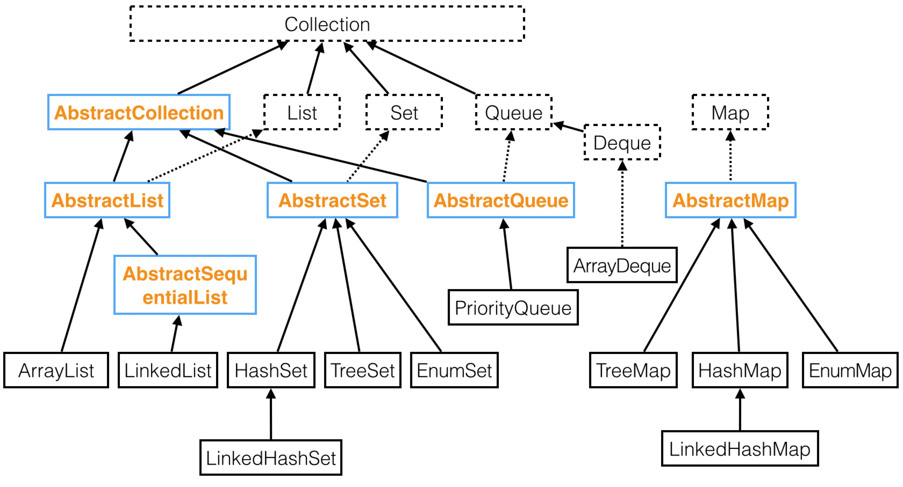
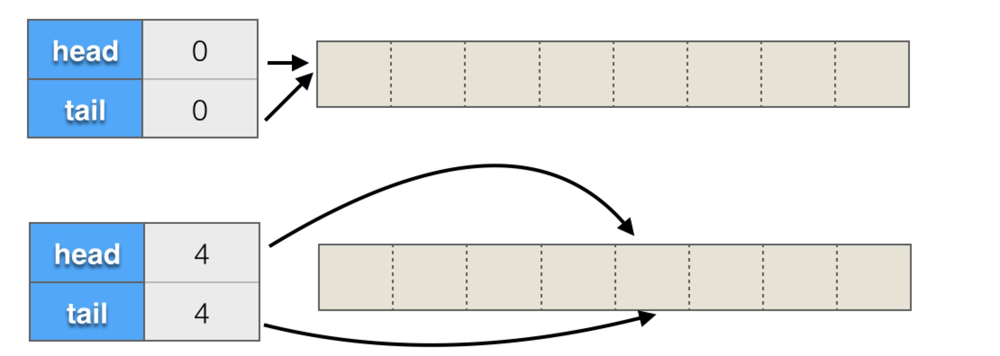
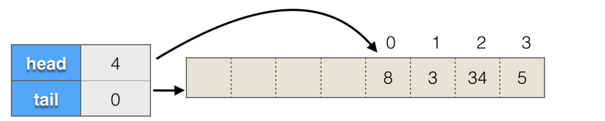
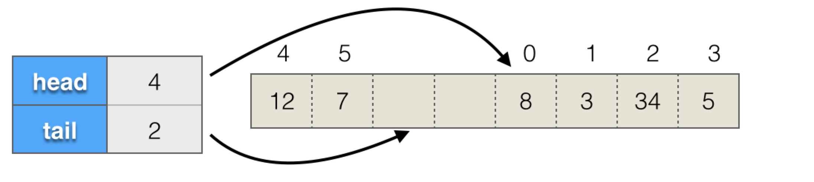
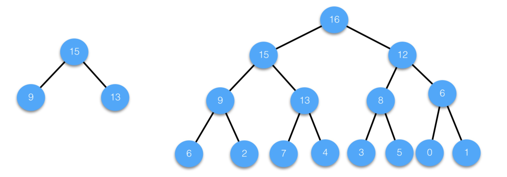
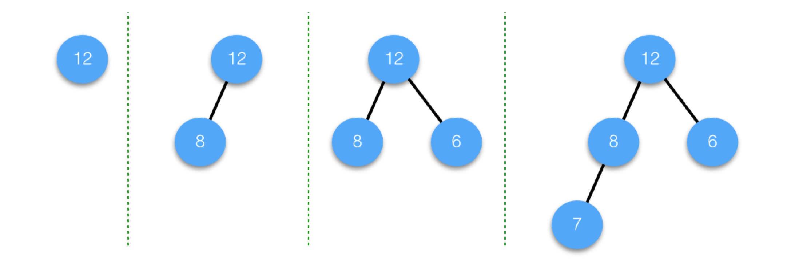
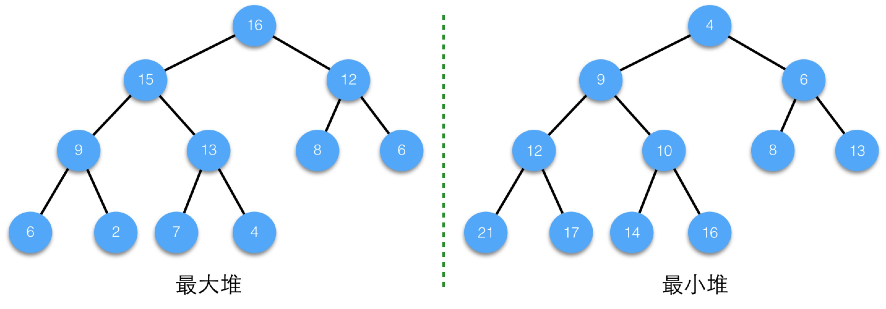
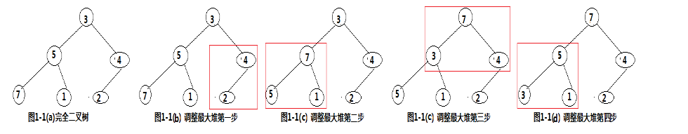

# 集合



容器类有两个根接口，分别是Collection和Map，Collection表示单个元素的集合，Map表示键值对的集合。

Collection表示的数据集合有基本的增、删、查、遍历等方法，但没有定义元素间的顺序或位置，也没有规定是否有重复元素。

List是Collection的子接口，表示有顺序或位置的数据集合，增加了根据索引位置进行操作的方法。它有两个主要的实现类，[ArrayList](http://mp.weixin.qq.com/s?__biz=MzIxOTI1NTk5Nw==&mid=2650047268&idx=1&sn=2806dfecbe039241d4206a4182602b8b&chksm=8fde26f6b8a9afe0a1f63bf10eed60fd12707060ed5ffb5c36d7b9ae8e14b1a11c447a39b7b8&scene=21#wechat_redirect)和[LinkedList](http://mp.weixin.qq.com/s?__biz=MzIxOTI1NTk5Nw==&mid=2650047277&idx=1&sn=648419ba6c79d862d229ff49c5c76394&chksm=8fde26ffb8a9afe9a1b1c2d78498f16e30d42976eb39610795a549e15aac32d4dca9f8e43ab9&scene=21#wechat_redirect)，ArrayList基于数组实现，LinkedList基于链表实现，ArrayList的随机访问效率很高，但从中间插入和删除元素需要移动元素，效率比较低，LinkedList则正好相反，随机访问效率比较低，但增删元素只需要调整邻近节点的链接。

Set也是Collection的子接口，它没有增加新的方法，但保证不含重复元素。它有两个主要的实现类，[HashSet](http://mp.weixin.qq.com/s?__biz=MzIxOTI1NTk5Nw==&mid=2650047288&idx=1&sn=806b3b291136f77f78153fad0e35720a&chksm=8fde26eab8a9affcfbfd8ec28310b5f925d71989da43bf6ed49179ecabaefd0f36fab2aad137&scene=21#wechat_redirect)和[TreeSet](http://mp.weixin.qq.com/s?__biz=MzIxOTI1NTk5Nw==&mid=2650047310&idx=1&sn=3a7a2425d6ea67fd53403daac3a12e81&chksm=8fde269cb8a9af8a6c811a781faf1e3440751c0fd5751b33b0b626ccf90ae2e763de9e1594af&scene=21#wechat_redirect)，HashSet基于哈希表实现，要求键重写hashCode方法，效率更高，但元素间没有顺序，TreeSet基于排序二叉树实现，元素按比较有序，元素需要实现Comparable接口，或者创建TreeSet时提供一个Comparator对象。HashSet还有一个子类[LinkedHashSet](http://mp.weixin.qq.com/s?__biz=MzIxOTI1NTk5Nw==&mid=2650047357&idx=1&sn=860bdc9d32b3a4dfeb61e4233c0bd36a&chksm=8fde26afb8a9afb9a53ef9128eec05303cdd93bf81f0602660aabe5bf099bd08e3b78b5b8f0e&scene=21#wechat_redirect)可以按插入有序。还有一个针对枚举类型的实现类[EnumSet](http://mp.weixin.qq.com/s?__biz=MzIxOTI1NTk5Nw==&mid=2650047366&idx=1&sn=f16a44397b5969172f85fc6ce3454238&chksm=8fde2654b8a9af4259531fbff6d0bf277631ab9cd01126350328692c371110522f0135573321&scene=21#wechat_redirect)，它基于位向量实现，效率很高。

Queue是Collection的子接口，表示先进先出的队列，在尾部添加，从头部查看或删除。Deque是Queue的子接口，表示更为通用的双端队列，有明确的在头或尾进行查看、添加和删除的方法。普通队列有两个主要的实现类，[LinkedList](http://mp.weixin.qq.com/s?__biz=MzIxOTI1NTk5Nw==&mid=2650047277&idx=1&sn=648419ba6c79d862d229ff49c5c76394&chksm=8fde26ffb8a9afe9a1b1c2d78498f16e30d42976eb39610795a549e15aac32d4dca9f8e43ab9&scene=21#wechat_redirect)和[ArrayDeque](http://mp.weixin.qq.com/s?__biz=MzIxOTI1NTk5Nw==&mid=2650047352&idx=1&sn=353f38f7dc468d8fad3537faf213cfa4&chksm=8fde26aab8a9afbc82b544e8f175135aca4854d3b432d8e4a6d5212fbabc7337269c50622328&scene=21#wechat_redirect)，LinkedList基于链表实现，ArrayDeque基于循环数组实现，一般而言，如果只需要Deque接口，ArrayDeque的效率更高一些。

Deque还有一个特殊的实现类[PriorityQueue](http://mp.weixin.qq.com/s?__biz=MzIxOTI1NTk5Nw==&mid=2650047336&idx=1&sn=8482fe2b3c76a084157074641cbc23ce&chksm=8fde26bab8a9afacd2eb305e75f4283b513203429f31a1418d770e229a5d8f9384d66e2767f4&scene=21#wechat_redirect)，它表示优先级队列，内部是用[堆](http://mp.weixin.qq.com/s?__biz=MzIxOTI1NTk5Nw==&mid=2650047333&idx=1&sn=4327dd711c9b94d78b0de8b477d53c45&chksm=8fde26b7b8a9afa13a2c4ac62bc6eee1cd0af53a71e61d2a1727a016f34b29aae5a94091b6c2&scene=21#wechat_redirect)实现的，堆除了用于实现优先级队列，还可以[高效方便的解决很多其他问题](http://mp.weixin.qq.com/s?__biz=MzIxOTI1NTk5Nw==&mid=2650047343&idx=1&sn=66fec88a2708b6206739e17f7b4c3435&chksm=8fde26bdb8a9afab8cf3a6b4c505983d0130841280259f90da96d97727fa63af4d9d259d45c9&scene=21#wechat_redirect)，比如求前K个最大的元素、求中值等。

Map接口表示键值对集合，经常根据键进行操作，它有两个主要的实现类，[HashMap](http://mp.weixin.qq.com/s?__biz=MzIxOTI1NTk5Nw==&mid=2650047285&idx=1&sn=0aa37645a4012d05e38b984ec9970310&chksm=8fde26e7b8a9aff12786d84d0072b302749ecd57cc41f8e11b2e687f618f838e8b0380dd00b6&scene=21#wechat_redirect)和[TreeMap](http://mp.weixin.qq.com/s?__biz=MzIxOTI1NTk5Nw==&mid=2650047307&idx=1&sn=aafd7b6e7b860fc9fc8b1aeb52144cab&chksm=8fde2699b8a9af8f08ca01f25bee26e346ed042065db40d302ddfaf208a905787185ca078ddf&scene=21#wechat_redirect)。HashMap基于哈希表实现，要求键重写hashCode方法，操作效率很高，但元素没有顺序。TreeMap基于排序二叉树实现，要求键实现Comparable接口，或提供一个Comparator对象，操作效率稍低，但可以按键有序。

HashMap还有一个子类[LinkedHashMap](http://mp.weixin.qq.com/s?__biz=MzIxOTI1NTk5Nw==&mid=2650047357&idx=1&sn=860bdc9d32b3a4dfeb61e4233c0bd36a&chksm=8fde26afb8a9afb9a53ef9128eec05303cdd93bf81f0602660aabe5bf099bd08e3b78b5b8f0e&scene=21#wechat_redirect)，它可以按插入或访问有序。之所以能有序，是因为每个元素还加入到了一个双向链表中。如果键本来就是有序的，使用LinkedHashMap而非[TreeMap](http://mp.weixin.qq.com/s?__biz=MzIxOTI1NTk5Nw==&mid=2650047307&idx=1&sn=aafd7b6e7b860fc9fc8b1aeb52144cab&chksm=8fde2699b8a9af8f08ca01f25bee26e346ed042065db40d302ddfaf208a905787185ca078ddf&scene=21#wechat_redirect)可以提高效率。按访问有序的特点可以方便的用于实现LRU缓存。

如果键为枚举类型，可以使用专门的实现类[EnumMap](http://mp.weixin.qq.com/s?__biz=MzIxOTI1NTk5Nw==&mid=2650047360&idx=1&sn=129ffbc5b963b5d6a692aae595e2b402&chksm=8fde2652b8a9af446be044953353fc89ea69627e472969fc7b4e9f32d10565c80b584d785ff5&scene=21#wechat_redirect)，它使用效率更高的数组实现。 

需要说明的是，我们介绍的各种容器类都不是线程安全的，也就是说，如果多个线程同时读写同一个容器对象，是不安全的。如果需要线程安全，可以使用Collections提供的synchronizedXXX方法对容器对象进行同步，或者使用线程安全的专门容器类。

此外，容器类提供的迭代器都有一个特点，都会在迭代中间进行结构性变化检测，如果容器发生了结构性变化，就会抛出ConcurrentModificationException，所以不能在迭代中间直接调用容器类提供的add/remove方法，如需添加和删除，应调用迭代器的相关方法。

在解决一个特定问题时，经常需要综合使用多种容器类。比如要统计一本书中出现次数最多的前10个单词，可以先使用HashMap统计每个单词出现的次数，再使用[47节](http://mp.weixin.qq.com/s?__biz=MzIxOTI1NTk5Nw==&mid=2650047343&idx=1&sn=66fec88a2708b6206739e17f7b4c3435&chksm=8fde26bdb8a9afab8cf3a6b4c505983d0130841280259f90da96d97727fa63af4d9d259d45c9&scene=21#wechat_redirect)介绍的TopK类用PriorityQueue求前十个10单词，或者使用Collections提供的sort方法。

在之前各节介绍的例子中，为简单起见，容器中的元素类型往往是简单的，但需要说明的是，它们也可以是复杂的自定义类型，也可以是容器类型。比如在一个新闻应用中，表示当天的前十大新闻可以用一个List表示，形如List<News>，而为了表示每个分类的前十大新闻，可以用一个Map表示，键为分类Category，值为List<News>，形如Map<Category,   List<News>>，而表示每天的每个分类的前十大新闻，可以在Map中使用Map，键为日期，值也是一个Map，形如Map<Date,  Map<Category, List<News>>。 

## 数据结构和算法

在容器类中，我们看到了如下数据结构的应用：

- 动态数组：ArrayList内部就是动态数组，HashMap内部的链表数组也是动态扩展的，ArrayDeque和PriorityQueue内部也都是动态扩展的数组。
- 链表：LinkedList是用双向链表实现的，HashMap中映射到同一个链表数组的键值对是通过单向链表链接起来的，LinkedHashMap中每个元素还加入到了一个双向链表中以维护插入或访问顺序。
- 哈希表：HashMap是用哈希表实现的，HashSet, LinkedHashSet和LinkedHashMap基于HashMap，内部当然也是哈希表。
- 排序二叉树：TreeMap是用红黑树(基于排序二叉树)实现的，TreeSet内部使用TreeMap，当然也是红黑树，红黑树能保持元素的顺序且综合性能很高。
- 堆：PriorityQueue是用堆实现的，堆逻辑上是树，物理上是动态数组，堆可以高效地解决一些其他数据结构难以解决的问题。
- 循环数组：ArrayDeque是用循环数组实现的，通过对头尾变量的维护，实现了高效的队列操作。
- 位向量：EnumSet是用位向量实现的，对于只有两种状态，且需要进行集合运算的数据，使用位向量进行表示、位运算进行处理，精简且高效。 

每种数据结构中往往包含一定的算法策略，这种策略往往是一种折中，比如：

- 动态扩展算法：动态数组的扩展策略，一般是指数级扩展的，是在两方面进行平衡，一方面是希望减少内存消耗，另一方面希望减少内存分配、移动和拷贝的开销。
- 哈希算法：哈希表中键映射到链表数组索引的算法，算法要快，同时要尽量随机和均匀。
- 排序二叉树的平衡算法：排序二叉树的平衡非常重要，红黑树是一种平衡算法，AVL树是另一种，平衡算法一方面要保证尽量平衡，另一方面要尽量减少综合开销。

Collections实现了一些通用算法，比如二分查找、排序、翻转列表顺序、随机化重排、循环移位等，在实现大部分算法时，Collections也都根据容器大小和是否实现了RandomAccess接口采用了不同的实现方式。 

## 设计思维和模式

在容器类中，我们也看到了Java的多种语言机制和设计思维的运用：

- 封装：封装就是提供简单接口，并隐藏实现细节，这是程序设计的最重要思维。在容器类中，很多类、方法和变量都是私有的，比如迭代器方法，基本都是通过私有内部类或匿名[内部类](http://mp.weixin.qq.com/s?__biz=MzIxOTI1NTk5Nw==&mid=2650047210&idx=1&sn=e5c0565f04b4c67241e180a2592281fb&scene=21#wechat_redirect)实现的。
- 继承和多态：继承可以复用代码，便于按父类统一处理，但我们也说过，[继承是一把双刃剑](http://mp.weixin.qq.com/s?__biz=MzIxOTI1NTk5Nw==&mid=2650047192&idx=1&sn=6f76d2ea101ccd7a651409fa828bad5f&scene=21#wechat_redirect)。在容器类中，Collection是父接口，List/Set/Queue继承自Collection，通过Collection接口可以统一处理多种类型的集合对象。容器类定义了很多抽象容器类，具体类通过继承它们以复用代码，每个抽象容器类都有详细的文档说明，描述其实现机制，以及子类应该如何重写方法。容器类的设计展示了接口继承、类继承、以及[抽象类](http://mp.weixin.qq.com/s?__biz=MzIxOTI1NTk5Nw==&mid=2650047204&idx=1&sn=dad6bc5b8341b48f9e001e2b1e7dca99&scene=21#wechat_redirect)的恰当应用。
- 组合：一般而言，组合应该优先于继承，我们看到HashSet通过组合的方式使用HashMap，TreeSet通过组合使用TreeMap，适配器和装饰器模式也都是通过组合实现的。
- 接口：[面向接口编程](http://mp.weixin.qq.com/s?__biz=MzIxOTI1NTk5Nw==&mid=2650047200&idx=1&sn=3952e0b2a8e6f594d46a58ae3fa3716d&scene=21#wechat_redirect)是一种重要的思维，可降低代码间的耦合，提高代码复用程度，在容器类方法中，接受的参数和返回值往往都是接口，Collections提供的通用算法，操作的也都是接口对象，我们平时在使用容器类时，一般也只在创建对象时使用具体类，而其他地方都使用接口。
- 设计模式：我们在容器类中看到了迭代器、工厂方法、适配器、装饰器等多种设计模式的应用。

# ArrayList

## 原理

### 初始化和扩容

如果初始化使用默认设置，第一次add会进行扩容，扩容为默认值10或者所需最小值中更大值，之所以add后扩容，而不是在构造函数中旧进行扩容，我猜测是因为一个是可能这个list永远不会add，就是一个空的，二是因为初始化后马上addAll，很可能会导致扩容，初始化没必要马上创建一个数组，浪费内存。

```java
	private static final Object[] DEFAULTCAPACITY_EMPTY_ELEMENTDATA = {};  
    private static final int DEFAULT_CAPACITY = 10;

    transient Object[] elementData; 
    private int size;

	public ArrayList() {
        //默认初始化，将内部维护的数组设置为一个所有arraylist共用的静态空数组
        this.elementData = DEFAULTCAPACITY_EMPTY_ELEMENTDATA;
    }

    public boolean add(E e) {
        //确保数组容量足够
        ensureCapacityInternal(size + 1);  // Increments modCount!!
        elementData[size++] = e;
        return true;
    }

    private void ensureCapacityInternal(int minCapacity) {
        ensureExplicitCapacity(calculateCapacity(elementData, minCapacity));
    }

    private static int calculateCapacity(Object[] elementData, int minCapacity) {
        //如果是空数组，返回默认初始容量和所需最小容量中更大的值
        if (elementData == DEFAULTCAPACITY_EMPTY_ELEMENTDATA) {
            return Math.max(DEFAULT_CAPACITY, minCapacity);
        }
        return minCapacity;
    }

    private void ensureExplicitCapacity(int minCapacity) {
        //记录内部修改次数
        modCount++;

        // 如果所需最小容量超过数组长度，需扩容
        if (minCapacity - elementData.length > 0)
            grow(minCapacity);
    }

    private void grow(int minCapacity) {
        // overflow-conscious code
        int oldCapacity = elementData.length;
        //新容量=旧容量+旧容量右移一位，约为旧容量的1.5倍，位运算快
        int newCapacity = oldCapacity + (oldCapacity >> 1);
        //如果扩容后容量<所需最小容量，则设置扩容后容量=所需最小容量，应该主要为了适应addAll()
        if (newCapacity - minCapacity < 0)
            newCapacity = minCapacity;
        if (newCapacity - MAX_ARRAY_SIZE > 0)
            newCapacity = hugeCapacity(minCapacity);
        //将旧数组复制到新数组中，并设置数组长度
        elementData = Arrays.copyOf(elementData, newCapacity);
    }
```

### remove

```java
public E remove(int index) {
    rangeCheck(index);

    modCount++;
    E oldValue = elementData(index);

    int numMoved = size - index - 1;
    if (numMoved > 0)
        //调用System.arraycopy方法移动元素，native方法，尽量多使用
        System.arraycopy(elementData, index+1, elementData, index,
                         numMoved);
    elementData[--size] = null; // clear to let GC do its work

    return oldValue;
}
```

## 迭代器

ArrayList中使用迭代器遍历的性能和用get()效率差不多，因为是数组，但是如果是链表结构的，如LinkedList，效率旧会差很多。

此外，**迭代器表示的是一种关注点分离的思想，将数据的实际组织方式与数据的迭代遍历相分离，是一种常见的设计模式。**需要访问容器元素的代码只需要一个Iterator接口的引用，不需要关注数据的实际组织方式，可以使用一致和统一的方式进行访问。

而提供Iterator接口的代码了解数据的组织方式，可以提供高效的实现。在ArrayList中, size/get(index)语法与迭代器性能是差不多的，但在后续介绍的其他容器中，则不一定，比如LinkedList，迭代器性能就要高很多。

从封装的思路上讲，迭代器封装了各种数据组织方式的迭代操作，提供了简单和一致的接口。

### Iterator接口

```java
public interface Iterator<E> {
    boolean hasNext();
    E next();
    void remove();
}
```

基本使用

```java
Iterator<Integer> it = intList.iterator();
while(it.hasNext()){
    System.out.println(it.next());
}
```

### 迭代的陷阱

关于迭代器，有一种常见的误用，就是在迭代的中间调用容器的删除方法，比如要删除一个整数ArrayList中所有小于100的数，直觉上，代码可以这么写：

```java
public void remove(ArrayList<Integer> list){
    for(Integer a : list){
        if(a<=100){
            list.remove(a);
        }
    }
}
```

但，运行时会抛出异常：

```
java.util.ConcurrentModificationException
```

发生了并发修改异常，为什么呢？迭代器内部会维护一些索引位置相关的数据，要求在迭代过程中，容器不能发生结构性变化，否则这些索引位置就失效了。所谓结构性变化就是添加、插入和删除元素，只是修改元素内容不算结构性变化。

如何避免异常呢？可以使用迭代器的remove方法，如下所示：

```java
public static void remove(ArrayList<Integer> list){
    Iterator<Integer> it = list.iterator();
    while(it.hasNext()){
        if(it.next()<=100){
            it.remove();
        }
    }
}
```

### 迭代器实现

迭代器使用cursor，lastRet，expectedModCount，

```java
private class Itr implements Iterator<E> {
    int cursor;       // 下一个要返回的元素位置
    int lastRet = -1; // 最近一个返回的索引位置，-1代表不存在
    int expectedModCount = modCount;//期望的修改次数，初始化为外部类当前的修改次数modCount

    Itr() {}

    //是否还有下一个元素
    public boolean hasNext() {
        return cursor != size;
    }

    //返回下一个元素
    @SuppressWarnings("unchecked")
    public E next() {
        //检测是否发生结构性变化，如果在迭代器内调用了list的remove，会抛异常，只能使用迭代器的removbe
        checkForComodification();
        int i = cursor;
        if (i >= size)
            throw new NoSuchElementException();
        Object[] elementData = ArrayList.this.elementData;
        if (i >= elementData.length)
            throw new ConcurrentModificationException();
        cursor = i + 1;
        return (E) elementData[lastRet = i];
    }

    //删除当前元素
    public void remove() {
        if (lastRet < 0)
            throw new IllegalStateException();
        checkForComodification();

        try {
            ArrayList.this.remove(lastRet);
            cursor = lastRet;
            lastRet = -1;
            expectedModCount = modCount;
        } catch (IndexOutOfBoundsException ex) {
            throw new ConcurrentModificationException();
        }
    }

    @Override
    @SuppressWarnings("unchecked")
    public void forEachRemaining(Consumer<? super E> consumer) {
        Objects.requireNonNull(consumer);
        final int size = ArrayList.this.size;
        int i = cursor;
        if (i >= size) {
            return;
        }
        final Object[] elementData = ArrayList.this.elementData;
        if (i >= elementData.length) {
            throw new ConcurrentModificationException();
        }
        while (i != size && modCount == expectedModCount) {
            consumer.accept((E) elementData[i++]);
        }
        // update once at end of iteration to reduce heap write traffic
        cursor = i;
        lastRet = i - 1;
        checkForComodification();
    }

    final void checkForComodification() {
        if (modCount != expectedModCount)
            throw new ConcurrentModificationException();
    }
}
```

## 优化使用

使用ArrayList需要注意两点：

**数组的特性，下标查询效率高O(1)，但是确定元素后的增删效率低O(n)。**

**动态的特性，因为是动态数组，会自动扩容，减少扩容次数，可以提升性能。比如需要大量增加元素，可以提前设置容量大小，减少扩容次数。**

### 构造方法

第一个方法以指定的大小initialCapacity初始化内部的数组大小，在事先知道元素长度的情况下，或者，预先知道长度上限的情况下，使用这个构造方法可以避免重新分配和拷贝数组。

第二个构造方法以一个已有的Collection构建，数据会新拷贝一份。

```java
public ArrayList(int initialCapacity)
public ArrayList(Collection<? extends E> c)
```

Arrays中有一个静态方法asList可以返回对应的List，如下所示：

```
Integer[] a = {1,2,3};
List<Integer> list = new ArrayList<Integer>(Arrays.asList(a));
```

### 数组转换

```java
public Object[] toArray()
public <T> T[] toArray(T[] a) 
```

第一个方法返回是Object数组

第二个方法返回对应类型的数组


### 容量大小控制

ArrayList还提供了两个public方法，可以控制内部使用的数组大小，一个是：

```java
public void ensureCapacity(int minCapacity)
```

它可以确保数组的大小至少为minCapacity，如果不够，会进行扩展。如果已经预知ArrayList需要比较大的容量，调用这个方法可以减少ArrayList内部分配和扩展的次数。

另一个方法是：

```java
public void trimToSize()
```

它会重新分配一个数组，大小刚好为实际内容的长度。调用这个方法可以节省数组占用的空间。

# LinkedList

LinkedList内部是用双向链表实现的，维护了长度、头节点和尾节点，这决定了它有如下特点：

- 按需分配空间，不需要预先分配很多空间
- 不可以随机访问，按照索引位置访问效率比较低，必须从头或尾顺着链接找，效率为O(N/2)。
- 不管列表是否已排序，只要是按照内容查找元素，效率都比较低，必须逐个比较，效率为O(N)。
- 在两端添加、删除元素的效率很高，为O(1)。
- 在中间插入、删除元素，要先定位，效率比较低，为O(N)，但修改本身的效率很高，效率为O(1)。 
- 单个元素存储使用比ArrayList更多的内存，因为需要额外存储指向前后node以及本身值的指针，额外使用3个指针，比如64位系统中，就浪费了3*8个字节，而数组则没有这些额外花费。

## 先进先出-队列

```java
public interface Queue<E> extends Collection<E> {
    //在尾部添加元素,在队列为满时，add会抛出异常IllegalStateException
    boolean add(E e);
    //在尾部添加元素,在队列为满时，offer只是返回false。
    boolean offer(E e);
    //删除头部元素，队列为空时，会抛出异常NoSuchElementException
    E remove();
    //删除头部元素，队列为空时，会返回null
    E poll();
    //查看头部元素，队列为空时，会抛出异常NoSuchElementException
    E element();
    //查看头部元素,队列为空时，会返回null
    E peek();
} 
```


## 先进后出-栈

Java中有一个类Stack，用于表示栈，但这个类已经过时了，我们不再介绍，Java中没有单独的栈接口，栈相关方法包括在了表示双端队列的接口Deque中，主要有三个方法：

```java
//表示入栈，在头部添加元素，栈的空间可能是有限的，如果栈满了，push会抛出异常IllegalStateException。
void push(E e);
//pop表示出栈，返回头部元素，并且从栈中删除，如果栈为空，会抛出异常NoSuchElementException。
E pop();
//peek查看栈头部元素，不修改栈，如果栈为空，返回null。 
E peek();
```


## 双端队列

栈和队列都是在两端进行操作，栈只操作头部，队列两端都操作，但尾部只添加、头部只查看和删除，有一个更为通用的操作两端的接口Deque，Deque扩展了Queue，包括了栈的操作方法，此外，它还有如下更为明确的操作两端的方法：

```java
void addFirst(E e);
void addLast(E e);
E getFirst();
E getLast();
boolean offerFirst(E e);
boolean offerLast(E e);
E peekFirst();
E peekLast();
E pollFirst();
E pollLast();
E removeFirst();
E removeLast();
```

xxxFirst操作头部，

xxxLast操作尾部。

与队列类似，每种操作有两种形式，区别也是在队列为空或满时，处理不同。

为空时，getXXX/removeXXX会抛出异常，而peekXXX/pollXXX会返回null。

队列满时，addXXX会抛出异常，offerXXX只是返回false。


## 实现原理

我们知道，ArrayList内部是数组，元素在内存是连续存放的，但LinkedList不是。LinkedList直译就是链表，确切的说，它的内部实现是**双向链表**，每个元素在内存都是单独存放的，元素之间通过链接连在一起。

```java
private static class Node<E> {
    E item;
    Node<E> next;
    Node<E> prev;

    Node(Node<E> prev, E element, Node<E> next) {
        this.item = element;
        this.next = next;
        this.prev = prev;
    }
}
```

```java
transient int size = 0;
transient Node<E> first;
transient Node<E> last;
```


## ListIterator

```java
public interface ListIterator<E> extends Iterator<E> {
    boolean hasNext();     //检查是否有下一个元素
    E next();              //返回下一个元素
    boolean hasPrevious(); //check是否有previous(前一个)element(元素)
    E previous();          //返回上一个元素
    int nextIndex();       //返回下一元素的Index
    int previousIndex();   //返回当前元素的Index
    void remove();         //移除一个元素
    void set(E e);         //set()方法替换访问过的最后一个元素 注意用set设置的是List列表的原始值
    void add(E e);         //添加一个元素
}
```


# ArrayDeque

ArrayDeque双端队列是jdk中列表的一种实现，支持元素在头和尾这两端进行插入和删除操作。

1. ArrayDeque是一个使用循环数组实现的双向队列，头尾的增删很快，查找也很快，但是增删某个中间的元素需要移动数组，效率会低。
2. 初始化数组大小，会将设定的值转换为一个2的次幂，对于模运算效率会好多。
3. ArrayDeque的扩容会把数组容量扩大2倍，同时还会重置头索引和尾索引。
4. Deque双向队列接口同时也实现了Stack接口，可以把Deque当成Stack使用，它的速度比java.util.Stack要快，因为Stack底层操作数据会加锁，而Deque不会加锁
5. ArrayDeque不是一个线程安全的类

ArrayDeque优点：

如果只是当作栈和队列来使用，ArrayDeque拥有更好的性能，

LinkedList每次添加一个节点，会生成一个node对象，频繁的增加删除节点，会导致gc，而且一个node需要额外的指针指向前后节点。

LinkedList的优点：

1.中间节点增删效率高。

2.容量无限，不需要扩容。

## 循环数组

对于一般数组，比如arr，第一个元素为arr[0]，最后一个为arr[arr.length-1]。但对于ArrayDeque中的数组，它是一个逻辑上的循环数组，所谓循环是指元素到数组尾之后可以接着从数组头开始，数组的长度、第一个和最后一个元素都与head和tail这两个变量有关，具体来说：

1. 如果head和tail相同，则数组为空，长度为0。
2. 如果tail大于head，则第一个元素为elements[head]，最后一个为elements[tail-1]，长度为tail-head，元素索引从head到tail-1。
3. 如果tail小于head，且为0，则第一个元素为elements[head]，最后一个为elements[elements.length-1]，元素索引从head到elements.length-1。
4. 如果tail小于head，且大于0，则会形成循环，第一个元素为elements[head]，最后一个是elements[tail-1]，元素索引从head到elements.length-1，然后再从0到tail-1。

我们来看一些图示。

第一种情况，数组为空，head和tail相同，如下所示：


第二种情况，tail大于head，如下所示，都包含三个元素：


第三种情况，tail为0，如下所示：


第四情况，tail不为0，且小于head，如下所示：


理解了循环数组的概念，我们来看ArrayDeque一些主要操作的代码，先来看构造方法。


## 构造方法

默认构造方法的代码为：

```java
public ArrayDeque() {
    elements = (E[]) new Object[16];
}
```

分配了一个长度为16的数组。

如果有参数numElements，代码为：

```java
public ArrayDeque(int numElements) {
    allocateElements(numElements);
}
```

不是简单的分配给定的长度，而是调用了allocateElements，代码为：

算法原理[求一个数的临近的较大的2的整数次幂](https://blog.csdn.net/dropping_1979/article/details/17715949)

```java
private void allocateElements(int numElements) {
    int initialCapacity = MIN_INITIAL_CAPACITY;
    // Find the best power of two to hold elements.
    // Tests "<=" because arrays aren't kept full.
    if (numElements >= initialCapacity) {
        initialCapacity = numElements;
        //最左1复制到下一位，最左两个1复制到下两位，最后最左1右边所有位转换为1
        initialCapacity |= (initialCapacity >>>  1);
        initialCapacity |= (initialCapacity >>>  2);
        initialCapacity |= (initialCapacity >>>  4);
        initialCapacity |= (initialCapacity >>>  8);
        initialCapacity |= (initialCapacity >>> 16);
        initialCapacity++;

        if (initialCapacity < 0)   // Too many elements, must back off
            initialCapacity >>>= 1;// Good luck allocating 2 ^ 30 elements
    }
    elements = (E[]) new Object[initialCapacity];
}
```

- 如果numElements小于MIN_INITIAL_CAPACITY，则分配的数组长度就是MIN_INITIAL_CAPACITY，它是一个静态常量，值为8。
- 在numElements大于等于8的情况下，分配的实际长度是严格大于numElements并且为2的整数次幂的最小数。比如，如果numElements为10，则实际分配16，如果numElements为32，则为64。

为什么要为2的幂次数呢？

代替求模运算，(tail + 1) & (elements.length - 1)计算tail下一个值，如果不是2的次幂，使用%，性能比位运算差很多。

## 扩容

```java
private void doubleCapacity() {
    assert head == tail;
    int p = head;
    int n = elements.length;
    int r = n - p; // number of elements to the right of p
    int newCapacity = n << 1;
    if (newCapacity < 0)
        throw new IllegalStateException("Sorry, deque too big");
    Object[] a = new Object[newCapacity];
    System.arraycopy(elements, p, a, 0, r);
    System.arraycopy(elements, 0, a, r, p);
    elements = (E[])a;
    head = 0;
    tail = n;
}
```

分配一个长度翻倍的新数组a，将head右边的元素拷贝到新数组开头处，再拷贝左边的元素到新数组中，最后重新设置head和tail，head设为0，tail设为n。


# HashMap

hashmap的key可以为null，使用hashmap时，阈值和负载因子需要注意，应该设置合适的值，尽量减少resize，提高性能。

## 使用

### 构造方法

```java
public HashMap() {
    //默认阈值16，负载因子0.75
    this(DEFAULT_INITIAL_CAPACITY, DEFAULT_LOAD_FACTOR);
}

public HashMap(int initialCapacity, float loadFactor) {
    //阈值大于0
    if (initialCapacity < 0)
        throw new IllegalArgumentException("Illegal initial capacity: " +
                                           initialCapacity);
    //阈值最大位2^32
    if (initialCapacity > MAXIMUM_CAPACITY)
        initialCapacity = MAXIMUM_CAPACITY;
    //负载因子大于0且是数字
    if (loadFactor <= 0 || Float.isNaN(loadFactor))
        throw new IllegalArgumentException("Illegal load factor: " +
                                           loadFactor);
    this.loadFactor = loadFactor;
    //阈值转2次幂，算法原理桶ArrayDeque，目的也一样，模运算提高性能
    this.threshold = tableSizeFor(initialCapacity);
}

/**
 * Returns a power of two size for the given target capacity.
 */
static final int tableSizeFor(int cap) {
    int n = cap - 1;
    n |= n >>> 1;
    n |= n >>> 2;
    n |= n >>> 4;
    n |= n >>> 8;
    n |= n >>> 16;
    return (n < 0) ? 1 : (n >= MAXIMUM_CAPACITY) ? MAXIMUM_CAPACITY : n + 1;
}
```


## 原理

```java
//数组，单向链表或者红黑树
transient Entry<K,V>[] table = (Entry<K,V>[]) EMPTY_TABLE;
//实际个数
transient int size;
//阈值，默认16，必须是2的次幂
int threshold;
//负载因子
final float loadFactor;
```

**使用hashcode计算hash值，与数组的长度-1进行与运算，等于是模运算，效率更好，如果节点为空，直接创建一个新节点，如果不为空，代表发生冲突，使用equals比较。**

### hash

```java
public V put(K key, V value) {
    // 第一个参数就是关键字key的哈希值
    return putVal(hash(key), key, value, false, true);
}

final V putVal(int hash, K key, V value, boolean onlyIfAbsent,
               boolean evict) {
    Node<K,V>[] tab; Node<K,V> p; int n, i;
    if ((tab = table) == null || (n = tab.length) == 0)
        n = (tab = resize()).length; // 哈希表是空的话，重新构建，进行扩容
    if ((p = tab[i = (n - 1) & hash]) == null)
        tab[i] = newNode(hash, key, value, null); // 没有hash冲突的话，直接在对应位置上构造一个新的节点即可
    else { // 如果哈希表当前位置上已经有节点的话，说明有hash冲突
        Node<K,V> e; K k;
        // 关键字跟哈希表上的首个节点济宁比较
        if (p.hash == hash &&
            ((k = p.key) == key || (key != null && key.equals(k))))
            e = p;
        // 如果使用的是红黑树，用红黑树的方式进行处理
        else if (p instanceof TreeNode)
            e = ((TreeNode<K,V>)p).putTreeVal(this, tab, hash, key, value);
        else { // 跟链表进行比较
            for (int binCount = 0; ; ++binCount) {
                if ((e = p.next) == null) { // 一直遍历链表，直到找到最后一个
                    p.next = newNode(hash, key, value, null); // 构造链表上的新节点
                    if (binCount >= TREEIFY_THRESHOLD - 1) // -1 for 1st
                        treeifyBin(tab, hash);
                    break;
                }
                if (e.hash == hash &&
                    ((k = e.key) == key || (key != null && key.equals(k))))
                    break;
                p = e;
            }
        }
        if (e != null) { // 如果找到了节点，说明关键字相同，进行覆盖操作，直接返回旧的关键字的值
            V oldValue = e.value;
            if (!onlyIfAbsent || oldValue == null)
                e.value = value;
            afterNodeAccess(e);
            return oldValue;
        }
    }
    ++modCount;
    if (++size > threshold) // 如果目前键值对个数已经超过阀值，重新构建
        resize();
    afterNodeInsertion(evict); // 节点插入以后的钩子方法
    return null;
}
```


```java
static final int hash(Object key) {
    int h;
    // 使用hashCode的值和hashCode的值无符号右移16位做异或操作,让hash算法更加均匀
    return (key == null) ? 0 : (h = key.hashCode()) ^ (h >>> 16);
}
```


### 单向链表

```java
//单向链表
static class Entry<K,V> implements Map.Entry<K,V> {
    final K key;
    V value;
    Entry<K,V> next;
    int hash;

    Entry(int h, K k, V v, Entry<K,V> n) {
        value = v;
        next = n;
        key = k;
        hash = h;
    }
} 
```


### 红黑树

jdk1.8的HashMap增加了红黑树。

```java
//大于8转为红黑树,查询增删时间复杂度都是o(lgn),相对avl树，增删效率高，查询效率低
static final int TREEIFY_THRESHOLD = 8;
//小于6转换为单向链表，查询效率o(n)，找到元素后的增删效率o(1)
static final int UNTREEIFY_THRESHOLD = 6;

static final class TreeNode<K,V> extends LinkedHashMap.Entry<K,V> {
    TreeNode<K,V> parent;  // red-black tree links
    TreeNode<K,V> left;
    TreeNode<K,V> right;
    TreeNode<K,V> prev;    // needed to unlink next upon deletion
    boolean red;
}
```


### 扩容resize

如果目前键值对个数已经超过阀值，进行扩容，扩大为原来的两倍，new一个原来两倍大小的数组，然后进行rehash，将旧map中的对象存入新的map中。

rehash：

1. 单节点：由于容量扩大两倍，相当于左移1位。扩容前与00000111[7，n - 1 = 8 -  1]进行与操作。扩容后与00001111[15, n - 1 = 16 - 1]进行与操作。所以最终的结果要是还是在原位置，要么在原位置  +8(+old capacity) 位置
2. 无节点：不处理
3. 链表：遍历各个节点，每个节点的处理方式跟单节点一样，结果分成2种，还在原位置和原位置 +8 位置

```java
final Node<K,V>[] resize() {
    Node<K,V>[] oldTab = table;
    int oldCap = (oldTab == null) ? 0 : oldTab.length;
    int oldThr = threshold;
    int newCap, newThr = 0;
    if (oldCap > 0) { // 如果老容量大于0，说明哈希表中已经有数据了，然后进行扩容
        if (oldCap >= MAXIMUM_CAPACITY) { // 超过最大容量的话，不扩容
            threshold = Integer.MAX_VALUE;
            return oldTab;
        }
        else if ((newCap = oldCap << 1) < MAXIMUM_CAPACITY && // 容量加倍
                 oldCap >= DEFAULT_INITIAL_CAPACITY) // 如果老的容量超过默认容量的话
            newThr = oldThr << 1; // 阀值加倍
    }
    else if (oldThr > 0) // 根据thresold初始化数组
        newCap = oldThr;
    else {               // 使用默认配置
        newCap = DEFAULT_INITIAL_CAPACITY;
        newThr = (int)(DEFAULT_LOAD_FACTOR * DEFAULT_INITIAL_CAPACITY);
    }
    if (newThr == 0) {
        float ft = (float)newCap * loadFactor;
        newThr = (newCap < MAXIMUM_CAPACITY && ft < (float)MAXIMUM_CAPACITY ?
                  (int)ft : Integer.MAX_VALUE);
    }
    threshold = newThr;
    @SuppressWarnings({"rawtypes","unchecked"})
        Node<K,V>[] newTab = (Node<K,V>[])new Node[newCap];
    table = newTab;
    if (oldTab != null) {
        for (int j = 0; j < oldCap; ++j) { // 扩容之后进行rehash操作
            Node<K,V> e;
            if ((e = oldTab[j]) != null) {
                oldTab[j] = null;
                if (e.next == null)
                    newTab[e.hash & (newCap - 1)] = e; // 单节点扩容
                else if (e instanceof TreeNode)
                    ((TreeNode<K,V>)e).split(this, newTab, j, oldCap); // 红黑树方式处理
                else { // 链表扩容
                    //使用尾插法，记录头尾节点，这样就不会查询循环链表，但是依然线程不安全
                    //低位比如0-7
                    Node<K,V> loHead = null, loTail = null;
                    //高位比如8-15
                    Node<K,V> hiHead = null, hiTail = null;
                    Node<K,V> next;
                    do {
                        next = e.next;
                        //比如1&8=0,属于低位的节点
                        if ((e.hash & oldCap) == 0) {
                            if (loTail == null)
                                loHead = e;
                            else
                                loTail.next = e;
                            loTail = e;
                        }                  
                        else {
                            //比如9&8!=0，属于高位的节点
                            if (hiTail == null)
                                hiHead = e;
                            else
                                hiTail.next = e;
                            hiTail = e;
                        }
                    } while ((e = next) != null);
                    if (loTail != null) {
                        loTail.next = null;
                        newTab[j] = loHead;
                    }
                    if (hiTail != null) {
                        hiTail.next = null;
                        newTab[j + oldCap] = hiHead;
                    }
                }
            }
        }
    }
    return newTab;
}
```


# LinkedHashMap

LinkedHashMap继承自HashMap，大多数的方法都是跟HashMap一样的，不过覆盖了一些方法，


```java
//静态内部类，相对于hashmap增加了执行前后节点的引用，双向链表，维护了顺序
static class Entry<K,V> extends HashMap.Node<K,V> {
    Entry<K,V> before, after;
    Entry(int hash, K key, V value, Node<K,V> next) {
        super(hash, key, value, next);
    }
}

//头节点
transient LinkedHashMap.Entry<K,V> head;
//尾节点
transient LinkedHashMap.Entry<K,V> tail;

final boolean accessOrder;
```

## accessOrder

LinkedHashMap默认情况下，accessOrder属性为false，也就是使用插入顺序，这个插入顺序是根据LinkedHashMap内部的一个双向链表实现的。

如果accessOrder为true，也就是使用访问顺序，那么afterNodeAccess这个钩子方法内部的逻辑会被执行，将会修改双向链表的结构。

插入排序：

安装你put的顺序，来维护内部的顺序。

访问排序：

在插入排序的基础上，get的时候，会改变元素的顺序，会把该元素移到数据的末尾。


# HashSet

hashset其实就是使用hashmap的key，将value都设置为同一个值，不浪费内存。

```java
private transient HashMap<E,Object> map;
//静态常量，所有hashset共用
private static final Object PRESENT = new Object();

public HashSet() {
    map = new HashMap<>();
}
```


# LinkedHashSet

```java
public LinkedHashSet(int initialCapacity, float loadFactor) {
    super(initialCapacity, loadFactor, true);
}

HashSet(int initialCapacity, float loadFactor, boolean dummy) {
    // map使用LinkedHashMap构造，LinkedHashMap是HashMap的子类，accessOrder为false，即使用插入顺序
    map = new LinkedHashMap<>(initialCapacity, loadFactor);
}
```

LinkedHashSet继自HashSet，但是内部的map是使用LinkedHashMap构造的，并且accessOrder为false，使用查询顺序。所以LinkedHashSet遍历的顺序就是插入顺序。


# TreeMap
```java
public TreeMap() {
        comparator = null;
}

public TreeMap(Comparator<? super K> comparator) {
    this.comparator = comparator;
}
```
红黑树

有序。执行查找、插入、删除等操作的时间复杂度为O(logn)。


# TreeSet

基于TreeMap实现，类似于HashSet。


# PriorityQueue

堆可以非常高效方便的解决很多问题，比如说：

- 优先级队列，我们之前介绍的队列实现类LinkedList是按添加顺序排队的，但现实中，经常需要按优先级来，每次都应该处理当前队列中优先级最高的，高优先级的，即使来得晚，也应该被优先处理。
- 求前K个最大的元素，元素个数不确定，数据量可能很大，甚至源源不断到来，但需要知道到目前为止的最大的前K个元素。这个问题的变体有：求前K个最小的元素，求第K个最大的，求第K个最小的。
- 求中值元素，中值不是平均值，而是排序后中间那个元素的值，同样，数据量可能很大，甚至源源不断到来。

遍历查询O(n)，增删O(lgn)

```java
transient Object[] queue; // 堆
private int size = 0; // 元素个数
private final Comparator<? super E> comparator; // 比较器，如果是null，使用元素自身的比较器
```

因为堆是一个完全二叉树，所有可以用数组实现的，类似于一层层的放，父节点刚好是子节点位置的1/2，用锦标赛的算法，最终获得的根节点就必然是最值。

因为是数组，所有初始值也很重要，也是维护了一个动态数组，如果grow，也是需要将旧数组复制到一个新数组的。

## 堆

### 满二叉树

满二叉树是指，除了最后一层外，每个节点都有两个孩子，而最后一层都是叶子节点，都没有孩子。比如，下图两个二叉树都是满二叉树。




### 完全二叉树

满二叉树一定是完全二叉树，但完全二叉树不要求最后一层是满的，但如果不满，则要求所有节点必须集中在最左边，从左到右是连续的，中间不能有空的。比如说，下面几个二叉树都是完全二叉树：



### 最大堆/最小堆

堆逻辑概念上是一颗完全二叉树，而物理存储上使用数组，除了这两点，堆还有一定的顺序要求。

这个特点为什么重要呢？它使得逻辑概念上的**二叉树可以方便的存储到数组**中，数组中的元素索引就对应节点的编号，树中的父子关系通过其索引关系隐含维持，不需要单独保持。

最大堆是指，每个节点都不大于其父节点。这样，对每个父节点，一定不小于其所有孩子节点，而根节点就是所有节点中最大的，对每个子树，子树的根也是子树所有节点中最大的。

最小堆与最大堆正好相反，每个节点都不小于其父节点。这样，对每个父节点，一定不大于其所有孩子节点，而根节点就是所有节点中最小的，对每个子树，子树的根也是子树所有节点中最小的。 




### 初建堆



初建堆其实就是先把下面的子二叉树变成堆，再一层层向上，构造一个完整的堆。类似于锦标赛。


### 调整堆

**添加元素**

如果堆为空，则直接添加一个根就行了。我们假定已经有一个堆了，要在其中添加元素。基本步骤为：

1. 添加元素到最后位置。

2. 与父节点比较，如果大于等于父节点，则满足堆的性质，结束，否则与父节点进行交换，然后再与父节点比较和交换，直到父节点为空或者大于等于父节点。


**从头部删除元素**

在队列中，一般是从头部删除元素，Java中用堆实现优先级队列，我们来看下如何在堆中删除头部，其基本步骤为：

1. 用最后一个元素替换头部元素，并删掉最后一个元素。
2. 将新的头部与两个孩子节点中较小的比较，如果不大于该孩子节点，则满足堆的性质，结束，否则与较小的孩子进行交换，交换后，再与较小的孩子比较和交换，一直到没有孩子，或者不大于两个孩子节点。这个过程我们般称为siftdown。


**从中间删除元素**

与从头部删除一样，都是先用最后一个元素替换待删元素。

不过替换后，有两种情况，如果该元素大于某孩子节点，则需向下调整(siftdown)，否则，如果小于父节点，则需向上调整(siftup)。