# java虚拟机学习

深入理解java虚拟机

[《Java虚拟机原理图解》](https://blog.csdn.net/u010349169/article/category/9263262)

## java概述

jvm   java虚拟机

jre java运行时环境，包含javaseAPI类库+jvm

jdk java开发环境，JAVA的运行环境（JVM+Java系统类库）和JAVA开发工具

## class文件结构

.java 源代码，会被Java编译器编译成后缀为**.class**的文件，该类型的文件是由字节组成的文件，又叫**字节码文件**，各种不同平台的虚拟机与所在平台都使用统一的程序存储格式字节码，构成了java的**平台无关性**。

class文件是一组以8位字节为基础的二进制流，各个数据项目严格按照顺序紧凑排列在class文件中，**没有任何分隔符**，所以需要容量计数器。

class文件格式采用一种你类似于c语言结构体的伪结构来存储数据，这种结构只有两种数据：无符号数和表。

无符号数属于基本的数据类型，可以用来描述数字、索引引用、数量值或者按照utf-8编码构成的字符串。

表是由多个无符号数或者其他表作为数据项构成的复合数据类型，所有表都习惯以_info结尾。整个class文件本质上就是一张表。

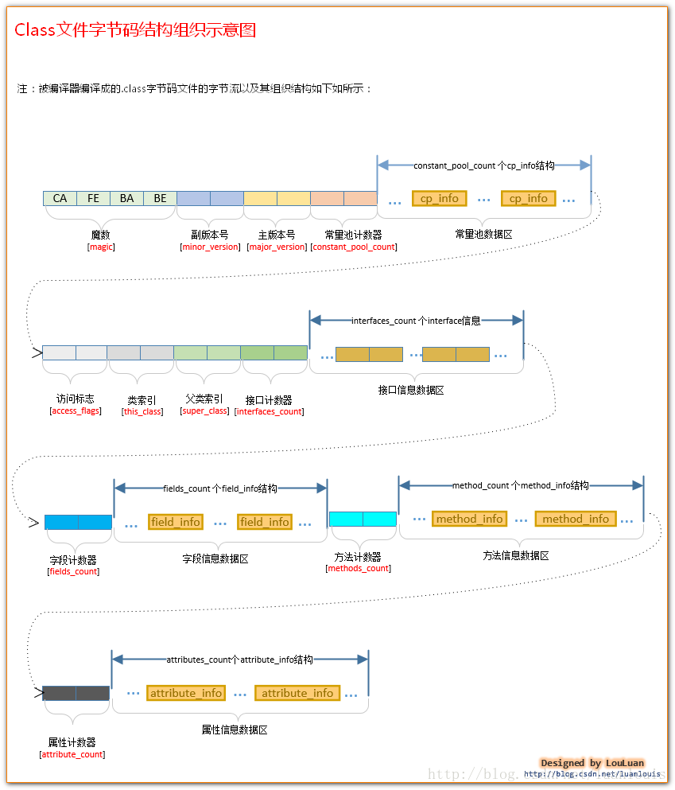


### 魔数和版本号

魔数：

所有的由Java编译器编译而成的class文件的前4个字节都是“0xCAFEBABE” ，很多文件存储标准中都使用魔数来进行身份识别，比如图片，gif和jpeg等在文件头都存在魔数。文件扩展名容易改动，使用魔数更加安全。

版本号：

 随着Java本身的发展，Java语言特性和JVM虚拟机也会有相应的更新和增强。目前我们能够用到的JDK版本如：1.5，1.6，1.7，还有现如今最新的1.8。发布新版本的目的在于：在原有的版本上增加新特性和相应的JVM虚拟机的优化。而随着主版本发布的次版本，则是修改相应主版本上出现的bug。我们平时只需要关注主版本就可以了。

主版本号和次版本号在class文件中**各占两个字节**，副版本号占用第5、6两个字节，而主版本号则占用第7，8两个字节。JDK1.0的主版本号为45，以后的每个新主版本都会在原先版本的基础上加1。若现在使用的是JDK1.7编译出来的class文件，则相应的主版本号应该是51,对应的7，8个字节的十六进制的值应该是 0x33。

一个 JVM实例只能支持特定范围内的主版本号 （Mi 至Mj） 和 0 至特定范围内 （0 至 m） 的副版本号。假设一个 Class 文件的格式版本号为 V， 仅当Mi.0 ≤ v ≤ Mj.m成立时，这个 Class 文件才可以被此 Java 虚拟机支持。不同版本的 Java 虚拟机实现支持的版本号也不同，高版本号的 Java 虚拟机实现可以支持低版本号的 Class 文件，反之则不成立。
    
JVM在加载class文件的时候，会读取出主版本号，然后比较这个class文件的主版本号和JVM本身的版本号，如果JVM本身的版本号 < class文件的版本号，JVM会认为加载不了这个class文件，会抛出我们经常见到的"**java.lang.UnsupportedClassVersionError: Bad version number in .class file** " Error 错误；反之，JVM会认为可以加载此class文件，继续加载此class文件。

使用JDK自带的javap工具，如当前有Programmer.class 文件，进入此文件所在的目录，然后执行 ”**javap -v Programmer**“,结果会类似如下所示：

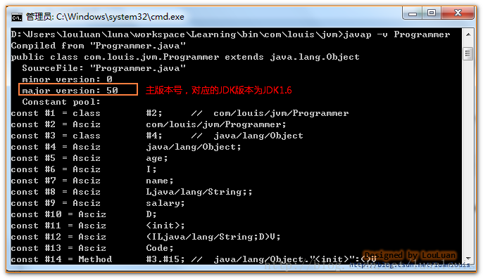    

### 常量池

常量池是表类型数据项目，主要用来存放两大类常量：字面量和符号引用。

**字面量**比较接近java语言中的常量，如文本字符串、final常量值等。

**符号引用**包含下面三类常量：

**类和接口的全限定名**

**字段的名称和描述符**

**方法的名称和描述符**

javac**编译**的时候，不会像c\c++一样有连接的步骤，而是在jvm加载class文件的时候进行**动态连接**。也就是说，才class文件中不会保存各个方法、字段的最终内存布局信息，因此这些字段方法的符号引用不经过**运行期**转换的话无法得到真正的内存入口地址，无法被jvm直接使用。jvm运行时，需要从常量池获得对应的符号引用，再在类创建时或运行时解析、翻译到具体的内存地址中。

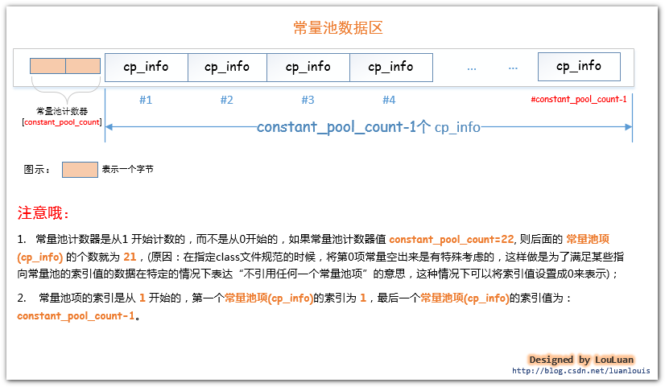

常量池项cp_info的结构

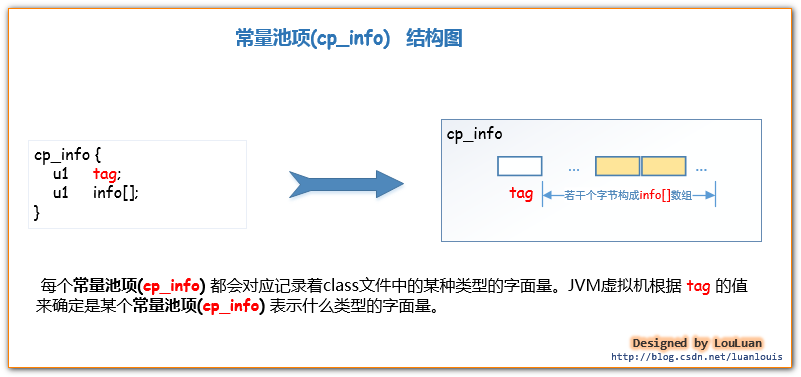

  JVM虚拟机规定了不同的tag值和不同类型的字面量对应关系如下：

​    

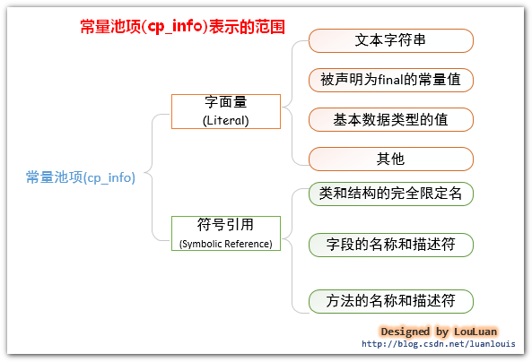

#### int和float

(CONSTANT_Integer_info,  CONSTANT_Float_info)

```java
package com.louis.jvm;
 
public class IntAndFloatTest {
	
	private final int a = 10;
	private final int b = 10;
	private float c = 11f;
	private float d = 11f;
	private float e = 11f;
	
}
```
我们通过javap -v IntAndFloatTest 指令来看一下其常量池中的信息，可以看到虽然我们在代码中写了两次10 和三次11f，但是常量池中，就只有一个常量10 和一个常量11f。


#### long和double

CONSTANT_Long_info和Constant_Double_info


```java
package com.louis.jvm;
 
public class LongAndDoubleTest {
	
	private long a = -6076574518398440533L;
	private long b = -6076574518398440533L;
	private long c = -6076574518398440533L;
	private double d = 10.1234567890D;
	private double e = 10.1234567890D;
	private double f = 10.1234567890D;
}
```


#### String

（CONSTANT_String_info、CONSTANT_Utf8_info）


CONSTANT_String_info结构体中的string_index的值指向了CONSTANT_Utf8_info结构体，而字符串的utf-8编码数据就在这个结构体之中。

```java
package com.louis.jvm;
 
public class StringTest {
	private String s1 = "JVM原理";
	private String s2 = "JVM原理";
	private String s3 = "JVM原理";
	private String s4 = "JVM原理";
}
```


在面的图中，我们可以看到CONSTANT_String_info结构体位于常量池的第#15个索引位置。而存放"Java虚拟机原理" 字符串的 UTF-8编码格式的字节数组被放到CONSTANT_Utf8_info结构体中，该结构体位于常量池的第#16个索引位置。上面的图只是看了个轮廓，让我们再深入地看一下它们的组织吧。


#### 类信息

CONSTANT_Class_info

JVM会将某个Java 类中所有使用到了的**类的完全限定名** 以**二进制形式的完全限定名** 封装成**CONSTANT_Class_info**结构体中，然后将其放置到常量池里。**CONSTANT_Class_info**  的tag值为 **7 。**其结构如下：

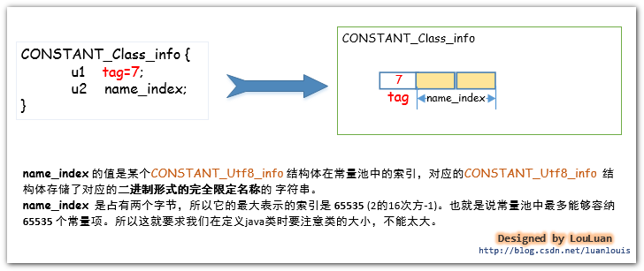   

 在某个Java源码中，我们会使用很多个类，比如我们定义了一个 ClassTest的类，并把它放到com.louis.jvm 包下，则 ClassTest**类的完全限定**名为com.louis.jvm.ClassTest，将JVM编译器将类编译成class文件后，此完全限定名在class文件中，是以二进制形式的完全限定名存储的，即它会把完全限定符的"."换成"/" ，即在class文件中存储的 ClassTest类的完全限定名称是"com/louis/jvm/ClassTest"。因为这种形式的完全限定名是放在了class二进制形式的字节码文件中，所以就称之为 **二进制形式的完全限定名**。
```java
package com.jvm;
import  java.util.Date;
public class ClassTest {
    private Date date =new Date();
}
```


在ClassTest.class文件的常量池中，共有 3 个CONSTANT_Class_info结构体，分别表示ClassTest 中用到的Class信息。 我们就看其中一个表示com/jvm.ClassTest的CONSTANT_Class_info 结构体。它在常量池中的位置是#1，它的name_index值为#2，它指向了常量池的第2 个常量池项，如下所示:


 对于某个类而言，其class文件中至少要有两个CONSTANT_Class_info常量池项，用来表示自己的类信息和其父类信息。(除了java.lang.Object类除外，其他的任何类都会默认继承自java.lang.Object）如果类声明实现了某些接口，那么接口的信息也会生成对应的CONSTANT_Class_info常量池项。

  除此之外，如果在类中使用到了其他的类，只有真正使用到了相应的类，JDK编译器才会将类的信息组成CONSTANT_Class_info常量池项放置到常量池中。
```java
package com.louis.jvm;

import java.util.Date;

public  class Other{
    private Date date;

    public Other()
    {
        Date da;
    }
}
```

上述的Other的类，在JDK将其编译成class文件时，常量池中并没有java.util.Date对应的CONSTANT_Class_info常量池项，为什么呢?

   在Other类中虽然定义了Date类型的两个变量date、da，但是JDK编译的时候，认为你只是声明了“Ljava/util/Date”类型的变量，并没有实际使用到Ljava/util/Date类。将类信息放置到常量池中的目的，是为了在后续的代码中有可能会反复用到它。很显然，JDK在编译Other类的时候，会解析到Date类有没有用到，发现该类在代码中就没有用到过，所以就认为没有必要将它的信息放置到常量池中了。
```java
package com.louis.jvm;
 
import java.util.Date;
 
public  class Other{
	public Other()
	{
		new Date();
	}
}
```

 这时候使用javap -v Other ，可以查看到常量池中有表示java/util/Date的常量池项：
 

总结：

1.对于某个类或接口而言，其自身、父类和继承或实现的接口的信息会被直接组装成CONSTANT_Class_info常量池项放置到常量池中； 

2.类中或接口中使用到了其他的类，只有在类中**实际使用到了该类**时，该类的信息才会在常量池中有对应的CONSTANT_Class_info常量池项；

3.类中或接口中仅仅定义某种类型的变量，JDK只会将变量的类型描述信息以UTF-8字符串组成CONSTANT_Utf8_info常量池项放置到常量池中，上面在类中的private Date date;JDK编译器只会将表示date的数据类型的“Ljava/util/Date”字符串放置到常量池中。


#### field字段

(CONSTANT_Fieldref_info,  CONSTANT_Name_Type_info)
```java
package com.louis.jvm;
 
public class Person {
 
	private String name;
	private int age;
	
	public String getName() {
		return name;
	}
	
	public void setName(String name) {
		this.name = name;
	}
	public int getAge() {
		return age;
	}
	
	public void setAge(int age) {
		this.age = age;
	}
}
```

在上面定义的类中，我们在Person类中的一系列方法里，多次引用到name字段 和age字段，对于JVM编译器而言，name和age只是一个符号而已，并且它在由于它可能会在此类中重复出现多次，所以JVM把它当作常量来看待，将name和age以field字段常量的形式保存到常量池中。


将它name和age封装成 CONSTANT_Fieldref_info 常量池项，放到常量池中，在类中引用到它的地方，直接放置一个指向field字段所在常量池的索引。

上面的Person类，使用javap -v Person指令，查看class文件的信息，你会看到，在Person类中引用到age和namefield字段的地方，都是指向了常量池中age和namefield字段对应的常量池项中。表示field字段的常量池项叫做CONSTANT_Fieldref_info。


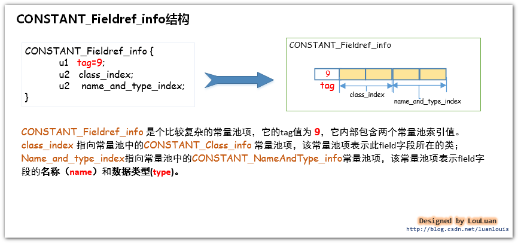

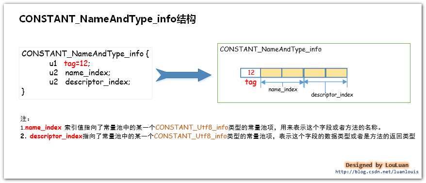

  实例解析： 现在，让我们来看一下**Person**类中定义的**name**字段在常量池中的表示。通过使用**javap -v Person**会查看到如下的常量池信息：


  请读者看上图中namefield字段的数据类型，它在#6个常量池项，以UTF-8编码格式的字符串“Ljava/lang/String;” 表示，这表示着这个field 字段是java.lang.String 类型的。关于field字段的数据类型，class文件中存储的方式和我们在源码中声明的有些不一样。请看下图的对应关系：


请注意！！！

如果我们在类中定义了field 字段，但是没有在类中的其他地方用到这些字段，它是不会被编译器放到常量池中的。读者可以自己试一下。（当然了，定义了但是没有在类中的其它地方引用到这种情况很少。）

只有在类中的其他地方**引用**到了，才会将他放到常量池中。

#### method方法

(CONSTANT_Methodref_info,  CONSTANT_Name_Type_info)

​    **1.举例：**

​             还是以**Person**类为例。在**Person**类中，我们定义了**setName(String  name)、getName()、setAge(int age)、getAge()**这些方法：   

 虽然我们定义了方法，但是这些方法没有在类总的其他地方被用到（即没有在类中其他的方法中引用到），所以它们的方法引用信息并不会放到常量中。

现在我们在类中加一个方法 getInfo()，调用了getName()和getAge() 方法：

```java
public String getInfo()
{

    return getName()+"\t"+getAge();
}
```


这时候JVM编译器会将getName()和getAge()方法的引用信息包装成CONSTANT_Methodref_info结构体放入到常量池之中。

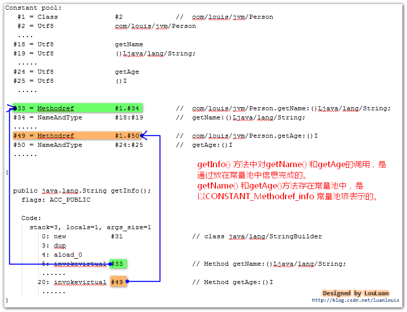

   这里的方法调用的方式牵涉到Java非常重要的一个术语和机制，叫动态绑定。这个动态绑定问题以后在单独谈谈。

  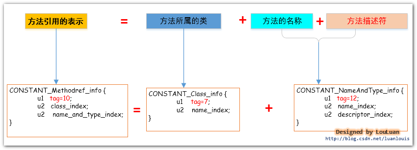


#### 接口Method方法

(CONSTANT_InterfaceMethodref_info,  CONSTANT_Name_Type_info)
```java
/**
 * Worker 接口类
 * @author luan louis
 */
public interface Worker{

    public void work();

}

 
/**
 * Boss 类，makeMoney()方法 调用Worker 接口的work
 * @author louluan
 */
public class Boss {
	
	public void makeMoney(Worker worker)
	{
		worker.work();
	}
 
}
```

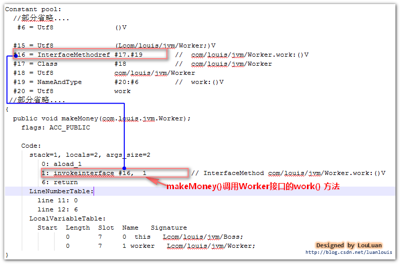

   CONSTANT_InterfaceMethodref_info结构体和上面介绍的CONSTANT_Methodref_info 结构体很基本上相同，它们的不同点只有：

1.CONSTANT_InterfaceMethodref_info 的tag 值为11，而CONSTANT_Methodref_info的tag值为10；
2.CONSTANT_InterfaceMethodref_info 描述的是接口中定义的方法，而CONSTANT_Methodref_info描述的是实例类中的方法；

#### 动态语言特性

CONSTANT_MethodType_info,CONSTANT_MethodHandle_info,CONSTANT_InvokeDynamic_info

 这三项主要是为了让Java语言支持动态语言特性而在Java 7 版本中新增的三个常量池项，只会在极其特别的情况能用到它，在class文件中几乎不会生成这三个常量池项。

#### 访问标志

  访问标志，access_flags 是一种掩码标志，用于表示某个类或者接口的**访问权限及基础属性**。

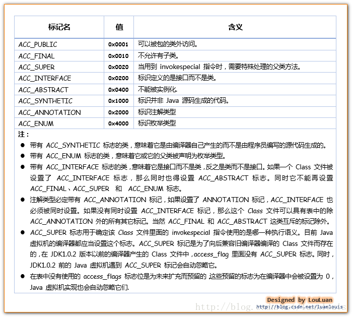


#### 类索引、父类索引和接口索引

class文件通过这三项数据来确定类的继承关系。

**类索引用于确定这个类的全限定名**，this_class的值必须是对constant_pool表中项目的一个有效索引值。constant_pool表在这个索引处的项必须为CONSTANT_Class_info
类型常量，表示这个 Class 文件所定义的类或接口。

**父类索引用于确定这个类的父类的全限定名**，对于类来说，super_class 的值必须为 0 或者是对constant_pool 表中项目的一个有效索引值。如果它的值不为 0，那 constant_pool 表在这个索引处的项必须为CONSTANT_Class_info 类型常量，表示这个 Class 文件所定义的类的直接父类。当前类的直接父类，以及它所有间接父类的access_flag 中都不能带有ACC_FINAL 标记。对于接口来说，它的Class文件的super_class项的值必须是对constant_pool表中项目的一个有效索引值。constant_pool表在这个索引处的项必须为代表 java.lang.Object 的 CONSTANT_Class_info 类型常量 。如果 Class 文件的 super_class的值为 0，那这个Class文件只可能是定义的是java.lang.Object类，只有它是唯一没有父类的类。

**接口索引集合用来描述这个类实现了那些接口**：

接口计数器，interfaces_count的值表示当前类或接口的直接父接口数量。

 接口表，interfaces[]数组中的每个成员的值必须是一个对constant_pool表中项目的一个有效索引值， 它的长度为 interfaces_count。每个成员 interfaces[i]  必须为 CONSTANT_Class_info类型常量，其中 0 ≤ i <interfaces_count。在interfaces[]数组中，成员所表示的接口顺序和对应的源代码中给定的接口顺序（从左至右）一样，即interfaces[0]对应的是源代码中最左边的接口。

#### 字段计数器和字段表

**字段表集合用于描述接口或者类中声明的变量。**

字段计数器，fields_count的值表示当前 Class 文件
fields[]数组的成员个数。 fields[]数组中每一项都是一个field_info结构的数据项，它用于表示该类或接口声明的类字段或者实例字段。

字段表，fields[]数组中的每个成员都必须是一个fields_info结构的数据项，用于表示当前类或接口中某个字段的完整描述。
fields[]数组描述当前类或接口声明的所有字段，但不包括从父类或父接口继承的部分。


使用与运算可用轻松获得字段的标志符。

#### 方法计数器和方法表

  方法计数器， methods_count的值表示当前Class
文件 methods[]数组的成员个数。Methods[]数组中每一项都是一个 method_info 结构的数据项。

   方法表，methods[] 数组中的每个成员都必须是一个 method_info 结构的数据项，用于表示当前类或接口中某个方法的完整描述。如果某个method_info 结构的access_flags 项既没有设置 ACC_NATIVE 标志也没有设置ACC_ABSTRACT 标志，那么它所对应的方法体就应当可以被 Java 虚拟机直接从当前类加载，而不需要引用其它类。 method_info结构可以表示类和接口中定义的所有方法，包括实例方法、类方法、实例初始化方法方法和类或接口初始化方法方法 。methods[]数组只描述当前类或接口中声明的方法，不包括从父类或父接口继承的方法。


> 访问标志（**access_flags**）共占有**2** 个字节，分为 **16** 位，这 **16**位 表示的含义如下所示：
>
> 

紧接着访问标志（access_flags）后面的两个字节，叫做名称索引(name_index)，这两个字节中的值是指向了常量池中某个常量池项的索引，该常量池项表示这这个方法名称的字符串。  
方法描述符索引(descrptor_index)是紧跟在名称索引后面的两个字节，这两个字节中的值跟名称索引中的值性质一样，都是指向了常量池中的某个常量池项。这两个字节中的指向的常量池项，是表示了方法描述符的字符串。
所谓的方法描述符，实质上就是指用一个什么样的字符串来描述一个方法，方法描述符的组成如下图所示：


**Code**类型的**属性表(attribute_info)**可以说是**class**文件中最为重要的部分，因为它包含的是**JVM**可以运行的机器码指令，**JVM**能够运行这个类，就是从这个属性中取出机器码的。除了要执行的机器码，它还包含了一些其他信息，如下所示：


机器指令----code：

    目前的JVM使用一个字节表示机器操作码，即对JVM底层而言，它能表示的机器操作码不多于2的 8 次方，即 256个。class文件中的机器指令部分是class文件中最重要的部分，并且非常复杂。

异常处理跳转信息---exception_table：

    如果代码中出现了try{}catch{}块，那么try{}块内的机器指令的地址范围记录下来，并且记录对应的catch{}块中的起始机器指令地址，当运行时在try块中有异常抛出的话，JVM会将catch{}块对应懂得其实机器指令地址传递给PC寄存器，从而实现指令跳转；

Java源码行号和机器指令的对应关系---LineNumberTable属性表：

    编译器在将java源码编译成class文件时，会将源码中的语句行号跟编译好的机器指令关联起来，这样的class文件加载到内存中并运行时，如果抛出异常，JVM可以根据这个对应关系，抛出异常信息，告诉我们我们的源码的多少行有问题，方便我们定位问题。这个信息不是运行时必不可少的信息，但是默认情况下，编译器会生成这一项信息，如果你项取消这一信息，你可以使用-g:none 或-g:lines来取消或者要求设置这一项信息。如果使用了-g:none来生成class文件，class文件中将不会有LineNumberTable属性表，造成的影响就是 将来如果代码报错，将无法定位错误信息报错的行，并且如果项调试代码，将不能在此类中打断点（因为没有指定行号。）

局部变量表描述信息----LocalVariableTable属性表：

    局部变量表信息会记录栈帧局部变量表中的变量和java源码中定义的变量之间的关系，这个信息不是运行时必须的属性，默认情况下不会生成到class文件中。你可以根据javac指令的-g:none或者-g:vars选项来取消或者设置这一项信息。
    
    它有什么作用呢？  当我们使用IDE进行开发时，最喜欢的莫过于它们的代码提示功能了。如果在项目中引用到了第三方的jar包，而第三方的包中的class文件中有无LocalVariableTable属性表的区别如下所示：

Code属性表结构体的解释：

   1.attribute_name_index,属性名称索引，占有2个字节，其内的值指向了常量池中的某一项，该项表示字符串“Code”;
2. attribute_length,属性长度，占有 4个字节，其内的值表示后面有多少个字节是属于此Code属性表的；
3. max_stack,操作数栈深度的最大值，占有 2 个字节，在方法执行的任意时刻，操作数栈都不应该超过这个值，虚拟机的运行的时候，会根据这个值来设置该方法对应的栈帧(Stack Frame)中的操作数栈的深度；
4. max_locals,最大局部变量数目，占有 2个字节，其内的值表示局部变量表所需要的存储空间大小；
5. code_length,机器指令长度，占有 4 个字节，表示跟在其后的多少个字节表示的是机器指令；
6. code,机器指令区域，该区域占有的字节数目由 code_length中的值决定。JVM最底层的要执行的机器指令就存储在这里；
7. exception_table_length,显式异常表长度，占有2个字节，如果在方法代码中出现了try{} catch()形式的结构，该值不会为空，紧跟其后会跟着若干个exception_table结构体，以表示异常捕获情况；
8. exception_table，显式异常表，占有8 个字节，start_pc,end_pc,handler_pc中的值都表示的是PC计数器中的指令地址。exception_table表示的意思是：如果字节码从第start_pc行到第end_pc行之间出现了catch_type所描述的异常类型，那么将跳转到handler_pc行继续处理。
9. attribute_count,属性计数器，占有 2 个字节，表示Code属性表的其他属性的数目
10. attribute_info,表示Code属性表具有的属性表，它主要分为两个类型的属性表：“LineNumberTable”类型和“LocalVariableTable”类型。
    “LineNumberTable”类型的属性表记录着Java源码和机器指令之间的对应关系
    “LocalVariableTable”类型的属性表记录着局部变量描述


#### 属性计数器和属性表

在class文件、字段表、方法表都可以携带自己的属性表集合，用于描述某些场景的专有信息。

属性计数器，attributes_count的值表示当前
Class 文件attributes表的成员个数。attributes表中每一项都是一个attribute_info
结构的数据项。

属性表，attributes 表的每个项的值必须是attribute_info结构。

在Java 7 规范里，Class文件结构中的attributes表的项包括下列定义的属性： InnerClasses  、 EnclosingMethod 、 Synthetic  、Signature、SourceFile，SourceDebugExtension 、Deprecated、RuntimeVisibleAnnotations 、RuntimeInvisibleAnnotations以及BootstrapMethods属性。

对于支持 Class 文件格式版本号为 49.0 或更高的 Java 虚拟机实现，必须正确识别并读取attributes表中的Signature、RuntimeVisibleAnnotations和RuntimeInvisibleAnnotations属性。对于支持Class文件格式版本号为 51.0 或更高的 Java 虚拟机实现，必须正确识别并读取 attributes表中的BootstrapMethods属性。Java 7 规范 要求任一 Java 虚拟机实现可以自动忽略 Class 文件的 attributes表中的若干 （甚至全部） 它不可识别的属性项。任何本规范未定义的属性不能影响Class文件的语义，只能提供附加的描述信息 。


##### code属性

java程序方法体中的代码经过javac编译处理以后，最终会变成字节码指令存储在code属性内。code属性是class文件中最重要的一个属性，如果把一个java程序中的信息分为代码和元数据，那么code属性就是用于描述代码。

```java
Code_attribute {
    //属性名称索引，指向常量池中的CONSTANT_Utf8_info型常量
    u2 attribute_name_index;
    //属性值长度
    u4 attribute_length;
    //操作数栈深度
    u2 max_stack;
    //局部变量表所需存储空间，单位slot
    u2 max_locals;
    //code[]数组的字节数
    u4 code_length;
    //java虚拟机字节码指令
    u1 code[code_length];
    //异常处理器数量
    u2 exception_table_length;
    //异常处理器数组，每个成员表示code[]中南方人一个异常处理器
    { u2 start_pc;
      u2 end_pc;
      u2 handler_pc;
      u2 catch_type;
    } exception_table[exception_table_length];
    u2 attributes_count;
    attribute_info attributes[attributes_count];
}
```


