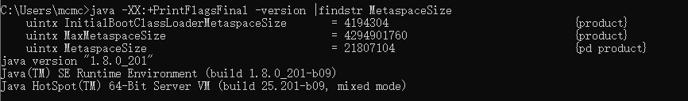

## java运行时数据区域

### 程序计数器

​	程序计数器（Program Counter Register）是一块较小的内存空间，**它可以看作是当前线程所执行的字节码的行号指示器**。 在虚拟机的概念模型里（仅是概念模型，各种虚拟机可能会通过一些更高效的方式去实现），字节码解释器工作时就是通过改变这个计数器的值来选取下一条需要执行的字节码指令，分支、 循环、 跳转、 异常处理、 线程恢复等基础功能都需要依赖这个计数器来完成。

​	由于Java虚拟机的多线程是通过线程轮流切换并分配处理器执行时间的方式来实现的，在任何一个确定的时刻，一个处理器（对于多核处理器来说是一个内核）都只会执行一条线程中的指令。 **因此，为了线程切换后能恢复到正确的执行位置，每条线程都需要有一个独立的程序计数器，各条线程之间计数器互不影响，独立存储，我们称这类内存区域为“线程私有”的内存。如果线程正在执行的是一个Java方法，这个计数器记录的是正在执行的虚拟机字节码指令的地址；如果正在执行的是Native方法，这个计数器值则为空（Undefined）**。 此内存区域是唯一一个在Java虚拟机规范中没有规定任何OutOfMemoryError情况的区域。 

### 栈

**java虚拟机栈**：

​	与程序计数器一样，Java虚拟机栈（Java Virtual Machine Stacks）也是线程私有的，它的生命周期与线程相同。 虚拟机栈描述的是Java方法执行的内存模型：**每个方法在执行的同时都会创建一个栈帧**（Stack Frame[1]）用于**存储局部变量表、 操作数栈、 动态链接、 方法出口等信息**。 每一个方法从调用直至执行完成的过程，就对应着一个栈帧在虚拟机栈中入栈到出栈的过程。

​	经常有人把Java内存区分为堆内存（Heap）和栈内存（Stack），这种分法比较粗糙，Java内存区域的划分实际上远比这复杂。 这种划分方式的流行只能说明大多数程序员最关注的、 与对象内存分配关系最密切的内存区域是这两块。 其中所指的“堆”笔者在后面会专门讲述，而所指的“栈”就是现在讲的虚拟机栈，或者说是虚拟机栈中局部变量表部分。

​	局部变量表存放了编译期可知的各种**基本数据类型**（boolean、 byte、 char、 short、 int、float、 long、 double）、 **对象引用**（reference类型，它不等同于对象本身，可能是一个指向对象起始地址的引用指针，也可能是指向一个代表对象的句柄或其他与此对象相关的位置）和returnAddress类型（指向了一条字节码指令的地址）。其中64位长度的long和double类型的数据会占用2个局部变量空间（Slot），其余的数据类型只占用1个。 局部变量表所需的内存空间在编译期间完成分配，当进入一个方法时，这个方法需要在帧中分配多大的局部变量空间是完全确定的，在方法运行期间不会改变局部变量表的大小。

​	在Java虚拟机规范中，对这个区域规定了两种异常状况：如果线程请求的栈深度大于虚拟机所允许的深度，将抛出StackOverflowError异常；如果虚拟机栈可以动态扩展（当前大部分的Java虚拟机都可动态扩展，只不过Java虚拟机规范中也允许固定长度的虚拟机栈），如果扩展时无法申请到足够的内存，就会抛出OutOfMemoryError异常。 

设置方式：**-Xss**，每个线程栈空间大小

Java基本数据类型保存在虚拟机栈中，如果线程运行时虚拟机栈没有足够的空间存入更多基本数据类型，则会报栈内存溢出

**本地方法栈**：

​	本地方法栈（Native Method Stack）与虚拟机栈所发挥的作用是非常相似的，它们之间的区别不过是虚拟机栈为虚拟机执行Java方法（也就是字节码）服务，而本地方法栈则为虚拟机使用到的Native方法服务。 在虚拟机规范中对本地方法栈中方法使用的语言、 使用方式与数据结构并没有强制规定，因此具体的虚拟机可以自由实现它。 甚至有的虚拟机（譬如Sun HotSpot虚拟机）直接就把本地方法栈和虚拟机栈合二为一。 与虚拟机栈一样，本地方法栈区域也会抛出StackOverflowError和OutOfMemoryError异常。 

设置方式：-Xoss，Hotspot虚拟机本地方法栈和虚拟机栈合二为一，故这个参数不生效

#### 局部变量表

局部变量表（Local Variable Table）是一组变量值存储空间，用于存放方法参数和方法内部定义的局部变量。

在Java程序编译为Class文件时，就在方法的**Code属性**的max_locals数据项中确定了该方法所需要分配的局部变量表的最大容量。

局部变量表的容量以变量槽（Variable Slot，下称Slot）为最小单位，虚拟机规范中并没有明确指明一个Slot应占用的内存空间大小，只是很有导向性地说到每个Slot都应该能存放一个boolean、 byte、 char、 short、 int、 float、 reference或returnAddress类型的数据，这8种数据类型，都可以使用32位或更小的物理内存来存放，但这种描述与明确指出“每个Slot占用32位长度的内存空间”是有一些差别的，它允许Slot的长度可以随着处理器、 操作系统或虚拟机的不同而发生变化。 

只要保证即使在64位虚拟机中使用了64位的物理内存空间去实现一个Slot，虚拟机仍要使用对齐和补白的手段让Slot在外观上看起来与32位虚拟机中的一致。既然前面提到了Java虚拟机的数据类型，在此再简单介绍一下它们。 一个Slot可以存放一个32位以内的数据类型，Java中占用32位以内的数据类型有boolean、 byte、 char、 short、int、 float、 reference[3]和returnAddress 8种类型。

前面6种不需要多加解释，读者可以按照Java语言中对应数据类型的概念去理解它们（仅是这样理解而已，Java语言与Java虚拟机中的基本数据类型是存在本质差别的），而第7种**reference类型表示对一个对象实例的引用**，虚拟机规范既没有说明它的长度，也没有明确指出这种引用应有怎样的结构。 但一般来说，虚拟机实现至少都应当能通过这个引用做到两点，一是从此引用中直接或间接地查找到对象在Java堆中的数据存放的起始地址索引，二是此引用中直接或间接地查找到对象所属数据类型在方法区中的存储的类型信息，否则无法实现Java语言规范中定义的语法约束约束[4]。 第8种即returnAddress类型目前已经很少见了，它是为字节码指令jsr、 jsr_w和ret服务的，指向了一条字节码指令的地址，很古老的Java虚拟机曾经使用这几条指令来实现异常处理，现在已经由异常表代替。
对于64位的数据类型，虚拟机会以高位对齐的方式为其分配两个连续的Slot空间。 Java语言中明确的（reference类型则可能是32位也可能是64位）64位的数据类型只有long和double两种。 值得一提的是，这里把long和double数据类型分割存储的做法与“long和double的非原子性协定”中把一次long和double数据类型读写分割为两次32位读写的做法有些类似，读者阅读到Java内存模型时可以互相对比一下。 不过，由于局部变量表建立在线程的堆栈上，是线程私有的数据，无论读写两个连续的Slot是否为原子操作，都不会引起数据安全问题[5]。 

虚拟机通过索引定位的方式使用局部变量表，索引值的范围是从0开始至局部变量表最大的Slot数量。 **如果访问的是32位数据类型的变量，索引n就代表了使用第n个Slot，如果是64位数据类型的变量，则说明会同时使用n和n+1两个Slot**。 对于两个相邻的共同存放一个64位数据的两个Slot，不允许采用任何方式单独访问其中的某一个，Java虚拟机规范中明确要求了如果遇到进行这种操作的字节码序列，虚拟机应该在类加载的校验阶段抛出异常。在方法执行时，虚拟机是使用局部变量表完成参数值到参数变量列表的传递过程的，如果执行的是实例方法（非static的方法），那局部变量表中第0位索引的Slot默认是用于传递方法所属对象实例的引用，在方法中可以通过关键字“this”来访问到这个隐含的参数。 其余参数则按照参数表顺序排列，占用从1开始的局部变量Slot，参数表分配完毕后，再根据方法体内部定义的变量顺序和作用域分配其余的Slot。为了尽可能节省栈帧空间，**局部变量表中的Slot是可以重用的**，方法体中定义的变量，其作用域并不一定会覆盖整个方法体，如果当前字节码PC计数器的值已经超出了某个变量的作用域，那这个变量对应的Slot就可以交给其他变量使用。 不过，这样的设计除了节省栈帧空间以外，还会伴随一些额外的副作用，例如，在某些情况下，Slot的复用会直接影响到系统的垃圾收集行为。 

#### 操作数栈

​	操作数栈（Operand Stack）也常称为操作栈，它是一个后入先出（Last In FirstOut,LIFO）栈。 同局部变量表一样，操作数栈的最大深度也在编译的时候写入到Code属性的max_stacks数据项中。 操作数栈的每一个元素可以是任意的Java数据类型，包括long和double。 32位数据类型所占的栈容量为1，64位数据类型所占的栈容量为2。 在方法执行的任何时候，操作数栈的深度都不会超过在max_stacks数据项中设定的最大值。当一个方法刚刚开始执行的时候，这个方法的操作数栈是空的，在方法的执行过程中，会有各种字节码指令往操作数栈中写入和提取内容，也就是出栈/入栈操作。 例如，在做算术运算的时候是通过操作数栈来进行的，又或者在调用其他方法的时候是通过操作数栈来进行参数传递的。

​	举个例子，整数加法的字节码指令iadd在运行的时候操作数栈中最接近栈顶的两个元素已经存入了两个int型的数值，当执行这个指令时，会将这两个int值出栈并相加，然后将相加的结果入栈。操作数栈中元素的数据类型必须与字节码指令的序列严格匹配，在编译程序代码的时候，编译器要严格保证这一点，在类校验阶段的数据流分析中还要再次验证这一点。 再以上面的iadd指令为例，这个指令用于整型数加法，它在执行时，最接近栈顶的两个元素的数据类型必须为int型，不能出现一个long和一个float使用iadd命令相加的情况。另外，在概念模型中，两个栈帧作为虚拟机栈的元素，是完全相互独立的。 但在大多虚拟机的实现里都会做一些优化处理，令两个栈帧出现一部分重叠。 让下面栈帧的部分操作数栈与上面栈帧的部分局部变量表重叠在一起，这样在进行方法调用时就可以共用一部分数据，无须进行额外的参数复制传递。 

#### 动态连接

​	每个栈帧都包含一个指向运行时常量池中改栈帧中所属方法的引用，持有这个引用是为了支持方法调用过程中的动态连接。

#### 方法返回地址

一个方法执行以后，只有两种方式可以退出这个方法，一个是遇到return的字节码指令，另一种是遇到了异常，且异常没有被处理。

正常完成出口，方法退出时，调用者的pc计数器的值可以作为返回地址，栈帧中很可能会保存这个值。

异常完成出口，返回地址是通过异常处理器来确定的，栈帧一般不会保存这部分信息。

方法退出的过程，其实就是当前栈帧出栈：恢复上层方法的局部变量表和操作数栈，如果有返回值，把返回值压入调用者栈帧的操作数栈中，调整pc计数器的值以指向方法调用指令后面的一条指令。

#### 附加信息

其他信息。

### 堆

Java堆：

​	对于大多数应用来说，Java堆（Java Heap）是Java虚拟机所管理的内存中最大的一块。Java堆是被所有线程共享的一块内存区域，在虚拟机启动时创建。 此内存区域的唯一目的就是存放对象实例，几乎所有的对象实例都在这里分配内存。 这一点在Java虚拟机规范中的描述是：所有的对象实例以及数组都要在堆上分配，但是随着JIT编译器的发展与逃逸分析技术逐渐成熟，**栈上分配**、 标量替换[2]优化技术将会导致一些微妙的变化发生，所有的对象都分配在堆上也渐渐变得不是那么“绝对”了。

​	Java堆是垃圾收集器管理的主要区域，因此很多时候也被称做“GC堆”（Garbage Collected Heap，幸好国内没翻译成“垃圾堆”）。 从内存回收的角度来看，由于现在收集器基本都采用分代收集算法，所以Java堆中还可以细分为：新生代和老年代；再细致一点的有Eden空间、 From Survivor空间、 To Survivor空间等。 从内存分配的角度来看，线程共享的Java堆中可能划分出多个线程私有的分配缓冲区（Thread Local Allocation Buffer,TLAB）。 不
过无论如何划分，都与存放内容无关，无论哪个区域，存储的都仍然是对象实例，进一步划分的目的是为了更好地回收内存，或者更快地分配内存。 在本章中，我们仅仅针对内存区域的作用进行讨论，Java堆中的上述各个区域的分配、 回收等细节将是第3章的主题。根据Java虚拟机规范的规定，Java堆可以处于物理上不连续的内存空间中，只要逻辑上是连续的即可，就像我们的磁盘空间一样。 在实现时，既可以实现成固定大小的，也可以是可扩展的，不过当前主流的虚拟机都是按照可扩展来实现的（通过-Xmx和-Xms控制）。 如果在堆中没有内存完成实例分配，并且堆也无法再扩展时，将会抛出OutOfMemoryError异常。 

#### 设置方式：

**-Xms** Java堆初始内存，默认值为物理内存的1/64，当可用的Java堆内存小于40%时，JVM会将内存调整至-Xmx所允许的最大值

**-Xmx** Java堆最大内存，默认值为物理内存的1/4，当可用的Java堆内存大于70%时，JVM会将内存调整至-Xms所指定的初始值

根据存放对象生命周期的不同，将堆分为新生代和老年代2个部分，新生代用来存放生命周期较短的对象，老年代则存放生命周期较长的对象

由于大部分新生代对象会在GC时被回收，为了提高回收效率，新生代使用复制算法进行GC，并将其按照8:1:1的比例分为一块较大的Eden空间和2个较小的Survivor空间

设置方式：

**-Xmn** 新生代内存大小，无默认值，建议为整个堆的3/8

**-XX:NewSize** 新生代与老年代的比值，如果-XX:NewSize=4，则新生代:老年代=1:4，如果已经设置了-Xmn参数，则不需要设置此参数

**-XX:SurvivorRatio** 新生代中Eden区与Survivor区的大小比率，默认为8，即Eden:survivor=8:1

#### 栈上分配

[关于栈上分配和TLAB的理解](https://www.jianshu.com/p/f1e5e03ed2f8)

##### 为什么需要栈上分配

在我们的应用程序中，其实有很多的对象的作用域都不会逃逸出方法外，也就是说该对象的**生命周期会随着方法的调用开始而开始，方法的调用结束而结束**，对于这种对象，是不是该考虑将对象不在分配在堆空间中呢？

因为一旦分配在堆空间中，当方法调用结束，没有了引用指向该对象，该对象就需要被gc回收，而如果存在大量的这种情况，对gc来说无疑是一种负担。

##### 什么是栈上分配

因此，JVM提供了一种叫做栈上分配的概念，针对那些**作用域不会逃逸出方法的对象**，在分配内存时不在将对象分配在堆内存中，而是将对象属性**打散后分配在栈（线程私有的，属于栈内存）上**，这样，随着方法的调用结束，栈空间的回收就会随着将栈上分配的打散后的对象回收掉，不再给gc增加额外的无用负担，从而提升应用程序整体的性能

##### 栈上分配如何开启

栈上分配需要有一定的前提

- 开启逃逸分析 (-XX:+DoEscapeAnalysis)

逃逸分析的作用就是分析对象的作用域是否会逃逸出方法之外，再server虚拟机模式下才可以开启（jdk1.6默认开启）

- 开启标量替换 (-XX:+EliminateAllocations)

标量替换的作用是允许将对象根据属性打散后分配再栈上，默认该配置为开启

##### 如何查看逃逸分析的筛选结果

可以通过配置 -XX:+PrintEscapeAnalysis 开启打印逃逸分析筛选结果

### 方法区

[方法区的Class信息,又称为永久代,是否属于Java堆？](https://www.zhihu.com/question/49044988)
方法区（Method Area）与Java堆一样，是各个线程共享的内存区域，它用于存储已被虚拟机加载的**类信息、 常量、 静态变量、 即时编译器编译后的代码**等数据。 虽然Java虚拟机规范把方法区描述为堆的一个逻辑部分，但是它却有一个别名叫做Non-Heap（非堆），目的应该是与Java堆区分开来。对于习惯在HotSpot虚拟机上开发、 部署程序的开发者来说，很多人都更愿意把方法区称为“永久代”（Permanent Generation），本质上两者并不等价，仅仅是因为HotSpot虚拟机的设计团队选择把GC分代收集扩展至方法区，或者说使用永久代来实现方法区而已，这样HotSpot的垃圾收集器可以像管理Java堆一样管理这部分内存，能够省去专门为方法区编写内存管理代码的工作。 对于其他虚拟机（如BEA JRockit、 IBM J9等）来说是不存在永久代的概念的。 原则上，如何实现方法区属于虚拟机实现细节，不受虚拟机规范约束，但**使用永久代来实现方法区，现在看来并不是一个好主意，因为这样更容易遇到内存溢出问题**（永久代有-XX：MaxPermSize的上限，J9和JRockit只要没有触碰到进程可用内存的上限，例如32位系统中的4GB，就不会出现问题），而且有极少数方法（例如String.intern（））会因这个原因导致不同虚拟机下有不同的表现。

​	因此，对于HotSpot虚拟机，根据官方发布的路线图信息，现在也有放弃永久代并逐步改为采用Native Memory来实现方法区的规划了，在JDK 1.7的HotSpot中，已经把原本放在永久代的字符串常量池移出。Java虚拟机规范对方法区的限制非常宽松，除了和Java堆一样不需要连续的内存和可以选择固定大小或者可扩展外，还可以选择不实现垃圾收集。 相对而言，垃圾收集行为在这个区域是比较少出现的，但并非数据进入了方法区就如永久代的名字一样“永久”存在了。 这区域的内存回收目标主要是针对常量池的回收和对类型的卸载，一般来说，这个区域的回收“成绩”比较难以令人满意，尤其是类型的卸载，条件相当苛刻，但是这部分区域的回收确实是必要的。 在Sun公司的BUG列表中，曾出现过的若干个严重的BUG就是由于低版本的HotSpot虚拟机对此区域未完全回收而导致内存泄漏。根据Java虚拟机规范的规定，当方法区无法满足内存分配需求时，将抛出OutOfMemoryError异常。 

设置方式：

**-XX:PermSize** Java方法区初始内存，默认值为物理内存的1/64

**-XX:MaxPermSize** Java方法区最大内存，默认值为物理内存的1/4

注意到里面有一块METHOD AREA，它是一块线程共享的对象，名为方法区，在HotSpot虚拟机中，这块METHOD AREA我们可以认为等同于持久代（PermGen），在Java 6及之前的版本，持久代存放了以下一些内容：

- 虚拟机加载的类信息
- 常量池
- 静态变量
- 即时编译后的代码

到了**Java 7之后，常量池已经不在持久代之中进行分配了，而是移到了堆中**，即常量池和对象共享堆内存。

接着到了Java 8之后的版本，**持久代已经被永久移除，取而代之的是元空间Metaspace**。

#### 运行时常量池

​	运行时常量池（Runtime Constant Pool）是方法区的一部分。 Class文件中除了有类的版本、 字段、 方法、 接口等描述信息外，还有一项信息是常量池（Constant Pool Table），用于存放编译期生成的各种**字面量**和**符号引用**，这部分内容将在类加载后进入方法区的运行时常量池中存放。

​	Java虚拟机对Class文件每一部分（自然也包括常量池）的格式都有严格规定，每一个字节用于存储哪种数据都必须符合规范上的要求才会被虚拟机认可、 装载和执行，但对于运行时常量池，Java虚拟机规范没有做任何细节的要求，不同的提供商实现的虚拟机可以按照自己的需要来实现这个内存区域。 不过，一般来说，除了保存Class文件中描述的符号引用外，还会把翻译出来的直接引用也存储在运行时常量池中。运行时常量池相对于Class文件常量池的另外一个重要特征是具备动态性，Java语言并不要求常量一定只有编译期才能产生，也就是并非预置入Class文件中常量池的内容才能进入方法区运行时常量池，运行期间也可能将新的常量放入池中，这种特性被开发人员利用得比较多的便是String类的intern（）方法。既然运行时常量池是方法区的一部分，自然受到方法区内存的限制，当常量池无法再申请到内存时会抛出OutOfMemoryError异常。 

运行时常量池为方法区的一部分，故可以通过方法区大小的设置间接的控制运行时常量池的大小

#### 永久代和元空间

[JVM参数MetaspaceSize的误解](https://www.jianshu.com/p/b448c21d2e71)

java8之前方法区是通过永久代实现的，放在堆中，java以后方法区就使用元空间实现了，元空间使用的是本地内存而不jvm申请的堆内存了。

perm gen初始化就申请-XX:PermSize设置的大小，之后进行扩容，直到到达-XX:MaxPermSize；

Metaspace的初始值是一个很小的值，比如4mb，之后持续扩容，向本地内存申请，直到-XX:MetaspaceSize设置的值，会发生gc，回收元空间。

移除持久代的语原因？

1.移除持久代也是为了Hotspot和JRockit进行融合而做的努力，JRockit用户并不需要配置持久代（因为JRockit就没有持久代）。

2.持久代大小受到-XX：PermSize和-XX：MaxPermSize两个参数的限制，这就导致**更加容易出现内存溢出的问题**，因此在Java 8及之后的版本中彻底移除了持久代而使用Metaspace来进行替代。

Metaspace是方法区在HotSpot中的实现，它与持久代最大的区别在于：**Metaspace并不在虚拟机内存中而是使用本地内存**。因此Metaspace具体大小理论上取决于32位/64位系统可用内存的大小，可见也不是无限制的，需要配置参数。

如：`-XX:MetaspaceSize=8m -XX:MaxMetaspaceSize=128m`

最后我们来看一下Metaspace相关的几个JVM参数：

| **参数名**            | **作  用**                                                   |
| --------------------- | ------------------------------------------------------------ |
| MetaspaceSize         | 初始化的Metaspace大小，控制Metaspace发生GC的阈值。GC后，动态增加或者降低MetaspaceSize，默认情况下，这个值大小根据不同的平台在12M到20M之间浮动 |
| MaxMetaspaceSize      | 限制Metaspace增长上限，防止因为某些情况导致Metaspace无限使用本地内存，影响到其他程序，默认为4096M |
| MinMetaspaceFreeRatio | 当进行过Metaspace GC之后，会计算当前Metaspace的空闲空间比，如果空闲比小于这个参数，那么虚拟机增长Metaspace的大小，默认为40，即40% |
| MaxMetaspaceFreeRatio | 当进行过Metaspace GC之后，会计算当前Metaspace的空闲空间比，如果空闲比大于这个参数，那么虚拟机会释放部分Metaspace空间，默认为70，即70% |
| MaxMetaspaceExpanison | Metaspace增长时的最大幅度，默认值为5M                        |
| MinMetaspaceExpanison | Metaspace增长时的最小幅度，默认为330KB                       |

### 直接内存

​	直接内存（Direct Memory）并不是虚拟机运行时数据区的一部分，也不是Java虚拟机规范中定义的内存区域。 但是这部分内存也被频繁地使用，而且也可能导致OutOfMemoryError异常出现，所以我们放到这里一起讲解。
​	在JDK 1.4中新加入了NIO（New Input/Output）类，引入了一种基于通道（Channel）与缓冲区（Buffer）的I/O方式，它可以使用Native函数库直接分配堆外内存，然后通过一个存储在Java堆中的DirectByteBuffer对象作为这块内存的引用进行操作。 这样能在一些场景中显著提高性能，因为避免了在Java堆和Native堆中来回复制数据。

​	显然，本机直接内存的分配不会受到Java堆大小的限制，但是，既然是内存，肯定还是会受到本机总内存（包括RAM以及SWAP区或者分页文件）大小以及处理器寻址空间的限制。 服务器管理员在配置虚拟机参数时，会根据实际内存设置-Xmx等参数信息，但经常忽略直接内存，使得各个内存区域总和大于物理内存限制（包括物理的和操作系统级的限制），从而导致动态扩展时出现OutOfMemoryError异常。

### 对象

[Java对象结构与锁实现原理及MarkWord详解](https://blog.csdn.net/liudun_cool/article/details/86286872)

对象头 Header

实例数据 Instance Data

对齐补充 Padding

我们都知道，Java对象存储在堆（Heap）内存。那么一个Java对象到底包含什么呢？概括起来分为对象头、对象体和对齐字节。如下图所示：

对象的几个部分的作用：

1.对象头中的Mark Word（标记字）主要用来表示对象的线程锁状态，另外还可以用来配合GC、存放该对象的hashCode；

2.Klass Word是一个指向方法区中Class信息的指针，意味着该对象可随时知道自己是哪个Class的实例；

3.数组长度也是占用64位（8字节）的空间，这是可选的，只有当本对象是一个数组对象时才会有这个部分；

4.对象体是用于保存对象属性和值的主体部分，占用内存空间取决于对象的属性数量和类型；

5.对齐字是为了减少堆内存的碎片空间（不一定准确）。

## 方法调用和栈的解释执行

### 方法调用

### 基于栈的字节码解释执行引擎

## 常用命令参数

（1）-Xms20M

表示设置JVM**初始堆**为20M，必须以M为单位

（2）-Xmx20M

表示设置JVM**最大堆**为20M，必须以M为单位。将-Xmx和-Xms设置为一样可以避免JVM内存自动扩展。大的项目-Xmx和-Xms一般都要设置到10G、20G甚至还要高

（3）-verbose:gc

表示输出虚拟机中GC的详细情况

（4）-Xss128k

表示可以设置**虚拟机栈**的大小为128k

（5）-Xoss128k

表示设置本地方法栈的大小为128k。不过HotSpot并不区分虚拟机栈和本地方法栈，因此对于HotSpot来说这个参数是无效的

（6）-XX:PermSize=10M

表示JVM初始分配的**永久代**的容量，必须以M为单位

（7）-XX:MaxPermSize=10M

表示JVM允许分配的**永久代的最大容量**，必须以M为单位，大部分情况下这个参数默认为64M

（8）-Xnoclassgc

表示关闭JVM对类的垃圾回收

（9）-XX:+TraceClassLoading

表示查看类的加载信息

（10）-XX:+TraceClassUnLoading

表示查看类的卸载信息

（11）-XX:NewRatio=4

表示设置**年轻代：老年代**的大小比值为1：4，这意味着年轻代占整个堆的1/5

（12）-XX:SurvivorRatio=8

表示设置2个Survivor区：1个Eden区的大小比值为2:8，这意味着Survivor区占整个年轻代的1/5，这个参数默认为8。

（13）-Xmn20M

表示设置**年轻代**的大小为20M，设置这个，-XX:NewRatio就没用了

（14）-XX:+HeapDumpOnOutOfMemoryError

表示可以让虚拟机在出现内存溢出异常时Dump出当前的堆内存转储快照

（15）-XX:+UseG1GC

表示让JVM使用G1垃圾收集器

（16）-XX:+PrintGCDetails

表示在控制台上打印出GC具体细节

（17）-XX:+PrintGC

表示在控制台上打印出GC信息

（18）-XX:PretenureSizeThreshold=3145728

表示对象大于3145728（3M）时直接进入老年代分配，这里只能以字节作为单位

（19）-XX:MaxTenuringThreshold=1

表示对象年龄大于1，自动进入老年代

（20）-XX:CompileThreshold=1000

表示一个方法被调用1000次之后，会被认为是热点代码，并触发即时编译

（21）-XX:+PrintHeapAtGC

表示可以看到每次GC前后堆内存布局

（22）-XX:+PrintTLAB

表示可以看到TLAB的使用情况

（23）-XX:+UseSpining

开启自旋锁

（24）-XX:PreBlockSpin

更改自旋锁的自旋次数，使用这个参数必须先开启自旋锁

理想的情况下，一个Java程序使用JVM的默认设置也可以运行得很好，所以一般来说，没有必要设置任何JVM参数。然而，由于一些性能问题（很不幸的是，这些问题经常出现），一些相关的JVM参数知识会是我们工作中得好伙伴。在这篇文章中，我们将介绍一些关于JVM内存管理的参数。知道并理解这些参数，将对开发者和运维人员很有帮助。

所有已制定的HotSpot内存管理和垃圾回收算法都基于一个相同的堆内存划分：新生代（young generation）里存储着新分配的和较年轻的对象，老年代（old generation）里存储着长寿的对象。在此之外，永久代（permanent generation）存储着那些需要伴随整个JVM生命周期的对象，比如，已加载的对象的类定义或者String对象内部Cache。接下来，我们将假设堆内存是按照新生代、老年代和永久代这一经典策略划分的。然而，其他的一些堆内存划分策略也是可行的，一个突出的例子就是新的G1垃圾回收器，它模糊了新生代和老年代之间的区别。此外，目前的开发进程似乎表明在未来的HotSpot JVM版本中，将不会区分老年代和永久代。
-Xms and -Xmx (or: -XX:InitialHeapSize and -XX:MaxHeapSize)

-Xms和-Xmx可以说是最流行的JVM参数，它们可以允许我们指定JVM的初始和最大堆内存大小。一般来说，这两个参数的数值单位是Byte，但同时它们也支持使用速记符号，比如“k”或者“K”代表“kilo”，“m”或者“M”代表“mega”，“g”或者“G”代表“giga”。举个例子，下面的命令启动了一个初始化堆内存为128M，最大堆内存为2G，名叫“MyApp”的Java应用程序。
	java -Xms128m -Xmx2g MyApp

在实际使用过程中，初始化堆内存的大小通常被视为堆内存大小的下界。然而JVM可以在运行时动态的调整堆内存的大小，所以理论上来说我们有可能会看到堆内存的大小小于初始化堆内存的大小。但是即使在非常低的堆内存使用下，我也从来没有遇到过这种情况。这种行为将会方便开发者和系统管理员，因为我们可以通过将“-Xms”和“-Xmx”设置为相同大小来获得一个固定大小的堆内存。 -Xms和-Xmx实际上是-XX:InitialHeapSize和-XX:MaxHeapSize的缩写。我们也可以直接使用这两个参数，它们所起得效果是一样的：
	$ java -XX:InitialHeapSize=128m -XX:MaxHeapSize=2g MyApp

需要注意的是，所有JVM关于初始\最大堆内存大小的输出都是使用它们的完整名称：“InitialHeapSize”和“InitialHeapSize”。所以当你查询一个正在运行的JVM的堆内存大小时，如使用-XX:+PrintCommandLineFlags参数或者通过JMX查询，你应该寻找“InitialHeapSize”和“InitialHeapSize”标志而不是“Xms”和“Xmx”。
-XX:+HeapDumpOnOutOfMemoryError and -XX:HeapDumpPath

如果我们没法为-Xmx（最大堆内存）设置一个合适的大小，那么就有可能面临内存溢出（OutOfMemoryError）的风险，这可能是我们使用JVM时面临的最可怕的猛兽之一。就同另外一篇关于这个主题的博文说的一样，导致内存溢出的根本原因需要仔细的定位。通常来说，分析堆内存快照（Heap Dump）是一个很好的定位手段，如果发生内存溢出时没有生成内存快照那就实在是太糟了，特别是对于那种JVM已经崩溃或者错误只出现在顺利运行了数小时甚至数天的生产系统上的情况。

幸运的是，我们可以通过设置-XX:+HeapDumpOnOutOfMemoryError 让JVM在发生内存溢出时自动的生成堆内存快照。有了这个参数，当我们不得不面对内存溢出异常的时候会节约大量的时间。默认情况下，堆内存快照会保存在JVM的启动目录下名为java_pid<pid>.hprof 的文件里（在这里<pid>就是JVM进程的进程号）。也可以通过设置-XX:HeapDumpPath=<path>来改变默认的堆内存快照生成路径，<path>可以是相对或者绝对路径。

虽然这一切听起来很不错，但有一点我们需要牢记。堆内存快照文件有可能很庞大，特别是当内存溢出错误发生的时候。因此，我们推荐将堆内存快照生成路径指定到一个拥有足够磁盘空间的地方。
-XX:OnOutOfMemoryError

当内存溢发生时，我们甚至可以可以执行一些指令，比如发个E-mail通知管理员或者执行一些清理工作。通过-XX:OnOutOfMemoryError 这个参数我们可以做到这一点，这个参数可以接受一串指令和它们的参数。在这里，我们将不会深入它的细节，但我们提供了它的一个例子。在下面的例子中，当内存溢出错误发生的时候，我们会将堆内存快照写到/tmp/heapdump.hprof 文件并且在JVM的运行目录执行脚本cleanup.sh
	$ java -XX:+HeapDumpOnOutOfMemoryError -XX:HeapDumpPath=/tmp/heapdump.hprof -XX:OnOutOfMemoryError ="sh ~/cleanup.sh" MyApp
 -XX:PermSize and -XX:MaxPermSize

永久代在堆内存中是一块独立的区域，它包含了所有JVM加载的类的对象表示。为了成功运行应用程序，JVM会加载很多类（因为它们依赖于大量的第三方库，而这又依赖于更多的库并且需要从里面将类加载进来）这就需要增加永久代的大小。我们可以使用-XX:PermSize 和-XX:MaxPermSize 来达到这个目的。其中-XX:MaxPermSize 用于设置永久代大小的最大值，-XX:PermSize 用于设置永久代初始大小。下面是一个简单的例子：
	$ java -XX:PermSize=128m -XX:MaxPermSize=256m MyApp

请注意，这里设置的永久代大小并不会被包括在使用参数-XX:MaxHeapSize 设置的堆内存大小中。也就是说，通过-XX:MaxPermSize设置的永久代内存可能会需要由参数-XX:MaxHeapSize 设置的堆内存以外的更多的一些堆内存。
-XX:InitialCodeCacheSize and -XX:ReservedCodeCacheSize

JVM一个有趣的，但往往被忽视的内存区域是“代码缓存”，它是用来存储已编译方法生成的本地代码。代码缓存确实很少引起性能问题，但是一旦发生其影响可能是毁灭性的。如果代码缓存被占满，JVM会打印出一条警告消息，并切换到interpreted-only 模式：JIT编译器被停用，字节码将不再会被编译成机器码。因此，应用程序将继续运行，但运行速度会降低一个数量级，直到有人注意到这个问题。就像其他内存区域一样，我们可以自定义代码缓存的大小。相关的参数是-XX:InitialCodeCacheSize 和-XX:ReservedCodeCacheSize，它们的参数和上面介绍的参数一样，都是字节值。
-XX:+UseCodeCacheFlushing

如果代码缓存不断增长，例如，因为热部署引起的内存泄漏，那么提高代码的缓存大小只会延缓其发生溢出。为了避免这种情况的发生，我们可以尝试一个有趣的新参数：当代码缓存被填满时让JVM放弃一些编译代码。通过使用-XX:+UseCodeCacheFlushing 这个参数，我们至少可以避免当代码缓存被填满的时候JVM切换到interpreted-only 模式。不过，我仍建议尽快解决代码缓存问题发生的根本原因，如找出内存泄漏并修复它。

