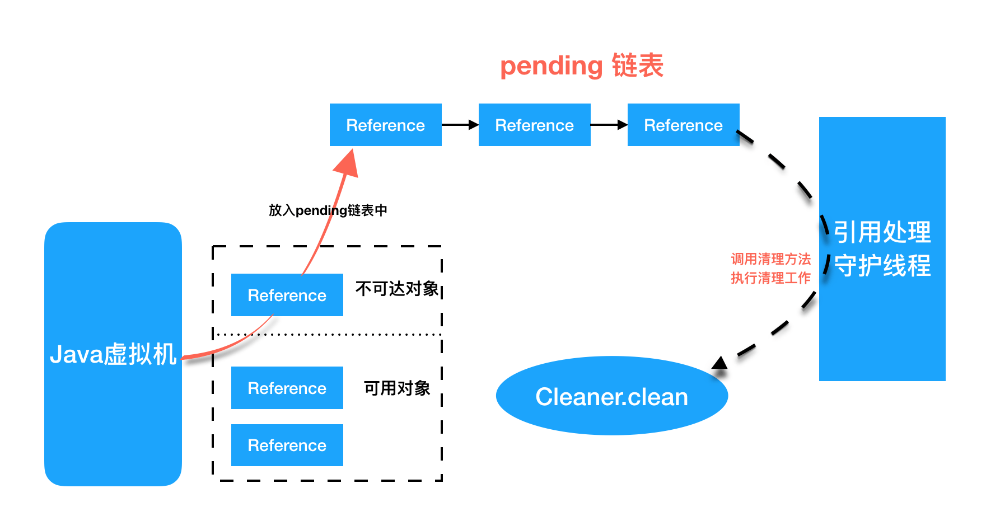

# 直接内存

[Java直接内存分配与释放原理](https://juejin.im/post/5d04ffa6e51d45599e019db0)

[美团-Java魔法类：Unsafe应用解析](https://tech.meituan.com/2019/02/14/talk-about-java-magic-class-unsafe.html)

[你不可不知的Java引用类型之——虚引用](https://www.cnblogs.com/mfrank/p/9837070.html)

[你不可不知的Java引用类型之——Reference源码解析](https://www.cnblogs.com/mfrank/p/9843489.html)

在比较两者的性能时，我们分两方面来说。

- 申请空间的耗时：堆内存比较快
- 读写的耗时：直接内存比较快

直接内存申请空间其实是比较消耗性能的，所以并不适合频繁申请。但直接内存在IO读写上的性能要优于堆内存，所以直接内存特别适合申请以后进行多次读写。

为什么在申请空间时，堆内存会更快？堆内存的申请是直接从已分配的堆空间中取一块出来使用，不经过内存申请系统调用，而直接内存的申请则需要本地方法通过系统调用完成。

而为什么在IO读写时，直接内存比较快？因为直接内存使用的是零拷贝技术。

所以直接内存一般有两个使用场景：

- 复制**很大的文件**
- 频繁的IO操作，例如**网络并发场景**

直接内存由于是直接分配在堆外的，所以不受JVM堆的大小限制。但还是会受到本机总内存（包括RAM及SWAP区或者分页文件）的大小及处理器寻址空间的限制，所以还是有可能会抛出OutOfMemoryError异常。

> 直接内存的最大大小可以通过-XX:MaxDirectMemorySize来设置，默认是64M

- 对垃圾回收停顿的改善。由于堆外内存是直接受操作系统管理而不是JVM，所以当我们使用堆外内存时，即可保持较小的堆内内存规模。从而在GC时减少回收停顿对于应用的影响。
- 提升程序I/O操作的性能。通常在I/O通信过程中，会存在堆内内存到堆外内存的数据拷贝操作，对于需要频繁进行内存间数据拷贝且生命周期较短的暂存数据，都建议存储到堆外内存。

# 直接内存的分配和释放

在Java中，分配直接内存有三种方式：

- Unsafe.allocateMemory()
- ByteBuffer.allocateDirect()
- native方法

## Unsafe

Java提供了`Unsafe`类用来进行直接内存的分配与释放：

```java
//分配内存, 相当于C++的malloc函数
public native long allocateMemory(long bytes);
//扩充内存
public native long reallocateMemory(long address, long bytes);
//释放内存
public native void freeMemory(long address);
//在给定的内存块中设置值
public native void setMemory(Object o, long offset, long bytes, byte value);
//内存拷贝
public native void copyMemory(Object srcBase, long srcOffset, Object destBase, long destOffset, long bytes);
//获取给定地址值，忽略修饰限定符的访问限制。与此类似操作还有: getInt，getDouble，getLong，getChar等
public native Object getObject(Object o, long offset);
//为给定地址设置值，忽略修饰限定符的访问限制，与此类似操作还有: putInt,putDouble，putLong，putChar等
public native void putObject(Object o, long offset, Object x);
//获取给定地址的byte类型的值（当且仅当该内存地址为allocateMemory分配时，此方法结果为确定的）
public native byte getByte(long address);
//为给定地址设置byte类型的值（当且仅当该内存地址为allocateMemory分配时，此方法结果才是确定的）
public native void putByte(long address, byte x);
```

## DirectByteBuffer类

虽然Java提供了Unsafe类用来操作直接内存的分配和释放，但Unsafe无法直接使用，需要通过反射来获取。Unsafe更像是一个底层设施。

这里有两个概念。一个是`Bits`类里面的reserveMemory，另一个是Cleaner创建的Deallocator。

其中Bits.reserveMemory()与分配相关，Cleaner、Deallocator则与内存释放相关。

DirectByteBuffer构造函数，创建DirectByteBuffer的时候，通过Unsafe.allocateMemory分配内存、Unsafe.setMemory进行内存初始化，而后构建Cleaner对象用于跟踪DirectByteBuffer对象的垃圾回收，以实现**当DirectByteBuffer被垃圾回收时，分配的堆外内存一起被释放**。

DirectByteBuffer，clear

### 构造方法

```java
DirectByteBuffer(int cap) {

    // 计算需要分配的内存大小，单位字节
    super(-1, 0, cap, cap);
    boolean pa = VM.isDirectMemoryPageAligned();
    int ps = Bits.pageSize();
    long size = Math.max(1L, (long)cap + (pa ? ps : 0));
    
    // 告诉内存管理器要分配内存
    Bits.reserveMemory(size, cap);

    long base = 0;
    try {
        // 分配内存
        base = UNSAFE.allocateMemory(size);
    } catch (OutOfMemoryError x) {
        Bits.unreserveMemory(size, cap);
        throw x;
    }
    //内存初始化
    UNSAFE.setMemory(base, size, (byte) 0);
    
    // 计算内存地址
    if (pa && (base % ps != 0)) {
        address = base + ps - (base & (ps - 1));
    } else {
        address = base;
    }
    
    // 创建Cleaner，释放直接内存
    cleaner = Cleaner.create(this, new Deallocator(base, size, cap));
    att = null;
}
```

### Bits.reserveMemory()

```java
static void reserveMemory(long size, int cap) {

    // 初始化maxMemory，就是使用-XX:MaxDirectMemorySize指定的最大直接内存大小
    if (!memoryLimitSet && VM.isBooted()) {
        maxMemory = VM.maxDirectMemory();
        memoryLimitSet = true;
    }

    // 第一次先采取最乐观的方式直接尝试告诉Bits要分配内存
    if (tryReserveMemory(size, cap)) {
        return;
    }

    final JavaLangRefAccess jlra = SharedSecrets.getJavaLangRefAccess();

    // 尝试执行Cleaner来释放直接内存，直到内存空间足够
    while (jlra.tryHandlePendingReference()) {
        if (tryReserveMemory(size, cap)) {
            return;
        }
    }

    // GC
    System.gc();

    // 按照1ms,2ms,4ms,...,256ms的等待间隔尝试9次分配内存
    boolean interrupted = false;
    try {
        long sleepTime = 1;
        int sleeps = 0;
        while (true) {
            if (tryReserveMemory(size, cap)) {
                return;
            }
            if (sleeps >= MAX_SLEEPS) {
                break;
            }
            if (!jlra.tryHandlePendingReference()) {
                try {
                    Thread.sleep(sleepTime);
                    sleepTime <<= 1;
                    sleeps++;
                } catch (InterruptedException e) {
                    interrupted = true;
                }
            }
        }

        throw new OutOfMemoryError("Direct buffer memory");

    } finally {
        if (interrupted) {
            Thread.currentThread().interrupt();
        }
    }
}


// -XX:MaxDirectMemorySize限制的是总cap，而不是真实的内存使用量，(在页对齐的情况下，真实内存使用量和总cap是不同的)
private static boolean tryReserveMemory(long size, int cap) {
    long totalCap;
    while (cap <= maxMemory - (totalCap = totalCapacity.get())) {
        if (totalCapacity.compareAndSet(totalCap, totalCap + cap)) {
            reservedMemory.addAndGet(size);
            count.incrementAndGet();
            return true;
        }
    }

    return false;
}
```

### Deallocator

```java
private static class Deallocator implements Runnable
    {
        private long address;
        private long size;
        private int capacity;

        private Deallocator(long address, long size, int capacity) {
            assert (address != 0);
            this.address = address;
            this.size = size;
            this.capacity = capacity;
        }

        public void run() {
            if (address == 0) {
                // Paranoia
                return;
            }
            // 使用unsafe释放内存
            UNSAFE.freeMemory(address);
            address = 0;
            // 利用Bits管理内存的释放，就是标记一下该内存已释放
            Bits.unreserveMemory(size, capacity);
        }

    }
```

很简单的一个Runnable，主要通过`Cleaner`来进行调度。Cleaner的数据结构为一个双向链表，采用“头插法”，每次插入新的结点是插入到“头结点”的。Cleaner继承了`PhantomReference`，其referent为DirectByteBuffer:

### Cleaner

Cleaner继承自Java四大引用类型之一的虚引用PhantomReference（众所周知，无法通过虚引用获取与之关联的对象实例，且当对象仅被虚引用引用时，在任何发生GC的时候，其均可被回收）。

通常PhantomReference与引用队列ReferenceQueue结合使用，可以实现虚引用关联对象被垃圾回收时能够进行系统通知、资源清理等功能。

如下图所示，当某个被Cleaner引用的对象将被回收时，JVM垃圾收集器会将此对象的引用放入到对象引用中的pending链表中，等待Reference-Handler进行相关处理。其中，Reference-Handler为一个拥有最高优先级的守护线程，会循环不断的处理pending链表中的对象引用，执行Cleaner的clean方法进行相关清理工作。

所以当DirectByteBuffer仅被Cleaner引用（即为虚引用）时，其可以在任意GC时段被回收。当DirectByteBuffer实例对象被回收时，在Reference-Handler线程操作中，会调用Cleaner的clean方法根据创建Cleaner时传入的Deallocator来进行堆外内存的释放。



```java
public class Cleaner extends PhantomReference<Object> {
    
    private static final ReferenceQueue<Object> dummyQueue = new ReferenceQueue();
    private static Cleaner first = null;
    private Cleaner next = null;
    private Cleaner prev = null;
    private final Runnable thunk;

    private Cleaner(Object var1, Runnable var2) {
        super(var1, dummyQueue);
        this.thunk = var2;
    }

    public static Cleaner create(Object var0, Runnable var1) {
        return var1 == null ? null : add(new Cleaner(var0, var1));
    }

}
```

这里用到了JVM的虚引用。JVM有四种引用类型，分别是：强引用，弱引用，软引用，虚引用。

PhantomReference的`get`方法总是返回`null`，因此无法访问对应的引用对象；其意义在于说明一个对象已经进入finalization阶段，可以被GC回收。

GC过程中如果发现某个对象除了只有PhantomReference引用它之外，并没有其他的地方引用它了，那将会把这个引用放到java.lang.ref.Reference.pending队列里，在GC完毕的时候通知ReferenceHandler这个守护线程去执行一些后置处理，这里是调用Cleaner的`clean`方法：


#### add

add操作就是不断地将新的Cleaner节点添加在链表头部，之后将头节点指针指向新的Cleaner

```java
private static synchronized Cleaner add(Cleaner var0) {
    if (first != null) {
        var0.next = first;
        first.prev = var0;
    }

    first = var0;
    return var0;
}
```

#### remove

remove操作就是将Cleaner节点从链表中删除

```java
private static synchronized boolean remove(Cleaner var0) {
    if (var0.next == var0) { // 已经移除，防止重复移除
        return false;
    } else {
        if (first == var0) {
            if (var0.next != null) {
                first = var0.next;
            } else {
                first = var0.prev;
            }
        }

        if (var0.next != null) {
            var0.next.prev = var0.prev;
        }

        if (var0.prev != null) {
            var0.prev.next = var0.next;
        }

        var0.next = var0;
        var0.prev = var0;
        return true;
    }
}
```


#### clean

clean操作则是移除Cleaner节点并调用Deallocator的run()方法


```java
public void clean() {
    if (remove(this)) {
        try {
            this.thunk.run();
        } catch (final Throwable var2) {
            AccessController.doPrivileged(new PrivilegedAction<Void>() {
                public Void run() {
                    if (System.err != null) {
                        (new Error("Cleaner terminated abnormally", var2)).printStackTrace();
                    }

                    System.exit(1);
                    return null;
                }
            });
        }

    }
}

```


### Reference

仔细观察可以发现，Cleaner继承了PhantomReference，其referent为DirectByteBuffer

在Reference初次加载的过程中会调用一段静态代码

这段代码中包含了两种可以调用Cleaner的方式：

- ReferenceHandler，会不停地循环调用tryHandlePending
- SharedSecrets.JavaLangRefAccess，在Bits.reserveMemory()中被调用

```java
static {
    ThreadGroup tg = Thread.currentThread().getThreadGroup();
    for (ThreadGroup tgn = tg;
         tgn != null;
         tg = tgn, tgn = tg.getParent());
    //Reference-Handler为一个拥有最高优先级的守护线程，会循环不断的处理pending链表中的对象引用，执行Cleaner的clean方法进行相关清理工作。
    Thread handler = new ReferenceHandler(tg, "Reference Handler");
    handler.setPriority(Thread.MAX_PRIORITY);
    handler.setDaemon(true);
    handler.start();

    // provide access in SharedSecrets
    SharedSecrets.setJavaLangRefAccess(new JavaLangRefAccess() {
        @Override
        public boolean tryHandlePendingReference() {
            return tryHandlePending(false);
        }
    });
}
```

事实上直接内存的回收过程也的确是由这两种方式混合组成，这两种方式有一个共同点，他们都会调用Reference.tryHandlePending()方法。

其中pending和discovered由JVM来操作，两个共同组成一个等待队列链表，对于PhantomReference的情况，当对象不存在其他引用，便会直接加入等待队列。每当等待队列中出现Cleaner，就会执行其clean()方法。

```java
//这里整个过程就是摘取pending链表的头结点，如果是Cleaner，则执行clean操作，否则进行入队处理。
static boolean tryHandlePending(boolean waitForNotify) {
    Reference<Object> r;
    Cleaner c;
    try {
        synchronized (lock) {
            if (pending != null) {
                r = pending;
                // 'instanceof' might throw OutOfMemoryError sometimes
                // so do this before un-linking 'r' from the 'pending' chain...
                c = r instanceof Cleaner ? (Cleaner) r : null;
                // unlink 'r' from 'pending' chain
                pending = r.discovered;
                r.discovered = null;
            } else {
                // The waiting on the lock may cause an OutOfMemoryError
                // because it may try to allocate exception objects.
                if (waitForNotify) {
                    lock.wait();
                }
                // retry if waited
                return waitForNotify;
            }
        }
    } catch (OutOfMemoryError x) {
        // Give other threads CPU time so they hopefully drop some live references
        // and GC reclaims some space.
        // Also prevent CPU intensive spinning in case 'r instanceof Cleaner' above
        // persistently throws OOME for some time...
        Thread.yield();
        // retry
        return true;
    } catch (InterruptedException x) {
        // retry
        return true;
    }

    // Fast path for cleaners
    if (c != null) {
        c.clean();
        return true;
    }

    ReferenceQueue<? super Object> q = r.queue;
    if (q != ReferenceQueue.NULL) q.enqueue(r);
    return true;
}
```


# Reference


reference指代引用对象本身，referent指代reference引用的对象，下文介绍会以reference，referent形式出现。

Reference类与垃圾回收是密切配合的，所以该类不能被直接子类化。简单来讲，Reference的继承类都是经过严格设计的，甚至连成员变量的先后顺序都不能改变，所以在代码中直接继承Reference类是没有任何意义的。但是可以继承Reference类的子类。

例如：Finalizer 继承自 FinalReference，Cleaner 继承自 PhantomReference

```java
//保存reference指向的对象。
private T referent;
//queue：引用对象关联的引用队列。是对象即将被回收时所要通知的队列。当对象将被回收时，reference对象( 而不是referent引用的对象 )会被放到queue里面，然后外部程序即可通过监控这个queue拿到相应的数据了。
//这里的queue( 即，ReferenceQueue对象 )名义上是一个队列，实际内部是使用单链表来表示的单向队列，可以理解为queue就是一个链表，其自身仅存储当前的head节点，后面的节点由每个reference节点通过next来保持即可。
volatile ReferenceQueue<? super T> queue;
Reference next;
/* 当处于active状态: discovered链表中下一个待处理对象
 * 当处于pending状态: pending列表中的下一个对象
 * 其它状态:   NULL
 */
transient private Reference<T> discovered;
//内部同步锁对象。用作在操作pending链表时的同步对象。注意这是一个静态对象，意味着所有Reference对象共用同一个锁。
static private class Lock { }
private static Lock lock = new Lock();
/* 用来保存那些需要被放入队列中的reference，收集器会把引用添加到这个列表里来，
 * Reference-handler线程会从中移除它们。
 * 这个列表由上面的lock对象锁进行保护。列表使用discovered字段来链接它的元素。
 */
private static Reference<Object> pending = null;
```

## 状态

> Active:
>  reference如果处于此状态，会受到垃圾处理器的特殊处理。当垃圾回收器检测到referent已经更改为合适的状态后(没有任何强引用和软引用关联)，会在某个时间将实例的状态更改为Pending或者Inactive。具体取决于实例是否在创建时注册到一个引用队列中。
>  在前一种情况下（将状态更改为Pending），他还会将实例添加到pending-Reference列表中。新创建的实例处于活动状态。
>
> Pending:
>  实例如果处于此状态，表明它是pending-Reference列表中的一个元素，等待被Reference-handler线程做入队处理。未注册引用队列的实例永远不会处于该状态。
>
> Enqueued:
>  实例如果处于此状态，表明它已经是它注册的引用队列中的一个元素，当它被从引用队列中移除时，它的状态将会变为Inactive，未注册引用队列的实例永远不会处于该状态。
>
> Inactive:
>  实例如果处于此状态，那么它就是个废实例了(滑稽)，它的状态将永远不会再改变了。

所以实例一共有四种状态，Active（活跃状态）、Pending（半死不活状态）、Enqueued（濒死状态）、Inactive（凉凉状态）。当然，Pending和Enqueued状态是引用实例在创建时注册了引用队列才会有。

一个reference处于Active状态时，表示它是活跃正常的，垃圾回收器会监视这个引用的referent，如果扫描到它没有任何强引用关联时就会进行回收判定了。

如果判定为需要进行回收，则判断其是否注册了引用队列，如果有的话将reference的状态置为pending。当reference处于pending状态时，表明已经准备将它放入引用队列中，在这个状态下要处理的对象将逐个放入queue中。在这个时间窗口期，相应的引用对象为pending状态。

当它进入到Enqueued状态时，表明已经引用实例已经被放到queue当中了，准备由外部线程来轮询获取相应信息。此时引用指向的对即将被垃圾回收器回收掉了。

当它变成Inactive状态时，表明它已经凉透了，它的生命已经到了尽头。不管你用什么方式，也救不了它了。

JVM中并没有显示定义这样的状态，而是通过next和queue来进行判断。


# ReferenceQueue

ReferenceQueue是引用队列，用于存放待回收的引用对象。

对于软引用、弱引用和虚引用，如果我们希望当一个对象被垃圾回收器回收时能得到通知，进行额外的处理，这时候就需要使用到引用队列了。

在一个对象被垃圾回收器扫描到将要进行回收时，其相应的引用包装类，即reference对象会被放入其注册的引用队列queue中。可以从queue中获取到相应的对象信息，同时进行额外的处理。比如反向操作，数据清理，资源释放等。