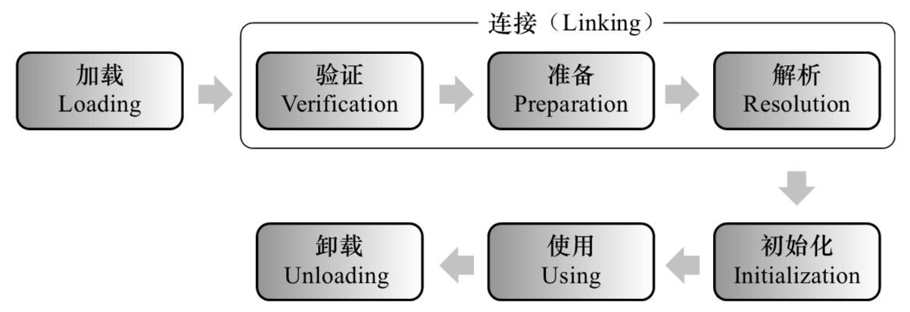
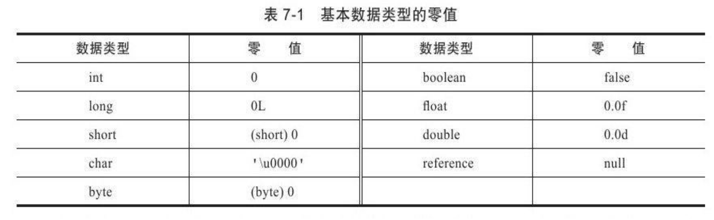
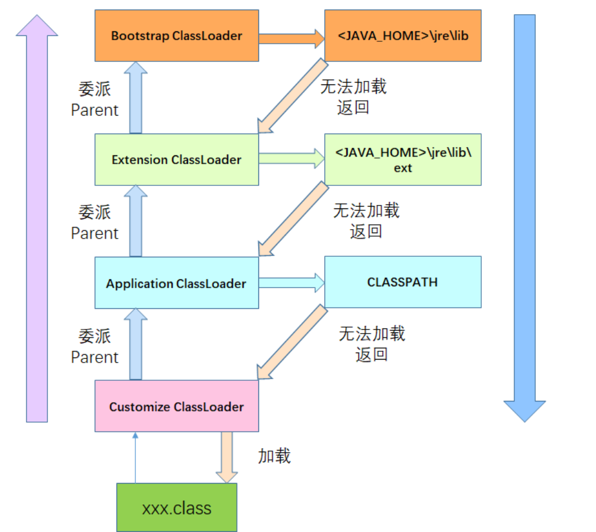

# jvm类加载机制



​										类的生命周期

## 类加载过程

### 加载

1.通过类的全限定名获取该类的二进制字节流。

2.将二进制字节流所代表的静态结构转化为方法区的运行时数据结构。

3.在内存中创建一个代表该类的 java.lang.Class 对象，作为方法区这个类的各种数据的访问入口。

​	加载阶段完成后，虚拟机外部的二进制字节流就按照虚拟机所需的格式存储在方法区之中，方法区中的数据存储格式由虚拟机实现自行定义，虚拟机规范未规定此区域的具体数据结构。 然后在内存中实例化一个java.lang.Class类的对象（并没有明确规定是在Java堆中，对于HotSpot虚拟机而言，Class对象比较特殊，它虽然是对象，但是存放在方法区里面），这个对象将作为程序访问方法区中的这些类型数据的外部接口。 


### 连接 

#### 验证

确保 Class 文件的字节流中包含的信息符合当前虚拟机的要求，并且不会危害虚拟机自身的安全。

#### 准备

​	准备阶段是正式**为类变量分配内存并设置类变量初始值**的阶段，这些变量所使用的内存都将在**方法区**中进行分配。 这个阶段中有两个容易产生混淆的概念需要强调一下，首先，这时候进行内存分配的仅包括类变量（被static修饰的变量），而不包括实例变量，实例变量将会在对象实例化时随着对象一起分配在Java堆中。 其次，这里所说的初始值“通常情况”下是数据类型的零值，假设一个类变量的定义为：
`public static int value=123；`
那变量value在准备阶段过后的初始值为0而不是123，因为这时候尚未开始执行任何Java方法，而把value赋值为123的putstatic指令是程序被编译后，存放于类构造器＜clinit＞（）方法之中，所以把value赋值为123的动作将在初始化阶段才会执行。 



```java
/**
 * 准备阶段过后的初始值为 0 而不是 123，这时候尚未开始执行任何 Java 方法
 */
public static int value = 123;

/**
 * 同时使用static final来修饰的变量（常量），并且这个变量的数据类型是基本类型或者 String 类型，就生成 ConstantValue 属性来进行初始化。所以常量必须初始化。
 * 没有 final 修饰或者并非基本类型及 String 类型，则选择在 <clinit> 方法中进行初始化。
 * 准备阶段虚拟机会根据 ConstantValue 的设置将 value 赋值为 123
 */
public static final int value = 123;
```

#### 解析

解析阶段是虚拟机将**常量池**内的**符号引用替换为直接引用**的过程，符号引用在前一章讲解Class文件格式的时候已经出现过多次，在Class文件中它CONSTANT_Class_info、CONSTANT_Fieldref_info、 CONSTANT_Methodref_info等类型的常量出现，那解析阶段中所说的直接引用与符号引用又有什么关联呢？

符号引用（Symbolic References）：符号引用以一组符号来描述所引用的目标，符号可以是任何形式的字面量，只要使用时能无歧义地定位到目标即可。 符号引用与虚拟机实现的内存布局无关，引用的目标并不一定已经加载到内存中。 各种虚拟机实现的内存布局可以各不相同，但是它们能接受的符号引用必须都是一致的，因为符号引用的字面量形式明确定义在Java虚拟机规范的Class文件格式中。

直接引用（Direct References）：直接引用可以是直接指向目标的指针、 相对偏移量或是一个能间接定位到目标的句柄。 直接引用是和虚拟机实现的内存布局相关的，同一个符号引用在不同虚拟机实例上翻译出来的直接引用一般不会相同。 如果有了直接引用，那引用的目标必定已经在内存中存在。 

### 初始化

类初始化阶段是类加载过程的最后一步，前面的类加载过程中，除了在加载阶段用户应用程序可以通过自定义类加载器参与之外，其余动作完全由虚拟机主导和控制。 到了初始化阶段，**才真正开始执行类中定义的Java程序代码（或者说是字节码）**。在准备阶段，变量已经赋过一次系统要求的初始值，而在初始化阶段，则根据程序员通
过程序制定的主观计划去初始化类变量和其他资源，或者可以从另外一个角度来表达：**初始化阶段是执行类构造器＜clinit＞（）方法的过程。** 我们在下文会讲解＜clinit＞（）方法是怎么生成的，在这里，我们先看一下＜clinit＞（）方法执行过程中一些可能会影响程序运行行为的特点和细节，这部分相对更贴近于普通的程序开发人员。 

<clinit>()：为 Class 类构造器对静态变量，静态代码块进行初始化，通常一个类对应一个，不带参数，且是 void  返回。当一个类没有静态语句块，也没有对类变量的赋值操作，那么编译器可以不为这个类生成 <clinit>() 方法

<init>()：为 Class 类实例构造器，对非静态变量解析初始化，一个类构造器对应个。

```java
public class JvmTest {

    public static JvmTest jt = new JvmTest();

    public static int a;
    public static int b = 0;

    static {
        a++;
        b++;
    }

    public JvmTest() {
        a++;
        b++;
    }

    public static void main(String[] args) {
        /**
         * 准备阶段：为 jt、a、b 分配内存并赋初始值 jt=null、a=0、b=0
         * 解析阶段：将 jt 指向内存中的地址
         * 初始化：jt 代码位置在最前面，这时候 a=1、b=1
         *          a 没有默认值，不执行，a还是1，b 有默认值，b赋值为0
         *          静态块过后，a=2、b=1
         */
        System.out.println(a);  // 输出 2
        System.out.println(b);  // 输出 1
    }
}
```

## 类加载器

[类加载器](https://www.cnblogs.com/jhxxb/p/10914456.html)

虚拟机设计团队把类加载阶段张的"通过一个类的全限定名来获取此类的二进制字节流"这个动作放到Java虚拟机外部去实现，以便让应用程序自己决定如何去获取所需要的类。实现这个动作的代码模块称为"类加载器"。类加载器虽然只用于实现类的加载动作，但它在Java程序中起到的作用却远远不限定于类加载阶段。对于任意一个类，都需要由加载它的类加载器和这个类本身一同确立其在Java虚拟机中的唯一性，每一个类加载器，都拥有一个独立的类名称空间。这句话表达地再简单一点就是：**比较两个类是否"相等"，只有在这两个类是由同一个类加载器加载的前提下才有意义**，否则即使这两个类来源于同一个.class文件，被同一个虚拟机加载，只要加载它们的类加载器不同，这两个类必定不相等。

上面说的"相等"，包括代表类的.class对象的equals()方法、isAssignableFrom()方法、isInstance()方法的返回结果，也包括使用instanceof关键字做对象所属关系判定等情况。

### 类加载器模型

从Java虚拟机的角度讲，只有两种不同的类加载器：启动类加载器Bootstrap   ClassLoader，这个类加载器是由C++语言实现的，是虚拟机自身的一部分；其他类加载器，这些类加载器都由Java语言实现，独立于虚拟机外部，并且全部继承自java.lang.ClassLoader。从开发人员的角度讲，类加载器还可以划分地更加细致一些，一张图就能说明：



关于这张图首先说两点：

1、这三个层次的类加载器并不是继承关系，而只是层次上的定义

2、它并不是一个强制性的约束模型，而是Java设计者推荐给开发者的一种类加载器实现方式

OK，然后一个一个类加载器来看：

#### 启动类加载器

**Bootstrap ClassLoader**

之前说过了这是一个嵌在JVM内核中的加载器。它负责加载的是JAVA_HOME/lib下的类库，系统类加载器无法被Java程序直接应用。

```
由 C 和 C++ 编写，是在 JVM 启动后初始化的。可在这里查看到源码（OpenJDK）：http://hg.openjdk.java.net/jdk8u/jdk8u/jdk/file/933f6b06c1cb/src/share/native/java/lang/ClassLoader.c
负责将存放在 <JAVA_HOME>\jre\lib 目录中的，或者被 -Xbootclasspath 参数所指定的路径中的，并且能被虚拟机识别的（仅按照文件名识别，如 rt.jar，名字不符合的类库即使放在 lib 目录中也不会被加载）类库加载到虚拟机内存中。
```

#### **扩展类加载器**

**Extension ClassLoader**

这个类加载器由sun.misc.Launcher$ExtClassLoader实现，它负责用于加载JAVA_HOME/lib/ext目录中的，或者被java.ext.dirs系统变量指定所指定的路径中所有类库，开发者可以直接使用扩展类加载器。java.ext.dirs系统变量所指定的路径的可以通过程序来查看

```java
public class TestMain
{
    public static void main(String[] args)
    {
        System.out.println(System.getProperty("java.ext.dirs"));
    }
}
```

运行结果

```
E:\MyEclipse10\Common\binary\com.sun.java.jdk.win32.x86_64_1.6.0.013\jre\lib\ext;C:\Windows\Sun\Java\lib\ext
```

#### 应用程序类加载器

**Application ClassLoader**

这个类加载器由sun.misc.Launcher$AppClassLoader实现。这个类也一般被称为**系统类加载器**，写个小程序看下：

```javascript
public class TestMain
{
    public static void main(String[] args)
    {
        System.out.println(ClassLoader.getSystemClassLoader());
    }
}
```

运行结果为：

```
sun.misc.Launcher$AppClassLoader@546b97fd
```

看到通过"ClassLoader.getSystemClassLoader"，得到的是sun.misc.Launcher$AppClassLoader，这也证明了JDK认为Application  ClassLoader是系统类加载器。顺便根据类加载器模型，打印一下这个类的父加载器：

```java
public class TestMain
{
    public static void main(String[] args)
    {
        System.out.println(ClassLoader.getSystemClassLoader().getParent());
    }
}
```

运行结果为：

```
sun.misc.Launcher$ExtClassLoader@535ff48b
```

看出Application ClassLoader的父加载器确实是Extension ClassLoader，符合图中的模型。那么再打印父加载器呢？按照我们的想法应该是Bootstrap ClassLoader了，看下是不是：

```java
public class TestMain
{
    public static void main(String[] args)
    {
        System.out.println(ClassLoader.getSystemClassLoader().getParent().getParent());
    }
}
```

运行结果为：

```
null
```

这会打印出来的是null了。其实也很好理解，Bootstrap  ClassLoader以外的ClassLoader都是Java实现的，因此这些ClassLoader势必在Java堆中有一份实例在，所以Extension  ClassLoader和Application ClassLoader都能打印出内容来。但是Bootstrap  ClassLoader是JVM的一部分，是用C/C++写的，不属于Java，自然在Java堆中也没有自己的空间，所以就返回null了。所以，**如果ClassLoader得到的是null，那么表示的ClassLoader就是Bootstrap ClassLoader**。

另外要说很重要的一点，反编译一下rt.jar，找到sun.misc.Launcher看一下Application ClassLoader的实现：

```java
 1 static class AppClassLoader extends URLClassLoader
 2   {
 3     public static ClassLoader getAppClassLoader(final ClassLoader paramClassLoader)
 4       throws IOException
 5     {
 6       String str = System.getProperty("java.class.path");
 7       final File[] arrayOfFile = str == null ? new File[0] : Launcher.getClassPath(str);
 8       return (ClassLoader)AccessController.doPrivileged(new PrivilegedAction()
 9       {
10         public Launcher.AppClassLoader run()
11         {
12           URL[] arrayOfURL = this.val$s == null ? new URL[0] : Launcher.pathToURLs(arrayOfFile);
13           return new Launcher.AppClassLoader(arrayOfURL, paramClassLoader);
14         }
15       });
16     }
```

重点就在第6行，Application ClassLoader只会加载java.class.path下的.class文件，java.class.path代表的是什么路径？打印一下：

```java
public class TestMain
{
    public static void main(String[] args)
    {
        System.out.println(System.getProperty("java.class.path"));
    }
}
```

运行结果为：

```
F:\代码\MyEclipse\TestArticle\bin;F:\学习\第三方jar包\XStream\xstream-1.4.jar;F:\学习\第三方jar包\XStream\kxml2.jar
```

我这里有添加两个.jar到CLASSPATH下。那也可以下一个重要的结论了：

**Application ClassLoader只能加载项目bin目录下的.class文件**。


### 双亲委派

最后讲一下双亲委派模型，其实上面的类加载器模型图就是一个双亲委派模式的图，这里把它再讲清楚一点。

双亲委派模型是在JDK1.2期间被引入的，其工作过程可以分为两步：

1、**如果一个类加载器收到了类加载的请求，它首先不会自己去尝试加载这个类，而是把这个请求委派给父类加载器去完成，每一个层次的类加载器都是如此。**

2、**只有当父加载器反馈自己无法完成这这个加载请求（它的搜索范围中没有找到所需的类）时，子加载器才会尝试自己去加载**

所以，其实所有的加载请求最终都应该传送到顶层的启动类加载器中。双亲委派模型对于Java程序的稳定运作很重要，因为Java类随着它的加载器一起具备了一种带有优先级的层次关系。例如java.lang.Object，存放于rt.jar中，无论哪一个类加载器要去加载这个类，最终都是由Bootstrap   ClassLoader去加载，因此Object类在程序的各种类加载器环境中都是一个类。相反，如果没有双亲委派模型，由各个类自己去加载的话，如果用户自己编写了一个java.lang.Object，并放在CLASSPATH下，那系统中将会出现多个不同的Object类，Java体系中最基础的行为也将无法保证，应用程序也将会变得一片混乱。