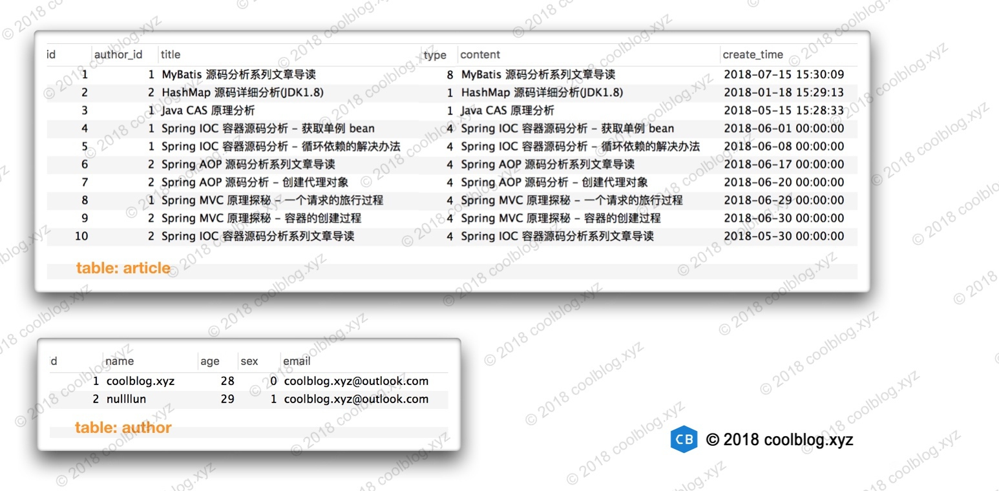
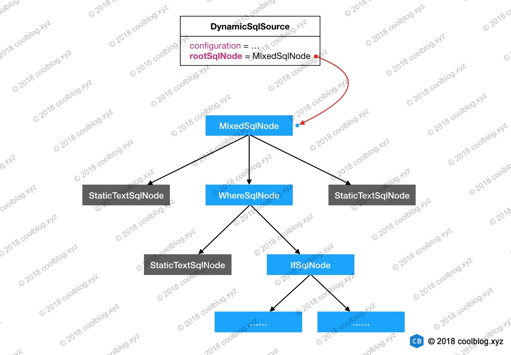

# MyBatis源码学习

[MyBatis官方文档](https://mybatis.org/mybatis-3/zh/index.html)

[MyBatis源码分析](https://www.tianxiaobo.com/categories/java-framework/mybatis/)


## 1.入门学习

### 1.1 使用JDBC访问数据库

```java
public class MySQLDemo {
 
    // MySQL 8.0 以下版本 - JDBC 驱动名及数据库 URL
    static final String JDBC_DRIVER = "com.mysql.jdbc.Driver";  
    static final String DB_URL = "jdbc:mysql://localhost:3306/RUNOOB";
 
    // MySQL 8.0 以上版本 - JDBC 驱动名及数据库 URL
    //static final String JDBC_DRIVER = "com.mysql.cj.jdbc.Driver";  
    //static final String DB_URL = "jdbc:mysql://localhost:3306/RUNOOB?useSSL=false&serverTimezone=UTC";
    
    static final String USER = "root";
    static final String PASS = "123456";
 
    public static void main(String[] args) {
        Connection conn = null;
        Statement stmt = null;
        try{
            // 1.加载 JDBC 驱动
            Class.forName(JDBC_DRIVER);
        
            // 2.获取连接
            System.out.println("连接数据库...");
            conn = DriverManager.getConnection(DB_URL,USER,PASS);
        
            // 3.执行查询
            System.out.println(" 实例化Statement对象...");
            stmt = conn.createStatement();
            String sql;
            sql = "SELECT id, name, url FROM websites";
            ResultSet rs = stmt.executeQuery(sql);
        
            // 4.处理结果集数据库
            while(rs.next()){
                int id  = rs.getInt("id");
                String name = rs.getString("name");
                String url = rs.getString("url");
                System.out.print("ID: " + id);
                System.out.print(", 站点名称: " + name);
                System.out.print(", 站点 URL: " + url);
                System.out.print("\n");
            }
        }catch(Exception e){
            e.printStackTrace();
        }finally{
            // 5.关闭资源
            try{
                if(stmt!=null) stmt.close();
            }catch(SQLException se2){
            }
            try{
                if(conn!=null) conn.close();
            }catch(SQLException se){
                se.printStackTrace();
            }
        }
        System.out.println("Goodbye!");
    }
}
```

jdbc流程比较繁琐，开发一般只需要注意执行sql和获取结果的操作，可用通过封装将多余的步骤封装起来，可用解决代码繁琐冗余的问题。但是jdbc需要拼接sql，容易出错，改动起来也比较麻烦，降低代码的可读性，难以维护，还有处理结果集也非常麻烦，如果字段属性多，非常浪费时间，还要手动关闭连接。


### 1.2 使用Hibernate访问数据库

在 Java 中，就持久层框架来说， MyBatis 和 Hibernate 都是很热门的框架。关于这两个框架孰好孰坏，在网上也有很广泛的讨论。这两个框架之间的区别比较大，下面我们来聊聊。从映射关系上来说， Hibernate 是把实体类（ POJO）和表进行了关联，是一种完整的**ORM(O/Rmapping)框架**。而 MyBatis 则是将数据访问接口（ Dao）与 SQL 进行了关联，本质上算是一种 **SQL 映射**。从使用的角度来说，使用 Hibernate 通常不需要写 SQL，让框架自动生成就即可。但 MyBatis 则不行，再简单的数据库访问操作都需要有与之对应的 SQL。另一方面，由于 Hibernate 可自动生成 SQL，所以进行数据库移植时，代价要小一点。而由于使用 MyBatis 需要手写 SQL， 加之 SQL 方言的存在。这就导致在进行数据库移植时， 出现SQL 无法正常使用的情况，此时需要根据 SQL 方言修改 SQL。 不过好在移植数据库的情况很少见， 这个差异可以忽略。

上面从两个维度对 Hibernate 和 MyBatis 进行了对比，但目前也只是说了他们的一些不同点。下面我们来分析一下这两个框架的适用场景。Hibernate 可自动生成 SQL，降低使用成本。但同时也要意识到，这样做也是有代价的，会损失灵活性。比如，如果当我们需要手动优化 SQL 时， 会发现很难改变 Hibernate 自动生成的 SQL。因此对于 Hibernate 来说，它适用于一些需求比较稳定，变化比较小的项目，譬如 OA、 CRM 等。

与 Hibernate 相反， MyBatis 需要手动维护 SQL，这会增加使用成本。但同时，使用者可灵活控制 SQL 的行为，这为改动和优化 SQL 提供了便利性。所以 MyBatis 适合应用在一些需要快速迭代，需求变化大的项目中，这也就是为什么 MyBatis 在互联网公司中使用的比较广泛的原因。除此之外， MyBatis 还提供了插件机制，使用者可以按需定制插件。这也是MyBatis 灵活性的一个体现。


### 1.3 使用mybatis访问数据

#### 1.3.1 mybatis执行流程

1. 读取配置文件

2. 创建 SqlSessionFactoryBuilder 对象

3. 通过 SqlSessionFactoryBuilder 对象创建 SqlSessionFactory

4. 通过 SqlSessionFactory 创建 SqlSession

5. 为 Dao 接口生成代理类

6. 调用接口方法访问数据库

   

#### 1.3.2 单独使用mybatis

本节演示的场景是个人网站的作者和文章之间的关联场景。在一个网站中，一篇文章对应一名作者，一个作者对应多篇文章。下面我们来看一下`作者`和`文章`的定义，如下：

```java
public class AuthorDO implements Serializable {
    private Integer id;
    private String name;
    private Integer age;
    private SexEnum sex;
    private String email;
    private List<ArticleDO> articles;

    // 省略 getter/setter 和 toString
}

public class ArticleDO implements Serializable {
    private Integer id;
    private String title;
    private ArticleTypeEnum type;
    private AuthorDO author;
    private String content;
    private Date createTime;

    // 省略 getter/setter 和 toString
}
```

如上，AuthorDO 中包含了对一组 ArticleDO 的引用，这是一对多的关系。ArticleDO 中则包含了一个对 AuthorDO 的引用，这是一对一的关系。除此之外，这里使用了两个常量，一个用于表示性别，另一个用于表示文章类型，它们的定义如下：

```java
public enum SexEnum {
    MAN,
    FEMALE,
    UNKNOWN;
}

public enum ArticleTypeEnum {
    JAVA(1),
    DUBBO(2),
    SPRING(4),
    MYBATIS(8);

    private int code;

    ArticleTypeEnum(int code) {
        this.code = code;
    }

    public int code() {
        return code;
    }

    public static ArticleTypeEnum find(int code) {
        for (ArticleTypeEnum at : ArticleTypeEnum.values()) {
            if (at.code == code) {
                return at;
            }
        }

        return null;
    }
}
```

本篇文章使用了两张表，分别用于存储文章和作者信息。这两种表的内容如下：



下面来看一下数据库访问层的接口定义，如下：

```java
public interface ArticleDao {
    ArticleDO findOne(@Param("id") int id);
}

public interface AuthorDao {
    AuthorDO findOne(@Param("id") int id);
}
```

与这两个接口对应的 SQL 被配置在了下面的两个映射文件中。我们先来看一下第一个映射文件 AuthorMapper.xml 的内容。

```java
<!-- AuthorMapper.xml -->
<mapper namespace="xyz.coolblog.dao.AuthorDao">

    <resultMap id="articleResult" type="Article">
        <id property="id" column="article_id" />
        <result property="title" column="title"/>
        <result property="type" column="type"/>
        <result property="content" column="content"/>
        <result property="createTime" column="create_time"/>
    </resultMap>

    <resultMap id="authorResult" type="Author">
        <id property="id" column="id"/>
        <result property="name" column="name"/>
        <result property="age" column="age"/>
        <result property="sex" column="sex" typeHandler="org.apache.ibatis.type.EnumOrdinalTypeHandler"/>
        <result property="email" column="email"/>
        <collection property="articles" ofType="Article" resultMap="articleResult"/>
    </resultMap>

    <select id="findOne" resultMap="authorResult">
        SELECT
            au.id, au.name, au.age, au.sex, au.email,
            ar.id as article_id, ar.title, ar.type, ar.content, ar.create_time
        FROM
            author au, article ar
        WHERE
            au.id = ar.author_id AND au.id = #{id}
    </select>
</mapper>
```

注意看上面的`<resultMap/>`配置，这个标签中包含了一个一对多的配置`<collection/>`，这个配置引用了一个 id 为`articleResult`的。除了要注意一对多的配置，这里还要下面这行配置：

```java
<result property="sex" column="sex" typeHandler="org.apache.ibatis.type.EnumOrdinalTypeHandler"/>
```

前面说过 AuthorDO 的`sex`属性是一个枚举，但这个属性在数据表中是以整型值进行存储的。所以向数据表写入或者查询数据时，要进行类型转换。写入时，需要将`SexEnum`转成`int`。查询时，则需要把`int`转成`SexEnum`。由于这两个是完全不同的类型，不能通过强转进行转换，所以需要使用一个中间类进行转换，这个中间类就是 `EnumOrdinalTypeHandler`。这个类会按照枚举顺序进行转换，比如在`SexEnum`中，`MAN`的顺序是`0`。存储时，EnumOrdinalTypeHandler 会将`MAN`替换为`0`。查询时，又会将`0`转换为`MAN`。除了`EnumOrdinalTypeHandler`，MyBatis 还提供了另一个枚举类型处理器`EnumTypeHandler`。这个则是按照枚举的字面值进行转换，比如该处理器将枚举`MAN`和字符串 “MAN” 进行相互转换。

上面简单分析了一下枚举类型处理器，接下来，继续往下看。下面是 ArticleMapper.xml 的配置内容：

```java
<!-- ArticleMapper.xml -->
<mapper namespace="xyz.coolblog.dao.ArticleDao">

    <resultMap id="authorResult" type="Author">
        <id property="id" column="author_id"/>
        <result property="name" column="name"/>
        <result property="age" column="age"/>
        <result property="sex" column="sex" typeHandler="org.apache.ibatis.type.EnumOrdinalTypeHandler"/>
        <result property="email" column="email"/>
    </resultMap>

    <resultMap id="articleResult" type="Article">
        <id property="id" column="id" />
        <result property="title" column="title"/>
        <result property="type" column="type" typeHandler="xyz.coolblog.mybatis.ArticleTypeHandler"/>
        <result property="content" column="content"/>
        <result property="createTime" column="create_time"/>
        <association property="author" javaType="Author" resultMap="authorResult"/>
    </resultMap>

    <select id="findOne" resultMap="articleResult">
        SELECT
            ar.id, ar.author_id, ar.title, ar.type, ar.content, ar.create_time,
            au.name, au.age, au.sex, au.email
        FROM
            article ar, author au
        WHERE
            ar.author_id = au.id AND ar.id = #{id}
    </select>
</mapper>
```

如上，ArticleMapper.xml 中包含了一个一对一的配置`<association/>`，这个配置引用了另一个 id 为`authorResult`的。除了一对一的配置外，这里还有一个自定义类型处理器`ArticleTypeHandler`需要大家注意。这个自定义类型处理器用于处理`ArticleTypeEnum`枚举类型。大家如果注意看前面贴的`ArticleTypeEnum`的源码，会发现每个枚举值有自己的编号定义。比如`JAVA`的编号为`1`，`DUBBO`的编号为`2`，`SPRING`的编号为`8`。所以这里我们不能再使用`EnumOrdinalTypeHandler`对`ArticleTypeHandler`进行类型转换，需要自定义一个类型转换器。那下面我们来看一下这个类型转换器的定义。

```java
public class ArticleTypeHandler extends BaseTypeHandler<ArticleTypeEnum> {

    @Override
    public void setNonNullParameter(PreparedStatement ps, int i, ArticleTypeEnum parameter, JdbcType jdbcType)
        throws SQLException {
        // 获取枚举的 code 值，并设置到 PreparedStatement 中
        ps.setInt(i, parameter.code());
    }

    @Override
    public ArticleTypeEnum getNullableResult(ResultSet rs, String columnName) throws SQLException {
        // 从 ResultSet 中获取 code
        int code = rs.getInt(columnName);
        // 解析 code 对应的枚举，并返回
        return ArticleTypeEnum.find(code);
    }

    @Override
    public ArticleTypeEnum getNullableResult(ResultSet rs, int columnIndex) throws SQLException {
        int code = rs.getInt(columnIndex);
        return ArticleTypeEnum.find(code);
    }

    @Override
    public ArticleTypeEnum getNullableResult(CallableStatement cs, int columnIndex) throws SQLException {
        int code = cs.getInt(columnIndex);
        return ArticleTypeEnum.find(code);
    }
}
```

对于自定义类型处理器，可继承 BaseTypeHandler，并实现相关的抽象方法。上面的代码比较简单，我也进行了一些注释。应该比较好理解，这里就不多说了。

前面贴了实体类，数据访问类，以及 SQL 映射文件。最后还差一个 MyBatis 的配置文件，这里贴出来。如下：

```
<!-- mybatis-congif.xml -->
<configuration>
    <properties resource="jdbc.properties"/>

    <typeAliases>
        <typeAlias alias="Article" type="xyz.coolblog.model.ArticleDO"/>
        <typeAlias alias="Author" type="xyz.coolblog.model.AuthorDO"/>
    </typeAliases>

    <typeHandlers>
        <typeHandler handler="xyz.coolblog.mybatis.ArticleTypeHandler" javaType="xyz.coolblog.constant.ArticleTypeEnum"/>
    </typeHandlers>

    <environments default="development">
        <environment id="development">
            <transactionManager type="JDBC"/>
            <dataSource type="POOLED">
                <property name="driver" value="${jdbc.driver}"/>
                <property name="url" value="${jdbc.url}"/>
                <property name="username" value="${jdbc.username}"/>
                <property name="password" value="${jdbc.password}"/>
            </dataSource>
        </environment>
    </environments>

    <mappers>
        <mapper resource="mapper/AuthorMapper.xml"/>
        <mapper resource="mapper/ArticleMapper.xml"/>
    </mappers>
</configuration>
```

下面通过一个表格简单解释配置中出现的一些标签。

| 标签名称     | 用途                                                         |
| :----------- | :----------------------------------------------------------- |
| properties   | 用于配置全局属性，这样在配置文件中，可以通过占位符 ${} 进行属性值配置 |
| typeAliases  | 用于定义别名。如上所示，这里把`xyz.coolblog.model.ArticleDO`的别名定义为`Article`，这样在 SQL 映射文件中，就可以直接使用别名，而不用每次都输入长长的全限定类名了 |
| typeHandlers | 用于定义全局的类型处理器，如果这里配置了，SQL 映射文件中就不需要再次进行配置。前面为了讲解需要，我在 SQL 映射文件中也配置了 ArticleTypeHandler，其实是多余的 |
| environments | 用于配置事务，以及数据源                                     |
| mappers      | 用于配置 SQL 映射文件的位置信息                              |

以上仅介绍了一些比较常用的配置，更多的配置信息，建议大家去阅读[MyBatis 官方文档](http://www.mybatis.org/mybatis-3/zh/index.html)。

到这里，我们把所有的准备工作都做完了。那么接下来，写点测试代码测试一下。

```java
public class MyBatisTest {

    private SqlSessionFactory sqlSessionFactory;

    @Before
    public void prepare() throws IOException {
        String resource = "mybatis-config.xml";
        InputStream inputStream = Resources.getResourceAsStream(resource);
        sqlSessionFactory = new SqlSessionFactoryBuilder().build(inputStream);
        inputStream.close();
    }
    
    @Test
    public void testOne2One() {
        SqlSession session = sqlSessionFactory.openSession();
        try {
            ArticleDao articleDao = session.getMapper(ArticleDao.class);
            ArticleDO article = articleDao.findOne(1);

            AuthorDO author = article.getAuthor();
            article.setAuthor(null);

            System.out.println();
            System.out.println("author info:");
            System.out.println(author);
            System.out.println();
            System.out.println("articles info:");
            System.out.println(article);
        } finally {
            session.close();
        }
    }

    @Test
    public void testOne2Many() {
        SqlSession session = sqlSessionFactory.openSession();
        try {
            AuthorDao authorDao = session.getMapper(AuthorDao.class);
            AuthorDO author = authorDao.findOne(1);

            List<ArticleDO> arts = author.getArticles();
            List<ArticleDO> articles = Arrays.asList(arts.toArray(new ArticleDO[arts.size()]));
            arts.clear();

            System.out.println();
            System.out.println("author info:");
            System.out.println(author);
            System.out.println();
            System.out.println("articles info:");
            articles.forEach(System.out::println);
        } finally {
            session.close();
        }
    }
}
```

第一个测试方法用于从数据库中查询某篇文章，以及相应作者的信息。它的运行结果如下：


第二个测试方法用于查询某位作者，及其所写的所有文章的信息。它的运行结果如下：


到此，MyBatis 的使用方法就介绍完了。由于我个人在平时的工作中，也知识使用了 MyBatis 的一些比较常用的特性，所以本节的内容也比较浅显。另外，由于演示示例比较简单，这里也没有演示 MyBatis 比较重要的一个特性 – `动态 SQL`。除了以上所述，有些特性由于没有比较好的场景去演示，这里也就不介绍了。比如 MyBatis 的插件机制，缓存等。对于一些较为生僻的特性，比如对象工厂，鉴别器。如果不是因为阅读了 MyBatis 的文档和一些书籍，我还真不知道它们的存在，孤陋寡闻了。所以，对于这部分特性，本文也不会进行说明。

综上所述，本节所演示的是一个比较简单的示例，并非完整示例，望周知。

#### 1.3.3 spring中使用mybatis


## 2.配置文件解析

### 2.1 简介

在单独使用 MyBatis 时，第一步要做的事情就是根据配置文件构建`SqlSessionFactory`对象。相关代码如下：

```java
String resource = "mybatis-config.xml";
InputStream inputStream = Resources.getResourceAsStream(resource);
SqlSessionFactory sqlSessionFactory = new SqlSessionFactoryBuilder().build(inputStream);
```

首先，我们使用 MyBatis 提供的工具类 Resources 加载配置文件，得到一个输入流。然后再通过 SqlSessionFactoryBuilder 对象的`build`方法构建 SqlSessionFactory 对象。所以这里的 build 方法是我们分析配置文件解析过程的入口方法。那下面我们来看一下这个方法的代码：

```java
// -☆- SqlSessionFactoryBuilder
public SqlSessionFactory build(InputStream inputStream) {
    // 调用重载方法
    return build(inputStream, null, null);
}

public SqlSessionFactory build(InputStream inputStream, String environment, Properties properties) {
    try {
        // 创建配置文件解析器
        XMLConfigBuilder parser = new XMLConfigBuilder(inputStream, environment, properties);
        // 调用 parse 方法解析配置文件，生成 Configuration 对象
        return build(parser.parse());
    } catch (Exception e) {
        throw ExceptionFactory.wrapException("Error building SqlSession.", e);
    } finally {
        ErrorContext.instance().reset();
        try {
        inputStream.close();
        } catch (IOException e) {
        // Intentionally ignore. Prefer previous error.
        }
    }
}

public SqlSessionFactory build(Configuration config) {
    // 创建 DefaultSqlSessionFactory
    return new DefaultSqlSessionFactory(config);
}
```

从上面的代码中，我们大致可以猜出 MyBatis 配置文件是通过`XMLConfigBuilder`进行解析的。不过目前这里还没有非常明确的解析逻辑，所以我们继续往下看。这次来看一下 XMLConfigBuilder 的`parse`方法，如下：

```java
// -☆- XMLConfigBuilder
public Configuration parse() {
    if (parsed) {
        throw new BuilderException("Each XMLConfigBuilder can only be used once.");
    }
    parsed = true;
    // 解析配置
    parseConfiguration(parser.evalNode("/configuration"));
    return configuration;
}
```

到这里大家可以看到一些端倪了，注意一个 xpath 表达式 - `/configuration`。这个表达式代表的是 MyBatis 的`<configuration/>`标签，这里选中这个标签，并传递给`parseConfiguration`方法。我们继续跟下去。

```java
private void parseConfiguration(XNode root) {
    try {
        // 解析 properties 配置
        propertiesElement(root.evalNode("properties"));

        // 解析 settings 配置，并将其转换为 Properties 对象
        Properties settings = settingsAsProperties(root.evalNode("settings"));

        // 加载 vfs
        loadCustomVfs(settings);

        // 解析 typeAliases 配置
        typeAliasesElement(root.evalNode("typeAliases"));

        // 解析 plugins 配置
        pluginElement(root.evalNode("plugins"));

        // 解析 objectFactory 配置
        objectFactoryElement(root.evalNode("objectFactory"));

        // 解析 objectWrapperFactory 配置
        objectWrapperFactoryElement(root.evalNode("objectWrapperFactory"));

        // 解析 reflectorFactory 配置
        reflectorFactoryElement(root.evalNode("reflectorFactory"));

        // settings 中的信息设置到 Configuration 对象中
        settingsElement(settings);

        // 解析 environments 配置
        environmentsElement(root.evalNode("environments"));

        // 解析 databaseIdProvider，获取并设置 databaseId 到 Configuration 对象
        databaseIdProviderElement(root.evalNode("databaseIdProvider"));

        // 解析 typeHandlers 配置
        typeHandlerElement(root.evalNode("typeHandlers"));

        // 解析 mappers 配置
        mapperElement(root.evalNode("mappers"));
    } catch (Exception e) {
        throw new BuilderException("Error parsing SQL Mapper Configuration. Cause: " + e, e);
    }
}
```

到此，一个 MyBatis 的解析过程就出来了，每个配置的解析逻辑都封装在了相应的方法中。

### 2.2 解析 properties 配置

解析`properties`节点是由`propertiesElement`这个方法完成的，该方法的逻辑比较简单。在分析方法源码前，先来看一下 properties 节点的配置内容。如下：

```xml
<properties resource="jdbc.properties">
    <property name="jdbc.username" value="coolblog"/>
    <property name="hello" value="world"/>
</properties>
```

在上面的配置中，我为 properties 节点配置了一个 resource 属性，以及两个子节点。下面我们参照上面的配置，来分析一下 propertiesElement 的逻辑。相关分析如下。

```java
// -☆- XMLConfigBuilder
private void propertiesElement(XNode context) throws Exception {
    if (context != null) {
        // 解析 propertis 的子节点，并将这些节点内容转换为属性对象 Properties
        Properties defaults = context.getChildrenAsProperties();
        // 获取 propertis 节点中的 resource 和 url 属性值
        String resource = context.getStringAttribute("resource");
        String url = context.getStringAttribute("url");

        // 两者都不用空，则抛出异常
        if (resource != null && url != null) {
            throw new BuilderException("The properties element cannot specify both a URL and a resource based property file reference.  Please specify one or the other.");
        }
        if (resource != null) {
            // 从文件系统中加载并解析属性文件
            defaults.putAll(Resources.getResourceAsProperties(resource));
        } else if (url != null) {
            // 通过 url 加载并解析属性文件
            defaults.putAll(Resources.getUrlAsProperties(url));
        }
        Properties vars = configuration.getVariables();
        if (vars != null) {
            defaults.putAll(vars);
        }
        parser.setVariables(defaults);
        // 将属性值设置到 configuration 中
        configuration.setVariables(defaults);
    }
}

public Properties getChildrenAsProperties() {
    Properties properties = new Properties();
    // 获取并遍历子节点
    for (XNode child : getChildren()) {
        // 获取 property 节点的 name 和 value 属性
        String name = child.getStringAttribute("name");
        String value = child.getStringAttribute("value");
        if (name != null && value != null) {
            // 设置属性到属性对象中
            properties.setProperty(name, value);
        }
    }
    return properties;
}

// -☆- XNode
public List<XNode> getChildren() {
    List<XNode> children = new ArrayList<XNode>();
    // 获取子节点列表
    NodeList nodeList = node.getChildNodes();
    if (nodeList != null) {
        for (int i = 0, n = nodeList.getLength(); i < n; i++) {
            Node node = nodeList.item(i);
            if (node.getNodeType() == Node.ELEMENT_NODE) {
                // 将节点对象封装到 XNode 中，并将 XNode 对象放入 children 列表中
                children.add(new XNode(xpathParser, node, variables));
            }
        }
    }
    return children;
}
```

上面是 properties 节点解析的主要过程，不是很复杂。主要包含三个步骤，**一是解析 properties 节点的子节点，并将解析结果设置到 Properties 对象中。二是从文件系统或通过网络读取属性配置，这取决于 properties 节点的 resource 和 url 是否为空。**第二步对应的代码比较简单，这里就不分析了。有兴趣的话，大家可以自己去看看。**最后一步则是将解析出的属性对象设置到 XPathParser 和 Configuration 对象中**。

需要注意的是，propertiesElement 方法是先解析 properties 节点的子节点内容，后再从文件系统或者网络读取属性配置，并将所有的属性及属性值都放入到 defaults 属性对象中。这就会存在同名属性覆盖的问题，也就是从文件系统，或者网络上读取到的属性及属性值会覆盖掉 properties 子节点中同名的属性和及值。比如上面配置中的`jdbc.properties`内容如下：

```
jdbc.driver=com.mysql.cj.jdbc.Driver
jdbc.url=jdbc:mysql://localhost:3306/myblog?...
jdbc.username=root
jdbc.password=1234
```

与 properties 子节点内容合并后，结果如下：


如上，原`jdbc.username`值为`coolblog`，现在被覆盖为了`root`。同名属性覆盖的问题需要大家注意一下，其他的就没什么了，继续往下分析。

###  2.3 解析 settings 配置

####  2.3.1 settings 节点的解析过程

settings 相关配置是 MyBatis 中非常重要的配置，这些配置用于调整 MyBatis 运行时的行为。settings 配置繁多，在对这些配置不熟悉的情况下，保持默认配置即可。关于 settings 相关配置，MyBatis 官网上进行了比较详细的描述，大家可以去了解一下。在本节中，暂时还用不到这些配置，所以即使不了解这些配置也没什么关系。下面先来看一个比较简单的配置，如下：

```xml
<settings>
    <setting name="cacheEnabled" value="true"/>
    <setting name="lazyLoadingEnabled" value="true"/>
    <setting name="autoMappingBehavior" value="PARTIAL"/>
</settings>
```

接下来，对照上面的配置，来分析源码。如下：

```java
// -☆- XMLConfigBuilder
private Properties settingsAsProperties(XNode context) {
    if (context == null) {
        return new Properties();
    }
    // 获取 settings 子节点中的内容，getChildrenAsProperties 方法前面已分析过，这里不再赘述
    Properties props = context.getChildrenAsProperties();

    // 创建 Configuration 类的“元信息”对象
    MetaClass metaConfig = MetaClass.forClass(Configuration.class, localReflectorFactory);
    for (Object key : props.keySet()) {
        // 检测 Configuration 中是否存在相关属性，不存在则抛出异常
        if (!metaConfig.hasSetter(String.valueOf(key))) {
            throw new BuilderException("The setting " + key + " is not known.  Make sure you spelled it correctly (case sensitive).");
        }
    }
    return props;
}
```

如上，settingsAsProperties 方法看起来并不复杂，不过这是一个假象。在上面的代码中出现了一个陌生的类`MetaClass`，这个类是用来做什么的呢？答案是用来解析目标类的一些元信息，比如类的成员变量，getter/setter 方法等。关于这个类的逻辑，待会我会详细解析。接下来，简单总结一下上面代码的逻辑。如下：

1. 解析 settings 子节点的内容，并将解析结果转成 Properties 对象
2. 为 Configuration 创建`元信息`对象
3. 通过 MetaClass 检测 Configuration 中是否存在某个属性的 setter 方法，不存在则抛异常
4. 若通过 MetaClass 的检测，则返回 Properties 对象，方法逻辑结束

下面，我们来重点关注一下第2步和第3步的流程。这两步流程对应的代码较为复杂，需要一点耐心阅读。好了，下面开始分析。

####  2.3.2 元信息对象创建过程

元信息类`MetaClass`的构造方法为私有类型，所以不能直接创建，必须使用其提供的`forClass`方法进行创建。它的创建逻辑如下：

```java
public class MetaClass {
    private final ReflectorFactory reflectorFactory;
    private final Reflector reflector;

    private MetaClass(Class<?> type, ReflectorFactory reflectorFactory) {
        this.reflectorFactory = reflectorFactory;
        // 根据类型创建 Reflector
        this.reflector = reflectorFactory.findForClass(type);
    }

    public static MetaClass forClass(Class<?> type, ReflectorFactory reflectorFactory) {
        // 调用构造方法
        return new MetaClass(type, reflectorFactory);
    }

    // 省略其他方法
}
```

上面的代码看起来很简单，不过这只是冰山一角。上面代码出现了两个新的类`ReflectorFactory`和`Reflector`，MetaClass 通过引入这些新类帮助它完成功能。下面我们看一下`hasSetter`方法的源码就知道是怎么回事了。

```java
// -☆- MetaClass
public boolean hasSetter(String name) {
    // 属性分词器，用于解析属性名
    PropertyTokenizer prop = new PropertyTokenizer(name);
    // hasNext 返回 true，则表明 name 是一个复合属性，后面会进行分析
    if (prop.hasNext()) {
        // 调用 reflector 的 hasSetter 方法
        if (reflector.hasSetter(prop.getName())) {
            // 为属性创建创建 MetaClass
            MetaClass metaProp = metaClassForProperty(prop.getName());
            // 再次调用 hasSetter
            return metaProp.hasSetter(prop.getChildren());
        } else {
            return false;
        }
    } else {
        // 调用 reflector 的 hasSetter 方法
        return reflector.hasSetter(prop.getName());
    }
}
```

从上面的代码中，我们可以看出 MetaClass 中的 hasSetter 方法最终调用了 Reflector 的 hasSetter 方法。关于 Reflector 的 hasSetter 方法，这里先不分析，Reflector 这个类的逻辑较为复杂，本节会在随后进行详细说明。下面来简单介绍一下上面代码中出现的几个类：

1. ReflectorFactory -> 顾名思义，Reflector 的工厂类，兼有缓存 Reflector 对象的功能
2. Reflector -> 反射器，用于解析和存储目标类中的元信息
3. PropertyTokenizer -> 属性名分词器，用于处理较为复杂的属性名

上面的描述比较简单，仅从上面的描述中，还不能让大家有更深入的理解。所以下面单独分析一下这几个类的逻辑，首先是`ReflectorFactory`。ReflectorFactory 是一个接口，MyBatis 中目前只有一个实现类`DefaultReflectorFactory`，它的分析如下：

 DefaultReflectorFactory 源码分析

DefaultReflectorFactory 用于创建 Reflector，同时兼有缓存的功能，它的源码如下。

```java
public class DefaultReflectorFactory implements ReflectorFactory {

    private boolean classCacheEnabled = true;
    /** 目标类和反射器映射缓存 */
    private final ConcurrentMap<Class<?>, Reflector> reflectorMap = new ConcurrentHashMap<Class<?>, Reflector>();

    // 省略部分代码

    @Override
    public Reflector findForClass(Class<?> type) {
        // classCacheEnabled 默认为 true
        if (classCacheEnabled) {
            // 从缓存中获取 Reflector 对象
            Reflector cached = reflectorMap.get(type);
            // 缓存为空，则创建一个新的 Reflector 实例，并放入缓存中
            if (cached == null) {
                cached = new Reflector(type);
                // 将 <type, cached> 映射缓存到 map 中，方便下次取用
                reflectorMap.put(type, cached);
            }
            return cached;
        } else {
            // 创建一个新的 Reflector 实例
            return new Reflector(type);
        }
    }
}
```

如上，DefaultReflectorFactory 的`findForClass`方法逻辑不是很复杂，包含两个访存操作，和一个对象创建操作。代码注释的比较清楚了，就不多说了。接下来，来分析一下反射器 Reflector。

Reflector 源码分析

本小节，我们来看一下 Reflector 的源码。Reflector 这个类的用途主要是是通过反射获取目标类的 getter 方法及其返回值类型，setter 方法及其参数值类型等元信息。并将获取到的元信息缓存到相应的集合中，供后续使用。Reflector 本身代码比较多，这里不能一一分析。本小节，我将会分析三部分逻辑，分别如下：

1. Reflector 构造方法及成员变量分析
2. getter 方法解析过程
3. setter 方法解析过程

下面我们按照这个步骤进行分析，先来分析 Reflector 构造方法。

**● Reflector 构造方法及成员变量分析**

Reflector 构造方法中包含了很多初始化逻辑，目标类的元信息解析过程也是在构造方法中完成的，这些元信息最终会被保存到 Reflector 的成员变量中。下面我们先来看看 Reflector 的构造方法和相关的成员变量定义，代码如下：

```java
public class Reflector {

    private final Class<?> type;
    private final String[] readablePropertyNames;
    private final String[] writeablePropertyNames;
    private final Map<String, Invoker> setMethods = new HashMap<String, Invoker>();
    private final Map<String, Invoker> getMethods = new HashMap<String, Invoker>();
    private final Map<String, Class<?>> setTypes = new HashMap<String, Class<?>>();
    private final Map<String, Class<?>> getTypes = new HashMap<String, Class<?>>();
    private Constructor<?> defaultConstructor;

    private Map<String, String> caseInsensitivePropertyMap = new HashMap<String, String>();

    public Reflector(Class<?> clazz) {
        type = clazz;
        // 解析目标类的默认构造方法，并赋值给 defaultConstructor 变量
        addDefaultConstructor(clazz);

        // 解析 getter 方法，并将解析结果放入 getMethods 中
        addGetMethods(clazz);

        // 解析 setter 方法，并将解析结果放入 setMethods 中
        addSetMethods(clazz);

        // 解析属性字段，并将解析结果添加到 setMethods 或 getMethods 中
        addFields(clazz);

        // 从 getMethods 映射中获取可读属性名数组
        readablePropertyNames = getMethods.keySet().toArray(new String[getMethods.keySet().size()]);

        // 从 setMethods 映射中获取可写属性名数组
        writeablePropertyNames = setMethods.keySet().toArray(new String[setMethods.keySet().size()]);

        // 将所有属性名的大写形式作为键，属性名作为值，存入到 caseInsensitivePropertyMap 中
        for (String propName : readablePropertyNames) {
            caseInsensitivePropertyMap.put(propName.toUpperCase(Locale.ENGLISH), propName);
        }
        for (String propName : writeablePropertyNames) {
            caseInsensitivePropertyMap.put(propName.toUpperCase(Locale.ENGLISH), propName);
        }
    }

    // 省略其他方法
}
```

如上，Reflector 的构造方法看起来略为复杂，不过好在一些比较复杂的逻辑都封装在了相应的方法中，这样整体的逻辑就比较清晰了。Reflector 构造方法所做的事情均已进行了注释，大家对照着注释先看一下。相关方法的细节待会会进行分析。看完构造方法，下面我来通过表格的形式，列举一下 Reflector 部分成员变量的用途。如下：

| 变量名                     | 类型                  | 用途                                                         |
| :------------------------- | :-------------------- | :----------------------------------------------------------- |
| readablePropertyNames      | String[]              | 可读属性名称数组，用于保存 getter 方法对应的属性名称         |
| writeablePropertyNames     | String[]              | 可写属性名称数组，用于保存 setter 方法对应的属性名称         |
| setMethods                 | Map<String, Invoker>  | 用于保存属性名称到 Invoke 的映射。setter 方法会被封装到 MethodInvoker 对象中，Invoke 实现类比较简单，大家自行分析 |
| getMethods                 | Map<String, Invoker>  | 用于保存属性名称到 Invoke 的映射。同上，getter 方法也会被封装到 MethodInvoker 对象中 |
| setTypes                   | Map<String, Class<?>> | 用于保存 setter 对应的属性名与参数类型的映射                 |
| getTypes                   | Map<String, Class<?>> | 用于保存 getter 对应的属性名与返回值类型的映射               |
| caseInsensitivePropertyMap | Map<String, String>   | 用于保存大写属性名与属性名之间的映射，比如 <NAME, name>      |

上面列举了一些集合变量，这些变量用于缓存各种原信息。关于这些变量，这里描述的不太好懂，主要是不太好解释。要想了解这些变量更多的细节，还是要深入到源码中。所以我们成热打铁，继续往下分析。

**● getter 方法解析过程**

getter 方法解析的逻辑被封装在了`addGetMethods`方法中，这个方法除了会解析形如`getXXX`的方法，同时也会解析`isXXX`方法。该方法的源码分析如下：

```java
private void addGetMethods(Class<?> cls) {
    Map<String, List<Method>> conflictingGetters = new HashMap<String, List<Method>>();
    // 获取当前类，接口，以及父类中的方法。该方法逻辑不是很复杂，这里就不展开了
    Method[] methods = getClassMethods(cls);
    for (Method method : methods) {
        // getter 方法不应该有参数，若存在参数，则忽略当前方法
        if (method.getParameterTypes().length > 0) {
            continue;
        }
        String name = method.getName();
        // 过滤出以 get 或 is 开头的方法
        if ((name.startsWith("get") && name.length() > 3)
            || (name.startsWith("is") && name.length() > 2)) {
            // 将 getXXX 或 isXXX 等方法名转成相应的属性，比如 getName -> name
            name = PropertyNamer.methodToProperty(name);
            /*
             * 将冲突的方法添加到 conflictingGetters 中。考虑这样一种情况：
             * 
             * getTitle 和 isTitle 两个方法经过 methodToProperty 处理，
             * 均得到 name = title，这会导致冲突。
             *
             * 对于冲突的方法，这里先统一起存起来，后续再解决冲突
             */
            addMethodConflict(conflictingGetters, name, method);
        }
    }

    // 解决 getter 冲突
    resolveGetterConflicts(conflictingGetters);
}
```

如上，addGetMethods 方法的执行流程如下：

1. 获取当前类，接口，以及父类中的方法
2. 遍历上一步获取的方法数组，并过滤出以`get`和`is`开头的方法
3. 将方法名转换成相应的属性名
4. 将属性名和方法对象添加到冲突集合中
5. 解决冲突

在上面的执行流程中，前三步比较简单，大家自行分析吧。第4步也不复杂，下面我会把源码贴出来，大家看一下就能懂。在这几步中，第5步逻辑比较复杂，这一步逻辑我们重点关注一下。下面继续看源码吧。

```java
/** 添加属性名和方法对象到冲突集合中 */
private void addMethodConflict(Map<String, List<Method>> conflictingMethods, String name, Method method) {
    List<Method> list = conflictingMethods.get(name);
    if (list == null) {
        list = new ArrayList<Method>();
        conflictingMethods.put(name, list);
    }
    list.add(method);
}
    
/** 解决冲突 */
private void resolveGetterConflicts(Map<String, List<Method>> conflictingGetters) {
    for (Entry<String, List<Method>> entry : conflictingGetters.entrySet()) {
        Method winner = null;
        String propName = entry.getKey();
        for (Method candidate : entry.getValue()) {
            if (winner == null) {
                winner = candidate;
                continue;
            }
            // 获取返回值类型
            Class<?> winnerType = winner.getReturnType();
            Class<?> candidateType = candidate.getReturnType();

            /* 
             * 两个方法的返回值类型一致，若两个方法返回值类型均为 boolean，则选取 isXXX 方法
             * 为 winner。否则无法决定哪个方法更为合适，只能抛出异常
             */
            if (candidateType.equals(winnerType)) {
                if (!boolean.class.equals(candidateType)) {
                    throw new ReflectionException(
                        "Illegal overloaded getter method with ambiguous type for property "
                            + propName + " in class " + winner.getDeclaringClass()
                            + ". This breaks the JavaBeans specification and can cause unpredictable results.");

                /*
                 * 如果方法返回值类型为 boolean，且方法名以 "is" 开头，
                 * 则认为候选方法 candidate 更为合适
                 */
                } else if (candidate.getName().startsWith("is")) {
                    winner = candidate;
                }

            /*
             * winnerType 是 candidateType 的子类，类型上更为具体，
             * 则认为当前的 winner 仍是合适的，无需做什么事情
             */
            } else if (candidateType.isAssignableFrom(winnerType)) {

            /*
             * candidateType 是 winnerType 的子类，此时认为 candidate 方法更为合适，
             * 故将 winner 更新为 candidate
             */
            } else if (winnerType.isAssignableFrom(candidateType)) {
                winner = candidate;
            } else {
                throw new ReflectionException(
                    "Illegal overloaded getter method with ambiguous type for property "
                        + propName + " in class " + winner.getDeclaringClass()
                        + ". This breaks the JavaBeans specification and can cause unpredictable results.");
            }
        }

        // 将筛选出的方法添加到 getMethods 中，并将方法返回值添加到 getTypes 中
        addGetMethod(propName, winner);
    }
}

private void addGetMethod(String name, Method method) {
    if (isValidPropertyName(name)) {
        getMethods.put(name, new MethodInvoker(method));
        // 解析返回值类型
        Type returnType = TypeParameterResolver.resolveReturnType(method, type);
        // 将返回值类型由 Type 转为 Class，并将转换后的结果缓存到 setTypes 中
        getTypes.put(name, typeToClass(returnType));
    }
}
```

以上就是解除冲突的过程，代码有点长，不太容易看懂。这里大家只要记住解决冲突的规则即可理解上面代码的逻辑。相关规则如下：

1. 冲突方法的返回值类型具有继承关系，子类返回值对应的方法被认为是更合适的选择
2. 冲突方法的返回值类型相同，如果返回值类型为`boolean`，那么以`is`开头的方法则是更合适的方法
3. 冲突方法的返回值类型相同，但返回值类型非`boolean`，此时出现歧义，抛出异常
4. 冲突方法的返回值类型不相关，无法确定哪个是更好的选择，此时直接抛异常

分析完 getter 方法的解析过程，下面继续分析 setter 方法的解析过程。

**● setter 方法解析过程**

与 getter 方法解析过程相比，setter 方法的解析过程与此有一定的区别。主要体现在冲突出现的原因，以及冲突的解决方法上。那下面，我们深入源码来找出两者之间的区别。

```java
private void addSetMethods(Class<?> cls) {
    Map<String, List<Method>> conflictingSetters = new HashMap<String, List<Method>>();
    // 获取当前类，接口，以及父类中的方法。该方法逻辑不是很复杂，这里就不展开了
    Method[] methods = getClassMethods(cls);
    for (Method method : methods) {
        String name = method.getName();
        // 过滤出 setter 方法，且方法仅有一个参数
        if (name.startsWith("set") && name.length() > 3) {
            if (method.getParameterTypes().length == 1) {
                name = PropertyNamer.methodToProperty(name);
                /*
                 * setter 方法发生冲突原因是：可能存在重载情况，比如：
                 *     void setSex(int sex);
                 *     void setSex(SexEnum sex);
                 */
                addMethodConflict(conflictingSetters, name, method);
            }
        }
    }
    // 解决 setter 冲突
    resolveSetterConflicts(conflictingSetters);
}
```

从上面的代码和注释中，我们可知道 setter 方法之间出现冲突的原因。即方法存在重载，方法重载导致`methodToProperty`方法解析出的属性名完全一致。而 getter 方法之间出现冲突的原因是`getXXX`和`isXXX`对应的属性名一致。既然冲突发生了，要进行调停，那接下来继续来看看调停冲突的逻辑。

```java
private void resolveSetterConflicts(Map<String, List<Method>> conflictingSetters) {
    for (String propName : conflictingSetters.keySet()) {
        List<Method> setters = conflictingSetters.get(propName);
        /*
         * 获取 getter 方法的返回值类型，由于 getter 方法不存在重载的情况，
         * 所以可以用它的返回值类型反推哪个 setter 的更为合适
         */
        Class<?> getterType = getTypes.get(propName);
        Method match = null;
        ReflectionException exception = null;
        for (Method setter : setters) {
            // 获取参数类型
            Class<?> paramType = setter.getParameterTypes()[0];
            if (paramType.equals(getterType)) {
                // 参数类型和返回类型一致，则认为是最好的选择，并结束循环
                match = setter;
                break;
            }
            if (exception == null) {
                try {
                    // 选择一个更为合适的方法
                    match = pickBetterSetter(match, setter, propName);
                } catch (ReflectionException e) {
                    match = null;
                    exception = e;
                }
            }
        }
        // 若 match 为空，表示没找到更为合适的方法，此时抛出异常
        if (match == null) {
            throw exception;
        } else {
            // 将筛选出的方法放入 setMethods 中，并将方法参数值添加到 setTypes 中
            addSetMethod(propName, match);
        }
    }
}

/** 从两个 setter 方法中选择一个更为合适方法 */
private Method pickBetterSetter(Method setter1, Method setter2, String property) {
    if (setter1 == null) {
        return setter2;
    }
    Class<?> paramType1 = setter1.getParameterTypes()[0];
    Class<?> paramType2 = setter2.getParameterTypes()[0];

    // 如果参数2可赋值给参数1，即参数2是参数1的子类，则认为参数2对应的 setter 方法更为合适
    if (paramType1.isAssignableFrom(paramType2)) {
        return setter2;
        
    // 这里和上面情况相反
    } else if (paramType2.isAssignableFrom(paramType1)) {
        return setter1;
    }
    
    // 两种参数类型不相关，这里抛出异常
    throw new ReflectionException("Ambiguous setters defined for property '" + property + "' in class '"
        + setter2.getDeclaringClass() + "' with types '" + paramType1.getName() + "' and '"
        + paramType2.getName() + "'.");
}

private void addSetMethod(String name, Method method) {
    if (isValidPropertyName(name)) {
        setMethods.put(name, new MethodInvoker(method));
        // 解析参数类型列表
        Type[] paramTypes = TypeParameterResolver.resolveParamTypes(method, type);
        // 将参数类型由 Type 转为 Class，并将转换后的结果缓存到 setTypes
        setTypes.put(name, typeToClass(paramTypes[0]));
    }
}
```

关于 setter 方法冲突的解析规则，这里也总结一下吧。如下：

1. 冲突方法的参数类型与 getter 的返回类型一致，则认为是最好的选择
2. 冲突方法的参数类型具有继承关系，子类参数对应的方法被认为是更合适的选择
3. 冲突方法的参数类型不相关，无法确定哪个是更好的选择，此时直接抛异常

到此关于 setter 方法的解析过程就说完了。我在前面说过 MetaClass 的`hasSetter`最终调用了 Refactor 的`hasSetter`方法，那么现在是时候分析 Refactor 的`hasSetter`方法了。代码如下如下：

```java
public boolean hasSetter(String propertyName) {
    return setMethods.keySet().contains(propertyName);
}
```

代码如上，就两行，很简单，就不多说了。

 PropertyTokenizer 源码分析

对于较为复杂的属性，需要进行进一步解析才能使用。那什么样的属性是复杂属性呢？来看个测试代码就知道了。

```java
public class MetaClassTest {

    private class Author {
        private Integer id;
        private String name;
        private Integer age;
        /** 一个作者对应多篇文章 */
        private Article[] articles;

        // 省略 getter/setter
    }

    private class Article {
        private Integer id;
        private String title;
        private String content;
        /** 一篇文章对应一个作者 */
        private Author author;

        // 省略 getter/setter
    }

    @Test
    public void testHasSetter() {
        // 为 Author 创建元信息对象
        MetaClass authorMeta = MetaClass.forClass(Author.class, new DefaultReflectorFactory());
        System.out.println("------------☆ Author ☆------------");
        System.out.println("id -> " + authorMeta.hasSetter("id"));
        System.out.println("name -> " + authorMeta.hasSetter("name"));
        System.out.println("age -> " + authorMeta.hasSetter("age"));
        // 检测 Author 中是否包含 Article[] 的 setter
        System.out.println("articles -> " + authorMeta.hasSetter("articles"));
        System.out.println("articles[] -> " + authorMeta.hasSetter("articles[]"));
        System.out.println("title -> " + authorMeta.hasSetter("title"));

        // 为 Article 创建元信息对象
        MetaClass articleMeta = MetaClass.forClass(Article.class, new DefaultReflectorFactory());
        System.out.println("\n------------☆ Article ☆------------");
        System.out.println("id -> " + articleMeta.hasSetter("id"));
        System.out.println("title -> " + articleMeta.hasSetter("title"));
        System.out.println("content -> " + articleMeta.hasSetter("content"));
        // 下面两个均为复杂属性，分别检测 Article 类中的 Author 类是否包含 id 和 name 的 setter 方法
        System.out.println("author.id -> " + articleMeta.hasSetter("author.id"));
        System.out.println("author.name -> " + articleMeta.hasSetter("author.name"));
    }
}
```

如上，`Article`类中包含了一个`Author`引用。然后我们调用 articleMeta 的 hasSetter 检测`author.id`和`author.name`属性是否存在，我们的期望结果为 true。测试结果如下：


如上，标记⑤处的输出均为 true，我们的预期达到了。标记②处检测 Article 数组的是否存在 setter 方法，结果也均为 true。这说明 PropertyTokenizer 对数组和复合属性均进行了处理。那它是如何处理的呢？答案如下：

```
public class PropertyTokenizer implements Iterator<PropertyTokenizer> {

    private String name;
    private final String indexedName;
    private String index;
    private final String children;

    public PropertyTokenizer(String fullname) {
        // 检测传入的参数中是否包含字符 '.'
        int delim = fullname.indexOf('.');
        if (delim > -1) {
            /*
             * 以点位为界，进行分割。比如：
             *    fullname = www.coolblog.xyz
             *
             * 以第一个点为分界符：
             *    name = www
             *    children = coolblog.xyz
             */ 
            name = fullname.substring(0, delim);
            children = fullname.substring(delim + 1);
        } else {
            // fullname 中不存在字符 '.'
            name = fullname;
            children = null;
        }
        indexedName = name;
        // 检测传入的参数中是否包含字符 '['
        delim = name.indexOf('[');
        if (delim > -1) {
            /*
             * 获取中括号里的内容，比如：
             *   1. 对于数组或List集合：[] 中的内容为数组下标，
             *      比如 fullname = articles[1]，index = 1
             *   2. 对于Map：[] 中的内容为键，
             *      比如 fullname = xxxMap[keyName]，index = keyName
             *
             * 关于 index 属性的用法，可以参考 BaseWrapper 的 getCollectionValue 方法
             */
            index = name.substring(delim + 1, name.length() - 1);

            // 获取分解符前面的内容，比如 fullname = articles[1]，name = articles
            name = name.substring(0, delim);
        }
    }

    // 省略 getter

    @Override
    public boolean hasNext() {
        return children != null;
    }

    @Override
    public PropertyTokenizer next() {
        // 对 children 进行再次切分，用于解析多重复合属性
        return new PropertyTokenizer(children);
    }

    // 省略部分方法
}
```

以上是 PropertyTokenizer 的源码分析，注释的比较多，应该分析清楚了。大家如果看懂了上面的分析，那么可以自行举例进行测试，以加深理解。

本节的篇幅比较大，大家看起来应该蛮辛苦的。本节为了分析 MetaClass 的 hasSetter 方法，把这个方法涉及到的源码均分析了一遍。其实，如果想简单点分析，我可以直接把 MetaClass 当成一个黑盒，然后用一句话告诉大家 hasSetter 方法有什么用即可。但是这样做我觉的文章太虚，没什么深度。关于 MetaClass 及相关源码大家第一次看可能会有点吃力，看不懂可以先放一放。后面多看几遍，动手写点测试代码调试一下，可以帮助理解。

好了，关于 setting 节点的解析过程就先分析到这里，我们继续往下分析。

###  2.4 设置 settings 配置到 Configuration 中

上一节讲了 settings 配置的解析过程，这些配置解析出来要有一个存放的地方，以使其他代码可以找到这些配置。这个存放地方就是 Configuration 对象，本节就来看一下这将 settings 配置设置到 Configuration 对象中的过程。如下：

```
private void settingsElement(Properties props) throws Exception {
    // 设置 autoMappingBehavior 属性，默认值为 PARTIAL
    configuration.setAutoMappingBehavior(AutoMappingBehavior.valueOf(props.getProperty("autoMappingBehavior", "PARTIAL")));
    configuration.setAutoMappingUnknownColumnBehavior(AutoMappingUnknownColumnBehavior.valueOf(props.getProperty("autoMappingUnknownColumnBehavior", "NONE")));
    // 设置 cacheEnabled 属性，默认值为 true
    configuration.setCacheEnabled(booleanValueOf(props.getProperty("cacheEnabled"), true));

    // 省略部分代码

    // 解析默认的枚举处理器
    Class<? extends TypeHandler> typeHandler = (Class<? extends TypeHandler>)resolveClass(props.getProperty("defaultEnumTypeHandler"));
    // 设置默认枚举处理器
    configuration.setDefaultEnumTypeHandler(typeHandler);
    configuration.setCallSettersOnNulls(booleanValueOf(props.getProperty("callSettersOnNulls"), false));
    configuration.setUseActualParamName(booleanValueOf(props.getProperty("useActualParamName"), true));
    
    // 省略部分代码
}
```

上面代码处理调用 Configuration 的 setter 方法，就没太多逻辑了。这里来看一下上面出现的一个调用`resolveClass`，它的源码如下：

```
// -☆- BaseBuilder
protected Class<?> resolveClass(String alias) {
    if (alias == null) {
        return null;
    }
    try {
        // 通过别名解析
        return resolveAlias(alias);
    } catch (Exception e) {
        throw new BuilderException("Error resolving class. Cause: " + e, e);
    }
}

protected final TypeAliasRegistry typeAliasRegistry;

protected Class<?> resolveAlias(String alias) {
    // 通过别名注册器解析别名对于的类型 Class
    return typeAliasRegistry.resolveAlias(alias);
}
```

这里出现了一个新的类`TypeAliasRegistry`，大家对于它可能会觉得陌生，但是对于`typeAlias`应该不会陌生。TypeAliasRegistry 的用途就是将别名和类型进行映射，这样就可以用别名表示某个类了，方便使用。既然聊到了别名，那下面我们不妨看看别名的配置的解析过程。

###  2.5 解析 typeAliases 配置

在 MyBatis 中，可以为我们自己写的有些类定义一个别名。这样在使用的时候，我们只需要输入别名即可，无需再把全限定的类名写出来。在 MyBatis 中，我们有两种方式进行别名配置。第一种是仅配置包名，让 MyBatis 去扫描包中的类型，并根据类型得到相应的别名。这种方式可配合 Alias 注解使用，即通过注解为某个类配置别名，而不是让 MyBatis 按照默认规则生成别名。这种方式的配置如下：

```
<typeAliases>
    <package name="xyz.coolblog.model1"/>
    <package name="xyz.coolblog.model2"/>
</typeAliases>
```

第二种方式是通过手动的方式，明确为某个类型配置别名。这种方式的配置如下：

```
<typeAliases>
    <typeAlias alias="article" type="xyz.coolblog.model.Article" />
    <typeAlias type="xyz.coolblog.model.Author" />
</typeAliases>
```

对比这两种方式，第一种自动扫描的方式配置起来比较简单，缺点也不明显。唯一能想到缺点可能就是 MyBatis 会将某个包下所有符合要求的类的别名都解析出来，并形成映射关系。如果你不想让某些类被扫描，
这个好像做不到，没发现 MyBatis 提供了相关的排除机制。不过我觉得这并不是什么大问题，最多是多解析并缓存了一些别名到类型的映射，在时间和空间上产生了一些额外的消耗而已。当然，如果无法忍受这些消耗，可以使用第二种配置方式，通过手工的方式精确配置某些类型的别名。不过这种方式比较繁琐，特别是配置项比较多时。至于两种方式怎么选择，这个看具体的情况了。配置项非常少时，两种皆可。比较多的话，还是让 MyBatis 自行扫描吧。

以上介绍了两种不同的别名配置方式，下面我们来看一下两种不同的别名配置是怎样解析的。代码如下：

```
// -☆- XMLConfigBuilder
private void typeAliasesElement(XNode parent) {
    if (parent != null) {
        for (XNode child : parent.getChildren()) {
        	// ⭐️ 从指定的包中解析别名和类型的映射
            if ("package".equals(child.getName())) {
                String typeAliasPackage = child.getStringAttribute("name");
                configuration.getTypeAliasRegistry().registerAliases(typeAliasPackage);
                
            // ⭐️ 从 typeAlias 节点中解析别名和类型的映射
            } else {
            	// 获取 alias 和 type 属性值，alias 不是必填项，可为空
                String alias = child.getStringAttribute("alias");
                String type = child.getStringAttribute("type");
                try {
                	// 加载 type 对应的类型
                    Class<?> clazz = Resources.classForName(type);

                    // 注册别名到类型的映射
                    if (alias == null) {
                        typeAliasRegistry.registerAlias(clazz);
                    } else {
                        typeAliasRegistry.registerAlias(alias, clazz);
                    }
                } catch (ClassNotFoundException e) {
                    throw new BuilderException("Error registering typeAlias for '" + alias + "'. Cause: " + e, e);
                }
            }
        }
    }
}
```

如上，上面的代码通过一个`if-else`条件分支来处理两种不同的配置，这里我用⭐️标注了出来。下面我们来分别看一下这两种配置方式的解析过程，首先来看一下手动配置方式的解析过程。

 2.5.1 从 typeAlias 节点中解析并注册别名

在别名的配置中，`type`属性是必须要配置的，而`alias`属性则不是必须的。这个在配置文件的 DTD 中有规定。如果使用者未配置 alias 属性，则需要 MyBatis 自行为目标类型生成别名。对于别名为空的情况，注册别名的任务交由`void registerAlias(Class<?>)`方法处理。若不为空，则由`void registerAlias(String, Class<?>)`进行别名注册。这两个方法的分析如下：

```
private final Map<String, Class<?>> TYPE_ALIASES = new HashMap<String, Class<?>>();

public void registerAlias(Class<?> type) {
    // 获取全路径类名的简称
    String alias = type.getSimpleName();
    Alias aliasAnnotation = type.getAnnotation(Alias.class);
    if (aliasAnnotation != null) {
        // 从注解中取出别名
        alias = aliasAnnotation.value();
    }
    // 调用重载方法注册别名和类型映射
    registerAlias(alias, type);
}

public void registerAlias(String alias, Class<?> value) {
    if (alias == null) {
        throw new TypeException("The parameter alias cannot be null");
    }
    // 将别名转成小写
    String key = alias.toLowerCase(Locale.ENGLISH);
    /*
     * 如果 TYPE_ALIASES 中存在了某个类型映射，这里判断当前类型与映射中的类型是否一致，
     * 不一致则抛出异常，不允许一个别名对应两种类型
     */
    if (TYPE_ALIASES.containsKey(key) && TYPE_ALIASES.get(key) != null && !TYPE_ALIASES.get(key).equals(value)) {
        throw new TypeException(
            "The alias '" + alias + "' is already mapped to the value '" + TYPE_ALIASES.get(key).getName() + "'.");
    }
    // 缓存别名到类型映射
    TYPE_ALIASES.put(key, value);
}
```

如上，若用户为明确配置 alias 属性，MyBatis 会使用类名的小写形式作为别名。比如，全限定类名`xyz.coolblog.model.Author`的别名为`author`。若类中有`@Alias`注解，则从注解中取值作为别名。

上面的代码不是很复杂，注释的也比较清楚了，就不多说了。继续往下看。

 2.5.2 从指定的包中解析并注册别名

从指定的包中解析并注册别名过程主要由别名的解析和注册两步组成。下面来看一下相关代码：

```
public void registerAliases(String packageName) {
    // 调用重载方法注册别名
    registerAliases(packageName, Object.class);
}

public void registerAliases(String packageName, Class<?> superType) {
    ResolverUtil<Class<?>> resolverUtil = new ResolverUtil<Class<?>>();
    /*
     * 查找某个包下的父类为 superType 的类。从调用栈来看，这里的 
     * superType = Object.class，所以 ResolverUtil 将查找所有的类。
     * 查找完成后，查找结果将会被缓存到内部集合中。
     */ 
    resolverUtil.find(new ResolverUtil.IsA(superType), packageName);
    // 获取查找结果
    Set<Class<? extends Class<?>>> typeSet = resolverUtil.getClasses();
    for (Class<?> type : typeSet) {
        // 忽略匿名类，接口，内部类
        if (!type.isAnonymousClass() && !type.isInterface() && !type.isMemberClass()) {
            // 为类型注册别名 
            registerAlias(type);
        }
    }
}
```

上面的代码不多，相关流程也不复杂，可简单总结为下面两个步骤：

1. 查找指定包下的所有类
2. 遍历查找到的类型集合，为每个类型注册别名

在这两步流程中，第2步流程对应的代码上一节已经分析过了，这里不再赘述。第1步的功能理解起来不难，但是背后对应的代码有点多。限于篇幅原因，这里我不打算详细分析这一部分的代码，只做简单的流程总结。如下：

1. 通过 VFS（虚拟文件系统）获取指定包下的所有文件的路径名，
   比如`xyz/coolblog/model/Article.class`
2. 筛选以`.class`结尾的文件名
3. 将路径名转成全限定的类名，通过类加载器加载类名
4. 对类型进行匹配，若符合匹配规则，则将其放入内部集合中

以上就是类型资源查找的过程，并不是很复杂，大家有兴趣自己看看吧。

 2.5.3 注册 MyBatis 内部类及常见类型的别名

最后，我们来看一下一些 MyBatis 内部类及一些常见类型的别名注册过程。如下：

```
// -☆- Configuration
public Configuration() {
    // 注册事务工厂的别名
    typeAliasRegistry.registerAlias("JDBC", JdbcTransactionFactory.class);
    // 省略部分代码，下同

    // 注册数据源的别名
    typeAliasRegistry.registerAlias("POOLED", PooledDataSourceFactory.class);

    // 注册缓存策略的别名
    typeAliasRegistry.registerAlias("FIFO", FifoCache.class);
    typeAliasRegistry.registerAlias("LRU", LruCache.class);

    // 注册日志类的别名
    typeAliasRegistry.registerAlias("SLF4J", Slf4jImpl.class);
    typeAliasRegistry.registerAlias("LOG4J", Log4jImpl.class);

    // 注册动态代理工厂的别名
    typeAliasRegistry.registerAlias("CGLIB", CglibProxyFactory.class);
    typeAliasRegistry.registerAlias("JAVASSIST", JavassistProxyFactory.class);
}

// -☆- TypeAliasRegistry
public TypeAliasRegistry() {
    // 注册 String 的别名
    registerAlias("string", String.class);

    // 注册基本类型包装类的别名
    registerAlias("byte", Byte.class);
    // 省略部分代码，下同

    // 注册基本类型包装类数组的别名
    registerAlias("byte[]", Byte[].class);
    
    // 注册基本类型的别名
    registerAlias("_byte", byte.class);

    // 注册基本类型包装类的别名
    registerAlias("_byte[]", byte[].class);

    // 注册 Date, BigDecimal, Object 等类型的别名
    registerAlias("date", Date.class);
    registerAlias("decimal", BigDecimal.class);
    registerAlias("object", Object.class);

    // 注册 Date, BigDecimal, Object 等数组类型的别名
    registerAlias("date[]", Date[].class);
    registerAlias("decimal[]", BigDecimal[].class);
    registerAlias("object[]", Object[].class);

    // 注册集合类型的别名
    registerAlias("map", Map.class);
    registerAlias("hashmap", HashMap.class);
    registerAlias("list", List.class);
    registerAlias("arraylist", ArrayList.class);
    registerAlias("collection", Collection.class);
    registerAlias("iterator", Iterator.class);

    // 注册 ResultSet 的别名
    registerAlias("ResultSet", ResultSet.class);
}
```

我记得以前配置`<select/>`标签的`resultType`属性，由于不知道有别名这回事，傻傻的使用全限定类名进行配置。当时还觉得这样配置一定不会出错吧，很放心。现在想想有点搞笑。

好了，以上就是别名解析的全部流程，大家看懂了吗？如果觉得没啥障碍的话，那继续往下看呗。

###  2.6 解析 plugins 配置

插件是 MyBatis 提供的一个拓展机制，通过插件机制我们可在 SQL 执行过程中的某些点上做一些自定义操作。实现一个插件需要比简单，首先需要让插件类实现`Interceptor`接口。然后在插件类上添加`@Intercepts`和`@Signature`注解，用于指定想要拦截的目标方法。MyBatis 允许拦截下面接口中的一些方法：

- Executor: update 方法，query 方法，flushStatements 方法，commit 方法，rollback 方法， getTransaction 方法，close 方法，isClosed 方法
- ParameterHandler: getParameterObject 方法，setParameters 方法
- ResultSetHandler: handleResultSets 方法，handleOutputParameters 方法
- StatementHandler: prepare 方法，parameterize 方法，batch 方法，update 方法，query 方法

比较常见的插件有分页插件、分表插件等，有兴趣的朋友可以去了解下。本节我们来分析一下插件的配置的解析过程，先来了解插件的配置。如下：

```
<plugins>
    <plugin interceptor="xyz.coolblog.mybatis.ExamplePlugin">
        <property name="key" value="value"/>
    </plugin>
</plugins>
```

解析过程分析如下：

```
private void pluginElement(XNode parent) throws Exception {
    if (parent != null) {
        for (XNode child : parent.getChildren()) {
            String interceptor = child.getStringAttribute("interceptor");
            // 获取配置信息
            Properties properties = child.getChildrenAsProperties();
            // 解析拦截器的类型，并创建拦截器
            Interceptor interceptorInstance = (Interceptor) resolveClass(interceptor).newInstance();
            // 设置属性
            interceptorInstance.setProperties(properties);
            // 添加拦截器到 Configuration 中
            configuration.addInterceptor(interceptorInstance);
        }
    }
}
```

如上，插件解析的过程还是比较简单的。首先是获取配置，然后再解析拦截器类型，并实例化拦截器。最后向拦截器中设置属性，并将拦截器添加到 Configuration 中。好了，关于插件配置的分析就先到这，继续往下分析。

###  2.7 解析 environments 配置

在 MyBatis 中，事务管理器和数据源是配置在 environments 中的。它们的配置大致如下：

```xml
<environments default="development">
    <environment id="development">
        <transactionManager type="JDBC"/>
        <dataSource type="POOLED">
            <property name="driver" value="${jdbc.driver}"/>
            <property name="url" value="${jdbc.url}"/>
            <property name="username" value="${jdbc.username}"/>
            <property name="password" value="${jdbc.password}"/>
        </dataSource>
    </environment>
</environments>
```

接下来我们对照上面的配置进行分析，如下：

```java
private String environment;

private void environmentsElement(XNode context) throws Exception {
    if (context != null) {
        if (environment == null) {
            // 获取 default 属性
            environment = context.getStringAttribute("default");
        }
        for (XNode child : context.getChildren()) {
            // 获取 id 属性
            String id = child.getStringAttribute("id");
            /*
             * 检测当前 environment 节点的 id 与其父节点 environments 的属性 default 
             * 内容是否一致，一致则返回 true，否则返回 false
             */
            if (isSpecifiedEnvironment(id)) {
                // 解析 transactionManager 节点，逻辑和插件的解析逻辑很相似，不在赘述
                TransactionFactory txFactory = transactionManagerElement(child.evalNode("transactionManager"));
                // 解析 dataSource 节点，逻辑和插件的解析逻辑很相似，不在赘述
                DataSourceFactory dsFactory = dataSourceElement(child.evalNode("dataSource"));
                // 创建 DataSource 对象
                DataSource dataSource = dsFactory.getDataSource();
                Environment.Builder environmentBuilder = new Environment.Builder(id)
                    .transactionFactory(txFactory)
                    .dataSource(dataSource);
                // 构建 Environment 对象，并设置到 configuration 中
                configuration.setEnvironment(environmentBuilder.build());
            }
        }
    }
}
```

environments 配置的解析过程没什么特别之处，按部就班解析就行了，不多说了。

###  2.8 解析 typeHandlers 配置

在向数据库存储或读取数据时，我们需要将数据库字段类型和 Java 类型进行一个转换。比如数据库中有`CHAR`和`VARCHAR`等类型，但 Java 中没有这些类型，不过 Java 有`String`类型。所以我们在从数据库中读取 CHAR 和 VARCHAR 类型的数据时，就可以把它们转成 String 。在 MyBatis 中，数据库类型和 Java 类型之间的转换任务是委托给类型处理器`TypeHandler`去处理的。MyBatis 提供了一些常见类型的类型处理器，除此之外，我们还可以自定义类型处理器以非常见类型转换的需求。这里我就不演示自定义类型处理器的编写方法了，没用过或者不熟悉的同学可以 [MyBatis 官方文档](http://www.mybatis.org/mybatis-3/zh/configuration.html#typeHandlers)，或者我在上一篇[文章](http://www.coolblog.xyz/2018/07/16/MyBatis-%E6%BA%90%E7%A0%81%E5%88%86%E6%9E%90%E7%B3%BB%E5%88%97%E6%96%87%E7%AB%A0%E5%AF%BC%E8%AF%BB/)中写的示例。

下面，我们来看一下类型处理器的配置方法：

```xml
<!-- 自动扫描 -->
<typeHandlers>
    <package name="xyz.coolblog.handlers"/>
</typeHandlers>
<!-- 手动配置 -->
<typeHandlers>
    <typeHandler jdbcType="TINYINT"
            javaType="xyz.coolblog.constant.ArticleTypeEnum"
            handler="xyz.coolblog.mybatis.ArticleTypeHandler"/>
</typeHandlers>
```

使用自动扫描的方式注册类型处理器时，应使用`@MappedTypes`和`@MappedJdbcTypes`注解配置`javaType`和`jdbcType`。关于注解，这里就不演示了，比较简单，大家自行尝试。下面开始分析代码。

```java
private void typeHandlerElement(XNode parent) throws Exception {
    if (parent != null) {
        for (XNode child : parent.getChildren()) {
            // 从指定的包中注册 TypeHandler
            if ("package".equals(child.getName())) {
                String typeHandlerPackage = child.getStringAttribute("name");
                // 注册方法 ①
                typeHandlerRegistry.register(typeHandlerPackage);

            // 从 typeHandler 节点中解析别名到类型的映射
            } else {
                // 获取 javaType，jdbcType 和 handler 等属性值
                String javaTypeName = child.getStringAttribute("javaType");
                String jdbcTypeName = child.getStringAttribute("jdbcType");
                String handlerTypeName = child.getStringAttribute("handler");

                // 解析上面获取到的属性值
                Class<?> javaTypeClass = resolveClass(javaTypeName);
                JdbcType jdbcType = resolveJdbcType(jdbcTypeName);
                Class<?> typeHandlerClass = resolveClass(handlerTypeName);

                // 根据 javaTypeClass 和 jdbcType 值的情况进行不同的注册策略
                if (javaTypeClass != null) {
                    if (jdbcType == null) {
                        // 注册方法 ②
                        typeHandlerRegistry.register(javaTypeClass, typeHandlerClass);
                    } else {
                        // 注册方法 ③
                        typeHandlerRegistry.register(javaTypeClass, jdbcType, typeHandlerClass);
                    }
                } else {
                    // 注册方法 ④
                    typeHandlerRegistry.register(typeHandlerClass);
                }
            }
        }
    }
}
```

上面代码中用于解析 XML 部分的代码比较简单，没什么需要特别说明的。除此之外，上面的代码中调用了4个不同的类型处理器注册方法。这些注册方法的逻辑不难理解，但是重载方法很多，上面调用的注册方法只是重载方法的一部分。由于重载太多且重载方法之间互相调用，导致这一块的代码有点凌乱。我一开始在整理这部分代码时，也很抓狂。后来没辙了，把重载方法的调用图画了出来，才理清了代码。一图胜千言，看图吧。


在上面的调用图中，每个蓝色背景框下都有一个标签。每个标签上面都已一个编号，这些编号与上面代码中的标签是一致的。这里我把`蓝色背景框`内的方法称为`开始方法`，`红色背景框`内的方法称为`终点方法`，`白色背景框`内的方法称为`中间方法`。下面我会分析从每个开始方法向下分析，为了避免冗余分析，我会按照`③ → ② → ④ → ①`的顺序进行分析。大家在阅读代码分析时，可以参照上面的图片，辅助理解。好了，下面开始进行分析。

 2.8.1 register(Class, JdbcType, Class) 方法分析

当代码执行到此方法时，表示`javaTypeClass != null && jdbcType != null`条件成立，即使用者明确配置了`javaType`和`jdbcType`属性的值。那下面我们来看一下该方法的分析。

```
public void register(Class<?> javaTypeClass, JdbcType jdbcType, Class<?> typeHandlerClass) {
    // 调用终点方法
    register(javaTypeClass, jdbcType, getInstance(javaTypeClass, typeHandlerClass));
}

/** 类型处理器注册过程的终点 */
private void register(Type javaType, JdbcType jdbcType, TypeHandler<?> handler) {
    if (javaType != null) {
        // JdbcType 到 TypeHandler 的映射
        Map<JdbcType, TypeHandler<?>> map = TYPE_HANDLER_MAP.get(javaType);
        if (map == null || map == NULL_TYPE_HANDLER_MAP) {
            map = new HashMap<JdbcType, TypeHandler<?>>();
            // 存储 javaType 到 Map<JdbcType, TypeHandler> 的映射
            TYPE_HANDLER_MAP.put(javaType, map);
        }
        map.put(jdbcType, handler);
    }

    // 存储所有的 TypeHandler
    ALL_TYPE_HANDLERS_MAP.put(handler.getClass(), handler);
}
```

上面的代码只有两层调用，比较简单。同时，所谓的注册过程也就是把类型和处理器进行映射而已，没什么特别之处。关于这个方法就先分析到这里，继续往下分析。下面的方法对应注册方法②。

 2.8.2 register(Class, Class) 方法分析

当代码执行到此方法时，表示`javaTypeClass != null && jdbcType == null`条件成立，即使用者仅设置了`javaType`属性的值。下面我们来看一下该方法的分析。

```
public void register(Class<?> javaTypeClass, Class<?> typeHandlerClass) {
    // 调用中间方法 register(Type, TypeHandler)
    register(javaTypeClass, getInstance(javaTypeClass, typeHandlerClass));
}

private <T> void register(Type javaType, TypeHandler<? extends T> typeHandler) {
    // 获取 @MappedJdbcTypes 注解
    MappedJdbcTypes mappedJdbcTypes = typeHandler.getClass().getAnnotation(MappedJdbcTypes.class);
    if (mappedJdbcTypes != null) {
        // 遍历 @MappedJdbcTypes 注解中配置的值
        for (JdbcType handledJdbcType : mappedJdbcTypes.value()) {
            // 调用终点方法，参考上一小节的分析
            register(javaType, handledJdbcType, typeHandler);
        }
        if (mappedJdbcTypes.includeNullJdbcType()) {
            // 调用终点方法，jdbcType = null
            register(javaType, null, typeHandler);
        }
    } else {
        // 调用终点方法，jdbcType = null
        register(javaType, null, typeHandler);
    }
}
```

上面的代码包含三层调用，其中终点方法的逻辑上一节已经分析过，这里不再赘述。上面的逻辑也比较简单，主要做的事情是尝试从注解中获取`JdbcType`的值。这个方法就分析这么多，下面分析注册方法④。

 2.8.3 register(Class) 方法分析

当代码执行到此方法时，表示`javaTypeClass == null && jdbcType != null`条件成立，即使用者未配置`javaType`和`jdbcType`属性的值。该方法的分析如下。

```
public void register(Class<?> typeHandlerClass) {
    boolean mappedTypeFound = false;
    // 获取 @MappedTypes 注解
    MappedTypes mappedTypes = typeHandlerClass.getAnnotation(MappedTypes.class);
    if (mappedTypes != null) {
        // 遍历 @MappedTypes 注解中配置的值
        for (Class<?> javaTypeClass : mappedTypes.value()) {
            // 调用注册方法 ②
            register(javaTypeClass, typeHandlerClass);
            mappedTypeFound = true;
        }
    }
    if (!mappedTypeFound) {
        // 调用中间方法 register(TypeHandler)
        register(getInstance(null, typeHandlerClass));
    }
}

public <T> void register(TypeHandler<T> typeHandler) {
    boolean mappedTypeFound = false;
    // 获取 @MappedTypes 注解
    MappedTypes mappedTypes = typeHandler.getClass().getAnnotation(MappedTypes.class);
    if (mappedTypes != null) {
        for (Class<?> handledType : mappedTypes.value()) {
            // 调用中间方法 register(Type, TypeHandler)
            register(handledType, typeHandler);
            mappedTypeFound = true;
        }
    }
    // 自动发现映射类型
    if (!mappedTypeFound && typeHandler instanceof TypeReference) {
        try {
            TypeReference<T> typeReference = (TypeReference<T>) typeHandler;
            // 获取参数模板中的参数类型，并调用中间方法 register(Type, TypeHandler)
            register(typeReference.getRawType(), typeHandler);
            mappedTypeFound = true;
        } catch (Throwable t) {
        }
    }
    if (!mappedTypeFound) {
        // 调用中间方法 register(Class, TypeHandler)
        register((Class<T>) null, typeHandler);
    }
}

public <T> void register(Class<T> javaType, TypeHandler<? extends T> typeHandler) {
    // 调用中间方法 register(Type, TypeHandler)
    register((Type) javaType, typeHandler);
}
```

上面的代码比较多，不过不用太担心。不管是通过注解的方式，还是通过反射的方式，它们最终目的是为了解析出`javaType`的值。解析完成后，这些方法会调用中间方法`register(Type, TypeHandler)`，这个方法负责解析`jdbcType`，该方法上一节已经分析过。一个复杂解析 javaType，另一个负责解析 jdbcType，逻辑比较清晰了。那我们趁热打铁，继续分析下一个注册方法，编号为①。

 2.8.4 register(String) 方法分析

本节代码的主要是用于自动扫描类型处理器，并调用其他方法注册扫描结果。该方法的分析如下：

```
public void register(String packageName) {
    ResolverUtil<Class<?>> resolverUtil = new ResolverUtil<Class<?>>();
    // 从指定包中查找 TypeHandler
    resolverUtil.find(new ResolverUtil.IsA(TypeHandler.class), packageName);
    Set<Class<? extends Class<?>>> handlerSet = resolverUtil.getClasses();
    for (Class<?> type : handlerSet) {
        // 忽略内部类，接口，抽象类等
        if (!type.isAnonymousClass() && !type.isInterface() && !Modifier.isAbstract(type.getModifiers())) {
            // 调用注册方法 ④
            register(type);
        }
    }
}
```

上面代码的逻辑比较简单，其中注册方法④已经在上一节分析过了，这里就不多说了。

 2.8.5 小结

类型处理器的解析过程不复杂，但是注册过程由于重载方法间相互调用，导致调用路线比较复杂。这个时候需要想办法理清方法的调用路线，理清后，整个逻辑就清晰明了了。好了，关于类型处理器的解析过程就先分析到这。


## 3.映射文件解析

### 3.1 简介

在上一篇文章中，详细分析了 MyBatis 配置文件的解析过程。由于上一篇文章的篇幅比较大，加之映射文件解析过程也比较复杂的原因。所以我将映射文件解析过程的分析内容从上一篇文章中抽取出来，独立成文，于是就有了本篇文章。在本篇文章中，我将分析映射文件中出现的一些及节点，比如 <cache>，<cache-ref>，<resultMap>, <select | insert | update | delete> 等。除了分析常规的 XML 解析过程外，我还会向大家介绍 Mapper 接口的绑定过程等。综上所述，本篇文章内容会比较丰富，如果大家对此感兴趣，不妨花点时间读一读，会有新的收获。当然，本篇文章通篇是关于源码分析的，所以阅读本文需要大家对 MyBatis 有一定的了解。如果大家对 MyBatis 还不是很了解，建议阅读一下 MyBatis 的[官方文档](http://www.mybatis.org/mybatis-3/zh/index.html)。

其他的就不多说了，下面开始我们的 MyBatis 源码之旅。

###  3.2 映射文件解析过程分析

我在前面说过，映射文件的解析过程是 MyBatis 配置文件解析过程的一部分。MyBatis 的配置文件由 XMLConfigBuilder 的 parseConfiguration 进行解析，该方法依次解析了 <properties>、<settings>、<typeAliases> 等节点。至于 <mappers> 节点，parseConfiguration 则是在方法的结尾对其进行了解析。该部分的解析逻辑封装在 mapperElement 方法中，下面来看一下。

```java
// -☆- XMLConfigBuilder
private void mapperElement(XNode parent) throws Exception {
    if (parent != null) {
        for (XNode child : parent.getChildren()) {
            if ("package".equals(child.getName())) {
                // 获取 <package> 节点中的 name 属性
                String mapperPackage = child.getStringAttribute("name");
                // 从指定包中查找 mapper 接口，并根据 mapper 接口解析映射配置
                configuration.addMappers(mapperPackage);
            } else {
                // 获取 resource/url/class 等属性
                String resource = child.getStringAttribute("resource");
                String url = child.getStringAttribute("url");
                String mapperClass = child.getStringAttribute("class");

                // resource 不为空，且其他两者为空，则从指定路径中加载配置
                if (resource != null && url == null && mapperClass == null) {
                    ErrorContext.instance().resource(resource);
                    InputStream inputStream = Resources.getResourceAsStream(resource);
                    XMLMapperBuilder mapperParser = new XMLMapperBuilder(inputStream, configuration, resource, configuration.getSqlFragments());
                    // 解析映射文件
                    mapperParser.parse();

                // url 不为空，且其他两者为空，则通过 url 加载配置
                } else if (resource == null && url != null && mapperClass == null) {
                    ErrorContext.instance().resource(url);
                    InputStream inputStream = Resources.getUrlAsStream(url);
                    XMLMapperBuilder mapperParser = new XMLMapperBuilder(inputStream, configuration, url, configuration.getSqlFragments());
                    // 解析映射文件
                    mapperParser.parse();

                // mapperClass 不为空，且其他两者为空，则通过 mapperClass 解析映射配置
                } else if (resource == null && url == null && mapperClass != null) {
                    Class<?> mapperInterface = Resources.classForName(mapperClass);
                    configuration.addMapper(mapperInterface);

                // 以上条件不满足，则抛出异常
                } else {
                    throw new BuilderException("A mapper element may only specify a url, resource or class, but not more than one.");
                }
            }
        }
    }
}
```

上面的代码比较简单，主要逻辑是遍历 mappers 的子节点，并根据节点属性值判断通过什么方式加载映射文件或映射信息。这里，我把配置在注解中的内容称为`映射信息`，以 XML 为载体的配置称为`映射文件`。在 MyBatis 中，共有四种加载映射文件或信息的方式。第一种是从文件系统中加载映射文件；第二种是通过 URL 的方式加载和解析映射文件；第三种是通过 mapper 接口加载映射信息，映射信息可以配置在注解中，也可以配置在映射文件中。最后一种是通过包扫描的方式获取到某个包下的所有类，并使用第三种方式为每个类解析映射信息。

以上简单介绍了 MyBatis 加载映射文件或信息的几种方式。需要注意的是，在 MyBatis 中，通过注解配置映射信息的方式是有一定局限性的，这一点 MyBatis 官方文档中描述的比较清楚。这里引用一下：

> 因为最初设计时，MyBatis 是一个 XML 驱动的框架。配置信息是基于 XML 的，而且映射语句也是定义在 XML 中的。而到了 MyBatis 3，就有新选择了。MyBatis 3 构建在全面且强大的基于 Java 语言的配置 API 之上。这个配置 API 是基于 XML 的 MyBatis 配置的基础，也是新的基于注解配置的基础。注解提供了一种简单的方式来实现**简单映射语句**，而不会引入大量的开销。

> **注意：** 不幸的是，**Java 注解的的表达力和灵活性十分有限**。尽管很多时间都花在调查、设计和试验上，**最强大的 MyBatis 映射并不能用注解来构建**——并不是在开玩笑，的确是这样。

如上所示，重点语句我用黑体标注了出来。限于 Java 注解的表达力和灵活性，通过注解的方式并不能完全发挥 MyBatis 的能力。所以，对于一些较为复杂的配置信息，我们还是应该通过 XML 的方式进行配置。正因此，在接下的章节中，我会重点分析基于 XML 的映射文件的解析过程。如果能弄懂此种配置方式的解析过程，那么基于注解的解析过程也不在话下。

下面开始分析映射文件的解析过程，在展开分析之前，先来看一下映射文件解析入口。如下：

```java
// -☆- XMLMapperBuilder
public void parse() {
    // 检测映射文件是否已经被解析过
    if (!configuration.isResourceLoaded(resource)) {
        // 解析 mapper 节点
        configurationElement(parser.evalNode("/mapper"));
        // 添加资源路径到“已解析资源集合”中
        configuration.addLoadedResource(resource);
        // 通过命名空间绑定 Mapper 接口
        bindMapperForNamespace();
    }

    // 处理未完成解析的节点
    parsePendingResultMaps();
    parsePendingCacheRefs();
    parsePendingStatements();
}
```

如上，映射文件解析入口逻辑包含三个核心操作，分别如下：

1. 解析 mapper 节点
2. 通过命名空间绑定 Mapper 接口
3. 处理未完成解析的节点

这三个操作对应的逻辑，我将会在随后的章节中依次进行分析。下面，先来分析第一个操作对应的逻辑。

### 3.3 解析映射文件

在 MyBatis 映射文件中，可以配置多种节点。比如 <cache>，<resultMap>，<sql> 以及 <select | insert | update | delete> 等。下面我们来看一个映射文件配置示例。

```
<mapper namespace="xyz.coolblog.dao.AuthorDao">

    <cache/>

    <resultMap id="authorResult" type="Author">
        <id property="id" column="id"/>
        <result property="name" column="name"/>
        <!-- ... -->
    </resultMap>

    <sql id="table">
        author
    </sql>

    <select id="findOne" resultMap="authorResult">
        SELECT
            id, name, age, sex, email
        FROM
            <include refid="table"/>
        WHERE
            id = #{id}
    </select>

    <!-- <insert|update|delete/> -->
</mapper>
```

上面是一个比较简单的映射文件，还有一些的节点没有出现在上面。以上每种配置中的每种节点的解析逻辑都封装在了相应的方法中，这些方法由 XMLMapperBuilder 类的 configurationElement 方法统一调用。该方法的逻辑如下：

```
private void configurationElement(XNode context) {
    try {
        // 获取 mapper 命名空间
        String namespace = context.getStringAttribute("namespace");
        if (namespace == null || namespace.equals("")) {
            throw new BuilderException("Mapper's namespace cannot be empty");
        }

        // 设置命名空间到 builderAssistant 中
        builderAssistant.setCurrentNamespace(namespace);

        // 解析 <cache-ref> 节点
        cacheRefElement(context.evalNode("cache-ref"));

        // 解析 <cache> 节点
        cacheElement(context.evalNode("cache"));

        // 已废弃配置，这里不做分析
        parameterMapElement(context.evalNodes("/mapper/parameterMap"));

        // 解析 <resultMap> 节点
        resultMapElements(context.evalNodes("/mapper/resultMap"));

        // 解析 <sql> 节点
        sqlElement(context.evalNodes("/mapper/sql"));

        // 解析 <select>、...、<delete> 等节点
        buildStatementFromContext(context.evalNodes("select|insert|update|delete"));
    } catch (Exception e) {
        throw new BuilderException("Error parsing Mapper XML. The XML location is '" + resource + "'. Cause: " + e, e);
    }
}
```

上面代码的执行流程清晰明了。在阅读源码时，我们可以按部就班的分析每个方法调用即可。不过在写文章进行叙述时，需要做一些调整。下面我将会先分析 <cache> 节点的解析过程，然后再分析 <cache-ref> 节点，之后会按照顺序分析其他节点的解析过程。接下来，我们来看看 <cache> 节点的解析过程。

 2.1.1 解析 <cache> 节点

MyBatis 提供了一、二级缓存，其中一级缓存是 SqlSession 级别的，默认为开启状态。二级缓存配置在映射文件中，使用者需要显示配置才能开启。如果没有特殊要求，二级缓存的配置很容易。如下：

```
<cache/>
```

如果我们想修改缓存的一些属性，可以像下面这样配置。

```
<cache
  eviction="FIFO"
  flushInterval="60000"
  size="512"
  readOnly="true"/>
```

根据上面的配置创建出的缓存有以下特点：

1. 按先进先出的策略淘汰缓存项
2. 缓存的容量为 512 个对象引用
3. 缓存每隔60秒刷新一次
4. 缓存返回的对象是写安全的，即在外部修改对象不会影响到缓存内部存储对象

除了上面两种配置方式，我们还可以给 MyBatis 配置第三方缓存或者自己实现的缓存等。比如，我们将 Ehcache 缓存整合到 MyBatis 中，可以这样配置。

```
<cache type="org.mybatis.caches.ehcache.EhcacheCache"/>
    <property name="timeToIdleSeconds" value="3600"/>
    <property name="timeToLiveSeconds" value="3600"/>
    <property name="maxEntriesLocalHeap" value="1000"/>
    <property name="maxEntriesLocalDisk" value="10000000"/>
    <property name="memoryStoreEvictionPolicy" value="LRU"/>
</cache>
```

以上简单介绍了几种缓存配置方式，关于 MyBatis 缓存更多的知识，后面我会独立成文进行分析，这里就不深入说明了。下面我们来分析一下缓存配置的解析逻辑，如下：

```
private void cacheElement(XNode context) throws Exception {
    if (context != null) {
        // 获取各种属性
        String type = context.getStringAttribute("type", "PERPETUAL");
        Class<? extends Cache> typeClass = typeAliasRegistry.resolveAlias(type);
        String eviction = context.getStringAttribute("eviction", "LRU");
        Class<? extends Cache> evictionClass = typeAliasRegistry.resolveAlias(eviction);
        Long flushInterval = context.getLongAttribute("flushInterval");
        Integer size = context.getIntAttribute("size");
        boolean readWrite = !context.getBooleanAttribute("readOnly", false);
        boolean blocking = context.getBooleanAttribute("blocking", false);

        // 获取子节点配置
        Properties props = context.getChildrenAsProperties();

        // 构建缓存对象
        builderAssistant.useNewCache(typeClass, evictionClass, flushInterval, size, readWrite, blocking, props);
    }
}
```

上面代码中，大段代码用来解析 <cache> 节点的属性和子节点，这些代码没什么好说的。缓存的构建逻辑封装在 BuilderAssistant 类的 useNewCache 方法中，下面我们来看一下该方法的逻辑。

```
// -☆- MapperBuilderAssistant
public Cache useNewCache(Class<? extends Cache> typeClass,
    Class<? extends Cache> evictionClass,Long flushInterval,
    Integer size,boolean readWrite,boolean blocking,Properties props) {

    // 使用建造模式构建缓存实例
    Cache cache = new CacheBuilder(currentNamespace)
        .implementation(valueOrDefault(typeClass, PerpetualCache.class))
        .addDecorator(valueOrDefault(evictionClass, LruCache.class))
        .clearInterval(flushInterval)
        .size(size)
        .readWrite(readWrite)
        .blocking(blocking)
        .properties(props)
        .build();

    // 添加缓存到 Configuration 对象中
    configuration.addCache(cache);

    // 设置 currentCache 遍历，即当前使用的缓存
    currentCache = cache;
    return cache;
}
```

上面使用了建造模式构建 Cache 实例，Cache 实例的构建过程略为复杂，我们跟下去看看。

```
// -☆- CacheBuilder
public Cache build() {
    // 设置默认的缓存类型（PerpetualCache）和缓存装饰器（LruCache）
    setDefaultImplementations();

    // 通过反射创建缓存
    Cache cache = newBaseCacheInstance(implementation, id);
    setCacheProperties(cache);
    // 仅对内置缓存 PerpetualCache 应用装饰器
    if (PerpetualCache.class.equals(cache.getClass())) {
        // 遍历装饰器集合，应用装饰器
        for (Class<? extends Cache> decorator : decorators) {
        	// 通过反射创建装饰器实例
            cache = newCacheDecoratorInstance(decorator, cache);
            // 设置属性值到缓存实例中
            setCacheProperties(cache);
        }
        // 应用标准的装饰器，比如 LoggingCache、SynchronizedCache
        cache = setStandardDecorators(cache);
    } else if (!LoggingCache.class.isAssignableFrom(cache.getClass())) {
        // 应用具有日志功能的缓存装饰器
        cache = new LoggingCache(cache);
    }
    return cache;
}
```

上面的构建过程流程较为复杂，这里总结一下。如下：

1. 设置默认的缓存类型及装饰器
2. 应用装饰器到 PerpetualCache 对象上
   - 遍历装饰器类型集合，并通过反射创建装饰器实例
   - 将属性设置到实例中
3. 应用一些标准的装饰器
4. 对非 LoggingCache 类型的缓存应用 LoggingCache 装饰器

在以上4个步骤中，最后一步的逻辑很简单，无需多说。下面按顺序分析前3个步骤对应的逻辑，如下：

```
private void setDefaultImplementations() {
    if (implementation == null) {
        // 设置默认的缓存实现类
        implementation = PerpetualCache.class;
        if (decorators.isEmpty()) {
            // 添加 LruCache 装饰器
            decorators.add(LruCache.class);
        }
    }
}
```

以上逻辑比较简单，主要做的事情是在 implementation 为空的情况下，为它设置一个默认值。如果大家仔细看前面的方法，会发现 MyBatis 做了不少判空的操作。比如：

```
// 判空操作1，若用户未设置 cache 节点的 type 和 eviction 属性，这里设置默认值 PERPETUAL
String type = context.getStringAttribute("type", "PERPETUAL");
String eviction = context.getStringAttribute("eviction", "LRU");

// 判空操作2，若 typeClass 或 evictionClass 为空，valueOrDefault 方法会为它们设置默认值
Cache cache = new CacheBuilder(currentNamespace)
            .implementation(valueOrDefault(typeClass, PerpetualCache.class))
            .addDecorator(valueOrDefault(evictionClass, LruCache.class))
            // 省略部分代码
            .build();
```

既然前面已经做了两次判空操作，implementation 不可能为空，那么 setDefaultImplementations 方法似乎没有存在的必要了。其实不然，如果有人不按套路写代码。比如：

```
Cache cache = new CacheBuilder(currentNamespace)
            // 忘记设置 implementation
            .build();
```

这里忘记设置 implementation，或人为的将 implementation 设为空。如果不对 implementation 进行判空，会导致 build 方法在构建实例时触发空指针异常，对于框架来说，出现空指针异常是很尴尬的，这是一个低级错误。这里以及之前做了这么多判空，就是为了避免出现空指针的情况，以提高框架的健壮性。好了，关于 setDefaultImplementations 方法的分析先到这，继续往下分析。

我们在使用 MyBatis 内置缓存时，一般不用为它们配置自定义属性。但使用第三方缓存时，则应按需进行配置。比如前面演示 MyBatis 整合 Ehcache 时，就为 Ehcache 配置了一些必要的属性。下面我们来看一下这部分配置是如何设置到缓存实例中的。

```
private void setCacheProperties(Cache cache) {
    if (properties != null) {
        /*
         * 为缓存实例生成一个“元信息”实例，forObject 方法调用层次比较深，但最终调用了 
         * MetaClass 的 forClass 方法。关于 MetaClass 的源码，我在上一篇文章中已经
         * 详细分析过了，这里不再赘述。
         */
        MetaObject metaCache = SystemMetaObject.forObject(cache);
        for (Map.Entry<Object, Object> entry : properties.entrySet()) {
            String name = (String) entry.getKey();
            String value = (String) entry.getValue();
            if (metaCache.hasSetter(name)) {
                // 获取 setter 方法的参数类型
                Class<?> type = metaCache.getSetterType(name);
                /*
                 * 根据参数类型对属性值进行转换，并将转换后的值
                 * 通过 setter 方法设置到 Cache 实例中
                 */
                if (String.class == type) {
                    metaCache.setValue(name, value);
                } else if (int.class == type || Integer.class == type) {
                	/*
                	 * 此处及以下分支包含两个步骤：
                	 *   1.类型转换 → Integer.valueOf(value)
                	 *   2.将转换后的值设置到缓存实例中 → metaCache.setValue(name, value)
                	 */ 
                    metaCache.setValue(name, Integer.valueOf(value));
                } else if (long.class == type || Long.class == type) {
                    metaCache.setValue(name, Long.valueOf(value));
                } 
                else if (short.class == type || Short.class == type) {...} 
                else if (byte.class == type || Byte.class == type) {...} 
                else if (float.class == type || Float.class == type) {...} 
                else if (boolean.class == type || Boolean.class == type) {...} 
                else if (double.class == type || Double.class == type) {...} 
                else {
                    throw new CacheException("Unsupported property type for cache: '" + name + "' of type " + type);
                }
            }
        }
    }

    // 如果缓存类实现了 InitializingObject 接口，则调用 initialize 方法执行初始化逻辑
    if (InitializingObject.class.isAssignableFrom(cache.getClass())) {
        try {
            ((InitializingObject) cache).initialize();
        } catch (Exception e) {
            throw new CacheException("Failed cache initialization for '" +
                cache.getId() + "' on '" + cache.getClass().getName() + "'", e);
        }
    }
}
```

上面的大段代码用于对属性值进行类型转换，和设置转换后的值到 Cache 实例中。关于上面代码中出现的 MetaObject，大家可以自己尝试分析一下。最后，我们来看一下设置标准装饰器的过程。如下：

```
private Cache setStandardDecorators(Cache cache) {
    try {
        // 创建“元信息”对象
        MetaObject metaCache = SystemMetaObject.forObject(cache);
        if (size != null && metaCache.hasSetter("size")) {
            // 设置 size 属性，
            metaCache.setValue("size", size);
        }
        if (clearInterval != null) {
            // clearInterval 不为空，应用 ScheduledCache 装饰器
            cache = new ScheduledCache(cache);
            ((ScheduledCache) cache).setClearInterval(clearInterval);
        }
        if (readWrite) {
            // readWrite 为 true，应用 SerializedCache 装饰器
            cache = new SerializedCache(cache);
        }
        /*
         * 应用 LoggingCache，SynchronizedCache 装饰器，
         * 使原缓存具备打印日志和线程同步的能力
         */
        cache = new LoggingCache(cache);
        cache = new SynchronizedCache(cache);
        if (blocking) {
            // blocking 为 true，应用 BlockingCache 装饰器
            cache = new BlockingCache(cache);
        }
        return cache;
    } catch (Exception e) {
        throw new CacheException("Error building standard cache decorators.  Cause: " + e, e);
    }
}
```

以上代码用于为缓存应用一些基本的装饰器，除了 LoggingCache 和 SynchronizedCache 这两个是必要的装饰器，其他的装饰器应用与否，取决于用户的配置。

到此，关于缓存的解析过程就分析完了。这一块的内容比较多，不过好在代码逻辑不是很复杂，耐心看还是可以弄懂的。其他的就不多说了，进入下一节的分析。

 2.1.2 解析 <cache-ref> 节点

在 MyBatis 中，二级缓存是可以共用的。这需要使用 <cache-ref> 节点配置参照缓存，比如像下面这样。

```
<!-- Mapper1.xml -->
<mapper namespace="xyz.coolblog.dao.Mapper1">
    <!-- Mapper1 与 Mapper2 共用一个二级缓存 -->
    <cache-ref namespace="xyz.coolblog.dao.Mapper2"/>
</mapper>

<!-- Mapper2.xml -->
<mapper namespace="xyz.coolblog.dao.Mapper2">
    <cache/>
</mapper>
```

接下来，我们对照上面的配置分析 cache-ref 的解析过程。如下：

```
private void cacheRefElement(XNode context) {
    if (context != null) {
        configuration.addCacheRef(builderAssistant.getCurrentNamespace(), context.getStringAttribute("namespace"));
        // 创建 CacheRefResolver 实例
        CacheRefResolver cacheRefResolver = new CacheRefResolver(builderAssistant, context.getStringAttribute("namespace"));
        try {
            // 解析参照缓存
            cacheRefResolver.resolveCacheRef();
        } catch (IncompleteElementException e) {
            /*
             * 这里对 IncompleteElementException 异常进行捕捉，并将 cacheRefResolver 
             * 存入到 Configuration 的 incompleteCacheRefs 集合中
             */
            configuration.addIncompleteCacheRef(cacheRefResolver);
        }
    }
}
```

如上所示，<cache-ref> 节点的解析逻辑封装在了 CacheRefResolver 的 resolveCacheRef 方法中。下面，我们一起看一下这个方法的逻辑。

```
// -☆- CacheRefResolver
public Cache resolveCacheRef() {
    // 调用 builderAssistant 的 useNewCache(namespace) 方法
    return assistant.useCacheRef(cacheRefNamespace);
}

// -☆- MapperBuilderAssistant
public Cache useCacheRef(String namespace) {
    if (namespace == null) {
        throw new BuilderException("cache-ref element requires a namespace attribute.");
    }
    try {
        unresolvedCacheRef = true;
        // 根据命名空间从全局配置对象（Configuration）中查找相应的缓存实例
        Cache cache = configuration.getCache(namespace);
        
        /*
         * 若未查找到缓存实例，此处抛出异常。这里存在两种情况导致未查找到 cache 实例，
         * 分别如下：
         *     1.使用者在 <cache-ref> 中配置了一个不存在的命名空间，
         *       导致无法找到 cache 实例
         *     2.使用者所引用的缓存实例还未创建
         */
        if (cache == null) {
            throw new IncompleteElementException("No cache for namespace '" + namespace + "' could be found.");
        }
        
        // 设置 cache 为当前使用缓存
        currentCache = cache;
        unresolvedCacheRef = false;
        return cache;
    } catch (IllegalArgumentException e) {
        throw new IncompleteElementException("No cache for namespace '" + namespace + "' could be found.", e);
    }
}
```

以上是 cache-ref 的解析过程，逻辑并不复杂。不过这里要注意 cache 为空的情况，我在代码中已经注释了可能导致 cache 为空的两种情况。第一种情况比较好理解，第二种情况稍微复杂点，但是也不难理解。我会在 2.3 节进行解释说明，这里先不说。

到此，关于 <cache-ref> 节点的解析过程就分析完了。本节的内容不是很难理解，就不多说了。

 2.1.3 解析 <resultMap> 节点

resultMap 是 MyBatis 框架中常用的特性，主要用于映射结果。resultMap 是 MyBatis 提供的一个强力武器，这一点官方文档中有所描述，这里引用一下。

> resultMap 元素是 MyBatis 中最重要最强大的元素。它可以让你从 90% 的 JDBC ResultSets 数据提取代码中解放出来, 并在一些情形下允许你做一些 JDBC 不支持的事情。 实际上，在对复杂语句进行联合映射的时候，它很可能可以代替数千行的同等功能的代码。 ResultMap 的设计思想是，简单的语句不需要明确的结果映射，而复杂一点的语句只需要描述它们的关系就行了。

如上描述，resultMap 元素是 MyBatis 中最重要最强大的元素，它可以把大家从 JDBC ResultSets 数据提取的工作中解放出来。通过 resultMap 和自动映射，可以让 MyBatis 帮助我们完成 ResultSet → Object 的映射，这将会大大提高了开发效率。关于 resultMap 的用法，我相信大家都比较熟悉了，所以这里我就不介绍了。当然，如果大家不熟悉也没关系，MyBatis 的[官方文档](http://www.mybatis.org/mybatis-3/zh/sqlmap-xml.html)上对此进行了详细的介绍，大家不妨去看看。

好了，其他的就不多说了，下面开始分析 resultMap 配置的解析过程。

```
// -☆- XMLMapperBuilder
private void resultMapElements(List<XNode> list) throws Exception {
    // 遍历 <resultMap> 节点列表
    for (XNode resultMapNode : list) {
        try {
            // 解析 resultMap 节点
            resultMapElement(resultMapNode);
        } catch (IncompleteElementException e) {
            // ignore, it will be retried
        }
    }
}

private ResultMap resultMapElement(XNode resultMapNode) throws Exception {
    // 调用重载方法
    return resultMapElement(resultMapNode, Collections.<ResultMapping>emptyList());
}

private ResultMap resultMapElement(XNode resultMapNode, List<ResultMapping> additionalResultMappings) throws Exception {
    ErrorContext.instance().activity("processing " + resultMapNode.getValueBasedIdentifier());

    // 获取 id 和 type 属性
    String id = resultMapNode.getStringAttribute("id", resultMapNode.getValueBasedIdentifier());
    String type = resultMapNode.getStringAttribute("type",
        resultMapNode.getStringAttribute("ofType",
            resultMapNode.getStringAttribute("resultType",
                resultMapNode.getStringAttribute("javaType"))));
    // 获取 extends 和 autoMapping
    String extend = resultMapNode.getStringAttribute("extends");
    Boolean autoMapping = resultMapNode.getBooleanAttribute("autoMapping");

    // 解析 type 属性对应的类型
    Class<?> typeClass = resolveClass(type);
    Discriminator discriminator = null;
    List<ResultMapping> resultMappings = new ArrayList<ResultMapping>();
    resultMappings.addAll(additionalResultMappings);

    // 获取并遍历 <resultMap> 的子节点列表
    List<XNode> resultChildren = resultMapNode.getChildren();
    for (XNode resultChild : resultChildren) {
        if ("constructor".equals(resultChild.getName())) {
            // 解析 constructor 节点，并生成相应的 ResultMapping
            processConstructorElement(resultChild, typeClass, resultMappings);
        } else if ("discriminator".equals(resultChild.getName())) {
            // 解析 discriminator 节点
            discriminator = processDiscriminatorElement(resultChild, typeClass, resultMappings);
        } else {

            List<ResultFlag> flags = new ArrayList<ResultFlag>();
            if ("id".equals(resultChild.getName())) {
                // 添加 ID 到 flags 集合中
                flags.add(ResultFlag.ID);
            }
            // 解析 id 和 property 节点，并生成相应的 ResultMapping
            resultMappings.add(buildResultMappingFromContext(resultChild, typeClass, flags));
        }
    }
    ResultMapResolver resultMapResolver = new ResultMapResolver(builderAssistant, id, typeClass, extend,
        discriminator, resultMappings, autoMapping);
    try {
        // 根据前面获取到的信息构建 ResultMap 对象
        return resultMapResolver.resolve();
    } catch (IncompleteElementException e) {
        /*
         * 如果发生 IncompleteElementException 异常，
         * 这里将 resultMapResolver 添加到 incompleteResultMaps 集合中
         */ 
        configuration.addIncompleteResultMap(resultMapResolver);
        throw e;
    }
}
```

上面的代码比较多，看起来有点复杂，这里总结一下：

1. 获取 <resultMap> 节点的各种属性
2. 遍历 <resultMap> 的子节点，并根据子节点名称执行相应的解析逻辑
3. 构建 ResultMap 对象
4. 若构建过程中发生异常，则将 resultMapResolver 添加到 incompleteResultMaps 集合中

如上流程，第1步和最后一步都是一些常规操作，无需过多解释。第2步和第3步则是接下来需要重点分析的操作，这其中，鉴别器 discriminator 不是很常用的特性，我觉得大家知道它有什么用就行了，所以就不分析了。下面先来分析 <id> 和 <result> 节点的解析逻辑。

 2.1.3.1 解析 <id> 和 <result> 节点

在 <resultMap> 节点中，子节点 <id> 和 <result> 都是常规配置，比较常见。相信大家对此也比较熟悉了，我就不多说了。下面我们直接分析这两个节点的解析过程。如下：

```
private ResultMapping buildResultMappingFromContext(XNode context, Class<?> resultType, List<ResultFlag> flags) throws Exception {
    String property;
    // 根据节点类型获取 name 或 property 属性
    if (flags.contains(ResultFlag.CONSTRUCTOR)) {
        property = context.getStringAttribute("name");
    } else {
        property = context.getStringAttribute("property");
    }

    // 获取其他各种属性
    String column = context.getStringAttribute("column");
    String javaType = context.getStringAttribute("javaType");
    String jdbcType = context.getStringAttribute("jdbcType");
    String nestedSelect = context.getStringAttribute("select");
    
    /*
     * 解析 resultMap 属性，该属性出现在 <association> 和 <collection> 节点中。
     * 若这两个节点不包含 resultMap 属性，则调用 processNestedResultMappings 方法
     * 解析嵌套 resultMap。
     */
    String nestedResultMap = context.getStringAttribute("resultMap", processNestedResultMappings(context, Collections.<ResultMapping>emptyList()));
    
    String notNullColumn = context.getStringAttribute("notNullColumn");
    String columnPrefix = context.getStringAttribute("columnPrefix");
    String typeHandler = context.getStringAttribute("typeHandler");
    String resultSet = context.getStringAttribute("resultSet");
    String foreignColumn = context.getStringAttribute("foreignColumn");
    boolean lazy = "lazy".equals(context.getStringAttribute("fetchType", configuration.isLazyLoadingEnabled() ? "lazy" : "eager"));

    // 解析 javaType、typeHandler 的类型以及枚举类型 JdbcType
    Class<?> javaTypeClass = resolveClass(javaType);
    Class<? extends TypeHandler<?>> typeHandlerClass = (Class<? extends TypeHandler<?>>) resolveClass(typeHandler);
    JdbcType jdbcTypeEnum = resolveJdbcType(jdbcType);

    // 构建 ResultMapping 对象
    return builderAssistant.buildResultMapping(resultType, property, column, javaTypeClass, jdbcTypeEnum, nestedSelect,
        nestedResultMap, notNullColumn, columnPrefix, typeHandlerClass, flags, resultSet, foreignColumn, lazy);
}
```

上面的方法主要用于获取 <id> 和 <result> 节点的属性，其中，resultMap 属性的解析过程要相对复杂一些。该属性存在于 <association> 和 <collection> 节点中。下面以 <association> 节点为例，演示该节点的两种配置方式，分别如下：

第一种配置方式是通过 resultMap 属性引用其他的 <resultMap> 节点，配置如下：

```
<resultMap id="articleResult" type="Article">
    <id property="id" column="id"/>
    <result property="title" column="article_title"/>
    <!-- 引用 authorResult -->
    <association property="article_author" column="article_author_id" javaType="Author" resultMap="authorResult"/>
</resultMap>

<resultMap id="authorResult" type="Author">
    <id property="id" column="author_id"/>
    <result property="name" column="author_name"/>
</resultMap>
```

第二种配置方式是采取 resultMap 嵌套的方式进行配置，如下：

```
<resultMap id="articleResult" type="Article">
    <id property="id" column="id"/>
    <result property="title" column="article_title"/>
    <!-- resultMap 嵌套 -->
    <association property="article_author" javaType="Author">
        <id property="id" column="author_id"/>
        <result property="name" column="author_name"/>
    </association>
</resultMap>
```

如上配置，<association> 的子节点是一些结果映射配置，这些结果配置最终也会被解析成 ResultMap。我们可以看看解析过程是怎样的，如下：

```
private String processNestedResultMappings(XNode context, List<ResultMapping> resultMappings) throws Exception {
    // 判断节点名称
    if ("association".equals(context.getName())
        || "collection".equals(context.getName())
        || "case".equals(context.getName())) {
        if (context.getStringAttribute("select") == null) {
            // resultMapElement 是解析 ResultMap 入口方法
            ResultMap resultMap = resultMapElement(context, resultMappings);
            // 返回 resultMap id
            return resultMap.getId();
        }
    }
    return null;
}
```

如上，<association> 的子节点由 resultMapElement 方法解析成 ResultMap，并在最后返回 [resultMap.id](http://resultmap.id/)。对于 <resultMap> 节点，id 的值配置在该节点的 id 属性中。但 <association> 节点无法配置 id 属性，那么该 id 如何产生的呢？答案在 XNode 类的 getValueBasedIdentifier 方法中，这个方法具体逻辑我就不分析了。下面直接看一下以上配置中的 <association> 节点解析成 ResultMap 后的 id 值，如下：

```
id = mapper_resultMap[articleResult]_association[article_author]
```

关于嵌套 resultMap 的解析逻辑就先分析到这，下面分析 ResultMapping 的构建过程。

```
public ResultMapping buildResultMapping(Class<?> resultType, String property, String column, Class<?> javaType,JdbcType jdbcType, 
    String nestedSelect, String nestedResultMap, String notNullColumn, String columnPrefix,Class<? extends TypeHandler<?>> typeHandler, 
    List<ResultFlag> flags, String resultSet, String foreignColumn, boolean lazy) {

    /*
     * 若 javaType 为空，这里根据 property 的属性进行解析。关于下面方法中的参数，
     * 这里说明一下：
     *   - resultType：即 <resultMap type="xxx"/> 中的 type 属性
     *   - property：即 <result property="xxx"/> 中的 property 属性
     */
    Class<?> javaTypeClass = resolveResultJavaType(resultType, property, javaType);

    // 解析 TypeHandler
    TypeHandler<?> typeHandlerInstance = resolveTypeHandler(javaTypeClass, typeHandler);

    /*
     * 解析 column = {property1=column1, property2=column2} 的情况，
     * 这里会将 column 拆分成多个 ResultMapping
     */
    List<ResultMapping> composites = parseCompositeColumnName(column);

    // 通过建造模式构建 ResultMapping
    return new ResultMapping.Builder(configuration, property, column, javaTypeClass)
        .jdbcType(jdbcType)
        .nestedQueryId(applyCurrentNamespace(nestedSelect, true))
        .nestedResultMapId(applyCurrentNamespace(nestedResultMap, true))
        .resultSet(resultSet)
        .typeHandler(typeHandlerInstance)
        .flags(flags == null ? new ArrayList<ResultFlag>() : flags)
        .composites(composites)
        .notNullColumns(parseMultipleColumnNames(notNullColumn))
        .columnPrefix(columnPrefix)
        .foreignColumn(foreignColumn)
        .lazy(lazy)
        .build();
}

// -☆- ResultMapping.Builder
public ResultMapping build() {
    // 将 flags 和 composites 两个集合变为不可修改集合
    resultMapping.flags = Collections.unmodifiableList(resultMapping.flags);
    resultMapping.composites = Collections.unmodifiableList(resultMapping.composites);
    // 从 TypeHandlerRegistry 中获取相应 TypeHandler
    resolveTypeHandler();
    validate();
    return resultMapping;
}
```

ResultMapping 的构建过程不是很复杂，首先是解析 javaType 类型，并创建 typeHandler 实例。然后处理复合 column。最后通过建造器构建 ResultMapping 实例。关于上面方法中出现的一些方法调用，这里接不跟下去分析了，大家可以自己看看。

到此关于 ResultMapping 的解析和构建过程就分析完了，总的来说，还是比较复杂的。不过再难也是人写的，静下心都可以看懂。好了，其他就不多说了，继续往下分析。

 2.1.3.2 解析 <constructor> 节点

一般情况下，我们所定义的实体类都是简单的 Java 对象，即 POJO。这种对象包含一些私有属性和相应的 getter/setter 方法，通常这种 POJO 可以满足大部分需求。但如果你想使用`不可变类`存储查询结果，则就需要做一些改动。比如把 POJO 的 setter 方法移除，增加构造方法用于初始化成员变量。对于这种不可变的 Java 类，需要通过带有参数的构造方法进行初始化（反射也可以达到同样目的）。下面举个例子说明一下：

```
public class ArticleDO {

    // ...

    public ArticleDO(Integer id, String title, String content) {
        this.id = id;
        this.title = title;
        this.content = content;
    }
    
    // ...
}
```

如上，ArticleDO 的构造方法对应的配置如下：

```
<constructor>
    <idArg column="id" name="id"/>
    <arg column="title" name="title"/>
    <arg column="content" name="content"/>
</constructor>
```

下面，分析 constructor 节点的解析过程。如下：

```
private void processConstructorElement(XNode resultChild, Class<?> resultType, List<ResultMapping> resultMappings) throws Exception {
    // 获取子节点列表
    List<XNode> argChildren = resultChild.getChildren();
    for (XNode argChild : argChildren) {
        List<ResultFlag> flags = new ArrayList<ResultFlag>();
        // 向 flags 中添加 CONSTRUCTOR 标志
        flags.add(ResultFlag.CONSTRUCTOR);
        if ("idArg".equals(argChild.getName())) {
            // 向 flags 中添加 ID 标志
            flags.add(ResultFlag.ID);
        }
        // 构建 ResultMapping，上一节已经分析过
        resultMappings.add(buildResultMappingFromContext(argChild, resultType, flags));
    }
}
```

如上，上面方法的逻辑并不复杂。首先是获取并遍历子节点列表，然后为每个子节点创建 flags 集合，并添加 CONSTRUCTOR 标志。对于 idArg 节点，额外添加 ID 标志。最后一步则是构建 ResultMapping，该步逻辑前面已经分析过，这里就不多说了。

分析完 <resultMap> 的子节点 <id>，<result> 以及 <constructor> 的解析过程，下面来看看 ResultMap 实例的构建过程。

 2.1.3.3 ResultMap 对象构建过程分析

前面用了不少的篇幅来分析 <resultMap> 子节点的解析过程。通过前面的分析，我们可知 <id>，<result> 等节点最终都被解析成了 ResultMapping。在得到这些 ResultMapping 后，紧接着要做的事情是构建 ResultMap。如果说 ResultMapping 与单条结果映射相对应，那 ResultMap 与什么对应呢？答案是…。答案暂时还不能说，我们到源码中去找寻吧。下面，让我们带着这个疑问开始本节的源码分析。

前面分析了很多源码，大家可能都忘了 ResultMap 构建的入口了。这里再贴一下，如下：

```
private ResultMap resultMapElement(XNode resultMapNode, List<ResultMapping> additionalResultMappings) throws Exception {

    // 获取 resultMap 节点中的属性
    // ...

    // 解析 resultMap 对应的类型
    // ...

    // 遍历 resultMap 节点的子节点，构建 ResultMapping 对象
    // ...
    
    // 创建 ResultMap 解析器
    ResultMapResolver resultMapResolver = new ResultMapResolver(builderAssistant, id, typeClass, extend,
        discriminator, resultMappings, autoMapping);
    try {
        // 根据前面获取到的信息构建 ResultMap 对象
        return resultMapResolver.resolve();
    } catch (IncompleteElementException e) {
        configuration.addIncompleteResultMap(resultMapResolver);
        throw e;
    }
}
```

如上，ResultMap 的构建逻辑分装在 ResultMapResolver 的 resolve 方法中，下面我从该方法进行分析。

```
// -☆- ResultMapResolver
public ResultMap resolve() {
    return assistant.addResultMap(this.id, this.type, this.extend, this.discriminator, this.resultMappings, this.autoMapping);
}
```

上面的方法将构建 ResultMap 实例的任务委托给了 MapperBuilderAssistant 的 addResultMap，我们跟进到这个方法中看看。

```
// -☆- MapperBuilderAssistant
public ResultMap addResultMap(
    String id, Class<?> type, String extend, Discriminator discriminator,
    List<ResultMapping> resultMappings, Boolean autoMapping) {
    
    // 为 ResultMap 的 id 和 extend 属性值拼接命名空间
    id = applyCurrentNamespace(id, false);
    extend = applyCurrentNamespace(extend, true);

    if (extend != null) {
        if (!configuration.hasResultMap(extend)) {
            throw new IncompleteElementException("Could not find a parent resultmap with id '" + extend + "'");
        }
        ResultMap resultMap = configuration.getResultMap(extend);
        List<ResultMapping> extendedResultMappings = new ArrayList<ResultMapping>(resultMap.getResultMappings());
        // 为拓展 ResultMappings 取出重复项
        extendedResultMappings.removeAll(resultMappings);
        
        boolean declaresConstructor = false;
        // 检测当前 resultMappings 集合中是否包含 CONSTRUCTOR 标志的元素
        for (ResultMapping resultMapping : resultMappings) {
            if (resultMapping.getFlags().contains(ResultFlag.CONSTRUCTOR)) {
                declaresConstructor = true;
                break;
            }
        }

        /*
         * 如果当前 <resultMap> 节点中包含 <constructor> 子节点，
         * 则将拓展 ResultMapping 集合中的包含 CONSTRUCTOR 标志的元素移除
         */
        if (declaresConstructor) {
            Iterator<ResultMapping> extendedResultMappingsIter = extendedResultMappings.iterator();
            while (extendedResultMappingsIter.hasNext()) {
                if (extendedResultMappingsIter.next().getFlags().contains(ResultFlag.CONSTRUCTOR)) {
                    extendedResultMappingsIter.remove();
                }
            }
        }

        // 将扩展 resultMappings 集合合并到当前 resultMappings 集合中
        resultMappings.addAll(extendedResultMappings);
    }

    // 构建 ResultMap
    ResultMap resultMap = new ResultMap.Builder(configuration, id, type, resultMappings, autoMapping)
        .discriminator(discriminator)
        .build();
    configuration.addResultMap(resultMap);
    return resultMap;
}
```

上面的方法主要用于处理 resultMap 节点的 extend 属性，extend 不为空的话，这里将当前 resultMappings 集合和扩展 resultMappings 集合合二为一。随后，通过建造模式构建 ResultMap 实例。过程如下：

```
// -☆- ResultMap
public ResultMap build() {
    if (resultMap.id == null) {
        throw new IllegalArgumentException("ResultMaps must have an id");
    }
    resultMap.mappedColumns = new HashSet<String>();
    resultMap.mappedProperties = new HashSet<String>();
    resultMap.idResultMappings = new ArrayList<ResultMapping>();
    resultMap.constructorResultMappings = new ArrayList<ResultMapping>();
    resultMap.propertyResultMappings = new ArrayList<ResultMapping>();
    final List<String> constructorArgNames = new ArrayList<String>();

    for (ResultMapping resultMapping : resultMap.resultMappings) {
        /*
         * 检测 <association> 或 <collection> 节点
         * 是否包含 select 和 resultMap 属性
         */
        resultMap.hasNestedQueries = resultMap.hasNestedQueries || resultMapping.getNestedQueryId() != null;
        resultMap.hasNestedResultMaps =
            resultMap.hasNestedResultMaps || (resultMapping.getNestedResultMapId() != null && resultMapping.getResultSet() == null);

        final String column = resultMapping.getColumn();
        if (column != null) {
            // 将 colum 转换成大写，并添加到 mappedColumns 集合中
            resultMap.mappedColumns.add(column.toUpperCase(Locale.ENGLISH));
        } else if (resultMapping.isCompositeResult()) {
            for (ResultMapping compositeResultMapping : resultMapping.getComposites()) {
                final String compositeColumn = compositeResultMapping.getColumn();
                if (compositeColumn != null) {
                    resultMap.mappedColumns.add(compositeColumn.toUpperCase(Locale.ENGLISH));
                }
            }
        }

        // 添加属性 property 到 mappedProperties 集合中
        final String property = resultMapping.getProperty();
        if (property != null) {
            resultMap.mappedProperties.add(property);
        }

        // 检测当前 resultMapping 是否包含 CONSTRUCTOR 标志
        if (resultMapping.getFlags().contains(ResultFlag.CONSTRUCTOR)) {
            // 添加 resultMapping 到 constructorResultMappings 中
            resultMap.constructorResultMappings.add(resultMapping);
            // 添加属性（constructor 节点的 name 属性）到 constructorArgNames 中
            if (resultMapping.getProperty() != null) {
                constructorArgNames.add(resultMapping.getProperty());
            }
        } else {
            // 添加 resultMapping 到 propertyResultMappings 中
            resultMap.propertyResultMappings.add(resultMapping);
        }

        if (resultMapping.getFlags().contains(ResultFlag.ID)) {
            // 添加 resultMapping 到 idResultMappings 中
            resultMap.idResultMappings.add(resultMapping);
        }
    }
    if (resultMap.idResultMappings.isEmpty()) {
        resultMap.idResultMappings.addAll(resultMap.resultMappings);
    }
    if (!constructorArgNames.isEmpty()) {
        // 获取构造方法参数列表，篇幅原因，这个方法不分析了
        final List<String> actualArgNames = argNamesOfMatchingConstructor(constructorArgNames);
        if (actualArgNames == null) {
            throw new BuilderException("Error in result map '" + resultMap.id
                + "'. Failed to find a constructor in '"
                + resultMap.getType().getName() + "' by arg names " + constructorArgNames
                + ". There might be more info in debug log.");
        }
        // 对 constructorResultMappings 按照构造方法参数列表的顺序进行排序
        Collections.sort(resultMap.constructorResultMappings, new Comparator<ResultMapping>() {
            @Override
            public int compare(ResultMapping o1, ResultMapping o2) {
                int paramIdx1 = actualArgNames.indexOf(o1.getProperty());
                int paramIdx2 = actualArgNames.indexOf(o2.getProperty());
                return paramIdx1 - paramIdx2;
            }
        });
    }

    // 将以下这些集合变为不可修改集合
    resultMap.resultMappings = Collections.unmodifiableList(resultMap.resultMappings);
    resultMap.idResultMappings = Collections.unmodifiableList(resultMap.idResultMappings);
    resultMap.constructorResultMappings = Collections.unmodifiableList(resultMap.constructorResultMappings);
    resultMap.propertyResultMappings = Collections.unmodifiableList(resultMap.propertyResultMappings);
    resultMap.mappedColumns = Collections.unmodifiableSet(resultMap.mappedColumns);
    return resultMap;
}
```

以上代码看起来很复杂，实际上这是假象。以上代码主要做的事情就是将 ResultMapping 实例及属性分别存储到不同的集合中，仅此而已。ResultMap 中定义了五种不同的集合，下面分别介绍一下这几种集合。

| 集合名称                  | 用途                                                         |
| :------------------------ | :----------------------------------------------------------- |
| mappedColumns             | 用于存储 <id>、<result>、<idArg>、<arg> 节点 column 属性     |
| mappedProperties          | 用于存储 <id> 和 <result> 节点的 property 属性，或 <idArgs> 和 <arg> 节点的 name 属性 |
| idResultMappings          | 用于存储 <id> 和 <idArg> 节点对应的 ResultMapping 对象       |
| propertyResultMappings    | 用于存储 <id> 和 <result> 节点对应的 ResultMapping 对象      |
| constructorResultMappings | 用于存储 <idArgs> 和 <arg> 节点对应的 ResultMapping 对象     |

上面干巴巴的描述不够直观。下面我们写点代码测试一下，并把这些集合的内容打印到控制台上，大家直观感受一下。先定义一个映射文件，如下：

```
<mapper namespace="xyz.coolblog.dao.ArticleDao">
    <resultMap id="articleResult" type="xyz.coolblog.model.Article">
        <constructor>
            <idArg column="id" name="id"/>
            <arg column="title" name="title"/>
            <arg column="content" name="content"/>
        </constructor>
        <id property="id" column="id"/>
        <result property="author" column="author"/>
        <result property="createTime" column="create_time"/>
    </resultMap>
</mapper>
```

测试代码如下：

```
public class ResultMapTest {

    @Test
    public void printResultMapInfo() throws Exception {
        Configuration configuration = new Configuration();
        String resource = "mapper/ArticleMapper.xml";
        InputStream inputStream = Resources.getResourceAsStream(resource);
        XMLMapperBuilder builder = new XMLMapperBuilder(inputStream, configuration, resource, configuration.getSqlFragments());
        builder.parse();

        ResultMap resultMap = configuration.getResultMap("articleResult");

        System.out.println("\n-------------------+✨ mappedColumns ✨+--------------------");
        System.out.println(resultMap.getMappedColumns());

        System.out.println("\n------------------+✨ mappedProperties ✨+------------------");
        System.out.println(resultMap.getMappedProperties());

        System.out.println("\n------------------+✨ idResultMappings ✨+------------------");
        resultMap.getIdResultMappings().forEach(rm -> System.out.println(simplify(rm)));

        System.out.println("\n---------------+✨ propertyResultMappings ✨+---------------");
        resultMap.getPropertyResultMappings().forEach(rm -> System.out.println(simplify(rm)));

        System.out.println("\n-------------+✨ constructorResultMappings ✨+--------------");
        resultMap.getConstructorResultMappings().forEach(rm -> System.out.println(simplify(rm)));
        
        System.out.println("\n-------------------+✨ resultMappings ✨+-------------------");
        resultMap.getResultMappings().forEach(rm -> System.out.println(simplify(rm)));

        inputStream.close();
    }

    /** 简化 ResultMapping 输出结果 */
    private String simplify(ResultMapping resultMapping) {
        return String.format("ResultMapping{column='%s', property='%s', flags=%s, ...}",
            resultMapping.getColumn(), resultMapping.getProperty(), resultMapping.getFlags());
    }
}
```

这里，我们把5个集合转给你的内容都打印出来，结果如下：


如上，结果比较清晰明了，不需要过多解释了。我们参照上面配置文件及输出的结果，把 ResultMap 的大致轮廓画出来。如下：


到这里，<resultMap> 节点的解析过程就分析完了。总的来说，该节点的解析过程还是比较复杂的。好了，其他的就不多说了，继续后面的分析。

 2.1.4 解析 <sql> 节点

<sql> 节点用来定义一些可重用的 SQL 语句片段，比如表名，或表的列名等。在映射文件中，我们可以通过 <include> 节点引用 <sql> 节点定义的内容。下面我来演示一下 <sql> 节点的使用方式，如下：

```
<sql id="table">
    article
</sql>

<select id="findOne" resultType="Article">
    SELECT id, title FROM <include refid="table"/> WHERE id = #{id}
</select>

<update id="update" parameterType="Article">
    UPDATE <include refid="table"/> SET title = #{title} WHERE id = #{id}
</update>
```

如上，上面配置中，<select> 和 <update> 节点通过 <include> 引入定义在 <sql> 节点中的表名。上面的配置比较常规，除了静态文本，<sql> 节点还支持属性占位符 ${}。比如：

```
<sql id="table">
    ${table_prefix}_article
</sql>
```

如果属性 table_prefix = blog，那么 <sql> 节点中的内容最终为 blog_article。

上面介绍了 <sql> 节点的用法，比较容易。下面分析一下 sql 节点的解析过程，如下：

```
private void sqlElement(List<XNode> list) throws Exception {
    if (configuration.getDatabaseId() != null) {
        // 调用 sqlElement 解析 <sql> 节点
        sqlElement(list, configuration.getDatabaseId());
    }

    // 再次调用 sqlElement，不同的是，这次调用，该方法的第二个参数为 null
    sqlElement(list, null);
}
```

这个方法需要大家注意一下，如果 Configuration 的 databaseId 不为空，sqlElement 方法会被调用了两次。第一次传入具体的 databaseId，用于解析带有 databaseId 属性，且属性值与此相等的 <sql> 节点。第二次传入的 databaseId 为空，用于解析未配置 databaseId 属性的 <sql> 节点。这里是个小细节，大家注意一下就好。我们继续往下分析。

```
private void sqlElement(List<XNode> list, String requiredDatabaseId) throws Exception {
    for (XNode context : list) {
        // 获取 id 和 databaseId 属性
        String databaseId = context.getStringAttribute("databaseId");
        String id = context.getStringAttribute("id");

        // id = currentNamespace + "." + id
        id = builderAssistant.applyCurrentNamespace(id, false);

        // 检测当前 databaseId 和 requiredDatabaseId 是否一致
        if (databaseIdMatchesCurrent(id, databaseId, requiredDatabaseId)) {
            // 将 <id, XNode> 键值对缓存到 sqlFragments 中
            sqlFragments.put(id, context);
        }
    }
}
```

这个方法逻辑比较简单，首先是获取 <sql> 节点的 id 和 databaseId 属性，然后为 id 属性值拼接命名空间。最后，通过检测当前 databaseId 和 requiredDatabaseId 是否一致，来决定保存还是忽略当前的 <sql> 节点。下面，我们来看一下 databaseId 的匹配逻辑是怎样的。

```
private boolean databaseIdMatchesCurrent(String id, String databaseId, String requiredDatabaseId) {
    if (requiredDatabaseId != null) {
        // 当前 databaseId 和目标 databaseId 不一致时，返回 false
        if (!requiredDatabaseId.equals(databaseId)) {
            return false;
        }
    } else {
        // 如果目标 databaseId 为空，但当前 databaseId 不为空。两者不一致，返回 false
        if (databaseId != null) {
            return false;
        }
        /*
         * 如果当前 <sql> 节点的 id 与之前的 <sql> 节点重复，且先前节点 
         * databaseId 不为空。则忽略当前节点，并返回 false
         */
        if (this.sqlFragments.containsKey(id)) {
            XNode context = this.sqlFragments.get(id);
            if (context.getStringAttribute("databaseId") != null) {
                return false;
            }
        }
    }
    return true;
}
```

下面总结一下 databaseId 的匹配规则。

1. databaseId 与 requiredDatabaseId 不一致，即失配，返回 false
2. 当前节点与之前的节点出现 id 重复的情况，若之前的 <sql> 节点 databaseId 属性不为空，返回 false
3. 若以上两条规则均匹配失败，此时返回 true

在上面三条匹配规则中，第二条规则稍微难理解一点。这里简单分析一下，考虑下面这种配置。

```
<!-- databaseId 不为空 -->
<sql id="table" databaseId="mysql">
    article
</sql>

<!-- databaseId 为空 -->
<sql id="table">
    article
</sql>
```

在上面配置中，两个 <sql> 节点的 id 属性值相同，databaseId 属性不一致。假设 configuration.databaseId = mysql，第一次调用 sqlElement 方法，第一个 <sql> 节点对应的 XNode 会被放入到 sqlFragments 中。第二次调用 sqlElement 方法时，requiredDatabaseId 参数为空。由于 sqlFragments 中已包含了一个 id 节点，且该节点的 databaseId 不为空，此时匹配逻辑返回 false，第二个节点不会被保存到 sqlFragments。

上面的分析内容涉及到了 databaseId，关于 databaseId 的用途，这里简单介绍一下。databaseId 用于标明数据库厂商的身份，不同厂商有自己的 SQL 方言，MyBatis 可以根据 databaseId 执行不同 SQL 语句。databaseId 在 <sql> 节点中有什么用呢？这个问题也不难回答。<sql> 节点用于保存 SQL 语句片段，如果 SQL 语句片段中包含方言的话，那么该 <sql> 节点只能被同一 databaseId 的查询语句或更新语句引用。关于 databaseId，这里就介绍这么多。

好了，本节内容先到这里。继续往下分析。

 2.1.5 解析 SQL 语句节点

前面分析了 <cache>、<cache-ref>、<resultMap> 以及 <sql> 节点，从这一节开始，我们要分析映射文件中剩余的几个节点，分别是 <select>、<insert>、<update> 以及 <delete> 等。这几个节点中存储的是相同的内容，都是 SQL 语句，所以这几个节点的解析过程也是相同的。在进行代码分析之前，这里需要特别说明一下：为了避免和 <sql> 节点混淆，同时也为了描述方便，这里把 <select>、<insert>、<update> 以及 <delete> 等节点统称为 SQL 语句节点。好了，下面开始本节的分析。

```
private void buildStatementFromContext(List<XNode> list) {
    if (configuration.getDatabaseId() != null) {
        // 调用重载方法构建 Statement
        buildStatementFromContext(list, configuration.getDatabaseId());
    }
    // 调用重载方法构建 Statement，requiredDatabaseId 参数为空
    buildStatementFromContext(list, null);
}

private void buildStatementFromContext(List<XNode> list, String requiredDatabaseId) {
    for (XNode context : list) {
        // 创建 Statement 建造类
        final XMLStatementBuilder statementParser = new XMLStatementBuilder(configuration, builderAssistant, context, requiredDatabaseId);
        try {
            /*
             * 解析 Statement 节点，并将解析结果存储到 
             * configuration 的 mappedStatements 集合中
             */
            statementParser.parseStatementNode();
        } catch (IncompleteElementException e) {
            // 解析失败，将解析器放入 configuration 的 incompleteStatements 集合中
            configuration.addIncompleteStatement(statementParser);
        }
    }
}
```

上面的解析方法没有什么实质性的解析逻辑，我们继续往下分析。

```
public void parseStatementNode() {
    // 获取 id 和 databaseId 属性
    String id = context.getStringAttribute("id");
    String databaseId = context.getStringAttribute("databaseId");

    // 根据 databaseId 进行检测，检测逻辑和上一节基本一致，这里不再赘述
    if (!databaseIdMatchesCurrent(id, databaseId, this.requiredDatabaseId)) {
        return;
    }

    // 获取各种属性
    Integer fetchSize = context.getIntAttribute("fetchSize");
    Integer timeout = context.getIntAttribute("timeout");
    String parameterMap = context.getStringAttribute("parameterMap");
    String parameterType = context.getStringAttribute("parameterType");
    Class<?> parameterTypeClass = resolveClass(parameterType);
    String resultMap = context.getStringAttribute("resultMap");
    String resultType = context.getStringAttribute("resultType");
    String lang = context.getStringAttribute("lang");
    LanguageDriver langDriver = getLanguageDriver(lang);

    // 通过别名解析 resultType 对应的类型
    Class<?> resultTypeClass = resolveClass(resultType);
    String resultSetType = context.getStringAttribute("resultSetType");
    
    // 解析 Statement 类型，默认为 PREPARED
    StatementType statementType = StatementType.valueOf(context.getStringAttribute("statementType", StatementType.PREPARED.toString()));
    
    // 解析 ResultSetType
    ResultSetType resultSetTypeEnum = resolveResultSetType(resultSetType);

    // 获取节点的名称，比如 <select> 节点名称为 select
    String nodeName = context.getNode().getNodeName();
    // 根据节点名称解析 SqlCommandType
    SqlCommandType sqlCommandType = SqlCommandType.valueOf(nodeName.toUpperCase(Locale.ENGLISH));
    boolean isSelect = sqlCommandType == SqlCommandType.SELECT;
    boolean flushCache = context.getBooleanAttribute("flushCache", !isSelect);
    boolean useCache = context.getBooleanAttribute("useCache", isSelect);
    boolean resultOrdered = context.getBooleanAttribute("resultOrdered", false);

    // 解析 <include> 节点
    XMLIncludeTransformer includeParser = new XMLIncludeTransformer(configuration, builderAssistant);
    includeParser.applyIncludes(context.getNode());

    // 解析 <selectKey> 节点
    processSelectKeyNodes(id, parameterTypeClass, langDriver);

    // 解析 SQL 语句
    SqlSource sqlSource = langDriver.createSqlSource(configuration, context, parameterTypeClass);
    String resultSets = context.getStringAttribute("resultSets");
    String keyProperty = context.getStringAttribute("keyProperty");
    String keyColumn = context.getStringAttribute("keyColumn");

    KeyGenerator keyGenerator;
    String keyStatementId = id + SelectKeyGenerator.SELECT_KEY_SUFFIX;
    keyStatementId = builderAssistant.applyCurrentNamespace(keyStatementId, true);
    if (configuration.hasKeyGenerator(keyStatementId)) {
        // 获取 KeyGenerator 实例
        keyGenerator = configuration.getKeyGenerator(keyStatementId);
    } else {
        // 创建 KeyGenerator 实例
        keyGenerator = context.getBooleanAttribute("useGeneratedKeys",
            configuration.isUseGeneratedKeys() && SqlCommandType.INSERT.equals(sqlCommandType)) ? Jdbc3KeyGenerator.INSTANCE : NoKeyGenerator.INSTANCE;
    }

    /*
     * 构建 MappedStatement 对象，并将该对象存储到 
     * Configuration 的 mappedStatements 集合中
     */
    builderAssistant.addMappedStatement(id, sqlSource, statementType, sqlCommandType,
        fetchSize, timeout, parameterMap, parameterTypeClass, resultMap, resultTypeClass,
        resultSetTypeEnum, flushCache, useCache, resultOrdered,
        keyGenerator, keyProperty, keyColumn, databaseId, langDriver, resultSets);
}
```

上面的代码比较长，看起来有点复杂。不过如果大家耐心看一下源码，会发现，上面的代码中起码有一般的代码都是用来获取节点属性，以及解析部分属性等。抛去这部分代码，以上代码做的事情如下。

1. 解析 <include> 节点
2. 解析 <selectKey> 节点
3. 解析 SQL，获取 SqlSource
4. 构建 MappedStatement 实例

以上流程对应的代码比较复杂，每个步骤都能分析出一些东西来。下面我会每个步骤都进行分析，首先来分析 <include> 节点的解析过程。

 2.1.5.1 解析 <include> 节点

<include> 节点的解析逻辑封装在 applyIncludes 中，该方法的代码如下：

```
public void applyIncludes(Node source) {
    Properties variablesContext = new Properties();
    Properties configurationVariables = configuration.getVariables();
    if (configurationVariables != null) {
        // 将 configurationVariables 中的数据添加到 variablesContext 中
        variablesContext.putAll(configurationVariables);
    }

    // 调用重载方法处理 <include> 节点
    applyIncludes(source, variablesContext, false);
}
```

上面代码创建了一个新的 Properties 对象，并将全局 Properties 添加到其中。这样做的原因是 applyIncludes 的重载方法会向 Properties 中添加新的元素，如果直接将全局 Properties 传给重载方法，会造成全局 Properties 被污染。这是个小细节，一般容易被忽视掉。其他没什么需要注意的了，我们继续往下看。

```
private void applyIncludes(Node source, final Properties variablesContext, boolean included) {

    // ⭐️ 第一个条件分支
    if (source.getNodeName().equals("include")) {

        /*
         * 获取 <sql> 节点。若 refid 中包含属性占位符 ${}，
         * 则需先将属性占位符替换为对应的属性值
         */
        Node toInclude = findSqlFragment(getStringAttribute(source, "refid"), variablesContext);

        /*
         * 解析 <include> 的子节点 <property>，并将解析结果与 variablesContext 融合，
         * 然后返回融合后的 Properties。若 <property> 节点的 value 属性中存在占位符 ${}，
         * 则将占位符替换为对应的属性值
         */
        Properties toIncludeContext = getVariablesContext(source, variablesContext);

        /*
         * 这里是一个递归调用，用于将 <sql> 节点内容中出现的属性占位符 ${} 替换为对应的
         * 属性值。这里要注意一下递归调用的参数：
         * 
         *  - toInclude：<sql> 节点对象
         *  - toIncludeContext：<include> 子节点 <property> 的解析结果与
         *                      全局变量融合后的结果 
         */
        applyIncludes(toInclude, toIncludeContext, true);

        /*
         * 如果 <sql> 和 <include> 节点不在一个文档中，
         * 则从其他文档中将 <sql> 节点引入到 <include> 所在文档中
         */
        if (toInclude.getOwnerDocument() != source.getOwnerDocument()) {
            toInclude = source.getOwnerDocument().importNode(toInclude, true);
        }
        // 将 <include> 节点替换为 <sql> 节点
        source.getParentNode().replaceChild(toInclude, source);
        while (toInclude.hasChildNodes()) {
            // 将 <sql> 中的内容插入到 <sql> 节点之前
            toInclude.getParentNode().insertBefore(toInclude.getFirstChild(), toInclude);
        }

        /*
         * 前面已经将 <sql> 节点的内容插入到 dom 中了，
         * 现在不需要 <sql> 节点了，这里将该节点从 dom 中移除
         */
        toInclude.getParentNode().removeChild(toInclude);

    // ⭐️ 第二个条件分支
    } else if (source.getNodeType() == Node.ELEMENT_NODE) {
        if (included && !variablesContext.isEmpty()) {
            NamedNodeMap attributes = source.getAttributes();
            for (int i = 0; i < attributes.getLength(); i++) {
                Node attr = attributes.item(i);
                // 将 source 节点属性中的占位符 ${} 替换成具体的属性值
                attr.setNodeValue(PropertyParser.parse(attr.getNodeValue(), variablesContext));
            }
        }
        
        NodeList children = source.getChildNodes();
        for (int i = 0; i < children.getLength(); i++) {
            // 递归调用
            applyIncludes(children.item(i), variablesContext, included);
        }
        
    // ⭐️ 第三个条件分支
    } else if (included && source.getNodeType() == Node.TEXT_NODE && !variablesContext.isEmpty()) {
        // 将文本（text）节点中的属性占位符 ${} 替换成具体的属性值
        source.setNodeValue(PropertyParser.parse(source.getNodeValue(), variablesContext));
    }
}
```

上面的代码如果从上往下读，不太容易看懂。因为上面的方法由三个条件分支，外加两个递归调用组成，代码的执行顺序并不是由上而下。要理解上面的代码，我们需要定义一些配置，并将配置带入到具体代码中，逐行进行演绎。不过，更推荐的方式是使用 IDE 进行单步调试。为了便于讲解，我把上面代码中的三个分支都用 ⭐️ 标记了出来，这个大家注意一下。好了，必要的准备工作做好了，下面开始演绎代码的执行过程。演绎所用的测试配置如下：

```
<mapper namespace="xyz.coolblog.dao.ArticleDao">
    <sql id="table">
        ${table_name}
    </sql>

    <select id="findOne" resultType="xyz.coolblog.dao.ArticleDO">
        SELECT
            id, title
        FROM
            <include refid="table">
                <property name="table_name" value="article"/>
            </include>
        WHERE id = #{id}
    </select>
</mapper>
```

我们先来看一下 applyIncludes 方法第一次被调用时的状态，如下：

```
参数值：
source = <select> 节点
节点类型：ELEMENT_NODE
variablesContext = [ ]  // 无内容 
included = false

执行流程：
1. 进入条件分支2
2. 获取 <select> 子节点列表
3. 遍历子节点列表，将子节点作为参数，进行递归调用
```

第一次调用 applyIncludes 方法，source = <select>，代码进入条件分支2。在该分支中，首先要获取 <select> 节点的子节点列表。可获取到的子节点如下：

| 编号 | 子节点                   | 类型         | 描述     |
| :--- | :----------------------- | :----------- | :------- |
| 1    | SELECT id, title FROM    | TEXT_NODE    | 文本节点 |
| 2    | <include refid=“table”/> | ELEMENT_NODE | 普通节点 |
| 3    | WHERE id = #{id}         | TEXT_NODE    | 文本节点 |

在获取到子节点类列表后，接下来要做的事情是遍历列表，然后将子节点作为参数进行递归调用。在上面三个子节点中，子节点1和子节点3都是文本节点，调用过程一致。因此，下面我只会演示子节点1和子节点2的递归调用过程。先来演示子节点1的调用过程，如下：


节点1的调用过程比较简单，只有两层调用。然后我们在看一下子节点2的调用过程，如下：


上面是子节点2的调用过程，共有四层调用，略为复杂。大家自己也对着配置，把源码走一遍，然后记录每一次调用的一些状态，这样才能更好的理解 applyIncludes 方法的逻辑。

好了，本节内容先到这里，继续往下分析。

 2.1.5.2 解析 <selectKey> 节点

对于一些不支持自增主键的数据库来说，我们在插入数据时，需要明确指定主键数据。以 Oracle 数据库为例，Oracle 数据库不支持自增主键，但它提供了自增序列工具。我们每次向数据库中插入数据时，可以先通过自增序列获取主键数据，然后再进行插入。这里涉及到两次数据库查询操作，我们不能在一个 <select> 节点中同时定义两个 select 语句，否者会导致 SQL 语句出错。对于这个问题，MyBatis 的 <selectKey> 可以很好的解决。下面我们看一段配置：

```
<insert id="saveAuthor">
    <selectKey keyProperty="id" resultType="int" order="BEFORE">
        select author_seq.nextval from dual
    </selectKey>
    insert into Author
        (id, name, password)
    values
        (#{id}, #{username}, #{password})
</insert>
```

在上面的配置中，查询语句会先于插入语句执行，这样我们就可以在插入时获取到主键的值。关于 <selectKey> 的用法，这里不过多介绍了。下面我们来看一下 <selectKey> 节点的解析过程。

```
private void processSelectKeyNodes(String id, Class<?> parameterTypeClass, LanguageDriver langDriver) {
    List<XNode> selectKeyNodes = context.evalNodes("selectKey");
    if (configuration.getDatabaseId() != null) {
        // 解析 <selectKey> 节点，databaseId 不为空
        parseSelectKeyNodes(id, selectKeyNodes, parameterTypeClass, langDriver, configuration.getDatabaseId());
    }
    // 解析 <selectKey> 节点，databaseId 为空
    parseSelectKeyNodes(id, selectKeyNodes, parameterTypeClass, langDriver, null);
    // 将 <selectKey> 节点从 dom 树中移除
    removeSelectKeyNodes(selectKeyNodes);
}
```

从上面的代码中可以看出，<selectKey> 节点在解析完成后，会被从 dom 树中移除。这样后续可以更专注的解析 <insert> 或 <update> 节点中的 SQL，无需再额外处理 <selectKey> 节点。继续往下看。

```
private void parseSelectKeyNodes(String parentId, List<XNode> list, Class<?> parameterTypeClass,
    LanguageDriver langDriver, String skRequiredDatabaseId) {
    for (XNode nodeToHandle : list) {
        // id = parentId + !selectKey，比如 saveUser!selectKey
        String id = parentId + SelectKeyGenerator.SELECT_KEY_SUFFIX;
        // 获取 <selectKey> 节点的 databaseId 属性
        String databaseId = nodeToHandle.getStringAttribute("databaseId");
        // 匹配 databaseId
        if (databaseIdMatchesCurrent(id, databaseId, skRequiredDatabaseId)) {
            // 解析 <selectKey> 节点
            parseSelectKeyNode(id, nodeToHandle, parameterTypeClass, langDriver, databaseId);
        }
    }
}

private void parseSelectKeyNode(String id, XNode nodeToHandle, Class<?> parameterTypeClass,
    LanguageDriver langDriver, String databaseId) {

    // 获取各种属性
    String resultType = nodeToHandle.getStringAttribute("resultType");
    Class<?> resultTypeClass = resolveClass(resultType);
    StatementType statementType = StatementType.valueOf(nodeToHandle.getStringAttribute("statementType", StatementType.PREPARED.toString()));
    String keyProperty = nodeToHandle.getStringAttribute("keyProperty");
    String keyColumn = nodeToHandle.getStringAttribute("keyColumn");
    boolean executeBefore = "BEFORE".equals(nodeToHandle.getStringAttribute("order", "AFTER"));

    // 设置默认值
    boolean useCache = false;
    boolean resultOrdered = false;
    KeyGenerator keyGenerator = NoKeyGenerator.INSTANCE;
    Integer fetchSize = null;
    Integer timeout = null;
    boolean flushCache = false;
    String parameterMap = null;
    String resultMap = null;
    ResultSetType resultSetTypeEnum = null;

    // 创建 SqlSource
    SqlSource sqlSource = langDriver.createSqlSource(configuration, nodeToHandle, parameterTypeClass);
    /*
     * <selectKey> 节点中只能配置 SELECT 查询语句，
     * 因此 sqlCommandType 为 SqlCommandType.SELECT
     */
    SqlCommandType sqlCommandType = SqlCommandType.SELECT;

    /*
     * 构建 MappedStatement，并将 MappedStatement 
     * 添加到 Configuration 的 mappedStatements map 中
     */
    builderAssistant.addMappedStatement(id, sqlSource, statementType, sqlCommandType,
        fetchSize, timeout, parameterMap, parameterTypeClass, resultMap, resultTypeClass,
        resultSetTypeEnum, flushCache, useCache, resultOrdered,
        keyGenerator, keyProperty, keyColumn, databaseId, langDriver, null);

    // id = namespace + "." + id
    id = builderAssistant.applyCurrentNamespace(id, false);
    MappedStatement keyStatement = configuration.getMappedStatement(id, false);
    // 创建 SelectKeyGenerator，并添加到 keyGenerators map 中
    configuration.addKeyGenerator(id, new SelectKeyGenerator(keyStatement, executeBefore));
}
```

上面的源码比较长，但大部分代码都是一些基础代码，不是很难理解。以上代码比较重要的步骤如下：

1. 创建 SqlSource 实例
2. 构建并缓存 MappedStatement 实例
3. 构建并缓存 SelectKeyGenerator 实例

在这三步中，第1步和第2步调用的是公共逻辑，其他地方也会调用，这两步对应的源码后续会分两节进行讲解。第3步则是创建一个 SelectKeyGenerator 实例，SelectKeyGenerator 创建的过程本身没什么好说的，所以就不多说了。下面分析一下 SqlSource 和 MappedStatement 实例的创建过程。

 2.1.5.3 解析 SQL 语句

前面分析了 <include> 和 <selectKey> 节点的解析过程，这两个节点解析完成后，都会以不同的方式从 dom 树中消失。所以目前的 SQL 语句节点由一些文本节点和普通节点组成，比如 <if>、<where> 等。那下面我们来看一下移除掉 <include> 和 <selectKey> 节点后的 SQL 语句节点是如何解析的。

```
// -☆- XMLLanguageDriver
public SqlSource createSqlSource(Configuration configuration, XNode script, Class<?> parameterType) {
    XMLScriptBuilder builder = new XMLScriptBuilder(configuration, script, parameterType);
    return builder.parseScriptNode();
}

// -☆- XMLScriptBuilder
public SqlSource parseScriptNode() {
    // 解析 SQL 语句节点
    MixedSqlNode rootSqlNode = parseDynamicTags(context);
    SqlSource sqlSource = null;
    // 根据 isDynamic 状态创建不同的 SqlSource
    if (isDynamic) {
        sqlSource = new DynamicSqlSource(configuration, rootSqlNode);
    } else {
        sqlSource = new RawSqlSource(configuration, rootSqlNode, parameterType);
    }
    return sqlSource;
}
```

如上，SQL 语句的解析逻辑被封装在了 XMLScriptBuilder 类的 parseScriptNode 方法中。该方法首先会调用 parseDynamicTags 解析 SQL 语句节点，在解析过程中，会判断节点是是否包含一些动态标记，比如 ${} 占位符以及动态 SQL 节点等。若包含动态标记，则会将 isDynamic 设为 true。后续可根据 isDynamic 创建不同的 SqlSource。下面，我们来看一下 parseDynamicTags 方法的逻辑。

```
/** 该方法用于初始化 nodeHandlerMap 集合，该集合后面会用到 */
private void initNodeHandlerMap() {
    nodeHandlerMap.put("trim", new TrimHandler());
    nodeHandlerMap.put("where", new WhereHandler());
    nodeHandlerMap.put("set", new SetHandler());
    nodeHandlerMap.put("foreach", new ForEachHandler());
    nodeHandlerMap.put("if", new IfHandler());
    nodeHandlerMap.put("choose", new ChooseHandler());
    nodeHandlerMap.put("when", new IfHandler());
    nodeHandlerMap.put("otherwise", new OtherwiseHandler());
    nodeHandlerMap.put("bind", new BindHandler());
}
    
protected MixedSqlNode parseDynamicTags(XNode node) {
    List<SqlNode> contents = new ArrayList<SqlNode>();
    NodeList children = node.getNode().getChildNodes();
    // 遍历子节点
    for (int i = 0; i < children.getLength(); i++) {
        XNode child = node.newXNode(children.item(i));
        if (child.getNode().getNodeType() == Node.CDATA_SECTION_NODE || child.getNode().getNodeType() == Node.TEXT_NODE) {
            // 获取文本内容
            String data = child.getStringBody("");
            TextSqlNode textSqlNode = new TextSqlNode(data);
            // 若文本中包含 ${} 占位符，也被认为是动态节点
            if (textSqlNode.isDynamic()) {
                contents.add(textSqlNode);
                // 设置 isDynamic 为 true
                isDynamic = true;
            } else {
                // 创建 StaticTextSqlNode
                contents.add(new StaticTextSqlNode(data));
            }

        // child 节点是 ELEMENT_NODE 类型，比如 <if>、<where> 等
        } else if (child.getNode().getNodeType() == Node.ELEMENT_NODE) {
            // 获取节点名称，比如 if、where、trim 等
            String nodeName = child.getNode().getNodeName();
            // 根据节点名称获取 NodeHandler
            NodeHandler handler = nodeHandlerMap.get(nodeName);
            /*
             * 如果 handler 为空，表明当前节点对与 MyBatis 来说，是未知节点。
             * MyBatis 无法处理这种节点，故抛出异常
             */ 
            if (handler == null) {
                throw new BuilderException("Unknown element <" + nodeName + "> in SQL statement.");
            }
            // 处理 child 节点，生成相应的 SqlNode
            handler.handleNode(child, contents);

            // 设置 isDynamic 为 true
            isDynamic = true;
        }
    }
    return new MixedSqlNode(contents);
}
```

上面方法的逻辑我前面已经说过，主要是用来判断节点是否包含一些动态标记，比如 ${} 占位符以及动态 SQL 节点等。这里，不管是动态 SQL 节点还是静态 SQL 节点，我们都可以把它们看成是 SQL 片段，一个 SQL 语句由多个 SQL 片段组成。在解析过程中，这些 SQL 片段被存储在 contents 集合中。最后，该集合会被传给 MixedSqlNode 构造方法，用于创建 MixedSqlNode 实例。从 MixedSqlNode 类名上可知，它会存储多种类型的 SqlNode。除了上面代码中已出现的几种 SqlNode 实现类，还有一些 SqlNode 实现类未出现在上面的代码中。但它们也参与了 SQL 语句节点的解析过程，这里我们来看一下这些幕后的 SqlNode 类。


上面的 SqlNode 实现类用于处理不同的动态 SQL 逻辑，这些 SqlNode 是如何生成的呢？答案是由各种 NodeHandler 生成。我们再回到上面的代码中，可以看到这样一句代码：

```
handler.handleNode(child, contents);
```

该代码用于处理动态 SQL 节点，并生成相应的 SqlNode。下面来简单分析一下 WhereHandler 的代码。

```
/** 定义在 XMLScriptBuilder 中 */
private class WhereHandler implements NodeHandler {

    public WhereHandler() {
    }

    @Override
    public void handleNode(XNode nodeToHandle, List<SqlNode> targetContents) {
        // 调用 parseDynamicTags 解析 <where> 节点
        MixedSqlNode mixedSqlNode = parseDynamicTags(nodeToHandle);
        // 创建 WhereSqlNode
        WhereSqlNode where = new WhereSqlNode(configuration, mixedSqlNode);
        // 添加到 targetContents
        targetContents.add(where);
    }
}
```

如上，handleNode 方法内部会再次调用 parseDynamicTags 解析 <where> 节点中的内容，这样又会生成一个 MixedSqlNode 对象。最终，整个 SQL 语句节点会生成一个具有树状结构的 MixedSqlNode。如下图：



到此，SQL 语句的解析过程就分析完了。现在，我们已经将 XML 配置解析了 SqlSource，但这还没有结束。SqlSource 中只能记录 SQL 语句信息，除此之外，这里还有一些额外的信息需要记录。因此，我们需要一个类能够同时存储 SqlSource 和其他的信息。这个类就是 MappedStatement。下面我们来看一下它的构建过程。

 2.1.5.4 构建 MappedStatement

SQL 语句节点可以定义很多属性，这些属性和属性值最终存储在 MappedStatement 中。下面我们看一下 MappedStatement 的构建过程是怎样的。

```
public MappedStatement addMappedStatement(
    String id, SqlSource sqlSource, StatementType statementType, 
    SqlCommandType sqlCommandType,Integer fetchSize, Integer timeout, 
    String parameterMap, Class<?> parameterType,String resultMap, 
    Class<?> resultType, ResultSetType resultSetType, boolean flushCache,
    boolean useCache, boolean resultOrdered, KeyGenerator keyGenerator, 
    String keyProperty,String keyColumn, String databaseId, 
    LanguageDriver lang, String resultSets) {

    if (unresolvedCacheRef) {
        throw new IncompleteElementException("Cache-ref not yet resolved");
    }

    id = applyCurrentNamespace(id, false);
    boolean isSelect = sqlCommandType == SqlCommandType.SELECT;

    // 创建建造器，设置各种属性
    MappedStatement.Builder statementBuilder = new MappedStatement.Builder(configuration, id, sqlSource, sqlCommandType)
        .resource(resource).fetchSize(fetchSize).timeout(timeout)
        .statementType(statementType).keyGenerator(keyGenerator)
        .keyProperty(keyProperty).keyColumn(keyColumn).databaseId(databaseId)
        .lang(lang).resultOrdered(resultOrdered).resultSets(resultSets)
        .resultMaps(getStatementResultMaps(resultMap, resultType, id))
        .flushCacheRequired(valueOrDefault(flushCache, !isSelect))
        .resultSetType(resultSetType).useCache(valueOrDefault(useCache, isSelect))
        .cache(currentCache);

    // 获取或创建 ParameterMap
    ParameterMap statementParameterMap = getStatementParameterMap(parameterMap, parameterType, id);
    if (statementParameterMap != null) {
        statementBuilder.parameterMap(statementParameterMap);
    }

    // 构建 MappedStatement，没有什么复杂逻辑，不跟下去了
    MappedStatement statement = statementBuilder.build();
    // 添加 MappedStatement 到 configuration 的 mappedStatements 集合中
    configuration.addMappedStatement(statement);
    return statement;
}
```

上面就是 MappedStatement，没什么复杂的地方，就不多说了。

 2.1.6 小节

本章分析了映射文件的解析过程，总的来说，本章的内容还是比较复杂的，逻辑太多。不过如果大家自己也能把映射文件的解析过程认真分析一遍，会对 MyBatis 有更深入的理解。分析过程很累，但是在此过程中会收获了很多东西，还是很开心的。好了，本章内容先到这里。后面还有一些代码需要分析，我们继续往后看。

 2.2 Mapper 接口绑定过程分析

映射文件解析完成后，并不意味着整个解析过程就结束了。此时还需要通过命名空间绑定 mapper 接口，这样才能将映射文件中的 SQL 语句和 mapper 接口中的方法绑定在一起，后续即可通过调用 mapper 接口方法执行与之对应的 SQL 语句。下面我们来分析一下 mapper 接口的绑定过程。

```
// -☆- XMLMapperBuilder
private void bindMapperForNamespace() {
    // 获取映射文件的命名空间
    String namespace = builderAssistant.getCurrentNamespace();
    if (namespace != null) {
        Class<?> boundType = null;
        try {
            // 根据命名空间解析 mapper 类型
            boundType = Resources.classForName(namespace);
        } catch (ClassNotFoundException e) {
        }
        if (boundType != null) {
            // 检测当前 mapper 类是否被绑定过
            if (!configuration.hasMapper(boundType)) {
                configuration.addLoadedResource("namespace:" + namespace);
                // 绑定 mapper 类
                configuration.addMapper(boundType);
            }
        }
    }
}

// -☆- Configuration
public <T> void addMapper(Class<T> type) {
    // 通过 MapperRegistry 绑定 mapper 类
    mapperRegistry.addMapper(type);
}

// -☆- MapperRegistry
public <T> void addMapper(Class<T> type) {
    if (type.isInterface()) {
        if (hasMapper(type)) {
            throw new BindingException("Type " + type + " is already known to the MapperRegistry.");
        }
        boolean loadCompleted = false;
        try {
            /*
             * 将 type 和 MapperProxyFactory 进行绑定，
             * MapperProxyFactory 可为 mapper 接口生成代理类
             */
            knownMappers.put(type, new MapperProxyFactory<T>(type));
            
            // 创建注解解析器。在 MyBatis 中，有 XML 和 注解两种配置方式可选
            MapperAnnotationBuilder parser = new MapperAnnotationBuilder(config, type);
            // 解析注解中的信息
            parser.parse();
            loadCompleted = true;
        } finally {
            if (!loadCompleted) {
                knownMappers.remove(type);
            }
        }
    }
}
```

以上就是 Mapper 接口的绑定过程。这里简单一下：

1. 获取命名空间，并根据命名空间解析 mapper 类型
2. 将 type 和 MapperProxyFactory 实例存入 knownMappers 中
3. 解析注解中的信息

以上步骤中，第3步的逻辑较多。如果大家看懂了映射文件的解析过程，那么注解的解析过程也就不难理解了，这里就不深入分析了。好了，Mapper 接口的绑定过程就先分析到这。

 2.3 处理未完成解析的节点

在解析某些节点的过程中，如果这些节点引用了其他一些未被解析的配置，会导致当前节点解析工作无法进行下去。对于这种情况，MyBatis 的做法是抛出 IncompleteElementException 异常。外部逻辑会捕捉这个异常，并将节点对应的解析器放入 incomplet* 集合中。这个我在分析映射文件解析的过程中进行过相应注释，不知道大家有没有注意到。没注意到也没关系，待会我会举例说明。下面我们来看一下 MyBatis 是如何处理未完成解析的节点。

```
// -☆- XMLMapperBuilder
public void parse() {
    // 省略部分代码
    
    // 解析 mapper 节点
    configurationElement(parser.evalNode("/mapper"));

    // 处理未完成解析的节点
    parsePendingResultMaps();
    parsePendingCacheRefs();
    parsePendingStatements();
}
```

如上，parse 方法是映射文件的解析入口。在本章的开始，我贴过这个源码。从上面的源码中可以知道有三种节点在解析过程中可能会出现不能完成解析的情况。由于上面三个以 parsePending 开头的方法逻辑一致，所以下面我只会分析其中一个方法的源码。简单起见，这里选择分析 parsePendingCacheRefs 的源码。下面看一下如何配置映射文件会导致 <cache-ref> 节点无法完成解析。

```
<!-- 映射文件1 -->
<mapper namespace="xyz.coolblog.dao.Mapper1">
    <!-- 引用映射文件2中配置的缓存 -->
    <cache-ref namespace="xyz.coolblog.dao.Mapper2"/>
</mapper>

<!-- 映射文件2 -->
<mapper namespace="xyz.coolblog.dao.Mapper2">
    <cache/>
</mapper>
```

如上，假设 MyBatis 先解析映射文件1，然后再解析映射文件2。按照这样的解析顺序，映射文件1中的 <cache-ref> 节点就无法完成解析，因为它所引用的缓存还未被解析。当映射文件2解析完成后，MyBatis 会调用 parsePendingCacheRefs 方法处理在此之前未完成解析的 <cache-ref> 节点。具体的逻辑如下：

```
private void parsePendingCacheRefs() {
    // 获取 CacheRefResolver 列表
    Collection<CacheRefResolver> incompleteCacheRefs = configuration.getIncompleteCacheRefs();
    synchronized (incompleteCacheRefs) {
        Iterator<CacheRefResolver> iter = incompleteCacheRefs.iterator();
        // 通过迭代器遍历列表
        while (iter.hasNext()) {
            try {
                /*
                 * 尝试解析 <cache-ref> 节点，若解析失败，则抛出 IncompleteElementException，
                 * 此时下面的删除操作不会被执行
                 */
                iter.next().resolveCacheRef();
                /*
                 * 移除 CacheRefResolver 对象。如果代码能执行到此处，
                 * 表明已成功解析了 <cache-ref> 节点
                 */
                iter.remove();
            } catch (IncompleteElementException e) {
                /*
                 * 如果再次发生 IncompleteElementException 异常，表明当前映射文件中并没有 
                 * <cache-ref> 所引用的缓存。有可能所引用的缓存在后面的映射文件中，所以这里
                 * 不能将解析失败的 CacheRefResolver 从集合中删除
                 */
            }
        }
    }
}
```


## 4.sql执行过程分析

### 1.简介

在前面的文章中，我分析了配置文件和映射文件的解析过程。经过前面复杂的解析过程后，现在，MyBatis 已经进入了就绪状态，等待使用者发号施令。本篇文章我将分析MyBatis 执行 SQL 的过程，该过程比较复杂，涉及的技术点很多。包括但不限于以下技术点：

1. 为 mapper 接口生成实现类
2. 根据配置信息生成 SQL，并将运行时参数设置到 SQL 中
3. 一二级缓存的实现
4. 插件机制
5. 数据库连接的获取与管理
6. 查询结果的处理，以及延迟加载等

如果大家能掌握上面的技术点，那么对 MyBatis 的原理将会有很深入的理解。若将以上技术点一一展开分析，会导致文章篇幅很大，因此我打算将以上知识点分成数篇文章进行分析。本篇文章将分析以上列表中的第1个、第2个以及第6个技术点，其他技术点将会在随后的文章中进行分析。好了，其他的就不多说了，下面开始我们的源码分析之旅。

###  2.SQL 执行过程分析

####  2.1 SQL 执行入口分析

在单独使用 MyBatis 进行数据库操作时，我们通常都会先调用 SqlSession 接口的 getMapper 方法为我们的 Mapper 接口生成实现类。然后就可以通过 Mapper 进行数据库操作。比如像下面这样：

```
ArticleMapper articleMapper = session.getMapper(ArticleMapper.class);
Article article = articleMapper.findOne(1);
```

如果大家对 MyBatis 较为理解，会知道 SqlSession 是通过 JDK 动态代理的方式为接口生成代理对象的。在调用接口方法时，方法调用会被代理逻辑拦截。在代理逻辑中可根据方法名及方法归属接口获取到当前方法对应的 SQL 以及其他一些信息，拿到这些信息即可进行数据库操作。

上面是一个简版的 SQL 执行过程，省略了很多细节。下面我们先按照这个简版的流程进行分析，首先我们来看一下 Mapper 接口的代理对象创建过程。

#####  2.1.1 为 Mapper 接口创建代理对象

本节，我们从 DefaultSqlSession 的 getMapper 方法开始看起，如下：

```
// -☆- DefaultSqlSession
public <T> T getMapper(Class<T> type) {
    return configuration.<T>getMapper(type, this);
}

// -☆- Configuration
public <T> T getMapper(Class<T> type, SqlSession sqlSession) {
    return mapperRegistry.getMapper(type, sqlSession);
}

// -☆- MapperRegistry
public <T> T getMapper(Class<T> type, SqlSession sqlSession) {
    // 从 knownMappers 中获取与 type 对应的 MapperProxyFactory
    final MapperProxyFactory<T> mapperProxyFactory = (MapperProxyFactory<T>) knownMappers.get(type);
    if (mapperProxyFactory == null) {
        throw new BindingException("Type " + type + " is not known to the MapperRegistry.");
    }
    try {
        // 创建代理对象
        return mapperProxyFactory.newInstance(sqlSession);
    } catch (Exception e) {
        throw new BindingException("Error getting mapper instance. Cause: " + e, e);
    }
}
```

如上，经过连续的调用，Mapper 接口代理对象的创建逻辑初现端倪。如果没看过我前面的分析文章，大家可能不知道 knownMappers 集合中的元素是何时存入的。这里再说一遍吧，MyBatis 在解析配置文件的 <mappers> 节点的过程中，会调用 MapperRegistry 的 addMapper 方法将 Class 到 MapperProxyFactory 对象的映射关系存入到 knownMappers。具体的代码就不分析了，大家可以阅读我之前写的文章，或者自行分析相关的代码。

在获取到 MapperProxyFactory 对象后，即可调用工厂方法为 Mapper 接口生成代理对象了。相关逻辑如下：

```
// -☆- MapperProxyFactory
public T newInstance(SqlSession sqlSession) {
    /*
     * 创建 MapperProxy 对象，MapperProxy 实现了 
     * InvocationHandler 接口，代理逻辑封装在此类中
     */
    final MapperProxy<T> mapperProxy = new MapperProxy<T>(sqlSession, mapperInterface, methodCache);
    return newInstance(mapperProxy);
}

protected T newInstance(MapperProxy<T> mapperProxy) {
    // 通过 JDK 动态代理创建代理对象
    return (T) Proxy.newProxyInstance(mapperInterface.getClassLoader(), new Class[]{mapperInterface}, mapperProxy);
}
```

上面的代码首先创建了一个 MapperProxy 对象，该对象实现了 InvocationHandler 接口。然后将对象作为参数传给重载方法，并在重载方法中调用 JDK 动态代理接口为 Mapper 生成代理对象。

到此，关于 Mapper 接口代理对象的创建过程就分析完了。现在我们的 ArticleMapper 接口指向的代理对象已经创建完毕，下面就可以调用接口方法进行数据库操作了。由于接口方法会被代理逻辑拦截，所以下面我们把目光聚焦在代理逻辑上面，看看代理逻辑会做哪些事情。

#####  2.1.2 执行代理逻辑

在 MyBatis 中，Mapper 接口方法的代理逻辑实现的比较简单。该逻辑首先会对拦截的方法进行一些检测，以决定是否执行后续的数据库操作。对应的代码如下：

```
public Object invoke(Object proxy, Method method, Object[] args) throws Throwable {
    try {
        // 如果方法是定义在 Object 类中的，则直接调用
        if (Object.class.equals(method.getDeclaringClass())) {
            return method.invoke(this, args);
            
        /*
         * 下面的代码最早出现在 mybatis-3.4.2 版本中，用于支持 JDK 1.8 中的
         * 新特性 - 默认方法。这段代码的逻辑就不分析了，有兴趣的同学可以
         * 去 Github 上看一下相关的相关的讨论（issue #709），链接如下：
         * 
         *   https://github.com/mybatis/mybatis-3/issues/709
         */  
        } else if (isDefaultMethod(method)) {
            return invokeDefaultMethod(proxy, method, args);
        }
    } catch (Throwable t) {
        throw ExceptionUtil.unwrapThrowable(t);
    }
    
    // 从缓存中获取 MapperMethod 对象，若缓存未命中，则创建 MapperMethod 对象
    final MapperMethod mapperMethod = cachedMapperMethod(method);
    
    // 调用 execute 方法执行 SQL
    return mapperMethod.execute(sqlSession, args);
}
```

如上，代理逻辑会首先检测被拦截的方法是不是定义在 Object 中的，比如 equals、hashCode 方法等。对于这类方法，直接执行即可。除此之外，MyBatis 从 3.4.2 版本开始，对 JDK 1.8 接口的默认方法提供了支持，具体就不分析了。完成相关检测后，紧接着从缓存中获取或者创建 MapperMethod 对象，然后通过该对象中的 execute 方法执行 SQL。在分析 execute 方法之前，我们先来看一下 MapperMethod 对象的创建过程。MapperMethod 的创建过程看似普通，但却包含了一些重要的逻辑，所以不能忽视。

 2.1.2.1 创建 MapperMethod 对象

本节来分析一下 MapperMethod 的构造方法，看看它的构造方法中都包含了哪些逻辑。如下：

```
public class MapperMethod {

    private final SqlCommand command;
    private final MethodSignature method;

    public MapperMethod(Class<?> mapperInterface, Method method, Configuration config) {
        // 创建 SqlCommand 对象，该对象包含一些和 SQL 相关的信息
        this.command = new SqlCommand(config, mapperInterface, method);
        // 创建 MethodSignature 对象，从类名中可知，该对象包含了被拦截方法的一些信息
        this.method = new MethodSignature(config, mapperInterface, method);
    }
}
```

如上，MapperMethod 构造方法的逻辑很简单，主要是创建 SqlCommand 和 MethodSignature 对象。这两个对象分别记录了不同的信息，这些信息在后续的方法调用中都会被用到。下面我们深入到这两个类的构造方法中，探索它们的初始化逻辑。

 ① 创建 SqlCommand 对象

前面说了 SqlCommand 中保存了一些和 SQL 相关的信息，那具体有哪些信息呢？答案在下面的代码中。

```
public static class SqlCommand {

    private final String name;
    private final SqlCommandType type;

    public SqlCommand(Configuration configuration, Class<?> mapperInterface, Method method) {
        final String methodName = method.getName();
        final Class<?> declaringClass = method.getDeclaringClass();
        // 解析 MappedStatement
        MappedStatement ms = resolveMappedStatement(mapperInterface, methodName, declaringClass, configuration);
        
        // 检测当前方法是否有对应的 MappedStatement
        if (ms == null) {
            // 检测当前方法是否有 @Flush 注解
            if (method.getAnnotation(Flush.class) != null) {
                // 设置 name 和 type 遍历
                name = null;
                type = SqlCommandType.FLUSH;
            } else {
                /*
                 * 若 ms == null 且方法无 @Flush 注解，此时抛出异常。
                 * 这个异常比较常见，大家应该眼熟吧
                 */ 
                throw new BindingException("Invalid bound statement (not found): "
                    + mapperInterface.getName() + "." + methodName);
            }
        } else {
            // 设置 name 和 type 变量
            name = ms.getId();
            type = ms.getSqlCommandType();
            if (type == SqlCommandType.UNKNOWN) {
                throw new BindingException("Unknown execution method for: " + name);
            }
        }
    }
}
```

如上，SqlCommand 的构造方法主要用于初始化它的两个成员变量。代码不是很长，逻辑也不难理解，就不多说了。继续往下看。

 ② 创建 MethodSignature 对象

MethodSignature 即方法签名，顾名思义，该类保存了一些和目标方法相关的信息。比如目标方法的返回类型，目标方法的参数列表信息等。下面，我们来分析一下 MethodSignature 的构造方法。

```
public static class MethodSignature {

    private final boolean returnsMany;
    private final boolean returnsMap;
    private final boolean returnsVoid;
    private final boolean returnsCursor;
    private final Class<?> returnType;
    private final String mapKey;
    private final Integer resultHandlerIndex;
    private final Integer rowBoundsIndex;
    private final ParamNameResolver paramNameResolver;

    public MethodSignature(Configuration configuration, Class<?> mapperInterface, Method method) {

        // 通过反射解析方法返回类型
        Type resolvedReturnType = TypeParameterResolver.resolveReturnType(method, mapperInterface);
        if (resolvedReturnType instanceof Class<?>) {
            this.returnType = (Class<?>) resolvedReturnType;
        } else if (resolvedReturnType instanceof ParameterizedType) {
            this.returnType = (Class<?>) ((ParameterizedType) resolvedReturnType).getRawType();
        } else {
            this.returnType = method.getReturnType();
        }
        
        // 检测返回值类型是否是 void、集合或数组、Cursor、Map 等
        this.returnsVoid = void.class.equals(this.returnType);
        this.returnsMany = configuration.getObjectFactory().isCollection(this.returnType) || this.returnType.isArray();
        this.returnsCursor = Cursor.class.equals(this.returnType);
        // 解析 @MapKey 注解，获取注解内容
        this.mapKey = getMapKey(method);
        this.returnsMap = this.mapKey != null;
        /*
         * 获取 RowBounds 参数在参数列表中的位置，如果参数列表中
         * 包含多个 RowBounds 参数，此方法会抛出异常
         */ 
        this.rowBoundsIndex = getUniqueParamIndex(method, RowBounds.class);
        // 获取 ResultHandler 参数在参数列表中的位置
        this.resultHandlerIndex = getUniqueParamIndex(method, ResultHandler.class);
        // 解析参数列表
        this.paramNameResolver = new ParamNameResolver(configuration, method);
    }
}
```

上面的代码用于检测目标方法的返回类型，以及解析目标方法参数列表。其中，检测返回类型的目的是为避免查询方法返回错误的类型。比如我们要求接口方法返回一个对象，结果却返回了对象集合，这会导致类型转换错误。关于返回值类型的解析过程先说到这，下面分析参数列表的解析过程。

```
public class ParamNameResolver {

    private static final String GENERIC_NAME_PREFIX = "param";
    private final SortedMap<Integer, String> names;

    public ParamNameResolver(Configuration config, Method method) {
        // 获取参数类型列表
        final Class<?>[] paramTypes = method.getParameterTypes();
        // 获取参数注解
        final Annotation[][] paramAnnotations = method.getParameterAnnotations();
        final SortedMap<Integer, String> map = new TreeMap<Integer, String>();
        int paramCount = paramAnnotations.length;

        for (int paramIndex = 0; paramIndex < paramCount; paramIndex++) {
            // 检测当前的参数类型是否为 RowBounds 或 ResultHandler
            if (isSpecialParameter(paramTypes[paramIndex])) {
                continue;
            }
            String name = null;
            for (Annotation annotation : paramAnnotations[paramIndex]) {
                if (annotation instanceof Param) {
                    hasParamAnnotation = true;
                    // 获取 @Param 注解内容
                    name = ((Param) annotation).value();
                    break;
                }
            }
            // name 为空，表明未给参数配置 @Param 注解
            if (name == null) {
                // 检测是否设置了 useActualParamName 全局配置
                if (config.isUseActualParamName()) {
                    /*
                     * 通过反射获取参数名称。此种方式要求 JDK 版本为 1.8+，
                     * 且要求编译时加入 -parameters 参数，否则获取到的参数名
                     * 仍然是 arg1, arg2, ..., argN
                     */
                    name = getActualParamName(method, paramIndex);
                }
                if (name == null) {
                    /*
                     * 使用 map.size() 返回值作为名称，思考一下为什么不这样写：
                     *   name = String.valueOf(paramIndex);
                     * 因为如果参数列表中包含 RowBounds 或 ResultHandler，这两个参数
                     * 会被忽略掉，这样将导致名称不连续。
                     *
                     * 比如参数列表 (int p1, int p2, RowBounds rb, int p3)
                     *  - 期望得到名称列表为 ["0", "1", "2"]
                     *  - 实际得到名称列表为 ["0", "1", "3"]
                     */
                    name = String.valueOf(map.size());
                }
            }
            // 存储 paramIndex 到 name 的映射
            map.put(paramIndex, name);
        }
        names = Collections.unmodifiableSortedMap(map);
    }
}
```

以上就是方法参数列表的解析过程，解析完毕后，可得到参数下标到参数名的映射关系，这些映射关系最终存储在 ParamNameResolver 的 names 成员变量中。这些映射关系将会在后面的代码中被用到，大家留意一下。

下面写点代码测试一下 ParamNameResolver 的解析逻辑。如下：

```
public class ParamNameResolverTest {

    @Test
    public void test() throws NoSuchMethodException, NoSuchFieldException, IllegalAccessException {
        Configuration config = new Configuration();
        config.setUseActualParamName(false);
        Method method = ArticleMapper.class.getMethod("select", Integer.class, String.class, RowBounds.class, Article.class);

        ParamNameResolver resolver = new ParamNameResolver(config, method);
        Field field = resolver.getClass().getDeclaredField("names");
        field.setAccessible(true);
        // 通过反射获取 ParamNameResolver 私有成员变量 names
        Object names = field.get(resolver);

        System.out.println("names: " + names);
    }

    class ArticleMapper {
        public void select(@Param("id") Integer id, @Param("author") String author, RowBounds rb, Article article) {}
    }
}
```

测试结果如下：


参数索引与名称映射图如下：


到此，关于 MapperMethod 的初始化逻辑就分析完了，继续往下分析。

 2.1.2.2 执行 execute 方法

前面已经分析了 MapperMethod 的初始化过程，现在 MapperMethod 创建好了。那么，接下来要做的事情是调用 MapperMethod 的 execute 方法，执行 SQL。代码如下：

```
// -☆- MapperMethod
public Object execute(SqlSession sqlSession, Object[] args) {
    Object result;
    
    // 根据 SQL 类型执行相应的数据库操作
    switch (command.getType()) {
        case INSERT: {
            // 对用户传入的参数进行转换，下同
            Object param = method.convertArgsToSqlCommandParam(args);
            // 执行插入操作，rowCountResult 方法用于处理返回值
            result = rowCountResult(sqlSession.insert(command.getName(), param));
            break;
        }
        case UPDATE: {
            Object param = method.convertArgsToSqlCommandParam(args);
            // 执行更新操作
            result = rowCountResult(sqlSession.update(command.getName(), param));
            break;
        }
        case DELETE: {
            Object param = method.convertArgsToSqlCommandParam(args);
            // 执行删除操作
            result = rowCountResult(sqlSession.delete(command.getName(), param));
            break;
        }
        case SELECT:
            // 根据目标方法的返回类型进行相应的查询操作
            if (method.returnsVoid() && method.hasResultHandler()) {
                /*
                 * 如果方法返回值为 void，但参数列表中包含 ResultHandler，表明使用者
                 * 想通过 ResultHandler 的方式获取查询结果，而非通过返回值获取结果
                 */
                executeWithResultHandler(sqlSession, args);
                result = null;
            } else if (method.returnsMany()) {
                // 执行查询操作，并返回多个结果 
                result = executeForMany(sqlSession, args);
            } else if (method.returnsMap()) {
                // 执行查询操作，并将结果封装在 Map 中返回
                result = executeForMap(sqlSession, args);
            } else if (method.returnsCursor()) {
                // 执行查询操作，并返回一个 Cursor 对象
                result = executeForCursor(sqlSession, args);
            } else {
                Object param = method.convertArgsToSqlCommandParam(args);
                // 执行查询操作，并返回一个结果
                result = sqlSession.selectOne(command.getName(), param);
            }
            break;
        case FLUSH:
            // 执行刷新操作
            result = sqlSession.flushStatements();
            break;
        default:
            throw new BindingException("Unknown execution method for: " + command.getName());
    }
    
    // 如果方法的返回值为基本类型，而返回值却为 null，此种情况下应抛出异常
    if (result == null && method.getReturnType().isPrimitive() && !method.returnsVoid()) {
        throw new BindingException("Mapper method '" + command.getName()
            + " attempted to return null from a method with a primitive return type (" + method.getReturnType()
            + ").");
    }
    return result;
}
```

如上，execute 方法主要由一个 switch 语句组成，用于根据 SQL 类型执行相应的数据库操作。该方法的逻辑清晰，不需要太多的分析。不过在上面的方法中 convertArgsToSqlCommandParam 方法出现次数比较频繁，这里分析一下：

```
// -☆- MapperMethod
public Object convertArgsToSqlCommandParam(Object[] args) {
    return paramNameResolver.getNamedParams(args);
}

public Object getNamedParams(Object[] args) {
    final int paramCount = names.size();
    if (args == null || paramCount == 0) {
        return null;
    } else if (!hasParamAnnotation && paramCount == 1) {
        /*
         * 如果方法参数列表无 @Param 注解，且仅有一个非特别参数，则返回该参数的值。
         * 比如如下方法：
         *     List findList(RowBounds rb, String name)
         * names 如下：
         *     names = {1 : "0"}
         * 此种情况下，返回 args[names.firstKey()]，即 args[1] -> name
         */
        return args[names.firstKey()];
    } else {
        final Map<String, Object> param = new ParamMap<Object>();
        int i = 0;
        for (Map.Entry<Integer, String> entry : names.entrySet()) {
            // 添加 <参数名, 参数值> 键值对到 param 中
            param.put(entry.getValue(), args[entry.getKey()]);
            // genericParamName = param + index。比如 param1, param2, ... paramN
            final String genericParamName = GENERIC_NAME_PREFIX + String.valueOf(i + 1);
            /*
             * 检测 names 中是否包含 genericParamName，什么情况下会包含？答案如下：
             *
             *   使用者显式将参数名称配置为 param1，即 @Param("param1")
             */
            if (!names.containsValue(genericParamName)) {
                // 添加 <param*, value> 到 param 中
                param.put(genericParamName, args[entry.getKey()]);
            }
            i++;
        }
        return param;
    }
}
```

如上，convertArgsToSqlCommandParam 是一个空壳方法，该方法最终调用了 ParamNameResolver 的 getNamedParams 方法。getNamedParams 方法的主要逻辑是根据条件返回不同的结果，该方法的代码不是很难理解，我也进行了比较详细的注释，就不多说了。

分析完 convertArgsToSqlCommandParam 的逻辑，接下来说说 MyBatis 对哪些 SQL 指令提供了支持，如下：

- 查询语句：SELECT
- 更新语句：INSERT/UPDATE/DELETE
- 存储过程：CALL


## 5.mybatis数据源

### 5.1 简介

本篇文章将向大家介绍 MyBatis 内置数据源的实现逻辑。搞懂这些数据源的实现，可使大家对数据源有更深入的认识。同时在配置这些数据源时，也会更清楚每种属性的意义和用途。因此，如果大家想知其然，也知其所以然。那么接下来就让我们一起去探索 MyBatis 内置数据源的源码吧。

MyBatis 支持三种数据源配置，分别为 UNPOOLED、POOLED 和 JNDI。并提供了两种数据源实现，分别是 UnpooledDataSource 和 PooledDataSource。在三种数据源配置中，UNPOOLED 和 POOLED 是我们最常用的两种配置。至于 JNDI，MyBatis 提供这种数据源的目的是为了让其能够运行在 EJB 或应用服务器等容器中，这一点官方文档中有所说明。由于 JNDI 数据源在日常开发中使用甚少，因此，本篇文章不打算分析 JNDI 数据源相关实现。大家若有兴趣，可自行分析。接下来，本文将重点分析 UNPOOLED 和 POOLED 两种数据源。其他的就不多说了，进入正题吧。

### 5.2 内置数据源初始化过程

在详细分析 UnpooledDataSource 和 PooledDataSource 两种数据源实现之前，我们先来了解一下数据源的配置与初始化过程。现在看数据源是如何配置的，如下：

```xml
<dataSource type="UNPOOLED|POOLED">
    <property name="driver" value="com.mysql.cj.jdbc.Driver"/>
    <property name="url" value="jdbc:mysql..."/>
    <property name="username" value="root"/>
    <property name="password" value="1234"/>
</dataSource>
```

数据源的配置是内嵌在 <environment> 节点中的，MyBatis 在解析 <environment> 节点时，会一并解析数据源的配置。MyBatis 会根据具体的配置信息，为不同的数据源创建相应工厂类，通过工厂类即可创建数据源实例。关于数据源配置的解析以及数据源工厂类的创建过程。下面我们来看一下数据源工厂类的实现逻辑。

```java
public class UnpooledDataSourceFactory implements DataSourceFactory {
    
    private static final String DRIVER_PROPERTY_PREFIX = "driver.";
    private static final int DRIVER_PROPERTY_PREFIX_LENGTH = DRIVER_PROPERTY_PREFIX.length();

    protected DataSource dataSource;

    public UnpooledDataSourceFactory() {
        // 创建 UnpooledDataSource 对象
        this.dataSource = new UnpooledDataSource();
    }

    @Override
    public void setProperties(Properties properties) {
        Properties driverProperties = new Properties();
        // 为 dataSource 创建元信息对象
        MetaObject metaDataSource = SystemMetaObject.forObject(dataSource);
        // 遍历 properties 键列表，properties 由配置文件解析器传入
        for (Object key : properties.keySet()) {
            String propertyName = (String) key;
            // 检测 propertyName 是否以 "driver." 开头
            if (propertyName.startsWith(DRIVER_PROPERTY_PREFIX)) {
                String value = properties.getProperty(propertyName);
                // 存储配置信息到 driverProperties 中
                driverProperties.setProperty(propertyName.substring(DRIVER_PROPERTY_PREFIX_LENGTH), value);
            } else if (metaDataSource.hasSetter(propertyName)) {
                String value = (String) properties.get(propertyName);
                // 按需转换 value 类型
                Object convertedValue = convertValue(metaDataSource, propertyName, value);
                // 设置转换后的值到 UnpooledDataSourceFactory 指定属性中
                metaDataSource.setValue(propertyName, convertedValue);
            } else {
                throw new DataSourceException("Unknown DataSource property: " + propertyName);
            }
        }
        if (driverProperties.size() > 0) {
            // 设置 driverProperties 到 UnpooledDataSourceFactory 的 driverProperties 属性中
            metaDataSource.setValue("driverProperties", driverProperties);
        }
    }
    
    private Object convertValue(MetaObject metaDataSource, String propertyName, String value) {
        Object convertedValue = value;
        // 获取属性对应的 setter 方法的参数类型
        Class<?> targetType = metaDataSource.getSetterType(propertyName);
        // 按照 setter 方法的参数类型进行类型转换
        if (targetType == Integer.class || targetType == int.class) {
            convertedValue = Integer.valueOf(value);
        } else if (targetType == Long.class || targetType == long.class) {
            convertedValue = Long.valueOf(value);
        } else if (targetType == Boolean.class || targetType == boolean.class) {
            convertedValue = Boolean.valueOf(value);
        }
        return convertedValue;
    }

    @Override
    public DataSource getDataSource() {
        return dataSource;
    }
}
```

以上是 UnpooledDataSourceFactory 的源码分析，除了 setProperties 方法稍复杂一点，其他的都比较简单，就不多说了。下面看看 PooledDataSourceFactory 的源码。

```java
public class PooledDataSourceFactory extends UnpooledDataSourceFactory {

    public PooledDataSourceFactory() {
        // 创建 PooledDataSource
        this.dataSource = new PooledDataSource();
    }
}
```

以上就是 PooledDataSource 类的所有源码，PooledDataSourceFactory 继承自 UnpooledDataSourceFactory，复用了父类的逻辑，因此它的实现很简单。


### 5.3 第三方数据库连接池

比如Hikaricp，com.zaxxer.hikari.HikariDataSource，其实第三方数据源和mybatis内置的数据源，都是实现了javax.sql.DataSource这个接口，而mybatis操作的数据源也就是这个接口，这也是接口的力量。

[对比各大数据库连接池技术-Jdbc-Dbcp-C3p0-Druid-Hikaricp](https://cloud.tencent.com/developer/article/1446874)

| 功能            | dbcp                | druid              | c3p0                               | tomcat-jdbc       | HikariCP                           |
| :-------------- | :------------------ | :----------------- | :--------------------------------- | :---------------- | :--------------------------------- |
| 是否支持PSCache | 是                  | 是                 | 是                                 | 否                | 否                                 |
| 监控            | jmx                 | jmx/log/http       | jmx,log                            | jmx               | jmx                                |
| 扩展性          | 弱                  | 好                 | 弱                                 | 弱                | 弱                                 |
| sql拦截及解析   | 无                  | 支持               | 无                                 | 无                | 无                                 |
| 代码            | 简单                | 中等               | 复杂                               | 简单              | 简单                               |
| 更新时间        | 2019.02             | 2019.05            | 2019.03                            |                   | 2019.02                            |
| 最新版本        | 2.60                | 1.1.17             | 0.9.5.4                            |                   | 3.3.1                              |
| 特点            | 依赖于common-pool   | 阿里开源，功能全面 | 历史久远，代码逻辑复杂，且不易维护 |                   | 优化力度大，功能简单，起源于boneCP |
| 连接池管理      | LinkedBlockingDeque | 数组               |                                    | FairBlockingQueue | threadlocal+CopyOnWriteArrayList   |

