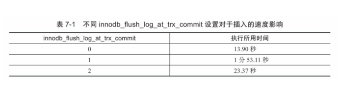
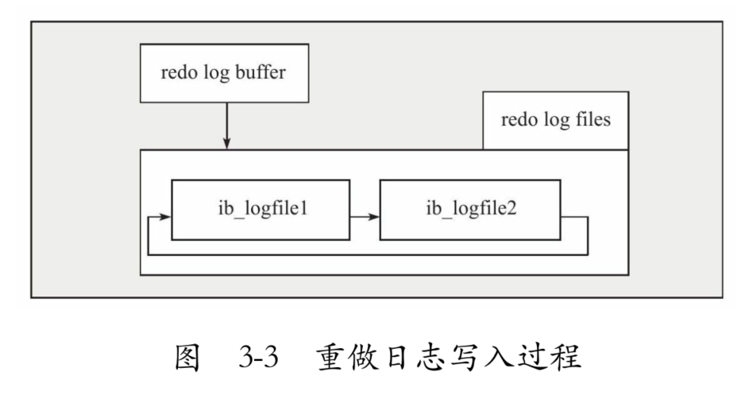

# MySQL技术内幕:InnoDB存储引擎

## 1.MySQL体系结构和存储引擎

MySQL被设计为一个**单进程多线程架构的数据库**，这点与SQL Server比较类似，但与Oracle多进程的架构有所不同（Oracle的Windows版本也是单进程多线程架构的）。这也就是说，MySQL数据库实例在系统上的表现就是一个进程。

❑连接池组件

❑管理服务和工具组件

❑SQL接口组件

❑查询分析器组件

❑优化器组件

❑缓冲（Cache）组件

❑插件式存储引擎

❑物理文件

### InnoDB

InnoDB存储引擎**支持事务**，其设计目标主要面向在线事务处理（OLTP）的应用。其特点是**行锁**设计、支持**外键**，并支持类似于Oracle的非锁定读，即**默认读取操作不会产生锁**。从MySQL数据库5.5.8版本开始，InnoDB存储引擎是**默认的存储引擎**。

InnoDB通过使用多版本并发控制（MVCC）来获得**高并发性**，并且实现了SQL标准的4种隔离级别，默认为REPEATABLE级别。同时，使用一种被称为**next-key locking的策略来避免幻读**（phantom）现象的产生。除此之外，InnoDB储存引擎还提供了插入缓冲（insert buffer）、二次写（double write）、自适应哈希索引（adaptive hash index）、预读（read ahead）等高性能和高可用的功能。

对于表中数据的存储，InnoDB存储引擎采用了**聚集**（clustered）的方式，因此每张表的存储都是按主键的顺序进行存放。如果没有显式地在表定义时指定主键，InnoDB存储引擎会为每一行生成一个6字节的ROWID，并以此作为主键。


### MyISAM

MyISAM存储引擎**不支持事务**、**表锁**设计，支持**全文索引**，主要面向一些OLAP数据库应用。在MySQL 5.5.8版本之前MyISAM存储引擎是默认的存储引擎（除Windows版本外）。数据库系统与文件系统很大的一个不同之处在于对事务的支持，然而MyISAM存储引擎是不支持事务的。究其根本，这也不是很难理解。试想用户是否在所有的应用中都需要事务呢？在数据仓库中，如果没有ETL这些操作，只是简单的报表查询是否还需要事务的支持呢？此外，MyISAM存储引擎的另一个与众不同的地方是它的缓冲池只缓存（cache）索引文件，而不缓冲数据文件，这点和大多数的数据库都非常不同。


联机分析处理 (OLAP) 的概念最早是由关系数据库之父E.F.Codd于1993年提出的，他同时提出了关于OLAP的12条准则。OLAP的提出引起了很大的反响，OLAP作为一类产品同联机事务处理 (OLTP) 明显区分开来。
当今的数据处理大致可以分成两大类：联机事务处理OLTP（on-line  transaction processing）、联机分析处理OLAP（On-Line Analytical  Processing）。OLTP是传统的关系型数据库的主要应用，主要是基本的、日常的事务处理，例如银行交易。

OLAP是数据仓库系统的主要应用，支持复杂的分析操作，侧重决策支持，并且提供直观易懂的查询结果。

下表列出了OLTP与OLAP之间的比较。


### 连接MySQL

TCP/IP -> mysql.user

建立连接 访问控制权限


## 2.InnoDB存储引擎

InnoDB存储引擎最早由Innobase Oy公司[[1\]](ms-local-stream://EpubReader_041CABAA454C4228EE10E8FB89A2FC6604C03A0FA96D33929B9DDA5BFF947E/Content/text/part0024_split_001.html#ch1-back)开发，被包括在MySQL数据库所有的二进制发行版本中，从MySQL 5.5版本开始是默认的表存储引擎（之前的版本InnoDB存储引擎仅在Windows下为默认的存储引擎）。该存储引擎是第一个完整支持ACID事务的MySQL存储引擎（BDB是第一个支持事务的MySQL存储引擎，现在已经停止开发），其特点是行锁设计、支持MVCC、支持外键、提供一致性非锁定读，同时被设计用来最有效地利用以及使用内存和CPU。


## 7.事务

## 7.1分类

### ❑扁平事务
Flat Transactions
    在扁平事务中，所有操作都处于同一层次，其由BEGIN WORK开始，由COMMIT WORK或ROLLBACK WORK结束，其间的操作是原子的，要么都执行，要么都回滚。因此扁平事务是应用程序成为原子操作的基本组成模块。图7-1显示了扁平事务的三种不同结果。


                                         图　7-1　扁平事务的三种情况

图7-1给出了扁平事务的三种情况，同时也给出了在一个典型的事务处理应用中，每个结果大概占用的百分比。再次提醒，扁平事务虽然简单，但在实际生产环境中使用最为频繁。正因为其简单，使用频繁，故每个数据库系统都实现了对扁平事务的支持。

### ❑带有保存点的扁平事务
Flat Transactions with Savepoints
    带有保存点的扁平事务（Flat Transactions with Savepoint），除了支持扁平事务支持的操作外，允许在事务执行过程中回滚到同一事务中较早的一个状态。这是因为某些事务可能在执行过程中出现的错误并不会导致所有的操作都无效，放弃整个事务不合乎要求，开销也太大。保存点（Savepoint）用来通知系统应该记住事务当前的状态，以便当之后发生错误时，事务能回到保存点当时的状态。

对于扁平的事务来说，其隐式地设置了一个保存点。然而在整个事务中，只有这一个保存点，因此，回滚只能回滚到事务开始时的状态。保存点用SAVE WORK函数来建立，通知系统记录当前的处理状态。当出现问题时，保存点能用作内部的重启动点，根据应用逻辑，决定是回到最近一个保存点还是其他更早的保存点。图7-2显示了在事务中使用保存点。


### ❑链事务
Chained Transactions

链事务（Chained Transaction）可视为保存点模式的一种变种。带有保存点的扁平事务，当发生系统崩溃时，所有的保存点都将消失，因为其保存点是易失的（volatile），而非持久的（persistent）。这意味着当进行恢复时，事务需要从开始处重新执行，而不能从最近的一个保存点继续执行。

链事务的思想是：在提交一个事务时，释放不需要的数据对象，将必要的处理上下文隐式地传给下一个要开始的事务。注意，提交事务操作和开始下一个事务操作将合并为一个原子操作。这意味着下一个事务将看到上一个事务的结果，就好像在一个事务中进行的一样。图7-3显示了链事务的工作方式：


链事务与带有保存点的扁平事务不同的是，带有保存点的扁平事务能回滚到任意正确的保存点。而链事务中的回滚仅限于当前事务，即只能恢复到最近一个的保存点。对于锁的处理，两者也不相同。链事务在执行COMMIT后即释放了当前事务所持有的锁，而带有保存点的扁平事务不影响迄今为止所持有的锁。


### ❑嵌套事务
Nested Transactions

嵌套事务（Nested Transaction）是一个层次结构框架。由一个顶层事务（top-level transaction）控制着各个层次的事务。顶层事务之下嵌套的事务被称为子事务（subtransaction），其控制每一个局部的变换。嵌套事务的层次结构如图7-4所示。


下面给出Moss对嵌套事务的定义：

1）嵌套事务是由若干事务组成的一棵树，子树既可以是嵌套事务，也可以是扁平事务。

2）处在叶节点的事务是扁平事务。但是每个子事务从根到叶节点的距离可以是不同的。

3）位于根节点的事务称为顶层事务，其他事务称为子事务。事务的前驱称（predecessor）为父事务（parent），事务的下一层称为儿子事务（child）。

4）子事务既可以提交也可以回滚。但是它的提交操作并不马上生效，除非其父事务已经提交。因此可以推论出，任何子事物都在顶层事务提交后才真正的提交。

5）树中的任意一个事务的回滚会引起它的所有子事务一同回滚，故子事务仅保留A、C、I特性，不具有D的特性。

在Moss的理论中，实际的工作是交由叶子节点来完成的，即只有叶子节点的事务才能访问数据库、发送消息、获取其他类型的资源。而高层的事务仅负责逻辑控制，决定何时调用相关的子事务。即使一个系统不支持嵌套事务，用户也可以通过保存点技术来模拟嵌套事务，如图7-5所示。

从图7-5中也可以发现，在恢复时采用保存点技术比嵌套查询有更大的灵活性。例如在完成Tk3这事务时，可以回滚到保存点S2的状态。而在嵌套查询的层次结构中，这是不被允许的。

但是用保存点技术来模拟嵌套事务在锁的持有方面还是与嵌套查询有些区别。当通过保存点技术来模拟嵌套事务时，用户无法选择哪些锁需要被子事务继承，哪些需要被父事务保留。这就是说，无论有多少个保存点，所有被锁住的对象都可以被得到和访问。而在嵌套查询中，不同的子事务在数据库对象上持有的锁是不同的。例如有一个父事务P1，其持有对象X和Y的排他锁，现在要开始一个调用子事务P11，那么父事务P1可以不传递锁，也可以传递所有的锁，也可以只传递一个排他锁。如果子事务P11中还要持有对象Z的排他锁，那么通过反向继承（counter-inherited），父事务P1将持有3个对象X、Y、Z的排他锁。如果这时又再次调用了一个子事务P12，那么它可以选择传递那里已经持有的锁。

然而，如果系统支持在嵌套事务中并行地执行各个子事务，在这种情况下，采用保存点的扁平事务来模拟嵌套事务就不切实际了。这从另一个方面反映出，想要实现事务间的并行性，需要真正支持的嵌套事务。


### ❑分布式事务

Distributed Transactions

分布式事务（Distributed Transactions）通常是一个在分布式环境下运行的扁平事务，因此需要根据数据所在位置访问网络中的不同节点。
假设一个用户在ATM机进行银行的转账操作，例如持卡人从招商银行的储蓄卡转账10 000元到工商银行的储蓄卡。在这种情况下，可以将ATM机视为节点A，招商银行的后台数据库视为节点B，工商银行的后台数据库视为C，这个转账的操作可分解为以下的步骤：

1）节点A发出转账命令。
2）节点B执行储蓄卡中的余额值减去10 000。
3）节点C执行储蓄卡中的余额值加上10 000。
4）节点A通知用户操作完成或者节点A通知用户操作失败。

这里需要使用分布式事务，因为节点A不能通过调用一台数据库就完成任务。其需要访问网络中两个节点的数据库，而在每个节点的数据库执行的事务操作又都是扁平的。对于分布式事务，其同样需要满足ACID特性，要么都发生，要么都失效。对于上述的例子，如果2）、3）步中任何一个操作失败，都会导致整个分布式事务回滚。若非这样，结果会非常可怕。


**对于InnoDB存储引擎来说**，其支持扁平事务、带有保存点的事务、链事务、分布式事务。对于嵌套事务，其并不原生支持，因此，对有并行事务需求的用户来说，MySQL数据库或InnoDB存储引擎就显得无能为力了。然而用户仍可以通过带有保存点的事务来模拟串行的嵌套事务。


## 7.2事务的实现

隔离性由第6章讲述的锁来实现

原子性、一致性、持久性通过数据库的redo log和undo log来完成

redo log 称为重做日志，用来保证事务的**原子性**和**持久性**。undo log 用来保证事务的**一致性**。

redo恢复提交事务修改的页操作。undo回滚行记录到某个特定版本。

redo通常是物理日志，记录的是页的物理修改操作。undo是逻辑日志，根据每行记录进行记录。

### redo log

重做日志用来实现事务的持久性，即事务ACID中的D。其由两部分组成：一是内存中的重做日志缓冲（redo log buffer），其是**易失的**；二是重做日志文件（redo log file），其是**持久的**。

   InnoDB是事务的存储引擎，其通过Force Log at Commit机制实现事务的持久性，**即当事务提交（COMMIT）时，必须先将该事务的所有日志写入到重做日志文件进行持久化，待事务的COMMIT操作完成才算完成**。这里的日志是指重做日志，在InnoDB存储引擎中，由两部分组成，即redo log和undo log。redo log用来保证事务的持久性，undo log用来帮助事务回滚及MVCC的功能。redo log基本上都是顺序写的，在数据库运行时不需要对redo log的文件进行读取操作。而undo log是需要进行随机读写的。 

`innodb_flush_log_at_trx_commit`

1，默认值，每次事务提交调用fsync。

0，表示事务提交时不进行写入重做日志操作，这个操作仅在master thread中完成，而在master thread中**每1秒会进行一次**重做日志文件的fsync操作。

2，表示事务提交时将重做日志写入重做日志文件redo log file，但**仅写入文件系统的缓存中**，不进行fsync操作。在这个设置下，**当MySQL数据库发生宕机而操作系统不发生宕机时，并不会导致事务的丢失。**也就是说如果操作系统崩溃或者断电，会导致事务数据丢失。

表7-1显示在参数innodb_flush_log_at_trx_commit不同设置下， 调用存储过程p_load插入50万行记录所需时间。 

****

redo log是InnoDB存储引擎层产生的，而二进制日志binary log，是在数据库的上层产生的。二进制日志记录的是对应的sql语句。而InnoDB的redo log记录的是对每个页的修改。

#### 为什么需要redo log

在默认情况下， 在InnoDB存储引擎的数据目录下会有两个名为ib_logfile0和ib_logfile1的文件。 在MySQL官方手册中将其称为InnoDB存储引擎的日志文件， 不过更准确的定义应该是重做日志文件（redo log file） 。 为什么强调是重做日志文件呢？ 因为重做日志文件对于InnoDB存储引擎至关重要， 它们记录了对于InnoDB存储引擎的事
务日志。

当实例或介质失败（media failure） 时， 重做日志文件就能派上用场。 例如， 数据库由于所在主机掉电导致实例失败， InnoDB存储引擎会使用重做日志恢复到掉电前的时刻， 以此来保证数据的完整性。 

每个InnoDB存储引擎至少有1个重做日志文件组（group） ， 每个文件组下至少有2个重做日志文件， 如默认的ib_logfile0和ib_logfile1。 为了得到更高的可靠性， 用户可以设置多个的镜像日志组（mirrored log groups） ， 将不同的文件组放在不同的磁盘上， 以此提高重做日志的高可用性。 在日志组中每个重做日志文件的大小一致，
并以循环写入的方式运行。 InnoDB存储引擎先写重做日志文件1， 当达到文件的最后时， 会切换至重做日志文件2， 再当重做日志文件2也被写满时， 会再切换到重做日志文件1中。 图3-2显示了一个拥有3个重做日志文件的重做日志文件组。 


#### 属性配置

下列参数影响着重做日志文件的属性：
❑innodb_log_file_size
❑innodb_log_files_in_group
❑innodb_mirrored_log_groups
❑innodb_log_group_home_dir

参数innodb_log_file_size指定每个重做日志文件的大小。 在InnoDB1.2.x版本之前， 重做日志文件总的大小不得大于等于4GB， 而1.2.x版本将该限制扩大为了512GB。

参数innodb_log_files_in_group指定了日志文件组中重做日志文件的数量， 默认为2。 

参数innodb_mirrored_log_groups指定了日志镜像文件组的数量， 默认为1， 表示只有一个日志文件组， 没有镜像。 若磁盘本身已经做了高可用的方案， 如磁盘阵列， 那么可以不开启重做日志镜像的功能。 

参数innodb_log_group_home_dir指定了日志文件组所在路径， 默认为./， 表示在MySQL数据库的数据目录下。

以下显示了一个关于重做日志组的配置：
```sql
mysql＞SHOW VARIABLES LIKE'innodb%log%'\G;……
***************************4.row**************
Variable_name:innodb_log_file_size
Value:5242880
***************************5.row**************
Variable_name:innodb_log_files_in_group
Value:2
***************************6.row**************
Variable_name:innodb_log_group_home_dir
Value:./
***************************7.row**************
Variable_name:innodb_mirrored_log_groups
Value:1
7 rows in set(0.00 sec)
```
重做日志文件的大小设置对于InnoDB存储引擎的性能有着非常大的影响。 一方面重做日志文件不能设置得太大， 如果设置得很大， 在恢复时可能需要很长的时间； 另一方面又不能设置得太小了， 否则可能导致一个事务的日志需要多次切换重做日志文件。 此外， 重做日志文件太小会导致频繁地发生async checkpoint， 导致性能的抖动。 例如， 用户可能会在错误日志中看到如下警告信息：
```log
090924 11:39:44 InnoDB:ERROR:the age of the
last checkpoint is 9433712,
InnoDB:which exceeds the log group capacity
9433498.
InnoDB:If you are using big BLOB or TEXT
rows,you must set the
InnoDB:combined size of log files at least
10 times bigger than the
InnoDB:largest such row.
090924 11:40:00 InnoDB:ERROR:the age of the
last checkpoint is 9433823,
InnoDB:which exceeds the log group capacity
9433498.
InnoDB:If you are using big BLOB or TEXT
rows,you must set the
InnoDB:combined size of log files at least
10 times bigger than the
InnoDB:largest such row.
090924 11:40:16 InnoDB:ERROR:the age of the
last checkpoint is 9433645,
InnoDB:which exceeds the log group capacity
9433498.
InnoDB:If you are using big BLOB or TEXT
rows,you must set the
InnoDB:combined size of log files at least
10 times bigger than the
InnoDB:largest such row.
```
上面错误集中在InnoDB:ERROR:the age of the last checkpoint is 9433645， InnoDB:which exceeds the log group capacity 9433498。 这是因为重做日志有一个capacity变量， 该值代表了最后的检查点不能超过这个阈值， 如果超过则必须将缓冲池（innodb buffer pool） 中脏页列表（flush list） 中的部分脏数据页写回磁盘， 这时会导致用户线程的阻塞。 

#### redo log和binlog

首先， 二进制日志会记录所有与MySQL数据库有关的日志记录， 包括InnoDB、 MyISAM、Heap等其他存储引擎的日志。 而InnoDB存储引擎的重做日志只记录有关该存储引擎本身的事务日志。

其次， **记录的内容不同， 无论用户将二进制日志文件记录的格式设为STATEMENT还是ROW， 又或者是MIXED， 其记录的都是关于一个事务的具体操作内容， 即该日志是逻辑日志。**而InnoDB存储引擎的重做日志文件记录的是关于每个页（Page） 的更改的物理情况。此外， 写入的时间也不同， 二进制日志文件仅在事务提交前进行提交， 即只写磁盘一次， 不论这时该事务多大。 **而在事务进行的过程中， 却不断有重做日志条目（redo entry） 被写入到重做日志文件中。**

在InnoDB存储引擎中， 对于各种不同的操作有着不同的重做日志格式。 到InnoDB 1.2.x版本为止， 总共定义了51种重做日志类型。 虽然各种重做日志的类型不同， 但是它们有着基本的格式，表3-2显示了重做日志条目的结构 

从表3-2可以看到重做日志条目是由4个部分组成：
❑redo_log_type占用1字节， 表示重做日志的类型
❑space表示表空间的ID， 但采用压缩的方式， 因此占用的空间可能小于4字节
❑page_no表示页的偏移量， 同样采用压缩的方式
❑redo_log_body表示每个重做日志的数据部分， 恢复时需要调用相应的函数进行解析 

在第2章中已经提到， 写入重做日志文件的操作不是直接写， 而是先写入一个重做日志缓冲
（redo log buffer） 中， 然后按照一定的条件顺序地写入日志文件。 图3-3很好地诠释了重做日志的
写入过程。 



从重做日志缓冲往磁盘写入时， 是按512个字节， 也就是一个扇区的大小进行写入。 因为扇区是写入的最小单位， 因此可以保证写入必定是成功的。 因此在重做日志的写入过程中不需要有doublewrite。

前面提到了从日志缓冲写入磁盘上的重做日志文件是按一定条件进行的， 那这些条件有哪些呢？ 第2章分析了主线程（master thread） ， 知道在主线程中每秒会将重做日志缓冲写入磁盘的重做日志文件中， 不论事务是否已经提交。 另一个触发写磁盘的过程是由参数innodb_flush_log_at_trx_commit控制， 表示在提交（commit） 操作时， 处理重做日志的方式。

参数innodb_flush_log_at_trx_commit的有效值有0、 1、 2。 0代表当提交事务时， 并不将事务的重做日志写入磁盘上的日志文件， 而是等待主线程每秒的刷新。 1和2不同的地方在于： 1表示在执行commit时将重做日志缓冲同步写到磁盘， 即伴有fsync的调用。 2表示将重做日志异步写到磁盘， 即写到文件系统的缓存中。 因此不能完全保证在执行commit时肯定会写入重做日志文件， 只是有这个动作发生。

因此**为了保证事务的ACID中的持久性， 必须将innodb_flush_log_at_trx_commit设置为1**， 也就是每当有事务提交时， 就必须确保事务都已经写入重做日志文件。 那么当数据库因为意外发生宕机时， 可以通过重做日志文件恢复， 并保证可以恢复已经提交的事务。 而将重做日志文件设置为0或2， 都有可能发生恢复时部分事务的丢失。 不同之处在于， 设置为2时， 当MySQL数据库发生宕机而操作系统及服务器并没有发生宕机时， 由于此时未写入磁盘的事务日志保存在文件系统缓存中， 当恢复时同样能保证数据不丢失。 

### undo log

重做日志记录了事务的行为， 可以很好地通过其对页进行“重做”操作。 **但是事务有时还需要进行回滚操作， 这时就需要undo。** 因此在对数据库进行修改时， InnoDB存储引擎不但会产生redo， 还会产生一定量的undo。 这样如果用户执行的事务或语句由于某种原因失败了， 又或者用户用一条ROLLBACK语句请求回滚， 就可以利用这些undo信息将数据回滚到修改之前的样子。

redo存放在重做日志文件中， 与redo不同，undo存放在数据库内部的一个特殊段（segment）中， 这个段称为undo段（undo segment） 。 undo段位于共享表空间内。 可以通过py_innodb_page_info.py工具来查看当前共享表空间中undo的数量。 如下代码显示当前的共享表空间ibdata1内有2222个undo页。
```shell
[root@xen-server～]#python
py_innodb_page_info.py/usr/local/mysql/data/ibdat
Total number of page:46208:
Insert Buffer Free List:13093
Insert Buffer Bitmap:3
System Page:5
Transaction system Page:1
Freshly Allocated Page:4579
undo Log Page:2222
File Segment inode:6
B-tree Node:26296
File Space Header:1
扩展描述页:2
```
用户通常对undo有这样的误解： undo用于将数据库物理地恢复到执行语句或事务之前的样子——但事实并非如此。 undo是逻辑日志， 因此只是将数据库逻辑地恢复到原来的样子。 所有修改都被逻辑地取消了， 但是数据结构和页本身在回滚之后可能大不相同。 这是因为在多用户并发系统中， 可能会有数十、 数百甚至数千个并发事
务。 数据库的主要任务就是协调对数据记录的并发访问。 比如， 一个事务在修改当前一个页中某几条记录， 同时还有别的事务在对同一个页中另几条记录进行修改。 因此， 不能将一个页回滚到事务开始的样子， 因为这样会影响其他事务正在进行的工作。 

例如， 用户执行了一个INSERT 10W条记录的事务， 这个事务会导致分配一个新的段， 即表空间会增大。 在用户执行ROLLBACK时， 会将插入的事务进行回滚， 但是表空间的大小并不会因此而收缩。 **因此， 当InnoDB存储引擎回滚时， 它实际上做的是与先前相反的工作。** 对于每个INSERT， InnoDB存储引擎会完成一个DELETE；对于每个DELETE， InnoDB存储引擎会执行一个INSERT； 对于每个UPDATE， InnoDB存储引擎会执行一个相反的UPDATE， 将修改前的行放回去。

除了回滚操作， undo的另一个作用是MVCC， 即在InnoDB存储引擎中MVCC的实现是通过undo来完成。 当用户读取一行记录时， 若该记录已经被其他事务占用， 当前事务可以通过undo读取之前的行版本信息， 以此实现非锁定读取。

最后也是最为重要的一点是， undo log会产生redo log， 也就是undo log的产生会伴随着redolog的产生， 这是因为undo log也需要持久性的保护。 

