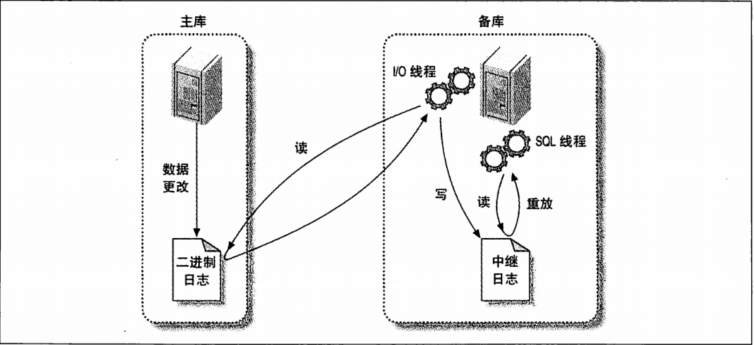
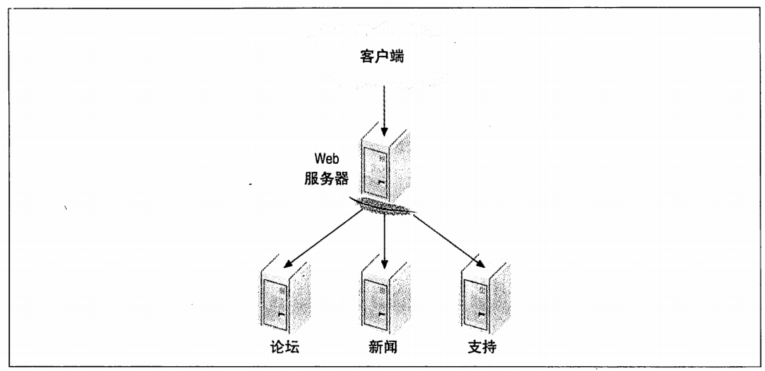
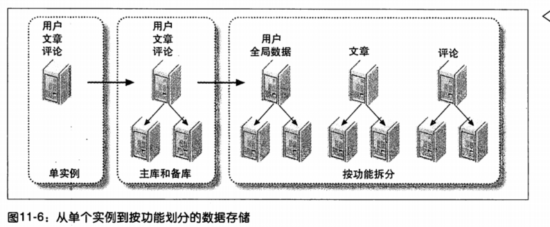
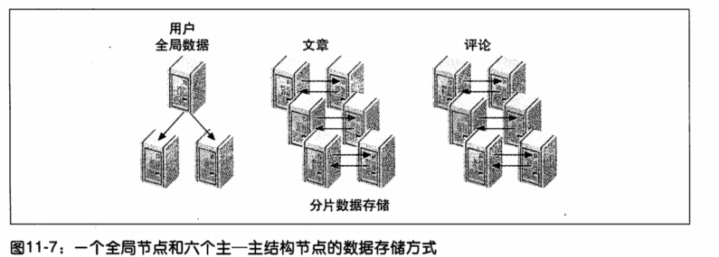

# MySQL复制

[MySQL 复制原理详解](https://cloud.tencent.com/developer/article/1005270)

## 复制过程



1.主库把数据更改记录到二进制日志（Binary Log）中（这些记录称为二进制日志事件）。再每次准备提交事务完成数据更新前，主库将数据更新的事件记录到二进制日志中。MySQL会按事务提交的顺序而非每条语句的执行顺序来记录二进制日志。记录二进制日志后，主库会告诉存储引擎可以提交事务了。

2.从库将主库上的日志复制到自己的中继日志（Relay Log）中。首先从库会启动一个工作线程，称为I/O线程，I/O线程跟主库建立一个普通的客户端连接，然后在主库上启动一个特殊的二进制转储线程，这个二进制转储线程会读取主库上二进制日志的事件。它不会对事件进行轮询。如果该线程赶上了主库，将进入睡眠状态，直到主库发送信号量通知其有新的事件产生时才会唤醒，从库I/O线程会将接收到的事件记录到中继日志中。

3.从库读取中继日志中的事件，重放到从库上。从库的SQL线程执行最后一部，该线程从中继日志中读取事件并在从库执行，实现从库数据的更新。当SQL线程赶上I/O线程时，中继日志通常已经在系统缓存中，所以中继日志的开销很低。SQL线程执行的事件也可以通过配置选项来决定是否写入其自己的二进制日志中。


## 配置复制


## 复制原理

### 基于语句的复制

主库记录造成数据更改的查询，从库读取并重放这些事件，实际上只是把主库执行过的SQL再执行一遍。

好处：实现简单；不需要太多带宽。

坏处：可能导致主从的不一致，比如获取当前时间戳；更新是串行的，需要更多的锁。

### 基于行的复制

MySQL5.1开始直传基于行的复制，会将实际数据记录在二进制日志中。最大的好处是可以正确的复制每一行，比如当前时间戳。

**优点：**

最大的好处是可以正确的复制每一行，一些语句可以呗更加有效地复制。由于无需重放更新主库数据的查询，使用基于行的复制模式能够更高效地复制数据。重放一些查询的代价会很高。例如，下面有一个查询将数据从一个大表中汇总到小表

```sql
INSERT INTO summary_table(col1,col2,sum_col3)
SELECT col1,col2,sum(col3) 
from enormous_table 
GROUP BY col1,col2;
```

**缺点：**

但是另外一方面，下面这条语句使用基于语句的复制方式代价会小很多：

```sql
UPDATE enormous_table SET col1 =0 ;
```

由于这条语句做了全表更行，使用基于行的复制开销会大很多，因为每一行的数据都会呗记录到二进制日志中，这使得二进制日志时间非常庞大。

由于没有哪一种模式对所有情况都是完善的，mysql能够在这两种复制模式间动态切换。默认情况下使用的是基于语句的复制方式，但如果发现语句无法呗正确地复制，就切换基于行的复制模式。还可以根据需要来设置会话级别的变量binlog_format,控制二进制日志格式。


## 半同步复制

​	一般情况下，异步复制就已经足够应付了，但由于是异步复制，备库极有可能是落后于主库，特别是极端情况下，我们无法保证主备数据是严格一致的。比如，当用户发起commit命令时，Master并不关心Slave的执行状态，执行成功后，立即返回给用户。试想下，若一个事务提交后，Master成功返回给用户后crash，这个事务的binlog还没来得及传递到Slave，那么Slave相对于Master而言就少了一个事务，此时主备就不一致了。对于要求强一致的业务是不可以接受的，半同步复制就是为了解决数据一致性而产生的。

​	为什么叫半同步复制？先说说同步复制，所谓同步复制就是一个事务在Master和Slave都执行后，才返回给用户执行成功。这里核心是说Master和Slave要么都执行，要么都不执行，涉及到2PC(2 Phrase Commit)。而MySQL只实现了本地redo-log和binlog的2PC，但并没有实现Master和Slave的2PC，所以不是严格意义上的同步复制。而MySQL半同步复制不要求Slave执行，而仅仅是接收到日志后，就通知Master可以返回了。这里关键点是Slave接受日志后是否执行，若执行后才通知Master则是同步复制，若仅仅是接受日志成功，则是半同步复制。对于Mysql而言，我们谈到的日志都是binlog，对于其他的[关系型数据库](https://cloud.tencent.com/product/cdb-overview?from=10680)可能是redo log或其他日志。

## 并行复制


# MySQL 恢复


# MySQL 扩展

## 垂直扩展

购买新能更加强悍的硬件。


## 水平扩展

最简单的：主从复制，读写分离，主库写，从库读，减小压力。这种技术对于读操作为主的应用非常有效。

另一个方法是将工作负载分配到多个节点。

### 按功能拆分



每个数据库服务器关系不大，尽量保证不进行关联操作。

如果必须进行关联操作，如果对性能要求不高，可以在应用层面关联。

### 数据分片

事实上，大多数应用只会对需要的数据进行分片-通常是那些将会增长到非常庞大的数据。






可以通过用户id来对文章和评论进行分片，而将用户信息保留在单个节点上面。

采用分片的应用通常会有一个数据库访问抽象层，降低应用和分片数据存储之间通信的复杂度，但是无法完全隐藏分片。太多的抽象容易导致效率降低，例如原本只需要查询一个节点，实际查询了所有节点。

如果需要据扩展写容量，必须切分数据，进行分片。

#### 选择分区键


跨分片查询


生成全局唯一id

auto_increment_increment和auto_increment_offset


# MySQL优化

如果只使用单一存储引擎，配置服务器就简单多了。如果只使用innodb，就只需要分配最少的资源给myisam（MySQL内部系统表采用myisam）。

## 内存分配


### innodb缓冲池


### innodb日志文件


### 查询缓存


### 无法手工配置的缓存