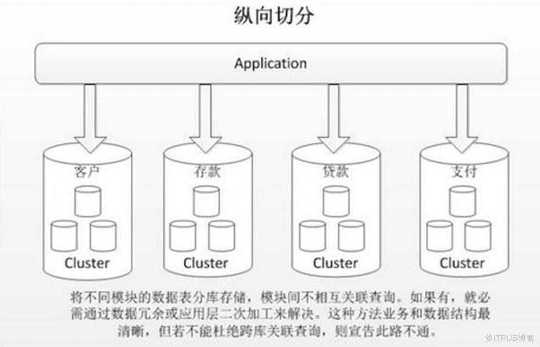
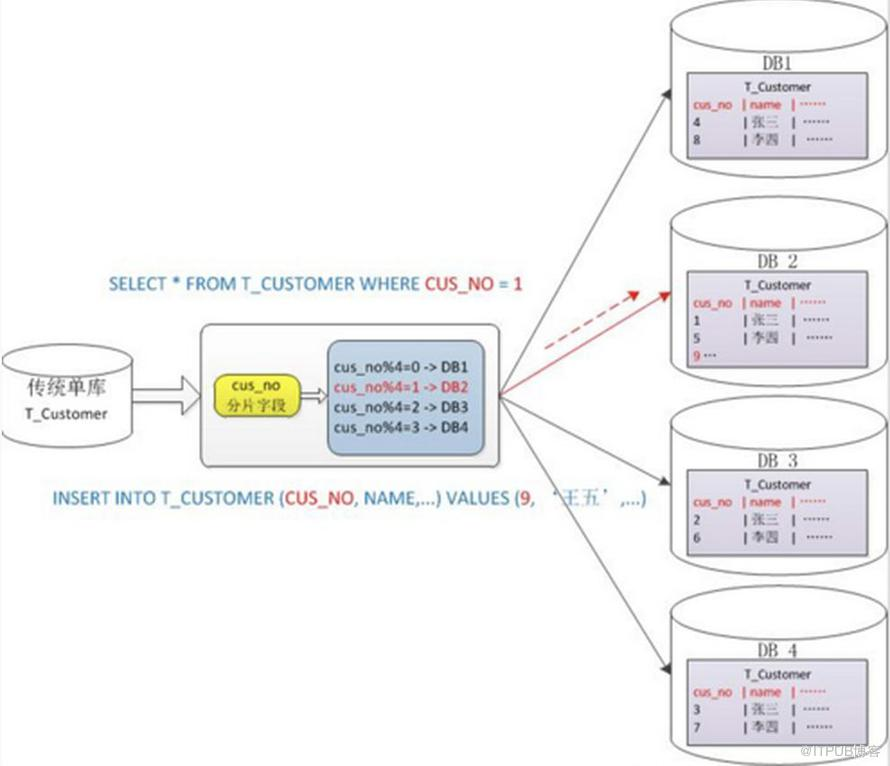
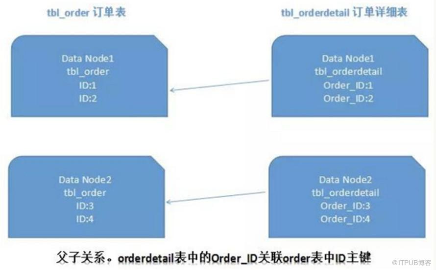
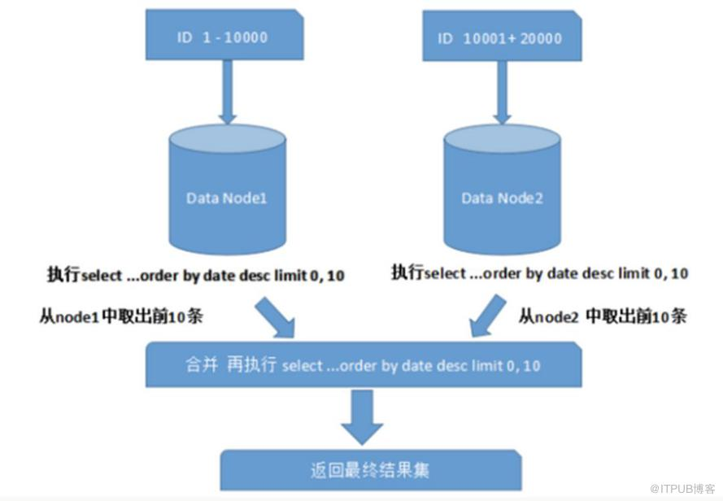
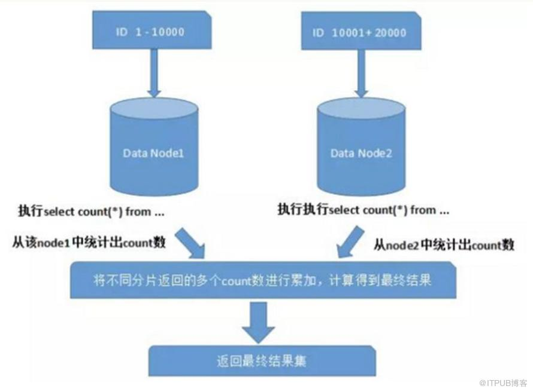
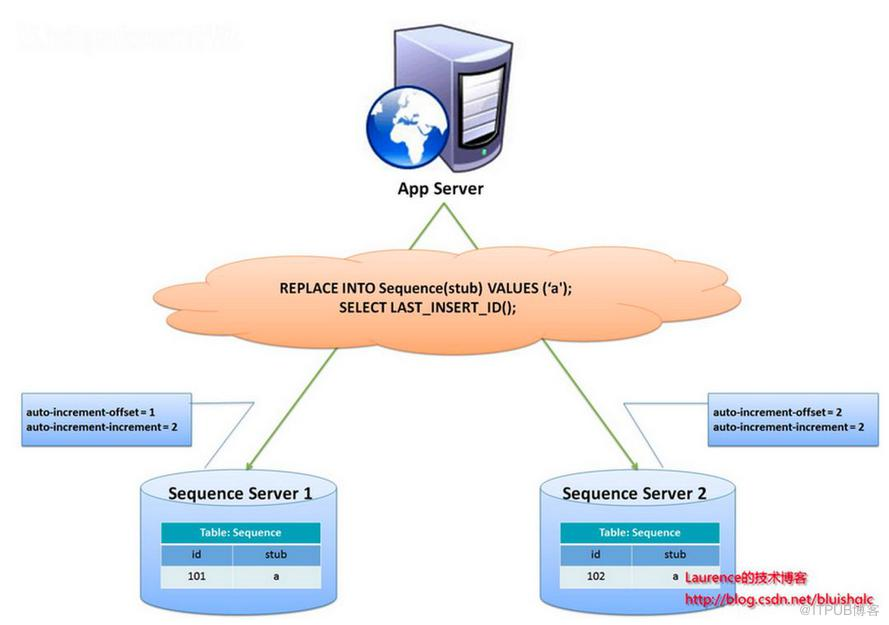
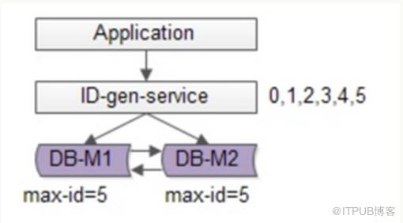

[这篇文章，我们来聊一下对于一个支撑日活百万用户的高并系统，他的数据库架构应该如何设计？](http://www.kancloud.cn:8080/dargon/db_high_concurrency/1217499)

[shardingsphere官网](https://shardingsphere.apache.org/index_zh.html)


# 优化性能

应该尽可能的首先优化性能，比如增加索引，或者优化业务需求，只有在实在没有其他办法的时候，才考虑扩展MySQL。


# 读高并发

如果MySQL的性能瓶颈，主要是读，那么可以通过主从复制、读写分离，主库写，从库读，的方式解决问题。

## 主从复制


## 读写分离


# 写高并发

如果MySQL的性能瓶颈是写，优化后也无法改善，更换了更好的机器，或者考虑硬件成本问题，还是不行，那么就只能通过数据切分了，来降低数据库单机压力。

## 更高性能的机器

使用更高性能的机器

## 数据切分

### 垂直切分-按功能拆分

垂直分库就是根据业务耦合性，将关联度低的不同表存储在不同的数据库。做法与大系统拆分为多个小系统类似，按业务分类进行独立划分。

垂直切分的优点：

- 解决业务系统层面的耦合，业务清晰
- 与微服务的治理类似，也能对不同业务的数据进行分级管理、维护、监控、扩展等
- 高并发场景下，垂直切分一定程度的提升IO、数据库连接数、单机硬件资源的瓶颈

缺点：

- 部分表无法join，只能通过接口聚合方式解决，提升了开发的复杂度
- 分布式事务处理复杂
- 依然存在单表数据量过大的问题（需要水平切分）

#### 垂直分库

比如门户网站：分为新闻、论坛、支持，各个模块关系不大，完全可以分不同的节点存储数据。




#### 垂直分表

垂直分表是基于数据库中的”列”进行，某个表字段较多，可以新建一张扩展表，将不经常用或字段长度较大的字段拆分出去到扩展表中。在字段很多的情况下（例如一个大表有100多个字段），通过”大表拆小表”，更便于开发与维护，也能避免跨页问题，MySQL底层是通过数据页存储的，一条记录占用空间过大会导致跨页，造成额外的性能开销。另外数据库以行为单位将数据加载到内存中，这样表中字段长度较短且访问频率较高，内存能加载更多的数据，命中率更高，减少了磁盘IO，从而提升了数据库性能。

### 水平切分

水平切分的优点：

- 不存在单库数据量过大、高并发的性能瓶颈，提升系统稳定性和负载能力
- 应用端改造较小，不需要拆分业务模块

缺点：

- 跨分片的事务一致性难以保证
- 跨库的join关联查询性能较差
- 数据多次扩展难度和维护量极大

水平切分后同一张表会出现在多个数据库/表中

**库内分表**

库内分表只解决了单一表数据量过大的问题，但没有将表分布到不同机器的库上，因此对于减轻MySQL数据库的压力来说，帮助不是很大，大家还是竞争同一个物理机的CPU、内存、网络IO，最好通过分库分表来解决。

**分库分表**


#### 根据数值范围

优点在于：

- 单表大小可控
- 天然便于水平扩展，后期如果想对整个分片集群扩容时，只需要添加节点即可，无需对其他分片的数据进行迁移
- 使用分片字段进行范围查找时，连续分片可快速定位分片进行快速查询，有效避免跨分片查询的问题。

缺点：

- 热点数据成为性能瓶颈。连续分片可能存在数据热点，例如按时间字段分片，有些分片存储最近时间段内的数据，可能会被频繁的读写，而有些分片存储的历史数据，则很少被查询


#### 根据数值取模

优点：

- 数据分片相对比较均匀，不容易出现热点和并发访问的瓶颈

缺点：

- 后期分片集群扩容时，需要迁移旧的数据（使用一致性hash算法能较好的避免这个问题）
- 容易面临跨分片查询的复杂问题。比如上例中，如果频繁用到的查询条件中不带cusno时，将会导致无法定位数据库，从而需要同时向4个库发起查询，再在内存中合并数据，取最小集返回给应用，分库反而成为拖累。




## 分库分表问题


### 分布式事务

分布式事务能最大限度保证了数据库操作的原子性。但在提交事务时需要协调多个节点，推后了提交事务的时间点，延长了事务的执行时间。导致事务在访问共享资源时发生冲突或死锁的概率增高。随着数据库节点的增多，这种趋势会越来越严重，从而成为系统在数据库层面上水平扩展的枷锁。

### 连表查询

切分之前，系统中很多列表和详情页所需的数据可以通过sql join来完成。而切分之后，数据可能分布在不同的节点上，此时join带来的问题就比较麻烦了，考虑到性能，尽量避免使用join查询。

#### **1）全局表**

全局表，也可看做是”数据字典表”，就是系统中所有模块都可能依赖的一些表，为了避免跨库join查询，可以将这类表在每个数据库中都保存一份。这些数据通常很少会进行修改，所以也不担心一致性的问题。

#### **2）字段冗余**

一种典型的反范式设计，利用空间换时间，为了性能而避免join查询。例如：订单表保存userId时候，也将userName冗余保存一份，这样查询订单详情时就不需要再去查询”买家user表”了。

但这种方法适用场景也有限，比较适用于依赖字段比较少的情况。而冗余字段的数据一致性也较难保证，就像上面订单表的例子，买家修改了userName后，是否需要在历史订单中同步更新呢？这也要结合实际业务场景进行考虑。

#### **3）数据组装**

在系统层面，分两次查询，第一次查询的结果集中找出关联数据id，然后根据id发起第二次请求得到关联数据。最后将获得到的数据进行字段拼装。

#### **4）ER分片**

关系型数据库中，如果可以先确定表之间的关联关系，并将那些存在关联关系的表记录存放在同一个分片上，那么就能较好的避免跨分片join问题。在1:1或1:n的情况下，通常按照主表的ID主键切分。如下图所示：



这样一来，Data Node1上面的order订单表与orderdetail订单详情表就可以通过orderId进行局部的关联查询了，Data Node2上也一样。

### 分页、排序、函数问题

跨节点多库进行查询时，会出现limit分页、order by排序等问题。分页需要按照指定字段进行排序，当排序字段就是分片字段时，通过分片规则就比较容易定位到指定的分片；当排序字段非分片字段时，就变得比较复杂了。需要先在不同的分片节点中将数据进行排序并返回，然后将不同分片返回的结果集进行汇总和再次排序，最终返回给用户。如图所示：



上图中只是取第一页的数据，对性能影响还不是很大。但是如果取得页数很大，情况则变得复杂很多，因为各分片节点中的数据可能是随机的，为了排序的准确性，需要将所有节点的前N页数据都排序好做合并，最后再进行整体的排序，这样的操作是很耗费CPU和内存资源的，所以页数越大，系统的性能也会越差。

在使用Max、Min、Sum、Count之类的函数进行计算的时候，也需要先在每个分片上执行相应的函数，然后将各个分片的结果集进行汇总和再次计算，最终将结果返回。如图所示：




### 全局主键唯一问题

在分库分表环境中，由于表中数据同时存在不同数据库中，主键值平时使用的自增长将无用武之地，某个分区数据库自生成的ID无法保证全局唯一。因此需要单独设计全局主键，以避免跨库主键重复问题。有一些常见的主键生成策略：

#### auto_increment_offset

使用auto_increment_increment和auto_increment_offset，使用偏移量来进行自增。比如两个节点，一个偏移量设置1，一个设置2。

优点是使用简单，不依赖于任何节点。

缺点是需要仔细配置服务器，配置错误会出现重复数字，特别是增加服务器，改变角色的时候。

#### 使用复合值

比如分区号+自增号

#### **UUID**

UUID标准形式包含32个16进制数字，分为5段，形式为8-4-4-4-12的36个字符，例如：550e8400-e29b-41d4-a716-446655440000

UUID是主键是最简单的方案，本地生成，性能高，没有网络耗时。

但缺点也很明显，由于UUID非常长，会占用大量的存储空间；另外，作为主键建立索引和基于索引进行查询时都会存在性能问题，在InnoDB下，UUID的无序性会引起数据位置频繁变动，导致分页。

#### **结合数据库维护主键ID表**

在数据库中建立 sequence 表：

```sql
CREATE TABLE `sequence` (
  `id` bigint(20) unsigned NOT NULL auto_increment,
  `stub` char(1) NOT NULL default '',
  PRIMARY KEY  (`id`),
  UNIQUE KEY `stub` (`stub`)
) ENGINE=MyISAM;
```

stub字段设置为唯一索引，同一stub值在sequence表中只有一条记录，可以同时为多张表生成全局ID。sequence表的内容，如下所示：

```
+-------------------+------+
| id | stub |
+-------------------+------+
| 72157623227190423 | a |
+-------------------+------+
```

使用 MyISAM 存储引擎而不是 InnoDB，以获取更高的性能。MyISAM使用的是表级别的锁，对表的读写是串行的，所以不用担心在并发时两次读取同一个ID值。

当需要全局唯一的64位ID时，执行：

```sql
REPLACE INTO sequence (stub) VALUES ('a');
SELECT LAST_INSERT_ID();
```

这两条语句是Connection级别的，select last_insert_id() 必须与 replace into 在同一数据库连接下才能得到刚刚插入的新ID。

使用replace into代替insert into好处是避免了表行数过大，不需要另外定期清理。

此方案较为简单，但缺点也明显：存在单点问题，强依赖DB，当DB异常时，整个系统都不可用。配置主从可以增加可用性，但当主库挂了，主从切换时，数据一致性在特殊情况下难以保证。另外性能瓶颈限制在单台MySQL的读写性能。

flickr团队使用的一种主键生成策略，与上面的sequence表方案类似，但更好的解决了单点和性能瓶颈的问题。

这一方案的整体思想是：建立2个以上的全局ID生成的服务器，每个服务器上只部署一个数据库，每个库有一张sequence表用于记录当前全局ID。表中ID增长的步长是库的数量，起始值依次错开，这样能将ID的生成散列到各个数据库上。如下图所示：



由两个数据库服务器生成ID，设置不同的auto_increment值。第一台sequence的起始值为1，每次步长增长2，另一台的sequence起始值为2，每次步长增长也是2。结果第一台生成的ID都是奇数（1, 3, 5, 7 …），第二台生成的ID都是偶数（2, 4, 6, 8 …）。

这种方案将生成ID的压力均匀分布在两台机器上。同时提供了系统容错，第一台出现了错误，可以自动切换到第二台机器上获取ID。但有以下几个缺点：系统添加机器，水平扩展时较复杂；每次获取ID都要读写一次DB，DB的压力还是很大，只能靠堆机器来提升性能。

可以基于flickr的方案继续优化，使用批量的方式降低数据库的写压力，每次获取一段区间的ID号段，用完之后再去数据库获取，可以大大减轻数据库的压力。如下图所示：



还是使用两台DB保证可用性，数据库中只存储当前的最大ID。ID生成服务每次批量拉取6个ID，先将max_id修改为5，当应用访问ID生成服务时，就不需要访问数据库，从号段缓存中依次派发0~5的ID。当这些ID发完后，再将max_id修改为11，下次就能派发6~11的ID。于是，数据库的压力降低为原来的1/6。

#### Snowflake分布式自增ID算法

Twitter的snowflake算法解决了分布式系统生成全局ID的需求，生成64位的Long型数字，组成部分：

- 第一位未使用
- 接下来41位是毫秒级时间，41位的长度可以表示69年的时间
- 5位datacenterId，5位workerId。10位的长度最多支持部署1024个节点
- 最后12位是毫秒内的计数，12位的计数顺序号支持每个节点每毫秒产生4096个ID序列


这样的好处是：毫秒数在高位，生成的ID整体上按时间趋势递增；不依赖第三方系统，稳定性和效率较高，理论上QPS约为409.6w/s（1000*2^12），并且整个分布式系统内不会产生ID碰撞；可根据自身业务灵活分配bit位。

不足就在于：强依赖机器时钟，如果时钟回拨，则可能导致生成ID重复。

综上结合数据库和snowflake的唯一ID方案，可以参考业界较为成熟的解法：Leaf——美团点评分布式ID生成系统，并考虑到了高可用、容灾、分布式下时钟等问题。

#### 百度-UidGenerator

[UidGenerator：百度开源的分布式ID服务（解决了时钟回拨问题）](https://mp.weixin.qq.com/s/8NsTXexf03wrT0tsW24EHA)                 

[UidGenerator-源码](https://gitee.com/mirrors/UidGenerator)

UidGenerator是百度开源的Java语言实现，基于Snowflake算法的唯一ID生成器。而且，它非常适合虚拟环境，比如：Docker。另外，它通过消费未来时间克服了雪花算法的并发限制。UidGenerator提前生成ID并缓存在RingBuffer中。
压测结果显示，单个实例的QPS能超过6000,000。


**delta seconds**

这个值是指当前时间与epoch时间的时间差，且单位为秒。epoch时间就是指集成UidGenerator生成分布式ID服务第一次上线的时间，可配置，也**一定**要根据你的上线时间进行配置，因为默认的epoch时间可是2016-09-20，不配置的话，会浪费好几年的可用时间。

**worker id**

UidGenerator会在集成用它生成分布式ID的实例启动的时候，往这个表中插入一行数据，得到的id值就是准备赋给workerId的值。由于workerId默认22位，那么，集成UidGenerator生成分布式ID的所有实例重启次数是不允许超过4194303次（即2^22-1），否则会抛出异常。

```sql
DROP TABLE IF EXISTS WORKER_NODE;
CREATE TABLE WORKER_NODE(
  ID BIGINT NOT NULL AUTO_INCREMENT PRIMARY KEY ,
  HOST_NAME VARCHAR(64) NOT NULL COMMENT 'host name',
  PORT VARCHAR(64) NOT NULL COMMENT 'port',
  TYPE INT NOT NULL COMMENT 'node type: ACTUAL or CONTAINER',
  LAUNCH_DATE DATE NOT NULL COMMENT 'launch date',
  MODIFIED DATETIME NOT NULL COMMENT 'modified time',
  CREATED DATEIMTE NOT NULL COMMENT 'created time'
)
 COMMENT='DB WorkerID Assigner for UID Generator',ENGINE = INNODB;
```

**sequence**

- **synchronized**保证线程安全；

- 如果时间有任何的回拨，那么**直接**抛出异常；

- 如果当前时间和上一次是同一秒时间，那么sequence自增。如果同一秒内自增值超过2^13-1，那么就会自旋等待下一秒（getNextSecond）；

- 如果是新的一秒，那么sequence重新从0开始；

  ```java
  protected synchronized long nextId() {
      long currentSecond = getCurrentSecond();
      if (currentSecond < lastSecond) {
          long refusedSeconds = lastSecond - currentSecond;
          throw new UidGenerateException("Clock moved backwards. Refusing for %d seconds", refusedSeconds);
      }
      if (currentSecond == lastSecond) {
          sequence = (sequence + 1) & bitsAllocator.getMaxSequence();
          if (sequence == 0) {
              currentSecond = getNextSecond(lastSecond);
          }
      } else {
          sequence = 0L;
      }
      lastSecond = currentSecond;
      return bitsAllocator.allocate(currentSecond - epochSeconds, workerId, sequence);
  }
  ```

### 数据迁移、扩容问题

当业务高速发展，面临性能和存储的瓶颈时，才会考虑分片设计，此时就不可避免的需要考虑历史数据迁移的问题。一般做法是先读出历史数据，然后按指定的分片规则再将数据写入到各个分片节点中。此外还需要根据当前的数据量和QPS，以及业务发展的速度，进行容量规划，推算出大概需要多少分片（一般建议单个分片上的单表数据量不超过1000W）。

如果采用数值范围分片，只需要添加节点就可以进行扩容了，不需要对分片数据迁移。如果采用的是数值取模分片，则考虑后期的扩容问题就相对比较麻烦。