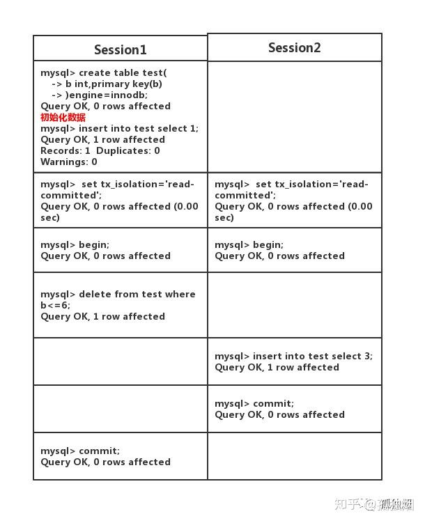

# MySQL事务

[MySQL锁总结](https://zhuanlan.zhihu.com/p/29150809)

[浅谈MySQL的七种锁](https://yq.aliyun.com/articles/646976)

[互联网项目中mysql应该选什么事务隔离级别](<https://zhuanlan.zhihu.com/p/59061106>)

[MySQL加锁处理分析-何登成博客](http://www.linuxeye.com/database/1986.html)

## 简单使用

​	在 MySQL 命令行的默认设置下，事务都是自动提交的，即执行 SQL 语句后就会马上执行 COMMIT 操作。因此要显式地开启一个事务务须使用命令 BEGIN 或 START TRANSACTION，或者执行命令 SET AUTOCOMMIT=0，用来禁止使用当前会话的自动提交。

1、用 BEGIN, ROLLBACK, COMMIT来实现

- **BEGIN** 和 **START TRANSACTION** 开始一个事务
- **ROLLBACK** 事务回滚
- **COMMIT** 事务确认

2、直接用 SET 来改变 MySQL 的自动提交模式:

- **SET AUTOCOMMIT=0** 禁止自动提交
- **SET AUTOCOMMIT=1** 开启自动提交

## 锁

InnoDB存储引擎锁的实现和Oracle数据库非常类似， 提供一致性的非锁定读、 行级锁支持。行级锁没有相关额外的开销， 并可以同时得到并发性和一致性。 

### 表锁

表锁：服务器层，如alter table，myisam只支持表锁

行锁：存储引擎层实现，InnoDB和XtraDB实现了行锁

### 行锁

innodb的行级锁是依赖于**索引**实现的，where条件后的字段只有是索引字段才能应用行级锁定，也就是说无索引的字段只能使用表锁。

比如有表test，有主键id，未索引字段name，如果使用name字段进行update，会锁表：
```sql
//表锁
update test set name=222 where name =2;
//行锁
update test set name=222 where id =2;
```
- 对于 UPDATE、 DELETE 和 INSERT 语句， InnoDB会自动给涉及数据集加排他锁（X)；
- 对于普通 SELECT 语句，InnoDB 不会加任何锁，只是一个快照读；

❑共享锁（S Lock） ， 允许事务读一行数据。
❑排他锁（X Lock） ， 允许事务删除或更新一行数据。 

#### 隐式锁定

InnoDB在事务执行过程中，使用两阶段锁协议：

随时都可以执行锁定，InnoDB会根据隔离级别在需要的时候自动加锁；

锁只有在执行commit或者rollback的时候才会释放，并且所有的锁都是在**同一时刻**被释放。

#### 显示锁定

```sql
select ... where ... lock in share mode;
```

```sql
select ... where ... for update 
```

### 意向锁

意向锁是 InnoDB 自动加的， 不需用户干预。

InnoDB存储引擎支持多粒度（granular） 锁定， 这种锁定允许事务在行级上的锁和表级上的锁同时存在。 为了支持在不同粒度上进行加锁操作， InnoDB存储引擎支持一种额外的锁方式， 称之为意向锁（Intention Lock） 。 

意向锁是为了**提高锁的兼容性判断效率**。共享锁S和排他锁X都是行锁，事务在对某一行加锁时需要先找到该行，然后判断和已有锁是否兼容，寻找行的过程比较费时，因此mysql采用意向锁的形式将粒度粗化为表级锁，这样在申请上锁时，先用表级意项锁和已有锁比较是否兼容，如果不兼容直接阻塞，否则才去判断行级锁和已有锁的兼容性。

主要就是为了提高行锁和表锁的效率，比如说，表中某个事务在某行上了X锁，这时候另外一个事物需要上表锁，如果把表中每个行都查一遍看看有没有锁住，很浪费时间，而如果有意向锁，就可以很快的确定。

1） 意向共享锁（IS Lock） ， 事务想要获得一张表中某几行的共享锁
2） 意向排他锁（IX Lock） ， 事务想要获得一张表中某几行的排他锁 

### 间隙锁

当我们用范围条件而不是相等条件检索数据，并请求共享或排他锁时，InnoDB会给符合条件的已有数据记录的索引项加锁；

对于键值在条件范围内但并不存在的记录，叫做“间隙（GAP)”，InnoDB也会对这个“间隙”加锁，这种锁机制就是所谓的间隙锁（Next-Key锁）。

很显然，在使用范围条件检索并锁定记录时，InnoDB这种加锁机制会阻塞符合条件范围内键值的并发插入，这往往会造成严重的锁等待。因此，在实际应用开发中，尤其是并发插入比较多的应用，我们要尽量优化业务逻辑，尽量使用相等条件来访问更新数据，避免使用范围条件。

## 原子性

**一个事务必须被视为一个不可分割的最小工作单元，整个事务中的所有操作要么全部提交成功，要么全部失败回滚。**

## 一致性

**数据库总是从一个一致性的状态转换到另一个一致性的状态。在事务开始前后，数据库的完整性约束没有被破坏。例如违反了唯一性，必须撤销事务，返回初始状态。**

## 隔离性

**每个读写事务的对象对其他事务的操作对象能相互分离，即：事务提交前对其他事务是不可见的，通常内部加锁实现。**

### 不同隔离级别的问题

#### 脏读

事务之前可用读取的未提交的事务。

#### 不可重复读

一个事务能读取的另外一个事务已提交的数据。

两次同样的查询，可能会有不同的结果。比如事务1查询某一行，事务2修改了该行，并且提前了，事务1再次读取改行，会发生不可重复读。

#### 幻读

**所谓幻读，指的是当某个事务在读取某个范围内的记录时，另外一个事务又在该范围内插入了新的记录，当之前的事务再次读取该范围的记录时，会产生幻行。InnoDB存储引擎通过多版本并发控制（MVCC）解决了幻读的问题。**

rr级别不会产生常规意义的幻读，但是也会产生一种类似于幻读的问题。示例如下：

有test表，主键为id

| session1                                         |       | session2                                                     |       |
| :----------------------------------------------- | ----- | ------------------------------------------------------------ | ----- |
| begin;                                           |       | begin;                                                       |       |
| select * from test where id=1;                   | empty |                                                              |       |
| insert into test(id,name,value) value (1,10,11); |       |                                                              |       |
| select * from test where id=1;                   |       |                                                              |       |
| commit;                                          |       |                                                              |       |
|                                                  |       | select * from test where id=1;                               | empty |
|                                                  |       | insert into test(id,name,value) value (1,10,11);会发生主键冲突 | error |
|                                                  |       | select * from test where id=1;                               | empty |
|                                                  |       | commit;                                                      |       |


### 查看隔离级别

```sql
--查看会话隔离性
SELECT @@session.tx_isolation;
SELECT @@tx_isolation;
--查看系统隔离性
SELECT @@global.tx_isolation;
```

### 设置隔离级别

- MySQL 默认的隔离级别是可重复读（ REPEATABLE READ）
- 在 my.inf 文件中修改隔离级别
- {READ-UNCOMMITTED | READ-COMMITTED | REPEATABLE-READ | SERIALIZABLE}

```inf
transaction-isolation = READ-COMMITTED
```

用户可以用SET TRANSACTION语句改变单个会话或者所有新进连接的隔离级别。

```text
SET [SESSION | GLOBAL] TRANSACTION ISOLATION LEVEL {READ UNCOMMITTED | READ COMMITTED | REPEATABLE READ | SERIALIZABLE}
```

```sql
--设置当前会话隔离级别
set session transaction isolation level read committed;
--设置全局隔离级别，重启就没了
set global transaction isolation level read committed;
```

### mvcc 并发版本控制

#### 快照读和当前读

**快照读** 基于 MVCC 和 undo log 来实现的，适用于简单 select 语句。

**当前读** 基于 临键锁（行锁 + 间歇锁）来实现的，适用于 insert，update，delete， select ... for update， select ... lock in share mode 语句，以及加锁了的 select 语句。

更新数据时，都是先读后写，而这个读，就是当前读。读取数据时，读取该条数据的已经提交的最新的事务，生成的快照。


### Read uncommitted

未提交读

允许脏读，也就是说一个事务有可能读到另一个事务未提交的数据

会有脏读，导致很多问题，且性能也没有比已提交读好很多，实际应用很少使用。

### Read committed

已提交读

只能读到已经提交的数据，Oracle等多数数据库的默认隔离级别。虽然不是MySQL的默认隔离级别，但应该是大多数情况下使用的隔离级别。

MySQL中实际上就是读取最新一个快照(**ReadView\Snapshot**)，所有会出现不可重复读的问题。

比如事务A，第一次查询，得到一个结果，事务B提交一个修改，事务A第二次查询，结果与第一次不同，这就是所谓的不可重复读。

*<u>**在RC级别下，不可重复读问题需要解决么？**</u>* 

不用解决，这个问题是可以接受的！毕竟你数据都已经提交了，读出来本身就没有太大问题！Oracle的默认隔离级别就是RC，你们改过Oracle的默认隔离级别么？

*<u>**在RC级别下，主从复制用什么binlog格式？**</u>*

OK,在该隔离级别下，用的binlog为row格式，是基于行的复制！Innodb的创始人也是建议binlog使用该格式！

**<u>*为什么MySQL的默认隔离级别是RR而不是RC？*</u>**

那Mysql在5.0这个版本以前，binlog只支持`STATEMENT`这种格式！而这种格式在**读已提交(Read Commited)**这个隔离级别下主从复制是有bug。


#### 二进制日志

详情参考**MySQL技术内幕**3.2.4

​	二进制日志（binary log） 记录了对MySQL数据库执行更改的所有操作， 但是不包括SELECT和SHOW这类操作， 因为这类操作对数据本身并没有修改。 然而， 若操作本身并没有导致数据库发生变化， 那么该操作可能也会写入二进制日志。  

​	二进制日志文件在默认情况下并没有启动，需要手动指定参数来启动。 可能有人会质疑， 开启这个选项是否会对数据库整体性能有所影响。不错， 开启这个选项的确会影响性能， 但是性能的损失十分有限。 根据MySQL官方手册中的测试表明， 开启二进制日志**会使性能下降1%**。 但考虑到可以使用复制（replication） 和point-in-time的恢复， 这些性能损失绝对是可以且应该被接受的。以下配置文件的参数影响着二进制日志记录的信息和行为：

binlog_format参数十分重要， 它影响了记录二进制日志的格式。 在MySQL 5.1版本之前， 没有这个参数。 所有二进制文件的格式都是基于SQL语句（statement） 级别的 ，这也是为什么MySQL的默认隔离级别是RR。

```sql
show global variables like '%binlog_format%';
```


##### Statement

基于sql 语句。

**每一条会修改数据的sql都会记录在binlog中。**

优点：不需要记录每一行的变化，减少了binlog日志量，节约了IO，提高性能。(相比row能节约多少性能与日志量，这个取决于应用的SQL情况，正常同一条记录修改或者插入row格式所产生的日志量还小于Statement产生的日志量，但是考虑到如果带条件的update操作，以及整表删除，alter表等操作，ROW格式会产生大量日志，因此在考虑是否使用ROW格式日志时应该跟据应用的实际情况，其所产生的日志量会增加多少，以及带来的IO性能问题。)

缺点：由于记录的只是执行语句，可能会导致主从不一致的问题。



此时在主(master)上执行下列语句

```sql
select * from test；
```

输出如下

```text
+---+
| b |
+---+
| 3 |
+---+
1 row in set
```

但是，你在此时在从(slave)上执行该语句，得出输出如下

```text
Empty set
```

这样，你就出现了主从不一致性的问题！原因其实很简单，就是在master上执行的顺序为先删后插！而此时binlog为STATEMENT格式，它记录的顺序为先插后删！从(slave)同步的是binglog，因此从机执行的顺序和主机不一致！就会出现主从不一致！ 

*如何解决？* 解决方案有两种！

 (1)隔离级别设为**可重复读(Repeatable Read)**,在该隔离级别下引入间隙锁。当`Session 1`执行delete语句时，会锁住间隙。那么，`Ssession 2`执行插入语句就会阻塞住！ 

(2)将binglog的格式修改为row格式，此时是基于行的复制，自然就不会出现sql执行顺序不一样的问题！奈何这个格式在mysql5.1版本开始才引入。

因此由于历史原因，mysql将默认的隔离级别设为**可重复读(Repeatable Read)**，保证主从复制不出问题！

##### ROW

基于行。

**不记录sql语句上下文相关信息，仅保存哪条记录被修改。**

优点： binlog中可以不记录执行的sql语句的上下文相关的信息，仅需要记录那一条记录被修改成什么了。所以rowlevel的日志内容会非常清楚的记录下每一行数据修改的细节。而且不会出现某些特定情况下的存储过程，或function，以及trigger的调用和触发无法被正确复制的问题

缺点:所有的执行的语句当记录到日志中的时候，都将以每行记录的修改来记录，这样可能会产生大量的日志内容,比如一条update语句，修改多条记录，则binlog中每一条修改都会有记录，这样造成binlog日志量会很大，特别是当执行alter table之类的语句的时候，由于表结构修改，每条记录都发生改变，那么该表每一条记录都会记录到日志中。

将参数binlog_format设置为ROW， 会对磁盘空间要求有一定的增加。 而由于复制是采用传输二进制日志方式实现的， 因此复制的网络开销也有所增加。 

##### MiXED

在MIXED格式下， MySQL默认采用STATEMENT格式进行二进制日志文件的记录，但是在一些情况下会使用ROW格式， 可能的情况有：
1） 表的存储引擎为NDB， 这时对表的DML
操作都会以ROW格式记录。
2） 使用了UUID()、 USER()、
CURRENT_USER()、 FOUND_ROWS()、
ROW_COUNT()等不确定函数。
3） 使用了INSERT DELAY语句。
4） 使用了用户定义函数（UDF） 。
5） 使用了临时表（temporary table） 。 

#### 为什么选RC？

*1.在RR隔离级别下，存在间隙锁，导致出现死锁的几率比RC大的多！* 

*2.在RR隔离级别下，条件列未命中索引会锁表！而在RC隔离级别下，只锁行*

3.*在RC隔离级别下，半一致性读(semi-consistent)特性增加了update操作的并发性*

### Repeatable read

可重复读

默认情况下，InnoDB工作在可重复读隔离级别下，并且会以Next-KeyLock的方式对数据行进行加锁，这样可以有效防止幻读的发生。Next-Key Lock是行锁和间隙锁的组合，当InnoDB扫描索引记录的时候，会首先对索引记录加上行锁（RecordLock），再对索引记录两边的间隙加上间隙锁（Gap Lock）。加上间隙锁之后，其他事务就不能在这个间隙修改或者插入记录。

### Serializable

可串行化

完全串行化，每次读都需要获得表级共享锁，读写阻塞

每个次读操作都会加锁，快照读失效，一般是使用mysql自带分布式事务功能时才使用该隔离级别！(笔者从未用过mysql自带的这个功能，因为这是XA事务，是强一致性事务，性能不佳！互联网的分布式方案，多采用最终一致性的事务解决方案！)

## 持久性

**一旦事务提交，则其所做的修改会永久保存到数据库。**


# sping中的事务

## 回滚规则

error是一定会回滚的。

默认配置下，spring只有在抛出的异常为运行时unchecked异常时才回滚该事务，也就是抛出的异常为RuntimeException的子类(Errors也会导致事务回滚)，而抛出checked异常则不会导致事务回滚。
可以明确的配置在抛出那些异常时回滚事务，包括checked异常。也可以明确定义那些异常抛出时不回滚事务。

阿里巴巴规范提示Transactional必须加rollbackFor

**在@Transactional注解中如果不配置rollbackFor属性,那么事物只会在遇到RuntimeException的时候才会回滚,加上rollbackFor=Exception.class,可以让事物在遇到非运行时异常时也回滚**

注意： 如果异常被try｛｝catch｛｝了，事务就不回滚了，如果想让事务回滚必须再往外抛try｛｝catch｛throw Exception｝。

## 事务的隔离级别

```java
public enum Isolation {
    //使用数据库默认的隔离级别，也是spring的默认配置
    DEFAULT(-1),
    //未提交读
    READ_UNCOMMITTED(1),
    //提交读
    READ_COMMITTED(2),
    //可重复读
    REPEATABLE_READ(4),
    //串行化
    SERIALIZABLE(8);

    private final int value;

    private Isolation(int value) {
        this.value = value;
    }

    public int value() {
        return this.value;
    }
}
```

## 事务的传播行为

```java
public enum Propagation {

    //如果当前没有事务，就新建一个事务，如果已经存在一个事务中，加入到这个事务中。这是最常见的选择。
   REQUIRED(TransactionDefinition.PROPAGATION_REQUIRED),

    //支持当前事务，如果当前没有事务，就以非事务方式执行。
   SUPPORTS(TransactionDefinition.PROPAGATION_SUPPORTS),

    //使用当前的事务，如果当前没有事务，就抛出异常。
   MANDATORY(TransactionDefinition.PROPAGATION_MANDATORY),

    //新建事务，如果当前存在事务，把当前事务挂起。
   REQUIRES_NEW(TransactionDefinition.PROPAGATION_REQUIRES_NEW),

    //以非事务方式执行操作，如果当前存在事务，就把当前事务挂起。
   NOT_SUPPORTED(TransactionDefinition.PROPAGATION_NOT_SUPPORTED),

    //以非事务方式执行，如果当前存在事务，则抛出异常。
   NEVER(TransactionDefinition.PROPAGATION_NEVER),

    //如果当前存在事务，则在嵌套事务内执行。如果当前没有事务，则执行与PROPAGATION_REQUIRED类似的操作。
   NESTED(TransactionDefinition.PROPAGATION_NESTED);

   private final int value;

   Propagation(int value) {
      this.value = value;
   }

   public int value() {
      return this.value;
   }

}
```