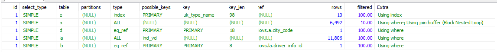
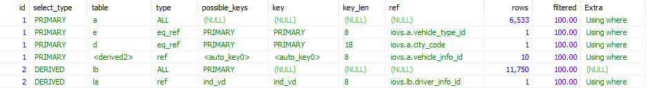
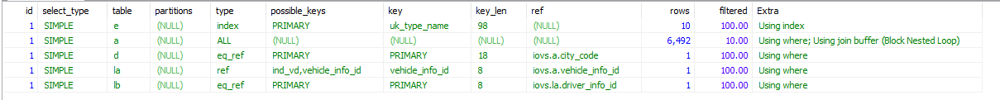

# explain使用

[EXPLAIN Output Format](https://dev.mysql.com/doc/refman/5.5/en/explain-output.html)

| name                                                         | 含义                   |
| ------------------------------------------------------------ | ---------------------- |
| [`id`](https://dev.mysql.com/doc/refman/5.5/en/explain-output.html#explain_id) | 该`SELECT`标识符       |
| [`select_type`](https://dev.mysql.com/doc/refman/5.5/en/explain-output.html#explain_select_type) | 该`SELECT`类型         |
| [`table`](https://dev.mysql.com/doc/refman/5.5/en/explain-output.html#explain_table) | 输出行表               |
| [`partitions`](https://dev.mysql.com/doc/refman/5.5/en/explain-output.html#explain_partitions) | 匹配的分区             |
| [`type`](https://dev.mysql.com/doc/refman/5.5/en/explain-output.html#explain_type) | 联接类型               |
| [`possible_keys`](https://dev.mysql.com/doc/refman/5.5/en/explain-output.html#explain_possible_keys) | 可能的索引选择         |
| [`key`](https://dev.mysql.com/doc/refman/5.5/en/explain-output.html#explain_key) | 实际选择的索引         |
| [`key_len`](https://dev.mysql.com/doc/refman/5.5/en/explain-output.html#explain_key_len) | 所选键的长度           |
| [`ref`](https://dev.mysql.com/doc/refman/5.5/en/explain-output.html#explain_ref) | 与索引比较的列         |
| [`rows`](https://dev.mysql.com/doc/refman/5.5/en/explain-output.html#explain_rows) | 估计要检查的行         |
| [`filtered`](https://dev.mysql.com/doc/refman/5.5/en/explain-output.html#explain_filtered) | 按表条件过滤的行百分比 |
| [`Extra`](https://dev.mysql.com/doc/refman/5.5/en/explain-output.html#explain_extra) | 附加信息               |


## id

这一列标识select所属的行，如果没有子查询或者联合，只会有唯一的select，这属于简单查询，还有复杂查询：简单子查询、派生表以及union查询。

id相同，执行顺序由上至下 

id不同，如果是子查询，id的序号会递增，id值越大优先级越高，越先被执行

简单子查询：


派生表（from子句中的子查询）：


union查询：


## select_type

| `select_type` 值                                             | 含义                                                         |
| ------------------------------------------------------------ | ------------------------------------------------------------ |
| `SIMPLE`                                                     | 简单[`SELECT`](https://dev.mysql.com/doc/refman/5.5/en/select.html)（不使用 [`UNION`](https://dev.mysql.com/doc/refman/5.5/en/union.html)或子查询） |
| `PRIMARY`                                                    | 最外层 [`SELECT`](https://dev.mysql.com/doc/refman/5.5/en/select.html) |
| [`UNION`](https://dev.mysql.com/doc/refman/5.5/en/union.html) | [`SELECT`](https://dev.mysql.com/doc/refman/5.5/en/select.html)陈述中的第二个或之后的陈述 [`UNION`](https://dev.mysql.com/doc/refman/5.5/en/union.html) |
| `DEPENDENT UNION`                                            | 中的第二个或更高版本的[`SELECT`](https://dev.mysql.com/doc/refman/5.5/en/select.html)语句 [`UNION`](https://dev.mysql.com/doc/refman/5.5/en/union.html)，取决于外部查询 |
| `UNION RESULT`                                               | 的结果[`UNION`](https://dev.mysql.com/doc/refman/5.5/en/union.html)。 |
| `SUBQUERY`                                                   | 首先[`SELECT`](https://dev.mysql.com/doc/refman/5.5/en/select.html)在子查询 |
| `DEPENDENT SUBQUERY`                                         | 首先[`SELECT`](https://dev.mysql.com/doc/refman/5.5/en/select.html)在子查询中，取决于外部查询 |
| `DERIVED`                                                    | 派生表                                                       |
| `UNCACHEABLE SUBQUERY`                                       | 子查询，其结果无法缓存，必须针对外部查询的每一行重新进行评估 |
| `UNCACHEABLE UNION`                                          | [`UNION`](https://dev.mysql.com/doc/refman/5.5/en/union.html) 属于不可缓存子查询的中的第二个或更高版本的选择（请参阅参考资料 `UNCACHEABLE SUBQUERY`） |

select查询的类型

**SIMPLE** 简单的select查询，查询中不包含子查询或者UNION

**PRIMARY** 查询中若包含任何复杂的子部分，最外层查询则被标记为PRIMARY

**SUBQUERY** 在SELECT或WHERE列表中包含了子查询

**DERIVED** 在FROM列表中包含的子查询被标记为DERIVED（派生表），MySQL会递归执行这些子查询，把结果放在临时表中

**UNION** 若第二个SELECT出现在UNION之后，则被标记为UNION：若UNION包含在FROM子句的子查询中，外层SELECT将被标记为：DERIVED

**UNION RESULT** 从UNION表获取结果的SELECT


## table

表名或者是表的别名。


## type

```sql
#主键查询 const
explain select SQL_NO_CACHE * from lease_contract where contract_id=16431;

#唯一索引查询 const
explain select SQL_NO_CACHE * from lease_contract where contract_num='W-GZ-00009';

#连接唯一索引查询 eq_ref
explain select a.vehicle_info_id from lease_contract a join vehicle_info b on a.vehicle_info_id=b.vehicle_info_id
where a.contract_status=1;

#索引查询 ref
explain select SQL_NO_CACHE * from lease_contract where driver_info_id=36;

#索引范围查询 range
explain select SQL_NO_CACHE * from lease_contract where driver_info_id between 36 and 40;

#全表查询 index
explain select SQL_NO_CACHE contract_id from lease_contract where contract_status=1;

#全表查询 all
explain select SQL_NO_CACHE * from lease_contract where contract_status=1;
```

```
system > const > eq_ref > ref > range > index > all
一般来说，得保证查询至少达到range级别，最好能达到ref。
```

**system** 表只有一行记录（等于系统表），这是const类型的特列，平时不会出现，这个也可以忽略不计

**const** 表示通过索引一次就找到了，const用于比较**primary key** 或者**unique**索引。因为只匹配一行数据，所以很快。如将主键置于where列表中，MySQL就能将该查询转换为一个常量。

首先进行子查询得到一个结果的d1临时表，子查询条件为id = 1 是常量，所以type是const，id为1的相当于只查询一条记录，所以type为system。

**eq_ref** 唯一性索引扫描，对于每个索引键，表中只有一条记录与之匹配。常见于主键或唯一索引扫描

**ref** 非唯一性索引扫描，返回匹配某个单独值的所有行，本质上也是一种索引访问，它返回所有匹配某个单独值的行，然而，它可能会找到多个符合条件的行，所以他应该属于查找和扫描的混合体。


**range** 范围索引扫描，只检索给定范围的行，使用一个索引来选择行，key列显示使用了哪个索引，一般就是在你的where语句中出现between、< 、>、in等的查询，这种范围扫描索引比全表扫描要好，因为它只需要开始于索引的某一点，而结束于另一点，不用扫描全部索引。


**index** Full Index Scan，全索引扫描，Index与All区别为index类型只遍历索引树。这通常比ALL快，因为索引文件通常比数据文件小。（也就是说虽然all和Index都是读全表，但index是从索引中读取的，而all是从硬盘读取的）

id是主键，所以存在主键索引

**all** Full Table Scan 全表扫描，将遍历全表以找到匹配的行


## possible_keys

显示可能应用在这张表中的索引，一个或多个。查询涉及到的字段上若存在索引，则该索引将被列出，**但不一定被查询实际使用**。

## key

实际使用的索引，如果为NULL，则没有使用索引。（可能原因包括没有建立索引或索引失效） 

## key_len

mysql在索引里使用的字节数。

## ref

显示索引的那一列被使用了，如果可能的话，最好是一个常数。哪些列或常量被用于查找索引列上的值。

## rows

MySQL估计为了找到所需行读取的行数。


## filtered

它显示的是针对表里符合某个条件(where子句或联结条件)的记录数的百分比所做的一个悲观估计。如果你把rows和这个百分比相乘，就能看到MySQL估算它将和查询计划里前一个表关联的行数


## extra

**Using index**

表示MySQL将使用**覆盖索引**，避免访问表。如果同时出现using where，表明索引被用来执行索引键值的查找；如果没有同时出现using where，表明索引用来读取数据而非执行查找动作。

**Using where**

MySQL服务器将在存储引擎检索行后再进行过滤。表明使用了where过滤

**Using temporary**

使用了用临时表保存中间结果，MySQL在对查询结果排序时使用临时表。常见于排序order by和分组查询group by。 

**Using filesort**

说明mysql会对数据使用一个外部的索引排序，而不是按照表内的索引顺序进行读取。MySQL中无法利用索引完成的排序操作称为“文件排序”。 第6章文件排序算法。

**Range checked for each record(index map: N)**

意味着没有好用的索引，新的索引将在联结的每一行上重新估算。N是显示再possible_key列中索引的位图，并且是冗余的。


# 优化后的sql

使用show warnings会看到优化器重写后的sql。

5.6

```sql
explain extended SQL;
show warnings;
```
5.7
```sql
explain SQL;
show warnings;
```


# 唯一索引 和 普通索引 的查询性能比较？

[《Mysql - 索引（唯一索引和普通索引的选择）Change Buffer 》](https://www.cnblogs.com/25-lH/p/10967830.html)

　　- **性能之差 微乎其微**

 

　　**- 原因**

　　　　- InnoDB 的数据是按数据页为单位来读写的。

　　　　　　- 当需要读一条记录的时候，并不是将这个记录本身从磁盘读出来，而是以页(InnoDB 中，每个数据页的大小默认是 16KB)为单位，将其整体读入内存。

　　　　- 那么，对于普通索引来说，要多做的那一次“查找和判断下一条记录”的操作，就只需要一次指针寻找和一次计算。

　　　　- 当然，如果 k=5 这个记录刚好是这个数据页的最后一个记录，那么要取下一个记录，必须读取下一个数据页，这个操作会稍微复杂一些。

　　　　　　- 但是，对于整型字段，一个数据页可以放近千个 key，因此出现这种情况的概率会很低。

　　　　　　- 所以，我们计算平均性能差异时，仍可以认为这个操作成本对于现在的 CPU 来说可以忽略不计。 


# 优化实例

## 1派生表优化
```sql
SELECT
a.vin,
a.license_plate_num,
a.city_code,
d.NAME AS cityName,
x.driver_name,
x.driver_mobile_num,
e.type_name
FROM
vehicle_info a
JOIN area d ON a.city_code = d.area_code
JOIN vehicle_type e ON a.vehicle_type_id = e.vehicle_type_id
LEFT JOIN (
SELECT
la.vehicle_info_id,
lb.driver_name,
lb.driver_mobile_num
FROM
lease_contract la
JOIN driver_info lb ON la.driver_info_id = lb.driver_info_id
AND ( contract_status = 3 OR contract_status IS NULL )
) x ON x.vehicle_info_id = a.vehicle_info_id
WHERE
(
a.license_plate_num LIKE concat( '%', '123', '%' )
OR a.vin LIKE concat( '%', '123', '%' )
OR x.driver_name LIKE concat( '%', '123', '%' )
)
```

mysql 5.6中查询只需要几十毫秒，而MySQL5.7中却需要十几秒？

5.7中explain结果：



5.6中explain结果：



可以看到，二者差别主要在于是否生成了派生表。

5.6中的sql会生成一个派生表，而MySQL会为这个派生表优化，添加一个auto_key0的索引。

5.7中的sql则会被优化器优化成一个连表查询，这时候因为连接使用的vehicle_info_id没有添加索引，导致全表扫描。两个上万大小的表连表查询没有索引，就等于上亿次的查询了，查询速度相差几百倍。

所以优化的结果就是为合同表的vehicle_info_id增加一个索引。

5.7添加索引以后explain结果：



[How do I know what's behind the `auto_key0` index in MySQL?](https://stackoverflow.com/questions/51158455/how-do-i-know-whats-behind-the-auto-key0-index-in-mysql)