# 1.MySQL的架构

## 1.1三层架构：

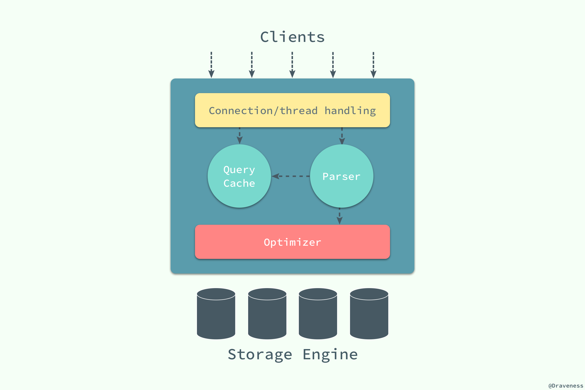

最上层的服务不是mysql独有的，大多数基于网络客户端/服务器的工具或者服务都有类似的架构。如**<u>连接处理、授权认证、安全</u>**等。

第二层架构，大多数MySQL核心服务功能都在这一层，<u>**查询解析、分析优化、缓存**</u>以及所有的内置函数（日期，时间，数学和加密函数），所有跨存储引擎的功能都在这一层实现：存储过程、触发器、视图等。

第三层包含了**<u>存储引擎</u>**，存储引擎负责MySQL数据的存储和提取。和GNU/Linux下的各种文件系统一样，每个存储引擎都有自己的优劣。服务器通过api和存储引擎通信。这些接口屏蔽了不同的存储引擎之间的差异。存储引擎api包含了几十个底层函数，用于执行诸如‘开始一个事务’或者“根据主键提取一行记录”等操作。但**<u>存储引擎不会去解析sql，不同的存储引擎之间也不会相互通信，只是简单响应上层服务器的请求</u>**。

二、连接管理和安全性

每个客户端连接都会在服务器进程中拥有一个线程，这个链接的查询只会在这个单独的线程中执行，该线程只能轮流在某个CPU核心或者CPU中运行。服务器会负责缓存线程，因此不需要为每一个新建的创建或者销毁线程。

当客户端（应用）连接到MySQL服务器时，服务器需要对其进行认证。认证基于用户名，原始主机信息和密码。如果使用了安全套接字(SSL)的方式连接，还可以使用X.509整数认证。一旦客户端连接成功，服务器会继续验证该客户端是否具有执行某个特定查询的权限。

三、优化与执行

MySQL会解析查询，并创建内部数据结构（解析树），然后对其进行各种优化，包括重写查询，决定表的读取顺序，以及选择合适的索引等。用户可以通过特殊的关键字提示（hint）优化器，影响他的决策过程。也可以请求优化器解释(explain)优化过程的各个因素，使用户可以知道服务器是如何进行优化决策的，并提供一个参考基准，便于用户重构查询和schema(对于MySQL下的schema，可以理解成就是存储数据的地方)、修改相关配置，使应用尽可能高效运行。

优化器并不关心表使用的是什么存储引擎，但存储引擎对于优化查询是有影响的。优化器会起请求存储引擎提供容量或某个具体操作的开销信息，以及表数据的统计信息等。

对于SELECT语句，在解析查询之前，服务器会先检查缓存(Query cache)，如果能够在其中找到对应的查询，服务器就不必在执行查询解析、优化和执行的整个过程，而是直接返回查询缓存中的结果集。

## 1.2并发控制：

### 1.2.1读写锁：

共享锁，读锁：

多个客户同时可以读取同一个资源，互不干扰。

排他锁，写锁：

会阻塞其他的写锁和读锁，防止其他用户读取正在写入的统一资源。

### 1.2.2锁粒度：

表锁：服务器层，如alter table，myisam只支持表锁

行锁：存储引擎层实现，InnoDB和XtraDB实现了行锁

### 1.2.3事务：

#### acid四大特性

原子性atomicity：要么全部成功要么全部失败。

一致性consistency：从一个一致性状态转换到另外一个一致性状态。

隔离性isolation：修改在commit之前，对于其他事务来说是不可见的。

持久性durability：一旦commit，就会永久保存在数据库。

#### 隔离级别

read uncommitted 未提交读 

允许脏读，也就是说一个事务有可能读到另一个事务未提交的数据

read committed 提交读 

只能读到已经提交的数据，Oracle等多数数据库的默认隔离级别，大多数情况下推荐使用的隔离级别。

repeatable read 可重复读 （MySQL默认隔离级别）

会发生 幻读，MySQL使用mvcc一定意义上解决了这个问题。

serializable 可串行化

加锁读，完全串行化，每次读都需要获得表级共享锁，读写阻塞，性能差

#### 死锁：

死锁检测：

越复杂的系统，如innodb，越能检测到死锁的循环依赖，并立即返回一个错误。这种解决方式很有效。

死锁超时机制：

当查询的时间达到锁等待超时的设定后放弃锁请求，这种方式通常来说不太好。

innodb目前处理死锁的方法是，将持有最少行级排他锁的事务回滚。

#### 事务日志：

事务日志可以帮助提高事务的效率，预写式日志，修改数据需要写两次磁盘。

修改表的数据时，先将修改行为写入事务日志，而不是马上持久化到磁盘，事务日志是追加的方式，顺序io，速度快很多，事务日志持久化以后，内存中被修改的数据在后台慢慢的刷回到磁盘。

#### MySQL中的事务：

自动提交

如果不是显示的开始一个事务，每个查询都被当做一个事务执行提交操作，可以禁用自动提交模式。
```sql
set autocomit = 1;
```
1或者on表示启用，0或者off表示禁用，当autocomit=0时，所有的查询都在一个事务中，知道显示的执行commit，该事务结束，开始一个新的事务。

可以设置隔离级别，新的隔离级别在下一个事务开始的时候生效。
```sql
set session transaction isolation level read committed;
```

#### 事务混合使用存储引擎

事务时存储引擎实现的，同一个事务，使用多种存储引擎是不可靠的。

如果混合使用了事务型和非事务型的表，正常提交没问题，但是回滚，非事务表的变更无法撤销。

## 1.3多版本并发控制 MVCC

可以认为mvcc是行级锁的变种，在很多情况下避免了加锁操作，开销更低。非阻塞的读操作，写操作也只锁定必要的行。

通过保存数据在某个时间点的快照实现的。

innodb的mvcc，通过每行记录增加两个隐藏的列实现的，一个保存了创建时间，一个保存删除时间，这个时间其实是系统版本号，每开始一个新的事务，系统版本号都是自动递增。

在repeatable read和read committed两个隔离级别下工作。

在事务隔离级别READ COMMITTED和REPEATABLE READ（InnoDB存储引擎的默认事务隔离级别） 下， InnoDB存储引擎使用非锁定的一致性读。 然而， 对于快照数据的定义却不相同。
在READ COMMITTED事务隔离级别下， 对于快照数据， 非一致性读总是读取被锁定行的**最新一份**快照数据。 
而在REPEATABLE READ事务隔离级别下， 对于快照数据， 非一致性读总是读取事务**开始时**的行数据版本。 

## 1.4存储引擎：

`.frm`文件保存表定义

表定义是在MySQL服务层统一处理的；

数据和索引是不同的存储引擎，不同的保存方式。

### InnoDB存储引擎

数据和索引存储在`.ibd`文件

MySQL默认**事务型引擎**，被设计用来处理大量的短期事务，短期事务大部分情况是正常提交，很少被回滚。

因为它的性能和**自动崩溃恢复特性**，使得它在非事务型存储的需求中也很流行。

除非有非常特别的原因，否则应该优先考虑InnoDB引擎。

mvcc支持高并发。间隙锁策略防止幻读出现。

基于**聚簇索引**建立，主键查询效率高，但是二级索引需要包含主键列，如果主键很大，会导致所有的索引都很大，因此如果索引多，主键应该尽可能小。

### MyISAM存储引擎

数据文件和索引文件，分别是`.MYD`和`.MYI`

不支持事务和行级锁。崩溃后无法安全恢复。对于只读的数据，或者表比较小、可以忍受修复操作的，依然可以继续使用MyISAM。

MyISAM支持支持三种不同的存储格式：静态表(默认，但是注意数据末尾不能有空格，会被去掉)、动态表、压缩表。当表在创建之后并导入数据之后，不会再进行修改操作，可以使用压缩表，极大的减少磁盘的空间占用。

### 选择合适的引擎

除非需要用到某些InnoDB不具备的特性，并且没有其他办法可以替代，否则都应该优先选择InnoDB。

除非万不得已，否则建议不要混合使用多种存储引擎。

# 2.MySQL基准测试

吞吐量

响应时间或者延迟

并发性

可扩展性

# 3.服务器性能剖析

我们将性能定义为完成某件任务所需要的时间度量，即响应时间。

## 慢查询日志

[mysql 开启慢查询及其用mysqldumpslow做日志分析](https://blog.csdn.net/sunyuhua_keyboard/article/details/81204020)

```sql
--查看慢查询日志设置，on开启，off禁用
show variables like '%slow_query_log%';
/*开启慢查询日志，只对当前数据库生效，MySQL重启后则会失效。如果要永久生效，就必须修改配置文件my.cnf（其它系统变量也是如此）
set global slow_query_log=1;

show variables like 'long_query_time';
set global long_query_time=4;
*/
```

```cnf
my.cnf文件
slow_query_log =1
slow_query_log_file=/usr/local/mysql/data/localhost-slow.log
```

# 4.schema和数据类型优化

## 4.1选择优化的数据类型

**更小的通常更好**，一般情况下，应该尽量使用可以正确存储数据的最小数据类型。

**简单就好**，简单数据类型通常需要更少的cpu周期，如整形比字符操作代价更低，因为字符集和校对规则(排序规则)使字符比较整形比较更复杂。应该使用MySQL内建类型而不是字符串来存储日期和时间，使用整形来存储ip地址。

**尽量避免null**，可为null的列会使用更多的存储空间，在MySQL里也需要特殊处理。当可为null的列被索引时，每个索引记录需要一个额外的字节。通常把可为null的列改为not null带来的性能提升较小，所有只是没必要对现有表进行修改，但是在计划在列上建索引，就应该避免设计成可为null的列。

### 4.1.1整数类型

类型：tinyint，smallint，mediumint，int，bigint

位：    8             16              24                   32    64

可以选择使用**无符号整形**，相同的存储空间，相同的性能。

整数计算一般使用64位的bigint，即使在32位环境也是如此。(一些聚合函数例外，它们使用decimal或double)

整形指定宽度，一般没有意义，不会限制值的合法范围，只是限制显示字符个数。

### 4.1.2实数类型

float和double使用标准的浮点运算进行近似计算。float使用4个字节，double使用8个字节。

decimal用于存储精确的小数，5.0以上版本将数字打包保存到一个**二进制字符串**中(**每4个字节存9个数字**)。如decimal(18,9)，小数点前的9个数字使用4个字节，后的9个数字使用4个字节，小数点本身使用一个字节。最多存65个数字。

在数据量比较大的情况下，可以考虑使用**bigint代替decimal**。这样可以避免**浮点存储计算不准确**和**decimal精确计算代价高**的问题。

#### Java中的大数

```java
//使用int[]数组记录大数
BigInteger bigInteger=new BigInteger("123456789123456789123456789123456789");
//使用BigInteger记录大数，分别记录整个数的长度，以及小数点后有几位
BigDecimal bigDecimal=new BigDecimal("123456789123456789123456789123456789.45");
```


### 4.1.3字符串类型

#### varchar

[MySQL中的CHAR和VARCHAR到底支持多长?](https://segmentfault.com/a/1190000021003363)

**4.0版本以下**，varchar(100)，指的是**100字节**，如果存放UTF8汉字时，只能存33个（每个汉字3字节） 

**5.0版本以上**，varchar(100)，指的是**100字符**，无论存放的是数字、字母还是UTF8汉字（每个汉字3字节），都可以存放100个。

VARCHAR最大65535**字节**，字符集对VARCHAR有影响，UTF8字符集，每个字符大小3字节，所以65535/3 = 21845，最大支持21845字符，因此VARCHAR()括号中最大填写21845字符

varchar可变长字符串，需要使用1-2个额外字节记录字符串的长度<=255字节使用1个字节表示，否则使用2个字节。varchar节省了存储空间，对性能也有帮助，但是由于行是边长变长的，update行变长，会导致需要额外的工作，如果一个行占用的空间增长，且页内没有更多空间可以存储，innodb会分裂页，使行可以放进页内。

varchar(10)和varchar(200)存储hello空间开销是一样的，但是使用前者更好，更长的列会消耗更多的内存，因为MySQL通常会使用固定大小的内存块保存值，尤其是使用内存临时表进行排序时会特别糟糕，在利用磁盘临时表进行排序时页同样糟糕，所以最好的策略时只分配真正需要的空间。

适合使用varchar的情况：**字符串列的最大长度比平均长度大很多；列的update少，碎片不会成为问题；使用了utf-8这样复杂的字符集，每个字符使用不同的字节数存储。**

5.0以上版本会在存储和检索时保留末尾空格，但在4.1或者更老的版本MySQL会剔除末尾空格，innodb会把过长的varchar存储为blob。

#### char

CHAR最大255**字符**


char是定长的，MySQL会删除所有的末尾空格。char适合存储很短的字符串，varchar需要多一个字节记录长度，或者所有值都接近同一个长度，例如MD5，对应经常更新的数据，char也比varchar更好，因为定长char不易产生碎片。

#### char和varchar？

**原则一：根据字符串长度确定，凡是固定长度的字符串或者类似固定长度的字符串一律用char。**比如身份证号码，手机号码，银行卡号，MD5，哈希值等这是字符串是固定长度的，毫无疑问用char，还有一类是基本固定长度但是略有出入的，比如中国人的姓名等，一般长度可能是2~5个汉字，这类信息也非常适合用char来存储，只要分配一些略大于通常长度即可。

**原则二：数据是否经常更改导致碎片，可能经常变动而产生存储碎片的小字符串一律用char。**我们知道char类型的数据是一次性分配存储空间的，无论以后你怎么修改，数据始终在该存储空间内的，不会产生碎片。而varchar则不同，varchar的数据长度是可变的，当修改后的数据大于当前存储长度时，就会产生碎片，如果该应用是反复修改数据的应用，那么久而久之就是产生无数碎片，效率可想而知。

**原则三：理解varchar的存储空间和内存空间的区别，合理指定varchar的长度。**我们知道varchar的存储长度是根据字符串的长度而定的，但是运行时占用的内存空间却是按照定义的长度分配内存空间的。这个现象导致存储一个字符串，比如通信地址，通畅在100个字符内就能存储完成，于是varchar(100)是一个合理的选择，但是由于之前讲的，可能有人图方便使用varchar(500)，反正用的存储空间是一样的，但是效果确实不一样的。在内存模型中varchar(100)与varchar(500)是两码事，后者比前者占用多5倍的内存空间，在临时表和排序的时候这个差别几乎可能差一个数量级，于是效率可想而知。

#### blob和text

是为了存储很大的数据而设计的字符串数据类型

blob存储的是**二进制**数据，没有排序规则或字符集

text**字符**方式存储，有字符集和排序规则。

tinytext，smalltext，text，mediumtext，longtext

tinyblob，smallblob，blob，mediumblob，longblob

当blob和text太大时，innodb会专门用外部存储区域来进行存储，此时每个值在行内需要1-4个字节存储一个指针，然后在外部存储区域存储实际的值。

排序只对每个列最前max_sort_length字节而不是整个字符串做排序。

#### 枚举

建表时枚举列会把一些不重复的字符串存储成一个预定义的集合，MySQL存储枚举非常紧凑，会根据枚举值的数量压缩到1-2个字节，在内部会将每个列表中的位置保存位整数，在.frm文件中保存“数字-字符串”映射关系。

最大的缺点是，增加或者删除字符串alter table。

enum和varchar关联查询，会变慢。

### 4.1.4日期和时间类型

datetime 可以保存1001-9999年，精确到秒。它把日期和时间封装成格式为YYYYMMDDHHMMSS的整数中，时区无关，使用8个字节

timestamp 时间戳保存了从1970-01-01 00:00:00(GMT时间)以来的秒数，4个字节存储，只能表示1970-2038年。

from_unixtime()将unix时间戳转换为日期, unix_timestamp()将日期转换为unix时间戳。

timestamp显示的值也依赖于时区。MySQL服务器、操作系统、客户端连接都有时区设置。

## 4.2MySQL schema设计中的陷阱

**太多的列**，服务器层和存储引擎层之间通过行缓冲格式c拷贝数据，然后在服务器层解码成列，这个操作代价是很高的，innodb的行结构总是需要转换，如果计划使用数千个字段，必须意识到服务器性能会有影响。

**太多的关联**，MySQL限制了每个关联操作最多只能有61个表，解析和优化查询会成为MySQL的问题，如果希望查询执行的快速且并发性能好，单个查询最好限制在12个表以内关联。

## 4.3范式和反范式

范式化的数据库中，每个事实数据只会出现一次，相反，在反范式化的数据库中，信息是冗余的。

### 范式优点：

更新操作通常更快。

重复数据少，只需要修改更少的数据。

表更小，更好的放入内存，执行操作更快。

更少有多余的数据，意味着检索列表数据更少需要distinct或者group by。

### 范式缺点：

总是需要关联操作，使一些索引策略失效，范式可能将列存放在不同的表中，而如果这些在一个表中本可以属于同一个索引。

### 反范式优点：

避免关联，当数据比内存大时可能要比关联快的多，因为这样避免了随机io。

跟有效的索引策略。

### 混用范式和反范式：

适当冗余会更好的提高性能。

## 4.4缓存表和汇总表

有时提升性能最好的方法是在同一张表保存衍生的冗余数据。

有时页需要创建一张完全独立的汇总表或者缓存表。比如之前google汇总数据的表。

## 4.5加快alter table操作的速度

MySQL大部分修改表结构的操作都是用新的结构创建一个空表，从旧表查出所有数据插入新表，然后删除旧表。

两种常见技巧：

一种是在一台不提供服务的机器上执行alter table，然后和提供服务的主库进行切换。

另外一种叫”影子拷贝“，影子拷贝的技巧是用要求的表结构创建一张和源表无关的新表，然后通过重命名和删表操作交换两张表。

# 5.创建高性能的索引

索引是在存储引擎层而不是服务器层实现的。

## 5.1索引的类型

### B-Tree索引

实际上大多数存储引擎使用的是b+tree索引，也就是每个叶子节点包含一个指向下一个叶子节点的指针，便于范围遍历。
二叉树、二叉排序树、平衡二叉树(avl树，红黑树)、B-树、B+树

[树型结构的基本概念](https://www.cnblogs.com/xrq730/p/5187032.html)

[AVL树，红黑树，B树，B+树，Trie树都分别应用在哪些现实场景中？](https://www.zhihu.com/question/30527705)


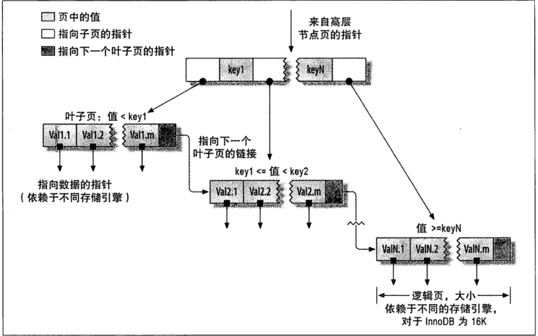

最左匹配，如果不是按照索引的最左列开始查找，则无法使用索引。

### 哈希索引

基于哈希表实现，只有精确匹配所有列的查询才有效。

不支持范围查找。

InnoDB引擎有一个特殊的功能叫做”自适应哈希索引“，当InnoDB注意到某些索引值被使用的非常频繁的时候，会基于B-Tree索引再创建一个哈希索引，让B-Tree索引也具有哈希索引的一些优点，这是一个完全自动内部的行为，用户无法控制，如有必要，可以关闭。

### 全文索引

查找文本中的关键字，而不是比较索引中的值。类似于搜索引擎。

## 5.2索引的优点

减少了服务器需要扫描的数据量。

帮助服务器避免排序和临时表。

将随机io变成顺序io。

## 5.3高性能的索引策略

### 独立的列

我们应该养成习惯，始终将索引的列单独放在比较符号的一侧。

### 前缀索引和索引选择性

对于blob、text和长varchar，必须使用前缀索引。选择足够长的前缀保证较高的选择性，同时又不能太长。
```sql
select count(*) as cnt,city
from city_demo group by city order by cnt limit 10;
--查出每个值出现重复的次数，每个值出现45-65次
```
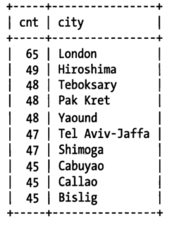

```sql
select count(*) as cnt , left(city,7) as pref 
from city_demo group by pref
order by cnt desc limit 10;
--前缀长度为7时，前缀出现次数，比较接近真实数据
```
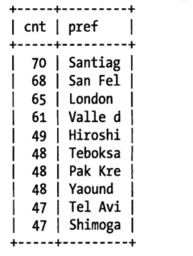

```sql
select count(distinct left(city,3))/count(*) as sel3,
count(distinct left(city,4))/count(*) as sel4,
count(distinct left(city,5))/count(*) as sel5,
count(distinct left(city,6))/count(*) as sel6,
count(distinct left(city,7))/count(*) as sel7
from city_demo;
/*查询显示前缀长度达到7的时候再增加前缀长度，选择性提升幅度已经很小了，一般来说前缀的选择性接近0.031基本上就可以用了，但是只看前缀选择性是不够的，还需要看数据分布是否均匀*/
```

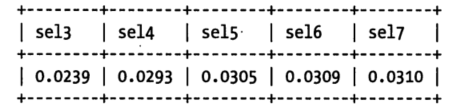

有时候后缀索引也有用途，比如电子邮件地址，MySQL不支持反向索引，但是可以将字符串反转后存储。

### 多列索引

在多个列上建立独立的单列索引大部分情况下不能提高MySQL的查询性能。MySQL5.0更新版本引入了”索引合并“的策略，一定程度上可以使用表上的多个单列索引来定位指定行。更早版本的MySQL只能使用单列索引，然而这种情况下没有哪一个独立的单列索引是非常有效的。

```sql
select film_id,actor_id from film_actor
where actor_id = 1 or film_id = 1;
--老版本这个查询会使用全表扫描，除非改成如下union方式
select film_id,actor_id from film_actor where actor_id = 1
union all
select film_id,actor_id from film_actor where film_id=1 and actor_id <> 1;
/*
5.0以后版本，查询能够同时将两个单列索引进行扫描，并进行合并。or->联合(union),and->相交(intersection),组合前两种情况的联合及相交。
*/
```
索引合并策略是一种优化的结果，但是更多时候说明表上的索引建的很糟糕。

### 聚簇索引

innodb的聚簇索引实际上在同一个结构上面保存了索引和数据行。叶子页包含了行的全部数据，但是节点页只包含了索引列。

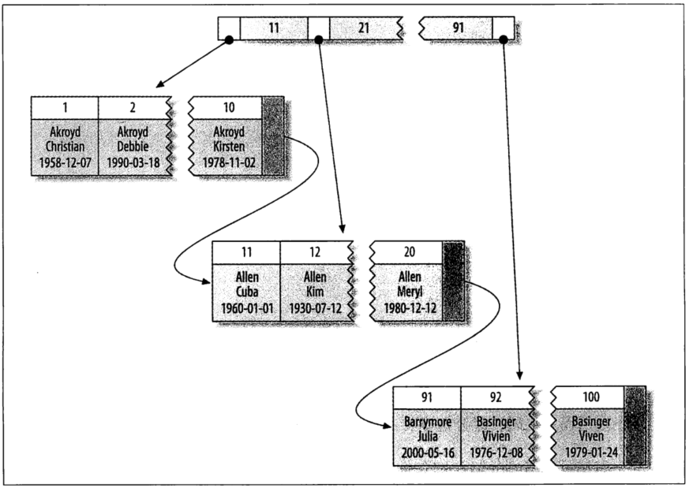

innodb通过主键聚集数据。

优点：

1.可以把相关数据保存在一起。

2.数据访问更快，索引和数据块在同一个位置，可以直接获得数据。

3.覆盖索引可以直接获得节点中的主键值。

缺点：

插入速度严重依赖插入顺序，主键顺序插入是加载数据到innodb表最快的方式，如果不是按照主键顺序加载数据，在加载完成后最好使用optimize table 重新组织一下表。

二级索引可能比想象的要更大，因为二级索引叶子节点包含了引用行的主键列。

二级索引访问需要两次索引查找，而不是一次。对于innodb，自适应哈希索引能够减少这样的重复工作。

### 覆盖索引

如果一个索引包含所有需要查询的字段的值，我们就称之为”覆盖索引“。

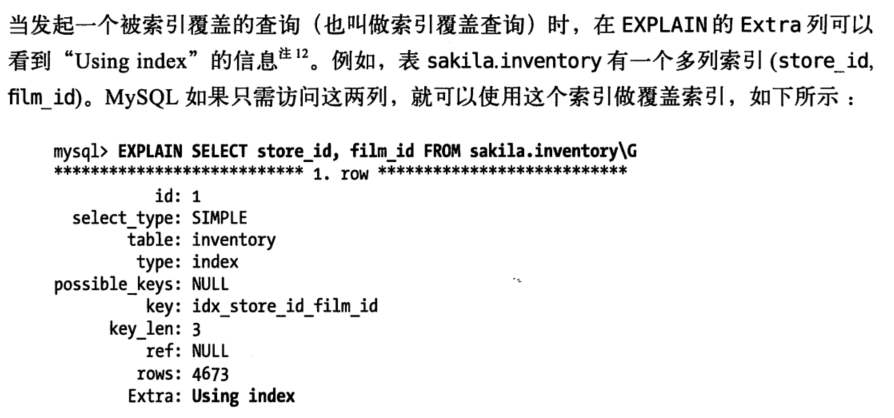


# 6.查询性能优化

## 6.1优化数据访问

### 是否向数据库请求了不需要的数据

查询不需要的记录

多表关联时返回全部列

总是取出全部列

重复查询相同的数据

**加limit限制返回结果集，减少select *，只查询需要的字段**

### MySQL是否在扫描额外的记录

响应的时间

扫描的行数和返回的行数

扫描的行数和访问类型


一般MySQL能够使用如下三种方式应用where条件，从好到坏依次为：

1.在索引中使用where条件来过滤不匹配的记录。存储引擎层完成。

2.索引覆盖扫描（extra中出现using index）返回数据，直接从索引中过滤不需要的记录并返回命中的结果。这是MySQL服务器层完成的，但无需回表查询记录。

3.从数据表中返回数据，然后过滤不满足条件的记录（extra中出现using where）。这是在MySQL服务器层完成，MySQL需要先从数据表读出记录然后过滤。

## 6.2查询执行的基础

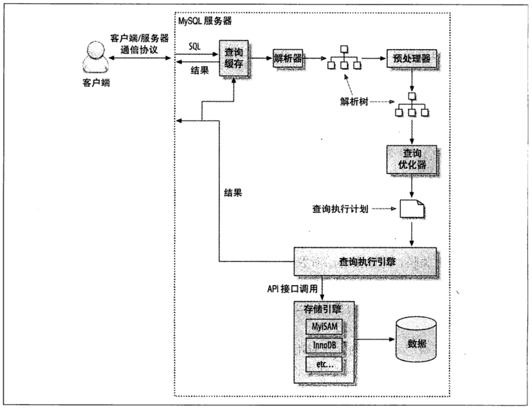

1.客户端发送一条查询给服务器。

2.服务器先检查查询缓存，命中缓存，立即返回存储在缓存的结果，否则进入下一阶段。

3.服务器层进行sql解析、预处理，再由优化器生成对应的执行计划。

4.MySQL根据优化器生成的执行计划，调用存储引擎的api来执行查询。

5.将结果返回客户端。


### MySQL客户端/服务器通信协议

半双工，无法进行流量控制，一旦一端开始发送消息，另外一端要接受完整个消息才能响应它。

查询状态：
```sql
show full processlist
```
### 查询优化处理

#### 语法解析器和预处理

MySQL通过关键字将sql语句进行解析，并生成一棵对应的“解析树”。MySQL解析器将使用MySQL语法规则验证和解析查询。例如，他将验证是否使用错误的关键字，或者使用关键字顺序是否正确等。

预处理器则根据一些MySQL规则进一步检查解析树是否合法，检查数据表和数据列是否存在，解析名字和别名。

下一步处理器会验证权限。

#### 查询优化器

一条查询可以有多种执行方式，返回相同的结果。优化器的作用是找到其中最好的执行计划。

MySQL使用基于成本的优化器，尝试预测一个查询使用某种执行计划的成本。选择成本最小的一个。最初，成本的最小单位是随机读取一个4k数据页的成本，后来变得更加复杂，引入了一些“因子”来估算某些操作的代价，如当执行一次where比较的成本，通过查询当前会话的last_query_cost来得知MySQL计算的当前查询的成本。

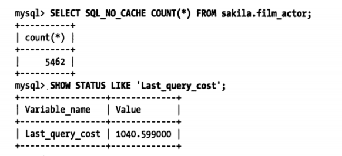

这是根据一系列统计数据计算出来的：每个表或者索引的页面个数、索引的基数、索引和数据行的长度、索引分布情况。

导致MySQL优化器选择错误的执行计划的原因：

统计数据不准确。如innodb因为mvcc架构，不能维护一个数据表的行数的。

执行计划中的成本估算不等同于实际执行的成本。


优化策略分为动态优化和静态优化。

静态优化可以直接对解析树进行分析，并完成优化。例如，优化器可以通过一些简单的代数变换将where条件转换成另一种等价形式。静态优化不依赖于特别的值，如where条件中带入的一些常数等。静态优化在第一次完成后就一直有效，即使使用不同的参数查询也不会发生变化。

相反，动态优化则和查询的上下文有关，也可能和很多其他因素有关，例如where条件中的取值、索引中条目的数据行数等。

#### mysql能够处理的优化类型：

**重新定义关联表顺序**

**将外连接转换成内连接**，比如where条件、库表结构可能让外连接等价于一个内连接，mysql会识别，让它可以调整关联顺序。

**使用等价变换规则**，如(5=5 and a>5)=>a>5; (a<b and b=c)and a=5=>b>5 and b=c and a=5

**优化count()，min()和max()**，

**预估并转换为常数表达式**

**覆盖索引扫描**，不是所有类型的索引都可以成为覆盖索引。覆盖索引必须要存储索引的列，而哈希索引、空间索引和全文索引等都不存储索引列的值，所以MySQL只能使用B-Tree索引做覆盖索引

**子查询优化**，

**提前终止查询**，使用limit

**等值传播**，如果两个列关联，MySQL能够将其中一个列的where条件传递到另一个列上。

**列表in()比较**，MySQL会将in()列表排序，二分查找，当列表数量大时，MySQL处理会更快。


### MySQL如何执行关联查询

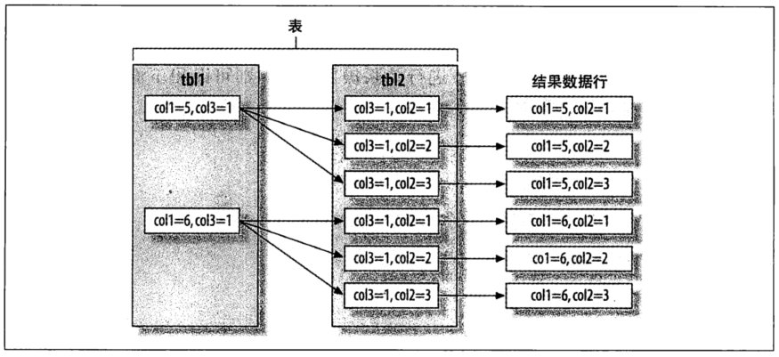


#### 关联查询优化器

它决定了多个表关联时的顺序。通常多表关联的时候，可以有多种不同的关联顺序来获得相同的执行结果，关联查询优化器通过评估不同顺序的成本来选择一个代价最小的关联顺序。

**排序优化**

当不能使用索引生成排序结果的时候，MySQL需要自己进行排序，数据量小则在内存中进行，数据量大则需要磁盘，这个过程统一称为文件排序(filesort)

**两次传输排序：**

读取行指针和需要排序的字段，对其排序，然后再根据排序结果读取所需数据。

**单次传输排序：**

先读取查询所需的所有列，然后根据给定列进行排序。

当查询需要所有列的总长度不超过`max_length_for_sort_data`时，MySQL使用单次传输排序。

MySQL在进行文件排序的时候需要使用的**临时存储空间可能会比想象的要大得多**。因为MySQL会对每一个排序记录都分配一个足够长的定长空间来存放。这个定长空间必须足够长以容纳其中最长的字符串，例如，如果是varchar则需要分配其完整长度；如果使用utf-8，那么MySQL会为每个字符预留三个字节。在一些库表结构设计不合理的案例中看到，排序消耗的临时空间比磁盘上的原表大很多倍。

关联查询如果需要排序，MySQL会分两种情况处理。排序的列都来自第一个关联表，那么MySQL会在关联处理第一个表的时候就进行文件排序，`Using filesort`。除此之外的其他情况，MySQL会将关联查询的结果先放到一个临时表，所有关联结束以后，在进行文件排序，`Using temporary;Using filesort`。如果查询中有limit，limit也会在排序之后应用。MySQL5.6在这里做了很多改进。当只需要返回部分排序结果的时候，MySQL不再对所有结果排序，而是根据实际情况抛弃不满足条件的结果，然后进行排序。


## 6.3 MySQL查询优化器的局限性

使用in()加子查询，性能经常会非常糟，所有通常建议使用exists()等效改写查询来获取更好的效率。

5.6版本以后已经优化，使用临时表。

https://blog.csdn.net/listen2you/article/details/79222295


## 6.4 特定类型的优化

### 6.4.1 count()查询优化

count(column) 统计列值非空数量。

count(*) 统计行数，并不是扩展成所有列，而是忽略所有的列，直接统计所有的行数。

如果希望知道的是结果集的行数，最好使用count(*)，这样写意义清晰，性能也会很好。

sql 语句中count()有条件的时候为什么要加上or null？

如count(province = '浙江' or NULL) 这部分，为什么要加上or NULL，直接count(province='浙江')有什么问题吗？不就是要找province = '浙江'的数据吗，为什么要计算NULL的数据？

答案：
因为当 province不是浙江时 province='浙江' 结果false。不是 NULL，
count在值是NULL是不统计数，   （count('任意内容')都会统计出所有记录数，因为count只有在遇见null时不计数，即count(null)==0，因此前者单引号内不管输入什么值都会统计出所有记录数），至于加上or  NULL ， 很像其他编程里的or运算符，第一个表达式是true就是不执行or后面的表达式，第一个表达式是false 执行or后面的表达式  。当province不为浙江时province = '浙江' or NULL 的结果是NULL，Count才不会统计上这条记录数。

### 6.4.2 优化关联查询

**确保on或者using子句中的列上有索引**。在创建索引的时候就要考虑到关联的顺序。

**确保任何的group by和order by中的表达式中只涉及到一个表的列**，这样才有可能使用到索引来优化这个过程。

**升级MySQL时需要注意：关联语法、运算符优先级等其他地方可能会发生变化。**因为以前是普通关联的地方可能会变成笛卡尔积。


### 6.4.3 优化子查询

子查询优化最重要的建议就是尽可能使用关联查询代替，如果使用MySQL5.6以上版本，那么就可以直接忽略关于子查询的这些建议了。


### 6.4.4 优化group by和distinct

可以使用索引优化，也是最有效的优化方法。

当无法使用索引时，使用临时表或者文件排序来做分组。


### 6.4.5 优化limit分页

尽可能的使用索引覆盖扫描，然后根据需要做一次关联操作再返回所需要的列。对于偏移量很大的时候，这样的效率会提升非常大。
```sql

select * from charging_dcdata order by chargepointid,CHARGEINTERFACENO,datadate limit 1000000,20;

select a.* from charging_dcdata a join (
select chargepointid,CHARGEINTERFACENO,datadate from charging_dcdata order by chargepointid,CHARGEINTERFACENO,datadate limit 1000000,20) b
using(chargepointid,CHARGEINTERFACENO,datadate);
```


# 7.MySQL高级特性

## 7.1分区表

分区表的应用场景：

表非常大以至于无法全部放在内存中，或者只在表的最后部分有热点数据。其他均是历史数据。

分区表的数据更加容易维护。例如，想批量删除大量数据可以使用清除整个分区的方式，还可以对一个独立分区进行优化、检查、修改等操作。

分区表的数据可以分布再不同的物理设备上，从而高效的利用多个硬件设备。

可以使用分区表来避免某些特殊的瓶颈，比如innodb的单个索引的互斥访问、ext3文件系统的inode锁竞争。

如果需要，还可以备份和恢复独立的分区，这在非常大的数据集的场景下效果非常好。


## 7.2视图


## 7.3 外键约束

Innodb支持外键约束


## 7.4 在MySQL内部存储代码

MySQL允许通过触发器、存储过程、函数的形式来存储代码。

优点：

服务器内部执行，离数据最近，另外在服务器上执行还可以节省带宽和网络延迟。

代码重用。方便的统一业务规则，保证某些行为总是一致，提供一定的安全性。

简化代码的维护和版本更新。

服务端可以缓存存储过程的执行计划，对于反复调用的过程，会大大降低消耗。

备份维护会很简单，没什么外部依赖。

应用开发和数据库开发人员更好的分工，不过最好是数据库专家来开发存储过程，而不是每个应用开发人员都能写出高效的sql查询。

缺点：

MySQL没有提供很好的开发调试工具，编写MySQL的存储过程比其他的数据库要更难写。

较之应用程序的代码，存储过程的效率要稍微差些。存储过程中可以使用的函数非常有限，很难编写复杂的字符串维护功能，也很难实现太复杂的逻辑。

部署增加额外的复杂性。

安全隐患，如果将非标准的加密功能放在存储程序中，如果数据库被攻破，数据就泄露了。

存储过程会给数据库服务器增加额外的压力，而数据库服务器的扩展性相比应用服务器差很多。


## 7.5 查询缓存

MySQL查询缓存保存查询返回的完整结果，查询命中该缓存，MySQL会立即返回结果，跳过了解析、优化和执行阶段。

查询缓存会跟踪查询涉及的表，如果表发生变化，表相关的查询缓存都将失效。

### 判断缓存命中

当判断缓存是否命中时，MySQL不会解析、正规化或者参数化查询语句，而是直接使用sql和客户端发送过来的其他原始信息。任何字符上的不同都会导致缓存的不命中。比如空格、注释。

当查询包含一些不确定的数据时，不会被缓存，如now()和cunrrent_data()，自定义函数，存储函数，用户变量、临时表、MySQL库中的系统表。

对于innodb用户来说，事务的一些特性会限制查询缓存的使用，当一个语句在事务中修改了某个表，MySQL会将这个表的对应的查询缓存都设置失效，而事实上，innodb的多版本特性会暂时将这个修改对其他事务屏蔽。在这个事务提交之前，这个表的相关查询是无法被缓存的，所以这个表上面的查询-内部或外部的事务-都只能在事务提交后才能被缓存。因此，长时间运行的事务，会大大降低查询缓存的命中率。


### 如何使用内存

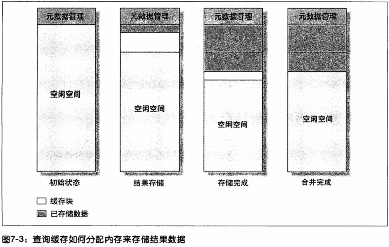


### 缓存配置

query_cache_type: 是否开启缓存功能，取值为ON, OFF, DEMAND，默认值为ON
　　- 值为OFF或0时，查询缓存功能关闭；
　　- 值为ON或1时，查询缓存功能打开，SELECT的结果符合缓存条件即会缓存，否则，不予缓存，显式指定SQL_NO_CACHE，不予缓存；
　　- 值为DEMAND或2时，查询缓存功能按需进行，显式指定SQL_CACHE的SELECT语句才会缓存；其它均不予缓存。

query_cache_size：表示缓存的大小。单位是字节。这个值必须为1024的倍数，否则MySQL实际分配的数据会和你指定的略有不同。

query_cache_min_res_unit 为系统分配的最小缓存块大小，默认是4KB，设置值大对大数据查询有好处，但如果你的查询都是小数据查询，就容易造成内存碎片和浪费；

query_cache_limit 指定单个查询能够使用的缓冲区大小，缺省为1M；

query_cache_wlock_invalidate：表示当有其他客户端正在对MyISAM表进行写操作时，如果查询在query cache中，是否返回cache结果还是等写操作完成再读表获取结果。

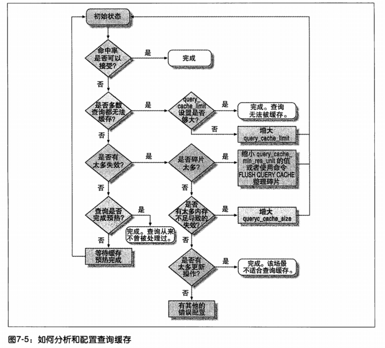

### InnoDB和查询缓存


如果表上有任何的锁，那么对这个表的任何查询语句都是无法缓存的。例如某个事务执行了select for update，那么这个锁释放前，任何其他事务都无法从查询缓存中读取与这个表相关的缓存结果。