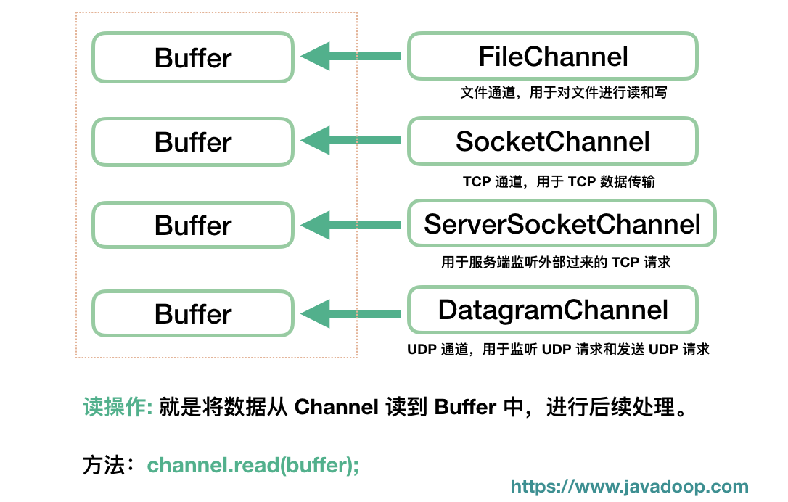

# IO模型

[Java NIO系列教程（六） Selector](https://ifeve.com/selectors/)

[Java NIO：Buffer、Channel 和 Selector](https://www.javadoop.com/post/java-nio)

[Java 非阻塞 IO 和异步 IO](https://www.javadoop.com/post/nio-and-aio)

[彻底搞懂Java的网络IO](https://mp.weixin.qq.com/s?__biz=MzUyNzgyNzAwNg==&mid=2247483941&idx=1&sn=97628f4d69d8607badf39bfeb7557457&scene=21#wechat_redirect) 

[彻底搞懂Reactor模型和Proactor模型](https://cloud.tencent.com/developer/article/1488120)

目前为止，Java共支持3种网络编程模型：BIO、NIO、AIO：

- Java BIO ： 同步并阻塞，服务器实现模式为一个连接一个线程，即客户端有连接请求时服务器端就需要启动一个线程进行处理，如果这个连接不做任何事情会造成不必要的线程开销，当然可以通过线程池机制改善。
- Java NIO ： 同步非阻塞，服务器实现模式为一个请求一个线程，即客户端发送的连接请求都会注册到多路复用器上，多路复用器轮询到连接有I/O请求时才启动一个线程进行处理。
- Java AIO(NIO.2) ： 异步非阻塞，服务器实现模式为一个有效请求一个线程，客户端的I/O请求都是由OS先完成了再通知服务器应用去启动线程进行处理。

BIO方式适用于连接数目比较小且固定的架构，这种方式对服务器资源要求比较高，并发局限于应用中，JDK1.4以前的唯一选择，但程序直观简单易理解。

NIO方式适用于连接数目多且连接比较短（轻操作）的架构，比如聊天服务器，并发局限于应用中，编程比较复杂，JDK1.4开始支持。

AIO方式使用于连接数目多且连接比较长（重操作）的架构，比如相册服务器，充分调用OS参与并发操作，编程比较复杂，JDK7开始支持。

# java-BIO

BIO 全称Block-IO 是一种**阻塞同步**的通信模式。我们常说的Stock IO 一般指的是BIO。是一个比较传统的通信方式，**模式简单**，**使用方便**。但**并发处理能力低**，**通信耗时**，**依赖网速**。
BIO 设计原理：
服务器通过一个Acceptor线程负责监听客户端请求和为每个客户端创建一个新的线程进行链路处理。典型的一请求一应答模式。若客户端数量增多，频繁地创建和销毁线程会给服务器打开很大的压力。后改良为用**线程池**的方式代替新增线程，被称为伪异步IO。

服务器提供IP地址和监听的端口，客户端通过TCP的三次握手与服务器连接，连接成功后，双放才能通过套接字(Stock)通信。
小结：**BIO模型中通过Socket和ServerSocket完成套接字通道的实现。阻塞，同步，建立连接耗时**。

那么，这个模式下的性能瓶颈在哪里呢？

1. 首先，每次来一个连接都开一个新的线程这肯定是不合适的。当活跃连接数在几十几百的时候当然是可以这样做的，但如果活跃连接数是几万几十万的时候，这么多线程明显就不行了。每个线程都需要一部分内存，内存会被迅速消耗，同时，线程切换的开销非常大。
2. 其次，阻塞操作在这里也是一个问题。首先，accept() 是一个阻塞操作，当 accept() 返回的时候，代表有一个连接可以使用了，我们这里是马上就新建线程来处理这个 SocketChannel 了，但是，但是这里不代表对方就将数据传输过来了。所以，SocketChannel#read 方法将阻塞，等待数据，明显这个等待是不值得的。同理，write 方法也需要等待通道可写才能执行写入操作，这边的阻塞等待也是不值得的。

```java
//监听tcp端口
public class BioServer {
    public static void main(String[] args) throws IOException {

        ServerSocketChannel serverSocketChannel = ServerSocketChannel.open();

        // 监听 8080 端口进来的 TCP 链接
        serverSocketChannel.socket().bind(new InetSocketAddress(8080));

        while (true) {

            // 这里会阻塞，直到有一个请求的连接进来
            SocketChannel socketChannel = serverSocketChannel.accept();

            // 开启一个新的线程来处理这个请求，然后在 while 循环中继续监听 8080 端口
            SocketHandler handler = new SocketHandler(socketChannel);
            new Thread(handler).start();
        }
    }
}

//socket处理线程实现
public class SocketHandler implements Runnable {

    private SocketChannel socketChannel;

    public SocketHandler(SocketChannel socketChannel) {
        this.socketChannel = socketChannel;
    }

    @Override
    public void run() {

        ByteBuffer buffer = ByteBuffer.allocate(1024);
        try {
            // 将请求数据读入 Buffer 中
            int num;
            while ((num = socketChannel.read(buffer)) > 0) {
                // 读取 Buffer 内容之前先 flip 一下
                buffer.flip();

                // 提取 Buffer 中的数据
                byte[] bytes = new byte[num];
                buffer.get(bytes);

                String re = new String(bytes, "UTF-8");
                System.out.println("收到请求：" + re);

                // 回应客户端
                ByteBuffer writeBuffer = ByteBuffer.wrap(("我已经收到你的请求，你的请求内容是：" + re).getBytes());
                socketChannel.write(writeBuffer);

                buffer.clear();
            }
        } catch (IOException e) {
            try {
                socketChannel.close();
            } catch (IOException e1) {
                e1.printStackTrace();
            }
        }
    }
}
```


# java-NIO

说完了阻塞模式的使用及其缺点以后，我们这里就可以介绍非阻塞 IO 了。

非阻塞 IO 的核心在于使用一个 Selector 来管理多个通道，可以是 SocketChannel，也可以是 ServerSocketChannel，将各个通道注册到 Selector 上，指定监听的事件。

之后可以只用一个线程来轮询这个 Selector，看看上面是否有通道是准备好的，当通道准备好可读或可写，然后才去开始真正的读写，这样速度就很快了。我们就完全没有必要给每个通道都起一个线程。

NIO 中 Selector 是对底层操作系统实现的一个抽象，管理通道状态其实都是底层系统实现的，这里简单介绍下在不同系统下的实现。

**select**：上世纪 80 年代就实现了，它支持注册 FD_SETSIZE(1024) 个 socket，在那个年代肯定是够用的，不过现在嘛，肯定是不行了。

**poll**：1997 年，出现了 poll 作为 select 的替代者，最大的区别就是，poll 不再限制 socket 数量。

select 和 poll 都有一个共同的问题，那就是**它们都只会告诉你有几个通道准备好了，但是不会告诉你具体是哪几个通道**。所以，一旦知道有通道准备好以后，自己还是需要进行一次扫描，显然这个不太好，通道少的时候还行，一旦通道的数量是几十万个以上的时候，扫描一次的时间都很可观了，时间复杂度 O(n)。所以，后来才催生了以下实现。

**epoll**：2002 年随 Linux 内核 2.5.44 发布，epoll 能直接返回具体的准备好的通道，时间复杂度 O(1)。

除了 Linux 中的 epoll，2000 年 FreeBSD 出现了 **Kqueue**，还有就是，Solaris 中有 **/dev/poll**。

> 前面说了那么多实现，但是没有出现 Windows，Windows 平台的非阻塞 IO 使用 select，我们也不必觉得 Windows 很落后，在 Windows 中 IOCP 提供的异步 IO 是比较强大的。

我们回到 Selector，毕竟 JVM 就是这么一个屏蔽底层实现的平台，**我们面向 Selector 编程就可以了**。

## 核心组件

Java NIO 中三大组件 **Buffer、Channel、Selector** 

### ByteBuffer

一个 Buffer 本质上是内存中的一块，我们可以将数据写入这块内存，之后从这块内存获取数据。

其实核心是最后的 **ByteBuffer**，前面的一大串类只是包装了一下它而已，我们使用最多的通常也是 ByteBuffer。

我们应该将 Buffer 理解为一个数组，IntBuffer、CharBuffer、DoubleBuffer 等分别对应 int[]、char[]、double[] 等。

MappedByteBuffer 用于实现内存映射文件，也不是本文关注的重点。

我觉得操作 Buffer 和操作数组、类集差不多，只不过大部分时候我们都把它放到了 NIO 的场景里面来使用而已。下面介绍 Buffer 中的几个重要属性和几个重要方法。


```java
public abstract class Buffer {

    //写：初始值是 0，每往 Buffer 中写入一个值，position 就自动加 1，代表下一次的写入位置。
    //读：每读一个值，position 就自动加 1。
    private int position = 0;
    
    //写：limit 代表的是最大能写入的数据，这个时候 limit 等于 capacity。
    //读：此时的 limit 等于 Buffer 中实际的数据大小，因为 Buffer 不一定被写满了。
    //从写操作模式到读操作模式切换的时候（flip），position 都会归零，这样就可以从头开始读写了。
    private int limit;
    
    //缓冲区的容量，一旦设定就不可以更改。容量达到 capacity，需要清空 Buffer，才能重新写入值。
    private int capacity;
    
}
```


#### 初始化Buffer

```java
//allocate(int capacity)
ByteBuffer byteBuf = ByteBuffer.allocate(1024);
//直接内存
ByteBuffer byteBuf = ByteBuffer.allocateDirect(1024);
IntBuffer intBuf = IntBuffer.allocate(1024);
LongBuffer longBuf = LongBuffer.allocate(1024);
```

另外，我们经常使用 wrap 方法来初始化一个 Buffer。

```java
public static ByteBuffer wrap(byte[] array) {
    ...
}
```

#### 填充Buffer

```java
// 填充一个 byte 值
public abstract ByteBuffer put(byte b);
// 在指定位置填充一个 int 值
public abstract ByteBuffer put(int index, byte b);
// 将一个数组中的值填充进去
public final ByteBuffer put(byte[] src) {...}
public ByteBuffer put(byte[] src, int offset, int length) {...}
```

上述这些方法需要自己控制 Buffer 大小，不能超过 capacity，超过会抛 java.nio.BufferOverflowException 异常。

对于 Buffer 来说，另一个常见的操作中就是，我们要将来自 Channel 的数据填充到 Buffer 中，在系统层面上，这个操作我们称为**读操作**，因为数据是从外部（文件或网络等）读到内存中。

```java
int num = channel.read(buf);
```

#### 提取Buffer

前面介绍了写操作，每写入一个值，position 的值都需要加 1，所以 position 最后会指向最后一次写入的位置的后面一个，如果 Buffer 写满了，那么 position 等于 capacity（position 从 0 开始）。

如果要读 Buffer 中的值，需要切换模式，从写入模式切换到读出模式。注意，通常在说 NIO 的读操作的时候，我们说的是从 Channel 中读数据到 Buffer 中，对应的是对 Buffer 的写入操作，初学者需要理清楚这个。

调用 Buffer 的 **flip()** 方法，可以从写入模式切换到读取模式。其实这个方法也就是设置了一下 position 和 limit 值罢了。

```java
public final Buffer flip() {
    limit = position; // 将 limit 设置为实际写入的数据数量
    position = 0; // 重置 position 为 0
    mark = -1; // mark 之后再说
    return this;
}
```

对应写入操作的一系列 put 方法，读操作提供了一系列的 get 方法：

```java
// 根据 position 来获取数据
public abstract byte get();
// 获取指定位置的数据
public abstract byte get(int index);
// 将 Buffer 中的数据写入到数组中
public ByteBuffer get(byte[] dst)
```

附一个经常使用的方法：

```java
new String(buffer.array()).trim();
```

当然了，除了将数据从 Buffer 取出来使用，更常见的操作是将我们写入的数据传输到 Channel 中，如通过 FileChannel 将数据写入到文件中，通过 SocketChannel 将数据写入网络发送到远程机器等。对应的，这种操作，我们称之为**写操作**。

```java
int num = channel.write(buf);
```


#### mark() & reset()

除了 position、limit、capacity 这三个基本的属性外，还有一个常用的属性就是 mark。

mark 用于临时保存 position 的值，每次调用 mark() 方法都会将 mark 设值为当前的 position，便于后续需要的时候使用。

```java
public final Buffer mark() {
    mark = position;
    return this;
}
```

那到底什么时候用呢？考虑以下场景，我们在 position 为 5 的时候，先 mark() 一下，然后继续往下读，读到第 10 的时候，我想重新回到 position 为 5 的地方重新来一遍，那只要调一下 reset() 方法，position 就回到 5 了。

```java
public final Buffer reset() {
    int m = mark;
    if (m < 0)
        throw new InvalidMarkException();
    position = m;
    return this;
}
```


#### rewind() & clear() & compact()

**rewind()**：会重置 position 为 0，通常用于重新从头读写 Buffer。

```java
public final Buffer rewind() {
    position = 0;
    mark = -1;
    return this;
}
```

**clear()**：有点重置 Buffer 的意思，相当于重新实例化了一样。

通常，我们会先填充 Buffer，然后从 Buffer 读取数据，之后我们再重新往里填充新的数据，我们一般在重新填充之前先调用 clear()。

```java
public final Buffer clear() {
    position = 0;
    limit = capacity;
    mark = -1;
    return this;
}
```

**compact()**：和 clear() 一样的是，它们都是在准备往 Buffer 填充新的数据之前调用。

前面说的 clear() 方法会重置几个属性，但是我们要看到，clear() 方法并不会将 Buffer 中的数据清空，只不过后续的写入会覆盖掉原来的数据，也就相当于清空了数据了。

而 compact() 方法有点不一样，调用这个方法以后，会先处理还没有读取的数据，也就是 position 到 limit 之间的数据（还没有读过的数据），先将这些数据移到左边，然后在这个基础上再开始写入。很明显，此时 limit 还是等于 capacity，position 指向原来数据的右边。


### Channel

所有的 NIO 操作始于通道，通道是数据来源或数据写入的目的地，主要地，我们将关心 java.nio 包中实现的以下几个 Channel：


- FileChannel：文件通道，用于文件的读和写
- DatagramChannel：用于 UDP 连接的接收和发送
- SocketChannel：把它理解为 TCP 连接通道，简单理解就是 TCP 客户端
- ServerSocketChannel：TCP 对应的服务端，用于监听某个端口进来的请求

**这里不是很理解这些也没关系，后面介绍了代码之后就清晰了。还有，我们最应该关注，也是后面将会重点介绍的是 SocketChannel 和 ServerSocketChannel。**

Channel 经常翻译为通道，类似 IO 中的流，用于读取和写入。它与前面介绍的 Buffer 打交道，读操作的时候将 Channel 中的数据填充到 Buffer 中，而写操作时将 Buffer 中的数据写入到 Channel 中。




至少读者应该记住一点，这两个方法都是 channel 实例的方法。

#### FileChannel

我想文件操作对于大家来说应该是最熟悉的，不过我们在说 NIO 的时候，其实 FileChannel 并不是关注的重点。而且后面我们说非阻塞的时候会看到，FileChannel 是不支持非阻塞的。

**这里算是简单介绍下常用的操作吧，感兴趣的读者瞄一眼就是了。**

**初始化：**

```java
FileInputStream inputStream = new FileInputStream(new File("/data.txt"));
FileChannel fileChannel = inputStream.getChannel();
```

当然了，我们也可以从 RandomAccessFile#getChannel 来得到 FileChannel。

**读取文件内容：**

```java
ByteBuffer buffer = ByteBuffer.allocate(1024);

int num = fileChannel.read(buffer);
```

前面我们也说了，所有的 Channel 都是和 Buffer 打交道的。

**写入文件内容：**

```java
ByteBuffer buffer = ByteBuffer.allocate(1024);
buffer.put("随机写入一些内容到 Buffer 中".getBytes());
// Buffer 切换为读模式
buffer.flip();
while(buffer.hasRemaining()) {
    // 将 Buffer 中的内容写入文件
    fileChannel.write(buffer);
}
```


#### SocketChannel

我们前面说了，我们可以将 SocketChannel 理解成一个 TCP 客户端。虽然这么理解有点狭隘，因为我们在介绍 ServerSocketChannel 的时候会看到另一种使用方式。

打开一个 TCP 连接：

```java
SocketChannel socketChannel = SocketChannel.open(new InetSocketAddress(
"https://www.javadoop.com", 80));
```

当然了，上面的这行代码等价于下面的两行：

```java
// 打开一个通道
SocketChannel socketChannel = SocketChannel.open();
// 发起连接
socketChannel.connect(new InetSocketAddress("https://www.javadoop.com", 80));
```

SocketChannel 的读写和 FileChannel 没什么区别，就是操作缓冲区。

```java
// 读取数据
socketChannel.read(buffer);

// 写入数据到网络连接中
while(buffer.hasRemaining()) {
    socketChannel.write(buffer);   
}
```

不要在这里停留太久，先继续往下走。


#### ServerSocketChannel

之前说 SocketChannel 是 TCP 客户端，这里说的 ServerSocketChannel 就是对应的服务端。

ServerSocketChannel 用于监听机器端口，管理从这个端口进来的 TCP 连接。

```java
// 实例化
ServerSocketChannel serverSocketChannel = ServerSocketChannel.open();
// 监听 8080 端口
serverSocketChannel.socket().bind(new InetSocketAddress(8080));

while (true) {
    // 一旦有一个 TCP 连接进来，就对应创建一个 SocketChannel 进行处理
    SocketChannel socketChannel = serverSocketChannel.accept();
}
```

> 这里我们可以看到 SocketChannel 的第二个实例化方式

到这里，我们应该能理解 SocketChannel 了，它不仅仅是 TCP 客户端，它代表的是一个网络通道，可读可写。

ServerSocketChannel 不和 Buffer 打交道了，因为它并不实际处理数据，它一旦接收到请求后，实例化 SocketChannel，之后在这个连接通道上的数据传递它就不管了，因为它需要继续监听端口，等待下一个连接。


#### DatagramChannel

UDP 和 TCP 不一样，DatagramChannel 一个类处理了服务端和客户端。

> 科普一下，UDP 是面向无连接的，不需要和对方握手，不需要通知对方，就可以直接将数据包投出去，至于能不能送达，它是不知道的

**监听端口：**

```java
DatagramChannel channel = DatagramChannel.open();
channel.socket().bind(new InetSocketAddress(9090));
ByteBuffer buf = ByteBuffer.allocate(48);

channel.receive(buf);
```

**发送数据：**

```java
String newData = "New String to write to file..."
                    + System.currentTimeMillis();

ByteBuffer buf = ByteBuffer.allocate(48);
buf.put(newData.getBytes());
buf.flip();

int bytesSent = channel.send(buf, new InetSocketAddress("jenkov.com", 80));
```


### Selector

NIO 三大组件就剩 Selector 了，Selector 建立在非阻塞的基础之上，大家经常听到的 **多路复用** 在 Java 世界中指的就是它，用于实现**一个线程管理多个 Channel**。

读者在这一节不能消化 Selector 也没关系，因为后续在介绍非阻塞 IO 的时候还得说到这个，这里先介绍一些基本的接口操作。

1. 首先，我们开启一个 Selector。你们爱翻译成**选择器**也好，**多路复用器**也好。

   ```java
   Selector selector = Selector.open();
   ```

2. 将 Channel 注册到 Selector 上。前面我们说了，Selector 建立在非阻塞模式之上，所以注册到 Selector 的 Channel 必须要支持非阻塞模式，**FileChannel 不支持非阻塞**，我们这里讨论最常见的 SocketChannel 和 ServerSocketChannel。

   ```java
   // 将通道设置为非阻塞模式，因为默认都是阻塞模式的
   channel.configureBlocking(false);
   // 注册
   SelectionKey key = channel.register(selector, SelectionKey.OP_READ);
   ```

   register 方法的第二个 int 型参数（使用二进制的标记位）用于表明需要监听哪些感兴趣的事件，共以下四种事件：

   - SelectionKey.OP_READ

     > 对应 00000001，通道中有数据可以进行读取

   - SelectionKey.OP_WRITE

     > 对应 00000100，可以往通道中写入数据

   - SelectionKey.OP_CONNECT

     > 对应 00001000，成功建立 TCP 连接

   - SelectionKey.OP_ACCEPT

     > 对应 00010000，接受 TCP 连接

我们可以同时监听一个 Channel 中的发生的多个事件，比如我们要监听 ACCEPT 和 READ 事件，那么指定参数为二进制的 000**1**000**1** 即十进制数值 17 即可。

注册方法返回值是 **SelectionKey** 实例，它包含了 Channel 和 Selector 信息，也包括了一个叫做 Interest Set 的信息，即我们设置的我们感兴趣的正在监听的事件集合。

1. 调用 select() 方法获取通道信息。用于判断是否有我们感兴趣的事件已经发生了。

Selector 的操作就是以上 3 步，这里来一个简单的示例，大家看一下就好了。之后在介绍非阻塞 IO 的时候，会演示一份可执行的示例代码。

```java
Selector selector = Selector.open();

channel.configureBlocking(false);

SelectionKey key = channel.register(selector, SelectionKey.OP_READ);

while(true) {
  // 判断是否有事件准备好
  int readyChannels = selector.select();
  if(readyChannels == 0) continue;

  // 遍历
  Set<SelectionKey> selectedKeys = selector.selectedKeys();
  Iterator<SelectionKey> keyIterator = selectedKeys.iterator();
  while(keyIterator.hasNext()) {
    SelectionKey key = keyIterator.next();

    if(key.isAcceptable()) {
        // a connection was accepted by a ServerSocketChannel.

    } else if (key.isConnectable()) {
        // a connection was established with a remote server.

    } else if (key.isReadable()) {
        // a channel is ready for reading

    } else if (key.isWritable()) {
        // a channel is ready for writing
    }

    keyIterator.remove();
  }
}
```

对于 Selector，我们还需要非常熟悉以下几个方法：

1. **select()**

   调用此方法，会将**上次 select 之后的**准备好的 channel 对应的 SelectionKey 复制到 selected set 中。如果没有任何通道准备好，这个方法会阻塞，直到至少有一个通道准备好。

2. **selectNow()**

   功能和 select 一样，区别在于如果没有准备好的通道，那么此方法会立即返回 0。

3. **select(long timeout)**

   看了前面两个，这个应该很好理解了，如果没有通道准备好，此方法会等待一会

4. **wakeup()**

   这个方法是用来唤醒等待在 select() 和 select(timeout) 上的线程的。如果 wakeup() 先被调用，此时没有线程在 select 上阻塞，那么之后的一个 select() 或 select(timeout) 会立即返回，而不会阻塞，当然，它只会作用一次。

# NIO源码

## 打开一个Selector

简单来说：Selector selector = Selector.open()；实际上就是new 了一个 WindowsSelectorImpl对象实例。

```java
//Selector
public static Selector open() throws IOException {
    return SelectorProvider.provider().openSelector();
}

//SelectorProvider
public static SelectorProvider provider() {
    synchronized (lock) {
        if (provider != null)
            return provider;
        return AccessController.doPrivileged(
            new PrivilegedAction<SelectorProvider>() {
                public SelectorProvider run() {
                    if (loadProviderFromProperty())
                        return provider;
                    if (loadProviderAsService())
                        return provider;
                    provider = sun.nio.ch.DefaultSelectorProvider.create();
                    return provider;
                }
            });
    }
}

//DefaultSelectorProvider
public static SelectorProvider create() {
    return new WindowsSelectorProvider();
}

//WindowsSelectorProvider
public AbstractSelector openSelector() throws IOException {
    return new WindowsSelectorImpl(this);
}
```

 


# java-AIO

随 JDK 1.7 发布，包括了引入异步 IO 接口和 Paths 等文件访问接口。

异步这个词，我想对于绝大多数开发者来说都很熟悉，很多场景下我们都会使用异步。

通常，我们会有一个线程池用于执行异步任务，提交任务的线程将任务提交到线程池就可以立马返回，不必等到任务真正完成。如果想要知道任务的执行结果，通常是通过传递一个回调函数的方式，任务结束后去调用这个函数。

同样的原理，Java 中的异步 IO 也是一样的，都是由一个线程池来负责执行任务，然后使用回调或自己去查询结果。

大部分开发者都知道为什么要这么设计了，这里再啰嗦一下。异步 IO 主要是为了控制线程数量，减少过多的线程带来的内存消耗和 CPU 在线程调度上的开销。

**在 Unix/Linux 等系统中，JDK 使用了并发包中的线程池来管理任务**，具体可以查看 AsynchronousChannelGroup 的源码。

在 Windows 操作系统中，提供了一个叫做 [I/O Completion Ports](https://msdn.microsoft.com/en-us/library/windows/desktop/aa365198.aspx) 的方案，通常简称为 **IOCP**，操作系统负责管理线程池，其性能非常优异，所以**在 Windows 中 JDK 直接采用了 IOCP 的支持**，使用系统支持，把更多的操作信息暴露给操作系统，也使得操作系统能够对我们的 IO 进行一定程度的优化。

> 在 Linux 中其实也是有异步 IO 系统实现的，但是限制比较多，性能也一般，所以 JDK 采用了自建线程池的方式。

本文还是以实用为主，想要了解更多信息请自行查找其他资料，下面对 Java 异步 IO 进行实践性的介绍。

总共有三个类需要我们关注，分别是 **AsynchronousSocketChannel**，**AsynchronousServerSocketChannel** 和 **AsynchronousFileChannel**，只不过是在之前介绍的 FileChannel、SocketChannel 和 ServerSocketChannel 的类名上加了个前缀 **Asynchronous**。

Java 异步 IO 提供了两种使用方式，分别是返回 Future 实例和使用回调函数。

## 方式1：返回 Future 实例

返回 java.util.concurrent.Future 实例的方式我们应该很熟悉，JDK 线程池就是这么使用的。Future 接口的几个方法语义在这里也是通用的，这里先做简单介绍。

- future.isDone();

  判断操作是否已经完成，包括了**正常完成、异常抛出、取消**

- future.cancel(true);

  取消操作，方式是中断。参数 true 说的是，即使这个任务正在执行，也会进行中断。

- future.isCancelled();

  是否被取消，只有在任务正常结束之前被取消，这个方法才会返回 true

- future.get(); 

  这是我们的老朋友，获取执行结果，阻塞。

- future.get(10, TimeUnit.SECONDS);

  如果上面的 get() 方法的阻塞你不满意，那就设置个超时时间。

## 方式2：使用回调函数

java.nio.channels.CompletionHandler 接口定义：

```java
public interface CompletionHandler<V,A> {

    void completed(V result, A attachment);

    void failed(Throwable exc, A attachment);
}
```

> 注意，参数上有个 attachment，虽然不常用，我们可以在各个支持的方法中传递这个参数值

```java
AsynchronousServerSocketChannel listener = AsynchronousServerSocketChannel.open().bind(null);

// accept 方法的第一个参数可以传递 attachment
listener.accept(attachment, new CompletionHandler<AsynchronousSocketChannel, Object>() {
    public void completed(
      AsynchronousSocketChannel client, Object attachment) {
          // 
      }
    public void failed(Throwable exc, Object attachment) {
          // 
      }
});
```

## AsynchronousFileChannel

首先，我们就来关注异步的文件 IO，前面我们说了，**文件 IO 在所有的操作系统中都不支持非阻塞模式，但是我们可以对文件 IO 采用异步的方式来提高性能。**

下面，我会介绍 AsynchronousFileChannel 里面的一些重要的接口，都很简单，读者要是觉得无趣，直接滑到下一个标题就可以了。

实例化：

```java
AsynchronousFileChannel channel = AsynchronousFileChannel.open(Paths.get("/Users/hongjie/test.txt"));
```

一旦实例化完成，我们就可以着手准备将数据读入到 Buffer 中：

```java
ByteBuffer buffer = ByteBuffer.allocate(1024);
Future<Integer> result = channel.read(buffer, 0);
```

> 异步文件通道的读操作和写操作都需要提供一个文件的开始位置，文件开始位置为 0

除了使用返回 Future 实例的方式，也可以采用回调函数进行操作，接口如下：

```java
public abstract <A> void read(ByteBuffer dst,
                              long position,
                              A attachment,
                              CompletionHandler<Integer,? super A> handler);
```

顺便也贴一下写操作的两个版本的接口：

```java
public abstract Future<Integer> write(ByteBuffer src, long position);

public abstract <A> void write(ByteBuffer src,
                               long position,
                               A attachment,
                               CompletionHandler<Integer,? super A> handler);
```

我们可以看到，AIO 的读写主要也还是与 Buffer 打交道，这个与 NIO 是一脉相承的。

另外，还提供了用于将内存中的数据刷入到磁盘的方法：

```java
public abstract void force(boolean metaData) throws IOException;
```

> 因为我们对文件的写操作，操作系统并不会直接针对文件操作，系统会缓存，然后周期性地刷入到磁盘。如果希望将数据及时写入到磁盘中，以免断电引发部分数据丢失，可以调用此方法。参数如果设置为 true，意味着同时也将文件属性信息更新到磁盘。

还有，还提供了对文件的锁定功能，我们可以锁定文件的部分数据，这样可以进行排他性的操作。

```java
public abstract Future<FileLock> lock(long position, long size, boolean shared);
```

> position 是要锁定内容的开始位置，size 指示了要锁定的区域大小，shared 指示需要的是共享锁还是排他锁

当然，也可以使用回调函数的版本：

```java
public abstract <A> void lock(long position,
                              long size,
                              boolean shared,
                              A attachment,
                              CompletionHandler<FileLock,? super A> handler);
```

文件锁定功能上还提供了 tryLock 方法，此方法会快速返回结果：

```java
public abstract FileLock tryLock(long position, long size, boolean shared)
    throws IOException;
```

> 这个方法很简单，就是尝试去获取锁，如果该区域已被其他线程或其他应用锁住，那么立刻返回 null，否则返回  FileLock 对象。

AsynchronousFileChannel 操作大体上也就以上介绍的这些接口，还是比较简单的，这里就少一些废话早点结束好了。

## AsynchronousServerSocketChannel

这个类对应的是非阻塞 IO 的 ServerSocketChannel，大家可以类比下使用方式。

我们就废话少说，用代码说事吧：

```java
public class Server {

    public static void main(String[] args) throws IOException {

          // 实例化，并监听端口
        AsynchronousServerSocketChannel server =
                AsynchronousServerSocketChannel.open().bind(new InetSocketAddress(8080));

        // 自己定义一个 Attachment 类，用于传递一些信息
        Attachment att = new Attachment();
        att.setServer(server);

        server.accept(att, new CompletionHandler<AsynchronousSocketChannel, Attachment>() {
            @Override
            public void completed(AsynchronousSocketChannel client, Attachment att) {
                try {
                    SocketAddress clientAddr = client.getRemoteAddress();
                    System.out.println("收到新的连接：" + clientAddr);

                    // 收到新的连接后，server 应该重新调用 accept 方法等待新的连接进来
                    att.getServer().accept(att, this);

                    Attachment newAtt = new Attachment();
                    newAtt.setServer(server);
                    newAtt.setClient(client);
                    newAtt.setReadMode(true);
                    newAtt.setBuffer(ByteBuffer.allocate(2048));

                    // 这里也可以继续使用匿名实现类，不过代码不好看，所以这里专门定义一个类
                    client.read(newAtt.getBuffer(), newAtt, new ChannelHandler());
                } catch (IOException ex) {
                    ex.printStackTrace();
                }
            }

            @Override
            public void failed(Throwable t, Attachment att) {
                System.out.println("accept failed");
            }
        });
        // 为了防止 main 线程退出
        try {
            Thread.currentThread().join();
        } catch (InterruptedException e) {
        }
    }
}
```

看一下 ChannelHandler 类：

```java
public class ChannelHandler implements CompletionHandler<Integer, Attachment> {

    @Override
    public void completed(Integer result, Attachment att) {
        if (att.isReadMode()) {
            // 读取来自客户端的数据
            ByteBuffer buffer = att.getBuffer();
            buffer.flip();
            byte bytes[] = new byte[buffer.limit()];
            buffer.get(bytes);
            String msg = new String(buffer.array()).toString().trim();
            System.out.println("收到来自客户端的数据: " + msg);

            // 响应客户端请求，返回数据
            buffer.clear();
            buffer.put("Response from server!".getBytes(Charset.forName("UTF-8")));
            att.setReadMode(false);
            buffer.flip();
            // 写数据到客户端也是异步
            att.getClient().write(buffer, att, this);
        } else {
            // 到这里，说明往客户端写数据也结束了，有以下两种选择:
            // 1. 继续等待客户端发送新的数据过来
//            att.setReadMode(true);
//            att.getBuffer().clear();
//            att.getClient().read(att.getBuffer(), att, this);
            // 2. 既然服务端已经返回数据给客户端，断开这次的连接
            try {
                att.getClient().close();
            } catch (IOException e) {
            }
        }
    }

    @Override
    public void failed(Throwable t, Attachment att) {
        System.out.println("连接断开");
    }
}
```

顺便再贴一下自定义的 Attachment 类：

```java
public class Attachment {
    private AsynchronousServerSocketChannel server;
    private AsynchronousSocketChannel client;
    private boolean isReadMode;
    private ByteBuffer buffer;
    // getter & setter
}
```

这样，一个简单的服务端就写好了，接下来可以接收客户端请求了。上面我们用的都是回调函数的方式，读者要是感兴趣，可以试试写个使用 Future 的。


## AsynchronousSocketChannel

其实，说完上面的 AsynchronousServerSocketChannel，基本上读者也就知道怎么使用 AsynchronousSocketChannel 了，和非阻塞 IO 基本类似。

这边做个简单演示，这样读者就可以配合之前介绍的 Server 进行测试使用了。

```java
public class Client {

    public static void main(String[] args) throws Exception {
        AsynchronousSocketChannel client = AsynchronousSocketChannel.open();
          // 来个 Future 形式的
        Future<?> future = client.connect(new InetSocketAddress(8080));
        // 阻塞一下，等待连接成功
        future.get();

        Attachment att = new Attachment();
        att.setClient(client);
        att.setReadMode(false);
        att.setBuffer(ByteBuffer.allocate(2048));
        byte[] data = "I am obot!".getBytes();
        att.getBuffer().put(data);
        att.getBuffer().flip();

        // 异步发送数据到服务端
        client.write(att.getBuffer(), att, new ClientChannelHandler());

        // 这里休息一下再退出，给出足够的时间处理数据
        Thread.sleep(2000);
    }
}
```

往里面看下 ClientChannelHandler 类：

```java
public class ClientChannelHandler implements CompletionHandler<Integer, Attachment> {

    @Override
    public void completed(Integer result, Attachment att) {
        ByteBuffer buffer = att.getBuffer();
        if (att.isReadMode()) {
            // 读取来自服务端的数据
            buffer.flip();
            byte[] bytes = new byte[buffer.limit()];
            buffer.get(bytes);
            String msg = new String(bytes, Charset.forName("UTF-8"));
            System.out.println("收到来自服务端的响应数据: " + msg);

            // 接下来，有以下两种选择:
            // 1. 向服务端发送新的数据
//            att.setReadMode(false);
//            buffer.clear();
//            String newMsg = "new message from client";
//            byte[] data = newMsg.getBytes(Charset.forName("UTF-8"));
//            buffer.put(data);
//            buffer.flip();
//            att.getClient().write(buffer, att, this);
            // 2. 关闭连接
            try {
                att.getClient().close();
            } catch (IOException e) {
            }
        } else {
            // 写操作完成后，会进到这里
            att.setReadMode(true);
            buffer.clear();
            att.getClient().read(buffer, att, this);
        }
    }

    @Override
    public void failed(Throwable t, Attachment att) {
        System.out.println("服务器无响应");
    }
}
```

## AsynchronousChannelGroup

为了知识的完整性，有必要对 group 进行介绍，其实也就是介绍 AsynchronousChannelGroup 这个类。之前我们说过，异步 IO 一定存在一个线程池，这个线程池负责接收任务、处理 IO 事件、回调等。这个线程池就在 group 内部，group 一旦关闭，那么相应的线程池就会关闭。

AsynchronousServerSocketChannels 和     AsynchronousSocketChannels 是属于 group 的，当我们调用 AsynchronousServerSocketChannel 或 AsynchronousSocketChannel 的 open() 方法的时候，相应的 channel 就属于默认的 group，这个 group 由 JVM 自动构造并管理。

如果我们想要配置这个默认的 group，可以在 JVM 启动参数中指定以下系统变量：

- java.nio.channels.DefaultThreadPool.threadFactory

  此系统变量用于设置 ThreadFactory，它应该是 java.util.concurrent.ThreadFactory 实现类的全限定类名。一旦我们指定了这个 ThreadFactory 以后，group 中的线程就会使用该类产生。

- java.nio.channels.DefaultThreadPool.initialSize

  此系统变量也很好理解，用于设置线程池的初始大小。

可能你会想要使用自己定义的 group，这样可以对其中的线程进行更多的控制，使用以下几个方法即可：

- AsynchronousChannelGroup.withCachedThreadPool(ExecutorService executor, int initialSize)
- AsynchronousChannelGroup.withFixedThreadPool(int nThreads, ThreadFactory threadFactory)
- AsynchronousChannelGroup.withThreadPool(ExecutorService executor)

熟悉线程池的读者对这些方法应该很好理解，它们都是 AsynchronousChannelGroup 中的静态方法。

至于 group 的使用就很简单了，代码一看就懂：

```java
AsynchronousChannelGroup group = AsynchronousChannelGroup
        .withFixedThreadPool(10, Executors.defaultThreadFactory());
AsynchronousServerSocketChannel server = AsynchronousServerSocketChannel.open(group);
AsynchronousSocketChannel client = AsynchronousSocketChannel.open(group);
```

**AsynchronousFileChannels 不属于 group**。但是它们也是关联到一个线程池的，如果不指定，会使用系统默认的线程池，如果想要使用指定的线程池，可以在实例化的时候使用以下方法：

```java
public static AsynchronousFileChannel open(Path file,
                                           Set<? extends OpenOption> options,
                                           ExecutorService executor,
                                           FileAttribute<?>... attrs) {
    ...
}
```

到这里，异步 IO 就算介绍完成了。

## netty为什么放弃aio

Not faster than NIO (epoll) on unix systems (which is true)
There is no daragram suppport
Unnecessary threading model (too much abstraction without usage)


