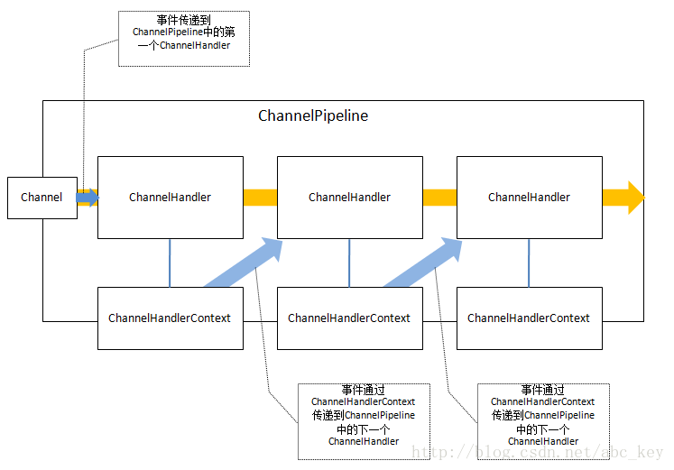

# netty学习笔记

[Netty In Action中文版](https://blog.csdn.net/abc_key/category_9262838.html)

​	Netty 是一个利用 Java 的高级网络的能力，隐藏其背后的复杂性而提供一个易于使用的 API的客户端/服务器框架。Netty 提供高性能和可扩展性，让你可以自由地专注于你真正感兴趣的东西，你的独特的应用！ 

# io模型

## 阻塞BIO

blocking io

​	为了实现多个并行的客户端我们需要分配一个新的 Thread 给每个新的客户端 Socket(当然需要更多的代码)。但考虑使用这种方法来支持大量的同步，长连接。在任何时间点多线程可能处于休眠状态，等待输入或输出数据。这很容易使得资源的大量浪费，对性能产生负面影响。 


## 非阻塞NIO

nonblocking io


# 异步实现

 	整个Netty的API都是异步的，异步处理不是一个新的机制，这个机制出来已经有一些时间了。对网络应用来说，IO一般是性能的瓶颈，使用异步IO可以较大程度上提高程序性能，因为异步变的越来越重要。但是它是如何工作的呢？以及有哪些不同的模式可用呢？

​        异步处理提倡更有效的使用资源，它允许你创建一个任务，当有事件发生时将获得通知并等待事件完成。这样就不会阻塞，不管事件完成与否都会及时返回，资源利用率更高，程序可以利用剩余的资源做一些其他的事情。

## callback

​	回调一般是异步处理的一种技术。一个回调是被传递到并且执行完该方法。你可能认为这种模式来自JavaScript，在Javascript中，回调是它的核心。下面的代码显示了如何使用这种技术来获取数据。

## future

​	第二种技术是使用Futures。Futures是一个抽象的概念，它表示一个值，该值可能在某一点变得可用。一个Future要么获得计算完的结果，要么获得计算失败后的异常。Java在java.util.concurrent包中附带了Future接口，它使用Executor异步执行。例如下面的代码，每传递一个Runnable对象到ExecutorService.submit()方法就会得到一个回调的Future，你能使用它检测是否执行完成。


# nio的问题

## 跨平台和兼容性问题

 	NIO是一个比较底层的APIs，它依赖于操作系统的IO  APIs。Java实现了统一的接口来操作IO，其在所有操作系统中的工作行为是一样的，这是很伟大的。使用NIO会经常发现代码在Linux上正常运行，但在Windows上就会出现问题。我建议你如果使用NIO编写程序，就应该在所有的操作系统上进行测试来支持，使程序可以在任何操作系统上正常运行；即使在所有的Linux系统上都测试通过了，也要在其他的操作系统上进行测试；你若不验证，以后就可能会出问题。

​        NIO2看起来很理想，但是NIO2只支持Jdk1.7+，若你的程序在Java1.6上运行，则无法使用NIO2。另外，Java7的NIO2中没有提供DatagramSocket的支持，所以NIO2只支持TCP程序，不支持UDP程序。

​        Netty提供一个统一的接口，同一语义无论在Java6还是Java7的环境下都是可以运行的，开发者无需关心底层APIs就可以轻松实现相关功能。

## 扩展ByteBuffer

​	ByteBuffer是一个数据容器，但是可惜的是JDK没有开发ByteBuffer实现的源码；ByteBuffer允许包装一个byte[]来获得一个实例，如果你希望尽量减少内存拷贝，那么这种方式是非常有用的。若果你想将ByteBuffer重新实现，那么不要浪费你的时间了，ByteBuffer的构造函数是私有的，所以它不能被扩展。Netty提供了自己的ByteBuffer实现，Netty通过一些简单的APIs对ByteBuffer进行构造、使用和操作，以此来解决NIO中的一些限制。

## 内存泄露

NIO对缓冲区的聚合和分散操作可能会操作内存泄露

  很多Channel的实现支持Gather和Scatter。这个功能允许从从多个ByteBuffer中读入或写入到过个ByteBuffer，这样做可以提供性能。操作系统底层知道如何处理这些被写入/读出，并且能以最有效的方式处理。如果要分割的数据再多个不同的ByteBuffer中，使用Gather/Scatter是比较好的方式。

​        例如，你可能希望header在一个ByteBuffer中，而body在另外的ByteBuffer中；

​        下图显示的是Scatter(分散)，将ScatteringByteBuffer中的数据分散读取到多个ByteBuffer中：


​        下图显示的是Gather(聚合)，将多个ByteBuffer的数据写入到GatheringByteChannel：


​        可惜Gather/Scatter功能会导致内存泄露，知道Java7才解决内存泄露问题。使用这个功能必须小心编码和Java版本。

## epoll bug

​	 Linux-like OSs的选择器使用的是epoll-IO事件通知工具。这是一个在操作系统以异步方式工作的网络stack.Unfortunately，即使是现在，著名的epoll-bug也可能会导致无效的状态的选择和100%的CPU利用率。要解决epoll-bug的唯一方法是回收旧的选择器，将先前注册的通道实例转移到新创建的选择器上。

​	这里发生的是，不管有没有已选择的SelectionKey，Selector.select()方法总是不会阻塞并且会立刻返回。这违反了Javadoc中对Selector.select()方法的描述，Javadoc中的描述：Selector.select()
must not unblock if nothing is selected. (Selector.select()方法若未选中任何事件将会阻塞。)


# 核心概念

 在我们开始之前，如果你了解Netty程序的一般结构和大致用法(客户端和服务器都有一个类似的结构)会更好。

​         一个Netty程序开始于Bootstrap类，Bootstrap类是Netty提供的一个可以通过简单配置来设置或"引导"程序的一个很重要的类。Netty中设计了Handlers来处理特定的"event"和设置Netty中的事件，从而来处理多个协议和数据。事件可以描述成一个非常通用的方法，因为你可以自定义一个handler,用来将Object转成byte[]或将byte[]转成Object；也可以定义个handler处理抛出的异常。

​         你会经常编写一个实现ChannelInboundHandler的类，ChannelInboundHandler是用来接收消息，当有消息过来时，你可以决定如何处理。当程序需要返回消息时可以在ChannelInboundHandler里write/flush数据。可以认为应用程序的业务逻辑都是在ChannelInboundHandler中来处理的，业务罗的生命周期在ChannelInboundHandler中。

​         Netty连接客户端端或绑定服务器需要知道如何发送或接收消息，这是通过不同类型的handlers来做的，多个Handlers是怎么配置的？Netty提供了ChannelInitializer类用来配置Handlers。ChannelInitializer是通过ChannelPipeline来添加ChannelHandler的，如发送和接收消息，这些Handlers将确定发的是什么消息。ChannelInitializer自身也是一个ChannelHandler，在添加完其他的handlers之后会自动从ChannelPipeline中删除自己。

​         所有的Netty程序都是基于ChannelPipeline。ChannelPipeline和EventLoop和EventLoopGroup密切相关，因为它们三个都和事件处理相关，所以这就是为什么它们处理IO的工作由EventLoop管理的原因。

​         Netty中所有的IO操作都是异步执行的，例如你连接一个主机默认是异步完成的；写入/发送消息也是同样是异步。也就是说操作不会直接执行，而是会等一会执行，因为你不知道返回的操作结果是成功还是失败，但是需要有检查是否成功的方法或者是注册监听来通知；Netty使用Futures和ChannelFutures来达到这种目的。Future注册一个监听，当操作成功或失败时会通知。ChannelFuture封装的是一个操作的相关信息，操作被执行时会立刻返回ChannelFuture。

EventLoop

EventLoopGroup

ChannelPipeline

Channel

Future or ChannelFuture

ChannelInitializer

ChannelHandler

## Channels,Events and Input/Output(IO)

Netty是一个非阻塞、事件驱动的网络框架。Netty实际上是使用多线程处理IO事件，对于熟悉多线程编程的读者可能会需要同步代码。这样的方式不好，因为同步会影响程序的性能，Netty的设计保证程序处理事件不会有同步。

​        下图显示一个EventLoopGroup和一个Channel关联一个单一的EventLoop，Netty中的EventLoopGroup包含一个或多个EventLoop，而EventLoop就是一个Channel执行实际工作的线程。EventLoop总是绑定一个单一的线程，在其生命周期内不会改变。


当注册一个Channel后，Netty将这个Channel绑定到一个EventLoop，在Channel的生命周期内总是被绑定到一个EventLoop。在Netty IO操作中，你的程序不需要同步，因为一个指定通道的所有IO始终由同一个线程来执行。

​        为了帮助理解，下图显示了EventLoop和EventLoopGroup的关系：


EventLoop和EventLoopGroup的关联不是直观的，因为我们说过EventLoopGroup包含一个或多个EventLoop，但是上面的图显示EventLoop是一个EventLoopGroup，这意味着你可以只使用一个特定的EventLoop。

## Bootstrap和EventLoopGroup

引导与事件组

“引导”是Netty中配置程序的过程，当你需要连接客户端或服务器绑定指定端口时需要使用bootstrap。如前面所述，“引导”有两种类型，一种是用于**客户端**的Bootstrap(也适用于DatagramChannel)，一种是用于**服务端**的ServerBootstrap。不管程序使用哪种协议，无论是创建一个客户端还是服务器都需要使用“引导”。

​        两种bootsstraps之间有一些相似之处，其实他们有很多相似之处，也有一些不同。Bootstrap和ServerBootstrap之间的差异：

- Bootstrap用来连接远程主机，有1个EventLoopGroup
- ServerBootstrap用来绑定本地端口，有2个EventLoopGroup

​          事件组(Groups)，传输(transports)和处理程序(handlers)分别在本章后面讲述，我们在这里只讨论两种"引导"的差异(Bootstrap和ServerBootstrap)。第一个差异很明显，“ServerBootstrap”监听在服务器监听一个端口轮询客户端的“Bootstrap”或DatagramChannel是否连接服务器。通常需要调用“Bootstrap”类的connect()方法，但是也可以先调用bind()再调用connect()进行连接，之后使用的Channel包含在bind()返回的ChannelFuture中。

​         第二个差别也许是最重要的。客户端bootstraps/applications使用一个单例EventLoopGroup，而ServerBootstrap使用2个EventLoopGroup(实际上使用的是相同的实例)，它可能不是显而易见的，但是它是个好的方案。一个ServerBootstrap可以认为有2个channels组，第一组包含一个单例ServerChannel，代表持有一个绑定了本地端口的socket；第二组包含所有的Channel，代表服务器已接受了的连接。下图形象的描述了这种情况：


上图中，EventLoopGroup A唯一的目的就是接受连接然后交给EventLoopGroup  B。**Netty可以使用两个不同的Group，因为服务器程序需要接受很多客户端连接的情况下，一个EventLoopGroup将是程序性能的瓶颈，因为事件循环忙于处理连接请求，没有多余的资源和空闲来处理业务逻辑，最后的结果会是很多连接请求超时。若有两EventLoops，  即使在高负载下，所有的连接也都会被接受，因为EventLoops接受连接不会和哪些已经连接了的处理共享资源。**

​          EventLoopGroup和EventLoop是什么关系？EventLoopGroup可以包含很多个EventLoop，每个Channel绑定一个EventLoop不会被改变，因为EventLoopGroup包含少量的EventLoop的Channels，很多Channel会共享同一个EventLoop。这意味着在一个Channel保持EventLoop繁忙会禁止其他Channel绑定到相同的EventLoop。我们可以理解为EventLoop是一个事件循环线程，而EventLoopGroup是一个事件循环集合。

​        如果你决定两次使用相同的EventLoopGroup实例配置Netty服务器，下图显示了它是如何改变的：


Netty允许处理IO和接受连接使用同一个EventLoopGroup，这在实际中适用于多种应用。上图显示了一个EventLoopGroup处理连接请求和IO操作。

​        下一节我们将介绍Netty是如何执行IO操作以及在什么时候执行。


## Channel Handlers and Data Flow

通道处理和数据流

 本节我们一起来看看当你发送或接收数据时发生了什么？回想本章开始提到的handler概念。要明白Netty程序wirte或read时发生了什么，首先要对Handler是什么有一定的了解。Handlers自身依赖于ChannelPipeline来决定它们执行的顺序，因此不可能通过**ChannelPipeline**定义处理程序的某些方面,反过来不可能定义也不可能通过ChannelHandler定义ChannelPipeline的某些方面。没必要说我们必须定义一个自己和其他的规定。本节将介绍ChannelHandler和ChannelPipeline在某种程度上细微的依赖。

​         在很多地方，Netty的ChannelHandler是你的应用程序中处理最多的。即使你没有意识到这一点，如果你使用Netty应用将至少有一个ChannelHandler参与，换句话说，ChannelHandler对很多事情是关键的。那么ChannelHandler究竟是什么？给ChannelHandler一个定义不容易，我们可以理解为ChannelHandler是一段执行业务逻辑处理数据的代码，它们来来往往的通过ChannelPipeline。实际上，ChannelHandler是定义一个handler的父接口，ChannelInboundHandler和ChannelOutboundHandler都实现ChannelHandler接口，如下图：


上图显示的比较容易，更重要的是ChannelHandler在数据流方面的应用，在这里讨论的例子只是一个简单的例子。ChannelHandler被应用在许多方面，在本书中会慢慢学习。

​         Netty中有两个方向的数据流，上图显示的入站(**ChannelInboundHandler**)和出站(**ChannelOutboundHandler**)之间有一个明显的区别：若数据是从用户应用程序到远程主机则是“出站(outbound)”，相反若数据时从远程主机到用户应用程序则是“入站(inbound)”。

​         为了使数据从一端到达另一端，一个或多个ChannelHandler将以某种方式操作数据。这些ChannelHandler会在程序的“引导”阶段被添加ChannelPipeline中，并且被添加的顺序将决定处理数据的顺序。ChannelPipeline的作用我们可以理解为用来管理ChannelHandler的一个容器，每个ChannelHandler处理各自的数据(例如入站数据只能由ChannelInboundHandler处理)，处理完成后将转换的数据放到ChannelPipeline中交给下一个ChannelHandler继续处理，直到最后一个ChannelHandler处理完成。

​        下图显示了ChannelPipeline的处理过程：


上图显示ChannelInboundHandler和ChannelOutboundHandler都要经过相同的ChannelPipeline。

​         在ChannelPipeline中，如果消息被读取或有任何其他的入站事件，消息将从ChannelPipeline的头部开始传递给第一个ChannelInboundHandler，这个ChannelInboundHandler可以处理该消息或将消息传递到下一个ChannelInboundHandler中，一旦在ChannelPipeline中没有剩余的ChannelInboundHandler后，ChannelPipeline就知道消息已被所有的饿Handler处理完成了。

​         反过来也是如此，任何出站事件或写入将从ChannelPipeline的尾部开始，并传递到最后一个ChannelOutboundHandler。ChannelOutboundHandler的作用和ChannelInboundHandler相同，它可以传递事件消息到下一个Handler或者自己处理消息。不同的是ChannelOutboundHandler是从ChannelPipeline的尾部开始，而ChannelInboundHandler是从ChannelPipeline的头部开始，当处理完第一个ChannelOutboundHandler处理完成后会出发一些操作，比如一个写操作。

​         一个事件能传递到下一个ChannelInboundHandler或上一个ChannelOutboundHandler，在ChannelPipeline中通过使用ChannelHandlerContext调用每一个方法。Netty提供了抽象的事件基类称为ChannelInboundHandlerAdapter和ChannelOutboundHandlerAdapter。每个都提供了在ChannelPipeline中通过调用相应的方法将事件传递给下一个Handler的方法的实现。我们能覆盖的方法就是我们需要做的处理。

​         可能有读者会奇怪，出站和入站的操作不同，能放在同一个ChannelPipeline工作？Netty的设计是很巧妙的，入站和出站Handler有不同的实现，Netty能跳过一个不能处理的操作，所以在出站事件的情况下，ChannelInboundHandler将被跳过，Netty知道每个handler都必须实现ChannelInboundHandler或ChannelOutboundHandler。

​         当一个ChannelHandler添加到ChannelPipeline中时获得一个ChannelHandlerContext。通常是安全的获得这个对象的引用，但是当一个数据报协议如UDP时这是不正确的，这个对象可以在之后用来获取底层通道，因为要用它来read/write消息，因此通道会保留。也就是说Netty中发送消息有两种方法：直接写入通道或写入ChannelHandlerContext对象。这两种方法的主要区别如下：

- 直接写入通道导致处理消息从ChannelPipeline的尾部开始
- 写入ChannelHandlerContext对象导致处理消息从ChannelPipeline的下一个handler开始

## Handler

编码器、解码器和业务逻辑

如前面所说，有很多不同类型的handlers，每个handler的依赖于它们的基类。Netty提供了一系列的“Adapter”类，这让事情变的很简单。每个handler负责转发时间到ChannelPipeline的下一个handler。在*Adapter类(和子类)中是自动完成的，因此我们只需要在感兴趣的*Adapter中重写方法。这些功能可以帮助我们非常简单的编码/解码消息。有几个适配器(adapter)允许自定义ChannelHandler，一般自定义ChannelHandler需要继承编码/解码适配器类中的一个。Netty有一下适配器：

- ChannelHandlerAdapter
- ChannelInboundHandlerAdapter
- ChannelOutboundHandlerAdapter

三个ChannelHandler涨，我们重点看看ecoders,decoders和SimpleChannelInboundHandler<I>，SimpleChannelInboundHandler<I>继承ChannelInboundHandlerAdapter。

### Encoders, decoders

Encoders 编码器

decoders 解码器

​        发送或接收消息后，Netty必须将消息数据从一种形式转化为另一种。接收消息后，需要将消息从字节码转成Java对象(由某种解码器解码)；发送消息前，需要将Java对象转成字节(由某些类型的编码器进行编码)。这种转换一般发生在网络程序中，因为网络上只能传输字节数据。

​        有多种基础类型的编码器和解码器，要使用哪种取决于想实现的功能。要弄清楚某种类型的编解码器，从类名就可以看出，如“ByteToMessageDecoder”、“MessageToByteEncoder”，还有Google的协议“ProtobufEncoder”和“ProtobufDecoder”。

​        严格的说其他handlers可以做编码器和适配器，使用不同的Adapter classes取决你想要做什么。如果是解码器则有一个ChannelInboundHandlerAdapter或ChannelInboundHandler，所有的解码器都继承或实现它们。“channelRead”方法/事件被覆盖，这个方法从入站(inbound)通道读取每个消息。重写的channelRead方法将调用每个解码器的“decode”方法并通过ChannelHandlerContext.fireChannelRead(Object msg)传递给ChannelPipeline中的下一个ChannelInboundHandler。

​        类似入站消息，当你发送一个消息出去(出站)时，除编码器将消息转成字节码外还会转发到下一个ChannelOutboundHandler。

### 业务逻辑

​        也许最常见的是应用程序处理接收到消息后进行解码，然后供相关业务逻辑模块使用。所以应用程序只需要扩展SimpleChannelInboundHandler<I>，也就是我们自定义一个继承SimpleChannelInboundHandler<I>的handler类，其中<I>是handler可以处理的消息类型。通过重写父类的方法可以获得一个ChannelHandlerContext的引用，它们接受一个ChannelHandlerContext的参数，你可以在class中当一个属性存储。

​        处理程序关注的主要方法是“channelRead0(ChannelHandlerContext ctx, I msg)”，每当Netty调用这个方法，对象“I”是消息，这里使用了Java的泛型设计，程序就能处理I。如何处理消息完全取决于程序的需要。在处理消息时有一点需要注意的，在Netty中事件处理IO一般有很多线程，程序中尽量不要阻塞IO线程，因为阻塞会降低程序的性能。

​        必须不阻塞IO线程意味着在ChannelHandler中使用阻塞操作会有问题。幸运的是Netty提供了解决方案，我们可以在添加ChannelHandler到ChannelPipeline中时指定一个EventExecutorGroup，EventExecutorGroup会获得一个EventExecutor，EventExecutor将执行ChannelHandler的所有方法。EventExecutor将使用不同的线程来执行和释放EventLoop。

# 传输

网络应用程序一个很重要的工作是传输数据。传输数据的过程不一样取决是使用哪种交通工具，但是传输的方式是一样的：都是以字节码传输。Java开发网络程序传输数据的过程和方式是被抽象了的，我们不需要关注底层接口，只需要使用Java API或其他网络框架如Netty就能达到传输数据的目的。发送数据和接收数据都是字节码。Nothing more,nothing less。

​        如果你曾经使用Java提供的网络接口工作过，你可能已经遇到过想从阻塞传输切换到非阻塞传输的情况，这种切换是比较困难的，因为阻塞IO和非阻塞IO使用的API有很大的差异；Netty提供了上层的传输实现接口使得这种情况变得简单。我们可以让所写的代码尽可能通用，而不会依赖一些实现相关的APIs。当我们想切换传输方式的时候不需要花很大的精力和时间来重构代码。

​        本章将介绍统一的API以及如何使用它们，会拿Netty的API和Java的API做比较来告诉你为什么Netty可以更容易的使用。本章也提供了一些优质的用例代码，以便最佳使用Netty。使用Netty不需要其他的网络框架或网络编程经验，若有则只是对理解netty有帮助，但不是必要的。下面让我们来看看真是世界里的传输工作。

## 代码示例

### java bio

```java

public class PlainOioServer {
	
	public void server(int port) throws Exception {
		//bind server to port
		final ServerSocket socket = new ServerSocket(port);
		try {
			while(true){
				//accept connection
				final Socket clientSocket = socket.accept();
				System.out.println("Accepted connection from " + clientSocket);
				//create new thread to handle connection
				new Thread(new Runnable() {
					@Override
					public void run() {
						OutputStream out;
						try{
							out = clientSocket.getOutputStream();
							//write message to connected client
							out.write("Hi!\r\n".getBytes(Charset.forName("UTF-8")));
							out.flush();
							//close connection once message written and flushed
							clientSocket.close();
						}catch(IOException e){
							try {
								clientSocket.close();
							} catch (IOException e1) {
								e1.printStackTrace();
							}
						}
					}
				}).start();//start thread to begin handling
			}
		}catch(Exception e){
			e.printStackTrace();
			socket.close();
		}
	}
 
}
```

上面的方式很简洁，但是这种阻塞模式在大连接数的情况就会有很严重的问题，如客户端连接超时，服务器响应严重延迟。为了解决这种情况，我们可以使用异步网络处理所有的并发连接，但问题在于NIO和OIO的API是完全不同的，所以一个用OIO开发的网络应用程序想要使用NIO重构代码几乎是重新开发。

### java nio

```java
public class PlainNioServer {
 
	public void server(int port) throws Exception {
		System.out.println("Listening for connections on port " + port);
		//open Selector that handles channels
		Selector selector = Selector.open();
		//open ServerSocketChannel
		ServerSocketChannel serverChannel = ServerSocketChannel.open();
		//get ServerSocket
		ServerSocket serverSocket = serverChannel.socket();
		//bind server to port
		serverSocket.bind(new InetSocketAddress(port));
		//set to non-blocking
		serverChannel.configureBlocking(false);
		//register ServerSocket to selector and specify that it is interested in new accepted clients
		serverChannel.register(selector, SelectionKey.OP_ACCEPT);
		final ByteBuffer msg = ByteBuffer.wrap("Hi!\r\n".getBytes());
		while (true) {
			//Wait for new events that are ready for process. This will block until something happens
			int n = selector.select();
			if (n > 0) {
				//Obtain all SelectionKey instances that received events
				Iterator<SelectionKey> iter = selector.selectedKeys().iterator();
				while (iter.hasNext()) {
					SelectionKey key = iter.next();
					iter.remove();
					try {
						//Check if event was because new client ready to get accepted
						if (key.isAcceptable()) {
							ServerSocketChannel server = (ServerSocketChannel) key.channel();
							SocketChannel client = server.accept();
							System.out.println("Accepted connection from " + client);
							client.configureBlocking(false);
							//Accept client and register it to selector
							client.register(selector, SelectionKey.OP_WRITE, msg.duplicate());
						}
						//Check if event was because socket is ready to write data
						if (key.isWritable()) {
							SocketChannel client = (SocketChannel) key.channel();
							ByteBuffer buff = (ByteBuffer) key.attachment();
							//write data to connected client
							while (buff.hasRemaining()) {
								if (client.write(buff) == 0) {
									break;
								}
							}
							client.close();//close client
						}
					} catch (Exception e) {
						key.cancel();
						key.channel().close();
					}
				}
			}
		}
	}
 
}
```

如你所见，即使它们实现的功能是一样，但是代码完全不同。下面我们将用Netty来实现相同的功能。

### netty bio

```java
public class NettyOioServer {
 
	public void server(int port) throws Exception {
		final ByteBuf buf = Unpooled.unreleasableBuffer(Unpooled.copiedBuffer("Hi!\r\n", CharsetUtil.UTF_8));
		//事件循环组
		EventLoopGroup group = new NioEventLoopGroup();
		try {
			//用来引导服务器配置
			ServerBootstrap b = new ServerBootstrap();
			//使用OIO阻塞模式
			b.group(group).channel(OioServerSocketChannel.class).localAddress(new InetSocketAddress(port))
			//指定ChannelInitializer初始化handlers
					.childHandler(new ChannelInitializer<Channel>() {
						@Override
						protected void initChannel(Channel ch) throws Exception {
							//添加一个“入站”handler到ChannelPipeline
							ch.pipeline().addLast(new ChannelInboundHandlerAdapter() {
								@Override
								public void channelActive(ChannelHandlerContext ctx) throws Exception {
									//连接后，写消息到客户端，写完后便关闭连接
									ctx.writeAndFlush(buf.duplicate()).addListener(ChannelFutureListener.CLOSE);
								}
							});
						}
					});
			//绑定服务器接受连接
			ChannelFuture f = b.bind().sync();
			f.channel().closeFuture().sync();
		} catch (Exception e) {
			//释放所有资源
			group.shutdownGracefully();
		}
	}
 
}

```
上面代码实现功能一样，但结构清晰明了，这只是Netty的优势之一。

### netty nio

下面代码是使用Netty实现异步，可以看出使用Netty由OIO切换到NIO是非常的方便。

```java
public class NettyNioServer {
 
	public void server(int port) throws Exception {
		final ByteBuf buf = Unpooled.unreleasableBuffer(Unpooled.copiedBuffer("Hi!\r\n", CharsetUtil.UTF_8));
		// 事件循环组
		EventLoopGroup group = new NioEventLoopGroup();
		try {
			// 用来引导服务器配置
			ServerBootstrap b = new ServerBootstrap();
			// 使用NIO异步模式
			b.group(group).channel(NioServerSocketChannel.class).localAddress(new InetSocketAddress(port))
			// 指定ChannelInitializer初始化handlers
					.childHandler(new ChannelInitializer<SocketChannel>() {
						@Override
						protected void initChannel(SocketChannel ch) throws Exception {
							// 添加一个“入站”handler到ChannelPipeline
							ch.pipeline().addLast(new ChannelInboundHandlerAdapter() {
								@Override
								public void channelActive(ChannelHandlerContext ctx) throws Exception {
									// 连接后，写消息到客户端，写完后便关闭连接
									ctx.writeAndFlush(buf.duplicate()).addListener(ChannelFutureListener.CLOSE);
								}
							});
						}
					});
			// 绑定服务器接受连接
			ChannelFuture f = b.bind().sync();
			f.channel().closeFuture().sync();
		} catch (Exception e) {
			// 释放所有资源
			group.shutdownGracefully();
		}
	}
}

```
因为Netty使用相同的API来实现每个传输，它并不关心你使用什么来实现。Netty通过操作Channel接口和ChannelPipeline、ChannelHandler来实现传输。


## Netty传输实现

​        Netty自带了一些传输协议的实现，虽然没有支持所有的传输协议，但是其自带的已足够我们来使用。Netty应用程序的传输协议依赖于底层协议，本节我们将学习Netty中的传输协议。

​        Netty中的传输方式有如下几种：

- NIO，io.netty.channel.socket.nio，基于java.nio.channels的工具包，使用选择器作为基础的方法。在高连接数时使用
- OIO，io.netty.channel.socket.oio，基于java.net的工具包，使用阻塞流。在低连接数、需要低延迟时、阻塞时使用
- Local，io.netty.channel.local，用来在虚拟机之间本地通信。在同一个JVM内通信时使用
- Embedded，io.netty.channel.embedded，嵌入传输，它允许在没有真正网络的运输中使用ChannelHandler，可以非常有用的来测试ChannelHandler的实现。测试ChannelHandler时使用

**NIO**  

Nonblocking I/O  

​        NIO传输是目前最常用的方式，它通过使用选择器提供了完全异步的方式操作所有的I/O，NIO从Java 1.4才被提供。NIO中，我们可以注册一个通道或获得某个通道的改变的状态，通道状态有下面几种改变：

- 一个新的Channel被接受并已准备好
- Channel连接完成
- Channel中有数据并已准备好读取
- Channel发送数据出去

​        处理完改变的状态后需重新设置他们的状态，用一个线程来检查是否有已准备好的Channel，如果有则执行相关事件。在这里可能只同时一个注册的事件而忽略其他的。选择器所支持的操作在SelectionKey中定义，具体如下：

- OP_ACCEPT，有新连接时得到通知
- OP_CONNECT，连接完成后得到通知
- OP_READ，准备好读取数据时得到通知
- OP_WRITE，写入数据到通道时得到通知

​        Netty中的NIO传输就是基于这样的模型来接收和发送数据，通过封装将自己的接口提供给用户使用，这完全隐藏了内部实现。如前面所说，Netty隐藏内部的实现细节，将抽象出来的API暴露出来供使用，下面是处理流程图：


​        NIO在处理过程也会有一定的延迟，若连接数不大的话，延迟一般在毫秒级，但是其吞吐量依然比OIO模式的要高。Netty中的NIO传输是“zero-file-copy”,也就是零文件复制，这种机制可以让程序速度更快，更高效的从文件系统中传输内容，零复制就是我们的应用程序不会将发送的数据先复制到JVM堆栈在进行处理，而是直接从内核空间操作。接下来我们将讨论OIO传输，它是阻塞的。

**OIO**  

Old blocking I/O  在低连接数、需要低延迟时、阻塞时使用

​        OIO就是java中提供的Socket接口，java最开始只提供了阻塞的Socket，阻塞会导致程序性能低。下面是OIO的处理流程图，若想详细了解，可以参阅其他相关资料。


**Local** 

In VM transport 

​         Netty包含了本地传输，这个传输实现使用相同的API用于虚拟机之间的通信，传输是完全异步的。每个Channel使用唯一的SocketAddress，客户端通过使用SocketAddress进行连接，在服务器会被注册为长期运行，一旦通道关闭，它会自动注销，客户端无法再使用它。

​        连接到本地传输服务器的行为与其他的传输实现几乎是相同的，需要注意的一个重点是只能在本地的服务器和客户端上使用它们。Local未绑定任何Socket，值提供JVM进程之间的通信。

**Embedded** 

transport 

​        Netty还包括嵌入传输，与之前讲述的其他传输实现比较，它是不是一个真的传输呢？若不是一个真的传输，我们用它可以做什么呢？Embedded transport允许更容易的使用不同的ChannelHandler之间的交互，这也更容易嵌入到其他的ChannelHandler实例并像一个辅助类一样使用它们。它一般用来测试特定的ChannelHandler实现，也可以在ChannelHandler中重新使用一些ChannelHandler来进行扩展，为了实现这样的目的，它自带了一个具体的Channel实现，即：EmbeddedChannel。

# ByteBuf

​	当需要与远程进行交互时，需要以字节码发送/接收数据。由于各种原因，一个高效、方便、易用的数据接口是必须的，而Netty的ByteBuf满足这些需求，ByteBuf是一个很好的经过优化的数据容器，我们可以将字节数据有效的添加到ByteBuf中或从ByteBuf中获取数据。ByteBuf有2部分：一个用于读，一个用于写。我们可以按顺序的读取数据，并且可以跳到开始重新读一遍。所有的数据操作，我们只需要做的是调整读取数据索引和再次开始读操作。	

​	写入数据到ByteBuf后，写入索引是增加的字节数量。开始读字节后，读取索引增加。你可以读取字节，直到写入索引和读取索引处理相同的位置，次数若继续读取，则会抛出IndexOutOfBoundsException。调用ByteBuf的任何方法开始读/写都会单独维护读索引和写索引。ByteBuf的默认最大容量限制是Integer.MAX_VALUE，写入时若超出这个值将会导致一个异常。

​        ByteBuf类似于一个字节数组，最大的区别是读和写的索引可以用来控制对缓冲区数据的访问。下图显示了一个容量为16的ByteBuf：


## 缓冲区类型

**Heap Buffer(堆缓冲区)**

​        最常用的类型是ByteBuf将数据存储在**JVM的堆空间**，这是通过将数据存储在数组的实现。堆缓冲区可以快速分配，当不使用时也可以快速释放。它还提供了直接访问数组的方法，通过ByteBuf.array()来获取byte[]数据。

​        访问非堆缓冲区ByteBuf的数组会导致UnsupportedOperationException，可以使用ByteBuf.hasArray()来检查是否支持访问数组。

**Direct Buffer(直接缓冲区)**

​         直接缓冲区，在**堆之外直接分配内存**。直接缓冲区不会占用堆空间容量，使用时应该考虑到应用程序要使用的最大内存容量以及如何限制它。直接缓冲区在使用Socket传递数据时性能很好，因为若使用间接缓冲区，JVM会先将数据复制到直接缓冲区再进行传递；但是直接缓冲区的缺点是在分配内存空间和释放内存时比堆缓冲区更复杂，而Netty使用内存池来解决这样的问题，这也是Netty使用内存池的原因之一。直接缓冲区不支持数组访问数据，但是我们可以间接的访问数据数组，

访问直接缓冲区的数据数组需要更多的编码和更复杂的操作，建议若需要在数组访问数据使用堆缓冲区会更好。

**Composite Buffer(复合缓冲区)**

​         复合缓冲区，我们可以创建多个不同的ByteBuf，然后提供一个这些ByteBuf组合的视图。复合缓冲区就像一个列表，我们可以动态的添加和删除其中的ByteBuf，JDK的ByteBuffer没有这样的功能。Netty提供了CompositeByteBuf类来处理复合缓冲区，CompositeByteBuf只是一个视图，CompositeByteBuf.hasArray()总是返回false，因为它可能包含一些直接或间接的不同类型的ByteBuf。

​         例如，一条消息由header和body两部分组成，将header和body组装成一条消息发送出去，可能body相同，只是header不同，使用CompositeByteBuf就不用每次都重新分配一个新的缓冲区。

## 字节操作

### 随机访问索引 

​         ByteBuf使用zero-based-indexing(从0开始的索引)，第一个字节的索引是0，最后一个字节的索引是ByteBuf的capacity - 1，下面代码是遍历ByteBuf的所有字节：

```java
//create a ByteBuf of capacity is 16
ByteBuf buf = Unpooled.buffer(16);
//write data to buf
for(int i=0;i<16;i++){
    buf.writeByte(i+1);
}
//read data from buf
for(int i=0;i<buf.capacity();i++){
    System.out.println(buf.getByte(i));
}
```

注意通过索引访问时不会推进读索引和写索引，我们可以通过ByteBuf的readerIndex()或writerIndex()来分别推进读索引或写索引。

# ChannelHandler

接受连接或创建他们只是你的应用程序的一部分，虽然这些任何很重要，但是一个网络应用程序往往是更复杂的，需要更多的代码编写，如处理传入和传出的数据。Netty提供了一个强大的处理这些事情的功能，允许用户自定义ChannelHandler的实现来处理数据。使得ChannelHandler更强大的是可以连接每个ChannelHandler来实现任务，这有助于代码的整洁和重用。但是处理数据只是ChannelHandler所做的事情之一，也可以压制I/O操作，例如写请求。所有这些都可以动态实现。

## ChannelPipeline 

​        ChannelPipeline是ChannelHandler实例的列表，用于处理或截获通道的接收和发送数据。ChannelPipeline提供了一种高级的截取过滤器模式，让用户可以在ChannelPipeline中完全控制一个事件及如何处理ChannelHandler与ChannelPipeline的交互。

​        对于每个新的通道，会创建一个新的ChannelPipeline并附加至通道。一旦连接，Channel和ChannelPipeline之间的耦合是永久性的。Channel不能附加其他的ChannelPipeline或从ChannelPipeline分离。

​        下图描述了ChannelHandler在ChannelPipeline中的I/O处理，一个I/O操作可以由一个ChannelInboundHandler或ChannelOutboundHandler进行处理，并通过调用ChannelInboundHandler处理入站IO或通过ChannelOutboundHandler处理出站IO。


如上图所示，ChannelPipeline是ChannelHandler的一个列表；如果一个入站I/O事件被触发，这个事件会从第一个开始依次通过ChannelPipeline中的ChannelHandler；若是一个入站I/O事件，则会从最后一个开始依次通过ChannelPipeline中的ChannelHandler。ChannelHandler可以处理事件并检查类型，如果某个ChannelHandler不能处理则会跳过，并将事件传递到下一个ChannelHandler。ChannelPipeline可以动态添加、删除、替换其中的ChannelHandler，这样的机制可以提高灵活性。

​        修改ChannelPipeline的方法：

- addFirst(...)，添加ChannelHandler在ChannelPipeline的第一个位置
- addBefore(...)，在ChannelPipeline中指定的ChannelHandler名称之前添加ChannelHandler
- addAfter(...)，在ChannelPipeline中指定的ChannelHandler名称之后添加ChannelHandler
- addLast(ChannelHandler...)，在ChannelPipeline的末尾添加ChannelHandler
- remove(...)，删除ChannelPipeline中指定的ChannelHandler
- replace(...)，替换ChannelPipeline中指定的ChannelHandler

```java
ChannelPipeline pipeline = ch.pipeline();
FirstHandler firstHandler = new FirstHandler();
pipeline.addLast("handler1", firstHandler);
pipeline.addFirst("handler2", new SecondHandler());
pipeline.addLast("handler3", new ThirdHandler());
pipeline.remove("handler3");
pipeline.remove(firstHandler);
pipeline.replace("handler2", "handler4", new FourthHandler());
```

​        被添加到ChannelPipeline的ChannelHandler将通过IO-Thread处理事件，这意味了必须不能有其他的IO-Thread阻塞来影响IO的整体处理；有时候可能需要阻塞，例如JDBC。因此，Netty允许通过一个EventExecutorGroup到每一个ChannelPipeline.add*方法，自定义的事件会被包含在EventExecutorGroup中的EventExecutor来处理，默认的实现是DefaultEventExecutorGroup。

​        ChannelPipeline除了一些修改的方法，还有很多其他的方法，具体是方法及使用可以看API文档或源码。

## ChannelHandlerContext 

​        每个ChannelHandler被添加到ChannelPipeline后，都会创建一个ChannelHandlerContext并与之创建的ChannelHandler关联绑定。ChannelHandlerContext允许ChannelHandler与其他的ChannelHandler实现进行交互，这是相同ChannelPipeline的一部分。ChannelHandlerContext不会改变添加到其中的ChannelHandler，因此它是安全的。

### 通知下一个handler

​        在相同的ChannelPipeline中通过调用ChannelInboundHandler和ChannelOutboundHandler中各个方法中的一个方法来通知最近的handler，通知开始的地方取决你如何设置。下图显示了ChannelHandlerContext、ChannelHandler、ChannelPipeline的关系：


​        如果你想有一些事件流全部通过ChannelPipeline，有两个不同的方法可以做到：

- 调用Channel的方法
- 调用ChannelPipeline的方法

​        这两个方法都可以让事件流全部通过ChannelPipeline。无论从头部还是尾部开始，因为它主要依赖于事件的性质。如果是一个“入站”事件，它开始于头部；若是一个“出站”事件，则开始于尾部。

​        下面的代码显示了一个写事件如何通过ChannelPipeline从尾部开始：

```java

@Override
protected void initChannel(SocketChannel ch) throws Exception {
	ch.pipeline().addLast(new ChannelInboundHandlerAdapter() {
		@Override
		public void channelActive(ChannelHandlerContext ctx) throws Exception {
			//Event via Channel
			Channel channel = ctx.channel();
			channel.write(Unpooled.copiedBuffer("netty in action", CharsetUtil.UTF_8));
			//Event via ChannelPipeline
			ChannelPipeline pipeline = ctx.pipeline();
			pipeline.write(Unpooled.copiedBuffer("netty in action", CharsetUtil.UTF_8));
		}
	});
}
```

​        下图表示通过Channel或ChannelPipeline的通知：


        可能你想从ChannelPipeline的指定位置开始，不想流经整个ChannelPipeline，如下情况：

- 为了节省开销，不感兴趣的ChannelHandler不让通过
- 排除一些ChannelHandler

​        在这种情况下，你可以使用ChannelHandlerContext的ChannelHandler通知起点。它使用ChannelHandlerContext执行下一个ChannelHandler。下面代码显示了直接使用ChannelHandlerContext操作：

```java
// Get reference of ChannelHandlerContext
ChannelHandlerContext ctx = ..;
// Write buffer via ChannelHandlerContext
ctx.write(Unpooled.copiedBuffer("Netty in Action", CharsetUtil.UTF_8));
```

该消息流经ChannelPipeline到下一个ChannelHandler，在这种情况下使用ChannelHandlerContext开始下一个ChannelHandler。下图显示了事件流：


如上图显示的，从指定的ChannelHandlerContext开始，跳过前面所有的ChannelHandler，使用ChannelHandlerContext操作是常见的模式，最常用的是从ChannelHanlder调用操作，也可以在外部使用ChannelHandlerContext，因为这是线程安全的。

### 修改ChannelPipeline 

​        调用ChannelHandlerContext的pipeline()方法能访问ChannelPipeline，能在运行时动态的增加、删除、替换ChannelPipeline中的ChannelHandler。可以保持ChannelHandlerContext供以后使用，如外部Handler方法触发一个事件，甚至从一个不同的线程。

​        下面代码显示了保存ChannelHandlerContext供之后使用或其他线程使用：

```java
public class WriteHandler extends ChannelHandlerAdapter {
	private ChannelHandlerContext ctx;
 
	@Override
	public void handlerAdded(ChannelHandlerContext ctx) throws Exception {
		this.ctx = ctx;
	}
	
	public void send(String msg){
		ctx.write(msg);
	}
}
```

​        请注意，ChannelHandler实例如果带有@Sharable注解则可以被添加到多个ChannelPipeline。也就是说单个ChannelHandler实例可以有多个ChannelHandlerContext，因此可以调用不同ChannelHandlerContext获取同一个ChannelHandler。如果添加不带@Sharable注解的ChannelHandler实例到多个ChannelPipeline则会抛出异常；使用@Sharable注解后的ChannelHandler必须在不同的线程和不同的通道上安全使用。怎么是不安全的使用？看下面代码：

```java
@Sharable
public class NotSharableHandler extends ChannelInboundHandlerAdapter {
 
	private int count;
 
	@Override
	public void channelRead(ChannelHandlerContext ctx, Object msg) throws Exception {
		count++;
		System.out.println("channelRead(...) called the " + count + " time");
		ctx.fireChannelRead(msg);
	}	
}
```

上面是一个带@Sharable注解的Handler，它被多个线程使用时，里面count是不安全的，会导致count值错误。

​        为什么要共享ChannelHandler？使用@Sharable注解共享一个ChannelHandler在一些需求中还是有很好的作用的，如使用一个ChannelHandler来统计连接数或来处理一些全局数据等等。

## 状态模型 

​        Netty有一个简单但强大的状态模型，并完美映射到ChannelInboundHandler的各个方法。下面是Channel生命周期四个不同的状态：

- channelUnregistered
- channelRegistered
- channelActive
- channelInactive

Channel的状态在其生命周期中变化，因为状态变化需要触发，下图显示了Channel状态变化：


​        还可以看到额外的状态变化，因为用户允许从EventLoop中注销Channel暂停事件执行，然后再重新注册。在这种情况下，你会看到多个channelRegistered和channelUnregistered状态的变化，而永远只有一个channelActive和channelInactive的状态，因为一个通道在其生命周期内只能连接一次，之后就会被回收；重新连接，则是创建一个新的通道。

​        下图显示了从EventLoop中注销Channel后再重新注册的状态变化：


## ChannelHandler及子类

​        Netty中有3个实现了ChannelHandler接口的类，其中2个是接口，一个是抽象类。如下图：


### Handler中的方法 

​        Netty定义了良好的类型层次结构来表示不同的处理程序类型，所有的类型的父类是ChannelHandler。ChannelHandler提供了在其生命周期内添加或从ChannelPipeline中删除的方法。

- handlerAdded，ChannelHandler添加到实际上下文中准备处理事件
- handlerRemoved，将ChannelHandler从实际上下文中删除，不再处理事件
- exceptionCaught，处理抛出的异常

上面三个方法都需要传递ChannelHandlerContext参数，每个ChannelHandler被添加到ChannelPipeline时会自动创建ChannelHandlerContext。ChannelHandlerContext允许在本地通道安全的存储和检索值。Netty还提供了一个实现了ChannelHandler的抽象类：ChannelHandlerAdapter。ChannelHandlerAdapter实现了父类的所有方法，基本上就是传递事件到ChannelPipeline中的下一个ChannelHandler直到结束。

### InboundHandler

​        ChannelInboundHandler提供了一些方法再接收数据或Channel状态改变时被调用。下面是ChannelInboundHandler的一些方法：

- channelRegistered，ChannelHandlerContext的Channel被注册到EventLoop；
- channelUnregistered，ChannelHandlerContext的Channel从EventLoop中注销
- channelActive，ChannelHandlerContext的Channel已激活
- channelInactive，ChannelHanderContxt的Channel结束生命周期
- channelRead，从当前Channel的对端读取消息
- channelReadComplete，消息读取完成后执行
- userEventTriggered，一个用户事件被处罚
- channelWritabilityChanged，改变通道的可写状态，可以使用Channel.isWritable()检查
- exceptionCaught，重写父类ChannelHandler的方法，处理异常

​        Netty提供了一个实现了ChannelInboundHandler接口并继承ChannelHandlerAdapter的类：ChannelInboundHandlerAdapter。ChannelInboundHandlerAdapter实现了ChannelInboundHandler的所有方法，作用就是处理消息并将消息转发到ChannelPipeline中的下一个ChannelHandler。ChannelInboundHandlerAdapter的channelRead方法处理完消息后不会自动释放消息，若想自动释放收到的消息，可以使用SimpleChannelInboundHandler<I>。

​        看下面代码：

```java
/**
 * 实现ChannelInboundHandlerAdapter的Handler，不会自动释放接收的消息对象
 * @author c.k
 *
 */
public class DiscardHandler extends ChannelInboundHandlerAdapter {
	@Override
	public void channelRead(ChannelHandlerContext ctx, Object msg) throws Exception {
		//手动释放消息
		ReferenceCountUtil.release(msg);
	}
}


/**
 * 继承SimpleChannelInboundHandler，会自动释放消息对象
 * @author c.k
 *
 */
public class SimpleDiscardHandler extends SimpleChannelInboundHandler<Object> {
	@Override
	protected void channelRead0(ChannelHandlerContext ctx, Object msg) throws Exception {
		//不需要手动释放
	}
}
```

​        如果需要其他状态改变的通知，可以重写Handler的其他方法。通常自定义消息类型来解码字节，可以实现ChannelInboundHandler或ChannelInboundHandlerAdapter。有一个更好的解决方法，使用编解码器的框架可以很容的实现。使用ChannelInboundHandler、ChannelInboundHandlerAdapter、SimpleChannelInboundhandler这三个中的一个来处理接收消息，使用哪一个取决于需求；大多数时候使用SimpleChannelInboundHandler处理消息，使用ChannelInboundHandlerAdapter处理其他的“入站”事件或状态改变。

​        ChannelInitializer用来初始化ChannelHandler，将自定义的各种ChannelHandler添加到ChannelPipeline中。

### OutboundHandler 

​        ChannelOutboundHandler用来处理“出站”的数据消息。ChannelOutboundHandler提供了下面一些方法：

- bind，Channel绑定本地地址
- connect，Channel连接操作
- disconnect，Channel断开连接
- close，关闭Channel
- deregister，注销Channel
- read，读取消息，实际是截获ChannelHandlerContext.read()
- write，写操作，实际是通过ChannelPipeline写消息，Channel.flush()属性到实际通道
- flush，刷新消息到通道

​        ChannelOutboundHandler是ChannelHandler的子类，实现了ChannelHandler的所有方法。所有最重要的方法采取ChannelPromise，因此一旦请求停止从ChannelPipeline转发参数则必须得到通知。Netty提供了ChannelOutboundHandler的实现：ChannelOutboundHandlerAdapter。ChannelOutboundHandlerAdapter实现了父类的所有方法，并且可以根据需要重写感兴趣的方法。所有这些方法的实现，在默认情况下，都是通过调用ChannelHandlerContext的方法将事件转发到ChannelPipeline中下一个ChannelHandler。

​        看下面的代码：

```java
public class DiscardOutboundHandler extends ChannelOutboundHandlerAdapter {
	@Override
	public void write(ChannelHandlerContext ctx, Object msg, ChannelPromise promise) throws Exception {
		ReferenceCountUtil.release(msg);
		promise.setSuccess();
	}
}
```

​        重要的是要记得释放致远并直通ChannelPromise，若ChannelPromise没有被通知可能会导致其中一个ChannelFutureListener不被通知去处理一个消息。

​        如果消息被消费并且没有被传递到ChannelPipeline中的下一个ChannelOutboundHandler，那么就需要调用ReferenceCountUtil.release(message)来释放消息资源。一旦消息被传递到实际的通道，它会自动写入消息或在通道关闭是释放。


# Bootstrap

 Netty提供了简单统一的方法来引导服务器和客户端。引导是配置Netty服务器和客户端程序的一个过程，Bootstrap允许这些应用程序很容易的重复使用。Netty程序的客户端和服务器都可以使用Bootstrap，其目的是简化编码过程，Bootstrap还提供了一个机制就是让一些组件(channels,pipeline,handlers等等)都可以在后台工作。本章将具体结合以下部分一起使用开发Netty程序：

- EventLoopGroup
- Channel
- 设置ChannelOption
- Channel被注册后将调用ChannelHandler
- 添加指定的属性到Channel
- 设置本地和远程地址
- 绑定、连接(取决于类型)

​        知道如何使用各个Bootstrap后就可以使用它们配置服务器和客户端了。本章还将学习在什么会后可以共享一个Bootstrap以及为什么这样做，结合我们之前学习的知识点来编写Netty程序。

  Netty包含了2个不同类型的引导，第一个是使用服务器的ServerBootstrap，用来接受客户端连接以及为已接受的连接创建子通道；第二个是用于客户端的Bootstrap，不接受新的连接，并且是在父通道类完成一些操作。

​        还有一种情况是处理DatagramChannel实例，这些用于UDP协议，是无连接的。换句话说，由于UDP的性质，所以当处理UDP数据时没有必要每个连接通道与TCP连接一样。因为通道不需要连接后才能发送数据，UDP是无连接协议。一个通道可以处理所有的数据而不需要依赖子通道。

​        下图是引导的类关系图：


​        我们在前面讨论了许多用于客户端和服务器的知识，为了对客户端和服务器之间的关系提供了一个共同点，Netty使用AbstractBootstrap类。通过一个共同的父类，在本章中讨论的客户端和服务器的引导程序能够重复使用通用功能，而无需复制代码或逻辑。通常情况下，多个通道使用相同或非常类似的设置时有必要的。而不是为每一个通道创建一个新的引导，Netty使得AbstractBootstrap可复制。也就是说克隆一个已配置的引导，其返回的是一个可重用而无需配置的引导。Netty的克隆操作只能浅拷贝引导的EventLoopGroup，也就是说EventLoopGroup在所有的克隆的通道中是共享的。这是一个好事情，克隆的通道一般是短暂的，例如一个通道创建一个HTTP请求。

​        本章主要讲解Bootstrap和ServerBootstrap，首先我们来看看ServerBootstrap。

## Bootstrap 

​        当需要引导客户端或一些无连接协议时，需要使用Bootstrap类。

### 引导客户端的方法 

​        创建Bootstrap实例使用new关键字，下面是Bootstrap的方法：

- group(...)，设置EventLoopGroup,EventLoopGroup用来处理所有通道的IO事件
- channel(...)，设置通道类型
- channelFactory(...)，使用ChannelFactory来设置通道类型
- localAddress(...)，设置本地地址，也可以通过bind(...)或connect(...)
- option(ChannelOption<T>, T)，设置通道选项，若使用null，则删除上一个设置的ChannelOption
- attr(AttributeKey<T>, T)，设置属性到Channel，若值为null，则指定键的属性被删除
- handler(ChannelHandler)，设置ChannelHandler用于处理请求事件
- clone()，深度复制Bootstrap，Bootstrap的配置相同
- remoteAddress(...)，设置连接地址
- connect(...)，连接远程通道
- bind(...)，创建一个新的Channel并绑定

#### 怎么引导客户端 

​        引导负责客户端通道连接或断开连接，因此它将在调用bind(...)或connect(...)后创建通道。下图显示了如何工作：


下面代码显示了引导客户端使用NIO TCP传输：

```java
/**
 * 引导配置客户端
 * 
 * @author c.k
 * 
 */
public class BootstrapingClient {
 
	public static void main(String[] args) throws Exception {
		EventLoopGroup group = new NioEventLoopGroup();
		Bootstrap b = new Bootstrap();
		b.group(group).channel(NioSocketChannel.class).handler(new SimpleChannelInboundHandler<ByteBuf>() {
			@Override
			protected void channelRead0(ChannelHandlerContext ctx, ByteBuf msg) throws Exception {
				System.out.println("Received data");
				msg.clear();
			}
		});
		ChannelFuture f = b.connect("127.0.0.1", 2048);
		f.addListener(new ChannelFutureListener() {
			@Override
			public void operationComplete(ChannelFuture future) throws Exception {
				if (future.isSuccess()) {
					System.out.println("connection finished");
				} else {
					System.out.println("connection failed");
					future.cause().printStackTrace();
				}
			}
		});
	}
}
```

#### 选择兼容通道实现 

​        Channel的实现和EventLoop的处理过程在EventLoopGroup中必须兼容，哪些Channel是和EventLoopGroup是兼容的可以查看API文档。经验显示，相兼容的实现一般在同一个包下面，例如使用NioEventLoop，NioEventLoopGroup和NioServerSocketChannel在一起。请注意，这些都是前缀“Nio”，然后不会用这些代替另一个实现和另一个前缀，如“Oio”，也就是说OioEventLoopGroup和NioServerSocketChannel是不相容的。

​        Channel和EventLoopGroup的EventLoop必须相容，例如NioEventLoop、NioEventLoopGroup、NioServerSocketChannel是相容的，但是OioEventLoopGroup和NioServerSocketChannel是不相容的。从类名可以看出前缀是“Nio”的只能和“Nio”的一起使用，“Oio”前缀的只能和Oio*一起使用，将不相容的一起使用会导致错误异常，如OioSocketChannel和NioEventLoopGroup一起使用时会抛出异常：Exception in thread "main" java.lang.IllegalStateException: incompatible event loop type。

## ServerBootstrap

### 引导服务器的方法 

​        先看看ServerBootstrap提供了哪些方法

- group(...)，设置EventLoopGroup事件循环组
- channel(...)，设置通道类型
- channelFactory(...)，使用ChannelFactory来设置通道类型
- localAddress(...)，设置本地地址，也可以通过bind(...)或connect(...)
- option(ChannelOption<T>, T)，设置通道选项，若使用null，则删除上一个设置的ChannelOption
- childOption(ChannelOption<T>, T)，设置子通道选项
- attr(AttributeKey<T>, T)，设置属性到Channel，若值为null，则指定键的属性被删除
- childAttr(AttributeKey<T>, T)，设置子通道属性
- handler(ChannelHandler)，设置ChannelHandler用于处理请求事件
- childHandler(ChannelHandler)，设置子ChannelHandler
- clone()，深度复制ServerBootstrap，且配置相同
- bind(...)，创建一个新的Channel并绑定

### 怎么引导服务器 

​        下图显示ServerBootstrap管理子通道：


​        child*方法是在子Channel上操作，通过ServerChannel来管理。

​        下面代码显示使用ServerBootstrap引导配置服务器：

```java

/**
 * 引导服务器配置
 * @author c.k
 *
 */
public class BootstrapingServer {
 
	public static void main(String[] args) throws Exception {
		EventLoopGroup bossGroup = new NioEventLoopGroup(1);
		EventLoopGroup workerGroup = new NioEventLoopGroup();
		ServerBootstrap b = new ServerBootstrap();
		b.group(bossGroup, workerGroup).channel(NioServerSocketChannel.class)
				.childHandler(new SimpleChannelInboundHandler<ByteBuf>() {
					@Override
					protected void channelRead0(ChannelHandlerContext ctx, ByteBuf msg) throws Exception {
						System.out.println("Received data");
						msg.clear();
					}
				});
		ChannelFuture f = b.bind(2048);
		f.addListener(new ChannelFutureListener() {
			@Override
			public void operationComplete(ChannelFuture future) throws Exception {
				if (future.isSuccess()) {
					System.out.println("Server bound");
				} else {
					System.err.println("bound fail");
					future.cause().printStackTrace();
				}
			}
		});
	}
}
```


# 线程模型

线程模型定义了应用程序或框架如何执行你的代码，选择应用程序/框架的正确的线程模型是很重要的。Netty提供了一个简单强大的线程模型来帮助我们简化代码，Netty对所有的核心代码都进行了同步。所有ChannelHandler，包括业务逻辑，都保证由一个线程同时执行特定的通道。这并不意味着Netty不能使用多线程，只是Netty限制每个连接都由一个线程处理，这种设计适用于非阻塞程序。我们没有必要去考虑多线程中的任何问题，也不用担心会抛ConcurrentModificationException或其他一些问题，如数据冗余、加锁等，这些问题在使用其他框架进行开发时是经常会发生的。

​        读完本章就会深刻理解Netty的线程模型以及Netty团队为什么会选择这样的线程模型，这些信息可以让我们在使用Netty时让程序由最好的性能。此外，Netty提供的线程模型还可以让我们编写整洁简单的代码，以保持代码的整洁性；我们还会学习Netty团队的经验，过去使用其他的线程模型，现在我们将使用Netty提供的更容易更强大的线程模型来开发。

​        尽管本章讲述的是Netty的线程模型，但是我们仍然可以使用其他的线程模型；至于如何选择一个完美的线程模型应该根据应用程序的实际需求来判断。

本节将简单介绍一般的线程模型，Netty中如何使用指定的线程模型，以及Netty不同的版本中使用的线程模型。你会更好的理解不同的线程模型的所有利弊。

​        如果思考一下，在我们的生活中会发现很多情况都会使用线程模型。例如，你有一个餐厅，向你的客户提供食品，食物需要在厨房煮熟后才能给客户；某个客户下了订单后，你需要将煮熟事物这个任务发送到厨房，而厨房可以以不同的方式来处理，这就像一个线程模型，定义了如何执行任务。

- 只有一个厨师：
  - 这种方法是单线程的，一次只执行一个任务，完成当前订单后再处理下一个。
- 你有多个厨师，每个厨师都可以做，空闲的厨师准备着接单做饭：
  - 这种方式是多线程的，任务由多个线程(厨师)执行，可以并行同时执行。
- 你有多个厨师并分成组，一组做晚餐，一个做其他：
  - 这种情况也是多线程，但是带有额外的限制；同时执行多个任务是由实际执行的任务类型(晚餐或其他)决定。

​        从上面的例子看出，日常活动适合在一个线程模型。但是Netty在这里适用吗？不幸的是，它没有那么简单，Netty的核心是多线程，但隐藏了来自用户的大部分。Netty使用多个线程来完成所有的工作，只有一个线程模型线型暴露给用户。大多数现代应用程序使用多个线程调度工作，让应用程序充分使用系统的资源来有效工作。在早期的Java中，这样做是通过按需创建新线程并行工作。但很快发现者不是完美的方案，因为创建和回收线程需要较大的开销。在Java5中加入了线程池，创建线程和重用线程交给一个任务执行，这样使创建和回收线程的开销降到最低。

​        下图显示使用一个线程池执行一个任务，提交一个任务后会使用线程池中空闲的线程来执行，完成任务后释放线程并将线程重新放回线程池：


​        上图每个任务线程的创建和回收不需要新线程去创建和销毁，但这只是一半的问题，我们稍后学习。你可能会问为什么不使用多线程，使用一个ExecutorService可以有助于防止线程创建和回收的成本？

​        使用多线程会有太多的上下文切换，提高了资源和管理成本，这种副作用会随着运行线程的数量和执行的任务数量的增加而愈加明显。使用多线程在刚开始可能没有什么问题，但随着系统的负载增加，可能在某个点就会让系统崩溃。

​        除了这些技术上的限制和问题，在项目生命周期内维护应用程序/框架可能还会发生其他问题。它有效的说明了增加应用程序的复杂性取决于它是平行的，简单的陈述：编写多线程应用程序时一个辛苦的工作！我们怎么来解决这个问题呢？在实际的场景中需要多个线程模型。让我们来看看Netty是如何解决这个问题的。

## 事件循环 

​        事件循环所做的正如它的名字，它运行的事件在一个循环中，直到循环终止。这非常适合网络框架的设计，因为它们需要为一个特定的连接运行一个事件循环。这不是Netty的新发明，其他的框架和实现已经很早就这样做了。

​        **在Netty中使用EventLoop接口代表事件循环**，EventLoop是从EventExecutor和ScheduledExecutorService扩展而来，所以可以讲任务直接交给EventLoop执行。类关系图如下：


### 使用事件循环 

​        下面代码显示如何访问已分配给通道的EventLoop并在EventLoop中执行任务：

```java
		Channel ch = ...;
		ch.eventLoop().execute(new Runnable() {
			@Override
			public void run() {
				System.out.println("run in the eventloop");
			}
		});
```

​        使用事件循环的好处是不需要担心同步问题，在同一线程中执行所有其他关联通道的其他事件。这完全符合Netty的线程模型。检查任务是否已执行，使用返回的Future，使用Future可以访问很多不同的操作。下面的代码是检查任务是否执行：

```java
		Channel ch = ...;
		Future<?> future = ch.eventLoop().submit(new Runnable() {
			@Override
			public void run() {
				
			}
		});
		if(future.isDone()){
			System.out.println("task complete");
		}else {
			System.out.println("task not complete");
        }
```

​        检查执行任务是否在事件循环中:

```java
		Channel ch = ...;
		if(ch.eventLoop().inEventLoop()){
			System.out.println("in the EventLoop");
		}else {
			System.out.println("outside the EventLoop");
        }
```

​        只有确认没有其他EventLoop使用线程池了才能关闭线程池，否则可能会产生未定义的副作用。

### Netty4中的I/O操作 

​        这个实现很强大，甚至Netty使用它来处理底层I/O事件，在socket上触发读和写操作。这些读和写操作是网络API的一部分，通过java和底层操作系统提供。下图显示在EventLoop上下文中执行入站和出站操作，如果执行线程绑定到EventLoop，操作会直接执行；如果不是，该线程将排队执行：


​        需要一次处理一个事件取决于事件的性质，通常从网络堆栈读取或传输数据到你的应用程序，有时在另外的方向做同样的事情，例如从你的应用程序传输数据到网络堆栈再发送到远程对等通道，但不限于这种类型的事物；更重要的是使用的逻辑是通用的，灵活处理各种各样的案例。

​        应该指出的是，线程模型(事件循环的顶部)描述并不总是由Netty使用。我们在了解Netty3后会更容易理解为什么新的线程模型是可取的。

### Netty3中的I/O操作 

​        在以前的版本有点不同，Netty保证在I/O线程中只有入站事件才被执行，所有的出站时间被调用线程处理。这看起来是个好方案，但很容易出错。它还将负责同步ChannelHandler来处理这些事件，因为它不保证只有一个线程同时操作；这可能发生在你去掉通道下游事件的同时，例如，在不同的线程调用Channel.write(...)。下图显示Netty3的执行流程：


​        除了需要负担同步ChannelHandler，这个线程模型的另一个问题是你可能需要去掉一个入站事件作为一个出站事件的结果，例如Channel.write(...)操作导致异常。在这种情况下，捕获的异常必须生成并抛出去。乍看之下这不像是一个问题，但我们知道，捕获异常由入站事件涉及，会让你知道问题出在哪里。问题是，事实上，你现在的情况是在调用线程上执行，但捕获到异常事件必须交给工作线程来执行。这是可行的，但如果你忘了传递过去，它会导致线程模型失效；假设入站事件只有一个线程不是真，这可能会给你各种各样的竞争条件。

​        以前的实现有一个唯一的积极影响，在某些情况下它可以提供更好的延迟；成本是值得的，因为它消除了复杂性。实际上，在大多数应用程序中，你不会遵守任何差异延迟，还取决于其他因数，如：

- 字节写入到远程对等通道有多快
- I/O线程是否繁忙
- 上下文切换
- 锁定

你可以看到很多细节影响整体延迟。

### Netty线程模型内部 

​        Netty的内部实现使其线程模型表现优异，它会检查正在执行的线程是否是已分配给实际通道(和EventLoop)，在Channel的生命周期内，EventLoop负责处理所有的事件。如果线程是相同的EventLoop中的一个，讨论的代码块被执行；如果线程不同，它安排一个任务并在一个内部队列后执行。通常是通过EventLoop的Channel只执行一次下一个事件，这允许直接从任何线程与通道交互，同时还确保所有的ChannelHandler是线程安全，不需要担心并发访问问题。

​        下图显示在EventLoop中调度任务执行逻辑，这适合Netty的线程模型：


​        设计是非常重要的，以确保不要把任何长时间运行的任务放在执行队列中，因为长时间运行的任务会阻止其他在相同线程上执行的任务。这多少会影响整个系统依赖于EventLoop实现用于特殊传输的实现。传输之间的切换在你的代码库中可能没有任何改变，重要的是：切勿阻塞I/O线程。如果你必须做阻塞调用(或执行需要长时间才能完成的任务)，使用EventExecutor。

​        下一节将讲解一个在应用程序中经常使用的功能，就是调度执行任务(定期执行)。Java对这个需求提供了解决方案，但Netty提供了几个更好的方案。

## 调度任务执行 

​        每隔一段时间需要调度任务执行，也许你想注册一个任务在客户端完成连接5分钟后执行，一个常见的用例是发送一个消息“你还活着？”到远程对等通道，如果远程对等通道没有反应，则可以关闭通道(连接)和释放资源。就像你和朋友打电话，沉默了一段时间后，你会说“你还在吗？”，如果朋友没有回复，就可能是断线或朋友睡着了；不管是什么问题，你都可以挂断电话，没有什么可等待的；你挂了电话后，收起电话可以做其他的事。

​        本节介绍使用强大的EventLoop实现任务调度，还会简单介绍Java API的任务调度，以方便和Netty比较加深理解。

### Java API调度任务 

​        在Java中使用JDK提供的ScheduledExecutorService实现任务调度。使用Executors提供的静态方法创建ScheduledExecutorService，有如下方法：

- newScheduledThreadPool(int)
- newScheduledThreadPool(int, ThreadFactory)
- newSingleThreadScheduledExecutor()
- newSingleThreadScheduledExecutor(ThreadFactory)

​        看下面代码：

```java
		ScheduledExecutorService executor = Executors.newScheduledThreadPool(10);
		ScheduledFuture<?> future = executor.schedule(new Runnable() {
			@Override
			public void run() {
				System.out.println("now it is 60 seconds later");
			}
		}, 60, TimeUnit.SECONDS);
		if(future.isDone()){
			System.out.println("scheduled completed");
		}
		//.....
		executor.shutdown();
```

### EventLoop调度任务 

​        使用ScheduledExecutorService工作的很好，但是有局限性，比如在一个额外的线程中执行任务。如果需要执行很多任务，资源使用就会很严重；对于像Netty这样的高性能的网络框架来说，严重的资源使用是不能接受的。Netty对这个问题提供了很好的方法。

​        Netty允许使用EventLoop调度任务分配到通道，如下面代码：

```java
		Channel ch = ...;
		ch.eventLoop().schedule(new Runnable() {
			@Override
			public void run() {
				System.out.println("now it is 60 seconds later");
			}
		}, 60, TimeUnit.SECONDS);
```

​        如果想任务每隔多少秒执行一次，看下面代码：

```java
		Channel ch = ...;
		ScheduledFuture<?> future = ch.eventLoop().scheduleAtFixedRate(new Runnable() {
			@Override
			public void run() {
				System.out.println("after run 60 seconds,and run every 60 seconds");
			}
		}, 60, 60, TimeUnit.SECONDS);
		// cancel the task
		future.cancel(false);
```

### 调度的内部实现 

​        Netty内部实现其实是基于George Varghese提出的“Hashed  and  hierarchical  timing wheels: Data structures  to efficiently implement timer facility(散列和分层定时轮：数据结构有效实现定时器)”。这种实现只保证一个近似执行，也就是说任务的执行可能不是100%准确；在实践中，这已经被证明是一个可容忍的限制，不影响多数应用程序。所以，定时执行任务不可能100%准确的按时执行。

​        为了更好的理解它是如何工作，我们可以这样认为：

1. 在指定的延迟时间后调度任务；
2. 任务被插入到EventLoop的Schedule-Task-Queue(调度任务队列)；
3. 如果任务需要马上执行，EventLoop检查每个运行；
4. 如果有一个任务要执行，EventLoop将立刻执行它，并从队列中删除；
5. EventLoop等待下一次运行，从第4步开始一遍又一遍的重复。

​        因为这样的实现计划执行不可能100%正确，对于多数用例不可能100%准备的执行计划任务；在Netty中，这样的工作几乎没有资源开销。但是如果需要更准确的执行呢？很容易，你需要使用ScheduledExecutorService的另一个实现，这不是Netty的内容。记住，如果不遵循Netty的线程模型协议，你将需要自己同步并发访问。

## I/O线程分配细节 

​        Netty使用线程池来为Channel的I/O和事件服务，不同的传输实现使用不同的线程分配方式；异步实现是只有几个线程给通道之间共享，这样可以使用最小的线程数为很多的平道服务，不需要为每个通道都分配一个专门的线程。

​        下图显示如何分配线程池：


​        如上图所示，使用一个固定大小的线程池管理三个线程，创建线程池后就把线程分配给线程池，确保在需要的时候，线程池中有可用的线程。这三个线程会分配给每个新创建的已连接通道，这是通过EventLoopGroup实现的，使用线程池来管理资源；实际会平均分配通道到所有的线程上，这种分布以循环的方式完成，因此它可能不会100%准确，但大部分时间是准确的。

​        一个通道分配到一个线程后，在这个通道的生命周期内都会一直使用这个线程。这一点在以后的版本中可能会被改变，所以我们不应该依赖这种方式；不会被改变的是一个线程在同一时间只会处理一个通道的I/O操作，我们可以依赖这种方式，因为这种方式可以确保不需要担心同步。

​        下图显示OIO(Old Blocking I/O)传输：


​        从上图可以看出，每个通道都有一个单独的线程。我们可以使用java.io.*包里的类来开发基于阻塞I/O的应用程序，即使语义改变了，但有一件事仍然保持不变，每个通道的I/O在同时只能被一个线程处理；这个线程是由Channel的EventLoop提供，我们可以依靠这个硬性的规则，这也是Netty框架比其他网络框架更容易编写的原因。


