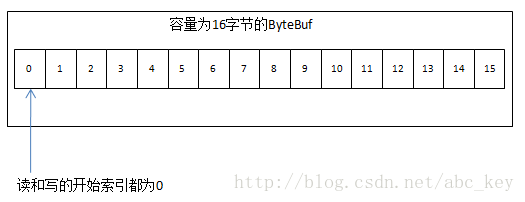
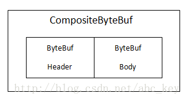
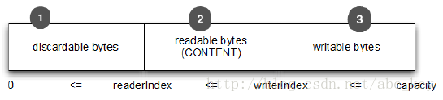
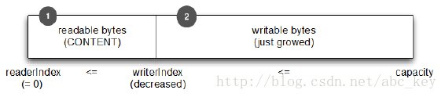
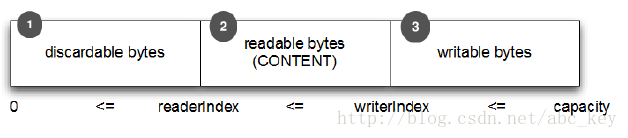
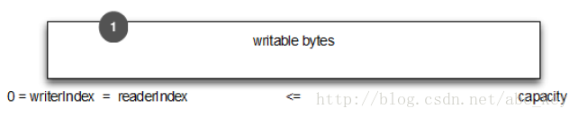

ByteBuf


# ByteBuf

- ByteBuf
- ByteBufHolder
- ByteBufAllocator
- 使用这些接口分配缓冲和执行操作

​        每当你需要传输数据时，它必须包含一个缓冲区。Java NIO API自带的缓冲区类是相当有限的，没有经过优化，使用JDK的ByteBuffer操作更复杂。缓冲区是一个重要的组建，它是API的一部分。Netty提供了一个强大的缓冲区实现用于表示一个字节序列，并帮助你操作原始字节或自定义的POJO。Netty的ByteBuf相当于JDK的ByteBuffer，ByteBuf的作用是在Netty中通过Channel传输数据。它被重新设计以解决JDK的ByteBuffer中的一些问题，从而使开发人员开发网络应用程序显得更有效率。本章将讲述Netty中的缓冲区，并了解它为什么比JDK自带的缓冲区实现更优秀，还会深入了解在Netty中使用ByteBuf访问数据以及如何使用它。


### 5.1 Buffer API 

​        Netty的缓冲API有两个接口：

- ByteBuf
- ByteBufHolder

Netty使用reference-counting(引用计数)的时候知道安全释放Buf和其他资源，虽然知道Netty有效的使用引用计数，这都是自动完成的。这允许Netty使用池和其他技巧来加快速度和保持内存利用率在正常水平，你不需要做任何事情来实现这一点，但是在开发Netty应用程序时，你应该处理数据尽快释放池资源。

​        Netty缓冲API提供了几个优势：

- 可以自定义缓冲类型
- 通过一个内置的复合缓冲类型实现零拷贝
- 扩展性好，比如StringBuffer
- 不需要调用flip()来切换读/写模式
- 读取和写入索引分开
- 方法链
- 引用计数
- Pooling(池)

### 5.2 ByteBuf - 字节数据容器 

​        当需要与远程进行交互时，需要以字节码发送/接收数据。由于各种原因，一个高效、方便、易用的数据接口是必须的，而Netty的ByteBuf满足这些需求，ByteBuf是一个很好的经过优化的数据容器，我们可以将字节数据有效的添加到ByteBuf中或从ByteBuf中获取数据。ByteBuf有2部分：一个用于读，一个用于写。我们可以按顺序的读取数据，并且可以跳到开始重新读一遍。所有的数据操作，我们只需要做的是调整读取数据索引和再次开始读操作。

#### 5.2.1 ByteBuf如何在工作？ 

​        写入数据到ByteBuf后，写入索引是增加的字节数量。开始读字节后，读取索引增加。你可以读取字节，直到写入索引和读取索引处理相同的位置，次数若继续读取，则会抛出IndexOutOfBoundsException。调用ByteBuf的任何方法开始读/写都会单独维护读索引和写索引。ByteBuf的默认最大容量限制是Integer.MAX_VALUE，写入时若超出这个值将会导致一个异常。

​        ByteBuf类似于一个字节数组，最大的区别是读和写的索引可以用来控制对缓冲区数据的访问。下图显示了一个容量为16的ByteBuf：



#### 5.2.2 不同类型的ByteBuf

​        使用Netty时会遇到3种不同类型的ByteBuf

**Heap Buffer(堆缓冲区)**

​        最常用的类型是ByteBuf将数据存储在JVM的堆空间，这是通过将数据存储在数组的实现。堆缓冲区可以快速分配，当不使用时也可以快速释放。它还提供了直接访问数组的方法，通过ByteBuf.array()来获取byte[]数据。

​        访问非堆缓冲区ByteBuf的数组会导致UnsupportedOperationException，可以使用ByteBuf.hasArray()来检查是否支持访问数组。

**Direct Buffer(直接缓冲区)**

​        直接缓冲区，在堆之外直接分配内存。直接缓冲区不会占用堆空间容量，使用时应该考虑到应用程序要使用的最大内存容量以及如何限制它。直接缓冲区在使用Socket传递数据时性能很好，因为若使用间接缓冲区，JVM会先将数据复制到直接缓冲区再进行传递；但是直接缓冲区的缺点是在分配内存空间和释放内存时比堆缓冲区更复杂，而Netty使用内存池来解决这样的问题，这也是Netty使用内存池的原因之一。直接缓冲区不支持数组访问数据，但是我们可以间接的访问数据数组，如下面代码：

```java
		ByteBuf directBuf = Unpooled.directBuffer(16);
		if(!directBuf.hasArray()){
			int len = directBuf.readableBytes();
			byte[] arr = new byte[len];
			directBuf.getBytes(0, arr);
		}
```

访问直接缓冲区的数据数组需要更多的编码和更复杂的操作，建议若需要在数组访问数据使用堆缓冲区会更好。

Composite Buffer(复合缓冲区)

​        复合缓冲区，我们可以创建多个不同的ByteBuf，然后提供一个这些ByteBuf组合的视图。复合缓冲区就像一个列表，我们可以动态的添加和删除其中的ByteBuf，JDK的ByteBuffer没有这样的功能。Netty提供了CompositeByteBuf类来处理复合缓冲区，CompositeByteBuf只是一个视图，CompositeByteBuf.hasArray()总是返回false，因为它可能包含一些直接或间接的不同类型的ByteBuf。

​        例如，一条消息由header和body两部分组成，将header和body组装成一条消息发送出去，可能body相同，只是header不同，使用CompositeByteBuf就不用每次都重新分配一个新的缓冲区。下图显示CompositeByteBuf组成header和body：


若使用JDK的ByteBuffer就不能这样简单的实现，只能创建一个数组或创建一个新的ByteBuffer，再将内容复制到新的ByteBuffer中。下面是使用CompositeByteBuf的例子：

```java
		CompositeByteBuf compBuf = Unpooled.compositeBuffer();
		ByteBuf heapBuf = Unpooled.buffer(8);
		ByteBuf directBuf = Unpooled.directBuffer(16);
		//添加ByteBuf到CompositeByteBuf
		compBuf.addComponents(heapBuf,directBuf);
		//删除第一个ByteBuf
		compBuf.removeComponent(0);
		Iterator<ByteBuf> iter = compBuf.iterator();
		while(iter.hasNext()){
			System.out.println(iter.next().toString());
		}
		//使用数组访问数据
		if(!compBuf.hasArray()){
			int len = compBuf.readableBytes();
			byte[] arr = new byte[len];
			compBuf.getBytes(0, arr);
		}
```

CompositeByteBuf是ByteBuf的子类，我们可以像操作BytBuf一样操作CompositeByteBuf。并且Netty优化套接字读写的操作是尽可能的使用CompositeByteBuf来做的，使用CompositeByteBuf不会操作内存泄露问题。

### 5.3 ByteBuf的字节操作 

​        ByteBuf提供了许多操作，允许修改其中的数据内容或只是读取数据。ByteBuf和JDK的ByteBuffer很像，但是ByteBuf提供了更好的性能。

#### 5.3.1 随机访问索引 

​        ByteBuf使用zero-based-indexing(从0开始的索引)，第一个字节的索引是0，最后一个字节的索引是ByteBuf的capacity - 1，下面代码是遍历ByteBuf的所有字节：

```java
		//create a ByteBuf of capacity is 16
		ByteBuf buf = Unpooled.buffer(16);
		//write data to buf
		for(int i=0;i<16;i++){
			buf.writeByte(i+1);
		}
		//read data from buf
		for(int i=0;i<buf.capacity();i++){
			System.out.println(buf.getByte(i));
		}
```

注意通过索引访问时不会推进读索引和写索引，我们可以通过ByteBuf的readerIndex()或writerIndex()来分别推进读索引或写索引。

#### 5.3.2 顺序访问索引 

​        ByteBuf提供两个指针变量支付读和写操作，读操作是使用readerIndex()，写操作时使用writerIndex()。这和JDK的ByteBuffer不同，ByteBuffer只有一个方法来设置索引，所以需要使用flip()方法来切换读和写模式。

​        ByteBuf一定符合：0 <= readerIndex <= writerIndex <= capacity。



#### 5.3.3 Discardable bytes废弃字节 

​        我们可以调用ByteBuf.discardReadBytes()来回收已经读取过的字节，discardReadBytes()将丢弃从索引0到readerIndex之间的字节。调用discardReadBytes()方法后会变成如下图：



​        ByteBuf.discardReadBytes()可以用来清空ByteBuf中已读取的数据，从而使ByteBuf有多余的空间容纳新的数据，但是discardReadBytes()可能会涉及内存复制，因为它需要移动ByteBuf中可读的字节到开始位置，这样的操作会影响性能，一般在需要马上释放内存的时候使用收益会比较大。

#### 5.3.4 可读字节(实际内容) 

​        任何读操作会增加readerIndex，如果读取操作的参数也是一个ByteBuf而没有指定目的索引，指定的目的缓冲区的writerIndex会一起增加，没有足够的内容时会抛出IndexOutOfBoundException。新分配、包装、复制的缓冲区的readerIndex的默认值都是0。下面代码显示了获取所有可读数据：

```java
		ByteBuf buf = Unpooled.buffer(16);
		while(buf.isReadable()){
			System.out.println(buf.readByte());
		}
```

(代码于原书中有出入，原书可能是基于Netty4之前的版本讲解的，此处基于Netty4)

#### 5.3.5 可写字节Writable bytes 

​        任何写的操作会增加writerIndex。若写操作的参数也是一个ByteBuf并且没有指定数据源索引，那么指定缓冲区的readerIndex也会一起增加。若没有足够的可写字节会抛出IndexOutOfBoundException。新分配的缓冲区writerIndex的默认值是0。下面代码显示了随机一个int数字来填充缓冲区，直到缓冲区空间耗尽：

```java
		Random random = new Random();


		ByteBuf buf = Unpooled.buffer(16);


		while(buf.writableBytes() >= 4){


			buf.writeInt(random.nextInt());


		}
```

#### 5.3.6 清除缓冲区索引Clearing the buffer indexs 

​        调用ByteBuf.clear()可以设置readerIndex和writerIndex为0，clear()不会清除缓冲区的内容，只是将两个索引值设置为0。请注意ByteBuf.clear()与JDK的ByteBuffer.clear()的语义不同。

​        下图显示了ByteBuf调用clear()之前：



​        下图显示了调用clear()之后：



​        和discardReadBytes()相比，clear()是便宜的，因为clear()不会复制任何内存。

#### 5.3.7 搜索操作Search operations 

​        各种indexOf()方法帮助你定位一个值的索引是否符合，我们可以用ByteBufProcessor复杂动态顺序搜索实现简单的静态单字节搜索。如果你想解码可变长度的数据，如null结尾的字符串，你会发现bytesBefore(byte value)方法有用。例如我们写一个集成的flash sockets的应用程序，这个应用程序使用NULL结束的内容，使用bytesBefore(byte value)方法可以很容易的检查数据中的空字节。没有ByteBufProcessor的话，我们需要自己做这些事情，使用ByteBufProcessor效率更好。

#### 5.3.8 标准和重置Mark and reset 

​        每个ByteBuf有两个标注索引，一个存储readerIndex，一个存储writerIndex。你可以通过调用一个重置方法重新定位两个索引之一，它类似于InputStream的标注和重置方法，没有读限制。我们可以通过调用readerIndex(int readerIndex)和writerIndex(int writerIndex)移动读索引和写索引到指定位置，调用这两个方法设置指定索引位置时可能抛出IndexOutOfBoundException。

#### 5.3.9 衍生的缓冲区Derived buffers 

​        调用duplicate()、slice()、slice(int index, int length)、order(ByteOrder endianness)会创建一个现有缓冲区的视图。衍生的缓冲区有独立的readerIndex、writerIndex和标注索引。如果需要现有缓冲区的全新副本，可以使用copy()或copy(int index, int length)获得。看下面代码：

```java
		// get a Charset of UTF-8


		Charset utf8 = Charset.forName("UTF-8");


		// get a ByteBuf


		ByteBuf buf = Unpooled.copiedBuffer("Netty in Action rocks!", utf8);


		// slice


		ByteBuf sliced = buf.slice(0, 14);


		// copy


		ByteBuf copy = buf.copy(0, 14);


		// print "Netty in Action rocks!"


		System.out.println(buf.toString(utf8));


		// print "Netty in Act"


		System.out.println(sliced.toString(utf8));


		// print "Netty in Act"


		System.out.println(copy.toString(utf8));
```

#### 5.3.10 读/写操作以及其他一些操作 

​        有两种主要类型的读写操作：

- get/set操作以索引为基础，在给定的索引设置或获取字节
- 从当前索引开始读写，递增当前的写索引或读索引

​        ByteBuf的各种读写方法或其他一些检查方法可以看ByteBuf的源码，这里不赘述了。

### 5.4 ByteBufHolder 

​        ByteBufHolder是一个辅助类，是一个接口，其实现类是DefaultByteBufHolder，还有一些实现了ByteBufHolder接口的其他接口类。ByteBufHolder的作用就是帮助更方便的访问ByteBuf中的数据，当缓冲区没用了后，可以使用这个辅助类释放资源。ByteBufHolder很简单，提供的可供访问的方法也很少。如果你想实现一个“消息对象”有效负载存储在ByteBuf，使用ByteBufHolder是一个好主意。

​        尽管Netty提供的各种缓冲区实现类已经很容易使用，但Netty依然提供了一些使用的工具类，使得创建和使用各种缓冲区更加方便。下面会介绍一些Netty中的缓冲区工具类。

#### 5.4.1 ByteBufAllocator 

​        Netty支持各种ByteBuf的池实现，来使Netty提供一种称为ByteBufAllocator成为可能。ByteBufAllocator负责分配ByteBuf实例，ByteBufAllocator提供了各种分配不同ByteBuf的方法，如需要一个堆缓冲区可以使用ByteBufAllocator.heapBuffer()，需要一个直接缓冲区可以使用ByteBufAllocator.directBuffer()，需要一个复合缓冲区可以使用ByteBufAllocator.compositeBuffer()。其他方法的使用可以看ByteBufAllocator源码及注释。

​        获取ByteBufAllocator对象很容易，可以从Channel的alloc()获取，也可以从ChannelHandlerContext的alloc()获取。看下面代码：

```java
			ServerBootstrap b = new ServerBootstrap();


			b.group(group).channel(NioServerSocketChannel.class).localAddress(new InetSocketAddress(port))


					.childHandler(new ChannelInitializer<SocketChannel>() {


						@Override


						protected void initChannel(SocketChannel ch) throws Exception {


							// get ByteBufAllocator instance by Channel.alloc()


							ByteBufAllocator alloc0 = ch.alloc();


							ch.pipeline().addLast(new ChannelInboundHandlerAdapter() {


								@Override


								public void channelActive(ChannelHandlerContext ctx) throws Exception {


									//get ByteBufAllocator instance by ChannelHandlerContext.alloc()


									ByteBufAllocator alloc1 = ctx.alloc();


									ctx.writeAndFlush(buf.duplicate()).addListener(ChannelFutureListener.CLOSE);


								}


							});


						}


					});
```

​        Netty有两种不同的ByteBufAllocator实现，一个实现ByteBuf实例池将分配和回收成本以及内存使用降到最低；另一种实现是每次使用都创建一个新的ByteBuf实例。Netty默认使用PooledByteBufAllocator，我们可以通过ChannelConfig或通过引导设置一个不同的实现来改变。更多细节在后面讲述。

#### 5.4.2 Unpooled 

​        Unpooled也是用来创建缓冲区的工具类，Unpooled的使用也很容易。Unpooled提供了很多方法，详细方法及使用可以看API文档或Netty源码。看下面代码：

```java
		//创建复合缓冲区
		CompositeByteBuf compBuf = Unpooled.compositeBuffer();
		//创建堆缓冲区
		ByteBuf heapBuf = Unpooled.buffer(8);
		//创建直接缓冲区
		ByteBuf directBuf = Unpooled.directBuffer(16);
```

#### 5.4.3 ByteBufUtil 

​        ByteBufUtil提供了一些静态的方法，在操作ByteBuf时非常有用。ByteBufUtil提供了Unpooled之外的一些方法，也许最有价值的是hexDump(ByteBuf buffer)方法，这个方法返回指定ByteBuf中可读字节的十六进制字符串，可以用于调试程序时打印ByteBuf的内容，十六进制字符串相比字节而言对用户更友好。