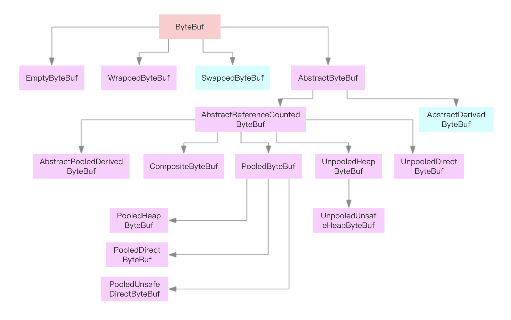

ByteBuf


# ByteBuffer

一个 Buffer 本质上是内存中的一块，我们可以将数据写入这块内存，之后从这块内存获取数据。

其实核心是最后的 **ByteBuffer**，前面的一大串类只是包装了一下它而已，我们使用最多的通常也是 ByteBuffer。

我们应该将 Buffer 理解为一个数组，IntBuffer、CharBuffer、DoubleBuffer 等分别对应 int[]、char[]、double[] 等。

MappedByteBuffer 用于实现内存映射文件，也不是本文关注的重点。

我觉得操作 Buffer 和操作数组、类集差不多，只不过大部分时候我们都把它放到了 NIO 的场景里面来使用而已。下面介绍 Buffer 中的几个重要属性和几个重要方法。


```java
public abstract class Buffer {

    //写：初始值是 0，每往 Buffer 中写入一个值，position 就自动加 1，代表下一次的写入位置。
    //读：每读一个值，position 就自动加 1。
    private int position = 0;
    
    //写：limit 代表的是最大能写入的数据，这个时候 limit 等于 capacity。
    //读：此时的 limit 等于 Buffer 中实际的数据大小，因为 Buffer 不一定被写满了。
    //从写操作模式到读操作模式切换的时候（flip），position 都会归零，这样就可以从头开始读写了。
    private int limit;
    
    //缓冲区的容量，一旦设定就不可以更改。容量达到 capacity，需要清空 Buffer，才能重新写入值。
    private int capacity;
    
}
```


## 初始化Buffer

```java
//allocate(int capacity)
ByteBuffer byteBuf = ByteBuffer.allocate(1024);
//直接内存
ByteBuffer byteBuf = ByteBuffer.allocateDirect(1024);
IntBuffer intBuf = IntBuffer.allocate(1024);
LongBuffer longBuf = LongBuffer.allocate(1024);
```

另外，我们经常使用 wrap 方法来初始化一个 Buffer。

```java
public static ByteBuffer wrap(byte[] array) {
    ...
}
```

## 填充Buffer

```java
// 填充一个 byte 值
public abstract ByteBuffer put(byte b);
// 在指定位置填充一个 int 值
public abstract ByteBuffer put(int index, byte b);
// 将一个数组中的值填充进去
public final ByteBuffer put(byte[] src) {...}
public ByteBuffer put(byte[] src, int offset, int length) {...}
```

上述这些方法需要自己控制 Buffer 大小，不能超过 capacity，超过会抛 java.nio.BufferOverflowException 异常。

对于 Buffer 来说，另一个常见的操作中就是，我们要将来自 Channel 的数据填充到 Buffer 中，在系统层面上，这个操作我们称为**读操作**，因为数据是从外部（文件或网络等）读到内存中。

```java
int num = channel.read(buf);
```

## 提取Buffer

前面介绍了写操作，每写入一个值，position 的值都需要加 1，所以 position 最后会指向最后一次写入的位置的后面一个，如果 Buffer 写满了，那么 position 等于 capacity（position 从 0 开始）。

如果要读 Buffer 中的值，需要切换模式，从写入模式切换到读出模式。注意，通常在说 NIO 的读操作的时候，我们说的是从 Channel 中读数据到 Buffer 中，对应的是对 Buffer 的写入操作，初学者需要理清楚这个。

调用 Buffer 的 **flip()** 方法，可以从写入模式切换到读取模式。其实这个方法也就是设置了一下 position 和 limit 值罢了。

```java
public final Buffer flip() {
    limit = position; // 将 limit 设置为实际写入的数据数量
    position = 0; // 重置 position 为 0
    mark = -1; // mark 之后再说
    return this;
}
```

对应写入操作的一系列 put 方法，读操作提供了一系列的 get 方法：

```java
// 根据 position 来获取数据
public abstract byte get();
// 获取指定位置的数据
public abstract byte get(int index);
// 将 Buffer 中的数据写入到数组中
public ByteBuffer get(byte[] dst)
```

附一个经常使用的方法：

```java
new String(buffer.array()).trim();
```

当然了，除了将数据从 Buffer 取出来使用，更常见的操作是将我们写入的数据传输到 Channel 中，如通过 FileChannel 将数据写入到文件中，通过 SocketChannel 将数据写入网络发送到远程机器等。对应的，这种操作，我们称之为**写操作**。

```java
int num = channel.write(buf);
```


## mark() & reset()

除了 position、limit、capacity 这三个基本的属性外，还有一个常用的属性就是 mark。

mark 用于临时保存 position 的值，每次调用 mark() 方法都会将 mark 设值为当前的 position，便于后续需要的时候使用。

```java
public final Buffer mark() {
    mark = position;
    return this;
}
```

那到底什么时候用呢？考虑以下场景，我们在 position 为 5 的时候，先 mark() 一下，然后继续往下读，读到第 10 的时候，我想重新回到 position 为 5 的地方重新来一遍，那只要调一下 reset() 方法，position 就回到 5 了。

```java
public final Buffer reset() {
    int m = mark;
    if (m < 0)
        throw new InvalidMarkException();
    position = m;
    return this;
}
```


## rewind() & clear() & compact()

**rewind()**：会重置 position 为 0，通常用于重新从头读写 Buffer。

```java
public final Buffer rewind() {
    position = 0;
    mark = -1;
    return this;
}
```

**clear()**：有点重置 Buffer 的意思，相当于重新实例化了一样。

通常，我们会先填充 Buffer，然后从 Buffer 读取数据，之后我们再重新往里填充新的数据，我们一般在重新填充之前先调用 clear()。

```java
public final Buffer clear() {
    position = 0;
    limit = capacity;
    mark = -1;
    return this;
}
```

**compact()**：和 clear() 一样的是，它们都是在准备往 Buffer 填充新的数据之前调用。

前面说的 clear() 方法会重置几个属性，但是我们要看到，clear() 方法并不会将 Buffer 中的数据清空，只不过后续的写入会覆盖掉原来的数据，也就相当于清空了数据了。

而 compact() 方法有点不一样，调用这个方法以后，会先处理还没有读取的数据，也就是 position 到 limit 之间的数据（还没有读过的数据），先将这些数据移到左边，然后在这个基础上再开始写入。很明显，此时 limit 还是等于 capacity，position 指向原来数据的右边。

# ByteBuf

- ByteBuf
- ByteBufHolder
- ByteBufAllocator
- 使用这些接口分配缓冲和执行操作

​        每当你需要传输数据时，它必须包含一个缓冲区。Java NIO API自带的缓冲区类是相当有限的，没有经过优化，使用JDK的ByteBuffer操作更复杂。缓冲区是一个重要的组建，它是API的一部分。Netty提供了一个强大的缓冲区实现用于表示一个字节序列，并帮助你操作原始字节或自定义的POJO。Netty的ByteBuf相当于JDK的ByteBuffer，ByteBuf的作用是在Netty中通过Channel传输数据。它被重新设计以解决JDK的ByteBuffer中的一些问题，从而使开发人员开发网络应用程序显得更有效率。本章将讲述Netty中的缓冲区，并了解它为什么比JDK自带的缓冲区实现更优秀，还会深入了解在Netty中使用ByteBuf访问数据以及如何使用它。


## Buffer API 

​        Netty的缓冲API有两个接口：

- ByteBuf
- ByteBufHolder

Netty使用reference-counting(引用计数)的时候知道安全释放Buf和其他资源，虽然知道Netty有效的使用引用计数，这都是自动完成的。这允许Netty使用池和其他技巧来加快速度和保持内存利用率在正常水平，你不需要做任何事情来实现这一点，但是在开发Netty应用程序时，你应该处理数据尽快释放池资源。

​        Netty缓冲API提供了几个优势：

- 可以自定义缓冲类型
- 通过一个内置的复合缓冲类型实现零拷贝
- 扩展性好，比如StringBuffer
- 不需要调用flip()来切换读/写模式
- 读取和写入索引分开
- 方法链
- 引用计数
- Pooling(池)

## ByteBuf - 字节数据容器 

​        当需要与远程进行交互时，需要以字节码发送/接收数据。由于各种原因，一个高效、方便、易用的数据接口是必须的，而Netty的ByteBuf满足这些需求，ByteBuf是一个很好的经过优化的数据容器，我们可以将字节数据有效的添加到ByteBuf中或从ByteBuf中获取数据。ByteBuf有2部分：一个用于读，一个用于写。我们可以按顺序的读取数据，并且可以跳到开始重新读一遍。所有的数据操作，我们只需要做的是调整读取数据索引和再次开始读操作。

### ByteBuf如何在工作？ 

​	ByteBuf通过两个指针来协调缓冲区的读写，读操作readerIndex和写操作writerIndex。

​	readerIndex和writerIndex初始值都是0，随着数据的写入会writerIndex增加，读取数据会使readerIndex增加，但是不会超过writerIndex。读取以后0-readerIndex就被视为discard，调用discardReadBytes方法，可以释放空间。

​	读写操作不需要调整位置指针，极大的简化了缓冲区的读写操作。容量不足时会进行动态扩展，重新创建一个新的ByteBuffer，将之前的ByteBuffer复制到新的ByteBuffer，释放旧的ByteBuffer。

## 不同类型的ByteBuf

​        使用Netty时会遇到3种不同类型的ByteBuf

#### **Heap Buffer**

​        最常用的类型是ByteBuf将数据存储在JVM的堆空间，这是通过将数据存储在数组的实现。堆缓冲区可以快速分配，当不使用时也可以快速释放。它还提供了直接访问数组的方法，通过ByteBuf.array()来获取byte[]数据。

​        访问非堆缓冲区ByteBuf的数组会导致UnsupportedOperationException，可以使用ByteBuf.hasArray()来检查是否支持访问数组。

#### **Direct Buffer**

​        直接缓冲区，在堆之外直接分配内存。直接缓冲区不会占用堆空间容量，使用时应该考虑到应用程序要使用的最大内存容量以及如何限制它。直接缓冲区在使用Socket传递数据时性能很好，因为若使用间接缓冲区，JVM会先将数据复制到直接缓冲区再进行传递；但是直接缓冲区的缺点是在分配内存空间和释放内存时比堆缓冲区更复杂，而Netty使用内存池来解决这样的问题，这也是Netty使用内存池的原因之一。直接缓冲区不支持数组访问数据，但是我们可以间接的访问数据数组，如下面代码：

```java
		ByteBuf directBuf = Unpooled.directBuffer(16);
		if(!directBuf.hasArray()){
			int len = directBuf.readableBytes();
			byte[] arr = new byte[len];
			directBuf.getBytes(0, arr);
		}
```

访问直接缓冲区的数据数组需要更多的编码和更复杂的操作，建议若需要在数组访问数据使用堆缓冲区会更好。

#### Composite Buffer

​        复合缓冲区，我们可以创建多个不同的ByteBuf，然后提供一个这些ByteBuf组合的视图。复合缓冲区就像一个列表，我们可以动态的添加和删除其中的ByteBuf，JDK的ByteBuffer没有这样的功能。Netty提供了CompositeByteBuf类来处理复合缓冲区，CompositeByteBuf只是一个视图，CompositeByteBuf.hasArray()总是返回false，因为它可能包含一些直接或间接的不同类型的ByteBuf。

​        例如，一条消息由header和body两部分组成，将header和body组装成一条消息发送出去，可能body相同，只是header不同，使用CompositeByteBuf就不用每次都重新分配一个新的缓冲区。下图显示CompositeByteBuf组成header和body：


若使用JDK的ByteBuffer就不能这样简单的实现，只能创建一个数组或创建一个新的ByteBuffer，再将内容复制到新的ByteBuffer中。下面是使用CompositeByteBuf的例子：

```java
		CompositeByteBuf compBuf = Unpooled.compositeBuffer();
		ByteBuf heapBuf = Unpooled.buffer(8);
		ByteBuf directBuf = Unpooled.directBuffer(16);
		//添加ByteBuf到CompositeByteBuf
		compBuf.addComponents(heapBuf,directBuf);
		//删除第一个ByteBuf
		compBuf.removeComponent(0);
		Iterator<ByteBuf> iter = compBuf.iterator();
		while(iter.hasNext()){
			System.out.println(iter.next().toString());
		}
		//使用数组访问数据
		if(!compBuf.hasArray()){
			int len = compBuf.readableBytes();
			byte[] arr = new byte[len];
			compBuf.getBytes(0, arr);
		}
```

CompositeByteBuf是ByteBuf的子类，我们可以像操作BytBuf一样操作CompositeByteBuf。并且Netty优化套接字读写的操作是尽可能的使用CompositeByteBuf来做的，使用CompositeByteBuf不会操作内存泄露问题。

ByteBuf的字节操作 

​        ByteBuf提供了许多操作，允许修改其中的数据内容或只是读取数据。ByteBuf和JDK的ByteBuffer很像，但是ByteBuf提供了更好的性能。

### 随机访问索引 

​        ByteBuf使用zero-based-indexing(从0开始的索引)，第一个字节的索引是0，最后一个字节的索引是ByteBuf的capacity - 1，下面代码是遍历ByteBuf的所有字节：

```java
		//create a ByteBuf of capacity is 16
		ByteBuf buf = Unpooled.buffer(16);
		//write data to buf
		for(int i=0;i<16;i++){
			buf.writeByte(i+1);
		}
		//read data from buf
		for(int i=0;i<buf.capacity();i++){
			System.out.println(buf.getByte(i));
		}
```

注意通过索引访问时不会推进读索引和写索引，我们可以通过ByteBuf的readerIndex()或writerIndex()来分别推进读索引或写索引。

### 顺序访问索引 

​        ByteBuf提供两个指针变量支付读和写操作，读操作是使用readerIndex()，写操作时使用writerIndex()。这和JDK的ByteBuffer不同，ByteBuffer只有一个方法来设置索引，所以需要使用flip()方法来切换读和写模式。

​        ByteBuf一定符合：0 <= readerIndex <= writerIndex <= capacity。


### Discardable bytes

​        我们可以调用ByteBuf.discardReadBytes()来回收已经读取过的字节，discardReadBytes()将丢弃从索引0到readerIndex之间的字节。调用discardReadBytes()方法后会变成如下图：


​        ByteBuf.discardReadBytes()可以用来清空ByteBuf中已读取的数据，从而使ByteBuf有多余的空间容纳新的数据，但是discardReadBytes()可能会涉及内存复制，因为它需要移动ByteBuf中可读的字节到开始位置，这样的操作会影响性能，一般在需要马上释放内存的时候使用收益会比较大。

### 可读字节(实际内容) 

​        任何读操作会增加readerIndex，如果读取操作的参数也是一个ByteBuf而没有指定目的索引，指定的目的缓冲区的writerIndex会一起增加，没有足够的内容时会抛出IndexOutOfBoundException。新分配、包装、复制的缓冲区的readerIndex的默认值都是0。下面代码显示了获取所有可读数据：

```java
		ByteBuf buf = Unpooled.buffer(16);
		while(buf.isReadable()){
			System.out.println(buf.readByte());
		}
```

(代码于原书中有出入，原书可能是基于Netty4之前的版本讲解的，此处基于Netty4)

### 可写字节

​        任何写的操作会增加writerIndex。若写操作的参数也是一个ByteBuf并且没有指定数据源索引，那么指定缓冲区的readerIndex也会一起增加。若没有足够的可写字节会抛出IndexOutOfBoundException。新分配的缓冲区writerIndex的默认值是0。下面代码显示了随机一个int数字来填充缓冲区，直到缓冲区空间耗尽：

```java
    		Random random = new Random();
    		ByteBuf buf = Unpooled.buffer(16);
    		while(buf.writableBytes() >= 4){
    			buf.writeInt(random.nextInt());
    		}
```

### 清除缓冲区索引

​        调用ByteBuf.clear()可以设置readerIndex和writerIndex为0，clear()不会清除缓冲区的内容，只是将两个索引值设置为0。请注意ByteBuf.clear()与JDK的ByteBuffer.clear()的语义不同。

​        下图显示了ByteBuf调用clear()之前：


​        下图显示了调用clear()之后：


​        和discardReadBytes()相比，clear()是便宜的，因为clear()不会复制任何内存。

### 搜索操作

​        各种indexOf()方法帮助你定位一个值的索引是否符合，我们可以用ByteBufProcessor复杂动态顺序搜索实现简单的静态单字节搜索。如果你想解码可变长度的数据，如null结尾的字符串，你会发现bytesBefore(byte value)方法有用。例如我们写一个集成的flash sockets的应用程序，这个应用程序使用NULL结束的内容，使用bytesBefore(byte value)方法可以很容易的检查数据中的空字节。没有ByteBufProcessor的话，我们需要自己做这些事情，使用ByteBufProcessor效率更好。

### 标准和重置

​        每个ByteBuf有两个标注索引，一个存储readerIndex，一个存储writerIndex。你可以通过调用一个重置方法重新定位两个索引之一，它类似于InputStream的标注和重置方法，没有读限制。我们可以通过调用readerIndex(int readerIndex)和writerIndex(int writerIndex)移动读索引和写索引到指定位置，调用这两个方法设置指定索引位置时可能抛出IndexOutOfBoundException。

### 衍生的缓冲区

​        调用duplicate()、slice()、slice(int index, int length)、order(ByteOrder endianness)会创建一个现有缓冲区的视图。衍生的缓冲区有独立的readerIndex、writerIndex和标注索引。如果需要现有缓冲区的全新副本，可以使用copy()或copy(int index, int length)获得。看下面代码：

```java
    		// get a Charset of UTF-8
    		Charset utf8 = Charset.forName("UTF-8");
    		// get a ByteBuf
    		ByteBuf buf = Unpooled.copiedBuffer("Netty in Action rocks!", utf8);
    		// slice
    		ByteBuf sliced = buf.slice(0, 14);
    		// copy
    		ByteBuf copy = buf.copy(0, 14);
    		// print "Netty in Action rocks!"
    		System.out.println(buf.toString(utf8));
    		// print "Netty in Act"
    		System.out.println(sliced.toString(utf8));
    		// print "Netty in Act"
    		System.out.println(copy.toString(utf8));
```

### 读/写操作以及其他一些操作 

​        有两种主要类型的读写操作：

- get/set操作以索引为基础，在给定的索引设置或获取字节
- 从当前索引开始读写，递增当前的写索引或读索引

​        ByteBuf的各种读写方法或其他一些检查方法可以看ByteBuf的源码，这里不赘述了。

## ByteBufHolder 

​        ByteBufHolder是一个辅助类，是一个接口，其实现类是DefaultByteBufHolder，还有一些实现了ByteBufHolder接口的其他接口类。ByteBufHolder的作用就是帮助更方便的访问ByteBuf中的数据，当缓冲区没用了后，可以使用这个辅助类释放资源。ByteBufHolder很简单，提供的可供访问的方法也很少。如果你想实现一个“消息对象”有效负载存储在ByteBuf，使用ByteBufHolder是一个好主意。

​        尽管Netty提供的各种缓冲区实现类已经很容易使用，但Netty依然提供了一些使用的工具类，使得创建和使用各种缓冲区更加方便。下面会介绍一些Netty中的缓冲区工具类。

### ByteBufAllocator 

​        Netty支持各种ByteBuf的池实现，来使Netty提供一种称为ByteBufAllocator成为可能。ByteBufAllocator负责分配ByteBuf实例，ByteBufAllocator提供了各种分配不同ByteBuf的方法，如需要一个堆缓冲区可以使用ByteBufAllocator.heapBuffer()，需要一个直接缓冲区可以使用ByteBufAllocator.directBuffer()，需要一个复合缓冲区可以使用ByteBufAllocator.compositeBuffer()。其他方法的使用可以看ByteBufAllocator源码及注释。

​        获取ByteBufAllocator对象很容易，可以从Channel的alloc()获取，也可以从ChannelHandlerContext的alloc()获取。看下面代码：

```java
ServerBootstrap b = new ServerBootstrap();
b.group(group).channel(NioServerSocketChannel.class).localAddress(new InetSocketAddress(port))
    .childHandler(new ChannelInitializer<SocketChannel>() {
        @Override
        protected void initChannel(SocketChannel ch) throws Exception {
            // get ByteBufAllocator instance by Channel.alloc()
            ByteBufAllocator alloc0 = ch.alloc();
            ch.pipeline().addLast(new ChannelInboundHandlerAdapter() {
                @Override
                public void channelActive(ChannelHandlerContext ctx) throws Exception {
                    //get ByteBufAllocator instance by ChannelHandlerContext.alloc()
                    ByteBufAllocator alloc1 = ctx.alloc();
                    ctx.writeAndFlush(buf.duplicate()).addListener(ChannelFutureListener.CLOSE);
                }
            });
        }
    });
```

​        Netty有两种不同的ByteBufAllocator实现，一个实现ByteBuf实例池将分配和回收成本以及内存使用降到最低；另一种实现是每次使用都创建一个新的ByteBuf实例。Netty默认使用PooledByteBufAllocator，我们可以通过ChannelConfig或通过引导设置一个不同的实现来改变。更多细节在后面讲述。

### Unpooled 

​        Unpooled也是用来创建缓冲区的工具类，Unpooled的使用也很容易。Unpooled提供了很多方法，详细方法及使用可以看API文档或Netty源码。看下面代码：

```java
//创建复合缓冲区
CompositeByteBuf compBuf = Unpooled.compositeBuffer();
//创建堆缓冲区
ByteBuf heapBuf = Unpooled.buffer(8);
//创建直接缓冲区
ByteBuf directBuf = Unpooled.directBuffer(16);
```

### ByteBufUtil 

​        ByteBufUtil提供了一些静态的方法，在操作ByteBuf时非常有用。ByteBufUtil提供了Unpooled之外的一些方法，也许最有价值的是hexDump(ByteBuf buffer)方法，这个方法返回指定ByteBuf中可读字节的十六进制字符串，可以用于调试程序时打印ByteBuf的内容，十六进制字符串相比字节而言对用户更友好。

# 源码实现

[Netty之ByteBuf](http://luckylau.tech/2019/12/08/Netty%E4%B9%8BByteBuf/)

[高性能、异步事件驱动的NIO框架](http://www.jiangxinlingdu.com/netty.html)

[Netty源码解析-ByteBuf篇](https://chblog.me/2019/02/01/ByteBuff%E4%BB%A5%E5%8F%8A%E5%88%86%E9%85%8D%E5%99%A8%E5%8E%9F%E7%90%86/)




## AbstractByteBuf

```java
int readerIndex;
int writerIndex;
private int markedReaderIndex;
private int markedWriterIndex;
private int maxCapacity;
```

AbstractByteBuf没有定义ByteBuf缓冲区的具体实现，缓冲区具体实现由子类实现，堆内存还是直接内存。

### 读操作

```java
public ByteBuf readBytes(byte[] dst, int dstIndex, int length) {
    //校验空间可用
    checkReadableBytes(length);
    //abstract方法 子类实现
    getBytes(readerIndex, dst, dstIndex, length);
    readerIndex += length;
    return this;
}
```

### 写操作
```java
public ByteBuf writeBytes(byte[] src) {
    writeBytes(src, 0, src.length);
    return this;
}

public ByteBuf writeBytes(byte[] src, int srcIndex, int length) {
    ensureWritable(length);
    setBytes(writerIndex, src, srcIndex, length);
    writerIndex += length;
    return this;
}
```
#### 动态扩容

```java
public ByteBuf ensureWritable(int minWritableBytes) {
    ensureWritable0(minWritableBytes);
    return this;
}

//确定最小写入长度是否满足，不满足扩容
final void ensureWritable0(int minWritableBytes) {
    ensureAccessible();
    if (minWritableBytes <= writableBytes()) {
        return;
    }

    // 如果需要长度大于最大容量，抛异常
    if (minWritableBytes > maxCapacity - writerIndex) {
        throw new IndexOutOfBoundsException(String.format(
            "writerIndex(%d) + minWritableBytes(%d) exceeds maxCapacity(%d): %s",
            writerIndex, minWritableBytes, maxCapacity, this));
    }

    // 将期望最小容量转换成2的次方
    int newCapacity = alloc().calculateNewCapacity(writerIndex + minWritableBytes, maxCapacity);

    // 调整为新容量,子类实现
    capacity(newCapacity);
}
```


```java
public int calculateNewCapacity(int minNewCapacity, int maxCapacity) {

    //阈值4mb
    final int threshold = CALCULATE_THRESHOLD; // 4 MiB page

    if (minNewCapacity == threshold) {
        return threshold;
    }

    // 期望最小容量超过阈值，每次增加4mb，但是不能超过最大容量
    if (minNewCapacity > threshold) {
        int newCapacity = minNewCapacity / threshold * threshold;
        if (newCapacity > maxCapacity - threshold) {
            newCapacity = maxCapacity;
        } else {
            newCapacity += threshold;
        }
        return newCapacity;
    }

    // 不超过阈值，容量翻倍，从64开始，持续左移，直到大于最小期望容量
    int newCapacity = 64;
    while (newCapacity < minNewCapacity) {
        newCapacity <<= 1;
    }

    return Math.min(newCapacity, maxCapacity);
}
```

首先设置门限阈值为4M，当需要的新容量正好等于门限阈值时，使用阈值作为新的缓冲区容量。如果新申请的内存空间大于阈值，不能采用倍增的方式（防止内存膨胀和浪费）扩张内存，而采用每次倍增4M的方式进行内存扩张。扩张的时候需要对扩张后的内存和最大内存（maxCapacity）进行比较，如果大于缓冲区的最大长度，则使用maxCapacity作为扩容后的缓冲区容量。如果扩容后的新容量小于阈值，则以64为计数进行倍增，直到倍增后的结果大于或等于需要的容量值。

### 索引操作

```java
public ByteBuf markReaderIndex() {
    markedReaderIndex = readerIndex;
    return this;
}

public ByteBuf resetReaderIndex() {
    readerIndex(markedReaderIndex);
    return this;
}

public ByteBuf markWriterIndex() {
    markedWriterIndex = writerIndex;
    return this;
}

public ByteBuf resetWriterIndex() {
    writerIndex = markedWriterIndex;
    return this;
}
```

### 重用缓冲区

```java
public ByteBuf discardReadBytes() {
    ensureAccessible();
    if (readerIndex == 0) {
        return this;
    }

    if (readerIndex != writerIndex) {
        setBytes(0, this, readerIndex, writerIndex - readerIndex);
        writerIndex -= readerIndex;
        adjustMarkers(readerIndex);
        readerIndex = 0;
    } else {
        adjustMarkers(readerIndex);
        writerIndex = readerIndex = 0;
    }
    return this;
}
```

## AbstractReferenceCountedByteBuf

主要实现了引用计数，用于跟踪对象的分配和销毁，自动回收内存。

```java
public abstract class AbstractReferenceCountedByteBuf extends AbstractByteBuf {

    private static final AtomicIntegerFieldUpdater<AbstractReferenceCountedByteBuf> refCntUpdater =
            AtomicIntegerFieldUpdater.newUpdater(AbstractReferenceCountedByteBuf.class, "refCnt");

    private volatile int refCnt;

    protected AbstractReferenceCountedByteBuf(int maxCapacity) {
        super(maxCapacity);
        refCntUpdater.set(this, 1);
    }

    @Override
    public int refCnt() {
        return refCnt;
    }

    /**
     * An unsafe operation intended for use by a subclass that sets the reference count of the buffer directly
     */
    protected final void setRefCnt(int refCnt) {
        refCntUpdater.set(this, refCnt);
    }

    @Override
    public ByteBuf retain() {
        return retain0(1);
    }

    @Override
    public ByteBuf retain(int increment) {
        return retain0(checkPositive(increment, "increment"));
    }

    private ByteBuf retain0(int increment) {
        for (;;) {
            int refCnt = this.refCnt;
            final int nextCnt = refCnt + increment;

            // Ensure we not resurrect (which means the refCnt was 0) and also that we encountered an overflow.
            if (nextCnt <= increment) {
                throw new IllegalReferenceCountException(refCnt, increment);
            }
            if (refCntUpdater.compareAndSet(this, refCnt, nextCnt)) {
                break;
            }
        }
        return this;
    }

    @Override
    public boolean release() {
        return release0(1);
    }

    @Override
    public boolean release(int decrement) {
        return release0(checkPositive(decrement, "decrement"));
    }

    private boolean release0(int decrement) {
        for (;;) {
            int refCnt = this.refCnt;
            if (refCnt < decrement) {
                throw new IllegalReferenceCountException(refCnt, -decrement);
            }

            if (refCntUpdater.compareAndSet(this, refCnt, refCnt - decrement)) {
                if (refCnt == decrement) {
                    deallocate();
                    return true;
                }
                return false;
            }
        }
    }
    
}
```

## UnpooledHeapByteBuf 

UnpooledDirectByteBuf和UnpooledHeapByteBuf 实现相似

```java
//用于分配内存
private final ByteBufAllocator alloc;
//缓冲区
byte[] array;
//jdk ByteBuffer 转换
private ByteBuffer tmpNioBuf;
```

### 动态扩容

其实就是把旧的字节数组复制到新的字节数组。

```java
public ByteBuf capacity(int newCapacity) {
    checkNewCapacity(newCapacity);

    int oldCapacity = array.length;
    byte[] oldArray = array;
    if (newCapacity > oldCapacity) {
        byte[] newArray = allocateArray(newCapacity);
        System.arraycopy(oldArray, 0, newArray, 0, oldArray.length);
        setArray(newArray);
        freeArray(oldArray);
    } else if (newCapacity < oldCapacity) {
        byte[] newArray = allocateArray(newCapacity);
        int readerIndex = readerIndex();
        if (readerIndex < newCapacity) {
            int writerIndex = writerIndex();
            if (writerIndex > newCapacity) {
                writerIndex(writerIndex = newCapacity);
            }
            System.arraycopy(oldArray, readerIndex, newArray, readerIndex, writerIndex - readerIndex);
        } else {
            setIndex(newCapacity, newCapacity);
        }
        setArray(newArray);
        freeArray(oldArray);
    }
    return this;
}
```


## CompositeByteBuf

 CompositeByteBuf允许将多个ByteBuf的实例组装到一起，形成一个统一的视图，有点类似于数据库将多个表的字段组装到一起统一用视图展示。

假设我们有一份协议数据, 它由头部和消息体组成, 而头部和消息体是分别存放在两个 ByteBuf 中的当需要对消息进行编码的时候需要进行整合，如果使用JDK的默认能力，有以下2种方式：

1）将某个BygeBuffer复制到另一个ByteBuffer中，或者创建一个新的ByteBuffer，将2者复制到新建的ByteBuffer中； 

2）通过List或数组等容器，将消息头和消息体放到容器中进行统一维护和处理；

上面的做法非常别扭，实际上遇到的问题跟数据库中视图解决的问题一致——缓冲区有多个，但是需要统一展示和处理，必须有存放它们的统一容器。为了解决这个问题，Netty提供了CompositeByteBuf。

CompositeByteBuf 里面有个ComponentList，继承ArrayList，聚合的bytebuf都放在ComponentList里面，最小容量为16，当超过16时候，CompositeByteBuf是创建一个新的bytebuf，把数组里的16个bytebuf 写到这个新创建bytebuf里，然后把ComponentList清空掉，并把新创建的一个大的bytebuf添加到该ComponentList里，这时候就会涉及到多次copy。所以在使用的时候务必要设置好maxNumComponents，避免不必要的聚合。


