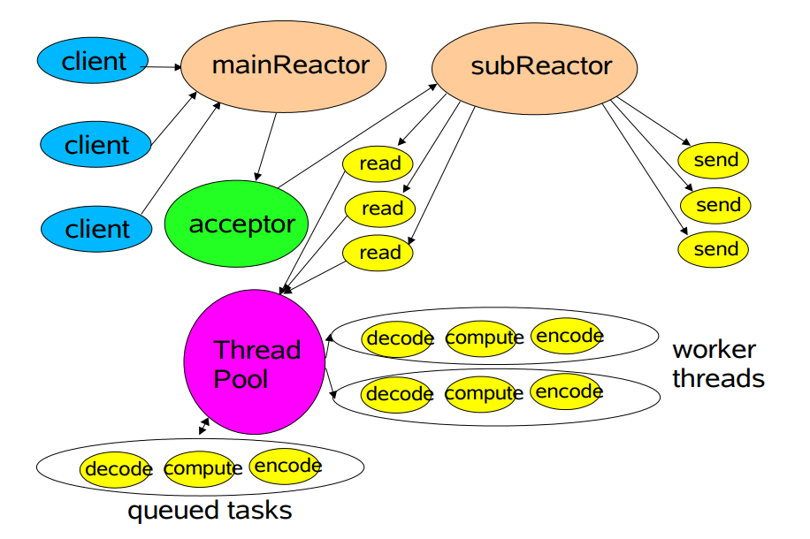
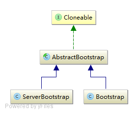

[自顶向下深入分析Netty](https://www.jianshu.com/p/92c5092c5d3f)

[netty源码分析](https://blog.csdn.net/xianmingsu/category_9581667.html)

# Netty线程模型



Netty的线程模型并不是一成不变的，实际通过用户的启动配置参数来配置。

在创建ServerBootstrap类实例前，先创建两个EventLoopGroup，它们实际上是两个独立的Reactor线程池，bossGroup负责接收客户端的连接，workerGroup负责处理IO相关的读写操作，或者执行系统task、定时task等。

用于接收客户端请求的线程池职责如下：

1. 接收客户端TCP连接，初始化Channel参数；
2. 将链路状态变更事件通知给ChannelPipeline；

处理IO操作的线程池职责如下：

1. 异步读取远端数据，发送读事件到ChannelPipeline；
2. 异步发送数据到远端，调用ChannelPipeline的发送消息接口；
3. 执行系统调用Task；
4. 执行定时任务Task，如空闲链路检测等；

Netty多线程编程的最佳实践如下： 

1. 服务端创建两个EventLoopGroup，用于逻辑隔离NIO acceptor和NIO IO线程；
2. 尽量避免在用户Handler里面启动用户线程（解码后将POJO消息发送到后端业务线程除外）；
3. 解码要在NIO线程调用的解码Handler中进行，不要切换到用户线程中完成消息的解码；
4. 如果业务逻辑比较简单，没有复杂的业务逻辑计算，没有可能阻塞线程的操作如磁盘操作、数据库操作、网络操作等，可以直接在NIO线程中进行业务逻辑操作，不用切换到用户线程；
5. 如果业务逻辑比较复杂，不要在NIO线程上操作，应将解码后的POJO封装成Task提交到业务线程池中执行，以保证NIO线程被尽快释放，处理其他IO操作；

# 使用示例

```java
    // 指定mainReactor
    EventLoopGroup bossGroup = new NioEventLoopGroup(1);
    // 指定subReactor
    EventLoopGroup workerGroup = new NioEventLoopGroup();
    // 用户自定义的ThreadPool
    EventExecutorGroup threadPool = new ThreadPool();
    try {
        ServerBootstrap b = new ServerBootstrap();
        b.group(bossGroup, workerGroup)
         .channel(NioServerSocketChannel.class)
         .option(ChannelOption.SO_BACKLOG, 100) // 设置TCP参数
         .childHandler(new ChannelInitializer<SocketChannel>() {
             @Override
             public void initChannel(SocketChannel ch) throws Exception {
                 ChannelPipeline p = ch.pipeline();
                 p.addLast(threadPool,    
                    new DecoderHandler(),   // 解码处理器
                    new ComputeHandler());  // 计算处理器
                    new EncoderHandler(),   // 编码处理器
             }
         });

        // 绑定到本地端口等待客户端连接
        ChannelFuture f = b.bind(PORT).sync();
        
        // 等待接受客户端连接的Channel被关闭
        f.channel().closeFuture().sync();
    } finally {
        // 关闭两个线程组
        bossGroup.shutdownGracefully();
        workerGroup.shutdownGracefully();
        threadPool.shutdown();
    }
```

`EventLoopGroup`是Netty实现的线程池接口，两个线程池:bossGroup和workerGroup分别对应mainReactor和subReactor。

其中boss专门用于接受客户端连接，

worker也就是常说的IO线程专门用于处理IO事件。IO事件包括两类，一类如服务端接收到客户端数据的Read事件，另一类如用户线程主动向客户端发送数据的Write事件。

在4.0版本中，用户自定义的业务线程池须实现`EventExecutorGroup`接口，4.1版本则可以直接使用JAVA自带的线程池。

为了帮助用户快速构建基于Netty的服务，Netty提供了两个启动器`ServerBootstrap`和`Bootstrap`，分别用于启动服务器端和客户端程序。`group(EventLoopGroup...)`方法用于指定一个或两个Reactor，本例中指定为两个。`channel(Channel)`方法本质用来指定一个Channel工厂，本例中该工厂生产服务端用于accept客户端连接的Channel，将默认使用Channel的无参构造方法。如果用户需要自定义有参数的Channel，可自定义所需的工厂实现。`option(Key, Value)`用于指定TCP相关的参数以及一些Netty自定义的参数。`childHandler()`用于指定subReactor中的处理器，类似的，`handler()`用于指定mainReactor的处理器，只是默认情况下mainReactor中已经添加了acceptor处理器，所以无需再指定。需要注意的是：这两个方法并不能累积调用而达到增加多个处理器的目的，所以引入了 `ChannelInitializer`，它是一个特殊的Handler，功能是初始化多个Handler，如本例中的`DecoderHandler`，`ComputeHandler`，`EncoderHandler`。完成初始化工作后，`ChannelInitializer`会从Handler链中删除。

# Bootstrap



## AbstractBootstrap

```java
public abstract class AbstractBootstrap<B extends AbstractBootstrap<B, C>, C extends Channel> implements Cloneable {

    // reactor线程池
    volatile EventLoopGroup group;
    // 通道工厂，主要用来创建初始的Channel,比如服务端的第一个执行bind()方法的serverChannel，
    // 客户端第一个执行connect()方法的Channel
    private volatile ChannelFactory<? extends C> channelFactory;
    private volatile SocketAddress localAddress;
    // channel相关的选项参数
    private final Map<ChannelOption<?>, Object> options = new LinkedHashMap<>();
    // 初始化channel的属性值
    private final Map<AttributeKey<?>, Object> attrs = new LinkedHashMap<>();
    // 业务逻辑Handler，主要是HandlerInitializer，也可能是普通Handler
    private volatile ChannelHandler handler;
    
    // 设置Channel的无参构造工厂
    public B channel(Class<? extends C> channelClass);
    // 设置Channel工厂
    public B channelFactory(ChannelFactory<? extends C> channelFactory);
    // 创建一个Channel并绑定到本地端口
    public ChannelFuture bind(SocketAddress localAddress);
    // 初始化Channel并且注册到线程池
    final ChannelFuture initAndRegister();
    // 初始化一个Channel
    abstract void init(Channel channel) throws Exception;
}
```

### ChannelFactory

```java
    public interface ChannelFactory<T extends Channel> {
        T newChannel();
    }
```

其中仅声明了一个`newChannel()`方法用来创建一个Channel，一般使用时，会有以下两种情况：

1. 在服务端创建一个ServerChannel用于接受客户端的连接
2. 在客户端创建一个Channel用于连接服务端

在这两种情况下，仅仅创建一个Channel似乎使用Factory过于大材小用。考虑这种情况：在构造一个代理服务器时，服务端需要创建大量的Channel连接目标服务器，这样使用Factory就很好。并且，当Channel的无参构造方法不能满足需求时，可以方便用户定义自己独有的工厂创建满足需求的Channel。

```java
public B channelFactory(ChannelFactory<? extends C> channelFactory) {
    this.channelFactory = channelFactory;
    return (B) this;
}
public B channel(Class<? extends C> channelClass) {
    return channelFactory(new BootstrapChannelFactory<C>(channelClass));
}

//BootstrapChannelFactory
public T newChannel() {
    try {
        return clazz.newInstance();
    } catch (Throwable t) {
        throw new ChannelException("Unable to create Channel from class ");
    }
}
```

### bind()

`bind()`方法是`AbstarctBootstrap`的核心方法，用于绑定前述工厂创建的Channel到本地的一个端口：

```java
    public ChannelFuture bind(SocketAddress localAddress) {
        validate(); //确保关键参数设置正确
        return doBind(localAddress);
    }
```

```java
    private ChannelFuture doBind(final SocketAddress localAddress) {
        final ChannelFuture regFuture = initAndRegister(); // 创建Channel并注册到线程池
        final Channel channel = regFuture.channel();
        if (regFuture.cause() != null) {
            return regFuture;
        }

        if (regFuture.isDone()) {
            // 一般情况下，channel注册完成且注册成功
            ChannelPromise promise = channel.newPromise();
            doBind0(regFuture, channel, localAddress, promise);
            return promise;
        } else {
            // 由于注册是异步事件，可能此时没有注册完成，那么使用异步操作
            final PendingRegistrationPromise promise = 
                      new PendingRegistrationPromise(channel);
            regFuture.addListener(new ChannelFutureListener() {
                @Override
                // 该方法在注册完成时调用
                public void operationComplete(ChannelFuture future) throws Exception {
                    Throwable cause = future.cause();
                    if (cause != null) {
                        // 注册过程中有异常则失败
                        promise.setFailure(cause);
                    } else {
                        // 注册完成且成功
                        promise.executor = channel.eventLoop(); // 设置为注册到的线程
                        doBind0(regFuture, channel, localAddress, promise);
                    }
                }
            });
            return promise;
        }
    }
```

#### 创建注册Channel

为了更好的理解这段代码，先回顾Netty的特点：**事件驱动**，比如上面代码中的两个动作：注册和绑定，在Netty实现中是两个异步事件，其中注册是指Channel注册到reactor线程池，绑定是指Channel获得了本机的一个TCP端口。如果你熟悉javascript或者GUI编程，对**回调函数**也不会陌生，Netty也采用类似的机制，所以能在Netty源代码里看到大量的`ChannelFuture`([细节可看这一章](https://www.jianshu.com/p/a06da3256f0c))，当一个事件完成时，会回调注册到`ChannelFuture`上的`FutureListener`从而实现异步操作。此外，Netty4为了简化逻辑处理逻辑，遵循这样一条规则：**一个Channel产生的IO事件始终由其注册到的线程处理**，可知注册和绑定事件都将在同一个线程也就是Channel注册到的线程执行。

```java
    final ChannelFuture initAndRegister() {
        Channel channel = null;
        try {
            // 创建一个Channel
            channel = channelFactory().newChannel();
            // 初始化处理器Handler
            init(channel);
        } catch (Throwable t) {
            if (channel != null) {
                channel.unsafe().closeForcibly();
            }
            // 还没有注册到线程池，使用默认线程GlobalEventExecutor
            return new DefaultChannelPromise(channel,
                            GlobalEventExecutor.INSTANCE).setFailure(t);
        }
        // 将channel注册到Reactor线程池
        ChannelFuture regFuture = group().register(channel);
        if (regFuture.cause() != null) {
            if (channel.isRegistered()) {
                channel.close();
            } else {
                channel.unsafe().closeForcibly();
            }
        }
        return regFuture;
    }

    //模板方法，由子类Bootstrap或ServerBootstrap实现具体的初始化细节。
    abstract void init(Channel channel) throws Exception;
```


#### 绑定端口

接着分析实现绑定本地端口的`doBind0()`方法：

```java
    private static void doBind0(final ChannelFuture regFuture, final Channel channel,
            final SocketAddress localAddress, final ChannelPromise promise) {
        channel.eventLoop().execute(new Runnable() {
            @Override
            public void run() {
                if (regFuture.isSuccess()) {
                    channel.bind(localAddress, promise)
                            .addListener(ChannelFutureListener.CLOSE_ON_FAILURE);
                } else {
                    promise.setFailure(regFuture.cause());
                }
            }
        });
    }
```

如果你对`channel.eventLoop().execute()`的用法有疑问，再次回顾这条规则：**一个Channel产生的IO事件始终由其注册到的线程处理**。绑定事件是一个类似write的出站事件，所以需要由channel注册到的线程完成。为什么不使用regFuture直接添加Futurelistener完成绑定处理呢？代码中的解释是注册不一定成功，失败后可能执行的线程并不是注册的线程（我查看代码在这里仅仅调用register(Channel)并不会有这样的情况）。

这个bind过程夹杂很多私货，总结一下流程：

1. 使用ChannelFactory创建一个Channel
2. 调用init()方法初始化Channel，主要是绑定处理器
3. 注册到一个Reactor线程池
4. 对注册的异步结果处理：注册成功进行绑定操作，此时绑定失败将会关闭Channel返回异步绑定失败，绑定成功返回异步成功；注册失败直接返回异步注册失败。

## ServerBootstrap

```java
    // 为accept的客户端channel设置的选项参数
    private final Map<ChannelOption<?>, Object> childOptions = new LinkedHashMap<>();
    // 为accept的客户端channel设置的属性键值对
    private final Map<AttributeKey<?>, Object> childAttrs = new LinkedHashMap<>();
    // subReactor线程池，父类的group成为mainReactor线程池
    private volatile EventLoopGroup childGroup;
    // subReactor线程池的事件处理器，一般为ChannelInitializer初始化处理器链
    private volatile ChannelHandler childHandler;
```

### init方法

ServerBootstrap的`init(channel)`方法，完成的工作有：

1. 设置serverChannel的选项参数
2. 设置serverChannel的属性键值对
3. 添加处理serverChannel的IO事件处理器

```java
    void init(Channel channel) throws Exception {
        // 1.设置serverChannel的选项参数
        // 2.设置serverChannel的属性键值对
        // 3.添加处理serverChannel事件的处理器
        ChannelPipeline p = channel.pipeline();
        p.addLast(new ChannelInitializer<Channel>() {
            @Override
            public void initChannel(Channel ch) throws Exception {
                final ChannelPipeline pipeline = ch.pipeline();
                ChannelHandler handler = handler();
                if (handler != null) {
                    pipeline.addLast(handler);
                }
                ch.eventLoop().execute(new Runnable() {
                    @Override
                    public void run() {
                        pipeline.addLast(new ServerBootstrapAcceptor(
                                currentChildGroup,currentChildHandler, 
                                currentChildOptions, currentChildAttrs));
                    }
                });
            }
        });
    }
```

可见，向serverChannel添加是一个初始化处理器`ChannelInitializer`，完成的主要工作是将用户Handler以及一个`ServerBootstrapAcceptor`添加到serverChannel的处理器链中。此处需要注意的是，结合文章最开始的示例，`p.addLast()`方法在main线程中执行，而`initChannel()`方法将在Channel注册到的线程中执行，执行的时机是该`ChannelInitializer`被添加到ChannelPipeline中时但晚于`p.addLast()`方法。明白了这点，继续分析`ch.eventLoop().execute()`的使用，这是因为需要保证`ServerBootstrapAcceptor`被添加到处理器链的**最尾部**以便不破坏mainReactor将accept接受的Channel连接传递给subReactor。但是当通过`handler()`获得的用户Handler也是一个`ChannelInitializer`，如果只是常规的使用`pipeline.addLast(acceptor)`将导致acceptor并不在处理器链的最尾部。

### ServerBootstrapAcceptor

静态内部类 ServerBootstrapAcceptor

在前面的分析中，不断提到了`ServerBootstrapAcceptor`，正对应文章最开始图中绿色的acceptor。Netty默认实现了这个acceptor处理器，主要功能是将mainReactor接受的Channel传递给subReactor。该类的字段如下：

```java
 private static class ServerBootstrapAcceptor extends ChannelInboundHandlerAdapter{    
	private final EventLoopGroup childGroup;
    private final ChannelHandler childHandler;
    private final Entry<ChannelOption<?>, Object>[] childOptions;
    private final Entry<AttributeKey<?>, Object>[] childAttrs;
 }
```

该类继承自`ChannelInboundHandlerAdapter`，作为Netty的使用者对这个类很熟悉，如果你只是初学，可在学完本章之后继续查看[这个链接](https://www.jianshu.com/p/a9bcd89553f5)。首先明确这个Handler处理器是一个inbound事件处理器，需要注意的是：Netty将`ServerChannel`接受客户端连接的**accept事件抽象为Read读取事件**。因此，我们重点关注`channelRead()`方法，其完成的工作有：

1. 配置Channel，包括Channel上的处理器链，Channel的选项参数及属性键值对。
2. 将服务端accept的客户端Channel注册到subReactor线程池的一个线程上

```java
    public void channelRead(ChannelHandlerContext ctx, Object msg) {
        // 服务器accept的客户端channel
        final Channel child = (Channel) msg;    
        // 设置处理器链
        child.pipeline().addLast(childHandler);
        // 设置channel的选项参数
        for (Entry<ChannelOption<?>, Object> e: childOptions) {
            try {
                if (!child.config().setOption(
                             (ChannelOption<Object>) e.getKey(), e.getValue())) {
                    logger.warn("Unknown channel option: " + e);
                }
            } catch (Throwable t) {
                logger.warn("Failed to set a channel option: " + child, t);
            }
        }
        // 设置channel的属性键值对
        for (Entry<AttributeKey<?>, Object> e: childAttrs) {
            child.attr((AttributeKey<Object>) e.getKey()).set(e.getValue());
        }

        // 将客户端channel注册到subReactor线程池，注册失败或者抛出异常则关闭channel
        try {
            childGroup.register(child).addListener(new ChannelFutureListener() {
                @Override
                public void operationComplete(ChannelFuture future) throws Exception {
                    if (!future.isSuccess()) {
                        forceClose(child, future.cause());
                    }
                }
            });
        } catch (Throwable t) {
            forceClose(child, t);
        }
    }

    private static void forceClose(Channel child, Throwable t) {
        child.unsafe().closeForcibly();
        logger.warn("Failed to register an accepted channel: " + child, t);
    }
```

其中的`exceptionCaught()`方法也值得关注，当`ServerChannel`事件在执行中产生异常时，用户并不希望ServerChannel被关闭，因为还有其他的客户端连接需要处理。为此，Netty处理异常时使用这样的极致：产生异常后暂停接受客户端连接，1s以后再恢复接受连接。

```java
    public void exceptionCaught(ChannelHandlerContext ctx, Throwable cause) 
                    throws Exception {
        final ChannelConfig config = ctx.channel().config();
        if (config.isAutoRead()) {
            // 停止accept客户端channel的连接
            config.setAutoRead(false);
            // 1s以后重新接受客户端channel连接
            ctx.channel().eventLoop().schedule(new Runnable() {
                @Override
                public void run() {
                   config.setAutoRead(true);
                }
            }, 1, TimeUnit.SECONDS);
        }
        ctx.fireExceptionCaught(cause);
    }
```

## Bootstrap

Bootstrap是客户端启动器，只增加了一个字段：

```java
private volatile SocketAddress remoteAddress;   // 服务端地址
```

### init方法

客户端的`init()`方法很简单，只完成配置Channel的工作，包括Channel上的处理器链，Channel的选项参数及属性键值对。代码如下：

```java
    void init(Channel channel) throws Exception {
        ChannelPipeline p = channel.pipeline();
        // 设置处理器链
        p.addLast(handler());
        // 设置channel的选项参数
        final Map<ChannelOption<?>, Object> options = options();
        synchronized (options) {
            for (Entry<ChannelOption<?>, Object> e: options.entrySet()) {
                try {
                    if(!channel.config().setOption(
                            (ChannelOption<Object>)e.getKey(), e.getValue())) {
                        logger.warn("Unknown channel option: " + e);
                    }
                } catch (Throwable t) {
                    logger.warn("Failed to set a channel option: " + channel, t);
                }
            }
        }
        // 设置channel的属性键值对
        final Map<AttributeKey<?>, Object> attrs = attrs();
        synchronized (attrs) {
            for (Entry<AttributeKey<?>, Object> e: attrs.entrySet()) {
                channel.attr((AttributeKey<Object>) e.getKey()).set(e.getValue());
            }
        }
    }
```

### connect方法

客户端需要连接到远程服务端，才能进行网络通讯，所以`Bootstrap`作为客户端启动器必然要有`connect(remoteAddr)`方法。该方法有很多变种，关键的一个如下：

```java
    public ChannelFuture connect(SocketAddress remoteAddress, 
                    SocketAddress localAddress) {
        if (remoteAddress == null) {
            throw new NullPointerException("remoteAddress");
        }
        validate();
        return doConnect(remoteAddress, localAddress);
    }
```

```java
    private ChannelFuture doConnect(final SocketAddress remoteAddress, 
                                                final SocketAddress localAddress) {
        final ChannelFuture regFuture = initAndRegister();  //创建Channel并注册到线程池
        final Channel channel = regFuture.channel();
        if (regFuture.cause() != null) {
            return regFuture;
        }

        final ChannelPromise promise = channel.newPromise();
        if (regFuture.isDone()) {
            // 注册异步操作完成，再提交一个连接异步任务
            doConnect0(regFuture, channel, remoteAddress, localAddress, promise);
        } else {
            // 注册异步操作未完成，当注册异步完成时提交一个连接异步任务
            regFuture.addListener(new ChannelFutureListener() {
                @Override
                public void operationComplete(ChannelFuture future) throws Exception {
                    doConnect0(regFuture, channel, remoteAddress, localAddress, promise);
                }
            });
        }
        return promise;
    }
```

此处的处理与`ServerBootstrap`的`bind()`方法很类似，可类比分析。由此推知，`doConnect0()`方法将向channel注册的线程池提交一个异步连接任务。的确如此，代码如下：

```java
    private static void doConnect0(final ChannelFuture regFuture, final Channel channel,
                                final SocketAddress remoteAddress, 
                                final SocketAddress localAddress,
                                final ChannelPromise promise) {
        channel.eventLoop().execute(new Runnable() {
            @Override
            public void run() {
                if (regFuture.isSuccess()) {
                    if (localAddress == null) {
                        channel.connect(remoteAddress, promise);
                    } else {
                        channel.connect(remoteAddress, localAddress, promise);
                    }
                    promise.addListener(ChannelFutureListener.CLOSE_ON_FAILURE);
                } else {
                    promise.setFailure(regFuture.cause());
                }
            }
        });
    }
```

# EventLoopGroup

```java
public interface EventExecutorGroup extends ScheduledExecutorService, Iterable<EventExecutor> {
    boolean isShuttingDown();
    Future<?> shutdownGracefully();
    Future<?> shutdownGracefully(long quietPeriod, long timeout, TimeUnit unit);
    Future<?> terminationFuture();
    EventExecutor next();
}
```

```java
    // Executor
    void execute(Runnable command);

	// ExecutorService
    void shutdown();
    List<Runnable> shutdownNow();
    boolean isShutdown();
    boolean isTerminated();
    boolean awaitTermination(long timeout, TimeUnit unit) throws InterruptedException;
    <T> Future<T> submit(Callable<T> task);
    <T> Future<T> submit(Runnable task, T result);
    Future<?> submit(Runnable task);

	//ScheduledExecutorService
    ScheduledFuture<?> schedule(Runnable command,long delay, TimeUnit unit);
    <V> ScheduledFuture<V> schedule(Callable<V> callable,long delay, TimeUnit unit);
    ScheduledFuture<?> scheduleAtFixedRate(Runnable command,long initialDelay,
                                                long period,TimeUnit unit);
    ScheduledFuture<?> scheduleWithFixedDelay(Runnable command,long initialDelay,
                                                long delay,TimeUnit unit);
```

## AbstractEventExecutorGroup

AbstractEventExecutorGroup实现了EventExecutorGroup接口的大部分方法，实现都长的和下面的差不多：

步骤是这样的：(1).找一个线程。(2).交给线程执行。

```java
    @Override
    public void execute(Runnable command) {
        next().execute(command);
    }
```

## MultithreadEventExecutorGroup

```java
    // 线程池，数组形式可知为固定线程池
    private final EventExecutor[] children;
    // 线程索引，用于线程选择
    private final AtomicInteger childIndex = new AtomicInteger();
    // 终止的线程个数
    private final AtomicInteger terminatedChildren = new AtomicInteger();
    // 线程池终止时的异步结果
    private final Promise<?> terminationFuture = 
                          new DefaultPromise(GlobalEventExecutor.INSTANCE);
    // 线程选择器
    private final EventExecutorChooser chooser;
```

### 构造函数

(1).设置线程工厂
(2).设置线程选择器
(3).实例化线程
(4).设置线程终止异步结果

```java
    protected MultithreadEventExecutorGroup(int nThreads, 
                                        ThreadFactory threadFactory, Object... args)
	//(1).设置线程工厂
    if (threadFactory == null) {
        threadFactory = newDefaultThreadFactory();
    }
    
    protected ThreadFactory newDefaultThreadFactory()，() {
        return new DefaultThreadFactory(getClass());
    }

	//(2).设置线程选择器
    if (isPowerOfTwo(children.length)) {
        chooser = new PowerOfTwoEventExecutorChooser();
    } else {
        chooser = new GenericEventExecutorChooser();
    }	
	//判断一个整数是2的幂次方
    private static boolean isPowerOfTwo(int val) {
        return (val & -val) == val;
    }

	//(3).实例化线程 使用newChild()依次实例化线程，如果出错，关闭所有已经实例化的线程。
    for (int i = 0; i < nThreads; i ++) {
        boolean success = false;
        try {
            // 使用模板方法newChild实例化一个线程
            children[i] = newChild(threadFactory, args);
            success = true;
        } catch (Exception e) {
            throw new IllegalStateException("failed to create a child event loop", e);
        } finally {
            if (!success) {
                // 如果不成功，所有已经实例化的线程优雅关闭
                for (int j = 0; j < i; j ++) {
                    children[j].shutdownGracefully();
                }
                // 确保已经实例化的线程终止
                for (int j = 0; j < i; j ++) {
                    EventExecutor e = children[j];
                    try {
                        while (!e.isTerminated()) {
                            e.awaitTermination(Integer.MAX_VALUE, TimeUnit.SECONDS);
                        }
                    } catch (InterruptedException interrupted) {
                        Thread.currentThread().interrupt();
                        break;
                    }
                }
            }
        }
    }

	//(4).设置线程终止异步结果
    final FutureListener<Object> terminationListener = new FutureListener<Object>() {
        @Override
        public void operationComplete(Future<Object> future) throws Exception {
            // 线程池中的线程每终止一个增加记录数，直到全部终止设置线程池异步终止结果为成功
            if (terminatedChildren.incrementAndGet() == children.length) {
                terminationFuture.setSuccess(null);
            }
        }
    };
    for (EventExecutor e: children) {
        e.terminationFuture().addListener(terminationListener);
    }
```

#### 线程选择器

每次选择索引为上一次所选线程索引+1的线程

```java
    private interface EventExecutorChooser {
        EventExecutor next();
    }
    
    private final class PowerOfTwoEventExecutorChooser implements EventExecutorChooser {
        @Override
        public EventExecutor next() {
            return children[childIndex.getAndIncrement() & children.length - 1];
        }
    }
    
    private final class GenericEventExecutorChooser implements EventExecutorChooser {
        @Override
        public EventExecutor next() {
            return children[Math.abs(childIndex.getAndIncrement() % children.length)];
        }
    }
```

## MultithreadEventLoopGroup

```java
public abstract class MultithreadEventLoopGroup extends MultithreadEventExecutorGroup implements EventLoopGroup {
    //默认核心线程数 默认情况，线程数最小为1，
    //如果配置了系统参数io.netty.eventLoopThreads，设置为该值，否则设置为核心数的2倍
    DEFAULT_EVENT_LOOP_THREADS = Math.max(1, SystemPropertyUtil.getInt(
        "io.netty.eventLoopThreads", 
        Runtime.getRuntime().availableProcessors() * 2));
    
    
    @Override
    // 将通道channel注册到EventLoopGroup中的一个线程上
    public ChannelFuture register(Channel channel) {
        return next().register(channel);
    }
    
    @Override
    // 覆盖父类接口的方法，返回EventLoop
    public EventLoop next() {
        return (EventLoop) super.next();
    }
```

## NioEventLoopGroup

NioEventLoopGroup的主要代码实现是模板方法newChild()，用来创建线程池中的单个线程

```java
    @Override
    protected EventExecutor newChild(ThreadFactory threadFactory, Object... args) 
                   throws Exception {
        return new NioEventLoop(this, threadFactory, (SelectorProvider) args[0],
            ((SelectStrategyFactory) args[1]).newSelectStrategy(), 
            (RejectedExecutionHandler) args[2]);
    }
```

此外NioEventLoopGroup还提供了setIoRatio()和rebuildSelectors()两个方法，一个用来设置I/O任务和非I/O任务的执行时间比，一个用来重建线程中的selector来规避JDK的[epoll 100% CPU Bug](https://bugs.java.com/bugdatabase/view_bug.do?bug_id=6403933)。

# EventLoop

## AbstractEventExecutor

```java
    public EventExecutor next() {
        return this;
    }    

    public boolean inEventLoop() {
        return inEventLoop(Thread.currentThread());
    }
    
    public Future<?> shutdownGracefully() {
        return shutdownGracefully(2, 15, TimeUnit.SECONDS);
    }

    public <V> Promise<V> newPromise() {
        return new DefaultPromise<V>(this);
    }

    @Override
    protected final <T> RunnableFuture<T> newTaskFor(Callable<T> callable) {
        return new PromiseTask<T>(this, callable);
    }

```

## AbstractScheduledEventExecutor

```java
    //优先队列，保存任务
	Queue<ScheduledFutureTask<?>> scheduledTaskQueue;
    //延迟加载
    Queue<ScheduledFutureTask<?>> scheduledTaskQueue() {
        if (scheduledTaskQueue == null) {
            scheduledTaskQueue = new PriorityQueue<ScheduledFutureTask<?>>();
        }
        return scheduledTaskQueue;
    }

	//调度方法
    <V> ScheduledFuture<V> schedule(final ScheduledFutureTask<V> task) {
        if (inEventLoop()) {
            scheduledTaskQueue().add(task); // 原生线程直接向任务队列添加
        } else {
            execute(new Runnable() {    // 其他线程则提交一个添加调度任务的任务
                @Override
                public void run() {
                    scheduledTaskQueue().add(task);
                }
            });
        }
        return task;
    }
```

### ScheduledFutureTask

```java
final class ScheduledFutureTask<V> extends PromiseTask<V> implements ScheduledFuture<V>, PriorityQueueNode {
    // 调度任务ID生成器
    private static final AtomicLong nextTaskId = new AtomicLong();
    // 调度相对时间起点
    private static final long START_TIME = System.nanoTime();
    
    // 获取相对的当前时间
    static long nanoTime() {
        return System.nanoTime() - START_TIME;
    }

    // 获取相对的截止时间
    static long deadlineNanos(long delay) {
        return nanoTime() + delay;
    }

    // 调度任务ID
    private final long id = nextTaskId.getAndIncrement();
    // 调度任务截止时间即到了改时间点任务将被执行
    private long deadlineNanos;
    // 任务时间间隔
    private final long periodNanos;
}
```

任务执行

```java
    @Override
    public void run() {
        assert executor().inEventLoop();
        try {
            if (periodNanos == 0) { // 普通不重复的调度任务直接执行
                if (setUncancellableInternal()) {
                    V result = task.call();
                    setSuccessInternal(result);
                }
            } else {
                if (!isCancelled()) {   // 重复的任务可能被取消
                    task.call();
                    if (!executor().isShutdown()) { // 线程已经关闭则不再添加新任务
                        long p = periodNanos;
                        if (p > 0) {
                            deadlineNanos += p; // 按固定频率重复
                        } else {
                            deadlineNanos = nanoTime() - p; // 按固定延迟重复
                        }
                        if (!isCancelled()) {
                            Queue<ScheduledFutureTask<?>> scheduledTaskQueue =
                                    ((AbstractScheduledEventExecutor) executor()).scheduledTaskQueue;
                            assert scheduledTaskQueue != null;
                            scheduledTaskQueue.add(this); // 下一个最近的重复任务添加到任务队列
                        }
                    }
                }
            }
        } catch (Throwable cause) {
            setFailureInternal(cause);
        }
    }
```

优先级队列的出队顺序是：截止时间最近的先出队，如果截止时间相同则ID小的先出队。

```java
    @Override
    public int compareTo(Delayed o) {
        if (this == o) {
            return 0;
        }
        ScheduledFutureTask<?> that = (ScheduledFutureTask<?>) o;
        long d = deadlineNanos() - that.deadlineNanos();
        if (d < 0) {
            return -1;
        } else if (d > 0) {
            return 1;
        } else if (id < that.id) {
            return -1;
        } else if (id == that.id) {
            throw new Error();
        } else {
            return 1;
        }
    }
```

## SingleThreadEventExecutor

```java
public abstract class SingleThreadEventExecutor extends AbstractScheduledEventExecutor implements OrderedEventExecutor {
    private static final int ST_NOT_STARTED = 1;    // 没有启动
    private static final int ST_STARTED = 2;    // 启动
    private static final int ST_SHUTTING_DOWN = 3;  // 正在关闭
    private static final int ST_SHUTDOWN = 4;   // 关闭
    private static final int ST_TERMINATED = 5; // 终止
    
    private final EventExecutorGroup parent;    // 该Executor所属的线程池
    private final Queue<Runnable> taskQueue;    // 任务队列
    private final Thread thread;    // 改Executor所属的线程
    private final ThreadProperties threadProperties;    // 线程属性值
    private final Semaphore threadLock = new Semaphore(0);  // 一个信号量，注意初始值为0
    private final Set<Runnable> shutdownHooks = new LinkedHashSet<~>(); // 线程关闭钩子任务
    private final boolean addTaskWakesUp;   // 添加任务时是否唤醒线程
    private final int maxPendingTasks;  // 任务队列大小即未执行的最大任务数
    private final RejectedExecutionHandler rejectedExecutionHandler;    // 队列满时的阻止器

    private long lastExecutionTime; // 上一次执行时间

    private volatile int state = ST_NOT_STARTED;    // 线程状态，注意该字段由STATE_UPDATER修改

    // 线程终止异步结果
    private final Promise<?> terminationFuture = new DefaultPromise<Void>(
                                                            GlobalEventExecutor.INSTANCE);
}
```

## SingleThreadEventLoop

SingleThreadEventLoop终于与Channel取得联系，其中最重要的便是register()方法，功能是将一个Channel对象注册到EventLoop上，其最终实现委托Channel对象的Unsafe对象完成

```java
    @Override
    public ChannelFuture register(Channel channel) {
        return register(channel, new DefaultChannelPromise(channel, this));
    }

    @Override
    public ChannelFuture register(final Channel channel, final ChannelPromise promise) {
        // 代码中省略了NullPointer检查
        channel.unsafe().register(this, promise);
        return promise;
    }
```

## NioEventLoop

```java
    Selector selector;  // NIO中的多路复用器Selector
    private SelectedSelectionKeySet selectedKeys;   // 就绪事件的键值对，优化时使用
    private final SelectorProvider provider;    // selector的工厂
    // 唤醒标记，由于select()方法会阻塞
    private final AtomicBoolean wakenUp = new AtomicBoolean(); 
    private final SelectStrategy selectStrategy; // 选择策略
    private volatile int ioRatio = 50;  // IO任务占总任务(IO+普通任务)比例
    private int cancelledKeys;  // 取消的键数目
    private boolean needsToSelectAgain; 
```

在讲解方法前，我们再回顾一下NioEventLoop的继承体系：
 (1).JDK的AbstractExecutorService类定义了任务的提交和执行，留下了newTaskFor()方法用于子类定义执行的任务；
 (2).Netty的AbstractEventExecutor类覆盖了newTaskFor()方法，使用PromiseTask表示待执行的任务；
 (3).AbstractScheduledEventExecutor类将待执行的调度任务封装为ScheduledFutureTask提交给调度任务队列；
 (4).SingleThreadEventExecutor类实现了任务执行器即线程，其覆盖了execute()方法，当使用execute()执行一个任务时，实质是向任务队列提交一个任务；该类中还有一个重要的**模板方法run()**，在这个方法中执行任务队列中的任务（调度任务队列中的待执行任务移入普通任务队列），留给子类实现；
 (5).SingleThreadEventLoop类实现对Channel对象的注册。
 从NioEventLoop继承体系的分析可以看出，NioEventLoop要实现的最关键方法就是基类的模板方法run()。是不是已经迫不及待了？好，我们直奔代码：

```java
@Override
protected void run() {
    for (;;) { 
        try {
            // 调用select()查询是否有就绪的IO事件
            switch (selectStrategy.calculateStrategy(selectNowSupplier, hasTasks())) {
                case SelectStrategy.CONTINUE:
                    continue;
                case SelectStrategy.SELECT:
                    select(wakenUp.getAndSet(false));
                    if (wakenUp.get()) {
                        selector.wakeup();
                    }
                default:
                    // fallthrough
            }

            cancelledKeys = 0;
            needsToSelectAgain = false;
            final int ioRatio = this.ioRatio;
            if (ioRatio == 100) {
                processSelectedKeys();  // 处理就绪的IO事件
                runAllTasks();  // 执行完任务队列中的任务
            } else {
                final long ioStartTime = System.nanoTime();
                processSelectedKeys();  // 处理就绪的IO事件
                final long ioTime = System.nanoTime() - ioStartTime;
                runAllTasks(ioTime * (100 - ioRatio) / ioRatio);    // 给定时间内执行任务
            }

            if (isShuttingDown()) { // 检测用户是否要终止线程
                closeAll();
                if (confirmShutdown()) {
                    break;
                }
            }
        } catch (Throwable t) {
            logger.warn("Unexpected exception in the selector loop.", t);
            try {
                Thread.sleep(1000); // 防止连续异常过度消耗CPU
            } catch (InterruptedException e) {
                // Ignore.
            }
        }
    }
}
```

从代码中可以看出NioEventLoop完成了三项任务：
 (1).轮训Channel选择就绪的IO事件。
 (2).处理就绪的IO事件。
 (3).处理任务队列中的普通任务（包含调度任务）。
 其中第(3)项，我们已经在SingleThreadEventExecutor类中分析过，不再赘述。我们看代码的6-16行即第(1)项，轮询Channel选择就绪的IO事件。这里使用接口SelectStrategy是用户可以选择具体的选择策略，我们主要看默认实现：

