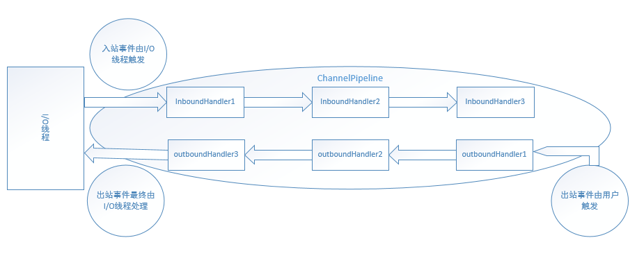

在Netty事件模型中，在发生网络事件（如Read，Write，Connect）等事件后，是通过注册在`Pipeline`中的一个个`Handler`对事件进行处理的，这种采用多`Handler`对事件进行处理可以对事件的处理进行逻辑分层，比如在经典的编码、解码处理中，可以注册一个专门的`Handler`对报文进行编码或者解码，编码或者解码之后的报文再传递给下一个`Handler`进行处理。另外Netty采用这种`Pipeline`这种串行的`Handler`处理各种事件，避免了线程的上下文切换，减少了多线程环境对锁的依赖，也能在一定程度上提高性能。

`ChannelPipeline`是`ChannelHandler`的容器，负责管理一系列的`ChannelHandler`，对到来的事件进行处理。

`ChannelHandler`则是对事件处理的一个个处理器，分为两种类型，即`ChannelInboundHandler`和`ChannelOutboundHandler`，分别负责处理Netty中的Inbound和Outbound事件

# ChannelPipeline



入站事件一般由**I/O线程**触发，以下事件为入站事件：

```java
    ChannelRegistered() // Channel注册到EventLoop
    ChannelActive()     // Channel激活
    ChannelRead(Object) // Channel读取到数据
    ChannelReadComplete()   // Channel读取数据完毕
    ExceptionCaught(Throwable)  // 捕获到异常
    UserEventTriggered(Object)  // 用户自定义事件
    ChannelWritabilityChanged() // Channnel可写性改变，由写高低水位控制
    ChannelInactive()   // Channel不再激活
    ChannelUnregistered()   // Channel从EventLoop中注销
```

出站事件一般由**用户**触发，以下事件为出站事件：

```java
    bind(SocketAddress, ChannelPromise) // 绑定到本地地址
    connect(SocketAddress, SocketAddress, ChannelPromise)   // 连接一个远端机器
    write(Object, ChannelPromise)   // 写数据，实际只加到Netty出站缓冲区
    flush() // flush数据，实际执行底层写
    read()  // 读数据，实际设置关心OP_READ事件，当数据到来时触发ChannelRead入站事件
    disconnect(ChannelPromise)  // 断开连接，NIO Server和Client不支持，实际调用close
    close(ChannelPromise)   // 关闭Channel
    deregister(ChannelPromise)  // 从EventLoop注销Channel
```

入站事件一般由I/O线程触发，用户程序员也可根据实际情况触发。考虑这样一种情况：一个协议由头部和数据部分组成，其中头部含有数据长度，由于数据量较大，客户端分多次发送该协议的数据，服务端接收到数据后需要收集足够的数据，组装为更有意义的数据传给下一个ChannelInboudHandler。也许你已经知道，这个收集数据的ChannelInboundHandler正是Netty中基本的Encoder，Encoder中会处理多次ChannelRead()事件，只触发一次对下一个ChannelInboundHandler更有意义的ChannelRead()事件。
 出站事件一般由用户触发，而I/O线程也可能会触发。比如，当用户已配置ChannelOption.AutoRead选项，则I/O在执行完ChannelReadComplete()事件，会调用read()方法继续关心OP_READ事件，保证数据到达时自动触发ChannelRead()事件。

# DefaultChannelPipeline

## 构造函数

```java
//DefaultChannelPipeline
protected DefaultChannelPipeline(Channel channel) {
    //记录该pipeline关联的channel
    this.channel = ObjectUtil.checkNotNull(channel, "channel");
    succeededFuture = new SucceededChannelFuture(channel, null);
    voidPromise =  new VoidChannelPromise(channel, true);

    //初始化head和tail节点
    tail = new TailContext(this);
    head = new HeadContext(this);

    //将首尾节点连接起来
    head.next = tail;
    tail.prev = head;
}
```

## Handler添加、删除

向Pipeline中添加handler

- addAfter
- addBefore
- addFirst
- addLast

从Pipeline中移除handler

- remove
- removeFirst
- removeIfExists
- removeLast

替换Pipeline中的某个handler

- replace

为了节省篇幅，我们介绍一个方法的实现：`addLast(EventExecutorGroup executor, ChannelHandler... handlers)`

```java
//DefaultChannelPipeline
@Override
public final ChannelPipeline addLast(EventExecutorGroup executor, ChannelHandler... handlers) {
    if (handlers == null) {
        throw new NullPointerException("handlers");
    }

    for (ChannelHandler h: handlers) {
        if (h == null) {
            break;
        }
        //将传入的Handler一个个添加到pipeline中
        addLast(executor, null, h);
    }

    return this;
}


public final ChannelPipeline addLast(EventExecutorGroup group, String name, ChannelHandler handler) {
    final AbstractChannelHandlerContext newCtx;
    synchronized (this) {
        checkMultiplicity(handler);
        //上面介绍过pipeline中连接的实际上是封装了handler的
        //context
        newCtx = newContext(group, filterName(name, handler), handler);

        //将该context连接到链表尾端，但是在tail之前
        addLast0(newCtx);

        // If the registered is false it means that the channel was not registered on an eventloop yet.
        // In this case we add the context to the pipeline and add a task that will call
        // ChannelHandler.handlerAdded(...) once the channel is registered.
        if (!registered) {
            newCtx.setAddPending();
            callHandlerCallbackLater(newCtx, true);
            return this;
        }

        EventExecutor executor = newCtx.executor();
        if (!executor.inEventLoop()) {
            newCtx.setAddPending();
            executor.execute(new Runnable() {
                @Override
                public void run() {
                    callHandlerAdded0(newCtx);
                }
            });
            return this;
        }
    }
    callHandlerAdded0(newCtx);
    return this;
}

//新建一个新的DefaultChannelHandlerContext
private AbstractChannelHandlerContext newContext(EventExecutorGroup group, String name, ChannelHandler handler) {
    return new DefaultChannelHandlerContext(this, childExecutor(group), name, handler);
}

//处理传入的线程组group
private EventExecutor childExecutor(EventExecutorGroup group) {
    //如果没有传入线程组，则返回空
    if (group == null) {
        return null;
    }
    //获取SINGLE_EVENTEXECUTOR_PER_GROUP配置，
    //上面介绍过
    Boolean pinEventExecutor = channel.config().getOption(ChannelOption.SINGLE_EVENTEXECUTOR_PER_GROUP);
    //如果不是采用单一线程执行，则调用next方法选出一个线程返回
    if (pinEventExecutor != null && !pinEventExecutor) {
        return group.next();
    }

    //如果执行到这里，表示传入了线程组，并且
    //SINGLE_EVENTEXECUTOR_PER_GROUP配置为Ture


    //获取记录的group和第一次从该线程组选出的线程
    Map<EventExecutorGroup, EventExecutor> childExecutors = this.childExecutors;
    //如果为空，则新建一个IdentityHashMap，这里为什么使用
    //IdentityHashMap，可以看下IdentityHashMap的实现原理
    if (childExecutors == null) {
        // Use size of 4 as most people only use one extra EventExecutor.
        childExecutors = this.childExecutors = new IdentityHashMap<EventExecutorGroup, EventExecutor>(4);
    }
    // Pin one of the child executors once and remember it so that the same child executor
    // is used to fire events for the same channel.
    //找出group第一次调用时选出的线程
    EventExecutor childExecutor = childExecutors.get(group);
    //为空的话，则表示第一次使用该group，则从该group选出一个线程，
    //并放入该Map中
    if (childExecutor == null) {
        childExecutor = group.next();
        childExecutors.put(group, childExecutor);
    }
    return childExecutor;
}

private void addLast0(AbstractChannelHandlerContext newCtx) {
    //可见虽然是addLast，但是还是放在tail节点之前
    AbstractChannelHandlerContext prev = tail.prev;
    newCtx.prev = prev;
    newCtx.next = tail;
    prev.next = newCtx;
    tail.prev = newCtx;
}

private void addFirst0(AbstractChannelHandlerContext newCtx) {
    //addFirst0也是同理，添加到列表最前面，但是在head节点之后
    AbstractChannelHandlerContext nextCtx = head.next;
    newCtx.prev = head;
    newCtx.next = nextCtx;
    head.next = newCtx;
    nextCtx.prev = newCtx;
}
```

## Inbound事件相关

从上面的方法定义可知，Inbound事件第一个被触发的Handler是head节点对应的handler，我们举例看下`fireChannelRead`方法的具体实现：

```java
//DefaultChannelPipeline  
@Override
public final ChannelPipeline fireChannelRead(Object msg) {
    AbstractChannelHandlerContext.invokeChannelRead(head, msg);
    return this;
}

//AbstractChannelHandlerContext
static void invokeChannelRead(final AbstractChannelHandlerContext next, Object msg) {
    final Object m = next.pipeline.touch(ObjectUtil.checkNotNull(msg, "msg"), next);
    //获取该context对应的线程
    EventExecutor executor = next.executor();
    //如果当前线程就是该context的线程，则直接在该线程执行，否则
    //将该任务放入线程的任务队列中
    if (executor.inEventLoop()) {
        next.invokeChannelRead(m);
    } else {
        executor.execute(new Runnable() {
            @Override
            public void run() {
                next.invokeChannelRead(m);
            }
        });
    }
}


 @Override
public EventExecutor executor() {
    //如果线程为空的话，默认返回channel注册的线程
    if (executor == null) {
        return channel().eventLoop();
    } else {
        return executor;
    }
}

//获取context封装的handler，并执行相应的方法
private void invokeChannelRead(Object msg) {
    if (invokeHandler()) {
        try {
            ((ChannelInboundHandler) handler()).channelRead(this, msg);
        } catch (Throwable t) {
            notifyHandlerException(t);
        }
    } else {
        //获取下一个Inbound handler并执行
        fireChannelRead(msg);
    }
}

@Override
public ChannelHandlerContext fireChannelRead(final Object msg) {
    invokeChannelRead(findContextInbound(), msg);
    return this;
}

//对于Inbound事件，从当前context出发，从前往后找
private AbstractChannelHandlerContext findContextInbound() {
    AbstractChannelHandlerContext ctx = this;
    do {
        ctx = ctx.next;
    } while (!ctx.inbound);
    return ctx;
}
```

除此之外，在一个handler处理完之后，想调用下一个handler继续处理，可以调用如下方法：

```java
//AbstractChannelHandlerContext
@Override
public ChannelHandlerContext fireChannelRead(final Object msg) {
    //调用findContextInbound从找到当前节点后面的第一个Inbound类型的
    //handler，并触发相应的函数
    invokeChannelRead(findContextInbound(), msg);
    return this;
}
```

## Outbound事件相关

Outbond事件发生时，会触发Outbound类型的handler，流程和上面Inbound事件触发Inbound handler的流程类似，这里不再赘述，但是要注意的是，Outbound触发Outbound类型的handler是从后向前调用的，最后一个调用head。


这里大概列一下`DefaultChannelPipeline.write`方法的源码：

```java
//DefaultChannelPipeline
@Override
public final ChannelFuture write(Object msg, ChannelPromise promise) {
    return tail.write(msg, promise);
}

@Override
public ChannelFuture write(final Object msg, final ChannelPromise promise) {
    if (msg == null) {
        throw new NullPointerException("msg");
    }

    try {
        if (isNotValidPromise(promise, true)) {
            ReferenceCountUtil.release(msg);
            // cancelled
            return promise;
        }
    } catch (RuntimeException e) {
        ReferenceCountUtil.release(msg);
        throw e;
    }
    write(msg, false, promise);

    return promise;
}

private void write(Object msg, boolean flush, ChannelPromise promise) {
    //从后往前找outbound handler
    AbstractChannelHandlerContext next = findContextOutbound();
    final Object m = pipeline.touch(msg, next);
    EventExecutor executor = next.executor();
    if (executor.inEventLoop()) {
        if (flush) {
            next.invokeWriteAndFlush(m, promise);
        } else {
            next.invokeWrite(m, promise);
        }
    } else {
        AbstractWriteTask task;
        if (flush) {
            task = WriteAndFlushTask.newInstance(next, m, promise);
        }  else {
            task = WriteTask.newInstance(next, m, promise);
        }
        safeExecute(executor, task, promise, m);
    }
}

private AbstractChannelHandlerContext findContextOutbound() {
    //从当前节点，往前找outbound handler
    AbstractChannelHandlerContext ctx = this;
    do {
        ctx = ctx.prev;
    } while (!ctx.outbound);
    return ctx;
}
```


# ChannelHandler


## HandlerContext

```java
final class HeadContext extends AbstractChannelHandlerContext
        implements ChannelOutboundHandler, ChannelInboundHandler {
            
        }
```

`HeadContext`扩展了`AbstractChannelHandlerContext`，也实现了`ChannelOutboundHandler`，`ChannelInboundHandler`，既是Inbound handler，也是outbound handler。

其作为第一个被调用的Inbound handler，其Inbound相关方法没有做什么实际工作，仅仅触发下一个handler，如

```java
//HeadContext
 @Override
public void channelRead(ChannelHandlerContext ctx, Object msg) throws Exception {
    ctx.fireChannelRead(msg);
}
```

而作为最后一个被调用的outbound handler，其Outbound相关方法则进行实际的操作，如：

```java
//HeadContext
//调用unsafe.flush实际向channel写数据
@Override
public void flush(ChannelHandlerContext ctx) throws Exception {
    unsafe.flush();
}
```

