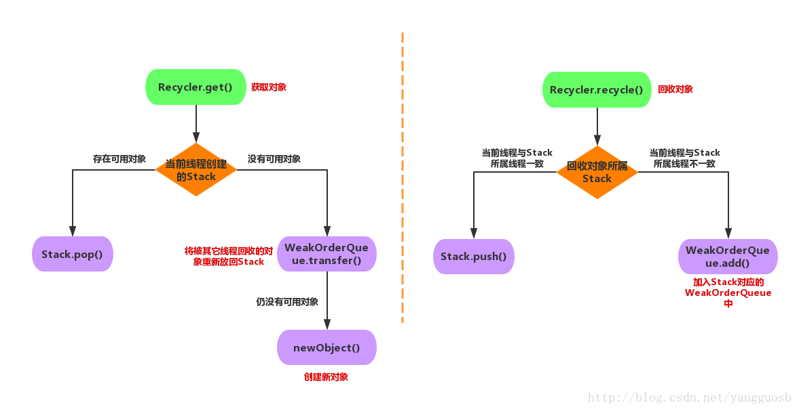

# Recycler

[重要-netty源码分析4 - Recycler对象池的设计](https://www.jianshu.com/p/854b855bd198)

[Netty之Recycler](https://www.jianshu.com/p/4eab8450560c)

[冷知识：netty的Recycler对象池](https://blog.csdn.net/alex_xfboy/article/details/90384332)



```java
public abstract class Recycler<T> {

//线程本地变量，每个线程持有一个stack，stack就是用来存储对象池的容器
private final FastThreadLocal<Stack<T>> threadLocal = new FastThreadLocal<Stack<T>>() {
        @Override
        protected Stack<T> initialValue() {
            return new Stack<T>(Recycler.this, Thread.currentThread(), maxCapacityPerThread, maxSharedCapacityFactor,
                                ratioMask, maxDelayedQueuesPerThread);
        }
};

//线程本地变量，<Map<Stack<?>, WeakOrderQueue>>，每个线程持有其他线程的WeakOrderQueue
private static final FastThreadLocal<Map<Stack<?>, WeakOrderQueue>> DELAYED_RECYCLED =
    new FastThreadLocal<Map<Stack<?>, WeakOrderQueue>>() {
    @Override
    protected Map<Stack<?>, WeakOrderQueue> initialValue() {
        return new WeakHashMap<Stack<?>, WeakOrderQueue>();
    }
};
    
}
```

## 回收对象

```kotlin
//Recycler.recycle(T, Handle)
public final boolean recycle(T o, Handle handle) {
    if (handle == NOOP_HANDLE) {
        return false;
    }

    DefaultHandle h = (DefaultHandle) handle;
    if (h.stack.parent != this) {
        return false;
    }
    if (o != h.value) {
        throw new IllegalArgumentException("o does not belong to handle");
    }
    h.recycle();
    return true;
}

//DefaultHandle.recycle()
public void recycle() {
    stack.push(this);
}

//Stack.push(DefaultHandle item)
void push(DefaultHandle item) {
    Thread currentThread = Thread.currentThread();
    if (thread == currentThread) {
        //如果该stack就是本线程的stack，那么直接把DefaultHandle放到该stack的数组里
        pushNow(item);
    } else {
        //如果该stack不是本线程的stack，那么把该DefaultHandle放到该stack的WeakOrderQueue中
        pushLater(item, currentThread);
    }
}
```

### 同线程回收对象

```java
//直接把DefaultHandle放到stack的数组里，如果数组满了那么扩展该数组为当前2倍大小
private void pushNow(DefaultHandle item) {
    if ((item.recycleId | item.lastRecycledId) != 0) {
        throw new IllegalStateException("recycled already");
    }
    item.recycleId = item.lastRecycledId = OWN_THREAD_ID;

    int size = this.size;
    if (size >= maxCapacity || dropHandle(item)) {
        // 最大容量限制，回收策略
        return;
    }
    if (size == elements.length) {
        //两倍扩容
        elements = Arrays.copyOf(elements, min(size << 1, maxCapacity));
    }
	
    elements[size] = item;
    this.size = size + 1;
}

//两个drop的时机
//1、pushNow：当前线程将数据push到Stack中
//2、transfer：将其他线程的WeakOrderQueue中的数据转移到当前的Stack中
private boolean dropHandle(DefaultHandle<T> item) {
    if (!item.hasBeenRecycled) {
        // 每8个对象：扔掉7个，回收一个
        // 回收的索引：handleRecycleCount - 0/8/16/24/32/...
        if ((++handleRecycleCount & ratioMask) != 0) {
            return true;
        }
        // 设置已经被回收了的标志，实际上此处还没有被回收，在pushNow(DefaultHandle<T> item)接下来的逻辑就会进行回收
        // 对于pushNow(DefaultHandle<T> item)：该值仅仅用于控制是否执行 (++handleRecycleCount & ratioMask) != 0 这段逻辑，而不会用于阻止重复回收的操作，重复回收的操作由item.recycleId | item.lastRecycledId来阻止
        item.hasBeenRecycled = true;
    }
    return false;
}
```

### 异线程回收对象

```java
private void pushLater(DefaultHandle item, Thread thread) {
    //Recycler有1个stack->WeakOrderQueue映射，每个stack会映射到1个WeakOrderQueue，这个WeakOrderQueue是该stack关联的其它线程WeakOrderQueue链表的head WeakOrderQueue。
    //当其它线程回收对象到该stack时会创建1个WeakOrderQueue中并加到stack的WeakOrderQueue链表中。 
    Map<Stack<?>, WeakOrderQueue> delayedRecycled = DELAYED_RECYCLED.get();
    WeakOrderQueue queue = delayedRecycled.get(this);
    if (queue == null) {
        //如果delayedRecycled满了那么将1个伪造的WeakOrderQueue（DUMMY）放到delayedRecycled中，并丢弃该对象（DefaultHandle）
        if (delayedRecycled.size() >= maxDelayedQueues) {
            // Add a dummy queue so we know we should drop the object
            delayedRecycled.put(this, WeakOrderQueue.DUMMY);
            return;
        }
        
        // 创建1个WeakOrderQueue
        if ((queue = WeakOrderQueue.allocate(this, thread)) == null) {
            // drop object
            return;
        }
        delayedRecycled.put(this, queue);
    } else if (queue == WeakOrderQueue.DUMMY) {
        // drop object
        return;
    }

    //将对象放入到该stack对应的WeakOrderQueue中
    queue.add(item);
}


static WeakOrderQueue allocate(Stack<?> stack, Thread thread) {
    // We allocated a Link so reserve the space
    //如果该stack的可用共享空间还能再容下1个WeakOrderQueue，那么创建1个WeakOrderQueue，否则返回null
    return reserveSpace(stack.availableSharedCapacity, LINK_CAPACITY)
        ? new WeakOrderQueue(stack, thread) : null;
}
```

WeakOrderQueue构造函数

```java
private WeakOrderQueue(Stack<?> stack, Thread thread) {
        head = tail = new Link();
        owner = new WeakReference<Thread>(thread);
        /**
         * 每次创建WeakOrderQueue时会更新WeakOrderQueue所属的stack的head为当前WeakOrderQueue， 当前WeakOrderQueue的next为stack的之前head，
         * 这样把该stack的WeakOrderQueue通过链表串起来了，当下次stack中没有可用对象需要从WeakOrderQueue中转移对象时从WeakOrderQueue链表的head进行scavenge转移到stack的对DefaultHandle数组。
         */
        synchronized (stack) {
            next = stack.head;
            stack.head = this;
        }
        availableSharedCapacity = stack.availableSharedCapacity;
    }
```

## 获取对象

取出该线程对应的stack，从stack中pop出1个DefaultHandle，返回该DefaultHandle的真正对象

```java
//Recycler.get()
public final T get() {
    if (maxCapacity == 0) {
        return newObject(NOOP_HANDLE);
    }
    Stack<T> stack = threadLocal.get();
    DefaultHandle handle = stack.pop();
    if (handle == null) {
        handle = stack.newHandle();
        handle.value = newObject(handle);
    }
    return (T) handle.value;
}

//stack.pop()
DefaultHandle pop() {
    int size = this.size;
    if (size == 0) {
        //如果该stack的DefaultHandle数组中还有对象可用，那么从该DefaultHandle数组中取出1个可用对象返回，如果该DefaultHandle数组没有可用的对象了，那么执行scavenge()方法
        if (!scavenge()) {
            return null;
        }
        size = this.size;
    }
    size --;
    DefaultHandle ret = elements[size];
    elements[size] = null;
    if (ret.lastRecycledId != ret.recycleId) {
        throw new IllegalStateException("recycled multiple times");
    }
    ret.recycleId = 0;
    ret.lastRecycledId = 0;
    this.size = size;
    return ret;
}
```

### 异线程获取对象

```java
boolean scavenge() {
    // continue an existing scavenge, if any
    if (scavengeSome()) {
        return true;
    }

    // reset our scavenge cursor
    prev = null;
    cursor = head;
    return false;
}

boolean scavengeSome() {
    WeakOrderQueue cursor = this.cursor;
    if (cursor == null) {
        cursor = head;
        if (cursor == null) {
            return false;
        }
    }

    boolean success = false;
    WeakOrderQueue prev = this.prev;
    do {
        
        //将当前WeakOrderQueue的head Link的DefaultHandle数组转移到stack的DefaultHandle数组中
        if (cursor.transfer(this)) {
            success = true;
            break;
        }

        WeakOrderQueue next = cursor.next;
        if (cursor.owner.get() == null) {
            if (cursor.hasFinalData()) {
                for (;;) {
                    if (cursor.transfer(this)) {
                        success = true;
                    } else {
                        break;
                    }
                }
            }
            if (prev != null) {
                prev.next = next;
            }
        } else {
            prev = cursor;
        }

        cursor = next;

    } while (cursor != null && !success);

    this.prev = prev;
    this.cursor = cursor;
    return success;
}
```

#### 异线程对象迁移

```java
boolean transfer(Stack<?> dst) {
        Link head = this.head;
        if (head == null) {
            return false;
        }

        //如果head Link容量已满，可以被迁移
        if (head.readIndex == LINK_CAPACITY) {
            if (head.next == null) {
                return false;
            }
            this.head = head = head.next;
        }

        final int srcStart = head.readIndex;
        /**
         * head Link的回收对象数组的最大位置
         */
        int srcEnd = head.get();
        /**
         * head Link可以scavenge的DefaultHandle的数量
         */
        final int srcSize = srcEnd - srcStart;
        if (srcSize == 0) {
            return false;
        }

        final int dstSize = dst.size;

        /**
         * 每次会尽可能scavenge整个head Link，如果head Link的DefaultHandle数组能全部迁移到stack中，stack的DefaultHandle数组预期容量
         */
        final int expectedCapacity = dstSize + srcSize;
        /**
         * 如果预期容量大于stack的DefaultHandle数组最大长度，说明本次无法将head Link的DefaultHandle数组全部迁移到stack中
         */
        if (expectedCapacity > dst.elements.length) {
            final int actualCapacity = dst.increaseCapacity(expectedCapacity);
            srcEnd = min(srcStart + actualCapacity - dstSize, srcEnd);
        }

        if (srcStart != srcEnd) {
            /**
             * head Link的DefaultHandle数组
             */
            final DefaultHandle[] srcElems = head.elements;
            /**
             * stack的DefaultHandle数组
             */
            final DefaultHandle[] dstElems = dst.elements;
            int newDstSize = dstSize;
            /**
             * 迁移head Link的DefaultHandle数组到stack的DefaultHandle数组
             */
            for (int i = srcStart; i < srcEnd; i++) {
                DefaultHandle element = srcElems[i];
                if (element.recycleId == 0) {
                    element.recycleId = element.lastRecycledId;
                } else if (element.recycleId != element.lastRecycledId) {
                    throw new IllegalStateException("recycled already");
                }
                srcElems[i] = null;

                if (dst.dropHandle(element)) {
                    // Drop the object.
                    continue;
                }
                element.stack = dst;
                dstElems[newDstSize ++] = element;
            }

            /**
             * 当head节点的对象全都转移给stack后，取head下一个节点作为head，下次转移的时候再从新的head转移回收的对象
             */
            if (srcEnd == LINK_CAPACITY && head.next != null) {
                // Add capacity back as the Link is GCed.
                reclaimSpace(LINK_CAPACITY);

                this.head = head.next;
            }
            /**
             * 迁移完成后更新原始head Link的readIndex
             */
            head.readIndex = srcEnd;
            if (dst.size == newDstSize) {
                return false;
            }
            dst.size = newDstSize;
            return true;
        } else {
            // The destination stack is full already.
            return false;
        }
    }
```

## FastThreadLocal

[Netty高性能组件——FastThreadLocal源码解析（细微处见真章）](https://www.cnblogs.com/jason1990/p/11707967.html)

```java
private final int index;

public FastThreadLocal() {
    index = InternalThreadLocalMap.nextVariableIndex();
}
```

每个FastThreadLocal中有一个index，这是一个递增的值，没创建一个FastThreadLocal就会原子的加一，可以看作每个FastThreadLocal的索引，通过这个index每个线程可以进行set和get，。

### FastThreadLocalThread

FastThreadLocalThread和继承于Thread，和普通的线程唯一的不同就在于持有一个InternalThreadLocalMap，而这个InternalThreadLocalMap也是懒加载的，在第一次获取线程本地变量时构造，

```java
public class FastThreadLocalThread extends Thread {

    private InternalThreadLocalMap threadLocalMap;
}
```

### InternalThreadLocalMap

```java
public final class InternalThreadLocalMap extends UnpaddedInternalThreadLocalMap {

    //获取FastThreadLocal的index，原子+1
    private static final int variablesToRemoveIndex =     InternalThreadLocalMap.nextVariableIndex();

    public static int nextVariableIndex() {
        int index = nextIndex.getAndIncrement();
        if (index < 0) {
            nextIndex.decrementAndGet();
            throw new IllegalStateException("too many thread-local indexed variables");
        }
        return index;
    }
}
```

InternalThreadLocalMap的父类

```java
class UnpaddedInternalThreadLocalMap {

    static final ThreadLocal<InternalThreadLocalMap> slowThreadLocalMap = new ThreadLocal<InternalThreadLocalMap>();
    static final AtomicInteger nextIndex = new AtomicInteger();
    
    //线程本地变量
    Object[] indexedVariables;
}
```
#### slowGet

如果只是普通的Thread，而不是FastThreadLocalThread，那么会使用ThreadLocal，这样从slowThreadLocalMap获取InternalThreadLocalMap还是需要进行线性探测，速度甚至比直接使用jdk的ThreadLocal更加慢。

```java
public static InternalThreadLocalMap get() {
    Thread thread = Thread.currentThread();
    if (thread instanceof FastThreadLocalThread) {
        return fastGet((FastThreadLocalThread) thread);
    } else {
        return slowGet();
    }
}

private static InternalThreadLocalMap slowGet() {
    ThreadLocal<InternalThreadLocalMap> slowThreadLocalMap = UnpaddedInternalThreadLocalMap.slowThreadLocalMap;
    InternalThreadLocalMap ret = slowThreadLocalMap.get();
    if (ret == null) {
        ret = new InternalThreadLocalMap();
        slowThreadLocalMap.set(ret);
    }
    return ret;
}
```
#### 扩容

因为InternalThreadLocalMap的hash其实就是数组下标，而这个数组的初始容量是32，当有新的本地线程变量时，如果容量不足，需要扩容。

某种意义上来说，这也是空间换时间，这也是和jdk的线程本地变量不一样的地方。

```java
public boolean setIndexedVariable(int index, Object value) {
    Object[] lookup = indexedVariables;
    if (index < lookup.length) {
        Object oldValue = lookup[index];
        lookup[index] = value;
        return oldValue == UNSET;
    } else {
        expandIndexedVariableTableAndSet(index, value);
        return true;
    }
}

private void expandIndexedVariableTableAndSet(int index, Object value) {
    Object[] oldArray = indexedVariables;
    final int oldCapacity = oldArray.length;
    int newCapacity = index;
    newCapacity |= newCapacity >>>  1;
    newCapacity |= newCapacity >>>  2;
    newCapacity |= newCapacity >>>  4;
    newCapacity |= newCapacity >>>  8;
    newCapacity |= newCapacity >>> 16;
    newCapacity ++;

    Object[] newArray = Arrays.copyOf(oldArray, newCapacity);
    Arrays.fill(newArray, oldCapacity, newArray.length, UNSET);
    newArray[index] = value;
    indexedVariables = newArray;
}
```

### set

```java
public final void set(V value) {
    if (value != InternalThreadLocalMap.UNSET) {
        set(InternalThreadLocalMap.get(), value);
    } else {
        remove();
    }
}

public final void set(InternalThreadLocalMap threadLocalMap, V value) {
    if (value != InternalThreadLocalMap.UNSET) {
        if (threadLocalMap.setIndexedVariable(index, value)) {
            addToVariablesToRemove(threadLocalMap, this);
        }
    } else {
        remove(threadLocalMap);
    }
}

public boolean setIndexedVariable(int index, Object value) {
    Object[] lookup = indexedVariables;
    if (index < lookup.length) {
        Object oldValue = lookup[index];
        lookup[index] = value;
        return oldValue == UNSET;
    } else {
        //容量不足，2倍扩容
        expandIndexedVariableTableAndSet(index, value);
        return true;
    }
}
```


### 总结

1.一个index代表一个FastThreadLocal，每个线程FastThreadLocalThread都持有长度为index的对象数组所以get和set的效率否非常快，不像jdk的ThreadLocal需要hash。

如果是普通线程，则每个线程对应InternalThreadLocalMap，里面包含一个indexVariables数组，数组小标对应fastThreadLocal的index（数组默认长度是32）和threadLocal一样 每个线程可以对应多个fastThreadLocal   如果是netty自己封装的FastThreadLocalThread，里面包含一个成员变量InternalThreadLocalMap threadLocalMap 直接从成员变量里面取

## Stack

线程本地变量，每个线程持有一个Stack，作为一个存储对象的容器，获取对象时，从Stack中pop弹出一个对象，如果为null则创建一个对象，对象使用完毕，就进行回收对象，将对象push压入Stack中。

当异线程进行回收时会使用WeakOrderQueue。

```java
static final class Stack<T> {
    final Recycler<T> parent;
    final Thread thread;
    final AtomicInteger availableSharedCapacity;
    final int maxDelayedQueues;

    private final int maxCapacity;
    private final int ratioMask;
    //Stack底层数据结构，真正的用来存储数据
    private DefaultHandle<?>[] elements;
    private int size;
    private int handleRecycleCount = -1; 
    private WeakOrderQueue cursor, prev;
    private volatile WeakOrderQueue head;
}
```

### WeakOrderQueue

​	WeakOrderQueue实现了多线程环境下回收对象的机制，当由其它线程回收对象到stack时会为该stack创建1个WeakOrderQueue，这些由其它线程创建的WeakOrderQueue会在该stack中按链表形式串联起来，每次创建1个WeakOrderQueue会把该WeakOrderQueue作为该stack的head WeakOrderQueue。

```java
private static final class WeakOrderQueue {

    static final WeakOrderQueue DUMMY = new WeakOrderQueue();

    // Let Link extend AtomicInteger for intrinsics. The Link itself will be used as writerIndex.
    @SuppressWarnings("serial")
    private static final class Link extends AtomicInteger {
        
        //默认长度16 可设置io.netty.recycler.linkCapacity
        private final DefaultHandle<?>[] elements = new DefaultHandle[LINK_CAPACITY];

        private int readIndex;
        private Link next;
    }

    // chain of data items
    private Link head, tail;
    // pointer to another queue of delayed items for the same stack
    private WeakOrderQueue next;
    private final WeakReference<Thread> owner;
    private final int id = ID_GENERATOR.getAndIncrement();
    private final AtomicInteger availableSharedCapacity;
}
```

个人看法：异步线程回收使用WeakOrderQueue是希望减少线程切换，否则需要启动原线程将对象回收到池中。