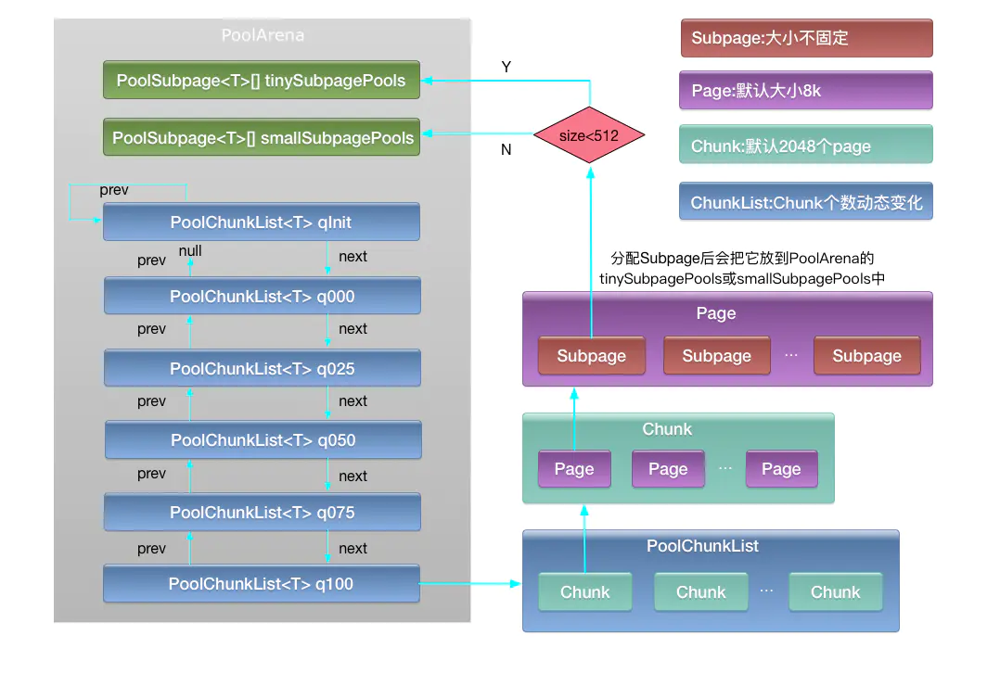
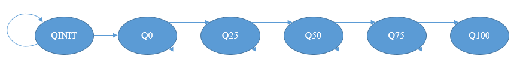

[Netty内存池实现](https://www.jianshu.com/p/8d894e42b6e6)

[自顶向下深入分析Netty（十）--JEMalloc分配算法](https://www.jianshu.com/p/15304cd63175)

[Netty 是怎么做内存管理--内存池](https://gsmtoday.github.io/2017/09/03/netty-memory-pool-md/)                      


# 分配内存

内存分配的最小单位为16B。

< 512B的请求为Tiny，< 8KB(PageSize)的请求为Small，<= 16MB(ChunkSize)的请求为Normal，> 16MB(ChunkSize)的请求为Huge。

< 512B的请求以16B为起点每次增加16B；>= 512B的请求则每次加倍。

请求内存大于chunkSize，直接调用allocateHuge分配，不在内存池中管理。

不在表格中的请求大小，将向上规范化到表格中的数据，比如：请求分配511B、512B、513B，将依次规范化为512B、512B、1KB。

[](https://gsmtoday.github.io/2017/09/03/netty-memory-pool-md/unit.png)

总结一下内存分配过程：

1. 对于Tiny/Small、Normal大小的请求，优先从线程缓存中分配。
2. 没有从缓存中得到分配的Tiny/Small请求，会从以第一次请求大小为基准进行分组的Subpage双向链表中进行分配；如果双向链表还没初始化，则会使用Normal请求分配Chunk块中的一个Page，Page以请求大小为基准进行切分并分配第一块内存，然后加入到双向链表中。
3. 没有从缓存中得到分配的Normal请求，则会使用伙伴算法分配满足要求的连续Page块。
4. 对于Huge请求，则直接使用Unpooled直接分配。

```java
private void allocate(PoolThreadCache cache, PooledByteBuf<T> buf, final int reqCapacity) {
    final int normCapacity = normalizeCapacity(reqCapacity); // 请求内存规整化
    if (isTinyOrSmall(normCapacity)) { // capacity < pageSize 页内分配
        int tableIdx;
        PoolSubpage<T>[] table;
        boolean tiny = isTiny(normCapacity);
        if (tiny) { // < 512
            if (cache.allocateTiny(this, buf, reqCapacity, normCapacity)) {
                // was able to allocate out of the cache so move on
                return;
            }
            tableIdx = tinyIdx(normCapacity);
            table = tinySubpagePools;
        } else {
            if (cache.allocateSmall(this, buf, reqCapacity, normCapacity)) {
                // was able to allocate out of the cache so move on
                return;
            }
            tableIdx = smallIdx(normCapacity);
            table = smallSubpagePools;
        }

        final PoolSubpage<T> head = table[tableIdx];
    
        synchronized (head) {
            final PoolSubpage<T> s = head.next;
            if (s != head) { //存在可分配的页面
                assert s.doNotDestroy && s.elemSize == normCapacity;
                long handle = s.allocate(); //调用PoolSubpage的分配
                assert handle >= 0;
                s.chunk.initBufWithSubpage(buf, handle, reqCapacity);
                incTinySmallAllocation(tiny);
                return;
            }
        }
        synchronized (this) { //在chunk中寻找新的subpage并分配
            allocateNormal(buf, reqCapacity, normCapacity);
        }
    
        incTinySmallAllocation(tiny);
        return;
    }
    if (normCapacity <= chunkSize) { //chunk内分配
        if (cache.allocateNormal(this, buf, reqCapacity, normCapacity)) {
            // was able to allocate out of the cache so move on
            return;
        }
        synchronized (this) {
            allocateNormal(buf, reqCapacity, normCapacity);
            ++allocationsNormal;
        }
    } else {
        // Huge allocations are never served via the cache so just call allocateHuge
        allocateHuge(buf, reqCapacity);
    }
}
```
# PoolThreadLocalCache

PoolThreadLocalCache是PooledByteBufAllocator的内部类

```java
final class PoolThreadLocalCache extends FastThreadLocal<PoolThreadCache> {
    private final boolean useCacheForAllThreads;

    PoolThreadLocalCache(boolean useCacheForAllThreads) {
        this.useCacheForAllThreads = useCacheForAllThreads;
    }


}
```
## 初始化PoolThreadCache

```java
@Override
protected synchronized PoolThreadCache initialValue() {
    final PoolArena<byte[]> heapArena = leastUsedArena(heapArenas);
    final PoolArena<ByteBuffer> directArena = leastUsedArena(directArenas);

    if (useCacheForAllThreads || Thread.currentThread() instanceof FastThreadLocalThread) {
        return new PoolThreadCache(
                heapArena, directArena, tinyCacheSize, smallCacheSize, normalCacheSize,
                DEFAULT_MAX_CACHED_BUFFER_CAPACITY, DEFAULT_CACHE_TRIM_INTERVAL);
    }
    // No caching for non FastThreadLocalThreads.
    return new PoolThreadCache(heapArena, directArena, 0, 0, 0, 0, 0);
}
```

# PoolThreadCache

```java
final class PoolThreadCache {

    private static final InternalLogger logger = InternalLoggerFactory.getInstance(PoolThreadCache.class);

    final PoolArena<byte[]> heapArena;
    final PoolArena<ByteBuffer> directArena;

    // 各类型的Cache数组
    private final MemoryRegionCache<byte[]>[] tinySubPageHeapCaches;
    private final MemoryRegionCache<byte[]>[] smallSubPageHeapCaches;
    private final MemoryRegionCache<byte[]>[] normalHeapCaches;
    private final MemoryRegionCache<ByteBuffer>[] tinySubPageDirectCaches;
    private final MemoryRegionCache<ByteBuffer>[] smallSubPageDirectCaches;
    private final MemoryRegionCache<ByteBuffer>[] normalDirectCaches;
    
    // 用于计算normal请求的数组索引 = log2(pageSize)
    private final int numShiftsNormalDirect;
    private final int numShiftsNormalHeap;
    
    private int allocations;    // 分配次数
    private final int freeSweepAllocationThreshold; // 分配次数到达该阈值则检测释放

    private final Thread deathWatchThread; // 线程结束观察者
    private final Runnable freeTask;

    private int allocations;
}
```
## 构造函数

```java
PoolThreadCache(PoolArena<byte[]> heapArena, PoolArena<ByteBuffer> directArena, int tinyCacheSize, int smallCacheSize, int normalCacheSize, int maxCachedBufferCapacity, int freeSweepAllocationThreshold) {
    if (maxCachedBufferCapacity < 0) {
        throw new IllegalArgumentException("maxCachedBufferCapacity: " + maxCachedBufferCapacity + " (expected: >= 0)");
    }

    // 初始化参数
    this.heapArena = heapArena;
    this.directArena = directArena;
    this.freeSweepAllocationThreshold = freeSweepAllocationThreshold;
    if (directArena != null) {
        // 初始化缓存数组
        tinySubPageDirectCaches = createSubPageCaches(tinyCacheSize, PoolArena.numTinySubpagePools, SizeClass.Tiny);
        smallSubPageDirectCaches = createSubPageCaches(smallCacheSize, directArena.numSmallSubpagePools, SizeClass.Small);
        numShiftsNormalDirect = log2(directArena.pageSize);
        normalDirectCaches = createNormalCaches(normalCacheSize, maxCachedBufferCapacity, directArena);
        // 每次将Arena分配给PoolThreadCache，numThreadCaches都会加一
        directArena.numThreadCaches.getAndIncrement();
    } else {
        tinySubPageDirectCaches = null;
        smallSubPageDirectCaches = null;
        normalDirectCaches = null;
        numShiftsNormalDirect = -1;
    }

    if (heapArena != null) {
        // 初始化缓存数组
        tinySubPageHeapCaches = createSubPageCaches(tinyCacheSize, PoolArena.numTinySubpagePools, SizeClass.Tiny);
        smallSubPageHeapCaches = createSubPageCaches(smallCacheSize, heapArena.numSmallSubpagePools, SizeClass.Small);
        numShiftsNormalHeap = log2(heapArena.pageSize);
        normalHeapCaches = createNormalCaches(normalCacheSize, maxCachedBufferCapacity, heapArena);
        // 每次将Arena分配给PoolThreadCache，numThreadCaches都会加一
        heapArena.numThreadCaches.getAndIncrement();
    } else {
        tinySubPageHeapCaches = null;
        smallSubPageHeapCaches = null;
        normalHeapCaches = null;
        numShiftsNormalHeap = -1;
    }

    if (tinySubPageDirectCaches != null || smallSubPageDirectCaches != null || normalDirectCaches != null || tinySubPageHeapCaches != null || smallSubPageHeapCaches != null || normalHeapCaches != null) {
        // Only check freeSweepAllocationThreshold when there are caches in use.
        if (freeSweepAllocationThreshold < 1) {
            throw new IllegalArgumentException("freeSweepAllocationThreshold: " + freeSweepAllocationThreshold + " (expected: > 0)");
        }

        freeTask = new Runnable() {
            @Override
            public void run() {
                free0();
            }
        };

        deathWatchThread = Thread.currentThread();

        // 观察线程每隔一个周期检测当前线程是否存活
        ThreadDeathWatcher.watch(deathWatchThread, freeTask);
    } else {
        freeTask = null;
        deathWatchThread = null;
    }
}
```


## MemoryRegionCache

这里，新引入一个数据类型`MemoryRegionCache`，其内部是一个`ByteBuf`队列。每个节点是一个`ByteBuf`的说法并不准确，切确的说，是不再使用的ByteBuf待释放的**内存空间**，可以再次使用这部分空间构建`ByteBuf`对象。根据分配请求大小的不同，`MemoryRegionCache`可以分为Tiny，Small，Normal三种。为了更方便的根据请求分配时的大小找到满足需求的缓存空间，每一种`MemoryRegionCache`又根据规范化后的大小依次组成数组，Tiny、Small、Normal的数组大小依次为32、4、12。

其中`ByteBuf`队列的长度是有限制的，Tiny、Small、Normal依次为512、256、64。为了更好的理解，举例子如下：

```css
16B  -- TinyCache[1]  -- (Buf512-...-Buf3-Buf2-Buf1)
32B  -- TinyCache[2]  -- ()
496B -- TinyCache[31] -- (Buf2-Buf1)
512B -- SmallCache[0] -- (Buf256-...-Buf3-Buf2-Buf1)
8KB  -- NormalCache[0] - (Buf64 -...-Buf3-Buf2-Buf1)
```

在线程缓存中，待回收的空间根据大小排列，比如，最大空间为16B的`ByteBuf`被缓存时，将被置于数组索引为1的`MemoryRegionCache`中，其中又由其中的队列存放该`ByteBuf`的空间信息，队列的最大长度为512。也就是说，16B的`ByteBuf`空间可以缓存512个，512B可以缓存256个，8KB可以缓存64个。

```java
    private final int size; // 队列长度
    private final Queue<Entry<T>> queue; // 队列
    private final SizeClass sizeClass; // Tiny/Small/Normal
    private int allocations; // 分配次数
```


## 回收

当一个`ByteBuf`不再使用，arena首先调用如下方法尝试缓存：

```java
    boolean add(PoolArena<?> area, PoolChunk chunk, long handle, 
                    int normCapacity, SizeClass sizeClass) {
        // 在缓存数组中找到符合的元素
        MemoryRegionCache<?> cache = cache(area, normCapacity, sizeClass);
        if (cache == null) {
            return false;
        }
        return cache.add(chunk, handle);
    }
    
    private MemoryRegionCache<?> cache(PoolArena<?> area, int normCapacity, SizeClass sizeClass) {
        switch (sizeClass) {
        case Normal:
            return cacheForNormal(area, normCapacity);
        case Small:
            return cacheForSmall(area, normCapacity);
        case Tiny:
            return cacheForTiny(area, normCapacity);
        default:
            throw new Error();
        }
    }
    
    private MemoryRegionCache<?> cacheForTiny(PoolArena<?> area, int normCapacity) {
        // normCapacity >>> 4, 即16B的索引为1
        int idx = PoolArena.tinyIdx(normCapacity);  
        if (area.isDirect()) {
            return cache(tinySubPageDirectCaches, idx);
        }
        return cache(tinySubPageHeapCaches, idx);
    }

	//MemoryRegionCache
    public final boolean add(PoolChunk<T> chunk, long handle) {
        Entry<T> entry = newEntry(chunk, handle);
        boolean queued = queue.offer(entry);
        if (!queued) {
            // 队列已满，不缓存，立即回收entry对象进行下一次分配
            entry.recycle();
        }

        return queued;
    }
    
    private static Entry newEntry(PoolChunk<?> chunk, long handle) {
        Entry entry = RECYCLER.get(); // 从池中取出entry对象
        entry.chunk = chunk;
        entry.handle = handle;
        return entry;
    }
```

## 分配

以Tiny请求分配为例

```java
    boolean allocateTiny(PoolArena<?> area, PooledByteBuf<?> buf, 
                            int reqCapacity, int normCapacity) {
        return allocate(cacheForTiny(area, normCapacity), buf, reqCapacity);
    }
    
    private boolean allocate(MemoryRegionCache<?> cache, PooledByteBuf buf, int reqCapacity) {
        if (cache == null) {
            return false;   // 缓存数组中没有
        }
        boolean allocated = cache.allocate(buf, reqCapacity); // 实际的分配
        // 分配次数达到整理阈值
        if (++ allocations >= freeSweepAllocationThreshold) {
            allocations = 0;
            trim(); // 整理
        }
        return allocated;
    }

	//MemoryRegionCache
    public final boolean allocate(PooledByteBuf<T> buf, int reqCapacity) {
        Entry<T> entry = queue.poll();  // 从队列头部取出
        if (entry == null) {
            return false;
        }
        // 在之前ByteBuf同样的内存位置分配一个新的`ByteBuf`对象
        initBuf(entry.chunk, entry.handle, buf, reqCapacity);
        entry.recycle(); // entry对象回收利用

        ++ allocations; // 该值是内部量，和上一方法不同
        return true;
    }
    
    protected void initBuf(PoolChunk<T> chunk, long handle, PooledByteBuf<T> buf, 
                int reqCapacity) {
        chunk.initBufWithSubpage(buf, handle, reqCapacity);
    }
```

## 释放

```java
    void free() {
        if (freeTask != null) {
            assert deathWatchThread != null;
            ThreadDeathWatcher.unwatch(deathWatchThread, freeTask);
        }
        free0();
    }
    
    private void free0() {
        int numFreed = free(tinySubPageDirectCaches) + ... +
                free(normalHeapCaches);

        if (directArena != null) {
            directArena.numThreadCaches.getAndDecrement();
        }

        if (heapArena != null) {
            heapArena.numThreadCaches.getAndDecrement();
        }
    }

	//MemoryRegionCache
    public final int free() {
        return free(Integer.MAX_VALUE);
    }

    private int free(int max) {
        int numFreed = 0;
        for (; numFreed < max; numFreed++) {
            Entry<T> entry = queue.poll();
            if (entry != null) {
                freeEntry(entry);
            } else {
                return numFreed; // 队列中所有节点都被释放
            }
        }
        return numFreed;
    }
    
    private  void freeEntry(Entry entry) {
        PoolChunk chunk = entry.chunk;
        long handle = entry.handle;

        entry.recycle(); // 回收entry对象
        chunk.arena.freeChunk(chunk, handle, sizeClass); // 释放实际的内存空间
    }
```

# PooledByteBuf

```java
abstract class PooledByteBuf<T> extends AbstractReferenceCountedByteBuf {

    private final Recycler.Handle<PooledByteBuf<T>> recyclerHandle;

    protected PoolChunk<T> chunk;
    protected long handle;
    protected T memory;
    protected int offset;
    protected int length;
    int maxLength;
    PoolThreadCache cache;
    private ByteBuffer tmpNioBuf;
    private ByteBufAllocator allocator;
}
```

首先介绍些netty内存池的层级结构，主要分为Arena、ChunkList、Chunk、Page、Subpage这5个层级，这几个层级的关系由大到小，如下图所示：




Arena代表1个内存区域，为了优化内存区域的并发访问，netty中内存池是由多个Arena组成的数组，分配时会每个线程按照轮询策略选择1个Arena进行内存分配。
1个Arena由两个PoolSubpage数组和多个ChunkList组成。两个PoolSubpage数组分别为tinySubpagePools和smallSubpagePools。

多个ChunkList按照双向链表排列，每个ChunkList里包含多个Chunk，每个Chunk里包含多个Page（默认2048个），每个Page（默认大小为8k字节）由多个Subpage组成。
 每个Arena由如下几个ChunkList构成：

- PoolChunkList<T> qInit：存储内存利用率0-25%的chunk
- PoolChunkList<T> q000：存储内存利用率1-50%的chunk
- PoolChunkList<T> q025：存储内存利用率25-75%的chunk
- PoolChunkList<T> q050：存储内存利用率50-100%的chunk
- PoolChunkList<T> q075：存储内存利用率75-100%的chunk
- PoolChunkList<T> q100：存储内存利用率100%的chunk

每个ChunkList里包含的Chunk数量会动态变化，比如当该chunk的内存利用率变化时会向其它ChunkList里移动。
 每个Chunk里默认包含2048个Page。
 每个Page包含的Subpage的大小和个数由首次从该Page分配的内存大小决定，1个page默认大小为8k，如果首次在该page中需要分配1k字节，那么该page就被分为8个Subpage，每个Subpage大小为1k。

## PooledDirectByteBuf

```java
final class PooledDirectByteBuf extends PooledByteBuf<ByteBuffer> {

    private static final Recycler<PooledDirectByteBuf> RECYCLER = new Recycler<PooledDirectByteBuf>() {
        @Override
        protected PooledDirectByteBuf newObject(Handle<PooledDirectByteBuf> handle) {
            return new PooledDirectByteBuf(handle, 0);
        }
    };

    static PooledDirectByteBuf newInstance(int maxCapacity) {
        PooledDirectByteBuf buf = RECYCLER.get();
        buf.reuse(maxCapacity);
        return buf;
    }
}
```

## PooledHeapByteBuf

```java
class PooledHeapByteBuf extends PooledByteBuf<byte[]> {

    private static final Recycler<PooledHeapByteBuf> RECYCLER = new Recycler<PooledHeapByteBuf>() {
        @Override
        protected PooledHeapByteBuf newObject(Handle<PooledHeapByteBuf> handle) {
            return new PooledHeapByteBuf(handle, 0);
        }
    };

    static PooledHeapByteBuf newInstance(int maxCapacity) {
        PooledHeapByteBuf buf = RECYCLER.get();
        buf.reuse(maxCapacity);
        return buf;
    }
}
```


# PoolArena

PooledArena是一块连续的内存块，为了优化并发性能在Netty内存池中存在一个由多个Arena组成的数组，在多个线程进行内存分配时会按照轮询策略选择一个Arena进行内存分配；

一个PoolArena内存块是由两个SubPagePools(用来存储零碎内存)和多个ChunkList组成。

两个SubpagePools数组分别为tinySubpagePools和smallSubpagePools。

每个ChunkList里包含多个Chunk按照双向链表排列，每个Chunk里包含多个Page（默认2048个），每个Page（默认大小为8k字节）由多个Subpage组成。每个ChunkList里包含的Chunk数量会动态变化，比如当该chunk的内存利用率变化时会向其它ChunkList里移动。


```java
abstract class PoolArena<T> implements PoolArenaMetric {
    static final boolean HAS_UNSAFE = PlatformDependent.hasUnsafe();

    enum SizeClass {
        Tiny,
        Small,
        Normal
    }

    static final int numTinySubpagePools = 512 >>> 4;

    final PooledByteBufAllocator parent;

    private final int maxOrder;
    final int pageSize;
    final int pageShifts;
    final int chunkSize;
    final int subpageOverflowMask;
    final int numSmallSubpagePools;
    final int directMemoryCacheAlignment;
    final int directMemoryCacheAlignmentMask;
    private final PoolSubpage<T>[] tinySubpagePools;
    private final PoolSubpage<T>[] smallSubpagePools;

    private final PoolChunkList<T> q050;
    private final PoolChunkList<T> q025;
    private final PoolChunkList<T> q000;
    private final PoolChunkList<T> qInit;
    private final PoolChunkList<T> q075;
    private final PoolChunkList<T> q100;

    private final List<PoolChunkListMetric> chunkListMetrics;

    // Metrics for allocations and deallocations
    private long allocationsNormal;
    // We need to use the LongCounter here as this is not guarded via synchronized block.
    private final LongCounter allocationsTiny = PlatformDependent.newLongCounter();
    private final LongCounter allocationsSmall = PlatformDependent.newLongCounter();
    private final LongCounter allocationsHuge = PlatformDependent.newLongCounter();
    private final LongCounter activeBytesHuge = PlatformDependent.newLongCounter();

    private long deallocationsTiny;
    private long deallocationsSmall;
    private long deallocationsNormal;

    // We need to use the LongCounter here as this is not guarded via synchronized block.
    private final LongCounter deallocationsHuge = PlatformDependent.newLongCounter();

    // 这个内存池持有的线程数量
    final AtomicInteger numThreadCaches = new AtomicInteger();
}
```

## 分配内存

内存分配的最小单位为16B。

< 512B的请求为Tiny，< 8KB(PageSize)的请求为Small，<= 16MB(ChunkSize)的请求为Normal，> 16MB(ChunkSize)的请求为Huge。

< 512B的请求以16B为起点每次增加16B；>= 512B的请求则每次加倍。

请求内存大于chunkSize，直接调用allocateHuge分配，不在内存池中管理。

不在表格中的请求大小，将向上规范化到表格中的数据，比如：请求分配511B、512B、513B，将依次规范化为512B、512B、1KB。


```java
private void allocate(PoolThreadCache cache, PooledByteBuf<T> buf, final int reqCapacity) {
    final int normCapacity = normalizeCapacity(reqCapacity); // 请求内存规整化
    if (isTinyOrSmall(normCapacity)) { // capacity < pageSize 页内分配
        int tableIdx;
        PoolSubpage<T>[] table;
        boolean tiny = isTiny(normCapacity);
        if (tiny) { // < 512
            if (cache.allocateTiny(this, buf, reqCapacity, normCapacity)) {
                // was able to allocate out of the cache so move on
                return;
            }
            tableIdx = tinyIdx(normCapacity);
            table = tinySubpagePools;
        } else {
            if (cache.allocateSmall(this, buf, reqCapacity, normCapacity)) {
                // was able to allocate out of the cache so move on
                return;
            }
            tableIdx = smallIdx(normCapacity);
            table = smallSubpagePools;
        }

        final PoolSubpage<T> head = table[tableIdx];

        synchronized (head) {
            final PoolSubpage<T> s = head.next;
            if (s != head) { //存在可分配的页面
                assert s.doNotDestroy && s.elemSize == normCapacity;
                long handle = s.allocate(); //调用PoolSubpage的分配
                assert handle >= 0;
                s.chunk.initBufWithSubpage(buf, handle, reqCapacity);
                incTinySmallAllocation(tiny);
                return;
            }
        }
        synchronized (this) { //在chunk中寻找新的subpage并分配
            allocateNormal(buf, reqCapacity, normCapacity);
        }

        incTinySmallAllocation(tiny);
        return;
    }
    if (normCapacity <= chunkSize) { //chunk内分配
        if (cache.allocateNormal(this, buf, reqCapacity, normCapacity)) {
            // was able to allocate out of the cache so move on
            return;
        }
        synchronized (this) {
            allocateNormal(buf, reqCapacity, normCapacity);
            ++allocationsNormal;
        }
    } else {
        // Huge allocations are never served via the cache so just call allocateHuge
        allocateHuge(buf, reqCapacity);
    }
}
```

# PoolChunkList

为了提高内存分配效率并减少内部碎片，jemalloc算法将Arena切分为小块Chunk，根据每块的内存使用率又将小块组合为以下几种状态：QINIT，Q0，Q25，Q50，Q75，Q100。Chunk块可以在这几种状态间随着内存使用率的变化进行转移



PoolArena根据内存使用率的情况把Chunk分成了6种类型：**qInit**,**q000**,**q025**,**q50**,**q075**,**q100**, 

他们所对应的chunk使用率如下表：

| Type  | Usage                   |
| :---- | :---------------------- |
| qInit | [Integer.MIN_VALUE, 25) |
| q000  | [1, 50)                 |
| q025  | [25, 75)                |
| q050  | [50,100)                |
| q075  | [75,100)                |
| q100  | [100,Integer.MAX_VALUE) |

这里有一点需要注意的就是，相邻的ChunkList之间在使用率上存在一定的重叠区域，即一个chunk的使用率为35的chunk可能存在于q000中，也可能存在于q025中。这主要是为了防止，由于使用率不断变化，导致某个chunk在两个List中不停来回跳动的情况，加了这么一段重叠的缓存区域，可以减少跳动的次数。详细可以参考[链接](http://www.jianshu.com/p/a1debfe4ff02)中的分析。

QINIT的内存使用率为[0,25)、Q0为(0,50)、Q100为[100,100]。

Chunk块的初始状态为QINIT，当使用率达到25时转移到Q0状态，再次达到50时转移到Q25，依次类推直到Q100；当内存释放时又从Q100转移到Q75，直到Q0状态且内存使用率为0时，该Chunk从Arena中删除。注意极端情况下，Chunk可能从QINIT转移到Q0再释放全部内存，然后从Arena中删除。

```java
private void allocateNormal(PooledByteBuf<T> buf, int reqCapacity, int normCapacity) {
    if (q050.allocate(buf, reqCapacity, normCapacity) 
        || q025.allocate(buf, reqCapacity, normCapacity) 
        || q000.allocate(buf, reqCapacity, normCapacity) 
        || qInit.allocate(buf, reqCapacity, normCapacity) 
        || q075.allocate(buf, reqCapacity, normCapacity)) {
        return;
    }

    // Add a new chunk.
    PoolChunk<T> c = newChunk(pageSize, maxOrder, pageShifts, chunkSize);
    long handle = c.allocate(normCapacity);
    assert handle > 0;
    c.initBuf(buf, handle, reqCapacity);
    qInit.add(c);
}
```

首先尝试在已经发生分配的ChunkList中，进行分配，如果有可用的chunk则直接返回，否则新建一个chunk，执行分配并初始化ByteBuf。新创建的Chunk将就被加入qInit链表中。
在qxxx中执行分配的过程比较简单，此处不再附上代码，其流程可以描述为：从ChunkList的链表头开始遍历，找到第一个可以分配的Chunk，并初始化ByteBuf，最后依据Chunk的使用率，判断是否需要将Chunk加入下一个ChunkList中。

对于Netty选择ChunkList时候的顺序，摘抄[文章](http://www.jianshu.com/p/a1debfe4ff02)中的下面一段分析：

> 分配内存时，为什么不从内存使用率较低的q000开始？在chunkList中，我们知道一个chunk随着内存的释放，会往当前chunklist的前一个节点移动。
> q000存在的目的是什么？
> q000是用来保存内存利用率在1%-50%的chunk，那么这里为什么不包括0%的chunk？
> 直接弄清楚这些，才好理解为什么不从q000开始分配。q000中的chunk，当内存利用率为0时，就从链表中删除，直接释放物理内存，避免越来越多的chunk导致内存被占满。
> 想象一个场景，当应用在实际运行过程中，碰到访问高峰，这时需要分配的内存是平时的好几倍，当然也需要创建好几倍的chunk，如果先从q0000开始，这些在高峰期创建的chunk被回收的概率会大大降低，延缓了内存的回收进度，造成内存使用的浪费。
> 那么为什么选择从q050开始？
> 1、q050保存的是内存利用率50%~100%的chunk，这应该是个折中的选择！这样大部分情况下，chunk的利用率都会保持在一个较高水平，提高整个应用的内存利用率；
> 2、qinit的chunk利用率低，但不会被回收；
> 3、q075和q100由于内存利用率太高，导致内存分配的成功率大大降低，因此放到最后；

# PoolChunk

```java
final class PoolChunk<T> implements PoolChunkMetric {

    private static final int INTEGER_SIZE_MINUS_ONE = Integer.SIZE - 1;

    final PoolArena<T> arena; // chunk所属的arena
    final T memory; // 实际的内存块
    final boolean unpooled; // 是否非池化
    final int offset; // ?
    
    PoolChunkList<T> parent; // poolChunkList专用
    PoolChunk<T> prev;
    PoolChunk<T> next;

    private final byte[] memoryMap; // 分配信息二叉树
    private final byte[] depthMap; // 高度信息二叉树
    private final PoolSubpage<T>[] subpages; // subpage节点数组
    private final int subpageOverflowMask;  // 判断分配请求为Tiny/Small即分配subpage
    private final int pageSize; // 页大小，默认8KB=8192
    private final int pageShifts; // 从1开始左移到页大小的位置，默认13，1<<13 = 8192
    private final int maxOrder; // 最大高度，默认11
    private final int chunkSize; // chunk块大小，默认16MB
    private final int log2ChunkSize; // log2(16MB) = 24
    private final int maxSubpageAllocs; // 可分配subpage的最大节点数即11层节点数，默认2048
    private final byte unusable; // 标记节点不可用，最大高度 + 1， 默认12
    private int freeBytes; // 可分配字节数

}
```


## page

虽然已将Arena切分为小块Chunk，但实际上Chunk是相当大的内存块，在jemalloc中建议为4MB，Netty默认使用16MB。为了进一步提高内存利用率并减少内部碎片，需要继续将Chunk切分为小的块Page。一个典型的切分将Chunk切分为2048块，Netty正是如此，可知Page的大小为：16MB/2048=8KB。一个好的内存分配算法，应使得已分配内存块尽可能保持连续，这将大大减少内部碎片，由此jemalloc使用伙伴分配算法尽可能提高连续性。伙伴分配算法的示意图如下：


伙伴分配算法

图中最底层表示一个被切分为2048个Page的Chunk块。自底向上，每一层节点作为上一层的子节点构造出一棵满二叉树，然后按层分配满足要求的内存块。以待分配序列8KB、16KB、8KB为例分析分配过程（每个Page大小8KB）：

1. 8KB--需要一个Page，第11层满足要求，故分配2048节点即Page0；
2. 16KB--需要两个Page，故需要在第10层进行分配，而1024的子节点2048已分配，从左到右找到满足要求的1025节点，故分配节点1025即Page2和Page3；
3. 8KB--需要一个Page，第11层满足要求，2048已分配，从左到右找到2049节点即Page1进行分配。

分配结束后，已分配连续的Page0-Page3，这样的连续内存块，**大大减少内部碎片并提高内存使用率**。

## 伙伴分配算法

初始状态时memoryMap和depthMap相等，可知一个id为512节点的初始值为9，即：

```java
memoryMap[512] = depthMap[512] = 9;
```

`depthMap`的值初始化后不再改变，`memoryMap`的值则随着节点分配而改变。当一个节点被分配以后，该节点的值设置为12（最大高度+1）表示不可用，并且会更新祖先节点的值。下图表示随着4号节点分配而更新祖先节点的过程，其中每个节点的第一个数字表示节点编号，第二个数字表示节点高度值。


分配过程如下：


1. 4号节点被完全分配，将高度值设置为12表示不可用。
2. 4号节点的父亲节点即2号节点，将高度值更新为两个子节点的较小值；其他祖先节点亦然，直到高度值更新至根节点。

可推知，`memoryMap`数组的值有如下三种情况：

1. memoryMap[id] = depthMap[id] -- 该节点没有被分配
2. memoryMap[id] > depthMap[id] -- 至少有一个子节点被分配，不能再分配该高度满足的内存，但可以根据实际分配较小一些的内存。比如，上图中分配了4号子节点的2号节点，值从1更新为2，表示该节点不能再分配8MB的只能最大分配4MB内存，因为分配了4号节点后只剩下5号节点可用。
3. mempryMap[id] = 最大高度 + 1（本例中12） -- 该节点及其子节点已被完全分配， 没有剩余空间。


# PoolSubpage

```java
final class PoolSubpage<T> implements PoolSubpageMetric {

    private final int memoryMapIdx; // 所属Page的标号
    private final int runOffset; // 在整个Chunk的偏移字节数
    private final int pageSize; // 页大小
    private final long[] bitmap; // 均等小块的分配信息

    boolean doNotDestroy; // 是否需要释放整个Page
    int elemSize; // 均等切分的大小
    private int maxNumElems; // 最多可以切分的小块数
    private int bitmapLength; // 位图信息的长度,long的个数
    private int nextAvail; // 下一个可分配的小块位置信息
    private int numAvail; // 可用的小块数
    
    final PoolChunk<T> chunk; // 所属的Chunk
    PoolSubpage<T> next; // arena双向链表的后继节点
    PoolSubpage<T> prev; // arena双向链表的前驱节点
}
```

Netty中每个Page的默认大小为8KB，在实际使用中，很多业务需要分配更小的内存块比如16B、32B、64B等。为了应对这种需求，需要进一步切分Page成更小的SubPage。SubPage是jemalloc中内存分配的最小单位，不能再进行切分。SubPage切分的单位并不固定，以第一次请求分配的大小为单位（最小切分单位为16B）。比如，第一次请求分配32B，则Page按照32B均等切分为256块；第一次请求16B，则Page按照16B均等切分为512块。为了便于内存分配和管理，根据SubPage的切分单位进行分组，每组使用双向链表组合，示意图如下：


而Subpage又是由PoolChunk中的一个Page依照第一次分配请求的大小均等切分而成。可推知，小于PageSize的分配请求执行过程如下：

1. 首次请求Arena分配，Arena中的双向链表为空，不能分配；传递给Chunk分配，Chunk找到一个空闲的Page，然后均等切分并加入到Arena链表中，最后分配满足要求的大小。
2. 之后请求分配同样大小的内存，则直接在Arena中的`PoolSubpage`双向链表进行分配；如果链表中的节点都没有空间分配，则重复1步骤。


## 位图算法

PoolSubPage在页内进行内存分配，用位图记录内存分配的情况，位图标记为0表示未分配，标记为1表示已分配。

可以发现，以默认的PageSize=8192byte为例，位图bitmap的大小被初始化为8:
```java
long bitmap[] = new long[pageSize >>> 10]
```

简单说明一下，在Page中subpage以16字节为最小单位划分内存段，而一个long类型的变量有64位，每一个位代表16字节，所以最多使用PageSize/16/64=8个long型的变量就可以表示所有内存段。

PoolSubPage分配内存段的过程就是在**位图中找到第一个未被使用的内存段**。

```java
private int findNextAvail() {
    final long[] bitmap = this.bitmap;
    final int bitmapLength = this.bitmapLength;
    for (int i = 0; i < bitmapLength; i ++) {
        long bits = bitmap[i];
        if (~bits != 0) {  //当前数组元素上有未分配的内存(marked as zero)
            return findNextAvail0(i, bits);
        }
    }
    return -1;
}

/**
  * i ：空闲内存在位图数组中的下标
  * bits : 数组元素表示的位图详情
  * return ：位图索引
  */
private int findNextAvail0(int i, long bits) {
    final int maxNumElems = this.maxNumElems;
    final int baseVal = i << 6; //高位用来记录分配的内存在位图数组中的下标位置

    for (int j = 0; j < 64; j ++) {
        if ((bits & 1) == 0) { //当前位置表示的内存未分配
            int val = baseVal | j; //低6位用来记录空闲内存在long型元素二进制表示中占据的位置
            if (val < maxNumElems) {
                return val;
            } else {
                break;
            }
        }
        bits >>>= 1; //右移，尝试下一位
    }
    return -1;
}
```