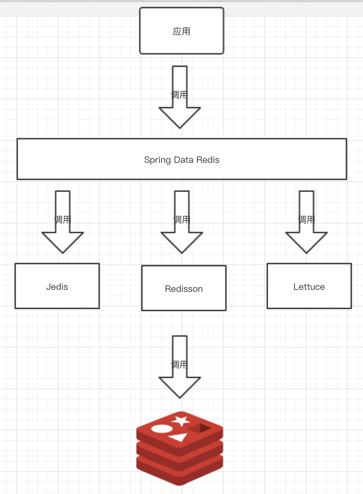
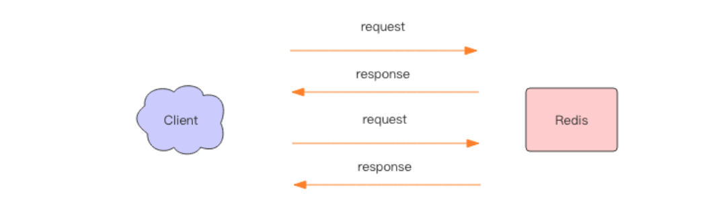
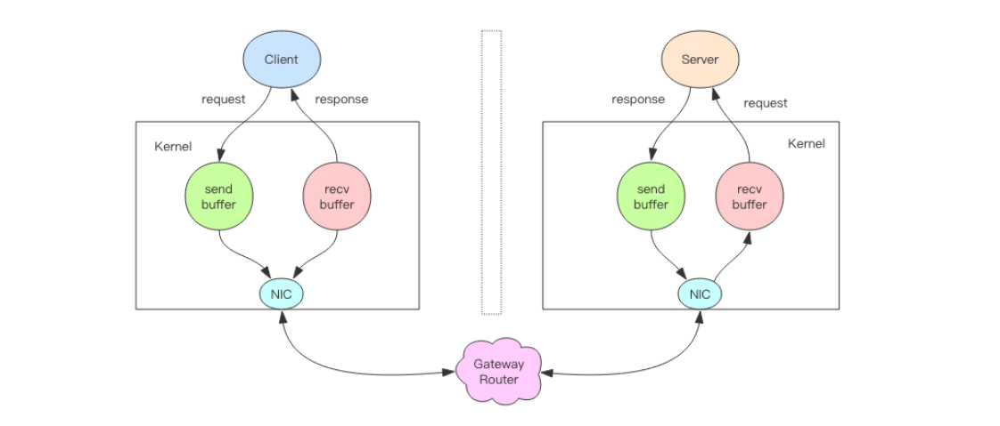

[芋道 Spring Boot Redis 入门](http://www.iocoder.cn/Spring-Boot/Redis/)

[Redis 深度历险： 核心原理与应用实践 | 钱文品 著](https://book.douban.com/subject/30386804/) 

[Spring Boot2.x 整合lettuce redis 和 redisson](https://blog.csdn.net/zl_momomo/article/details/82788294)

# 概述

在快速入门 Spring Boot 整合 Redis 之前，我们先来做个简单的了解。在 Spring 的生态中，我们使用 [Spring Data Redis](https://spring.io/projects/spring-data-redis) 来实现对 Redis 的数据访问。市面上已经有 Redis、Redisson、Lettuce 等优秀的 Java Redis 工具库，为什么还要有 Spring Data Redis 呢？学不动了，头都要秃了！不要慌，我们先来看一张图：

- 对于下层，Spring Data Redis 提供了统一的操作模板（后文中，我们会看到是 RedisTemplate 类），封装了 Jedis、Lettuce 的 API 操作，访问 Redis 数据。所以，**实际上，Spring Data Redis 内置真正访问的实际是 Jedis、Lettuce 等 API 操作**。
- 对于上层，开发者学习如何使用 Spring Data Redis 即可，而无需关心 Jedis、Lettuce 的 API 操作。甚至，未来如果我们想将 Redis 访问从 Jedis 迁移成 Lettuce 来，无需做任何的变动。😈 相信很多胖友，在选择 Java Redis 工具库，也是有过烦恼的。
- 目前，Spring Data Redis 暂时只支持 Jedis、Lettuce 的内部封装，而 Redisson 是由 [redisson-spring-data](https://github.com/redisson/redisson/tree/master/redisson-spring-data) 来提供。


# 批量操作-Pipeline

使用pipeline操作redis，进行get和set，能大大提高性能。

```java
`// <1> 基于 Session 执行 Pipeline@Overridepublic List<Object> executePipelined(SessionCallback<?> session) {	return executePipelined(session, valueSerializer);}@Overridepublic List<Object> executePipelined(SessionCallback<?> session, @Nullable RedisSerializer<?> resultSerializer) {    // ... 省略代码}// <2> 直接执行 Pipeline@Overridepublic List<Object> executePipelined(RedisCallback<?> action) {	return executePipelined(action, valueSerializer);}@Overridepublic List<Object> executePipelined(RedisCallback<?> action, @Nullable RedisSerializer<?> resultSerializer) {    // ... 省略代码}`
```


## 简单使用

```java
long stringRedisTemplatePipelineSetTest(int a,int b){
    String key="test.3.";
    int num=a*b;
    List<User> list=User.createUser(num);
    long startTime = System.currentTimeMillis();
    for(int i=0;i<a;i++){
        stringRedisTemplate.executePipelined(new RedisCallback<Object>() {
            @Override
            public Object doInRedis(RedisConnection connection) throws DataAccessException {
                for(int i=0;i<b;i++){
                    connection.set((key+i).getBytes(), JsonUtil.Object2Json(list.get(i)).getBytes());
                }
                return null;
            }
        });
    }
    long time=System.currentTimeMillis()-startTime;
    log.info("Pipeline操作{}次，每次批量set{}个数据，总共花费{}ms",a,b,time);
    return time;
}

long stringRedisTemplatePipelineGetTest(int a,int b) {
    String key="test.1.";
    long startTime = System.currentTimeMillis();
    for(int i=0;i<a;i++){
        List<String> list = (List<String>)(List)stringRedisTemplate.executePipelined(new RedisCallback<Object>() {
            @Override
            public Object doInRedis(RedisConnection connection) throws DataAccessException {
                for (int i = 0; i < b; i++) {
                    connection.get((key + i).getBytes());
                }
                return null;
            }
        });
        List<User> users = list.stream().map(new Function<String, User>() {
            @Override
            public User apply(String s) {
                return JsonUtil.Json2Object(s,User.class);
            }
        }).collect(Collectors.toList());
    }
    long time=System.currentTimeMillis()-startTime;
    log.info("Pipeline操作{}次，每次批量get{}个数据，总共花费{}ms",a,b,time);
    return time;
}
```

## 原理

实际上 Redis 管道(Pipeline) 本身并不是 Redis 服务器直接提供的技术，这个技术本质上是由客户端提供的，
跟服务器没有什么直接的关系。 

### Redis 的消息交互

当我们使用客户端对 Redis 进行一次操作时，如下图所示，客户端将请求传送给服务器，服务器处理完毕后，再将响应回复给客户端。这要花费一个网络数据包来回的时间。


如果连续执行多条指令，那就会花费多个网络数据包来回的时间。如下图所示。



回到客户端代码层面，客户端是经历了写-读-写-读四个操作才完整地执行了两条指令。


现在如果我们调整读写顺序，改成写—写-读-读，这两个指令同样可以正常完成。


两个连续的写操作和两个连续的读操作总共只会花费一次网络来回，就好比连续的 write操作合并了，连续的 read 操作也合并了一样。 


这便是管道操作的本质，服务器根本没有任何区别对待，还是收到一条消息，执行一条消息，回复一条消息的正常的流程。客户端通过对管道中的指令列表改变读写顺序就可以大幅节省 IO 时间。管道中指令越多，效果越好。 

### 管道压力测试

接下来我们实践一下管道的力量。
Redis 自带了一个压力测试工具 redis-benchmark，使用这个工具就可以进行管道测试。首先我们对一个普通的 set 指令进行压测， QPS 大约 5w/s。

> redis-benchmark -t set -q
> SET: 51975.05 requests per second

我们加入管道选项-P 参数，它表示单个管道内并行的请求数量，看下面 P=2， QPS 达到了 9w/s。

> redis-benchmark -t set -P 2 -q
> SET: 91240.88 requests per second

再看看 P=3， QPS 达到了 10w/s。
> SET: 102354.15 requests per second

但如果再继续提升 P 参数，发现 QPS 已经上不去了。这是为什么呢？

因为这里 CPU 处理能力已经达到了瓶颈， Redis 的单线程 CPU 已经飙到了 100%，所以无法再继续提升了。 

### 深入理解管道本质 



上图就是一个完整的请求交互流程图。我用文字来仔细描述一遍：
1、 客户端进程调用 write 将消息写到操作系统内核为套接字分配的发送缓冲 sendbuffer。
2、 客户端操作系统内核将发送缓冲的内容发送到网卡，网卡硬件将数据通过「网际路由」送到服务器的网卡。
3、 服务器操作系统内核将网卡的数据放到内核为套接字分配的接收缓冲 recv buffer。
4、 服务器进程调用 read 从接收缓冲中取出消息进行处理。
5、 服务器进程调用 write 将响应消息写到内核为套接字分配的发送缓冲 send buffer。
6、 服务器操作系统内核将发送缓冲的内容发送到网卡，网卡硬件将数据通过「网际路由」送到客户端的网卡。
7、 客户端操作系统内核将网卡的数据放到内核为套接字分配的接收缓冲 recv buffer。
8、 客户端进程调用 read 从接收缓冲中取出消息返回给上层业务逻辑进行处理。
9、 结束。 

其中步骤 5~8 和 1~4 是一样的，只不过方向是反过来的，一个是请求，一个是响应。

我们开始以为 write 操作是要等到对方收到消息才会返回，但实际上不是这样的。 write操作只负责将数据写到本地操作系统内核的发送缓冲然后就返回了。剩下的事交给操作系统内核异步将数据送到目标机器。但是如果发送缓冲满了，那么就需要等待缓冲空出空闲空间来，这个就是写操作 IO 操作的真正耗时。

我们开始以为 read 操作是从目标机器拉取数据，但实际上不是这样的。 read 操作只负责将数据从本地操作系统内核的接收缓冲中取出来就了事了。但是如果缓冲是空的，那么就需要等待数据到来，这个就是读操作 IO 操作的真正耗时。

所以对于 value = redis.get(key)这样一个简单的请求来说， write 操作几乎没有耗时，直接写到发送缓冲就返回，而 read 就会比较耗时了，因为它要等待消息经过网络路由到目标机器处理后的响应消息,再回送到当前的内核读缓冲才可以返回。这才是一个网络来回的真正开销。

而对于管道来说，连续的 write 操作根本就没有耗时，之后第一个 read 操作会等待一个网络的来回开销，然后所有的响应消息就都已经回送到内核的读缓冲了，后续的 read 操作直接就可以从缓冲拿到结果，瞬间就返回了。 

# 消息队列

## 简单队列

Redis 的 list(列表) 数据结构常用来作为异步消息队列使用，使用 rpush/lpush操作入队列，使用 lpop 和 rpop 来出队列。 

```java
@Test
public void queueTest(int num){
    ListOperations<String, String> listOperations = stringRedisTemplate.opsForList();
    String key="lcm:test:list";
    long startTime = System.currentTimeMillis();
    for(int i=0;i<num;i++){
        listOperations.rightPush(key,i+"");
    }
    long popStartTime = System.currentTimeMillis();
    for(int i=0;i<num;i++){
        listOperations.leftPop(key);
    }
    long popEndTime = System.currentTimeMillis();
    log.info("入队{}ms,出队{}ms",popStartTime-startTime,popEndTime-popStartTime);
}
```


## Pub/Sub

### 简单使用

#### 消费者

```java
@Slf4j
@Component
public class Topic1MessageListener implements MessageListener {

    @Override
    public void onMessage(Message message, byte[] pattern) {
        log.info("topic1消费：{}", JsonUtil.Json2Object(new String(message.getBody()), User.class));
    }

}

@Slf4j
@Component
public class Topic2MessageListener implements MessageListener {

    @Override
    public void onMessage(Message message, byte[] pattern) {
        log.info("topic2消费：{}", new String(message.getBody()));
    }

}
```


#### 配置

要注意，虽然 RedisConnectionFactory 可以多次调用 [`#addMessageListener(MessageListener listener, Topic topic)`](https://github.com/spring-projects/spring-data-redis/blob/master/src/main/java/org/springframework/data/redis/listener/RedisMessageListenerContainer.java#L375-L396) 方法，但是一定要都是相同的 Topic 类型。例如说，添加了 ChannelTopic 类型，就不能添加 PatternTopic 类型。为什么呢？因为 RedisMessageListenerContainer 是基于**一次** [SUBSCRIBE](http://redis.cn/commands/subscribe.html) 或 [PSUBSCRIBE](http://redis.cn/commands/psubscribe.html) 命令，所以不支持**不同类型**的 Topic 。当然，如果是**相同类型**的 Topic ，多个 MessageListener 是支持的。

```java
@Configuration
public class RedisMessageListenerConfig {

    @Autowired
    Topic1MessageListener topic1MessageListener;

    @Autowired
    Topic2MessageListener topic2MessageListener;

    @Bean
    public RedisMessageListenerContainer listenerContainer(RedisConnectionFactory factory) {
        // 创建 RedisMessageListenerContainer 对象
        RedisMessageListenerContainer container = new RedisMessageListenerContainer();

        // 设置 RedisConnection 工厂。它就是实现多种 Java Redis 客户端接入的秘密工厂。
        container.setConnectionFactory(factory);

        // 添加监听器
        container.addMessageListener(topic1MessageListener,new ChannelTopic(Procuder.TOPIC_1));
        container.addMessageListener(topic2MessageListener,new ChannelTopic(Procuder.TOPIC_2));

        return container;
    }


}
```


#### 生产者

```java
@Component
public class Procuder {

    public static final String TOPIC_1="topic:1";

    public static final String TOPIC_2="topic:2";

    @Autowired
    StringRedisTemplate stringRedisTemplate;

    public void sendTopic1(User user){
        stringRedisTemplate.convertAndSend(TOPIC_1, JsonUtil.Object2Json(user));
    }

    public void sendTopic2(String str){
        stringRedisTemplate.convertAndSend(TOPIC_2, str);
    }

}
```


# lua脚本

## 添加脚本

resources/lua/compareAndSet.lua

```lua
if redis.call('GET', KEYS[1]) ~= ARGV[1] then
    return 0
end
redis.call('SET', KEYS[1], ARGV[2])
return 1
```

## 测试

```java
@Slf4j
@SpringBootTest
public class ScriptTest {

    @Autowired
    private StringRedisTemplate stringRedisTemplate;

    @Test
    public void test() throws IOException {
        // 读取 /resources/lua/compareAndSet.lua 脚本 。
        String  scriptContents = IOUtils.toString(getClass().getResourceAsStream("/lua/compareAndSet.lua"), "UTF-8");
        // 创建 RedisScript 对象
        RedisScript<Long> script = new DefaultRedisScript<>(scriptContents, Long.class);
        // 执行 LUA 脚本
        Long result = stringRedisTemplate.execute(script, Collections.singletonList("test:lua"), "lcm", "123");
        log.info("CAS设置{}",result==1?"成功":"失败");
    }

}
```


# [redisson](https://github.com/YunaiV/SpringBoot-Labs/tree/master/lab-11-spring-data-redis/lab-07-spring-data-redis-with-redisson)

## 依赖

```xml
<dependency>
    <groupId>org.springframework.boot</groupId>
    <artifactId>spring-boot-starter-data-redis</artifactId>
</dependency>
```

## 配置文件

```yml
spring:
  profiles:
    active: lcm
  redis:
    host: 127.0.0.1
    port: 6379
    password:
    database:
    timeout: 0 # Redis 连接超时时间，单位：毫秒。
#    redisson:
#     config: classpath:redisson.yml # 具体的每个配置项，见 org.redisson.config.Config 类。
```

### redisson.yml
```yml
clusterServersConfig:
  # 连接空闲超时 如果当前连接池里的连接数量超过了最小空闲连接数，而同时有连接空闲时间超过了该数值，那么这些连接将会自动被关闭，并从连接池里去掉。时间单位是毫秒。
  idleConnectionTimeout: 10000
  pingTimeout: 1000
  # 连接超时
  connectTimeout: 10000
  # 命令等待超时
  timeout: 3000
  # 命令失败重试次数
  retryAttempts: 3
  # 命令重试发送时间间隔
  retryInterval: 1500
  # 重新连接时间间隔
  reconnectionTimeout: 3000
  # failedAttempts
  failedAttempts: 3
  # 密码
  password: null
  # 单个连接最大订阅数量
  subscriptionsPerConnection: 5
  # 客户端名称
  clientName: null
  #负载均衡算法类的选择  默认轮询调度算法RoundRobinLoadBalancer
  loadBalancer: !<org.redisson.connection.balancer.RoundRobinLoadBalancer> {}
  slaveSubscriptionConnectionMinimumIdleSize: 1
  slaveSubscriptionConnectionPoolSize: 50
  # 从节点最小空闲连接数
  slaveConnectionMinimumIdleSize: 32
  # 从节点连接池大小
  slaveConnectionPoolSize: 64
  # 主节点最小空闲连接数
  masterConnectionMinimumIdleSize: 32
  # 主节点连接池大小
  masterConnectionPoolSize: 64
  # 只在从服务节点里读取
  readMode: "SLAVE"
  # 主节点信息
  nodeAddresses:
  - "redis://192.168.56.128:7000"
  - "redis://192.168.56.128:7001"
  - "redis://192.168.56.128:7002"
  #集群扫描间隔时间 单位毫秒
  scanInterval: 1000
threads: 0
nettyThreads: 0
codec: !<org.redisson.codec.JsonJacksonCodec> {}
```


## 可重入分布式锁

```java
@Slf4j
@SpringBootTest
public class LockTest {

    public static final String DATE_PATTERN="yyyy-MM-dd HH:mm:ss";

    public static final ThreadLocal<SimpleDateFormat> DATE_FORMATE =ThreadLocal.withInitial(new Supplier<SimpleDateFormat>() {
        @Override
        public SimpleDateFormat get() {
            return new SimpleDateFormat(DATE_PATTERN);
        }
    });

    private static final String LOCK_KEY = "redission:lock";

    @Autowired
    private RedissonClient redissonClient;

    @Test
    public void test() throws InterruptedException {
        // 启动一个线程 A ，去占有锁
        new Thread(new Runnable() {
            @Override
            public void run() {
                // 加锁以后 10 秒钟自动解锁
                // 无需调用 unlock 方法手动解锁
                final RLock lock = redissonClient.getLock(LOCK_KEY);
                lock.lock(10, TimeUnit.SECONDS);
                log.info("{}:线程 A 获取锁成功，10s后释放锁",DATE_FORMATE.get().format(new Date()));
            }
        }).start();

        // 主线程 sleep 1 秒，保证线程 A 成功持有锁
        Thread.sleep(1000L);

        // 尝试加锁，最多等待 100 秒，上锁以后 10 秒自动解锁
        log.info("{}:主线程尝试获取锁",DATE_FORMATE.get().format(new Date()));
        final RLock lock = redissonClient.getLock(LOCK_KEY);
        boolean res = lock.tryLock(100, 10, TimeUnit.SECONDS);
        if (res) {
            log.info("{}:主线程获取锁成功",DATE_FORMATE.get().format(new Date()));
        } else {
            log.info("{}:主线程获取锁失败",DATE_FORMATE.get().format(new Date()));
        }
    }

}
```

执行结果：

2020-07-23 14:50:54:线程 A 获取锁成功，10s后释放锁
2020-07-23 14:50:55:主线程尝试获取锁
2020-07-23 14:51:04:主线程获取锁成功