# redis

[天下无难试之Redis面试刁难大全](https://baijiahao.baidu.com/s?id=1594341157941741587)

redis为什么这么快？

1、完全基于内存，绝大部分请求是纯粹的内存操作，非常快速。数据存在内存中，类似于HashMap，HashMap的优势就是查找和操作的时间复杂度都是O(1)；

2、数据结构简单，对数据操作也简单，Redis中的数据结构是专门进行设计的；

3、采用单线程，避免了不必要的上下文切换和竞争条件，也不存在多进程或者多线程导致的切换而消耗 CPU，不用去考虑各种锁的问题，不存在加锁释放锁操作，没有因为可能出现死锁而导致的性能消耗；

4、使用多路I/O复用模型，非阻塞IO；

5、使用底层模型不同，它们之间底层实现方式以及与客户端之间通信的应用协议不一样，Redis直接自己构建了VM 机制 ，因为一般的系统调用系统函数的话，会浪费一定的时间去移动和请求；

# 五种基础数据结构

string (字符串)、 list (列表)、 set (集合)、 hash (哈希) 和 zset (有序集合) 

list/set/hash/zset 这四种数据结构是容器型数据结构，它们共享下面两条通用规则：
**1、 create if not exists**
如果容器不存在，那就创建一个，再进行操作。比如 rpush 操作刚开始是没有列表的，Redis 就会自动创建一个，然后再 rpush 进去新元素。
**2、 drop if no elements**
如果容器里元素没有了，那么立即删除元素，释放内存。这意味着 lpop 操作到最后一个元素，列表就消失了。 

## String

Redis 的字符串是**动态字符串**，是可以修改的字符串，内部结构实现上类似于 Java 的**ArrayList**，采用预分配冗余空间的方式来减少内存的频繁分配，如图中所示，内部为当前字符串实际分配的空间 capacity 一般要高于实际字符串长度 len。

**当字符串长度小于 1M 时，扩容都是加倍现有的空间，如果超过 1M，扩容时一次只会多扩 1M 的空间。需要注意的是字符串最大长度为 512M。** 

**操作键值对**

```shell
> set name codehole
OK
> get name
"codehole"
> exists name
(integer) 1
> del name
(integer) 1
> get name
(nil)
```
**批量操作键值对**

可以批量对多个字符串进行读写，节省网络耗时开销。
```shell
> set name1 codehole
OK
> set name2 holycoder
OK
> mget name1 name2 name3 # 返回一个列表
1) "codehole"
2) "holycoder"
3) (nil)
> mset name1 boy name2 girl name3 unknown
> mget name1 name2 name3
1) "boy"
2) "girl"
3) "unknown" 
```

**过期和 set 命令扩展**

可以对 key 设置过期时间，到点自动删除，这个功能常用来控制缓存的失效时间。不过这个「自动删除」的机制是比较复杂的，如果你感兴趣，可以继续深入阅读此书第 26 节《朝生暮死——过期策略》

```shell
> set name codehole
> get name "codehole"
> expire name 5 # 5s 后过期
... # wait for 5s
> get name
(nil)
> setex name 5 codehole # 5s 后过期，等价于 set+expire
> get name
"codehole"
... # wait for 5s
> get name
(nil)
> setnx name codehole # 如果 name 不存在就执行 set 创建
(integer) 1
> get name
"codehole"
> setnx name holycoder
(integer) 0 # 因为 name 已经存在，所以 set 创建不成功
> get name
"codehole" #没有改变 
```

**计数**

如果 value 值是一个整数，还可以对它进行自增操作。自增是有范围的，它的范围是signed long 的最大最小值，超过了这个值， Redis 会报错。
```shell
> set age 30
OK
> incr age
(integer) 31
> incrby age 5
(integer) 36
> incrby age -5
(integer) 31
> set codehole 9223372036854775807 # Long.Max
OK
> incr codehole 
(error) ERR increment or decrement would overflow
```

## List

Redis 的列表相当于 Java 语言里面的 LinkedList，注意它是链表而不是数组。这意味着list 的插入和删除操作非常快，时间复杂度为 O(1)，但是索引定位很慢，时间复杂度为O(n)，这点让人非常意外。当列表弹出了最后一个元素之后，该数据结构自动被删除，内存被回收。

Redis 的列表结构常用来做异步队列使用。 将需要延后处理的任务结构体序列化成字符串塞进 Redis 的列表，另一个线程从这个列表中轮询数据进行处理。 

**右边进左边出：队列**

```shell
> rpush books python java golang
(integer) 3
> llen books
(integer) 3
> lpop books
"python"
> lpop books
"java"
> lpop books
"golang"
> lpop books
(nil)
```
**右边进右边出：栈**

```shell
> rpush books python java golang
(integer) 3
> rpop books
"golang"
> rpop books
"java"
> rpop books
"python"
> rpop books 
(nil)
```

**慢操作**

lindex 相当于 Java 链表的 get(int index)方法，它需要对链表进行遍历，性能随着参数index 增大而变差。 ltrim 和字面上的含义不太一样，个人觉得它叫 lretain(保留) 更合适一些，因为 ltrim 跟的两个参数 start_index 和end_index 定义了一个区间，在这个区间内的值，ltrim 要保留，区间之外统统砍掉。我们可以通过 ltrim 来实现一个定长的链表，这一点非常有用。 index 可以为负数， index=-1 表示倒数第一个元素，同样 index=-2 表示倒数第二个元素。
```shell
> rpush books python java golang
(integer) 3
> lindex books 1 # O(n) 慎用
"java"
> lrange books 0 -1 # 获取所有元素， O(n) 慎用
1) "python"
2) "java"
3) "golang"
> ltrim books 1 -1 # O(n) 慎用
OK
> lrange books 0 -1
1) "java"
2) "golang"
> ltrim books 1 0 # 这其实是清空了整个列表，因为区间范围长度为负
OK
> llen books
(integer) 0 
```

**快速列表**

如果再深入一点，你会发现 Redis 底层存储的还不是一个简单的 linkedlist，而是称之为快速链表 quicklist 的一个结构。首先在列表元素较少的情况下会使用一块连续的内存存储，这个结构是 ziplist，也即是压缩列表。它将所有的元素紧挨着一起存储，分配的是一块连续的内存。当数据量比较多的时候才会改成 quicklist。**因为普通的链表需要的附加指针空间太大，会比较浪费空间，而且会加重内存的碎片化。**比如32位机器，一个指针4个字节，比如这个列表里存的只是 int 类型的数据，结构上还需要两个额外的 指针 prev 和 next ，也就是8个字节，而int本身也只是4个字节，太浪费内存了。所以 Redis 将链表和 ziplist 结合起来组成了 quicklist。也就是将多个ziplist 使用双向指针串起来使用。这样既满足了快速的插入删除性能，又不会出现太大的空间冗余。 


**ziplist 存多少元素？**

quicklist 内部默认单个 ziplist 长度为 8KB，超出了这个字节数，就会新起一个ziplist。 ziplist 的长度由配置参数 list-max-ziplist-size 决定。 

- 取正值表示按照数据项个数来限定每个quicklist节点上的ziplist长度。例如，当该参数配置为5时，每个quicklist节点的ziplist最多包含5个数据项。
- 取负值表示按照占用字节数来限定每个quicklist节点上的ziplist长度。此时，该值只能取-1到-5这五个值，每个值含义如下。 
  - -5：每个quicklist节点上的ziplist大小不能超过64Kb（注：1kb = 1024 bytes）；
  - -4：每个quicklist节点上的ziplist大小不能超过32Kb；
  - -3：每个quicklist节点上的ziplist大小不能超过16Kb；
  - -2：每个quicklist节点上的ziplist大小不能超过8Kb（Redis默认值）；
  - -1：每个quicklist节点上的ziplist大小不能超过4 Kb。

### 压缩列表ziplist

​	Redis 为了**节约内存**空间使用， zset 和 hash 容器对象在元素个数较少的时候，采用压缩列表 (ziplist) 进行存储。压缩列表是一块连续的内存空间，元素之间紧挨着存储，没有任何冗余空隙。 **3.0之后list键已经不直接用ziplist和linkedlist作为底层实现了，取而代之的是quicklist。**

**previous_entry_length**：记录压缩列表中前一个节点的长度。previous_entry_length属性的长度可以是1字节或者5字节：如果前一节点的长度小于254 字节，那么previous_entry_length属性的长度为1字节，前一节点的长度就保存在这一个字节里面。如果前一节点的长度大于等于254字节，那么previous_entry_length属性的长度为5字节，其中属性的第一字节会被设置为0xFE（十进制值254），而之后的四个字节则用于保存前一节点的长度。因为节点的previous_entry_length属性记录了前一个节点的长度，所以程序可以通过指针运算，根据当前节点的起始地址来计算出前一个节点的起始地址，缩列表的从表尾向表头遍历操作就是使用这一原理实现的。
**encoding**：记录节点的contents属性所保存数据的类型以及长度。分两种情况：（1）一字节、两字节或者五字节长，值的最高位为00
、01或者10的是字节数组编码，这种编码表示节点的content属性保存着字节数组，数组的长度由编码除去最高两位之后的其他位记录；（2）一字节长，值的最高位以11开头的是整数编码，这种编码表示节点的content属性保存着整数值，整数值的类型和长度由编码除去最高两位之后的其他位记录。
**contents**：保存节点的值，可以是一个字节数组或整数，类型和长度由节点的'encoding'属性决定。

```c
struct ziplist<T> {
    int32 zlbytes; // 整个压缩列表占用字节数
    int32 zltail_offset; // 最后一个元素距离压缩列表起始位置的偏移量，用于快速定位到最后一个
    节点
    int16 zllength; // 元素个数
    T[] entries; // 元素内容列表，挨个挨个紧凑存储
    int8 zlend; // 标志压缩列表的结束，值恒为 0xFF
} 

struct entry {
    int<var> prevlen; // 前一个 entry 的字节长度
    int<var> encoding; // 元素类型编码
    optional byte[] content; // 元素内容
}
```


### 消息队列

​	我们平时习惯于使用 Rabbitmq 和 Kafka 作为消息队列中间件，来给应用程序之间增加异步消息传递功能。这两个中间件都是专业的消息队列中间件，特性之多超出了大多数人的理解能力。

​	使用过 Rabbitmq 的同学知道它使用起来有多复杂，发消息之前要创建 Exchange，再创建 Queue，还要将 Queue 和 Exchange 通过某种规则绑定起来，发消息的时候要指定 routingkey，还要控制头部信息。消费者在消费消息之前也要进行上面一系列的繁琐过程。但是绝大多数情况下，虽然我们的消息队列只有一组消费者，但还是需要经历上面这些繁琐的过程。

​	有了 Redis，它就可以让我们解脱出来，对于那些只有一组消费者的消息队列，使用 Redis就可以非常轻松的搞定。 Redis 的消息队列不是专业的消息队列，它没有非常多的高级特性，没有 ack 保证，如果对消息的可靠性有着极致的追求，那么它就不适合使用。 


## Hash

Redis 的字典相当于 Java 语言里面的 HashMap，它是无序字典。内部实现结构上同Java 的 HashMap 也是一致的，同样的数组 + 链表二维结构。第一维 hash 的数组位置碰撞时，就会将碰撞的元素使用链表串接起来。 

不同的是， Redis 的字典的值只能是字符串，另外它们 rehash 的方式不一样，因为Java 的 HashMap 在字典很大时， rehash 是个耗时的操作，需要一次性全部 rehash。 Redis为了高性能，不能堵塞服务，所以采用了渐进式 rehash 策略。 

渐进式 rehash 会在 rehash 的同时，保留新旧两个 hash 结构，查询时会同时查询两个hash 结构，然后在后续的**定时任务**中以及 hash 的子指令中，循序渐进地将旧 hash 的内容一点点迁移到新的 hash 结构中。 

当 hash 移除了最后一个元素之后，该数据结构自动被删除，内存被回收。hash 结构也可以用来存储用户信息，不同于字符串一次性需要全部序列化整个对象，hash 可以对用户结构中的每个字段单独存储。这样当我们需要获取用户信息时可以进行部分获取。而以整个字符串的形式去保存用户信息的话就只能一次性全部读取，这样就会比较浪费网络流量。
hash 也有缺点， hash 结构的存储消耗要高于单个字符串，到底该使用 hash 还是字符串，需要根据实际情况再三权衡。

```shell
> hset books java "think in java" # 命令行的字符串如果包含空格，要用引号括起来
(integer) 1
> hset books golang "concurrency in go"
(integer) 1
> hset books python "python cookbook"
(integer) 1
> hgetall books # entries()， key 和 value 间隔出现
1) "java"
2) "think in java"
3) "golang"
4) "concurrency in go"
5) "python"
6) "python cookbook"
> hlen books
(integer) 3
> hget books java
"think in java"
> hset books golang "learning go programming" # 因为是更新操作，所以返回 0
(integer) 0
> hget books golang "learning go programming"
> hmset books java "effective java" python "learning python" golang "modern golang
programming" # 批量 set
OK  
```
同字符串一样， hash 结构中的单个子 key 也可以进行计数，它对应的指令是 hincrby，和 incr 使用基本一样。
```shell
> hincrby user-laoqian age 1
(integer) 30 
```


### 渐进式rehash


​	不同的是， Redis 的字典的值只能是字符串，另外它们 rehash 的方式不一样，因为Java 的 HashMap 在字典很大时， rehash 是个耗时的操作，需要一次性全部 rehash。 Redis为了高性能，不能堵塞服务，所以采用了渐进式 rehash 策略。渐进式 rehash 会在 rehash 的同时，保留新旧两个 hash 结构，查询时会同时查询两个hash 结构，然后在后续的定时任务中以及 hash 的子指令中，循序渐进地将旧 hash 的内容一点点迁移到新的 hash 结构中。 当 hash 移除了最后一个元素之后，该数据结构自动被删除，内存被回收。 


## Set

Redis 的集合相当于 Java 语言里面的 HashSet，它内部的键值对是无序的唯一的。它的内部实现相当于一个特殊的字典，字典中所有的 value 都是一个值 NULL。当集合中最后一个元素移除之后，数据结构自动删除，内存被回收。 set 结构可以用来存储活动中奖的用户 ID，因为有去重功能，可以保证同一个用户不会中奖两次。
```shell
> sadd books python
(integer) 1
> sadd bookspython # 重复
(integer) 0
> sadd books java golang
(integer) 2
> smembers books # 注意顺序，和插入的并不一致，因为 set 是无序的
1) "java"
2) "python"
3) "golang"
> sismember books java # 查询某个 value 是否存在，相当于 contains(o)
(integer) 1
> sismember books rust
(integer) 0
> scard books # 获取长度相当于 count()
(integer) 3
> spop books # 弹出一个
"java" 
```


## Zset

​	zset 可能是 Redis 提供的最为特色的数据结构，它也是在面试中面试官最爱问的数据结构。特性接近于TreeMap，去重和有序，区别是实现的不同，TreeMap使用红黑树实现，而zset使用跳表，时间复杂度一样O(logn)，zset浪费O(n)空间。

​	它的内部实现用的是一种叫着「跳跃列表」的数据结构。zset 中最后一个 value 被移除后，数据结构自动删除，内存被回收。 zset 可以用来存粉丝列表， value 值是粉丝的用户 ID， score 是关注时间。我们可以对粉丝列表按关注时间进行排序。

​	zset 还可以用来存储学生的成绩， value 值是学生的 ID， score 是他的考试成绩。我们可以对成绩按分数进行排序就可以得到他的名次。 

```shell
> zadd books 9.0 "think in java"
(integer) 1
> zadd books 8.9 "java concurrency"
(integer) 1
> zadd books 8.6 "java cookbook"
(integer) 1
> zrange books 0 -1 # 按 score 排序列出，参数区间为排名范围 下标参数 start 和 stop 都以 0 为底，也就是说，以 0 表示有序集第一个成员，以 1 表示有序集第二个成员，以此类推。你也可以使用负数下标，以 -1 表示最后一个成员， -2 表示倒数第二个成员，以此类推。 
1) "java cookbook"
2) "java concurrency"
3) "think in java"
> zrevrange books 0 -1 # 按 score 逆序列出，参数区间为排名范围
1) "think in java"
2) "java concurrency"
3) "java cookbook"
> zcard books # 相当于 count()
(integer) 3
> zscore books "java concurrency" # 获取指定 value 的 score
"8.9000000000000004" # 内部 score 使用 double 类型进行存储，所以存在小数点精度问题
> zrank books "java concurrency" # 排名
(integer) 1
> zrangebyscore books 0 8.91 # 根据分值区间遍历 zset
1) "java cookbook"
2) "java concurrency"
> zrangebyscore books -inf 8.91 withscores # 根据分值区间 (-∞, 8.91] 遍历 zset，同时返回分值。 inf 代表 infinite，无穷大的意思。
1) "java cookbook"
2) "8.5999999999999996"
3) "java concurrency"
4) "8.9000000000000004"
> zrem books "java concurrency" # 删除 value
(integer) 1
> zrange books 0 -1
1) "java cookbook"
2) "think in java" 
```
### 跳跃列表

[redis用到的非常高效的数据结构--跳表](https://www.jianshu.com/p/84faf961ae80)

​	zset 内部的排序功能是通过「跳跃列表」数据结构来实现的，它的结构非常特殊，也比较复杂。因为 zset 要支持随机的插入和删除，所以它不好使用数组来表示。

时间复杂度O(logn)，空间复杂度O(n)

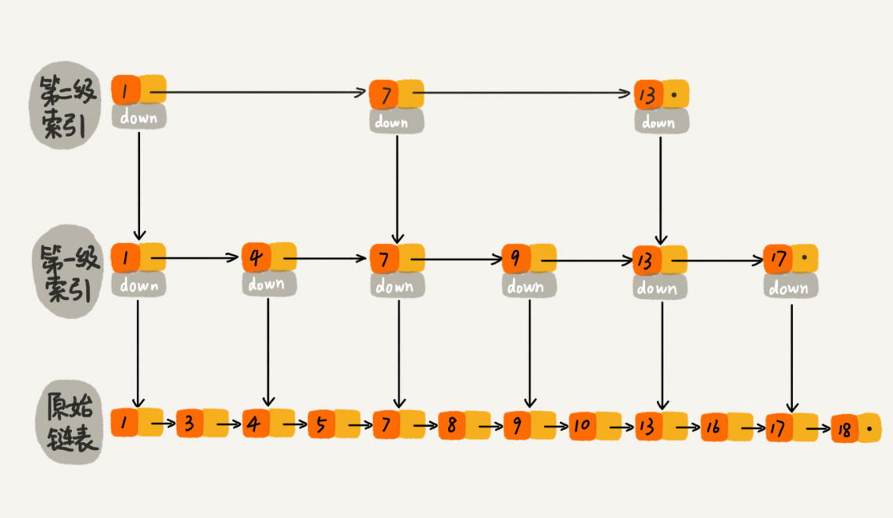


为什么使用跳表而不是红黑树？

1.二者时间复杂度一样，跳表空间复杂度高，跳表实现更加简单。

2.范围查找性能更高，红黑树范围查找必须走中序遍历，跳表找到第一个节点后就能顺着链表范围查找了。


# 特殊用法

## 前缀匹配

### keys

Redis 提供了一个简单暴力的指令 keys 用来列出所有满足特定正则字符串规则的 key。 

1、 没有 offset、 limit 参数，一次性吐出所有满足条件的 key，万一实例中有几百 w 个key 满足条件，当你看到满屏的字符串刷的没有尽头时，你就知道难受了。

2、 keys 算法是遍历算法，复杂度是 O(n)，如果实例中有千万级以上的 key，这个指令就会导致 Redis 服务卡顿，所有读写 Redis 的其它的指令都会被延后甚至会超时报错，因为Redis 是单线程程序，顺序执行所有指令，其它指令必须等到当前的 keys 指令执行完了才可以继续。 


### scan

Redis 为了解决这个问题，它在 2.8 版本中加入了大海捞针的指令——scan。 scan 相比keys 具备有以下特点:
1、 复杂度虽然也是 O(n)，但是它是通过游标**分步进行**的，不会阻塞线程;
2、 提供 limit 参数，可以控制每次返回结果的最大条数，limit 只是一个 **hint**，返回的结果可多可少;
3、 同 keys 一样，它也提供**模式匹配**功能;
4、 服务器不需要为游标保存状态，游标的唯一状态就是 scan 返回给客户端的游标整数;
5、 返回的结果可能会有重复，**需要客户端去重**，这点非常重要;
6、 遍历的过程中如果有数据修改，改动后的数据能不能遍历到是不确定的，类似于弱一致性;
7、 单次返回的结果是空的并不意味着遍历结束，而要看返回的游标值是否为零; 

#### 原理 

redis和HashMap一样，使用数组+链表实现，扩容时数组加倍。

scan 指令返回的游标就是第一维数组的位置索引，我们将这个位置索引称为槽 (slot)。如果不考虑字典的扩容缩容，直接按数组下标挨个遍历就行了。 limit 参数就表示需要遍历的槽位数，之所以返回的结果可能多可能少，是因为不是所有的槽位上都会挂接链表，有些槽位可能是空的，还有些槽位上挂接的链表上的元素可能会有多个。每一次遍历都会将 limit数量的槽位上挂接的所有链表元素进行模式匹配过滤后，一次性返回给客户端。 


# 线程io模型

**横轴是连接数，纵轴是QPS**

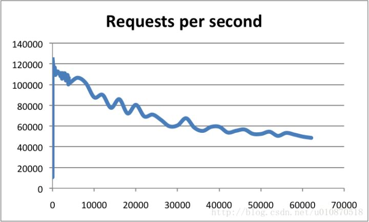

## 非阻塞io

​	当我们调用套接字的读写方法，默认它们是阻塞的，比如 read 方法要传递进去一个参数n，表示读取这么多字节后再返回，如果没有读够线程就会卡在那里，直到新的数据到来或者连接关闭了， read 方法才可以返回，线程才能继续处理。而 write 方法一般来说不会阻塞，除非内核为套接字分配的写缓冲区已经满了， write 方法就会阻塞，直到缓存区中有空闲空间挪出来了。

​	非阻塞 IO 在套接字对象上提供了一个选项 Non_Blocking，当这个选项打开时，读写方法不会阻塞，而是能读多少读多少，能写多少写多少。能读多少取决于内核为套接字分配的读缓冲区内部的数据字节数，能写多少取决于内核为套接字分配的写缓冲区的空闲空间字节数。读方法和写方法都会通过返回值来告知程序实际读写了多少字节。

​	有了非阻塞 IO 意味着线程在读写 IO 时可以不必再阻塞了，读写可以瞬间完成然后线程可以继续干别的事了。 

## 事件轮询 (多路复用)

[一文读懂I/O多路复用技术](https://blog.csdn.net/wangxindong11/article/details/78591308)

​	非阻塞 IO 有个问题，那就是线程要读数据，结果读了一部分就返回了，线程如何知道何时才应该继续读。也就是当数据到来时，线程如何得到通知。写也是一样，如果缓冲区满了，写不完，剩下的数据何时才应该继续写，线程也应该得到通知。

​	事件轮询 API 就是用来解决这个问题的，最简单的事件轮询 API 是 select 函数，它是操作系统提供给用户程序的 API。输入是读写描述符列表 read_fds & write_fds，输出是与之对应的可读可写事件。同时还提供了一个 timeout 参数，如果没有任何事件到来，那么就最多等待 timeout 时间，线程处于阻塞状态。一旦期间有任何事件到来，就可以立即返回。时间过了之后还是没有任何事件到来，也会立即返回。

拿到事件后，线程就可以继续挨个处理相应的事件。处理完了继续过来轮询。

于是线程就进入了一个死循环，我们把这个死循环称为事件循环，一个循环为一个周期。

每个客户端套接字 socket 都有对应的读写文件描述符。 

```c
read_events, write_events = select(read_fds, write_fds, timeout)
for event in read_events:
	handle_read(event.fd)
for event in write_events:
	handle_write(event.fd)
handle_others() # 处理其它事情，如定时任务等
```

因为通过 select 系统调用同时处理多个通道描述符的读写事件，因此将这类系统调用称为多路复用 API。现代操作系统的多路复用 API 已经不再使用 select 系统调用，而改为 epoll（linux）和 kqueue（FreeBSD 和 MaxOS），因为 select 系统调用的性能在描述符特别多的时候会变的非常差。使用起来可能在形式上略有差异，但是本质上都是差不多的，都可以使用上面的伪代码逻辑进行理解。

服务器套接字 serversocket 对象的读操作是指调用 accept 接受客户端新连接。何时有新连接到来，也是通过 select 系统调用的读事件来得到通知的。

事件轮询 API 就是 Java 语言里面的 NIO 技术。Java 的 NIO 并不是 Java 特有的技术，其他计算机语言都有这个技术，只不过换了一个词汇，不叫 NIO 而已。

## 队列指令

Redis 会将每个客户端套接字都关联一个指令队列。客户端的指令通过队列来排队进行顺序处理，先到先服务。

## 响应队列

Redis 同样也会为每个客户端套接字关联一个响应队列。Redis 服务器通过响应队列来将指令的返回结果回复给客户端。如果队列为空，那么意味着连接暂时处于空闲状态，不需要去获取写时间，也就是可以将当前的客户端描述符从 write_fds 里面移除来。等到队列有数据了，在将描述符放进去，避免 select 系统调用立即返回写事件，结果发现没有什么数据可以写，出现这种情况的线程会令 CPU 消耗飙升。

## 定时任务

服务器除了要响应 IO 事件外，还要处理其他事情。比如定时任务就是非常重要的一件事。如果线程阻塞在 select 系统调用上，定时任务将无法得到准确调度。那 Redis 是如何解决这个问题的呢？

Redis 的定时任务会记录一个被称为 “最小堆” 的数据结构中。在这个堆中，最快要执行的任务排在堆的最上方。在每个循环周期里，Redis 都会对最小堆里面已经到时间点的任务进行处理。处理完毕后，将最快要执行的任务还需要的时间记录下来，这个时间就是 select 系统调用的 timeout 参数。因为 Redis 知道未来 timeouut 的值的时间内，没有其他定时任务需要处理，所以可以安心睡眠 timeout 的值的时间。

Nginx 和 Node 的事件处理原理和 Redis 也是类似的。

# 持久化

[redis系列：RDB持久化与AOF持久化](<https://juejin.im/post/5b5fc1425188251aab7150d7>)

​	Redis 的持久化机制有两种，第一种是rbd快照，第二种是 AOF 日志。快照是一次全量备份， AOF 日志是连续的增量备份。

快照是内存数据的二进制序列化形式，在存储上非常紧凑。（.rdb）

AOF 日志记录的是内存数据修改的指令记录文本。

AOF 日志在长期的运行过程中会变的无比庞大，数据库重启时需要加载 AOF 日志进行指令重放，这个时间就会无比漫长。所以需要定期进行 AOF 重写，给 AOF 日志进行瘦身。 

RDB是一个非常紧凑（有压缩）的文件,它保存了某个时间点的数据,非常适用于数据的备份。

RDB作为一个非常紧凑（有压缩）的文件，可以很方便传送到另一个远端数据中心 ，非常适用于灾难恢复.

RDB在保存RDB文件时父进程唯一需要做的就是fork出一个子进程,接下来的工作全部由子进程来做，父进程不需要再做其他IO操作，所以RDB持久化方式可以最大化redis的性能.

与AOF相比,在恢复大的数据集的时候，RDB方式会更快一些.

## 快照持久化

​	我们知道 Redis 是单线程程序，这个线程要同时负责多个客户端套接字的并发读写操作和内存数据结构的逻辑读写。
​	在服务线上请求的同时， Redis 还需要进行内存快照，内存快照要求 Redis 必须进行文件 IO 操作，可文件 IO 操作是不能使用多路复用 API。
​	这意味着单线程同时在服务线上的请求还要进行文件 IO 操作，文件 IO 操作会严重拖垮服务器请求的性能。还有个重要的问题是为了不阻塞线上的业务，就需要边持久化边响应客户端请求。持久化的同时，内存数据结构还在改变，比如一个大型的 hash 字典正在持久化，结果一个请求过来把它给删掉了，还没持久化完呢，这尼玛要怎么搞？
​	那该怎么办呢？
​	Redis 使用**操作系统的多进程 COW(Copy On Write写时拷贝)** 机制来实现快照持久化，这个机制很有意思，也很少人知道。多进程 COW 也是鉴定程序员知识广度的一个重要指标。 

​	RDB持久化是指在客户端输入`save`、`bgsave`或者达到配置文件自动保存快照条件时，将Redis 在内存中的数据生成快照保存在名字为 dump.rdb（文件名可修改）的二进制文件中。

### 手动保存

#### save阻塞

save命令会阻塞Redis服务器进程，直到RDB文件创建完毕为止，在Redis服务器阻塞期间，服务器不能处理任何命令请求。 在客户端输入save

```shell
192.168.17.101:6379> save
OK
```

服务端会出现下方字符

```shell
1349:M 30 Jul 17:16:48.935 * DB saved on disk
```


#### bgsave子进程

bgsave命令的工作原理如下

1. 服务器进程pid为1349派生出一个pid为1357的子进程，
2. 子进程将数据写入到一个临时 RDB 文件中
3. 当子进程完成对新 RDB 文件的写入时，Redis 用新 RDB 文件替换原来的 RDB 文件，并删除旧的 RDB 文件。

在客户端输入bgsave

```
192.168.17.101:6379> bgsave
Background saving started
```

服务端会出现下方字符

```
1349:M 30 Jul 17:14:42.991 * Background saving started by pid 1357
1357:C 30 Jul 17:14:42.993 * DB saved on disk
1357:C 30 Jul 17:14:42.993 * RDB: 4 MB of memory used by copy-on-write
1349:M 30 Jul 17:14:43.066 * Background saving terminated with success
```

> **注**：bgsave命令执行期间 SAVE命令会被拒绝 不能同时执行两个BGSAVE命令 不能同时执行BGREWRITEAOF和BGSAVE命令

### 自动保存

这个需要在配置文件redis.conf中修改，默认的保存策略如下

```conf
save 900 1    # 900 秒内有至少有 1 个键被改动
save 300 10   # 300 秒内有至少有 10 个键被改动
save 60 10000 # 60 秒内有至少有 10000 个键被改动
```

接下来看看RBD的配置有哪些

**配置**

```
################################ SNAPSHOTTING  ################################
# 触发自动保存快照
# save <seconds> <changes>
# save <秒> <修改的次数>
save 900 1    
save 300 10   
save 60 10000 

# 设置在保存快照出错时，是否停止redis命令的写入
stop-writes-on-bgsave-error yes

# 是否在导出.rdb数据库文件的时候采用LZF压缩
rdbcompression yes

#  是否开启CRC64校验
rdbchecksum yes

# 导出数据库的文件名称
dbfilename dump.rdb

# 导出的数据库所在的目录
dir ./
```


### fork，写时拷贝

​	Redis 在持久化时会调用 glibc 的函数 fork 产生一个子进程，快照持久化完全交给子进程来处理，父进程继续处理客户端请求。**子进程刚刚产生时，它和父进程共享内存里面的代码段和数据段**。这时你可以将父子进程想像成一个连体婴儿，共享身体。这是 Linux 操作系统的机制，为了节约内存资源，所以尽可能让它们共享起来。在进程分离的一瞬间，内存的增长几乎没有明显变化。 

​	子进程做数据持久化，它不会修改现有的内存数据结构，它只是对数据结构进行遍历读取，然后序列化写到磁盘中。但是父进程不一样，它必须持续服务客户端请求，然后对内存数据结构进行不间断的修改。

​	**这个时候就会使用操作系统的 COW 机制来进行数据段页面的分离。数据段是由很多操作系统的页面组合而成，当父进程对其中一个页面的数据进行修改时，会将被共享的页面复制一份分离出来，然后对这个复制的页面进行修改。这时子进程相应的页面是没有变化的，还是进程产生时那一瞬间的数据。** 

​	随着父进程修改操作的持续进行，越来越多的共享页面被分离出来，内存就会持续增长。但是也不会超过原有数据内存的 2 倍大小。另外一个 Redis 实例里冷数据占的比例往往是比较高的，所以很少会出现所有的页面都会被分离，被分离的往往只有其中一部分页面。每个页面的大小只有 4K，一个 Redis 实例里面一般都会有成千上万的页面。子进程因为数据没有变化，它能看到的内存里的数据在进程产生的一瞬间就凝固了，再也不会改变，这也是为什么 Redis 的持久化叫「快照」的原因。接下来子进程就可以非常安心的遍历数据了进行序列化写磁盘了。 

**写时拷贝**

​	写入时复制（Copy-on-write，简称COW）是一种计算机程序设计领域的优化策略。其核心思想是，如果有多个调用者（callers）同时要求相同资源（如内存或磁盘上的数据存储），他们会共同获取相同的指针指向相同的资源，直到某个调用者试图修改资源的内容时，系统才会真正复制一份专用副本（private copy）给该调用者，而其他调用者所见到的最初的资源仍然保持不变。

[COW奶牛！Copy On Write机制了解一下](<https://juejin.im/post/5bd96bcaf265da396b72f855>)

Redis在持久化时，如果是采用BGSAVE命令或者BGREWRITEAOF的方式，那Redis会**fork出一个子进程来读取数据，从而写到磁盘中**。

总体来看，Redis还是读操作比较多。如果子进程存在期间，发生了大量的写操作，那可能就会出现**很多的分页错误(页异常中断page-fault)**，这样就得耗费不少性能在复制上。

而在**rehash阶段上，写操作是无法避免**的。所以Redis在fork出子进程之后，**将负载因子阈值提高**，尽量减少写操作，避免不必要的内存写入操作，最大限度地节约内存。


## AOF日志持久化

​	AOF 日志存储的是 Redis 服务器的顺序指令序列， AOF 日志只记录对内存进行修改的指令记录。

​	假设 AOF 日志记录了自 Redis 实例创建以来所有的修改性指令序列，那么就可以通过对一个空的 Redis 实例顺序执行所有的指令，也就是「重放」，来恢复 Redis 当前实例的内存数据结构的状态。

​	Redis 会在收到客户端修改指令后，先进行参数校验，如果没问题，就立即将该指令文本存储到 AOF 日志中，也就是先存到磁盘，然后再执行指令。这样即使遇到突发宕机，已经存储到 AOF 日志的指令进行重放一下就可以恢复到宕机前的状态。

​	Redis 在长期运行的过程中， AOF 的日志会越变越长。如果实例宕机重启，重放整个AOF 日志会非常耗时，导致长时间 Redis 无法对外提供服务。所以需要对 AOF 日志瘦身。 

### 开启AOF持久化

修改redis.conf配置文件，默认是appendonly no（关闭状态），将no改为yes即可

```
appendonly yes
```

在客户端输入如下命令也可，但是Redis服务器重启后会失效

```
192.168.17.101:6379> config set appendonly yes
OK
```

### 三步实现

AOF持久化功能的实现可以分为命令追加（append）、文件写入和文件同步（sync）三个步骤。下面就是三个步骤的整个过程。

在Redis客户端输入如下命令

```
192.168.17.101:6379> set learnRedis testAOF
OK
```

appendonly.aof文件会增加如下内容

```aof
*2
$6
SELECT
$1
0
*3
$3
set
$10
learnRedis
$7
testAOF
```

**1.命令追加**

AOF持久化功能开启时，服务器在执行完一个写命令之后，会以协议格式将被执行的写命令追加到服务器状态的aof_buf缓冲区的末尾。此时缓冲区的记录还没有写入到appendonly.aof文件中。

**2.文件的写入和同步**

文件写入：只是写入到了内存缓冲区，可能还没有写到文件所拥有的磁盘数据块上
文件同步：将缓冲区中的内容冲洗到磁盘上

**3.fsync同步**

​	AOF 日志是以文件的形式存在的，当程序对 AOF 日志文件进行写操作时，实际上是将内容写到了内核为文件描述符分配的一个内存缓存中，然后内核会异步将脏数据刷回到磁盘的。

​	这就意味着如果机器突然宕机， AOF 日志内容可能还没有来得及完全刷到磁盘中，这个时候就会出现日志丢失。那该怎么办？

​	Linux 的 glibc 提供了 fsync(int fd)函数可以将指定文件的内容强制从内核缓存刷到磁盘。只要 Redis 进程实时调用 fsync 函数就可以保证 aof 日志不丢失。但是 fsync 是一个磁盘 IO 操作，它很慢！如果 Redis 执行一条指令就要 fsync 一次，那么 Redis 高性能的地位就不保了。

​	所以在生产环境的服务器中， Redis 通常是每隔 1s 左右执行一次 fsync 操作，周期 1s是可以配置的。这是在数据安全性和性能之间做了一个折中，在保持高性能的同时，尽可能使得数据少丢失。

​	Redis 同样也提供了另外两种策略，一个是永不 fsync——让操作系统来决定合适同步磁盘，很不安全，另一个是来一个指令就 fsync 一次——非常慢。但是在生产环境基本不会使用，了解一下即可。 

| appendfsync选项的值 | 效果                                                       |
| ------------------- | ---------------------------------------------------------- |
| always              | 每次有新命令时，就将缓冲区数据写入并同步到 AOF 文件        |
| everysec（默认）    | 每秒将缓冲区的数据写入并同步到 AOF 文件                    |
| no                  | 将缓冲区数据写入AOF 文件，但是同步操作到交给操作系统来处理 |


### 重写瘦身

​	Redis 提供了 bgrewriteaof 指令用于对 AOF 日志进行瘦身。其原理就是开辟一个子进程对内存进行遍历转换成一系列 Redis 的操作指令，序列化到一个新的 AOF 日志文件中。序列化完毕后再将操作期间发生的增量 AOF 日志追加到这个新的 AOF 日志文件中，追加完毕后就立即替代旧的 AOF 日志文件了，瘦身工作就完成了。 

​	当前列表键list在数据库中的值就为["C", "D", "E", "F", "G"]。要使用尽量少的命令来记录list键的状态，最简单的方式不是去读取和分析现有AOF文件的内容，，而是直接读取list键在数据库中的当前值，然后用一条RPUSH list "C" "D" "E" "F" "G"代替前面的6条命令。


​	实际为了避免执行命令时造成客户端输入缓冲区溢出，重写程序在处理list hash set zset时，会检查键所包含的元素的个数，如果元素的数量超过了redis.h/REDIS_AOF_REWRITE_ITEMS_PER_CMD常量的值，那么重写程序会使用多条命令来记录键的值，而不是单使用一条命令。该常量默认值是64– 即每条命令设置的元素的个数 是最多64个，使用多条命令重写实现集合键中元素数量超过64个的键；

[Redis之AOF重写及其实现原理](https://blog.csdn.net/hezhiqiang1314/article/details/69396887)


## 运维

​	快照是通过开启子进程的方式进行的，它是一个比较耗资源的操作。
1、 遍历整个内存，大块写磁盘会加重系统负载
2、 AOF 的 fsync 是一个耗时的 IO 操作，它会降低 Redis 性能，同时也会增加系统 IO 负担

​	所以通常 Redis 的主节点是不会进行持久化操作，**持久化操作主要在从节点进行。从节点是备份节点，没有来自客户端请求的压力，它的操作系统资源往往比较充沛**。但是如果出现网络分区，从节点长期连不上主节点，就会出现数据不一致的问题，特别是在网络分区出现的情况下又不小心主节点宕机了，那么数据就会丢失，所以在生产环境要做好实时监控工作，保证网络畅通或者能快速修复。另外还应该再增加一个从节点以降低网络分区的概率，只要有一个从节点数据同步正常，数据也就不会轻易丢失。 

### 混合持久化

开启混合持久化 `aof-use-rdb-preamble yes` 

​	重启 Redis 时，我们很少使用 rdb 来恢复内存状态，因为会丢失大量数据。我们通常使用 AOF 日志重放，但是重放 AOF 日志性能相对 rdb 来说要慢很多，这样在 Redis 实例很大的情况下，启动需要花费很长的时间。

​	Redis 4.0 为了解决这个问题，带来了一个新的持久化选项——混合持久化。将 rdb 文件的内容和增量的 AOF 日志文件存在一起。这里的 AOF 日志不再是全量的日志，而是自持久化开始到持久化结束的这段时间发生的增量 AOF 日志，通常这部分 AOF 日志很小。 

​	于是在 Redis 重启的时候，可以先加载 rdb 的内容，然后再重放增量 AOF 日志就可以完全替代之前的 AOF 全量文件重放，重启效率因此大幅得到提升。 

- 如果你对`数据安全性非常重视`的话，你应该同时使用`两种持久化`功能
- 如果你承受`数分钟以内的数据丢失`，你可以只使用 `RDB 持久化`

# 分布式锁

[redis系列：分布式锁](https://juejin.im/post/5b737b9b518825613d3894f4)

​	分布式锁本质上要实现的目标就是在 Redis 里面占一个“茅坑”，当别的进程也要来占时，发现已经有人蹲在那里了，就只好放弃或者稍后再试。占坑一般是使用 setnx(set if not exists) 指令，只允许被一个客户端占坑。先来先占， 用完了，再调用 del 指令释放茅坑 

​	但是有个问题，如果逻辑执行到中间出现异常了，可能会导致 del 指令没有被调用，这样就会陷入死锁，锁永远得不到释放。于是我们在拿到锁之后，再给锁加上一个过期时间，比如 5s，这样即使中间出现异常也可以保证 5 秒之后锁会自动释放。 

​	但是以上逻辑还有问题。如果在 setnx 和 expire 之间服务器进程突然挂掉了，可能是因为机器掉电或者是被人为杀掉的，就会导致 expire 得不到执行，也会造成死锁。这种问题的根源就在于 setnx 和 expire 是两条指令而不是原子指令。如果这两条指令可以一起执行就不会出现问题。也许你会想到用 Redis 事务来解决。但是这里不行，因为 expire是依赖于 setnx 的执行结果的，如果 setnx 没抢到锁， expire 是不应该执行的。事务里没有 ifelse 分支逻辑，事务的特点是一口气执行，要么全部执行要么一个都不执行。为了解决这个疑难， Redis 开源社区涌现了一堆分布式锁的 library，专门用来解决这个问题。实现方法极为复杂，小白用户一般要费很大的精力才可以搞懂。如果你需要使用分布式锁，意味着你不能仅仅使用 Jedis 或者 redis-py 就行了，还得引入分布式锁的 library。 

​	为了治理这个乱象， Redis 2.8 版本中作者加入了 set 指令的扩展参数，使得 setnx 和expire 指令可以一起执行，彻底解决了分布式锁的乱象。从此以后所有的第三方分布式锁library 可以休息了。 
```shell
> set lock:codehole true ex 5 nx 
OK ... 
do something critical ... 
> del lock:codehole 
```
上面这个指令就是 setnx 和 expire 组合在一起的原子指令，它就是分布式锁的奥义所在。 

在spiring boot 2  可以直接使用 redisTemplate的
```java
Boolean setIfAbsent(K key, V value, long timeout, TimeUnit unit);
```
## 超时问题

​	Redis 的分布式锁不能解决超时问题，如果在加锁和释放锁之间的逻辑执行的太长，以至于超出了锁的超时限制，就会出现问题。因为这时候锁过期了，第二个线程重新持有了这把锁，但是紧接着第一个线程执行完了业务逻辑，就把锁给释放了，第三个线程就会在第二个线程逻辑执行完之间拿到了锁。

​	为了避免这个问题， Redis 分布式锁不要用于较长时间的任务。如果真的偶尔出现了，数据出现的小波错乱可能需要人工介入解决。 

1. 过期时间如何保证大于业务执行时间?

   增加一个定时任务，定时去续期。

2. 如何保证锁不会被误删除?

   value使用一个uuid，释放锁的时候先判断当前线程的uuid和redis中的uuid是否相同。

生产环境分布式锁还是使用**[redisson](https://github.com/redisson/redisson/wiki/Redisson%E9%A1%B9%E7%9B%AE%E4%BB%8B%E7%BB%8D)**，或者zookeeper会更好。


# 主从复制

​	主从复制是 Redis 分布式的基础， Redis 的高可用离开了主从复制将无从进行。后面的章节我们会开始讲解 Redis 的集群模式，这几种集群模式都依赖于本节所讲的主从复制。不过复制功能也不是必须的，如果你将 Redis 只用来做缓存，跟 memcache 一样来对待，也就无需要从库做备份，挂掉了重新启动一下就行。但是只要你使用了 Redis 的持久化功能，就必须认真对待主从复制，它是系统数据安全的基础保障。 

​	可以通过命令行或者修改配置文件将机器加入主从复制`slaveof`

## CAP 原理

​	CAP 原理就好比分布式领域的牛顿定律，它是分布式存储的理论基石。自打 CAP 的论文发表之后，分布式存储中间件犹如雨后春笋般一个一个涌现出来。理解这个原理其实很简单，本节我们首先对这个原理进行一些简单的讲解。
 C - Consistent ，一致性
 A - Availability ，可用性
 P - Partition tolerance ，分区容忍性 

Consistency (一致性)：

“all nodes see the same data at the same time”,即更新操作成功并返回客户端后，所有节点在同一时间的数据完全一致，这就是分布式的一致性。一致性的问题在并发系统中不可避免，对于客户端来说，一致性指的是并发访问时更新过的数据如何获取的问题。从服务端来看，则是更新如何复制分布到整个系统，以保证数据最终一致。

Availability (可用性):

可用性指“Reads and writes always succeed”，即服务一直可用，而且是正常响应时间。好的可用性主要是指系统能够很好的为用户服务，不出现用户操作失败或者访问超时等用户体验不好的情况。

Partition Tolerance (分区容错性):

即分布式系统在遇到某节点或网络分区故障的时候，仍然能够对外提供满足一致性或可用性的服务。

分区容错性要求能够使应用虽然是一个分布式系统，而看上去却好像是在一个可以运转正常的整体。比如现在的分布式系统中有某一个或者几个机器宕掉了，其他剩下的机器还能够正常运转满足系统需求，对于用户而言并没有什么体验上的影响。

​	分布式系统的节点往往都是分布在不同的机器上进行网络隔离开的，这意味着必然会有网络断开的风险，这个网络断开的场景的专业词汇叫着「**网络分区**」。在网络分区发生时，两个分布式节点之间无法进行通信，我们对一个节点进行的修改操作将无法同步到另外一个节点，所以数据的「一致性」将无法满足，因为两个分布式节点的
数据不再保持一致。除非我们牺牲「可用性」，也就是暂停分布式节点服务，在网络分区发生时，不再提供修改数据的功能，直到网络状况完全恢复正常再继续对外提供服务。 

一句话概括 CAP 原理就是——**网络分区发生时，一致性和可用性两难全**。 

**取舍策略**

CAP三个特性只能满足其中两个，那么取舍的策略就共有三种：

CA without P：如果不要求P（不允许分区），则C（强一致性）和A（可用性）是可以保证的。但放弃P的同时也就意味着放弃了系统的扩展性，也就是分布式节点受限，没办法部署子节点，这是违背分布式系统设计的初衷的。

CP without A：如果不要求A（可用），相当于每个请求都需要在服务器之间保持强一致，而P（分区）会导致同步时间无限延长(也就是等待数据同步完才能正常访问服务)，一旦发生网络故障或者消息丢失等情况，就要牺牲用户的体验，等待所有数据全部一致了之后再让用户访问系统。设计成CP的系统其实不少，最典型的就是分布式数据库，如Redis、HBase等。对于这些分布式数据库来说，数据的一致性是最基本的要求，因为如果连这个标准都达不到，那么直接采用关系型数据库就好，没必要再浪费资源来部署分布式数据库。

 AP wihtout C：要高可用并允许分区，则需放弃一致性。一旦分区发生，节点之间可能会失去联系，为了高可用，每个节点只能用本地数据提供服务，而这样会导致全局数据的不一致性。典型的应用就如某米的抢购手机场景，可能前几秒你浏览商品的时候页面提示是有库存的，当你选择完商品准备下单的时候，系统提示你下单失败，商品已售完。这其实就是先在 A（可用性）方面保证系统可以正常的服务，然后在数据的一致性方面做了些牺牲，虽然多少会影响一些用户体验，但也不至于造成用户购物流程的严重阻塞。

## 最终一致

​	Redis 的主从数据是异步同步的，所以分布式的 Redis 系统并不满足「一致性」要求。当客户端在 Redis 的主节点修改了数据后，立即返回，即使在主从网络断开的情况下，主节点依旧可以正常对外提供修改服务，所以 Redis 满足「可用性」。

​	Redis 保证「最终一致性」，从节点会努力追赶主节点，最终从节点的状态会和主节点的状态将保持一致。如果网络断开了，主从节点的数据将会出现大量不一致，一旦网络恢复，从节点会采用多种策略努力追赶上落后的数据，继续尽力保持和主节点一致。 

## 增量同步

​	Redis 同步的是指令流，主节点会将那些对自己的状态产生修改性影响的指令记录在本地的内存 buffer 中，然后**异步**将 buffer 中的指令同步到从节点，从节点一边执行同步的指令流来达到和主节点一样的状态，一遍向主节点反馈自己同步到哪里了 (偏移量)。因为内存的 buffer 是有限的，所以 Redis 主库不能将所有的指令都记录在内存 buffer中。 Redis 的复制内存 buffer 是一个定长的环形数组，如果数组内容满了，就会从头开始覆
盖前面的内容。 

​	如果因为网络状况不好，从节点在短时间内无法和主节点进行同步，那么当网络状况恢复时， Redis 的主节点中那些没有同步的指令在 buffer 中有可能已经被后续的指令覆盖掉了，从节点将无法直接通过指令流来进行同步，这个时候就需要用到更加复杂的同步机制 —— 快照同步。

## 快照同步

​	快照同步是一个非常耗费资源的操作，它首先需要在主库上进行一次 bgsave 将当前内存的数据全部快照到磁盘文件中，然后再将快照文件的内容全部传送到从节点。从节点将快照文件接受完毕后，立即执行一次全量加载，加载之前先要将当前内存的数据清空。加载完毕后通知主节点继续进行增量同步。在整个快照同步进行的过程中，主节点的复制 buffer 还在不停的往前移动，如果快照同步的时间过长或者复制 buffer 太小，都会导致同步期间的增量指令在复制 buffer 中被覆盖，这样就会导致快照同步完成后无法进行增量复制，然后会再次发起快照同步，如此极有可能会陷入**快照同步的死循环**。 

​	所以务必配置一个合适的复制 buffer 大小参数，避免快照复制的死循环。 

## 增加从节点

当从节点刚刚加入到集群时，它必须先要进行一次快照同步，同步完成后再继续进行增量同步。 

## 无盘复制

​	主节点在进行快照同步时，会进行很重的文件 IO 操作，特别是对于非 SSD 磁盘存储时，快照会对系统的负载产生较大影响。特别是当系统正在进行 AOF 的 fsync 操作时如果发生快照， fsync 将会被推迟执行，这就会严重影响主节点的服务效率。所以从 Redis 2.8.18 版开始支持无盘复制。所谓无盘复制是指主服务器直接通过套接字
将快照内容发送到从节点，而不使用磁盘作为中间存储，生成快照是一个遍历的过程，主节点会一边遍历内存，一遍将序列化的内容发送到从节点，从节点还是跟之前一样，先将接收到的内容存储到磁盘文件中，再进行一次性加载。 

# 集群

## Sentinel 哨兵

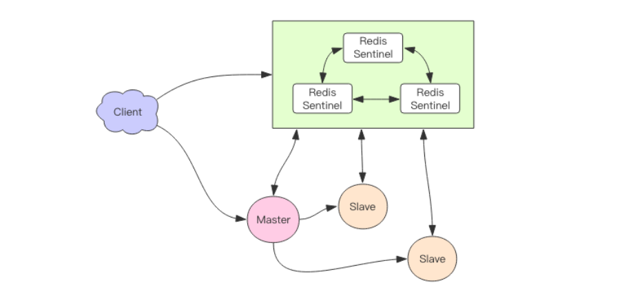

​	我们可以将 Redis Sentinel 集群看成是一个 ZooKeeper 集群，它是集群高可用的心脏，它一般是由 3～5 个节点组成，这样挂了个别节点集群还可以正常运转。它负责持续监控主从节点的健康，当主节点挂掉时，自动选择一个最优的从节点切换为主节点。客户端来连接集群时，会首先连接 sentinel，通过 sentinel 来查询主节点的地址，然后再去连接主节点进行数据交互。当主节点发生故障时，客户端会重新向 sentinel 要地址， sentinel 会将最新的主节点地址告诉客户端。如此应用程序将无需重启即可自动完成节点切换。比如上图的主节点挂掉后，集群将可能自动调整为下图所示结构。 

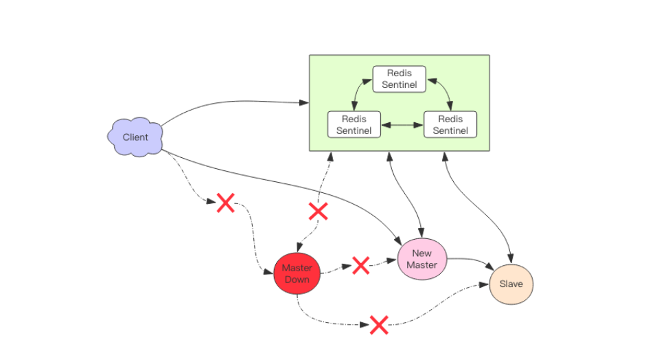

​	从这张图中我们能看到主节点挂掉了，原先的主从复制也断开了，客户端和损坏的主节点也断开了。从节点被提升为新的主节点，其它从节点开始和新的主节点建立复制关系。客户端通过新的主节点继续进行交互。 Sentinel 会持续监控已经挂掉了主节点，待它恢复后，集群会调整为下面这张图。 

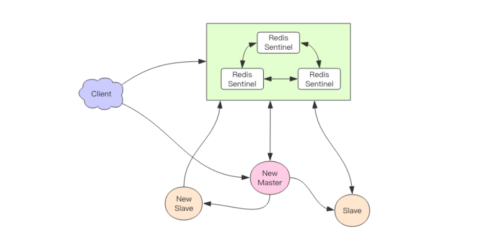

## redis集群方案

直接使用hash(key)%n的算法，在代码层面进行集群，如果集群一直没有变化，这是没问题的，但是当需要添加或者删除一个节点的时候，原来所有的缓存都将失效。

使用一致性hash，则只是一部分缓存会失效，而且如果使用虚拟节点，这些失效缓存还能够比较均匀的分配给节点，降低压力。

哈希槽cluster，是redis的集群方案，一共16384个哈希槽，为每个节点均匀分配hash槽，当需要添加或者删除节点，则需要对节点进行迁移。

### 一致性hash

[一致性hash算法释义](https://www.cnblogs.com/haippy/archive/2011/12/10/2282943.html)

一致性哈希算法（Consistent Hashing）最早在论文《[Consistent Hashing and Random Trees: Distributed Caching Protocols for Relieving Hot Spots on the World Wide Web](http://dl.acm.org/citation.cfm?id=258660)》中被提出。简单来说，一致性哈希将整个哈希值空间组织成一个虚拟的圆环，如假设某哈希函数H的值空间为0-2^32-1（即哈希值是一个32位无符号整形），整个哈希空间环如下：

 


 

　　整个空间按顺时针方向组织。0和232-1在零点中方向重合。

　　下一步将各个服务器使用Hash进行一个哈希，具体可以选择服务器的ip或主机名作为关键字进行哈希，这样每台机器就能确定其在哈希环上的位置，这里假设将上文中四台服务器使用ip地址哈希后在环空间的位置如下：

 

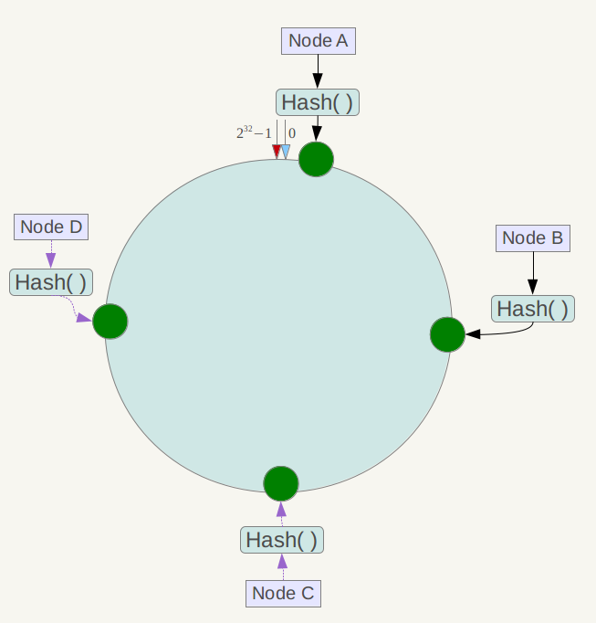

 

接下来使用如下算法定位数据访问到相应服务器：将数据key使用相同的函数Hash计算出哈希值，并确定此数据在环上的位置，从此位置沿环顺时针“行走”，第一台遇到的服务器就是其应该定位到的服务器。

　　例如我们有Object A、Object B、Object C、Object D四个数据对象，经过哈希计算后，在环空间上的位置如下：

 

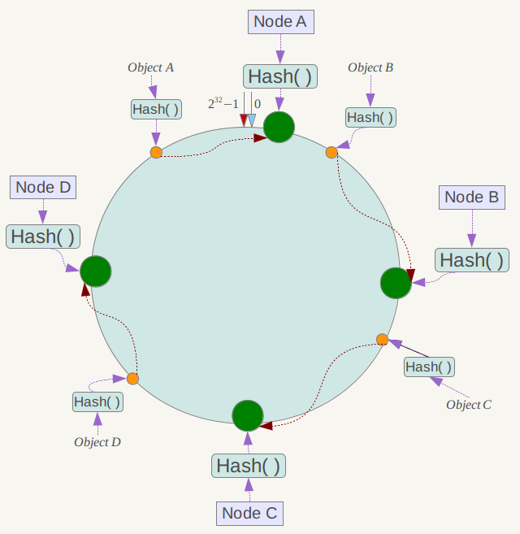

 

根据一致性哈希算法，数据A会被定为到Node A上，B被定为到Node B上，C被定为到Node C上，D被定为到Node D上。

#### 容错性和可扩展性

下面分析一致性哈希算法的容错性和可扩展性。现假设Node C不幸宕机，可以看到此时对象A、B、D不会受到影响，只有C对象被重定位到Node D。一般的，在一致性哈希算法中，如果一台服务器不可用，则受影响的数据仅仅是此服务器到其环空间中前一台服务器（即沿着逆时针方向行走遇到的第一台服务器）之间数据，其它不会受到影响。

下面考虑另外一种情况，如果在系统中增加一台服务器Node X，如下图所示：

 

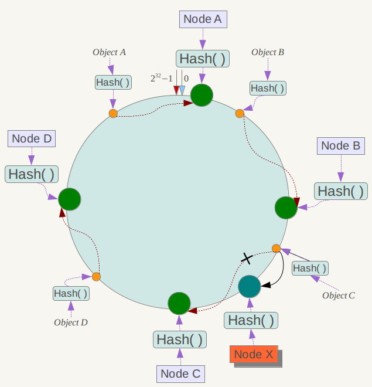

 

此时对象Object A、B、D不受影响，只有对象C需要重定位到新的Node X 。一般的，在一致性哈希算法中，如果增加一台服务器，则受影响的数据仅仅是新服务器到其环空间中前一台服务器（即沿着逆时针方向行走遇到的第一台服务器）之间数据，其它数据也不会受到影响。

综上所述，一致性哈希算法对于节点的增减都只需重定位环空间中的一小部分数据，具有较好的容错性和可扩展性。

#### 数据倾斜问题

另外，一致性哈希算法在服务节点太少时，容易因为节点分部不均匀而造成数据倾斜问题。例如系统中只有两台服务器，其环分布如下，

 

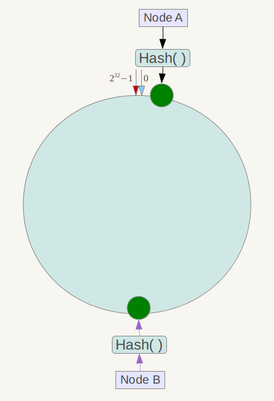

 

此时必然造成大量数据集中到Node A上，而只有极少量会定位到Node B上。为了解决这种数据倾斜问题，一致性哈希算法引入了虚拟节点机制，即对每一个服务节点计算多个哈希，每个计算结果位置都放置一个此服务节点，称为虚拟节点。具体做法可以在服务器ip或主机名的后面增加编号来实现。例如上面的情况，可以为每台服务器计算三个虚拟节点，于是可以分别计算 “Node A#1”、“Node A#2”、“Node A#3”、“Node B#1”、“Node B#2”、“Node B#3”的哈希值，于是形成六个虚拟节点：

 


 

同时数据定位算法不变，只是多了一步虚拟节点到实际节点的映射，例如定位到“Node A#1”、“Node A#2”、“Node A#3”三个虚拟节点的数据均定位到Node A上。这样就解决了服务节点少时数据倾斜的问题。在实际应用中，通常将虚拟节点数设置为32甚至更大，因此即使很少的服务节点也能做到相对均匀的数据分布。


### hash槽

[Redis Cluster原理初探](<https://mp.weixin.qq.com/s/zjwiOkRFvQDpKfeFL1-dUQ>)

[redis-trib.rb命令详解](https://www.cnblogs.com/ivictor/p/9768010.html)

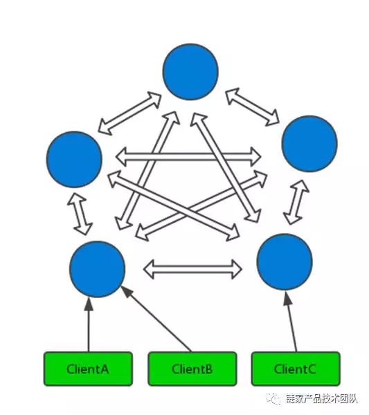

​	Redis 集群键分布算法使用**数据分片**（sharding）而**非一致性哈希**（consistency hashing）来实现： 一个 Redis 集群包含 16384 个哈希槽（hash slot）， 它们的编号为0、1、2、3……16382、16383，这个槽是一个逻辑意义上的槽，实际上并不存在。redis中的每个key都属于这16384 个哈希槽的其中一个，存取key时都要进行key->slot的映射计算。

​	Redis Cluster特性之一是引入了槽的概念。一个redis集群包含16384个哈希槽，集群中的每个redis节点，分配到一部分槽。而集群使用公式 CRC16(key) % 16384 来计算每次请求的键 key 属于哪个槽，通过查询集群配置，便可知道key对应的槽属于哪个redis节点，然后再将请求打到该节点。举个例子，一个集群可以有两个节点，其中：

**1.节点 A 负责处理 0 号至 5000 号哈希槽。**

**2.节点 B 负责处理 5001 号至 10000 号哈希槽。**

**3.节点 C 负责处理 10001 号至 16383 号哈希槽。**

通过将哈希槽分布到不同节点，我们可以很容易地向集群中添加或者删除节点。比如说：

**1. 如果用户将新节点 D 添加到集群中，那么集群只需要将节点 A 、B、C 中的某些槽移动到节点 D 就可以了。**

**2. 与此类似，如果用户要从集群中移除节点 A ，那么集群只需要将节点 A 中的所有哈希槽移动到节点 B 和节点 C ，然后再移除节点 A 就可以了。**

#### 容错

​	为了当部分节点失效时，cluster仍能保持可用，Redis 集群采用每个节点拥有 1（主服务自身）到 N 个副本的主从模型。类似于master/slave。但是redis cluster却不是强一致性的，因为cluster内部master和slave之间是通过异步复制做数据同步的，复制过程中可能master挂了，这就导致部分数据没有完全同步至slave上，不过这种可能性还是很小的。

以上是集群选举过程。

选举过程是集群中所有master参与，如果半数以上master节点与当前master节点通信超时，则集群认为当前master节点挂掉.

什么时候整个集群不可用？当集群不可用时, 所有对集群的操作做都将失败。以下是会导致集群不可用的其中两种情况：

**a:集群任意master挂掉，并且当前master没有slave，集群不可用。**

**b:集群超过半数以上master挂掉，无论是否有slave，集群不可用。**

#### 迁移

假设现在，我们有 A 和 B 两个节点，我们想将槽 8 从节点 A 移动到节点 B

(1)、如果命令要处理的键已经存在于槽 8 里面，那么这个命令将由节点 A 处理。

(2)、如果命令要处理的键未存在于槽 8 里面，那么这个命令由节点 B 处理。

与此同时，一个特殊的客户端 redis-trib 以及 Redis 集群配置程序（configuration utility）会将节点 A 中槽 8 里面的键移动到节点 B 。**移动key的操作是原子性的，也就是一个key如果从A移动到B，那么移动时，都不会出现key在A和B中同时出现。**

#### 网络抖动

​	真实世界的机房网络往往并不是风平浪静的，它们经常会发生各种各样的小问题。比如网络抖动就是非常常见的一种现象，突然之间部分连接变得不可访问，然后很快又恢复正常。

​	为解决这种问题， Redis Cluster 提供了一种选项 cluster-node-timeout，表示当某个节点持续 timeout 的时间失联时，才可以认定该节点出现故障，需要进行主从切换。如果没有这个选项，网络抖动会导致主从频繁切换 (数据的重新复制)。还有另外一个选项 cluster-slave-validity-factor 作为倍乘系数来放大这个超时时间来宽松容
错的紧急程度。如果这个系数为零，那么主从切换是不会抗拒网络抖动的。如果这个系数大于 1，它就成了主从切换的松弛系数。 

#### 可能下线 (PFAIL-Possibly Fail) 与确定下线 (Fail)

​	因为 Redis Cluster 是去中心化的，一个节点认为某个节点失联了并不代表所有的节点都认为它失联了。所以集群还得经过一次协商的过程，只有当大多数节点都认定了某个节点失联了，集群才认为该节点需要进行主从切换来容错。Redis 集群节点采用 Gossip 协议来广播自己的状态以及自己对整个集群认知的改变。比如一个节点发现某个节点失联了 (PFail)，它会将这条信息向整个集群广播，其它节点也就可以收到这点失联信息。如果一个节点收到了某个节点失联的数量 (PFail Count) 已经达到了集群的大多数，就可以标记该节点为确定下线状态 (Fail)，然后向整个集群广播，强迫其它节点也接收该节点已经下线的事实，并立即对该失联节点进行主从切换。 


### codis集群

[Codis与RedisCluster的原理详解](https://www.cnblogs.com/enochzzg/p/11294773.html)

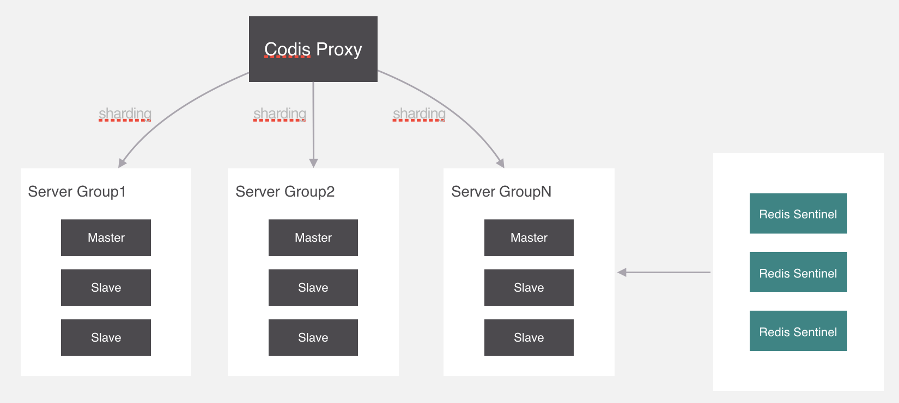
	在Codis里面，它把所有的key分为1024个槽，每一个槽位都对应了一个分组，具体槽位的分配，可以进行自定义，现在如果有一个key进来，首先要根据CRC32算法，针对key算出32位的哈希值，然后除以1024取余，然后就能算出这个KEY属于哪个槽，然后根据槽与分组的映射关系，就能去对应的分组当中处理数据了。
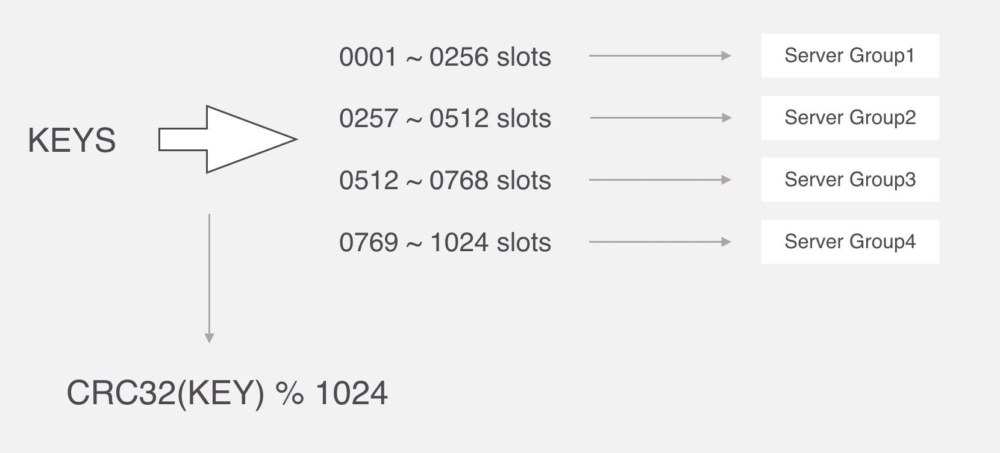

部署好集群之后，有一个问题，就是槽位的映射关系是保存在proxy里面的，不同proxy之间怎么同步映射关系？

在Codis中使用的是Zookeeper来保存映射关系，由proxy上来同步配置信息，其实它支持的不止zookeeper，还有etcd和本地文件。在zookeeper中保存的数据格式就是这个样子。除了这个还会存储一些其他的信息，比如分组信息、代理信息等，感兴趣可以自己去了解一下。

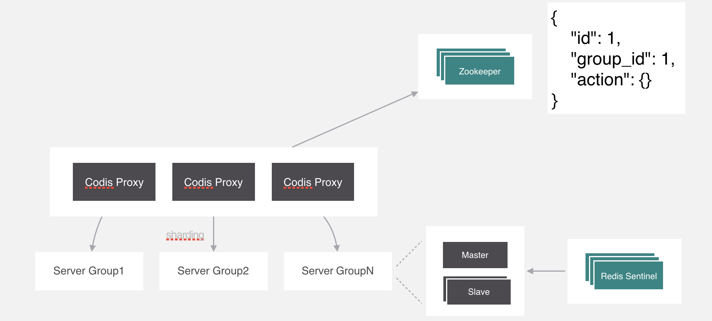

现在还有一个问题，就是codis  proxy如果出现异常怎么处理，这个可能要利用一下k8s中pod的特性，在k8s里面可以设置pod冗余的数量，k8s会严格保证启动的数量与设置一致，所以只需要一个进程监测Proxy的异常，并且把它干掉就可以了，k8s会自动拉起来一个新的proxy。

# 通信协议

​	Redis 的作者认为数据库系统的瓶颈一般不在于网络流量，而是数据库自身内部逻辑处理上。所以即使 Redis 使用了浪费流量的文本协议，依然可以取得极高的访问性能。 Redis将所有数据都放在内存，用一个单线程对外提供服务，单个节点在跑满一个 CPU 核心的情况下可以达到了 10w/s 的超高 QPS。 

​	RESP 是 Redis 序列化协议的简写。它是一种直观的文本协议，优势在于实现异常简单，解析性能极好。 

