 

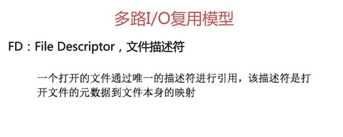

 

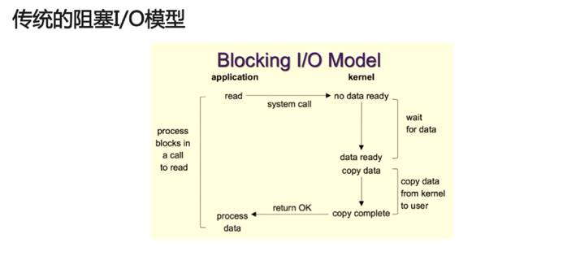

 

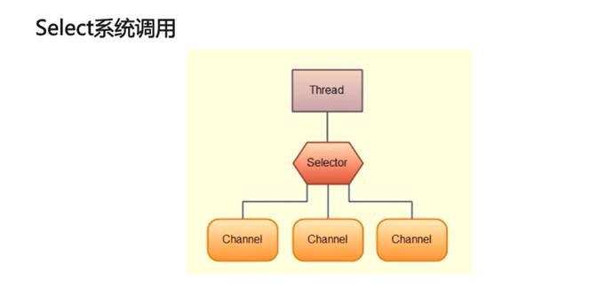

 

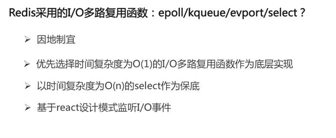

 

为什么redis支持高并发？

<https://blog.csdn.net/u011663149/article/details/85307615>

 

<https://www.cnblogs.com/jian-ge/p/10097244.html>

 

io多路复用是什么？

<https://www.zhihu.com/question/37271342>

 

<https://blog.csdn.net/wangxindong11/article/details/78591308>

 

 

 

 


 

 

 


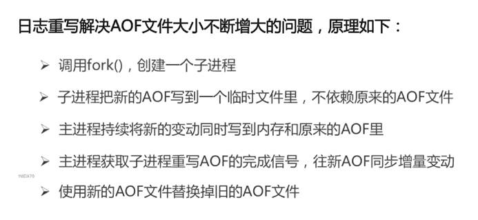

 

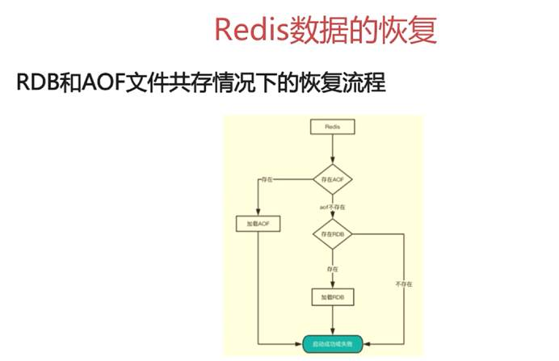

 

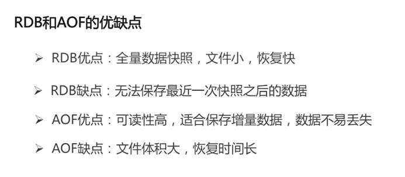

 

4.0+的可以使用RDB-AOF混合持久化格式


 

```
900秒之内至少一次写操作、
300秒之内至少发生10次写操作、
60秒之内发生至少10000次写操作
```

 

save 900 1

save 300 10

save 60 10000

 

 

 

\# redis默认关闭AOF机制，可以将no改成yes实现AOF持久化 

appendonly no 

\# AOF文件 

appendfilename "appendonly.aof" 

\# AOF持久化同步频率，always表示每个Redis写命令都要同步fsync写入到磁盘中，但是这种方式会严重降低redis的速度；everysec表示每秒执行一次同步fsync，显示的将多个写命令同步到磁盘中；no表示让操作系统来决定应该何时进行同步fsync，Linux系统往往可能30秒才会执行一次 

\# appendfsync always appendfsync everysec 

\# appendfsync no 

\# 在日志进行BGREWRITEAOF时，如果设置为yes表示新写操作不进行同步fsync，只是暂存在缓冲区里，避免造成磁盘IO操作冲突，等重写完成后在写入。redis中默认为no  

no-appendfsync-on-rewrite no 

\# 当前AOF文件大小是上次日志重写时的AOF文件大小两倍时，发生BGREWRITEAOF操作。  

auto-aof-rewrite-percentage 100 

\#当前AOF文件执行BGREWRITEAOF命令的最小值，避免刚开始启动Reids时由于文件尺寸较小导致频繁的BGREWRITEAOF。  

auto-aof-rewrite-min-size 64mb 

\# Redis再恢复时，忽略最后一条可能存在问题的指令(因为最后一条指令可能存在问题，比如写一半时突然断电了) aof-load-truncated yes 

\#Redis4.0新增RDB-AOF混合持久化格式，在开启了这个功能之后，AOF重写产生的文件将同时包含RDB格式的内容和AOF格式的内容，其中RDB格式的内容用于记录已有的数据，而AOF格式的内存则用于记录最近发生了变化的数据，这样Redis就可以同时兼有RDB持久化和AOF持久化的优点（既能够快速地生成重写文件，也能够在出现问题时，快速地载入数据）。 

aof-use-rdb-preamble no

 

 

 

 

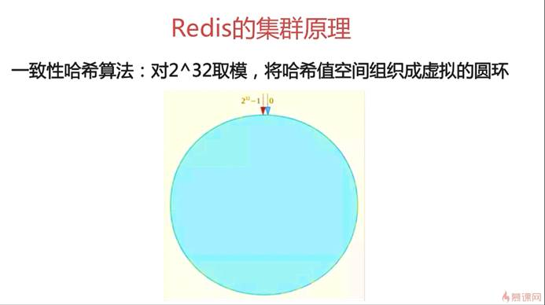

 

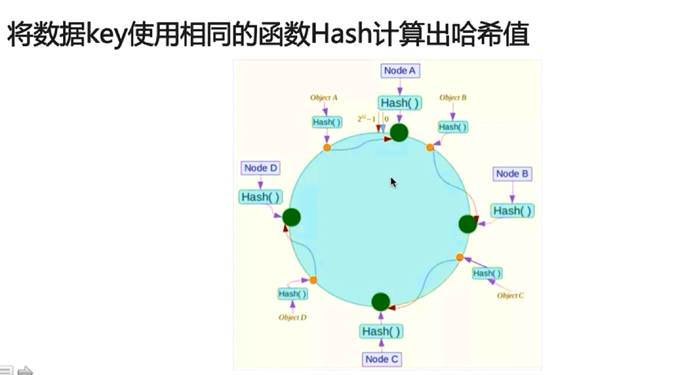

 

宕机，增加服务器，影响小。

 

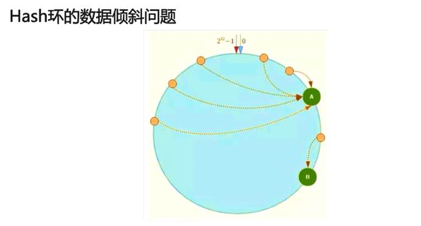

 

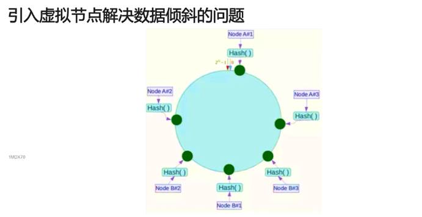

 

 

Redis集群：

<https://www.cnblogs.com/kismetv/p/9853040.html>

 