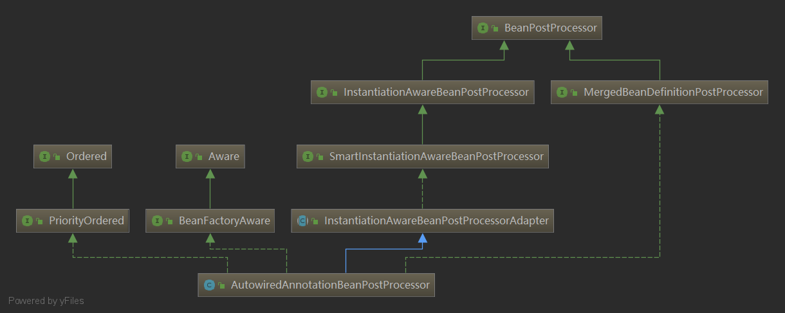

# @Autowired源码

[Spring 源码（九）@Autowired注解实现原理（Spring Bean的自动装配）](https://my.oschina.net/xiaolyuh/blog/3113215)

Spring容器在每个Bean实例化之后，调用AutowiredAnnotationBeanPostProcessor的`postProcessMergedBeanDefinition`方法，查找该Bean是否有@Autowired注解。

Spring在每个Bean实例化的时候，调用`populateBean`进行属性注入的时候，即调用`postProcessPropertyValues`方法，查找该Bean是否有@Autowired注解。

## AutowiredAnnotationBeanPostProcessor

- PriorityOrdered：确认 `AutowiredAnnotationBeanPostProcessor` 后置处理器的执行优先级
- BeanFactoryAware：使得`AutowiredAnnotationBeanPostProcessor `可以直接通过`BeanFactory`获取容器中的Bean
- BeanPostProcessor：在 Bean 初始化前后执行的后置处理器
- InstantiationAwareBeanPostProcessor：在 Bean 实例化前后和Bean设置属性值时执行的后置处理器
- SmartInstantiationAwareBeanPostProcessor：智能实例化Bean的后处理器，如预测Bean的类型和确认Bean的构造函数等。
- MergedBeanDefinitionPostProcessor：合并Bean的定义信息。



```java
public AutowiredAnnotationBeanPostProcessor() {
	//后置处理器将处理@Autowire注解
	this.autowiredAnnotationTypes.add(Autowired.class);
	//后置处理器将处理@Value注解
	this.autowiredAnnotationTypes.add(Value.class);
	try {
		//后置处理器将处理javax.inject.Inject JSR-330注解
		this.autowiredAnnotationTypes.add((Class<? extends Annotation>)
				ClassUtils.forName("javax.inject.Inject", AutowiredAnnotationBeanPostProcessor.class.getClassLoader()));
		logger.info("JSR-330 'javax.inject.Inject' annotation found and supported for autowiring");
	}
	catch (ClassNotFoundException ex) {
		// JSR-330 API not available - simply skip.
	}
}
```

## InstantiationAwareBeanPostProcessor

### postProcessBeforeInstantiation

该方法是在Bean实例化目标对象之前调用，返回的Bean对象可以代理目标，从而有效的阻止了目标Bean的默认实例化。

```java
protected Object resolveBeforeInstantiation(String beanName, RootBeanDefinition mbd) {
	Object bean = null;
	if (!Boolean.FALSE.equals(mbd.beforeInstantiationResolved)) {
		// Make sure bean class is actually resolved at this point.
		if (!mbd.isSynthetic() && hasInstantiationAwareBeanPostProcessors()) {
			Class<?> targetType = determineTargetType(beanName, mbd);
			if (targetType != null) {
				bean = applyBeanPostProcessorsBeforeInstantiation(targetType, beanName);
				if (bean != null) {
					// 如果此方法返回一个非null对象，则Bean创建过程将被短路。
					// 唯一应用的进一步处理是来自已配置BeanPostProcessors的postProcessAfterInitialization回调
					bean = applyBeanPostProcessorsAfterInitialization(bean, beanName);
				}
			}
		}
		mbd.beforeInstantiationResolved = (bean != null);
	}
	return bean;
}

protected Object applyBeanPostProcessorsBeforeInstantiation(Class<?> beanClass, String beanName) {
	for (BeanPostProcessor bp : getBeanPostProcessors()) {
		if (bp instanceof InstantiationAwareBeanPostProcessor) {
			InstantiationAwareBeanPostProcessor ibp = (InstantiationAwareBeanPostProcessor) bp;
			// 执行Bean实例化目标对象之前的后置处理方法
			Object result = ibp.postProcessBeforeInstantiation(beanClass, beanName);
			if (result != null) {
				return result;
			}
		}
	}
	return null;
}
```

跟进源码我们可以看出，如果此方法返回一个非null对象，则Bean创建过程将被短路。唯一应用的进一步处理是来自已配置BeanPostProcessors的postProcessAfterInitialization回调。

### postProcessAfterInstantiation

该方法执行在通过构造函数或工厂方法在实例化bean之后但在发生Spring属性填充（通过显式属性或自动装配）之前执行操作。这是在Spring的自动装配开始之前对给定的bean实例执行自定义字段注入的理想回调。如果该方法返回false，那么它会阻断后续`InstantiationAwareBeanPostProcessor`后置处理器的执行，并且会阻止后续属性填充的执行逻辑。

### postProcessPropertyValues

在工厂将给定属性值应用于给定bean之前，对它们进行后处理。允许检查是否满足所有依赖关系，例如基于bean属性设置器上的“ Required”注解。还允许替换要应用的属性值，通常是通过基于原始PropertyValues创建新的MutablePropertyValues实例，添加或删除特定值来实现。

## SmartInstantiationAwareBeanPostProcessor

智能实例化Bean的后处理器，主要提供了三个方法。

### predictBeanType

预测从此处理器的postProcessBeforeInstantiation回调最终返回的bean的类型。

### determineCandidateConstructors

确定使用实例化Bean的构造函数。

### getEarlyBeanReference

获取提早暴露的Bean的引用，提早暴露的Bean就是只完成了实例化，还未完成属性赋值和初始化的Bean。

## MergedBeanDefinitionPostProcessor

### postProcessMergedBeanDefinition

合并Bean的定义信息的后处理方法，该方法是在Bean的实例化之后设置值之前调用。

## 自动装配

从链路上我们可以看到，找到需要自动装配的元素是在`findAutowiringMetadata`方法中实现的，该方法会去调用`buildAutowiringMetadata`方法构建元数据信息。如果注解被加载属性上将会被封装成`AutowiredFieldElement`对象；如果注解加在方法上，那么元素会被封装成`AutowiredMethodElement`对象。这里两个对象的`inject`方法将最后完成属性值的注入，主要区别就是使用反射注入值的方式不一样。源码如下：

```java
private InjectionMetadata buildAutowiringMetadata(final Class<?> clazz) {
	LinkedList<InjectionMetadata.InjectedElement> elements = new LinkedList<InjectionMetadata.InjectedElement>();
	Class<?> targetClass = clazz;

	do {
		// 存放我们找到的元数据信息
		final LinkedList<InjectionMetadata.InjectedElement> currElements =
				new LinkedList<InjectionMetadata.InjectedElement>();
		
		// 通过反射找出对应Class对象的所有Field
		ReflectionUtils.doWithLocalFields(targetClass, new ReflectionUtils.FieldCallback() {
			@Override
			public void doWith(Field field) throws IllegalArgumentException, IllegalAccessException {
				// 通过反射找到该字段上所有的注解信息，并判断是否有@Autowired和@Value注解，如果有就将该字段封成AutowiredFieldElement对象
				AnnotationAttributes ann = findAutowiredAnnotation(field);
				if (ann != null) {
					if (Modifier.isStatic(field.getModifiers())) {
						if (logger.isWarnEnabled()) {
							logger.warn("Autowired annotation is not supported on static fields: " + field);
						}
						return;
					}
					boolean required = determineRequiredStatus(ann);、
					// 将该字段封成AutowiredFieldElement对象，并放到缓存中
					currElements.add(new AutowiredFieldElement(field, required));
				}
			}
		});

		// 通过反射找出对应Class对象的所有Method
		ReflectionUtils.doWithLocalMethods(targetClass, new ReflectionUtils.MethodCallback() {
			@Override
			public void doWith(Method method) throws IllegalArgumentException, IllegalAccessException {
				Method bridgedMethod = BridgeMethodResolver.findBridgedMethod(method);
				if (!BridgeMethodResolver.isVisibilityBridgeMethodPair(method, bridgedMethod)) {
					return;
				}
				// 通过反射找到该字段上所有的注解信息，并判断是否有@Autowired和@Value注解，如果有就将该字段封成AutowiredMethodElement对象
				AnnotationAttributes ann = findAutowiredAnnotation(bridgedMethod);
				if (ann != null && method.equals(ClassUtils.getMostSpecificMethod(method, clazz))) {
					if (Modifier.isStatic(method.getModifiers())) {
						if (logger.isWarnEnabled()) {
							logger.warn("Autowired annotation is not supported on static methods: " + method);
						}
						return;
					}
					if (method.getParameterTypes().length == 0) {
						if (logger.isWarnEnabled()) {
							logger.warn("Autowired annotation should only be used on methods with parameters: " +
									method);
						}
					}
					boolean required = determineRequiredStatus(ann);
					PropertyDescriptor pd = BeanUtils.findPropertyForMethod(bridgedMethod, clazz);
					// 将该字段封成AutowiredMethodElement对象
					currElements.add(new AutowiredMethodElement(method, required, pd));
				}
			}
		});

		elements.addAll(0, currElements);
		targetClass = targetClass.getSuperclass();
	}
	// 循环处理父类需要自动装配的元素
	while (targetClass != null && targetClass != Object.class);
	// 将需要自动装配的元素封装成InjectionMetadata对象,最后合并到Bean定义中
	return new InjectionMetadata(clazz, elements);
}
```

寻找需要自动装配过程：

1. 根据Class对象，通过反射获取所有的`Field`和```Method````对象
2. 通过反射获取`Field`和`Method`上的注解，并判断是否有@Autowired和@Value注解
3. 将注解了@Autowired和@Value的`Field`和`Method`封装成`AutowiredFieldElement`和`AutowiredMethodElement`对象，等待下一步的自动装配。
4. 循环处理父类需要自动装配的元素
5. 将需要自动装配的元素封装成InjectionMetadata对象，最后合并到Bean定义的`externallyManagedConfigMembers`属性中

## 注入属性

`AutowiredAnnotationBeanPostProcessor`后置处理器注入属性值是在`postProcessPropertyValues`方法中实现的。源码如下：

```
public void inject(Object target, String beanName, PropertyValues pvs) throws Throwable {
	// 获取需要自动装配的元数据信息（这里实在缓存中取）
	Collection<InjectedElement> elementsToIterate =
			(this.checkedElements != null ? this.checkedElements : this.injectedElements);
	if (!elementsToIterate.isEmpty()) {
		boolean debug = logger.isDebugEnabled();
		for (InjectedElement element : elementsToIterate) {
			if (debug) {
				logger.debug("Processing injected element of bean '" + beanName + "': " + element);
			}
			// 调用AutowiredFieldElement或AutowiredMethodElement对象的inject方法注入属性值
			element.inject(target, beanName, pvs);
		}
	}
}
```

### AutowiredFieldElement#inject

```java
@Override
protected void inject(Object bean, String beanName, PropertyValues pvs) throws Throwable {
	Field field = (Field) this.member;
	Object value;
	if (this.cached) {
		value = resolvedCachedArgument(beanName, this.cachedFieldValue);
	}
	else {
		DependencyDescriptor desc = new DependencyDescriptor(field, this.required);
		desc.setContainingClass(bean.getClass());
		Set<String> autowiredBeanNames = new LinkedHashSet<String>(1);
		TypeConverter typeConverter = beanFactory.getTypeConverter();
		try {
			// 在容器中获取需要装配的Bean
			value = beanFactory.resolveDependency(desc, beanName, autowiredBeanNames, typeConverter);
		}
		...
	}
	if (value != null) {
		// 通过反射设置属性值
		ReflectionUtils.makeAccessible(field);
		field.set(bean, value);
	}
}
```

### AutowiredMethodElement#inject

```java
@Override
protected void inject(Object bean, String beanName, PropertyValues pvs) throws Throwable {
	if (checkPropertySkipping(pvs)) {
		return;
	}
	Method method = (Method) this.member;
	Object[] arguments;
	if (this.cached) {
		// Shortcut for avoiding synchronization...
		arguments = resolveCachedArguments(beanName);
	}
	else {
		Class<?>[] paramTypes = method.getParameterTypes();
		arguments = new Object[paramTypes.length];
		DependencyDescriptor[] descriptors = new DependencyDescriptor[paramTypes.length];
		Set<String> autowiredBeans = new LinkedHashSet<String>(paramTypes.length);
		TypeConverter typeConverter = beanFactory.getTypeConverter();
		for (int i = 0; i < arguments.length; i++) {
			MethodParameter methodParam = new MethodParameter(method, i);
			DependencyDescriptor currDesc = new DependencyDescriptor(methodParam, this.required);
			currDesc.setContainingClass(bean.getClass());
			descriptors[i] = currDesc;
			try {
				// 在容器中获取需要装配的Bean
				Object arg = beanFactory.resolveDependency(currDesc, beanName, autowiredBeans, typeConverter);
				if (arg == null && !this.required) {
					arguments = null;
					break;
				}
				arguments[i] = arg;
			}
			catch (BeansException ex) {
				throw new UnsatisfiedDependencyException(null, beanName, new InjectionPoint(methodParam), ex);
			}
		}
		...
	}
	if (arguments != null) {
		try {
			// 通过反射调用方法设置元素值
			ReflectionUtils.makeAccessible(method);
			method.invoke(bean, arguments);
		}
		...
	}
}
```

# 依赖查找

 [Spring IOC（六）依赖查找](https://www.cnblogs.com/binarylei/p/10340455.html)

## 一、名称查找 - autowireByName

毫无疑问，直接从 BeanFactory 中取出这个 bean 就可以了。

```java
protected void autowireByName(
        String beanName, AbstractBeanDefinition mbd, BeanWrapper bw, MutablePropertyValues pvs) {
    String[] propertyNames = unsatisfiedNonSimpleProperties(mbd, bw);
    for (String propertyName : propertyNames) {
        if (containsBean(propertyName)) {
            Object bean = getBean(propertyName);
            pvs.add(propertyName, bean);
            registerDependentBean(propertyName, beanName);
        }
    }
}
```

## 二、类型查找 - autowireByType

autowireByType 相比 autowireByName 就复杂多了，不过 autowireByType 直接委托给 resolveDependency 方法了，

```java
protected void autowireByType(
            String beanName, AbstractBeanDefinition mbd, BeanWrapper bw, MutablePropertyValues pvs) {
    TypeConverter converter = getCustomTypeConverter();
    if (converter == null) {
        converter = bw;
    }

    Set<String> autowiredBeanNames = new LinkedHashSet<>(4);
    String[] propertyNames = unsatisfiedNonSimpleProperties(mbd, bw);
    for (String propertyName : propertyNames) {
        try {
            PropertyDescriptor pd = bw.getPropertyDescriptor(propertyName);
            if (Object.class != pd.getPropertyType()) {
                MethodParameter methodParam = BeanUtils.getWriteMethodParameter(pd);
                // 类型查找时允许对 FactoryBean 提前实例化对象，大部分情况一都是 true。
                // 至于为什么实现了 PriorityOrdered 接口的 bean 要排除，以后再研究一下？？？
                boolean eager = !PriorityOrdered.class.isInstance(bw.getWrappedInstance());
                DependencyDescriptor desc = new AutowireByTypeDependencyDescriptor(methodParam, eager);

                // 核心代码就这一句，类型查找委托给了子类的 resolveDependency 完成
                Object autowiredArgument = resolveDependency(desc, beanName, autowiredBeanNames, converter);
                
                if (autowiredArgument != null) {
                    pvs.add(propertyName, autowiredArgument);
                }
                for (String autowiredBeanName : autowiredBeanNames) {
                    registerDependentBean(autowiredBeanName, beanName);
                }
                autowiredBeanNames.clear();
            }
        }
        catch (BeansException ex) {
            throw new UnsatisfiedDependencyException(ex);
        }
    }
}
```

## 三、查找依赖 - resolveDependency

### 3.1 入口 - resolveDependency

先解释一下 resolveDependency 这个方法的四个参数：

- `descriptor` DependencyDescriptor 这个类实现了对字段、方法参数、构造器参数的进行依赖注入时的统一访问方式，你可以简单的认为是对这三种类型的封装。
- `requestingBeanName` 外层的 beanName
- `autowiredBeanNames` 根据类型查找可能有多个，autowiredBeanNames 就是指查找到的 beanName 集合，Spring 支持 Array、Map、Collection 的注入。
- `typeConverter` 类型转换器，BeanWrapper 自己就是一个转换器。

```java
@Override
public Object resolveDependency(DependencyDescriptor descriptor, @Nullable String requestingBeanName,
        @Nullable Set<String> autowiredBeanNames, @Nullable TypeConverter typeConverter) throws BeansException {
    descriptor.initParameterNameDiscovery(getParameterNameDiscoverer());

    Object result = getAutowireCandidateResolver().getLazyResolutionProxyIfNecessary(
            descriptor, requestingBeanName);
    if (result == null) {
        result = doResolveDependency(descriptor, requestingBeanName, autowiredBeanNames, typeConverter);
    }
    return result;  
}
```

resolveDependency 方法将最重要的实现委托给了 doResolveDependency 完成。这里有两个类需要简单的说明一下：ParameterNameDiscovery 和 AutowireCandidateResolver。

- `ParameterNameDiscovery` 这个类用于查找方法的参数的名称，默认的实现有 StandardReflectionParameterNameDiscoverer。详见：<>
- `AutowireCandidateResolver` 策略接口，对特定的依赖，这个接口决定一个特定的 BeanDefinition 是否满足作为自动绑定的备选项。

### 3.2 findAutowireCandidates

在分析 doResolveDependency 方法之前，先看一下 findAutowireCandidates，这个方法是根据类型在容器中查找到所有可用的 bean。

```java
protected Map<String, Object> findAutowireCandidates(
        @Nullable String beanName, Class<?> requiredType, DependencyDescriptor descriptor) {
    // 1. 根据类型查找父子容器中所有可用的 beanName，调用 getBeanNamesForType 方法。
    //    注意 getBeanNamesForType 方法会过滤别名的情况
    String[] candidateNames = BeanFactoryUtils.beanNamesForTypeIncludingAncestors(
            this, requiredType, true, descriptor.isEager());

    // 2. 先查找缓存中 requiredType 的依赖，ok
    Map<String, Object> result = new LinkedHashMap<>(candidateNames.length);
    for (Map.Entry<Class<?>, Object> classObjectEntry : this.resolvableDependencies.entrySet()) {
        Class<?> autowiringType = classObjectEntry.getKey();
        if (autowiringType.isAssignableFrom(requiredType)) {
            Object autowiringValue = classObjectEntry.getValue();
            // 可能为一个 ObjectFactory 对象，调用 getObject 获取真实的对象
            autowiringValue = AutowireUtils.resolveAutowiringValue(autowiringValue, requiredType);
            if (requiredType.isInstance(autowiringValue)) {
                result.put(ObjectUtils.identityToString(autowiringValue), autowiringValue);
                break;
            }
        }
    }

    // 3. 如果是非循环引用并且是合法的，ok
    for (String candidate : candidateNames) {
        // 所谓的循环引用是指 candidateName 实例的工厂就是 beanName 或就是本身
        if (!isSelfReference(beanName, candidate) && isAutowireCandidate(candidate, descriptor)) {
            addCandidateEntry(result, candidate, descriptor, requiredType);
        }
    }

    // 4. 如果没有找到，有两种解决方案：一是回退操作，如 @Autowire 回退到名称查找，二是非集合类型考虑循环引用
    if (result.isEmpty()) {
        // 判断要注入的类型是 Array、Map、Collection
        boolean multiple = indicatesMultipleBeans(requiredType);
        // 4.1 先执行回退操作
        DependencyDescriptor fallbackDescriptor = descriptor.forFallbackMatch();
        for (String candidate : candidateNames) {
            if (!isSelfReference(beanName, candidate) && isAutowireCandidate(candidate, fallbackDescriptor) &&
                    (!multiple || getAutowireCandidateResolver().hasQualifier(descriptor))) {
                addCandidateEntry(result, candidate, descriptor, requiredType);
            }
        }
        // 4.2 再考虑循环引用，但在集合类型中不允许循环引用自己
        if (result.isEmpty() && !multiple) {
            for (String candidate : candidateNames) {
                if (isSelfReference(beanName, candidate) &&
                        (!(descriptor instanceof MultiElementDescriptor) || !beanName.equals(candidate)) &&
                        isAutowireCandidate(candidate, fallbackDescriptor)) {
                    addCandidateEntry(result, candidate, descriptor, requiredType);
                }
            }
        }
    }
    return result;
}
```

findAutowireCandidates 都是真正中 BeanFactory 容器中根据类型查找，主要有以下几个步骤：

1. 从本容器和父容器中查找所有的该类型的 candidateNames
2. 从缓存中查找该类型的 bean
3. 从 candidateNames 过滤可用的 bean，过滤规则有两个：一是非循环引用；二是符合 AutowireCandidateResolver 的规则。默认实现为 SimpleAutowireCandidateResolver，根据 BeanDefinition#autowireCandidate 字段判断，默认为 true。
4. 如果过滤后没有可用的 bean 了，这时考虑回退操作和循环引用。回退时如 @Autowire 回退到名称查找。回退还查找不到可用的就考虑循环引用的情况。

**(1) 循环引用**

```java
// candidateName 实例的工厂就是 beanName 或就是本身
private boolean isSelfReference(@Nullable String beanName, @Nullable String candidateName) {
    return (beanName != null && candidateName != null &&
            (beanName.equals(candidateName) || (containsBeanDefinition(candidateName) &&
                    beanName.equals(getMergedLocalBeanDefinition(candidateName).getFactoryBeanName()))));
}
```

举个例子：

```java
// <bean id="company" autowire="byType" class="com.github.binarylei.Company"/>
@Test
public void test() {
    DefaultListableBeanFactory lbf = new DefaultListableBeanFactory();
    XmlBeanDefinitionReader reader = new XmlBeanDefinitionReader(lbf);
    reader.loadBeanDefinitions(new ClassPathResource("spring-context-di-2.xml", getClass()));

    Company company = (Company) lbf.getBean("company");
}

public static class Company {
    private Company company;
    private List<Company> companies;
    // 省略 setter
}
```

上面的例子中 company 字段虽然有循环依赖的问题，依然可以正常注入，但其集合类型 companies 无法注入。

**(2) 是否可用 isAutowireCandidate**

DependencyDescriptor 对字段、方法参数、构造器参数进行统一的封装，配合 AutowireCandidateResolver 类一起解决依赖查找的问题。

```java
@Override
public boolean isAutowireCandidate(String beanName, DependencyDescriptor descriptor)
        throws NoSuchBeanDefinitionException {
    return isAutowireCandidate(beanName, descriptor, getAutowireCandidateResolver());
}

protected boolean isAutowireCandidate(String beanName, DependencyDescriptor descriptor, AutowireCandidateResolver resolver)
        throws NoSuchBeanDefinitionException {
    String beanDefinitionName = BeanFactoryUtils.transformedBeanName(beanName);
    if (containsBeanDefinition(beanDefinitionName)) {
        return isAutowireCandidate(beanName, getMergedLocalBeanDefinition(beanDefinitionName), descriptor, resolver);
    } else if (containsSingleton(beanName)) {
        return isAutowireCandidate(beanName, new RootBeanDefinition(getType(beanName)), descriptor, resolver);
    }

    BeanFactory parent = getParentBeanFactory();
    if (parent instanceof DefaultListableBeanFactory) {
        return ((DefaultListableBeanFactory) parent).isAutowireCandidate(beanName, descriptor, resolver);
    } else if (parent instanceof ConfigurableListableBeanFactory) {
        return ((ConfigurableListableBeanFactory) parent).isAutowireCandidate(beanName, descriptor);
    } else {
        return true;
    }
}

protected boolean isAutowireCandidate(String beanName, RootBeanDefinition mbd,
        DependencyDescriptor descriptor, AutowireCandidateResolver resolver) {
    // 如果只有唯一的工厂方法，先解析出来。以后再来研究干什么用的？？？
    String beanDefinitionName = BeanFactoryUtils.transformedBeanName(beanName);
    resolveBeanClass(mbd, beanDefinitionName);
    if (mbd.isFactoryMethodUnique && mbd.factoryMethodToIntrospect == null) {
        new ConstructorResolver(this).resolveFactoryMethodIfPossible(mbd);
    }
    // 调用 AutowireCandidateResolver#isAutowireCandidate 方法判断是否可用
    return resolver.isAutowireCandidate(
            new BeanDefinitionHolder(mbd, beanName, getAliases(beanDefinitionName)), descriptor);
}
```

isAutowireCandidate 最终调用了 AutowireCandidateResolver#isAutowireCandidate 方法，以 SimpleAutowireCandidateResolver 为例：

```java
@Override
public boolean isAutowireCandidate(BeanDefinitionHolder bdHolder, DependencyDescriptor descriptor) {
    return bdHolder.getBeanDefinition().isAutowireCandidate();
}
```

Spring 默认判断 BeanDefinition#autowireCandidate 属性，一般默认为 true。

### 3.3 doResolveDependency

```java
public Object doResolveDependency(DependencyDescriptor descriptor, @Nullable String beanName,
            @Nullable Set<String> autowiredBeanNames, @Nullable TypeConverter typeConverter) throws BeansException {
    // 将当前正在解决的依赖存放到 ThreadLocal 中，作用以后再研究？？？
    InjectionPoint previousInjectionPoint = ConstructorResolver.setCurrentInjectionPoint(descriptor);
    try {
        // 1. resolveShortcut 和 getSuggestedValue 都是对依赖解析前的拦截，这也很符全 Spring 的做法
        Object shortcut = descriptor.resolveShortcut(this);
        if (shortcut != null) {
            return shortcut;
        }

        Class<?> type = descriptor.getDependencyType();
        Object value = getAutowireCandidateResolver().getSuggestedValue(descriptor);
        if (value != null) {
            if (value instanceof String) {
                String strVal = resolveEmbeddedValue((String) value);
                BeanDefinition bd = (beanName != null && containsBean(beanName) ? getMergedBeanDefinition(beanName) : null);
                value = evaluateBeanDefinitionString(strVal, bd);
            }
            TypeConverter converter = (typeConverter != null ? typeConverter : getTypeConverter());
            return (descriptor.getField() != null ?
                    converter.convertIfNecessary(value, type, descriptor.getField()) :
                    converter.convertIfNecessary(value, type, descriptor.getMethodParameter()));
        }

        // 2. 匹配多个，sine @Spring 4.3。如果 type 是 Array、List、Map 走这里，当然也有可以匹配不到
        Object multipleBeans = resolveMultipleBeans(descriptor, beanName, autowiredBeanNames, typeConverter);
        if (multipleBeans != null) {
            return multipleBeans;
        }

        // 3. 正常流程，只匹配一个，先找到所有可用的 matchingBeans
        //    如果有多个，则比较优先级确定一个
        //    如果没有，则根据依赖是否是必需的抛出异常
        Map<String, Object> matchingBeans = findAutowireCandidates(beanName, type, descriptor);
        if (matchingBeans.isEmpty()) {
            if (isRequired(descriptor)) {
                raiseNoMatchingBeanFound(type, descriptor.getResolvableType(), descriptor);
            }
            return null;
        }

        String autowiredBeanName;
        Object instanceCandidate;

        // 3.1 匹配到多个，则根据优先级选一个。注意集合类型允许为空
        if (matchingBeans.size() > 1) {
            // 3.1.1 根据 Primary 属性或 PriorityOrdered 接口指定优先级
            autowiredBeanName = determineAutowireCandidate(matchingBeans, descriptor);
            if (autowiredBeanName == null) {
                // 3.1.2 如果是必需的或非集合类型，那么就根据 DependencyDescriptor 指定的规则选择一个最优的
                if (isRequired(descriptor) || !indicatesMultipleBeans(type)) {
                    return descriptor.resolveNotUnique(descriptor.getResolvableType(), matchingBeans);
                // 3.1.3 集合类型允许为 null
                } else {
                    return null;
                }
            }
            instanceCandidate = matchingBeans.get(autowiredBeanName);
        // 3.2 精确匹配一个
        } else {
            Map.Entry<String, Object> entry = matchingBeans.entrySet().iterator().next();
            autowiredBeanName = entry.getKey();
            instanceCandidate = entry.getValue();
        }

        if (autowiredBeanNames != null) {
            autowiredBeanNames.add(autowiredBeanName);
        }
        if (instanceCandidate instanceof Class) {
            instanceCandidate = descriptor.resolveCandidate(autowiredBeanName, type, this);
        }

        // 4. 校验
        Object result = instanceCandidate;
        if (result instanceof NullBean) {
            if (isRequired(descriptor)) {
                raiseNoMatchingBeanFound(type, descriptor.getResolvableType(), descriptor);
            }
            result = null;
        }
        if (!ClassUtils.isAssignableValue(type, result)) {
            throw new BeanNotOfRequiredTypeException(autowiredBeanName, type, instanceCandidate.getClass());
        }
        return result;
    }
    finally {
        ConstructorResolver.setCurrentInjectionPoint(previousInjectionPoint);
    }
}
```

doResolveDependency 这个方法有点长，大概可以分为三步：

1. 首先是前面的拦截处理，这两个拦截肯定是扩展用的。
2. 依赖查找。有两种情况：一是集合注入，查找使用 resolveMultipleBeans；二是匹配单个，查找使用 findAutowireCandidates。
3. 依赖校验。一是如果查找到多个，如何匹配优先级；二是如果没有是否抛出异常。

findAutowireCandidates 方法我们前面已经看过了，根据类型查找所有的依赖。其实 resolveMultipleBeans 也是调用这个方法。我们只看一下 List 集合是怎么处理的：

```java
if (Collection.class.isAssignableFrom(type) && type.isInterface()) {
    // 1. 解析泛型的真实类型 eg List<User> 是 User
    Class<?> elementType = descriptor.getResolvableType().asCollection().resolveGeneric();
    if (elementType == null) {
        return null;
    }
    // 2. 调用 findAutowireCandidates 查找所有的类型
    Map<String, Object> matchingBeans = findAutowireCandidates(beanName, elementType,
            new MultiElementDescriptor(descriptor));
    if (matchingBeans.isEmpty()) {
        return null;
    }
    if (autowiredBeanNames != null) {
        autowiredBeanNames.addAll(matchingBeans.keySet());
    }
    // 3. 类型转换
    TypeConverter converter = (typeConverter != null ? typeConverter : getTypeConverter());
    Object result = converter.convertIfNecessary(matchingBeans.values(), type);
    // 4. 排序
    if (result instanceof List) {
        Comparator<Object> comparator = adaptDependencyComparator(matchingBeans);
        if (comparator != null) {
            ((List<?>) result).sort(comparator);
        }
    }
    return result;
}
```