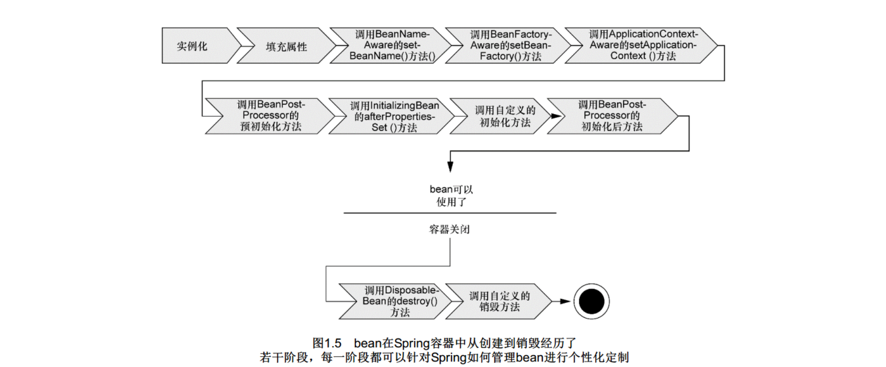
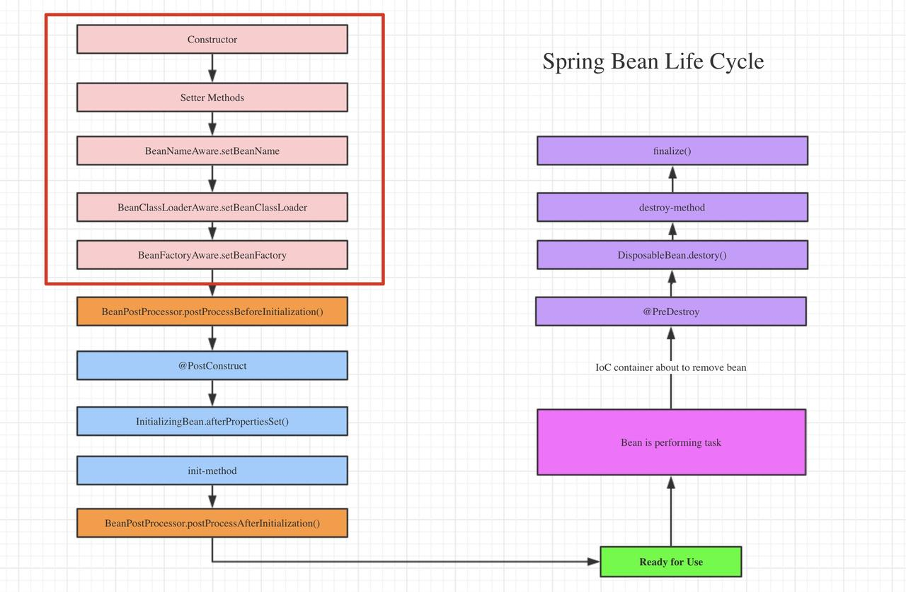

# 生命周期



1． Spring对bean进行实例化；
2． Spring将值和bean的引用注入到bean对应的属性中；
3． 如果bean实现了BeanNameAware接口， Spring将bean的ID传递给setBean-Name()方法；
4． 如果bean实现了BeanFactoryAware接口， Spring将调用setBeanFactory()方法， 将BeanFactory容器实例传入；
5． 如果bean实现了ApplicationContextAware接口， Spring将调用setApplicationContext()方法， 将bean所在的应用上下文的
引用传入进来；
6． 如果bean实现了BeanPostProcessor接口， Spring将调用它们的post-ProcessBeforeInitialization()方法；
7． 如果bean实现了InitializingBean接口， Spring将调用它们的after-PropertiesSet()方法。 类似地， 如果bean使用initmethod声明了初始化方法， 该方法也会被调用；
8． 如果bean实现了BeanPostProcessor接口， Spring将调用它们的post-ProcessAfterInitialization()方法；
9． 此时， bean已经准备就绪， 可以被应用程序使用了， 它们将一直驻留在应用上下文中， 直到该应用上下文被销毁；
10． 如果bean实现了DisposableBean接口， Spring将调用它的destroy()接口方法。 同样， 如果bean使用destroy-method声明了销毁方法， 该方法也会被调用 




```java
//AbstractAutowireCapableBeanFactory
protected Object initializeBean(final String beanName, final Object bean, @Nullable RootBeanDefinition mbd) {
        // 执行*Aware接口的方法，Spring提供了大量的*Aware接口，用来给Bean设置值，如可以向Bean中注入ApplicationContext，ClassLoader等。    
        invokeAwareMethods(beanName, bean);

        Object wrappedBean = bean;
        if (mbd == null || !mbd.isSynthetic()) {
            //如果Bean实现了BeanPostProcessor接口，则执行postProcessBeforeInitialization方法。
            wrappedBean = applyBeanPostProcessorsBeforeInitialization(wrappedBean, beanName);
        }
    
        try {
            // 执行bean自定义初始化相关方法。@PostConstruct、InitializingBean、init-method
            invokeInitMethods(beanName, wrappedBean, mbd);
        }
        catch (Throwable ex) {
            throw new BeanCreationException(
                    (mbd != null ? mbd.getResourceDescription() : null),
                    beanName, "Invocation of init method failed", ex);
        }
        if (mbd == null || !mbd.isSynthetic()) {
            // 如果Bean实现了BeanPostProcessor接口，则执行postProcessAfterInitialization方法。
            wrappedBean = applyBeanPostProcessorsAfterInitialization(wrappedBean, beanName);
        }
    
        return wrappedBean;
    }
```
# initialization 和 destroy

## 接口实现

这两个接口都只包含一个方法。通过实现InitializingBean接口的afterPropertiesSet()方法可以在Bean属性值设置好之后做一些操作，实现DisposableBean接口的destroy()方法可以在销毁Bean之前做一些操作。

这种方法比较简单，但是不建议使用。因为这样**会将Bean的实现和Spring框架耦合**在一起。

```java
public class GiraffeService implements InitializingBean,DisposableBean {
    @Override
    public void afterPropertiesSet() throws Exception {
        System.out.println("执行InitializingBean接口的afterPropertiesSet方法");

    }

    @Override
    public void destroy() throws Exception {
        System.out.println("执行DisposableBean接口的destroy方法");
    }
}
```

## 配置实现

Spring允许我们创建自己的init方法和destroy方法，只要在Bean的配置文件中指定init-method和destroy-method的值就可以在Bean初始化时和销毁之前执行一些操作。

需要注意的是自定义的init-method和post-method方法可以抛异常但是不能有参数。

这种方式比较推荐，因为可以自己创建方法，无需将Bean的实现直接依赖于spring的框架。

```java
public class GiraffeService {
    //通过<bean>的destroy-method属性指定的销毁方法
    public void destroyMethod() throws Exception {
        System.out.println("执行配置的destroy-method");
    }

    //通过<bean>的init-method属性指定的初始化方法
    public void initMethod() throws Exception {
        System.out.println("执行配置的init-method");
    }

}
```

```xml
<bean name="giraffeService" class="com.giraffe.spring.service.GiraffeService" init-method="initMethod" destroy-method="destroyMethod">
</bean>
```


## 注解实现

除了配置的方式，Spring也支持用`@PostConstruct`和 `@PreDestroy`注解来指定init和destroy方法。这两个注解均在`javax.annotation`包中。

```java
public class GiraffeService {
    
    @PostConstruct
    public void initPostConstruct(){
        System.out.println("执行PostConstruct注解标注的方法");
    }

    @PreDestroy
    public void preDestroy(){
        System.out.println("执行preDestroy注解标注的方法");
    }

}
```
```xml
<bean class="org.springframework.context.annotation.CommonAnnotationBeanPostProcessor" />
```

# Aware 接口

[Spring4.x高级话题(一):Spring Aware](http://blog.longjiazuo.com/archives/1324)

`Spring`的依赖注入的最大亮点就是你所有的`Bean`对`Spring`容器的存在是没有意识的。即你可以将你的容器替换成别的容器，例如`Goggle Guice`,这时`Bean`之间的耦合度很低。

但是在实际的项目中，我们不可避免的要用到`Spring`容器本身的功能资源，这时候`Bean`必须要意识到`Spring`容器的存在，才能调用`Spring`所提供的资源，这就是所谓的`Spring Aware`。其实`Spring Aware`本来就是`Spring`设计用来框架内部使用的，若使用了`Spring Aware`，你的`Bean`将会和`Spring`框架耦合。

| BeanNameAware                  | 获得到容器中Bean的名称                              |
| ------------------------------ | --------------------------------------------------- |
| BeanFactoryAware               | 获得当前bean factory，这样可以调用容器的服务        |
| ApplicationContextAware*       | 获得当前application context，这样可以调用容器的服务 |
| MessageSourceAware             | 获得message source这样可以获得文本信息              |
| ApplicationEventPublisherAware | 应用事件发布器，可以发布事件                        |
| ResourceLoaderAware            | 获得资源加载器，可以获得外部资源文件                |

`Spring Aware`的目的是为了让`Bean`获得`Spring`容器的服务。因为`ApplicationContext`接口集成了`MessageSource`接口，`ApplicationEventPublisherAware`接口和`ResourceLoaderAware`接口，所以`Bean`继承`ApplicationContextAware`可以获得`Spring`容器的所有服务，但原则上我们还是用到什么接口就实现什么接口。


## 使用示例

```java
@Service
//实现BeanNameAware,ResourceLoaderAware接口，获得Bean名称和资源加载的服务。
public class AwareService implements BeanNameAware,ResourceLoaderAware{

    private String beanName;
    private ResourceLoader loader;

    @Override
    //实现ResourceLoaderAware需要重写setResourceLoader方法。
    public void setResourceLoader(ResourceLoader resourceLoader) {
        this.loader = resourceLoader;
    }

    @Override
    //实现BeanNameAware需要重写setBeanName方法。
    public void setBeanName(String name) {
        this.beanName = name;
    }

    public void outputResult(){
        System.out.println("Bean的名称为：" + beanName);

        Resource resource = 
                loader.getResource("classpath:org/light4j/sping4/senior/aware/test.txt");
        try{

            System.out.println("ResourceLoader加载的文件内容为: " + IOUtils.toString(resource.getInputStream()));

           }catch(IOException e){
            e.printStackTrace();
           }
    }
}
```

## BeanFactoryAware

```java
public interface BeanFactoryAware extends Aware { 
 
    void setBeanFactory(BeanFactory beanFactory) throws BeansException;
 
}
```

###  源码解析

假如bean实现了BeanFactoryAware，会将BeanFactory放入bean内，提供给bean使用。

```java
//AbstractAutowireCapableBeanFactory
private void invokeAwareMethods(final String beanName, final Object bean) {
   if (bean instanceof Aware) {
      if (bean instanceof BeanNameAware) {
         ((BeanNameAware) bean).setBeanName(beanName);
      }
      if (bean instanceof BeanClassLoaderAware) {
         ClassLoader bcl = getBeanClassLoader();
         if (bcl != null) {
            ((BeanClassLoaderAware) bean).setBeanClassLoader(bcl);
         }
      }
      if (bean instanceof BeanFactoryAware) {
         ((BeanFactoryAware) bean).setBeanFactory(AbstractAutowireCapableBeanFactory.this);
      }
   }
}
```


# BeanPostProcessor

BeanPostProcessor 接口，大家也应该有印象，里面只有两个方法：

```java
@Component
public class SpringLifeCycleProcessor implements BeanPostProcessor {

    @Override
    //初始化之前调用
    public Object postProcessBeforeInitialization(Object bean, String beanName) throws BeansException {
        if ("annotationBean".equals(beanName)){
            LOGGER.info("SpringLifeCycleProcessor start beanName={}",beanName);
        }
        return bean;
    }

    @Override
    //bean 初始化完成调用
    public Object postProcessAfterInitialization(Object bean, String beanName) throws BeansException {
        if ("annotationBean".equals(beanName)){
            LOGGER.info("SpringLifeCycleProcessor end beanName={}",beanName);
        }
        return bean;
    }
}
```


# 循环依赖

Spring bean的创建，其本质上还是一个对象的创建，既然是对象，读者朋友一定要明白一点就是，一个完整的对象包含两部分：当前对象实例化和对象属性的实例化。

比如beanA和beanB循环依赖，beanA初始化，beanB初始化，beanB设置beanA的依赖，beanA设置beanB的依赖，这样子就解决了循环依赖。