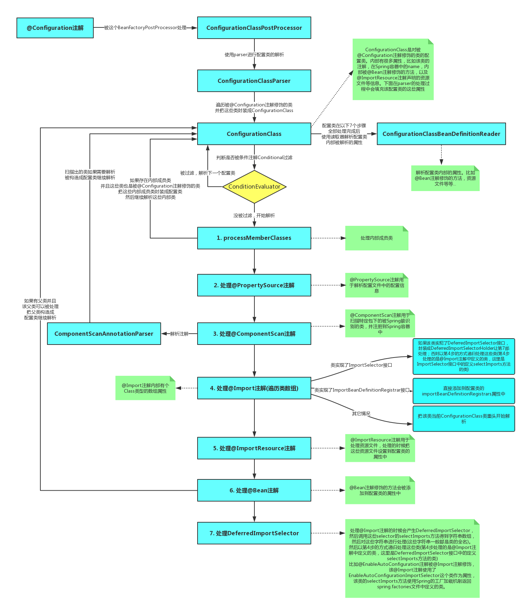

# springboot

SpringBoot启动的时候，不论调用什么方法，都会构造一个SpringApplication的实例，然后调用这个实例的run方法，这样就表示启动SpringBoot。

在run方法调用之前，也就是构造SpringApplication的时候会进行**初始化**的工作，初始化的时候会做以下几件事：

1. 把参数sources设置到SpringApplication属性中，这个sources可以是任何类型的参数。本文的例子中这个sources就是MyApplication的class对象
2. 判断是否是web程序，并设置到webEnvironment这个boolean属性中
3. 找出所有的初始化器，默认有5个，设置到initializers属性中
4. 找出所有的应用程序监听器，默认有9个，设置到listeners属性中
5. 找出运行的主类(main class)

SpringApplication构造完成之后调用run方法，启动SpringApplication，run方法执行的时候会做以下几件事：

1. 构造一个StopWatch，观察SpringApplication的执行
2. 找出所有的SpringApplicationRunListener并封装到SpringApplicationRunListeners中，用于监听run方法的执行。监听的过程中会封装成事件并广播出去让初始化过程中产生的应用程序监听器进行监听
3. 构造Spring容器(ApplicationContext)，并返回
   3.1 创建Spring容器的判断是否是web环境，是的话构造AnnotationConfigEmbeddedWebApplicationContext，否则构造AnnotationConfigApplicationContext
   3.2 初始化过程中产生的初始化器在这个时候开始工作
   3.3 Spring容器的刷新(完成bean的解析、各种processor接口的执行、条件注解的解析等等)
4. 从Spring容器中找出ApplicationRunner和CommandLineRunner接口的实现类并排序后依次执行

# 1.启动注解介绍

```java
@SpringBootApplication
public class ShiroDemoApplication {

    public static void main(String[] args) {
        SpringApplication.run(ShiroDemoApplication.class, args);
    }

}

@Target(ElementType.TYPE)
@Retention(RetentionPolicy.RUNTIME)
@Documented
@Inherited
@SpringBootConfiguration
@EnableAutoConfiguration
@ComponentScan(excludeFilters = { @Filter(type = FilterType.CUSTOM, classes = TypeExcludeFilter.class),
		@Filter(type = FilterType.CUSTOM, classes = AutoConfigurationExcludeFilter.class) })
public @interface SpringBootApplication {
    
}
```

springboot启动类带有一个注解@SpringBootApplication

## @SpringBootConfiguration

```java
@Target({ElementType.TYPE})
@Retention(RetentionPolicy.RUNTIME)
@Documented
@Configuration
public @interface SpringBootConfiguration {
}
```

@SpringBootConfiguration这个注解其实就是@Configuration，将bean注入spring的ioc容器

```java
@Configuration
public class SpringConfiguration{
    @Bean
    public UserService userService(){
        return new UserServiceImpl();
    }
}
```


## @ComponentScan

`@ComponentScan`的功能其实就是自动扫描并加载符合条件的组件（比如`@Component`和`@Repository`等）或者bean定义，最终将这些bean定义加载到IoC容器中。

我们可以通过`basePackages`等属性来细粒度的定制`@ComponentScan`自动扫描的范围，如果不指定，则默认Spring框架实现会从声明`@ComponentScan`所在类的package进行扫描。

## @EnableAutoConfiguration

```java
@Target({ElementType.TYPE})
@Retention(RetentionPolicy.RUNTIME)
@Documented
@Inherited
@AutoConfigurationPackage
@Import({AutoConfigurationImportSelector.class})
public @interface EnableAutoConfiguration {
    String ENABLED_OVERRIDE_PROPERTY = "spring.boot.enableautoconfiguration";

    Class<?>[] exclude() default {};

    String[] excludeName() default {};
}
```

借助@Import的支持，收集和注册特定场景相关的bean定义。

```java
protected List<String> getCandidateConfigurations(AnnotationMetadata metadata, AnnotationAttributes attributes) {
    //通过loadFactoryNames方法加载spring boot默认约定需要配置的类
    List<String> configurations = SpringFactoriesLoader.loadFactoryNames(this.getSpringFactoriesLoaderFactoryClass(), this.getBeanClassLoader());
    Assert.notEmpty(configurations, "No auto configuration classes found in META-INF/spring.factories. If you are using a custom packaging, make sure that file is correct.");
    return configurations;
}
```


```java
public final class SpringFactoriesLoader {
    public static final String FACTORIES_RESOURCE_LOCATION = "META-INF/spring.factories";
    private static final Log logger = LogFactory.getLog(SpringFactoriesLoader.class);
    private static final Map<ClassLoader, MultiValueMap<String, String>> cache = new ConcurrentReferenceHashMap();
    }
```

spring.factories文件示例

```properties
# Initializers
org.springframework.context.ApplicationContextInitializer=\
org.springframework.boot.autoconfigure.SharedMetadataReaderFactoryContextInitializer,\
org.springframework.boot.autoconfigure.logging.ConditionEvaluationReportLoggingListener

# Application Listeners
org.springframework.context.ApplicationListener=\
org.springframework.boot.autoconfigure.BackgroundPreinitializer

```

### ImportSelector介绍

在@Configuration标注的Class上可以使用@Import引入其它的配置类，其实它还可以引入org.springframework.context.annotation.ImportSelector实现类。

ImportSelector接口只定义了一个selectImports()，用于指定需要注册为bean的Class名称。

当在@Configuration标注的Class上使用@Import引入了一个ImportSelector实现类后，会把实现类中返回的Class名称都定义为bean。

来看一个简单的示例，假设现在有一个接口HelloService，需要把所有它的实现类都定义为bean，而且它的实现类上是没有加Spring默认会扫描的注解的，比如@Component、@Service等。

```java
public interface HelloService {
    void doSomething();
}

public class HelloServiceA implements HelloService {
    @Override
    public void doSomething() {
        System.out.println("Hello A");
    }

}

public class HelloServiceB implements HelloService {
    @Override
    public void doSomething() {
        System.out.println("Hello B");
    }
}
```

现定义了一个ImportSelector实现类HelloImportSelector，直接指定了需要把HelloService接口的实现类HelloServiceA和HelloServiceB定义为bean。
```java
public class HelloImportSelector implements ImportSelector {
    @Override
    public String[] selectImports(AnnotationMetadata importingClassMetadata) {
        return new String[] {HelloServiceA.class.getName(), HelloServiceB.class.getName()};
    }
}
```

然后定义了@Configuration配置类HelloConfiguration，指定了@Import的是HelloImportSelector。
```java
@Configuration
@Import(HelloImportSelector.class)
public class HelloConfiguration {
}
```

这样当加载配置类HelloConfiguration的时候会一并把HelloServiceA和HelloServiceB注册为Spring bean。可以进行如下简单测试：
```java
@ContextConfiguration(classes=HelloConfiguration.class)
@RunWith(SpringRunner.class)
public class HelloImportSelectorTest {

    @Autowired
    private List<HelloService> helloServices;
    
    @Test
    public void test() {
        this.helloServices.forEach(HelloService::doSomething);
    }

}
```


# 2.启动流程

## 2.1 SpringApplication实例化

```java
public SpringApplication(ResourceLoader resourceLoader, Class... primarySources) {
    this.resourceLoader = resourceLoader;
    Assert.notNull(primarySources, "PrimarySources must not be null");
    this.primarySources = new LinkedHashSet(Arrays.asList(primarySources));
    //1.推断应用类型是Standard还是Web 可能会出现三种结果REACTIVE 、NONE、SERVLET 
    this.webApplicationType = WebApplicationType.deduceFromClasspath();
    //2.查找并加载所有可用初始化器，设置到initializers属性中 spring.factories处读取
  this.setInitializers(this.getSpringFactoriesInstances(ApplicationContextInitializer.class));
    //3.找出所有的应用程序监听器，设置到listeners属性中
    this.setListeners(this.getSpringFactoriesInstances(ApplicationListener.class));
    //4.推断并设置main方法的定义类，意思就是找出运行的主类
    this.mainApplicationClass = this.deduceMainApplicationClass();
}
```

### 1) 应用类型

```java
static WebApplicationType deduceFromClasspath() {
    //响应式非阻塞web应用 使用netty
   if (ClassUtils.isPresent(WEBFLUX_INDICATOR_CLASS, null) && !ClassUtils.isPresent(WEBMVC_INDICATOR_CLASS, null)
         && !ClassUtils.isPresent(JERSEY_INDICATOR_CLASS, null)) {
      return WebApplicationType.REACTIVE;
   }
    //非web应用
   for (String className : SERVLET_INDICATOR_CLASSES) {
      if (!ClassUtils.isPresent(className, null)) {
         return WebApplicationType.NONE;
      }
   }
    //阻塞式的web应用
   return WebApplicationType.SERVLET;
}
```

[一文带你了解 Spring 5.0 WebFlux 应用场景](https://www.baidu.com/link?url=2FaNcxSC3dXUD6hKhtynDDEBfqXaVD5jjE3SKArZqPjGkr3uAZXnbvHk2_lwcDm3_vVrMKeWDvw_ugGbzOF29q&wd=&eqid=e126e4be00000bab000000065dbbd518)

**Spring MVC 构建于 Servlet API 之上，使用的是同步阻塞式 I/O 模型，什么是同步阻塞式 I/O 模型呢？就是说，每一个请求对应一个线程去处理。**

**Spring WebFlux 是一个异步非阻塞式的 Web 框架，它能够充分利用多核 CPU 的硬件资源去处理大量的并发请求。**

**WebFlux 并不能使接口的响应时间缩短，它仅仅能够提升吞吐量和伸缩性**。

它特别适合应用在 IO 密集型的服务中，比如微服务网关这样的应用中。

### 2) 加载spring.factories

```java
//SpringFactoriesLoader.java
private static Map<String, List<String>> loadSpringFactories(@Nullable ClassLoader classLoader) {
    MultiValueMap<String, String> result = (MultiValueMap)cache.get(classLoader);
    if (result != null) {
        return result;
    } else {
        try {
            Enumeration<URL> urls = classLoader != null ? classLoader.getResources("META-INF/spring.factories") : ClassLoader.getSystemResources("META-INF/spring.factories");
            LinkedMultiValueMap result = new LinkedMultiValueMap();

            while(urls.hasMoreElements()) {
                URL url = (URL)urls.nextElement();
                UrlResource resource = new UrlResource(url);
                Properties properties = PropertiesLoaderUtils.loadProperties(resource);
                Iterator var6 = properties.entrySet().iterator();

                while(var6.hasNext()) {
                    Entry<?, ?> entry = (Entry)var6.next();
                    String factoryClassName = ((String)entry.getKey()).trim();
                    String[] var9 = StringUtils.commaDelimitedListToStringArray((String)entry.getValue());
                    int var10 = var9.length;

                    for(int var11 = 0; var11 < var10; ++var11) {
                        String factoryName = var9[var11];
                        result.add(factoryClassName, factoryName.trim());
                    }
                }
            }

            cache.put(classLoader, result);
            return result;
        } catch (IOException var13) {
            throw new IllegalArgumentException("Unable to load factories from location [META-INF/spring.factories]", var13);
        }
    }
}
```


## 2.2 run方法调用

```java
public ConfigurableApplicationContext run(String... args) {
    //开启一个秒表
    StopWatch stopWatch = new StopWatch();
    stopWatch.start();
    ConfigurableApplicationContext context = null;
    Collection<SpringBootExceptionReporter> exceptionReporters = new ArrayList();
    this.configureHeadlessProperty();
    //观察者模式，从spring.factories找到相应的监听器列表，默认只有EventPublishingRunListener
    SpringApplicationRunListeners listeners = this.getRunListeners(args);
    listeners.starting();

    Collection exceptionReporters;
    try {
        ApplicationArguments applicationArguments = new DefaultApplicationArguments(args);
        //属性文件配置 比如yaml 
        ConfigurableEnvironment environment = this.prepareEnvironment(listeners, applicationArguments);
        this.configureIgnoreBeanInfo(environment);
        Banner printedBanner = this.printBanner(environment);
        //根据环境创建应用上下文，如web环境AnnotationConfigEmbeddedWebApplicationContext
        context = this.createApplicationContext();
        //准备异常报告器
        exceptionReporters = this.getSpringFactoriesInstances(SpringBootExceptionReporter.class, new Class[]{ConfigurableApplicationContext.class}, context);
        //
        this.prepareContext(context, environment, listeners, applicationArguments, printedBanner);
        //todo 核心，初始化
        this.refreshContext(context);
        //空实现
        this.afterRefresh(context, applicationArguments);
        stopWatch.stop();
        if (this.logStartupInfo) {
            (new StartupInfoLogger(this.mainApplicationClass)).logStarted(this.getApplicationLog(), stopWatch);
        }

        listeners.started(context);
        // 调用Spring容器中的ApplicationRunner和CommandLineRunner接口的实现类
        this.callRunners(context, applicationArguments);
    } catch (Throwable var10) {
        this.handleRunFailure(context, var10, exceptionReporters, listeners);
        throw new IllegalStateException(var10);
    }

    try {
        listeners.running(context);
        return context;
    } catch (Throwable var9) {
        this.handleRunFailure(context, var9, exceptionReporters, (SpringApplicationRunListeners)null);
        throw new IllegalStateException(var9);
    }
}
```


### 事件监听器

SpringApplicationRunListener目前只有一个实现类EventPublishingRunListener，它把监听的过程封装成了SpringApplicationEvent事件并让内部属性(属性名为multicaster)ApplicationEventMulticaster接口的实现类SimpleApplicationEventMulticaster广播出去，广播出去的事件对象会被SpringApplication中的listeners属性进行处理。

```java
public interface SpringApplicationRunListener {
   
    //started(run方法执行的时候立马执行；对应事件的类型是ApplicationStartedEvent)
    void started();

    //environmentPrepared(ApplicationContext创建之前并且环境信息准备好的时候调用；对应事件的类型是ApplicationEnvironmentPreparedEvent)
    void environmentPrepared(ConfigurableEnvironment var1);

    //contextPrepared(ApplicationContext创建好并且在source加载之前调用一次；没有具体的对应事件)
    void contextPrepared(ConfigurableApplicationContext var1);

    //contextLoaded(ApplicationContext创建并加载之后并在refresh之前调用；对应事件的类型是ApplicationPreparedEvent)
    void contextLoaded(ConfigurableApplicationContext var1);

    //finished(run方法结束之前调用；对应事件的类型是ApplicationReadyEvent或ApplicationFailedEvent)
    void finished(ConfigurableApplicationContext var1, Throwable var2);
}
```

#### 监听器执行流程

```java
    //1.构造一个监听事件 EventPublishingRunListener.class
    public void started() {
       publishEvent(new ApplicationStartedEvent(this.application, this.args));
    }

	//2.广播事件 SimpleApplicationEventMulticaster.class
	public void multicastEvent(final ApplicationEvent event, ResolvableType eventType) {}

    //3.找到对应的监听器listener SimpleApplicationEventMulticaster.class
	protected Collection<ApplicationListener<?>> getApplicationListeners(
			ApplicationEvent event, ResolvableType eventType) {}

	//4.让相应的监听器处理事件
	protected void invokeListener(ApplicationListener listener, ApplicationEvent event) {}
```

#### 观察者模式


### Runner接口

ApplicationRunner和CommandLineRunner区别不大，都是在SpringApplication的run方法最后执行Runner接口内的run方法，可以根据需要排序。

```java
private void callRunners(ApplicationContext context, ApplicationArguments args) {
    List<Object> runners = new ArrayList();
    runners.addAll(context.getBeansOfType(ApplicationRunner.class).values());
    runners.addAll(context.getBeansOfType(CommandLineRunner.class).values());
    //排序
    AnnotationAwareOrderComparator.sort(runners);
    Iterator var4 = (new LinkedHashSet(runners)).iterator();

    while(var4.hasNext()) {
        Object runner = var4.next();
        if (runner instanceof ApplicationRunner) {
            this.callRunner((ApplicationRunner)runner, args);
        }

        if (runner instanceof CommandLineRunner) {
            this.callRunner((CommandLineRunner)runner, args);
        }
    }

}
```


#### ApplicationRunner

```java
@Order(2)
@Component
public class SimpleApplicationRunner implements ApplicationRunner{
    
    @Override
    public void run(ApplicationArguments args) throws Exception {
        System.out.println("===== SimpleApplicationRunner");
    }

}
```

#### CommandLineRunner

```java
@Order(1)
@Component
public class SimpleCommandLineRunner implements CommandLineRunner {
    @Override
    public void run(String... args) throws Exception {
        System.out.println("===== SimpleCommandLineRunner");
    }
}
```


### refresh过程

Spring容器创建之后，会调用它的refresh方法，refresh的时候会做很多事情：比如完成配置类的解析、各种BeanFactoryPostProcessor和BeanPostProcessor的注册、国际化配置的初始化、web内置容器的构造等等。

```java
//AbstractApplicationContext.class
public void refresh() throws BeansException, IllegalStateException {
   synchronized (this.startupShutdownMonitor) {
      // 准备上下文，记录启动时间，标记该上下文已启用，
      prepareRefresh();

      // springboot只能刷新一次beanFactory，
      ConfigurableListableBeanFactory beanFactory = obtainFreshBeanFactory();

      //从Spring容器获取BeanFactory(Spring Bean容器)并进行相关的设置
      prepareBeanFactory(beanFactory);

      try {
         //BeanFactory设置之后再进行后续的一些BeanFactory操作，不同的Spring容器做不同的操作
         postProcessBeanFactory(beanFactory);

         // springboot的核心，解析所有@Configuration，将bean注册到beanFactory
         invokeBeanFactoryPostProcessors(beanFactory);

         // Register bean processors that intercept bean creation.
         registerBeanPostProcessors(beanFactory);

         // Initialize message source for this context.
         initMessageSource();

         // Initialize event multicaster for this context.
         initApplicationEventMulticaster();

         // 模板方法模式(钩子方法)，默认空实现，需要子类实现具体
         onRefresh();

         // Check for listener beans and register them.
         registerListeners();

         // 实例化所有bean
         finishBeanFactoryInitialization(beanFactory);

         // Last step: publish corresponding event.
         finishRefresh();
      }

      catch (BeansException ex) {
         if (logger.isWarnEnabled()) {
            logger.warn("Exception encountered during context initialization - " +
                  "cancelling refresh attempt: " + ex);
         }

         // Destroy already created singletons to avoid dangling resources.
         destroyBeans();

         // Reset 'active' flag.
         cancelRefresh(ex);

         // Propagate exception to caller.
         throw ex;
      }

      finally {
         // Reset common introspection caches in Spring's core, since we
         // might not ever need metadata for singleton beans anymore...
         resetCommonCaches();
      }
   }
}
```


#### invokeBeanFactoryPostProcessors方法

[ConfigurationClassPostProcessor —— Spring中最！最！最！重要的后置处理器！没有之一！！！](https://blog.csdn.net/qq_34436819/article/details/100944204)

在Spring容器中找出实现了BeanFactoryPostProcessor接口的processor并执行。Spring容器会委托给PostProcessorRegistrationDelegate的invokeBeanFactoryPostProcessors方法执行。

介绍两个接口：

1. BeanFactoryPostProcessor：用来修改Spring容器中已经存在的bean的定义，使用ConfigurableListableBeanFactory对bean进行处理
2. BeanDefinitionRegistryPostProcessor：继承BeanFactoryPostProcessor，作用跟BeanFactoryPostProcessor一样，只不过是使用BeanDefinitionRegistry对bean进行处理

基于web程序的Spring容器AnnotationConfigEmbeddedWebApplicationContext构造的时候，会初始化内部属性AnnotatedBeanDefinitionReader reader，这个reader构造的时候会在BeanFactory中注册一些post processor，包括BeanPostProcessor和BeanFactoryPostProcessor(比如ConfigurationClassPostProcessor、AutowiredAnnotationBeanPostProcessor)：

```java
AnnotationConfigUtils.registerAnnotationConfigProcessors(this.registry);
```

invokeBeanFactoryPostProcessors方法处理BeanFactoryPostProcessor的逻辑如下：

从Spring容器中找出BeanDefinitionRegistryPostProcessor类型的bean(这些processor是在容器刚创建的时候通过构造AnnotatedBeanDefinitionReader的时候注册到容器中的)，然后按照优先级分别执行，优先级的逻辑如下：

1. 实现PriorityOrdered接口的BeanDefinitionRegistryPostProcessor先全部找出来，然后排序后依次执行
2. 实现Ordered接口的BeanDefinitionRegistryPostProcessor找出来，然后排序后依次执行
3. 没有实现PriorityOrdered和Ordered接口的BeanDefinitionRegistryPostProcessor找出来执行并依次执行

接下来从Spring容器内查找BeanFactoryPostProcessor接口的实现类，然后执行(如果processor已经执行过，则忽略)，这里的查找规则跟上面查找BeanDefinitionRegistryPostProcessor一样，先找PriorityOrdered，然后是Ordered，最后是两者都没。

这里需要说明的是ConfigurationClassPostProcessor这个processor是优先级最高的被执行的processor(实现了PriorityOrdered接口)。这个ConfigurationClassPostProcessor会去BeanFactory中找出所有有@Configuration注解的bean，然后使用ConfigurationClassParser去解析这个类。ConfigurationClassParser内部有个Map<ConfigurationClass, ConfigurationClass>类型的configurationClasses属性用于保存解析的类，ConfigurationClass是一个对要解析的配置类的封装，内部存储了配置类的注解信息、被@Bean注解修饰的方法、@ImportResource注解修饰的信息、ImportBeanDefinitionRegistrar等都存储在这个封装类中。

这里ConfigurationClassPostProcessor最先被处理还有另外一个原因是如果程序中有自定义的BeanFactoryPostProcessor，那么这个PostProcessor首先得通过ConfigurationClassPostProcessor被解析出来，然后才能被Spring容器找到并执行。(ConfigurationClassPostProcessor不先执行的话，这个Processor是不会被解析的，不会被解析的话也就不会执行了)。

在我们的程序中，只有主类RefreshContextApplication有@Configuration注解(@SpringBootApplication注解带有@Configuration注解)，所以这个配置类会被ConfigurationClassParser解析。解析过程如下：

1. 处理@PropertySources注解：进行一些配置信息的解析
2. 处理@ComponentScan注解：使用ComponentScanAnnotationParser扫描basePackage下的需要解析的类(@SpringBootApplication注解也包括了@ComponentScan注解，只不过basePackages是空的，空的话会去获取当前@Configuration修饰的类所在的包)，并注册到BeanFactory中(这个时候bean并没有进行实例化，而是进行了注册。具体的实例化在finishBeanFactoryInitialization方法中执行)。对于扫描出来的类，递归解析
3. 处理@Import注解：先递归找出所有的注解，然后再过滤出只有@Import注解的类，得到@Import注解的值。比如查找@SpringBootApplication注解的@Import注解数据的话，首先发现@SpringBootApplication不是一个@Import注解，然后递归调用修饰了@SpringBootApplication的注解，发现有个@EnableAutoConfiguration注解，再次递归发现被@Import(EnableAutoConfigurationImportSelector.class)修饰，还有@AutoConfigurationPackage注解修饰，再次递归@AutoConfigurationPackage注解，发现被@Import(AutoConfigurationPackages.Registrar.class)注解修饰，所以@SpringBootApplication注解对应的@Import注解有2个，分别是@Import(AutoConfigurationPackages.Registrar.class)和@Import(EnableAutoConfigurationImportSelector.class)。找出所有的@Import注解之后，开始处理逻辑：
   1. 遍历这些@Import注解内部的属性类集合
   2. 如果这个类是个ImportSelector接口的实现类，实例化这个ImportSelector，如果这个类也是DeferredImportSelector接口的实现类，那么加入ConfigurationClassParser的deferredImportSelectors属性中让第6步处理。否则调用ImportSelector的selectImports方法得到需要Import的类，然后对这些类递归做@Import注解的处理
   3. 如果这个类是ImportBeanDefinitionRegistrar接口的实现类，设置到配置类的importBeanDefinitionRegistrars属性中
   4. 其它情况下把这个类入队到ConfigurationClassParser的importStack(队列)属性中，然后把这个类当成是@Configuration注解修饰的类递归重头开始解析这个类
4. 处理@ImportResource注解：获取@ImportResource注解的locations属性，得到资源文件的地址信息。然后遍历这些资源文件并把它们添加到配置类的importedResources属性中
5. 处理@Bean注解：获取被@Bean注解修饰的方法，然后添加到配置类的beanMethods属性中
6. 处理DeferredImportSelector：处理第3步@Import注解产生的DeferredImportSelector，进行selectImports方法的调用找出需要import的类，然后再调用第3步相同的处理逻辑处理

这里@SpringBootApplication注解被@EnableAutoConfiguration修饰，@EnableAutoConfiguration注解被@Import(EnableAutoConfigurationImportSelector.class)修饰，所以在第3步会找出这个@Import修饰的类EnableAutoConfigurationImportSelector，这个类刚好实现了DeferredImportSelector接口，接着就会在第6步被执行。第6步selectImport得到的类就是自动化配置类。

EnableAutoConfigurationImportSelector的selectImport方法会在spring.factories文件中找出key为EnableAutoConfiguration对应的值，有81个，这81个就是所谓的自动化配置类(XXXAutoConfiguration)。

ConfigurationClassParser解析完成之后，被解析出来的类会放到configurationClasses属性中。然后使用ConfigurationClassBeanDefinitionReader去解析这些类。

这个时候这些bean只是被加载到了Spring容器中。下面这段代码是ConfigurationClassBeanDefinitionReader的解析bean过程：

```java
public void loadBeanDefinitions(Set<ConfigurationClass> configurationModel) {
  TrackedConditionEvaluator trackedConditionEvaluator = new TrackedConditionEvaluator();
  for (ConfigurationClass configClass : configurationModel) {
    // 对每一个配置类，调用loadBeanDefinitionsForConfigurationClass方法
    loadBeanDefinitionsForConfigurationClass(configClass, trackedConditionEvaluator);
  }
}

private void loadBeanDefinitionsForConfigurationClass(ConfigurationClass configClass,
    TrackedConditionEvaluator trackedConditionEvaluator) {
  // 使用条件注解判断是否需要跳过这个配置类
  if (trackedConditionEvaluator.shouldSkip(configClass)) {
    // 跳过配置类的话在Spring容器中移除bean的注册
    String beanName = configClass.getBeanName();
    if (StringUtils.hasLength(beanName) && this.registry.containsBeanDefinition(beanName)) {
      this.registry.removeBeanDefinition(beanName);
    }
    this.importRegistry.removeImportingClassFor(configClass.getMetadata().getClassName());
    return;
  }

  if (configClass.isImported()) {
    // 如果自身是被@Import注释所import的，注册自己
    registerBeanDefinitionForImportedConfigurationClass(configClass);
  }
  // 注册方法中被@Bean注解修饰的bean
  for (BeanMethod beanMethod : configClass.getBeanMethods()) {
    loadBeanDefinitionsForBeanMethod(beanMethod);
  }
  // 注册@ImportResource注解注释的资源文件中的bean
  loadBeanDefinitionsFromImportedResources(configClass.getImportedResources());
  // 注册@Import注解中的ImportBeanDefinitionRegistrar接口的registerBeanDefinitions
  loadBeanDefinitionsFromRegistrars(configClass.getImportBeanDefinitionRegistrars());
}
```

invokeBeanFactoryPostProcessors方法总结来说就是从Spring容器中找出BeanDefinitionRegistryPostProcessor和BeanFactoryPostProcessor接口的实现类并按照一定的规则顺序进行执行。 其中ConfigurationClassPostProcessor这个BeanDefinitionRegistryPostProcessor优先级最高，它会对项目中的@Configuration注解修饰的类(@Component、@ComponentScan、@Import、@ImportResource修饰的类也会被处理)进行解析，解析完成之后把这些bean注册到BeanFactory中。需要注意的是这个时候注册进来的bean还没有实例化。

下面这图就是对ConfigurationClassPostProcessor后置器的总结：

[](https://raw.githubusercontent.com/fangjian0423/blogimages/master/images/configuration-annotation-process.png)

### [模板方法模式](https://www.cnblogs.com/wangkaihua/p/9123171.html)

模板方法的功能在于固定算法骨架，而让具体算法实现可扩展。这在实际应用中非常广泛，尤其是在设计框架级功能的时候非常有用。框架定义好了算法的步骤，在合适的点让开发人员进行扩展，实现具体的算法。比如在DAO实现中，设计通用的增删改查功能，这个后面会给大家示例。模板方法还额外提供了一个好处，就是可以控制子类的扩展。因为在父类里面定义好了算法的步骤，只是在某几个固定的点才会调用到被子类实现的方法，因此也就只允许在这几个点来扩展功能，这些个可以被子类覆盖以扩展功能的方法通常被称为“钩子”方法。

为什么不是接口？首先搞清楚抽象类和接口的关系。其次要明了什么时候使用抽象类，**那就是通常在“既要约束子类的行为，又要为子类提供公共功能”的时候使用抽象类**。按照这个原则来思考模板方法模式的实现，模板方法模式需要固定定义算法的骨架，这个骨架应该只有一份，算是一个公共的行为，但是里面具体的步骤的实现又可能是各不相同的，恰好符合选择抽象类的原则。把模板实现成为抽象类，为所有的子类提供了公共的功能，就是定义了具体的算法骨架；同时在模板里面把需要由子类扩展的具体步骤的算法定义成为抽象方法，要求子类去实现这些方法，这就约束了子类的行为。因此综合考虑，用抽象类来实现模板是一个很好的选择。

程序设计的一个很重要的思考点就是**“变与不变”**，也就是分析程序中哪些功能是可变的，**哪些功能是不变的，把不变的部分抽象出来，进行公共的实现，把变化的部分分离出去，用接口来封装隔离，或用抽象类来约束子类行为。**模板方法模式很好的体现了这一点。模板类实现的就是不变的方法和算法的骨架，而需要变化的地方，都通过抽象方法，把具体实现延迟到子类，还通过父类的定义来约束了子类的行为，从而使系统能有更好的复用性和扩展性。

好莱坞法则？简单点说，就是“**不要找我们，我们会联系你”**。模板方法模式很好的体现了这一点，做为父类的模板会在需要的时候，调用子类相应的方法，也就是由父类来找子类，而不是让子类来找父类。这是一种反向的控制结构，按照通常的思路，是子类找父类才对，也就是应该是子类来调用父类的方法，因为父类根本就不知道子类，而子类是知道父类的，但是在模板方法模式里面，是父类来找子类，所以是一种反向的控制结构。在Java里面能实现这样功能的理论依据在哪里呢？理论依据就在于Java的动态绑定采用的是“后期绑定”技术，对于出现子类覆盖父类方法的情况，在编译时是看数据类型，运行时看实际的对象类型（new操作符后跟的构造方法是哪个类的），一句话：new谁就调用谁的方法。因此在使用模板方法模式的时候，虽然用的数据类型是模板类型，但是在创建类实例的时候是创建的具体的子类的实例，因此调用的时候，会被动态绑定到子类的方法上去，从而实现反向控制。其实在写父类的时候，它调用的方法是父类自己的抽象方法，只是在运行的时候被动态绑定到了子类的方法上。


