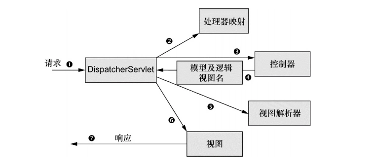

# 执行流程




​	在请求离开浏览器时， 会带有用户所请求内容的信息， 至少会包含请求的URL。 但是还可能带有其他的信息， 例如用户提交的表单信息。
​	请求旅程的第一站是Spring的DispatcherServlet。 与大多数基于Java的Web框架一样， Spring MVC所有的请求都会通过一个前端控制器（front controller） Servlet。 前端控制器是常用的Web应用程序模式， 在这里一个单实例的Servlet将请求委托给应用程序的其他组件来执行实际的处理。 在Spring MVC中， DispatcherServlet就是前端控制器。
​	DispatcherServlet的任务是将请求发送给Spring MVC控制器（controller） 。 控制器是一个用于处理请求的Spring组件。 在典型的应用程序中可能会有多个控制器， DispatcherServlet需要知道应该将请求发送给哪个控制器。 所以DispatcherServlet以会查询一个或多个处理器映射（handler mapping） 来确定请求的下一站在哪里。 处理器映射会根据请求所携带的URL信息来进行决策。
​	一旦选择了合适的控制器， DispatcherServlet会将请求发送给选中的控制器 。 到了控制器， 请求会卸下其负载（用户提交的信息） 并耐心等待控制器处理这些信息。 （实际上， 设计良好的控制器本身只处理很少甚至不处理工作， 而是将业务逻辑委托给一个或多个服务对象进行处理。 ）
​	控制器在完成逻辑处理后， 通常会产生一些信息， 这些信息需要返回给用户并在浏览器上显示。 这些信息被称为模型（model） 。 不过仅仅给用户返回原始的信息是不够的——这些信息需要以用户友好的方式进行格式化， 一般会是HTML。 所以， 信息需要发送给一个视图（view） ，通常会是JSP。
​	控制器所做的最后一件事就是将模型数据打包， 并且标示出用于渲染输出的视图名。 它接下来会将请求连同模型和视图名发送回DispatcherServlet 。
​	这样， 控制器就不会与特定的视图相耦合， 传递给DispatcherServlet的视图名并不直接表示某个特定的JSP。 实际上， 它甚至并不能确这样， 控制器就不会与特定的视图相耦合， 传递给DispatcherServlet的视图名并不直接表示某个特定的JSP。 实际上， 它甚至并不能确定视图就是JSP。 相反， 它仅仅传递了一个逻辑名称， 这个名字将会用来查找产生结果的真正视图。 DispatcherServlet将会使用视图解析器（view resolver） 来将逻辑视图名匹配为一个特定的视图实现， 它可能是也可能不是JSP。
​	既然DispatcherServlet已经知道由哪个视图渲染结果， 那请求的任务基本上也就完成了。 它的最后一站是视图的实现（可能是JSP） ，在这里它交付模型数据。 请求的任务就完成了。 视图将使用模型数据渲染输出， 这个输出会通过响应对象传递给客户端（不会像听上去那样硬编码） 。
​	可以看到， 请求要经过很多的步骤， 最终才能形成返回给客户端的响应。


## 核心流程doDispatch

代码基于springmvc 5.1.5

[Spring MVC之适配器的获取及执行(RequestMappingHandlerAdapter)](https://www.cnblogs.com/haoerlv/p/8692988.html)

[SpringMVC源码分析系列](https://www.cnblogs.com/fangjian0423/p/springMVC-directory-summary.html)

```java
//DispatcherServlet
protected void doDispatch(HttpServletRequest request, HttpServletResponse response) throws Exception {
   HttpServletRequest processedRequest = request;
   HandlerExecutionChain mappedHandler = null;
   boolean multipartRequestParsed = false;

   WebAsyncManager asyncManager = WebAsyncUtils.getAsyncManager(request);

   try {
      ModelAndView mv = null;
      Exception dispatchException = null;

      try {
         processedRequest = checkMultipart(request);
         multipartRequestParsed = (processedRequest != request);

         // 遍历handlerMappings，找到url对象的控制器方法
         // LinkedMultiValueMap 其实就是一个LinkedHashMap，url作为key
         mappedHandler = getHandler(processedRequest);
         if (mappedHandler == null) {
            noHandlerFound(processedRequest, response);
            return;
         }

         // 获取适配器
         HandlerAdapter ha = getHandlerAdapter(mappedHandler.getHandler());

         // Process last-modified header, if supported by the handler.
         String method = request.getMethod();
         boolean isGet = "GET".equals(method);
         if (isGet || "HEAD".equals(method)) {
            long lastModified = ha.getLastModified(request, mappedHandler.getHandler());
            if (new ServletWebRequest(request, response).checkNotModified(lastModified) && isGet) {
               return;
            }
         }

         //执行拦截器的preHandle方法
         //比如用来处理权限判定
         if (!mappedHandler.applyPreHandle(processedRequest, response)) {
            return;
         }

         //实际调用处理程序，controller
         //如果是被@ResponseBody注解修饰会使用消息转换器处理，返回null，不再渲染视图
         mv = ha.handle(processedRequest, response, mappedHandler.getHandler());

         if (asyncManager.isConcurrentHandlingStarted()) {
            return;
         }

         applyDefaultViewName(processedRequest, mv);
          //执行拦截器的postHandle方法        
         mappedHandler.applyPostHandle(processedRequest, response, mv);
      }
      catch (Exception ex) {
         dispatchException = ex;
      }
      catch (Throwable err) {
         // As of 4.3, we're processing Errors thrown from handler methods as well,
         // making them available for @ExceptionHandler methods and other scenarios.
         dispatchException = new NestedServletException("Handler dispatch failed", err);
      }
       //渲染视图，
      processDispatchResult(processedRequest, response, mappedHandler, mv, dispatchException);
   }
   catch (Exception ex) {
      triggerAfterCompletion(processedRequest, response, mappedHandler, ex);
   }
   catch (Throwable err) {
      triggerAfterCompletion(processedRequest, response, mappedHandler,
            new NestedServletException("Handler processing failed", err));
   }
   finally {
      if (asyncManager.isConcurrentHandlingStarted()) {
         // Instead of postHandle and afterCompletion
         if (mappedHandler != null) {
            mappedHandler.applyAfterConcurrentHandlingStarted(processedRequest, response);
         }
      }
      else {
         // Clean up any resources used by a multipart request.
         if (multipartRequestParsed) {
            cleanupMultipart(processedRequest);
         }
      }
   }
}
```


## 实际调用处理程序

```java
/**
 * Invoke the {@link RequestMapping} handler method preparing a {@link ModelAndView}
 * if view resolution is required.
 * @since 4.2
 * @see #createInvocableHandlerMethod(HandlerMethod)
 */
@Nullable
//RequestMappingHandlerAdapter.java
protected ModelAndView invokeHandlerMethod(HttpServletRequest request,
      HttpServletResponse response, HandlerMethod handlerMethod) throws Exception {

   ServletWebRequest webRequest = new ServletWebRequest(request, response);
   try {
      WebDataBinderFactory binderFactory = getDataBinderFactory(handlerMethod);
      ModelFactory modelFactory = getModelFactory(handlerMethod, binderFactory);

      ServletInvocableHandlerMethod invocableMethod = createInvocableHandlerMethod(handlerMethod);
      if (this.argumentResolvers != null) {
         invocableMethod.setHandlerMethodArgumentResolvers(this.argumentResolvers);
      }
      if (this.returnValueHandlers != null) {
         invocableMethod.setHandlerMethodReturnValueHandlers(this.returnValueHandlers);
      }
      invocableMethod.setDataBinderFactory(binderFactory);
      invocableMethod.setParameterNameDiscoverer(this.parameterNameDiscoverer);

      ModelAndViewContainer mavContainer = new ModelAndViewContainer();
      mavContainer.addAllAttributes(RequestContextUtils.getInputFlashMap(request));
      modelFactory.initModel(webRequest, mavContainer, invocableMethod);
      mavContainer.setIgnoreDefaultModelOnRedirect(this.ignoreDefaultModelOnRedirect);

      AsyncWebRequest asyncWebRequest = WebAsyncUtils.createAsyncWebRequest(request, response);
      asyncWebRequest.setTimeout(this.asyncRequestTimeout);

      WebAsyncManager asyncManager = WebAsyncUtils.getAsyncManager(request);
      asyncManager.setTaskExecutor(this.taskExecutor);
      asyncManager.setAsyncWebRequest(asyncWebRequest);
      asyncManager.registerCallableInterceptors(this.callableInterceptors);
      asyncManager.registerDeferredResultInterceptors(this.deferredResultInterceptors);

      if (asyncManager.hasConcurrentResult()) {
         Object result = asyncManager.getConcurrentResult();
         mavContainer = (ModelAndViewContainer) asyncManager.getConcurrentResultContext()[0];
         asyncManager.clearConcurrentResult();
         LogFormatUtils.traceDebug(logger, traceOn -> {
            String formatted = LogFormatUtils.formatValue(result, !traceOn);
            return "Resume with async result [" + formatted + "]";
         });
         invocableMethod = invocableMethod.wrapConcurrentResult(result);
      }

       //继续执行方法
      invocableMethod.invokeAndHandle(webRequest, mavContainer);
      if (asyncManager.isConcurrentHandlingStarted()) {
         return null;
      }

      return getModelAndView(mavContainer, modelFactory, webRequest);
   }
   finally {
      webRequest.requestCompleted();
   }
}
```


### 执行方法封装结果

```java
/**
 * Invoke the method and handle the return value through one of the
 * configured {@link HandlerMethodReturnValueHandler HandlerMethodReturnValueHandlers}.
 * @param webRequest the current request
 * @param mavContainer the ModelAndViewContainer for this request
 * @param providedArgs "given" arguments matched by type (not resolved)
 */
public void invokeAndHandle(ServletWebRequest webRequest, ModelAndViewContainer mavContainer,
      Object... providedArgs) throws Exception {
   //执行方法，获取返回值
   Object returnValue = invokeForRequest(webRequest, mavContainer, providedArgs);
   setResponseStatus(webRequest);

   if (returnValue == null) {
      if (isRequestNotModified(webRequest) || getResponseStatus() != null || mavContainer.isRequestHandled()) {
         mavContainer.setRequestHandled(true);
         return;
      }
   }
   else if (StringUtils.hasText(getResponseStatusReason())) {
      mavContainer.setRequestHandled(true);
      return;
   }

   mavContainer.setRequestHandled(false);
   Assert.state(this.returnValueHandlers != null, "No return value handlers");
   try {
      //处理返回值 ，封装结果集
      this.returnValueHandlers.handleReturnValue(
            returnValue, getReturnValueType(returnValue), mavContainer, webRequest);
   }
   catch (Exception ex) {
      if (logger.isTraceEnabled()) {
         logger.trace(formatErrorForReturnValue(returnValue), ex);
      }
      throw ex;
   }
}
```


#### 处理结果集

```java
@Override
public void handleReturnValue(@Nullable Object returnValue, MethodParameter returnType,
      ModelAndViewContainer mavContainer, NativeWebRequest webRequest) throws Exception {
   //找到结果解析器
   HandlerMethodReturnValueHandler handler = selectHandler(returnValue, returnType);
   if (handler == null) {
      throw new IllegalArgumentException("Unknown return value type: " + returnType.getParameterType().getName());
   }
    //处理结果集
   handler.handleReturnValue(returnValue, returnType, mavContainer, webRequest);
}
```


##### 找到结果解析器

```java
//HandlerMethodReturnValueHandlerComposite.java
@Nullable
private HandlerMethodReturnValueHandler selectHandler(@Nullable Object value, MethodParameter returnType) {
   boolean isAsyncValue = isAsyncReturnValue(value, returnType);
   for (HandlerMethodReturnValueHandler handler : this.returnValueHandlers) {
      if (isAsyncValue && !(handler instanceof AsyncHandlerMethodReturnValueHandler)) {
         continue;
      }
      if (handler.supportsReturnType(returnType)) {
         return handler;
      }
   }
   return null;
}

//RequestResponseBodyMethodProcessor.java
@Override
public boolean supportsReturnType(MethodParameter returnType) {
    //ResponseBody注解修饰的方法
    return (AnnotatedElementUtils.hasAnnotation(returnType.getContainingClass(), ResponseBody.class) ||
            returnType.hasMethodAnnotation(ResponseBody.class));
}
```


##### 处理结果集

```java
//RequestResponseBodyMethodProcessor.java
@Override
public void handleReturnValue(@Nullable Object returnValue, MethodParameter returnType,
      ModelAndViewContainer mavContainer, NativeWebRequest webRequest)
      throws IOException, HttpMediaTypeNotAcceptableException, HttpMessageNotWritableException {

   mavContainer.setRequestHandled(true);
   ServletServerHttpRequest inputMessage = createInputMessage(webRequest);
   ServletServerHttpResponse outputMessage = createOutputMessage(webRequest);

   //找到合适的消息转换器
   //MappingJacksonHttpMessageConverter
   writeWithMessageConverters(returnValue, returnType, inputMessage, outputMessage);
}
```


# 过滤器


# 监听器