[Reactor 3 参考文档](https://htmlpreview.github.io/?https://github.com/get-set/reactor-core/blob/master-zh/src/docs/index.html)

[响应式Spring的道法术器](https://blog.csdn.net/get_set/category_9272724.html)

[处理Empty Mono的方法](https://cloud.tencent.com/developer/article/1421359)

为什么webflux没能够普及。

1. reactive 编程难度较高，编码时你需要时刻注意防止自己的程序阻塞，不然会导致非常严重的后果
2. 技术还支持不够完善比如 JDBC 目前各种数据库的驱动对于异步编程本身支持较弱，要支持 reactive 编程可能还需要一个很长的过程
3. 如果你使用 reactive 编程像 spring 事务管理以及 aop 那一套模式全都得重新换
4. 传统的编程方式已经可以满足很多公司，及业务场景的需求，可能对于 reactive 编程需求并不会那么高

[Spring 5 WebFlux和JDBC：阻止还是不阻止](<https://dzone.com/articles/spring-5-webflux-and-jdbc-to-block-or-not-to-block>)

# Spring WebFlux 概述

## 介绍

**Spring MVC 构建于 Servlet API 之上，使用的是同步阻塞式 I/O 模型，什么是同步阻塞式 I/O 模型呢？就是说，每一个请求对应一个线程去处理。**

**Spring WebFlux 是一个异步非阻塞式的 Web 框架，它能够充分利用多核 CPU 的硬件资源去处理大量的并发请求。**

WebFlux 内部使用的是响应式编程（Reactive Programming），以 Reactor 库为基础, 基于异步和事件驱动，可以让我们在不扩充硬件资源的前提下，提升系统的吞吐量和伸缩性。

**WebFlux 并不能使接口的响应时间缩短，它仅仅能够提升吞吐量和伸缩性**。

## WebFlux 应用场景

上面说到了， Spring WebFlux 是一个异步非阻塞式的 Web 框架，所以，它特别适合应用在 IO 密集型的服务中，比如微服务网关这样的应用中。

> PS: IO 密集型包括：**磁盘IO密集型**, **网络IO密集型**，微服务网关就属于网络 IO 密集型，使用异步非阻塞式编程模型，能够显著地提升网关对下游服务转发的吞吐量。

spring cloud gateway

## WebFlux 还是 Spring MVC?

首先你需要明确一点就是：**WebFlux 不是 Spring MVC 的替代方案**！，虽然 WebFlux  也可以被运行在 Servlet 容器上（需是 Servlet 3.1+ 以上的容器），但是 WebFlux 主要还是应用在异步非阻塞编程模型，而  Spring MVC 是同步阻塞的，如果你目前在 Spring MVC 框架中大量使用非同步方案，那么，WebFlux  才是你想要的，否则，使用 Spring MVC 才是你的首选。

在微服务架构中，Spring MVC 和 WebFlux 可以混合使用，比如已经提到的，对于那些 IO 密集型服务(如网关)，我们就可以使用 WebFlux 来实现。


从上图中，可以一眼看出 Spring MVC 和 Spring WebFlux 的相同点和不同点：

**相同点：**

- 都可以使用 Spring MVC 注解，如 `@Controller`, 方便我们在两个 Web 框架中自由转换；
- 均可以使用 Tomcat, Jetty, Undertow Servlet 容器（Servlet 3.1+）；
- ...

**注意点：**

- Spring MVC 因为是使用的同步阻塞式，更方便开发人员编写功能代码，Debug 测试等，一般来说，如果 Spring MVC 能够满足的场景，就尽量不要用 WebFlux;
- WebFlux 默认情况下使用 Netty 作为服务器;
- WebFlux 不支持 MySql;

## DispatcherHandler

```JAVA
public class DispatcherHandler implements WebHandler, ApplicationContextAware {
    @Override
    //ServerWebExchange 对象中放置每一次 HTTP 请求响应信息，包括参数等
    public Mono<Void> handle(ServerWebExchange exchange) {
       if (this.handlerMappings == null) {
           // 判断整个接口映射 mappings 集合是否为空，空则创建一个 Not Found 的错误；
          return createNotFoundError();
       }
       return Flux.fromIterable(this.handlerMappings)
             //根据具体的请求地址获取对应的 `handlerMapping`;
             .concatMap(mapping -> mapping.getHandler(exchange))
             .next()
             .switchIfEmpty(createNotFoundError())
             //调用具体业务方法，也就是我们定义的接口方法；
             .flatMap(handler -> invokeHandler(exchange, handler))
             // 处理返回的结果；
             .flatMap(result -> handleResult(exchange, result));
    }
}
```

## 简单使用

依赖

```xml
<dependency>
    <groupId>org.springframework.boot</groupId>
    <artifactId>spring-boot-starter-webflux</artifactId>
</dependency>
```

配置文件

```yml
server:
  port: 8100

spring:
  application:
    name: webflux-test
  # jackson时间格式化
  jackson:
    time-zone: GMT+8
    date-format: yyyy-MM-dd HH:mm:ss
    default-property-inclusion: always
  webflux:
    base-path: /webflux
```

接口

```java
@RestController
@RequestMapping("/test")
public class TestController {

    @GetMapping("/hello")
    public String hello() {
        return "Hello, WebFlux !";
    }

    @PostMapping("/user")
    public Mono<User> getUser() {
        User user = new User();
        user.setName("lcm");
        user.setDesc("呵呵");
        return Mono.just(user);
    }

}
```

这里注意，`User` 对象是通过 `Mono` 对象包装的，你可能会问，为啥不直接返回呢？

在 WebFlux 中，`Mono` 是非阻塞的写法，只有这样，你才能发挥 WebFlux **非阻塞 + 异步**的特性。

> 补充：在 WebFlux 中，除了 `Mono` 外，还有一个 `Flux`，这哥俩均能充当响应式编程中发布者的角色，不同的是：
>
> - `Mono`：返回 0 或 1 个元素，即单个对象。
> - `Flux`：返回 N 个元素，即 List 列表对象。


# 响应式编程

## 什么是响应式编程？

响应式编程（reactive programming）是一种基于数据流（data stream）和变化传递（propagation of change）的声明式（declarative）的编程范式。

响应式编程的“变化传递”就相当于果汁流水线的管道；在入口放进橙子，出来的就是橙汁；放西瓜，出来的就是西瓜汁，橙子和西瓜、以及机器中的果肉果汁以及残渣等，都是流动的“数据流”；管道的图纸是用“声明式”的语言表示的。

这种编程范式如何让Web应用更加“reactive”呢？

我们设想这样一种场景，我们从底层数据库驱动，经过持久层、服务层、MVC层中的model，到用户的前端界面的元素，全部都采用声明式的编程范式，从而搭建一条能够传递变化的管道，这样我们只要更新一下数据库中的数据，用户的界面上就相应的发生变化，岂不美哉？尤其重要的是，一处发生变化，我们不需要各种命令式的调用来传递这种变化，而是由搭建好的“流水线”自动传递。

这种场景用在哪呢？比如一个日志监控系统，我们的前端页面将不再需要通过“命令式”的轮询的方式不断向服务器请求数据然后进行更新，而是在建立好通道之后，数据流从系统源源不断流向页面，从而展现实时的指标变化曲线；再比如一个社交平台，朋友的动态、点赞和留言不是手动刷出来的，而是当后台数据变化的时候自动体现到界面上的。

### 变化传递（propagation of change）

为什么说电子表格软件是“响应式典范”呢，因为“单价”和“数量”的任何变动，都会被引用（“监听”）它的单元格实时更新计算结果，如果还有图表或数据透视图引用了这块数据，那么也会相应变化，做到了实时响应。变化的时候甚至还有动画效果，用户体验一级棒！

这是响应式的核心特点之一：变化传递（propagation of change）。一个单元格变化之后，会像多米诺骨牌一样，导致直接和间接引用它的其他单元格均发生相应变化。

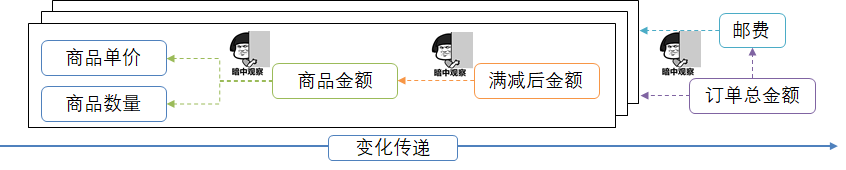

看到这里，你可能会说，“切~ 不就是算付款金额吗，购物网站上都有这个最基础不过的功能啊~”，这就“响应式”啦？但凡一个与用户交互的系统都得“响应”用户交互啊~


### 数据流（data stream）

这些数据/事件在响应式编程里会以数据流的形式发出。

我们再观察一下购物车，这里有若干商品，小明每次往购物车里添加或移除一种商品，或调整商品的购买数量，这种事件都会像过电一样流过这由公式串起来的多米诺骨牌一次。这一次一次的操作事件连起来就是一串数据流（data stream），如果我们能够及时对数据流的每一个事件做出响应，会有效提高系统的响应水平。这是响应式的另一个核心特点：基于数据流（data stream）。

如下图是小明选购商品的过程，为了既不超预算，又能省邮费，有时加有时减：


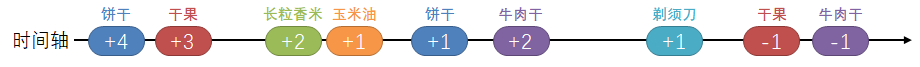

### 声明式（declarative）

这是一种“声明式（declarative）”的编程范式。通过四个串起来的map调用，我们先声明好了对于数据流“将会”进行什么样的处理，当有数据流过来时，就会按照声明好的处理流程逐个进行处理。

比如对于第一个map操作：

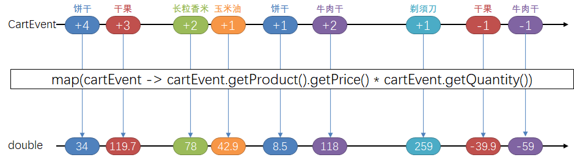

声明式编程范式的威力在于以不变应万变。无论到来的元素是什么，计算逻辑是不变的，从而形成了一种对计算逻辑的“绑定”。


## Reactive Streams规范

### Reactive Streams接口

上面提到Reactive Streams规范定义了一套接口，具体如下：

1. Publisher
2. Subscriber
3. Subscription
4. Processor

看接口的名称，我们发现这个不是发布/订阅模式吗？难道这个玩意和MQ实现的功能类似？我们知道RabbitMQ采用发布订阅模式来实现消息的生产与消费。毕竟MQ是一个中间件，  Reactive Streams是一个编程范式，本质上是不一样的。我们来看看四个接口的方法。

**Publisher**

Publisher接口声明如下：

```java
public interface Publisher<T> {
    public void subscribe(Subscriber<? super T> s);
}
```

Publisher作为信息的发布者，规范中并未定义发布信息的方法，而是只定义一个subscribe方法，用来将发布者与订阅者绑定起来，注意这里可以有0至多个订阅者。

**Subscriber**

Subscriber接口声明如下：

```java
public interface Subscriber<T> {
    public void onSubscribe(Subscription s);
    public void onNext(T t);
    public void onError(Throwable t);
    public void onComplete();
}
```

Subscriber接口有四个方法。对于`onSubscribe`方法，上面提到Publisher接口的subscribe方法，如果订阅者订阅成功，发布者用Subscription异步调用订阅者的onSubscribe方法。 如果尝试订阅失败，则使用调用订阅者的onError()方法，并抛出异常，发布者/订阅者交互结束。

发布者/订阅者建立关系后，发布者通过不断调用订阅者的`onNext`方法向订阅者发出最多n个数据。如果数据全部发完，则会调用`onComplete`告知订阅者流已经发完；如果有错误发生，则通过`onError`发出错误数据，同样也会终止流。

我们发现`onSubscribe`方法参数是`Subscription`，这也是一个接口，如下。

**Subscription**

Subscription接口声明如下：

```java
public interface Subscription {
    public void request(long n);
    public void cancel();
}
```

Subscription在发布订阅过程中充当什么作用呢？当发布者与订阅者绑定后，需要一个中间人来维护这个关系，Subscription就是充当这个角色。在规范中，有如下要求：

> A Subscriber MUST signal demand via Subscription.request(long n) to receive onNext signals.

从上面的话，我们了解到，当订阅者想要处理数据时，那么需要调用`Subscription.request(long n)`向发布者发送多个数据的请求，然后发布者会调用订阅者的 `onNext`方法来处理数据。对于`cancel()`方法，规范有以下描述：

> A Subscriber MUST call Subscription.cancel() if the Subscription is no longer needed.

订阅者可以通过调用`Subscription.cancel()`方法来取消订阅。一旦订阅被取消，发布者/订阅者交互结束。

**Processor**

有没有一个东西既是发布者又是消费者呢？规范也为我们考虑到了，就是Processor接口，如下所示：

```java
public interface Processor<T, R> extends Subscriber<T>, Publisher<R> {
}
```

**Backpressure**

上面提到Reactive Streams实现库需要有非阻塞背压（Backpressure）功能，这是个什么东西呢？由于Reactive  streams  采用的是生产者/消费者模式，如果生产者产生的数据量太大，消费者没有能力去及时消费，会出现什么情况呢？大量的数据没被处理，而生产者感知不到，系统就崩了。所以在Reactive  streams规范中，消费者通过`Subscription.request(long n)`来告诉生产者，一次可以消费多少数据。这种订阅者能够向上游反馈流量需求的机制被称为背压（Backpressure）。后面分析具体实现的时候再仔细分析。

### Flow相关实现

上面Reactive Streams规范只是定义了接口，对于开发者来说，有没有生产级别的实现呢？在JDK9中引入了Flow这个类，里面copy了上面Reactive Streams规范的四个接口，放在[java.util.concurrent.Flow](https://docs.oracle.com/en/java/javase/11/docs/api/java.base/java/util/concurrent/Flow.html)这个类里面，同时提供了一个SubmissionPublisher发布者参考实现。下面我们体验下SubmissionPublisher。

首先我们新建一个订阅者，实现Flow.Subscriber接口，代码如下：

```java
public class MySubscriber implements Flow.Subscriber<Employee> {
  private Flow.Subscription subscription;

  private int counter = 0;

  
  public void onSubscribe(Flow.Subscription subscription) {
    System.out.println("Subscribed");
    this.subscription = subscription;
    subscription.request(1);
    System.out.println("onSubscribe requested 1 item");
  }

  
  public void onNext(Employee item) {
    try {
      Thread.sleep(2000);
    } catch (InterruptedException e) {
      e.printStackTrace();
    }
    System.out.println("Processing Employee "+item);
    counter++;
    this.subscription.request(1);
  }

  
  public void onError(Throwable e) {
    System.out.println("Some error happened");
    e.printStackTrace();
  }

  
  public void onComplete() {
    System.out.println("All Processing Done");
  }

  public int getCounter() {
    return counter;
  }

}
```

在`MySubscriber`中，实现了接口的四个方法，在`onSubscribe`方法里面，我们调用`subscription.request(1)`来向上游请求一个数据。在`onNext`方法里面，我们写具体的处理逻辑，数据处理完，依然调用`subscription.request(1)`来向上游请求一个数据，上游就会源源不断地发送数据。

接下来我们下一个单元测试，利用SubmissionPublisher来实现，如下：

```java
/**
 * 发布订阅模式
 *
 * @throws InterruptedException
 */
public void PsTest() throws InterruptedException {
  SubmissionPublisher<Employee> publisher = new SubmissionPublisher<>();
  MySubscriber subscriber = new MySubscriber();
  MySubscriber subscriber2 = new MySubscriber();
  publisher.subscribe(subscriber);
  publisher.subscribe(subscriber2);
  List<Employee> emps = generateEmps();
  // Publish items
  System.out.println("Publishing Items to Subscriber");
  emps.forEach(publisher::submit);

  // logic to wait till processing of all messages are over
  while (emps.size() != subscriber.getCounter()) {
    Thread.sleep(10);
  }
  // close the Publisher
  publisher.close();

  System.out.println("Exited");
}
```

上面代码中，我们创建了SubmissionPublisher实例，并且创建了两个订阅者。调用
SubmissionPublisher的subscribe方法让发布者与订阅者关联，在其内部是维护了节点为BufferedSubscription的链表，接着调用SubmissionPublisher的submit方法来发送数据，当订阅者处理完数据后，就可以调用close  方法关闭发布者了。

上面使用体验相对于Reactor框架来说，没有Reactor框架方便，因为Reactor框架比较完整实现了Reactive  Streams，而且是流式编程方式，使用SubmissionPublisher相对来说不是那么方便，这个也是OPENJDK为Reactive  Streams提供的参考实现吧，真正的生产环境使用Reactor比较稳。

## Reactor


Reactor与Spring是兄弟项目，侧重于Server端的响应式编程，主要 artifact 是 reactor-core，这是一个基于 Java 8 的实现了响应式流规范 （Reactive Streams specification）的响应式库。

### Flux与Mono

Reactor中的发布者（Publisher）由Flux和Mono两个类定义，它们都提供了丰富的操作符（operator）。一个Flux对象代表一个包含0..N个元素的响应式序列，而一个Mono对象代表一个包含零/一个（0..1）元素的结果。

既然是“数据流”的发布者，Flux和Mono都可以发出三种“数据信号”：元素值、错误信号、完成信号，错误信号和完成信号都是终止信号，完成信号用于告知下游订阅者该数据流正常结束，错误信号终止数据流的同时将错误传递给下游订阅者。

下图所示就是一个Flux类型的数据流，黑色箭头是时间轴。它连续发出“1” - “6”共6个元素值，以及一个完成信号（图中⑥后边的加粗竖线来表示），完成信号告知订阅者数据流已经结束。

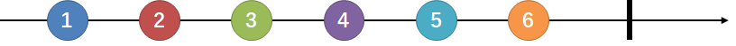

下图所示是一个Mono类型的数据流，它发出一个元素值后，又发出一个完成信号。

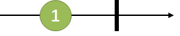

    既然Flux具有发布一个数据元素的能力，为什么还要专门定义一个Mono类呢？举个例子，一个HTTP请求产生一个响应，所以对其进行“count”操作是没有多大意义的。表示这样一个结果的话，应该用Mono<HttpResponse>而不是 Flux<HttpResponse>，对于的操作通常只用于处理 0/1 个元素。它们从语义上就原生包含着元素个数的信息，从而避免了对Mono对象进行多元素场景下的处理。
    
    有些操作可以改变基数，从而需要切换类型。比如，count操作用于Flux，但是操作返回的结果是Mono<Long>。

#### 创建

Flux和Mono提供了多种创建数据流的方法，`just`就是一种比较直接的声明数据流的方式，其参数就是数据元素。

对于Flux，还可以通过如下方式声明（分别基于数组、集合和Stream生成）：

```java
Flux<Integer> flux = Flux.just(1, 2, 3, 4, 5, 6);
Mono<Integer> mono = Mono.just(1);

//基于数组
Integer[] array = new Integer[]{1,2,3,4,5,6};
Flux<Integer> flux1 = Flux.fromArray(array);
//基于集合
List<Integer> list = Arrays.asList(array);
Flux<Integer> flux2 = Flux.fromIterable(list);
//基于流
Stream<Integer> stream = list.stream();
Flux<Integer> flux3 = Flux.fromStream(stream);

// 只有完成信号的空数据流
Flux.just();
Flux.empty();
Mono.empty();
Mono.justOrEmpty(Optional.empty());
// 只有错误信号的数据流
Flux.error(new Exception("some error"));
Mono.error(new Exception("some error"));
```

#### 订阅

数据流有了，假设我们想把每个数据元素原封不动地打印出来：

```java
flux.subscribe(System.out::print);
```

`subscribe`方法中的lambda表达式作用在了每一个数据元素上。此外，Flux和Mono还提供了多个`subscribe`方法的变体：

```java
// 订阅并触发数据流
subscribe(); 
// 订阅并指定对正常数据元素如何处理
subscribe(Consumer<? super T> consumer); 
// 订阅并定义对正常数据元素和错误信号的处理
subscribe(Consumer<? super T> consumer,
          Consumer<? super Throwable> errorConsumer); 
// 订阅并定义对正常数据元素、错误信号和完成信号的处理
subscribe(Consumer<? super T> consumer,
          Consumer<? super Throwable> errorConsumer,
          Runnable completeConsumer); 
// 订阅并定义对正常数据元素、错误信号和完成信号的处理，以及订阅发生时的处理逻辑
subscribe(Consumer<? super T> consumer,
          Consumer<? super Throwable> errorConsumer,
          Runnable completeConsumer,
          Consumer<? super Subscription> subscriptionConsumer); 
```

#### 操作符

在 Reactor 中，操作符（operator）就像装配线中的工位（操作员或装配机器人）。每一个操作符 对 `Publisher` 进行相应的处理，然后将 `Publisher` 包装为一个新的 `Publisher`。就像一个链条， 数据源自第一个 `Publisher`，然后顺链条而下，在每个环节进行相应的处理。最终，一个订阅者 (`Subscriber`）终结这个过程。请记住，在订阅者（`Subscriber`）订阅（subscribe）到一个 发布者（`Publisher`）之前，什么都不会发生。

虽然响应式流规范（Reactive Streams specification）没有规定任何操作符， 类似 Reactor 这样的响应式库所带来的最大附加价值之一就是提供丰富的操作符。包括基础的转换操作， 到过滤操作，甚至复杂的编排和错误处理操作。

##### 1）map - 元素映射为新元素

map操作可以将数据元素进行转换/映射，得到一个新元素。

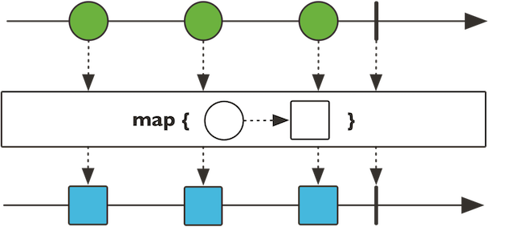
```java
public final <V> Flux<V> map(Function<? super T,? extends V> mapper)
public final <R> Mono<R> map(Function<? super T, ? extends R> mapper) 

    StepVerifier.create(Flux.range(1, 6)    // 1
            .map(i -> i * i))   // 2
            .expectNext(1, 4, 9, 16, 25, 36)    //3
            .expectComplete();  // 4
```

1. `Flux.range(1, 6)`用于生成从“1”开始的，自增为1的“6”个整型数据；
2. `map`接受lambda`i -> i * i`为参数，表示对每个数据进行平方；
3. 验证新的序列的数据；
4. `verifyComplete()`相当于`expectComplete().verify()`。

##### **2）flatMap -  元素映射为流**

`flatMap`操作可以将每个数据元素转换/映射为一个流，然后将这些流合并为一个大的数据流。

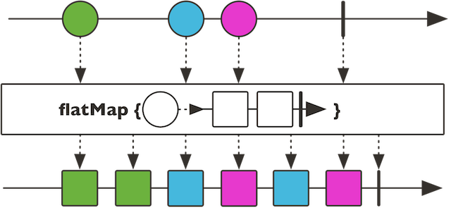

注意到，流的合并是异步的，先来先到，并非是严格按照原始序列的顺序（如图蓝色和红色方块是交叉的）。
```java
public final <R> Flux<R> flatMap(Function<? super T, ? extends Publisher<? extends R>> mapper)
public final <R> Mono<R> flatMap(Function<? super T, ? extends Mono<? extends R>> transformer) 
```
flatMap也是接收一个Function的函数式接口为参数，这个函数式的输入为一个T类型数据值，对于Flux来说输出可以是Flux和Mono，对于Mono来说输出只能是Mono。举例说明：

```java
StepVerifier.create(
    Flux.just("flux", "mono")
            .flatMap(s -> Flux.fromArray(s.split("\\s*"))   // 1
                    .delayElements(Duration.ofMillis(100))) // 2
            .doOnNext(System.out::print)) // 3
    .expectNextCount(8) // 4
    .verifyComplete();
```
1. 对于每一个字符串`s`，将其拆分为包含一个字符的字符串流；
2. 对每个元素延迟100ms；
3. 对每个元素进行打印（注`doOnNext`方法是“偷窥式”的方法，不会消费数据流）；
4. 验证是否发出了8个元素。

打印结果为`mfolnuox`，原因在于各个拆分后的小字符串都是间隔100ms发出的，因此会交叉。

flatMap通常用于每个元素又会引入数据流的情况，比如我们有一串url数据流，需要请求每个url并收集response数据。假设响应式的请求方法如下：

```java
Mono<HttpResponse> requestUrl(String url) {...}
```

而url数据流为一个Flux<String> urlFlux，那么为了得到所有的HttpResponse，就需要用到flatMap：

```java
urlFlux.flatMap(url -> requestUrl(url));
```

其返回内容为Flux<HttpResponse>类型的HttpResponse流。

##### 3）filter - 过滤

filter操作可以对数据元素进行筛选。

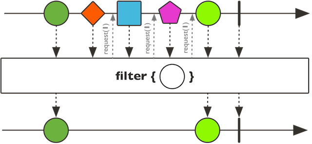
```java
public final Flux<T> filter(Predicate<? super T> tester)
public final Mono<T> filter(Predicate<? super T> tester) 
```
`filter`接受一个`Predicate`的函数式接口为参数，这个函数式的作用是进行判断并返回boolean。举例说明：
```java
StepVerifier.create(Flux.range(1, 6)
            .filter(i -> i % 2 == 1)    // 1
            .map(i -> i * i))
            .expectNext(1, 9, 25)   // 2
            .verifyComplete();
```
1. `filter`的lambda参数表示过滤操作将保留奇数；
2. 验证仅得到奇数的平方。

##### **4）zip - 一对一合并**

看到`zip`这个词可能会联想到拉链，它能够将多个流一对一的合并起来。zip有多个方法变体，我们介绍一个最常见的二合一的。

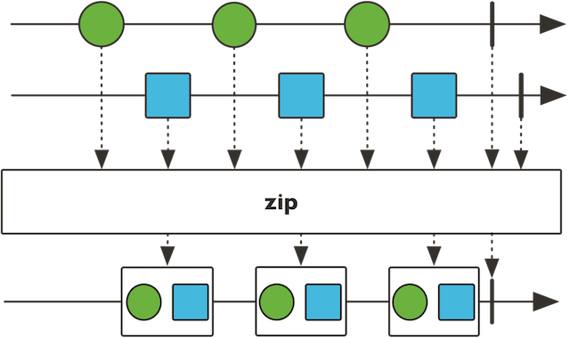

它对两个Flux/Mono流每次各取一个元素，合并为一个二元组（`Tuple2`）：
```java
public static <T1,T2> Flux<Tuple2<T1,T2>> zip(Publisher<? extends T1> source1,
                                          Publisher<? extends T2> source2)
public static <T1, T2> Mono<Tuple2<T1, T2>> zip(Mono<? extends T1> p1, Mono<? extends T2> p2) 
```
举个例子，假设我们有一个关于zip方法的说明：“Zip two sources together, that is to say wait for all the sources to emit one element and combine these elements once into a Tuple2.”，我们希望将这句话拆分为一个一个的单词并以每200ms一个的速度发出，除了前面flatMap的例子中用到的delayElements，可以如下操作：
```java
private Flux<String> getZipDescFlux() {
    String desc = "Zip two sources together, that is to say wait for all the sources to emit one element and combine these elements once into a Tuple2.";
    return Flux.fromArray(desc.split("\\s+"));  // 1
}

@Test
public void testSimpleOperators() throws InterruptedException {
    CountDownLatch countDownLatch = new CountDownLatch(1);  // 2
    Flux.zip(
            getZipDescFlux(),
            Flux.interval(Duration.ofMillis(200)))  // 3
            .subscribe(t -> System.out.println(t.getT1()), null, countDownLatch::countDown);    // 4
    countDownLatch.await(10, TimeUnit.SECONDS);     // 5
}
```
将英文说明用空格拆分为字符串流；
定义一个CountDownLatch，初始为1，则会等待执行1次countDown方法后结束，不使用它的话，测试方法所在的线程会直接返回而不会等待数据流发出完毕；
使用Flux.interval声明一个每200ms发出一个元素的long数据流；因为zip操作是一对一的，故而将其与字符串流zip之后，字符串流也将具有同样的速度；
zip之后的流中元素类型为Tuple2，使用getT1方法拿到字符串流的元素；定义完成信号的处理为countDown;
countDownLatch.await(10, TimeUnit.SECONDS)会等待countDown倒数至0，最多等待10秒钟。

除了`zip`静态方法之外，还有`zipWith`等非静态方法，效果与之类似：

```java
getZipDescFlux().zipWith(Flux.interval(Duration.ofMillis(200)))
```

在异步条件下，数据流的流速不同，使用zip能够一对一地将两个或多个数据流的元素对齐发出。

##### 5）更多

Reactor中提供了非常丰富的操作符，除了以上几个常见的，还有：

用于编程方式自定义生成数据流的create和generate等及其变体方法；
用于“无副作用的peek”场景的doOnNext、doOnError、doOncomplete、doOnSubscribe、doOnCancel等及其变体方法；
用于数据流转换的when、and/or、merge、concat、collect、count、repeat等及其变体方法；
用于过滤/拣选的take、first、last、sample、skip、limitRequest等及其变体方法；
用于错误处理的timeout、onErrorReturn、onErrorResume、doFinally、retryWhen等及其变体方法；
用于分批的window、buffer、group等及其变体方法；
用于线程调度的publishOn和subscribeOn方法。

使用这些操作符，你几乎可以搭建出能够进行任何业务需求的数据处理管道/流水线。

抱歉以上这些暂时不能一一介绍，更多详情请参考JavaDoc，在下一章我们还会回头对Reactor从更深层次进行系统的分析。

此外，也可阅读我翻译的Reactor参考文档，我会尽量及时更新翻译的内容。文档源码位于github，如有翻译不当，欢迎提交Pull-Request。

#### 调度器与线程模型

在Reactor中，对于多线程并发调度的处理变得异常简单。

在以往的多线程开发场景中，我们通常使用Executors工具类来创建线程池，通常有如下四种类型：

```java
newCachedThreadPool
//创建一个弹性大小缓存线程池，如果线程池长度超过处理需要，可灵活回收空闲线程，若无可回收，则新建线程；

newFixedThreadPool
//创建一个大小固定的线程池，可控制线程最大并发数，超出的线程会在队列中等待；

newScheduledThreadPool
//创建一个大小固定的线程池，支持定时及周期性的任务执行；

newSingleThreadExecutor
//创建一个单线程化的线程池，它只会用唯一的工作线程来执行任务，保证所有任务按照指定顺序(FIFO, LIFO, 优先级)执行。
```

此外，newWorkStealingPool还可以创建支持work-stealing的线程池。

说良心话，Java提供的Executors工具类使得我们对ExecutorService使用已经非常得心应手了。BUT~ Reactor让线程管理和任务调度更加“傻瓜”——调度器（Scheduler）帮助我们搞定这件事。Scheduler是一个拥有多个实现类的抽象接口。Schedulers类（按照通常的套路，最后为s的就是工具类咯）提供的静态方法可搭建以下几种线程执行环境：

```java
当前线程（Schedulers.immediate()）；
可重用的单线程（Schedulers.single()）。注意，这个方法对所有调用者都提供同一个线程来使用， 直到该调度器被废弃。如果你想使用独占的线程，请使用Schedulers.newSingle()；
弹性线程池（Schedulers.elastic()）。它根据需要创建一个线程池，重用空闲线程。线程池如果空闲时间过长 （默认为 60s）就会被废弃。对于 I/O 阻塞的场景比较适用。Schedulers.elastic()能够方便地给一个阻塞 的任务分配它自己的线程，从而不会妨碍其他任务和资源；
固定大小线程池（Schedulers.parallel()），所创建线程池的大小与CPU个数等同；
自定义线程池（Schedulers.fromExecutorService(ExecutorService)）基于自定义的ExecutorService创建 Scheduler（虽然不太建议，不过你也可以使用Executor来创建）。
```

Schedulers类已经预先创建了几种常用的线程池：使用single()、elastic()和parallel()方法可以分别使用内置的单线程、弹性线程池和固定大小线程池。如果想创建新的线程池，可以使用newSingle()、newElastic()和newParallel()方法。

Executors提供的几种线程池在Reactor中都支持：

    Schedulers.single()和Schedulers.newSingle()对应Executors.newSingleThreadExecutor()；
    Schedulers.elastic()和Schedulers.newElastic()对应Executors.newCachedThreadPool()；
    Schedulers.parallel()和Schedulers.newParallel()对应Executors.newFixedThreadPool()；
    下一章会介绍到，Schedulers提供的以上三种调度器底层都是基于ScheduledExecutorService的，因此都是支持任务定时和周期性执行的；
    Flux和Mono的调度操作符subscribeOn和publishOn支持work-stealing。


### 处理Empty Mono的方法

在[Reactor](https://projectreactor.io/)编程中有时候我们需要对empty `Mono<T>`做一些特定业务逻辑。下面看一段非reactor编程的代码：

```javascript
public void oldCheck(Token token) {
  if (token == null) {
    // business logic
    return;
  }
  if (token.isExpired) {
    // business logic
    return;
  }
  // business logic
  return;
}
```

如果让你改成reactor你也许会改成这样：

```javascript
public Mono<Void> badCheck(Mono<Token> tokenMono) {
  return tokenMono
      .flatMap(token -> {
        if (token == null) {
          // CAUTION: You will never be in here
          // business logic
          return Mono.empty();
        }
        if (token.isExpired) {
          // business logic
          return Mono.empty();
        }
        // business logic
        return Mono.empty();
      });
}
```

上面的示例代码里的注释已经写了`if (token == null) {}`的这个条件是永远成立的，这是因为当`Mono<Token>`是empty时，它是不会触发`flatMap`的。诸如`flatMap`的绝大部分Operator都依赖于`Publisher`（`Mono`和`Flux`都是`Pubisher`）推送数据（详情请看[javadoc](https://projectreactor.io/docs/core/release/api/index.html?overview-summary.html)），如果`Publisher`本身无数据可推送，那么就不会触发Operator。换句话说`flatMap`内部是不可能得到null的。

那么怎么做才可以？你可以使用Java 8的`Optional`来作为中间值：

```javascript
public Mono<Void> goodCheck(Mono<Token> tokenMono) {
  return tokenMono
      // Transform Mono<Token> to Mono<Optional<Token>>.
      // If Mono<Token> is empty, flatMap will not be triggered,
      // then we will get a empty Mono<Optional<Token>>
      .flatMap(token -> Mono.just(Optional.of(token)))
      // If Mono<Optional<Token>> is empty, provide an empty Optional<Token>,
      // then we will get a non-empty Mono<Optional<Token>> anyway
      .defaultIfEmpty(Optional.empty())
      // Since Mono<Optional<Token>> is not empty, flatMap will always be triggered.
      .flatMap(tokenOptional -> {
        if (!tokenOptional.isPresent()) {
          // business logic
          return Mono.empty();
        }
        Token token = tokenOptional.get();
        if (token.isExpired) {
          // business logic
          return Mono.empty();
        }
        // business logic
        return Mono.empty();
      });
}
```

除了`defaultIfEmpty`之外，Reactor还提供了`switchIfEmpty`、`repeatWhenEmpty`来处理empty `Mono`/`Flux`。

# Spring WebFlux

Spring WebFlux是随Spring 5推出的响应式Web框架。

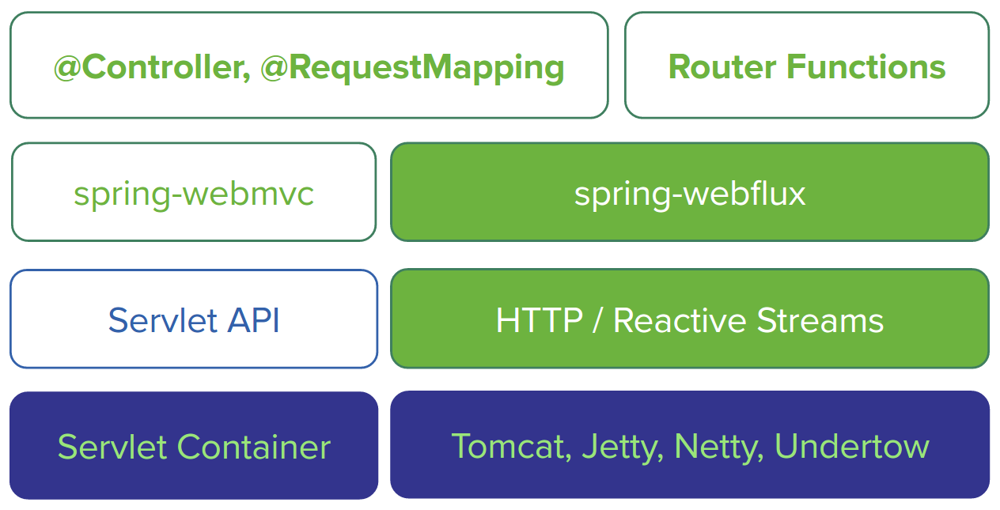

Spring提供了完整的支持响应式的服务端技术栈。

如上图所示，左侧为基于spring-webmvc的技术栈，右侧为基于spring-webflux的技术栈，

1. Spring WebFlux是基于响应式流的，因此可以用来建立异步的、非阻塞的、事件驱动的服务。它采用Reactor作为首选的响应式流的实现库，不过也提供了对RxJava的支持。
1. 由于响应式编程的特性，Spring WebFlux和Reactor底层需要支持异步的运行环境，比如Netty和Undertow；也可以运行在支持异步I/O的Servlet 3.1的容器之上，比如Tomcat（8.0.23及以上）和Jetty（9.0.4及以上）。
1. 从图的纵向上看，spring-webflux上层支持两种开发模式：
   1. 类似于Spring WebMVC的基于注解（@Controller、@RequestMapping）的开发模式；
   1. Java 8 lambda 风格的函数式开发模式。
1. Spring WebFlux也支持响应式的Websocket服务端开发。

## WebFlux的函数式开发模式

WebFlux提供了一套函数式接口，可以用来实现类似MVC的效果。我们先接触两个常用的。

再回头瞧一眼上边例子中我们用Controller定义定义对Request的处理逻辑的方式，主要有两个点：

1. 方法定义处理逻辑；
1. 然后用@RequestMapping注解定义好这个方法对什么样url进行响应。

在WebFlux的函数式开发模式中，我们用HandlerFunction和RouterFunction来实现上边这两点。

1. HandlerFunction相当于Controller中的具体处理方法，输入为请求，输出为装在Mono中的响应：
```java
Mono<T extends ServerResponse> handle(ServerRequest request);
```

2. RouterFunction，顾名思义，路由，相当于@RequestMapping，用来判断什么样的url映射到那个具体的HandlerFunction，输入为请求，输出为装在Mono里边的Handlerfunction：

```java
Mono<HandlerFunction<T>> route(ServerRequest request);
```

我们看到，在WebFlux中，请求和响应不再是WebMVC中的ServletRequest和ServletResponse，而是ServerRequest和ServerResponse。后者是在响应式编程中使用的接口，它们提供了对非阻塞和回压特性的支持，以及Http消息体与响应式类型Mono和Flux的转换方法。

路由


```java
@Configuration
public class RouterConfig {

    @Autowired
    private TimeHandler timeHandler;

    @Bean
    public RouterFunction<ServerResponse> timerRouter() {
        return route(GET("/webflux/function/time"), req -> timeHandler.getTime(req))
                .andRoute(GET("/webflux/function/date"), timeHandler::getDate);
    }

}
```

处理请求

```java
@Component
public class TimeHandler {

    public Mono<ServerResponse> getTime(ServerRequest serverRequest) {
        System.out.println("getTime");
        return ok()
                .contentType(MediaType.TEXT_PLAIN)
                .body(Mono.just("Now is " + new SimpleDateFormat("HH:mm:ss").format(new Date())), String.class);
    }

    public Mono<ServerResponse> getDate(ServerRequest serverRequest) {
        System.out.println("getDate");
        return ok()
                .contentType(MediaType.TEXT_PLAIN)
                .body(Mono.just("Today is " + new SimpleDateFormat("yyyy-MM-dd").format(new Date())), String.class);
    }

}
```

## 服务器推送

我们可能会遇到一些需要网页与服务器端保持连接（起码看上去是保持连接）的需求，比如类似微信网页版的聊天类应用，比如需要频繁更新页面数据的监控系统页面或股票看盘页面。我们通常采用如下几种技术：

1. 短轮询：利用ajax定期向服务器请求，无论数据是否更新立马返回数据，高并发情况下可能会对服务器和带宽造成压力；
1. 长轮询：利用comet不断向服务器发起请求，服务器将请求暂时挂起，直到有新的数据的时候才返回，相对短轮询减少了请求次数；
1. SSE：服务端推送（Server Send Event），在客户端发起一次请求后会保持该连接，服务器端基于该连接持续向客户端发送数据，从HTML5开始加入。
1. Websocket：这是也是一种保持连接的技术，并且是双向的，从HTML5开始加入，并非完全基于HTTP，适合于频繁和较大流量的双向通讯场景。


路由

```java
@Configuration
public class RouterConfig {

    @Autowired
    private TimeHandler timeHandler;

    @Bean
    public RouterFunction<ServerResponse> timerRouter() {
        return route(GET("/webflux/function/time"), req -> timeHandler.getTime(req))
                .andRoute(GET("/webflux/function/date"), timeHandler::getDate)
                .andRoute(GET("/webflux/function/times"), timeHandler::sendTimePerSec);
    }

}
```
每秒响应一次
```java
@Component
public class TimeHandler {

    public Mono<ServerResponse> sendTimePerSec(ServerRequest serverRequest) {
        return ok().contentType(MediaType.TEXT_EVENT_STREAM).body(
                Flux.interval(Duration.ofSeconds(1)).
                        map(l -> new SimpleDateFormat("HH:mm:ss").format(new Date())),
                String.class);
    }

}
```

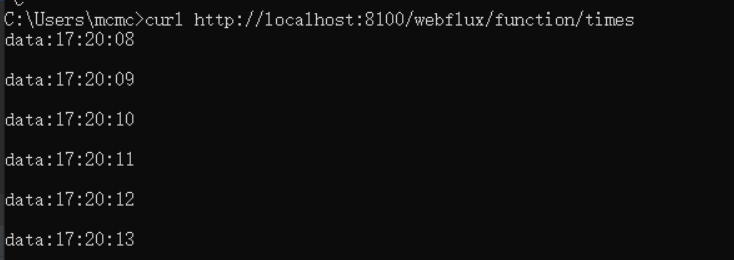