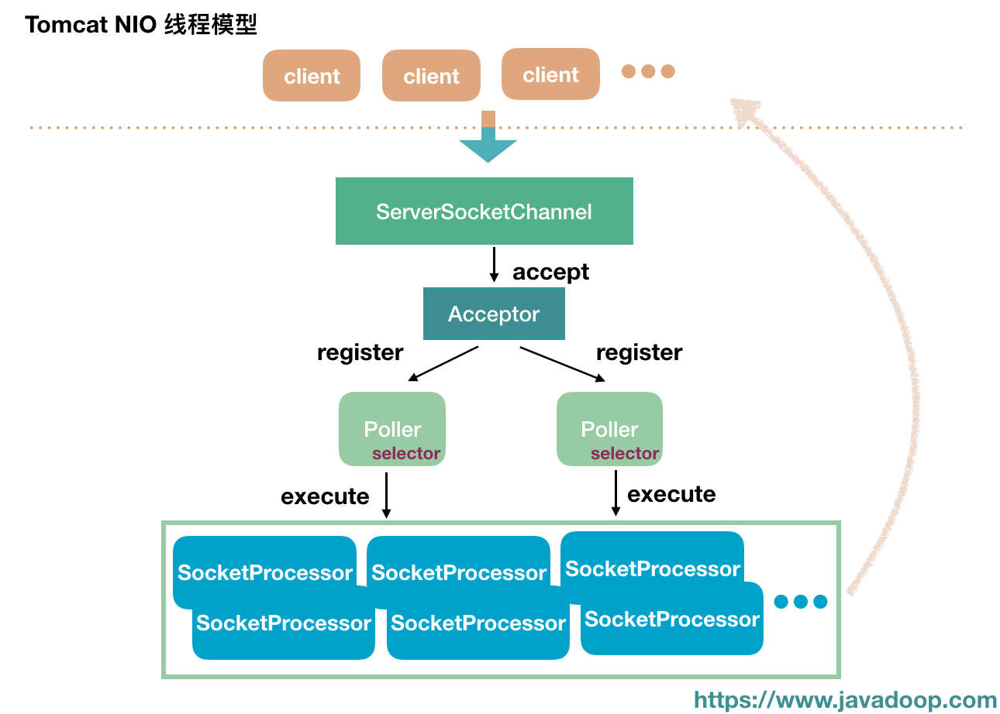
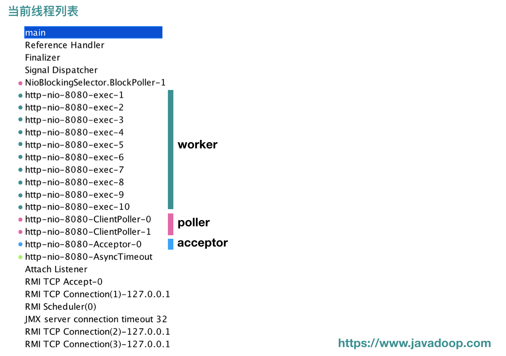

[tomcat对keep-alive的实现逻辑](https://hongjiang.info/how-tomcat-implements-keep-alive/)

## Tomcat线程池

tomcat线程池和jdk默认线程池最大不同就是，阻塞队列和最大线程池这两个条件的顺序问题。

jdk中的线程池，当达到核心线程数量，就进入阻塞队列，阻塞队列满了，才继续创建新的工作线程，直到达到最大线程数量，拒绝新的任务。

tomcat的线程池，达到核心线程数量，则是会先继续创建新的工作线程，直到达到最大线程数量，才进入阻塞队列 ，阻塞队列满了才拒绝新的任务。

[tomcat线程池策略](https://segmentfault.com/a/1190000008052008)

- 场景1：接受一个请求，此时tomcat启动的线程数还没有达到corePoolSize(`tomcat里头叫minSpareThreads`)，tomcat会启动一个线程来处理该请求；
- 场景2：接受一个请求，此时tomcat启动的线程数已经达到了corePoolSize，tomcat把该请求放入队列(`offer`)，如果放入队列成功，则返回，放入队列不成功，则尝试增加工作线程，在当前线程个数小于maxThreads的时候，可以继续增加线程来处理，超过maxThreads的时候，则继续往等待队列里头放，等待队列放不进去，则抛出RejectedExecutionException；


### 重写阻塞队列

tomcat使用了一个**无界队列**作为线程池的阻塞队列，但是重写了队列的offer方法，**当其线程池大小小于maximumPoolSize的时候，返回false**。这样线程池的最大线程数就不会失效了，线程池会继续创建线程，直到达到最大线程数，tomcat的阻塞队列是一个无界队列，但是外层使用一个默认10000大小的共享锁LimitLatch来控制最大连接数。

```java
public class TaskQueue extends LinkedBlockingQueue<Runnable> {
    @Override
    public boolean offer(Runnable o) {
      //we can't do any checks
        if (parent==null) return super.offer(o);
        //we are maxed out on threads, simply queue the object
        if (parent.getPoolSize() == parent.getMaximumPoolSize()) return super.offer(o);
        //we have idle threads, just add it to the queue
        if (parent.getSubmittedCount()<=(parent.getPoolSize())) return super.offer(o);
        //if we have less threads than maximum force creation of a new thread
        if (parent.getPoolSize()<parent.getMaximumPoolSize()) return false;
        //if we reached here, we need to add it to the queue
        return super.offer(o);
    }
}    
```


### 捕捉任务拒绝策略

```java
public class ThreadPoolExecutor extends java.util.concurrent.ThreadPoolExecutor {
/**
 * Executes the given command at some time in the future.  The command
 * may execute in a new thread, in a pooled thread, or in the calling
 * thread, at the discretion of the <tt>Executor</tt> implementation.
 * If no threads are available, it will be added to the work queue.
 * If the work queue is full, the system will wait for the specified
 * time and it throw a RejectedExecutionException if the queue is still
 * full after that.
 */
public void execute(Runnable command, long timeout, TimeUnit unit) {
    submittedCount.incrementAndGet();
    try {
        super.execute(command);
    } catch (RejectedExecutionException rx) {
        if (super.getQueue() instanceof TaskQueue) {
            final TaskQueue queue = (TaskQueue)super.getQueue();
            try {
                if (!queue.force(command, timeout, unit)) {
                    submittedCount.decrementAndGet();
                    throw new RejectedExecutionException(sm.getString("threadPoolExecutor.queueFull"));
                }
            } catch (InterruptedException x) {
                submittedCount.decrementAndGet();
                throw new RejectedExecutionException(x);
            }
        } else {
            submittedCount.decrementAndGet();
            throw rx;
        }

    }
}
}
```


## 最大连接数实现

```java
public abstract class AbstractEndpoint<S,U> {
    private int maxConnections = 10000;
    public void setMaxConnections(int maxCon) {
        this.maxConnections = maxCon;
        LimitLatch latch = this.connectionLimitLatch;
        if (latch != null) {
            // Update the latch that enforces this
            if (maxCon == -1) {
                releaseConnectionLatch();
            } else {
                latch.setLimit(maxCon);
            }
        } else if (maxCon > 0) {
            initializeConnectionLatch();
        }
    }
}    
```


### 共享锁LimitLatch

使用一个原子变量limit，cas的方式去增减，小于limit，允许共享，否则获取锁失败。

```java
public class LimitLatch {

    private static final Log log = LogFactory.getLog(LimitLatch.class);

    private class Sync extends AbstractQueuedSynchronizer {
        private static final long serialVersionUID = 1L;

        public Sync() {
        }

        @Override
        protected int tryAcquireShared(int ignored) {
            long newCount = count.incrementAndGet();
            if (!released && newCount > limit) {
                // Limit exceeded
                count.decrementAndGet();
                return -1;
            } else {
                return 1;
            }
        }

        @Override
        protected boolean tryReleaseShared(int arg) {
            count.decrementAndGet();
            return true;
        }
    }

    private final Sync sync;
    private final AtomicLong count;
    private volatile long limit;
    private volatile boolean released = false;
}
```


## 使用NIO

[Tomcat 中的 NIO 源码分析](https://www.javadoop.com/post/tomcat-nio)

[深度解读Tomcat中的NIO模型](https://www.jianshu.com/p/76ff17bc6dea)



这里，介绍第一个重要的概念：**Connector**。在 Tomcat 中，使用 Connector 来处理连接，一个 Tomcat 可以配置多个 Connector，分别用于监听不同端口，或处理不同协议。

在 Connector 的构造方法中，我们可以传  `HTTP/1.1` 或 `AJP/1.3` 用于指定协议，也可以传入相应的协议处理类，毕竟协议不是重点，将不同端口进来的连接对应不同处理类才是正道。典型地，我们可以指定以下几个协议处理类：

- org.apache.coyote.http11.Http11NioProtocol：对应非阻塞 IO
- org.apache.coyote.http11.Http11Nio2Protocol：对应异步 IO
- org.apache.coyote.http2.Http2Protocol：对应 http2 协议，对 http2 感兴趣的读者，赶紧看起来吧。

### endpoint

前面我们说过一个 Connector 对应一个协议，当然这描述也不太对，NIO 和 NIO2 就都是处理 HTTP/1.1 的，只不过一个使用非阻塞，一个使用异步。进到指定 protocol 代码，我们就会发现，它们的代码及其简单，只不过是指定了特定的 **endpoint**。

打开 `Http11NioProtocol` 和 `Http11Nio2Protocol`源码，我们可以看到，在构造方法中，它们分别指定了 NioEndpoint 和 Nio2Endpoint。

```java
// 非阻塞模式
public class Http11NioProtocol extends AbstractHttp11JsseProtocol<NioChannel> {
    public Http11NioProtocol() {
        // NioEndpoint
        super(new NioEndpoint());
    }
    ...
}
// 异步模式
public class Http11Nio2Protocol extends AbstractHttp11JsseProtocol<Nio2Channel> {

    public Http11Nio2Protocol() {
        // Nio2Endpoint
        super(new Nio2Endpoint());
    }
    ...
}
```

这里介绍第二个重要的概念：**endpoint**。Tomcat 使用不同的 endpoint 来处理不同的协议请求，今天我们的重点是 **NioEndpoint**，其使用**非阻塞 IO** 来进行处理 HTTP/1.1 协议的请求。

### init 过程分析

下面，我们看看从 tomcat.start() 一直到 NioEndpoint 的过程。

**1. AbstractProtocol** # **init**

```java
@Override
public void init() throws Exception {
    ...
    String endpointName = getName();
    endpoint.setName(endpointName.substring(1, endpointName.length()-1));
    endpoint.setDomain(domain);
    // endpoint 的 name=http-nio-8089,domain=Tomcat
    endpoint.init();
}
```

**2. AbstractEndpoint** # **init**

```java
public final void init() throws Exception {
    if (bindOnInit) {
        bind(); // 这里对应的当然是子类 NioEndpoint 的 bind() 方法
        bindState = BindState.BOUND_ON_INIT;
    }
    ...
}
```

**3. NioEndpoint** # **bind**

这里就到我们的 NioEndpoint 了，要使用到我们之前学习的 NIO 的知识了。

```java
@Override
public void bind() throws Exception {
    // initServerSocket(); 原代码是这行，我们 “内联” 过来一起说

    // 开启 ServerSocketChannel
    serverSock = ServerSocketChannel.open();
    socketProperties.setProperties(serverSock.socket());

    // getPort() 会返回我们最开始设置的 8080，得到我们的 address 是 0.0.0.0:8080
    InetSocketAddress addr = (getAddress()!=null?new InetSocketAddress(getAddress(),getPort()):new InetSocketAddress(getPort()));

    // ServerSocketChannel 绑定地址、端口，
    // 第二个参数 backlog 默认为 100，超过 100 的时候，新连接会被拒绝(不过源码注释也说了，这个值的真实语义取决于具体实现)
    serverSock.socket().bind(addr,getAcceptCount());

    // ※※※ 设置 ServerSocketChannel 为阻塞模式 ※※※
    serverSock.configureBlocking(true);

    // 设置 acceptor 和 poller 的数量，至于它们是什么角色，待会说
    // acceptorThreadCount 默认为 1
    if (acceptorThreadCount == 0) {
        // FIXME: Doesn't seem to work that well with multiple accept threads
        // 作者想表达的意思应该是：使用多个 acceptor 线程并不见得性能会更好
        acceptorThreadCount = 1;
    }

    // poller 线程数，默认值定义如下，所以在多核模式下，默认为 2
    // pollerThreadCount = Math.min(2,Runtime.getRuntime().availableProcessors());
    if (pollerThreadCount <= 0) {
        pollerThreadCount = 1;
    }

    // 
    setStopLatch(new CountDownLatch(pollerThreadCount));

    // 初始化 ssl，我们忽略 ssl
    initialiseSsl();

    // 打开 NioSelectorPool，先忽略它
    selectorPool.open();
}
```

1. ServerSocketChannel 已经打开，并且绑定要了之前指定的 8080 端口，设置成了**阻塞模式**。
2. 设置了 acceptor 的线程数为 1
3. 设置了 poller 的线程数，单核 CPU 为 1，多核为 2
4. 打开了一个 SelectorPool，我们先忽略这个

到这里，我们还不知道 Acceptor 和 Poller 是什么东西，我们只是设置了它们的数量，我们先来看看最后面提到的 SelectorPool。


### start 过程分析

刚刚我们分析完了 init() 过程，下面是启动过程 start() 分析。

AbstractProtocol # start

```java
@Override
public void start() throws Exception {
    ...
    // 调用 endpoint 的 start 方法
    endpoint.start();

    // Start async timeout thread
    asyncTimeout = new AsyncTimeout();
    Thread timeoutThread = new Thread(asyncTimeout, getNameInternal() + "-AsyncTimeout");
    int priority = endpoint.getThreadPriority();
    if (priority < Thread.MIN_PRIORITY || priority > Thread.MAX_PRIORITY) {
        priority = Thread.NORM_PRIORITY;
    }
    timeoutThread.setPriority(priority);
    timeoutThread.setDaemon(true);
    timeoutThread.start();
}
```

AbstractEndpoint # start

```java
public final void start() throws Exception {
    // 按照我们的流程，刚刚 init 的时候，已经把 bindState 改为 BindState.BOUND_ON_INIT 了，
    // 所以下面的 if 分支我们就不进去了
    if (bindState == BindState.UNBOUND) {
        bind();
        bindState = BindState.BOUND_ON_START;
    }
    // 往里看 NioEndpoint 的实现
    startInternal();
}
```

下面这个方法还是比较重要的，这里会创建前面说过的 acceptor 和 poller。

NioEndpoint # startInternal

```java
@Override
public void startInternal() throws Exception {

    if (!running) {
        running = true;
        paused = false;

        // 以下几个是缓存用的，之后我们也会看到很多这样的代码，为了减少 new 很多对象出来
        processorCache = new SynchronizedStack<>(SynchronizedStack.DEFAULT_SIZE,
                socketProperties.getProcessorCache());
        eventCache = new SynchronizedStack<>(SynchronizedStack.DEFAULT_SIZE,
                        socketProperties.getEventCache());
        nioChannels = new SynchronizedStack<>(SynchronizedStack.DEFAULT_SIZE,
                socketProperties.getBufferPool());

        // 创建【工作线程池】，Tomcat 自己包装了一下 ThreadPoolExecutor，
        // 1. 为了在创建线程池以后，先启动 corePoolSize 个线程(这个属于线程池的知识了，不熟悉的读者可以看看我之前的文章)
        // 2. 自己管理线程池的增长方式（默认 corePoolSize 10, maxPoolSize 200），不是本文重点，不分析
        if ( getExecutor() == null ) {
            createExecutor();
        }

        // 设置一个栅栏（tomcat 自定义了类 LimitLatch），控制最大的连接数，默认是 10000
        initializeConnectionLatch();

        // 开启 poller 线程
        // 还记得之前 init 的时候，默认地设置了 poller 的数量为 2，所以这里启动 2 个 poller 线程
        pollers = new Poller[getPollerThreadCount()];
        for (int i=0; i<pollers.length; i++) {
            pollers[i] = new Poller();
            Thread pollerThread = new Thread(pollers[i], getName() + "-ClientPoller-"+i);
            pollerThread.setPriority(threadPriority);
            pollerThread.setDaemon(true);
            pollerThread.start();
        }

        // 开启 acceptor 线程，和开启 poller 线程组差不多。
        // init 的时候，默认地，acceptor 的线程数是 1
        startAcceptorThreads();
    }
}
```

到这里，我们启动了**工作线程池**、 **poller 线程组**、**acceptor 线程组**。同时，工作线程池初始就已经启动了 10 个线程。我们用 **jconsole** 来看看此时的线程，请看下图：



从 jconsole 中，我们可以看到，此时启动了 BlockPoller、worker、poller、acceptor、AsyncTimeout，大家应该都已经清楚了每个线程是哪里启动的吧。


```java
public abstract class AbstractEndpoint<S,U> {
protected int acceptorThreadCount = 1;
private int pollerThreadCount = Math.min(2,Runtime.getRuntime().availableProcessors());
public void bind() throws Exception {
    initServerSocket();

    // 初始化acceptor, poller线程数
    if (acceptorThreadCount == 0) {
        acceptorThreadCount = 1;
    }
    if (pollerThreadCount <= 0) {
        pollerThreadCount = 1;
    }
    setStopLatch(new CountDownLatch(pollerThreadCount));

    // Initialize SSL if needed
    initialiseSsl();

    selectorPool.open();
}

protected void initServerSocket() throws Exception {
    if (!getUseInheritedChannel()) {
        //开启 ServerSocketChannel
        serverSock = ServerSocketChannel.open();
        socketProperties.setProperties(serverSock.socket());
        InetSocketAddress addr = new InetSocketAddress(getAddress(), getPortWithOffset());
        // ServerSocketChannel 绑定地址、端口，
   		// 第二个参数 backlog 默认为 100，超过 100 的时候，新连接会被拒绝(不过源码注释也说了，这个值的真实语义取决于具体实现)
        serverSock.socket().bind(addr,getAcceptCount());
    } else {
        // Retrieve the channel provided by the OS
        Channel ic = System.inheritedChannel();
        if (ic instanceof ServerSocketChannel) {
            serverSock = (ServerSocketChannel) ic;
        }
        if (serverSock == null) {
            throw new IllegalArgumentException(sm.getString("endpoint.init.bind.inherited"));
        }
    }
    serverSock.configureBlocking(true); //mimic APR behavior
}
}    
```
123

```java
public void startInternal() throws Exception {

    if (!running) {
        running = true;
        paused = false;

        processorCache = new SynchronizedStack<>(SynchronizedStack.DEFAULT_SIZE,
                socketProperties.getProcessorCache());
        eventCache = new SynchronizedStack<>(SynchronizedStack.DEFAULT_SIZE,
                        socketProperties.getEventCache());
        nioChannels = new SynchronizedStack<>(SynchronizedStack.DEFAULT_SIZE,
                socketProperties.getBufferPool());

        //创建工作线程组
        if ( getExecutor() == null ) {
            createExecutor();
        }

        //初始化共享锁，限制最大连接数
        initializeConnectionLatch();

        //开启poller线程
        pollers = new Poller[getPollerThreadCount()];
        for (int i=0; i<pollers.length; i++) {
            pollers[i] = new Poller();
            Thread pollerThread = new Thread(pollers[i], getName() + "-ClientPoller-"+i);
            pollerThread.setPriority(threadPriority);
            pollerThread.setDaemon(true);
            pollerThread.start();
        }

        //开启acceptor线程
        startAcceptorThreads();
    }
}
```


### acceptor线程

```java
public class Acceptor<U> implements Runnable {
    private static final Log log = LogFactory.getLog(Acceptor.class);
    private static final StringManager sm = StringManager.getManager(Acceptor.class);

    private static final int INITIAL_ERROR_DELAY = 50;
    private static final int MAX_ERROR_DELAY = 1600;

    private final AbstractEndpoint<?,U> endpoint;
    private String threadName;
    protected volatile AcceptorState state = AcceptorState.NEW;
public void run() {

    int errorDelay = 0;

    // Loop until we receive a shutdown command
    while (endpoint.isRunning()) {

        // Loop if endpoint is paused
        while (endpoint.isPaused() && endpoint.isRunning()) {
            state = AcceptorState.PAUSED;
            try {
                Thread.sleep(50);
            } catch (InterruptedException e) {
                // Ignore
            }
        }

        if (!endpoint.isRunning()) {
            break;
        }
        state = AcceptorState.RUNNING;

        try {
            //达到最大连接数，等待
            endpoint.countUpOrAwaitConnection();

            // Endpoint might have been paused while waiting for latch
            // If that is the case, don't accept new connections
            if (endpoint.isPaused()) {
                continue;
            }

            U socket = null;
            try {
                // 接受连接
                socket = endpoint.serverSocketAccept();
            } catch (Exception ioe) {
                // We didn't get a socket
                endpoint.countDownConnection();
                if (endpoint.isRunning()) {
                    // Introduce delay if necessary
                    errorDelay = handleExceptionWithDelay(errorDelay);
                    // re-throw
                    throw ioe;
                } else {
                    break;
                }
            }
            // Successful accept, reset the error delay
            errorDelay = 0;

            // Configure the socket
            if (endpoint.isRunning() && !endpoint.isPaused()) {
                // 封装成一个channel，注册到poller线程
                if (!endpoint.setSocketOptions(socket)) {
                    endpoint.closeSocket(socket);
                }
            } else {
                endpoint.destroySocket(socket);
            }
        } catch (Throwable t) {
            ExceptionUtils.handleThrowable(t);
            String msg = sm.getString("endpoint.accept.fail");
            // APR specific.
            // Could push this down but not sure it is worth the trouble.
            if (t instanceof Error) {
                Error e = (Error) t;
                if (e.getError() == 233) {
                    // Not an error on HP-UX so log as a warning
                    // so it can be filtered out on that platform
                    // See bug 50273
                    log.warn(msg, t);
                } else {
                    log.error(msg, t);
                }
            } else {
                    log.error(msg, t);
            }
        }
    }
    state = AcceptorState.ENDED;
}
}    
```


```java
protected boolean setSocketOptions(SocketChannel socket) {
    // Process the connection
    try {
        //disable blocking, APR style, we are gonna be polling it
        socket.configureBlocking(false);
        Socket sock = socket.socket();
        socketProperties.setProperties(sock);

        NioChannel channel = nioChannels.pop();
        if (channel == null) {
            SocketBufferHandler bufhandler = new SocketBufferHandler(
                    socketProperties.getAppReadBufSize(),
                    socketProperties.getAppWriteBufSize(),
                    socketProperties.getDirectBuffer());
            if (isSSLEnabled()) {
                channel = new SecureNioChannel(socket, bufhandler, selectorPool, this);
            } else {
                channel = new NioChannel(socket, bufhandler);
            }
        } else {
            channel.setIOChannel(socket);
            channel.reset();
        }
        getPoller0().register(channel);
    } catch (Throwable t) {
        ExceptionUtils.handleThrowable(t);
        try {
            log.error(sm.getString("endpoint.socketOptionsError"), t);
        } catch (Throwable tt) {
            ExceptionUtils.handleThrowable(tt);
        }
        // Tell to close the socket
        return false;
    }
    return true;
}
```

### poller线程

Poller是NioEndPoint的成员内部类

```java
public class Poller implements Runnable {

    private Selector selector;
    private final SynchronizedQueue<PollerEvent> events =
        new SynchronizedQueue<>();

    private volatile boolean close = false;
    private long nextExpiration = 0;//optimize expiration handling

    private AtomicLong wakeupCounter = new AtomicLong(0);

    private volatile int keyCount = 0;

    public Poller() throws IOException {
        this.selector = Selector.open();
    }
    public void register(final NioChannel socket) {
        socket.setPoller(this);
        NioSocketWrapper ka = new NioSocketWrapper(socket, NioEndpoint.this);
        socket.setSocketWrapper(ka);
        ka.setPoller(this);
        ka.setReadTimeout(getConnectionTimeout());
        ka.setWriteTimeout(getConnectionTimeout());
        ka.setKeepAliveLeft(NioEndpoint.this.getMaxKeepAliveRequests());
        ka.setSecure(isSSLEnabled());
        PollerEvent r = eventCache.pop();
        ka.interestOps(SelectionKey.OP_READ);//this is what OP_REGISTER turns into.
        if ( r==null) r = new PollerEvent(socket,ka,OP_REGISTER);
        else r.reset(socket,ka,OP_REGISTER);
        addEvent(r);
    }
    public void run() {
        // Loop until destroy() is called
        while (true) {

            boolean hasEvents = false;

            try {
                if (!close) {
                    hasEvents = events();
                    if (wakeupCounter.getAndSet(-1) > 0) {
                        //if we are here, means we have other stuff to do
                        //do a non blocking select
                        keyCount = selector.selectNow();
                    } else {
                        keyCount = selector.select(selectorTimeout);
                    }
                    wakeupCounter.set(0);
                }
                if (close) {
                    events();
                    timeout(0, false);
                    try {
                        selector.close();
                    } catch (IOException ioe) {
                        log.error(sm.getString("endpoint.nio.selectorCloseFail"), ioe);
                    }
                    break;
                }
            } catch (Throwable x) {
                ExceptionUtils.handleThrowable(x);
                log.error(sm.getString("endpoint.nio.selectorLoopError"), x);
                continue;
            }
            //either we timed out or we woke up, process events first
            if ( keyCount == 0 ) hasEvents = (hasEvents | events());

            Iterator<SelectionKey> iterator =
                keyCount > 0 ? selector.selectedKeys().iterator() : null;
            //遍历执行就绪事件
            while (iterator != null && iterator.hasNext()) {
                SelectionKey sk = iterator.next();
                NioSocketWrapper attachment = (NioSocketWrapper)sk.attachment();
                // Attachment may be null if another thread has called
                // cancelledKey()
                if (attachment == null) {
                    iterator.remove();
                } else {
                    iterator.remove();
                    processKey(sk, attachment);
                }
            }

            //process timeouts
            timeout(keyCount,hasEvents);
        }//while

        getStopLatch().countDown();
    }
}
```


## Spring Boot配置


```properties
server. Port = xxxx
server. Address =
server. contextPath =
server. displayName =
server. servletPath =
server. contextParameters =
server. useForwardHeaders =
server. serverHeader =
server. maxHttpHeaderSize =
server. maxHttpPostSize =
server. connectionTimeout =
server. session.timeout =
server. session.trackingModes =
server. session.persistent =
server.session.storeDir =
server.cookie. name =
server.cookie. domain =
server.cookie. path =
server.cookie. comment =
server.cookie. httpOnly =
server.cookie. secure =
server.cookie. maxAge =
server. ssl. Enabled =
server.ssl. clientAuth =
server.ssl. ciphers =
server.ssl. enabledProtocols =
server.ssl. keyAlias =
server.ssl. keyPassword =
server.ssl. keyStore =
server.ssl. keyStorePassword =
server.ssl. keyStoreType =
server.ssl. keyStoreProvider =
server.ssl. trustStore =
server.ssl. trustStorePassword =
server.ssl. trustStoreType =
server.ssl. trustStoreProvider =
server.ssl. protocol =
server.compression. enabled =
server.compression.mimeTypes =
server.compression.excludedUserAgents =
server.compression.minResponseSize =
server. jspServlet. className =
server.jspServlet. initParameters =
server.jspServlet.registered =
server.tomcat.accesslog.enabled =
server.tomcat.accesslog.pattern =
server.tomcat.accesslog.directory =
server.tomcat.accesslog.prefix =
server.tomcat.accesslog.suffix =
server.tomcat.accesslog.rotate =
server.tomcat.accesslog.renameOnRotate =
server.tomcat.accesslog.requestAttributesEnabled=
server.tomcat.accesslog.buffered =
server.tomcat.internalProxies =
server.tomcat.protocolHeader =
server.tomcat.protocolHeaderHttpsValue =
server.tomcat.portHeader =
server.tomcat.remoteIpHeader=
server.tomcat.basedir =
server.tomcat.backgroundProcessorDelay =
server.tomcat.maxThreads =
server.tomcat.minSpareThreads =
server.tomcat.maxHttpPostSize =
server.tomcat.maxHttpHeaderSize =
server.tomcat.redirectContextRoot =
server.tomcat.uriEncoding =
server.tomcat.maxConnections =
server.tomcat.acceptCount =
server.tomcat.additionalTldSkipPatterns =
```