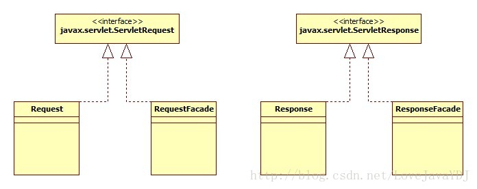
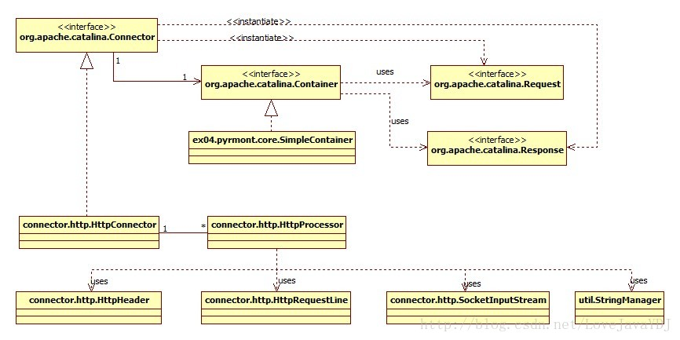

# Tomcat是怎么工作起来的

[How tomcat works系列文章](https://blog.csdn.net/lovejavaydj/article/category/9267782)

## 1.一个简单的web服务器

​	本章说明java web服务器是如何工作的。Web服务器也成为超文本传输协议(HTTP)服务器，因为它使用HTTP来跟客户端进行通信的，这通常是个web浏览器。一 个基于java的web服务器使用两个重要的类：java.net.Socket和java.net.ServerSocket，并通过HTTP消息进行 通信。因此这章就自然是从HTTP和这两个类的讨论开始的。接下去，解释这章附带的一个简单的web服务器。

### 超文本传输协议(HTTP)

​    HTTP是一种协议，允许web服务器和浏览器通过互联网进行来发送和接受数据。它是一种请求和响应协议。客户端请求一个文件而服务器响应请求。HTTP 使用可靠的TCP连接--TCP默认使用80端口。第一个HTTP版是HTTP/0.9，然后被HTTP/1.0所替代。正在取代HTTP/1.0的是当 前版本HTTP/1.1，它定义于征求意见文档(RFC) 2616，可以从<http://www.w3.org/Protocols/HTTP/1.1/rfc2616.pdf>下 载。 

​    **注意**：本节涵盖的HTTP 1.1只是简略的帮助你理解web服务器应用发送的消息。假如你对更多详细信息感兴趣，请阅读RFC 2616。 

​    在HTTP中，始终都是客户端通过建立连接和发送一个HTTP请求从而开启一个事务。web服务器不需要联系客户端或者对客户端做一个回调连接。无论是客 户端或者服务器都可以提前终止连接。举例来说，当你正在使用一个web浏览器的时候，可以通过点击浏览器上的停止按钮来停止一个文件的下载进程，从而有效 的关闭与web服务器的HTTP连接。 

### HTTP请求

​    一个HTTP请求包括三个组成部分： 

- 方法—统一资源标识符(URI)—协议/版本 
- 请求的头部 

- 主体内容 

​    下面是一个HTTP请求的例子： 
```
POST /examples/default.jsp HTTP/1.1
 Accept: text/plain; text/html
 Accept-Language: en-gb
 Connection: Keep-Alive
 Host: localhost
 User-Agent: Mozilla/4.0 (compatible; MSIE 4.01; Windows 98)
 Content-Length: 33
 Content-Type: application/x-www-form-urlencoded
 Accept-Encoding: gzip, deflate

 lastName=Franks&firstName=Michael 
```
​    方法—统一资源标识符(URI)—协议/版本出现在请求的第一行。  

`POST /examples/default.jsp HTTP/1.1` 

​    这里POST是请求方法，/examples/default.jsp是URI，而HTTP/1.1是协议/版本部分。
​     每个HTTP请求可以使用HTTP标准里边提到的多种方法之一。HTTP 1.1支持7种类型的请求：GET, POST,HEAD, OPTIONS, PUT, DELETE和TRACE。GET和POST在互联网应用里边最普遍使用的。
​     URI完全指明了一个互联网资源。URI通常是相对服务器的根目录解释的。因此，始终一斜线/开头。统一资源定位器(URL)其实是一种URI(查看<http://www.ietf.org/rfc/rfc2396.txt>) 来的。该协议版本代表了正在使用的HTTP协议的版本。
​     请求的头部包含了关于客户端环境和请求的主体内容的有用信息。例如它可能包括浏览器设置的语言，主体内容的长度等等。每个头部通过一个回车换行符 (CRLF)来分隔的。
​     对于HTTP请求格式来说，头部和主体内容之间有一个回车换行符(CRLF)是相当重要的。CRLF告诉HTTP服务器主体内容是在什么地方开始的。在一 些互联网编程书籍中，CRLF还被认为是HTTP请求的第四部分。
​     在前面一个HTTP请求中，主体内容只不过是下面一行：

 `lastName=Franks&firstName=Michael`

​    实体内容在一个典型的HTTP请求中可以很容易的变得更长。

### HTTP响应 
    类似于HTTP请求，一个HTTP响应也包括三个组成部分： 
•	方法—统一资源标识符(URI)—协议/版本 
•	响应的头部 
•	主体内容 
    下面是一个HTTP响应的例子： 
```html
HTTP/1.1 200 OK
Server: Microsoft-IIS/4.0
Date: Mon, 5 Jan 2004 13:13:33 GMT
Content-Type: text/html
Last-Modified: Mon, 5 Jan 2004 13:13:12 GMT
Content-Length: 112

<html>
<head>
<title>HTTP Response Example</title>
</head>
<body>
Welcome to Brainy Software
</body>
</html>
```
响应头部的第一行类似于请求头部的第一行。第一行告诉你该协议使用HTTP 1.1，请求成功(200=成功)，表示一切都运行良好。
响应头部和请求头部类似，也包括很多有用的信息。响应的主体内容是响应本身的HTML内容。头部和主体内容通过CRLF分隔开来。

### Socket类 
套接字是网络连接的一个端点。套接字使得一个应用可以从网络中读取和写入数据。放在两个不同计算机上的两个应用可以通过连接发送和接受字节流。为了从你的 应用发送一条信息到另一个应用，你需要知道另一个应用的IP地址和套接字端口。在Java里边，套接字指的是java.net.Socket类。
要创建一个套接字，你可以使用Socket类众多构造方法中的一个。其中一个接收主机名称和端口号：

```java
public Socket (java.lang.String host, int port)
```
在这里主机是指远程机器名称或者IP地址，端口是指远程应用的端口号。例如，要连接yahoo.com的80端口，你需要构造以下的Socket对象：
```java
new Socket ("yahoo.com", 80);
```
​	一旦你成功创建了一个Socket类的实例，你可以使用它来发送和接受字节流。要发送字节流，你首先必须调用Socket类的 getOutputStream方法来获取一个java.io.OutputStream对象。要发送文本到一个远程应用，你经常要从返回的 OutputStream对象中构造一个java.io.PrintWriter对象。要从连接的另一端接受字节流，你可以调用Socket类的 getInputStream方法用来返回一个java.io.InputStream对象。
​	以下的代码片段创建了一个套接字，可以和本地HTTP服务器(127.0.0.1是指本地主机)进行通讯，发送一个HTTP请求，并从服务器接受响应。它 创建了一个StringBuffer对象来保存响应并在控制台上打印出来。

```java
Socket socket = new Socket("127.0.0.1", "8080");
OutputStream os = socket.getOutputStream();
boolean autoflush = true;
PrintWriter out = new PrintWriter(
socket.getOutputStream(), autoflush);
BufferedReader in = new BufferedReader(
new InputStreamReader( socket.getInputstream() ));
// send an HTTP request to the web server
out.println("GET /index.jsp HTTP/1.1");
out.println("Host: localhost:8080");
out.println("Connection: Close");
out.println();
// read the response
boolean loop = true;
StringBuffer sb = new StringBuffer(8096);
while (loop) {
    if ( in.ready() ) {
        int i=0;
        while (i!=-1) {
            i = in.read();
            sb.append((char) i);
        }
    loop = false;
    }
    Thread.currentThread().sleep(50);
}
// display the response to the out console
System.out.println(sb.toString());
socket.close();
```
请注意，为了从web服务器获取适当的响应，你需要发送一个遵守HTTP协议的HTTP请求。假如你已经阅读了前面一节超文本传输协议(HTTP)，你应 该能够理解上面代码提到的HTTP请求。
注意：你可以本书附带的 com.brainysoftware.pyrmont.util.HttpSniffer类来发送一个HTTP请求并显示响应。要使用这个Java程 序，你必须连接到互联网上。虽然它有可能并不会起作用，假如你有设置防火墙的话。

### ServerSocket类 
Socket类代表一个客户端套接字，即任何时候你想连接到一个远程服务器应用的时候你构造的套接字，现在，假如你想实施一个服务器应用，例如一个 HTTP服务器或者FTP服务器，你需要一种不同的做法。这是因为你的服务器必须随时待命，因为它不知道一个客户端应用什么时候会尝试去连接它。为了让你 的应用能随时待命，你需要使用java.net.ServerSocket类。这是服务器套接字的实现。
ServerSocket和Socket不同，服务器套接字的角色是等待来自客户端的连接请求。一旦服务器套接字获得一个连接请求，它创建一个 Socket实例来与客户端进行通信。
要创建一个服务器套接字，你需要使用ServerSocket类提供的四个构造方法中的一个。你需要指定IP地址和服务器套接字将要进行监听的端口号。通 常，IP地址将会是127.0.0.1，也就是说，服务器套接字将会监听本地机器。服务器套接字正在监听的IP地址被称为是绑定地址。**服务器套接字的另一 个重要的属性是backlog，这是服务器套接字开始拒绝传入的请求之前，传入的连接请求的最大队列长度。**[java socket编程中backlog的含义](https://www.cnblogs.com/strinkbug/p/7392533.html)
其中一个ServerSocket类的构造方法如下所示:

```java
public ServerSocket(int port, int backLog, InetAddress bindingAddress);
```
对于这个构造方法，绑定地址必须是java.net.InetAddress的一个实例。一种构造InetAddress对象的简单的方法是调用它的静态 方法getByName，传入一个包含主机名称的字符串，就像下面的代码一样。
```java
InetAddress.getByName("127.0.0.1");
```
下面一行代码构造了一个监听的本地机器8080端口的ServerSocket，它的backlog为1。
```java
new ServerSocket(8080, 1, InetAddress.getByName("127.0.0.1"));
```
一旦你有一个ServerSocket实例，你可以让它在绑定地址和服务器套接字正在监听的端口上等待传入的连接请求。你可以通过调用 ServerSocket类的accept方法做到这点。这个方法只会在有连接请求时才会返回，并且返回值是一个Socket类的实例。Socket对象 接下去可以发送字节流并从客户端应用中接受字节流，就像前一节"Socket类"解释的那样。实际上，这章附带的程序中，accept方法是唯一用到的方 法。

### 应用程序 
我们的web服务器应用程序放在ex01.pyrmont包里边，由三个类组成：

•	HttpServer 
•	Request 
•	Response 
    这个应用程序的入口点(静态main方法)可以在HttpServer类里边找到。main方法创建了一个HttpServer的实例并调用了它的 await方法。await方法，顾名思义就是在一个指定的端口上等待HTTP请求,处理它们并发送响应返回客户端。它一直等待直至接收到 shutdown命令。
    应用程序不能做什么，除了发送静态资源，例如放在一个特定目录的HTML文件和图像文件。它也在控制台上显示传入的HTTP请求的字节流。不过，它不给浏 览器发送任何的头部例如日期或者cookies。
    现在我们将在以下各小节中看看这三个类。

### HttpServer类 
HttpServer类代表一个web服务器并展示在Listing 1.1中。请注意，await方法放在Listing 1.2中，为了节省空间没有重复放在Listing 1.1中。
Listing 1.1: HttpServer类

```java
package ex01.pyrmont;
import java.net.Socket;
import java.net.ServerSocket;
import java.net.InetAddress;
import java.io.InputStream;
import java.io.OutputStream;
import java.io.IOException;
import java.io.File;
public class HttpServer {
    /** WEB_ROOT is the directory where our HTML and other files reside.
    * For this package, WEB_ROOT is the "webroot" directory under the
    * working directory.
    * The working directory is the location in the file system
    * from where the java command was invoked.
    */
    public static final String WEB_ROOT =
    System.getProperty("user.dir") + File.separator + "webroot";
    // shutdown command
    private static final String SHUTDOWN_COMMAND = "/SHUTDOWN";
    // the shutdown command received
    private boolean shutdown = false;
    public static void main(String[] args) {
        HttpServer server = new HttpServer();
        server.await();
    }
    public void await() {
        ...
    }
}
Listing 1.2: HttpServer类的await方法 
public void await() {
    ServerSocket serverSocket = null;
    int port = 8080;
    try {
        serverSocket = new ServerSocket(port, 1,
        InetAddress.getByName("127.0.0.1"));
    }
    catch (IOException e) {
    e.printStackTrace();
    System.exit(1);
    }
    // Loop waiting for a request
    while (!shutdown) {
        Socket socket = null;
        InputStream input = null;
        OutputStream output = null;
        try {
            socket = serverSocket.accept();
            input = socket.getInputStream();
            output = socket.getOutputStream();
            // create Request object and parse
            Request request = new Request(input);
            request.parse();
            // create Response object
            Response response = new Response(output);
            response.setRequest(request);
            response.sendStaticResource();
            // Close the socket
            socket.close();
            //check if the previous URI is a shutdown command
            shutdown = request.getUri().equals(SHUTDOWN_COMMAND);
        }
        catch (Exception e) {
            e.printStackTrace ();
            continue;
        }
    }
}
```
web服务器能提供公共静态final变量WEB_ROOT所在的目录和它下面所有的子目录下的静态资源。如下所示，WEB_ROOT被初始化：
```java
public static final String WEB_ROOT =
System.getProperty("user.dir") + File.separator + "webroot";
```
代码列表包括一个叫webroot的目录，包含了一些你可以用来测试这个应用程序的静态资源。你同样可以在相同的目录下找到几个servlet用于测试下 一章的应用程序。为了请求一个静态资源，在你的浏览器的地址栏或者网址框里边敲入以下的URL：http://machineName:port/staticResource
如果你要从一个不同的机器上发送请求到你的应用程序正在运行的机器上，machineName应该是正在运行应用程序的机器的名称或者IP地址。假如你的 浏览器在同一台机器上，你可以使用localhost作为machineName。端口是8080，staticResource是你需要请求的文件的名 称，且必须位于WEB_ROOT里边。
举例来说，假如你正在使用同一台计算机上测试应用程序，并且你想要调用HttpServer对象去发送一个index.html文件，你可以使用一下的 URL：http://localhost:8080/index.html
要停止服务器，你可以在web浏览器的地址栏或者网址框里边敲入预定义字符串，就在URL的host:port的后面，发送一个shutdown命令。 shutdown命令是在HttpServer类的静态final变量SHUTDOWN里边定义的：

```java
private static final String SHUTDOWN_COMMAND = "/SHUTDOWN";
```
因此，要停止服务器，使用下面的URL：http://localhost:8080/SHUTDOWN
现在我们来看看Listing 1.2印出来的await方法。
使用方法名await而不是wait是因为wait方法是与线程相关的java.lang.Object类的一个重要方法。
await方法首先创建一个ServerSocket实例然后进入一个while循环。
```java
serverSocket = new ServerSocket(port, 1,
    InetAddress.getByName("127.0.0.1"));
...
// Loop waiting for a request
while (!shutdown) {
    ...
}
```
while循环里边的代码运行到ServletSocket的accept方法停了下来，只会在8080端口接收到一个HTTP请求的时候才返回：
```java
socket = serverSocket.accept();
```
接收到请求之后，await方法从accept方法返回的Socket实例中取得java.io.InputStream和 java.io.OutputStream对象。
```java
input = socket.getInputStream();
output = socket.getOutputStream();
```
await方法接下去创建一个ex01.pyrmont.Request对象并且调用它的parse方法去解析HTTP请求的原始数据。 
```java
// create Request object and parse
Request request = new Request(input);
request.parse ();
```
在这之后，await方法创建一个Response对象，把Request对象设置给它，并调用它的sendStaticResource方法。
```java
// create Response object
Response response = new Response(output);
response.setRequest(request);
response.sendStaticResource();
```
最后，await关闭套接字并调用Request的getUri来检测HTTP请求的URI是不是一个shutdown命令。假如是的 话，shutdown变量将被设置为true且程序会退出while循环。
```java
// Close the socket
socket.close ();
//check if the previous URI is a shutdown command
shutdown = request.getUri().equals(SHUTDOWN_COMMAND);
```

### Request类
ex01.pyrmont.Request类代表一个HTTP请求。从负责与客户端通信的Socket中传递过来InputStream对象来构造这个类 的一个实例。你调用InputStream对象其中一个read方法来获取HTTP请求的原始数据。
Request类显示在Listing 1.3。Request对象有parse和getUri两个公共方法，分别在Listings 1.4和1.5列出来。
Listing 1.3: Request类
```java
package ex01.pyrmont;
import java.io.InputStream;
import java.io.IOException;
public class Request {
    private InputStream input;
    private String uri;
    public Request(InputStream input) {
        this.input = input;
    }
    public void parse() {
        ...
    }
    private String parseUri(String requestString) {
        ...
    }
    public String getUri() {
        return uri;
    }
}

Listing 1.4: Request类的parse方法 
public void parse() {
    // Read a set of characters from the socket
    StringBuffer request = new StringBuffer(2048);
    int i;
    byte[] buffer = new byte[2048];
    try {
        i = input.read(buffer);
    }
    catch (IOException e) {
        e.printStackTrace();
        i = -1;
    }
    for (int j=0; j<i; j++) {
        request.append((char) buffer[j]);
    }
    System.out.print(request.toString());
    uri = parseUri(request.toString());
}

Listing 1.5: Request类的parseUri方法
private String parseUri(String requestString) {
    int index1, index2;
    index1 = requestString.indexOf(' ');
    if (index1 != -1) {
        index2 = requestString.indexOf(' ', index1 + 1);
        if (index2 > index1)
        return requestString.substring(index1 + 1, index2);
    }
    return null;
}
```
parse方法解析HTTP请求里边的原始数据。这个方法没有做很多事情。它唯一可用的信息是通过调用HTTP请求的私有方法parseUri获得的 URI。parseUri方法在uri变量里边存储URI。公共方法getUri被调用并返回HTTP请求的URI。
注意：在第3章和下面各章的附带程序里边，HTTP请求将会对原始数据进行更多的处理。
为了理解parse和parseUri方法是怎样工作的，你需要知道上一节“超文本传输协议(HTTP)”讨论的HTTP请求的结构。在这一章中，我们仅 仅关注HTTP请求的第一部分，请求行。请求行从一个方法标记开始，接下去是请求的URI和协议版本，最后是用回车换行符(CRLF)结束。请求行里边的 元素是通过一个空格来分隔的。例如，使用GET方法来请求index.html文件的请求行如下所示。
```
GET /index.html HTTP/1.1
```
parse方法从传递给Requst对象的套接字的InputStream中读取整个字节流并在一个缓冲区中存储字节数组。然后它使用缓冲区字节数据的字 节来填入一个StringBuffer对象，并且把代表StringBuffer的字符串传递给parseUri方法。
parse方法列在Listing 1.4。
然后parseUri方法从请求行里边获得URI。Listing 1.5给出了parseUri方法。parseUri方法搜索请求里边的第一个和第二个空格并从中获取URI。

### Response类 
ex01.pyrmont.Response类代表一个HTTP响应，在Listing 1.6里边给出。
        Listing 1.6: Response类

```java
package ex01.pyrmont;
import java.io.OutputStream;
import java.io.IOException;
import java.io.FileInputStream;
import java.io.File;
/*
HTTP Response = Status-Line
*(( general-header | response-header | entity-header ) CRLF)
CRLF
[ message-body ]
Status-Line = HTTP-Version SP Status-Code SP Reason-Phrase CRLF
*/
public class Response {
    private static final int BUFFER_SIZE = 1024;
    Request request;
    OutputStream output;
    public Response(OutputStream output) {
        this.output = output;
    }
    public void setRequest(Request request) {
        this.request = request;
    }
    public void sendStaticResource() throws IOException {
        byte[] bytes = new byte[BUFFER_SIZE];
        FileInputStream fis = null;
        try {
            File file = new File(HttpServer.WEB_ROOT, request.getUri());
            if (file.exists()) {
                fis = new FileInputStream(file);
                int ch = fis.read(bytes, 0, BUFFER_SIZE);
                while (ch!=-1) {
                    output.write(bytes, 0, ch);
                    ch = fis.read(bytes, 0, BUFFER_SIZE);
                }
            }
            else {
            // file not found
            String errorMessage = "HTTP/1.1 404 File Not Found\r\n" +
                "Content-Type: text/html\r\n" +
                "Content-Length: 23\r\n" +
                "\r\n" +
                "<h1>File Not Found</h1>";
            output.write(errorMessage.getBytes());
            }
        }
        catch (Exception e) {
            // thrown if cannot instantiate a File object
            System.out.println(e.toString() );
        }
        finally {
            if (fis!=null)
            fis.close();
        }
    }
}
```
首先注意到它的构造方法接收一个java.io.OutputStream对象，就像如下所示。
```java
public Response(OutputStream output) {
    this.output = output;
}
```
响应对象是通过传递由套接字获得的OutputStream对象给HttpServer类的await方法来构造的。Response类有两个公共方 法：setRequest和sendStaticResource。setRequest方法用来传递一个Request对象给Response对象。
sendStaticResource方法是用来发送一个静态资源，例如一个HTML文件。它首先通过传递上一级目录的路径和子路径给File累的构造方 法来实例化java.io.File类。
```java
File file = new File(HttpServer.WEB_ROOT, request.getUri());
```
然后它检查该文件是否存在。假如存在的话，通过传递File对象让sendStaticResource构造一个 java.io.FileInputStream对象。然后，它调用FileInputStream的read方法并把字节数组写入 OutputStream对象。请注意，这种情况下，静态资源是作为原始数据发送给浏览器的。
```java
if (file.exists()) {
    fis = new FileInputstream(file);
    int ch = fis.read(bytes, 0, BUFFER_SIZE);
    while (ch!=-1) {
        output.write(bytes, 0, ch);
        ch = fis.read(bytes, 0, BUFFER_SIZE);
    }
}
```
假如文件并不存在，sendStaticResource方法发送一个错误信息到浏览器。
```java
String errorMessage =
    "Content-Type: text/html\r\n" +
    "Content-Length: 23\r\n" +
    "\r\n" +
    "<h1>File Not Found</h1>";
output.write(errorMessage.getBytes());
```

### 运行应用程序 
为了运行应用程序，可以在工作目录下敲入下面的命令：
java ex01.pyrmont.HttpServer
为了测试应用程序，可以打开你的浏览器并在地址栏或网址框中敲入下面的命令：http://localhost:8080/index.html
正如Figure 1.1所示，你将会在你的浏览器里边看到index.html页面。
Figure 1.1: web服务器的输出
在控制台中，你可以看到类似于下面的HTTP请求：
```html
GET /index.html HTTP/1.1
Accept: image/gif, image/x-xbitmap, image/jpeg, image/pjpeg,
application/vnd.ms-excel, application/msword, application/vnd.ms-
powerpoint, application/x-shockwave-flash, application/pdf, */*
Accept-Language: en-us
Accept-Encoding: gzip, deflate
User-Agent: Mozilla/4.0 (compatible; MSIE 6.0; Windows NT 5.1; .NET CLR
1.1.4322)
Host: localhost:8080
Connection: Keep-Alive

GET /images/logo.gif HTTP/1.1
Accept: */*
Referer: http://localhost:8080/index.html
Accept-Language: en-us
Accept-Encoding: gzip, deflate
User-Agent: Mozilla/4.0 (compatible; MSIE 6.0; Windows NT 5.1; .NET CLR
1.1.4322)
Host: localhost:8080
Connection: Keep-Alive
```

### 总结
在这章中你已经看到一个简单的web服务器是如何工作的。这章附带的程序仅仅由三个类组成，并不是全功能的。不过，它提供了一个良好的学习工具。下一章将 要讨论动态内容的处理过程。

## 2.一简单的Servlet容器

### 概述

本章通过二个应用Demo讲解如何开发自己的servlet容器。应用Demo1尽可能简单的设计，以便于你更好地理解servlet容器是如何工作的。然后，应用Demo1慢慢演化为第二个servlet容器——稍微变的复杂一些。

注意：每一章的应用Servlet容器都是由上一章逐渐演化过来的，直到一个完整的Tomcat Servlet容器在第17章出现。

二个Servlet容器都可以处理简单的servlet和静态资源。你可以使用PrimitiveServlet来测试这个容器。更复杂的servlet处理，超过了这里容器的能力，但你将在后续章节中学到如何创造更高雅优秀的Servlet容器。PrimitiveServlet如下：

```java
package ex02.pyrmont;

import java.io.IOException;
import java.io.PrintWriter;

import javax.servlet.*;

/**
 * @author : Ares
 * @createTime : Sep 12, 2012 9:37:49 PM
 * @version : 1.0
 * @description :
 */
public class PrimitiveServlet implements Servlet {

    /* (non-Javadoc)
     * @see javax.servlet.Servlet#destroy()
     */
    public void destroy() {
        System.out.println("destroy");
    }

    /* (non-Javadoc)
     * @see javax.servlet.Servlet#getServletConfig()
     */
    public ServletConfig getServletConfig() {
        return null;
    }

    /* (non-Javadoc)
     * @see javax.servlet.Servlet#getServletInfo()
     */
    public String getServletInfo() {
        return null;
    }

    /* (non-Javadoc)
     * @see javax.servlet.Servlet#init(javax.servlet.ServletConfig)
     */
    public void init(ServletConfig config) throws ServletException {
        System.out.println("init");
    }

    /* (non-Javadoc)
     * @see javax.servlet.Servlet#service(javax.servlet.ServletRequest
     * , javax.servlet.ServletResponse)
     */
    public void service(ServletRequest req, ServletResponse res)
            throws ServletException, IOException {
        System.out.println("from service"); 
        PrintWriter out = res.getWriter(); 
        out.println("Hello. Roses are red."); 
        out.print("Violets are blue."); 
    }
}
```

很好的理解本章应用Demo，你得熟悉javax.servlet.Servlet接口。刷新你的记忆，本章第一部分将介绍这个接口。然后，你将知道一个Servlet容器是如何服务于一个servlet的 HTTP请求。

### 2.1 Servlet接口

 Servlet编程是通过**javax.servlet** 和  **javax.servlet.http**这2个包中的类和接口来实现的。在这些类和接口中，javax.servlet.Servlet接口至关重要。所有servlet都必须实现这个接口或继承一个类——此类已实现了javax.servlet.Servlet接口。

Servlet接口中有如下5个方法：

```java
public void init(ServletConfig config) throws ServletException 
public void service(ServletRequest request, ServletResponse response) throws ServletException, java.io.IOException 
public void destroy() 
    
public ServletConfig getServletConfig() 
public java.lang.String getServletInfo()
```

Servlet  5个方法里，其中init()、service()、destroy()3个方法是servlet的生命周期方法。

当servlet类被装载初始化后，servlet容器调用init()方法。servlet  容器只调用一次，以此表明servlet 已经被加载进服务中（The servlet container calls this method  exactly once to indicate to the servlet that the servlet is being placed  into  service）。在servlet收到任何请求之前，init()必须成功执行完。一个servlet程序可以重写此方法——添加那些紧需要执行一次的初始化代码，比如：加载数据库驱动、初始值等等。另一种情况，通常此方法都空着，不写任何代码。

每当对此servlet发起请求时，Servlet容器都会调用其service()方法。Servlet容器传递javax.servlet.ServletRequest和javax.servlet.ServletResponse二个对象。ServletRequest对象包含客户端HTTP请求信息，ServletResponse对象封装servlet应答信息。在Servlet生命周期中，service()方法会被多次调用。

当从服务中移除该servlet实例之前，Servlet容器会调用其destroy()方法。这通常发生在当Servlet容器关闭或Servlet容器需要更多空闲内存时。仅仅在所有 servlet 线程的 service 方法已经退出或者超时淘汰时，destroy()方法才被调用（This method is called only after  all threads within the servlet’s service method have exited or after a  timeout period has passed）。当Servlet容器调用了destroy()后，在同一个servlet中不可再调用service()方法。destroy()方法给servlet提供了释放它当初占用资源的机会，比如：内存、文件句柄、线程，并且确保任何持久化数据状态和servlet当前内存中状态同步一致。

本章一个简单PrimitiveServlet类，可以方便你用来测试Servlet容器。PrimitiveServlet类实现javax.servlet.Servlet接口（所有servlet必须实现），并且也为servlet的5个方法也提供了实现。PrimitiveServlet处理的事情很简单。每当init()、service()、destroy()方法被调用时，servlet向控制台输出方法名称。另外，service()方法中包含从ServletResponse对象中获得java.io.PrintWriter对象，并且通过它向浏览器输出字符串响应信息。

### 2.2  应用Demo 1

现在让我们通过一个Servlet容器透视图审视下servlet程序。简而言之，一个功能完整的Servlet容器会为一servlet的每次HTTP请求做如下工作：

 1》当servlet被第一次请求时，加载servlet类，并调其init()方法(仅此一次)； 
 2》为每次请求，构造avax.servlet.ServletRequest和javax.servlet.ServletResponse实例； 
 3》调用servlet的service()方法，传递ServletRequest和ServletResponse对象； 
 4》当关闭servlet类时，调用destroy()方法，并卸载servlet类

本章此简单的Servlet容器，功能并不完整。因此，它只可运行简单的servlet，并且不调用servlet的init()和destroy()方法。代替的，它会处理如下工作：

 1》等待HTTP请求； 
 2》构造ServletRequest和ServletResponse对象； 
 3》如果请求静态资源，则将调用StaticResourceProcessor实例的处理方法，传入ServletRequest和ServletResponse对象； 
 4》如果请求一个servlet，则加载servler，并调用其service()方法，传入ServletRequest和ServletResponse对象；

注意，在此Servlet容器里，当servlet被请求时，每次都会重新加载此servlet。

这个应用Demo包含了如下6个类：

 1》HttpServer1 
 2》Request 
 3》Response 
 4》StaticResourceProcessor 
 5》ServletProcessor1 
 6》Constants

如下展现了第一个Servlet容器的UML图： 
              

此应用Demo的入口(静态main()方法)在HttpServer1中。此main()方法创建了HttpServer1一个实例，并调用其await()方法。await()等待HTTP请求，为每次请求创建Request和Response对象，并且分发给StaticResourceProcessor实例或ServletProcessor实例——取决于请求的是静态资源还是servlet。

其中Constants类定义了其他类引用了的常量WEB_ROOT。WEB_ROOT标明了可被此Servlet容器使用的PrimitiveServlet和静态资源的位置地址。

HttpServer1实例保持等待接收HTTP请求直到接收到shutdown命令。发起shutdow命令和你第一章中操作一样。

本应用Demo所涉及的每一个类，如下各个小节。

**2.2.1  HttpServer1类**

本应用Demo中的HttpServer1类似于第一章中的HttpServer类。然而，本HttpServer1可以服务于静态资源和servlet。当请求静态资源时，可在你的浏览器上输入如下类似URL：

<http://machineName:port/staticResource> 

就像是在第 1 章提到的，你可以请求一个静态资源。

请求一个servlet时，使用如下类似URL：

<http://machineName:port/servlet/servletClass> 

因此，假如你在本地请求一个名为 PrimitiveServlet 的 servlet，你在浏览器的地址栏或 
 者网址框中敲入：

<http://localhost:8080/servlet/PrimitiveServlet>

本Servlet容器可以服务于PrimitiveServlet。如果你调用其他的servlet，如ModernServlet，那么此Servlet容器将会抛出异常。在后面的章节中，我们将会改造此应用，使其服务于更多的servlet。

HttpServer1类的代码如下：

```java
package org.how.tomcat.works.ex02;

import java.net.Socket;
import java.net.ServerSocket;
import java.net.InetAddress;
import java.io.InputStream;
import java.io.OutputStream;
import java.io.IOException;

public class HttpServer1 {

  /** WEB_ROOT is the directory where our HTML and other files reside.
   *  For this package, WEB_ROOT is the "webroot" directory under the working
   *  directory.
   *  The working directory is the location in the file system
   *  from where the java command was invoked.
   */
  // shutdown command
  private static final String SHUTDOWN_COMMAND = "/SHUTDOWN";

  // the shutdown command received
  private boolean shutdown = false;

  public static void main(String[] args) {
    HttpServer1 server = new HttpServer1();
    server.await();
  }

  public void await() {
    ServerSocket serverSocket = null;
    int port = 8080;
    try {
      serverSocket =  new ServerSocket(port, 1, InetAddress.getByName("127.0.0.1"));
    }
    catch (IOException e) {
      e.printStackTrace();
      System.exit(1);
    }

    // Loop waiting for a request
    while (!shutdown) {
      Socket socket = null;
      InputStream input = null;
      OutputStream output = null;
      try {
        socket = serverSocket.accept();
        input = socket.getInputStream();
        output = socket.getOutputStream();

        // create Request object and parse
        Request request = new Request(input);
        request.parse();

        // create Response object
        Response response = new Response(output);
        response.setRequest(request);

        // check if this is a request for a servlet or a static resource
        // a request for a servlet begins with "/servlet/"
        if (request.getUri().startsWith("/servlet/")) {
          ServletProcessor1 processor = new ServletProcessor1();
          processor.process(request, response);
        }
        else {
          StaticResourceProcessor processor = new StaticResourceProcessor();
          processor.process(request, response);
        }

        // Close the socket
        socket.close();
        //check if the previous URI is a shutdown command
        shutdown = request.getUri().equals(SHUTDOWN_COMMAND);
      }
      catch (Exception e) {
        e.printStackTrace();
        System.exit(1);
      }
    }
  }
}
```

这个类中的await()方法等待接受HTTP请求，直到shutdown命令被发起，这让你想起第一章中的await()方法。它们的不同在于本类中的await()方法可以分发请求到StaticResourceProcessor或ServletProcessor。当请求URL中含字符串“/servlet/”时，请求将被分发到ServletProcessor。否则的话，请求将分发到StaticResourceProcessor。注意上面代码被标灰色的地方。

**2.2.2  Request类**

一个servlet的service()方法从servlet容器中接收javax.servlet.ServletRequest和javax.servlet.ServletResponse实例。也就是说，对于每一个HTTP请求，servlet容器必须创建ServletRequest和ServletResponse对象，并且把它们传递给servlet的service()方法。

本Request类代表着一个请求对象被传递给servlet的service()方法。照此，它必须实现javax.servlet.ServletRequest   接口。本类实现了接口提供的所有方法。不过，我们想要让它非常简单，所以仅仅提供实现其中一些方法，我们在以下各章中再实现全部的方法。要编译此Request  类，你需要把这些方法的实现留空。查看本Request 类，你将会看到那些需要返回一个对象的方法返回了 null。

Request类代码如下：

```java
package org.how.tomcat.works.ex02;

import java.io.InputStream;
import java.io.IOException;
import java.io.BufferedReader;
import java.io.UnsupportedEncodingException;
import java.util.Enumeration;
import java.util.Locale;
import java.util.Map;
import javax.servlet.RequestDispatcher;
import javax.servlet.ServletInputStream;
import javax.servlet.ServletRequest;


public class Request implements ServletRequest {

  private InputStream input;
  private String uri;

  public Request(InputStream input) {
    this.input = input;
  }

  public String getUri() {
    return uri;
  }

  private String parseUri(String requestString) {
    int index1, index2;
    index1 = requestString.indexOf(' ');
    if (index1 != -1) {
      index2 = requestString.indexOf(' ', index1 + 1);
      if (index2 > index1)
        return requestString.substring(index1 + 1, index2);
    }
    return null;
  }

  public void parse() {
    // Read a set of characters from the socket
    StringBuffer request = new StringBuffer(2048);
    int i;
    byte[] buffer = new byte[2048];
    try {
      i = input.read(buffer);
    }
    catch (IOException e) {
      e.printStackTrace();
      i = -1;
    }
    for (int j=0; j<i; j++) {
      request.append((char) buffer[j]);
    }
    System.out.print(request.toString());
    uri = parseUri(request.toString());
  }

  /* implementation of the ServletRequest*/
  ......

}
```

此外，本Request类中依然只有parse()和getUri()方法，如第一章讨论的一样。

**2.2.3  Response类**

本Response类实现了javax.servlet.ServletResponse。同样，此类必须实现接口提供的所有方法。 类似于Request类，我们除了getWriter()方法外留白了其它暂未具体实现的方法。

Response类代码如下：

```java
package org.how.tomcat.works.ex02;

import java.io.OutputStream;
import java.io.IOException;
import java.io.FileInputStream;
import java.io.FileNotFoundException;
import java.io.File;
import java.io.PrintWriter;
import java.util.Locale;
import javax.servlet.ServletResponse;
import javax.servlet.ServletOutputStream;

public class Response implements ServletResponse {

  private static final int BUFFER_SIZE = 1024;
  Request request;
  OutputStream output;
  PrintWriter writer;

  public Response(OutputStream output) {
    this.output = output;
  }

  public void setRequest(Request request) {
    this.request = request;
  }

  /* This method is used to serve a static page */
  public void sendStaticResource() throws IOException {
    byte[] bytes = new byte[BUFFER_SIZE];
    FileInputStream fis = null;
    try {
      /* request.getUri has been replaced by request.getRequestURI */
      File file = new File(Constants.WEB_ROOT, request.getUri());
      fis = new FileInputStream(file);
      /*
         HTTP Response = Status-Line
           *(( general-header | response-header | entity-header ) CRLF)
           CRLF
           [ message-body ]
         Status-Line = HTTP-Version SP Status-Code SP Reason-Phrase CRLF
      */
      int ch = fis.read(bytes, 0, BUFFER_SIZE);
      while (ch!=-1) {
        output.write(bytes, 0, ch);
        ch = fis.read(bytes, 0, BUFFER_SIZE);
      }
    }
    catch (FileNotFoundException e) {
      String errorMessage = "HTTP/1.1 404 File Not Found\r\n" +
        "Content-Type: text/html\r\n" +
        "Content-Length: 23\r\n" +
        "\r\n" +
        "<h1>File Not Found</h1>";
      output.write(errorMessage.getBytes());
    }
    finally {
      if (fis!=null)
        fis.close();
    }
  }

  /** implementation of ServletResponse  */
  ......
}
```

在 getWriter ()方法中，PrintWriter 类的构造方法的第二个参数是一个布尔值表明是否允许自动刷新。传递 true 作为第二个参数将会使任何 println 方法的调用都会刷新输出(output)。不过，print()方法不会刷新输出。

因此，如果print()方法的调用发生在 servlet 的 service() 方法的最后一行，那么输出将不会被发送到浏览器。这个缺点将会在下一个应用程序中修复。

本Response 类中还拥有在第 1 章中谈到的 sendStaticResource()方法。

**2.2.4  StaticResourceProcessor类**

本StaticResourceProcessor类服务于静态资源请求。 它只有一个process()方法。

StaticResourceProcessor类代码如下：

```java
package org.how.tomcat.works.ex02;

import java.io.IOException;

public class StaticResourceProcessor {

  public void process(Request request, Response response) {
    try {
      response.sendStaticResource();
    }
    catch (IOException e) {
      e.printStackTrace();
    }
  }
}
```

可见process()方法接收二个参数：org.how.tomcat.works.ex02.Request实例和org.how.tomcat.works.ex02.Response实例。此方法只是简单调用Response对象的sendStaticResource()。

**2.2.5  ServletProcessor1类**

本ServletProcessor1类用于处理servlet 的HTTP请求。

ServletProcessor1类代码如下：

```java
package org.how.tomcat.works.ex02;

import java.net.URL;
import java.net.URLClassLoader;
import java.net.URLStreamHandler;
import java.io.File;
import java.io.IOException;
import javax.servlet.Servlet;
import javax.servlet.ServletRequest;
import javax.servlet.ServletResponse;

public class ServletProcessor1 {

  public void process(Request request, Response response) {

    String uri = request.getUri();
    String servletName = uri.substring(uri.lastIndexOf("/") + 1);
    URLClassLoader loader = null;

    try {
      // create a URLClassLoader
      URL[] urls = new URL[1];
      URLStreamHandler streamHandler = null;
      File classPath = new File(Constants.WEB_ROOT);
      // the forming of repository is taken from the createClassLoader method in
      // org.apache.catalina.startup.ClassLoaderFactory
      String repository = (new URL("file", null, classPath.getCanonicalPath() + File.separator)).toString() ;
      // the code for forming the URL is taken from the addRepository method in
      // org.apache.catalina.loader.StandardClassLoader class.
      urls[0] = new URL(null, repository, streamHandler);
      loader = new URLClassLoader(urls);
    }
    catch (IOException e) {
      System.out.println(e.toString() );
    }
    Class<?> myClass = null;
    try {
      myClass = loader.loadClass(servletName);
    }
    catch (ClassNotFoundException e) {
      System.out.println(e.toString());
    }

    Servlet servlet = null;

    try {
      servlet = (Servlet) myClass.newInstance();
      servlet.service((ServletRequest) request, (ServletResponse) response);
    }
    catch (Exception e) {
      System.out.println(e.toString());
    }
    catch (Throwable e) {
      System.out.println(e.toString());
    }

  }
}
```

本ServletProcessor1还是相当的简单，它只有process()一个方法。此方法接收2个参数：javax.servlet.ServletRequest实例和javax.servlet.ServletResponse实例。该方法从ServletRequest  中通过调用 getRequestUri 方法获得 URI：

```java
String uri = request.getUri();
```

请记住 URI 是以下形式的：

/servlet/servletName

在此 servletName是servlet类的名字。

要加载 servlet 类，我们需要从 URI 中知道 servlet 的名称。我们可以使用下一行代码来获得 servlet 的名字：

```java
String servletName = uri.substring(uri.lastIndexOf("/") + 1);
```

接下去，process()方法加载 servlet。要完成这个，你需要创建一个类加载器并告诉这个类加载器要加载的类的位置。对于这个  servlet 容器，类加载器直接在 Constants.WEB_ROOT  指向的目录里边查找。Constants.WEB_ROOT就是指向工作目录下面的 webroot目录。

*注意： 类加载器将在第 8 章详细讨论。*

要加载 servlet，你可以使用 java.net.URLClassLoader 类，它是  java.lang.ClassLoader类的一个直接子类。当你拥有一个 URLClassLoader  实例，你可以使用它的loadClass()方法去加载一个 servlet  类。实例化URLClassLoader是简单的(Instantiating the URLClassLoader class is  straightforward)。这个类有三个构造方法，其中最简单的是：

```java
public URLClassLoader(URL[] urls);
```

这里 urls 是一个 java.net.URL 的对象数组，这些对象指向了加载类时候要查找的位置。任何以/结尾的 URL 都假设是一个目录。否则，会假定是一个将被下载并在需要的时候打开的 JAR 文件。

注意：在一个 servlet 容器里边，一个类加载器可以找到 servlet 的地方被称为资源库(repository）。

在我们的应用Demo里边，类加载器必须查找的地方只有一个，如工作目录下面的 webroot目录。因此，我们首先创建一单个 URL  组成的数组。URL 类提供了一系列的构造方法，所以有很多种方式构造一个 URL 对象。对于这个Demo来说，我们使用了和Tomcat  中另一个类的相同的构造方法。这个构造方法如下所示：

```java
public URL(URL context, java.lang.String spec, URLStreamHandler hander)throws MalformedURLException
```

你可以使用这个构造方法，并为第二个参数传递一个值，为第一个和第三个参数都传递null。不过，这里还有另外一个接受三个参数的构造方法：

```java
public URL(java.lang.String protocol, java.lang.String host,
java.lang.String file) throws MalformedURLException
```

因此，假如你使用下面的代码时，编译器将不会知道你指的是哪个构造方法：

```java
new URL(null, aString, null);
```

你可以通过告诉编译器第三个参数的类型来避开这个问题，例如：

```java
URLStreamHandler streamHandler = null;
new URL(null, aString, streamHandler);
```

对于第二个参数，你可以使用如下面的代码组成一个包含资源库(servlet 类可以被找到的地方)的字符串：

```java
String repository = (new URL("file", null,
classPath.getCanonicalPath() + File.separator)).toString() ;
```

把所有的片段组合在一起，就是process() 方法中用来构造URLClassLoader 实例时的部分代码:

```java
// create a URLClassLoader
URL[] urls = new URL[1];
URLStreamHandler streamHandler = null;
File classPath = new File(Constants.WEB_ROOT);
String repository = (new URL("file", null,
classPath.getCanonicalPath() + File.separator)).toString() ;
urls[0] = new URL(null, repository, streamHandler);
loader = new URLClassLoader(urls);
```

注意：  
 用来生成资源库的代码是从 org.apache.catalina.startup.ClassLoaderFactory 
 的 createClassLoader()方 法 来 的 ， 而 生 成 URL 的 代 码 是 从 
 org.apache.catalina.loader.StandardClassLoader 的 addRepository()方法来的。不过，在以下各章之前你不必担心这些类。

当有了一个类加载器，你可以使用loadClass()方法加载一个 servlet：

```java
Class myClass = null;
try {
    myClass = loader.loadClass(servletName);
}
catch (ClassNotFoundException e) {
    System.out.println(e.toString());
}
```

然后，process()方法创建一个 servlet 类的实例, 并把它向下转换为javax.servlet.Servlet, 且调用 servlet 的 service() 方法：

```java
Servlet servlet = null;
try {
    servlet = (Servlet) myClass.newInstance();
    servlet.service((ServletRequest) request,(ServletResponse)      response);
}catch (Exception e) {
    System.out.println(e.toString());
}catch (Throwable e) {
    System.out.println(e.toString());
}
```

**2.2.6  运行Demo**

Windows 上运行该应用程序，在工作目录下面敲入以下命令：

```java
java -classpath ./lib/servlet.jar;./ org.how.tomcat.works.ex02.HttpServer1
```

Linux 下，你使用一个冒号来分隔两个库：

```java
java -classpath ./lib/servlet.jar:./ org.how.tomcat.works.ex02.HttpServer1
```

要测试该应用程序，在浏览器的地址栏或者网址框中敲入：

<http://localhost:8080/index.html>

或者

<http://localhost:8080/servlet/PrimitiveServlet>

当调用 PrimitiveServlet 时，你将会在浏览器看到下面的文本：

Hello. Roses are red.

请注意，因为只是第一个字符串被刷新到浏览器，所以你不能看到第二个字符串 “Violets are 
 blue”。我们将在第 3 章修复这个问题。

### 2.3  应用Demo 2

Demo1中有严重的问题。在ServletProcessor1类process()方法中，你向上强制转换org.how.tomcat.works.ex02.Request   实例到javax.servlet.ServletRequest，并且作为第一个参数传给servlet的service()方法。你也向上强制转换org.how.tomcat.works.ex02.  Response实例到javax.servlet.Servlet  Response，并且作为第二个参数传给servlet的service()方法：

```java
try {
    servlet = (Servlet) myClass.newInstance();
    servlet.service((ServletRequest) request, (ServletResponse) response);
}
```

这破坏了安全性。知道这个Servlet容器内部运作机制的servlet程序员可以分别反向向下强制转换ServletRequest和ServletResponse到org.how.tomcat.works.ex02.Request和org.how.tomcat.works.ex02.   Response，并且调用它们的公共方法（public修饰的方法）。有了Request实例，他们可以调其pares()方法；有了Response实例，他们可以调其sendStaticResource()方法。

你不可以设置pares()和sendStaticResource()方法为私有方法（private修饰），因为它们要被其他类使用。不过，这有两个方法可以做到外部不应该可以从servlet  内部获取访问（However, these two methods are not supposed to be available from  inside a servlet）。其中一个解决办法就是让 Request 和Response 类拥有默认访问修饰，所以它们不能在  org.how.tomcat.works.ex02 包的外部使用。不过，这里有一个更优雅的解决办法：通过使用 facade  类（门面设计模式）。请看 UML 图： 
                              

在此应用Demo2中，我们添加了二个门面类：RequestFacade和ResponseFacade。RequestFacade  实现了ServletRequest 接口并通过在构造方法中传递 一个引用了ServletRequest 对象的 Request  实例作为参数来实例化。ServletRequest 接口中每个方法的实现都是对应调用 Request 对象中方法。然而  ServletRequest 对象本身是私有的，并不能在类的外部访问。我们构造了一个 RequestFacade 对象并把它传递给  service() 方法，而不是向下强制转换Request 对象为 ServletRequest 对象并传递给 service()  方法。Servlet 程序员仍然可以向下强制转换ServletRequest 实例为 RequestFacade，不过它们只可以访问  ServletRequest 接口里边的公共方法。现在 parseUri()是安全的了。

```java
public class RequestFacade implements ServletRequest {
private ServleLRequest request = null;

public RequestFacade(Request request) {
    this.request = request;
}
/* implementation of the ServletRequest*/
public Object getAttribute(String attribute) {
    return request.getAttribute(attribute);
}
public Enumeration getAttributeNames() {
    return request.getAttributeNames();
}
...
}
```

请注意 RequestFacade 的构造方法。它接受一个 Request 对象并马上赋值给私有的servletRequest 对象。还请注意，RequestFacade 类的每个方法调用 ServletRequest 对象的相 
 应的方法。

这同样适应于ResponseFacade类。

这里是应用Demo2 中使用的类： 
 •  HttpServer2 
 •  Request 
 •  Response 
 •  StaticResourceProcessor 
 •  ServletProcessor2 
 •  Constants

HttpServer2 类类似于 HttpServer1，除了它在 await 方法中使用 ServletProcessor2 而不 
 是 ServletProcessor1：

```java
if (request.getUri().startWith("/servlet/")) {
    servletProcessor2 processor = new ServletProcessor2();
    processor.process(request, response);
}
else {
...
}
```

ServletProcessor2 类类似于 ServletProcessor1，除了 process 方法中的以下部分：

```java
Servlet servlet = null;
RequestFacade requestFacade = new RequestFacade(request);
ResponseFacade responseFacade = new ResponseFacade(response);
try {
    servlet = (Servlet) myClass.newInstance();
    servlet.service((ServletRequest) requestFacade,(ServletResponse)responseFacade);
}
```

**2.3.1运行Demo**

Windows 上运行该应用程序，在工作目录下面敲入以下命令：

```java
java -classpath ./lib/servlet.jar;./ org.how.tomcat.works.ex02.HttpServer2
```

Linux 下，你使用一个冒号来分隔两个库：

```java
java -classpath ./lib/servlet.jar:./ org.how.tomcat.works.ex02.HttpServer2
```

你可以使用与应用Demo1一样的地址，并得到相同的结果。

### 2.4  小结

本章讨论了两个简单的servlet 容器，它可以用来处理静态资源和像 PrimitiveServlet 这么简单servlet。同时也提供了关于 javax.servlet.Servlet 接口以及相关类的背景信息。


## 3. 连接器

### 概述

在前言简介中提到，Catalina中含有两个主要模块：连接器（connector）和容器（container）。本章中我们将会写一个可以创建更好的request和response对象的连接器，用来改进第  2 章中的应用Demo。一个符合 Servlet 2.3 和 2.4规范的连接器必须创建  javax.servlet.http.HttpServletRequest  和javax.servlet.http.HttpServletResponse，并传递给被调用的 servlet 的 service()  方法。在第2 章中，servlet 容器只可以运行实现了  javax.servlet.Servlet的servlet，并传递javax.servlet.ServletRequest 和  javax.servlet.ServletResponse 实例给 service() 方法。因为连接器并不知道 servlet  的类型(例如它是否实现了 javax.servlet.Servlet，继承了javax.servlet.GenericServlet，或者继承了  javax.servlet.http.HttpServlet)，因此连接器必须始终提供 HttpServletRequest 和  HttpServletResponse 实例。

在本章应用Demo中，连接器将解析 HTTP 请求头部（headers）并让 servlet 可以获得headers, cookies,  parameter（参数名/值）等。我们将会完善第 2 章中 Response 类的 getWriter  ()方法，让它能够更好地正确运行。由于这些改进，我们将会从 PrimitiveServlet  中获取一个完整的响应，并能够运行更加复杂的servlet。

本章我们建立的连接器是Tomcat4 中默认连接器的一个简化版本，在第 4  章我们将继续详细讨论。Tomcat的默认连接器在Tomcat4中已弃用，但它仍然可以作为一个非常好的学习工具。在本章剩余部分，”connector”是指内置在我们应用程序中的具体模块。

注意：和前一章应用Demo不同的是，本章应用Demo中，连接器和容器是分离的。

本章应用程序可以在包 ex03.pyrmont 和它的子包中找到。组成连接器的这些类是包 
 ex03.pyrmont.connector 和 ex03.pyrmont.connector.http 中的一部分。从本章开始，每个Demo都有个 bootstrap 类用来启动应用程序。不过，在目前阶段，尚未提供一个机制来停止这 
 个应用程序。一旦运行，我们必须通过关闭控制台(Windows)或者杀死进程(UNIX/Linux)这一简单粗暴方法来关闭应用程序。

在我们解释该应用Demo之前，让我们先来说说包 org.apache.catalina.util 里边的StringManager类。这个类用来处理这个程序中不同模块以及Catalina自身的错误信息国际化。随后再提供对所附应用Demo讨论。

### 3.1 StringManager类

一个像 Tomcat 这样的大型应用需要仔细地处理错误信息。在 Tomcat 中，错误信息对于系统管理员和 servlet  程序员都是有用的。例如，Tomcat 记录错误信息，让系统管理员可以定位发生的任何异常 。对servlet 程序员来说， Tomcat 会 在 抛  出 的 任 何 一 个 
 javax.servlet.ServletException 中附带一错误信息，这样程序员可以知道他/她的 servlet 
 究竟发生什么错误了。

Tomcat 所采用的方法是在一个属性文件(properties  file)里边存储错误信息，这样，可以容易的修改这些信息。不过，Tomcat  中有数以百计的类。如果把所有类使用的错误信息存储到一个大的属性文件里边，那将会产生文件维护的噩梦了。为了避免这一情况，Tomcat  为每个包都分配一个属性文件。例如，在包 org.apache.catalina.connector  里边的属性文件包含了该包所有类抛出的所有错误信息。每个属性文件都会被一个  org.apache.catalina.util.StringManager 类的实例所处理。当Tomcat 运行时，将会有许多  StringManager 实例，每个实例会读取包对应的一个属性文件。此外，由于 Tomcat  广受欢迎，所以提供多种语言的错误信息也是有意义的。目前，支持三种语言。英语的错误信息属性文件名为  LocalStrings.properties。另外两个是西班牙语和日语，分别放在 LocalStrings_es.properties 和  LocalStrings_ja.properties 里边。

当包里边的一个类需要查找放在该包属性文件的一个错误信息时，它首先会获得一个 
 StringManager 实例。不过，相同包里边的许多类可能也需要 StringManager，为每个对象创建一个 StringManager  实例是一种资源浪费。因此，StringManager 类被设计成一个  StringManager实例可以被包里边所有类共享。假如我们熟悉设计模式，我们将会正确地猜到 StringManager 是一个单例  (singleton)类。仅有的一个构造方法是私有的，因此我们不能在类的外部使用 new  关键字来实例化。我们通过传递一个包名来调用它的公共静态方法 getManager() 来获得一个实例。每个实例存储在一个以包名为键(key)的  Hashtable 中。

```java
private static Hashtable managers = new Hashtable();
public synchronized static StringManager getManager(String packageName) {
    StringManager mgr = (StringManager)managers.get(packageName);
    if (mgr == null) {
        mgr = new StringManager(packageName);
        managers.put(packageName, mgr);
    }
    return mgr;
}
```

注意：一篇关于单例模式的题为”The Singleton Pattern”的文章可以在附带的 ZIP 文件中找到。

例如，要在包 ex03.pyrmont.connector.http 的一个类中使用 StringManager，可以传递包 
 名给 StringManager 类的 getManager() 方法：

```java
StringManager sm = StringManager.getManager("ex03.pyrmont.connector.http");
```

在包 ex03.pyrmont.connector.http 中，我们会找到三个属性文件：LocalStrings.properties, 
 LocalStrings_es.properties 和 LocalStrings_ja.properties。StringManager 实例根据运 
 行程序的服务器环境设置来决定使用哪个文件。假如我们打开 LocalStrings.properties， 
 会发现第一行是这样的（非注释行）：

```java
httpConnector.alreadyInitialized=HTTP connector has already been initialized
```

要获得一个错误信息，可以使用 StringManager 类的 getString()，并传递一个错误代号。这 
 是其中一个重载方法：

```java
public String getString(String key)
```

通过传递 httpConnector.alreadyInitialized 作为 getString() 参数，将会返回”HTTP 
 connector has already been initialized”。

### 3.2 应用Demo

从本章开始，每章附带的应用Demo都会按模块分开。本章应用Demo由三个模块组成： 
 connector、startup 和 core。

startup 模块只有Bootstrap一个类，用来启动应用。connector 模块的类可以分为五组： 
 •  1》连接器和它的支撑类(HttpConnector 和 HttpProcessor) 
 •  2》指代 HTTP 请求的类(HttpRequest)及其辅助类 
 •  3》指代 HTTP 响应的类(HttpResponse) 及其辅助类 
 •  4》Facade 类(HttpRequestFacade 和 HttpResponseFacade) 
 •  5》Constant 类

core 模块有两个类：ServletProcessor 和 StaticResourceProcessor。

图3.1 显示了这个Demo的 UML 图。为了让图更具可读性，HttpRequest 和HttpResponse 相关的类给省略了。我们可以在讨论 Request 和 Response 对象时分别找到UML 图。 
   
                                     图3.1

和图2.1相比，第2章中的 HttpServer 类被分离为两个类：HttpConnector和  HttpProcessor，Request 被 HttpRequest 所取代，而 Response 被 HttpResponse  所取代。同样，本章Demo使用了更多的类。

第2章中的HttpServer类的职责是等待HTTP请求并创建请求和响应对象。在本章Demo中， 
 等待 HTTP 请求工作交给了 HttpConnector 实例，而创建请求和响应对象工作交给了 
 HttpProcessor 实例。

本章中，HTTP 请求对象由实现了 javax.servlet.http.HttpServletRequest 的 HttpRequest 
 类来代表。一个 HttpRequest 对象将会给转换为一个 HttpServletRequest 实例并传递给被调用的 servlet的service()方法。因此，每个 HttpRequest 实例必须适当增加字段，以便 servlet 
 可以使用它们。值需要赋给 HttpRequest 对象，包括 URI、查询字符串、请求参数、cookies  和其他headers等。因为连接器并不知道被调用的 servlet 需要哪个值，所以连接器必须从 HTTP  请求中解析所有可获得的值。不过，完整解析一个 HTTP 请求会浪费昂贵的资源，假如仅解析 servlet 需要的值的话，连接器就能节省许多  CPU 周期。例如，如果 servlet 不 需要任何一个请求参数(如不调用  javax.servlet.http.HttpServletRequest 的  getParameter(),getParameterMap(),getParameterNames() 或  getParameterValues() 方法)，那么连接器就不必从查询字符串或者 HTTP 请求内容中解析这些参数。Tomcat  默认连接器(和本Demo的连接器)试图不解析参数直到 servlet 真正需要时，通过这样来获得更高效率。

Tomcat默认连接器和我们的连接器都使用SocketInputStream类来从套接字（socket）的InputStream中读取字节流。一个  SocketInputStream 实例对从socket的 getInputStream（）  方法中返回的java.io.InputStream 实例进行包装。 SocketInputStream  类提供了两个重要方法：readRequestLine() 和 readHeader()。readRequestLine() 返回一个 HTTP  请求的第一行。例如，这行包括了 请求URI、方法（post/get等）和 HTTP  版本。因为从套接字的输入流中读取字节流意味着只可读取一次，从第一个字节到最后一个字节(并且不回退)，因此 readHeader()  被调用之前，readRequestLine() 必须只被调用一次。readHeader() 每次被调用  用来获得一个头部的名/值对，并且应该被重复的调用时应该是在所有头部信息被读取完时。readRequestLine()  返回值是一个HttpRequestLine 实例，而readHeader() 返回值是一个  HttpHeader对象。我们将在下节中讨论HttpRequestLine 和HttpHeader类。

HttpProcessor 对象创建了 HttpRequest  实例，因此必须在HttpProcessor中含有HttpRequest属性字段。HttpProcessor 类使用它的 parse 方法  来解析一个 HTTP 请求中的请求行和头部。解析出来并把值赋给 HttpProcessor 对象中的这些属性字段。不过，parse  方法并不解析请求内容（request body）或者请求字符串（query string）里边的参数。这个任务留给了 HttpRequest  对象它们自己。只是当 servlet 需要一个参数时，查询字符串或请求内容才会被解析。

较之前面应用Demo还有一点改进是增加了启动应用Demo的入口bootstrap 类ex03.pyrmont.startup.Bootstrap 。

我们将会在下面的子节里边详细说明该应用Demo： 
 •  1》启动应用程序 
 •  2》连接器 
 •  3》创建一个 HttpRequest 对象 
 •  4》创建一个 HttpResponse 对象 
 •  5》静态资源处理器和 servlet 处理器 
 •  6》运行应用程序

**3.2.1 启动应用Demo**

我们使用ex03.pyrmont.startup.Bootstrap类启动应用。

Bootstrap类代码如下：

```java
package ex03.pyrmont.startup;

import ex03.pyrmont.connector.http.HttpConnector;

public final class Bootstrap {
  public static void main(String[] args) {
    HttpConnector connector = new HttpConnector();
    connector.start();
  }
}
```

在main()方法中，我们实例化了HttpConnector，并且调用其start()方法。HttpConnector代码如下：

```java
package ex03.pyrmont.connector.http;

import java.io.IOException;
import java.net.InetAddress;
import java.net.ServerSocket;
import java.net.Socket;

public class HttpConnector implements Runnable {

  boolean stopped;
  private String scheme = "http";

  public String getScheme() {
    return scheme;
  }

  public void run() {
    ServerSocket serverSocket = null;
    int port = 8080;
    try {
      serverSocket =  new ServerSocket(port, 1,      InetAddress.getByName("127.0.0.1"));
    }
    catch (IOException e) {
      e.printStackTrace();
      System.exit(1);
    }
    while (!stopped) {
      // Accept the next incoming connection from the server socket
      Socket socket = null;
      try {
        socket = serverSocket.accept();
      }
      catch (Exception e) {
        continue;
      }
      // Hand this socket off to an HttpProcessor
      HttpProcessor processor = new HttpProcessor(this);
      processor.process(socket);
    }
  }

  public void start() {
    Thread thread = new Thread(this);
    thread.start();
  }
} 
```

**3.2.2 连接器**

类ex03.pyrmont.connector.http.HttpConnector代表着一个连接器，它的职责是创建一个服务器套接字用来等待HTTP 请求。

HttpConnector 类实现了 java.lang.Runnable，以便于它拥有自己的专用线程。当我们启动应 
 用程序，一个 HttpConnector 实例被创建，并且它的 run() 方法被执行。

注意：可以通过读”Working with Threads”这篇文章让我们想起自己怎样创建 Java 线程。

run()方法包括一个 while 循环，用来做下面的事情： 
 •  1》等待 HTTP 请求 
 •  2》为每个请求创建个 HttpProcessor 实例 
 •  3》调用 HttpProcessor 的 process ()方法

注意：run ()方法类似于第 2 章中 HttpServer1 类中await() 方法。

我们马上就会看到 HttpConnector 类和 ex02.pyrmont.HttpServer1 类非常相似，除了从 
 java.net.ServerSocket 类 accept() 方法中获得一个套接字之外，一 HttpProcessor 实例会 
 被创建，并且传递该套 接字给它的 process() 方法。

注意：HttpConnector 类有另一个方法叫 getScheme()，用来返回一个 scheme(HTTP)。

HttpProcessor 类的 process() 方法接受前来的 HTTP 请求的套接字。对于每一个HTTP请求，它会做如下的事情： 
 1》创建一个 HttpRequest 对象 
 2》创建一个 HttpResponse 对象 
 3》解析 HTTP 请求的第一行和头部，并放到 HttpRequest 对象中 
 4》传递HttpRequest 和 HttpResponse 对 象到ServletProcessor 或  StaticResourceProcessor。如第 2 章一样，ServletProcessor 用于处理servlet请求，而  StaticResourceProcessor处理静态资源请求。

process() 方法在 Listing 3.3 已给出。

HttpProcessor 类 process ()方法：

```java
  public void process(Socket socket) {
    SocketInputStream input = null;
    OutputStream output = null;
    try {
      input = new SocketInputStream(socket.getInputStream(), 2048);
      output = socket.getOutputStream();

      // create HttpRequest object and parse
      request = new HttpRequest(input);

      // create HttpResponse object
      response = new HttpResponse(output);
      response.setRequest(request);

      response.setHeader("Server", "Pyrmont Servlet Container");

      parseRequest(input, output);
      parseHeaders(input);

      //check if this is a request for a servlet or a static resource
      //a request for a servlet begins with "/servlet/"
      if (request.getRequestURI().startsWith("/servlet/")) {
        ServletProcessor processor = new ServletProcessor();
        processor.process(request, response);
      }
      else {
        StaticResourceProcessor processor = new StaticResourceProcessor();
        processor.process(request, response);
      }

      // Close the socket
      socket.close();
      // no shutdown for this application
    }
    catch (Exception e) {
      e.printStackTrace();
    }
  } 
```

process 首先获得套接字的输入流和输出流。请注意，在这个方法中，我们使用继承了 
 java.io.InputStream 的 SocketInputStream 类。

```java
SocketInputStream input = null;
    OutputStream output = null;
    try {
      input = new SocketInputStream(socket.getInputStream(), 2048);
      output = socket.getOutputStream(); 
```

然后，分布创建了HttpRequest和 HttpResponse实例，并且把HttpRequest分派给HttpResponse

```java
    // create HttpRequest object and parse
      request = new HttpRequest(input);

      // create HttpResponse object
      response = new HttpResponse(output);
      response.setRequest(request); 
```

本章应用程序中HttpResponse 类要比第 2 章中中Response 类复杂得多。比如，你可以通过调用其setHeader() 方法来发送头部信息到一个客户端。

```java
response.setHeader("Server", "Pyrmont Servlet Container"); 
```

接下去，process() 方法调用 HttpProcessor 类中的2个私有方法来解析请求：

```java
parseRequest(input, output);
parseHeaders (input); 
```

然后，根据请求 URI 的形式把 HttpRequest 和 HttpResponse 对象传给 ServletProcessor 
 或 StaticResourceProcessor 进行处理：

```java
//check if this is a request for a servlet or a static resource
//a request for a servlet begins with "/servlet/"
      if (request.getRequestURI().startsWith("/servlet/")) {
        ServletProcessor processor = new ServletProcessor();
        processor.process(request, response);
      }
      else {
        StaticResourceProcessor processor = new StaticResourceProcessor();
        processor.process(request, response);
      } 
```

最后，它关闭套接字。

```java
socket.close(); 
```

也要注意的是，HttpProcessor 类使用 org.apache.catalina.util.StringManager 类来发 
 送错误信息：

```java
protected StringManager sm = StringManager.getManager("ex03.pyrmont.connector.http"); 
```

HttpProcessor 类中的私有方法：parseRequest()、 parseHeaders() 和 normalize()是用来帮助 
 填充 HttpRequest对象的。这些方法将会在下节”创建一个HttpRequest对象”中进行讨论。

**3.2.3 创建一个HttpRequest对象**

HttpRequest类实现了javax.servlet.http.HttpServletRequest。伴随对应着façade类是HttpRequestFacade。图3.2描绘了HttpRequest及其相关类的UML图 
   
                                 图3.2 
 HttpRequest 类中很多方法都留空(我们需要等到第 4 章才会完全实现)，但是 servlet 程序员已经可以从HTTP 请求中获得headers、cookies、parameters。这三种类型的值被存储在下面几个引用变量中：

```java
protected HashMap headers = new HashMap();
protected ArrayList cookies = new ArrayList();
protected ParameterMap parameters = null; 
```

注意：ParameterMap 类将会在“获取参数”小节中解释。

因此，一个 servlet 程序员可以从 javax.servlet.http.HttpServletRequest 中的下列方法 
 中取得正确的返回值：getCookies()、getDateHeader()、getHeader()、 getHeaderNames()、  getHeaders()、getParameter()、 getPrameterMap()、getParameterNames() 和  getParameterValues() 。 就像你在HttpRequest  类中看到的一样，一旦你正确取得了填充在headers、cookies、parameters值，相关方法的实现是很简单的。

不用说，这里主要挑战是解析 HTTP 请求和填充 HttpRequest 类。对于headers和 cookies， 
 HttpRequest 类提供addHeader()和 addCookie() 方法便于 HttpProcessor 的  parseHeaders() 方法调用。当需要时，会使用 HttpRequest 类的  parseParameter()方法来解析参数。在本节中会讨论所有方法。

因HTTP 请求解析是一项相当复杂的任务，所以本节会分为以下几个小节： 
 •  1》读取套接字的输入流 
 •  2》解析请求行 
 •  3》解析头部 
 •  4》解析 cookies 
 •  5》获取参数

**3.2.3.1 读取套接字输入流**

在第 1章和第 2章中，我们在 ex01.pyrmont.HttpRequest 和 ex02.pyrmont.HttpRequest  类中做了一点请求解析。 我们通过调用java.io.InputStream类read()方法获取请求行，包括请求方法，URI 和 HTTP  版本：

```java
byte[] buffer = new byte [2048];
try {
  // input is the InputStream from the socket.
  i = input.read(buffer);
} 
```

我们没有试图为那两个应用Demo去做进一步解析请求。不过，在本章的应用Demo中，我们拥有ex03.pyrmont.connector.http.SocketInputStream  类 ， 这 是org.apache.catalina.connector.http.SocketInputStream  的一个拷贝。这个类提供了方法不 
 仅用来获取请求行，还有请求头部。

我们通过传递一个 InputStream 和一个指代实例使用缓冲区大小的整数，来构建一个 
 SocketInputStream 实例。在本章中，我们在 ex03.pyrmont.connector.http.HttpProcessor 的 
 process()方法中创建了一个 SocketInputStream 对象，如下面代码片段一样：

```java
SocketInputStream input = null;
OutputStream output = null;
try {
    input = new SocketInputStream(socket.getInputStream(), 2048);
    ... 
```

如前所述，拥有SocketInputStream的原因是它的两个重要方法：readRequestLine()和readHeader()。请继续往下阅读。

**3.2.3.2 解析请求行**

HttpProcessor类中process()方法调用私有方法parseRequest()来解析请求行，例如一个HTTP 
 请求的第一行。这里是一个请求行的例子：

```java
GET  /myApp/ModernServlet?userName=tarzan&password=pwd  HTTP/1.1 
```

请求行的第二部分是 URI 加上一个查询字符串。在上面的例子中，URI 是这样的：

```java
/myApp/ModernServlet
```

另，在问号后面的任何东西都是查询字符串。因此，查询字符串是这样：`userName=tarzan&password=pwd`

查询字符串可以包括零个或多个参数。在上面例子中，有两个参数名/值对， 
 userName/tarzan 和 password/pwd。在 servlet/JSP 编程中，参数名 jsessionid 是用来携带一 
 个会话标识符。会话标识符经常被作为 cookie 来嵌入，但是程序员可以选择把它嵌入到查询字符串去，例如，当浏览器 cookie 被禁用时。

当 parseRequest() 方法被 HttpProcessor 类的 process() 方法调用时，request 变量指向 
 一个 HttpRequest 实例。parseRequest ()方法解析请求行来获得几个值并把这些值赋给 
 HttpRequest 对象。现在，让我们来关注一下在 Listing 3.4 中的 parseRequest() 方法。

Listing 3.4：HttpProcessor 类中的 parseRequest 方法如下：

```java
private void parseRequest(SocketInputStream input, OutputStream output)
    throws IOException, ServletException {

    // Parse the incoming request line
    input.readRequestLine(requestLine);
    String method =
      new String(requestLine.method, 0, requestLine.methodEnd);
    String uri = null;
    String protocol = new String(requestLine.protocol, 0, requestLine.protocolEnd);

    // Validate the incoming request line
    if (method.length() < 1) {
      throw new ServletException("Missing HTTP request method");
    }
    else if (requestLine.uriEnd < 1) {
      throw new ServletException("Missing HTTP request URI");
    }
    // Parse any query parameters out of the request URI
    int question = requestLine.indexOf("?");
    if (question >= 0) {
      request.setQueryString(new String(requestLine.uri, question + 1,
        requestLine.uriEnd - question - 1));
      uri = new String(requestLine.uri, 0, question);
    }
    else {
      request.setQueryString(null);
      uri = new String(requestLine.uri, 0, requestLine.uriEnd);
    }


    // Checking for an absolute URI (with the HTTP protocol)
    if (!uri.startsWith("/")) {
      int pos = uri.indexOf("://");
      // Parsing out protocol and host name
      if (pos != -1) {
        pos = uri.indexOf('/', pos + 3);
        if (pos == -1) {
          uri = "";
        }
        else {
          uri = uri.substring(pos);
        }
      }
    }

    // Parse any requested session ID out of the request URI
    String match = ";jsessionid=";
    int semicolon = uri.indexOf(match);
    if (semicolon >= 0) {
      String rest = uri.substring(semicolon + match.length());
      int semicolon2 = rest.indexOf(';');
      if (semicolon2 >= 0) {
        request.setRequestedSessionId(rest.substring(0, semicolon2));
        rest = rest.substring(semicolon2);
      }
      else {
        request.setRequestedSessionId(rest);
        rest = "";
      }
      request.setRequestedSessionURL(true);
      uri = uri.substring(0, semicolon) + rest;
    }
    else {
      request.setRequestedSessionId(null);
      request.setRequestedSessionURL(false);
    }

    // Normalize URI (using String operations at the moment)
    String normalizedUri = normalize(uri);

    // Set the corresponding request properties
    ((HttpRequest) request).setMethod(method);
    request.setProtocol(protocol);
    if (normalizedUri != null) {
      ((HttpRequest) request).setRequestURI(normalizedUri);
    }
    else {
      ((HttpRequest) request).setRequestURI(uri);
    }

    if (normalizedUri == null) {
      throw new ServletException("Invalid URI: " + uri + "'");
    }
  }
```

parseRequest ()方法首先调用 SocketInputStream 类的 readRequestLine() 方法：

```java
input.readRequestLine(requestLine);
```

在这里 requestLine 是 HttpProcessor 里边HttpRequestLine 的一个实例：

```java
private HttpRequestLine requestLine = new HttpRequestLine();
```

调用其readRequestLine() 方法来告诉 SocketInputStream 去填入 HttpRequestLine 实例。

接下去，parseRequest() 方法获得请求行的请求方法，URI 和HTTP协议：

```java
String  method =new String(requestLine.method, 0, requestLine.methodEnd);
String  uri = null;
String protocol = new String(requestLine.protocol, 0, requestLine.protocolEnd);
```

不过，在 URI 后面可以有查询字符串，假如存在话，查询字符串会被一个问号分隔开来。因此，parseRequest()方法试图首先获取查询字符串。并调用 setQueryString() 方法来填充HttpRequest 对象：

```java
// Parse any query parameters out of the request URI
int question = requestLine.indexOf("?");
if (question >= 0) { // there is a query string.
    request.setQueryString(new String(requestLine.uri, question + 1,
    requestLine.uriEnd - question - 1));
    uri = new String(requestLine.uri, 0, question);
}else {
    request.setQueryString (null);
    uri = new String(requestLine.uri, 0, requestLine.uriEnd);
} 
```

不过，大多数情况下，URI 指向一个相对资源，URI 还可以是一个绝对值，就如下面所示：

<http://www.brainysoftware.com/index.html?name=Tarzan>

parseRequest() 方法同样也检查这种情况：

```java
// Checking for an absolute URI (with the HTTP protocol)
if (!uri.startsWith("/")) {
    // not starting with /, this is an absolute URI
    int pos = uri.indexOf("://");
    // Parsing out protocol and host name
    if (pos != -1) {
        pos = uri.indexOf('/', pos + 3);
    if (pos == -1) {
        uri = "";
    }else {
        uri = uri.substring(pos);
    }
    }
} 
```

然后，查询字符串也可能包含一个会话标识符，用 jsessionid 参数名来指代。因此， 
 parseRequest() 方法也检查这个会话标识符。假如在查询字符串里边找到 jessionid，方法就取得会话标识符，并通过调用 setRequestedSessionId() 方法把其值交给 HttpRequest 实例：

```java
// Parse any requested session ID out of the request URI
String match = ";jsessionid=";
int semicolon = uri.indexOf(match);
if (semicolon >= 0) {
    String rest = uri.substring(semicolon + match.length());
    int semicolon2 = rest.indexOf(';');
    if (semicolon2 >= 0) {
        request.setRequestedSessionId(rest.substring(0, semicolon2));
        rest = rest.substring(semicolon2);
    }else {
        request.setRequestedSessionId(rest);
        rest = "";
    }
    request.setRequestedSessionURL (true);
    uri = uri.substring(0, semicolon) + rest;
}else {
    request.setRequestedSessionId(null);
    request.setRequestedSessionURL(false);
} 
```

当 jsessionid 被找到，也意味着会话标识符是携带在查询字符串里边，而不是在 cookie 
 里边。因此，传递 true 给 request 的 setRequestSessionURL() 方法。否则，传递 false 给 
 setRequestSessionURL() 方法并传递 null 给 setRequestedSessionURL() 方法。

到这个时候，uri 的值已经被去掉了 jsessionid。

接下去，parseRequest ()方法传递 uri 给 normalize() 方法，用于纠正“异常”的  URI。例如，任何\的出现都会给/替代。假如 uri 是正确的格式或者异常可以给纠正的话，normalize 将会返回相同的或者被纠正后的  URI。假如 URI 不能纠正，它将会给认为是非法的并且通常会返回null。在这种情况下(通常返回 null)，parseRequest()  将会在方法的最后抛出一个异常。

最后，parseRequest() 方法设置了 HttpRequest 的一些属性：

``` java
((HttpRequest) request).setMethod(method);
request.setProtocol(protocol);
if (normalizedUri != null) {
    ((HttpRequest) request).setRequestURI(normalizedUri);
}else {
    ((HttpRequest) request).setRequestURI(uri);
} 
```

还有，假如 normalize() 方法返回值是 null 的话，方法将会抛出一个异常：

```java
if (normalizedUri == null) {
    throw new ServletException("Invalid URI: " + uri + "'");
} 
```

**3.2.3.3 解析headers**

类 HttpHeader 代表一个HTTP 头部。这个类将会在第 4 章详细解释，而现在知道下 
 面的内容就足够了： 
 1》我们可以通过使用类的无参数构造方法构造一个 HttpHeader 实例 
 2》一旦我们拥有一个HttpHeader实例，我们可以把它传递给SocketInputStream的readHeader()方法。假如这里有头部信息需要读取，readHeader()方法将会相应地填充 HttpHeader 对象。 
 假如再也没有头部信息需要读取了，HttpHeader实例的nameEnd和valueEnd字段将会置零 
 3》为了获取头部的名称和值，使用下面的方法：

```java
•  String name = new String(header.name, 0, header.nameEnd);
•  String value = new String(header.value, 0, header.valueEnd); 
```

parseHeaders() 方法包括一个 while 循环用于持续地从 SocketInputStream  中读取头部信息，直到再也没有头部信息出现为止。循环从构建一个 HttpHeader 对象开始，并把它传递给类SocketInputStream 的  readHeader() 方法：

```java
HttpHeader header = new HttpHeader();
// Read the next header
input.readHeader(header); 
```

然后，我们可以通过检测 HttpHeader 实例的 nameEnd 和 valueEnd 字段来测试是否可以从输入流中读取下一个头部信息：

```java
if (header.nameEnd == 0) {
    if (header.valueEnd == 0) {
        return;
    }else {
        throw  new ServletException (sm.getString("httpProcessor.parseHeaders.colon"));
    }
} 
```

假如存在下一个头部，那么头部的名称和值可以通过下面方法进行检索：

```java
String  name = new String(header.name, 0, header.nameEnd);
String  value = new String(header.value, 0, header.valueEnd); 
```

一旦我们获取到头部的名称和值，我们通过调用 HttpRequest 对象的 addHeader() 方法来把它加入headers 这个 HashMap 中：

```java
request.addHeader(name, value); 
```

一些头部也需要某些属性设置。例如，当 servlet 调用  javax.servlet.ServletRequest的getContentLength()方法时，content-length头部的值将被返回。而包含cookies的cookie头部将会给添加到  cookie 集合中。就这样，下面是其中一些过程片段：

```java
if (name.equals("cookie")) {
... // process cookies here
}else if (name.equals("content-length")) {
    int n = -1;
    try {
        n = Integer.parseInt (value);
    }catch (Exception e) {
        throw new ServletException(sm.getString(
            "httpProcessor.parseHeaders.contentLength"));
    }
    request.setContentLength(n);
}else if (name.equals("content-type")) {
    request.setContentType(value);
} 
```

Cookie 的解析将会在下一节“解析 Cookies”中讨论。

**3.2.3.4 解析cookies**

Cookies 是作为HTTP 请求头部通过浏览器来发送。这样一个头部名为”cookie”并且 
 值是一些 cookie 名/值对。这里是一个包括两个 cookie:username 和 password 的 cookie 
 头部的例子：

```java
Cookie: userName=budi; password=pwd;
```

Cookie 的解析是通过类 org.apache.catalina.util.RequestUtil的 parseCookieHeader() 方 
 法来处理。这个方法接受 cookie 头部并返回一个 javax.servlet.http.Cookie 数组。数组内 
 的元素数量和头部里边cookie名/值对个数相等。parseCookieHeader()方法在Listing 3.5 
 中列出。

Listing 3.5: 类org.apache.catalina.util.RequestUtil的 parseCookieHeader()方法：

```java
public static Cookie[] parseCookieHeader(String header) {

        if ((header == null) || (header.length() < 1))
            return (new Cookie[0]);

        ArrayList cookies = new ArrayList();
        while (header.length() > 0) {
            int semicolon = header.indexOf(';');
            if (semicolon < 0)
                semicolon = header.length();
            if (semicolon == 0)
                break;
            String token = header.substring(0, semicolon);
            if (semicolon < header.length())
                header = header.substring(semicolon + 1);
            else
                header = "";
            try {
                int equals = token.indexOf('=');
                if (equals > 0) {
                    String name = token.substring(0, equals).trim();
                    String value = token.substring(equals+1).trim();
                    cookies.add(new Cookie(name, value));
                }
            } catch (Throwable e) {
                ;
            }
        }

        return ((Cookie[]) cookies.toArray(new Cookie[cookies.size()]));

    }
```

还有，这里是 HttpProcessor 类的 parseHeader() 方法中用于处理 cookie 的部分代码:

```java
else if (header.equals(DefaultHeaders.COOKIE_NAME)) {
    Cookie cookies[] = RequestUtil.ParseCookieHeader (value);
    for (int i = 0; i < cookies.length; i++) {
        if (cookies[i].getName().equals("jsessionid")) {
            // Override anything requested in the URL
            if (!request.isRequestedSessionIdFromCookie()) {
                // Accept only the first session id cookie
                request.setRequestedSessionId(cookies[i].getValue());
                request.setRequestedSessionCookie(true);
                request.setRequestedSessionURL(false);
            }
        }
        request.addCookie(cookies[i]);
    }
} 
```

**3.2.3.5 获取参数**

我们不必马上解析查询字符串或 HTTP 请求内容，直到 servlet 需要通过 
 javax.servlet.http.HttpServletRequest 的 getParameter()、 
 getParameterMap()、 getParameterNames()或getParameterValues() 方法来读取参数时。因此， 
 HttpRequest 的这四个方法开头调用了 parseParameter() 方法。

这些参数只需要解析一次就够了，因为假如参数在请求内容里边被找到的话，参数解析将会 
 使得 SocketInputStream 到达字节流的尾部。类 HttpRequest 使用一个布尔变量 parsed 来指示是否已经解析过了。

参数可以在查询字符串或请求内容里边找到。假如用户使用GET方法请求servlet，所有参数将在查询字符串里边出现。假如使用  POST方法，你也可以在请求内容中找到。所有名/值对将会存储在一个 HashMap 里。Servlet 程序员可以以 Map 的形式获得参数(通  
 过调用 HttpServletRequest 的 getParameterMap() 方法)和参数名/值。不允许Servlet 程序  员修改参数值 。 因此 ，将使用 一特殊的HashMap ：org.apache.catalina.util.ParameterMap。

类 ParameterMap 继承 java.util.HashMap，并使用了一个布尔变量 locked。当 locked 是 
 false 时，名/值对仅仅可以添加，更新或者移除。否则，会抛出IllegalStateException异常。而读取参数值是随时可以的。类  ParameterMap 将会在 Listing 3.6 中列出。它覆盖了方法用于增加，更新和移除值。那些方法仅仅在 locked 为  false 的时候可以调用。

Listing 3.6: 类 org.apache.Catalina.util.ParameterMap 代码：

```java
package org.apache.catalina.util;
import java.util.HashMap;
import java.util.Map;
public final class ParameterMap extends HashMap {
public ParameterMap() {
super ();
}
public ParameterMap(int initialCapacity) {
super(initialCapacity);
}
public ParameterMap(int initialCapacity, float loadFactor) {
super(initialCapacity, loadFactor);
}
public ParameterMap(Map map) {
super(map);
}
private boolean locked = false;
public boolean isLocked() {
return (this.locked);
}
public void setLocked(boolean locked) {
this.locked = locked;
}
private static final StringManager sm =
StringManager.getManager("org.apache.catalina.util");
public void clear() {
if (locked)
throw new IllegalStateException
(sm.getString("parameterMap.locked"));
super.clear();
}
public Object put(Object key, Object value) {
if (locked)
throw new IllegalStateException
(sm.getString("parameterMap.locked"));
return (super.put(key, value));
}
public void putAll(Map map) {
if (locked)
throw new IllegalStateException
(sm.getString("parameterMap.locked"));
super.putAll(map);
}
public Object remove(Object key) {
if (locked)
throw new IllegalStateException
(sm.getString("parameterMap.locked"));
return (super.remove(key));
}
}
```

现在，让我们来看 parseParameters()方法如何工作的。

因为参数可以存在于查询字符串或者 HTTP 请求内容中，所以  parseParameters()方法会检查查询字符串和请求内容。一旦解析过后，参数将会在对象变量 parameters  中找到，所以方法的开头会检查 parsed 布尔变量，假如已经解析过的话，parsed 将会返回 true。

```java
if (parsed)
    return;
```

然后，parseParameters() 方法创建一个名为 results 的 ParameterMap 变量，并指向parameters。假如parameters 为 null 的话，它将创建一个新的 ParameterMap：

```java
ParameterMap results = parameters;
if (results == null)
    results = new ParameterMap(); 
```

然后，parseParameters() 方法打开 parameterMap 的锁以便写值。

```java
results.setLocked(false); 
```

下一步，parseParameters() 方法检查字符编码，并在字符编码为 null 时候赋予默认字符 
 编码：

```java
String encoding = getCharacterEncoding();
if (encoding == null)
    encoding = "ISO-8859-1"; 
```

然 后 ， parseParameters() 方 法 尝 试 解 析 查 询 字 符 串 。 解 析 参 数 是 使 用 
 org.apache.Catalina.util.RequestUtil 的 parseParameters ()方法来处理的。

```java
// Parse any parameters specified in the query string
String queryString = getQueryString();
try {
    RequestUtil.parseParameters(results, queryString, encoding);
}catch (UnsupportedEncodingException e) {
    ;
} 
```

接下来，尝试查看 HTTP 请求内容是否包含参数。这种情况发生在当用户使用 POST 方法发送请求时，内容长度大于零，并且内容类型是 application/x-www-form-urlencoded 时。所以，这里是解析请求内容的代码：

```java
// Parse any parameters specified in the input stream
String contentType = getContentType();
if (contentType == null)
contentType = "";
int semicolon = contentType.indexOf(';');
if (semicolon >= 0) {
contentType = contentType.substring (0, semicolon).trim();
}
else {
contentType = contentType.trim();
}
if ("POST".equals(getMethod()) && (getContentLength() > 0)
&& "application/x-www-form-urlencoded".equals(contentType)) {
try {
int max = getContentLength();
int len = 0;
byte buf[] = new byte[getContentLength()];
ServletInputStream is = getInputStream();
while (len < max) {
int next = is.read(buf, len, max - len);
if (next < 0 ) {
break;
}
len += next;
}
is.close();
if (len < max) {
throw new RuntimeException("Content length mismatch");
}
RequestUtil.parseParameters(results, buf, encoding);
}
catch (UnsupportedEncodingException ue) {
;
}
catch (IOException e) {
throw new RuntimeException("Content read fail");
}
} 
```

最后，parseParameters() 方法锁定 ParameterMap，设置 parsed 为 true，并把 results 赋予 
 parameters：

```java
// Store the final results
results.setLocked(true);
parsed = true;
parameters = results; 
```

**3.2.4 创建一个HttpResponse对象**

HttpResponse 类实现了 javax.servlet.http.HttpServletResponse。伴随它的façade类是HttpResponseFacade 。图 3.3 显示了 HttpResponse 以及其相关类的 UML 图。 
   
                                 图3.3

在第 2 章中，我们使用的是一个部分实现的 HttpResponse 类。例如，它的 getWriter() 方法，在它的其中一个print()方法被调用时，返回一个不会自动清除的java.io.PrintWriter对象。 
 在本章应用Demo中将会修复这个问题。为了理解它是如何修复的，你需要理解知道Writer 是什么。

在一个 servlet 里，我们使用 PrintWriter  来书写字符。我们可以使用任何我们希望的编码，但是这些字符将会以字节流的形式发送到浏览器去。因此，第 2 章中  ex02.pyrmont.HttpResponse类的 getWriter() 方法就不奇怪了：

```java
public PrintWriter getWriter() {
    // if autoflush is true, println() will flush,
    // but print() will not.
    // the output argument is an OutputStream
    writer = new PrintWriter(output, true);
    return writer;
} 
```

请看，我们是如何构造一个 PrintWriter 对象的？是通过传递一个 java.io.OutputStream 
 实例来实现。我们传递给 PrintWriter 的 print() 或 println()方法任何东西都将被转换为字节流，然后通过OutputStream 进行发送。

在本章中，我们为 PrintWriter 使用 ex03.pyrmont.connector.ResponseStream 类的一个实例 
 来替代OutputStream。注意，ResponseStream类是从java.io.OutputStream类间接派生的。

同样，我们使用了继承于 PrintWriter 的类 ex03.pyrmont.connector.ResponseWriter。 
 类 ResponseWriter 覆盖了所有的 print() 和 println()  方法，并且让这些方法的任何调用都自动刷新输出到OutputStream。因此，我们使用一个带底层 ResponseStream 对象的  ResponseWriter 实例。

我们可以通过传递一个 ResponseStream 对象实例来初始化类 ResponseWriter。然而，我们 
 使用一个 java.io.OutputStreamWriter 对象充当 ResponseWriter和 ResponseStream 二对象之间的桥梁。

通过 OutputStreamWriter，写进去的字符通过一种特定的字符集被编码成字节。这种字符 
 集可以使用名字来设定，或者明确给出，或者使用平台可接受的默认字符集。write()方法的每次调用都会导致在给定的字符上编码转换器被调用（Each  invocation of a write method causes the encoding converter to be  invoked on the given  character）。在写入底层的输出流之前，生成的字节都会累积到一个缓冲区中。缓冲区的大小可以自己设定，但是对大多数场景来说，默认的就足够大了。注意，传递给  write() 方法的字符是没有被缓冲的。

因此，getWriter 方法如下所示:

```java
public PrintWriter getWriter() throws IOException {
    ResponseStream newStream = new ResponseStream(this);
    newStream.setCommit(false);
    OutputStreamWriter osr = new OutputStreamWriter(newStream, getCharacterEncoding());
    writer = new ResponseWriter(osr);
    return writer;
} 
```

**3.2.5 静态资源处理和servlet处理**

ServletProcessor 类似于第 2  章中ex02.pyrmont.ServletProcessor。它们都只有一个process()方法。然而  ex03.pyrmont.connector.ServletProcessor 中的 process() 方法接受一个 HttpRequest  和HttpResponse，代替了 Requese 和 Response 实例。下面是本章中 process() 方法签名：

```java
public void process(HttpRequest request, HttpResponse response) 
```

另外，process() 方法使用 HttpRequestFacade 和 HttpResponseFacade 作为 
 request 和 response 的 facade 类。且，在调用了 servlet 的 service() 方法后，它调用了类 
 HttpResponse 的finishResponse() 方法：

```java
servlet = (Servlet) myClass.newInstance();
HttpRequestFacade requestPacade = new HttpRequestFacade(request);
HttpResponseFacade responseFacade = new HttpResponseFacade(response);
servlet.service(requestFacade, responseFacade);
((HttpResponse) response).finishResponse(); 
```

StaticResourceProcessor 几乎等同于类 ex02.pyrmont.StaticResourceProcessor。

**3.2.6 运行Demo**

Windows 上运行该应用Demo，在工作目录下面敲入以下命令：

```java
java -classpath ./lib/servlet.jar;./ ex03.pyrmont.startup.Bootstrap 
```

Linux 下，我们使用一个冒号来分隔两个库：

```java
java -classpath ./lib/servlet.jar:./ ex03.pyrmont.startup.Bootstrap 
```

要显示 index.html，使用下面 URL:

```java
http://localhost:8080/index.html 
```

要调用 PrimitiveServlet，让浏览器指向下面的 URL：

```java
http://localhost:8080/servlet/PrimitiveServlet 
```

在我们的浏览器中将会看到如下内容：

```java
Hello. Roses are red.
Violets are blue. 
```

注意：在第 2 章中运行 PrimitiveServlet时不会看到第二行。

我们也可以调用ModernServet，在第2章时它不能运行在servlet容器中。下面是相应的URL：

```java
http://localhost:8080/servlet/ModernServlet 
```

注意：ModernServlet 源代码在工作目录webroot 文件夹可以找到。

我们可以加上一个查询字符串到 URL 中去测试 servlet。假如使用下面的 URL 来运行 
 ModernServlet 的话，将显示 图3.4 中的运行结果。

```java
http://localhost:8080/servlet/ModernServlet?userName=tarzan&password=pwd 
```

 
                              图3.4

### 3.3 小结

在本章中，我们已经知道了连接器是如何工作的。建立起来的连接器是 Tomcat4  中默认连接器的简化版本。正如我们所知，因为默认连接器并不高效，所以已经被弃用了。例如，所有的HTTP 请求头部都被解析了，即使它们没有在  servlet 中使用到。因此，默认连接器很慢，并且已经被 Coyote 所代替。Coyote 是一个更快的连接器，它的源代码可以在  Apache 官网下载。不管怎样，默认连接器作为一个优秀的学习工具，将会在第 4 章中详细讨论。


## 4. Tomcat中默认连接器

### 概述

第 3 章的连接器运行良好，且已获得较好性能。但是，它只是作为一教学工具，被设计用来介绍 Tomcat4 的默认连接器。理解第 3  章中的连接器对于理解 Tomcat4 的默认连接器是至关重要的。现在，我们在第 4 章中将通过剖析 Tomcat4  默认连接器的代码，讨论、创建一个真实的 Tomcat 连接器。

*注意：本章中提及的“默认连接器”是指 Tomcat4 中的默认连接器。即使默认的连接器已经被弃用，被更快的Coyote 连接器所代替，但它仍然是一个很好的学习工具。*

Tomcat 连接器是一个可以插入 servlet 容器的独立模块。其实，现已有相当多的连接器，如Coyote, mod_jk, mod_jk2 和 mod_webapp。一个 Tomcat 连接器必须符合以下条件规范：

>    1》必须实现org.apache.catalina.Connector接口 
>    2》必须创建请求对象，该请求对象类需实现org.apache.catalina.Request接口 
>    3》必须创建响应对象，该响应对象类需实现org.apache.catalina.Response接口

Tomcat4 的默认连接器类似于第 3 章中的简单连接器。它等待前来的 HTTP 请求，创建 request和 response  对象，然后把 request 和 response 对象传递给容器。连接器通过调用接口org.apache.catalina.Container  的 invoke() 方法来传递 request 和 response 对象。invoke()方法签名如下所示：

```java
public void  invoke(org.apache.catalina.Request request,org.apache.catalina.Response response);
```

在 invoke() 方法里边，容器加载 servlet，并调其 service()方法、管理会话、记录出错日志等。

默认连接器使用了一些在第 3 章中还未使用到的优化。首先提供对象池用于避免昂贵对象的创建。其次，在很多地方使用字节数组来代替字符串。

本章应用Demo中使用一简单容器（container）和默认连接器关联协作。然而，本章重点不是此简单容器而是默认连接器。我们将会在第 5  章中讨论容器。尽管如此，为了展示如何使用默认连接器，我们将会在接近本章末尾时“简单容器的应用程序”一节中讨论此简单容器。

另一点需要注意的是默认连接器除了提供 HTTP0.9 和 HTTP1.0 的支持外，还实现了 HTTP1.1的所有新特性。为了理解  HTTP1.1  新特性，我们首先需要理解本章首节解释的这些新特性。在这之后，我们将会讨论org.apache.catalina.Connector接口  和如何创建请求和响应对象。如果已理解第 3 章中连接器工作机制的话，那么再理解默认连接器应该不会遇到什么问题。

本章首先讨论 HTTP1.1  的三个新特性。理解它们是理解默认连接器内部工作机制的关键所在。然后，介绍所有连接器都会实现的org.apache.catalina.Connector接口。我们会发现第  3 章中遇到的那些类，如 HttpConnector, HttpProcessor 等。不过，此时它们比第 3 章那些相似的类要高级些。

### 4.1   HTTP1.1新特性

本节解释HTTP1.1的三个新特性。理解它们是理解默认连接器是如何处理HTTP请求的关键所在。

**4.1.1 HTTP1.1持久连接**

在 HTTP1.1 之前，无论什么时候浏览器连接到一个 web  服务器，当请求的资源被发送之后，连接就被服务器关闭了。然而，一个网页包括其他资源， 例如图片，applet  等。因此，当一个页面被请求的时候,浏览器同样需要下载页面所引用到的其它资源。如果加载页面和它所引用到的全部资源使用不同连接来下载的话，那么进程将会非常慢。这就是为什么  HTTP1.1 引入持久连接的原因。使用持久连接时，当页面下载时，服务器并不直接关闭连接。相反，它等待 web  客户端请求页面所引用的全部资源。此时，页面和所引用资源使用同一个连接来下载。鉴于建立和解除 HTTP  连接是非常昂贵的操作，这就为服务器，客户端和网络节省了许多工作和时间。

持久连接是 HTTP1.1 的默认连接方式。同样，为了明确这一点，浏览器可以发送一个值为keep-alive 的请求头部：

```
connection: keep-alive
```

**4.1.2块编码**

建立持续连接的效果就是：服务器使用同一个连接可以从不同的资源发送字节流；客户端可以使用同一个连接发送多个请求。结果就是，发送方必须为每个请求或响应发送含内容长度的头部信息，以便接收方知道如何解释这些字节。然而，大部分的情况是发送方并不知道将要发送多少字节。例如，在开头一些字节已经准备好时，servlet  容器就可以开始发送响应了，而不会等到所有都准备好。这意味着，在 content-length  头部不能提前知道的情况下，必须有一种方式来告诉接收方如何解释字节流。

即使不需要发送多个请求或者响应，服务器或者客户端也不需要知道将会发送多少数据。在 
 HTTP1.0 中，服务器可以仅仅省略 content-length 头部，并保持写入连接。当写入完成时，它将简单的关闭连接。在这种情况下，客户端将会保持读取状态，直到获取到-1，表示已经到达文件尾部。

HTTP  1.1使用一称为传输编码的特殊报头（transfer-encoding）来指示字节流将以块形式发送。对每块来说，在数据之前，长度(十六进  制)后面接着 CR/LF 将被发送（For every chunk, the length (in hexadecimal) followed  by CR/LF is sent prior to the data）。整个事务通过一个零长度的块来标识（A transaction is  marked with a zero length chunk）。假设我们想用 2 个块发送以下 38 个字节，第一个长度是 29，第二个长度是  9。

```
I'm as helpless as a kitten up a tree.
```

我们将这样发送：

```
1D\r\n
I'm as helpless as a kitten u
9\r\n
p a tree.
0\r\n
```

1D是 29 的十六进制，指示第一块由 29 个字节组成。0\r\n 标识整个事务结束。

**4.1.3状态值100( 持续状态 ) 的使用**

在发送请求内容之前，HTTP 1.1 客户端可以发送 Expect: 100-continue 报头到服务器，并 
 等待服务器确认。这个一般发生在当客户端需要发送一份长的请求内容而又未能确保服务器愿意接受它的时候。如果发送一份长的请求内容后却发现遭到服务器拒绝，这将是一种浪费。

当接收到 Expect: 100-continue 报头时，假如乐意或者可以处理请求的话，服务器则响应 100-continue 报头，后边跟着两对 CRLF 字符。

```
HTTP/1.1 100 Continue
```

接着，服务器应该会继续读取输入流。

### 4.2   Connector接口

Tomcat连接器必须实现org.apache.catalina.Connector接口。在这个接口众多方法中，最重要的是 getContainer(),setContainer(), createRequest() 和 createResponse()。

setContainer() 用来关联连接器和容器；getContainer() 返回关联的容器；createRequest() 为HTTP 请求构造一请求对象； createResponse() 创建一响应对象。

类 org.apache.catalina.connector.http.HttpConnector 是 Connector  接口的一个实现，将会在下一 节“HttpConnector 类”中讨论。现在，仔细看一下 图4.1 中默认连接器的UML  图。注意的是，为了保持图的简化，Request 和 Response 接口的实现被省略了。除了SimpleContainer  类，org.apache.catalina 前缀也同样从类型名中省略了。 
   
                 图 4.1: 默认连接器类图

因此，Connector 需被读作 org.apache.catalina.Connector；util.StringManager应被读作org.apache.catalina.util.StringManager ，等。

一个Connector和Container是一对一关系。箭头的方向显示出Connector知道Container 
 但反过来就不成立了（The navigability of the arrow representing the relationship  reveals that the Connector knows about the Container but not the other  way around）。同样需要注意的是：不像第 3 章那样了，现HttpConnector 和  HttpProcessor是一对多关系（回头看看图3.1那会是一对一关系）。

### 4.3   HttpConnector类

由于在第 3 章中 org.apache.catalina.connector.http.HttpConnector 简化版本已经被 
 解释过，所以我们已经知道这个类是怎样的了。它实现了 org.apache.catalina.Connector接口 (为了可以适配  Catalina 协调工作),实现java.lang.Runnable接口 ( 因此它的实例可以运行 在自己的线程上)  和org.apache.catalina.Lifecycle接口。接口 Lifecycle 用来维护每个已经实现它的 Catalina  组件的生命周期。

Lifecycle 将在第 6 章中解释，现在我们不需要担心它，只要明白通过实现 Lifecycle,在创建 HttpConnector  实例之后，我们应该调用它的 initialize() 和 start() 方法。这两个方法在组件的生命周期里必须仅可调用一次。我们将看看和第 3  章中HttpConnector 类那些不同方面：HttpConnector 如何创建一个服务器套接字；它如何维护一个  HttpProcessor 对象池；还有它如何处理 HTTP 请求。

**4.3.1 创建服务器套接字**

HttpConnector 中initialize() 方法调用私有方法open() ， 返 回一  个java.net.ServerSocket 实例 ，并把它赋予serverSocket变量。 然而  ，不是调用java.net.ServerSocket 的构造方法，open() 方法是从一个服务端套接字工厂中获得一个ServerSocket  实例。如果想知道这工厂的详细信息，可以阅读包org.apache.catalina.net里ServerSocketFactor接口和DefaultServerSocketFactory类。它们是很容易理解的。

**4.3.2 维护HttpProcessor 实例**

在第 3 章中，HttpConnector 实例一次仅仅拥有一个 HttpProcessor 实例，所以每次只能处 
 理一个 HTTP 请求。在默认连接器中，HttpConnector 拥有一个 HttpProcessor 对象池，并且每个HttpProcessor 实例拥有一个独立线程。因此，HttpConnector 可以同时处理多个 HTTP 请求。

HttpConnector维护一个 HttpProcessor 实例池，从而避免每次创建 HttpProcessor 实例。这些 HttpProcessor 实例是存放在类型为java.io.Stack的processors变量中：

```
private Stack processors = new Stack();
```

在 HttpConnector 中，创建HttpProcessor 实例数量是有两个变量决定的：minProcessors和  maxProcessors。默认情况下：minProcessors 等于5 ；maxProcessors  等于20。但是我们可以通过setMinProcessors() 和 setMaxProcessors() 方法来改变它们的值。

```java
protected int minProcessors = 5;
private int maxProcessors = 20;
```

开始时，HttpConnector 对象创建 minProcessors 个 HttpProcessor  实例。如果一次有比HtppProcessor  实例更多的请求需要处理，HttpConnector则创建更多的HttpProcessor实例，直到实例数量达到 maxProcessors  个。在此之后， HttpProcessor 实例仍不够的话，那么新请求将会被忽略掉。如果想让 HttpConnector 继续创建  HttpProcessor 实例，我们可把maxProcessors 设置为一个负数。另外，就是变量 curProcessors 保存了  HttpProcessor 实例的当前总数量。

下面是HttpConnector类中start()方法里边关于创建初始数量的HttpProcessor实例代码：

```java
while (curProcessors < minProcessors) {
    if ((maxProcessors > 0) && (curProcessors >= maxProcessors))
        break;
    HttpProcessor processor = newProcessor();
    recycle(processor);
}
```

newProcessor()方法构造一个 HttpProcessor 对象并增加 curProcessors。recycle() 方法把HttpProcessor实例 push到栈中。

每个 HttpProcessor 实例负责解析 HTTP  请求行和头部，并填充请求对象。因此，每个实例关联着一个请求对象和一个响应对象。HttpProcessor类的构造方法调用了HttpConnector  类的createRequest() 和 createResponse() 方法。

**4.3.3 处理 HTTP 请求**

就像第 3 章一样，HttpConnector 类在它的 run() 方法中有其主要的逻辑。run() 方法在一个服务端套接字等待HTTP请求的地方存在一个while循环，一直运行直至HttpConnector被关闭了。

```java
while (!stopped) {
    Socket socket = null;
    try {
    socket = serverSocket.accept();
    ... 
```

对于每个HTTP 请求，会通过调用私有方法 createProcessor ()获得一个 HttpProcessor实例。

```java
HttpProcessor processor = createProcessor(); 
```

然而，大部分时候 createProcessor()方法并不创建一个新的 HttpProcessor  对象。相反，它从池子中获取一个。如果在栈中已经存在HttpProcessor 实例，createProcessor  将弹出一个。如果栈是空的并且没有超过 HttpProcessor 实例的最大数量，createProcessor()  将会创建一个。然而，如果已经达到最大数量的话，createProcessor() 将会返回  null。出现这样的情况的话，套接字将会简单关闭并且此 HTTP 请求不会被处理。

```java
if (processor == null) {
    try {
        log(sm.getString("httpConnector.noProcessor"));
        socket.close();
    }
    ...
    continue; 
```

如果 createProcessor()不是返回 null，客户端套接字会传递给 HttpProcessor 类的 assign()方法：

```java
processor.assign(socket); 
```

现在就是 HttpProcessor 实例读取套接字的输入流和解析 HTTP 请求工作了。重要的一点是，assign() 方法并不会等到  HttpProcessor 完成解析工作，而是必须马上返回，以便下一个HTTP 请求可以被处理。每个 HttpProcessor  实例有自己的线程用于解析，这点不是很难做到。我们将会在下节“HttpProcessor 类”中看到是如何实现的。

### 4.4   HttpProcessor类

默认连接器中的 HttpProcessor 类是第 3  章中有着类似名字的类的全功能版本。我们已经学习知道了它是如何工作的，在本章中，我们重点兴趣是要知道  HttpProcessor类怎样让assign()方法异步化，以便于HttpProcessor 实例就可以同时为很多 HTTP 请求服务。

注意： HttpProcessor 类另一个重要方法是私有方法 process()——用于解析 HTTP 请求和调用容器的 invoke()方法。我们将会在本章稍后部分的“处理请求”一节中看到它。

在第 3 章中，HttpConnector 在它自身的线程中运行。但是，在处理下一个请求之前，它必须等待当前处理的 HTTP 请求结束。下面是第 3 章中 HttpProcessor 类的 run()方法的部分代码：

```java
public void run() {
    ...
    while (!stopped) {
        Socket socket = null;
        try {
            socket = serversocket.accept();
        }catch (Exception e) {
            continue;
        }
        // Hand this socket off to an Httpprocessor
        HttpProcessor processor = new Httpprocessor(this);
        processor.process(socket);
    }
} 
```

第 3 章中的 HttpProcessor 类中 process()方法是同步的。因此，在接受另一个请求之前，它的 run()方法要等待 process() 方法运行结束。

然而，在默认连接器中，HttpProcessor 类实现了 java.lang.Runnable 并且每个HttpProcessor  实例运行在自身线程上，我们称此类线程为“处理器线程”(processor thread)。对HttpConnector 创建的每个  HttpProcessor 实例，它的 start() 方法将被调用，有效地启动HttpProcessor 实例的“处理器线程”。Listing  4.1 展示了默认处理器中的 HttpProcessor 类的 run()方法：

Listing 4.1:

```java
public void run() {

        // Process requests until we receive a shutdown signal
        while (!stopped) {

            // Wait for the next socket to be assigned
            Socket socket = await();
            if (socket == null)
                continue;

            // Process the request from this socket
            try {
                process(socket);
            } catch (Throwable t) {
                log("process.invoke", t);
            }

            // Finish up this request
            connector.recycle(this);

        }

        // Tell threadStop() we have shut ourselves down successfully
        synchronized (threadSync) {
            threadSync.notifyAll();
        }

    } 
```

run()方法中的 while 循环按照这样的循序进行：获取一个套接字，处理它，调用连接器的 
 recycle() 方法把当前HttpProcessor 实例推回到栈。这里是 HttpConenctor 类的 recycle() 方法：

```java
void  recycle(HttpProcessor processor) {
    processors.push(processor);
} 
```

需要注意的是，run()方法中while 循环在 await()方法中结束。await() 方法掌控着“处理器线程”控制流，直到它从  HttpConnector 中获取到一个新的套接字。换句话说就是，直到 HttpConnector调用 HttpProcessor 实例的  assign() 方法。但是，await() 方法和 assign() 方 法运行在不同的线程上。assign() 方法从  HttpConnector 的 run() 方法中调用。我们就说这个线程是 HttpConnector 实例run()  方法运行的“连接器线程”。assign()方法是如何通知await() 方法它已被调用？是通过一个布尔变量 available 并且使用  java.lang.Object 的 wait() 和 notifyAll() 方法。

注意：wait()方法让当前线程等待直到另一个线程为这个对象调用 notify() 或者 notifyAll 方()法为止。

这里是 HttpProcessor 类的 assign() 和 await() 方法：

```java
synchronized void assign(Socket socket) {
    // Wait for the processor to get the previous socket
    while (available) {
        try {
            wait();
        }catch (InterruptedException e) {
        }
    }
    // Store the newly available Socket and notify our thread
    this.socket = socket;
    available = true;
    notifyAll();
    ...
} 
private synchronized Socket await() {
    // Wait for the Connector to provide a new Socket
    while (!available) {
        try {
            wait();
        }catch (InterruptedException e) {
        }
    }
    // Notify the Connector that we have received this Socket
    Socket socket = this.socket;
    available = false;
    notifyAll();
    if ((debug >= 1) && (socket != null))
        log(" The incoming request has been awaited");
        return (socket);
} 
```

两个方法的程序流向在 表4.1 中总结。 
 

刚开始，当处理器线程刚启动时，available 为 false，线程在 while 循环里边等待(见 Table 4.1 的第 1  列)。它将等待一直到有另一个线程调用 notify() 或  notifyAll()。这就是说，调用wait()方法会导致“处理器线程”暂停，直到“连接器线程”调用HttpProcessor实例的notifyAll()方法。

现在，看看第 2 列，当一个新的套接字被分配的时，”连接器线程”调用 HttpProcessor 的assign()  方法。available 的值是 false，所以 while 循环给跳过，并且套接字给赋值给HttpProcessor 实例的 socket  变量：

```java
this.socket = socket; 
```

“连接器线程”把 available 设置为 true 并调用 notifyAll()。这就唤醒了”处理器线程”，因为available 为  true，所以程序控制跳出 while 循环：把实例socket 赋值给一本地变量，并把 available 设置为 false，调用  notifyAll()，返回最后需要进行处理的 socket。

为什么 await() 需要使用一个本地变量(socket)而不是直接返回socket实例变量呢？因为这样一来，在当前 socket 被完全处理之前，实例socket 变量可以赋给下一个前来的 socket。

为什么 await()方法需要调用 notifyAll ()呢? 这是为了防止在 available 为 true 的时候另一个  socket 会到来。在这种情况下，”连接器线程”将会在 assign()方法的 while  循环中停止，直到接收到”处理器线程”调用notifyAll()。

### 4.5   Request对象

默认连接器里HTTP 请求对象通过org.apache.catalina.Request 接口指代表现。这个接口被类RequestBase  直接实现，同时org.apache.catalina.Request也是 HttpRequest 的父接口。最终实现是继承于  HttpRequest 的HttpRequestImpl类。像第 3 章一样，有几个 facade 类：RequestFacade 和  HttpRequestFacade。Request 接口和它的实现类的 UML 图在图4.2 中给出。注意的是，除了属于  javax.servlet和 javax.servlet.http 包的类，前缀 org.apache.catalina 已经被省略（已补上）。  
 

图 4.2: Request接口和相关

如果理解了第 3 章的请求对象，理解这个结构图应该不会有什么困难。

### 4.6   Response对象

Response接口及它的实现类的UML图如图4.3 
 

图 4.3: Response接口和相关

### 4.7   处理请求

本章到此，我们已经理解了请求和响应对象，并且知道 HttpConnector  对象是如何创建它们。现在是这个过程的最后一点东西了。在这节中我们关注 HttpProcessor 类的  process()方法，它是当一个套接字赋给它之后，在 HttpProcessor 类的 run()  方法中调用的。process()方法会做如下工作： 
 •  1》解析连接 
 •  2》解析请求 
 •  3》解析头部

在解释完 process() 方法之后，在本节的各个小节中将讨论每个操作。

process()方法使用布尔变量 ok 来指代在处理过程中是否发现错误，并使用布尔变量 
 finishResponse 来指代是否应该调用Response 接口中的 finishResponse() 方法。

```java
boolean ok = true;
boolean finishResponse = true; 
```

另外，process() 方法也使用了布尔变量 keepAlive,stopped 和 http11。keepAlive  表示连接是否是持久连接；stopped 表示 HttpProcessor 实例是否已经被连接器终止以此来确认  process()是否也应该停止；http11 表示从web客户端过来的 HTTP 请求是否支持 HTTP 1.1。

像第 3 章那样，有一个 SocketInputStream 实例用来包装套接字的输入流。注意，SocketInputStream  的构造方法同样传递了从连接器获得的缓冲区大小，而不是从HttpProcessor  的本地变量获得。这是因为对于默认连接器的用户而言，HttpProcessor 是不可访问的。通过Connector  接口传递缓冲区大小，这就使得使用连接器的任何人都可以设置缓冲大小。

```java
SocketInputStream input = null;
OutputStream output = null;
// Construct and initialize the objects we will need
try {
    input = new SocketInputStream(socket.getInputstream(),
    connector.getBufferSize());
}catch (Exception e) {
    ok = false;
} 
```

然后，有个 while 循环用来保持从输入流中读取，直到 HttpProcessor 被停止，或有异常被 
 抛出或连接被关闭为止。

```java
keepAlive = true;
while (!stopped && ok && keepAlive) {
    ...
} 
```

在 while 循环内部，process ()方法首先把 finishResponse 设置为 true，并获得输出流，并对请求和响应对象做些初始化处理。

```java
finishResponse = true;
try {
    request.setStream(input);
    request.setResponse(response);
    utput = socket.getOutputStream();
    esponse.setStream(output);
    esponse.setRequest(request);
    (HttpServletResponse) response.getResponse()).setHeader("Server", SERVER_INFO);
}catch (Exception e) {
    og("process.create", e); //logging is discussed in Chapter 7
    k = false;
} 
```

接着，process()方法通过调用 parseConnection()，parseRequest() 和 parseHeaders ()方法开始解析 HTTP 请求，这些方法将在这节的小节中讨论。

```java
try {
    f (ok) {
        rseConnection(socket);
        rseRequest(input, output);
        if (!request.getRequest().getProtocol().startsWith("HTTP/0"))
            parseHeaders(input); 
```

parseConnection()方法获得协议值，像HTTP0.9,  HTTP1.0或HTTP1.1。如果协议是HTTP1.0，则keepAlive 设置为false，因为 HTTP1.0 不支持持久连接。如果在  HTTP 请求里边找到 Expect:100-continue 报头信息，则 parseHeaders()方法将把 sendAck 设置为  true。

如果协议是 HTTP1.1，并且 web 客户端发送报头 Expect: 100-continue 的话，通过调用ackRequest()方法它将响应这个头部。它将会测试组块是否是允许的。

```java
if (http11) {
    // Sending a request acknowledge back to the client if requested.
    ackRequest(output);
    // If the protocol is HTTP/1.1, chunking is allowed.
    if (connector.isChunkingAllowed())
        response.setAllowChunking(true);
} 
```

ackRequest()方法测试 sendAck 的值，并在 sendAck 为 true时发送下面的字符串：

```java
HTTP/1.1 100 Continue\r\n\r\n 
```

在解析 HTTP 请求过程中，有可能会抛出异常。任何异常都将会把 ok 或 finishResponse 
 设置为 false。在解析过后，process()方法把请求和响应对象传递给容器的 invoke()方法：

```java
try {
    ((HttpServletResponse)  response).setHeader("Date",FastHttpDateFormat.getCurrentDate());
    if (ok) {
        connector.getContainer().invoke(request, response);
    }
} 
```

接着，如果 finishResponse 仍然是 true，Response对象的 finishResponse() 方法和Request对象的finishRequest()方法将被调用，并且结束输出。

```java
if (finishResponse) {
    ...
    response.finishResponse();
    ...
    request.finishRequest();
    ...
    output.flush(); 
```

while 循环的最后一部分检查响应的 Connection 头部是否已经在 servlet 内部设为 close， 
 或者协议是 HTTP1.0.如果是这种情况的话，keepAlive 设置为 false。同样，Request和Response对象接着会被回收。

```java
if ( "close".equals(response.getHeader("Connection")) ) {
    keepAlive = false;
}
// End of request processing
status = Constants.PROCESSOR_IDLE;
// Recycling the request and the response objects
request.recycle();
response.recycle();
} 
```

在这个场景中，如果 keepAlive 是 true 的话，while 循环将会在开头就启动。因为在前 
 面的解析过程中和容器的 invoke()方法中没出现错误，或HttpProcessor 实例没有被停止。 
 否则，shutdownInput() 方法将会调用，而套接字将被关闭。

```java
try {
    shutdownInput(input);
    socket.close();
}
... 
```

shutdownInput()方法检查是否有未读取的字节。如果有的话，跳过那些字节。

**4.7.1 解析连接**

parseConnection()方法从套接字中获取到网络地址并把它赋予 HttpRequestImpl 对象。它也 
 检查是否使用代理并把套接字赋予请求对象。parseConnection()方法在 Listing4.2 中列出。

Listing 4.2: parseConnection()方法

```java
private void parseConnection(Socket socket)
        throws IOException, ServletException {

        if (debug >= 2)
            log("  parseConnection: address=" + socket.getInetAddress() +
                ", port=" + connector.getPort());
        ((HttpRequestImpl) request).setInet(socket.getInetAddress());
        if (proxyPort != 0)
            request.setServerPort(proxyPort);
        else
            request.setServerPort(serverPort);
        request.setSocket(socket);

} 
```

**4.7.2 解析请求**

parseRequest()方法是第 3 章中类似方法的完整版本。如果已很好的理解第 3 章的话，通过阅读这个方法应该可以理解这个方法是如何运行的。

**4.7.3 解析头部**

默认连接器的 parseHeaders()方法使用包 org.apache.catalina.connector.http  里边的HttpHeader 和 DefaultHeaders 类。类 HttpHeader 指代一个 HTTP 请求头部。类  HttpHeader 不是像第 3 章那样使用字符串，而是使用字符数组用来避免昂贵的字符串操作。类 DefaultHeaders是一个  final 类，在字符数组中包含了标准的 HTTP 请求头部：

```java
standard HTTP request headers in character arrays:
static final char[] AUTHORIZATION_NAME = "authorization".toCharArray();
static final char[] ACCEPT_LANGUAGE_NAME = "accept-language".toCharArray();
static final char[] COOKIE_NAME = "cookie".toCharArray();
... 
```

parseHeaders()方法包含一个 while 循环，可以持续读取 HTTP 请求直到再也没有更多的头部可以读取到。while  循环首先调用请求对象的 allocateHeader()方法来获取一个空的 HttpHead  实例。这个实例被传递给SocketInputStream 的 readHeader() 方法。

```java
HttpHeader header = request.allocateHeader();
// Read the next header
input.readHeader(header); 
```

假如所有的头部都被已经被读取的话，readHeader() 方法将没有名称（报头Name）赋值给 HttpHeader 实例，这个时候 parseHeaders()方法将会返回。

```java
if (header.nameEnd == 0) {
    if (header.valueEnd == 0) {
        return;
    }else {
        throw new ServletException(sm.getString("httpProcessor.parseHeaders.colon"));
    }
} 
```

如果存在一个头部名称的话，这里必须同样会有一个头部的值：

```java
String  value = new String(header.value, 0, header.valueEnd); 
```

接下去，像第 3 章那样，parseHeaders()方法将会把头部名称和 DefaultHeaders 里边的名称 
 做对比。注意，这里是基于两个字符数组之间对比，而不是两个字符串之间的。

```java
if (header.equals(DefaultHeaders.AUTHORIZATION_NAME)) {
    request.setAuthorization(value);
}else if (header.equals(DefaultHeaders.ACCEPT_LANGUAGE_NAME)) {
    parseAcceptLanguage(value);
}else if (header.equals(DefaultHeaders.COOKIE_NAME)) {
    // parse cookie
}
else if (header.equals(DefaultHeaders.CONTENT_LENGTH_NAME)) {
// get content length
}
.....
request.nextHeader(); 
```

### 4.8   简单Container应用

本章应用Demo主要目的是展示默认连接器是怎样工作的。它包括两个类：ex04.pyrmont.core.SimpleContainer 和 ex04 pyrmont.startup.Bootstrap。

SimpleContainer类实现了 org.apache.catalina.container  接口，所以它可以和连接器关联。Bootstrap类用来启动应用，我们已经移除了第 3  章带的应用程序中的连接器模块，类ServletProcessor 和StaticResourceProcessor，所以不能请求一个静态页面。

类 SimpleContainer 展示在 Listing 4.3：

Listing 4.3: SimpleContainer类

```java
package ex04.pyrmont.core;
import java.beans.PropertyChangeListener;
import java.net.URL;
import java.net.URLClassLoader;
import java.net.URLStreamHandler;
import java.io.File;
import .....

public class SimpleContainer implements Container {
public static final String WEB_ROOT =
System.getProperty("user.dir") + File.separator + "webroot";
public SimpleContainer() { }
public String getInfo() {
return null;
}
public Loader getLoader() {
return null;
}
public void setLoader(Loader loader) { }
public Logger getLogger() {
return null;
}
public void setLogger(Logger logger) { }
public Manager getManager() {
return null;
}
public void setManager(Manager manager) { }
public Cluster getCluster() {
return null;
}
public void setCluster(Cluster cluster) { }
public String getName() {
return null;
}
public void setName(String name) { }
public Container getParent() {
return null;
}
public void setParent(Container container) { }
public ClassLoader getParentClassLoader() {
return null;
}
public void setParentClassLoader(ClassLoader parent) { }
public Realm getRealm() {
return null;
}
public void setRealm(Realm realm) { }
public DirContext getResources() {
return null;
}
public void setResources(DirContext resources) { }
public void addChild(Container child) { }
public void addContainerListener(ContainerListener listener) { }
public void addMapper(Mapper mapper) { }
public void addPropertyChangeListener(
PropertyChangeListener listener) { }
public Container findchild(String name) {
return null;
}
public Container[] findChildren() {
return null;
}
public ContainerListener[] findContainerListeners() {
return null;
}
public Mapper findMapper(String protocol) {
return null;
}
public Mapper[] findMappers() {
return null;
}
public void invoke(Request request, Response response)
throws IoException, ServletException {
string servletName = ( (Httpservletrequest)
request).getRequestURI();
servletName = servletName.substring(servletName.lastIndexof("/") +
1);
URLClassLoader loader = null;
try {
URL[] urls = new URL[1];
URLStreamHandler streamHandler = null;
File classpath = new File(WEB_ROOT);
string repository = (new URL("file",null,
classpath.getCanonicalpath() + File.separator)).toString();
urls[0] = new URL(null, repository, streamHandler);
loader = new URLClassLoader(urls);
}
catch (IOException e) {
System.out.println(e.toString() );
}
Class myClass = null;
try {
myClass = loader.loadclass(servletName);
}
catch (classNotFoundException e) {
System.out.println(e.toString());
}
servlet servlet = null;
try {
servlet = (Servlet) myClass.newInstance();
servlet.service((HttpServletRequest) request,
(HttpServletResponse) response);
}
catch (Exception e) {
System.out.println(e.toString());
}
catch (Throwable e) {
System.out.println(e.toString());
}
}
public Container map(Request request, boolean update) {
return null;
}
public void removeChild(Container child) { }
public void removeContainerListener(ContainerListener listener) { }
public void removeMapper(Mapper mapper) { }
public void removoPropertyChangeListener(
PropertyChangeListener listener) {
}
} 
```

在SimpleContainer 类中我们只提供实现了invoke() 方法，因为默认连接器将会调用这个方 
 法。invoke()方法创建了一类加载器，加载 servlet 类，并调其service() 方法。这个方法和第 3 章的 ServletProcessor 类中process()方法非常类似。

Bootstrap 类在 Listing 4.4 在列出.

Listing 4.4: ex04.pyrmont.startup.Bootstrap类

```java
package ex04.pyrmont.startup;
import ex04.pyrmont.core.simplecontainer;
import org.apache.catalina.connector.http.HttpConnector;
public final class Bootstrap {
    public static void main(string[] args) {
        HttpConnector connector = new HttpConnector();
        SimpleContainer container = new SimpleContainer();
        connector.setContainer(container);
        try {
            connector.initialize();
            connector.start();
            // make the application wait until we press any key.
            System in.read();
        }catch (Exception e) {
            e.printStackTrace();
        }
    }
} 
```

Bootstrap  类中main()方 法 构 造 了 一  个org.apache.catalina.connector.http.HttpConnector 实例和一个 SimpleContainer  实例。它接下去调用 conncetor 的 setContainer()方法传递 container，让 connector 和  container 关联起来。下一步，它调用 connector 的 initialize() 和 start() 方法。这将会使得  connector 为处理8080 端口上的任何请求做好了准备。

可以通过在控制台中输入一个按键来终止这个应用程序。

**4.8.1运行应用程序**

Windows 中运行，在工作目录下输入以下内容：

```java
java -classpath ./lib/servlet.jar;./ ex04.pyrmont.startup.Bootstrap 
```

Linux 的话，可以使用分号来分隔两个库：

```java
java -classpath ./lib/servlet.jar:./ ex04.pyrmont.startup.Bootstrap 
```

我们可以和第三章那样调用 PrimitiveServlet 和 ModernServlet。注意，不能请求 index.html，因为没有静态资源的处理器。

**4.9   小结**

本章展示构建了一个可以和Catalina一起工作的Tomcat连接器。 解析了Tomcat 4默认连接器代码并构建了一个小应用程序使用连接器。在下面的章节所有应用程序中使用该默认连接器。


## 5. 容器

容器(container)是一用来处理  servlet 请求并填充返回对象给  web客户端的模块。接口org.apache.catalina.Container定义了容器的形式，有4种容器：引擎（Engine）,  主机（Host）, 上下文（Context）, 和包装器（Wrapper）。本章将会介绍 context 和 wrapper，而 Engine 和  Host 会留到第13章介绍。本章从介绍容器接口开始，其次是容器中的流水线机制。然后介绍 Wrapper和 Context  接口。本章通过2个例子分别呈现简单的wrapper 和 context 容器。

### 5.1   容器接口

一个容器必须实现 org.apache.catalina.Container 接口。如第4章中看到，传递一个 Container 实例给  Connector 对象的 setContainer()方法，然后Connector 就可以调用 container 的 invoke()  方法，重新看第4章中Bootstrap 类的代码如下：

```java
HttpConnector connector = new HttpConnector();
SimpleContainer container = new SimpleContainer();
connector.setContainer(container);
```

首先需要注意的是，对于 Catalina 容器，在不同的概念上，它一共有4种不同类型的容器：

1》Engine：表示整个 Catalina 的 servlet 引擎 
 2》Host：表示一拥有数个上下文(context)的虚拟主机 
 3》Context：表示一 Web 应用，一个 context 包含一个或多个wrapper 
 4》Wrapper：表示一个独立的 servlet

上面的每个概念级别都由org.apache.catalin包中的接口表示。Engine、Host、Context和 Wrapper  接口都实现了 Container 接口。它们的标准实现是 StandardEngine,StandardHost,  StandardContext, StandardWrapper，它们都是org.apache.catalina.core 包的一部分。

图 5.1 表示了 Container 接口和它的子接口的结构图。注意接口都是org.apache.catalina 包的，而所有的类都是 org.apache.catalina.core 包的。 
 

图 5.1: Container相关类图

注意，所有的类都扩展自抽象类 ContainerBase。

一Catalina 功能部署不一定需要所有的四种类型容器。例如本章第一个应用程序就仅包括一个 wrapper，而第二个应用程序包含 Context 和wrapper 容器模块。在本章附带的应用程序中不需要host和engine。

一个容器可以有一个或多个低层次上的子容器。例如，一个 Context 有一个或多个  wrapper；一个host有零个或多个context。 然而 wrapper  作为最底层容器，则不能包含子容器。把个容器添加到另一容器中可以使用 Container 接口中定义的 addChild()方法，如下定义：

```java
public void addChild(Container child); 
```

删除一个容器可以使用 Container 接口中定义的 removeChild()方法，删除方法如下表示：

```java
public void removeChild(Container child); 
```

另外容器接口支持子接口查找和获得所有子接口集合的方法 findChild()和findChildren ()方法，方法签名如下：

```java
public Container findChild(String name);
public Container[] findChildren(); 
```

一个容器还包含一系列的部分如 Lodder、Loggee、Manager、Realm  和Resources。我们将会在后边章节中讨论这些组成部分。值得注意的一点是 Container 接口对于这些组件都定义了 set 和 get  方法包括：getLoader()、 setLoader()、 getLogger()、setLogger()、  getManager()、setManager()、getRealm()、setRealm()、getResources()、setResources()。

更有意思的是Container接口被设计成Tomcat管理员可以通过server.xml文件配置来决定其工作方式的模式。它通过一个 pipeline和容器中一系列的valves来实现，这些内容将会在下一节 “管道流水线任务”中讨论。

注意 ：Tomcat4和 Tomcat5中的 Container 接口有稍许不同。如，Tomcat4此接口有一个 map 方法，但是在 Tomcat5 中已不存在。

### 5.2管道流水线任务

本章节介绍当connector 调用容器(container)的 invoke() 方法会发生什么。后续子章节中讨论org.apache.catalina 中4个相关接口：Pipeline, Valve, ValveContext和Contained。

一个管道(pipeline)中包含了该容器要调用的所有任务。每一个阀门(valve)表示着一特定任务。一个容器的管道中有一个基本的阀门，但是我们可以添加任意想要添加的阀门。阀门的数目定义为添加的阀门的个数（不包括基本阀门）。有趣的是，阀门可以通过编辑  Tomcat 的配置文件 server.xml 来动态地添加。如图5.2UML展示：

图5.2: 管道（pipeline）和阀门（valve）

如果我们已经理解了 servlet  过滤器（filter），那么管道和它的阀门的工作机制就不难想象。一个管道线就像一个过滤链，每一个阀门像一个过滤器。跟过滤器一样，一个阀门可以操作处理传递给它的  request 和 response 对象。一个阀门完成处理后，它则进一步调用管道中的下一个阀门，基本阀门总是在最后才被调用。

一个容器可以有一个管道。当容器的 invoke() 方法被调用时，容器将通过管道处理，且管理调用在其中的第一个阀门，一个接一个阀门的调用处理，直到所有阀门都被处理完毕。可以想象管道的 invoke() 方法的伪代码如下所示：

```java
// invoke each valve added to the pipeline
for (int n=0; n<valves.length; n++) {
    valve[n].invoke( ... );
}

// then, invoke the basic valve
basicValve.invoke( ... ); 
```

但是，Tomcat 设计者通过引入org.apache.catalina.ValveContext接口选择了一种不同处理方式。这里将介绍它是如何工作的。

容器不会硬编码它的invoke()方法被调用时应该做什么。反而，容器调用的是管道的 invoke()方法。管道接口的 invoke() 方法跟容器接口的invoke() 方法签名相同，方法签名如下：

```java
public void invoke(Request request, Response response) throws IOException, ServletException; 
```

这里是 Container 接口中 invoke() 方法在org.apache.catalina.core.ContainerBase 的实现：

```java
public void invoke(Request request, Response response) throws IOException, ServletException {
    pipeline.invoke(request, response);
} 
```

这里pipeline是容器中 Pipeline 接口的一个实例。

现在，管道必须保证添加给它的阀门必须如基本阀门一样被调用一次。管道通过创建一 
 个 ValveContext 接口的实例来实现。ValveContext 是管道的内部类，这样 ValveContext 就可以访问管道中所有成员。ValveContext 中最重要的方法是 invokeNext() 方法：

```java
public void invokeNext(Request request, Response response)
        throws IOException, ServletException 
```

在创建一个 ValveContext 实例之后，管道调用 ValveContext 的  invokeNext()方法。ValveContext  会先唤起管道中的第一个阀门，然后第一个阀门会在完成它的任务之前继续唤起下一个阀门。ValveContext  将它自己传递给每一个阀门，那么该阀门就可以调用 ValveContext 的 invokeNext() 方法。Valve 接口的  invoke()签名如下：

```java
public void  invoke(Request request, Response response,
    ValveContext ValveContext) throws IOException, ServletException 
```

一个阀门的 invoke() 方法可以如下实现：

```java
public void invoke(Request request, Response response,
    ValveContext valveContext) throws IOException, ServletException {
    // Pass the request and response on to the next valve in our pipeline
    valveContext.invokeNext(request, response);
    // now perform what this valve is supposed to do
    ...
} 
```

org.apache.catalina.core.StandardPipeline 类是所有容器中Pipeline的实现。在Tomcat4  中，这个类中有一个内部类 StandardPipelineValveContext 实现了ValveContext 接口，Listing5.1  展示了 StandardPipelineValveContext 类：

Listing 5.1: Tomcat 4中的StandardPipelineValveContext 类

```java
protected class StandardPipelineValveContext implements ValveContext {
    protected int stage = 0;
    public String getInfo() {
        return info;
    }
    public void invokeNext(Request request, Response response)
        throws IOException, ServletException {
        int subscript = stage;
        stage = stage + 1;
        // Invoke the requested Valve for the current request thread
        if (subscript < valves.length) {
            valves[subscript].invoke(request, response, this);
        }else if ((subscript == valves.length) && (basic != null)) {
            basic.invoke(request, response, this);
        }else {
            throw new ServletException (sm.getString("standardPipeline.noValve"));
        }
    }
} 
```

invokeNext()方法中使用subscript和stage记住哪个阀门被唤醒。当第一次唤醒时，subscript的值是  0，stage的值是 1。所以，第一个阀门(数组下标是0)被唤醒，管道的阀门获得 ValveContext  实例接收到ValveContext实例并调用它的 invokeNext() 方法。这时subscript的值是 1，  所以第二个阀门被唤醒，然后一步步地这样继续进行。

当invokeNext()在最后一个阀门中调用时，subscript值等于总阀门的个数。因此这时，基本阀门被唤醒调用。

Tomcat5 从 StandardPipeline 中删除了 StandardPipelineValveContext 类，而是使用  org.apache.catalina.core.StandardValveContext类来代替，如 Listing5.2 所示：

Listing 5.2: Tomcat5中StandardValveContext类

```java
package org.apache.catalina.core;
import java.io.IOException;
import javax.servlet.ServletException;
import org.apache.catalina.Request;
import org.apache.catalina.Response;
import org.apache.catalina.Valve;
import org.apache.catalina.ValveContext;
import org.apache.catalina.util.StringManager;

public final class StandardValveContext implements ValveContext {
    protected static StringManager sm = StringManager.getManager(Constants.Package);
    protected String info = "org.apache.catalina.core.StandardValveContext/1.0";
    protected int stage = 0;
    protected Valve basic = null;
    protected Valve valves[] = null;

    public String getInfo() {
        return info;
    }

    public final void invokeNext(Request request, Response response)
        throws IOException, ServletException {

        int subscript = stage;
        stage = stage + 1;
        // Invoke the requested Valve for the current request thread
        if (subscript < valves.length) {
            valves[subscript].invoke(request, response, this);
        }else if ((subscript == valves.length) && (basic != null)) {
            basic.invoke(request, response, this);
        }else {
            throw new ServletException(sm.getString("standardPipeline.noValve"));
        }
    }

    void set(Valve basic, Valve valves[]) {
        stage = 0;
        this.basic = basic;
        this.valves = valves;
    }
} 
```

能发现到 Tomcat4 中 StandardPipelineValveContext 和 Tomcat 5 中StandardValveContext 相似地方吗？

接下来我们会讨论Pipeline、Valve和ValveContext的更多细节。还要讨论一Valve类通常要实现的org.apache.catalina.Contained接口。

**5.2.1 Pipeline接口**

我们提到的Pipeline接口的第一种方法是invoke()方法，容器调用它来开始调用管道中的阀门和基本阀门。Pipeline接口允许我们通过addValve()方法添加一个新的阀门或者通过removeValve()方法删除一个阀门。最后，可以使用  setBasic()方法来分配一个基本阀门给管道，使用getBasic()方法会得到基本阀门。最后调用的基本阀门负责处理请求和相应的响应。 
 Pipeline 接口如 Listing5.3

Listing 5.3: Pipeline接口

```java
package org.apache.catalina;
import java.io.IOException;
import javax.servlet.ServletException;

public interface Pipeline {
    public Valve getBasic();
    public void setBasic(Valve valve);
    public void addValve(Valve valve);
    public Valve[] getValves();
    public void invoke(Request request, Response response)
        throws IOException, ServletException;
    public void removeValve(Valve valve);
} 
```

**5.2.2 Valve接口**

Value接口表示一个阀门，该组件负责处理请求。该接口有两个方法，invoke() 和getInfo()方法。invoke()方法如上面已讨论过，getInfo()方法返回阀门的信息。Value接口如 Listing5.4

Listing 5.4: Valve 接口

```java
package org.apache.catalina;
import java.io.IOException;
import javax.servlet.ServletException;

public interface Valve {
    public String getInfo();
    public void invoke(Request request, Response response,
        ValveContext context) throws IOException, ServletException;
} 
```

**5.2.3 ValveCont ext接口**

ValveContext接口有两个方法，invokeNext()方法如上已讨论，getInfo()方法会返回valveContext的实现信息。ValveContext 接口如Listing5.5：

Listing 5.5: ValveContext 接口

```java
package org.apache.catalina;
import java.io.IOException;
import javax.servlet.ServletException;

public interface ValveContext {
    public String getInfo();
    public void invokeNext(Request request, Response response)
        throws IOException, ServletException;
} 
```

**5.2.4 Contained接口**

阀门类可以选择性实现org.apache.catalina.Contained接口。此接口指定实现类最多与一个相关联容器实例。Contained接口 如 Listing5.6：

Listing 5.6: Contained 接口

```java
package org.apache.catalina;

public interface Contained {
    public Container getContainer();
    public void setContainer(Container container);
} 
```

### 5.3 Wrapper接口

org.apache.catalina.Wrapper  接口表示一个包装器。包装器是表示单个servlet定义的容器。包装器继承了Container接口，并且添加了几个方法。包装器的实现类负责管理其servlet  的生命中期，包括 servlet 的init()、service()、和  destroy()方法。由于包装器是最底层的容器，所以不可以将子容器添加给它。如果  addChild()方法被调用，则会产生IllegalArgumantException 异常。

包装器接口中重要方法有 allocate() 和 load() 方法。allocate() 方法负责定位该包装器表示的 servlet  的实例。allocate()方法必须考虑一个 servlet 是否实现了javax.servlet.SingleThreadModel  接口，该部分内容将会在 11 章中进行讨论。load() 方法负责加载和初始化 servlet 实例。它们的签名如下：

```java
public javax.servlet.Servlet allocate() throws javax.servlet.ServletException;
public void load() throws javax.servlet.ServletException; 
```

其它方法将会在第 11章中介绍 org.apache.catalina.core.StandardWrapper类时涉及到。

### 5.4 Context接口

一个 context 容器表示一个 web 应用。一个 context 通常含有一个或多个包装器作为其子容器。重要的方法包括 addWrapper(), createWrapper() 等方法。该接口将会在第 12 章中详细介绍。

### 5.5 Wrapper应用Demo

这个应用Demo展示了如何写一个简单的容器模型。该应用程序的核心类是ex05.pyrmont.core.SimpleWrapper，它实现了  Wrapper 接口。SimpleWrapper类包括一个 Pipeline（由  ex05.pyrmont.core.SimplePipeline 实现）和一个Loader  类（ex05.pyrmont.core.SimpeLoader）来加载一个  servlet。管道包括一个基本阀门（ex05.pyrmont.core.SimpleWrapperValve）和两个另外的阀门 
 (ex05.pyrmont.core.ClientIPLoggerValve 和ex05.pyrmont.core.HeaderLoggerValve)。该应用的类结构图如图 5.3 所示：

 
             图 5.3

注意：该容器使用的是Tomcat 4的默认连接器

包装器包装的是前面章节已经使用过的 ModernServlet类。这个应用程序表示一个 servlet 容器可以只有一单一的包装器构成。这些类都没有完整的实现，只是实现了必要方法。接下来看程序的具体实现。

**5.5.1 ex05.pyrmont.core.SimpleLoader**

容器中加载 servlet 的任务分配给了 Loader 实现。在该程序中 SimpleLoader就是一个 Loader  实现。它知道如何定位一个 servlet，并且通过 getClassLoader()获得一个 java.lang.ClassLoader  实例用来查找 servlet 类位置。SimpleLoader定义了 3 个变量，第一个是 WEB_ROOT 用来指明在哪里查找 servlet  类。

```java
public static final String WEB_ROOT =
        System.getProperty("user.dir") + File.separator + "webroot"; 
```

另外两个变量是 ClassLoader 和 Container：

```java
ClassLoader classLoader = null;
Container container = null; 
```

SimpleLoader 类的构造器初始化类加载器，以便于准备返回一个 SimpleWrapper实例。

```java
public SimpleLoader() {
    try {
        URL[] urls = new URL[l];
        URLStreamHandler streamHandler = null;
        File classPath = new File(WEB_ROOT);
        String repository = (new URL("file", null,
            classPath.getCanonicalPath() + File.separator)).toString() ;
        urls[0] = new URL(null, repository, streamHandler);
        classLoader = new URLClassLoader(urls);
    }catch (IOException e) {
        System.out.println(e.toString() );
    }
} 
```

该程序的构造器用于初始化一个类加载器如前面章节所用的一样。container变量表示容器跟该加载器是相关联。

注意：加载器将在第8章详细讨论。

**5.5.2 ex05.pyrmont.core.SimplePipeline**

SimplePipeline 实现了 org.apache.catalina.Pipeline 接口。该类中最重要的方法是  invoke() 方法，其中包括了一个内部类  SimplePipelineValveContext。SimplePipelineValveContext 实现了  org.apache.catalina.ValveContext 接口如上面章节所介绍。

**5.5.3 ex05.pyrmont.core. SimpleWrapper**

该类实现了 org.apache.catalina.Wrapper 接口并且实现了 allocate() 方法和load() 方法，并声明了如下变量：

```java
private Loader loader;
protected Container parent = null; 
```

loader 变量用于加载一个 servlet 类。parent 变量表示该包装器的父容器。这意味着，该容器可以是其它容器的子容器，例如 Context。

需要特别注意 getLoader()方法，如 Listing5.7 所示：

Listing 5.7: 

```java
public Loader getLoader() {
    if (loader != null)
        return (loader);
    if (parent != null)
        return (parent.getLoader());
    return (null);
} 
```

getLoader()方法用于返回一个 Loader 对象用于加载一个 servlet 类。如果一个包装器跟一个加载器相关联，会返回该加载器。否则返回其父容器的加载器，如果没有父容器，则返回 null。

SimpleWrapper 类有一个管道和该管道的基本阀门。这些工作在SimpleWrapper 的构造函数中完成。

Listing 5.8: 

```java
public SimpleWrapper() {
    pipeline.setBasic(new SimpleWrapperValve());
} 
```

其中，pipeline是 SimplePipeline 类的一个实例：

```java
private SimplePipeline pipeline = new SimplePipeline(this); 
```

**5.5.4 ex05.pyrmont.core. SimpleWrapperValve**

SimpleWrapperValve 类是一个给 SimpleWrapper 类专门处理请求的基本阀门。它实现了  org.apache.catalina.Valve 接口和org.apache.catalina.Contained接口。最重要的方法是  invoke() 方法，如 Listing5.9 所示：

Listing 5.9: SimpleWrapperValve类的invoke()方法：

```java
public void invoke(Request request, Response response, ValveContext valveContext)
    throws IOException, ServletException {

    SimpleWrapper wrapper = (SimpleWrapper) getContainer();
    ServletRequest sreq = request.getRequest();
    ServletResponse sres = response.getResponse();
    Servlet servlet = null;
    HttpServletRequest hreq = null;
    if (sreq instanceof HttpServletRequest)
      hreq = (HttpServletRequest) sreq;
    HttpServletResponse hres = null;
    if (sres instanceof HttpServletResponse)
      hres = (HttpServletResponse) sres;

    // Allocate a servlet instance to process this request
    try {
      servlet = wrapper.allocate();
      if (hres!=null && hreq!=null) {
        servlet.service(hreq, hres);
      }
      else {
        servlet.service(sreq, sres);
      }
    }
    catch (ServletException e) {
    }
  } 
```

由于 SimpleWrapperValve 被当做一基本阀门来使用，所以它的 invoke()  方法不需要invokeNext()方法。invoke()方法调用SimpleWrapper的allocate()方法获得servlet的实例。然后调用  servlet 的 service() 方法。注意包装器管道的基本阀门唤醒的是 servlet 的 service ()方法，而不是  wrapper自己。

**5.5.5 ex05.pyrmont. valves. ClientIPLoggerValve**

ClientIPLoggerValve 是一个阀门，它打印客户端的 IP 地址到控制台。该类如 Listing5.10:

Listing 5.10: ClientIPLoggerValve类

```java
package ex05.pyrmont.valves;

import java.io.IOException;
import javax.servlet.ServletRequest;
import javax.servlet.ServletException;
import org.apache.catalina.Request;
import org.apache.catalina.Response;
import org.apache.catalina.Valve;
import org.apache.catalina.ValveContext;
import org.apache.catalina.Contained;
import org.apache.catalina.Container;


public class ClientIPLoggerValve implements Valve, Contained {

  protected Container container;

  public void invoke(Request request, Response response, ValveContext valveContext)
    throws IOException, ServletException {

    // Pass this request on to the next valve in our pipeline
    valveContext.invokeNext(request, response);
    System.out.println("Client IP Logger Valve");
    ServletRequest sreq = request.getRequest();
    System.out.println(sreq.getRemoteAddr());
    System.out.println("------------------------------------");
  }

  public String getInfo() {
    return null;
  }

  public Container getContainer() {
    return container;
  }

  public void setContainer(Container container) {
    this.container = container;
  }
} 
```

注意 invoke() 方法，它的第一件事情是调用阀门上下文 invokeNext ()方法来唤醒下 
 一个阀门，然后它会打印出请求对象的 getRemoteAddr() 方法的输出。

**5.5.6 ex05.pyrmont. valves. HeaderLoggerValve**

该类跟 ClientIPLoggerValve 类非常相似。HeaderLoggerValve 是一个阀门打印请求头部信息到控制台上。该类如 Listing5.11：

Listing 5.11: HeaderLoggerValve 类

```java
package ex05.pyrmont.valves;

import java.io.IOException;
import java.util.Enumeration;
import javax.servlet.ServletRequest;
import javax.servlet.ServletException;
import javax.servlet.http.HttpServletRequest;
import org.apache.catalina.Request;
import org.apache.catalina.Response;
import org.apache.catalina.Valve;
import org.apache.catalina.ValveContext;
import org.apache.catalina.Contained;
import org.apache.catalina.Container;


public class HeaderLoggerValve implements Valve, Contained {

  protected Container container;

  public void invoke(Request request, Response response, ValveContext valveContext)
    throws IOException, ServletException {

    // Pass this request on to the next valve in our pipeline
    valveContext.invokeNext(request, response);

    System.out.println("Header Logger Valve");
    ServletRequest sreq = request.getRequest();
    if (sreq instanceof HttpServletRequest) {
      HttpServletRequest hreq = (HttpServletRequest) sreq;
      Enumeration headerNames = hreq.getHeaderNames();
      while (headerNames.hasMoreElements()) {
        String headerName = headerNames.nextElement().toString();
        String headerValue = hreq.getHeader(headerName);
        System.out.println(headerName + ":" + headerValue);
      }

    }
    else
      System.out.println("Not an HTTP Request");

    System.out.println("------------------------------------");
  }

  public String getInfo() {
    return null;
  }

  public Container getContainer() {
    return container;
  }

  public void setContainer(Container container) {
    this.container = container;
  }
} 
```

注意其 invoke() 方法，该方法首先调用阀门的 invokeNext()方法唤醒下一个阀门。然后打印出头部的值。

**5.5.7 ex05.pyrmont.startup.Bootstrap1**

Bootstrap1 用于启动这个应用程序。

Listing 5.12: Bootstrap1 类

```java
package ex05.pyrmont.startup;

import ex05.pyrmont.core.SimpleLoader;
import ex05.pyrmont.core.SimpleWrapper;
import ex05.pyrmont.valves.ClientIPLoggerValve;
import ex05.pyrmont.valves.HeaderLoggerValve;
import org.apache.catalina.Loader;
import org.apache.catalina.Pipeline;
import org.apache.catalina.Valve;
import org.apache.catalina.Wrapper;
import org.apache.catalina.connector.http.HttpConnector;

public final class Bootstrap1 {
  public static void main(String[] args) {

/* call by using http://localhost:8080/ModernServlet,
   but could be invoked by any name */

    HttpConnector connector = new HttpConnector();
    Wrapper wrapper = new SimpleWrapper();
    wrapper.setServletClass("ModernServlet");
    Loader loader = new SimpleLoader();
    Valve valve1 = new HeaderLoggerValve();
    Valve valve2 = new ClientIPLoggerValve();

    wrapper.setLoader(loader);
    ((Pipeline) wrapper).addValve(valve1);
    ((Pipeline) wrapper).addValve(valve2);

    connector.setContainer(wrapper);

    try {
      connector.initialize();
      connector.start();

      // make the application wait until we press a key.
      System.in.read();
    }
    catch (Exception e) {
      e.printStackTrace();
    }
  }
} 
```

创建 HttpConnector 和 SimpleWrapper 类的实例后，分配ModernServlet 给 SimpleWrapper 的 setServletClass() 方法，告诉包装器要加载的类的名字以便于加载。

```java
wrapper.setServletClass("ModernServlet"); 
```

然后创建了加载器和两个阀门，然后将其加载器赋给包装器：

```java
Loader loader = new SimpleLoader();
Valve valve1 = new HeaderLoggerValve();
Valve valve2 = new ClientIPLoggerValve();
wrapper.setLoader(loader); 
```

然后把两个阀门添加到包装器管道中：

```java
((Pipeline) wrapper).addValve(valve1);
((Pipeline) wrapper).addValve(valve2); 
```

最后，把包装器当做容器添加到连接器中，然后初始化并启动连接器：

```java
connector.setContainer(wrapper);
try {
    connector.initialize();
    connector.start(); 
```

下一行允许用户在控制台键入回车键以停止程序。

```java
// make the application wait until we press Enter.
System.in.read(); 
```

**5.5.8 运行Demo**

在 windows 下，可以在工作目录下面如下运行该程序：

```
java -classpath ./lib/servlet.jar;./ ex05.pyrmont.startup.Bootstrap1
```

在 Linux 下，使用冒号分开两个库：

```
java -classpath ./lib/servlet.jar:./ ex05.pyrmont.startup.Bootstrap1
```

可以使用下面的 URL 来请求servlet：

```
http://localhost:8080
```

浏览器将会显示从 ModernServlet 得到的响应回复。跟下面相似的内容会显示在控制台上：

```
ModernServlet -- init
Client IP Logger Valve
127.0.0.1
------------------------------------
Header Logger Valve
host:localhost:8080
user-agent:Mozilla/5.0 (Windows NT 10.0; WOW64; rv:50.0) Gecko/20100101 Firefox/50.0
accept:text/html,application/xhtml+xml,application/xml;q=0.9,*/*;q=0.8
accept-language:zh-CN,zh;q=0.8,en-US;q=0.5,en;q=0.3
accept-encoding:gzip, deflate
connection:keep-alive
upgrade-insecure-requests:1
------------------------------------
```

### 5.6 Context应用Demo

在本章第一个Demo中，介绍了如何部署一个仅仅包括一个包装器的简单web应用。该程序仅包括一个  servlet。也许会有一些应用仅仅需要一个 servlet，可是大多数的网络应用需要多个  servlet。在这些应用中，我们需要一个跟包装器（wrapper）不同的容器：上下文（context）。

第二个Demo将会示范如何使用一个包含两个包装器的上下文来包装两个servlet 类。当有多于一个包装器时，需要一个 map 来处理这些子容器——本Demo中使用Context容器，对于特殊的请求可以使用特殊的子容器来处理。

注意  使用 map 方法是在 Tomcat4 中，Tomcat 5 使用了另一种机制来查找子容器。

在这个程序中，mapper 是 ex05.pyrmont.core.SimpleContextMapper  类的一个实例，它继承Tomcat 4 中org.apache.catalina.Mapper 接口。一个容器也可以有多个 mapper  来支持多协议。例如容器可以用一个 mapper 来支持 HTTP 协议，而使用另一个 mapper 来支持 HTTPS  协议。Listing5.13 提供了 Tomcat4 中的 Mapper 接口。

Listing 5.13: Mapper 接口

```java
package org.apache.catalina;

public interface Mapper {
    public Container getContainer();
    public void setContainer(Container container);
    public String getProtocol();
    ublic void setProtocol(String protocol);
    ublic Container map(Request request, boolean update);
}
```

getContainer()获取该容器的 mapper，setContainer()  方法用于关联一个容器到mapper。getProtocol() 返回该 mapper  负责处理的协议，setProtocol()用于分配该容器要处理的协议。map()方法返回处理一个特殊请求的子容器。 
 

图5.4

图 5.4 是该Demo结构图。

SimpleContext表示一个上下文，它使用SimpleContextMapper作为它的mapper，SimpleContextValve  作为它的基本阀门。该上下文包括两个阀门ClientIPLoggerValve 和 HeaderLoggerValve。用  SimpleWrapper 表示的两个包装器作为该上下文的子容器被添加到其中。包装器 SimpleWrapperValve  作为它的基阀门，但是没有其它的阀门了。

该Context应用程序使用同一个加载器、两个阀门。但是加载器和阀门是跟该上下文关联的，而不是跟包装器关联。这样，两个包装器就可以都使用该加载器。该上下文被当做连接器的容器。因此，连接器每次收到一个  HTTP 请求可以使用上下文的 invoke() 方法。根据前面介绍的内容，其余的不难理解。

1》一个容器有一个管道，容器的 invoke() 方法会调用管道的invoke()方法 
 2》管道的 invoke()方法会调用添加到容器中的阀门的 invoke()方法，然后调用基本阀门的 invoke()方法 
 3》在一包装器中，基本阀门负责加载相关的 servlet 类并对请求作出相应 
 4》在一个有子容器的上下文中，基阀门使用 mapper 来查找负责处理请求的子容器。如果一个子容器被找到，子容器的 invoke() 方法会被调用，然后返回步骤 1

现在让我们看看实现中的处理流程。

SimpleContext 的 invoke() 方法调用管道的 invoke() 方法：

```java
public void invoke(Request request, Response response)
    throws IOException, ServletException {
        pipeline.invoke(request, response);
} 
```

pipeline是SimplePipeline 类实例，用来表示管道，它的 invoke()方法如下所示：

```java
public void invoke(Request request, Response response)
    throws IOException, ServletException {
    // Invoke the first Valve in this pipeline for this request
    (new SimplePipelineValveContext()).invokeNext(request, response);
} 
```

如“管道任务”一节中介绍的，该段代码唤醒所有阀门，然后调用基阀门的invoke()方法。在SimpleContext中SimpleContextValve代表着基阀门。在它的invoke()方法中SimpleContextValve使用上下文的mapper是查找一个包装器：

```java
// Select the Wrapper to be used for this Request
Wrapper wrapper = null;
try {
    wrapper = (Wrapper) context.map(request, true);
} 
```

如果一个包装器被找到，它的invoke()方法会被调用。

```java
wrapper.invoke(request, response); 
```

本Demo着通过SimpleWrapper表示一个包装器。如下是其invoke()方法，和SimpleContext类的invoke()方法完全一样。

```java
public void invoke(Request request, Response response)
    throws IOException, ServletException {
    pipeline.invoke(request, response);
} 
```

管道是SimplePipeline的一个实例，其调用方法已在上面列出。本Demo中包装器是SimpleWrapperValve的实例，它除了有基阀门外没其它阀门。包装器的管道调用SimpleWrapperValve类的invoke()方法，它分配一个servlet并调用其service()方法，如上文“Wrapper应用Demo”一节中所述。

注意，包装器不与加载器相关联，而是上下文与其关联。 因此，SimpleWrapper类的getLoader()方法返回父级（Context）的加载器。

有4个类：SimpleContext, SimpleContextValve, SimpleContextMapper和Bootstrap2在前面小节没被提到，在下面将讨论。

**5.6.1 ex05.pyrmont.core.SimpleContextValve**

此类作为SimpleContext的基阀门。它的最重要的方法invoke()代码如Listing 5.14：

Listing 5.14: SimpleContextValve类的invoke()方法：

```java
public void invoke(Request request, Response response, ValveContext valveContext)
    throws IOException, ServletException {
    // Validate the request and response object types
    if (!(request.getRequest() instanceof HttpServletRequest) ||
      !(response.getResponse() instanceof HttpServletResponse)) {
      return;     // NOTE - Not much else we can do generically
    }

    // Disallow any direct access to resources under WEB-INF or META-INF
    HttpServletRequest hreq = (HttpServletRequest) request.getRequest();
    String contextPath = hreq.getContextPath();
    String requestURI = ((HttpRequest) request).getDecodedRequestURI();
    String relativeURI =
      requestURI.substring(contextPath.length()).toUpperCase();

    Context context = (Context) getContainer();
    // Select the Wrapper to be used for this Request
    Wrapper wrapper = null;
    try {
      wrapper = (Wrapper) context.map(request, true);
    }
    catch (IllegalArgumentException e) {
      badRequest(requestURI, (HttpServletResponse) response.getResponse());
      return;
    }
    if (wrapper == null) {
      notFound(requestURI, (HttpServletResponse) response.getResponse());
      return;
    }
    // Ask this Wrapper to process this Request
    response.setContext(context);
    wrapper.invoke(request, response);
  } 
```

**5.6.2 ex05.pyrmont.core.SimpleContextMapper**

SimpleContextMapper类代码如Listing 5.15，它实现Tomcat4中的org.apache.catalina.Mapper接口，并被设计成和SimpleContext实例相关联。

Listing 5.15: The SimpleContext 类

```java
package ex05.pyrmont.core;

import javax.servlet.http.HttpServletRequest;
import org.apache.catalina.Container;
import org.apache.catalina.HttpRequest;
import org.apache.catalina.Mapper;
import org.apache.catalina.Request;
import org.apache.catalina.Wrapper;

public class SimpleContextMapper implements Mapper {

  /**
   * The Container with which this Mapper is associated.
   */
  private SimpleContext context = null;

  public Container getContainer() {
    return (context);
  }

  public void setContainer(Container container) {
    if (!(container instanceof SimpleContext))
      throw new IllegalArgumentException
        ("Illegal type of container");
    context = (SimpleContext) container;
  }

  public String getProtocol() {
    return null;
  }

  public void setProtocol(String protocol) {
  }


  /**
   * Return the child Container that should be used to process this Request,
   * based upon its characteristics.  If no such child Container can be
   * identified, return <code>null</code> instead.
   *
   * @param request Request being processed
   * @param update Update the Request to reflect the mapping selection?
   *
   * @exception IllegalArgumentException if the relative portion of the
   *  path cannot be URL decoded
   */
  public Container map(Request request, boolean update) {
    // Identify the context-relative URI to be mapped
    String contextPath =
      ((HttpServletRequest) request.getRequest()).getContextPath();
    String requestURI = ((HttpRequest) request).getDecodedRequestURI();
    String relativeURI = requestURI.substring(contextPath.length());
    // Apply the standard request URI mapping rules from the specification
    Wrapper wrapper = null;
    String servletPath = relativeURI;
    String pathInfo = null;
    String name = context.findServletMapping(relativeURI);
    if (name != null)
      wrapper = (Wrapper) context.findChild(name);
    return (wrapper);
  }
} 
```

如果我们传递一个不是SimpleContext实例的容器给setContainer()方法时，它将抛出IllegalArgumentException异常。map()方法返回一个子容器（wrapper），它负责处理请求。map()方法接收二个参数，一个是请求对象，一个是布尔值。这里的方法实现忽略了第二个参数。该方法执行的操作是检索从请求对象中得到上下文路径，并使用context的findServletMapping()方法获取与其路径关联的名称。  如果找到名称，它使用context的findChild()方法来获取Wrapper的实例。

**5.6.3 ex05.pyrmont.core.SimpleContext**

SimpleContext类是本Demo中Context一个实现。它是分配给连接器的主容器。然而，每个单独的servlet的处理由包装器执行。本应用Demo有2个servlet：PrimitiveServlet和ModernServlet，如此一来就有2个包装器。每个包装器都有名字。名称为Primitive是PrimitiveServlet的包装器，Modern是ModernServlet的包装器。对于每个请求，SimpleContext要决定调用哪个包装器，这个必须使用包装器的名称映射匹配请求URL。在此应用程序中，我们有两个可用于调用2个包装器的URL模式。第一个模式是/  Primitive，它映射到Primitive包装器。 第二个模式是/ Modern，它被映射到Modern包装器。  当然，对于给定的servlet，我们可以使用多个模式。 我们只需要添加这些模式即可。

从Container和Context接口有很多方法，SimpleContext必须实现。 大多数方法是留白，但是这些与映射相关的方法给予了实现代码。 这些方法如下：

1》addServletMapping()方法——添加URL/包装器名称映射对。 添加的每一个，可用于调用具有给定名称的包装器 
 2》findServletMapping()方法——获取和URL对应的包装器名称。这个方法用于为一个指定的URL查找哪个包装器应该被调用。如果给定的模式之前未通过addServletMapping()方法添加过，那么此方法将返回null 
 3》addMapper()方法——添加一个mapper给context。SimpleContext申明mapper和mappers变量。mapper为默认的mapper，mappers包含SimpleContext实例中所有mapper。第一个添加到SimpleContext中的mapper将作为默认mapper  
 4》findMapper()方法——查找当前mapper。在SimpleContext中，返回默认mapper。 
 5》map()方法——返回负责处理此请求的包装器

此外SimpleContext也提供了addChild(),findChild(),  和findChildren()方法实现。addChild()用于添加一个wrapper给context；findChild()用于获取指定名称的wrapper；findChildren()返回SimpleContext实例当中的所有包装器。

**5.6.4 ex05.pyrmont.startup.Bootstrap2**

Bootstrap2类用于启动程序。它和Bootstrap1非常类似，如Listing 5.16：

Listing 5.16: The Bootstrap2 类

```java
package ex05.pyrmont.startup;

import ex05.pyrmont.core.SimpleContext;
import ex05.pyrmont.core.SimpleContextMapper;
import ex05.pyrmont.core.SimpleLoader;
import ex05.pyrmont.core.SimpleWrapper;
import ex05.pyrmont.valves.ClientIPLoggerValve;
import ex05.pyrmont.valves.HeaderLoggerValve;
import org.apache.catalina.Context;
import org.apache.catalina.Loader;
import org.apache.catalina.Mapper;
import org.apache.catalina.Pipeline;
import org.apache.catalina.Valve;
import org.apache.catalina.Wrapper;
import org.apache.catalina.connector.http.HttpConnector;

public final class Bootstrap2 {
  public static void main(String[] args) {
    HttpConnector connector = new HttpConnector();
    Wrapper wrapper1 = new SimpleWrapper();
    wrapper1.setName("Primitive");
    wrapper1.setServletClass("PrimitiveServlet");
    Wrapper wrapper2 = new SimpleWrapper();
    wrapper2.setName("Modern");
    wrapper2.setServletClass("ModernServlet");

    Context context = new SimpleContext();
    context.addChild(wrapper1);
    context.addChild(wrapper2);

    Valve valve1 = new HeaderLoggerValve();
    Valve valve2 = new ClientIPLoggerValve();

    ((Pipeline) context).addValve(valve1);
    ((Pipeline) context).addValve(valve2);

    Mapper mapper = new SimpleContextMapper();
    mapper.setProtocol("http");
    context.addMapper(mapper);
    Loader loader = new SimpleLoader();
    context.setLoader(loader);
    // context.addServletMapping(pattern, name);
    context.addServletMapping("/Primitive", "Primitive");
    context.addServletMapping("/Modern", "Modern");
    connector.setContainer(context);
    try {
      connector.initialize();
      connector.start();

      // make the application wait until we press a key.
      System.in.read();
    }
    catch (Exception e) {
      e.printStackTrace();
    }
  }
} 
```

main()方法由实例化Tomcat默认连接器和两个wrappers，wrapper1和wrapper2开始。  这些包装器被命名为Primitive和Modern。  Primitive和Modern的servlet类是PrimitiveServlet和ModernServlet。

```java
HttpConnector connector = new HttpConnector();
Wrapper wrapper1 = new SimpleWrapper();
wrapper1.setName("Primitive");
wrapper1.setServletClass("PrimitiveServlet");
Wrapper wrapper2 = new SimpleWrapper();
wrapper2.setName("Modern");
wrapper2.setServletClass("ModernServlet"); 
```

然后，main()方法创建一个SimpleContext实例，并将wrapper1和wrapper2添加为SimpleContext的子容器。它还实例化两个阀门ClientIPLoggerValve和HeaderLoggerValve，并将它们添加到SimpleContext。

```java
Context context = new SimpleContext();
context.addChild(wrapper1);
context.addChild(wrapper2);
Valve valve1 = new HeaderLoggerValve();
Valve valve2 = new ClientIPLoggerValve();
((Pipeline) context).addValve(valve1);
((Pipeline) context).addValve(valve2); 
```

接下来，它从SimpleMapper类构造一个映射器对象并将其添加到SimpleContext。 此映射器负责在上下文中查找子容器来处理HTTP请求。

```java
Mapper mapper = new SimpleContextMapper();
mapper.setProtocol("http");
context.addMapper(mapper); 
```

要加载servlet类，则需要一个加载器。 在这里我们使用SimpleLoader类，正如在第一个应用Demo一样。  但是，不是将它添加到两个包装器，而是loader被添加到context中。  包装器将使用它的getLoader()找到加载器，因为context是其父级。

```java
Loader loader = new SimpleLoader();
context.setLoader(loader); 
```

现在，是时候添加servlet映射了。 我们为2个包装器添加了2个匹配模式。

```java
// context.addServletMapping(pattern, name);
context.addServletMapping("/Primitive", "Primitive");
context.addServletMapping("/Modern", "Modern"); 
```

最后，将上下文指定为连接器的容器，并初始化和启动连接器。

```java
connector.setContainer(context);
try {
    connector.initialize();
    connector.start(); 
```

**5.6.5 运行Demo**

在 windows 下，可以在工作目录下面如下运行该程序：

```
java -classpath ./lib/servlet.jar;./ ex05.pyrmont.startup.Bootstrap2
```

在 Linux 下，使用冒号分开两个库：

```
java -classpath ./lib/servlet.jar:./ ex05.pyrmont.startup.Bootstrap2
```

调用PrimitiveServlet，可以使用下面的 URL 来请求：

```
http://localhost:8080/ Primitive
```

调用ModernServlet，可以使用下面的 URL 来请求：

```
http://localhost:8080/ Modern
```

**5.7小结**

容器是连接器之后的第二个主模块。  容器使用许多其它模块，如Loader，Logger，Manager等。有4种类型容器：Engine，Host，Context和Wrapper。  Catalina部署没有必需所有4个容器都存在。  本章中的两个应用Demo展现了：部署可以具有单个Wrapper或含有几个wrapper的Context。


 

