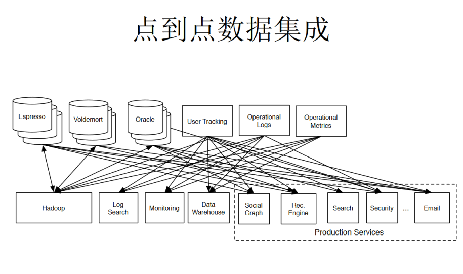
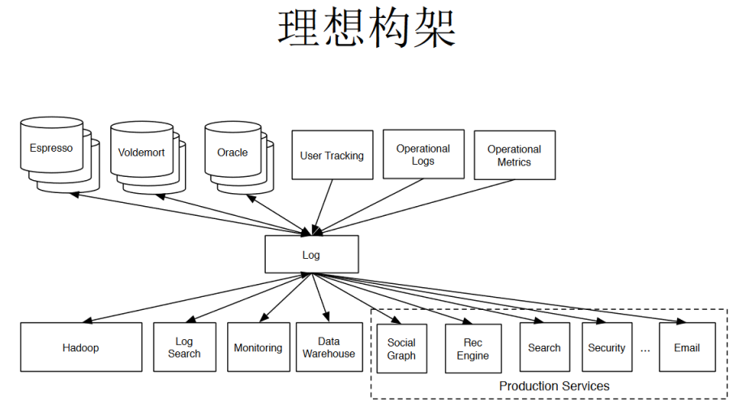
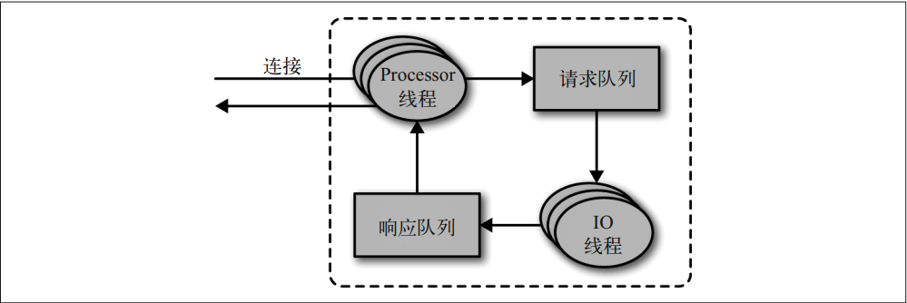
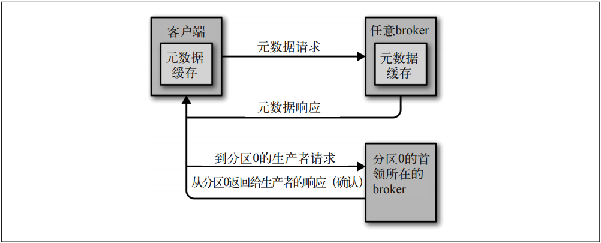
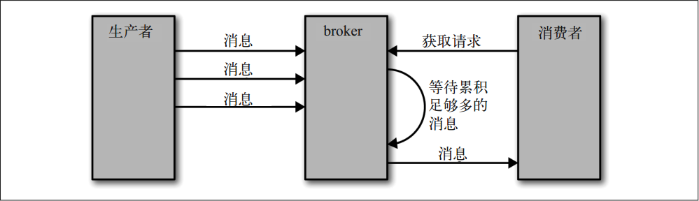
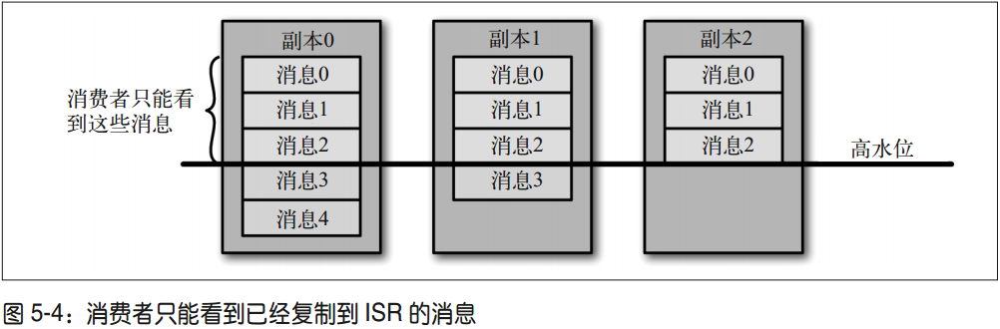

# 为什么使用Kafka？

点到点的数据集成

增加消息中间件

1.传统的生产者消费者关系，是点对点的，直接联系，这样导致需要做很多重复低效的工作。

2.增加发布订阅，这样的中间层，可以让生产者和消费者解耦，很多操作都方便了。

3.传统的消息队列，如RabbitMq，主要是用来处理交易数据的，吞吐量难以满足需求。

4.所有开发高吞吐量的Kafka，用来处理非交易数据。日志存储、批处理、压缩。

5.继续发展，Kafka使用多副本提供了高可靠性，也可以用来处理交易数据。

# Kafka原理

[磁盘I/O那些事](https://tech.meituan.com/2017/05/19/about-desk-io.html)

[Kafka文件存储机制那些事](https://tech.meituan.com/2015/01/13/kafka-fs-design-theory.html)

[云+社区技术沙龙--Kafka meetup深圳站](https://link.zhihu.com/?target=https%3A//cloud.tencent.com/developer/salon/activity-1068)

[闫燕飞：Kafka的高性能揭秘及优化](https://cloud.tencent.com/developer/article/1114834)

Kafka 使用 Zookeeper 的临时节 点来选举控制器，并在节点加入集群或退出集群时通知控制器。

控制器负责在节点加入或离开集群时进行分区首领选举。

控制器使用epoch 来避免“脑裂”。 

## 控制器

控制器其实就是一个 broker，只不过它除了具有一般 broker 的功能之外，还负责分区首领的选举。

集群里第一个启动的 broker 通过在Zookeeper 里创建一个临时节点 /controller 让自己成为控制器。

其他 broker 在启动时也会尝试创建这个节点，不过它们会收到一个“节点已存在”的异常，然后“意识”到控制器节点已存在，也就是说集群里已经有一个控制器了。

其他 broker 在控制器节点上创建Zookeeper watch 对象，这样它们就可以收到这个节点的变更通知。

如果控制器被关闭或者与 Zookeeper 断开连接， Zookeeper 上的临时节点就会消失。集群里的其他 broker 通过 watch 对象得到控制器节点消失的通知，它们会尝试让自己成为新的控制器。

第一个在 Zookeeper 里成功创建控制器节点的 broker 就会成为新的控制器，其他节点会收到“节点已存在”的异常，然后在新的控制器节点上再次创建 watch 对象。

每个新选出的控制器通过 Zookeeper 的条件递增操作获得一个全新的、数值更大的 controller epoch。

其他 broker 在知道当前 controller epoch 后，如果收到由控制器发出的包含较旧epoch 的消息，就会忽略它们。 

当控制器发现一个 broker 已经离开集群（通过观察相关的 Zookeeper 路径），它就知道，那些失去首领的分区需要一个新首领（这些分区的首领刚好是在这个 broker 上）。控制器遍历这些分区，并确定谁应该成为新首领（简单来说就是分区副本列表里的下一个副本），然后向所有包含新首领或现有跟随者的 broker 发送请求。该请求消息包含了谁是新首领以及谁是分区跟随者的信息。随后，新首领开始处理来自生产者和消费者的请求，而跟随者开始从新首领那里复制消息。 

## 如何复制 

复制功能是 Kafka 架构的核心。在 Kafka 的文档里， Kafka 把自己描述成“一个分布式的、可分区的、可复制的提交日志服务”。复制之所以这么关键，是因为它可以在个别节点失效时仍能保证 Kafka 的**可用性**和**持久性**。 

Kafka 使用主题来组织数据，每个主题被分为若干个分区，每个分区有多个副本。那些副本被保存在 broker 上，每个 broker 可以保存成百上千个属于不同主题和分区的副本。 

### 首领副本

每个分区都有一个首领副本。为了保证一致性，所有生产者请求和消费者请求都会经过这个副本。

除了当前首领之外，每个分区都有一个**首选首领**——创建主题时选定的首领就是分区的首选首领。之所以把它叫作首选首领，是因为在创建分区时，需要在 broker 之间均衡首领。因此，我们希望首选首领在成为真正的首领时， broker 间的负载最终会得到均衡。

默认情况下， Kafka 的 auto.leader.rebalance.enable 被设为 true，它会检查首选首领是不是当前首领，如果不是，并且该副本是同步的，那么就会触发首领选举，让首选首领成为当前首领。 

### 跟随者副本

首领以外的副本都是跟随者副本。跟随者副本不处理来自客户端的请求，它们唯一的任务就是从首领那里复制消息，保持与首领一致的状态。如果首领发生崩溃，其中的一个跟随者会被提升为新首领。 

**不同步的跟随者**

一个跟随者副本先请求消息 1，接着请求消息 2，然后请求消息 3，在收到这 3 个请求的响应之前，它是不会发送第 4 个请求消息的。如果跟随者发送了请求消息 4，那么首领就知道它已经收到了前面 3 个请求的响应。通过查看每个跟随者请求的最新偏移量，首领就会知道每个跟随者复制的进度。如果跟随者在 10s 内没有请求任何消息，或者虽然在请求消息，但在 10s 内没有请求最新的数据，那么它就会被认为是不同步的。如果一个副本无法
与首领保持一致，在首领发生失效时，它就不可能成为新首领——毕竟它没有包含全部的消息。

**同步的跟随者**

相反，持续请求得到的最新消息副本被称为同步的副本。在首领发生失效时，只有同步副本才有可能被选为新首领。 

跟随者的正常不活跃时间或在成为不同步副本之前的时间是通过 replica.lag.time.max.ms参数来配置的。这个时间间隔直接影响着首领选举期间的客户端行为和数据保留机制。 

## 处理请求 

broker 的大部分工作是处理客户端、分区副本和控制器发送给分区首领的请求。 Kafka 提供了一个二进制协议（基于 TCP），指定了请求消息的格式以及 broker 如何对请求作出响应——包括成功处理请求或在处理请求过程中遇到错误。客户端发起连接并发送请求，broker 处理请求并作出响应。 broker 按照请求到达的顺序来处理它们——这种顺序保证让Kafka 具有了消息队列的特性，同时保证保存的消息也是有序的。 

broker 会在它所监听的每一个端口上运行一个 Acceptor 线程，这个线程会创建一个连接，并把它交给 Processor 线程去处理。 Processor 线程（也被叫作“网络线程”）的数量是可配置的。网络线程负责从客户端获取请求消息，把它们放进请求队列，然后从响应队列获取响应消息，把它们发送给客户端。 

生产请求：生产者发送的请求，它包含客户端要写入 broker 的消息。
获取请求：在消费者和跟随者副本需要从 broker 读取消息时发送的请求 

生产请求和获取请求都必须发送给分区的首领副本。如果 broker 收到一个针对特定分区的请求，而该分区的首领在另一个 broker 上，那么发送请求的客户端会收到一个“非分区首领”的错误响应。当针对特定分区的获取请求被发送到一个不含有该分区首领的 broker上，也会出现同样的错误。 Kafka 客户端要自己负责把生产请求和获取请求发送到正确的broker 上。

那么客户端怎么知道该往哪里发送请求呢？客户端使用了另一种请求类型，也就是**元数据请求**。这种请求包含了客户端感兴趣的主题列表。服务器端的响应消息里指明了这些主题所包含的分区、每个分区都有哪些副本，以及哪个副本是首领。元数据请求可以发送给任意一个 broker，因为所有 broker 都缓存了这些信息。

一般情况下，客户端会把这些信息缓存起来，并直接往目标 broker 上发送生产请求和获取请求。它们需要时不时地通过发送元数据请求来刷新这些信息（刷新的时间间隔通过 metadata.max.age.ms 参数来配置），从而知道元数据是否发生了变更——比如，在新broker 加入集群时，部分副本会被移动到新的 broker 上（如图 5-2 所示）。另外，如果客户端收到“非首领”错误，它会在尝试重发请求之前先刷新元数据，因为这个错误说明了客户端正在使用过期的元数据信息，之前的请求被发到了错误的 broker 上。 

### 生产请求

包含首领副本的 broker 在收到生产请求时，会对请求做一些验证。
• 发送数据的用户是否有主题写入权限？
• 请求里包含的 acks 值是否有效（只允许出现 0、 1 或 all）？
• 如果 acks=all，是否有足够多的同步副本保证消息已经被安全写入？

之后，消息被写入本地磁盘。在 Linux 系统上，消息会被写到文件系统缓存里，并不保证它们何时会被刷新到磁盘上。 Kafka 不会一直等待数据被写到磁盘上——它依赖复制功能来保证消息的持久性。

在消息被写入分区的首领之后， broker 开始检查 acks 配置参数——如果 acks 被设为 0 或 1，那么 broker 立即返回响应；如果 acks 被设为 all，那么请求会被保存在一个叫作炼狱的缓冲区里，直到首领发现所有跟随者副本都复制了消息，响应才会被返回给客户端。 

### 获取请求

broker 处理获取请求的方式与处理生产请求的方式很相似。客户端发送请求，向 broker 请求主题分区里具有特定偏移量的消息，好像在说：“请把主题 Test 分区 0 偏移量从 53 开始的消息以及主题 Test 分区 3 偏移量从 64 开始的消息发给我。”客户端还可以指定 broker 最多可以从一个分区里返回多少数据。 

客户端除了可以设置 broker 返回数据的上限，也可以设置下限。例如，如果把下限设置为10KB，就好像是在告诉 broker：“等到有 10KB 数据的时候再把它们发送给我。”在主题消息流量不是很大的情况下，这样可以减少 CPU 和网络开销。客户端发送一个请求， broker等到有足够的数据时才把它们返回给客户端，然后客户端再发出请求，而不是让客户端每隔几毫秒就发送一次请求，每次只能得到很少的数据甚至没有数据。对比这两种情况，它们最终读取的数据总量是一样的，但前者的来回传送次数更少，因此开销也更小。 

当然，我们不会让客户端一直等待 broker 累积数据。在等待了一段时间之后，就可以把可用的数据拿回处理，而不是一直等待下去。所以，客户端可以定义一个超时时间，告诉 broker：“如果你无法在 X 毫秒内累积满足要求的数据量，那么就把当前这些数据返回给我。” 

有意思的是，并不是所有保存在分区首领上的数据都可以被客户端读取。大部分客户端只能读取已经被写入所有同步副本的消息（跟随者副本也不行，尽管它们也是消费者——否则复制功能就无法工作）。分区首领知道每个消息会被复制到哪个副本上，在消息还没有被写入所有同步副本之前，是不会发送给消费者的——尝试获取这些消息的请求会得到空的响应而不是错误。 

因为还没有被足够多副本复制的消息被认为是“不安全”的——如果首领发生崩溃，另一个副本成为新首领，那么这些消息就丢失了。如果我们允许消费者读取这些消息，可能就会破坏一致性。 这也意味着，如果 broker 间的消息复制因为某些原因变慢，那么消息到达消费者的时间也会随之变长（因为我们会先等待消息复制完毕）。延迟时间可以通过参数 replica.lag.time.max.ms 来配置，它指定了副本在复制消息时可被允许的最大延迟时间。 

### 其他请求

到此为止，我们讨论了 Kafka 最为常见的几种请求类型：元数据请求、生产请求和获取请求。重要的是，我们讨论的是客户端在网络上使用的通用二进制协议。 Kafka 内置了由开源社区贡献者实现和维护的 Java 客户端，同时也有用其他语言实现的客户端，如 C、Python、 Go 语言等。 Kafka 网站上有它们的完整清单，这些客户端就是使用这个二进制协议与 broker 通信的。

另外， broker 之间也使用同样的通信协议。它们之间的请求发生在 Kafka 内部，客户端不应该使用这些请求。例如，当一个新首领被选举出来，控制器会发送 LeaderAndIsr 请求给新首领（这样它就可以开始接收来自客户端的请求）和跟随者（这样它们就知道要开始跟随新首领）。 

## 物理存储

### 分区分配

在创建主题时， Kafka 首先会决定如何在 broker 间分配分区。假设你有 6 个 broker，打算创建一个包含 10 个分区的主题，并且复制系数为 3。那么 Kafka 就会有 30 个分区副本，它们可以被分配给 6 个 broker。 在进行分区分配时，我们要达到如下的目标。

• 在 broker 间平均地分布分区副本。对于我们的例子来说，就是要保证每个 broker 可以分到 5 个副本。

• 确保每个分区的每个副本分布在不同的 broker 上。假设分区 0 的首领副本在 broker 2 上，那么可以把跟随者副本放在 broker 3 和 broker 4 上，但不能放在 broker 2 上，也不能两个都放在 broker 3 上。

• 如果为 broker 指定了机架信息，那么尽可能把每个分区的副本分配到不同机架的 broker上。这样做是为了保证一个机架的不可用不会导致整体的分区不可用。 

### 文件管理

保留数据是 Kafka 的一个基本特性， Kafka 不会一直保留数据，也不会等到所有消费者都读取了消息之后才删除消息。相反， Kafka 管理员为每个主题配置了数据保留期限，规定数据被删除之前可以保留多长时间，或者清理数据之前可以保留的数据量大小。

因为在一个大文件里查找和删除消息是很费时的，也很容易出错，所以我们把分区分成若干个片段。默认情况下，每个片段包含 1GB 或一周的数据，以较小的那个为准。在 broker往分区写入数据时，如果达到片段上限，就关闭当前文件，并打开一个新文件。当前正在写入数据的片段叫作活跃片段。活动片段永远不会被删除，所以如果你要保留数据 1 天，但片段里包含了 5 天的数据，那么这些数据会被保留 5 天，因为在片段被关闭之前这些数据无法被删除。如果你要保留数据一周，而且每天使用一个新片段，那么你就会看到，每天在使用一个新片段的同时会删除一个最老的片段——所以大部分时间该分区会有 7 个片段存在。 

### 索引

消费者可以从 Kafka 的任意可用偏移量位置开始读取消息。假设消费者要读取从偏移量 100开始的 1MB 消息，那么 broker 必须立即定位到偏移量 100（可能是在分区的任意一个片段里），然后开始从这个位置读取消息。为了帮助 broker 更快地定位到指定的偏移量， Kafka为每个分区维护了一个索引。索引把偏移量映射到片段文件和偏移量在文件里的位置。

索引也被分成片段，所以在删除消息时，也可以删除相应的索引。 Kafka 不维护索引的校验和。如果索引出现损坏， Kafka 会通过重新读取消息并录制偏移量和位置来重新生成索引。如果有必要，管理员可以删除索引，这样做是绝对安全的， Kafka 会自动重新生成这些索引。 

# 可靠的数据传递

• Kafka 可以保证分区消息的顺序。如果使用同一个生产者往同一个分区写入消息，而且消息 B 在消息 A 之后写入， 那么 Kafka 可以保证消息 B 的偏移量比消息 A 的偏移量大，而且消费者会先读取消息 A 再读取消息 B。

• 只有当消息被写入分区的所有同步副本时（但不一定要写入磁盘），它才被认为是“已提交”的。生产者可以选择接收不同类型的确认，比如在消息被完全提交时的确认，或者在消息被写入首领副本时的确认，或者在消息被发送到网络时的确认。

• 只要还有一个副本是活跃的，那么已经提交的消息就不会丢失。

• 消费者只能读取已经提交的消息。 

Kafka 的复制机制和分区的多副本架构是 Kafka 可靠性保证的核心。把消息写入多个副本可以使 Kafka 在发生崩溃时仍能保证消息的持久性。

分区首领是同步副本，而对于跟随者副本来说，它需要满足以下条件才能被认为是同步的。
• 与 Zookeeper 之间有一个活跃的会话，也就是说，它在过去的 6s（可配置）内向
Zookeeper 发送过心跳。
• 在过去的 10s 内（可配置）从首领那里获取过消息。
• 在过去的 10s 内从首领那里获取过最新的消息。光从首领那里获取消息是不够的，它还
必须是几乎零延迟的。 

## broker配置

### 复制系数

主 题 级 别 的 配 置 参 数 是 replication.factor， 而 在 broker 级 别 则 可 以 通 过 default.replication.factor 来配置自动创建的主题。
在这本书里，我们假设主题的复制系数都是 3，也就是说每个分区总共会被 3 个不同的broker 复制 3 次。这样的假设是合理的，因为 Kafka 的默认复制系数就是 3——不过用户可以修改它。即使是在主题创建之后，也可以通过新增或移除副本来改变复制系数。 

如果复制系数为 N，那么在 N-1 个 broker 失效的情况下，仍然能够从主题读取数据或向主题写入数据。所以，更高的复制系数会带来更高的可用性、可靠性和更少的故障。另一方面，复制系数 N 需要至少 N 个 broker，而且会有 N 个数据副本，也就是说它们会占用 N 倍的磁盘空间。我们一般会在可用性和存储硬件之间作出权衡。

如果因 broker 重启导致的主题不可用是可接受的（这在集群里是很正常的行为），那么把复制系数设为 1 就可以了。在作出这个权衡的时候，要确保这样不会对你的组织和用户造成影响，因为你在节省了硬件成本的同时也降低了可用性。复制系数为 2 意味着可以容忍1 个 broker 发生失效，看起来已经足够了。不过要记住，有时候 1 个 broker 发生失效会导致集群不稳定（通常是旧版的 Kafka），迫使你重启另一个 broker——集群控制器。也就是
说，如果将复制系数设为 2，就有可能因为重启等问题导致集群不可用。所以这是一个两难的选择。

基于以上几点原因，我们建议在要求可用性的场景里把复制系数设为 3。在大多数情况下，这已经足够安全了——不过我们也见过有些银行使用 5 个副本，以防不测。 

副本的分布也很重要。默认情况下， Kafka 会确保分区的每个副本被放在不同的 broker 上。不过，有时候这样仍然不够安全。如果这些 broker 处于同一个机架上，一旦机架的交换机发生故障，分区就会不可用，这时候把复制系数设为多少都不管用。为了避免机架级别的故障，我们建议把 broker 分布在多个不同的机架上，并使用 broker.rack 参数来为每个broker 配置所在机架的名字。如果配置了机架名字， Kafka 会保证分区的副本被分布在多个机架上，从而获得更高的可用性。 

### 不完全的首领选举

我们之前提到过，当分区首领不可用时，一个同步副本会被选为新首领。如果在选举过程中没有丢失数据，也就是说提交的数据同时存在于所有的同步副本上，那么这个选举就是“完全”的。但如果在首领不可用时其他副本都是不同步的，我们该怎么办呢？

unclean.leader.election 只能在 broker 级别（实际上是在集群范围内）进行配置，它的默认值是 true。

如果把 unclean.leader.election.enable 设为 true，就是允许不同步的副本成为首领（也就是“不完全的选举”），那么我们将面临丢失消息的风险。如果把这个参数设为 false，就要等待原先的首领重新上线，从而降低了可用性。我们经常看到一些对数据质量和数据一致性要求较高的系统会禁用这种不完全的首领选举（把这个参数设为 false）。银行系统是这方面最好的例子，大部分银行系统宁愿选择在几分钟甚至几个小时内不处理信用卡支付事务，也不会冒险处理错误的消息。不过在对可用性要求较高的系统里，比如实时点击流分析系统，一般会启用不完全的首领选举。 

### 最少同步副本

在主题级别和 broker 级别上，这个参数都叫 min.insync.replicas。
我们知道，尽管为一个主题配置了 3 个副本，还是会出现只有一个同步副本的情况。如果这个同步副本变为不可用，我们必须在可用性和一致性之间作出选择——这是一个两难的选择。根据 Kafka 对可靠性保证的定义，消息只有在被写入到所有同步副本之后才被认为是已提交的。但如果这里的“所有副本”只包含一个同步副本，那么在这个副本变为不可用时，数据就会丢失。 

如果要确保已提交的数据被写入不止一个副本，就需要把最少同步副本数量设置为大一点的值。对于一个包含 3 个副本的主题，如果 min.insync.replicas 被设为 2，那么至少要存在两个同步副本才能向分区写入数据。 

如果 3 个副本都是同步的，或者其中一个副本变为不可用，都不会有什么问题。不过，如果有两个副本变为不可用，那么 broker 就会停止接受生产者的请求。尝试发送数据的生产者会收到 NotEnoughReplicasException 异常。消费者仍然可以继续读取已有的数据。实际上，如果使用这样的配置，那么当只剩下一个同步副本时，它就变成只读了，这是为了避免在发生不完全选举时数据的写入和读取出现非预期的行为。为了从只读状态中恢复，必须让两个不可用分区中的一个重新变为可用的（比如重启 broker），并等待它变为同步的。 

## 生产者的可靠性

即使我们尽可能把 broker 配置得很可靠，但如果没有对生产者进行可靠性方面的配置，整个系统仍然有可能出现突发性的数据丢失。

请看以下两个例子：

1. 为 broker 配置了 3 个副本，并且禁用了不完全首领选举，这样应该可以保证万无一失。我们把生产者发送消息的 acks 设为 1（只要首领接收到消息就可以认为消息写入成功）。生产者发送一个消息给首领，首领成功写入，但跟随者副本还没有接收到这个消息。首领向生产者发送了一个响应，告诉它“消息写入成功”，然后它崩溃了，而此时消息还没有被其他副本复制过去。另外两个副本此时仍然被认为是同步的（毕竟判定一个副本不同步需要一小段时间），而且其中的一个副本成了新的首领。因为消息还没有被写入这个副本，所以就丢失了，但发送消息的客户端却认为消息已成功写入。因为消费者看不到丢失的消息，所以此时的系统仍然是一致的（因为副本没有收到这个消息，所以消息不算已提交），但从生产者角度来看，它丢失了一个消息。

2. 为 broker 配置了 3 个副本，并且禁用了不完全首领选举。我们接受了之前的教训，把生产者的 acks 设为 all。假设现在往 Kafka 发送消息，分区的首领刚好崩溃，新的首领正在选举当中， Kafka 会向生产者返回“首领不可用”的响应。在这个时候，如果生产者没能正确处理这个错误， 也没有重试发送消息直到发送成功，那么消息也有可能丢失。这算不上是 broker 的可靠性问题，因为 broker 并没有收到这个消息。这也不是一致性问题，因为消费者并没有读到这个消息。问题在于如果生产者没能正确处理这些错误，弄丢消息的是它们自己。

我们该如何避免这些悲剧性的后果呢？每个使用 Kafka的开发人员都要注意两件事情：

1. 根据可靠性需求配置恰当的 acks 值。
2. 在参数配置和代码里正确处理错误。 

### 发送确认

生产者可以选择以下 3 种不同的确认模式。

1. acks=0 意味着如果生产者能够通过网络把消息发送出去，那么就认为消息已成功写入
   Kafka。在这种情况下还是有可能发生错误，比如发送的对象无法被序列化或者网卡发
   生故障，但如果是分区离线或整个集群长时间不可用，那就不会收到任何错误。即使是
   在发生完全首领选举的情况下，这种模式仍然会丢失消息，因为在新首领选举过程中它
   并不知道首领已经不可用了。在 acks=0 模式下的运行速度是非常快的（这就是为什么
   很多基准测试都是基于这个模式），你可以得到惊人的吞吐量和带宽利用率，不过如果
   选择了这种模式，一定会丢失一些消息。 

2. acks=1 意味着首领在收到消息并把它写入到分区数据文件（不一定同步到磁盘上）时
   会返回确认或错误响应。在这个模式下，如果发生正常的首领选举，生产者会在选举时
   收到一个 LeaderNotAvailableException 异常，如果生产者能恰当地处理这个错误（参
   考 6.4.2 节），它会重试发送消息，最终消息会安全到达新的首领那里。不过在这个模式
   下仍然有可能丢失数据，比如消息已经成功写入首领，但在消息被复制到跟随者副本之
   前首领发生崩溃。
3. acks=all 意味着首领在返回确认或错误响应之前，会等待所有同步副本都收到消息。如
	果和 min.insync.replicas 参数结合起来，就可以决定在返回确认前至少有多少个副本
	能够收到消息。这是最保险的做法——生产者会一直重试直到消息被成功提交。不过这
	也是最慢的做法，生产者在继续发送其他消息之前需要等待所有副本都收到当前的消息。
	可以通过使用异步模式和更大的批次来加快速度，但这样做通常会降低吞吐量。 

### 重试

生产者需要处理的错误包括两部分：一部分是生产者可以自动处理的错误，还有一部分是需要开发者手动处理的错误。

如果 broker 返回的错误可以通过重试来解决，那么生产者会自动处理这些错误。生产者向broker 发送消息时， broker 可以返回一个成功响应码或者一个错误响应码。错误响应码可以分为两种，一种是在重试之后可以解决的，还有一种是无法通过重试解决的。例如，如果broker 返回的是 LEADER_NOT_AVAILABLE 错误，生产者可以尝试重新发送消息。也许在这个时候一个新的首领被选举出来了，那么这次发送就会成功。也就是说， LEADER_NOT_AVAILABLE是一个可重试错误。另一方面，如果 broker 返回的是 INVALID_CONFIG 错误，即使通过重试也无法改变配置选项，所以这样的重试是没有意义的。这种错误是不可重试错误。 

### 错误处理

使用生产者内置的重试机制可以在不造成消息丢失的情况下轻松地处理大部分错误，不过对于开发人员来说，仍然需要处理其他类型的错误，包括：

1. 不可重试的 broker 错误，例如消息大小错误、认证错误等；
2. 在消息发送之前发生的错误，例如序列化错误；
3. 在生产者达到重试次数上限时或者在消息占用的内存达到上限时发生的错误。

我们在第 3 章讨论了如何为同步发送消息和异步发送消息编写错误处理器。这些错误处理器的代码逻辑与具体的应用程序及其目标有关。丢弃“不合法的消息” ？把错误记录下来？把这些消息保存在本地磁盘上？回调另一个应用程序？具体使用哪一种逻辑要根据具体的架构来决定。只要记住，如果错误处理只是为了重试发送消息，那么最好还是使用生产者内置的重试机制。 

## 消费者的可靠性

在本章的开始部分可以看到，只有那些被提交到 Kafka 的数据，也就是那些已经被写入所有同步副本的数据，对消费者是可用的，这意味着消费者得到的消息已经具备了一致性。消费者唯一要做的是跟踪哪些消息是已经读取过的，哪些是还没有读取过的。这是在读取消息时不丢失消息的关键。

在从分区读取数据时，消费者会获取一批事件，检查这批事件里最大的偏移量，然后从这个偏移量开始读取另外一批事件。这样可以保证消费者总能以正确的顺序获取新数据，不会错过任何事件。

如果一个消费者退出，另一个消费者需要知道从什么地方开始继续处理，它需要知道前一个消费者在退出前处理的最后一个偏移量是多少。所谓的“另一个”消费者，也可能就是它自己重启之后重新回来工作。这也就是为什么消费者要“提交”它们的偏移量。它们把当前读取的偏移量保存起来，在退出之后，同一个群组里的其他消费者就可以接手它们的工作。如果消费者提交了偏移量却未能处理完消息，那么就有可能造成消息丢失，这也是消费者丢失消息的主要原因。在这种情况下，如果其他消费者接手了工作，那些没有被处理完的消息就会被忽略，永远得不到处理。这就是为什么我们非常重视偏移量提交的时间点和提交的方式。 

### 消费者的可靠配置

为了保证消费者行为的可靠性，需要注意以下 4 个非常重要的配置参数。

1. group.id。这个参数在第 4 章已经详细解释过了，如果两个消费者具有相同的group.id，并且订阅了同一个主题，那么每个消费者会分到主题分区的一个子集，也就是说它们只能读到所有消息的一个子集（不过群组会读取主题所有的消息）。如果你希望消费者可以看到主题的所有消息，那么需要为它们设置唯一的 group.id。
2. auto.offset.reset。这个参数指定了在没有偏移量可提交时（比如消费者第 1 次启动时）或者请求的偏移量在 broker 上不存在时（第 4 章已经解释过这种场景），消费者会做些什么。这个参数有两种配置。一种是 earliest，如果选择了这种配置，消费者会从分区的开始位置读取数据，不管偏移量是否有效，这样会导致消费者读取大量的重复数据，但可以保证最少的数据丢失。一种是 latest，如果选择了这种配置，消费者会从分区的末尾开始读取数据，这样可以减少重复处理消息，但很有可能会错过一些消息。
3. enable.auto.commit。这是一个非常重要的配置参数，你可以让消费者基于任务调度自动提交偏移量，也可以在代码里手动提交偏移量。自动提交的一个最大好处是，在实现消费者逻辑时可以少考虑一些问题。如果你在消费者轮询操作里处理所有的数据，那么自动提交可以保证只提交已经处理过的偏移量（如果忘了消费者轮询是什么，请回顾一下第 4 章的内容）。自动提交的主要缺点是，无法控制重复处理消息（比如消费者在自动
    提交偏移量之前停止处理消息），而且如果把消息交给另外一个后台线程去处理，自动提交机制可能会在消息还没有处理完毕就提交偏移量。
4. auto.commit.interval.ms 与第 3 个参数有直接的联系。如果选择了自动提交偏移量，可以通过该参数配置提交的频度，默认值是每 5 秒钟提交一次。一般来说，频繁提交会增加额外的开销，但也会降低重复处理消息的概率。 

### 显示提交偏移量

1. 总是在处理完事件后再提交偏移量
     如果所有的处理都是在轮询里完成，并且不需要在轮询之间维护状态（比如为了实现聚合操作），那么可以使用自动提交，或者在轮询结束时进行手动提交。 

2. 提交频度是性能和重复消息数量之间的权衡
     即使是在最简单的场景里，比如所有的处理都在轮询里完成，并且不需要在轮询之间维护状态，你仍然可以在一个循环里多次提交偏移量（甚至可以在每处理完一个事件之后），或者多个循环里只提交一次（与生产者的 acks=all 配置有点类似），这完全取决于你在性能和重复处理消息之间作出的权衡。

3. 确保对提交的偏移量心里有数
     在轮询过程中提交偏移量有一个不好的地方，就是提交的偏移量有可能是读取到的最新偏移量，而不是处理过的最新偏移量。要记住，在处理完消息后再提交偏移量是非常关键的——否则会导致消费者错过消息。

4. 再均衡
     在设计应用程序时要注意处理消费者的再均衡问题。我们在第 4 章举了几个例子，一般要在分区被撤销之前提交偏移量，并在分配到新分区时清理之前的状态。

5. 消费者可能需要重试
     有时候，在进行轮询之后，有些消息不会被完全处理，你想稍后再来处理。例如，假设要把 Kafka 的数据写到数据库里，不过那个时候数据库不可用，于是你想稍后重试。要注意，你提交的是偏移量，而不是对消息的“确认”，这个与传统的发布和订阅消息系统不太一样。如果记录 #30 处理失败，但记录 #31 处理成功，那么你不应该提交 #31，否则会导致 #31 以内的偏移量都被提交，包括 #30 在内，而这可能不是你想看到的结果。不过可以采用以下两种模式来解决这个问题。 

     第一种模式，在遇到可重试错误时，提交最后一个处理成功的偏移量，然后把还没有处理好的消息保存到缓冲区里（这样下一个轮询就不会把它们覆盖掉），调用消费者的 pause()方法来确保其他的轮询不会返回数据（不需要担心在重试时缓冲区溢出），在保持轮询的同时尝试重新处理（关于为什么不能停止轮询，请参考第 4 章）。如果重试成功，或者重试次数达到上限并决定放弃，那么把错误记录下来并丢弃消息，然后调用 resume() 方法让消费者继续从轮询里获取新数据。

     第二种模式，在遇到可重试错误时，把错误写入一个独立的主题，然后继续。一个独立的消费者群组负责从该主题上读取错误消息，并进行重试，或者使用其中的一个消费者同时从该主题上读取错误消息并进行重试，不过在重试时需要暂停该主题。这种模式有点像其他消息系统里的 dead-letter-queue。

6. 消费者可能需要维护状态
    有时候你希望在多个轮询之间维护状态，例如，你想计算消息的移动平均数，希望在首次
    轮询之后计算平均数，然后在后续的轮询中更新这个结果。如果进程重启，你不仅需要从
    上一个偏移量开始处理数据，还要恢复移动平均数。有一种办法是在提交偏移量的同时把
    最近计算的平均数写到一个“结果”主题上。消费者线程在重新启动之后，它就可以拿到
    最近的平均数并接着计算。不过这并不能完全地解决问题，因为 Kafka 并没有提供事务支
    持。消费者有可能在写入平均数之后来不及提交偏移量就崩溃了，或者反过来也一样。这是一个很复杂的问题，你不应该尝试自己去解决这个问题，建议尝试一下 KafkaStreams 这
    个类库，它为聚合、连接、时间窗和其他复杂的分析提供了高级的 DSL API。

7. 长时间处理
      有时候处理数据需要很长时间：你可能会从发生阻塞的外部系统获取信息，或者把数据
      写到外部系统，或者进行一个非常复杂的计算。要记住，暂停轮询的时间不能超过几秒
      钟。即使不想获取更多的数据，也要保持轮询，这样客户端才能往 broker 发送心跳。在
      这种情况下，一种常见的做法是使用一个线程池来处理数据，因为使用多个线程可以进
      行并行处理，从而加快处理速度。在把数据移交给线程池去处理之后，你就可以暂停消
      费者，然后保持轮询，但不获取新数据，直到工作线程处理完成。在工作线程处理完成
      之后，可以让消费者继续获取新数据。因为消费者一直保持轮询，心跳会正常发送，就
      不会发生再均衡。

8. 仅一次传递
      有些应用程序不仅仅需要“至少一次”（at-least-once）语义（意味着没有数据丢失），还
      需要“仅一次”（exactly-once）语义。尽管 Kafka 现在还不能完全支持仅一次语义，消费
      者还是有一些办法可以保证 Kafka 里的每个消息只被写到外部系统一次（但不会处理向
      Kafka 写入数据时可能出现的重复数据）。
      实现仅一次处理最简单且最常用的办法是把结果写到一个支持唯一键的系统里，比如键值
      存储引擎、关系型数据库、 ElasticSearch 或其他数据存储引擎。在这种情况下，要么消息
      本身包含一个唯一键（通常都是这样），要么使用主题、分区和偏移量的组合来创建唯一
      键——它们的组合可以唯一标识一个 Kafka 记录。如果你把消息和一个唯一键写入系统，
      然后碰巧又读到一个相同的消息，只要把原先的键值覆盖掉即可。数据存储引擎会覆盖已
      经存在的键值对，就像没有出现过重复数据一样。这个模式被叫作幂等性写入，它是一种
      很常见也很有用的模式。
      如果写入消息的系统支持事务，那么就可以使用另一种方法。最简单的是使用关系型数据
      库，不过 HDFS 里有一些被重新定义过的原子操作也经常用来达到相同的目的。我们把消
      息和偏移量放在同一个事务里，这样它们就能保持同步。在消费者启动时，它会获取最近
      处理过的消息偏移量，然后调用 seek() 方法从该偏移量位置继续读取数据。我们在第 4 章
      已经介绍了一个相关的例子。 

# 流式处理

人们对流式处理的理解非常混乱。因为有太多关于流式处理的定义，它们混淆了实现细节、性能需求、数据模型和软件工程的各个方面。笔者亲眼目睹了发生在关系型数据库上的类似窘境，关系模型的抽象定义总是夹杂了数据库引擎的实现细节和特定局限性。

流式处理领域还处在发展阶段，有一些流行的实现方案，其处理方式可能很特别，或者有特定的局限，但这并不能说明它们的实现细节就是流式处理固有的组成部分。

先来看看什么是数据流（也被称为“事件流”或“流数据”）。首先，数据流是无边界数据集的抽象表示。无边界意味着无限和持续增长。无边界数据集之所以是无限的，是因为随着时间的推移，新的记录会不断加入进来。这个定义已经被包括 Google 和 Amazon 在内的大部分公司所采纳。这个简单的模型（事件流）可以表示很多业务活动，比如信用卡交易、股票交易、包裹递送、流经交换机的网络事件、制造商设备传感器发出的事件、发送出去的邮件、游戏里物体的移动，等等。这个清单是无穷无尽的，因为几乎每一件事情都可以被看成事件的序列。
除了没有边界外，事件流模型还有其他一些属性。

事件流是有序的
事件的发生总是有个先后顺序。以金融活动事件为例，先将钱存进账户后再花钱，这与先花钱再还钱的次序是完全不一样的。后者会出现透支，而前者不会。这是事件流与数据库表的不同点之一。数据库表里的记录是无序的，而 SQL 语法中的 order by 并不是关系模型的组成部分，它是为了报表查询而添加的。

不可变的数据记录
事件一旦发生，就不能被改变。一个金融交易被取消，并不是说它就消失了，相反，这需要往事件流里添加一个额外的事件，表示前一个交易的取消操作。顾客的一次退货并不意味着之前的销售记录被删除，相反，退货行为被当成一个额外的事件记录下来。这是数据流与数据表之间的另一个不同点——可以删除和修改数据表里的记录，但这些操作只不过是发生在数据库里的事务，这些事务可以被看成事件流。假设你对数据库的二进制日志（binlog）、预写式日志（WAL）和重做日志（redo log）的概念都很熟悉，那么就会知道，如果往数据库表插入一条记录，然后将其删除，表里就不会再有这条记录。但重做日志里包含了两个事务：插入事务和删除事务。事件流是可重播的
这是事件流非常有价值的一个属性。用户可以很容易地找出那些不可重播的流（流经套接字的 TCP 数据包就是不可重播的），但对于大多数业务来说，重播发生在几个月前（甚至几年前）的原始事件流是一个很重要的需求。可能是为了尝试使用新的分析方法纠正过去的错误，或是为了进行审计。这也就是为什么我们相信 Kafka 能够让现代业务领域的流式处理大获成功——可以借助 Kafka 来捕捉和重播事件流。如果没有这项能力，流式处理充其量只是数据科学实验室里的一个玩具而已。 如果事件流的定义里没有提到事件所包含的数据和每秒钟的事件数量，那么它就变得毫无意义。不同系统之间的数据是不一样的，事件可以很小（有时候只有几个字节），也可以很大（包含很多消息头的 XML 消息），它们可以是完全非结构化的键值对，可以是半结构化的 JSON，也可以是结构化的 Avro 或 Protobuf。虽然数据流经常被视为“大数据”，并且包含了每秒钟数百万的事件，不过这里所讨论的技术同样适用（通常是更加适用）于小一点的事件流，可能每秒钟甚至每分钟只有几个事件。知道什么是事件流以后，是时候了解“流式处理”的真正含义了。流式处理是指实时地处理一个或多个事件流。流式处理是一种编程范式，就像请求与响应范式和批处理范式那样。下面将对这 3 种范式进行比较，以便更好地理解如何在软件架构中应用流式处理。

请求与响应
这是延迟最小的一种范式，响应时间处于亚毫秒到毫秒之间，而且响应时间一般非常稳定。这种处理模式一般是阻塞的，应用程序向处理系统发出请求，然后等待响应。在数据库领域，这种范式就是线上交易处理（OLTP）。销售点（POS）系统、信用卡处理系统和基于时间的追踪系统一般都使用这种范式。

批处理
这种范式具有高延迟和高吞吐量的特点。处理系统按照设定的时间启动处理进程，比如每天的下午两点开始启动，每小时启动一次等。它读取所有的输入数据（从上一次执行之后的所有可用数据，或者从月初开始的所有数据等），输出结果，然后等待下一次启动。处理时间从几分钟到几小时不等，并且用户从结果里读到的都是旧数据。在数据库领域，它们就是数据仓库（DWH）或商业智能（BI）系统。它们每天加载巨大批次的数据，并生成报表，用户在下一次加载数据之前看到的都是相同的报表。从规模上来说，这种范式既高效又经济。但在近几年，为了能够更及时、高效地作出决策，业务要求在更短的时间内能提供可用的数据，这就给那些为探索规模经济而开发却无法提供低延迟报表的系统带来了巨大的压力。

流式处理
这种范式介于上述两者之间。大部分的业务不要求亚毫秒级的响应，不过也接受不了要等到第二天才知道结果。大部分业务流程都是持续进行的，只要业务报告保持更新，业务产品线能够持续响应，那么业务流程就可以进行下去，而无需等待特定的响应，也不要求在几毫秒内得到响应。一些业务流程具有持续性和非阻塞的特点，比如针对可疑信用卡交易的警告、网络警告、根据供应关系实时调整价格、跟踪包裹。流的定义不依赖任何一个特定的框架、 API 或特性。只要持续地从一个无边界的数据集读取数据，然后对它们进行处理并生成结果，那就是在进行流式处理。重点是，整个处理过程必须是持续的。一个在每天凌晨两点启动的流程，从流里读取 500 条记录，生成结果，然后结束，这样的流程不是流式处理。 

