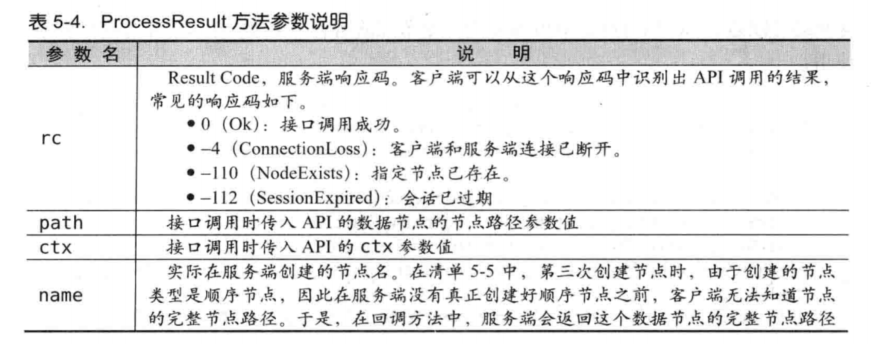

# zookeeper

分布式数据一致性协调服务。简单的数据结构，可以构建集群，顺序访问，高性能。


顺序一致性：同一个客户端发起的事务请求，最终将会严格的按照发起顺序应用到zookeeper中。

原子性：所有事务请求的处理结果在整个集群中所有机器上的应用情况是一致的，也就是说整个集群所有机器，要么都成功应用了某个事务，要么都失败。

单一视图：无论客户端连接的是哪个zookeeper服务器，看到的数据都是一致的。

可靠性：事务一旦提交成功，就会被持久化。

实时性：事务一旦提交成功，就可以在服务端读取的最新数据。


## 部署

1.下载，解压

[下载地址](http://archive.apache.org/dist/zookeeper/)

```shell
tar -zxvf zookeeper-3.4.6.tar.gz
```


2.配置文件zoo.cfg

```cfg
tickTime=2000
initLimit=10
syncLimit=5
dataDir=/opt/apache-zookeeper-3.6.0-bin/data
dataLogDir=/opt/apache-zookeeper-3.6.0-bin/logs
#dubbo服务的提供者和消费者对于zookeeper来说，都是客户端、都访问2181端口
clientPort=2181
server.1=172.18.171.42:2888:3888
```


3.创建myid文件

data目录下创建myid文件，文件第一行写入机器编号，如1。


4.集群部署

如果是集群部署，则在其他机器同样配置。


5.启动服务

进入/bin 目录

```shell
#启动
./zkServer.sh start
#停止
./zkServer.sh stop
#重启
./zkServer.sh restart
#查看状态
./zkServer.sh status
#查看zookeeper输出信息
tail -f zookeeper.out
#启动可以看到日志
./zkServer.sh start-foreground
```


6.测试使用

telnet 112.74.40.155 2181


## 客户端API

[Zookeeper——Java客户端API使用](https://blog.csdn.net/uk8692/article/details/88539494)

### 创建会话
```java
public ZooKeeper(String connectString, int sessionTimeout, Watcher watcher)
public ZooKeeper(String connectString, int sessionTimeout, Watcher watcher,
            boolean canBeReadOnly)
public ZooKeeper(String connectString, int sessionTimeout, Watcher watcher,
            long sessionId, byte[] sessionPasswd)
public ZooKeeper(String connectString, int sessionTimeout, Watcher watcher,
            long sessionId, byte[] sessionPasswd, boolean canBeReadOnly)
```

<table>
<thead>
<tr>
<th>参数名</th>
<th>说明</th>
</tr>
</thead>
<tbody>
<tr>
<td>connectString</td>
<td>指Zookeeper服务器列表，由英文状态逗号分开的host:port字符串组成，每一个都代表一台Zookeeper机器，如，192.168.1.1：2181,192.168.1.2：2181,192.168.1.3:2181。也可在connectString中设置客户端连接上Zookeeper后的根目录，方法是在host:port字符串后添加上这个根目录，如192.168.1.1:2181,192.168.1.2:2181,192.168.1.3:2181/zk-book，这样就指定了该客户端连接上Zookeeper服务器后，所有对Zookeeper的操作都会基于这个根目录。如客户端对/foo/bar的操作，都会指向节点/zk-book/foo/bar—这个目录也叫Chroot，即客户端隔离命名空间。</td>
</tr>
<tr>
<td>sessionTimeout</td>
<td>指会话的超时时间，是一个以“毫秒”为单位的整型值。在Zookeeper中有会话的概念，在一个会话周期内，Zookeeper客户端和服务端之间通过心跳检测机制来维持会话的有效性，一旦在sessionTimeout时间内没有进行有效的心跳检测，会话就消失。</td>
</tr>
<tr>
<td>watcher</td>
<td>默认的Watcher事件通知处理器，该参数也可以设置为null</td>
</tr>
<tr>
<td>canBeReadOnly</td>
<td>boolean类型，用于标识当前会话是否支持“read-only(只读)”模式。默认情况下，在Zookeeper集群中，一个机器如果和集群中过半及以上机器失去了网络连接，那么这个机器将不再处理客户端请求（包括读写请求）。但是在某些使用场景下，当Zookeeper服务器发生此类故障的时候，我们还是希望Zookeeper的服务器能够提供读服务（当然写服务肯定无法提供）——这就是Zookeeper的“read-only”模式。</td>
</tr>
<tr>
<td>sessionId和sessionPasswd</td>
<td>分别代表会话ID和会话秘钥。这两个参数能够唯一确定一个会话，同时客户端使用这两个参数可以实现客户端会话复用，从而达到恢复会话的效果。具体方法是，第一次连上Zookeeper服务器时，通过调用Zookeeper对象实例的以下两个接口，即可获得当前会话的ID和秘钥：long getSessionId() ;byte[] getSessionPasswd();获取到这两个参数值之后，就可以在下次创建Zookeeper对象实例的时候传入构造方法了。</td>
</tr>
</tbody>


### 创建节点

```java
//同步创建
public String create(final String path, byte data[], List<ACL> acl,CreateMode createMode)
//异步创建
public void create(final String path, byte data[], List<ACL> acl,
              CreateMode createMode,  StringCallback cb, Object ctx)
```

<table>
<thead>
<tr>
<th>参数名</th>
<th>说明</th>
</tr>
</thead>
<tbody>
<tr>
<td>path</td>
<td>需要创建的数据节点的节点路径，如，/zk-book/foo</td>
</tr>
<tr>
<td>data[]</td>
<td>一个字节数组，是节点创建后的初始内容</td>
</tr>
<tr>
<td>acl</td>
<td>节点的ACL策略</td>
</tr>
<tr>
<td>createMode</td>
<td>节点类型，是一个枚举类型，通常有4种可选节点类型：<br>持久（PERSISTENT）<br>持久顺序（PERSISTENT_SEQUENTIAL）<br>临时（EPHEMERAL）<br>临时顺序（EPHEMERAL_SEQUENTIAL）</td>
</tr>
<tr>
<td>cb</td>
<td>注册一个异步回调函数。需要我们实现StringCallback接口，对如下方法重写：void processResult(int rc, String path, Object ctx, String name);当服务端节点创建完毕后，Zookeeper客户端会自动调用这个方法，这样就可以处理相关的业务逻辑了。</td>
</tr>
<tr>
<td>ctx</td>
<td>用于传递一个对象，可以在回调方法执行的时候使用，通常是放一个上下文（Context）信息</td>
</tr>
</tbody>
#### 异步回调参数




### 删除节点

```java
void delete(final String path, int version)
void delete(final String path, int version, VoidCallback cb,Object ctx)
```

<table>
<thead>
<tr>
<th>参数名</th>
<th>说明</th>
</tr>
</thead>
<tbody>
<tr>
<td>path</td>
<td>指定数据节点的节点路径，即API调用的目的是删除该节点</td>
</tr>
<tr>
<td>version</td>
<td>指定节点的数据版本，即表明本次删除操作是针对该数据版本进行的</td>
</tr>
<tr>
<td>cb</td>
<td>注册一个异步回调函数</td>
</tr>
<tr>
<td>ctx</td>
<td>用于传递上下文信息的对象</td>
</tr>
</tbody>

### 读取数据

#### getChildren

```java
List<String> getChildren(final String path, Watcher watcher)
List<String> getChildren(String path, boolean watch)
void getChildren(final String path, Watcher watcher,ChildrenCallback cb, Object ctx)
void getChildren(String path, boolean watch, ChildrenCallback cb,Object ctx)
List<String> getChildren(final String path, Watcher watcher,Stat stat)
List<String> getChildren(String path, boolean watch, Stat stat)
void getChildren(final String path, Watcher watcher,Children2Callback cb, Object ctx)
void getChildren(String path, boolean watch, Children2Callback cb,Object ctx)
```

<table>
<thead>
<tr>
<th>参数名</th>
<th>说明</th>
</tr>
</thead>
<tbody>
<tr>
<td>path</td>
<td>指定数据节点的节点路径，即API调用的目的是获取该节点的子节点列表</td>
</tr>
<tr>
<td>watcher</td>
<td>注册的Watcher。一旦在本次子节点获取之后，子节点列表发生变更的话，那么就会向客户端发送通知。该参数允许传入null</td>
</tr>
<tr>
<td>watch</td>
<td>表明是否需要注册一个Watcher</td>
</tr>
<tr>
<td>cb</td>
<td>注册一个异步回调函数</td>
</tr>
<tr>
<td>ctx</td>
<td>用于传递上下文信息的对象</td>
</tr>
<tr>
<td>stat</td>
<td>指定数据节点的节点状态信息。用法是在接口中传入一个旧的stat变量，该stat变量会在方法执行过程中，被来自服务端响应的新stat对象替换</td>
</tr>
</tbody>
关于watcher：

1.zookeeper发送通知的时候，仅仅是发送一个通知，而不是将变化的结果发送过来，所有需要客户端重新获取。

2.watcher通知是一次性的，如果需要持续通知，要反复注册。

#### getData

```java
byte[] getData(final String path, Watcher watcher, Stat stat)
byte[] getData(String path, boolean watch, Stat stat)
void getData(final String path, Watcher watcher,DataCallback cb, Object ctx)
void getData(String path, boolean watch, DataCallback cb, Object ctx)
```

<table>
<thead>
<tr>
<th>参数名</th>
<th>说明</th>
</tr>
</thead>
<tbody>
<tr>
<td>path</td>
<td>指定数据节点的节点路径，即API调用的目的是获取该节点的数据内容</td>
</tr>
<tr>
<td>watcher</td>
<td>注册的Watcher。一旦之后节点内容有变更，就会向客户端发送通知。该参数允许传入null</td>
</tr>
<tr>
<td>stat</td>
<td>指定数据节点的节点状态信息。用法是在接口中传入一个旧的stat变量，该stat变量会在方法执行过程中，被来自服务端响应的新stat对象替换</td>
</tr>
<tr>
<td>watch</td>
<td>表明是否需要注册一个Watcher</td>
</tr>
<tr>
<td>cb</td>
<td>注册一个异步回调函数</td>
</tr>
<tr>
<td>ctx</td>
<td>用于传递上下文信息的对象</td>
</tr>
</tbody>

### 更新数据

```java
Stat setData(final String path, byte data[], int version)
void setData(final String path, byte data[], int version,StatCallback cb, Object ctx)
```

<table>
<thead>
<tr>
<th>参数名</th>
<th>说明</th>
</tr>
</thead>
<tbody>
<tr>
<td>path</td>
<td>指定数据节点的节点路径，即API调用的目的是更新该节点的数据内容</td>
</tr>
<tr>
<td>data[]</td>
<td>一个字节数组，即需要使用该数据内容来覆盖节点现在的数据内容</td>
</tr>
<tr>
<td>version</td>
<td>指定节点的数据版本，即表明本次更新操作是针对该数据版本进行的</td>
</tr>
<tr>
<td>cb</td>
<td>注册一个异步回调函数</td>
</tr>
<tr>
<td>ctx</td>
<td>用于传递上下文信息的对象</td>
</tr>
</tbody>


### 检测节点是否存在

```java
public Stat exists(final String path, Watcher watcher)
public Stat exists(String path, boolean watch)
public void exists(final String path, Watcher watcher,StatCallback cb,
                                         Object ctx)
public void exists(String path, boolean watch, StatCallback cb, Object ctx)
```

<table>
<thead>
<tr>
<th>参数名</th>
<th>说明</th>
</tr>
</thead>
<tbody>
<tr>
<td>path</td>
<td>指定数据节点的节点路径，即API调用的目的是检测该节点是否存在</td>
</tr>
<tr>
<td>watcher</td>
<td>注册的Watcher，用于监听以下三类事件：节点被创建、节点被删除、节点被更新</td>
</tr>
<tr>
<td>watch</td>
<td>指定是否复用Zookeeper中默认的Watcher</td>
</tr>
<tr>
<td>cb</td>
<td>注册一个异步回调函数</td>
</tr>
<tr>
<td>ctx</td>
<td>用于传递上下文信息的对象</td>
</tr>
</tbody>
</table>


### 权限控制

```java
void addAuthInfo(String scheme, byte auth[]);
```

| 参数名 | 说明                                      |
| ------ | ----------------------------------------- |
| scheme | 权限控制模式，分为world、auth、digest、ip |
| auth   | 具体的权限信息                            |

- 对于节点的权限，需要注意的是，当一个客户端为一个节点添加权限信息的时候，该权限信息是添加到了该节点的叶子节点上，操作这些节点需要权限信息，但如果操作该父节点，是不需要权限的。


## 分布式应用

### 分布式消息队列


### 分布式锁

#### 排他锁

/exclusive_lock
​	/lock

获取锁：

所有客户端都试图调用create()，创建临时节点，zookeeper保证只有一个客户端创建成功，那么就可以认为该客户端获取了锁。

获取锁失败的客户端，需要注册一个子节点变更的watcher监听，以便实时监听lock。

释放锁：

获取锁的客户端宕机，或者客户端主动删除锁节点。


#### 共享锁

/shared_lock
	/host1-r-0000000001
	/host2-w-0000000002
	/host3-r-0000000003
	/host4-r-0000000004

获取锁：

所有客户端都回到/shared_lock下建立**临时顺序节点**，如果当前是读请求，那么就创建例如/shared_lock/host1-r-0000000001这样的节点，写请求，创建/shared_lock/host2-w-0000000002这样的节点。

1.创建临时顺序节点。

2.获取/shared_lock子节点列表，对该节点注册子节点变化监听。

3.确定自己的节点序号再子节点的顺序。

4.读请求：如果前面没有写请求，表示自己已经获取了共享锁，开始读。

写请求：如果自己是最前的节点，获取锁，否则阻塞等待。

5.收到watcher，重复步骤2。

#### 改进共享锁

共享锁，每次子节点变化，需要通知全部客户端，获取子节点列表，如果集群太大，效率太低。

其实可以只注册比自己小的节点watcher。

## ZkClient

[ZkClient使用](https://cloud.tencent.com/developer/article/1470953)

ZkClient在原生的Zookeeper API接口上进行了包装，更加简单易用。ZkClient内部还实现了Session超时重连、Watcher反复注册等功能，使得这些操作对开发透明，提高了开发的效率。


### 创建会话

```java
public ZkClient(String serverstring)

public ZkClient(String zkServers, int connectionTimeout)

public ZkClient(String zkServers, int sessionTimeout, int connectionTimeout)

public ZkClient(String zkServers, int sessionTimeout, int connectionTimeout, ZkSerializer zkSerializer)

public ZkClient(IZkConnection connection)

public ZkClient(IZkConnection connection, int connectionTimeout)

public ZkClient(IZkConnection zkConnection, int connectionTimeout, ZkSerializer zkSerializer)
```

- zkServers：Zookeeper的服务器列表，由,分割开的host:port字符串
- sessionTimeout：会话超时时间，单位ms
- connectionTimeout：连接超时时间，单位ms。在该时间内还未与Zookeeper建立连接，则放弃连接抛出异常
- connection：IZkConnection接口的实现类，IZkConnection是对Zookeeper原生接口最直接的包装。IZkConnection有两种主要实现 ZkConnection和InMemoryConnection，最常用的就是ZkConnection
- zkSerializer：自定义序列化器。Zookeeper支持byte[]类型的数据，因此需要开发人员自己定义序列化器，允许用户传入一个自定义的序列化实现，如Hessian，如果不传入默认使用Java自带的序列化方式进行序列化和反序列化。

### 创建节点

```java
public String create(final String path, Object data, final CreateMode mode) throws ZkInterruptedException, IllegalArgumentException, ZkException, RuntimeException

public void createEphemeral(final String path) throws ZkInterruptedException, IllegalArgumentException, ZkException, RuntimeException

public void createEphemeral(final String path, final Object data) throws ZkInterruptedException, IllegalArgumentException, ZkException, RuntimeException

public String createEphemeralSequential(final String path, final Object data) throws ZkInterruptedException, IllegalArgumentException, ZkException, RuntimeException

public void createPersistent(String path) throws ZkInterruptedException, IllegalArgumentException, ZkException, RuntimeException

public void createPersistent(String path, boolean createParents) throws ZkInterruptedException, IllegalArgumentException, ZkException, RuntimeException

public void createPersistent(String path, Object data) throws ZkInterruptedException, IllegalArgumentException, ZkException, RuntimeException

public String createPersistentSequential(String path, Object data) throws ZkInterruptedException, IllegalArgumentException, ZkException, RuntimeException
```

- path：创建的节点路径
- data：创建的节点的数据内容
- mode：节点的类型
- createParents：是否创建子节点

上面第一种创建方式基本和原生的Zookeeper API格式一致，而下面几种创建方式均将节点的类型隐藏在了方法名上，通过方法名就可以看出创建的节点的类型。

### 删除节点

```java
public boolean delete(final String path)

public boolean deleteRecursive(String path)
```

- path：删除节点的路径

delete方法与deleteRecursive方法的区别是deleteRecursive方法可以在节点有子节点的情况下进行删除。

### 读取子节点列表

```java
public List<String> getChildren(String path)

// 不再同一个包下无法调用
protected List<String> getChildren(final String path, final boolean watch)

public List<String> subscribeChildChanges(String path, IZkChildListener listener)
```

- path：指定节点路径，获取该节点的子节点列表
- watch：是否使用默认的Watcher

前两个方法是获取节点的子节点列表，最后一个方法相当于注册了一个Watcher，该方法与注册Watcher的区别是在注册的时候，节点可以不存在也可以监听 而且一次注册永久有效。IZkChildListener主要在以下事件发生时通知客户端：

- path节点被新增时，parentPath为节点名称，currentChilds为空的集合
- path节点被删除时，parentPath为节点名称，currentChilds为null
- path节点有子节点被创建时，parentPath为节点名称，currentChilds为当前子节点的名称(相对路径)列表
- path节点有子节点被删除时，parentPath为节点名称，currentChilds为当前子节点的名称(相对路径)列表，有可能为空的集合 (子节点都被删除的情况)

```java
public interface IZkChildListener {

    public void handleChildChange(String parentPath, List<String> currentChilds) throws Exception;
}
```

### 设置节点内容

```java
public void writeData(String path, Object data)

public void writeData(final String path, Object data, final int expectedVersion)
```

- path：数据节点完整几点的路径
- data：要更新的数据内容
- expectedVersion：基于哪个dataVersion进行变更，利用此属性进行CAS操作

### 读取节点内容

```java
public <T extends Object> T readData(String path)

public <T extends Object> T readData(String path, boolean returnNullIfPathNotExists)

public <T extends Object> T readData(String path, Stat stat)

// 不再同一个包下无法调用
protected <T extends Object> T readData(final String path, final Stat stat, final boolean watch)

public void subscribeDataChanges(String path, IZkDataListener listener)
```

- path：指定要读取的节点
- returnNullIfPathNotExists：字面意思就可以理解，如果节点不存在返回null，而不是抛出异常
- stat：指定数据节点的节点状态信息，在交互过程中，会被服务端响应的新stat替换

最后一个方法相当于注册一个Watcher，IZkDataListener主要在以下事件发生时通知客户端：

- 节点内容发生变化时将会回调handleDataChange方法
- 节点被删除时将会回调handleDataDeleted方法

```java
public interface IZkDataListener {

    public void handleDataChange(String dataPath, Object data) throws Exception;

    public void handleDataDeleted(String dataPath) throws Exception;
}
```

- dataPath：发生变化的节点的全路径名称
- data：节点的新内容

### 检测节点是否存在

下面这个方法就不解释了，就是检测一个节点存不存在

```java
public boolean exists(final String path)
```

### 其他

注册一个Watcher，用来监听当前客户端会话的状态变化，如果客户端会话状态发生变化，将会回调IZkStateListener中的方法

```java
public void subscribeStateChanges(final IZkStateListener listener)

public interface IZkStateListener {

    // 会话状态发生变化时回调
    public void handleStateChanged(KeeperState state) throws Exception;

    // 当一个会话过期重新新家会话的时候回调
    public void handleNewSession() throws Exception;
}
```


