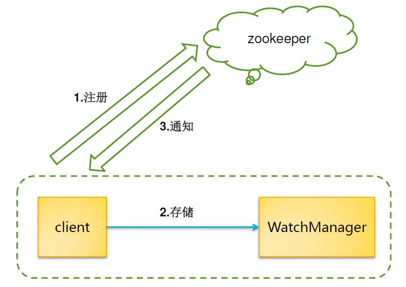

# 分布式理论


## CAP

分布式系统不可能同时满足一致性、可用性和分区容错性。

**一致性**：一致性就是指数据在多个副本中是否能够保持一致性。比如分布式节点中，某个节点更新成功，但是其他节点还是旧数据，这时就发生了数据不一致的问题。

**可用性**：可用性指的是系统提供的服务一直是可用的，用户的请求总是能在**有效时间**内**返回结果**。

**分区容错性**：分布式系统在遇到网络分区的时候，也应该保持系统的一致性和可用性。

对于分布式系统来说，分区容错性是一个最基本的要求，所以只能在一致性和可用性之间进行协调。

## BASE

BASE是指基本可用（Basically Available）、软状态（ Soft State）、最终一致性（ Eventual Consistency）。BASE理论是对CAP理论的延伸，思想是即使无法做到强一致性（CAP的一致性就是强一致性），但可以采用适当的采取弱一致性，即**最终一致性**。

**基本可用（Basically Available）**

基本可用是指分布式系统在出现故障的时候，允许损失部分可用性（例如响应时间、功能上的可用性），允许损失部分可用性。需要注意的是，基本可用绝不等价于系统不可用。

**响应时间上的损失**：正常情况下搜索引擎需要在0.5秒之内返回给用户相应的查询结果，但由于出现故障（比如系统部分机房发生断电或断网故障），查询结果的响应时间增加到了1~2秒。

**功能上的损失**：正常情况下，用户在购物网站上总是能够下订单成功，购物网站在购物高峰（如双十一）时，为了保护系统的稳定性，部分消费者可能会被引导到一个降级页面。

**软状态（ Soft State）**

软状态是指允许系统存在中间状态，而该中间状态不会影响系统整体可用性。分布式存储中一般一份数据会有多个副本，允许不同副本同步的延时就是软状态的体现。比如redis的主从同步。

**最终一致性（ Eventual Consistency）**

最终一致性是指系统中的所有数据副本经过一定时间后，最终能够达到一致的状态，而不需要实时的保证数据的一致性。弱一致性和强一致性相反，最终一致性是弱一致性的一种特殊情况。

### 最终一致性

- Causal consistency（因果一致性）

> 如果Process A通知Process B它已经更新了数据，那么Process B的后续读取操作则读取A写入的最新值，而与A没有因果关系的C则可以最终一致性。

- Read-your-writes consistency （读己所写一致性）

> 如果Process A写入了最新的值，那么Process A的后续操作都会读取到最新值。但是其它用户可能要过一会才可以看到。

- Session consistency （会话一致性）

> 此种一致性要求客户端和存储系统交互的整个会话阶段保证Read-your-writes consistency.Hibernate的session提供的一致性保证就属于此种一致性。

- Monotonic read consistency （单调读一致性）

> 此种一致性要求如果Process A已经读取了对象的某个值，那么后续操作将不会读取到更早的值。

- Monotonic write consistency （单调写一致性）

> 此种一致性保证系统会序列化执行一个Process中的所有写操作。


# 分布式事务一致性协议


## 2PC


阶段一：提交事务请求（投票阶段）

1.协调者事务询问

2.参与者执行事务

3.参与者响应事务协调者询问

阶段二：执行事务提交

1.协调者发送事务提交请求

2.参与者提交事务

3.参与者响应事务提交结果

4.完成事务

中断事务：某个参与者提交失败，反馈no，或者请求超时。

1.协调者发起回滚请求。

2.参与者回滚事务

3.反馈结果，中断完成。

优点：原理简单、实现方便。

缺点：同步阻塞、单点问题、数据不一致。

**同步阻塞**：在二阶段提交执行过程中，所有参与者的事务都处于阻塞状态，也就是说参与者在等待其他参与者响应的过程中，无法进行其他任何操作。这个问题是通过超时判断机制来解决的，但并不能完全解决同步阻塞问题；

**单点问题**：协调者太重要，一旦协调者在阶段二出现问题，参与者将会一直处于堵塞等待状态。实际生产应用中，Coordinator 都会有相应的备选节点；

**数据不一致**：阶段二提交事务的时候，如果部分参与者没有接收到请求，无法提交事务，导致数据不一致。

## 3PC


阶段一：CanCommit

1.协调者事务询问

2.参与者反馈响应。

阶段二：PreCommit

1.协调者发送预提交请求

2.事务预提交。

3.事务执行响应。

如果反馈no或者超时，执行中断事务

阶段三：DoCommit

与2PC相同相似，但是增加了一个参与者超时机制，也就是说，如果参与者预提交完成了，但是一段时间没有接收到docommit请求，会自己主动提交事务。

优点：降低了参与者的阻塞范围，并且能够阶段三之前的一致性。

缺点：不能解决网络分区的导致的数据不一致的问题：例如 1~5 五个参与者节点，1，2，3 个节点在A机房，4，5 节点在 B 机房。在`pre commit`阶段，1~5 个节点都收到 Prepare 消息，但是节点1执行失败。协调者向1~5个节点发送回滚事务的消息。但是此时A，B机房的网络分区。1~3 号节点会回滚。但是 4~5 节点由于没收到回滚事务的消息，而提交了事务。待网络分区恢复后，会出现数据不一致的情况。


## Paxos算法

[Paxos算法](https://zh.wikipedia.org/wiki/Paxos%E7%AE%97%E6%B3%95)

公认的解决分布式一致性问题最有效的算法之一。其实是一种共识算法。

首先将议员的角色分为 proposers，acceptors，和 learners（允许身兼数职）。proposers 提出提案，提案信息包括提案编号和提议的 value；acceptor 收到提案后可以接受（accept）提案，若提案获得多数派（majority）的 acceptors 的接受，则称该提案被批准（chosen）；learners 只能“学习”被批准的提案。划分角色后，就可以更精确的定义问题：

1. 决议（value）只有在被 proposers 提出后才能被批准（未经批准的决议称为“提案（proposal）”）；

2. 在一次 Paxos 算法的执行实例中，只批准（chosen）一个 value；

3. learners 只能获得被批准（chosen）的 value。

批准 value 的过程中，首先 proposers 将 value 发送给 acceptors，之后 acceptors 对 value 进行接受（accept）。为了满足只批准一个 value 的约束，要求经“多数派（majority）”接受的 value 成为正式的决议（称为“批准”决议）。这是因为无论是按照人数还是按照权重划分，两组“多数派”至少有一个公共的 acceptor，如果每个 acceptor 只能接受一个 value，约束2就能保证。

## Raft算法

[Raft算法-维基百科](https://zh.wikipedia.org/wiki/Raft)

[Raft 一致性算法论文译文](https://www.infoq.cn/article/raft-paper)

**Raft**是一个共识算法，取代Paxos。Raft的目标是提供更好理解的算法，并且证明可以提供与Paxos相同的容错性以及性能。

**leader领袖**

**follower追随者**

**candidate候选人**


### 领袖选举

Raft 使用一种心跳机制（heartbeat）来触发领导人的选取。当服务器启动时，它们会初始化为追随者。一台服务器会一直保持追随者的状态只要它们能够收到来自领导人或者候选人的有效 RPC。领导人会向所有追随者周期性发送心跳（heartbeat，不带有任何日志条目的 AppendEntries RPC）来保证它们的领导人地位。如果一个追随者在一个周期内没有收到心跳信息，就叫做选举超时（election timeout）, 然后它就会假定没有可用的领导人并且开始一次选举来选出一个新的领导人。

在起始算法或领袖死机、断线的时候，就需要选举出新的领袖。

此时集群进入新的任期（英语：term）并开始选举，如果选举成功则新的领袖开始运行工作，反之则视此任期终止，开始新的任期并开始下一场选举。

选举是由候选人发动的。当领袖的心跳逾时的时候，追随者就会把自己的任期编号（英语：term counter）加一、宣告竞选、投自己一票、并向其他服务器拉票。每个服务器在每个任期只会投一票，固定投给最早拉票的服务器。

如果候选人收到其他候选人的拉票、而且拉票的任期编号不小于自己的任期编号，就会自认落选，成为追随者，并认定来拉票的候选人为领袖。

如果有候选人收到过半的选票就当选为新的领袖，如果逾时仍没有选出新领袖，此任期自动终止，开始新的任期并开始下一场选举。

Raft每个服务器的逾时期限是随机的，这降低伺服务同时竞选的几率，也降低因两个竞选人得票都不过半而选举失败的几率。

### 日志复制

记录复写的责任在领袖身上。

整个集群有个复写的状态机（英语：state machine），可执行外来的指令。领袖接收指令，将之写入自己记录中的新指令部分，然后把指令转发给追随者。如果有追随者没反应，领袖会不断重发指令、直到每个追随者都成功将新指令写入记录为止。

当领袖收到过半追随者确认写入的消息，就会把指令视为已存储（英语：committed）。当追随者发现指令状态变成已存储，就会在其状态机上运行该指令。

当领袖死机时，领袖的某些新指令可能还没复写到集群整体，造成集群的记录处于不一致的状态。新领袖会担起重返一致的责任，让每个追随者的记录都和它的一致，做法是：和每个追随者比对记录，找出两者一致的最后一笔指令，删除追随者之后的指令，把自己之后的指令拷贝给追随者。这个机制完成时，每个服务器的记录就会一致。


### 安全性

Raft保证以下的安全性：

- **选举安全性**：每个任期最多只能选出一个领袖。
- **领袖附加性**：领袖只会把新指令附加（英语：append）在记录尾端，不会改写或删除已有指令。
- **记录符合性**：如果某个指令在两个记录中的任期和指令序号一样，则保证序号较小的指令也完全一样。
- **领袖完整性**：如果某个指令在某个任期中存储成功，则保证存在于领袖该任期之后的记录中。
- **状态机安全性**：如果某服务器在其状态机上运行了某个指令，其他服务器保证不会在同个状态上运行不同的指令。


### 数据类型

临时(EPHEMERAL): 在创建临时Znode的客户端会话结束时，服务器会将临时节点删除。临时节点不能有子节点(即使是临时子节点)。虽然每个临时Znode都会绑定一个特定的客户端会话，但是它们对所有客户端都是可见的

持久(PERSISTENT): 节点一旦被创建，会一直存在与服务器上，Zookeeper规定所有非叶子节点必须是持久化节点

顺序(SEQUENTIAL): 如果在创建Znode时设置了顺序标识，那么该Znode名称之后便会附加一个值，这个值由一个单调递增的计数器(由父节点维护)所添加


### 状态信息stat

| 状态属性       | 说明                                                         |
| -------------- | ------------------------------------------------------------ |
| cZxid          | 创建节点的事务 zxid                                          |
| ctime          | Created Time表示节点被创建的时间戳                           |
| mZxid          | Modified ZXID 表示该节点最后一次被更新时的事务ID             |
| mtime          | Modified Time表示节点最后一次被更新的时间戳                  |
| pZxid          | 表示该节点的子节点列表最后一次被修改时的事务ID。只有子节点列表变更了才会变更pZxid,子节点内容变更不会影响pZxid |
| cversion       | 子节点的版本号                                               |
| dataVersion    | 数据节点版本号                                               |
| aclVersion     | 节点的ACL版本号                                              |
| ephemeralOwner | 创建该临时节点的会话的SessionID。如果节点是持久节点，这个属性为0 |
| dataLength     | 数据内容的长度                                               |
| numChildren    | 当前节点的子节点个数                                         |


### 版本-原子操作

| 版本类型    | 说明                    |
| ----------- | ----------------------- |
| dataVersion | 当前节点数据内容版本号  |
| cversion    | 当前节点子节点的版本号  |
| aclVersion  | 当前节点的ACL变更版本号 |

乐观锁保证操作原子性。

假如有一个客户端试图进行更新操作，它会携带上次获取到的version值进行更新。

而如果在这段时间内，ZooKeeper服务器上该节点的数值恰好已经被其他客户端更新了，那么其数据版本一定也会发生变化，

因此肯定与客户端携带对的version无法匹配，于是便无法成功更新 -- ***因此可以有效地避免一些分布式更新的并发问题***。

```java
version = setDataRequest.getVersion();
int currentVersion = nodeRecord.stat.getVersion();
if (version != -1 && version != currentVersion) {
    throw new KeeperException .BadVersionException(path);
}
version = currentVersion + 1;
```


### Watcher-观察者模式

[搞懂ZooKeeper的Watcher之源码分析及特性总结](https://www.cnblogs.com/GrimMjx/p/10922480.html)

ZooKeeper允许客户端向服务端注册感兴趣的Watcher监听，当服务端触发了这个Watcher，那么就会向客户端发送一个时间来实现分布式的通知功能。真正的Watcher回调与业务逻辑执行都在客户端

　　那么需要注意一下，给客户端的通知里只会告诉你通知状态（KeeperState），事件类型（EventType）和路径（Path）。**不会告诉你原始数据和更新过后的数据！**

　　Watcher机制包括三部分：注册、存储、通知

1. 注册：注册Watcher
2. 存储：将Watcher对象存在客户端的WatcherManager中
3. 通知：服务端触发Watcher事件，通知客户端，客户端从WatcherManager中取出对应的Watcher对象执行回调 




### ACL-访问控制

Access Control List权限控制机制来保障数据的安全性。

  zookeeper的ACL机制，表现模式为**scheme : id : permissions**

​            1    第一个scheme表示采用哪一种授权机制，zookeeper总共提供了四种机制

​                     world：下面只有一个id，叫anyone，world:anyone代表任何人，zookeeper中对所有人有权限的结点就是属于world:anyone类型的。创建节点的默认权限。有唯一的id是anyone授权的时候的模式为  world:anyone:rwadc 表示所有人都对这个节点有rwadc的权限。

​                    auth：不需要id，只要是通过authentication的user都有权限（zookeeper支持通过kerberos来进行authencation,  也支持username/password形式的authentication)。

​                    digest：它对应的id为username:BASE64(SHA1(password))，它需要先通过加密过的username:password形式的authentication。

​                    ip：它对应的id为客户机的IP地址，设置的时候可以设置一个ip段，比如ip:192.168.1.0/16。

​                    super：在这种scheme情况下，对应的id拥有超级权限，可以做任何事情(cdrwa）。

​            2    第二个id表示用户

​                    通过zkCli.sh设置acl时，scheme是digest的时候，id需要密文，通过Zookeeper的客户端编码方式添加认证，digest对应的auth数据是明文。

​            3    第三个permissions表示相关权限，zookeeper总共提供了五种权限

| 权限   | 说明                                     | 简写 |
| ------ | ---------------------------------------- | ---- |
| CREATE | 可以创建子节点                           | c    |
| READ   | 可以获取节点数据以及当前节点的子节点列表 | r    |
| WRITE  | 可以为节点设置数据                       | w    |
| DELETE | 可以删除节点                             | d    |
| ADMIN  | 可以为节点设置权限                       | a    |


# zookeeper

[阿里巴巴为什么不用 ZooKeeper 做服务发现？](https://yq.aliyun.com/articles/601745)

## ZAB协议

zookeeper atomic broadcast （zookeeper 原子广播协议）

1.所有的事务必须由一个全局唯一的服务器来协调处理，也就是leader，剩下的服务器则成为follower。

2.leader负责将一个客户端请求转换成一个事务提议proposal，并分发给集群的follower服务器。

3.leader需要等待所有follower服务器的反馈，一旦超过半数反馈成功，leader将再次向所有follower分发commit消息，将proposal提交。

- 节点状态
  - Looking ：系统刚启动时或者Leader崩溃后正处于选举状态 
  - Following ：Follower节点所处的状态，Follower与Leader处于数据同步阶段； 
  - Leading ：Leader所处状态，当前集群中有一个Leader为主进程；
    

ZAB协议定义了 **选举（election）、发现（discovery）、同步（sync）、广播(Broadcast)** 四个阶段；ZAB选举（election）时当Follower存在ZXID（事务ID）时判断所有Follower节点的事务日志，只有lastZXID的节点才有资格成为Leader，这种情况下选举出来的Leader总有最新的事务日志，基于这个原因所以ZooKeeper实现的时候把 发现（discovery）与同步（sync）合并为恢复（recovery） 阶段；

**Election** ：在Looking状态中选举出Leader节点，Leader的lastZXID总是最新的；

**Discovery** ：Follower节点向准Leader推送FOllOWERINFO，该信息中包含了上一周期的epoch，接受准Leader的NEWLEADER指令，检查newEpoch有效性，准Leader要确保Follower的epoch与ZXID小于或等于自身的；

**sync** ：将Follower与Leader的数据进行同步，由Leader发起同步指令，最总保持集群数据的一致性；

**Broadcast** ：Leader广播Proposal与Commit，Follower接受Proposal与Commit；

**Recovery** ：在Election阶段选举出Leader后本阶段主要工作就是进行数据的同步，使Leader具有highestZXID，集群保持数据的一致性；

### 消息广播(Broadcast)

客户端提交事务请求时Leader节点为每一个请求生成一个事务Proposal，将其发送给集群中所有的Follower节点，收到过半Follower的反馈后开始对事务进行提交，ZAB协议使用了原子广播协议；在ZAB协议中只需要得到过半的Follower节点反馈Ack就可以对事务进行提交，这也导致了Leader几点崩溃后可能会出现数据不一致的情况，ZAB使用了崩溃恢复来处理数字不一致问题；消息广播使用了TCP协议进行通讯所有保证了接受和发送事务的顺序性。广播消息时Leader节点为每个事务Proposal分配一个全局递增的ZXID（事务ID），每个事务Proposal都按照ZXID顺序来处理；

Leader节点为每一个Follower节点分配一个队列按事务ZXID顺序放入到队列中，且根据队列的规则FIFO来进行事务的发送。Follower节点收到事务Proposal后会将该事务以事务日志方式写入到本地磁盘中，成功后反馈Ack消息给Leader节点，Leader在接收到过半Follower节点的Ack反馈后就会进行事务的提交，以此同时向所有的Follower节点广播Commit消息，Follower节点收到Commit后开始对事务进行提交；

1.leader收到一个事务请求，生成一个事务Proposal。(follower收到事务请求，也会传给leader)

2.leader把Proposal分发给所有follower。

3.leader只需收到过半的follower反馈ack，就可以对事务提交。

4.leader向所有follower广播commit消息。

5.follower节点收到commit，开始提交事务。

### 崩溃恢复（Recovery）

1.leader崩溃，或者失去了与过半follower的联系，进入崩溃恢复。

2.leader选举，选举出的leader应该拥有最大的事务id(ZXID)的提案。

3.follower数据同步，确认事务日志中所有的提案，已经被集群中过半的节点提交。对于需要被丢弃的提案，进行丢弃。

ZAB协议中使用ZXID作为事务编号，ZXID为64位数字。

低32位为一个递增的计数器，每一个客户端的一个事务请求时Leader产生新的事务后该计数器都会加1。

高32位为Leader周期epoch编号。

当新选举出一个Leader节点时，Leader会取出本地日志中最大事务Proposal的ZXID，解析出对应的epoch把该值加1作为新的epoch，将低32位置0开始生成新的ZXID。

ZAB使用epoch来区分不同的Leader周期；

#### 选举（Election）

election阶段必须确保选出的Leader具有最大的ZXID，否则在Recovery阶段没法保证数据的一致性。

Recovery阶段Leader要求Follower向自己同步数据，所有Follower要求与Leader保持数据同步，因此选举出来的Leader要具有最新的ZXID；

在选举的过程中会对每个Follower节点的ZXID进行对比只有highestZXID的Follower才可能当选Leader；

选举流程：

1.每个Follower都向其他节点发送选自身为Leader的Vote投票请求，等待回复；

2.Follower接受到的Vote如果比自身的大（ZXID更新）时则投票，并更新自身的Vote，否则拒绝投票；

3.每个Follower中维护着一个投票记录表，当某个节点收到过半的投票时，结束投票并把该Follower选为Leader，投票结束；


#### 数据同步

在election阶段选举出来的Leader已经具有最新的ZXID，所有本阶段的主要工作是根据Leader的事务日志对Follower节点数据进行更新；

Leader：Leader生成新的ZXID与epoch，接收Follower发送过来的FOllOWERINFO（含有当前节点的LastZXID）然后往Follower发送NEWLEADER；Leader根据Follower发送过来的LastZXID根据数据更新策略向Follower发送更新指令；

同步策略：

SNAP ：如果Follower数据太老，Leader将发送快照SNAP指令给Follower同步数据；

DIFF ：Leader发送从Follolwer.lastZXID到Leader.lastZXID议案的DIFF指令给Follower同步数据；

TRUNC ：当Follower.lastZXID比Leader.lastZXID大时，Leader发送从Leader.lastZXID到Follower.lastZXID的TRUNC指令让Follower丢弃该段数据；

Follower：往Leader发送FOLLOERINFO指令，Leader拒绝就转到Election阶段；接收Leader的NEWLEADER指令，如果该指令中epoch比当前Follower的epoch小那么Follower转到Election阶段；Follower还有主要工作是接收SNAP/DIFF/TRUNC指令同步数据与ZXID，同步成功后回复ACKNETLEADER，然后进入下一阶段；Follower将所有事务都同步完成后Leader会把该节点添加到可用Follower列表中；

SNAP与DIFF用于保证集群中Follower节点已经Committed的数据的一致性，TRUNC用于抛弃已经被处理但是没有Committed的数据；


## 数据模型

```
ZooKeeper数据模型的结构与Unix文件系统很类似， 整体上可以看作是一棵树， 每个节点称做一个ZNode。 每一个ZNode默认能够存储1MB的数据， 每个ZNode都可以通过其路径唯一标识。 
```


