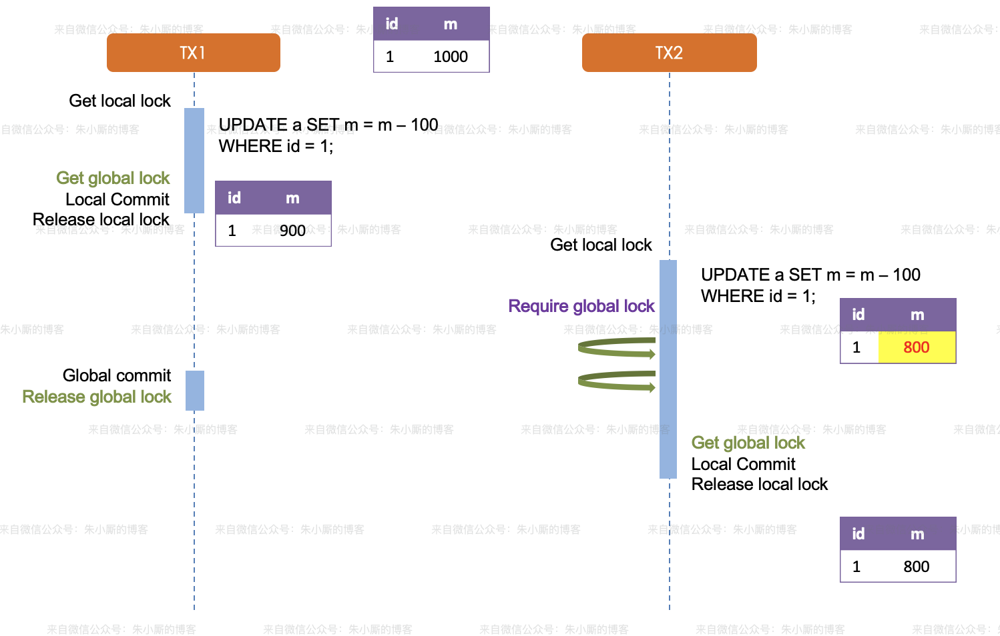
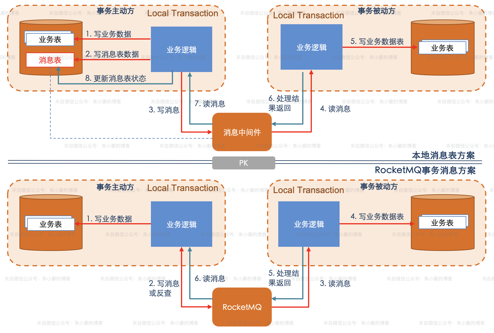

# 分布式事务

[分布式事务科普](https://honeypps.com/architect/introduction-of-distributed-transaction/)

随着业务的快速发展、业务复杂度越来越高，传统单体应用逐渐暴露出了一些问题，例如开发效率低、可维护性差、架构扩展性差、部署不灵活、健壮性差等等。而微服务架构是将单个服务拆分成一系列小服务，且这些小服务都拥有独立的进程，彼此独立，很好地解决了传统单体应用的上述问题，但是在微服务架构下如何保证事务的一致性呢？本文首先从事务的概念出来，带大家先回顾一下ACID、事务隔离级别、CAP、BASE、2PC、3PC等基本理论，然后再详细讲解分布式事务的解决方案：XA、AT、TCC、Saga、本地消息表、消息事务、最大努力通知等。

## 事务

事务提供一种机制，可以将一个活动涉及的所有操作纳入到一个不可分割的执行单元，组成事务的所有操作只有在所有操作均能正常执行的情况下方能提交，只要其中任一操作执行失败，都将导致整个事务的回滚。简单地说，事务提供一种“要么什么都不做，要么做全套（All or Nothing）”机制。

事务最经典也经常被拿出来说例子就是转账了。假如A要给B转账1000元，这个转账会涉及到两个关键操作就是：将A的余额减少1000元，将B的余额增加1000元。万一在这两个操作之间突然出现错误比如银行系统崩溃，导致A余额减少而B的余额没有增加，这样就不对了。事务就是保证这两个关键操作要么都成功，要么都要失败。

事务应该具有4个属性：原子性、一致性、隔离性、持久性。这四个属性通常称为ACID特性。任何事务机制在实现时，都应该考虑事务的ACID特性，包括：本地事务、分布式事务，即使不能都很好的满足，也要考虑支持到什么程度。

### ACID

ACID 理论是对事务特性的抽象和总结，方便我们实现事务。你可以理解成：如果实现了操作的 ACID 特性，那么就实现了事务。ACID的具体含义详述如下。

**原子性（Atomicity）**：原子性是指**单个事务本身涉及到的数据库操作，要么全部成功，要么全部失败，不存在完成事务中一部分操作的可能。**以上文说的转账为例，就是要么操作全部成功，A的钱少了，B的钱多了；要么就是全部失败，AB保持和原来一直的数目。

**一致性（Consistency）**：**事务必须是使数据库从一个一致性状态变到另一个一致性状态，事务的中间状态不能被观察到的。**还是以转账为例，原来AB账户的钱加一起是1000，相互转账完成时候彼此还是1000，所以一致性理解起来就是事务执行前后的数据状态是稳定的，对于转账就是金额稳定不变，对于其他的事务操作就是事务执行完成之后，数据库的状态是正确的，没有脏数据。

**隔离性（isolation）**：一个事务的执行不能被其他事务干扰。即一个事务内部的操作及使用的数据对并发的其他事务是隔离的，并发执行的各个事务之间不能互相干扰。隔离性侧重于多个事务之间的特性，也就是说多个事务之间是没有相互影响的比如A给B转账和B给C转账这两个事务是没有影响的（这里B给C转账如果和A给B转账的事务同时进行的时候，B的金额正确性问题保证就要看隔离级别了）。

**持久性（durability）**：持久性也称永久性（permanence），指一个事务一旦提交，它对数据库中数据的改变就应该是永久性的。接下来的其他操作或故障不应该对其有任何影响。

### 事务的隔离级别

在多个事务并发操作数据库（多线程、网络并发等）的时候，如果没有有效的避免机制，就会出现脏读、不可重复读和幻读这3种问题。

**脏读（Dirty Read）**

A事务读取B事务尚未提交的数据，此时如果B事务由于某些原因执行了回滚操作，那么A事务读取到的数据就是脏数据。

参考下图，事务A读取到了事务B未提交的记录。

 **不可重复读（Nonrepeatable Read）**

一个事务内前后多次读取，数据内容不一致。在这个事务还没有结束时，另外一个事务也访问该同一数据。那么，在第一个事务中的两次读数据之间，由于第二个事务的修改，那么第一个事务两次读到的的数据可能是不一样的。这样在一个事务内两次读到的数据是不一样的，因此称为是不可重复读。

参考下图，事务A读取到的name可能为“张三”，也可能为“李四”。

**幻读（Phantom Read）**

一个事务内前后多次读取，数据总量不一致。参考下图，事务A在执行读取操作，需要两次统计数据的总量，前一次查询数据总量后，此时事务B执行了新增数据的操作并提交后，这个时候事务A读取的数据总量和之前统计的不一样，就像产生了幻觉一样，平白无故的多了几条数据，成为幻读。

 

不可重复读和幻读有些相似，两者的区别在于：不可重复读的重点在于修改，同样的条件, 你读取过的数据,再次读取出来发现值不一样了；而幻读的重点在于新增或者删除`（参考MySQL官网https://dev.mysql.com/doc/refman/5.7/en/innodb-next-key-locking.html`对幻读的定义，记录的减少也应该算是幻读），同样的条件, 第 1 次和第 2 次读出来的记录数不一样。

**隔离级别**

事务的隔离性是指多个并发的事务同时访问一个数据库时，一个事务不应该被另一个事务所干扰，每个并发的事务间要相互进行隔离。SQL 标准定义了以下四种隔离级别：

- **读未提交（Read Uncommitted）**：一个事务可以读取到另一个事务未提交的修改。这种隔离级别是最弱的，可能会产生脏读，幻读，不可重复读的问题问题。
- **读已提交（Read Committed）**：一个事务只能读取另一个事务已经提交的修改。其避免了脏读，仍然存在不可以重复读和幻读的问题。SQL Server和Oracle的默认隔离级别就是这个。
- **可重复读（Repeated Read）**：同一个事务中多次读取相同的数据返回的结果是一样的。其避免了脏读和不可重复读问题，但是幻读依然存在。MySQL中的默认隔离级别就是这个，不过MySQL通过多版本并发控制（MVCC）、Next-key Lock等技术解决了幻读问题。
- **串行化（Serializable）**：这是数据库最高的隔离级别，这种级别下，事务“串行化顺序执行”，也就是一个一个排队执行。在这种级别下，脏读、不可重复读、幻读都可以被避免，但是执行效率奇差，性能开销也最大。

事务的隔离级别和脏读、不可重复读、幻读的关系总结如下表所示：

| 隔离级别 | 脏读   | 不可重复读 | 幻读   |
| -------- | ------ | ---------- | ------ |
| 未提交读 | 可能   | 可能       | 可能   |
| 已提交读 | 不可能 | 可能       | 可能   |
| 可重复读 | 不可能 | 不可能     | 可能   |
| 可串行化 | 不可能 | 不可能     | 不可能 |

## MySQL事务实现原理

这里所说的MySQL事务是指使用InnoDB引擎时的事务。MySQL在5.5版本之前默认的数据库引擎时MyISAM，虽然性能极佳，而且提供了大量的特性，包括全文索引、压缩、空间函数等，但MyISAM不支持事务和行级锁，而且最大的缺陷就是崩溃后无法安全恢复。5.5版本之后，MySQL引入了InnoDB（事务性数据库引擎），MySQL  5.5版本后默认的存储引擎为InnoDB。

redo log和undo log来保证事务的原子性、一致性和持久性，同时采用预写日志（WAL）方式将随机写入变成顺序追加写入，提升事务性能。而隔离性是通过锁技术来保证的。

这里我们不放先来了解一下redo log和undo log。redo log是重做日志，提供前滚操作，undo log是回滚日志，提供回滚操作。undo log不是redo log的逆向过程，其实它们都算是用来恢复的日志：

- redo log通常是物理日志，记录的是数据页的物理修改，而不是某一行或某几行修改成怎样怎样，它用来恢复提交后的物理数据页(恢复数据页，且只能恢复到最后一次提交的位置)。
- undo用来回滚行记录到某个版本。undo log一般是逻辑日志，根据每行记录进行记录。

### redo log

redo log 又称为重做日志，它包含两部分：一是内存中的日志缓冲(redo log buffer)，该部分日志是易失性的；二是磁盘上的重做日志文件(redo log file)，该部分日志是持久的。

当需要修改事务中的数据时，先将对应的redo log写入到redo log  buffer中，然后才在内存中执行相关的数据修改操作。InnoDB通过“force log at  commit”机制实现事务的持久性，即在事务提交的时候，必须先将该事务的所有redo log都写入到磁盘上的redo log  file中，然后待事务的commit操作完成才算整个事务操作完成。

在每次将redo log buffer中的内容写入redo log file时，都需要调用一次fsync操作，以此确保redo  log成功写入到磁盘上（参考下图，内容的流向为：用户态的内存->操作系统的页缓存->物理磁盘）。因此，磁盘的性能在一定程度上也决定了事务提交的性能。这里还可以通过innodb_flush_log_at_trx_commit来控制redo  log刷磁盘的策略，这里就不做赘述了。

 

### undo log

undo log有2个功能：实现回滚和多版本并发控制（MVCC, Multi-Version Concurrency Control）。

在数据修改的时候，不仅记录了redo log，还记录了相对应的undo log，如果因为某些原因导致事务失败或回滚了，可以借助该undo log进行回滚。

undo log和redo log记录物理日志不一样，它是逻辑日志。可以认为当delete一条记录时，undo log中会记录一条对应的insert记录，反之亦然，当update一条记录时，它记录一条对应相反的update记录。

当执行rollback时，就可以从undo log中的逻辑记录读取到相应的内容并进行回滚。有时候应用到行版本控制的时候，也是通过undo  log来实现的：当读取的某一行被其他事务锁定时，它可以从undo  log中分析出该行记录以前的数据是什么，从而提供该行版本信息，让用户实现非锁定一致性读取。

### MVCC

说到undo log，就不得不顺带提一下MVCC了，因为MVCC的实现依赖了undo log。当然，MVCC的实现还依赖了隐藏字段（DB_TRX_ID,DB_ROLL_PTR,DB_ROW_ID）、Read View等。

MVCC的全称是多版本并发控制，它使得在使用READ COMMITTD、REPEATABLE  READ这两种隔离级别的事务下执行一致性读操作有了保证。换言之，就是为了查询一些正在被另一个事务更新的行，并且可以看到它们被更新之前的值。这是一个可以用来增强并发性的强大技术，因为这样的一来的话查询就不用等待另一个事务释放锁，使不同事务的读-写、写-读操作并发执行，从而提升系统性能。

这里的读指的是“快照读”。普通的SELECT操作就是快照读，有的地方也称之为“一致性读”或者“一致性无锁读”。它不会对表中的任何记录做加锁动作，即不加锁的非阻塞读。快照读的前提是隔离级别不是串行化级别，串行化级别下的快照读会退化成当前读。之所以出现快照读的情况，是基于提高并发性能的考虑，这里可以认为MVCC是行锁的一个变种，但它在很多情况下，避免了加锁操作，降低了开销。当然，既然是基于多版本，即快照读可能读到的并不一定是数据的最新版本，而有可能是之前的历史版本。

对应的还有“当前读”。类似UPDATE、DELETE、INSERT、SELECT…LOCK IN SHARE  MODE、SELECT…FOR  UPDATE这些操作就是当前读。为什么叫当前读？就是它读取的是记录的最新版本，读取时还要保证其他并发事务不能修改当前记录，会对读取的记录进行加锁。

### 锁技术

并发事务的读-读情况并不会引起什么问题（读取操作本身不会对记录有任何影响，并不会引起什么问题，所以允许这种情况的发生），不过对于写-写、读-写或写-读这些情况可能会引起一些问题，需要使用MVCC或者加锁的方式来解决它们。

在使用加锁的方式解决问题时，既要允许读-读情况不受影响，又要使写-写、读-写或写-读情况中的操作相互阻塞。这里引入了两种行级锁：

- 共享锁：英文名为Shared Locks，简称S锁。允许事务读一行数据。
- 排它锁：也常称独占锁，英文名为Exclusive Locks，简称X锁。允许事务删除或更新一行数据。

假如事务A首先获取了一条记录的S锁之后，事务B接着也要访问这条记录：1)  如果事务B想要再获取一个记录的S锁，那么事务B也会获得该锁，也就意味着事务A和B在该记录上同时持有S锁； 2)  如果事务B想要再获取一个记录的X锁，那么此操作会被阻塞，直到事务A提交之后将S锁释放掉。

如果事务A首先获取了一条记录的X锁之后，那么不管事务B接着想获取该记录的S锁还是X锁都会被阻塞，直到事务A提交。

除了 S锁 和 S 锁兼容，其他都不兼容。

InnoDB存储引擎还支持多粒度锁定，这种锁定允许事务在行级上的锁和表级上的锁同时存在。为此，InnoDB存储引擎引入了意向锁（表级别锁）：

- 意向共享锁（IS 锁）：事务想要获取一张表的几行数据的共享锁，事务在给一个数据行加共享锁前必须先取得该表的 IS 锁。
- 意向排他锁（IX 锁）：事务想要获取一张表中几行数据的排它锁，事务在给一个数据行加排它锁前必须先取得该表的 IX 锁。

当我们在对使用InnoDB存储引擎的表的某些记录加S锁之前，那就需要先在表级别加一个IS锁，当我们在对使用InnoDB存储引擎的表的某些记录加X锁之前，那就需要先在表级别加一个IX锁。IS锁和IX锁的使命只是为了后续在加表级别的S锁和X锁时判断表中是否有已经被加锁的记录，以避免用遍历的方式来查看表中有没有上锁的记录。

下表展示了X、IX、S、IS锁的兼容性：

| 兼容性 | X      | IX     | S      | IS     |
| ------ | ------ | ------ | ------ | ------ |
| X      | 不兼容 | 不兼容 | 不兼容 | 不兼容 |
| IX     | 不兼容 | 兼容   | 不兼容 | 兼容   |
| S      | 不兼容 | 不兼容 | 兼容   | 兼容   |
| IS     | 不兼容 | 兼容   | 兼容   | 兼容   |

这里还要了解一下的是，在InnoDB中有 3 种行锁的算法：

- Record Locks（记录锁）：单个行记录上的锁。
- Gap Locks（间隙锁）：在记录之间加锁，或者在第一个记录之前加锁，亦或者在最后一个记录之后加锁，即锁定一个范围，而非记录本身。
- Next-Key Locks：结合 Gap Locks 和 Record Locks，锁定一个范围，并且锁定记录本身。主要解决的是 REPEATABLE READ 隔离级别下的幻读问题。

对于Next-Key  Locks，如果我们锁定了一个行，且查询的索引含有唯一属性时（即有唯一索引），那么这个时候InnoDB会将Next-Key  Locks优化成Record  Locks，也就是锁定当前行，而不是锁定当前行加一个范围；如果我们使用的不是唯一索引锁定一行数据，那么此时InnoDB就会按照本来的规则锁定一个范围和记录。还有需要注意的点是，当唯一索引由多个列组成时，如果查询仅是查找其中的一个列，这时候是不会降级的。InnoDB存储引擎还会对辅助索引的下一个键值区间加Gap  Locks（这么做也是为了防止幻读）。

### 总结

MySQL实现事务ACID特性的方式总结如下：

- 原子性：使用 undo log来实现，如果事务执行过程中出错或者用户执行了rollback，系统通过undo log日志返回事务开始的状态。
- 持久性：使用 redo log来实现，只要redo log日志持久化了，当系统崩溃，即可通过redo log把数据恢复。
- 隔离性：通过锁以及MVCC来实现。
- 一致性：通过回滚、恢复以及并发情况下的隔离性，从而实现一致性。

## 理论基石

对于事务，想必大家也或多或少地听到过类似本地事务、数据库事务、传统事务、刚性事务、柔性事务、分布式事务等多种称呼（还有如单机事务、全局事务等称呼），那么这些多种类的事务分别指的是什么呢？

**本地事务**（Local Transaction），通常也被称之为**数据库事务、传统事务**（相对于分布式事务而言）。它仅限于对单一数据库资源的访问控制，如下图（左）所示。

 

不过，现在随着系统架构的服务化，事务的概念也延伸到了服务中，倘若将一个单一的服务操作作为一个事务，那么整个服务操作只能涉及一个单一的数据库资源。由此，本地事务的定义可以扩展为基于单个服务单一数据库资源访问的事务，如上图（右）所示。

本地事务通常由资源管理器进行管理，如下图所示。

 

本地事务的优点就是支持严格的ACID特性，高效，可靠，状态可以只在资源管理器中维护，而且应用编程模型简单。但是本地事务不具备分布式事务的处理能力，隔离的最小单位受限于资源管理器。

与传统的本地事务所对应的是**分布式事务**，它指事务的参与者、支持事务的服务器、资源服务器以及事务管理器分别位于不同的分布式系统的不同节点之上。简单的说，就是一次大的操作由不同的小操作组成，这些小的操作分布在不同的服务器上，且属于不同的应用，分布式事务需要保证这些小操作要么全部成功，要么全部失败。

**刚性事务**是指完全遵循ACID规范的事务。最常见的刚性事务就是数据库事务（本地事务），比如MySQL事务就是一种典型的刚性事务。

在电商领域等互联网场景下，传统的事务在数据库性能和处理能力上都暴露出了瓶颈。在分布式领域基于CAP理论以及BASE理论，有人就提出了**柔性事务**的概念。柔性事务为了满足可用性、性能与降级服务的需要，降低了一致性（Consistency）与隔离性（Isolation）的要求。

## CAP

CAP是指的是在一个分布式系统中、Consistency（一致性）、 Availability（可用性）、Partition tolerance（分区容错性），三者不可得兼。

- 一致性（C）：每次读取要么获得最近写入的数据，要么获得一个错误。
- 可用性（A）：每次请求都能获得一个（非错误）响应，但不保证返回的是最新写入的数据。
- 分区容忍性（P）：尽管任意数量的消息被节点间的网络丢失（或延迟），系统仍继续运行。

ACID理论和CAP理论都有一个C，也都叫一致性, 所以很多人都会把这两个概念当做是一个概念。不过，这两个C是有区别的：

- ACID的C指的是事务中的一致性，在一系列对数据修改的操作中，保证数据的正确性。即数据在事务期间的多个操作中，数据不会凭空的消失或增加，数据的每一个增删改操作都是有因果关系的。比如用户A向用户B转了200块钱，不会出现用户A扣了款，而用户B没有收到的情况。
- 在分布式环境中，多服务之间的复制是异步，需要一定耗时，不会瞬间完成。在某个服务节点的数据修改之后，到同步到其它服务节点之间存在一定的时间间隔，如果在这个间隔内有并发读请求过来，而这些请求又负载均衡到多个节点，可能会出现从多个节点数据不一致的情况，因为请求有可能会落到还没完成数据同步的节点上。CAP中的C就是为了做到在分布式环境中读取的数据是一致的。

总的来说，ACID的C着重强调单数据库事务操作时，要保证数据的完整和正确性，而CAP理论中的C强调的是对一个数据多个备份的读写一致性。

有关CAP的更多解读，可以看看这篇《[越说越迷糊的CAP](https://mp.weixin.qq.com/s/0ULp6g_89P8HK9IaAVvw5w)》。记得关注公众号：朱小厮的博客。

## BASE

在 CAP 理论中，三者不可同时满足，而服务化中，更多的是提升 A 以及 P，在这个过程中不可避免的会降低对 C 的要求，因此，BASE 理论随之而来。

BASE理论来源于 ebay 在 2008 年 ACM 中发表的论文（[下载地址](https://dl.acm.org/doi/10.1145/1394127.1394128)），BASE 理论的基本原则有三个：Basically Available（基本可用）、Soft state（软状态）和 Eventually  consistent（最终一致性），主要目的是为了提升分布式系统的可伸缩性，论文同样阐述了如何对业务进行调整以及折中的手段，BASE  理论的提出为**分布式事务**的发展指出了一个方向。

BASE理论是对CAP中一致性和可用性权衡的结果，其来源于对大规模互联网系统分布式实践的总结，是基于CAP定理逐步演化而来的。BASE理论的核心思想是：即使无法做到强一致性，但每个应用都可以根据自身业务特点，采用适当的方式来使系统达到最终一致性。BASE  理论本质上是对 CAP 理论的延伸，是对 CAP 中 AP 方案的一个补充。

 

**基本可用**

基本可用是指分布式系统在出现不可预知故障的时候，允许损失部分可用性。不过，这绝不等价于系统不可用。比如：

1)    响应时间上的损失。正常情况下，一个在线搜索引擎需要在0.5秒之内返回给用户相应的查询结果，但由于出现故障，查询结果的响应时间增加了1~2秒。
2)    系统功能上的损失：正常情况下，在一个电子商务网站上进行购物的时候，消费者几乎能够顺利完成每一笔订单，但是在一些节日大促购物高峰的时候，由于消费者的购物行为激增，为了保护购物系统的稳定性，部分消费者可能会被引导到一个降级页面。

**软状态**

软状态，也被称之为柔性状态，是指允许系统中的数据存在中间状态，并认为该中间状态的存在不会影响系统的整体可用性，即允许系统在不同节点的数据副本之间进行数据同步的过程存在延时。

**最终一致性**

最终一致性强调的是所有的数据副本，在经过一段时间的同步之后，最终都能够达到一个一致的状态。因此，最终一致性的本质是需要系统保证最终数据能够达到一致，而不需要实时保证系统数据的强一致性。

## 分布式事务的由来

当下互联网发展如火如荼，绝大部分公司都进行了数据库拆分和服务化(SOA)。在这种情况下，完成某一个业务功能可能需要横跨多个服务，操作多个数据库。这就涉及到了分布式事务，用需要操作的资源位于多个资源服务器上，而应用需要保证对于多个资源服务器的数据的操作，要么全部成功，要么全部失败。本质上来说，分布式事务就是为了保证不同资源服务器的数据一致性。

最早的分布式事务应用架构很简单，不涉及服务间的访问调用，仅仅是服务内操作涉及到对多个数据库资源的访问，如下图所示。

 

当一个服务操作访问不同的数据库资源，又希望对它们的访问具有事务特性时，就需要采用分布式事务来协调所有的事务参与者。

典型的应用场景如分表分库中的事务。通常一个库数据量比较大或者预期未来的数据量比较大，都会进行水平拆分，也就是分库分表。对于分库分表的情况，一般开发人员都会使用一些数据库中间件来降低SQL操作的复杂性。如:`INSERT INTO user(id, name) VALUES (1,"张三"),(2,"李四");`这条SQL是操作单库的语法，单库情况下，可以保证事务的一致性。但是由于现在进行了分库分表，开发人员希望将1号记录插入分库1，2号记录插入分库2。所以数据库中间件要将其改写为2条SQL，分别插入两个不同的分库，此时要保证两个库要不都成功，要不都失败，因此基本上所有的数据库中间件都面临着分布式事务的问题。

对于上面介绍的分布式事务应用架构，尽管一个服务操作会访问多个数据库资源，但是毕竟整个事务还是控制在单一服务的内部。如果一个服务操作需要调用另外一个服务，这时的事务就需要跨越多个服务了。在这种情况下，起始于某个服务的事务在调用另外一个服务的时候，需要以某种机制流转到另外一个服务，从而使被调用的服务访问的资源也自动加入到该事务当中来。下图反映了这样一个跨越多个服务的分布式事务。

 

举个简单的例子，一个公司之内，用户的资产可能分为好多个部分，比如余额，积分，优惠券等等，如下图所示。

 

在公司内部有可能积分功能由一个微服务团队维护，优惠券又是另外的团队维护，这样的话就无法保证积分扣减了之后，优惠券能否扣减成功。所以这里也需要使用分布式事务来控制。

如果将上面这两种场景（一个服务可以调用多个数据库资源，也可以调用其他服务）结合在一起，对此进行延伸，整个分布式事务的参与者将会组成如下图所示的树形拓扑结构。在一个跨服务的分布式事务中，事务的发起者和提交均系同一个，它可以是整个调用的客户端，也可以是客户端最先调用的那个服务。

 

上述讨论的分布式事务场景中，无一例外的都直接或者间接的操作了多个数据库。如何保证事务的ACID特性，对于分布式事务实现方案而言，是非常大的挑战。同时，分布式事务实现方案还必须要考虑性能的问题，如果为了严格保证ACID特性，导致性能严重下降，那么对于一些要求快速响应的业务，是无法接受的。

## 分布式事务一致性协议

如果一个操作涉及多个分布式节点，为了保证事务的ACID特性，需要引入一个“协调者”组件来统一调度所有分布式节点的执行逻辑，这些被调度的分布式节点被称为“参与者”。协调者负责调度参与者的行为，并最终决定这些参与者是否真正地提交事务。

分布式事务通常采用二阶段提交协议（2PC）,它是几乎所有分布式事务算法的基础，后续的分布式事务算法几乎都由此改进而来。

### 2PC

二阶段提交（Two-phase Commit，简称2PC），是指为了使基于分布式系统架构下的所有节点在进行事务提交时保持一致性而设计的一种算法（Algorithm）。通常2PC也被称为是一种协议（Protocol）。

在此协议中，一个事务管理器（Transaction Manager，简称 TM，也被称之为“协调者”）协调 1  个或多个资源管理器（Resource Manager，简称  RM，也被称之为“参与者”）的活动，所有资源管理器（参与者）向事务管理器（协调者）汇报自身活动状态，由事务管理器（协调者）根据各资源管理器（协调者）汇报的状态（完成准备或准备失败）来决定各资源管理器（协调者）是“提交”事务还是进行“回滚”操作。

因此，二阶段提交的算法思路可以概括为：参与者将操作成败通知协调者，再由协调者根据所有参与者的反馈情报决定各参与者是否要提交操作还是中止操作。

 

所谓的两个阶段是指：第一阶段：准备阶段(投票阶段)和第二阶段：提交阶段（执行阶段）。

**第一阶段**

协调者通知各个参与者准备提交它们的事务分支。如果参与者判断自己进行的工作可以被提交，那就对工作内容进行持久化，再给协调者肯定答复；要是发生了其他情况，那给协调者的都是否定答复。在发送了否定答复并回滚了已经的工作后，参与者就可以丢弃这个事务分支信息。

以MySQL数据库为例，在第一阶段，事务管理器（协调者）向所有涉及到的数据库服务器（参与者）发出Prepare  “准备提交”请求，数据库（参与者）收到请求后执行数据修改和日志记录等处理，处理完成后只是把事务的状态改成”可以提交”，然后把结果返回给事务管理器（协调者）。

**第二阶段**

协调者根据第一阶段中各个参与者 Prepare的结果，决定是提交还是回滚事务。如果所有的参与者都Prepare成功，那么协调者通知所有的参与者进行提交；如果有参与者Prepare失败的话，则协调者通知所有参与者回滚自己的事务分支。

还是以MySQL数据库为例，如果第一阶段中所有数据库（参与者）都Prepare成功，那么事务管理器（协调者）向数据库服务器（参与者）发出”确认提交”请求，数据库服务器（参与者）把事务的”可以提交”状态改为”提交完成”状态，然后返回应答。如果在第一阶段内有任何一个数据库（参与者）的操作发生了错误，或者事务管理器（协调者）收不到某个数据库（参与者）的回应，则认为事务失败，回撤所有数据库（参与者）的事务。数据库服务器（参与者）收不到第二阶段的确认提交请求，也会把”可以提交”的事务回撤。

2PC提交的优点是尽量保证了数据的强一致，但不是 100% 一致。但是2PC也有明显的缺点：

- **单点故障**：由于协调者的重要性，一旦协调者发生故障，参与者会一直阻塞，尤其是在第二阶段，协调者发生故障，那么所有的参与者都处于锁定事务资源的状态中，而无法继续完成事务操作。
- **同步阻塞**：由于所有节点在执行操作时都是同步阻塞的，当参与者占有公共资源时，其他第三方节点访问公共资源不得不处于阻塞状态。
- **数据不一致**：在第二阶段中，当协调者向参与者发送提交事务请求之后，发生了局部网络异常或者在发送提交事务请求过程中协调者发生了故障，这会导致只有一部分参与者接收到了提交事务请求。而在这部分参与者接到提交事务请求之后就会执行提交事务操作。但是其他部分未接收到提交事务请求的参与者则无法提交事务。从而导致分布式系统中的数据不一致。

二阶段提交的问题：如果协调者在第二阶段发送提交请求之后挂掉，而唯一接受到这条消息的参与者执行之后也挂掉了，即使协调者通过选举协议产生了新的协调者并通知其他参与者进行提交或回滚操作的话，都可能会与这个已经执行的参与者执行的操作不一样。

### 3PC

三阶段提交（Three-phase Commit，简称3PC），是为解决2PC中的缺点而设计的。与两阶段提交不同的是，三阶段提交是“非阻塞”协议。

 

对应于2PC，3PC有两个改动点：

1)    引入**超时机制**。同时在协调者和参与者中都引入超时机制。
2)    在两阶段提交的第一阶段与第二阶段之间插入了一个准备阶段，使得原先在两阶段提交中，参与者在投票之后，由于协调者发生崩溃或错误而导致参与者处于无法知晓是否提交或者中止的“不确定状态”所产生的可能相当长的延时的问题得以解决。

**第一阶段CanCommit**

3PC的CanCommit阶段其实和2PC的准备阶段很像。协调者向参与者发送Commit请求，参与者如果可以提交就返回Yes响应，否则返回No响应。

1)    事务询问：协调者向参与者发送CanCommit请求。询问是否可以执行事务提交操作。然后开始等待参与者的响应。
2)    响应反馈：参与者接到CanCommit请求之后，正常情况下，如果其自身认为可以顺利执行事务，则返回Yes响应，并进入预备状态。否则反馈No。

**第二阶段PreCommit**

协调者根据参与者的反应情况来决定是否可以进行事务的PreCommit操作。根据响应情况，有以下两种可能。

- 假如协调者从所有的参与者获得的反馈都是Yes响应，那么就会执行事务的预执行。

   a)    发送预提交请求：协调者向参与者发送PreCommit请求，并进入Prepared阶段。 

   b)    事务预提交：参与者接收到PreCommit请求后，会执行事务操作，并将undo和redo信息记录到事务日志中。

   c)    响应反馈：如果参与者成功的执行了事务操作，则返回ACK响应，同时开始等待最终指令。  

- 假如有任何一个参与者向协调者发送了No响应，或者等待超时之后，协调者都没有接到参与者的响应，那么就执行事务的中断。

    a)    发送中断请求：协调者向所有参与者发送Abort请求。

    b)    中断事务：参与者收到来自协调者的Abort请求之后（或超时之后，仍未收到协调者的请求），执行事务的中断。

**第三阶段DoCommit**

该阶段进行真正的事务提交，也可以分为以下两种情况。

- Case 1：执行提交。

    a)    发送提交请求：协调者接收到参与者发送的ACK响应，那么他将从预提交状态进入到提交状态。并向所有参与者发送DoCommit请求。

    b)    事务提交：参与者接收到DoCommit请求之后，执行正式的事务提交。并在完成事务提交之后释放所有事务资源。

    c)    响应反馈：事务提交完之后，向协调者发送ACK响应。

    d)    完成事务：协调者接收到所有参与者的ACK响应之后，完成事务。

- Case 2：中断事务。协调者没有接收到参与者发送的ACK响应（可能是接受者发送的不是ACK响应，也可能响应超时），那么就会执行中断事务。

    a)    发送中断请求：协调者向所有参与者发送Abort请求。

    b)    事务回滚：参与者接收到Abort请求之后，利用其在阶段二记录的undo信息来执行事务的回滚操作，并在完成回滚之后释放所有的事务资源。

    c)    反馈结果：参与者完成事务回滚之后，向协调者发送ACK消息。

    d)    中断事务：协调者接收到参与者反馈的ACK消息之后，执行事务的中断。

在三阶段提交中，如果在第三阶段协调者发送提交请求之后挂掉，并且唯一的接受的参与者执行提交操作之后也挂掉了，这时协调者通过选举协议产生了新的协调者。在二阶段提交时存在的问题就是新的协调者不确定已经执行过事务的参与者是执行的提交事务还是中断事务。但是在三阶段提交时，肯定得到了第二阶段的再次确认，那么第二阶段必然是已经正确的执行了事务操作，只等待提交事务了。所以新的协调者可以从第二阶段中分析出应该执行的操作，进行提交或者中断事务操作，这样即使挂掉的参与者恢复过来，数据也是一致的。

所以，三阶段提交解决了二阶段提交中存在的由于协调者和参与者同时挂掉可能导致的数据一致性问题和单点故障问题，并减少阻塞。因为一旦参与者无法及时收到来自协调者的信息之后，他会默认执行提交事务，而不会一直持有事务资源并处于阻塞状态。

不过3PC也存在自身的问题：在提交阶段如果发送的是中断事务请求，但是由于网络问题，导致部分参与者没有接到请求。那么参与者会在等待超时之后执行提交事务操作，这样这些由于网络问题导致提交事务的参与者的数据就与接受到中断事务请求的参与者存在数据不一致的问题。所以无论是  2PC 还是 3PC 都不能保证分布式系统中的数据 100% 一致。

## 分布式事务解决方案

在引入分布式事务前，我们最好先明确一下我们是否真的需要分布式事务。有可能因为过度设计致使微服务过多，从而不得不引入分布式事务，这个时候就不建议你采用下面的任何一种方案，而是把需要事务的微服务聚合成一个单机服务，使用数据库的本地事务。因为不论任何一种方案都会增加你系统的复杂度，这样的成本实在是太高了，千万不要因为追求某些设计，而引入不必要的成本和复杂度。

常见的分布式事务方案有：XA、AT、TCC、Saga、本地消息表、MQ消息事务、最大努力通知等。

### X/Open DTP模型与XA

X/Open，即现在的open group，是一个独立的组织，主要负责制定各种行业技术标准。[官网地址](http://www.opengroup.org)。X/Open组织主要由各大知名公司或者厂商进行支持，这些组织不光遵循X/Open组织定义的行业技术标准，也参与到标准的制定。

DTP全称是Distributed Transaction Process，即分布式事务模型。在DTP本地模型实例中包含3个部分：AP、TM和RM，如下图所示。其中，AP 可以和TM 以及 RM 通信，TM 和 RM 互相之间可以通信。

 

- AP（Application Program，应用程序）：AP定义事务边界（定义事务开始和结束）并访问事务边界内的资源。
- RM（Resource Manager，资源管理器）：RM管理着某些共享资源的自治域，比如说一个MySQL数据库实例。在DTP里面还有两个要求，一是RM自身必须是支持事务的，二是RM能够根据全局（分布式）事务标识（GTID之类的）定位到自己内部的对应事务。
- TM（Transaction Manager，事务管理器）：TM能与AP和RM直接通信，协调AP和RM来实现分布式事务的完整性。负责管理全局事务，分配全局事务标识，监控事务的执行进度，并负责事务的提交、回滚、失败恢复等。

AP和RM之间则通过RM提供的Native API 进行资源控制，这个没有进行约API和规范，各个厂商自己实现自己的资源控制，比如Oracle自己的数据库驱动程序。

DTP模型里面定义了XA接口，TM 和 RM 通过XA接口进行双向通信（这也是XA的主要作用，  除此之外，XA还对两阶段提交协议进行了部分优化），例如：TM通知RM提交事务或者回滚事务，RM把提交结果通知给TM。XA  的全称是eXtended Architecture，它是一个分布式事务协议，它通过二阶段提交协议保证强一致性。

 

其过程大致如下：

- 第一阶段：TM请求所有RM进行准备，并告知它们各自需要做的局部事务（Transaction  Branch）。RM收到请求后，如果判断可以完成自己的局部事务，那就持久化局部事务的工作内容，再给TM肯定答复；要是发生了其他情况，那给TM的都是否定答复。在发送了否定答复并回滚了局部事务之后，RM才能丢弃持久化了的局部事务信息。
- 第二阶段：TM根据情况（比如说所有RM  Prepare成功，或者，AP通知它要Rollback等），先持久化它对这个全局事务的处理决定和所涉及的RM清单，然后通知所有涉及的RM去提交或者回滚它们的局部事务。RM们处理完自己的局部事务后，将返回值告诉TM之后，TM才可以清除掉包括刚才持久化的处理决定和RM清单在内的这个全局事务的信息。

基于XA协议实现的分布式事务是强一致性的分布式事务，典型应用场景如JAVA中有关分布式事务的规范如JTA（Java Transaction API）和JTS（Java Transaction Service）中就涉及到了XA。

XA 协议通常实现在数据库资源层，直接作用于资源管理器上。因此，基于 XA 协议实现的分布式事务产品，无论是分布式数据库还是分布式事务框架，对业务几乎都没有侵入，就像使用普通数据库一样。

不过XA的使用并不广泛，究其原因主要有以下几类：

- 性能，如：阻塞性协议，增加响应时间、锁时间、死锁等因素的存在，在高并发场景下并不适用。
- 支持程度，并不是所有的资源都支持XA协议；在数据库中支持完善度也有待考验，比如MySQL 5.7之前都有缺陷（MySQL 5.0版本开始支持XA，只有当隔离级别为SERIALIZABLE的时候才能使用分布式事务）。
- 运维复杂。

### Seata

AT（Automatic Transaction）模式是基于XA事务演进而来，核心是对业务无侵入，是一种改进后的两阶段提交，需要数据库支持。AT最早出现在阿里巴巴开源的分布式事务框架Seata中，我们不妨先简单了解下Seata。

Seata（Simple  Extensible Autonomous Transaction Architecture，一站式分布式事务解决方案）是 2019 年 1  月份蚂蚁金服和阿里巴巴共同开源的分布式事务解决方案。Seata  的设计思路是将一个分布式事务可以理解成一个全局事务，下面挂了若干个分支事务，而一个分支事务是一个满足 ACID  的本地事务，因此我们可以操作分布式事务像操作本地事务一样。

 

Seata 内部定义了 3个模块来处理全局事务和分支事务的关系和处理过程，如上图所示，分别是 TM、RM 和 TC。其中 TM 和 RM 是作为 Seata 的客户端与业务系统集成在一起，TC 作为 Seata 的服务端独立部署。
    Transaction Coordinator（TC）：事务协调器，维护全局事务的运行状态，负责协调并驱动全局事务的提交或回滚。
    Transaction Manager（TM）：控制全局事务的边界，负责开启一个全局事务，并最终发起全局提交或全局回滚的决议。
    Resource Manager（RM）：控制分支事务，负责分支注册、状态汇报，并接收事务协调器的指令，驱动分支（本地）事务的提交和回滚

 

- Transaction Coordinator（TC）：事务协调器，维护全局事务的运行状态，负责协调并驱动全局事务的提交或回滚。
- Transaction Manager（TM）：控制全局事务的边界，负责开启一个全局事务，并最终发起全局提交或全局回滚的决议。
- Resource Manager（RM）：控制分支事务，负责分支注册、状态汇报，并接收事务协调器的指令，驱动分支（本地）事务的提交和回滚。

参照上图，简要概括整个事务的处理流程为：

1)    TM 向 TC 申请开启一个全局事务，TC 创建全局事务后返回全局唯一的 XID，XID 会在全局事务的上下文中传播；
2)    RM 向 TC 注册分支事务，该分支事务归属于拥有相同 XID 的全局事务；
3)    TM要求TC提交或回滚XID的相应全局事务。
4)    TC在XID的相应全局事务下驱动所有分支事务以完成分支提交或回滚。

Seata 会有 4 种分布式事务解决方案，分别是 AT 模式、TCC 模式、Saga 模式和 XA 模式。这个小节我们主要来讲述一下AT模式的实现方式，TCC和Saga模式在后面会继续介绍。

### AT模式

Seata 的事务提交方式跟 XA 协议的两段式提交在总体上来说基本是一致的，那它们之间有什么不同呢？

我们都知道 XA 协议它依赖的是数据库层面来保障事务的一致性，也即是说 XA 的各个分支事务是在数据库层面上驱动的，由于 XA  的各个分支事务需要有 XA 的驱动程序，一方面会导致数据库与 XA  驱动耦合，另一方面它会导致各个分支的事务资源锁定周期长，这也是它没有在互联网公司流行的重要因素。

 

基于 XA 协议以上的问题，Seata 另辟蹊径，既然在依赖数据库层会导致这么多问题，那我们就从应用层做手脚，这还得从 Seata 的  RM 模块说起，前面也说过 RM 的主要作用了，其实 RM 在内部做了对数据库操作的代理层。如上图所示，在使用 Seata  时，我们使用的数据源实际上用的是 Seata 自带的数据源代理 DataSourceProxy，Seata  在这层代理中加入了很多逻辑，主要是解析 SQL，把业务数据在更新前后的数据镜像组织成回滚日志，并将 undo log 日志插入 undo_log  表中，保证每条更新数据的业务 SQL都有对应的回滚日志存在。

这样做的好处就是，本地事务执行完可以立即释放本地事务锁定的资源，然后向 TC 上报分支状态。当 TM  决议全局提交时，就不需要同步协调处理了，TC 会异步调度各个 RM 分支事务删除对应的 undo log  日志即可，这个步骤非常快速地可以完成；当 TM 决议全局回滚时，RM 收到 TC 发送的回滚请求，RM 通过 XID 找到对应的 undo  log 回滚日志，然后执行回滚日志完成回滚操作。

 

如上图（左），XA 方案的 RM 是放在数据库层的，它依赖了数据库的 XA 驱动程序。而上图（右），Seata 的 RM 实际上是已中间件的形式放在应用层，不用依赖数据库对协议的支持，完全剥离了分布式事务方案对数据库在协议支持上的要求。

AT模式下是如何做到对业务无侵入，又是如何执行提交和回滚的呢？

**第一阶段**

参照下图，Seata 的 JDBC 数据源代理通过对业务 SQL 的解析，把业务数据在更新前后的数据镜像组织成回滚日志（undo  log），利用本地事务的 ACID  特性，将业务数据的更新和回滚日志的写入在同一个本地事务中提交。这样可以保证任何提交的业务数据的更新一定有相应的回滚日志存在，最后对分支事务状态向  TC 进行上报。基于这样的机制，分支的本地事务便可以在全局事务的第一阶段提交，马上释放本地事务锁定的资源。

 

**第二阶段**

如果决议是全局提交，此时分支事务此时已经完成提交，不需要同步协调处理（只需要异步清理回滚日志），第二阶段可以非常快速地结束，参考下图。

 

如果决议是全局回滚，RM收到协调器发来的回滚请求，通过XID和Branch ID找到相应的回滚日志记录，通过回滚记录生成反向的更新SQL并执行，以完成分支的回滚，参考下图。

 

讲到这里，关于AT模式大部分问题我们应该都清楚了，但总结起来，核心也只解决了一件事情，就是ACID中最基本、最重要的  A（原子性）。但是，光解决A显然是不够的：既然本地事务已经提交，那么如果数据在全局事务结束前被修改了，回滚时怎么处理？ACID 的  I（隔离性）在Seata的AT模式是如何处理的呢？

Seata AT 模式引入全局锁机制来实现隔离。全局锁是由 Seata 的 TC 维护的，事务中涉及的数据的锁。

#### 写隔离

参考官网（<https://seata.io/en-us/docs/overview/what-is-seata.html）的资料，写隔离的要领如下：>

- 第一阶段本地事务提交前，需要确保先拿到全局锁 。
- 拿不到全局锁，不能提交本地事务。
- 拿全局锁的尝试被限制在一定范围内，超出范围将放弃，并回滚本地事务，释放本地锁。

以一个示例来说明。两个全局事务tx1和tx2，分别对a表的m字段进行更新操作，m的初始值1000。tx1先开始，开启本地事务拿到本地锁，更新操作  m = 1000 - 100 = 900。本地事务提交前，先拿到该记录的全局锁，本地提交释放本地锁。  tx2后开始，开启本地事务拿到本地锁，更新操作 m = 900 - 100 =  800。本地事务提交前，尝试拿该记录的全局锁，tx1全局提交前，该记录的全局锁被 tx1持有，tx2需要重试等待全局锁 。

 

tx1 第二阶段全局提交，释放全局锁 。tx2拿到全局锁提交本地事务。

如果tx1的第二阶段全局回滚，则tx1需要重新获取该数据的本地锁，进行反向补偿的更新操作，实现分支的回滚。

参考下图，此时如果tx2仍在等待该数据的全局锁，同时持有本地锁，则tx1的分支回滚会失败。分支的回滚会一直重试，直到tx2的全局锁等锁超时，放弃全局锁并回滚本地事务释放本地锁，tx1 的分支回滚最终成功。

 

因为整个过程全局锁在tx1结束前一直是被tx1持有的，所以不会发生脏写的问题。

#### 读隔离

在数据库本地事务隔离级别为读已提交（READ  COMMITTED）或以上的基础上，Seata（AT模式）的默认全局隔离级别是读未提交（READ  UNCOMMITTED）。如果应用在特定场景下，必需要求全局的读已提交，目前Seata的方式是通过SELECT FOR UPDATE语句的代理。

SELECT FOR UPDATE语句的执行会申请全局锁 ，如果全局锁被其他事务持有，则释放本地锁（回滚SELECT FOR UPDATE语句的本地执行）并重试。这个过程中，查询是被阻塞 住的，直到全局锁拿到，即读取的相关数据是已提交的，才返回。

 

全局锁是由 TC  也就是服务端来集中维护，而不是在数据库维护的。这样做有两点好处：一方面，锁的释放非常快，尤其是在全局提交的情况下收到全局提交的请求，锁马上就释放掉了，不需要与  RM  或数据库进行一轮交互；另外一方面，因为锁不是数据库维护的，从数据库层面看数据没有锁定。这也就是给极端情况下，业务降级提供了方便，事务协调器异常导致的一部分异常事务，不会阻塞后面业务的继续进行。

AT模式基于本地事务的特性，通过拦截并解析 SQL 的方式，记录自定义的回滚日志，从而打破 XA  协议阻塞性的制约，在一致性、性能、易用性三个方面取得一定的平衡：在达到确定一致性（非最终一致）的前提下，即保障一定的性能，又能完全不侵入业务。在很多应用场景下，Seata的AT模式都能很好地发挥作用，把应用的分布式事务支持成本降到极低的水平。

不过AT模式也并非银弹，在使用之前最好权衡好以下几个方面：

- 隔离性。隔离性不高，目前只能支持到接近读已提交的程度，更高的隔离级别，实现成本将非常高。
- 性能损耗。一条Update的SQL，则需要全局事务XID获取（与TC通讯）、before  image（解析SQL，查询一次数据库）、after image（查询一次数据库）、insert undo log（写一次数据库）、before  commit（与TC通讯，判断锁冲突），这些操作都需要一次远程通讯RPC，而且是同步的。另外undo  log写入时blob字段的插入性能也是不高的。每条写SQL都会增加这么多开销,粗略估计会增加5倍响应时间（二阶段虽然是异步的，但其实也会占用系统资源，网络、线程、数据库）。
- 全局锁。Seata在每个分支事务中会携带对应的锁信息，在before  commit阶段会依次获取锁（因为需要将所有SQL执行完才能拿到所有锁信息，所以放在commit前判断）。相比XA，Seata  虽然在一阶段成功后会释放数据库锁，但一阶段在commit前全局锁的判定也拉长了对数据锁的占有时间，这个**开销**比XA的prepare低多少需要根据实际业务场景进行测试。全局锁的引入实现了隔离性，但带来的问题就是**阻塞**，降低并发性，尤其是热点数据，这个问题会更加严重。Seata在回滚时，需要先删除各节点的undo log，然后才能释放TC内存中的锁，所以如果第二阶段是回滚，释放锁的时间会更长。Seata的引入全局锁会额外增加**死锁**的风险，但如果实现死锁，会不断进行重试，最后靠等待全局锁超时，这种方式并不优雅，也延长了对数据库锁的占有时间。

### TCC

关于TCC（Try-Confirm-Cancel）的概念，最早是由Pat  Helland于2007年发表的一篇名为《Life beyond Distributed Transactions:an Apostate’s   Opinion》的论文提出。在该论文中，TCC还是以Tentative-Confirmation-Cancellation命名。正式以Try-Confirm-Cancel作为名称的是Atomikos公司，其注册了TCC商标。

TCC分布式事务模型相对于 XA 等传统模型，其特征在于它不依赖资源管理器（RM）对分布式事务的支持，而是通过对业务逻辑的分解来实现分布式事务。

TCC  模型认为对于业务系统中一个特定的业务逻辑，其对外提供服务时必须接受一些不确定性，即对业务逻辑初步操作的调用仅是一个临时性操作，调用它的主业务服务保留了后续的取消权。如果主业务服务认为全局事务应该回滚，它会要求取消之前的临时性操作，这就对应从业务服务的取消操作。而当主业务服务认为全局事务应该提交时，它会放弃之前临时性操作的取消权，这对应从业务服务的确认操作。每一个初步操作，最终都会被确认或取消。

因此，针对一个具体的业务服务，TCC 分布式事务模型需要业务系统提供三段业务逻辑：

1)    **Try**：完成所有业务检查，预留必须的业务资源。
2)    **Confirm**：真正执行的业务逻辑，不作任何业务检查，只使用 Try 阶段预留的业务资源。因此，只要Try操作成功，Confirm必须能成功。另外，Confirm操作需满足幂等性，保证分布式事务有且只能成功一次。
3)    **Cancel**：释放 Try 阶段预留的业务资源。同样的，Cancel 操作也需要满足幂等性。

 

TCC分布式事务模型包括三部分：

- 主业务服务（Main Server）：主业务服务为整个业务活动的发起方、服务的编排者，负责发起并完成整个业务活动。
- 从业务服务（Service）：从业务服务是整个业务活动的参与方，负责提供TCC业务操作，实现Try、Confirm、Cancel三个接口，供主业务服务调用。
- 事务管理器（Transaction  Manager）：事务管理器管理控制整个业务活动，包括记录维护TCC全局事务的事务状态和每个从业务服务的子事务状态，并在业务活动提交时调用所有从业务服务的Confirm操作，在业务活动取消时调用所有从业务服务的Cancel操作。

 

上图所展示的是TCC事务模型与DTP事务模型的对比图，看上去这两者差别很大。聪明的读者应该可以从图中的着色上猜出些端倪，其实这两者基本一致：TCC模型中的主业务服务相当于DTP模型中AP，从业务服务相当于DTP模型中的RM，两者也都有一个事务管理器；TCC模型中从业务服务器所提供的Try/Commit/Cancel接口相当于DTP模型中RM提供的Prepare/Commit/Rollback接口。

所不同的是DTP模型中Prepare/Commit/Rollback都是由事务管理器调用，TCC模型中的Try接口是由主业务服务调用的，二阶段的Commit/Cancel才是由事务管理器调用。这就是TCC事务模型的二阶段异步化功能，从业务服务的第一阶段执行成功，主业务服务就可以提交完成，然后再由事务管理器框架异步的执行各从业务服务的第二阶段。这里牺牲了一定的隔离性和一致性的，但是提高了长事务的可用性。

下面我们再来了解一下一个完整的TCC分布式事务流程：

1)    主业务服务首先开启本地事务。
2)    主业务服务向事务管理器申请启动分布式事务主业务活动。
3)    然后针对要调用的从业务服务，主业务活动先向事务管理器注册从业务活动，然后调用从业务服务的 Try 接口。
4)    当所有从业务服务的 Try 接口调用成功，主业务服务提交本地事务；若调用失败，主业务服务回滚本地事务。
5)    若主业务服务提交本地事务，则TCC模型分别调用所有从业务服务的Confirm接口；若主业务服务回滚本地事务，则分别调用 Cancel 接口；
6)    所有从业务服务的Confirm或Cancel操作完成后，全局事务结束。

用户接入TCC，最重要的是考虑如何将自己的业务模型拆成两阶段来实现。下面，我们从一个简答的例子来熟悉一下TCC的具体用法。

以“扣钱”场景为例，在接入TCC前，对A账户的扣钱，只需一条更新账户余额的 SQL 便能完成；但是在接入TCC之后，用户就需要考虑如何将原来一步就能完成的扣钱操作拆成两阶段，实现成三个方法，并且保证Try成功Confirm一定能成功。

如下图所示，一阶段Try方法需要做资源的检查和预留。在扣钱场景下，Try要做的事情是就是检查账户余额是否充足，预留转账资金，预留的方式就是冻结A账户的转账资金。Try方法执行之后，账号A余额虽然还是100，但是其中30元已经被冻结了，不能被其他事务使用。

 

二阶段Confirm执行真正的扣钱操作。Confirm会使用Try阶段冻结的资金，执行账号扣款。Confirm执行之后，账号A在一阶段中冻结的30元已经被扣除，账号A余额变成 70 元 。

如果二阶段是回滚的话，就需要在Cancel方法内释放一阶段Try冻结的30元，使账号A的回到初始状态，100元全部可用。

在TCC模型中，事务的隔离交给业务逻辑来实现。其**隔离性**思想就是通过业务的改造，在第一阶段结束之后，从底层数据库资源层面的加锁过渡为上层业务层面的加锁，从而释放底层数据库锁资源，放宽分布式事务锁协议，将锁的粒度降到最低，以最大限度提高业务并发性能。

以上面的例子举例，账户A上有100元，事务tx1要扣除其中的30元，事务tx2也要扣除30元，出现并发。在第一阶段的Try操作中，需要先利用数据库资源层面的加锁，检查账户可用余额，如果余额充足，则预留业务资源，扣除本次交易金额。一阶段结束后，虽然数据库层面资源锁被释放了，但这笔资金被业务隔离，不允许除本事务之外的其它并发事务动用。

#### 补偿性事务

TCC第一阶段的Try或者第二阶段的Confirm/Cancel在执行过程中，一般都会开启各自的本地事务，来保证方法内部业务逻辑的ACID特性。这里Confirm/Cancel执行的本地事务是补偿性事务。

补偿性事务是一个独立的支持ACID特性的本地事务，用于在逻辑上取消服务提供者上一个ACID事务造成的影响，对于一个长事务(long-running   transaction)，与其实现一个巨大的分布式ACID事务，不如使用基于补偿性的方案，把每一次服务调用当做一个较短的本地ACID事务来处理，执行完就立即提交。

TCC第二阶段Confirm/Cancel执行的补偿性事务用于取消Try阶段本地事务造成的影响。因为第一阶段Try只是预留资源，之后必须要明确的告诉服务提供者，这个资源到底要还需不需要。下一节中所要讲述的Saga也是一种补偿性的事务。

#### TCC异常控制

在有了一套完备的  TCC 接口之后，是不是就真的高枕无忧了呢？答案是否定的。在微服务架构下，很有可能出现网络超时、重发，机器宕机等一系列的异常情况。一旦遇到这些  情况，就会导致我们的分布式事务执行过程出现异常，最常见的主要是空回滚、幂等、悬挂。因此，在TCC接口设计中还需要处理好这三个问题。

Cancel接口设计时需要允许空回滚。在Try接口因为丢包时没有收到，事务管理器会触发回滚，这时会触发Cancel接口，这时Cancel执行时发现没有对应的事务  XID或主键时，需要返回回滚成功。让事务服务管理器认为已回滚，否则会不断重试，而Cancel又没有对应的业务数据可以进行回滚。

幂等性的意思是对同一个系统使用同样的条件，一次请求和重复的多次请求对系统资源的影响是一致的。因为网络抖动或拥堵可能会超时，事务管理器会对资源进行重试操作，所以很可能一个业务操作会被重复调用，为了不因为重复调用而多次占用资源，需要对服务设计时进行幂等控制，通常我们可以用事务XID或业务主键判重来控制。

悬挂的意思是Cancel比Try接口先执行，出现的原因是Try由于网络拥堵而超时，事务管理器生成回滚，触发Cancel接口，而最终又收到了Try接口调用，但是Cancel比Try先到。按照前面允许空回滚的逻辑，回滚会返回成功，事务管理器认为事务已回滚成功，则此时的Try接口不应该执行，否则会产生数据不一致，所以我们在Cancel空回滚返回成功之前先记录该条事务  XID或业务主键，标识这条记录已经回滚过，Try接口先检查这条事务XID或业务主键如果已经标记为回滚成功过，则不执行Try的业务操作。

### 总结

XA两阶段提交是资源层面的，而TCC实际上把资源层面二阶段提交上提到了业务层面来实现，有效了的避免了XA两阶段提交占用资源锁时间过长导致的性能低下问题。TCC也没有AT模式中的全局行锁，所以性能也会比AT模式高很多。不过，TCC模式对业务代码有很大的侵入性，主业务服务和从业务服务都需要进行改造，从业务方改造成本更高。

### Saga

Saga 算法（<https://www.cs.cornell.edu/andru/cs711/2002fa/reading/sagas.pdf）于> 1987 年提出，是一种异步的分布式事务解决方案。其理论基础在于，其假设所有事件按照顺序推进，总能达到系统的最终一致性，因此 Saga需要服务分别定义提交接口以及补偿接口，当某个事务分支失败时，调用其它的分支的补偿接口来进行回滚。

在Saga模式下，分布式事务内有多个参与者，每一个参与者都是一个冲正补偿服务，需要用户根据业务场景实现其正向操作和逆向回滚操作。

 

  分布式事务执行过程中，依次执行各参与者的正向操作，如果所有正向操作均执行成功，那么分布式事务提交。如果任何一个正向操作执行失败，那么分布式事务会去退回去执行前面各参与者的逆向回滚操作，回滚已提交的参与者，使分布式事务回到初始状态。

Saga模式下分布式事务通常是由事件驱动的，各个参与者之间是异步执行的，Saga 模式是一种长事务解决方案。

Saga模式不保证事务的隔离性，在极端情况下可能出现脏写。比如在分布式事务未提交的情况下，前一个服务的数据被修改了，而后面的服务发生了异常需要进行回滚，可能由于前面服务的数据被修改后无法进行补偿操作。一种处理办法可以是“重试”继续往前完成这个分布式事务。由于整个业务流程是由状态机编排的，即使是事后恢复也可以继续往前重试。所以用户可以根据业务特点配置该流程的事务处理策略是优先“回滚”还是“重试”，当事务超时的时候，服务端会根据这个策略不断进行重试。

由于Saga不保证隔离性，所以我们在业务设计的时候需要做到“宁可长款，不可短款”的原则，长款是指在出现差错的时候站在我方的角度钱多了的情况，钱少了则是短款，因为如果长款可以给客户退款，而短款则可能钱追不回来了，也就是说在业务设计的时候，一定是先扣客户帐再入帐，如果因为隔离性问题造成覆盖更新，也不会出现钱少了的情况。

Saga模式适用于业务流程长且需要保证事务最终一致性的业务系统，Saga模式一阶段就会提交本地事务，无锁、长流程情况下可以保证性能。事务参与者可能是其它公司的服务或者是遗留系统的服务，无法进行改造和提供TCC要求的接口，也可以使用Saga模式。

Saga模式所具备的优势有：一阶段提交本地数据库事务，无锁，高性能；参与者可以采用事务驱动异步执行，高吞吐；补偿服务即正向服务的“反向”，易于理解、易于实现；不过，Saga 模式由于一阶段已经提交本地数据库事务，且没有进行“预留”动作，所以不能保证隔离性。

一个好的分布式事务应用应该尽可能满足：

- 提高易用性、即降低业务改造成本。
- 性能损耗低。
- 隔离性保证完整。
  但如同CAP，这三个特性是相互制衡的，往往只能满足其中两个，我们可以搭配AT、TCC和Saga来画一个三角约束：

 

### 本地消息表

本地消息表最初是由eBay架构师Dan Pritchett在一篇解释 BASE 原理的论文《Base：An Acid Alternative》（<https://queue.acm.org/detail.cfm?id=1394128）中提及的，业界目前使用这种方案是比较多的，其核心思想是将分布式事务拆分成本地事务进行处理。>

方案通过在事务主动发起方额外新建事务消息表，事务发起方处理业务和记录事务消息在本地事务中完成，轮询事务消息表的数据发送事务消息，事务被动方基于消息中间件消费事务消息表中的事务。

下面把分布式事务最先开始处理的事务方称为事务主动方，在事务主动方之后处理的业务内的其他事务称为事务被动方。事务的主动方需要额外新建事务消息表，用于记录分布式事务的消息的发生、处理状态。

 

参考上图，我们不妨来聊一聊本地消息表的事务处理流程。

事务主动方处理好相关的业务逻辑之后，先将业务数据写入数据库中的业务表（图中步骤1），然后将所要发送的消息写入到数据库中的消息表（步骤2）。注意：写入业务表的逻辑和写入消息表的逻辑在同一个事务中，这样通过本地事务保证了一致性。

之后，事务主动方将所要发送的消息发送到消息中间件中（步骤3）。消息在发送过程中丢失了怎么办？这里就体现出消息表的用处了。在上一步中，在消息表中记录的消息状态是“发送中”，事务主动方可以定时扫描消息表，然后将其中状态为“发送中”的消息重新投递到消息中间件即可。只有当最后事务被动方消费完之后，消息的状态才会被设置为“已完成”。

重新投递的过程中也可能会再次失败，此时我们一般会指定最大重试次数，重试间隔时间根据重试次数而指数或者线性增长。若达到最大重试次数后记录日志，我们可以根据记录的日志来通过邮件或短信来发送告警通知，接收到告警通知后及时介入人工处理即可。

前面3个步骤可以避免“业务处理成功，消息发送失败”或者“消息发送成功，业务处理失败”这种棘手情况的出现，并且也可以保证消息不会丢失。

事务被动方监听并消费消息中间件中的消息（步骤4），然后处理相应的业务逻辑，并把业务数据写入到自己的业务表中（步骤5），随后将处理结果返回给消息中间件（步骤6）。

步骤4-6中可能会出现各种异常情况，事务被动方可以在处理完步骤6之后再向消息中间件ACK在步骤4中读取的消息。这样，如果步骤4-6中间出现任何异常了都可以重试消费消息中间件中的那条消息。这里不可避免的会出现重复消费的现象，并且在前面的步骤3中也会出现重复投递的现象，因此事务被动方的业务逻辑需要能够保证幂等性。

最后事务主动方也会监听并读取消息中间件中的消息（步骤7）来更新消息表中消息的状态（步骤8）。

步骤6和步骤7是为了将事务被动方的处理结果反馈给事务主动方，这里也可以使用RPC的方式代替。如果在事务被动方处理业务逻辑的过程中发现整个业务流程失败，那么事务被动方也可以发送消息（或者RPC）来通知事务主动方进行回滚。

基于本地消息表的分布式事务方案就介绍到这里了，本地消息表的方案的优点是建设成本比较低，其虽然实现了可靠消息的传递确保了分布式事务的最终一致性，其实它也有一些缺陷：

1. 本地消息表与业务耦合在一起，难以做成通用性，不可独立伸缩。
2. 本地消息表是基于数据库来做的，而数据库是要读写磁盘IO的，因此在高并发下是有性能瓶颈的。

### 消息事务

消息事务作为一种异步确保型事务，其核心原理是将两个事务通过消息中间件进行异步解耦。

消息事务的一种实现思路是通过保证多条消息的同时可见性来保证事务一致性。但是此类消息事务实现机制更多的是用在 consume-transform-produce（Kafka支持）场景中，其本质上还是用来保证消息自身事务，并没有把外部事务包含进来。

还有一种思路是依赖于 AMQP 协议（RabbitMQ支持）来确保消息发送成功。AMQP需要在发送事务消息时进行两阶段提交，首先进行  tx_select 开启事务，然后再进行消息发送，最后执行 tx_commit  或tx_rollback。这个过程可以保证在消息发送成功的同时，本地事务也一定成功执行。但事务粒度不好控制，而且会导致性能急剧下降，同时也无法解决本地事务执行与消息发送的原子性问题。

不过，RocketMQ事务消息设计解决了上述的本地事务执行与消息发送的原子性问题。在RocketMQ的设计中，broker和producer的双向通信能力使得broker天生可以作为一个事务协调者存在。而RocketMQ本身提供的存储机制，则为事务消息提供了持久化能力。RocketMQ  的高可用机制以及可靠消息设计，则为事务消息在系统在发生异常时，依然能够保证事务的最终一致性达成。

RocketMQ 事务消息的设计流程同样借鉴了两阶段提交理论，整体交互流程如下图所示：

 

下面我们来了解一下这个设计的整体流程。

首先，事务发起方发送一个Prepare消息到MQ Server中（对应于上图中Step 1和Step  2），如果这个Prepare消息发送失败，那么就直接取消操作，后续的操作也都不再执行。如果这个Prepare消息发送成功了，那么接着执行自身的本地事务（Step  3）。

如果本地事务执行失败，那么通知MQ Server回滚（Step 4 - Rollback），后续操作都不再执行。如果本地事务执行成功，就通知MQ Server发送确认消息（Step 4 - Commit）。

倘若 Step 4中的Commit/Rollback消息迟迟未送达到MQ Server中呢？ MQ Server会自动定时轮询所有的  Prepare 消息，然后调用事务发起方事先提供的接口（Step 5），通过这个接口反查事务发起方的上次本地事务是否执行成功（Step 6）。

如果成功，就发送确认消息给 MQ Server；失败则告诉 MQ Server回滚消息（Step 7）。

事务被动方会接收到确认消息，然后执行本地的事务，如果本地事务执行成功则事务正常完成。如果事务被动方本地事务执行失败了咋办？基于 MQ 来进行不断重试，如果实在是不行，可以发送报警由人工来手工回滚和补偿。

 

上图是采用本地消息表方案和采用RocketMQ事务消息方案的对比图，其实，我们不难发现RocketMQ的这种事务方案就是对本地消息表的封装，其MQ内部实现了本地消息表的功能，其他方面的协议基本与本地消息表一致。

RocketMQ 事务消息较好的解决了事务的最终一致性问题，事务发起方仅需要关注本地事务执行以及实现回查接口给出事务状态判定等实现，而且在上游事务峰值高时，可以通过消息队列，避免对下游服务产生过大压力。

事务消息不仅适用于上游事务对下游事务无依赖的场景，还可以与一些传统分布式事务架构相结合，而 MQ 的服务端作为天生的具有高可用能力的协调者，使得我们未来可以基于MQ提供一站式轻量级分布式事务解决方案，用以满足各种场景下的分布式事务需求。

### 最大努力通知

最大努力通知型（Best-effort Delivery）是最简单的一种柔性事务，适用于一些最终一致性时间敏感度低的业务，且被动方处理结果不影响主动方的处理结果。典型的使用场景：如支付通知、短信通知等。

以支付通知为例，业务系统调用支付平台进行支付，支付平台进行支付，进行操作支付之后支付平台会尽量去通知业务系统支付操作是否成功，但是会有一个最大通知次数。如果超过这个次数后还是通知失败，就不再通知，业务系统自行调用支付平台提供一个查询接口，供业务系统进行查询支付操作是否成功。

最大努力通知方案可以借助MQ（消息中间件）来实现，参考下图。

 

发起通知方将通知发给MQ，接收通知方监听 MQ 消息。接收通知方收到消息后，处理完业务回应ACK。接收通知方若没有回应ACK，则 MQ 会间隔 1min、5min、10min 等重复通知。接受通知方可调用消息校对接口，保证消息的一致性。

## 分布式事务的取舍

严格的ACID事务对隔离性的要求很高，在事务执行中必须将所有的资源锁定，对于长事务来说，整个事务期间对数据的独占，将严重影响系统并发性能。因此，在高并发场景中，对ACID的部分特性进行放松从而提高性能，这便产生了BASE柔性事务。柔性事务的理念则是通过业务逻辑将互斥锁操作从资源层面上移至业务层面。通过放宽对强一致性要求，来换取系统吞吐量的提升。另外提供自动的异常恢复机制，可以在发生异常后也能确保事务的最终一致。

柔性事务需要应用层进行参与，因此这类分布式事务框架一个首要的功能就是怎么最大程度降低业务改造成本，然后就是尽可能提高性能（响应时间、吞吐），最好是保证隔离性。

当然如果我们要自己设计一个分布式事务框架，还需要考虑很多其它特性，在明确目标场景偏好后进行权衡取舍，这些特性包括但不限于以下：

- 业务侵入性（基于注解、XML，补偿逻辑）；
- 隔离性（写隔离/读隔离/读未提交，业务隔离/技术隔离）；
- TM/TC部署形态（单独部署、与应用部署一起）；
- 错误恢复（自动恢复、手动恢复）；
- 性能（回滚的概率、付出的代价,响应时间、吞吐）；
- 高可用（注册中心、数据库）；
- 持久化（数据库、文件、多副本一致算法）；
- 同步/异步（2PC执行方式）；
- 日志清理(自动、手动)；
- ……

分布式事务一直是业界难题，难在于CAP定理，在于分布式系统8大错误假设 ，在于FLP不可能原理  ，在于我们习惯于单机事务ACID做对比。无论是数据库领域XA，还是微服务下AT、TCC、Saga、本地消息表、事务消息、最大你不理通知等方案，都没有完美解决分布式事务问题，它们不过是各自在性能、一致性、可用性等方面做取舍，寻求某些场景偏好下的权衡。

## 参考资料

1. 详细分析MySQL事物日志<https://www.cnblogs.com/f-ck-need-u/archive/2018/05/08/9010872.html>
2. 正确的理解MySQL的MVCC及实现原理<https://blog.csdn.net/SnailMann/article/details/94724197>
3. 一文快速搞懂MySQL InnoDB事务ACID实现原理 <https://mp.weixin.qq.com/s/7eTloNFM5AUZEfJlIpbWaA>
4. 一篇文章带你学习分布式事务<https://mp.weixin.qq.com/s?__biz=MzI0Nzc3MTQyMw==&mid=2247484990&idx=1&sn=5404add102848853738fec5a1eba74a3&scene=21#wechat_redirect>
5. 分布式事务概述<https://mp.weixin.qq.com/s/IxmXtjy3dlFcu77JX6dxeA>
6. 初识Open/X XA <https://www.jianshu.com/p/6c1fd2420274>
7. CAP和BASE入门：<https://www.txlcn.org/zh-cn/docs/preface.html>
8. 分布式事务中间件 Seata 的设计原理<https://mp.weixin.qq.com/s/68mPpjMjPbbaaxBKacEHAw>
9. 分布式事务选型的取舍 <https://mp.weixin.qq.com/s/HyWaYIJIqdLp1c_xrrzY1g>
10. 柔性事务的定义与分类：<https://tech.antfin.com/docs/2/69656>
11. RocketMQ 4.3 正式发布，支持分布式事务 <https://www.infoq.cn/article/2018/08/rocketmq-4.3-release>
12. 分布式事务：TCC两阶段异步补偿型 <https://mp.weixin.qq.com/s/s_8-ClBgrDsjN_0fx9qu8w>