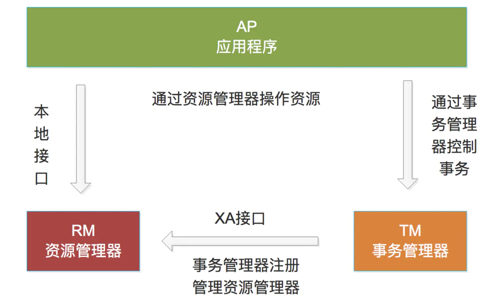
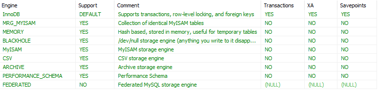
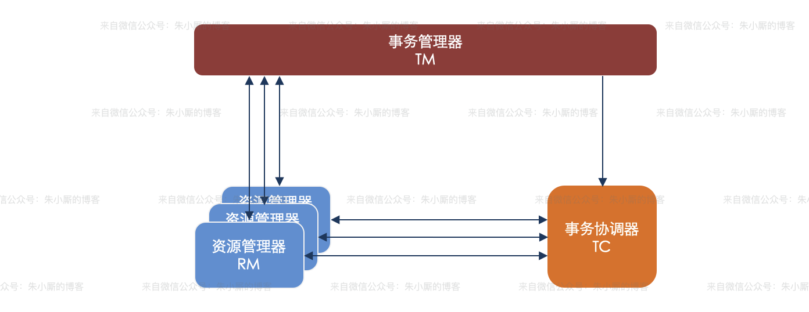

# XA

[MySQL 中基于 XA 实现的分布式事务](https://www.jianshu.com/p/a7d1c4f2542c)

[13.分布式事物xa](http://48fc26d1.wiz03.com/wapp/pages/view/share/s/18_2rh2TVh7v2YT4pP1INFGM1B-ldX2v2Ajd2-5SPz0niqbR)

xa_start负责开启或者恢复一个事务分支，并且管理XID到调用线程

xa_end 负责取消当前线程与事务分支的关联

xa_prepare负责询问RM 是否准备好了提交事务分支

xa_commit通知RM提交事务分支

xa_rollback  通知RM回滚事务分支

## XA 接口详解

X/Open XA 接口是双向的系统接口，在事务管理器（Transaction Manager）以及一个或多个资源管理器（Resource Manager）之间形成通信桥梁。事务管理器控制着 JTA 事务，管理事务生命周期，并协调资源。在 JTA 中，事务管理器抽象为 javax.transaction.TransactionManager接口，并通过底层事务服务（即 JTS）实现。资源管理器负责控制和管理实际资源（如数据库或 JMS 队列）。下图说明了事务管理器、资源管理器，以及典型 JTA 环境中客户端应用之间的关系： 

可知XA规范中分布式事务有AP，RM，TM组成：

- 其中应用程序(Application Program ，简称AP)：AP定义事务边界（定义事务开始和结束）并访问事务边界内的资源。

- 资源管理器(Resource Manager，简称RM)：Rm管理计算机共享的资源，许多软件都可以去访问这些资源，资源包含比如数据库、文件系统、打印机服务器等。
- 事务管理器(Transaction Manager ，简称TM)：负责管理全局事务，分配事务唯一标识，监控事务的执行进度，并负责事务的提交、回滚、失败恢复等。

XA协议是使用了二阶段协议的，其中：

- 第一阶段TM要求所有的RM准备提交对应的事务分支，询问RM是否有能力保证成功的提交事务分支，RM根据自己的情况，如果判断自己进行的工作可以被提交，那就就对工作内容进行持久化，并给TM回执OK；否者给TM的回执NO。RM在发送了否定答复并回滚了已经的工作后，就可以丢弃这个事务分支信息了。
- 第二阶段TM根据阶段1各个RM prepare的结果，决定是提交还是回滚事务。如果所有的RM都prepare成功，那么TM通知所有的RM进行提交；如果有RM prepare回执NO的话，则TM通知所有RM回滚自己的事务分支。

也就是TM与RM之间是通过两阶段提交协议进行交互的。




## MYSQL中的XA

MYSQL的数据库存储引擎InnoDB的事务特性能够保证在存储引擎级别实现ACID，而分布式事务让存储引擎级别的事务扩展到数据库层面，甚至扩展到多个数据库之间，这是通过两阶段提交协议来实现的，MySQL 5.0或者更新版本开始支持XA事务，从下图可知MySQL中只有InnoDB引擎支持XA协议：

SHOW ENGINES;



## 可以解决的问题


**参与者si在发送<ready T>前down机重启(准确的说是在记录进入prepare状态的日志前down机重启)**

不会记录日志,c(协调者)认为有si没有处于prepare阶段,所以把整个全局事物回滚

**参与者si在发送<ready T>后down机重启(准确的说是在记录进入prepare状态的日志后down机重启)**

也能恢复prepare状态，因为prepare阶段已经做了所有相关日志，通过日志恢复相应状态，**然后等待或问询协调者(看协调者综合各个参与反馈后最终决定提交还是回滚)**，能否提交，需要提交则提交、不能提交则回滚。而一阶段如果在提交前任何故障是不可恢复的，数据直接丢失


## 不能解决的问题

**阻塞问题:**

两阶段提交执行过程中，所有的参与者都需要听从协调者的统一调度，期间处于阻塞状态而不能从事其他操作，这样效率及其低下。

**单点故障**:

由于协调者的重要性，一旦协调者C发生故障。参与者si会一直阻塞下去。尤其在第二阶段，协调者发生故障，那么所有的参与者还都处于锁定事务资源的状态中，而无法继续完成事务操作。（如果是协调者挂掉，可以重新选举一个协调者，但是无法解决因为协调者宕机导致的参与者处于阻塞状态的问题）,二阶段提交的缺陷在于如果C崩溃，所有Si可能都需要等待C，从而产生阻塞。

**数据不一致:**

在二阶段提交的阶段二中，当协调者向参与者发送commit请求之后，发生了局部网络异常或者在发送commit请求过程中协调者发生了故障，这会导致只有一部分参与者接受到了commit请求。而在这部分参与者接到commit请求之后就会执行commit操作。但是其他部分未接到commit请求的机器则无法执行事务提交。于是整个分布式系统便出现了数据不一致性的现象。

**解决方式是set global tx_isolation='serializable',session tx_isolation='serializable';**


### XA的一致性读问题

需要 set global tx_isolation='serializable',session tx_isolation='serializable';

XA 事务由于不同节点 commit 的先后顺序，导致有些节点上的已提交数据在 XA 事务 “真正” 完成 commit 前会被其他事务读到。 但是，XA 只要保证这些这些 “提前读到数据” 的事务，在访问其他节点时，也读到相同的已提交数据就 OK。换句话说，就是 XA 事务修改了节点 A 上的数据 a --> a', 节点 B 上的数据 b --> b'，在提交阶段，可能 a' 被其他事务读到，这时候只要保证读到 a' 的事务也同时读到 b' ，就是一致的。反过来，如果其他事务读到的是 a', b 或者 a, b', 就违反了一致性，产生了脏读。想通了这点，就能明白 mysql 为什么要求 XA 事务跑在 serializable 隔离级别了：因为 serializable 级别下 mysql 会对所有 读加锁。还是上面的例子，如果 XA 事务中在节点 A commit 之后，有事务读到了 a'，那么这个事务在读节点 B 时一定会阻塞，不可能读到数据 b。 反之，如果有事务提前读到了 a, 那么其他事务一定会在写入 a --> a' 时阻塞，保证当前事务只会读到 b。不会出现中间事务修改了 a --> a', b --> b' 再 commit，结果让当前事务读到 b' 的情况。 至于有中间事务执行了 b --> b'', 让当前事务读到 a, b'' 的情况 —— 由于中间事务从来没有访问过 a, 从 serializable 的角度我们完全可以认为这个中间事务发生于当前事务之前嘛，不违反一致性。至于问题 2，分布式事务有没有办法实现 Repeatable-Read 以上的隔离级别，结论当然是可以，而且不需要依赖 XA 这种粗糙的加锁方式。工作相关，就不在这里回答了。

### XA的性能问题

XA的性能很低。一个数据库的事务和多个数据库间的XA事务性能对比可发现，性能差10倍左右。因此要尽量避免XA事务，例如可以将数据写入本地，用高性能的消息系统分发数据。或使用数据库复制等技术。只有在这些都无法实现，且性能不是瓶颈时才应该使用XA。


# AT

[带你读透 SEATA 的 AT 模式](https://www.jianshu.com/p/0ed828c2019a)

## 核心思路

对比之前对 XA 分析，AT 的核心出发点，就是 **斩断** XA 可能带来的制约。


Original Idea of Seata-AT

还是看这个微服务场景下的分布式事务模型：

- 调用链路上的 SQL 操作，当前服务调用完成后，直接 **提交**，释放资源（连接和本地事务的数据锁定）。
- 业务数据提交的同时，把数据的 **回滚日志** 一并存放到回滚日志表里，以备全局回滚时使用。

这里面有两个关键：

第一，利用了 **数据库本地事务** 的特性，让回滚日志和业务数据的写入保证原子性：只要有业务数据提交成功，就一定有相应的回滚日志数据。

第二，考虑到实际业务的运行过程，绝大部分情况下最终是成功全局提交的。直接本地提交的机制，省去了绝大部分情况下，**两阶段提交的开销**。

理解核心思路后，大家肯定还有一些疑问，比如：回滚日志如何生成？我们接着往下，后面会讲到。我们先来看一下 Seata 的架构。

## Seata 的架构


Seata Architecture

3 个组件：TM（Transaction Manager）、RM（Resource Manager） 和 TC（Transaction Coordinator）。一个典型的事务过程：

1. TM 向 TC 申请开启一个全局事务，全局事务创建成功并生成一个全局唯一的 XID。
2. XID 在微服务调用链路的上下文中传播。
3. RM 向 TC 注册分支事务，将其纳入 XID 对应全局事务的管辖。
4. TM 向 TC 发起针对 XID 的全局提交或回滚决议。
5. TC 调度 XID 下管辖的全部分支事务完成提交或回滚请求。

[](http://image.honeypps.com/images/papers/2020/259.png) 

Seata 内部定义了 3个模块来处理全局事务和分支事务的关系和处理过程，如上图所示，分别是 TM、RM 和 TC。其中 TM 和 RM 是作为 Seata 的客户端与业务系统集成在一起，TC 作为 Seata 的服务端独立部署。
    Transaction Coordinator（TC）：事务协调器，维护全局事务的运行状态，负责协调并驱动全局事务的提交或回滚。
    Transaction Manager（TM）：控制全局事务的边界，负责开启一个全局事务，并最终发起全局提交或全局回滚的决议。
    Resource Manager（RM）：控制分支事务，负责分支注册、状态汇报，并接收事务协调器的指令，驱动分支（本地）事务的提交和回滚

## 事务模型和模式

基于架构上定义的 3 个角色，Seata 把分布式事务抽象成这样一个 **模型**。


Seata Defined Distributed Transaction Model

TM 定义全局事务的边界。

RM 负责定义分支事务的边界和行为。

TC 跟 TM 和 RM 交互（开启、提交、回滚全局事务；分支注册、状态上报和分支的提交、回滚），做全局的协调。

所谓 Seata 的 **事务模式**，准确地讲，应该是这个框架下，RM 驱动的 **分支事务的不同行为模式**，应该是 **事务（分支）模式**。

放到事务模式中来看，**AT 模式**，就是如图所示的这个样子，其分支事务的行为模式为：

- 在业务执行的同时，根据业务数据操作的具体行为，自动生成回滚日志，记录在回滚日志表里。
- 在全局事务回滚时，根据回滚日志，自动生成并执行补偿回滚的数据操作。
- 在全局事务提交时，异步进行回滚日志的自动清理，事务得以马上结束。

## 具体的实现机制

下面，我们来看 AT 模式的具体实现机制。

首先，应用需要使用 Seata 的 JDBC 数据源代理（也就是 AT 模式的 RM）。


Data Source Proxy

其次，一个符合 Seata 事务模型的分布式事务，分为两个大的阶段：**执行阶段** 和 **完成阶段**。

### 一阶段

Seata 的 JDBC 数据源代理通过对业务 SQL 的解析，把业务数据在更新前后的数据镜像组织成回滚日志，利用 **本地事务** 的 ACID 特性，将业务数据的更新和回滚日志的写入在同一个 **本地事务** 中提交。

这样，可以保证：任何提交的业务数据的更新一定有相应的回滚日志存在。


Branch Transaction with UNDO LOG

基于这样的机制，分支的本地事务便可以在全局事务的 **执行阶段** 提交，马上释放本地事务锁定的资源。

### 二阶段

- 如果决议是全局提交，此时分支事务此时已经完成提交，不需要同步协调处理（只需要异步清理回滚日志），**完成阶段** 可以非常快速地结束。


Global Commit

- 如果决议是全局回滚，RM 收到协调器发来的回滚请求，通过 XID 和 Branch ID 找到相应的回滚日志记录，通过回滚记录生成反向的更新 SQL 并执行，以完成分支的回滚。


Global Rollback

## 隔离性

讲到这里，关于 AT 模式大部分问题我们应该都清楚了，但总结起来，核心也只解决了一件事情，就是 ACID 中最基本、最重要的 A（原子性）。

但是，光解决 A 显然是不够的：既然本地事务已经提交，那么如果数据在全局事务结束前被修改了，回滚时怎么处理？ACID 的 I（隔离性）在 Seata 的 AT 模式是如何处理的呢？

Seata AT 模式引入 **全局锁** 机制来实现隔离。

**全局锁** 是由 Seata 的 TC 维护的，事务中涉及的数据的锁。

### 写隔离

-  **执行阶段** 本地事务提交前，需要确保先拿到 **全局锁** 。
- 拿不到 **全局锁** ，不能提交本地事务。
- 拿 **全局锁** 的尝试被限制在一定范围内，超出范围将放弃，并回滚本地事务，释放本地锁。

以一个示例来说明：

两个全局事务 tx1 和 tx2，分别对 a 表的 m 字段进行更新操作，m 的初始值 1000。

tx1 先开始，开启本地事务，拿到本地锁，更新操作 m = 1000 - 100 = 900。本地事务提交前，先拿到该记录的 **全局锁** ，本地提交释放本地锁。
 tx2 后开始，开启本地事务，拿到本地锁，更新操作 m = 900 - 100 = 800。本地事务提交前，尝试拿该记录的 **全局锁** ，tx1 全局提交前，该记录的全局锁被 tx1 持有，tx2 需要重试等待 **全局锁** 。


Write-Isolation: Commit

tx1 **完成阶段** 全局提交，释放 **全局锁** 。tx2 拿到 **全局锁** 提交本地事务。


Write-Isolation: Rollback

如果 tx1 的 **完成阶段** 全局回滚，则 tx1 需要重新获取该数据的本地锁，进行反向补偿的更新操作，实现分支的回滚。

此时，如果 tx2 仍在等待该数据的 **全局锁**，同时持有本地锁，则 tx1 的分支回滚会失败。分支的回滚会一直重试，直到 tx2 的 **全局锁** 等锁超时，放弃 **全局锁** 并回滚本地事务释放本地锁，tx1 的分支回滚最终成功。

因为整个过程 **全局锁** 在 tx1 结束前一直是被 tx1 持有的，所以不会发生 **脏写** 的问题。

### 读隔离

在数据库本地事务隔离级别 **读已提交（Read Committed）** 或以上的基础上，Seata（AT 模式）的默认全局隔离级别是 **读未提交（Read Uncommitted）** 。

如果应用在特定场景下，必需要求全局的 **读已提交** ，目前 Seata 的方式是通过 SELECT FOR UPDATE 语句的代理。


Read Isolation: SELECT FOR UPDATE

SELECT FOR UPDATE 语句的执行会申请 **全局锁** ，如果 **全局锁** 被其他事务持有，则释放本地锁（回滚 SELECT FOR UPDATE 语句的本地执行）并重试。这个过程中，查询是被 block 住的，直到 **全局锁** 拿到，即读取的相关数据是 **已提交** 的，才返回。

### 集中管理全局锁的考虑

全局锁是由 TC 也就是 server 来集中维护，而不是在数据库维护的。这样做有两点好处：

- 一方面：锁的释放非常快，尤其是在全局提交的情况下，收到全局提交的请求，锁马上就释放掉了，不需要与 RM 或数据库进行一轮交互。
- 另外一方面：因为锁不是数据库维护的，从数据库层面看，数据没有锁定。这也就是给极端情况下，业务 **降级** 提供了方便，事务协调器异常导致的一部分异常事务，不会 block 后面业务的继续进行。

## 实例

以一个示例来说明整个 AT 分支的工作过程。

业务表：`product`

| Field | Type         | Key  |
| ----- | ------------ | ---- |
| id    | bigint(20)   | PRI  |
| name  | varchar(100) |      |
| since | varchar(100) |      |

AT 分支事务的业务逻辑：

```sql
update product set name = 'GTS' where name = 'TXC';
```

### 一阶段

过程：

1. 解析 SQL：得到 SQL 的类型（UPDATE），表（product），条件（where name = 'TXC'）等相关的信息。
2. 查询前镜像：根据解析得到的条件信息，生成查询语句，定位数据。

```sql
select id, name, since from product where name = 'TXC';
```

得到前镜像：

| id   | name | since |
| ---- | ---- | ----- |
| 1    | TXC  | 2014  |

1. 执行业务 SQL：更新这条记录的 name 为 'GTS'。
2. 查询后镜像：根据前镜像的结果，通过 **主键** 定位数据。

```sql
select id, name, since from product where id = 1`;
```

得到后镜像：

| id   | name | since |
| ---- | ---- | ----- |
| 1    | GTS  | 2014  |

1. 插入回滚日志：把前后镜像数据以及业务 SQL 相关的信息组成一条回滚日志记录，插入到 `UNDO_LOG` 表中。

```json
{
	"branchId": 641789253,
	"undoItems": [{
		"afterImage": {
			"rows": [{
				"fields": [{
					"name": "id",
					"type": 4,
					"value": 1
				}, {
					"name": "name",
					"type": 12,
					"value": "GTS"
				}, {
					"name": "since",
					"type": 12,
					"value": "2014"
				}]
			}],
			"tableName": "product"
		},
		"beforeImage": {
			"rows": [{
				"fields": [{
					"name": "id",
					"type": 4,
					"value": 1
				}, {
					"name": "name",
					"type": 12,
					"value": "TXC"
				}, {
					"name": "since",
					"type": 12,
					"value": "2014"
				}]
			}],
			"tableName": "product"
		},
		"sqlType": "UPDATE"
	}],
	"xid": "xid:xxx"
}
```

1. 提交前，向 TC 注册分支：申请 `product` 表中，主键值等于 1 的记录的 **全局锁** 。
2. 本地事务提交：业务数据的更新和前面步骤中生成的 UNDO LOG 一并提交。
3. 将本地事务提交的结果上报给 TC。

### 二阶段-回滚

1. 收到 TC 的分支回滚请求，开启一个本地事务，执行如下操作。
2. 通过 XID 和 Branch ID 查找到相应的 UNDO LOG 记录。
3. 数据校验：拿 UNDO LOG 中的后镜与当前数据进行比较，如果有不同，说明数据被当前全局事务之外的动作做了修改。这种情况，需要根据配置策略来做处理，详细的说明在另外的文档中介绍。
4. 根据 UNDO LOG 中的前镜像和业务 SQL 的相关信息生成并执行回滚的语句：

```sql
update product set name = 'TXC' where id = 1;
```

1. 提交本地事务。并把本地事务的执行结果（即分支事务回滚的结果）上报给 TC。

### 二阶段-提交

1. 收到 TC 的分支提交请求，把请求放入一个异步任务的队列中，马上返回提交成功的结果给 TC。
2. 异步任务阶段的分支提交请求将异步和批量地删除相应 UNDO LOG 记录。