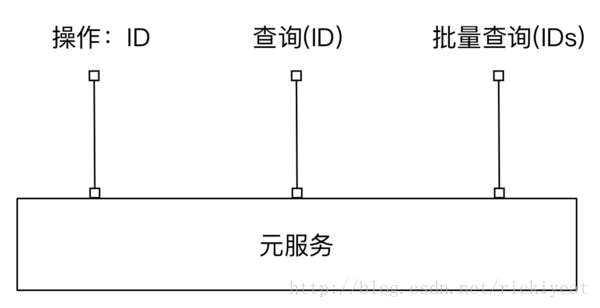
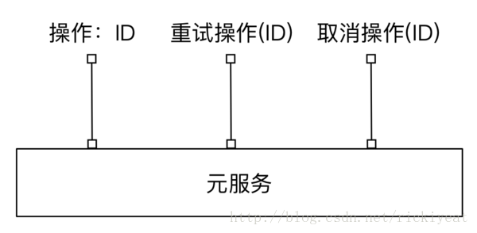
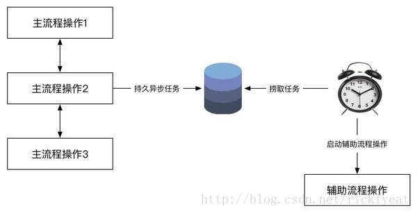
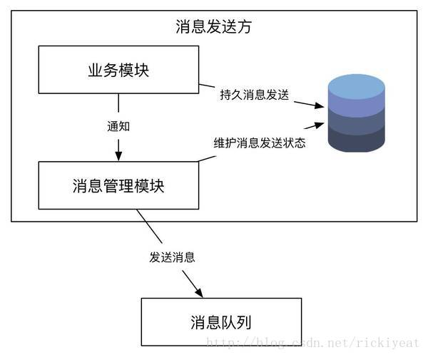
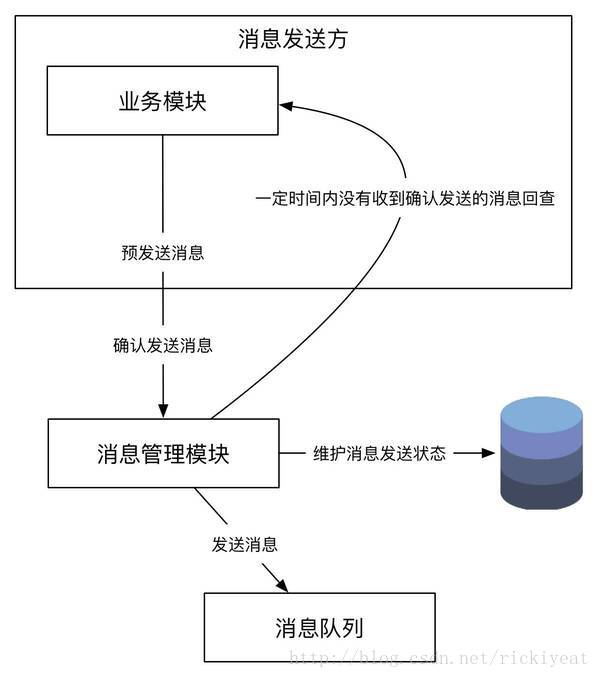
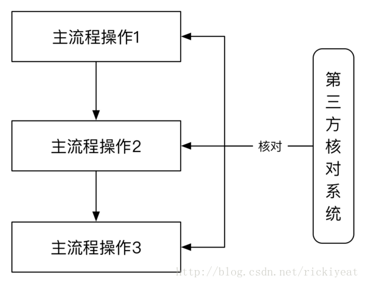
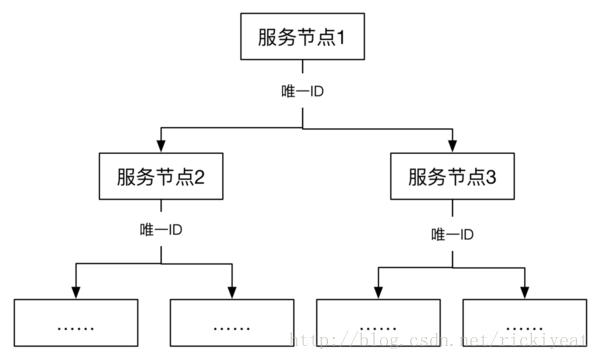
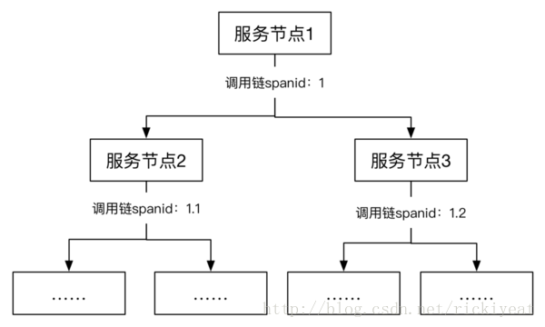

# 分布式事务

[分库分表导致的分布式事务及其解决方案](https://blog.csdn.net/u014590757/article/details/80100085)

[Java微服务下的分布式事务介绍及其解决方案](https://blog.csdn.net/oldshaui/article/details/88743085)

这里只介绍实现分布式操作一致性的几个主流思路，保证分布式事务一致性的具体方法请参考《分布式服务架构：原理、设计与实战》中第2章的内容。

主流的分布式事务解决方案有三种：两阶段提交协议、最大努力保证模式和事务补偿机制。

## 两阶段提交(2pc)

## 三阶段提交(3pc)

## 事务补偿机制TCC

·     Try 阶段主要是对业务系统做检测及资源预留

·     Confirm 阶段主要是对业务系统做确认提交，Try阶段执行成功并开始执行 Confirm阶段时，默认 Confirm阶段是不会出错的。即：只要Try成功，Confirm一定成功。

·     Cancel 阶段主要是在业务执行错误，需要回滚的状态下执行的业务取消，预留资源释放。

举个例子，假入 Bob 要向 Smith 转账，思路大概是：
我们有一个本地方法，里面依次调用
1、首先在 Try 阶段，要先调用远程接口把 Smith 和 Bob 的钱给冻结起来。
2、在 Confirm 阶段，执行远程调用的转账的操作，转账成功进行解冻。
3、如果第2步执行成功，那么转账成功，如果第二步执行失败，则调用远程冻结接口对应的解冻方法 (Cancel)。

优点： 跟2PC比起来，实现以及流程相对简单了一些，但数据的一致性比2PC也要差一些

缺点： 缺点还是比较明显的，在2,3步中都有可能失败。TCC属于应用层的一种补偿方式，所以需要程序员在实现的时候多写很多补偿的代码，在一些场景中，一些业务流程可能用TCC不太好定义及处理。（在我的理解是，有点try，catch的思想。）

## 最终一致性保证

### 查询模式

任何服务操作都需要提供一个查询接口，用来向外部输出执行操作的状态。以此决定下一步做什么，如补偿未完成的操作，还是回滚已完成的操作。

每个服务操作，用一个流水号标识。

### 补偿模式

有了查询模式，就可以知道服务执行的具体状态，

服务化的系统调用，常常会因为网络问题导致系统间的调用超时。使用查询模式，可以获得业务操作执行方的状态，如果执行完成，则可以返回成功，若状态失败或者未知，则会立即告诉使用方失败，快速失败策略，然后进行补偿。

**自动恢复**：程序根据发生不一致的环境，通过继续完成未完成的操作，或者回滚已经完成的操作，来自动达到一致性状态。

**通知运营**：如果程序无法自动恢复，且考虑到了不一致场景，可以通知运营，手工进行补偿。

**技术运营**：技术手段包括数据库变更或者代码变更，应该尽量避免。

#### 异步确保模式

异步确保模式是补偿模式的一个典型案例。

经常应用到对响应要求不太高的场景，把这类操作从主流程中摘除，通过异步的方式进行处理，处理后把结果通知给使用方。

例如：电商系统中的物流、配送；支付系统中的计费、入账等。

实践中将要执行的异步操作封装后，持久入库，定时捞取未完成的任务进行补偿操作，实现异步确保模式，只要系统足够健壮，任何任务最终都会被执行。

#### 可靠消息模式

在分布式系统中，对于主流程中优先级比较低的操作，大多采用异步的方式执行，也就是前面提到的异步确保型，为了让异步操作的调用方和被调用方充分的解耦，也由于专业的消息队列本身具有可伸缩、可分片、可持久等功能，我们通常通过消息队列实现异步化，对于消息队列，我们需要建立特殊的设施保证可靠的消息发送以及处理机的幂等等。 

##### 数据库持久化

第一种：

发送消息之前，把消息持久到数据库，状态标记为待发送，

然后发送消息，如果发送成功，将消息改为发送成功。

定时任务定时从数据库捞取一定时间内未发送的消息，将消息发送。

第二种，实现方式与第一种类似，不同的是持久消息的数据库是独立的，并不耦合在业务系统中。发送消息之前，先发送一个预消息给某一个第三方的消息管理器，消息管理器将其持久到数据库，并标记状态为待发送，发送成功后，标记消息为发送成功。定时任务定时从数据库捞取一定时间内未发送的消息，回查业务系统是否要继续发送，根据查询结果来确定消息的状态。

### 定期校对模式

定期校对模式多用于金融系统。金融系统涉及资金安全，需要保证准确性，所有需要多重的一致性保证机制，包括：系统间的一致性对账、现金对账、账务对账、手续费对账等等，这些都属于定期校对模式，顺便说一下，金融系统与社交应用在技术上本质的区别在于社交应用在于量大，而金融系统在于数据的准确性。 

#### 全局唯一id

既然我们在系统中实现最终一致性，系统在没有达到一致之前，系统间的状态是不一致的，甚至是混乱的，需要补偿操作来达到一致的目的，但是我们如何来发现需要补偿的操作呢？ 
　在操作的主流程中的系统间执行校对操作，我们可以事后异步的批量校对操作的状态，如果发现不一致的操作，则进行补偿，补偿操作与补偿模式中的补偿操作是一致的。 
　另外，实现定期校对的一个关键就是分布式系统中需要有一个自始至终唯一的ID，ID的生成请参考[SnowFlake](https://github.com/twitter/snowflake)。 

　一般情况下，生成全局唯一ID有两种方法：

- 持久型：使用数据库表自增字段或者Sequence生成，为了提高效率，每个应用节点可以缓存一批次的ID，如果机器重启可能会损失一部分ID，但是这并不会产生任何问题

- 时间型：一般由机器号、业务号、时间、单节点内自增ID组成，由于时间一般精确到秒或者毫秒，因此不需要持久就能保证在分布式系统中全局唯一、粗略递增能特点

  　　

#### 调用链

实践中，为了能在分布式系统中迅速的定位问题，一般的分布式系统都有技术支持系统，它能够跟踪一个请求的调用链，调用链是在二维的维度跟踪一个调用请求，最后形成一个调用树，原理可参考谷歌的论文[Dapper,  a Large-Scale Distributed Systems TracingInfrastructure](https://research.google.com/pubs/pub36356.html)，一个开源的参考实现为[pinpoint](https://github.com/naver/pinpoint)。

### 缓存一致性模式

用缓存抗住读。