# idea中的git

[IDEA中Git的使用](https://cloud.tencent.com/developer/article/1333958)

## 提交

### 提交的暂存区

idea中如果未提交到暂存区，文件名是红色的。

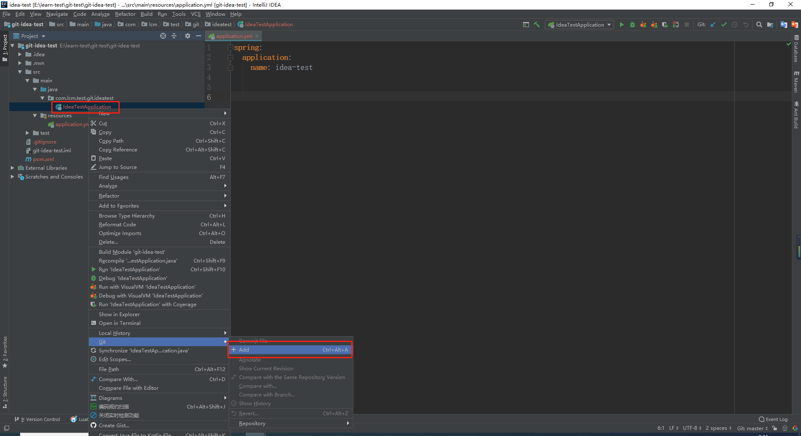

### 提交到本地库

添加到暂存区以后，文件颜色就变成绿色的了。

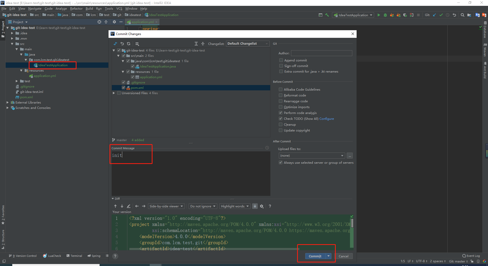

### 推送到远程库

## 分支

### 创建分支

### 合并分支

### 删除分支

### 变基

## 标签

### 创建标签

### 删除标签

## 冲突

### 提交发生冲突

### 冲突文件

### 修改冲突

### 提交修改

# source tree中的git

## 提交

### 添加到暂存区

比如新建一个master.txt文件，添加到暂存区。

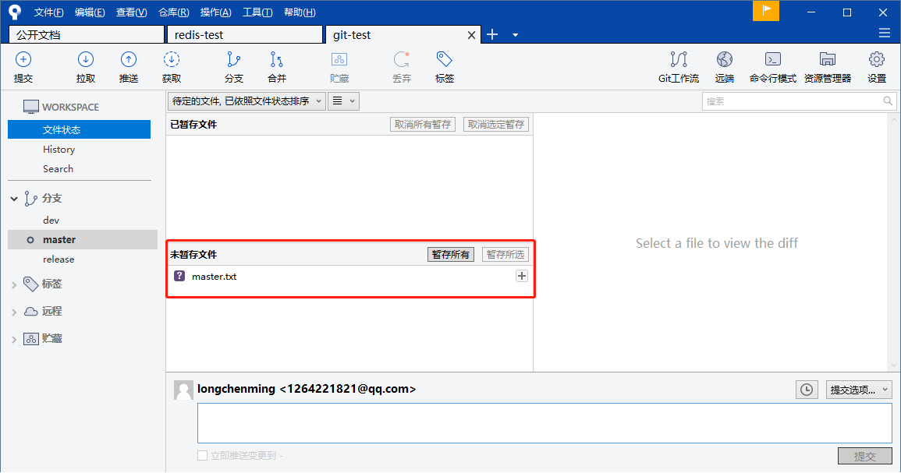

### 提交到本地库

将暂存区的修改提交到本地仓库。

### 推送到远程库

1.GitHub上面创建一个远程仓库

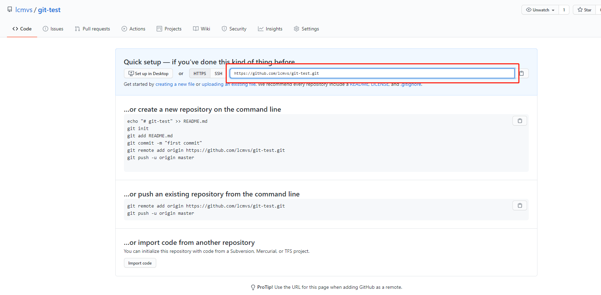

2.配置远程仓库

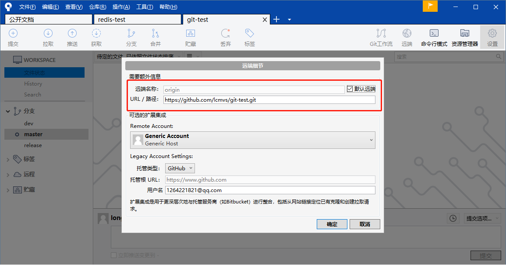

3.推送到远程仓库

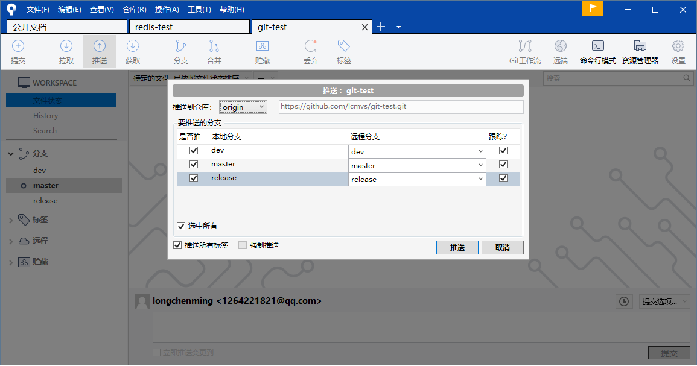

## 分支

### 创建分支

创建一个分支，比如用于修复bug的分支bug-001

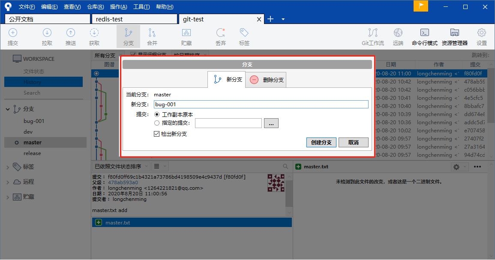

### 合并分支

分支bug-001修复bug以后，将bug-001提交的修改合并到master分支。

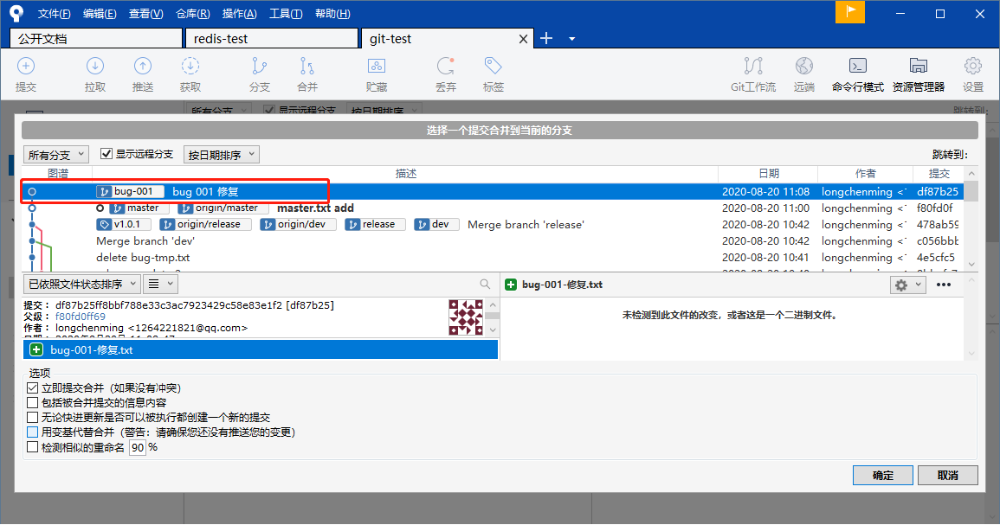

### 删除分支

bug 001修复以后，可以将bug-001这个临时分支删除掉。

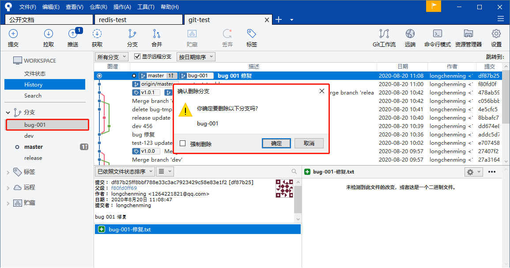

### 变基

将dev和release分支变基到master主分支，主要为了好看点。

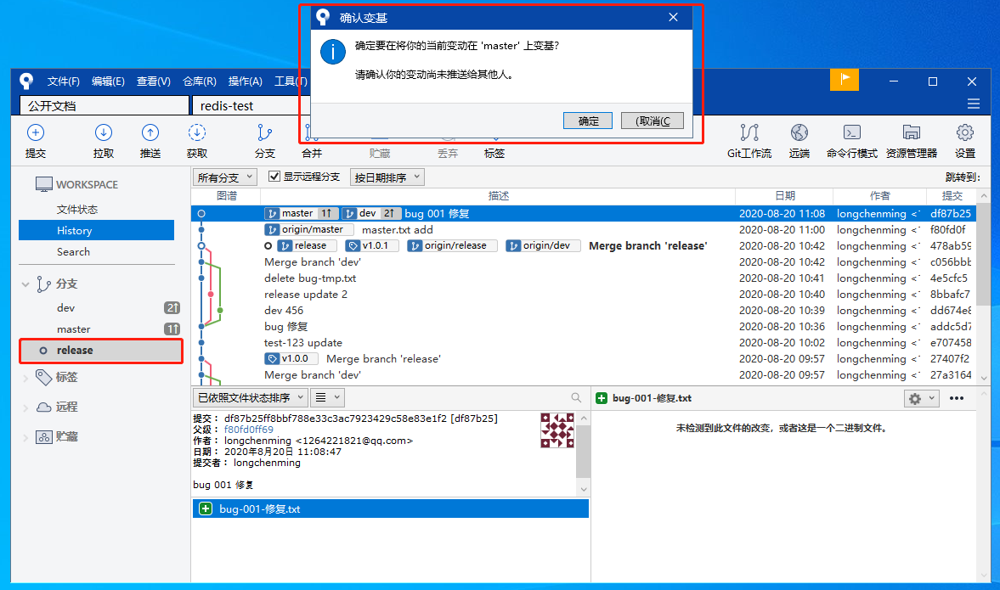

## 标签

### 创建标签

添加一个标签v1.0.3

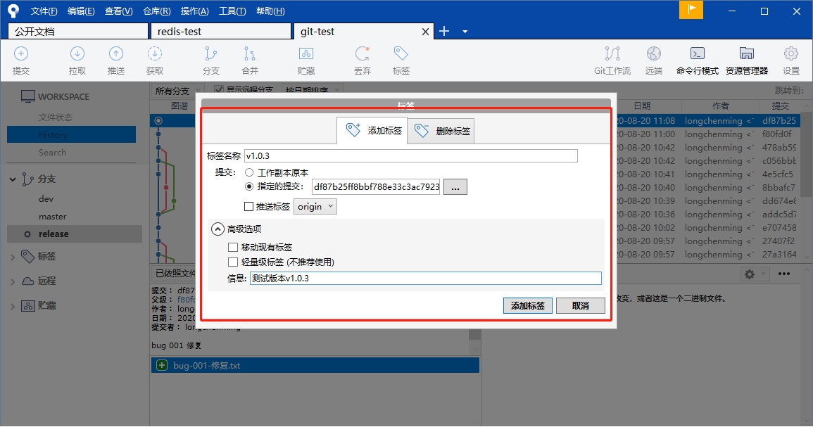

### 删除标签

删除一个标签v1.0.0

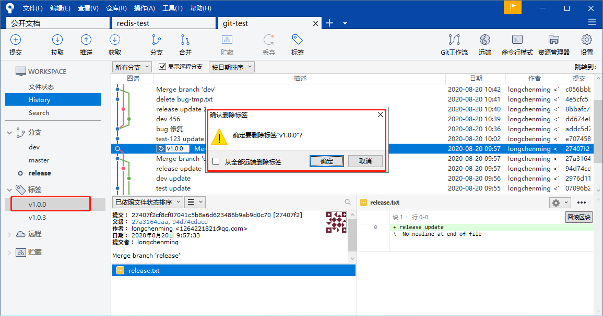

## 冲突

### 提交发生冲突

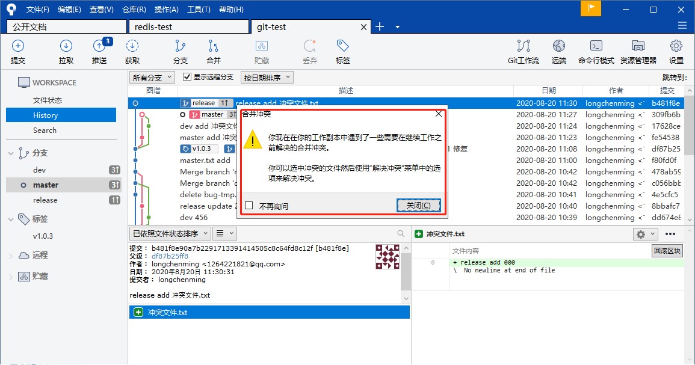

### 冲突文件

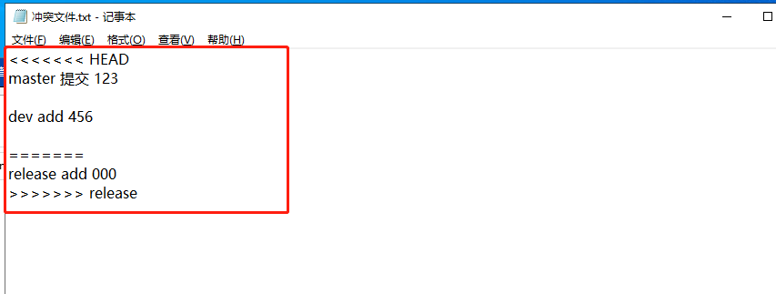

### 修改冲突

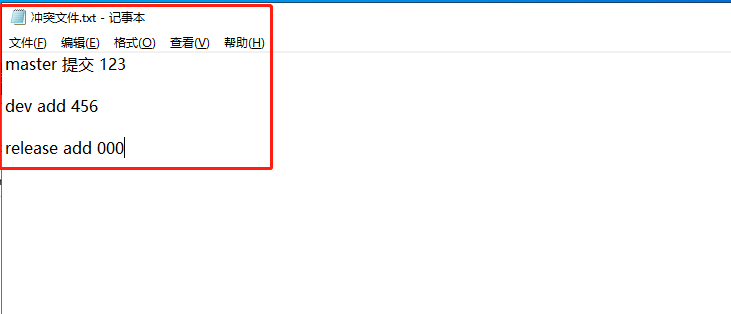

### 提交修改

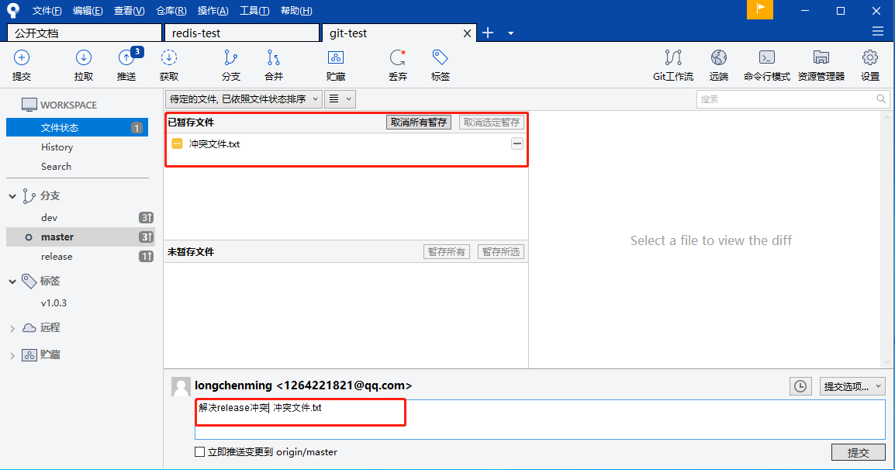