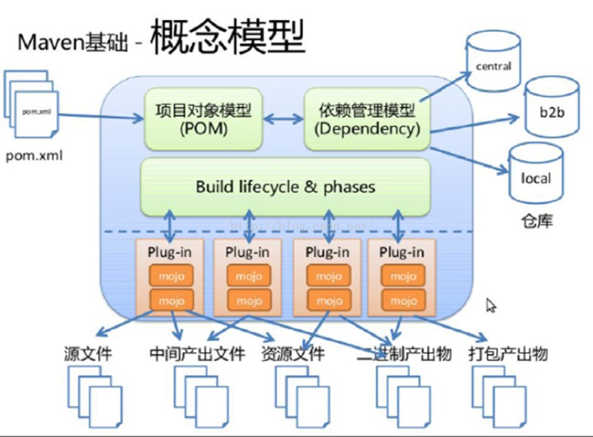

[Maven 教程网](http://www.mvnbook.com/)

[Maven之阿里云镜像仓库配置](https://www.cnblogs.com/Jimc/p/10152621.html)

# 简介

Maven 是一个项目管理工具，可以对 Java 项目进行自动化的构建和依赖管理。Maven在美国是一个口语化的词语，代表专家、内行的意思，约等于北京话中的老炮儿。有老炮儿在身边，项目经理可谓得心应手。

项目管理是一个很抽象的概念，既可以指技术上的管理工具，也可以指 **"以人为本"** 的管理手段（非技术因素）。无论是技术还是非技术，项目成败最大的责任人其实就是项目经理，而Maven就是项目经理的最得力助手。

如果我们抛开人为因素不提，仅从技术方面来说，Maven 提供了一种思想让团队更科学的管理和构建项目。Maven采用配置文件的方式对项目的名称、版本号、项目依赖等等信息进行描述，使之结构清晰，任何人接手的成本将会变得很低。在项目构建时，利用 Maven 的  **"约定大于配置"**的思想，实现自动化的构建，如果读者熟悉 Ant，可以清醒的感知 Maven 比 Ant  脚本构建项目省去不少配置文件的内容。另外，一个项目往往依赖于其他的项目和第三方的组件才能顺利完成，Maven提供了仓库的功能，让这些依赖项放进仓库中，项目可以随时从仓库中去取，如果其他项目组也需要这些依赖，同样也可以从仓库中去取，不必每个人去开源项目的站点去苦苦搜寻了。如此下来，人员的成本、软件维护的成本、沟通的成本、硬件的成本都降下来了。客户笑了、公司老板也笑了、项目经理笑了、团队里面的人员也笑了、Apache社区看到这么多人在用也笑了。总之，使用Maven 是件你好、我好、大家好的事情。

Maven 曾是 Jakarta 项目的子项目，后来成为由 Apache 软件基金会主持的独立 Apache项目。在Java世界里，Jakarta  项目犹如长城一般的存在，铸就了丰功伟业。在Apache建立伊始，源码界犹如混沌未开化的洪荒之地，长满C/C++的杂草，而Java刚刚漏出新芽。  当时Apache组织里面有很多C语言开发的项目，Java还是一门小众语言。为了发展Java  Web项目，一群有志之士聚集在一起，启动了Jakarta项目。  后来，Java变得非常的火爆，以至于Jakarta项目囊括了众多基于Java语言的开源软件。最后，不得不把个别项目从Jakarta中独立出来，成为Apache软件基金会的顶级项目，例如：Struts，HttpClient，Tomcat，Ant，Maven，JMeter，Velocity，JMeter，Commons等。一直到2011年12月，在所有子项目都被迁移为独立项目后，Jakarta名称就不再使用了。

Maven诞生之初的目的是为了管理Java项目，后来 Maven 也可被用于构建和管理其他各种项目，例如 C#，Ruby，Scala等语言编写的项目。

在 Maven 出现之前，Java 世界的项目管理工具一直由 Ant 统治着。而在此之后，又有 Gradle 逐渐在 Android 项目中作为配套打包工具流行开来。在目前看来，Maven 依旧是 Java 世界项目管理工具中的王者。

# Maven下载与安装

安装 Maven 3.3+ 需要 JDK 1.7 或者更高版本。

安装 Maven 对内存没有特殊要求，大约需要10M的硬盘空间即可。

当前版本是：Apache Maven 3.6.3，发布于 2020-03-04。

## Maven 下载地址

Maven 官方下载地址：http://maven.apache.org/download.cgi，进入下载页面，找到下载文件，如下所示：

​                 

​             

## Maven 安装

下载完 Maven 之后，解压即可，如下图所示：

​                 

​             

## Maven 配置环境变量

环境变量是在操作系统中一个具有特定名字的对象，它包含了一个或者多个应用程序所将使用到的信息。例如，Windows和DOS操作系统中的Path环境变量。当要求系统运行一个程序而没有告诉它程序所在的完整路径时，系统除了在当前目录下面寻找此程序外，还应到Path中指定的路径去找。用户通过设置环境变量，来更好的运行进程。Maven配置环境变量如下所示：

```
MAVEN_HOME = E:\maven\apache-maven-3.6.0

MAVEN_OPTS = -Xms128m -Xmx512m(可选)
```

然后，修改Path修改变量，在Path变量末尾加入：

```
%MAVEN_HOME%\bin
```

​                 

​             

> **提醒：**
>
> 当项目比较大时，使用Maven生成项目需要占用大量内存，如果超过Java默认的最大可用内存，则会报java.lang.OutOfMemeoryError。解决此问题为设置MAVEN_OPTS环境变量，此方法一次设定，一劳永逸，为推荐方法。                   
>
> MAVEN_OPTS环境变量设置方法：在环境变量中添加一个新变量名为MAVEN_OPTS,值为-Xms128m -Xmx512m（数值可以自定义，Xms为初始内存，即最小内存，Xmx为最大内存）
>
> ​                 
>
> ​                     
>
> ​                 

最后，验证是否安装成功。现在我们打开 cmd，输入：

```
mvn -v
```

我想你一定会看到一些信息，如下图所示：

​                 

​             

恭喜你，Maven 安装成功！

在使用 Maven 之前，我们必须要了解一下 Maven 到底是怎样管理 Jar 包的，这就是 Maven 仓库的内容。请关注下节内容。

# Maven仓库

在 Maven 的术语中，仓库是一个位置。软件开发中不可避免的需要引入大量的第三方库，这些库所在的位置在Maven中被称为 **"仓库"** 。             

在 Maven 中任何一个依赖、插件或者项目构建的输出，都可以称之为 **"构件"** 。Maven 仓库能帮助我们管理构件（主要是JAR）。

Maven 仓库有三种类型：

- 本地仓库（local）：顾名思义就是本地本机放置构件的地方。Maven 从远程仓库下载下来的构件都存放在本地仓库中，项目可以从本地 Maven 仓库中获取自己所依赖的文件。                 
- 中央仓库（central）：Maven 中央仓库是由 Maven 社区提供的仓库，其中包含了大量常用的库。中央仓库是 Maven 官方提供的，可通过 http://search.maven.org/来访问。
- 远程私服（remote）：私服一般是指公司内部使用的仓库。运行 Maven 时，Maven所需要的任何构件都是从本地仓库获取的，但是如果本地仓库没有，它就会尝试从远程仓库中下载构件到本地仓库。如果 Maven 无法连接到远程仓库，将无法正常构建项目。                 

## Maven仓库原理介绍

使用 Maven 给我们带来的最直接的好处就是统一管理 Jar 包。那么这些 Jar 包存放在哪里呢？它们就在你的本地仓库中，默认地址位于 C:\Users\用户名\\.m2目录下（当然也可以修改这个默认地址）。

实际上，我们可以将本地仓库理解为 "缓存"，目的是存放 Jar 包。开发项目时首先会从本地仓库中获取 Jar 包，当无法获取指定 Jar包的时候，本地仓库会从远程仓库（或中央仓库）中下载 Jar 包，并 "缓存" 到本地仓库中以备将来使用。这样一来，本地仓库会随着项目的积累越变越大。

通过下面这张图可以清晰地表达项目、本地仓库、远程仓库之间的关系。

​                 

​             

## 本地仓库

Maven 的本地仓库，在安装 Maven 后并不会创建，它是在第一次执行 Maven 命令的时候才被创建。

运行 Maven 的时候，Maven 所需要的任何构件都是直接从本地仓库获取的。如果本地仓库没有，它会首先尝试从远程仓库下载构件至本地仓库，然后再使用本地仓库的构件。

默认情况下，不管 Linux 还是 Windows，每个用户在自己的用户目录下都有一个路径名为 .m2/respository/ 的仓库目录。

Maven 本地仓库默认被创建在 %USER_HOME% 目录下。要修改默认位置，在 %M2_HOME%\conf 目录中的 Maven 的 settings.xml 文件中定义另一个路径。如下所示：

```xml
<settings>
      <localRepository>C:/mywork/local-repository</localRepository>
</settings>
```

当你运行 Maven 命令，Maven 将下载依赖的文件到你指定的路径中。

## 中央仓库

Maven 中央仓库是由 Maven 社区提供的仓库，其中包含了大量常用的库。

中央仓库包含了绝大多数流行的开源Java构件，以及源码、作者信息、SCM、信息、许可证信息等。一般来说，简单的Java项目依赖的构件都可以在这里下载到。

中央仓库由 Maven 社区管理，不需要配置，但需要通过网络才能访问。

## 远程私服仓库

如果 Maven 在中央仓库中也找不到依赖的文件，它会停止构建过程并输出错误信息到控制台。为避免这种情况，Maven 提供了远程仓库的概念，它是开发人员自己定制仓库，包含了所需要的代码库或者其他工程中用到的                 Jar 文件。

## Maven 依赖搜索顺序

当我们执行 Maven 构建命令时，Maven 开始按照以下顺序查找依赖的库：    

- 步骤 1 － 在本地仓库中搜索，如果找不到，执行步骤 2，如果找到了则执行其他操作。
- 步骤 2 － 在中央仓库中搜索，如果找不到，并且有一个或多个远程仓库已经设置，则执行步骤 4，如果找到了则下载到本地仓库中以备将来引用。
- 步骤 3 － 如果远程仓库没有被设置，Maven 将简单的停滞处理并抛出错误（无法找到依赖的文件）。
- 步骤 4 － 在一个或多个远程仓库中搜索依赖的文件，如果找到则下载到本地仓库以备将来引用，否则 Maven 将停止处理并抛出错误（无法找到依赖的文件）。

# Maven构件

在Maven中，任何项目输出都可成为构件。

每个构件都有自己的唯一标识，由 groupId，artifactId 和 version 等信息构成。

Maven可以对构件进行版本控制，管理。

## Maven构件标识

每个构件都有自己的唯一标识（Maven 行话称之为 **"唯一坐标"** ），由 groupId，artifactId 和 version 等信息构成。

- groupId：当前Maven构件隶属的组织名。groupId一般分为多段，通常情况下，第一段为域，第二段为公司名称。域又分为 org、com、cn 等，其中 org 为非营利组织，com为商业组织，cn 表示中国。以 apache 开源社区的 tomcat 项目为例，这个项目的 groupId 是 org.apache，它的域是org（因为tomcat是非营利项目），公司名称是apache，artifactId是tomcat。(必须)                 
- artifactId：项目的唯一的标识符，实际对应项目的名称，就是项目根目录的名称。(必须)
- version：当前版本。(必须)
- packaging：打包方式，比如 jar，war... (必须)
- classifier：classifier通常用于区分从同一POM构建的具有不同内容的构件。它是可选的，它可以是任意的字符串，附加在版本号之后。

## Maven的classifier作用

classifier可以是任意的字符串，用于确定文件。常见的应用场景如下所示：

（1）可用于区分不同JDK版本所生成的jar包

```xml
<dependency>
	<groupId>net.sf.json-lib</groupId>   
	<artifactId>json-lib</artifactId>   
	<version>2.2.2</version>  
	<classifier>jdk15</classifier>    
</dependency>

<dependency>  
	<groupId>net.sf.json-lib</groupId>   
	<artifactId>json-lib</artifactId>   
	<version>2.2.2</version>  
	<classifier>jdk13</classifier>    
</dependency>
```

以上配置信息实际上对应的 jar 包是 json-lib-2.2.2-jdk15.jar 和 json-lib-2.2.2-jdk13.jar。

（2）区分项目的不同组成部分，例如，源代码、javadoc、类文件等。

```xml
<dependency>
	<groupId>net.sf.json-lib</groupId>   
	<artifactId>json-lib</artifactId>   
	<version>2.2.2</version>  
	<classifier>jdk15-javadoc</classifier>    
</dependency> 
```

以上配置信息对应的是 json-lib-2.2.2-jdk15-javadoc.jar。

提醒：需要注意classifier的位置

```xml
<dependency>
	<groupId>net.sf.json-lib</groupId>   
	<artifactId>json-lib</artifactId>   
	<classifier>jdk15-javadoc</classifier>  
	<version>2.2.2</version>   
</dependency> 
```

对应的是 json-lib-jdk15-javadoc-2.2.2.jar，可能会出现找不到jar包的情况。

## Maven构件特性

（1）构件具有依赖传递。例如：项目依赖构件A，而构件A又依赖B，Maven会将A和B都视为项目的依赖。             

（2）构件之间存在版本冲突时，Maven会依据 "短路优先" 原则加载构件。此外，我们也可以在 pom.xml 中，使用<exclusions></exclusions>显式排除某个版本的依赖，以确保项目能够运行。             

- （a）项目依赖构件A和B，构件A → C → D(version:1.0.0)，构件B → D(version:1.1.0)，此时，Maven会优先解析加载D(version:1.1.0)。                 
- （b）项目依赖构件A和B，构件A → D(version:1.0.0)， 构件B → D(version:1.1.0)，此时，Maven会优先解析加载D(version:1.0.0)。

（3）构件的依赖范围。Maven在项目的构建过程中，会编译三套 ClassPath，分别对应：编译期，运行期，测试期。而依赖范围就是为构件指定它可以作用于哪套 ClassPath。

| -        | 编译期 | 测试期 | 运行期 | 说明                                                         |
| -------- | ------ | ------ | ------ | ------------------------------------------------------------ |
| compile  | √      | √      | √      | 默认范围                                                     |
| provided | √      | √      |        | 如 servlet-api.jar，运行期由web容器提供。                    |
| runtime  |        | √      | √      | 编译期无需直接引用。                                         |
| test     |        | √      |        | 如junit.jar。                                                |
| system   | √      | √      |        | 必须通过 <systemPath></systemPath> 元素，显示指定依赖文件的路径， 与本地系统相关联，可移植性差。 |
| import   |        |        |        | 表示继承父POM.XML中的依赖范围设置                            |

> **提醒：**Maven中的库是个物理概念，存放各种依赖 Jar，而 ClassPath 是个逻辑概念，指定所依赖 Jar 的可见性。                 

# Maven依赖范围

因为 Maven 执行一系列操作，主要包括编译、测试、运行等操作，在不同的操作下依赖的 Jar 不同，依赖范围就是用来控制 Jar 包的可见性。例如，JUnit 的依赖范围是test，只用于编译测试代码和运行测试代码的时候才可见，而在编译和运行主项目时无法使用此依赖。

有些依赖编译用不到，只有运行的时候才能用到，比如 MySQL 的驱动包在编译期就用不到（编译期用的是JDBC接口），而是在运行时用到的。

还有些依赖，编译期要用到，而运行期不需要提供，因为有些容器已经提供了，比如 servlet-api.jar 在 Tomcat 中已经提供了，我们只需要的是编译期提供而已。

## Maven库与依赖范围

Maven中的库是个物理概念，存放各种依赖 Jar，而依赖是个逻辑概念，指定所依赖 Jar 的可见性。

这种可见性是按照编译、测试、运行等三种情况来划分的。

## Maven依赖范围

**compile**

编译依赖范围（默认），使用此依赖范围对于编译、测试、运行三种都有效，即在编译、测试和运行的时候都要使用该依赖 Jar 包。

**test**

测试依赖范围，从字面意思就可以知道此依赖范围只能用于测试，而在编译和运行项目时无法使用此类依赖，典型的是 JUnit，它只用于编译测试代码和运行测试代码的时候才需要。

**provided**

此依赖范围，对于编译和测试有效，而对运行时无效。比如 servlet-api.jar 在 Tomcat 中已经提供了，我们只需要的是编译期提供而已。

**runtime**

运行时依赖范围，对于测试和运行有效，但是在编译主代码时无效，典型的就是JDBC驱动实现。

**system**

系统依赖范围，使用 system 范围的依赖时必须通过 systemPath 元素显示地指定依赖文件的路径，不依赖 Maven 仓库解析，所以可能会造成建构的不可移植。

```xml
<dependencies>
	<dependency>  
		<groupId>javax.sql</groupId>  
		<artifactId>jdbc-stdext</artifactId>  
		<version>2.0</version>  
		<scope>system</scope>  
		<systemPath>${java.home}/lib/rt.jar</systemPath>  
	</dependency>  
<dependencies>
```


# Maven依赖冲突

在 Maven 中，依赖分为直接依赖和传递依赖（即间接依赖）。

直接依赖，顾名思义，无须赘述。对比之下，传递依赖是 Maven 的特色和重点，可大书特书。

Maven 引入的传递性依赖机制，能大大简化依赖管理，因为大部分情况下我们只需要关心项目的直接依赖是什么，而不用考虑这些直接依赖会引入什么传递性依赖。虽然 Maven的传递依赖机制给项目构建提供了极大的便利，但是却暗藏隐患，因为依赖冲突令人抓狂。

## Maven直接依赖冲突

众所周知，对于 Maven 而言，同一个 groupId 同一个 artifactId 下，只能使用一个 version！

```xml
<dependencies>

	<dependency>
		<groupId>org.mybatis</groupId>
		<artifactId>mybatis</artifactId>
		<version>3.3.0</version>
	</dependency>

	<dependency>
		<groupId>org.mybatis</groupId>
		<artifactId>mybatis</artifactId>
		<version>3.5.0</version>
	</dependency>

</dependencies>
```

根据上列的依赖顺序，项目将使用 3.5.0 版本的 MyBatis Jar。

现在，我们可以思考下，比如工程中需要引入A、B，而 A 依赖 1.0 版本的 C，B 依赖 2.0 版本的 C，那么问题来了，C 使用的版本将由引入A、B的顺序而定？这显然不靠谱！如果 A 的依赖写在 B 的依赖后面，将意味着最后引入的是 1.0 版本的 C，很可能在运行阶段出现类（ClassNotFoundException）、方法（NoSuchMethodError）找不到的错误（因为B使用的是高版本的C）！

## Maven传递依赖冲突

Maven 引入的传递性依赖机制，能大大简化依赖管理，因为大部分情况下我们只需要关心项目的直接依赖是什么，而不用考虑这些直接依赖会引入什么传递性依赖。但是却暗藏隐患，因为依赖冲突令人抓狂。

依赖传递的发生有两种情况：一种是存在模块之间的继承关系，在继承父模块后同时引入了父模块中的依赖，可通过可选依赖机制放弃依赖传递到子模块；另一种是引包时附带引入该包所依赖的包，该方式是引起依赖冲突的主因。如下例所示：

​             

​                 

​             


例如，项目 A 有这样的依赖关系：X->Y->Z（1.0）、X->G->Z（2.0），Z 是 X 的传递性依赖，但是两条依赖路径上有两个版本的 Z，那么哪个 Z 会被 Maven                 解析使用呢？两个版本都被解析显然是不对的，因为那会造成依赖重复，因此必须选择一个。

## Maven 依赖优化

实际上 Maven 是比较智能的，它能够自动解析直接依赖和传递性依赖，根据预定义规则判断依赖范围的合理性，也可以对部分依赖进行适当调整来保证构件版本唯一。

即使这样，还会有些情况使 Maven 发生误判，因此手工进行依赖优化还是相当有必要的。我们可以使用 maven-dependency-plugin 提供的三个目标来实现依赖分析：

```
$ mvn dependency:list
$ mvn dependency:tree
$ mvn dependency:analyze
```

如若需更精细的分析结果，可以在命令后使用诸如以下参数：

```
-Dverbose

-Dincludes=<groupId>:<artifactId>
```

## Maven依赖冲突调解规则

有冲突必然有调节，总有好事佬喜欢充当调节员。调节者的立场和原则非常重要，这样才能做到公平和公正。

软件开发世界也不例外，面对Maven依赖冲突问题，有四种原则：

**路径近者优先原则，第一声明者优先原则，排除原则和版本锁定原则。**

依赖调解第一原则不能解决所有问题，比如上面这个例子，两条依赖路径长度是一样的，都为2。那么到底谁会被解析使用呢？在Maven 2.0.8及之前的版本中，这是不确定的，但是从Maven                 2.0.9开始，为了尽可能避免构建的不确定性，Maven定义了依赖调解的第二原则：第一声明者优先。

## Maven依赖调解详解

Maven 依赖调解遵循以下两大原则：路径最短优先、声明顺序优先

**第一原则：路径最近者优先**

把当前模块当作顶层模块，直接依赖的包则作为次层模块，间接依赖的包则作为次层模块的次层模块，依次递推...，最后构成一棵引用依赖树。假设当前模块是A，两种依赖路径如下所示：

```
A --> B --> X(1.1)         // dist(A->X) = 2

A --> C --> D --> X(1.0)   // dist(A->X) = 3
```

此时，Maven可以按照第一原则自动调解依赖，结果是使用X(1.1)作为依赖。

**第二原则：第一声明者优先**

若冲突依赖的路径长度相同，那么第一原则就无法起作用了。假设当前模块是A，两种依赖路径如下所示：

```
A --> B --> X(1.1)   // dist(A->X) = 2

A --> C --> X(1.0)   // dist(A->X) = 2
```

当路径长度相同，则需要根据A直接依赖包在pom.xml文件中的先后顺序来判定使用那条依赖路径，如果次级模块相同则向下级模块推，直至可以判断先后位置为止。

```xml
<!-- A pom.xml -->
<dependencies>
    ...
    dependency B
    ...
    dependency C
</dependencies>
```

假设依赖B位置在依赖C之前，则最终会选择X(1.1)依赖。

**其它情况：覆盖策略**

若相同类型但版本不同的依赖存在于同一个 pom 文件，依赖调解两大原则都不起作用，需要采用覆盖策略来调解依赖冲突，最终会引入最后一个声明的依赖。如下所示：

```xml
<!-- 该pom文件最终引入commons-cli:commons-cli:1.3.jar依赖包。 -->

<dependencies>

  <dependency>
    <groupId>commons-cli</groupId>
    <artifactId>commons-cli</artifactId>
    <version>1.2</version>
  </dependency>

  <dependency>
    <groupId>commons-cli</groupId>
    <artifactId>commons-cli</artifactId>
    <version>1.4</version>
  </dependency>

  <dependency>
    <groupId>commons-cli</groupId>
    <artifactId>commons-cli</artifactId>
    <version>1.3</version>
  </dependency>

</dependencies>
```

## Maven 解决依赖冲突

冲突解决方式简单粗暴，直接在 pom.xml 文件中排除冲突依赖即可。

```xml
<dependency>
  <groupId>org.glassfish.jersey.containers</groupId>
  <artifactId>jersey-container-grizzly2-http</artifactId>
  <!-- 剔除依赖 -->
  <exclusions>
    <exclusion>
      <groupId>org.glassfish.hk2.external</groupId>
      <artifactId>jakarta.inject</artifactId>
    </exclusion>
    ...
  </exclusions>
</dependency>
```


# Maven 插件

Maven本质上是一个插件框架，它的核心并不执行任何具体的构建任务，所有这些任务都交给插件来完成。

​                 

​             

Maven 实际上是一个依赖插件执行的框架，每个任务实际上是由插件完成。Maven 插件通常被用来：

（1）创建 jar 文件

（2）创建 war 文件

（3）编译代码文件

（4）代码单元测试

（5）创建工程文档

（6）创建工程报告

## Maven生命周期

Maven 有以下三个标准的生命周期（**注意，此处不是指的软件生命周期，后者是软件的产生直到报废或停止使用的生命周期**）：

1、clean：项目清理。主要用于清理上一次构建产生的文件，可以理解为删除 target 目录。

2、default(或 build)：项目构建。主要阶段包含：

> process-resources 默认处理src/test/resources/下的文件，将其输出到测试的classpath目录中
>
> compile 编译src/main/java下的java文件，产生对应的class
>
> process-test-resources 默认处理src/test/resources/下的文件，将其输出到测试的classpath目录中
>
> test-compile 编译src/test/java下的java文件，产生对应的class
>
> test 运行测试用例
>
> package 打包构件，即生成对应的jar、war等
>
> install将构件部署到本地仓库
>
> deploy 部署构件到远程仓库

3、site：项目站点文档创建。

每个生命周期中都包含着一系列的阶段（phase）。这些 phase 就相当于 Maven 提供的统一的接口，这些 phase 的实现由 Maven 的插件来完成。

## 插件与生命周期绑定

上面我们提到，Maven 将所有项目的构建过程统一抽象成一套生命周期: 项目的清理、初始化、编译、测试、打包、集成测试、验证、部署和站点生成                 ...，几乎所有项目的构建都能映射到这一组生命周期上。但是，生命周期是抽象的，Maven的生命周期本身是不做任何实际工作，                 任务执行均交由插件完成。其中每个构建步骤都可以绑定一个或多个插件的目标，而且 Maven                 为大多数构建步骤都编写并绑定了默认插件。当用户有特殊需要的时候，也可以配置插件定制构建行为，甚至自己编写插件。

生命周期的阶段 phase 与插件的目标 goal 相互绑定，用以完成实际的构建任务。而对于插件本身，为了能够复用代码，它往往能够完成多个任务，这些功能聚集在一个插件里，每个功能就是一个目标。

**例如：$ mvn compiler:compile。冒号前部分是插件前缀，后面部分是该插件目标，即: maven-compiler-plugin 的 compile目标。该目标绑定了 default                 生命周期的 compile 阶段，从而能够实现项目编译的目的。**

> **提醒：** goal 是 Maven 中非常重要的概念。通常指的的 Maven 插件的功能。Maven 插件有多个功能则存在多个 goal。                 

## 调用Maven插件：Maven命令

上文已经说过，Maven 的所有任务都是通过插件来完成的，它本身只是一个空空如也的框架，不具备执行具体任务的能力。              

调用 Maven 插件的某个功能需要执行 Maven 命令，其命令格式如下：

```
mvn [plugin-name]:[goal-name]
```

该命令的意思是：执行 plugin-name 插件的 goal-name 目标（或者称为动作）。

用户可以通过两种方式调用 Maven 插件目标：

**第一种方式是**将插件目标与生命周期阶段（lifecycle phase）绑定，这样用户在命令行只是输入生命周期阶段而已，例如 Maven 默认将 maven-compiler-plugin 的 compile 目标与 compile 生命周期阶段绑定，因此命令mvn compile 实际上是先定位到 compile 这一生命周期阶段，然后再根据绑定关系调用 maven-compiler-plugin 的 compile 目标。

**第二种方式是**直接在命令行指定要执行的插件目标，例如 mvn archetype:generate 就表示调用 maven-archetype-plugin 的 generate目标，这种带冒号的调用方式与生命周期无关。

# Maven插件开发

Maven 作为一个优秀的项目管理工具，其插件机制提供了很多功能扩展。Maven 自带的插件足够满足我们的项目开发要求，不排除在某些特殊情况下，需要我们自己开发一个自己的插件来协助我们完成某些工作。Maven                 官方例程提供了详细的解答，本文内容来源于官方例程。

## Maven插件命名规范

 Maven 命名有要求，插件命名为 <myplugin>-maven-plugin ，而不推荐使用 maven-<myplugin>-plugin，因为后者是 Maven 团队维护官方插件的保留命名方式。

## MOJO是什么

 MOJO 就是 Maven Ordinary Java Object。每一个 MOJO 就是 Maven 中的一个执行目标（executable goal），而插件则是对单个或多个相关的MOJO做统一分发。一个 MOJO 包含一个简单的 Java 类。插件中多个类似 MOJO 的通用之处可以使用抽象父类来封装。

## 创建MOJO工程

创建 Maven 插件工程与正常工程相似，但是，记得要选用 maven-archetype-mojo 模板。

> **提醒：**新建 Maven 项目时，需要选择 archetype。那么，什么是archetype？                      archetype 的意思就是模板原型的意思，原型是一个 Maven 项目模板工具包。一个原型被定义为从其中相同类型的所有其它事情是由一个原始图案或模型。原型将帮助作者为用户创建 Maven                     项目模板，并为用户提供了手段，产生的这些项目模板参数化的版本。maven-archetype-mojo 是一个 Maven 的 Java 插件开发项目原型。                 

创建完成之后，首先我们来看 pom.xml 文件：

```xml
<project xmlns="http://maven.apache.org/POM/4.0.0" xmlns:xsi="http://www.w3.org/2001/XMLSchema-instance"
  xsi:schemaLocation="http://maven.apache.org/POM/4.0.0 http://maven.apache.org/maven-v4_0_0.xsd">
  <modelVersion>4.0.0</modelVersion>
  <groupId>sample.plugin</groupId>
  <artifactId>hello-maven-plugin</artifactId>
  <packaging>maven-plugin</packaging>
  <version>1.0-SNAPSHOT</version>
  <name>hello-maven-plugin Maven Mojo</name>
  <url>http://maven.apache.org</url>
  <dependencies>
    <dependency>
      <groupId>org.apache.maven</groupId>
      <artifactId>maven-plugin-api</artifactId>
      <version>2.0</version>
    </dependency>

    <dependency>
      <groupId>junit</groupId>
      <artifactId>junit</artifactId>
      <version>3.8.1</version>
      <scope>test</scope>
    </dependency>

    <!-- dependencies to annotations -->
    <dependency>
      <groupId>org.apache.maven.plugin-tools</groupId>
      <artifactId>maven-plugin-annotations</artifactId>
      <version>3.4</version>
      <scope>provided</scope>
    </dependency>
  </dependencies>
</project>
```

maven 插件工程 packaging 方式为 maven-plugin，并且自动导入了 maven-plugin-api 依赖。

## 创建 MOJO 类

在上述创建的工程项目里面添加GreetingMojo类。

```java
package sample.plugin;

import org.apache.maven.plugin.AbstractMojo;
import org.apache.maven.plugin.MojoExecutionException;
import org.apache.maven.plugins.annotations.Mojo;

/**
 * Says "Hi" to the user.
 *
 */
@Mojo( name = "sayhi")
public class GreetingMojo extends AbstractMojo
{
    public void execute() throws MojoExecutionException
    {
        getLog().info( "Hello, world." );
    }
}
```

解释一下这个类，我们发现它继承了 AbstractMojo 这个抽象类，并实现了 execute() 方法，该方法就是用来定义这个 Mojo 具体操作内容，我们只需要根据自己的需要来编写自己的实现即可。

怎么让 Maven 知道这是一个 Mojo 而不是一个普通的 Java 类呢？这里就需要说一下 Mojo 的查找机制了，在处理源码的时候，plugin-tools                 会把使用了 @Mojo 注解的类来当作一个 Mojo 类。在上面的例子中，我们使用了 @MoJo 的方法来声明一个 Mojo。

## 插件运行

首先将编写的插件打包上传到仓库，然后在其他项目的 pom.xml 文件中引入插件

```xml
<build>
  <plugins>
       ...
        <plugin>
          <groupId>sample.plugin</groupId>
          <artifactId>hello-maven-plugin</artifactId>
          <version>1.0-SNAPSHOT</version>
        </plugin>
  </plugins>
</build>
```

执行命令

```
mvn sample.plugin:hello-maven-plugin:1.0-SNAPSHOT:sayhi
```

即可看到输出结果

```log
[INFO] --- hello-maven-plugin:1.0-SNAPSHOT:sayhi (default-cli) @ maven-springmvc-mysql ---
Downloading from central: https://repo.maven.apache.org/maven2/org/apache/maven/maven-plugin-api/2.0/maven-plugin-api-2.0.jar
Downloaded from central: https://repo.maven.apache.org/maven2/org/apache/maven/maven-plugin-api/2.0/maven-plugin-api-2.0.jar (0 B at 0 B/s)
[INFO] Hello, world.
[INFO] ------------------------------------------------------------------------
[INFO] BUILD SUCCESS
[INFO] ------------------------------------------------------------------------
[INFO] Total time:  4.052 s
[INFO] Finished at: 2019-06-16T16:29:27+08:00
[INFO] ------------------------------------------------------------------------
```

## 其他

既然是执行函数，没有参数是不完美的。Maven 插件支持在xml文件里面传入参数的形式。另外，还可以将插件的运行附加到构建生命周期中的某个特定阶段。如下所示：

```xml
<build>
<plugins>
  <plugin>
	<groupId>sample.plugin</groupId>
	<artifactId>hello-maven-plugin</artifactId>
	<version>1.0-SNAPSHOT</version>
	<configuration>
	  <greeting>Welcome</greeting>      //传入greeting参数valu为Welcome
	</configuration>
	<executions>
	  <execution>
		<phase>compile</phase>        //编译器执行插件
		<goals>
		  <goal>sayhi</goal>
		</goals>
	  </execution>
	</executions>
  </plugin>
</plugins>
</build>
```

