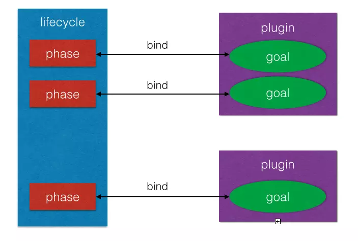
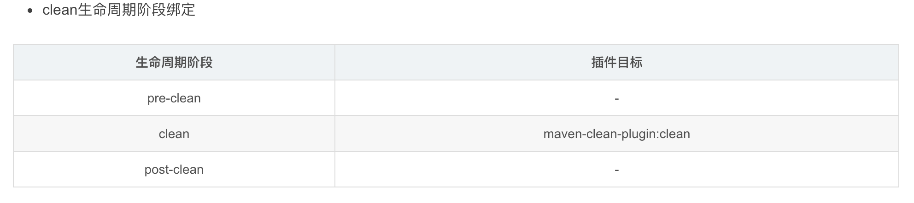
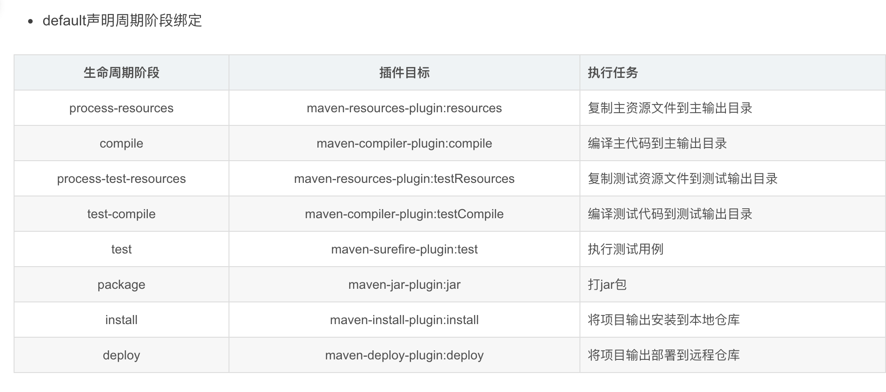
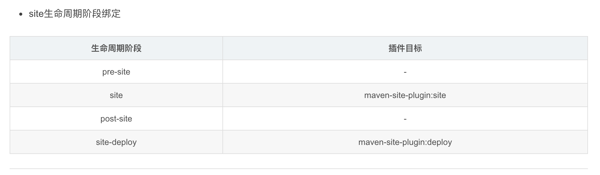
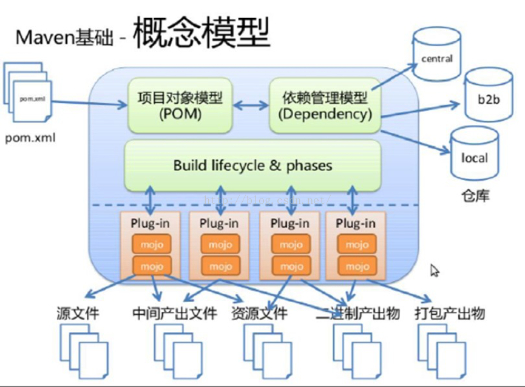

# Maven项目构建与生命周期

构建是什么呢？简单地说，构建就是软件项目生产的整个过程，这个过程应该包括：

（1）文档和代码的生成（有些项目会使用代码自动生成工具，比如数据库访问代码的逆向工程）

（2）代码的编译、测试和打包

（3）打包好的代码进行分发或者部署

由此可见，项目的构建可绝不仅仅是编译软件这件事情。除了写代码，在项目层面做的大部分工作，都包含在构建的过程中。

有了Maven这个开源利器，构建中的这些过程都能够进行良好的定义，通过生命周期的形式进行定义，而且Maven能够帮我们串起来形成一个自动构建过程，这样比我们手动执行要高效得多。

注意，Maven 生命周期不是指的软件生命周期，后者是软件的产生直到报废或停止使用的生命周期

## 项目构建的生命周期

如上所示，构建就是软件项目生产的整个过程，这个过程通过生命周期来贯穿。

一个典型的 Maven 构建（build）生命周期是由以下几个阶段的序列组成的：

​                 >

​             

| 阶段          | 处理     | 描述                                                     |
| ------------- | -------- | -------------------------------------------------------- |
| 验证 validate | 验证项目 | 验证项目是否正确且所有必须信息是可用的                   |
| 编译 compile  | 执行编译 | 源代码编译在此阶段完成                                   |
| 测试 Test     | 测试     | 使用适当的单元测试框架（例如JUnit）运行测试。            |
| 包装 package  | 打包     | 创建JAR/WAR包如在 pom.xml 中定义提及的包                 |
| 检查 verify   | 检查     | 对集成测试的结果进行检查，以保证质量达标                 |
| 安装 install  | 安装     | 安装打包的项目到本地仓库，以供其他项目使用               |
| 部署 deploy   | 部署     | 拷贝最终的工程包到远程仓库中，以共享给其他开发人员和工程 |

## Maven标准生命周期

项目除了构建以外，还包括构建之前的项目清理，以及构建之后项目文档的创建。所以，Maven有三套相互独立的生命周期，分别是clean、default和site。每个生命周期包含一些阶段，阶段是有顺序的，后面的阶段依赖于前面的阶段。             

​                  一个完整的项目构建过程通常包括清理、编译、测试、打包、集成测试、验证、部署等步骤，Maven从中抽取了一套完善的、易扩展的生命周期。Maven的生命周期是抽象的，其中的具体任务都交由插件来完成。Maven为大多数构建任务编写并绑定了默认的插件，如针对编译的插件：maven-compiler-plugin。当然，用户也可自行配置或编写插件。

Maven 有以下三个标准的生命周期：

- 1、clean：项目清理的处理
- 2、default(或 build)：项目部署的处理
- 3、site：项目站点文档创建的处理

## Maven Clean 生命周期

清洁（clean）生命周期包括以下三个阶段：

- 预清洁（pre-clean）：执行实际项目清理之前所需的流程
- 清洁（clean） ：删除以前构建生成的所有文件
- 后清洁（post-clean）：执行完成项目清理所需的流程

在一个生命周期中，运行某个阶段的时候，它之前的所有阶段都会被运行，也就是说，如果执行 mvn clean 将运行以下两个生命周期阶段：

```
pre-clean, clean
```

如果我们运行 mvn post-clean ，则运行以下三个生命周期阶段：

```
pre-clean, clean, post-clean
```

# Maven快照

Maven 构建出来的 jar 包分为快照版本（Snapshot）和发布版本（Release），那么为什么有如此区分呢？

在实际开发中，我们经常遇到这样的场景，比如A服务依赖于B服务，A和B同时开发，B在开发中发现了BUG，修改后，将版本由1.0升级为2.0，那么A必须也跟着在 pom.xml 中进行版本升级。过了几天后，B又发现了问题，进行修改后升级版本发布，然后通知A进行升级...如此反复，A就有点抓狂，团队矛盾开始升级，可以说这是开发过程中的版本不稳定导致了这样的问题。

Maven 已经替我们想好了解决方案，就是使用 Snapshot 版本，在开发过程中B发布的版本标志为 Snapshot 版本，A进行依赖的时候选择 Snapshot 版本，那么每次B发布的话，会在私服仓库中，形成带有时间戳的 Snapshot 版本，而A构建的时候会自动下载B最新时间戳的 Snapshot 版本！

对于版本，如果 Maven 以前下载过指定的版本文件，比如说 data-service:1.0，Maven 将不会再从仓库下载新的可用的 1.0 文件。若要下载更新的代码，data-service 的版本需要升到1.1 在快照的情况下，每次重新构建项目的时候，Maven 将自动获取最新的快照(data-service:1.0-SNAPSHOT)。

## 项目快照 vs 版本

在Maven依赖管理中，唯一标识依赖是三个属性，分别是 groupId、artifactId以及version。这三个属性可以唯一确定一个组件（Jar包或者War包）。

其实在 Maven 仓库中，一般情况下，一个仓库会分为 public(Release)仓和 SNAPSHOT 仓，前者存放正式版本，后者存放快照版本。如果在项目配置文件中 pom.xml 指定的版本号带有"-SNAPSHOT"后缀，比如版本号为"JUnit-4.10-SNAPSHOT"，那么打出的包就是一个快照版本。

快照版本和正式版本的主要区别在于，本地获取这些依赖的机制有所不同。假设你依赖一个库的正式版本，构建的时候构建工具会先在本次仓库中查找是否已经有了这个依赖库，如果没有的话才会去远程仓库中去拉取。所以假设你发布了JUnit-4.10.jar到了远程仓库，有一个项目依赖了这个库，它第一次构建的时候会把该库从远程仓库中下载到本地仓库缓存，以后再次构建都不会去访问远程仓库了。所以如果你修改了代码，向远程仓库中发布了新的软件包，但仍然叫JUnit-4.10.jar，那么依赖这个库的项目就无法得到最新更新。你只有在重新发布的时候升级版本，比如叫做JUnit-4.11.jar，然后通知依赖该库的项目组也修改依赖版本为JUnit-4.11,这样才能使用到你最新添加的功能。

这种方式在团队内部开发的时候令人抓狂，痛不欲生。假设有两个小组负责维护两个组件，web-dao和web-service，其中  web-service 项目依赖于web-dao。而这两个项目每天都会构建多次，如果每次构建你都要升级 web-dao  的版本，那么你会疯掉。这个时候 SNAPSHOT 版本就派上用场了。每天日常构建时你可以构建 web-dao 的快照版本，比如 web-dao-1.0-SNAPSHOT.jar，而 web-service  依赖该快照版本。每次 web-service 构建时，会优先去远程仓库中查看是否有最新的 web-dao-1.0-SNAPSHOT.jar，如果有则下载下来使用。即使本地仓库中已经有了web-dao-1.0-SNAPSHOT.jar，它也会尝试去远程仓库中查看同名的  jar 是否是最新的。有的人可能会问，这样不就不能充分利用本地仓库的缓存机制了吗？别着急，Maven  比我们想象中的要聪明。在配置 Maven 的 Repository 的时候中有个配置项，可以配置对于 SNAPSHOT 版本向远程仓库中查找的频率。频率共有四种，分别是  always、daily、interval、never。当本地仓库中存在需要的依赖项目时，always是每次都去远程仓库查看是否有更新，daily是只在第一次的时候查看是否有更新，当天的其它时候则不会查看；interval允许设置一个分钟为单位的间隔时间，在这个间隔时间内只会去远程仓库中查找一次，never是不会去远程仓库中查找（这种就和正式版本的行为一样了）。

Maven版本的配置方式为：

```xml
<repository>
    <id>myRepository</id>
    <url>...</url>
    <snapshots>
        <enabled>true</enabled>
        <updatePolicy>XXX</updatePolicy>
    </snapshots>
</repository>
```

其中，updatePolicy属性的值可以配置为上面所说的四种类型，默认值是daily。如果配置间隔时间更新，可以写作interval:XX(XX是间隔分钟数)。

所以，一般在开发模式下，我们可以频繁的发布SNAPSHOT版本，以便让其它项目能实时的使用到最新的功能做联调。当版本趋于稳定时，再发布一个正式版本，供正式使用。当然，在做正式发布时，也要确保当前项目的依赖项中不包含对任何SNAPSHOT版本的依赖，保证正式版本的稳定性。

# Maven的多模块项目

[spingboot-maven多模块实践](https://github.com/lcmvs/maven-test/tree/master/multi-module-tst)

在平时的 Java Web 项目开发中，为了便于后期的维护，我们一般会进行分层开发，最常见的情况就是分为：domain（域模型层）、dao（数据库访问层）、service（业务逻辑层）、web（表现层）。这样分层之后，各个层之间的职责会比较明确，后期维护起来也相对比较容易，可以使用 Maven 来构建以上的各个层。常见的 Java Web 项目结构如下所示：

```
system-parent
    　　|----pom.xml
    　　　　
    　　|----system-domain
        　　　　　|----pom.xml
    　　|----system-dao
        　　　　　|----pom.xml
    　　|----system-service
        　　　　　|----pom.xml
    　　|----system-web
        　　　　　|----pom.xml
```

## 1、创建 system-parent 项目

首先，创建 system-parent 项目，用来给各个子模块继承。进入命令行，输入以下命令：

```
mvn archetype:create -DgroupId=cn.mavenbook -DartifactId=system-parent -DarchetypeArtifactId=maven-archetype-quickstart -DinteractiveMode=false
```

命令执行完成之后，可以看到在当前目录生成了 system-parent 目录，里面有一个 src 目录和一个 pom.xml 文件。

将 src 文件夹删除，然后修改 pom.xml 文件，将 <packaging>jar</packaging> 修改为 <packaging>pom</packaging>，pom 表示它是一个被继承的模块，修改后的内容如下：

```xml
<?xml version="1.0"?>

<project>

  <modelVersion>4.0.0</modelVersion>

  <groupId>cn.mavenbook</groupId>
  <artifactId>system-parent</artifactId>
  <version>1.0-SNAPSHOT</version>
  <packaging>pom</packaging>

  <name>system-parent</name>

</project>
```

## 2、创建 sytem-domain 模块

在命令行窗口中，进入创建好的 system-parent 目录，然后执行下列命令：

```
mvn archetype:create -DgroupId=cn.mavenbook -DartifactId=system-domain -DarchetypeArtifactId=maven-archetype-quickstart -DinteractiveMode=false
```

命令执行完成之后，可以看到在 system-parent 目录中生成了 system-domain，里面包含 src 目录和 pom.xml 文件。

同时，在 system-parent 目录中的 pom.xml 文件自动添加了如下内容：

```xml
<modules>
    <module>system-domain</module>
</modules>
```

这时，system-parent 的 pom.xml 文件如下：

```xml
<?xml version="1.0"?>

<project>

  <modelVersion>4.0.0</modelVersion>

  <groupId>org.maven</groupId>
  <artifactId>system-parent</artifactId>
  <version>1.0-SNAPSHOT</version>
  <packaging>pom</packaging>

  <name>system-parent</name>

  <modules>
     <module>system-domain</module>
  </modules>

</project>
```

修改 system-domain 目录中的 pom.xml 文件，把<groupId>cn.mavenbook</groupId>和<version>1.0-SNAPSHOT</version>去掉，加上                 <packaging> jar </packaging>， 因为 groupId 和 version 会继承 system-parent 中的 groupId 和                 version，packaging                 设置打包方式为 jar。修改过后的 pom.xml 文件如下：

```xml
<?xml version="1.0"?>

<project>
  <modelVersion>4.0.0</modelVersion>

  <parent>
    <groupId>cn.mavenbook</groupId>
    <artifactId>system-parent</artifactId>
    <version>1.0-SNAPSHOT</version>
  </parent>

  <artifactId>system-domain</artifactId>
  <packaging>jar</packaging>

  <name>system-domain</name>
  <url>http://maven.apache.org</url>
</project>
```

## 3、创建 sytem-dao 模块

在命令行窗口，进入创建好的 system-parent 目录，然后执行下列命令：

```
mvn archetype:create -DgroupId=cn.mavenbook -DartifactId=system-dao -DarchetypeArtifactId=maven-archetype-quickstart -DinteractiveMode=false
```

命令执行完成之后，可以看到在 system-parent 目录中生成了 system-dao，里面包含 src 目录和 pom.xml 文件。

同时，在 system-parent 目录中的 pom.xml 文件自动变成如下内容：

```xml
<?xml version="1.0"?>

<project>

  <modelVersion>4.0.0</modelVersion>

  <groupId>org.maven</groupId>
  <artifactId>system-parent</artifactId>
  <version>1.0-SNAPSHOT</version>
  <packaging>pom</packaging>

  <name>system-parent</name>

  <modules>
    <module>system-domain</module>
    <module>system-dao</module>
  </modules>

</project>
```

修改 system-dao 目录中的 pom.xml  文件，把<groupId>cn.mavenbook</groupId>和<version>1.0-SNAPSHOT</version>去掉，加上<packaging>jar</packaging>，因为                 groupId 和 version 会继承 system-parent 中的 groupId 和  version，packaging 设置打包方式为 jar，同时添加对                 system-domain                 模块的依赖，修改后的内容如下：

```xml
<?xml version="1.0"?>

<project>
  <modelVersion>4.0.0</modelVersion>

  <parent>
    <groupId>cn.mavenbook</groupId>
    <artifactId>system-parent</artifactId>
    <version>1.0-SNAPSHOT</version>
  </parent>

  <artifactId>system-dao</artifactId>
  <packaging>jar</packaging>

  <name>system-dao</name>
  <url>http://maven.apache.org</url>

  <properties>
    <project.build.sourceEncoding>UTF-8</project.build.sourceEncoding>
  </properties>

  <dependencies>
    <!--system-dao需要使用到system-domain中的类，所以需要添加对system-domain模块的依赖-->
     <dependency>
      <groupId>cn.mavenbook</groupId>
      <artifactId>system-domain</artifactId>
      <version>${project.version}</version>
    </dependency>
  </dependencies>

</project>
```

## 4、创建system-service模块

在命令行窗口，进入创建好的 system-parent 目录，然后执行下列命令：

```
mvn archetype:create -DgroupId=cn.mavenbook -DartifactId=system-service -DarchetypeArtifactId=maven-archetype-quickstart -DinteractiveMode=false
```

命令执行完成之后可以看到在 system-parent 目录中生成了 system-service目录，里面包含 src 目录和 pom.xml 文件。

同时，在 system-parent 目录中的 pom.xml 文件自动变成如下内容：

```xml
<?xml version="1.0"?>

<project>

  <modelVersion>4.0.0</modelVersion>

  <groupId>cn.mavenbook</groupId>
  <artifactId>system-parent</artifactId>
  <version>1.0-SNAPSHOT</version>
  <packaging>pom</packaging>

  <name>system-parent</name>

  <modules>
    <module>system-domain</module>
    <module>system-dao</module>
    <module>system-service</module>
  </modules>

</project>
```

修改system-service目录中的pom.xml文件，把<groupId>cn.mavenbook</groupId>和<version>1.0-SNAPSHOT</version>去掉，加上<packaging>jar</packaging>，因为                 groupId 和 version 会继承 system-parent 中的 groupId 和  version，packaging 设置打包方式为 jar，同时添加对                 system-dao                 模块的依赖，system-service 依赖 system-dao 和  system-domain，但是我们只需添加 system-dao 的依赖即可，因为                 system-dao 已经依赖了                 system-domain。修改后的内容如下：

```xml
<?xml version="1.0"?>

<project >
  <modelVersion>4.0.0</modelVersion>

  <parent>
    <groupId>cn.mavenbook</groupId>
    <artifactId>system-parent</artifactId>
    <version>1.0-SNAPSHOT</version>
  </parent>

  <artifactId>system-service</artifactId>
  <packaging>jar</packaging>

  <name>system-service</name>
  <url>http://maven.apache.org</url>

  <properties>
    <project.build.sourceEncoding>UTF-8</project.build.sourceEncoding>
  </properties>

  <dependencies>
    <!--
    system-service依赖system-dao和system-domain，
    但是我们只需添加system-dao的依赖即可，因为system-dao已经依赖了system-domain
    -->
    <dependency>
      <groupId>cn.mavenbook</groupId>
      <artifactId>system-dao</artifactId>
      <version>${project.version}</version>
    </dependency>
  </dependencies>

</project>
```

## 5、创建 system-web 模块

在命令行窗口中，进入创建好的 system-parent 目录，然后执行下列命令：

```
mvn archetype:create -DgroupId=cn.mavenbook -DartifactId=system-web -DarchetypeArtifactId=maven-archetype-webapp -DinteractiveMode=false
```

命令执行完成之后，可以看到在 system-parent 目录中生成了 system-web 目录，里面包含 src 目录和 pom.xml 文件。

在\system-web\src\main\webapp目录中还生成了一个简单的index.jsp，里面的内容为：

```html
<html>
<body>
<h2>Hello World!</h2>
</body>
</html>
```

在 system-web\src\main\webapp\WEB-INF 目录中生成了web.xml文件。

同时，system-parent 目录中的 pom.xml 文件自动变成如下内容：

```xml
<?xml version="1.0"?>

<project>

  <modelVersion>4.0.0</modelVersion>

  <groupId>cn.mavenbook</groupId>
  <artifactId>system-parent</artifactId>
  <version>1.0-SNAPSHOT</version>
  <packaging>pom</packaging>

  <name>system-parent</name>

  <modules>
    <module>system-domain</module>
    <module>system-dao</module>
    <module>system-service</module>
    <module>system-web</module>
  </modules>

</project>
```

修改system-web目录中的pom.xml文件，把<groupId>cn.mavenbook</groupId>和<version>1.0-SNAPSHOT</version>去掉，因为groupId和version会继承system-parent中的groupId和version，同时添加对system-service模块的依赖，修改后的内容如下：

```xml
<?xml version="1.0"?>

<project>
  <modelVersion>4.0.0</modelVersion>

  <parent>
    <groupId>cn.mavenbook</groupId>
    <artifactId>system-parent</artifactId>
    <version>1.0-SNAPSHOT</version>
  </parent>

  <artifactId>system-web</artifactId>
  <packaging>war</packaging>

  <name>system-web Maven Webapp</name>
  <url>http://maven.apache.org</url>

  <dependencies>
    <!--system-web依赖system-service-->
     <dependency>
      <groupId>cn.mavenbook</groupId>
      <artifactId>system-service</artifactId>
      <version>${project.version}</version>
    </dependency>
  </dependencies>

  <build>
    <finalName>system-web</finalName>
  </build>

  </project>
```

注意，web项目的打包方式是war。

## 6、编译运行项目

经过上面的五个步骤，相关的模块全部创建完成，怎么运行起来呢？

由于最终运行的是 system-web 模块，所以我们对该模块添加 jetty 支持，方便测试运行。修改 system-web 项目的 pom.xml 如下：

```xml
<?xml version="1.0"?>

<project>
  <modelVersion>4.0.0</modelVersion>
  <parent>
    <groupId>cn.mavenbook</groupId>
    <artifactId>system-parent</artifactId>
    <version>1.0-SNAPSHOT</version>
  </parent>

  <artifactId>system-web</artifactId>
  <packaging>war</packaging>

  <name>system-web Maven Webapp</name>
  <url>http://maven.apache.org</url>

  <dependencies>
    <!--system-web依赖system-service-->
     <dependency>
      <groupId>cn.mavenbook</groupId>
      <artifactId>system-service</artifactId>
      <version>${project.version}</version>
    </dependency>
  </dependencies>

  <build>
    <finalName>system-web</finalName>
    <plugins>
        <!--配置Jetty插件-->
        <plugin>
            <groupId>org.mortbay.jetty</groupId>
            <artifactId>maven-jetty-plugin</artifactId>
        </plugin>
    </plugins>
  </build>

</project>
```

在命令行进入 system-parent 目录，然后执行下列命令：

```
mvn clean install
```

命令执行完后，在 system-web 目录下多出了 target 目录，里面有了 system-web.war。

命令行进入 sytem-web 目录，执行如下命令，启动 jetty

```
mvn jetty:run
```

启动 jetty 服务器后，访问 http://localhost:8080/system-web/ 就可以获取到运行结果。


# 彻底理解Maven

在 Maven 出现之前，项目开发犹如是刀耕火种的上古时代，我们先来看看一个 Java                 项目需要的东西。首先，我们要确定项目的目录结构。例如，src 目录存放 Java 源码，resources  目录存放配置文件，bin 目录存放编译生成的 .class 文件。其次，我们需要确定引入哪些依赖包。例如，如果我们需要用到                 commons logging，我们就必须把 commons logging 的 jar 包放入  classpath 。如果我们还需要 log4j，就需要把 log4j 相关的 jar 包都放到                 classpath 中，这些就是依赖包的管理。

虽然这些工作难度不大，但是非常琐碎且耗时。如果每一个项目都自己搞一套配置，肯定会一团糟。我们需要的是一个标准化的 Java 项目管理和构建工具。Maven 就是是专门为 Java                 项目打造的管理和构建工具，它的主要功能有：

- 提供了一套标准化的项目结构。使用 Maven 管理的 Java 项目都有着相同的项目结构：
                       （1）有一个 pom.xml 用于维护当前项目都用了哪些 jar 包
                       （2）所有的 java 功能代码都放在 src/main/java 下面
                       （3）所有的 java 测试代码都放在 src/test/java 下面
- 提供了一套标准化的构建流程（编译，测试，打包，发布……）。
- 提供了一套依赖管理机制。

## 1、Maven基本概念

Maven 有两个最基本的概念：pom 和 lifecycle，这里的 pom 不是 Maven 构建过程中使用的 pom 文件，但它们之间有联系。

POM 全称为 Project Object Model，简单地说就是要对构建的项目进行建模，将要构建的项目看成是一个对象 Object，既然是一个对象，这个对象有哪些属性呢？在 Maven  中一个项目使用唯一的坐标来表示，包括 groupId、artifactId、version、classifier 和 type（也叫 packaging）这五部分。另外，一个项目肯定不是孤立存在的，可能会依赖其他项目，也就是说这个对象应该还有 dependencies 属性，用 PO 表示构建对象，使用 Java                 代码描述这个对象的话：

```java
class PO{
    private String groupId;
    private String artifactId;
    private String version;
    private String classifier;
    private String type;
    private Set<PO> dependencies;
}
```

xml 具有很强的表达能力，一个 Java 对象可以用 xml 来描述，用 xml 表达上面这个 Java 对象可以为：

```xml
<PO>
    <groupId></groupId>
    <artifactId></artifactId>
    <version></version>
    <classifier><classifier>
    <type></type>
    <dependencies>
        <PO></PO>
        <PO></PO>
        ...
    </dependencies>
</PO>
```

看到这里，大家是不是觉得它和 pom.xml 很类似呢？ 其实 pom.xml 就是 PO 对象的 xml 描述，上面这个 PO 定义还不完整，我们知道在 Java 中类是可以继承的，PO 也有继承关系，PO 对象存在父类父类对象，用 parent 表示，它会继承父类对象的所有属性。除此以外，一个项目可能根据不同职责分为多个模块（module），所有模块其实也就是一个单独的项目，只不过这些项目会使用其父对象的一些属性来进行构建。我们将这些新的属性加到 PO 的定义中去：

```java
class PO{
    private String groupId;
    private String artifactId;
    private String version;
    private String classifier;
    private String type;
    private Set dependencies;
    private PO parent;
    private Set modules;
}					
```

接下来，我们再将这个定义用 xml 语言表示一下：

```xml
<PO>
    <parent></parent>
    <groupId></groupId>
    <artifactId></artifactId>
    <version></version>
    <classifier><classifier>
    <type></type>
    <dependencies>
        <PO></PO>
        <PO></PO>
        ...
    </dependencies>
    <modules>
        ...
    </modules>
</PO>
```

是不是更像 pom.xml 了？ pom.xml 其实就是对 PO 对象的 xml 描述！

## 2、构建

项目的构建过程对应的是 PO 对象的 build 属性，对应 pom.xml 中也就是<build>元素中的内容，这里引入 Maven 中第二个核心概念：Lifecycle。Lifecycle 直译过来就是生命周期。我们平常会接触到很多生命周期的东西，例如一年中春夏秋冬就是一个周期。一个周期中可能分为多个阶段，比如这里的春夏秋冬。在 Maven 中一个构建过程就对应一个 Lifecycle，这个 Lifecycle 也分为多个阶段，每个阶段叫做 phase。你可能会问，那这个 Lifecycle 中包含多少个 phase 呢？一个标准的构建 Lifecycle 包含了如下的 phase ：

```properties
validate： 用于验证项目的有效性和其项目所需要的内容是否具备
initialize：初始化操作，比如创建一些构建所需要的目录等。
generate-sources：用于生成一些源代码，这些源代码在compile phase中需要使用到
process-sources：对源代码进行一些操作，例如过滤一些源代码
generate-resources：生成资源文件（这些文件将被包含在最后的输入文件中）
process-resources：对资源文件进行处理
compile：对源代码进行编译
process-classes：对编译生成的文件进行处理
generate-test-sources：生成测试用的源代码
process-test-sources：对生成的测试源代码进行处理
generate-test-resources：生成测试用的资源文件
process-test-resources：对测试用的资源文件进行处理
test-compile：对测试用的源代码进行编译
process-test-classes：对测试源代码编译后的文件进行处理
test：进行单元测试
prepare-package：打包前置操作
package：打包
pre-integration-test：集成测试前置操作   
integration-test：集成测试
post-integration-test：集成测试后置操作
install：将打包产物安装到本地maven仓库
deploy：将打包产物安装到远程仓库
```

在 Maven 中，你执行任何一个 phase 时，Maven 会将其之前的 phase 都执行。例如 mvn install，那么 Maven 会将 deploy 之外的所有 phase 按照他们出现的顺序一次执行。

Lifecycle 还牵涉到另外一个非常重要的概念：goal。注意上面 Lifecycle 的定义，也就是说 Maven 为程序的构建定义了一套规范流程---第一步需要 validate，第二步需要initialize... ... compile，test，package，... ... install，deploy，但是并没有定义每一个 phase 具体应该如何操作。这里的 phase  的作用有点类似于 Java 语言中的接口，只协商了一个契约，但并没有定义具体的动作。比如说 compile 这个 phase 定义了在构建流程中需要经过编译这个阶段，但没有定义应该怎么编译（编译的输入是什么？用什么编译 javac/gcc？）。这里具体的动作就是由 goal 来定义，一个 goal 在 Maven 中就是一个 MOJO（Maven Ordinary Java Object）。MOJO 抽象类中定义了一个 execute() 方法，一个 goal 的具体动作就是在 execute() 方法中实现。实现的 MOJO 类应该放在哪里呢？答案是 Maven Plugin 里，所谓的 Plugin 其实也就是一个 Maven 项目，只不过这个项目会引用 Maven 的一些API，Plugin 项目也具备 Maven坐标。

在执行具体的构建时，我们需要为 lifecycle 的每个 phase 都绑定一个 goal，这样才能够在每个步骤执行一些具体的动作。比如在 lifecycle 中有个 compile phase 规定了构建的流程需要经过编译这个步骤，而 maven-compile-plugin 这个 plugin 有个 compile goal 就是用 javac 来将源文件编译为 class文件的，我们需要做的就是将 compile 这个 phase 和 maven-compile-plugin 中的 compile 这个 goal 进行绑定，这样就可以实现 Java                 源代码的编译了。那么有人就会问，在哪里绑定呢？答案是在 pom.xml 中 <build> 元素中配置即可。例如：

```xml
<build>
<plugins>
  <plugin>
    <artifactId>maven-myquery-plugin</artifactId>
    <version>1.0</version>
    <executions>
      <execution>
        <id>execution1</id>
        <phase>test</phase>
        <configuration>
          <url>http://www.foo.com/query</url>
          <timeout>10</timeout>
          <options>
            <option>one</option>
            <option>two</option>
            <option>three</option>
          </options>
        </configuration>
        <goals>
          <goal>query</goal>
        </goals>
      </execution>
    </executions>
  </plugin>
</plugins>
</build>
```

就将 maven-myquery-plugin 中的 query 这个goal绑定到了 test 这个 phase，后续在 maven 执行到 test phase 时就会执行 query goal。还有人可能会问，我都没有指定 Java 源文件的位置，编译啥？这就引出了 Maven 的 design principle。

在 Maven 中，有一个非常著名的 principle 就是 convention over configuration（约定优于配置）。这一点和 ant 有非常大的区别，例如使用 ant  来进行编译时，我们需要指定源文件的位置，输出文件的位置，javac 的位置，classpath...。在 Maven 中这些都是不需要，若没有手动配置，Maven 默认从<项目根目录>/src/main/java                 这个目录去查找 Java 源文件，编译后的 class 文件会保存在<项目根目录>/target/classes 目录。

在 Maven 中，所有的 PO 都有一个根对象，就是 Super POM。Super POM 中定义了所有的默认的配置项，Super POM 对应的 pom.xml 文件可以在 Maven 安装目录下 lib/maven-model-builder-3.0.3.jar:org/apache/maven/model/pom-4.0.0.xml 中找到。用一张图来表示 Maven  Lifecycle，phase，goal之间的关系：

​                 

​             

## 3、插件

上面我们提到，Maven 将所有项目的构建过程统一抽象成一套生命周期: 项目的清理、初始化、编译、测试、打包、集成测试、验证、部署和站点生成 ...，几乎所有项目的构建都能映射到这一组生命周期上。但生命周期是抽象的（Maven的生命周期本身是不做任何实际工作），任务执行均交由插件完成。其中每个构建步骤都可以绑定一个或多个插件的目标，而且 Maven 为大多数构建步骤都编写并绑定了默认插件。当用户有特殊需要的时候，也可以配置插件定制构建行为，甚至自己编写插件。

## 4、生命周期

Maven 拥有三套相互独立的生命周期: clean、default 和 site，而每个生命周期包含一些  phase 阶段，阶段是有顺序的，并且后面的阶段依赖于前面的阶段。而三套生命周期相互之间却并没有前后依赖关系，即调用 site 周期内的某个  phase 阶段并不会对 clean 产生任何影响。

**clean**

clean生命周期的目的是清理项目。例如：$ mvn clean

**default**

default生命周期定义了真正构建时所需要执行的所有步骤。例如：$ mvn clean install

**site**

site生命周期的目的是建立和发布项目站点。Maven 能够基于 POM 所包含的信息自动生成一个友好的站点，方便团队交流和发布项目信息。例如：$ mvn clean deploy  site-deploy

这三个 lifecycle 定义了其包含的 phase。Maven 会在这三个 lifecycle 中匹配对应的 phase。当执行某个 phase 时，Maven 会依次执行在这个 phase 之前的 phase。

## 5、插件与生命周期

生命周期的阶段 phase 与插件的目标 goal 相互绑定，用以完成实际的构建任务。而对于插件本身，为了能够复用代码，它往往能够完成多个任务，这些功能聚集在一个插件里，每个功能就是一个目标。

例如：$ mvn compiler:compile。冒号前部分是插件前缀，后面部分是该插件目标，即: maven-compiler-plugin 的 compile目标。而该目标绑定了 default 生命周期的 compile 阶段。它们的绑定能够实现项目编译的目的。

> **提醒：**Maven 命名有要求，Maven 团队维护官方插件的保留命名方式是 maven-<myplugin>-plugin。                 

## 6、插件的内置绑定

为了能让用户几乎不用任何配置就能使用 Maven 构建项目，Maven 默认为一些核心的生命周期绑定了插件目标，当用户通过命令调用生命周期阶段时, 对应的插件目标就会执行相应的逻辑。

                          

上图只列出了打包方式为jar且拥有插件绑定关系的阶段（packaging 定义了Maven项目打包方式, 通常打包方式与所生成构件扩展名对应，有jar(默认)、war、pom、maven-plugin等,  其他打包类型生命周期的默认绑定关系可参考: [Built-in Lifecycle Bindings、Plugin Bindings for default Lifecycle Reference](http://maven.apache.org/guides/introduction/introduction-to-the-lifecycle.html#Built-in_Lifecycle_Bindings)   

## 7、插件的自定义绑定

除了内置绑定以外，用户还能够自定义将某个插件目标绑定到生命周期的某个阶段上。如创建项目的源码包，maven-source-plugin插件的jar-no-fork目标能够将项目的主代码打包成jar文件,                 可以将其绑定到verify阶段上：

```xml
<build>
    <plugins>
        <plugin>
            <groupId>org.apache.maven.plugins</groupId>
            <artifactId>maven-source-plugin</artifactId>
            <version>3.0.0</version>
            <executions>
                <execution>
                    <id>attach-sources</id>
                    <phase>verify</phase>
                    <goals>
                        <goal>jar-no-fork</goal>
                    </goals>
                </execution>
            </executions>
        </plugin>
    </plugins>
</build>
```

executions下每个execution子元素可以用来配置执行一个任务。

## 8、聚合与继承

Maven 的聚合特性(aggregation)能够使项目的多个模块聚合在一起构建，而继承特性(inheritance)能够帮助抽取各模块相同的依赖、插件等配置，在简化模块配置的同时，保持各模块一致。             

**模块聚合**

随着项目越来越复杂，需要解决的问题越来越多、功能越来越重，我们更倾向于将一个项目划分几个模块并行开发，如：将 feedcenter-push 项目划分为 client、core 和 web 三个模块，而我们又想一次构建所有模块，而不是针对各模块分别执行 $ mvn 命令。于是就有了 Maven 的模块聚合，将 feedcenter-push 作为聚合模块将其他模块聚集到一起构建。             

**聚合POM**

聚合模块 POM 仅仅是帮助聚合其他模块构建的工具，本身并无实质内容。

```xml
<project xmlns="http://maven.apache.org/POM/4.0.0"
         xmlns:xsi="http://www.w3.org/2001/XMLSchema-instance"
         xsi:schemaLocation="http://maven.apache.org/POM/4.0.0
         http://maven.apache.org/xsd/maven-4.0.0.xsd">

    <modelVersion>4.0.0</modelVersion>

    <groupId>com.vdian.feedcenter</groupId>
    <artifactId>feedcenter-push</artifactId>
    <packaging>pom</packaging>
    <version>1.0.0.SNAPSHOT</version>

    <modules>
        <module>feedcenter-push-client</module>
        <module>feedcenter-push-core</module>
        <module>feedcenter-push-web</module>
    </modules>

</project>
```

通过在一个打包方式为 pom 的 Maven 项目中声明任意数量的 module 以实现模块聚合。

- packaging: 打包为 pom，否则无法聚合构建。                 
- modules: 实现聚合的核心，module 值为被聚合模块相对于聚合 POM 的相对路径，每个被聚合模块下还各自包含有pom.xml、src/main/java、src/test/java等内容， 离开聚合 POM 也能够独立构建。                 

若<packaging>元素的内容是 jar，那么我们很好理解，也就是说这个项目最终会被打包成一个 jar 包，那 <packaging> 元素为 pom 又是什么意思呢？从字面上的意思来看，这个项目将打包成一个 pom 。我们不妨去 Maven 仓库里去瞧瞧（前提是已经在项目下运行了 mvn install 命令）。可以发现这个文件其实和项目中的                 pom.xml 是同一个文件，这样做的目的是什么呢？上面我们说过 PO 对象也是有继承关系的，<packaging>pom</packaging> 的作用就在这里，这就是 Maven 中 project inheritance 的概念。当实际执行 Maven 命令的时候，会根据 project inheritance 关系对项目的 pom.xml 进行转化，得到真正执行时所用到的                 pom.xml，即所谓的 effective pom，因此可以得到一个结论：所有 <packaging> 元素为 pom 的项目其实并不会输出一个可供外部使用，类似于 jar 包的东西。这类项目的作用有两个：管理子项目和管理继承属性。

**管理子项目**

例如，api 和 biz 是 echo 项目的两个 module。若没有 echo 这个父项目，我们需要到 api 和 biz 两个项目下分别执行 mvn install 命令才能完成整个构建过程，而有了 echo 这个父项目之后，我们只需在 echo 项目中执行 mvn install 即可，Maven 会解析 pom.xml，发现该项目有 api 和 biz 两个 module，它会分别到这两个项目下去执行 mvn install 命令。当 module 数量比较多的时候，能大大提高构建的效率

**管理继承属性**

比如A和B都需要某个依赖，那么在父类项目的 pom.xml 中声明即可，因为根据 PO 对象的继承关系，A和B项目会继承父类项目的依赖，这样就可以减少一些重复的输入。

effective pom 包含了当前项目的 PO 对象，直到 Super POM 对应的 PO 对象中的信息。要看一个项目的 effective pom，只需在项目中执行命令即可查看：

```
mvn help:effective-pom
```

这里顺带说一句，有的人可能不理解上面这个命令是什么意思。Maven 命令的语法为：

```
mvn [plugin-name]:[goal-name]
```

这个命令采用了缩写的形式，其全称是这样的：

```
org.apache.maven.plugins:maven-help-plugin:2.2:effective-pom
```

此命令以分号为分隔符，包含了 groupId，artifactId，version，goal 四部分。若 groupId 为 org.apache.maven.plugins                 则可以使用上述的简写形式，也就是说和下面的命令是等价的：

```
mvn help:effective-pom
mvn org.apache.maven.plugins:maven-help-plugin:2.2:effective-pom
```

都是执行了 maven-help-plugin 这个 plugin 中的 effective-pom 这个 goal。

我们知道一个 plugin 中可以包含多 个goal，goal 可以绑定到 lifecycle 中的某一个  phase，这样在执行这个 phase 的时候就会调用该 goal。那些没有绑定到 phase 上的 goal 应该如何执行呢？这就是 mvn [goal(s)]

这里的 goal 也就是官方文档中所说的 standalone goal，也就是说若一个 plugin 中的某个 goal 没有和一个 phase 进行绑定，可以通过这种方式来执行。可能有的人使用过：

```
mvn dependency:tree
```

这条命令其实就是单独执行一个 goal，这个 goal 的作用是分析该工程的依赖并使用树状的形式打印出来。这里的 dependency:tree 其实是一个简写的形式，其完整形式是：

```
mvn org.apache.maven.plugins:maven-dependency-plugin:<版本号信息>:tree
```

也就是说单独执行一个 goal 的方式是：

```
mvn <groupId>:<artifactId>:<version>:<goal>
```

每次都要敲这么长一串命令是很繁琐的，因此才有了上述的简写的形式。

**模块继承**

在面向对象中, 可以通过类继承实现复用，在 Maven 中同样也可以创建 POM 的父子结构, 通过在父 POM 中声明一些配置供子 POM 继承来实现复用与消除重复。

**父 POM**

与聚合类似，父 POM 的打包方式也是 pom，因此可以继续复用聚合模块的 POM ，这也是在开发中常用的方式：

```xml
<project xmlns="http://maven.apache.org/POM/4.0.0"
         xmlns:xsi="http://www.w3.org/2001/XMLSchema-instance"
         xsi:schemaLocation="http://maven.apache.org/POM/4.0.0
         http://maven.apache.org/xsd/maven-4.0.0.xsd">

    <modelVersion>4.0.0</modelVersion>

    <groupId>com.vdian.feedcenter</groupId>
    <artifactId>feedcenter-push</artifactId>
    <packaging>pom</packaging>
    <version>1.0.0.SNAPSHOT</version>

    <modules>
        <module>feedcenter-push-client</module>
        <module>feedcenter-push-core</module>
        <module>feedcenter-push-web</module>
    </modules>

    <properties>
        <finalName>feedcenter-push</finalName>
        <warName>${finalName}.war</warName>
        <spring.version>4.0.6.RELEASE</spring.version>
        <junit.version>4.12</junit.version>
        <project.build.sourceEncoding>UTF-8</project.build.sourceEncoding>
        <warExplodedDirectory>exploded/${warName}</warExplodedDirectory>
    </properties>

    <dependencyManagement>
        <dependencies>
            <dependency>
                <groupId>org.springframework</groupId>
                <artifactId>spring-core</artifactId>
                <version>${spring.version}</version>
            </dependency>
            <dependency>
                <groupId>org.springframework</groupId>
                <artifactId>spring-beans</artifactId>
                <version>${spring.version}</version>
            </dependency>
            <dependency>
                <groupId>org.springframework</groupId>
                <artifactId>spring-context</artifactId>
                <version>${spring.version}</version>
            </dependency>

           <dependency>
                <groupId>junit</groupId>
                <artifactId>junit</artifactId>
                <version>${junit.version}</version>
                <scope>test</scope>
            </dependency>
        </dependencies>
    </dependencyManagement>

    <build>
        <pluginManagement>
            <plugins>
                <plugin>
                    <groupId>org.apache.maven.plugins</groupId>
                    <artifactId>maven-source-plugin</artifactId>
                    <version>3.0.0</version>
                    <executions>
                        <execution>
                            <id>attach-sources</id>
                            <phase>verify</phase>
                            <goals>
                                <goal>jar-no-fork</goal>
                            </goals>
                        </execution>
                    </executions>
                </plugin>
            </plugins>
        </pluginManagement>
    </build>
</project>
```

在项目中遇到一些 jar 包冲突的问题，还有很多人分不清楚 dependencies 与 dependencyManagement 的区别：

dependencies，即使在子项目中不写该依赖项，那么子项目仍然会从父项目中继承该依赖项（全部继承）

dependencyManagement，只是声明依赖，并不实现引入，因此子项目需要显示的声明需要用的依赖。如果不在子项目中声明依赖，是不会从父项目中继承下来的；只有在子项目中写了该依赖项，并且没有指定具体版本，才会从父项目中继承该项，并且  version 和 scope 都读取自父 pom。另外，如果子项目中指定了版本号，那么会使用子项目中指定的 jar 版本。

使用 dependency Management ，能让子 POM 继承父 POM 的配置的同时, 又能够保证子模块的灵活性。在父 POM 中 dependencyManagement 元素配置的依赖声明不会实际引入子模块中， 但能够约束子模块 dependencies 下的依赖的使用，子模块只需配置groupId与artifactId。

pluginManagement 与 dependencyManagement 类似，配置的插件不会造成实际插件的调用行为，只有当子 POM 中配置了相关 plugin 元素，才会影响实际的插件行为。

```xml
<?xml version="1.0" encoding="UTF-8"?>
<project xmlns="http://maven.apache.org/POM/4.0.0"
         xmlns:xsi="http://www.w3.org/2001/XMLSchema-instance"
         xsi:schemaLocation="http://maven.apache.org/POM/4.0.0
         http://maven.apache.org/xsd/maven-4.0.0.xsd">

    <parent>
        <groupId>com.vdian.feedcenter</groupId>
        <artifactId>feedcenter-push</artifactId>
        <version>1.0.0.SNAPSHOT</version>
    </parent>
    <modelVersion>4.0.0</modelVersion>

    <artifactId>feedcenter-push-client</artifactId>

    <dependencies>
        <dependency>
            <groupId>org.springframework</groupId>
            <artifactId>spring-core</artifactId>
        </dependency>
        <dependency>
            <groupId>org.springframework</groupId>
            <artifactId>spring-context</artifactId>
        </dependency>
        <dependency>
            <groupId>org.springframework</groupId>
            <artifactId>spring-beans</artifactId>
        </dependency>

        <dependency>
            <groupId>junit</groupId>
            <artifactId>junit</artifactId>
        </dependency>
    </dependencies>

    <build>
        <plugins>
            <plugin>
                <groupId>org.apache.maven.plugins</groupId>
                <artifactId>maven-source-plugin</artifactId>
            </plugin>
            <plugin>
                <groupId>org.apache.maven.plugins</groupId>
                <artifactId>maven-compiler-plugin</artifactId>
            </plugin>
        </plugins>
    </build>

</project>
```

**元素继承**

可以看到，子 POM 中并未定义模块 groupId 与 version，这是因为子 POM 默认会从父 POM 继承了如下元素：

```
groupId、version
dependencies
developers and contributors
plugin lists (including reports)
plugin executions with matching ids
plugin configuration
resources 
```

因此，所有的 springframework 都省去了 version、junit还省去了scope, 而且插件还省去了 executions 与 configuration 配置，因为完整的声明已经包含在父POM中。

当依赖、插件的版本、配置等信息在父 POM 中声明之后，子模块在使用时就无须声明这些信息，也就不会出现多个子模块使用的依赖版本不一致的情况，这就降低了依赖冲突的几率。另外，如果子模块不显式声明依赖与插件的使用，即使已经在父 POM 的 dependencyManagement、pluginManagement 中配置了，也不会产生实际的效果。

建议：模块继承与模块聚合同时进行，这意味着，你可以为自己的所有模块指定一个父工程，同时父工程中可以指定其余的 Maven 模块作为它的聚合模块。但需要遵循以下三条规则：

- 在所有子 POM 中指定它们的父 POM；
- 将父 POM 的 packaging 值设为 pom；
- 在父 POM 中指定子模块/子POM的目录；

parent元素内还包含一个 relativePath 元素, 用于指定父 POM 的相对路径，默认../pom.xml

## 9、超级POM--约定优先于配置

任何一个Maven项目都隐式地继承自超级POM, 因此超级POM的大量配置都会被所有的Maven项目继承, 这些配置也成为了Maven所提倡的约定.

```xml
<!-- START SNIPPET: superpom -->
<project>
  <modelVersion>4.0.0</modelVersion>

  <!-- 定义了中央仓库以及插件仓库, 均为:https://repo.maven.apache.org/maven2 -->
  <repositories>
    <repository>
      <id>central</id>
      <name>Central Repository</name>
      <url>https://repo.maven.apache.org/maven2</url>
      <layout>default</layout>
      <snapshots>
        <enabled>false</enabled>
      </snapshots>
    </repository>
  </repositories>

  <pluginRepositories>
    <pluginRepository>
      <id>central</id>
      <name>Central Repository</name>
      <url>https://repo.maven.apache.org/maven2</url>
      <layout>default</layout>
      <snapshots>
        <enabled>false</enabled>
      </snapshots>
      <releases>
        <updatePolicy>never</updatePolicy>
      </releases>
    </pluginRepository>
  </pluginRepositories>

  <!-- 依次定义了各类代码、资源、输出目录及最终构件名称格式, 这就是Maven项目结构的约定 -->
  <build>
    <directory>${project.basedir}/target</directory>
    <outputDirectory>${project.build.directory}/classes</outputDirectory>
    <finalName>${project.artifactId}-${project.version}</finalName>
    <testOutputDirectory>${project.build.directory}/test-classes</testOutputDirectory>
    <sourceDirectory>${project.basedir}/src/main/java</sourceDirectory>
    <scriptSourceDirectory>${project.basedir}/src/main/scripts</scriptSourceDirectory>
    <testSourceDirectory>${project.basedir}/src/test/java</testSourceDirectory>
    <resources>
      <resource>
        <directory>${project.basedir}/src/main/resources</directory>
      </resource>
    </resources>
    <testResources>
      <testResource>
        <directory>${project.basedir}/src/test/resources</directory>
      </testResource>
    </testResources>

    <!-- 为核心插件设定版本 -->
    <pluginManagement>
      <!-- NOTE: These plugins will be removed from future versions of the super POM -->
      <!-- They are kept for the moment as they are very unlikely to conflict with lifecycle mappings (MNG-4453) -->
      <plugins>
        <plugin>
          <artifactId>maven-antrun-plugin</artifactId>
          <version>1.3</version>
        </plugin>
        <plugin>
          <artifactId>maven-assembly-plugin</artifactId>
          <version>2.2-beta-5</version>
        </plugin>
        <plugin>
          <artifactId>maven-dependency-plugin</artifactId>
          <version>2.8</version>
        </plugin>
        <plugin>
          <artifactId>maven-release-plugin</artifactId>
          <version>2.3.2</version>
        </plugin>
      </plugins>
    </pluginManagement>
  </build>

  <!-- 定义项目报告输出路径 -->
  <reporting>
    <outputDirectory>${project.build.directory}/site</outputDirectory>
  </reporting>

  <!-- 定义release-profile, 为构件附上源码与文档 -->
  <profiles>
    <!-- NOTE: The release profile will be removed from future versions of the super POM -->
    <profile>
      <id>release-profile</id>

      <activation>
        <property>
          <name>performRelease</name>
          <value>true</value>
        </property>
      </activation>

      <build>
        <plugins>
          <plugin>
            <inherited>true</inherited>
            <artifactId>maven-source-plugin</artifactId>
            <executions>
              <execution>
                <id>attach-sources</id>
                <goals>
                  <goal>jar</goal>
                </goals>
              </execution>
            </executions>
          </plugin>
          <plugin>
            <inherited>true</inherited>
            <artifactId>maven-javadoc-plugin</artifactId>
            <executions>
              <execution>
                <id>attach-javadocs</id>
                <goals>
                  <goal>jar</goal>
                </goals>
              </execution>
            </executions>
          </plugin>
          <plugin>
            <inherited>true</inherited>
            <artifactId>maven-deploy-plugin</artifactId>
            <configuration>
              <updateReleaseInfo>true</updateReleaseInfo>
            </configuration>
          </plugin>
        </plugins>
      </build>
    </profile>
  </profiles>

</project>
<!-- END SNIPPET: superpom -->
```

# Maven Archetype 插件介绍

从前文的介绍中，我们已经知道，把一堆文件（夹）按照某种规则堆列起来，就是 **"项目"** 。

在上古时代，都是我们自己手动的去创建项目的目录结构，那 Maven  中有没有自带创建目录结构的功能呢？答案是当然有的，使用的是 archetype 插件，其用于创建符合 Maven  规定的目录骨架。archetype 插件可以创建类似于下面的 Maven 项目骨架：

```
src
  -main
    -java
  -test
    -java
```

## Archetype 插件使用方式介绍

方式一：archetype:generate

```shell
mvn archetype:generate    ##（按照提示进行选择）
## 在执行过程中会提示你输入groupid、artifactid等，以此完成项目的骨架
```

方式二：在命令中直接写入所有的信息，一键生成。

```shell
mvn archetype:generate -DgroupId:com.mvnbook -DartifactId:demo -Dversion:1.0.0SNAPSHOT -Dpackage=com.mvnbook.mydemo
```

目前有数千种 archetype，我们只需要关心和自身项目相关的或者了解一些通用的就可以了。

```shell
## 下面会列出上千种原型供我们选择，虽然种类非常丰富，但是令我们眼花缭乱：
...
1498: remote -> org.apache.maven.archetypes:maven-archetype-quickstart (An archetype which contains a sample Maven project.)
...

## 幸好 Maven 默认为我们选择了 1498 ，我们只需回车即可。
Choose a number or apply filter (format: [groupId:]artifactId, case sensitive contains): 1498:
Choose org.apache.maven.archetypes:maven-archetype-quickstart version:
1: 1.0-alpha-1
2: 1.0-alpha-2
3: 1.0-alpha-3
4: 1.0-alpha-4
5: 1.0
6: 1.1
7: 1.3
8: 1.4

## Maven 再次默认为我们选择了最新版本，我们只需回车即可。
Choose a number: 8:
```

项目构建完成，我们可以浏览一下文件目录：

```
-- pom.xml
`-- src
    |-- main
    |   `-- java
    |       `-- com
    |           `-- mvnbook
    |               `-- mydemo
    |                   `-- App.java
    `-- test
        `-- java
            `-- com
                `-- mvnbook
                    `-- mydemo
                        `-- AppTest.java
```

> **提醒：**groupId 标识构件上传到仓库的位置，package 标识代码存放的包。                 

## 常用 Archetype 介绍

我们在命令行输入 mvn archetype:generate 后，Archetype 插件会输出一个 Archetype 列表供我们选择，我们根据自己的需要选择不同的 Archetype 模板，然后根据提示输入groupId、artifactId、version等必要的信息，就可以创建不同的 Maven 项目。虽然不是非常友好的UI界面，但是使用起来也是非常简单的。

由于 Archetype 列表比较多，我们在选择的时候难免就会出现选择恐惧症，所以，对于一些常用的 Archetype，大家需要有所熟悉。常用的 Archetype 主要有三个，如下所示：

（1）cocoon-22-archetype-webapp，主要用于构建 Spring 项目，这个项目结构里包含了applicationContext.xml、log4j.xml、web.xml等配置文件。

（2）maven-archetype-quickstart，主要用于构建普通的 Java 项目，除了pom.xml外，没有其他的xml了，但是有main、test两个包，包里放了一个App、AppTest类。

（3）maven-archetype-webapp，主要用于构建普通的 Java Web 项目，有WEB-INF目录，并且有web.xml和一个index.jsp。

# Maven 命令深度理解

Maven 命令看起来简单，一学即会 。其实，Maven 命令底层是插件的执行过程。

了解插件和插件目标才有助于深刻的理解 Maven命令。

## 插件与命令的关系

Maven本质上是一个插件框架，它的核心并不执行任何具体的构建任务，所有这些任务都交给插件来完成。

​                 

​             

Maven 实际上是一个依赖插件执行的框架，每个任务实际上是由插件完成。所以，Maven 命令都是由插件来执行的。

## Maven 命令的分类

Maven 提供了两种类型的命令。一种必须在项目中运行，视为项目命令；另外一种则不需要，视为全局命令。

## Maven 命令格式解读

Maven 命令都是由插件来执行的，其语法格式如下所示：

```
mvn [plugin-name]:[goal-name]
```

例如，下面的命令：

```
mvn help:effective-pom
```

这个命令采用了缩写的形式，其全称是这样的：

```
org.apache.maven.plugins:maven-help-plugin:2.2:effective-pom
```

此命令以分号为分隔符，包含了 groupId，artifactId，version，goal 四部分。若 groupId 为 org.apache.maven.plugins                 则可以使用上述的简写形式，也就是说和下面的命令是等价的：

```
mvn help:effective-pom

mvn org.apache.maven.plugins:maven-help-plugin:2.2:effective-pom
```

都是执行了 maven-help-plugin 这个 plugin 中的 effective-pom 这个 goal。每次都要敲这么长一串命令是很繁琐的，因此才有了上述的简写的形式。

>  **提醒：**Maven 命名有要求，Maven 团队维护官方插件的保留命名方式是 maven-<myplugin>-plugin。                 

# Maven 命令参数-D和-P

Maven 命令参数 中的 -D 表示 Properties属性，而 -P 表示 Profiles配置文件。

## Maven 命令参数-D和-P的区别

-D 表示设置 Properties属性，使用命令行设置属性 -D 的正确方法是：

```
mvn -DpropertyName=propertyValue clean package
```

如果 propertyName 不存在于 pom.xml 文件中，它将被设置。如果 propertyName 已经存在 pom.xml                 文件中，其值将被作为参数传递的值覆盖。要设置多个变量，请使用多个空格分隔符加-D：

```
mvn -DpropA=valueA -DpropB=valueB -DpropC=valueC clean package
```

例如，现有 pom.xml 文件如下所示：

```xml
<properties>
    <theme>myDefaultTheme</theme>
</properties>
```

那么在执行过程中 mvn -Dtheme=newValue clean package 会覆盖 theme 的值，具有如下效果：

```xml
<properties>
    <theme>newValue</theme>
</properties>
```

-P 代表 Profiles 配置文件的属性，也就是说在 <profiles> 指定的 <id> 中，可以通过-P进行传递或者赋值。

例如，现有 pom.xml 文件如下所示：

```xml
<profiles>
      <profile>
          <id>test</id>
          ...
      </profile>
</profiles>
```

执行 mvn test -Ptest 为触发配置文件。或者如下所示：

```xml
<profile>
   <id>test</id>
   
   <activation>
      <property>
         <name>env</name>
         <value>test</value>
      </property>
   </activation>
   ...
</profile>
```

执行mvn test -Penv=test 为触发配置文件。