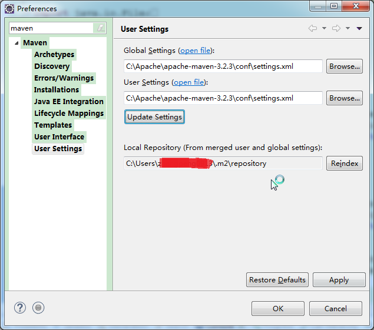

[maven全局配置文件settings.xml详解](https://www.cnblogs.com/jingmoxukong/p/6050172.html)

[Maven 教程之 pom.xml 详解](https://juejin.im/post/6844903824524574734)

[maven 官方文档之 settings](https://maven.apache.org/settings.html)

[maven 官方文档之 pom](https://maven.apache.org/pom.html)

# 概要

## settings.xml有什么用？

如果在Eclipse中使用过Maven插件，想必会有这个经验：配置settings.xml文件的路径。

**settings.xml文件是干什么的，为什么要配置它呢？**
从settings.xml的文件名就可以看出，它是用来设置maven参数的配置文件。并且，**settings.xml是maven的全局配置文件**。而pom.xml文件是所在项目的局部配置。
Settings.xml中包含类似本地仓储位置、修改远程仓储服务器、认证信息等配置。

## settings.xml文件位置

settings.xml文件一般存在于两个位置：
全局配置: ${M2_HOME}/conf/settings.xml
用户配置: user.home/.m2/settings.xmlnote：用户配置优先于全局配置。user.home/.m2/settings.xmlnote：用户配置优先于全局配置。{user.home} 和和所有其他系统属性只能在3.0+版本上使用。请注意windows和Linux使用变量的区别。

## 配置优先级

需要注意的是：**局部配置优先于全局配置**。
配置优先级从高到低：pom.xml> user settings > global settings
如果这些文件同时存在，在应用配置时，会合并它们的内容，如果有重复的配置，优先级高的配置会覆盖优先级低的。

# settings.xml元素详解

## 顶级元素概览

下面列举了`settings.xml`中的顶级元素

```xml
<settings xmlns="http://maven.apache.org/SETTINGS/1.0.0"
      xmlns:xsi="http://www.w3.org/2001/XMLSchema-instance"
      xsi:schemaLocation="http://maven.apache.org/SETTINGS/1.0.0
                          https://maven.apache.org/xsd/settings-1.0.0.xsd">
  <localRepository/>
  <interactiveMode/>
  <usePluginRegistry/>
  <offline/>
  <pluginGroups/>
  <servers/>
  <mirrors/>
  <proxies/>
  <profiles/>
  <activeProfiles/>
</settings>
```

## LocalRepository

**作用**：该值表示构建系统本地仓库的路径。
其默认值：~/.m2/repository。

```xml
<localRepository>${user.home}/.m2/repository</localRepository>
```

## InteractiveMode

**作用**：表示maven是否需要和用户交互以获得输入。
如果maven需要和用户交互以获得输入，则设置成true，反之则应为false。默认为true。

```xml
<interactiveMode>true</interactiveMode>
```

## UsePluginRegistry

**作用**：maven是否需要使用plugin-registry.xml文件来管理插件版本。
如果需要让maven使用文件~/.m2/plugin-registry.xml来管理插件版本，则设为true。默认为false。

```xml
<usePluginRegistry>false</usePluginRegistry>
```

## Offline

**作用**：表示maven是否需要在离线模式下运行。
如果构建系统需要在离线模式下运行，则为true，默认为false。
当由于网络设置原因或者安全因素，构建服务器不能连接远程仓库的时候，该配置就十分有用。

```xml
<offline>false</offline>
```

## PluginGroups

**作用**：当插件的组织id（groupId）没有显式提供时，供搜寻插件组织Id（groupId）的列表。
该元素包含一个pluginGroup元素列表，每个子元素包含了一个组织Id（groupId）。
当我们使用某个插件，并且没有在命令行为其提供组织Id（groupId）的时候，Maven就会使用该列表。默认情况下该列表包含了`org.apache.maven.plugins`和`org.codehaus.mojo`。

```xml
<settings xmlns="http://maven.apache.org/SETTINGS/1.0.0" xmlns:xsi="http://www.w3.org/2001/XMLSchema-instance"
  xsi:schemaLocation="http://maven.apache.org/SETTINGS/1.0.0
                      https://maven.apache.org/xsd/settings-1.0.0.xsd">
  ...
  <pluginGroups>
    <!--plugin的组织Id（groupId） -->
    <pluginGroup>org.codehaus.mojo</pluginGroup>
  </pluginGroups>
  ...
</settings>
```

## Servers

**作用**：一般，仓库的下载和部署是在pom.xml文件中的`repositories`和`distributionManagement`元素中定义的。然而，一般类似用户名、密码（**有些仓库访问是需要安全认证的**）等信息不应该在pom.xml文件中配置，这些信息可以配置在`settings.xml`中。

```xml
<settings xmlns="http://maven.apache.org/SETTINGS/1.0.0" xmlns:xsi="http://www.w3.org/2001/XMLSchema-instance"
  xsi:schemaLocation="http://maven.apache.org/SETTINGS/1.0.0
                      https://maven.apache.org/xsd/settings-1.0.0.xsd">
  ...
  <!--配置服务端的一些设置。一些设置如安全证书不应该和pom.xml一起分发。这种类型的信息应该存在于构建服务器上的settings.xml文件中。 -->
  <servers>
    <!--服务器元素包含配置服务器时需要的信息 -->
    <server>
      <!--这是server的id（注意不是用户登陆的id），该id与distributionManagement中repository元素的id相匹配。 -->
      <id>server001</id>
      <!--鉴权用户名。鉴权用户名和鉴权密码表示服务器认证所需要的登录名和密码。 -->
      <username>my_login</username>
      <!--鉴权密码 。鉴权用户名和鉴权密码表示服务器认证所需要的登录名和密码。密码加密功能已被添加到2.1.0 +。详情请访问密码加密页面 -->
      <password>my_password</password>
      <!--鉴权时使用的私钥位置。和前两个元素类似，私钥位置和私钥密码指定了一个私钥的路径（默认是${user.home}/.ssh/id_dsa）以及如果需要的话，一个密语。将来passphrase和password元素可能会被提取到外部，但目前它们必须在settings.xml文件以纯文本的形式声明。 -->
      <privateKey>${usr.home}/.ssh/id_dsa</privateKey>
      <!--鉴权时使用的私钥密码。 -->
      <passphrase>some_passphrase</passphrase>
      <!--文件被创建时的权限。如果在部署的时候会创建一个仓库文件或者目录，这时候就可以使用权限（permission）。这两个元素合法的值是一个三位数字，其对应了unix文件系统的权限，如664，或者775。 -->
      <filePermissions>664</filePermissions>
      <!--目录被创建时的权限。 -->
      <directoryPermissions>775</directoryPermissions>
    </server>
  </servers>
  ...
</settings>
```

## Mirrors

**作用**：为仓库列表配置的下载镜像列表。

```xml
<settings xmlns="http://maven.apache.org/SETTINGS/1.0.0" xmlns:xsi="http://www.w3.org/2001/XMLSchema-instance"
  xsi:schemaLocation="http://maven.apache.org/SETTINGS/1.0.0
                      https://maven.apache.org/xsd/settings-1.0.0.xsd">
  ...
  <mirrors>
    <!-- 给定仓库的下载镜像。 -->
    <mirror>
      <!-- 该镜像的唯一标识符。id用来区分不同的mirror元素。 -->
      <id>planetmirror.com</id>
      <!-- 镜像名称 -->
      <name>PlanetMirror Australia</name>
      <!-- 该镜像的URL。构建系统会优先考虑使用该URL，而非使用默认的服务器URL。 -->
      <url>http://downloads.planetmirror.com/pub/maven2</url>
      <!-- 被镜像的服务器的id。例如，如果我们要设置了一个Maven中央仓库（http://repo.maven.apache.org/maven2/）的镜像，就需要将该元素设置成central。这必须和中央仓库的id central完全一致。 -->
      <mirrorOf>central</mirrorOf>
    </mirror>
  </mirrors>
  ...
</settings>
```

## Proxies

**作用**：用来配置不同的代理。

```xml
<settings xmlns="http://maven.apache.org/SETTINGS/1.0.0" xmlns:xsi="http://www.w3.org/2001/XMLSchema-instance"
  xsi:schemaLocation="http://maven.apache.org/SETTINGS/1.0.0
                      https://maven.apache.org/xsd/settings-1.0.0.xsd">
  ...
  <proxies>
    <!--代理元素包含配置代理时需要的信息 -->
    <proxy>
      <!--代理的唯一定义符，用来区分不同的代理元素。 -->
      <id>myproxy</id>
      <!--该代理是否是激活的那个。true则激活代理。当我们声明了一组代理，而某个时候只需要激活一个代理的时候，该元素就可以派上用处。 -->
      <active>true</active>
      <!--代理的协议。 协议://主机名:端口，分隔成离散的元素以方便配置。 -->
      <protocol>http</protocol>
      <!--代理的主机名。协议://主机名:端口，分隔成离散的元素以方便配置。 -->
      <host>proxy.somewhere.com</host>
      <!--代理的端口。协议://主机名:端口，分隔成离散的元素以方便配置。 -->
      <port>8080</port>
      <!--代理的用户名，用户名和密码表示代理服务器认证的登录名和密码。 -->
      <username>proxyuser</username>
      <!--代理的密码，用户名和密码表示代理服务器认证的登录名和密码。 -->
      <password>somepassword</password>
      <!--不该被代理的主机名列表。该列表的分隔符由代理服务器指定；例子中使用了竖线分隔符，使用逗号分隔也很常见。 -->
      <nonProxyHosts>*.google.com|ibiblio.org</nonProxyHosts>
    </proxy>
  </proxies>
  ...
</settings>
```

## Profiles

**作用**：根据环境参数来调整构建配置的列表。
`settings.xml`中的`profile`元素是`pom.xml`中`profile`元素的**裁剪版本**。
它包含了`id`、`activation`、`repositories`、`pluginRepositories`和 `properties`元素。这里的profile元素只包含这五个子元素是因为这里只关心构建系统这个整体（这正是settings.xml文件的角色定位），而非单独的项目对象模型设置。如果一个`settings.xml`中的`profile`被激活，它的值会覆盖任何其它定义在`pom.xml`中带有相同id的`profile`。

```xml
<settings xmlns="http://maven.apache.org/SETTINGS/1.0.0" xmlns:xsi="http://www.w3.org/2001/XMLSchema-instance"
  xsi:schemaLocation="http://maven.apache.org/SETTINGS/1.0.0
                      https://maven.apache.org/xsd/settings-1.0.0.xsd">
  ...
  <profiles>
    <profile>
      <!-- profile的唯一标识 -->
      <id>test</id>
      <!-- 自动触发profile的条件逻辑 -->
      <activation />
      <!-- 扩展属性列表 -->
      <properties />
      <!-- 远程仓库列表 -->
      <repositories />
      <!-- 插件仓库列表 -->
      <pluginRepositories />
    </profile>
  </profiles>
  ...
</settings>
```

### Activation

**作用**：自动触发`profile`的条件逻辑。
如`pom.xml`中的`profile`一样，`profile`的作用在于它能够在某些特定的环境中自动使用某些特定的值；这些环境通过`activation`元素指定。
`activation`元素并不是激活`profile`的唯一方式。`settings.xml`文件中的`activeProfile`元素可以包含`profile`的`id`。`profile`也可以通过在命令行，使用-P标记和逗号分隔的列表来显式的激活（如，-P test）。

```xml
<activation>
  <!--profile默认是否激活的标识 -->
  <activeByDefault>false</activeByDefault>
  <!--当匹配的jdk被检测到，profile被激活。例如，1.4激活JDK1.4，1.4.0_2，而!1.4激活所有版本不是以1.4开头的JDK。 -->
  <jdk>1.5</jdk>
  <!--当匹配的操作系统属性被检测到，profile被激活。os元素可以定义一些操作系统相关的属性。 -->
  <os>
    <!--激活profile的操作系统的名字 -->
    <name>Windows XP</name>
    <!--激活profile的操作系统所属家族(如 'windows') -->
    <family>Windows</family>
    <!--激活profile的操作系统体系结构 -->
    <arch>x86</arch>
    <!--激活profile的操作系统版本 -->
    <version>5.1.2600</version>
  </os>
  <!--如果Maven检测到某一个属性（其值可以在POM中通过${name}引用），其拥有对应的name = 值，Profile就会被激活。如果值字段是空的，那么存在属性名称字段就会激活profile，否则按区分大小写方式匹配属性值字段 -->
  <property>
    <!--激活profile的属性的名称 -->
    <name>mavenVersion</name>
    <!--激活profile的属性的值 -->
    <value>2.0.3</value>
  </property>
  <!--提供一个文件名，通过检测该文件的存在或不存在来激活profile。missing检查文件是否存在，如果不存在则激活profile。另一方面，exists则会检查文件是否存在，如果存在则激活profile。 -->
  <file>
    <!--如果指定的文件存在，则激活profile。 -->
    <exists>${basedir}/file2.properties</exists>
    <!--如果指定的文件不存在，则激活profile。 -->
    <missing>${basedir}/file1.properties</missing>
  </file>
</activation>
```

***注：在maven工程的pom.xml所在目录下执行mvn help:active-profiles命令可以查看中央仓储的profile是否在工程中生效。***

### properties

**作用**：对应`profile`的扩展属性列表。
maven属性和ant中的属性一样，可以用来存放一些值。这些值可以在`pom.xml`中的任何地方使用标记`${X}`来使用，这里X是指属性的名称。属性有五种不同的形式，并且都能在settings.xml文件中访问。

```xml
<!-- 
  1. env.X: 在一个变量前加上"env."的前缀，会返回一个shell环境变量。例如,"env.PATH"指代了$path环境变量（在Windows上是%PATH%）。 
  2. project.x：指代了POM中对应的元素值。例如: <project><version>1.0</version></project>通过${project.version}获得version的值。 
  3. settings.x: 指代了settings.xml中对应元素的值。例如：<settings><offline>false</offline></settings>通过 ${settings.offline}获得offline的值。 
  4. Java System Properties: 所有可通过java.lang.System.getProperties()访问的属性都能在POM中使用该形式访问，例如 ${java.home}。 
  5. x: 在<properties/>元素中，或者外部文件中设置，以${someVar}的形式使用。
 -->
<properties>
  <user.install>${user.home}/our-project</user.install>
</properties>
```

***注：如果该profile被激活，则可以在pom.xml中使用${user.install}。***

### Repositories

**作用**：远程仓库列表，它是maven用来填充构建系统本地仓库所使用的一组远程仓库。

```xml
<repositories>
  <!--包含需要连接到远程仓库的信息 -->
  <repository>
    <!--远程仓库唯一标识 -->
    <id>codehausSnapshots</id>
    <!--远程仓库名称 -->
    <name>Codehaus Snapshots</name>
    <!--如何处理远程仓库里发布版本的下载 -->
    <releases>
      <!--true或者false表示该仓库是否为下载某种类型构件（发布版，快照版）开启。 -->
      <enabled>false</enabled>
      <!--该元素指定更新发生的频率。Maven会比较本地POM和远程POM的时间戳。这里的选项是：always（一直），daily（默认，每日），interval：X（这里X是以分钟为单位的时间间隔），或者never（从不）。 -->
      <updatePolicy>always</updatePolicy>
      <!--当Maven验证构件校验文件失败时该怎么做-ignore（忽略），fail（失败），或者warn（警告）。 -->
      <checksumPolicy>warn</checksumPolicy>
    </releases>
    <!--如何处理远程仓库里快照版本的下载。有了releases和snapshots这两组配置，POM就可以在每个单独的仓库中，为每种类型的构件采取不同的策略。例如，可能有人会决定只为开发目的开启对快照版本下载的支持。参见repositories/repository/releases元素 -->
    <snapshots>
      <enabled />
      <updatePolicy />
      <checksumPolicy />
    </snapshots>
    <!--远程仓库URL，按protocol://hostname/path形式 -->
    <url>http://snapshots.maven.codehaus.org/maven2</url>
    <!--用于定位和排序构件的仓库布局类型-可以是default（默认）或者legacy（遗留）。Maven 2为其仓库提供了一个默认的布局；然而，Maven 1.x有一种不同的布局。我们可以使用该元素指定布局是default（默认）还是legacy（遗留）。 -->
    <layout>default</layout>
  </repository>
</repositories>
```

### pluginRepositories

**作用**：发现插件的远程仓库列表。
和`repository`类似，只是`repository`是管理jar包依赖的仓库，`pluginRepositories`则是管理插件的仓库。
maven插件是一种特殊类型的构件。由于这个原因，插件仓库独立于其它仓库。`pluginRepositories`元素的结构和`repositories`元素的结构类似。每个`pluginRepository`元素指定一个Maven可以用来寻找新插件的远程地址。

```xml
<pluginRepositories>
  <!-- 包含需要连接到远程插件仓库的信息.参见profiles/profile/repositories/repository元素的说明 -->
  <pluginRepository>
    <releases>
      <enabled />
      <updatePolicy />
      <checksumPolicy />
    </releases>
    <snapshots>
      <enabled />
      <updatePolicy />
      <checksumPolicy />
    </snapshots>
    <id />
    <name />
    <url />
    <layout />
  </pluginRepository>
</pluginRepositories>
```

## ActiveProfiles

**作用**：手动激活profiles的列表，按照`profile`被应用的顺序定义`activeProfile`。
该元素包含了一组`activeProfile`元素，每个`activeProfile`都含有一个profile id。任何在`activeProfile`中定义的profile id，不论环境设置如何，其对应的 `profile`都会被激活。如果没有匹配的`profile`，则什么都不会发生。
例如，env-test是一个activeProfile，则在pom.xml（或者profile.xml）中对应id的profile会被激活。如果运行过程中找不到这样一个profile，Maven则会像往常一样运行。

```xml
<settings xmlns="http://maven.apache.org/SETTINGS/1.0.0" xmlns:xsi="http://www.w3.org/2001/XMLSchema-instance"
  xsi:schemaLocation="http://maven.apache.org/SETTINGS/1.0.0
                      https://maven.apache.org/xsd/settings-1.0.0.xsd">
  ...
  <activeProfiles>
    <!-- 要激活的profile id -->
    <activeProfile>env-test</activeProfile>
  </activeProfiles>
  ...
</settings>
```

至此，maven settings.xml中的标签都讲解完毕，希望对大家有所帮助。


# pom.xml

**POM 是 Project Object Model 的缩写，即项目对象模型。**

pom.xml 就是 maven 的配置文件，用以描述项目的各种信息。

```xml
<project xmlns="http://maven.apache.org/POM/4.0.0"
  xmlns:xsi="http://www.w3.org/2001/XMLSchema-instance"
  xsi:schemaLocation="http://maven.apache.org/POM/4.0.0
                      http://maven.apache.org/xsd/maven-4.0.0.xsd">
  <modelVersion>4.0.0</modelVersion>

  <!-- The Basics -->
  <groupId>...</groupId>
  <artifactId>...</artifactId>
  <version>...</version>
  <packaging>...</packaging>
  <dependencies>...</dependencies>
  <parent>...</parent>
  <dependencyManagement>...</dependencyManagement>
  <modules>...</modules>
  <properties>...</properties>

  <!-- Build Settings -->
  <build>...</build>
  <reporting>...</reporting>

  <!-- More Project Information -->
  <name>...</name>
  <description>...</description>
  <url>...</url>
  <inceptionYear>...</inceptionYear>
  <licenses>...</licenses>
  <organization>...</organization>
  <developers>...</developers>
  <contributors>...</contributors>

  <!-- Environment Settings -->
  <issueManagement>...</issueManagement>
  <ciManagement>...</ciManagement>
  <mailingLists>...</mailingLists>
  <scm>...</scm>
  <prerequisites>...</prerequisites>
  <repositories>...</repositories>
  <pluginRepositories>...</pluginRepositories>
  <distributionManagement>...</distributionManagement>
  <profiles>...</profiles>
</project>
```

## 基本配置

- **project** - `project` 是 pom.xml 中描述符的根。
- **modelVersion** - `modelVersion` 指定 pom.xml 符合哪个版本的描述符。maven 2 和 3 只能为 4.0.0。

一般 jar 包被识别为： `groupId:artifactId:version` 的形式。

```xml
<project xmlns="http://maven.apache.org/POM/4.0.0"
  xmlns:xsi="http://www.w3.org/2001/XMLSchema-instance"
  xsi:schemaLocation="http://maven.apache.org/POM/4.0.0
                      http://maven.apache.org/xsd/maven-4.0.0.xsd">
  <modelVersion>4.0.0</modelVersion>

  <groupId>org.codehaus.mojo</groupId>
  <artifactId>my-project</artifactId>
  <version>1.0</version>
  <packaging>war</packaging>
</project>
```

### maven 坐标

**在 maven 中，根据 groupId、artifactId、version 组合成 groupId:artifactId:version 来唯一识别一个 jar 包。**

- **groupId** - 团体、组织的标识符。团体标识的约定是，它以创建这个项目的组织名称的逆向域名(reverse domain name)开头。一般对应着 java 的包结构。

- **artifactId** - 单独项目的唯一标识符。比如我们的 tomcat、commons 等。不要在 artifactId 中包含点号(.)。

- **version** - 一个项目的特定版本。 

  - maven 有自己的版本规范，一般是如下定义 major version、minor version、incremental version-qualifier ，比如 1.2.3-beta-01。要说明的是，maven 自己判断版本的算法是 major、minor、incremental 部分用数字比较，qualifier 部分用字符串比较，所以要小心 alpha-2 和 alpha-15 的比较关系，最好用 alpha-02 的格式。

  - maven 在版本管理时候可以使用几个特殊的字符串 SNAPSHOT、LATEST、RELEASE。比如 

    ```
    1.0-SNAPSHOT
    ```

    。各个部分的含义和处理逻辑如下说明： 

    - **SNAPSHOT** - 这个版本一般用于开发过程中，表示不稳定的版本。
    - **LATEST** - 指某个特定构件的最新发布，这个发布可能是一个发布版，也可能是一个 snapshot 版，具体看哪个时间最后。
    - **RELEASE** ：指最后一个发布版。

- **packaging** - 项目的类型，描述了项目打包后的输出，默认是 jar。常见的输出类型为：pom, jar, maven-plugin, ejb, war, ear, rar, par。

## 依赖配置

### dependencies

```xml
<project xmlns="http://maven.apache.org/POM/4.0.0"
  xmlns:xsi="http://www.w3.org/2001/XMLSchema-instance"
  xsi:schemaLocation="http://maven.apache.org/POM/4.0.0
                      https://maven.apache.org/xsd/maven-4.0.0.xsd">
  ...
  <dependencies>
    <dependency>
     <groupId>org.apache.maven</groupId>
      <artifactId>maven-embedder</artifactId>
      <version>2.0</version>
      <type>jar</type>
      <scope>test</scope>
      <optional>true</optional>
      <exclusions>
        <exclusion>
          <groupId>org.apache.maven</groupId>
          <artifactId>maven-core</artifactId>
        </exclusion>
      </exclusions>
    </dependency>
    ...
  </dependencies>
  ...
</project>
```

- **groupId**, **artifactId**, **version** - 和基本配置中的 `groupId`、`artifactId`、`version` 意义相同。

- **type** - 对应 `packaging` 的类型，如果不使用 `type` 标签，maven 默认为 jar。

- **scope** \- 此元素指的是任务的类路径（编译和运行时，测试等）以及如何限制依赖关系的传递性。有 5 种可用的限定范围： 
  - **compile** - 如果没有指定 `scope` 标签，maven 默认为这个范围。编译依赖关系在所有 classpath 中都可用。此外，这些依赖关系被传播到依赖项目。
  - **provided** - 与 compile 类似，但是表示您希望 jdk 或容器在运行时提供它。它只适用于编译和测试 classpath，不可传递。
  - **runtime** - 此范围表示编译不需要依赖关系，而是用于执行。它是在运行时和测试 classpath，但不是编译 classpath。
  - **test** - 此范围表示正常使用应用程序不需要依赖关系，仅适用于测试编译和执行阶段。它不是传递的。
  - **system** - 此范围与 provided 类似，除了您必须提供明确包含它的 jar。该 artifact 始终可用，并且不是在仓库中查找。

- **systemPath** - 仅当依赖范围是系统时才使用。否则，如果设置此元素，构建将失败。该路径必须是绝对路径，因此建议使用 `propertie` 来指定特定的路径，如$ {java.home} / lib。由于假定先前安装了系统范围依赖关系，maven 将不会检查项目的仓库，而是检查库文件是否存在。如果没有，maven 将会失败，并建议您手动下载安装。

- **optional** - `optional` 让其他项目知道，当您使用此项目时，您不需要这种依赖性才能正常工作。

- **exclusions** - 包含一个或多个排除元素，每个排除元素都包含一个表示要排除的依赖关系的 `groupId` 和 `artifactId`。与可选项不同，可能或可能不会安装和使用，排除主动从依赖关系树中删除自己。

### parent

maven 支持继承功能。子 POM 可以使用 `parent` 指定父 POM ，然后继承其配置。

```
<project xmlns="http://maven.apache.org/POM/4.0.0"
  xmlns:xsi="http://www.w3.org/2001/XMLSchema-instance"
  xsi:schemaLocation="http://maven.apache.org/POM/4.0.0
                      https://maven.apache.org/xsd/maven-4.0.0.xsd">
  <modelVersion>4.0.0</modelVersion>

  <parent>
    <groupId>org.codehaus.mojo</groupId>
    <artifactId>my-parent</artifactId>
    <version>2.0</version>
    <relativePath>../my-parent</relativePath>
  </parent>

  <artifactId>my-project</artifactId>
</project>
```

- **relativePath** - 注意 `relativePath` 元素。在搜索本地和远程存储库之前，它不是必需的，但可以用作 maven 的指示符，以首先搜索给定该项目父级的路径。

### dependencyManagement

`dependencyManagement` 是表示依赖 jar 包的声明。即你在项目中的 `dependencyManagement` 下声明了依赖，maven 不会加载该依赖，`dependencyManagement` 声明可以被子 POM 继承。

`dependencyManagement` 的一个使用案例是当有父子项目的时候，父项目中可以利用 `dependencyManagement` 声明子项目中需要用到的依赖 jar 包，之后，当某个或者某几个子项目需要加载该依赖的时候，就可以在子项目中 `dependencies` 节点只配置 `groupId` 和 `artifactId` 就可以完成依赖的引用。

`dependencyManagement` 主要是为了统一管理依赖包的版本，确保所有子项目使用的版本一致，类似的还有`plugins`和`pluginManagement`。

### modules

子模块列表。

```xml
<project xmlns="http://maven.apache.org/POM/4.0.0"
  xmlns:xsi="http://www.w3.org/2001/XMLSchema-instance"
  xsi:schemaLocation="http://maven.apache.org/POM/4.0.0
                      https://maven.apache.org/xsd/maven-4.0.0.xsd">
  <modelVersion>4.0.0</modelVersion>

  <groupId>org.codehaus.mojo</groupId>
  <artifactId>my-parent</artifactId>
  <version>2.0</version>
  <packaging>pom</packaging>

  <modules>
    <module>my-project</module>
    <module>another-project</module>
    <module>third-project/pom-example.xml</module>
  </modules>
</project>
```

### properties

属性列表。定义的属性可以在 pom.xml 文件中任意处使用。使用方式为 `${propertie}` 。

```xml
<project>
  ...
  <properties>
    <maven.compiler.source>1.7<maven.compiler.source>
    <maven.compiler.target>1.7<maven.compiler.target>
    <project.build.sourceEncoding>UTF-8</project.build.sourceEncoding>
    <project.reporting.outputEncoding>UTF-8</project.reporting.outputEncoding>
  </properties>
  ...
</project>
```

## 构建配置

### build

build 可以分为 "project build" 和 "profile build"。

```xml
<project xmlns="http://maven.apache.org/POM/4.0.0"
  xmlns:xsi="http://www.w3.org/2001/XMLSchema-instance"
  xsi:schemaLocation="http://maven.apache.org/POM/4.0.0
                      https://maven.apache.org/xsd/maven-4.0.0.xsd">
  ...
  <!-- "Project Build" contains more elements than just the BaseBuild set -->
  <build>...</build>

  <profiles>
    <profile>
      <!-- "Profile Build" contains a subset of "Project Build"s elements -->
      <build>...</build>
    </profile>
  </profiles>
</project>
```

基本构建配置：

```xml
<build>
  <defaultGoal>install</defaultGoal>
  <directory>${basedir}/target</directory>
  <finalName>${artifactId}-${version}</finalName>
  <filters>
    <filter>filters/filter1.properties</filter>
  </filters>
  ...
</build>
```

**defaultGoal** : 默认执行目标或阶段。如果给出了一个目标，它应该被定义为它在命令行中（如 jar：jar）。如果定义了一个阶段（如安装），也是如此。

**directory** ：构建时的输出路径。默认为：`${basedir}/target` 。

**finalName** ：这是项目的最终构建名称（不包括文件扩展名，例如：my-project-1.0.jar）

**filter** ：定义 `* .properties` 文件，其中包含适用于接受其设置的资源的属性列表（如下所述）。换句话说，过滤器文件中定义的“name = value”对在代码中替换$ {name}字符串。

#### resources

资源的配置。资源文件通常不是代码，不需要编译，而是在项目需要捆绑使用的内容。

```xml
<project xmlns="http://maven.apache.org/POM/4.0.0"
  xmlns:xsi="http://www.w3.org/2001/XMLSchema-instance"
  xsi:schemaLocation="http://maven.apache.org/POM/4.0.0
                      https://maven.apache.org/xsd/maven-4.0.0.xsd">
  <build>
    ...
    <resources>
      <resource>
        <targetPath>META-INF/plexus</targetPath>
        <filtering>false</filtering>
        <directory>${basedir}/src/main/plexus</directory>
        <includes>
          <include>configuration.xml</include>
        </includes>
        <excludes>
          <exclude>**/*.properties</exclude>
        </excludes>
      </resource>
    </resources>
    <testResources>
      ...
    </testResources>
    ...
  </build>
</project>
```

- **resources**: 资源元素的列表，每个资源元素描述与此项目关联的文件和何处包含文件。
- **targetPath**: 指定从构建中放置资源集的目录结构。目标路径默认为基本目录。将要包装在 jar 中的资源的通常指定的目标路径是 META-INF。
- **filtering**: 值为 true 或 false。表示是否要为此资源启用过滤。请注意，该过滤器 `* .properties` 文件不必定义为进行过滤 - 资源还可以使用默认情况下在 POM 中定义的属性（例如$ {project.version}），并将其传递到命令行中“-D”标志（例如，“-Dname = value”）或由 properties 元素显式定义。过滤文件覆盖上面。
- **directory**: 值定义了资源的路径。构建的默认目录是`${basedir}/src/main/resources`。
- **includes**: 一组文件匹配模式，指定目录中要包括的文件，使用*作为通配符。
- **excludes**: 与 `includes` 类似，指定目录中要排除的文件，使用*作为通配符。注意：如果 `include` 和 `exclude` 发生冲突，maven 会以 `exclude` 作为有效项。
- **testResources**: `testResources` 与 `resources` 功能类似，区别仅在于：`testResources` 指定的资源仅用于 test 阶段，并且其默认资源目录为：`${basedir}/src/test/resources` 。

#### plugins

```xml
<project xmlns="http://maven.apache.org/POM/4.0.0"
  xmlns:xsi="http://www.w3.org/2001/XMLSchema-instance"
  xsi:schemaLocation="http://maven.apache.org/POM/4.0.0
                      https://maven.apache.org/xsd/maven-4.0.0.xsd">
  <build>
    ...
    <plugins>
      <plugin>
        <groupId>org.apache.maven.plugins</groupId>
        <artifactId>maven-jar-plugin</artifactId>
        <version>2.6</version>
        <extensions>false</extensions>
        <inherited>true</inherited>
        <configuration>
          <classifier>test</classifier>
        </configuration>
        <dependencies>...</dependencies>
        <executions>...</executions>
      </plugin>
    </plugins>
  </build>
</project>
```

- **groupId**, **artifactId**, **version** ：和基本配置中的 `groupId`、`artifactId`、`version` 意义相同。
- **extensions** ：值为 true 或 false。是否加载此插件的扩展名。默认为 false。
- **inherited** ：值为 true 或 false。这个插件配置是否应该适用于继承自这个插件的 POM。默认值为 true。
- **configuration** - 这是针对个人插件的配置，这里不扩散讲解。
- **dependencies** ：这里的 `dependencies` 是插件本身所需要的依赖。
- **executions** ：需要记住的是，插件可能有多个目标。每个目标可能有一个单独的配置，甚至可能将插件的目标完全绑定到不同的阶段。执行配置插件的目标的执行。
  - **id**: 执行目标的标识。
  - **goals**: 像所有多元化的 POM 元素一样，它包含单个元素的列表。在这种情况下，这个执行块指定的插件目标列表。
  - **phase**: 这是执行目标列表的阶段。这是一个非常强大的选项，允许将任何目标绑定到构建生命周期中的任何阶段，从而改变 maven 的默认行为。
  - **inherited**: 像上面的继承元素一样，设置这个 false 会阻止 maven 将这个执行传递给它的子代。此元素仅对父 POM 有意义。
  - **configuration**: 与上述相同，但将配置限制在此特定目标列表中，而不是插件下的所有目标。

```xml
<project xmlns="http://maven.apache.org/POM/4.0.0"
  xmlns:xsi="http://www.w3.org/2001/XMLSchema-instance"
  xsi:schemaLocation="http://maven.apache.org/POM/4.0.0
                      https://maven.apache.org/xsd/maven-4.0.0.xsd">
  ...
  <build>
    <plugins>
      <plugin>
        <artifactId>maven-antrun-plugin</artifactId>
        <version>1.1</version>
        <executions>
          <execution>
            <id>echodir</id>
            <goals>
              <goal>run</goal>
            </goals>
            <phase>verify</phase>
            <inherited>false</inherited>
            <configuration>
              <tasks>
                <echo>Build Dir: ${project.build.directory}</echo>
              </tasks>
            </configuration>
          </execution>
        </executions>

      </plugin>
    </plugins>
  </build>
</project>
```

#### pluginManagement

与 `dependencyManagement` 很相似，在当前 POM 中仅声明插件，而不是实际引入插件。子 POM 中只配置 `groupId` 和 `artifactId` 就可以完成插件的引用，且子 POM 有权重写 pluginManagement 定义。

它的目的在于统一所有子 POM 的插件版本。

#### directories

```xml
<project xmlns="http://maven.apache.org/POM/4.0.0"
  xmlns:xsi="http://www.w3.org/2001/XMLSchema-instance"
  xsi:schemaLocation="http://maven.apache.org/POM/4.0.0
                      https://maven.apache.org/xsd/maven-4.0.0.xsd">
  ...
  <build>
    <sourceDirectory>${basedir}/src/main/java</sourceDirectory>
    <scriptSourceDirectory>${basedir}/src/main/scripts</scriptSourceDirectory>
    <testSourceDirectory>${basedir}/src/test/java</testSourceDirectory>
    <outputDirectory>${basedir}/target/classes</outputDirectory>
    <testOutputDirectory>${basedir}/target/test-classes</testOutputDirectory>
    ...
  </build>
</project>
```

目录元素集合存在于 `build` 元素中，它为整个 POM 设置了各种目录结构。由于它们在配置文件构建中不存在，所以这些不能由配置文件更改。

如果上述目录元素的值设置为绝对路径（扩展属性时），则使用该目录。否则，它是相对于基础构建目录：`${basedir}`。

#### extensions

扩展是在此构建中使用的 artifacts 的列表。它们将被包含在运行构建的 classpath 中。它们可以启用对构建过程的扩展（例如为 Wagon 传输机制添加一个 ftp 提供程序），并使活动的插件能够对构建生命周期进行更改。简而言之，扩展是在构建期间激活的 artifacts。扩展不需要实际执行任何操作，也不包含 Mojo。因此，扩展对于指定普通插件接口的多个实现中的一个是非常好的。

```xml
<project xmlns="http://maven.apache.org/POM/4.0.0"
  xmlns:xsi="http://www.w3.org/2001/XMLSchema-instance"
  xsi:schemaLocation="http://maven.apache.org/POM/4.0.0
                      https://maven.apache.org/xsd/maven-4.0.0.xsd">
  ...
  <build>
    ...
    <extensions>
      <extension>
        <groupId>org.apache.maven.wagon</groupId>
        <artifactId>wagon-ftp</artifactId>
        <version>1.0-alpha-3</version>
      </extension>
    </extensions>
    ...
  </build>
</project>
```

### reporting

报告包含特定针对 `site` 生成阶段的元素。某些 maven 插件可以生成 `reporting` 元素下配置的报告，例如：生成 javadoc 报告。`reporting` 与 `build` 元素配置插件的能力相似。明显的区别在于：在执行块中插件目标的控制不是细粒度的，报表通过配置 `reportSet` 元素来精细控制。而微妙的区别在于 `reporting` 元素下的 `configuration` 元素可以用作 `build` 下的 `configuration` ，尽管相反的情况并非如此（ `build` 下的 `configuration` 不影响 `reporting` 元素下的 `configuration` ）。

另一个区别就是 `plugin` 下的 `outputDirectory` 元素。在报告的情况下，默认输出目录为 `${basedir}/target/site`。

```xml
<project xmlns="http://maven.apache.org/POM/4.0.0"
  xmlns:xsi="http://www.w3.org/2001/XMLSchema-instance"
  xsi:schemaLocation="http://maven.apache.org/POM/4.0.0
                      https://maven.apache.org/xsd/maven-4.0.0.xsd">
  ...
  <reporting>
    <plugins>
      <plugin>
        ...
        <reportSets>
          <reportSet>
            <id>sunlink</id>
            <reports>
              <report>javadoc</report>
            </reports>
            <inherited>true</inherited>
            <configuration>
              <links>
                <link>http://java.sun.com/j2se/1.5.0/docs/api/</link>
              </links>
            </configuration>
          </reportSet>
        </reportSets>
      </plugin>
    </plugins>
  </reporting>
  ...
</project>
```

## 项目信息

项目信息相关的这部分标签**都不是必要的**，也就是说完全可以不填写。

它的作用仅限于描述项目的详细信息。

下面的示例是项目信息相关标签的清单：

```xml
<project xmlns="http://maven.apache.org/POM/4.0.0"
  xmlns:xsi="http://www.w3.org/2001/XMLSchema-instance"
  xsi:schemaLocation="http://maven.apache.org/POM/4.0.0
                      https://maven.apache.org/xsd/maven-4.0.0.xsd">
  ...

  <!-- 项目信息 begin -->

  <!--项目名-->
  <name>maven-notes</name>

  <!--项目描述-->
  <description>maven 学习笔记</description>

  <!--项目url-->
  <url>https://github.com/dunwu/maven-notes</url>

  <!--项目开发年份-->
  <inceptionYear>2017</inceptionYear>

  <!--开源协议-->
  <licenses>
    <license>
      <name>Apache License, Version 2.0</name>
      <url>https://www.apache.org/licenses/LICENSE-2.0.txt</url>
      <distribution>repo</distribution>
      <comments>A business-friendly OSS license</comments>
    </license>
  </licenses>

  <!--组织信息(如公司、开源组织等)-->
  <organization>
    <name>...</name>
    <url>...</url>
  </organization>

  <!--开发者列表-->
  <developers>
    <developer>
      <id>victor</id>
      <name>Zhang Peng</name>
      <email>forbreak at 163.com</email>
      <url>https://github.com/dunwu</url>
      <organization>...</organization>
      <organizationUrl>...</organizationUrl>
      <roles>
        <role>architect</role>
        <role>developer</role>
      </roles>
      <timezone>+8</timezone>
      <properties>...</properties>
    </developer>
  </developers>

  <!--代码贡献者列表-->
   <contributors>
    <contributor>
      <!--标签内容和<developer>相同-->
    </contributor>
  </contributors>

  <!-- 项目信息 end -->

  ...
</project>
```

这部分标签都非常简单，基本都能做到顾名思义，且都属于可有可无的标签，所以这里仅简单介绍一下：

- **name** - 项目完整名称
- **description** - 项目描述
- **url** - 一般为项目仓库的 host
- **inceptionYear** - 开发年份
- **licenses** - 开源协议
- **organization** - 项目所属组织信息
- **developers** - 项目开发者列表
- **contributors** - 项目贡献者列表，`<contributor>` 的子标签和 `<developer>` 的完全相同。

## 环境配置

### issueManagement

这定义了所使用的缺陷跟踪系统（Bugzilla，TestTrack，ClearQuest 等）。虽然没有什么可以阻止插件使用这些信息的东西，但它主要用于生成项目文档。

```xml
<project xmlns="http://maven.apache.org/POM/4.0.0"
  xmlns:xsi="http://www.w3.org/2001/XMLSchema-instance"
  xsi:schemaLocation="http://maven.apache.org/POM/4.0.0
                      https://maven.apache.org/xsd/maven-4.0.0.xsd">
  ...
  <issueManagement>
    <system>Bugzilla</system>
    <url>http://127.0.0.1/bugzilla/</url>
  </issueManagement>
  ...
</project>
```

### ciManagement

CI 构建系统配置，主要是指定通知机制以及被通知的邮箱。

```xml
<project xmlns="http://maven.apache.org/POM/4.0.0"
  xmlns:xsi="http://www.w3.org/2001/XMLSchema-instance"
  xsi:schemaLocation="http://maven.apache.org/POM/4.0.0
                      https://maven.apache.org/xsd/maven-4.0.0.xsd">
  ...
  <ciManagement>
    <system>continuum</system>
    <url>http://127.0.0.1:8080/continuum</url>
    <notifiers>
      <notifier>
        <type>mail</type>
        <sendOnError>true</sendOnError>
        <sendOnFailure>true</sendOnFailure>
        <sendOnSuccess>false</sendOnSuccess>
        <sendOnWarning>false</sendOnWarning>
        <configuration><address>continuum@127.0.0.1</address></configuration>
      </notifier>
    </notifiers>
  </ciManagement>
  ...
</project>
```

### mailingLists

邮件列表

```xml
<project xmlns="http://maven.apache.org/POM/4.0.0"
  xmlns:xsi="http://www.w3.org/2001/XMLSchema-instance"
  xsi:schemaLocation="http://maven.apache.org/POM/4.0.0
                      https://maven.apache.org/xsd/maven-4.0.0.xsd">
  ...
  <mailingLists>
    <mailingList>
      <name>User List</name>
      <subscribe>user-subscribe@127.0.0.1</subscribe>
      <unsubscribe>user-unsubscribe@127.0.0.1</unsubscribe>
      <post>user@127.0.0.1</post>
      <archive>http://127.0.0.1/user/</archive>
      <otherArchives>
        <otherArchive>http://base.google.com/base/1/127.0.0.1</otherArchive>
      </otherArchives>
    </mailingList>
  </mailingLists>
  ...
</project>
```

### scm

SCM（软件配置管理，也称为源代码/控制管理或简洁的版本控制）。常见的 scm 有 svn 和 git 。

```xml
<project xmlns="http://maven.apache.org/POM/4.0.0"
  xmlns:xsi="http://www.w3.org/2001/XMLSchema-instance"
  xsi:schemaLocation="http://maven.apache.org/POM/4.0.0
                      https://maven.apache.org/xsd/maven-4.0.0.xsd">
  ...
  <scm>
    <connection>scm:svn:http://127.0.0.1/svn/my-project</connection>
    <developerConnection>scm:svn:https://127.0.0.1/svn/my-project</developerConnection>
    <tag>HEAD</tag>
    <url>http://127.0.0.1/websvn/my-project</url>
  </scm>
  ...
</project>
```

### prerequisites

POM 执行的预设条件。

```xml
<project xmlns="http://maven.apache.org/POM/4.0.0"
  xmlns:xsi="http://www.w3.org/2001/XMLSchema-instance"
  xsi:schemaLocation="http://maven.apache.org/POM/4.0.0
                      https://maven.apache.org/xsd/maven-4.0.0.xsd">
  ...
  <prerequisites>
    <maven>2.0.6</maven>
  </prerequisites>
  ...
</project>
```

### repositories

`repositories` 是遵循 Maven 存储库目录布局的 artifacts 集合。默认的 Maven 中央存储库位于https://repo.maven.apache.org/maven2/上。

```xml
<project xmlns="http://maven.apache.org/POM/4.0.0"
  xmlns:xsi="http://www.w3.org/2001/XMLSchema-instance"
  xsi:schemaLocation="http://maven.apache.org/POM/4.0.0
                      https://maven.apache.org/xsd/maven-4.0.0.xsd">
  ...
  <repositories>
    <repository>
      <releases>
        <enabled>false</enabled>
        <updatePolicy>always</updatePolicy>
        <checksumPolicy>warn</checksumPolicy>
      </releases>
      <snapshots>
        <enabled>true</enabled>
        <updatePolicy>never</updatePolicy>
        <checksumPolicy>fail</checksumPolicy>
      </snapshots>
      <id>codehausSnapshots</id>
      <name>Codehaus Snapshots</name>
      <url>http://snapshots.maven.codehaus.org/maven2</url>
      <layout>default</layout>
    </repository>
  </repositories>
  <pluginRepositories>
    ...
  </pluginRepositories>
  ...
</project>
```

### pluginRepositories

与 `repositories` 差不多。

```xml
<project xmlns="http://maven.apache.org/POM/4.0.0"
  xmlns:xsi="http://www.w3.org/001/XMLSchema-instance"
  xsi:schemaLocation="http://maven.apache.org/POM/4.0.0
                      https://maven.apache.org/xsd/maven-4.0.0.xsd">
  ...
  <distributionManagement>
    ...
    <downloadUrl>http://mojo.codehaus.org/my-project</downloadUrl>
    <status>deployed</status>
  </distributionManagement>
  ...
</project>
```

### distributionManagement

它管理在整个构建过程中生成的 artifact 和支持文件的分布。从最后的元素开始：

```xml
<project xmlns="http://maven.apache.org/POM/4.0.0"
  xmlns:xsi="http://www.w3.org/001/XMLSchema-instance"
  xsi:schemaLocation="http://maven.apache.org/POM/4.0.0
                      https://maven.apache.org/xsd/maven-4.0.0.xsd">
  ...
  <distributionManagement>
    ...
    <downloadUrl>http://mojo.codehaus.org/my-project</downloadUrl>
    <status>deployed</status>
  </distributionManagement>
  ...
</project>
```

- **repository** - 与 `repositories` 相似
- **site** - 站点信息
- **relocation** - 项目迁移位置

### profiles

`activation` 是一个 `profile` 的关键。配置文件的功能来自于在某些情况下仅修改基本 POM 的功能。这些情况通过 `activation` 元素指定。

```xml
<project xmlns="http://maven.apache.org/POM/4.0.0"
  xmlns:xsi="http://www.w3.org/2001/XMLSchema-instance"
  xsi:schemaLocation="http://maven.apache.org/POM/4.0.0
                      https://maven.apache.org/xsd/maven-4.0.0.xsd">
  ...
  <profiles>
    <profile>
      <id>test</id>
      <activation>
        <activeByDefault>false</activeByDefault>
        <jdk>1.5</jdk>
        <os>
          <name>Windows XP</name>
          <family>Windows</family>
          <arch>x86</arch>
          <version>5.1.2600</version>
        </os>
        <property>
          <name>sparrow-type</name>
          <value>African</value>
        </property>
        <file>
          <exists>${basedir}/file2.properties</exists>
          <missing>${basedir}/file1.properties</missing>
        </file>
      </activation>
      ...
    </profile>
  </profiles>
</project>
```

