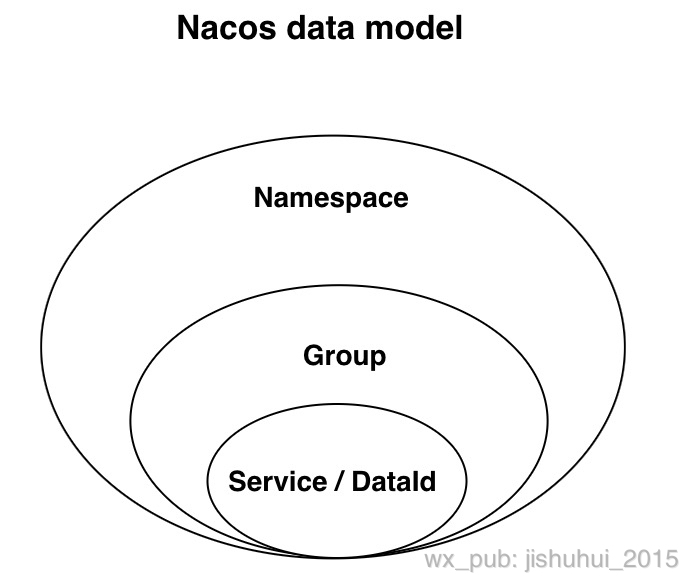

# nacos学习

[Nacos](https://github.com/alibaba/Nacos) 是阿里巴巴开源的一个更易于构建云原生应用的动态服务发现、配置管理和服务管理平台。

关于 Nacos Spring Cloud 的详细文档请参看：[Nacos Config](https://github.com/spring-cloud-incubator/spring-cloud-alibaba/wiki/Nacos-config) 和 [Nacos Discovery](https://github.com/spring-cloud-incubator/spring-cloud-alibaba/wiki/Nacos-discovery)。

- 通过 Nacos Server 和 spring-cloud-starter-alibaba-nacos-config 实现配置的动态变更。
- 通过 Nacos Server 和 spring-cloud-starter-alibaba-nacos-discovery 实现服务的注册与发现。

## 安装

1.直接下载：[Nacos Server 下载页](https://github.com/alibaba/nacos/releases)

2.启动 Server，进入解压后文件夹或编译打包好的文件夹，找到如下相对文件夹 nacos/bin，并对照操作系统实际情况之下如下命令。

1. Linux/Unix/Mac 操作系统，执行命令 `sh startup.sh -m standalone`
2. Windows 操作系统，执行命令 `cmd startup.cmd`

## 注册中心使用

### 1.引入依赖

```xml
 <dependency>
     <groupId>com.alibaba.cloud</groupId>
     <artifactId>spring-cloud-starter-alibaba-nacos-discovery</artifactId>
 </dependency>
```

### 2.配置nacos server地址

```yaml
spring:
  cloud:
    nacos:
      discovery:
        server-addr: 119.29.246.230:8848
```

### 3.开启服务注册与发现功能

```java
 @SpringBootApplication
 @EnableDiscoveryClient
 public class ProviderApplication {

 	public static void main(String[] args) {
 		SpringApplication.run(Application.class, args);
 	}
 }
```

### 4.服务发现

#### 4.1使用RestTemplate

```java
@Configuration
public class ServerConfig {

    /**
     * 在定义RestTemplate的时候，增加了@LoadBalanced注解，而在真正调用服务接口的时候，
     * 原来host部分是通过手工拼接ip和端口的，直接采用服务名的时候来写请求路径即可。
     * 在真正调用的时候，Spring Cloud会将请求拦截下来，然后通过负载均衡器选出节点，
     * 并替换服务名部分为具体的ip和端口，从而实现基于服务名的负载均衡调用。
     * @return
     */
    @Bean
    @LoadBalanced
    public RestTemplate restTemplate() {
        return new RestTemplate();
    }
    
}
```

```java
@Slf4j
@RestController
public class RestTemplateCotroller {

    @Autowired
    RestTemplate restTemplate;

    @GetMapping("restTemplate")
    public User restTemplate(){
        return restTemplate.getForObject("http://alibaba-nacos-discovery-server/hello?name=gaga&id=1",User.class);
    }

}
```

#### 4.2使用feign

```xml
<dependency>
    <groupId>org.springframework.cloud</groupId>
    <artifactId>spring-cloud-starter-openfeign</artifactId>
    <version>2.1.2.RELEASE</version>
</dependency>
```

```java
@EnableFeignClients
@EnableDiscoveryClient
@SpringBootApplication
public class AlibabaNacosDiscoveryClientCommonApplication {

    public static void main(String[] args) {
        SpringApplication.run(AlibabaNacosDiscoveryClientCommonApplication.class, args);
    }

}
```

```java
@FeignClient("alibaba-nacos-discovery-server")
public interface AlibabaNacosDiscoveryServerService {

    @GetMapping("/hello")
    User hello(@SpringQueryMap User user);

}
```

```java
@RestController
public class FeignController {

    @Autowired
    AlibabaNacosDiscoveryServerService alibabaNacosDiscoveryServerService;

    @GetMapping("feign")
    public User feign(){
        User user=new User();
        user.setId(123L);
        user.setName("hehe");
        return alibabaNacosDiscoveryServerService.hello(user);
    }

}
```

#### 4.3负载均衡ribbon

[Spring Cloud源码分析（二）Ribbon](http://blog.didispace.com/springcloud-sourcecode-ribbon/)

[Spring Cloud Alibaba之负载均衡组件 - Ribbon详解（三）](https://www.jianshu.com/p/eb4d4ce0b751)

| 规则名称                  | 特点                                                         |
| ------------------------- | ------------------------------------------------------------ |
| AvailabilityFilteringRule | 过滤掉一直连接失败的被标记为circuit tripped（电路跳闸）的后端Service，并过滤掉那些高并发的后端Server或者使用一个AvailabilityPredicate来包含过滤Server的逻辑，其实就是检查status的记录的各个Server的运行状态 |
| BestAvailableRule         | 选择一个最小的并发请求的Server，逐个考察Server，如果Server被tripped了，则跳过 |
| RandomRule                | 随机选择一个Server                                           |
| ResponseTimeWeightedRule  | 已废弃，作用同WeightedResponseTimeRule                       |
| RetryRule                 | 对选定的负责均衡策略机上充值机制，在一个配置时间段内当选择Server不成功，则一直尝试使用subRule的方式选择一个可用的Server |
| RoundRobinRule            | 轮询选择，轮询index，选择index对应位置Server                 |
| WeightedResponseTimeRule  | 根据相应时间加权，相应时间越长，权重越小，被选中的可能性越低 |
| ZoneAvoidanceRule         | `（默认是这个）`负责判断Server所Zone的性能和Server的可用性选择Server，在没有Zone的环境下，类似于轮询（RoundRobinRule） |

##### 细粒度配置

```java
@Configuration
@RibbonClient(name ="服务名", configuration = GoodsRibbonRuleConfig.class)
public class GoodsRibbonConfig {
}

@Configuration
public class GoodsRibbonRuleConfig {
    @Bean
    public IRule ribbonRulr() {
        return new RandomRule();
    }
}
```


```yaml
server-1: # 服务名称 Service-ID
  ribbon:
    #  配置文件配置负载均衡算法-我这里使用的是自定义的Ribbon的负载均衡算法，默认
    NFLoadBalancerRuleClassName: com.netflix.loadbalancer.RandomRule 
```


##### 全局配置

```java
@Configuration
@RibbonClients(defaultConfiguration = GoodsRibbonRuleConfig.class)
public class RibbonConfig {
}
```


#### 4.4使用nacos权重

因为ribbon没有支持nacos权重的负载均衡规则，所有可以自定义一个负载均衡规则，使用nacos的自己的查找实例的方式，而feign也是使用的ribbon。

[扩展Ribbon支持Nacos权重的三种方式](https://blog.csdn.net/lilizhou2008/article/details/94369069)

 [SpringCloud-Ribbon自定义负载均衡算法](https://blog.csdn.net/www1056481167/article/details/81151064)

```java
@Slf4j
public class NacosWeightRandomV2Rule extends AbstractLoadBalancerRule {
    @Autowired
    private NacosDiscoveryProperties discoveryProperties;

    @Override
    public Server choose(Object key) {
        DynamicServerListLoadBalancer loadBalancer = (DynamicServerListLoadBalancer) getLoadBalancer();
        String name = loadBalancer.getName();
        try {
            Instance instance = discoveryProperties.namingServiceInstance()
                    .selectOneHealthyInstance(name);

            log.info("选中的instance = {}", instance);

            /*
             * instance转server的逻辑参考自：
             * org.springframework.cloud.alibaba.nacos.ribbon.NacosServerList.instancesToServerList
             */
            return new NacosServer(instance);
        } catch (NacosException e) {
            log.error("发生异常", e);
            return null;
        }
    }

    @Override
    public void initWithNiwsConfig(IClientConfig iClientConfig) {
    }
}
```


```java
@Configuration
public class ServerConfig {

    @Bean
    @LoadBalanced
    public RestTemplate restTemplate() {
        return new RestTemplate();
    }

    @Bean
    public IRule myRule() {
        return new NacosWeightRandomV2Rule();
    }

}
```

## 配置中心使用



### 1.引入依赖

```xml
 <dependency>
     <groupId>com.alibaba.cloud</groupId>
     <artifactId>spring-cloud-starter-alibaba-nacos-config</artifactId>
 </dependency>
```

### 2.属性配置

bootstrap 配置文件中配置 Nacos Config 元数据

```yaml
spring:
  cloud:
    nacos:
      config:
        server-addr: 119.29.246.230:8848
        file-extension: yaml
        namespace: 423905ea-6688-434e-a178-952ae4517b71
```


## 源码分析


### 配置管理naming

[nacos源码分析(二)--------客户端获取配置中心的实现](https://juejin.im/post/5db79507f265da4d34299cc4)

#### example

```java
public class ConfigExample {

    public static void main(String[] args) throws NacosException, InterruptedException {
        String serverAddr = "localhost:8848";
        String namespace="8f8bc91f-c55d-400d-b4ad-b80e637c5d96";
        String dataId="test-lcm";
        String group="DEFAULT_GROUP";
        Properties properties = new Properties();
        properties.put("serverAddr", serverAddr);
        properties.put("namespace", namespace);
        //根据属性构造一个ConfigService
        ConfigService configService = NacosFactory.createConfigService(properties);
        //更加group和dataId获取一个配置
        String content = configService.getConfig(dataId, group, 5000);
        System.out.println(content);
        //增加一个listener
        configService.addListener(dataId, group, new Listener() {
            @Override
            public void receiveConfigInfo(String configInfo) {
                System.out.println("receive:" + configInfo);
            }

            @Override
            public Executor getExecutor() {
                return null;
            }
        });

        //推送一个配置
        boolean isPublishOk = configService.publishConfig(dataId, group, "content");
        System.out.println(isPublishOk);

        Thread.sleep(3000);
        //获取一个配置
        content = configService.getConfig(dataId, group, 5000);
        System.out.println(content);

        //删除一个配置
        boolean isRemoveOk = configService.removeConfig(dataId, group);
        System.out.println(isRemoveOk);
        Thread.sleep(3000);

        content = configService.getConfig(dataId, group, 5000);
        System.out.println(content);
        Thread.sleep(300000);

    }
}
```

```java
//ConfigFactory.java
public static ConfigService createConfigService(Properties properties) throws NacosException {
    try {
        Class<?> driverImplClass = Class.forName("com.alibaba.nacos.client.config.NacosConfigService");
        //使用一个Properties参数的构造方法，使用反射构造一个ConfigService
        Constructor constructor = driverImplClass.getConstructor(Properties.class);
        ConfigService vendorImpl = (ConfigService)constructor.newInstance(properties);
        return vendorImpl;
    } catch (Throwable var4) {
        throw new NacosException(-400, var4);
    }
}
```

```java
//NacosConfigService.java
public NacosConfigService(Properties properties) throws NacosException {
    String encodeTmp = properties.getProperty("encode");
    if (StringUtils.isBlank(encodeTmp)) {
        this.encode = "UTF-8";
    } else {
        this.encode = encodeTmp.trim();
    }

    this.initNamespace(properties);
    //一个http客户端工具，HttpURLConnection
    this.agent = new MetricsHttpAgent(new ServerHttpAgent(properties));
    //通过GetServerListTask后服务中心去拉取配置中心的地址列表
    this.agent.start();
    this.worker = new ClientWorker(this.agent, this.configFilterChainManager, properties);
}
```

#### 拉取配置中心地址

```java
public synchronized void start() throws NacosException {

    if (isStarted || isFixed) {
        return;
    }

    GetServerListTask getServersTask = new GetServerListTask(addressServerUrl);
    for (int i = 0; i < initServerlistRetryTimes && serverUrls.isEmpty(); ++i) {
        getServersTask.run();
        try {
            this.wait((i + 1) * 100L);
        } catch (Exception e) {
            LOGGER.warn("get serverlist fail,url: {}", addressServerUrl);
        }
    }

    if (serverUrls.isEmpty()) {
        LOGGER.error("[init-serverlist] fail to get NACOS-server serverlist! env: {}, url: {}", name,
            addressServerUrl);
        throw new NacosException(NacosException.SERVER_ERROR,
            "fail to get NACOS-server serverlist! env:" + name + ", not connnect url:" + addressServerUrl);
    }
    //定时任务每隔30s进行获取配置中心地址列表
    TimerService.scheduleWithFixedDelay(getServersTask, 0L, 30L, TimeUnit.SECONDS);
    isStarted = true;
}
```


#### 拉取配置

```java
//ClientWorker.java
public ClientWorker(final HttpAgent agent, final ConfigFilterChainManager configFilterChainManager, final Properties properties) {
    this.agent = agent;
    this.configFilterChainManager = configFilterChainManager;

    // Initialize the timeout parameter

    init(properties);

    //单线程定时任务
    executor = Executors.newScheduledThreadPool(1, new ThreadFactory() {
        @Override
        public Thread newThread(Runnable r) {
            Thread t = new Thread(r);
            t.setName("com.alibaba.nacos.client.Worker." + agent.getName());
            t.setDaemon(true);
            return t;
        }
    });

    //多线程长轮询，核心线程数为cpu逻辑处理器数量
    //去配置中心拉取配置
    executorService = Executors.newScheduledThreadPool(Runtime.getRuntime().availableProcessors(), new ThreadFactory() {
        @Override
        public Thread newThread(Runnable r) {
            Thread t = new Thread(r);
            t.setName("com.alibaba.nacos.client.Worker.longPolling." + agent.getName());
            t.setDaemon(true);
            return t;
        }
    });
    
    //固定延时重复执行任务，每10ms检查一次checkConfigInfo()
    //第一次为initialDelay后，第二次为第一次任务执行结束后再加上delay
    executor.scheduleWithFixedDelay(new Runnable() {
        @Override
        public void run() {
            try {
                checkConfigInfo();
            } catch (Throwable e) {
                LOGGER.error("[" + agent.getName() + "] [sub-check] rotate check error", e);
            }
        }
    }, 1L, 10L, TimeUnit.MILLISECONDS);
}

//任务分批，默认每个线程最多处理3000个listener，可配置
public void checkConfigInfo() {
    // 分任务
    int listenerSize = cacheMap.get().size();
    // 向上取整为批数
    int longingTaskCount = (int) Math.ceil(listenerSize / ParamUtil.getPerTaskConfigSize());
    if (longingTaskCount > currentLongingTaskCount) {
        for (int i = (int) currentLongingTaskCount; i < longingTaskCount; i++) {
            // 要判断任务是否在执行 这块需要好好想想。 任务列表现在是无序的。变化过程可能有问题
            executorService.execute(new LongPollingRunnable(i));
        }
        currentLongingTaskCount = longingTaskCount;
    }
}


```


```JAVA
class LongPollingRunnable implements Runnable {
    private int taskId;

    public LongPollingRunnable(int taskId) {
        this.taskId = taskId;
    }

    @Override
    public void run() {

        List<CacheData> cacheDatas = new ArrayList<CacheData>();
        List<String> inInitializingCacheList = new ArrayList<String>();
        try {
            // check failover config
            //本地检查主要是做一个故障容错，当服务端挂掉后，Nacos 客户端可以从本地的文件系统中获取相关的配置信息
            for (CacheData cacheData : cacheMap.get().values()) {
                if (cacheData.getTaskId() == taskId) {
                    cacheDatas.add(cacheData);
                    try {
                        //检查本地缓存信息是否变更
                        checkLocalConfig(cacheData);
                        //如果使用本地缓存，需要检查md5
                        if (cacheData.isUseLocalConfigInfo()) {
                            cacheData.checkListenerMd5();
                        }
                    } catch (Exception e) {
                        LOGGER.error("get local config info error", e);
                    }
                }
            }

            // check server config
            //从远程获取值变化了的DataID列表。返回的对象里只有dataId和group是有效的。 保证不返回NULL。
            List<String> changedGroupKeys = checkUpdateDataIds(cacheDatas, inInitializingCacheList);

            //遍历值变化了的DataID列表，从远端获取新值，修改CacheData
            for (String groupKey : changedGroupKeys) {
                String[] key = GroupKey.parseKey(groupKey);
                String dataId = key[0];
                String group = key[1];
                String tenant = null;
                if (key.length == 3) {
                    tenant = key[2];
                }
                try {
                    String content = getServerConfig(dataId, group, tenant, 3000L);
                    CacheData cache = cacheMap.get().get(GroupKey.getKeyTenant(dataId, group, tenant));
                    cache.setContent(content);
                    LOGGER.info("[{}] [data-received] dataId={}, group={}, tenant={}, md5={}, content={}",
                        agent.getName(), dataId, group, tenant, cache.getMd5(),
                        ContentUtils.truncateContent(content));
                } catch (NacosException ioe) {
                    String message = String.format(
                        "[%s] [get-update] get changed config exception. dataId=%s, group=%s, tenant=%s",
                        agent.getName(), dataId, group, tenant);
                    LOGGER.error(message, ioe);
                }
            }
            for (CacheData cacheData : cacheDatas) {
                if (!cacheData.isInitializing() || inInitializingCacheList
                    .contains(GroupKey.getKeyTenant(cacheData.dataId, cacheData.group, cacheData.tenant))) {
                    cacheData.checkListenerMd5();
                    cacheData.setInitializing(false);
                }
            }
            inInitializingCacheList.clear();

            //长轮询
            executorService.execute(this);

        } catch (Throwable e) {

            // If the rotation training task is abnormal, the next execution time of the task will be punished
            LOGGER.error("longPolling error : ", e);
            //如果轮询异常，下次请求会收到惩罚，默认2000ms，这个值也是可以配置的
            executorService.schedule(this, taskPenaltyTime, TimeUnit.MILLISECONDS);
        }
    }
}
```


#### 拉取的优势

客户端拉取服务端的数据与服务端推送数据给客户端相比，优势在哪呢，为什么 Nacos  不设计成主动推送数据，而是要客户端去拉取呢？如果用推的方式，服务端需要维持与客户端的长连接，这样的话需要耗费大量的资源，并且还需要考虑连接的有效性，例如需要通过心跳来维持两者之间的连接。而用拉的方式，客户端只需要通过一个无状态的  http 请求即可获取到服务端的数据。


### 服务发现config


#### example

```java
public class NamingExample {

    public static void main(String[] args) throws NacosException {

        Properties properties = new Properties();
        properties.setProperty("serverAddr", System.getProperty("serverAddr"));
        properties.setProperty("namespace", System.getProperty("namespace"));

        NamingService naming = NamingFactory.createNamingService(properties);

        naming.registerInstance("nacos.test.3", "11.11.11.11", 8888, "TEST1");

        naming.registerInstance("nacos.test.3", "2.2.2.2", 9999, "DEFAULT");

        System.out.println(naming.getAllInstances("nacos.test.3"));

        naming.deregisterInstance("nacos.test.3", "2.2.2.2", 9999, "DEFAULT");

        System.out.println(naming.getAllInstances("nacos.test.3"));

        naming.subscribe("nacos.test.3", new EventListener() {
            @Override
            public void onEvent(Event event) {
                System.out.println(((NamingEvent)event).getServiceName());
                System.out.println(((NamingEvent)event).getInstances());
            }
        });
    }
}
```


#### 构造service

```java
public static NamingService createNamingService(Properties properties) throws NacosException {
    try {
        Class<?> driverImplClass = Class.forName("com.alibaba.nacos.client.naming.NacosNamingService");
        Constructor constructor = driverImplClass.getConstructor(Properties.class);
        NamingService vendorImpl = (NamingService)constructor.newInstance(properties);
        return vendorImpl;
    } catch (Throwable e) {
        throw new NacosException(NacosException.CLIENT_INVALID_PARAM, e);
    }
}
```


```java
//NacosNamingService
private void init(Properties properties) {
    namespace = InitUtils.initNamespaceForNaming(properties);
    initServerAddr(properties);
    InitUtils.initWebRootContext();
    initCacheDir();
    initLogName(properties);

    eventDispatcher = new EventDispatcher();
    serverProxy = new NamingProxy(namespace, endpoint, serverList);
    serverProxy.setProperties(properties);
    beatReactor = new BeatReactor(serverProxy, initClientBeatThreadCount(properties));
    hostReactor = new HostReactor(eventDispatcher, serverProxy, cacheDir, isLoadCacheAtStart(properties), initPollingThreadCount(properties));
}
```


##### 发送心跳

```java
//BeatReactor.java
public BeatReactor(NamingProxy serverProxy, int threadCount) {
    this.serverProxy = serverProxy;

    executorService = new ScheduledThreadPoolExecutor(threadCount, new ThreadFactory() {
        @Override
        public Thread newThread(Runnable r) {
            Thread thread = new Thread(r);
            thread.setDaemon(true);
            thread.setName("com.alibaba.nacos.naming.beat.sender");
            return thread;
        }
    });
}

public void addBeatInfo(String serviceName, BeatInfo beatInfo) {
    NAMING_LOGGER.info("[BEAT] adding beat: {} to beat map.", beatInfo);
    String key = buildKey(serviceName, beatInfo.getIp(), beatInfo.getPort());
    BeatInfo existBeat = null;
    //fix #1733
    if ((existBeat = dom2Beat.remove(key)) != null) {
        existBeat.setStopped(true);
    }
    dom2Beat.put(key, beatInfo);
    //单次执行指定延迟时间，默认5s，执行心跳任务
    executorService.schedule(new BeatTask(beatInfo), beatInfo.getPeriod(), TimeUnit.MILLISECONDS);
    MetricsMonitor.getDom2BeatSizeMonitor().set(dom2Beat.size());
}

class BeatTask implements Runnable {

    BeatInfo beatInfo;

    public BeatTask(BeatInfo beatInfo) {
        this.beatInfo = beatInfo;
    }

    @Override
    public void run() {
        if (beatInfo.isStopped()) {
            return;
        }
        //sendBeat就是请求了/instance/beat接口，只返回了一个心跳间隔时长
        long result = serverProxy.sendBeat(beatInfo);
        long nextTime = result > 0 ? result : beatInfo.getPeriod();
        executorService.schedule(new BeatTask(beatInfo), nextTime, TimeUnit.MILLISECONDS);
    }
}
```

##### 服务发现

```java
public HostReactor(EventDispatcher eventDispatcher, NamingProxy serverProxy, String cacheDir,
                   boolean loadCacheAtStart, int pollingThreadCount) {

    executor = new ScheduledThreadPoolExecutor(pollingThreadCount, new ThreadFactory() {
        @Override
        public Thread newThread(Runnable r) {
            Thread thread = new Thread(r);
            thread.setDaemon(true);
            thread.setName("com.alibaba.nacos.client.naming.updater");
            return thread;
        }
    });

    this.eventDispatcher = eventDispatcher;
    this.serverProxy = serverProxy;
    this.cacheDir = cacheDir;
    if (loadCacheAtStart) {
        this.serviceInfoMap = new ConcurrentHashMap<String, ServiceInfo>(DiskCache.read(this.cacheDir));
    } else {
        this.serviceInfoMap = new ConcurrentHashMap<String, ServiceInfo>(16);
    }

    this.updatingMap = new ConcurrentHashMap<String, Object>();
    this.failoverReactor = new FailoverReactor(this, cacheDir);
    this.pushReceiver = new PushReceiver(this);
}

public class UpdateTask implements Runnable {
    long lastRefTime = Long.MAX_VALUE;
    private String clusters;
    private String serviceName;

    public UpdateTask(String serviceName, String clusters) {
        this.serviceName = serviceName;
        this.clusters = clusters;
    }

    @Override
    public void run() {
        try {
            ServiceInfo serviceObj = serviceInfoMap.get(ServiceInfo.getKey(serviceName, clusters));

            if (serviceObj == null) {
                updateServiceNow(serviceName, clusters);
                executor.schedule(this, DEFAULT_DELAY, TimeUnit.MILLISECONDS);
                return;
            }

            if (serviceObj.getLastRefTime() <= lastRefTime) {
                updateServiceNow(serviceName, clusters);
                serviceObj = serviceInfoMap.get(ServiceInfo.getKey(serviceName, clusters));
            } else {
                // if serviceName already updated by push, we should not override it
                // since the push data may be different from pull through force push
                refreshOnly(serviceName, clusters);
            }

            executor.schedule(this, serviceObj.getCacheMillis(), TimeUnit.MILLISECONDS);

            lastRefTime = serviceObj.getLastRefTime();
        } catch (Throwable e) {
            NAMING_LOGGER.warn("[NA] failed to update serviceName: " + serviceName, e);
        }

    }
}
```


#### 服务注册

```java
//NacosNamingService.java
@Override
public void registerInstance(String serviceName, String groupName, Instance instance) throws NacosException {

    if (instance.isEphemeral()) {
        BeatInfo beatInfo = new BeatInfo();
        beatInfo.setServiceName(NamingUtils.getGroupedName(serviceName, groupName));
        beatInfo.setIp(instance.getIp());
        beatInfo.setPort(instance.getPort());
        beatInfo.setCluster(instance.getClusterName());
        beatInfo.setWeight(instance.getWeight());
        beatInfo.setMetadata(instance.getMetadata());
        beatInfo.setScheduled(false);
        long instanceInterval = instance.getInstanceHeartBeatInterval();
        //心跳间隔默认5s
        beatInfo.setPeriod(instanceInterval == 0 ? DEFAULT_HEART_BEAT_INTERVAL : instanceInterval);
        //心跳定时任务
        beatReactor.addBeatInfo(NamingUtils.getGroupedName(serviceName, groupName), beatInfo);
    }
	//服务注册
    serverProxy.registerService(NamingUtils.getGroupedName(serviceName, groupName), groupName, instance);
}
```


```java
//NamingProxy.java
public void registerService(String serviceName, String groupName, Instance instance) throws NacosException {

    NAMING_LOGGER.info("[REGISTER-SERVICE] {} registering service {} with instance: {}",
        namespaceId, serviceName, instance);

    final Map<String, String> params = new HashMap<String, String>(9);
    params.put(CommonParams.NAMESPACE_ID, namespaceId);
    params.put(CommonParams.SERVICE_NAME, serviceName);
    params.put(CommonParams.GROUP_NAME, groupName);
    params.put(CommonParams.CLUSTER_NAME, instance.getClusterName());
    params.put("ip", instance.getIp());
    params.put("port", String.valueOf(instance.getPort()));
    params.put("weight", String.valueOf(instance.getWeight()));
    params.put("enable", String.valueOf(instance.isEnabled()));
    params.put("healthy", String.valueOf(instance.isHealthy()));
    params.put("ephemeral", String.valueOf(instance.isEphemeral()));
    params.put("metadata", JSON.toJSONString(instance.getMetadata()));

    reqAPI(UtilAndComs.NACOS_URL_INSTANCE, params, HttpMethod.POST);

}
```


#### 监听服务

```java
//NacosNamingService.java
@Override
public void subscribe(String serviceName, String groupName, List<String> clusters, EventListener listener) throws NacosException {
    eventDispatcher.addListener(hostReactor.getServiceInfo(NamingUtils.getGroupedName(serviceName, groupName),
        StringUtils.join(clusters, ",")), StringUtils.join(clusters, ","), listener);
}
```


```java
//EventDispatcher.java 监听器调度类
public EventDispatcher() {
    //单线程线程池
    executor = Executors.newSingleThreadExecutor(new ThreadFactory() {
        @Override
        public Thread newThread(Runnable r) {
            Thread thread = new Thread(r, "com.alibaba.nacos.naming.client.listener");
            thread.setDaemon(true);

            return thread;
        }
    });

    executor.execute(new Notifier());
}

private class Notifier implements Runnable {
    @Override
    public void run() {
        //轮询
        while (true) {
            ServiceInfo serviceInfo = null;
            try {
                //出队，如果队列空，最多等待5分钟，如果超时还是空，返回null
                serviceInfo = changedServices.poll(5, TimeUnit.MINUTES);
            } catch (Exception ignore) {
            }

            if (serviceInfo == null) {
                continue;
            }

            try {
                List<EventListener> listeners = observerMap.get(serviceInfo.getKey());
                //监听器分发事件
                if (!CollectionUtils.isEmpty(listeners)) {
                    for (EventListener listener : listeners) {
                        List<Instance> hosts = Collections.unmodifiableList(serviceInfo.getHosts());
                        listener.onEvent(new NamingEvent(serviceInfo.getName(), serviceInfo.getGroupName(), serviceInfo.getClusters(), hosts));
                    }
                }

            } catch (Exception e) {
                NAMING_LOGGER.error("[NA] notify error for service: "
                                    + serviceInfo.getName() + ", clusters: " + serviceInfo.getClusters(), e);
            }
        }
    }
}
```


### server

#### 选举算法

[Spring Cloud Alibaba Nacos（心跳与选举）](https://segmentfault.com/a/1190000019698113)

[Nacos数据一致性](https://blog.csdn.net/liyanan21/article/details/89320872)

[Nacos中Raft算法的实现](https://blog.csdn.net/smlCSDN/article/details/100099207)

[演示](http://thesecretlivesofdata.com/raft/)

在Raft中，节点有三种角色：

- Leader：

- Candidate：候选人

- Follower：

服务启动和leader挂了，会发生选举：

所有节点启动的时候，都是follower状态。 如果在一段时间内如果没有收到leader的心跳（可能是没有leader，也可能是leader挂了），那么follower会变成Candidate。然后发起选举，选举之前，会增加term，这个term和zookeeper中的epoch的道理是一样的。

leader会向follower发送心跳，一段时间follower获取不到心跳，那么follower会变成Candidate，进行选举，选举之前，Candidate的term任期会增加，给自己投一票，发送给其他的follower，其他follower发现Candidate的term比自己的大，就投票给这个Candidate，否则投票给自己，投票超过半数就选举成功。

## 云服务

### ACM

Spring Cloud AliCloud ACM 是阿里云提供的商业版应用配置管理(Application Configuration Management) 产品 在 Spring Cloud 应用侧的客户端实现，且目前完全免费。

外网无法访问，只有阿里云的云服务器上才能直接访问。只有配置中心功能，没有服务管理功能。


### 微服务引擎

[微服务引擎  ( MSE )](https://www.aliyun.com/product/mse?spm=nacos-website.topbar.0.0.0) 是开源注册、配置中心的全托管平台，提供高可用、免运维的 ZooKeeper、Nacos 和 Eureka  等集群，完全兼容开源产品标准接口，无需修改代码、开箱即用，并为客户提供相应的监控和运维工具 　　　  目前公测已结束，将于2020年1月1日商业化。对Nacos的配置中心托管功能正在开发中，上线后不会收取额外费用。