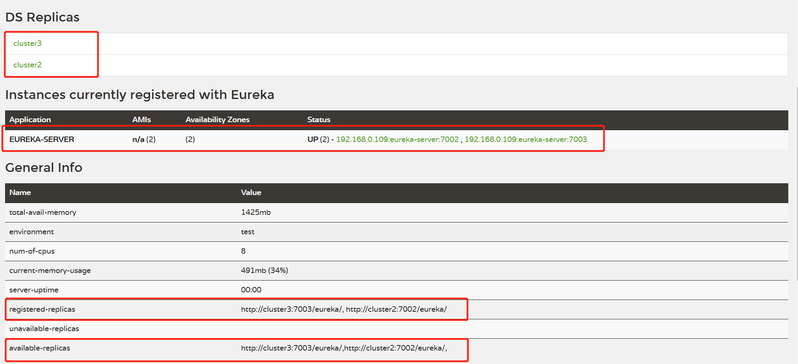

# 部署

## 服务端属性配置

### instance

org.springframework.cloud.netflix.eureka.EurekaInstanceConfigBean

| 参数名称                                                     | 说明                                                         | 默认值             |
| ------------------------------------------------------ | ------------------------------------------------------------ | ------------------ |
| eureka.instance.appname                                  | 注册到注册中心的应用名称                                     | unknown            |
| eureka.instance.a-s-g-name                                   | 注册到注册中心的应用所属分组名称（AWS服务器）                | null               |
| eureka.instance.app-group-name                           | 注册到注册中心的应用所属分组名称                             | null               |
| eureka.instance.data-center-info                         | 指定服务实例所属数据中心                                     |                    |
| eureka.instance.instance-enabled-onit                    | 指示是否应在eureka注册后立即启用实例以获取流量               | false              |
| eureka.instance.non-secure-port                          | http通信端口                                                 | 80                 |
| eureka.instance.non-secure-port-enabled                  | 是否启用HTTP通信端口                                         | ture               |
| eureka.instance.secure-port                              | HTTPS通信端口                                                | 443                |
| eureka.instance.secure-port-enabled                      | 是否启用HTTPS通信端口                                        | false              |
| eureka.instance.secure-virtual-host-name                 | 服务实例安全主机名称（HTTPS）                                | unknown            |
| eureka.instance.virtual-host-name                        | 该服务实例非安全注解名称（HTTP）                             | unknown            |
| eureka.instance.secure-health-check-url                  | 该服务实例安全健康检查地址（URL），绝对地址                  |                    |
| eureka.instance.lease-renewal-interval-in-seconds        | 该服务实例向注册中心发送心跳间隔（s）                        | 30                 |
| eureka.instance.lease-expiration-duration-in-seconds     | 指示eureka服务器在删除此实例之前收到最后一次心跳之后等待的时间（s） | 90                 |
| eureka.instance.metadata-map.\*                          |                                                              |                    |
| eureka.instance.ip-address                               | 该服务实例的IP地址                                           | null               |
| eureka.instance.prefer-ip-address                        | 是否优先使用服务实例的IP地址，相较于hostname                 | false              |
| eureka.instance.status-page-url                          | 该服务实例的状态检查地址（url），绝对地址                    | null               |
| eureka.instance.status-page-url-path                     | 该服务实例的状态检查地址，相对地址                           | /actuator/info |
| eureka.instance.home-page-url                            | 该服务实例的主页地址（url），绝对地址                        |                    |
| eureka.instance.home-page-url-path                       | 该服务实例的主页地址，相对地址                               | /                  |
| eureka.instance.health-check-url                         | 该服务实例的健康检查地址（url），绝对地址                    | null               |
| eureka.instance.health-check-url-path                    | 该服务实例的健康检查地址，相对地址                           | /actuator/health   |
| eureka.instance.instance-id                              | 该服务实例在注册中心的唯一实例ID                             |                    |
| eureka.instance.hostname                                 | 该服务实例所在主机名                                         |                    |
| eureka.instance.namespace                                | 获取用于查找属性的命名空间。 在Spring Cloud中被忽略。        | eureka         |
| eureka.instance.environment                              | 该服务实例环境配置                                           |                    |
| eureka.instance.default-address-resolution-order         | 默认地址解析顺序                                             |                    |
| eureka.instance.initial-status                           | 该服务实例注册到Eureka Server 的初始状态                     | up                 |
| eureka.instance.registry.default-open-for-traffic-count  | 【Eureka Server 端属性】默认开启通信的数量                   | 1                  |
| eureka.instance.registry.expected-number-of-renews-per-min | 【Eureka Server 端属性】每分钟续约次数                       | 1                  |

### server

org.springframework.cloud.netflix.eureka.server.EurekaServerConfigBean

| 参数名称                                                     | 说明                                                         | 默认值 |
| :----------------------------------------------------------- | ------------------------------------------------------------ | -----: |
| eureka.server.enable-self-preservation                   | 启用自我保护机制，默认为true                                 |   true |
| eureka.server.eviction-interval-timer-in-ms              | 清除无效服务实例的时间间隔（ms），默认1分钟                  |  60000 |
| eureka.server.delta-retention-timer-interval-in-ms       | 清理无效增量信息的时间间隔（ms），默认30秒                   |  30000 |
| eureka.server.disable-delta                              | 禁用增量获取服务实例信息                                     |  false |
| eureka.server.log-identity-headers                       | 是否记录登录日志                                             |   true |
| eureka.server.rate-limiter-burst-size                    | 限流大小                                                     |     10 |
| eureka.server.rate-limiter-enabled                       | 是否启用限流                                                 |  false |
| eureka.server.rate-limiter-full-fetch-average-rate       | 平均请求速率                                                 |    100 |
| eureka.server.rate-limiter-throttle-standard-clients     | 是否对标准客户端进行限流                                     |  false |
| eureka.server.rate-limiter-registry-fetch-average-rate   | 服务注册与拉取的平均速率                                     |    500 |
| eureka.server.rate-limiter-privileged-clients            | 信任的客户端列表                                             |        |
| eureka.server.renewal-percent-threshold                  | 15分钟内续约服务的比例小于0.85，则开启自我保护机制，再此期间不会清除已注册的任何服务（即便是无效服务） |   0.85 |
| eureka.server.renewal-threshold-update-interval-ms       | 更新续约阈值的间隔（分钟），默认15分钟                       |     15 |
| eureka.server.response-cache-auto-expiration-in-seconds  | 注册信息缓存有效时长（s），默认180秒                         |    180 |
| eureka.server.response-cache-update-interval-ms          | 注册信息缓存更新间隔（s），默认30秒                          |     30 |
| eureka.server.retention-time-in-m-s-in-delta-queue       | 保留增量信息时长（分钟），默认3分钟                          |      3 |
| eureka.server.sync-when-timestamp-differs                | 当时间戳不一致时，是否进行同步                               |   true |
| eureka.server.use-read-only-response-cache               | 是否使用只读缓存策略                                         |   true |
| 自定义工具设置                                               |                                                              |        |
| eureka.server.json-codec-name                            | Json编解码器名称                                             |        |
| eureka.server.property-resolver                          | 属性解析器名称                                               |        |
| eureka.server.xml-codec-name                             | Xml编解码器名称                                              |        |
| Eureka Server 集群配置                                       |                                                              |        |
| eureka.server.enable-replicated-request-compression      | 复制数据请求时，数据是否压缩                                 |  false |
| eureka.server.batch-replication                          | 节点之间数据复制是否采用批处理                               |  false |
| eureka.server.max-elements-in-peer-replication-pool      | 备份池最大备份事件数量，默认1000                             |   1000 |
| eureka.server.max-elements-in-status-replication-pool    | 状态备份池最大备份事件数量，默认1000                         |   1000 |
| eureka.server.max-idle-thread-age-in-minutes-for-peer-replication | 节点之间信息同步线程最大空闲时间（分钟）                     |     15 |
| eureka.server.max-idle-thread-in-minutes-age-for-status-replication | 节点之间状态同步线程最大空闲时间（分钟）                     |     10 |
| eureka.server.max-threads-for-peer-replication           | 节点之间信息同步最大线程数量                                 |     20 |
| eureka.server.max-threads-for-status-replication         | 节点之间状态同步最大线程数量                                 |      1 |
| eureka.server.max-time-for-replication                   | 节点之间信息复制最大通信时长（ms）                           |  30000 |
| eureka.server.min-available-instances-for-peer-replication | 集群中服务实例最小数量，-1 表示单节点                        |     -1 |
| eureka.server.min-threads-for-peer-replication           | 节点之间信息复制最小线程数量                                 |      5 |
| eureka.server.min-threads-for-status-replication         | 节点之间信息状态同步最小线程数量                             |      1 |
| eureka.server.number-of-replication-retries              | 节点之间数据复制时，可重试次数                               |      5 |
| eureka.server.peer-eureka-nodes-update-interval-ms       | 节点更新数据间隔时长（分钟）                                 |     10 |
| eureka.server.peer-eureka-status-refresh-time-interval-ms | 节点之间状态刷新间隔时长（ms）                               |  30000 |
| eureka.server.peer-node-connect-timeout-ms               | 节点之间连接超时时长（ms）                                   |    200 |
| eureka.server.peer-node-connection-idle-timeout-seconds  | 节点之间连接后，空闲时长（s）                                |     30 |
| eureka.server.peer-node-read-timeout-ms                  | 几点之间数据读取超时时间（ms）                               |    200 |
| eureka.server.peer-node-total-connections                | 集群中节点连接总数                                           |   1000 |
| eureka.server.peer-node-total-connections-per-host       | 节点之间连接，单机最大连接数量                               |    500 |
| eureka.server.registry-sync-retries                      | 节点启动时，尝试获取注册信息的次数                           |    500 |
| eureka.server.registry-sync-retry-wait-ms                | 节点启动时，尝试获取注册信息的间隔时长（ms）                 |  30000 |
| eureka.server.wait-time-in-ms-when-sync-empty            | 在Eureka服务器获取不到集群里对等服务器上的实例时，需要等待的时间（分钟） |      5 |

## 单机

### 依赖

```xml
<?xml version="1.0" encoding="UTF-8"?>
<project xmlns="http://maven.apache.org/POM/4.0.0" xmlns:xsi="http://www.w3.org/2001/XMLSchema-instance"
         xsi:schemaLocation="http://maven.apache.org/POM/4.0.0 https://maven.apache.org/xsd/maven-4.0.0.xsd">
    <modelVersion>4.0.0</modelVersion>
    <parent>
        <groupId>org.springframework.boot</groupId>
        <artifactId>spring-boot-starter-parent</artifactId>
        <version>2.3.0.RELEASE</version>
        <relativePath/> <!-- lookup parent from repository -->
    </parent>
    <groupId>com.lcm.test</groupId>
    <artifactId>eureka-server</artifactId>
    <version>0.0.1</version>
    <name>eureka-server</name>
    <description>eureka 注册中心</description>

    <properties>
        <java.version>1.8</java.version>
        <project.build.sourceEncoding>UTF-8</project.build.sourceEncoding>
        <project.reporting.outputEncoding>UTF-8</project.reporting.outputEncoding>
        <spring-cloud.version>Hoxton.SR4</spring-cloud.version>
    </properties>

    <dependencies>
        <dependency>
            <groupId>org.springframework.cloud</groupId>
            <artifactId>spring-cloud-starter-netflix-eureka-server</artifactId>
        </dependency>

        <dependency>
            <groupId>org.springframework.boot</groupId>
            <artifactId>spring-boot-starter-test</artifactId>
            <scope>test</scope>
            <exclusions>
                <exclusion>
                    <groupId>org.junit.vintage</groupId>
                    <artifactId>junit-vintage-engine</artifactId>
                </exclusion>
            </exclusions>
        </dependency>
    </dependencies>

    <dependencyManagement>
        <dependencies>
            <dependency>
                <groupId>org.springframework.cloud</groupId>
                <artifactId>spring-cloud-dependencies</artifactId>
                <version>${spring-cloud.version}</version>
                <type>pom</type>
                <scope>import</scope>
            </dependency>
        </dependencies>
    </dependencyManagement>

    <build>
        <plugins>
            <plugin>
                <groupId>org.springframework.boot</groupId>
                <artifactId>spring-boot-maven-plugin</artifactId>
            </plugin>
        </plugins>
    </build>

</project>
```

### 属性配置

```yml
spring:
  application:
    name: eureka-server

server:
  port: 7000

eureka:
  instance:
    hostname: eureka-server
  client:
    #表示是否将自己注册到 Eureka Server，默认为 true。
    register-with-eureka: false
    #表示是否从 Eureka Server 获取注册信息，默认为 true。
    fetch-registry: false
    service-url:
      #设置与 Eureka Server 交互的地址，查询服务和注册服务都需要依赖这个地址。
      #默认是 http://localhost:8761/eureka ；多个地址可使用英文逗号（,）分隔。
      defaultZone: http://localhost:7000/eureka/
```

### @EnableEurekaServer

```java
@EnableEurekaServer
@SpringBootApplication
public class EurekaServerApplication {

    public static void main(String[] args) {
        SpringApplication.run(EurekaServerApplication.class, args);
    }

}
```

## 集群

因为是单机部署三台实例，需要修改host，代表三个不同的hostname。



节点1

```yml
server:
  port: 7001

eureka:
  instance:
    hostname: cluster1
  client:
    #表示是否将自己注册到 Eureka Server，默认为 true。
    register-with-eureka: true
    #表示是否从 Eureka Server 获取注册信息，默认为 true。
    fetch-registry: true
    service-url:
      #设置与 Eureka Server 交互的地址，查询服务和注册服务都需要依赖这个地址。
      #默认是 http://localhost:8761/eureka ；多个地址可使用英文逗号（,）分隔。
      defaultZone: http://cluster2:7002/eureka/,http://cluster3:7003/eureka/
```

节点2

```yml
server:
  port: 7002

eureka:
  instance:
    hostname: cluster2
  client:
    #表示是否将自己注册到 Eureka Server，默认为 true。
    register-with-eureka: true
    #表示是否从 Eureka Server 获取注册信息，默认为 true。
    fetch-registry: true
    service-url:
      #设置与 Eureka Server 交互的地址，查询服务和注册服务都需要依赖这个地址。
      #默认是 http://localhost:8761/eureka ；多个地址可使用英文逗号（,）分隔。
      defaultZone: http://cluster1:7001/eureka/,http://cluster3:7003/eureka/
```

节点3

```yml
server:
  port: 7003

eureka:
  instance:
    hostname: cluster3
  client:
    #表示是否将自己注册到 Eureka Server，默认为 true。
    register-with-eureka: true
    #表示是否从 Eureka Server 获取注册信息，默认为 true。
    fetch-registry: true
    service-url:
      #设置与 Eureka Server 交互的地址，查询服务和注册服务都需要依赖这个地址。
      #默认是 http://localhost:8761/eureka ；多个地址可使用英文逗号（,）分隔。
      defaultZone: http://cluster1:7001/eureka/,http://cluster2:7002/eureka/
```


# 服务发现

## 客户端属性配置

org.springframework.cloud.netflix.eureka.EurekaClientConfigBean

| 参数名称                                                 | 说明                                                     | 默认值 |
| :----------------------------------------------------------- | ------------------------------------------------------------ | -----: |
| eureka.client.enabled                                    | 用于指示Eureka客户端已启用的标志                             | true       |
| eureka.client.registry-fetch-interval-seconds            | 指示从eureka服务器获取注册表信息的频率（s）                  | 30         |
| eureka.client.instance-info-replication-interval-seconds | 更新实例信息的变化到Eureka服务端的间隔时间，（s）            | 30         |
| eureka.client.initial-instance-info-replication-interval-seconds | 初始化实例信息到Eureka服务端的间隔时间，（s）                | 40         |
| eureka.client.eureka-service-url-poll-interval-seconds   | 询问Eureka Server信息变化的时间间隔（s），默认为300秒        | 300        |
| eureka.client.eureka-server-read-timeout-seconds         | 读取Eureka Server 超时时间（s），默认8秒                     | 8          |
| eureka.client.eureka-server-connect-timeout-seconds      | 连接Eureka Server 超时时间（s），默认5秒                     | 5          |
| eureka.client.eureka-server-total-connections            | 获取从eureka客户端到所有eureka服务器的连接总数,默认200个     | 200        |
| eureka.client.eureka-server-total-connections-per-host   | 获取从eureka客户端到eureka服务器主机允许的连接总数，默认50个 | 50         |
| eureka.client.eureka-connection-idle-timeout-seconds     | 连接到 Eureka Server 空闲连接的超时时间（s），默认30         | 30         |
| eureka.client.registry-refresh-single-vip-address        | 指示客户端是否仅对单个VIP的注册表信息感兴趣，默认为null      | null       |
| eureka.client.heartbeat-executor-thread-pool-size        | 心跳保持线程池初始化线程数，默认2个                          | 2          |
| eureka.client.heartbeat-executor-exponential-back-off-bound | 心跳超时重试延迟时间的最大乘数值，默认10                     | 10         |
| eureka.client.serviceUrl.defaultZone                     | 可用区域映射到与eureka服务器通信的完全限定URL列表。每个值可以是单个URL或逗号分隔的备用位置列表。(http://${eureka.instance.hostname}:${server.port}/eureka/) |            |
| eureka.client.use-dns-for-fetching-service-urls          | 指示eureka客户端是否应使用DNS机制来获取要与之通信的eureka服务器列表。当DNS名称更新为具有其他服务器时，eureka客户端轮询eurekaServiceUrlPollIntervalSeconds中指定的信息后立即使用该信息。 | false      |
| eureka.client.register-with-eureka                       | 指示此实例是否应将其信息注册到eureka服务器以供其他服务发现，默认为false | True       |
| eureka.client.prefer-same-zone-eureka                    | 实例是否使用同一zone里的eureka服务器，默认为true，理想状态下，eureka客户端与服务端是在同一zone下 | true       |
| eureka.client.log-delta-diff                             | 是否记录eureka服务器和客户端之间在注册表的信息方面的差异，默认为false | false      |
| eureka.client.disable-delta                              | 指示eureka客户端是否禁用增量提取                             | false      |
| eureka.client.fetch-remote-regions-registry              | 逗号分隔的区域列表，提取eureka注册表信息                     |            |
| eureka.client.on-demand-update-status-change             | 客户端的状态更新到远程服务器上，默认为true                   | true       |
| eureka.client.allow-redirects                            | 指示服务器是否可以将客户端请求重定向到备份服务器/集群。如果设置为false，则服务器将直接处理请求。如果设置为true，则可以将HTTP重定向发送到具有新服务器位置的客户端。 | false      |
| eureka.client.availability-zones.\*                      | 获取此实例所在区域的可用区域列表（在AWS数据中心中使用）。更改在运行时在registryFetchIntervalSeconds指定的下一个注册表获取周期生效。 |            |
| eureka.client.backup-registry-impl                       | 获取实现BackupRegistry的实现的名称，该实现仅在eureka客户端启动时第一次作为后备选项获取注册表信息。 对于需要额外的注册表信息弹性的应用程序，可能需要这样做，否则它将无法运行。 |            |
| eureka.client.cache-refresh-executor-exponential-back-off-bound | 在发生一系列超时的情况下，它是重试延迟的最大乘数值。         | 10         |
| eureka.client.cache-refresh-executor-thread-pool-size    | 缓存刷新线程池初始化线程数量                                 | 2          |
| eureka.client.client-data-accept                         | 客户端数据接收的名称                                         | full       |
| eureka.client.decoder-name                               | 解码器名称                                                   |            |
| eureka.client.dollar-replacement                         | eureka服务器序列化/反序列化的信息中获取“$”符号的替换字符串。默认为“_-” |            |
| eureka.client.encoder-name                               | *编码器名称*                                                 |            |
| eureka.client.escape-char-replacement                    | eureka服务器序列化/反序列化的信息中获取“_”符号的的替换字符串。默认为“__“ |            |
| eureka.client.eureka-server-d-n-s-name                   | 获取要查询的DNS名称来获得eureka服务器，此配置只有在eureka服务器ip地址列表是在DNS中才会用到。默认为null | null       |
| eureka.client.eureka-server-port                         | 获取eureka服务器的端口，此配置只有在eureka服务器ip地址列表是在DNS中才会用到。默认为null | null       |
| eureka.client.eureka-server-u-r-l-context                | 表示eureka注册中心的路径，如果配置为eureka，则为[http://ip:port/eureka/](http://ip/eureka/)，  			在eureka的配置文件中加入此配置表示eureka作为客户端向注册中心注册，从而构成eureka集群。此配置只有在eureka服务器ip地址列表是在DNS中才会用到，默认为null | null       |
| eureka.client.fetch-registry                             | *客户端是否获取eureka服务器注册表上的注册信息，默认为true*   | true       |
| eureka.client.filter-only-up-instances                   | 是否过滤掉非up实例，默认为true                               | true       |
| eureka.client.g-zip-content                              | 当服务端支持压缩的情况下，是否支持从服务端获取的信息进行压缩。默认为true |            |
| eureka.client.property-resolver                          | 属性解析器                                                   |            |
| eureka.client.proxy-host                                 | 获取eureka server 的代理主机名                               | null       |
| eureka.client.proxy-password                             | 获取eureka server 的代理主机密码                             | null       |
| eureka.client.proxy-port                                 | 获取eureka server 的代理主机端口                             | null       |
| eureka.client.proxy-user-name                            | 获取eureka server 的代理用户名                               | null       |
| eureka.client.region                                     | 获取此实例所在的区域（在AWS数据中心中使用）。                | us-east-1  |
| eureka.client.should-enforce-registration-at-init        | client 在初始化阶段是否强行注册到注册中心                    | false      |
| eureka.client.should-unregister-on-shutdown              | client在shutdown情况下，是否显示从注册中心注销               | true       |


## 服务方

### 依赖

```xml
<dependency>
    <groupId>org.springframework.boot</groupId>
    <artifactId>spring-boot-starter-web</artifactId>
</dependency>

<dependency>
    <groupId>org.springframework.cloud</groupId>
    <artifactId>spring-cloud-starter-netflix-eureka-client</artifactId>
</dependency>
```

### 属性配置

```yml
server:
  port: 8000
  servlet:
    context-path: /eureka/producer

spring:
  application:
    name: eureka-producer
  # jackson时间格式化
  jackson:
    time-zone: GMT+8
    date-format: yyyy-MM-dd HH:mm:ss
    default-property-inclusion: always

eureka:
  client:
    service-url:
      defaultZone: http://localhost:7000/eureka/
```

### 接口

```java
@RestController
public class ProducerController {

    @PostMapping("get")
    Producer producer(@RequestBody ProducerRequestBody body){
        Producer producer=new Producer();
        producer.setData("test");
        producer.setName(body.getName());
        producer.setTime(new Date());
        return producer;
    }

}
```

## 调用方

### 依赖

增加feign依赖

```xml
<dependency>
    <groupId>org.springframework.cloud</groupId>
    <artifactId>spring-cloud-starter-openfeign</artifactId>
</dependency>
```

### 属性配置

```yml
server:
  port: 8001
  servlet:
    context-path: /eureka/consumer

spring:
  application:
    name: eureka-consumer
  # jackson时间格式化
  jackson:
    time-zone: GMT+8
    date-format: yyyy-MM-dd HH:mm:ss
    default-property-inclusion: always

eureka:
  client:
    service-url:
      defaultZone: http://localhost:7000/eureka/
```

### feign远程调用

#### 开启feign客户端

```java
@EnableFeignClients
@SpringBootApplication
public class EurekaConsumerApplication {

    public static void main(String[] args) {
        SpringApplication.run(EurekaConsumerApplication.class, args);
    }

}
```

#### feign调用

```java
@FeignClient(name = "eureka-producer")
public interface ProducerService {

    @PostMapping("/eureka/producer/get")
    Producer get(@RequestBody ProducerRequestBody body);

}
```

### 接口

```java
@RestController
public class ConsumerController {

    @Autowired
    ProducerService producerService;

    @PostMapping("get")
    Producer get(){
        ProducerRequestBody body=new ProducerRequestBody();
        body.setName("lcm");
        body.setTime(new Date());
        Producer producer = producerService.get(body);
        return producer;
    }

}
```